## BP85958P Buck参考设计

## (0.5mH. -12V/500mA)

时间：2023年2月

## 内容

BP85958P简介  
电源规格  
电路图  
PCB Layout  
BOM  
性能测试数据  
重要声明

## BP85958P简介

集成650V高压MOSFET  
集成输出电压采样  
集成高压启动和自供电电路  
无需外部补偿电路  
低待机功耗50mW@230Vac  
固定12V输出  
改善EMI性能的频率调制技术  
丰富的保护功能

应用领域：

小家电辅助电源  
电机驱动辅助电源  
➢ IOT/智能家居/智能照明

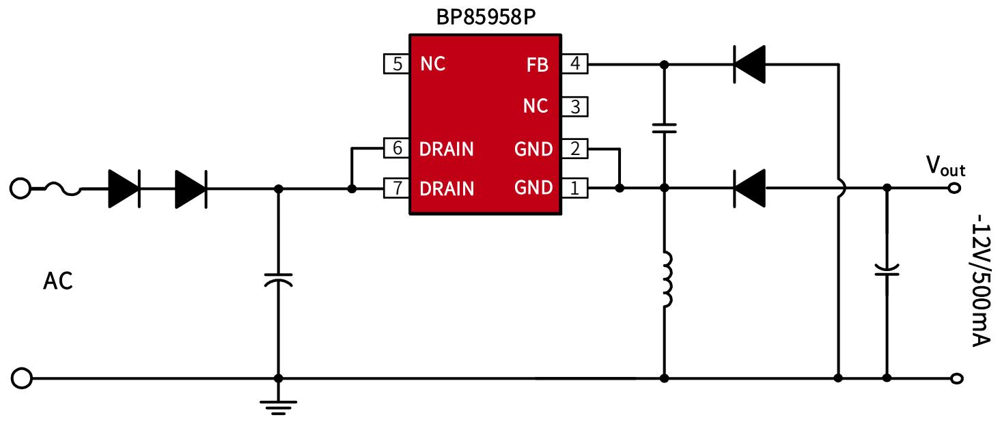

<table><tr><td>项目描述</td><td>符号</td><td>最小</td><td>典型</td><td>最大</td><td>单位</td><td>备注</td></tr><tr><td colspan="7">输入</td></tr><tr><td>电压</td><td> $V_{IN}$ </td><td>85</td><td></td><td>265</td><td> $V_{AC}$ </td><td></td></tr><tr><td>频率</td><td> $f_{LINE}$ </td><td>47</td><td>50/60</td><td>63</td><td>Hz</td><td></td></tr><tr><td colspan="7">输出</td></tr><tr><td>输出电压</td><td> $V_{OUT}$ </td><td>11.4</td><td>12</td><td>12.6</td><td>V</td><td>±5%</td></tr><tr><td>输出电流</td><td> $I_{OUT}$ </td><td>400</td><td>500</td><td></td><td>mA</td><td></td></tr><tr><td>输出电压纹波</td><td> $V_{RIPPLE}$ </td><td></td><td></td><td>240</td><td>mV</td><td>稳态,20MHz带宽</td></tr><tr><td colspan="7">效率</td></tr><tr><td>待机功耗</td><td> $P_{STDBY}$ </td><td></td><td></td><td>50</td><td>mW</td><td>Vin=230VAC</td></tr><tr><td>满载效率</td><td>n</td><td>72.3</td><td></td><td></td><td>%</td><td></td></tr><tr><td colspan="7">环境</td></tr><tr><td>传导EMI</td><td></td><td colspan="4">满足EN55022 Class B</td><td></td></tr><tr><td>Surge</td><td></td><td></td><td></td><td>2</td><td>kV</td><td></td></tr><tr><td>工作环境温度</td><td> $T_{AMP}$ </td><td></td><td>50</td><td></td><td>°C</td><td></td></tr></table>

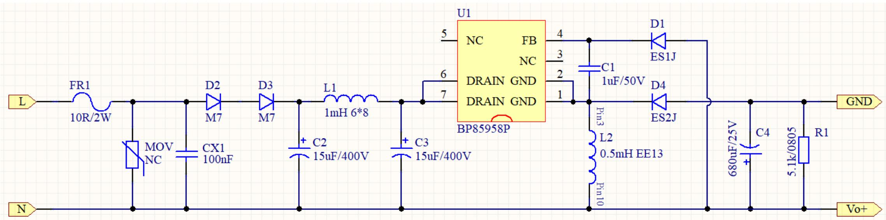

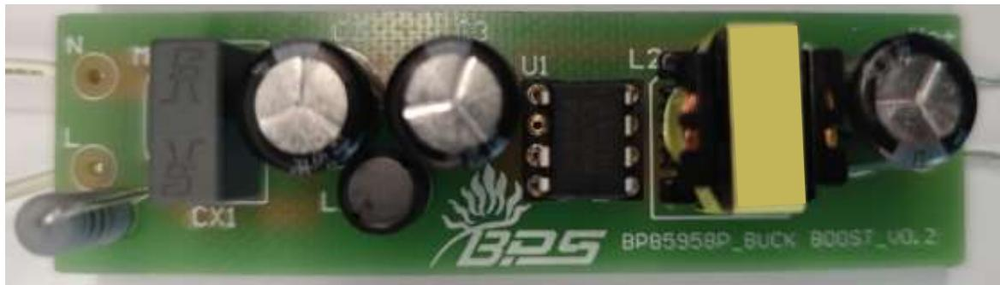

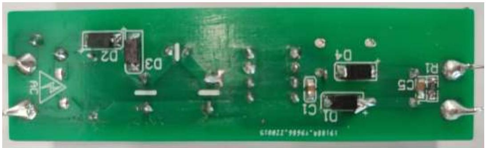

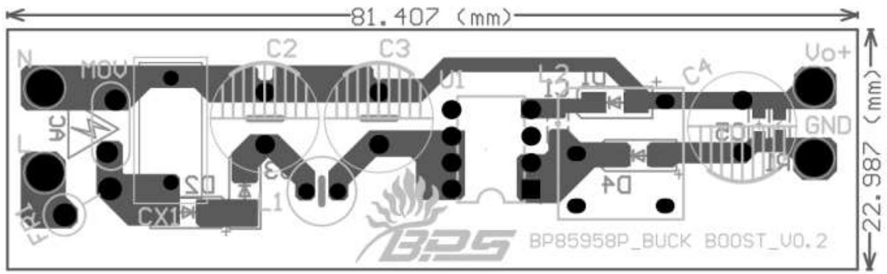

<table><tr><td>序号</td><td>原件标号</td><td>参数</td><td>描述</td><td>数量</td></tr><tr><td>1</td><td>FR1</td><td>2W, 10R绕线电阻</td><td>绕线电阻</td><td>1</td></tr><tr><td>2</td><td>CX1</td><td>100nF, X1</td><td>X电容</td><td>1</td></tr><tr><td>3</td><td>D2、D3</td><td>M7, 1A/1000V</td><td>贴片二极管</td><td>2</td></tr><tr><td>4</td><td>C2, C3</td><td>15uF/400V</td><td>电解电容</td><td>1</td></tr><tr><td>5</td><td>D1</td><td>ES1J, 1A/600V</td><td>贴片二极管</td><td>1</td></tr><tr><td>6</td><td>D4</td><td>ES2J, 2A/600V</td><td>贴片二极管</td><td>1</td></tr><tr><td>7</td><td>L1</td><td>1mH</td><td>工字电感</td><td>1</td></tr><tr><td>8</td><td>L2</td><td>0.5mH</td><td>EE13电感</td><td>1</td></tr><tr><td>9</td><td>U1</td><td>BP85958P</td><td>IC-DIP7</td><td>1</td></tr><tr><td>10</td><td>C1</td><td>1uF/50V</td><td>贴片电容</td><td>1</td></tr><tr><td>11</td><td>C4</td><td>680uF/25V</td><td>电解电容</td><td>1</td></tr><tr><td>12</td><td>R1</td><td>5.1K, ±5%</td><td>贴片电阻</td><td>1</td></tr><tr><td>总计</td><td></td><td></td><td></td><td>13</td></tr><tr><td colspan="5">待机功耗 (mW)</td></tr><tr><td>Vin(Vac)</td><td>85</td><td>115</td><td>230</td><td>265</td></tr><tr><td>#1</td><td>42</td><td>43</td><td>49</td><td>51</td></tr><tr><td>#2</td><td>42</td><td>43</td><td>48</td><td>52</td></tr><tr><td>#3</td><td>41</td><td>42</td><td>48</td><td>51</td></tr></table>

<table><tr><td> $V_{IN}(VAC)$ </td><td> $I_{OUT}(mA)$ </td><td> $P_{IN}(mW)$ </td><td> $V_{OUT}(V)$ </td><td> $P_{OUT}(mW)$ </td><td>Eff(%)</td></tr><tr><td>85</td><td>500</td><td>8.07</td><td>11.67</td><td>5.83</td><td>72.3%</td></tr><tr><td>115</td><td>500</td><td>7.59</td><td>11.69</td><td>5.84</td><td>77.0%</td></tr><tr><td>230</td><td>500</td><td>7.33</td><td>11.68</td><td>5.84</td><td>76.6%</td></tr><tr><td>265</td><td>500</td><td>7.34</td><td>11.68</td><td>5.84</td><td>79.5%</td></tr><tr><td> $V_{IN}(VAC)$  $I_{OUT}(mA)$ </td><td>85</td><td>115</td><td>230</td><td>265</td><td>线调整率</td></tr><tr><td>0</td><td>12.21</td><td>12.2</td><td>12.19</td><td>12.18</td><td>0.25%</td></tr><tr><td>100</td><td>11.84</td><td>11.84</td><td>11.85</td><td>11.85</td><td>0.08%</td></tr><tr><td>200</td><td>11.72</td><td>11.72</td><td>11.73</td><td>11.73</td><td>0.09%</td></tr><tr><td>300</td><td>11.64</td><td>11.64</td><td>11.65</td><td>11.65</td><td>0.09%</td></tr><tr><td>400</td><td>11.58</td><td>11.58</td><td>11.57</td><td>11.59</td><td>0.17%</td></tr><tr><td>500</td><td>11.55</td><td>11.55</td><td>11.55</td><td>11.54</td><td>0.09%</td></tr><tr><td>负载调整率</td><td>5.61%</td><td>5.53%</td><td>5.44%</td><td>5.44%</td><td></td></tr></table>

◼ 调整率计算方法：调整率=100%\*(最大值-最小值)/平均值

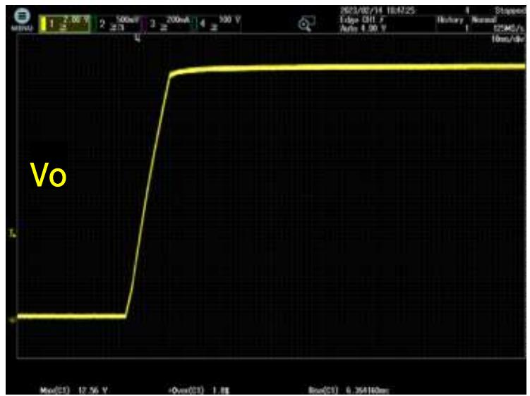

测试条件：  
➢ 85VAC  
➢ 空载  
测试结果：  
➢ Trise=6.4ms

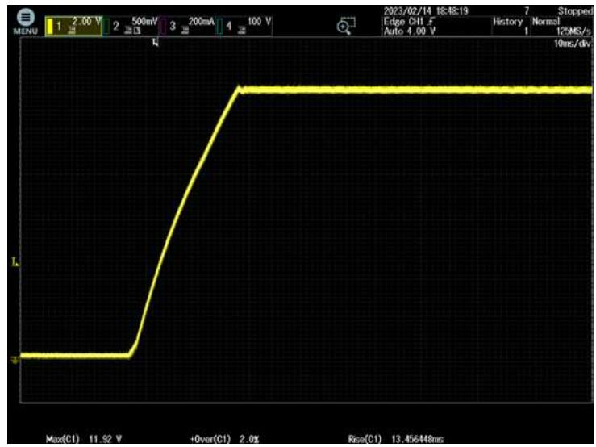

测试条件：  
➢ 85VAC  
➢ 500mA  
测试结果：  
➢ Trise= 13.5ms

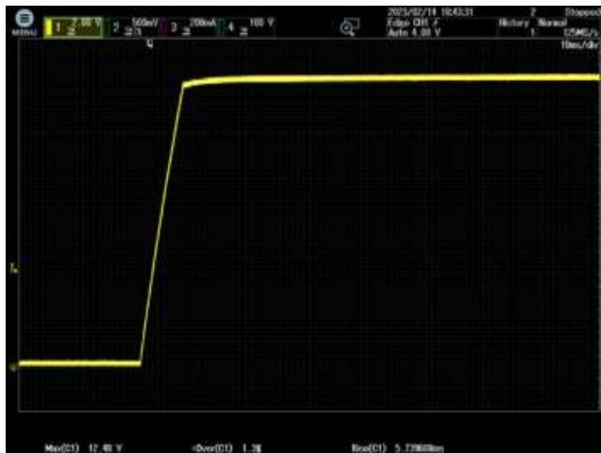

测试条件：  
➢ 265VAC  
➢ 空载  
测试结果：  
➢ Trise= 5.7ms

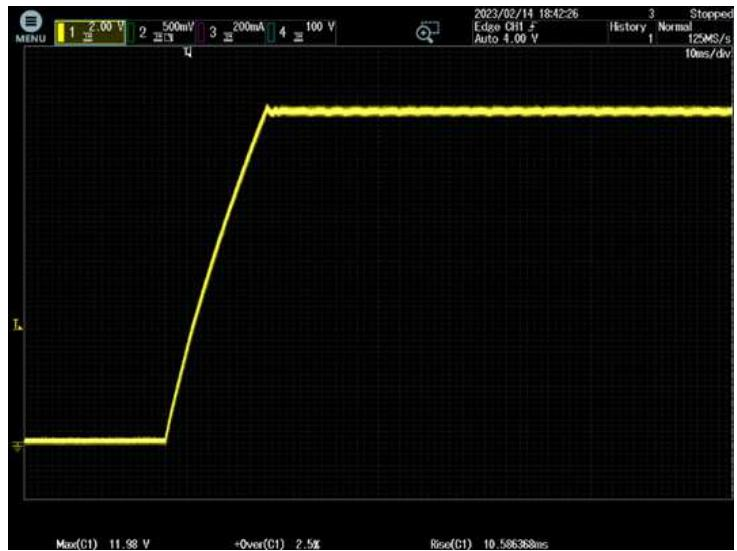

测试条件：  
➢ 265VAC  
➢ 50mA  
测试结果：  
➢ Trise= 10.6ms

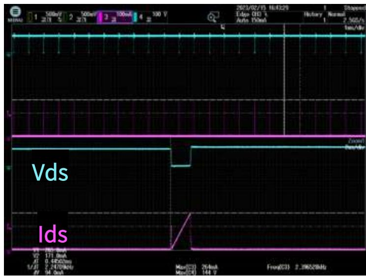

测试条件：  
➢ 85VAC  
➢ 空载  
测试结果：  
➢ 表现正常

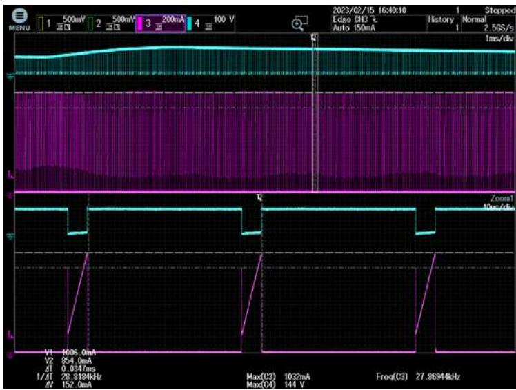

测试条件：  
➢ 85VAC  
➢ 500mA  
测试结果：  
➢ 表现正常

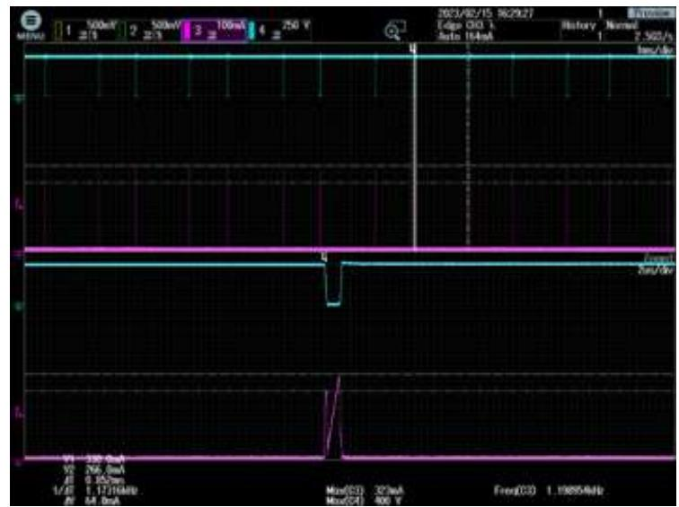

测试条件：  
➢ 265VAC  
➢ 空载  
测试结果：  
➢ 表现正常

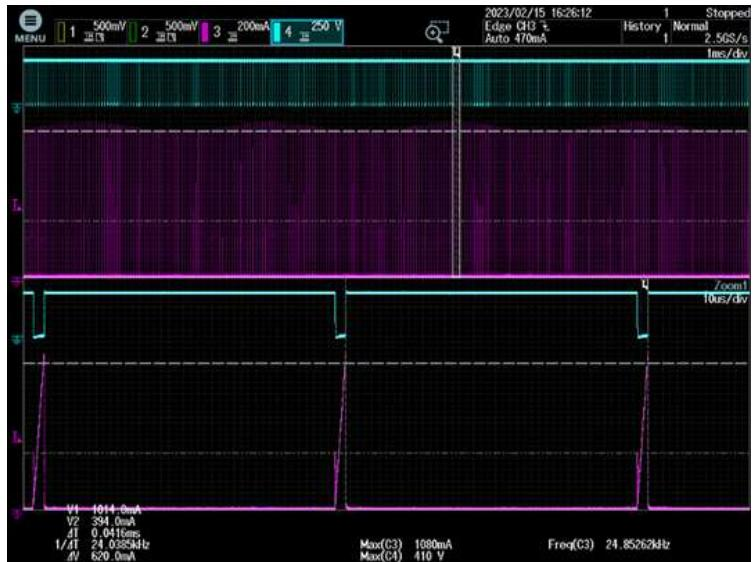

测试条件：  
➢ 265VAC  
➢ 500mA  
测试结果：  
➢ 表现正常

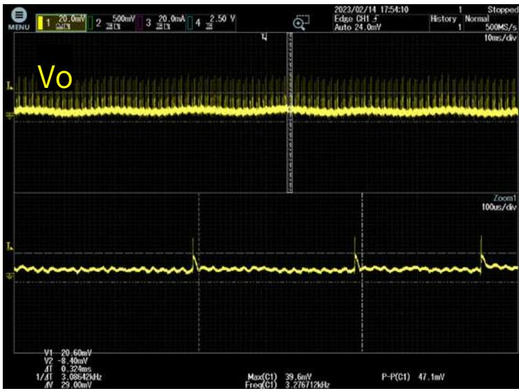

测试条件：  
➢ 85VAC ，  
➢ 空载  
测试结果：  
➢ $V _ { P K - P K } = 4 7 m V$

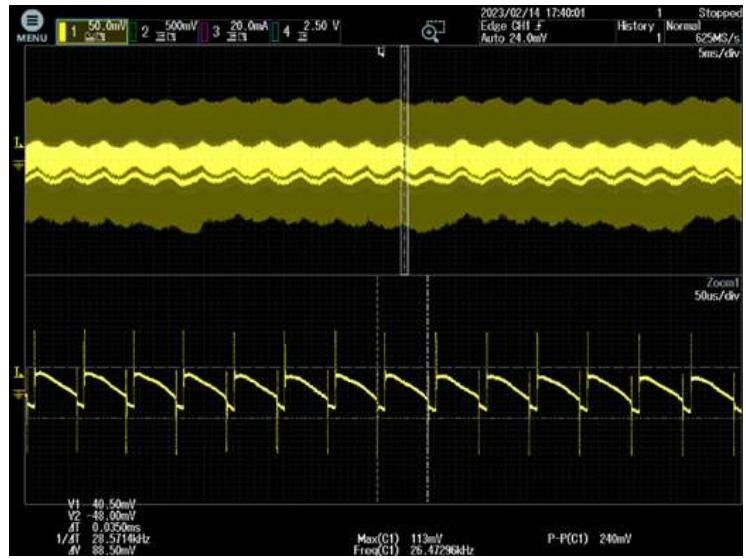

测试条件：  
➢ 85VAC ，  
➢ 500mA  
测试结果：  
➢ $V _ { P K - P K } = 2 4 0 m V$

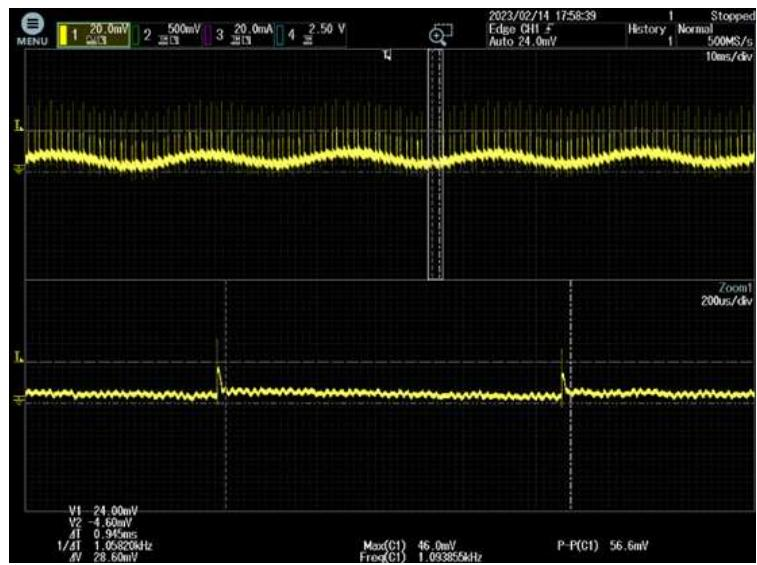

测试条件：  
➢ 265VAC ，  
➢ 空载  
测试结果：  
➢ $V _ { P K - P K } = 5 7 m V$

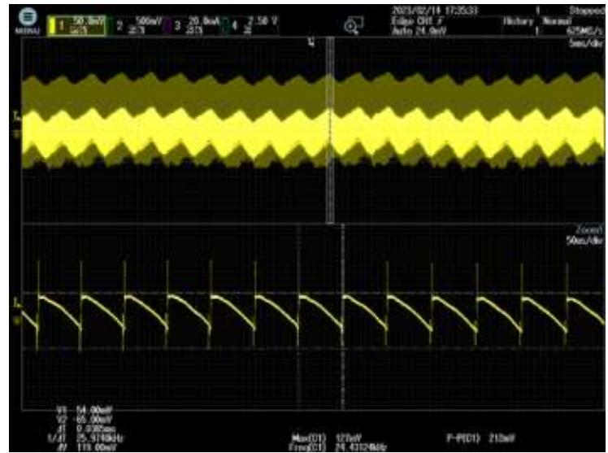

测试条件：  
➢ 265VAC ，  
➢ 500mA  
测试结果：  
➢ $V _ { P K - P K } = 2 1 2 m v$

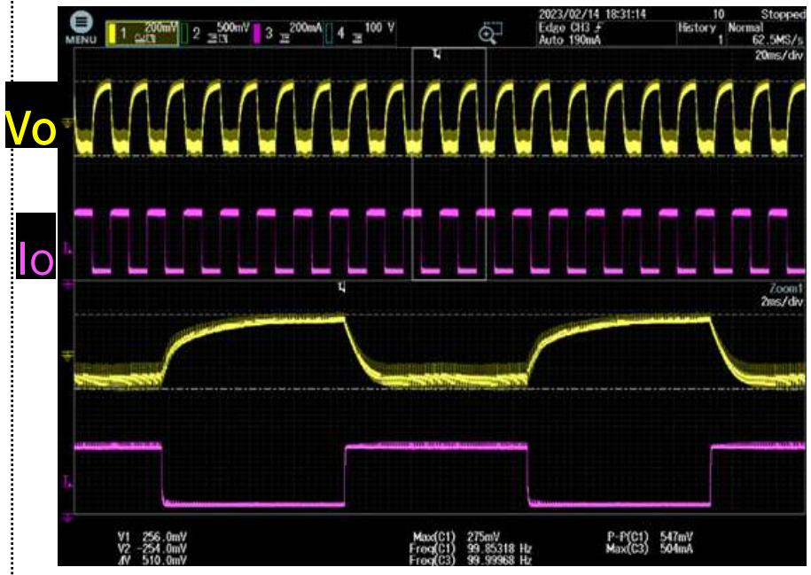

测试条件：  
➢ 85VAC  
跳载电流：50\~450mA  
跳载周期：5ms\~5ms  
跳载斜率：500mA/us  
测试结果：  
➢ VPK-PK=547mV

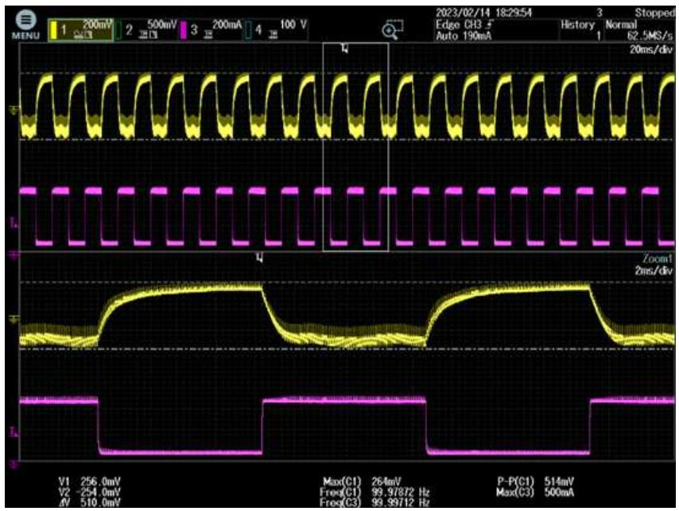

测试条件：  
➢ 265VAC  
跳载电流：50\~450mA  
跳载周期：5ms\~5ms  
跳载斜率：500mA/us  
测试结果：VPK-PK=514mV

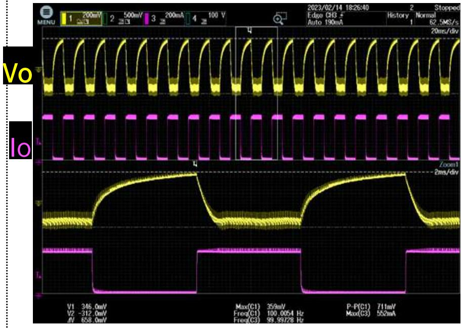

测试条件：  
➢ 85VAC  
跳载电流：0\~500mA  
跳载周期：5ms\~5ms  
跳载斜率：500mA/us  
测试结果：  
➢ $v _ { P K - P K }$ =711 mV

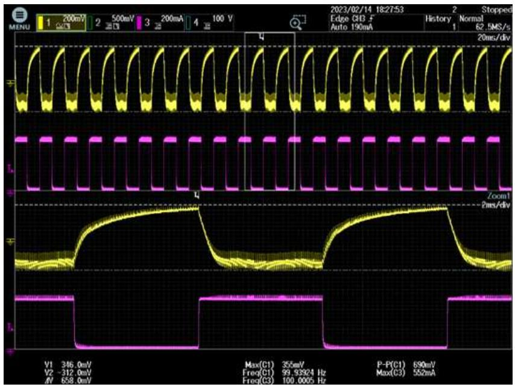

测试条件：  
➢ 265VAC  
跳载电流：0\~500mA  
跳载周期：5ms\~5ms  
跳载斜率：500mA/us  
测试结果：$v _ { P K - P K }$ =690mV

测试条件：  
➢ 85VAC ，输出短路  
测试结果：  
➢ 保护功能正常

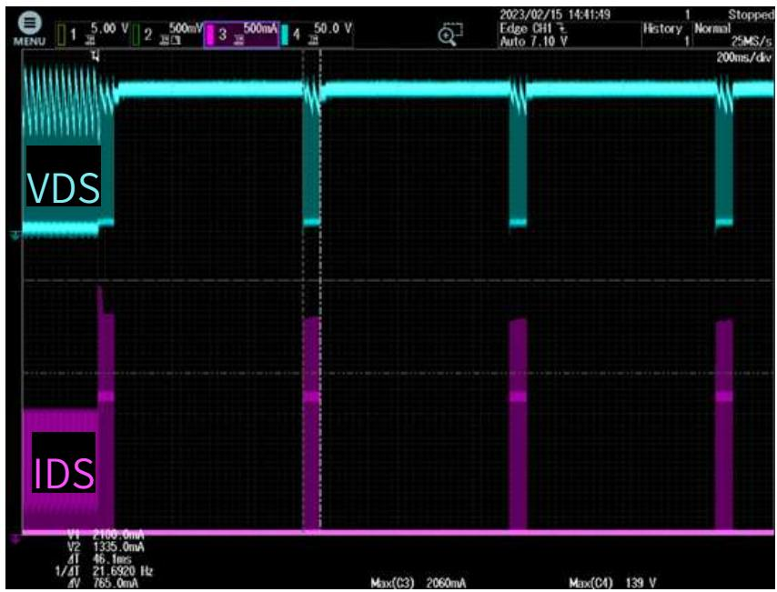

测试条件：  
➢ 265VAC ，输出短路  
测试结果：  
➢ 保护功能正常

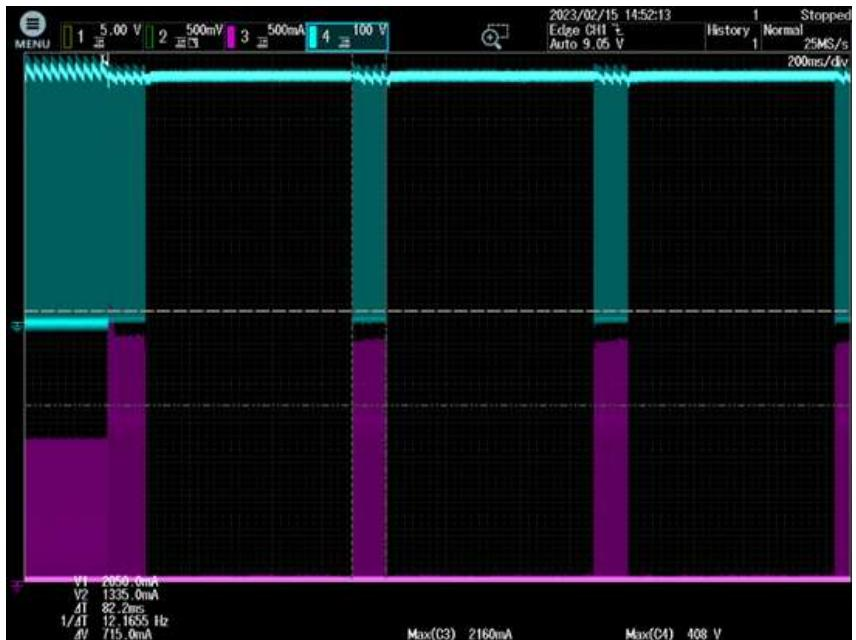

热电偶测温，50℃密闭环境. Io=500mA. L2=0.5mH

<table><tr><td> $V_{IN}(VAC)$ </td><td>Tr (°C)</td><td>Tc(°C)</td><td> $\Delta T(°C)$ </td></tr><tr><td>85</td><td>51.1</td><td>123.3</td><td>72.2</td></tr><tr><td>115</td><td>50.8</td><td>106.2</td><td>55.4</td></tr><tr><td>230</td><td>50.5</td><td>100.1</td><td>49.6</td></tr><tr><td>265</td><td>50.5</td><td>102.3</td><td>51.8</td></tr></table>

热电偶测温，50℃密闭环境. Io=450mA. L2=0.5mH

<table><tr><td> $V_{IN}(VAC)$ </td><td>Tr (°C)</td><td>Tc(°C)</td><td> $\Delta T(°C)$ </td></tr><tr><td>85</td><td>50.8</td><td>109.7</td><td>58.9</td></tr><tr><td>115</td><td>50.6</td><td>95.6</td><td>45</td></tr><tr><td>230</td><td>50.4</td><td>88.9</td><td>38.5</td></tr><tr><td>265</td><td>50.5</td><td>90.3</td><td>39.8</td></tr></table>

## 传导EMI

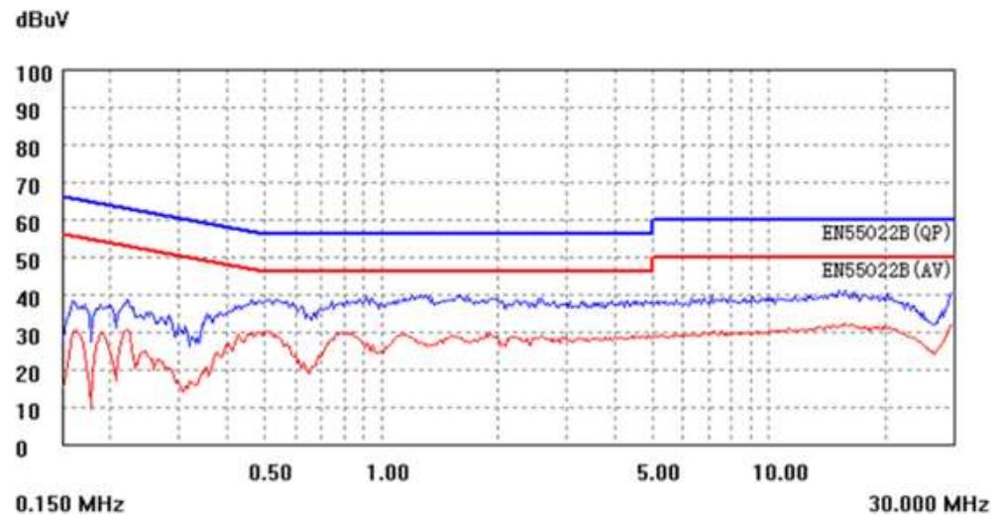

115VAC Line

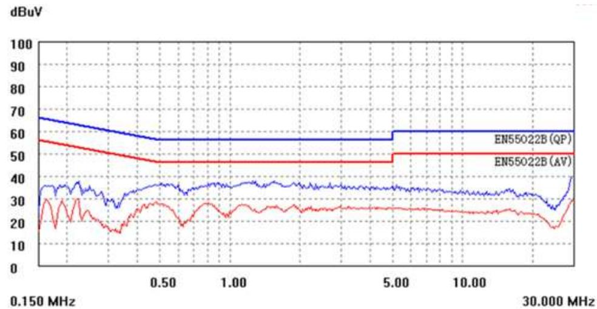

115VAC Neutral

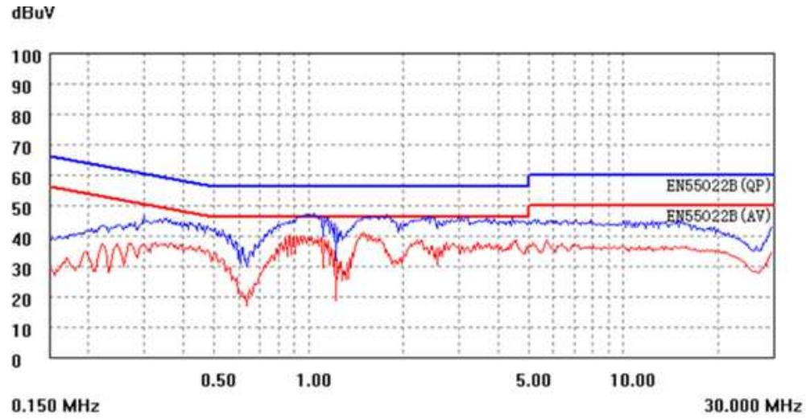

230VAC Line

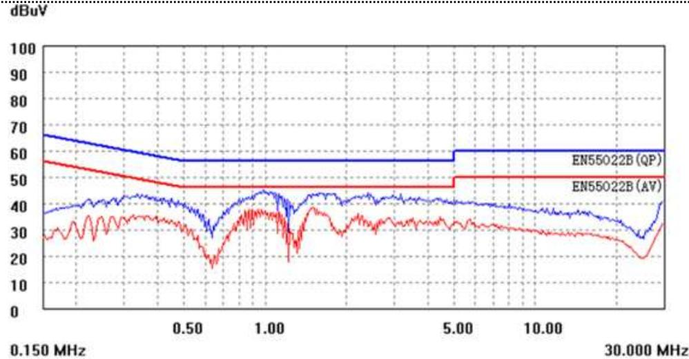

230VAC Neutral

## Surge浪涌测试

<table><tr><td>差模</td><td>电压</td><td>相位角</td><td>测试次数</td><td>测试结果</td></tr><tr><td>L to N</td><td>+2kV</td><td>0</td><td>10</td><td>Pass</td></tr><tr><td>L to N</td><td>-2kV</td><td>0</td><td>10</td><td>Pass</td></tr><tr><td>L to N</td><td>+2kV</td><td>90</td><td>10</td><td>Pass</td></tr><tr><td>L to N</td><td>-2kV</td><td>90</td><td>10</td><td>Pass</td></tr><tr><td>L to N</td><td>+2kV</td><td>180</td><td>10</td><td>Pass</td></tr><tr><td>L to N</td><td>-2kV</td><td>180</td><td>10</td><td>Pass</td></tr><tr><td>L to N</td><td>+2kV</td><td>270</td><td>10</td><td>Pass</td></tr><tr><td>L to N</td><td>-2kV</td><td>270</td><td>10</td><td>Pass</td></tr></table>

## 测试说明

➢ 按照GB/T17626.5和IEC61000-4-5的最新版本要求进行测试  
➢ 室温环境，230VAC输入，满载条件  
➢ 输入1.2/50us组合波浪涌电压  
➢ 每个测试点重复10次  
➢ 每次间隔时间1分钟  
➢ 试验时样机输出正常（符合A类标准）视为Pass

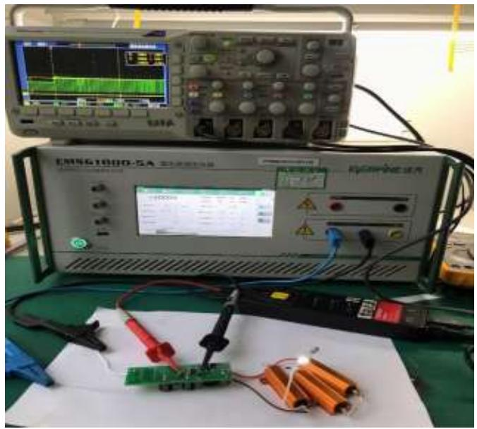

## 重要声明

本文档中的数据和信息仅供参考，不构成任何形式的建议、验收标准或保证。实际测试数据和结果可能同文档中列出的数据和结果存在差异，请用户自行确认产品的适用性。  
此文档测试的BP85958P样品未经CP/FT工序，后续根据批量数据可能微调某些参数，可能略影响性能表现。此文档供参考评估，最终性能表现请以量产版本芯片为准。

上海市浦东新区申江路5005弄星创科技广场3号楼9层

+86-21-51870166

sales@bpsemi.com

www.bpsemi.com

  
微信公众号

  
微信视频号
