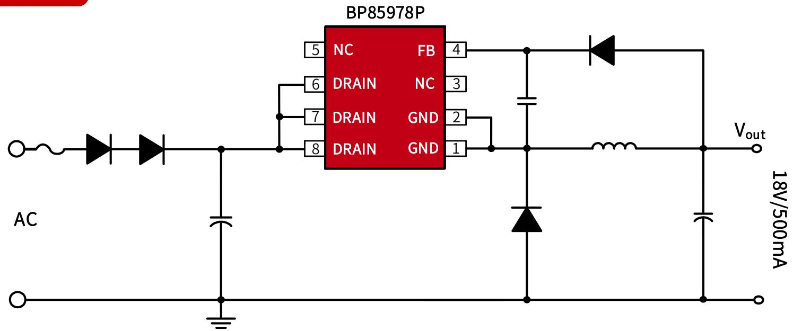
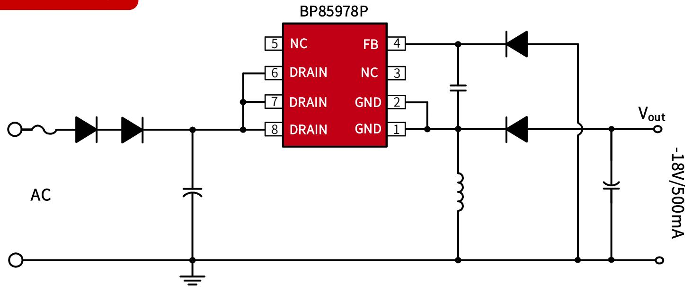
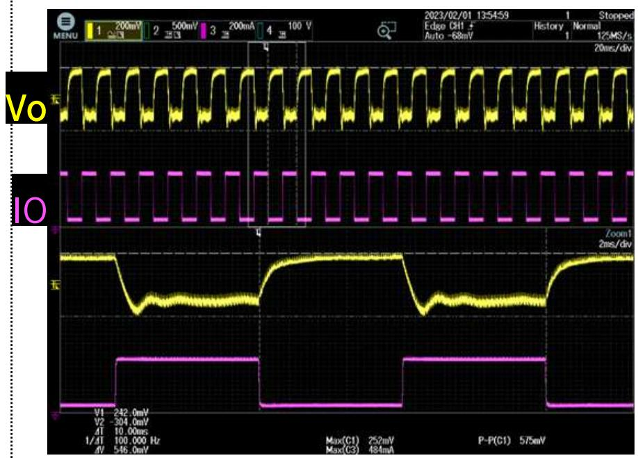
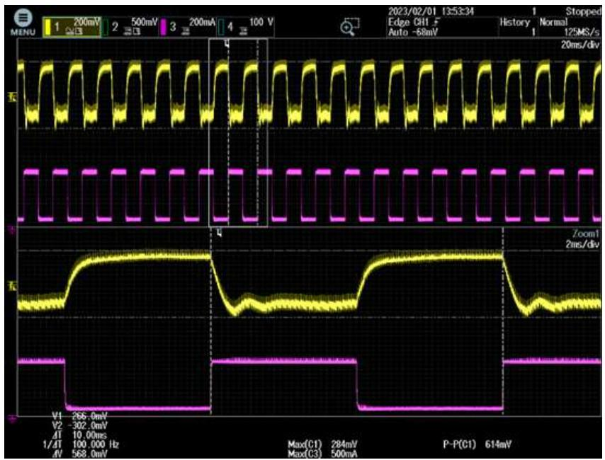
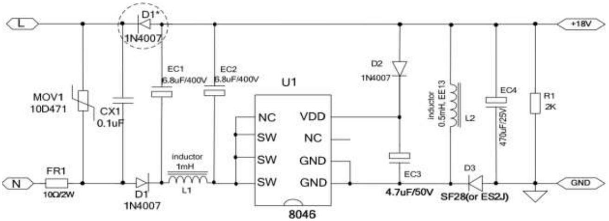
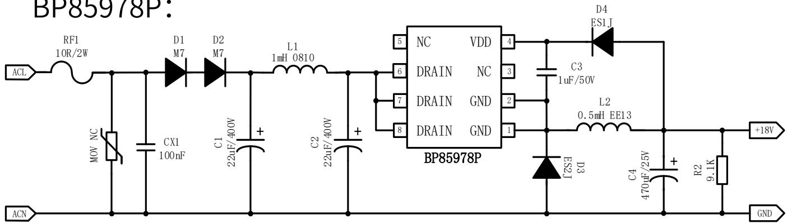

## 小家电

BP85978P ±18V500mA 降压芯片推广资料

时间：2023年2月

## 典型应用图（Buck）

## 产品特点

此文档的测试数据均基于Buck拓扑

内置650V高压MOS  
集成高压启动和自供电电路  
综合性能优，可靠性高

保护功能完善  
DIP8封装

## 典型应用图（Buck Boost）

## 产品规格与目标应用

产品规格

<table><tr><td>Part No.</td><td>输入电压</td><td>稳态功率</td><td>峰值功率</td></tr><tr><td rowspan="2">BP85978P</td><td>150~265VAC</td><td>9W(18V/500mA)</td><td>12.6W(18V/700mA)</td></tr><tr><td>85~265VAC</td><td>7.2W(18V/400mA)</td><td>10.8W(18V/600mA)</td></tr></table>

注：稳态功率在半封闭式75°C 环境下测试(Buck/Buck-boost 应用)，持续时间大于2小时。峰值功率在半封闭式75°C 环境下测试(Buck/Buck-boost 应用)，持续时间大于1分钟。

## 目标应用

小家电  
电机驱动辅助电源  
IOT/智能家居/智能照明

输出电压调整率

<table><tr><td> $V_{IN}(VAC)$  $I_{OUT}(mA)$ </td><td>85</td><td>115</td><td>230</td><td>265</td><td>线调整率</td></tr><tr><td>0</td><td>18.41</td><td>18.4</td><td>18.37</td><td>18.36</td><td>0.27%</td></tr><tr><td>100</td><td>17.95</td><td>17.95</td><td>17.96</td><td>17.96</td><td>0.06%</td></tr><tr><td>200</td><td>17.82</td><td>17.81</td><td>17.81</td><td>17.81</td><td>0.06%</td></tr><tr><td>300</td><td>17.73</td><td>17.72</td><td>17.73</td><td>17.73</td><td>0.06%</td></tr><tr><td>400</td><td>17.68</td><td>17.67</td><td>17.65</td><td>17.65</td><td>0.17%</td></tr><tr><td>500</td><td>17.65</td><td>17.65</td><td>17.63</td><td>17.63</td><td>0.11%</td></tr><tr><td>负载调整率</td><td>4.25%</td><td>4.2%</td><td>4.14%</td><td>4.09%</td><td></td></tr></table>

◼ 调整率计算方法：调整率=100%\*(最大值-最小值)/平均值

## 动态

测试条件：  
➢ 85VAC  
➢ 跳载电流：50\~450mA  
➢ 跳载周期：5ms\~5ms  
跳载斜率：500mA/us  
测试结果：VPK-PK=575mV

测试条件：  
➢ 265VAC  
跳载电流：50\~450mA  
跳载周期：5ms\~5ms  
跳载斜率：500mA/us  
测试结果：  
➢ VPK-PK=614mV

测试条件：10%\~90%动态负载

竞品XX8046方案：  

PD95078D:  

<table><tr><td>IC型号</td><td>XX8046</td><td>BP85978P</td></tr><tr><td>IC封装</td><td>DIP8</td><td>DIP8(引脚兼容)</td></tr><tr><td>带载能力</td><td>500mA</td><td>500mA</td></tr><tr><td>待机功耗@230Vac</td><td>70mW</td><td>60mW</td></tr><tr><td>BOM数量</td><td>15个</td><td>15个</td></tr><tr><td>动态输出纹波(10%~90%)</td><td>600mV</td><td>600mV</td></tr></table>

## 推广注意事项

◼ 输出电解电容建议470uF及以上（输出电容过小起机时Vo会出现振荡，竞品XX8046表现类似）。

上海市浦东新区申江路5005弄星创科技广场3号楼9层

+86-21-51870166

sales@bpsemi.com

www.bpsemi.com

  
微信公众号

  
微信视频号
