## BP86213D 参考设计

## (12V/1.2A)

上海晶丰明源半导体股份有限公司

Shanghai Bright Power Semiconductor Co., Ltd.

陈耀兵

2022 8 26

BP86213D  
电源规格  
电路图  
◼BOM  
◼PCB Layout  
电路实物图  
变压器规格书  
性能测试数据

## 产品特点:

➢ 650V MOSFET  
》集成高压启动、自供电电路  
》低待机功耗  
》集成输入欠压保护  
》内置软启动

## 应用领域:

》家用电器辅助电源  
➢ PC  
》适配器、充电器

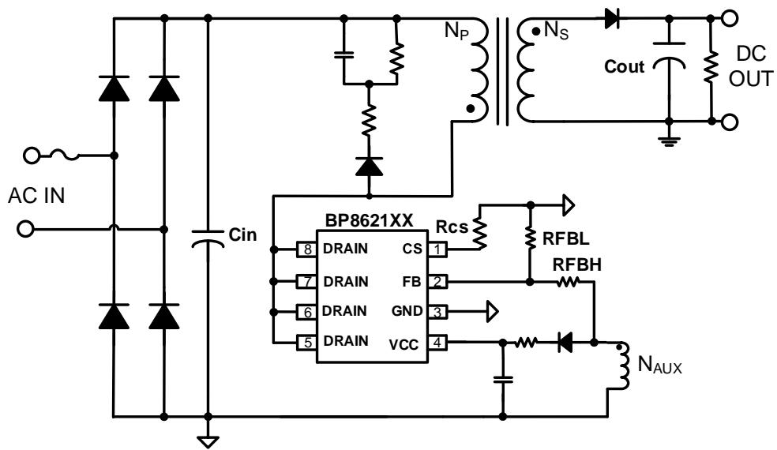

SOP-7

## 电源规格

<table><tr><td>项目描述</td><td>符号</td><td>最小</td><td>典型</td><td>最大</td><td>单位</td><td>备注</td></tr><tr><td colspan="7">输入</td></tr><tr><td>电压</td><td> $V_{IN}$ </td><td>176</td><td>230</td><td>264</td><td> $V_{AC}$ </td><td></td></tr><tr><td>频率</td><td> $f_{LINE}$ </td><td>47</td><td>50/60</td><td>63</td><td>Hz</td><td></td></tr><tr><td colspan="7">输出</td></tr><tr><td>输出电压</td><td> $V_{OUT}$ </td><td></td><td>12</td><td></td><td>V</td><td>±5%</td></tr><tr><td>输出电流</td><td> $I_{OUT}$ </td><td></td><td>1.2</td><td></td><td>A</td><td></td></tr><tr><td>输出电压纹波</td><td> $V_{RIPPLE}$ </td><td></td><td></td><td>300</td><td>mV</td><td>20MHz带宽</td></tr><tr><td>连续输出功率</td><td> $P_{OUT}$ </td><td></td><td>14.4</td><td></td><td>W</td><td></td></tr><tr><td colspan="7">效率</td></tr><tr><td>待机功耗</td><td> $P_{STDBY}$ </td><td></td><td></td><td>300</td><td>mW</td><td>230VAC</td></tr><tr><td>满载效率</td><td>η</td><td>81</td><td></td><td></td><td>%</td><td>230VAC</td></tr><tr><td colspan="7">环境</td></tr><tr><td>传导EMI</td><td></td><td colspan="4">满足CISPR22/EN55022 Class B,至少6dB 裕量</td><td></td></tr><tr><td>Surge</td><td></td><td></td><td>2</td><td></td><td>kV</td><td>差模</td></tr><tr><td>EFT</td><td></td><td></td><td>4</td><td></td><td>kV</td><td>5kHz/100kHz/38kHz</td></tr><tr><td>ESD</td><td></td><td></td><td>15</td><td></td><td>kV</td><td>接触8kV,空气15kV</td></tr><tr><td>工作环境温度</td><td> $T_{AMP}$ </td><td>0</td><td></td><td>40</td><td>°C</td><td></td></tr></table>

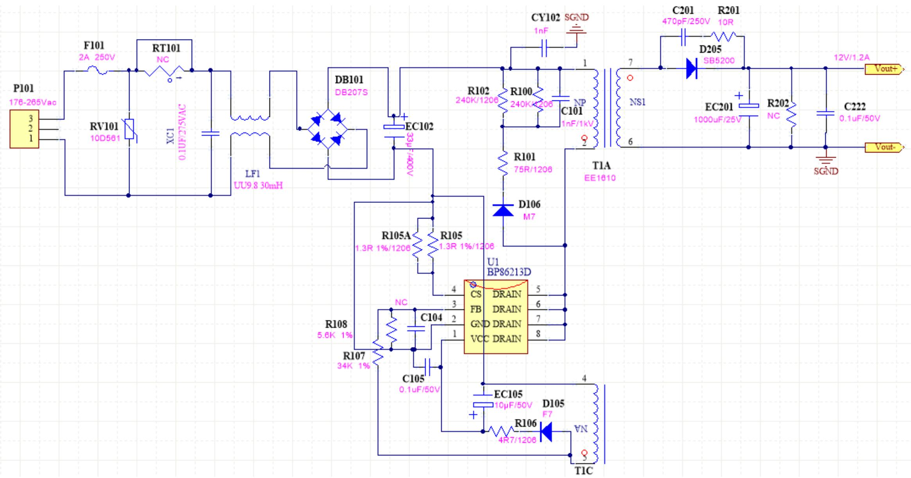

<table><tr><td>序号</td><td>元件标号</td><td>参数描述</td><td>封装尺寸</td><td>数量</td></tr><tr><td>1</td><td>C101</td><td>1nF/1kV</td><td>0603-C</td><td>1</td></tr><tr><td>2</td><td>C104</td><td>N/A</td><td>0603-C</td><td>1</td></tr><tr><td>3</td><td>C105</td><td>0.1μF/50V</td><td>0603-C</td><td>1</td></tr><tr><td>4</td><td>C201</td><td>470pF/250V</td><td>0805-C</td><td>1</td></tr><tr><td>5</td><td>C222</td><td>0.1uF/50V</td><td>0603-C</td><td>1</td></tr><tr><td>6</td><td>CY102</td><td>1nF</td><td>CY</td><td>1</td></tr><tr><td>7</td><td>D105</td><td>F7</td><td>SOD123</td><td>1</td></tr><tr><td>8</td><td>D106</td><td>M7</td><td>SOD123</td><td>1</td></tr><tr><td>9</td><td>D205</td><td>SB5200</td><td>SOD123</td><td>1</td></tr><tr><td>10</td><td>DB101</td><td>DB207S</td><td>DB-L-SMD</td><td>1</td></tr><tr><td>11</td><td>EC102</td><td>33μF/400V</td><td>C10</td><td>1</td></tr><tr><td>12</td><td>EC105</td><td>10μF/50V</td><td>C10</td><td>1</td></tr><tr><td>13</td><td>EC201</td><td>1000uF/25V</td><td>C5</td><td>1</td></tr><tr><td>14</td><td>F101</td><td>2A 250V</td><td>F-P5.0 1.6A</td><td>1</td></tr><tr><td>15</td><td>LF1</td><td>UU9.8 30mH</td><td>TRANS</td><td>1</td></tr><tr><td>16</td><td>R100, R102</td><td>240K/1206</td><td>0603-R</td><td>2</td></tr><tr><td>17</td><td>R101</td><td>75R/1206</td><td>0603-R</td><td>1</td></tr><tr><td>18</td><td>R105, R105A</td><td>1.3R 1%/1206</td><td>0603-R</td><td>2</td></tr><tr><td>19</td><td>R106</td><td>4R7/1206</td><td>0603-R</td><td>1</td></tr><tr><td>20</td><td>R107</td><td>34K 1%</td><td>0603-R</td><td>1</td></tr></table>

<table><tr><td>序号</td><td>元件标号</td><td>参数描述</td><td>封装尺寸</td><td>数量</td></tr><tr><td>21</td><td>R108</td><td>5.6K 1%</td><td>0603-R</td><td>1</td></tr><tr><td>22</td><td>R201</td><td>10R</td><td>0805-R</td><td>1</td></tr><tr><td>23</td><td>R202</td><td>NC</td><td>0603-R</td><td>1</td></tr><tr><td>24</td><td>RT101</td><td>NC</td><td>NTC-7.6X3-P5</td><td>1</td></tr><tr><td>25</td><td>RV101</td><td>10D561</td><td>RV-L12*5*7.5-1</td><td>1</td></tr><tr><td>26</td><td>T1</td><td>EE16</td><td>T-PQ2016-R</td><td>1</td></tr><tr><td>27</td><td>T101</td><td>EE1610</td><td>T-PQ2016-R</td><td>1</td></tr><tr><td>28</td><td>U105</td><td>BP86213D</td><td>ESOP-6D</td><td>1</td></tr><tr><td>29</td><td>XC1</td><td>0.1UF/275VAC</td><td>0.01UF(K)X2-1</td><td>1</td></tr></table>

## 电路实物图

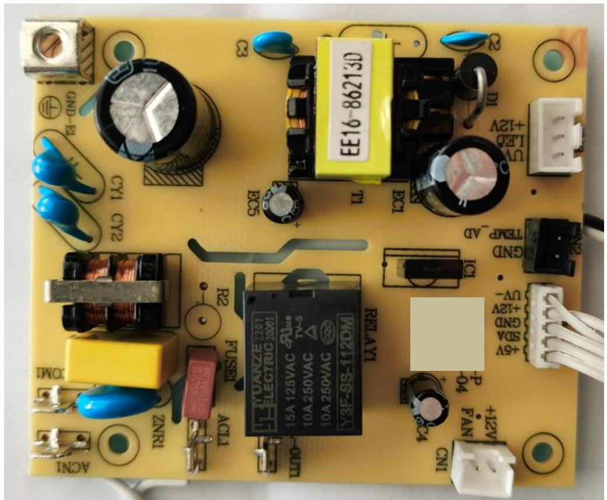

TOP SIDE

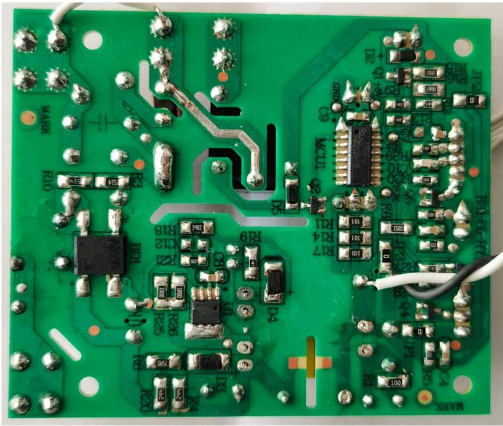

BOTTOM SIDE

## 原理图

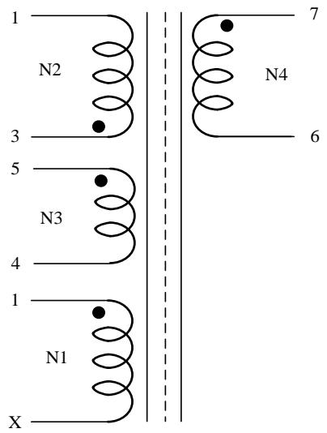

## 规格与材料

》初级绕组感量 $\mathsf { L } _ { \mathsf { p } } { = } 1 \mathsf { m } \mathsf { H } \pm 7 \%$ （测试条件：0.3V，50kHz)  
》漏感量 $L _ { 1 k } < 5 0 0 1 \dot { 1 }$  
》骨架：EE1610  
》磁芯：EE1610 PC40 或同等材质， $\mathsf { A e } { = } 3 7 . 9 \mathsf { m m } ^ { 2 }$  
》 N1、N2、N3:2UEW漆包线  
》N4:三层绝缘线  
》绝缘胶带:3M900或同等材质  
》耐压测试:3KV,50/60Hz,1Min  
》成品要求：浸凡立水

## 绕线方式

<table><tr><td>绕组</td><td>起始脚</td><td>终止脚</td><td>材料</td><td>匝数</td><td>绕线方式</td></tr><tr><td>N1</td><td>1</td><td>NC</td><td> $\phi 0.15*3P$ </td><td>15Ts</td><td>密绕一层(PIN脚朝外)</td></tr><tr><td colspan="4">胶带</td><td>2.1Ts</td><td></td></tr><tr><td>N2</td><td>3</td><td>1</td><td> $\phi 0.25*1P$ </td><td>87Ts</td><td>密绕三层(PIN脚朝外)</td></tr><tr><td colspan="4">胶带</td><td>2.1Ts</td><td></td></tr><tr><td>N3</td><td>5</td><td>4</td><td> $\phi 0.15*3P$ </td><td>15Ts</td><td>均匀绕一层(PIN脚朝外)</td></tr><tr><td colspan="4">胶带</td><td>2.1Ts</td><td></td></tr><tr><td>N4</td><td>7</td><td>6</td><td>三层绝缘线 $\phi 0.4*1P$ </td><td>13Ts</td><td>密绕一层(PIN脚朝外)</td></tr><tr><td colspan="4">胶带</td><td>3Ts</td><td></td></tr></table>

## 脚位图

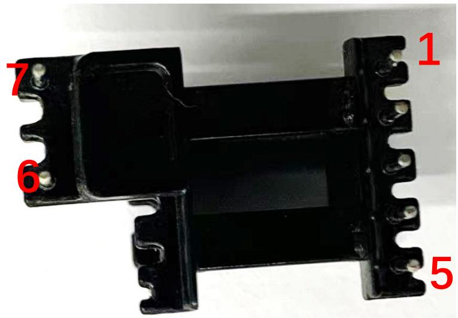

## 待机功耗

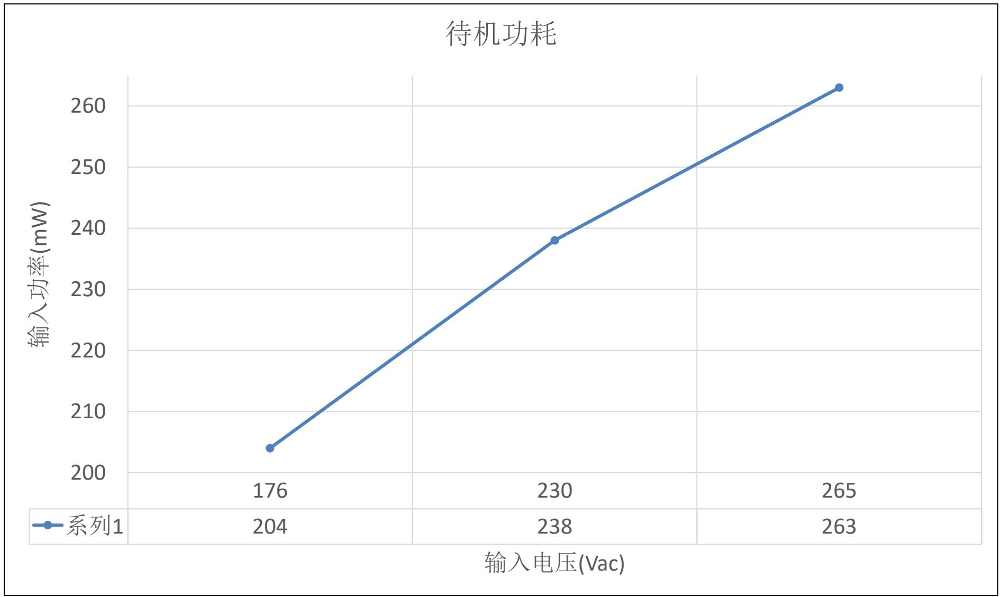

测试时未断开客户板上后端负载

效率曲线  
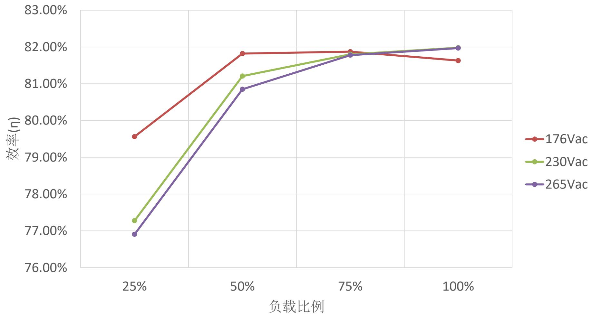

测试时未断开客户板上后端负载

<table><tr><td> $V_{IN}(VAC)$ </td><td>Load(%)</td><td> $P_{IN}(W)$ </td><td> $V_{OUT}(V)$ </td><td> $I_{OUT}(A)$ </td><td> $P_{OUT}(W)$ </td><td>Eff(%)</td><td>AVG Eff(%)</td></tr><tr><td rowspan="6">175</td><td>空载</td><td></td><td></td><td></td><td>0</td><td></td><td></td></tr><tr><td>10%</td><td>2.04</td><td>12.105</td><td>0.12</td><td>1.4526</td><td>71.21%</td><td></td></tr><tr><td>25%</td><td>4.57</td><td>12.12</td><td>0.3</td><td>3.636</td><td>79.56%</td><td rowspan="4">81.22%</td></tr><tr><td>50%</td><td>8.92</td><td>12.164</td><td>0.6</td><td>7.2984</td><td>81.82%</td></tr><tr><td>75%</td><td>13.43</td><td>12.217</td><td>0.9</td><td>10.9953</td><td>81.87%</td></tr><tr><td>100%</td><td>18.02</td><td>12.258</td><td>1.2</td><td>14.7096</td><td>81.63%</td></tr><tr><td rowspan="6">230</td><td>空载</td><td></td><td></td><td></td><td>0</td><td></td><td></td></tr><tr><td>10%</td><td>2.12</td><td>12.045</td><td>0.12</td><td>1.4454</td><td>68.18%</td><td></td></tr><tr><td>25%</td><td>4.65</td><td>11.978</td><td>0.3</td><td>3.5934</td><td>77.28%</td><td rowspan="4">80.57%</td></tr><tr><td>50%</td><td>8.94</td><td>12.1</td><td>0.6</td><td>7.26</td><td>81.21%</td></tr><tr><td>75%</td><td>13.39</td><td>12.17</td><td>0.9</td><td>10.953</td><td>81.80%</td></tr><tr><td>100%</td><td>17.89</td><td>12.222</td><td>1.2</td><td>14.6664</td><td>81.98%</td></tr><tr><td rowspan="6">265</td><td>空载</td><td></td><td></td><td></td><td>0</td><td></td><td></td></tr><tr><td>10%</td><td>2.19</td><td>12.095</td><td>0.12</td><td>1.4514</td><td>66.27%</td><td></td></tr><tr><td>25%</td><td>4.72</td><td>12.1</td><td>0.3</td><td>3.63</td><td>76.91%</td><td rowspan="4">80.38%</td></tr><tr><td>50%</td><td>9.01</td><td>12.141</td><td>0.6</td><td>7.2846</td><td>80.85%</td></tr><tr><td>75%</td><td>13.43</td><td>12.203</td><td>0.9</td><td>10.9827</td><td>81.78%</td></tr><tr><td>100%</td><td>17.91</td><td>12.234</td><td>1.2</td><td>14.6808</td><td>81.97%</td></tr></table>

测试时未断开客户板上后端负载

## 输出电压调整率

<table><tr><td> $V_{IN}(VAC)$  $I_{OUT}(A)$ </td><td>176</td><td>230</td><td>265</td><td>平均值</td><td>线调整率</td></tr><tr><td>0</td><td>12.025</td><td>12.024</td><td>12.024</td><td>12.02</td><td>0.01%</td></tr><tr><td>20%</td><td>12.026</td><td>12.026</td><td>12.022</td><td>12.02</td><td>0.03%</td></tr><tr><td>40%</td><td>12.06</td><td>12.063</td><td>12.064</td><td>12.06</td><td>0.03%</td></tr><tr><td>60%</td><td>12.117</td><td>12.114</td><td>12.108</td><td>12.11</td><td>0.07%</td></tr><tr><td>80%</td><td>12.142</td><td>12.159</td><td>12.168</td><td>12.16</td><td>0.21%</td></tr><tr><td>100%</td><td>12.09</td><td>12.214</td><td>12.208</td><td>12.17</td><td>1.02%</td></tr><tr><td>平均值</td><td>12.08</td><td>12.10</td><td>12.10</td><td></td><td></td></tr><tr><td>负载调整率</td><td>0.97%</td><td>1.57%</td><td>1.54%</td><td></td><td></td></tr></table>

◼ 计算方法：调整率=100%\*(最大值-最小值)/平均值  
测试时未断开客户板上后端负载

<table><tr><td> $V_{\text{IN}}(\text{VAC})$ Vout(V)</td><td>176</td><td>230</td><td>264</td></tr><tr><td>CV11V</td><td>1.425A</td><td>1.424A</td><td>1.424A</td></tr></table>

电子负载设置CV11V条件下测试

## 输出电压纹波

20MHz带宽，去掉示波器探头正端夹子和地线环，10uF/50V 0.1uF/50V

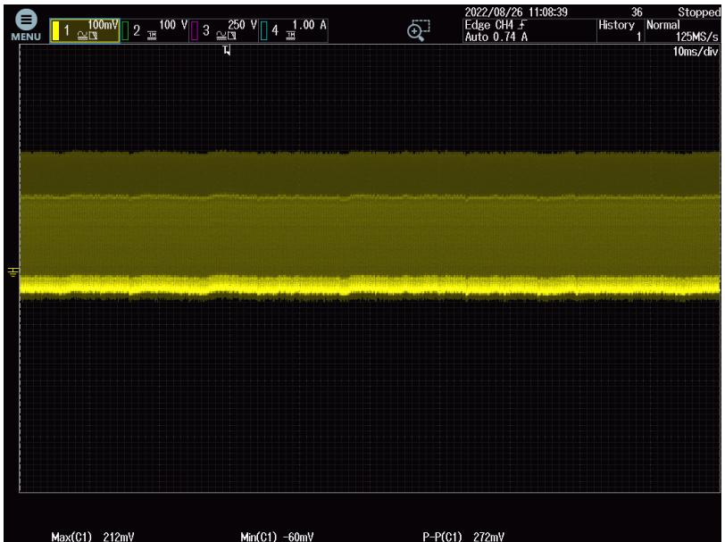

## 176 VAC

$\begin{array} { l } { \mathsf { C H 1 V _ { o u \intercal } } } \\ { \mathsf { R i p p l e } } \end{array}$ CH1 VOUT $V _ { P K - P K } = 2 7 2 m v$

## Test Condition:

➢ Full Load

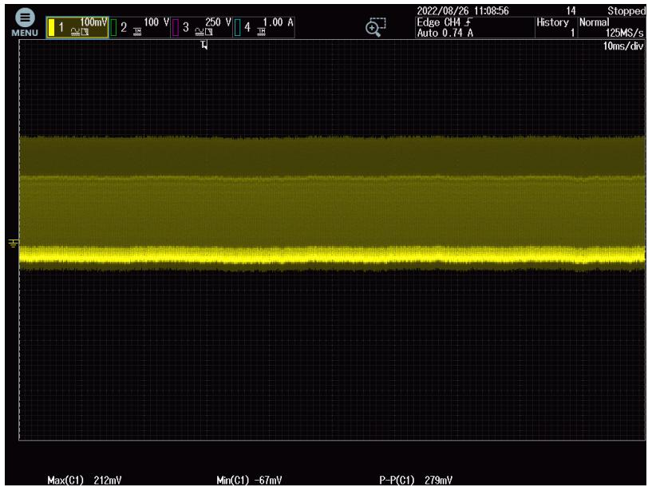

## 230 VAC

${ \mathsf { C H 1 } } { \mathsf { V } } _ { \mathsf { O U T } }$ CH1 VOUT Ripple $V _ { P K - P K } = 2 7 9 m v$

## Test Condition:

➢ Full Load

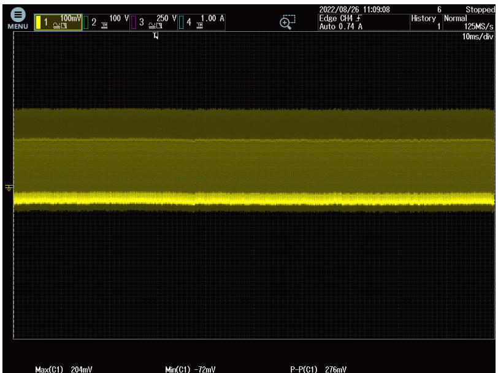

## 265 $\mathsf { v } _ { \mathsf { A C } }$

CH1 VOUT $\mathsf { V } _ { \mathsf { O U T } }$ Ripple $V _ { P K - P K } = 2 7 6 m v$

## Test Condition:

➢ Full Load

## (50%-100%)

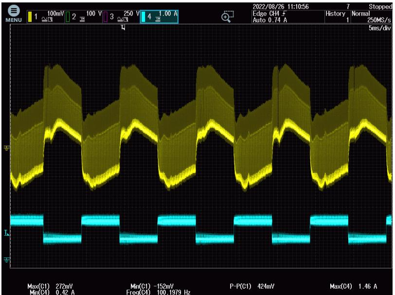

## 176 VAC

CH1 VOUT ${ \mathsf { C H 1 } } { \mathsf { V } } _ { \mathsf { O U T } }$ $V _ { P K - P K } = 4 2 4 m v$  
$\mathsf { C H 4 } \mathsf { I } _ { \mathsf { O U T } }$

## Test Condition:

➢ $0 . 6 \mathsf { A } – 1 . 2 \mathsf { A } – 0 . 6 \mathsf { A }$  
➢ Slew Rate: 0.5 A/μS  
➢ Frequency: 100 Hz

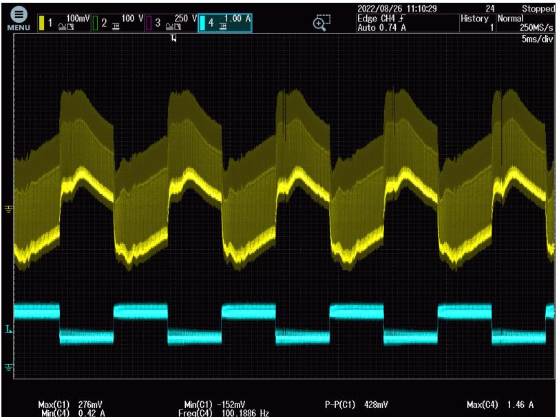

## 265 VAC

CH1 VOUT ${ \mathsf { C H 1 } } { \mathsf { V } } _ { \mathsf { O U T } }$ $v _ { p _ { k - P K } } = 4 2 8 ~ \mathsf { m V }$  
$\mathsf { C H 4 } \mathsf { l } _ { \mathsf { O U T } }$

## Test Condition:

➢ $0 . 6 \mathsf { A } – 1 . 2 \mathsf { A } – 0 . 6 \mathsf { A }$  
➢ Slew Rate: 0.5 A/μS  
➢ Frequency: 100 Hz

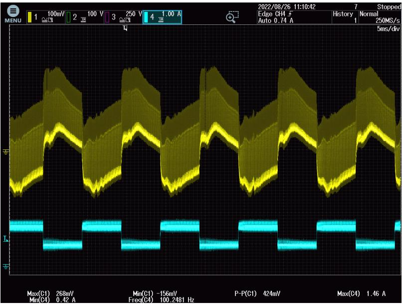

## 230 VAC

CH1 VOUT ${ \mathsf { C H 1 } } { \mathsf { V } } _ { \mathsf { O U T } }$ $V _ { p | c - P K } = 4 2 4 m v$  
$\mathsf { C H 4 } \mathsf { I } _ { \mathsf { O U T } }$

## Test Condition:

➢ $0 . 6 \mathsf { A } – 1 . 2 \mathsf { A } – 0 . 6 \mathsf { A }$  
➢ Slew Rate: 0.5 A/μS  
➢ Frequency: 100 Hz

## (10%-90%)

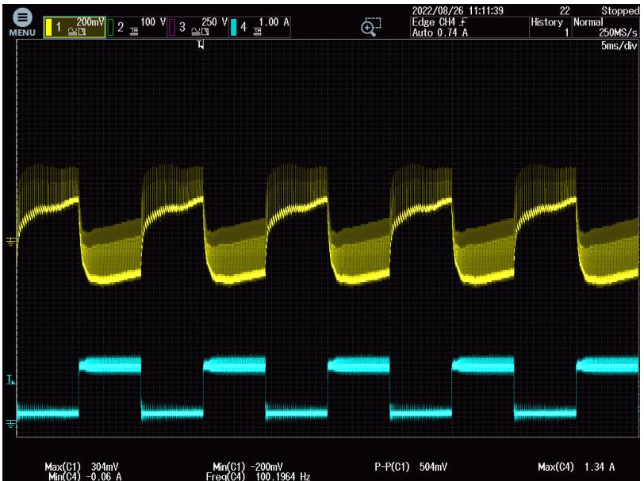

90 VAC

CH1 VOUT $\mathsf { V } _ { \mathsf { O U T } }$ $V _ { P K - P K } = 5 0 4 ~ \mathsf { m V }$  
$\mathsf { C H 4 } \mathsf { I } _ { \mathsf { O U T } }$

## Test Condition:

➢ $0 . 1 2 \mathsf { A } – 1 . 0 8 \mathsf { A } – 0 . 1 2 \mathsf { A }$  
➢ Slew Rate: 0.5 A/μS  
➢ Frequency: 100 Hz

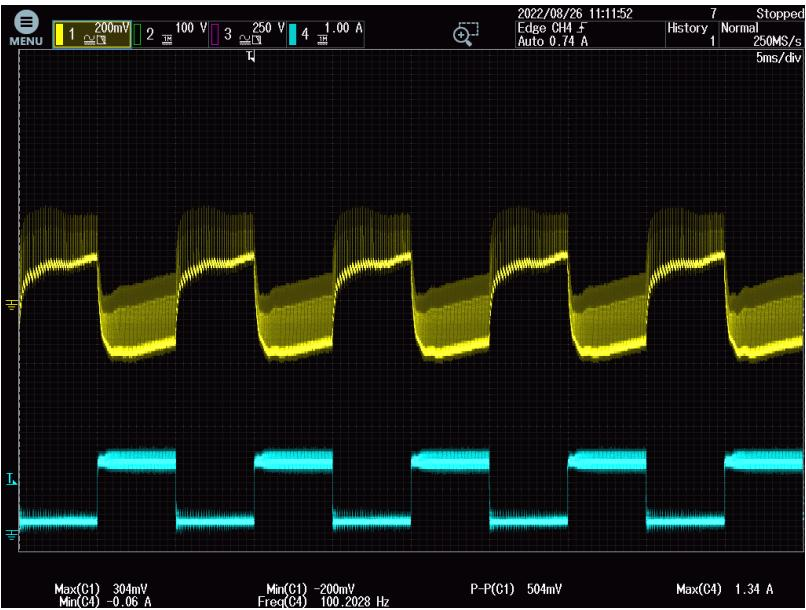

115 VAC

CH1 VOUT $\mathsf { V } _ { \mathsf { O U T } }$ $V _ { P K - P K } = 5 0 4 ~ \mathrm { m V }$  
$\mathsf { C H 4 } \mathsf { I } _ { \mathsf { O U T } }$

## Test Condition:

➢ $0 . 1 2 \mathsf { A } – 1 . 0 8 \mathsf { A } – 0 . 1 2 \mathsf { A }$  
➢ Slew Rate: 0.5 A/μS  
➢ Frequency: 100 Hz

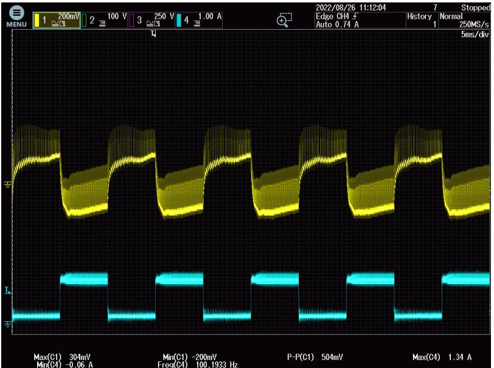

230 VAC

CH1 VOUT $\mathsf { V } _ { \mathsf { O U T } }$ $V _ { P K - P K } = 5 0 4 ~ \mathrm { m V }$  
$\mathsf { C H 4 } \mathsf { l } _ { \mathsf { O U T } }$

## Test Condition:

➢ $0 . 1 2 \mathsf { A } – 1 . 0 8 \mathsf { A } – 0 . 1 2 \mathsf { A }$  
➢ Slew Rate: 0.5 A/μS  
➢ Frequency: 100 Hz

## 输出电压开机波形

176 VAC

CH1 VOUT TRISE: 6.5 mS

## Test Condition:

➢ No Load

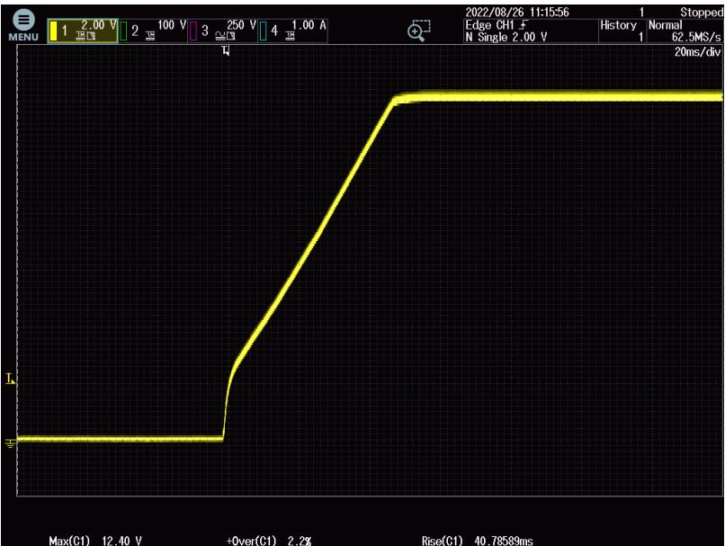

176 VAC

CH1 VOUT TRISE: 40.8 mS

## Test Condition:

➢ Full Load

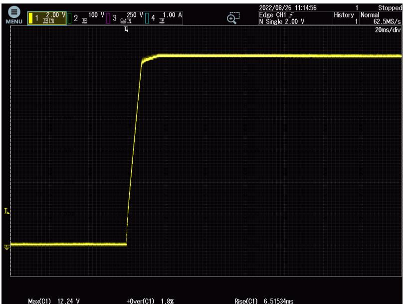

265 VAC

CH1 VOUT TRISE: 6.5 mS

## Test Condition:

➢ No Load

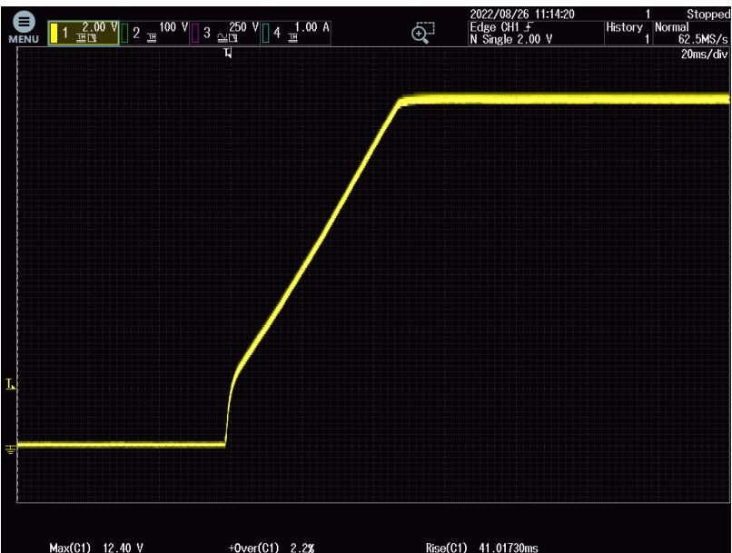

265 VAC

CH1 VOUT TRISE: 41 mS

## Test Condition:

➢ Full Load

## 开机延迟时间波形

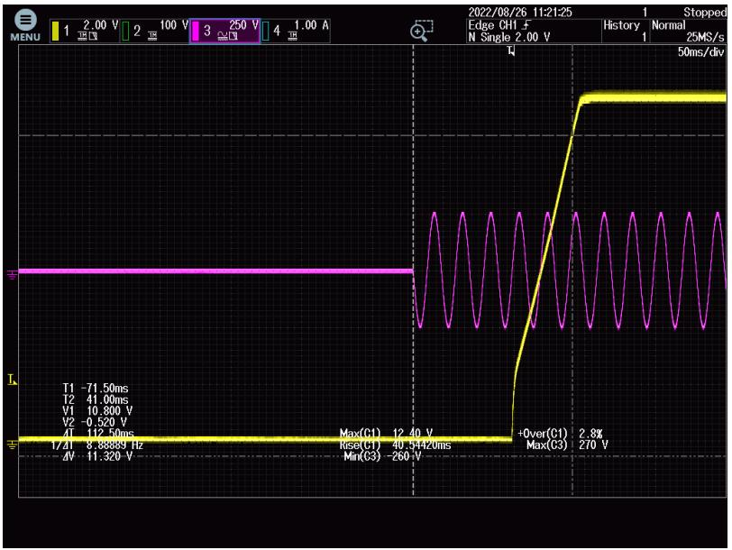

## 176 VAC

CH1 $\mathsf { V } _ { \mathsf { O U T } }$  
CH3 VIN $\mathsf { V } _ { \mathsf { I N } }$ ${ \sf T } _ { \sf D e l a y } \dot { \bullet }$ 112.5 mS

## Test Condition:

➢ Full Load

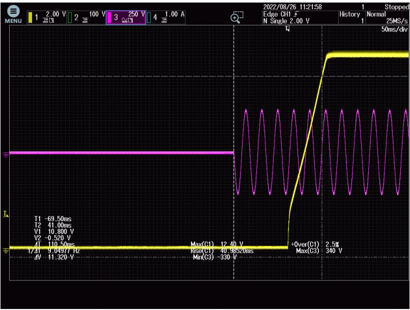

## 230 VAC

CH1 $\mathsf { V } _ { \mathsf { O U T } }$  
CH3 VIN $\mathsf { V } _ { \mathsf { I N } }$ ${ \sf T } _ { \sf D e l a y } \dot { \bullet }$ 110.5 mS

## Test Condition:

➢ Full Load

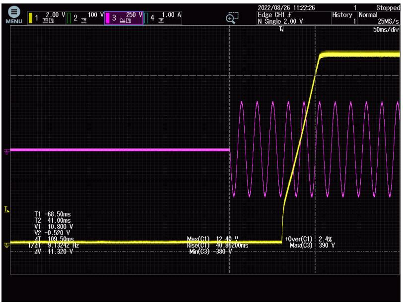

## 265 $\mathsf { v } _ { \mathsf { A C } }$

CH1 $\mathsf { V } _ { \mathsf { O U T } }$  
CH3 VIN $\mathsf { V } _ { \mathsf { I N } }$ $\bar { \mathsf { T } } _ { \mathsf { D e l a y } } \mathrm { : }$ 109.5 mS

## Test Condition:

➢ Full Load

## MOS漏源极电压电流波形 (启机)

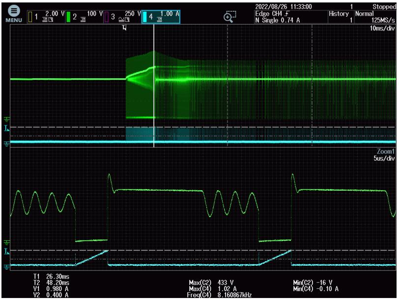

176 VAC

${ \mathsf { C H } } 2 { \mathsf { V } } _ { \mathsf { D S } }$  
$C H 4 1 _ { \mathsf { D } }$ $V _ { \mathsf { D } \mathsf { S } } { = } 4 3 3 \mathsf { V }$ IMAX= 1.02 A $\mathsf { I } _ { \mathsf { M A X } } = \mathsf { 1 } . 0 2 \mathsf { A }$

Test Condition:  
➢ No Load  
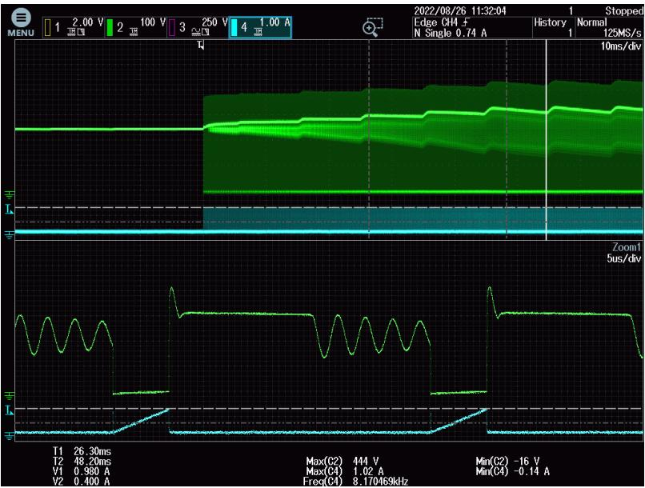

176 VAC

${ \mathsf { C H } } 2 { \mathsf { V } } _ { \mathsf { D S } }$  
$C H 4 1 _ { \mathsf { D } }$ $V _ { \mathsf { D S } } { = } 4 4 4 \vee$ $\mathsf { I } _ { \mathsf { M A X } } = \mathsf { 1 } . 0 2 \mathsf { A }$

Test Condition:  
➢ Full Load  
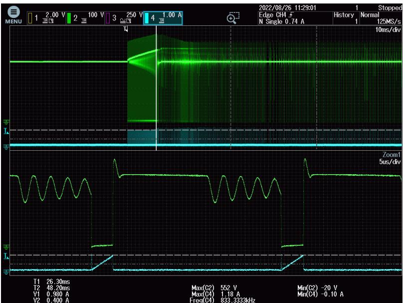

265 VAC

${ \mathsf { C H } } 2 \ { \mathsf { V } } _ { \mathsf { D S } }$  
$C H 4 1 _ { \mathsf { D } }$ $V _ { \mathsf { D S } } { = } 5 5 2 \ \mathsf { V }$ $\mathsf { I } _ { \mathsf { M A X } } { = } 1 . 1 8 ~ \mathsf { A }$

Test Condition:  
➢ No Load  
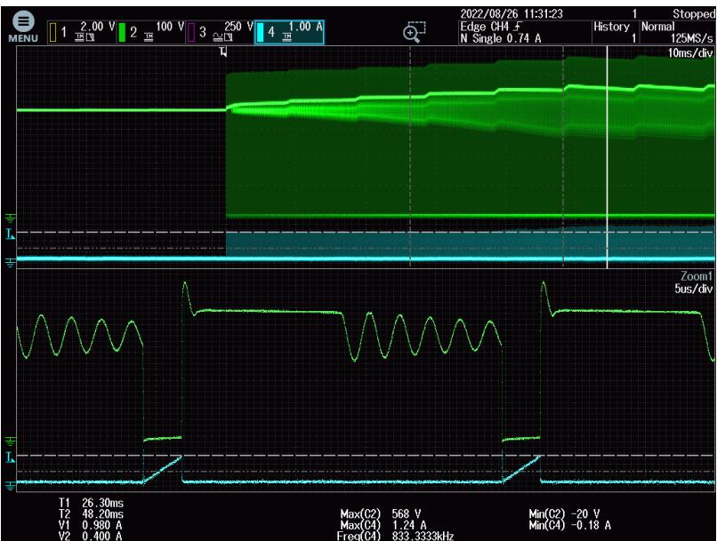

265 VAC

${ \mathsf { C H } } 2 { \mathsf { V } } _ { \mathsf { D S } }$  
$C H 4 1 _ { \mathsf { D } }$ $V _ { \mathsf { D S } } { = } 5 6 8 \mathsf { V }$ $\mathsf { I } _ { \mathsf { M A X } } { = } 1 . 2 4 ~ \mathsf { A }$

Test Condition:

➢ Full Load

## MOs漏源极电压电流波形 (正常工作)

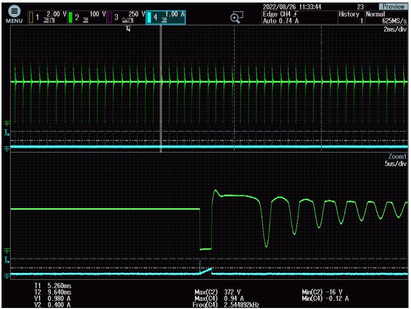

176 VAC

${ \mathsf { C H } } 2 { \mathsf { V } } _ { \mathsf { D S } }$  
$C H 4 1 _ { \mathsf { D } }$ $\mathtt { V } _ { \mathsf { D } \mathsf { S } } mathtt { = } 3 7 2 \mathtt { V }$ IMAX= 0.94 A $\mathsf { I } _ { \mathsf { M A X } } = \mathsf { 0 } . 9 4 \mathsf { A }$

Test Condition:  
➢ No Load  
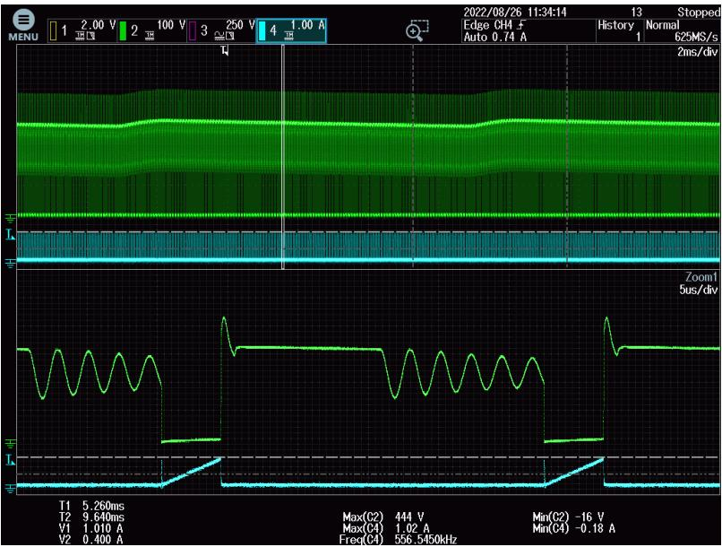

176 VAC

${ \mathsf { C H } } 2 { \mathsf { V } } _ { \mathsf { D S } }$  
$C H 4 1 _ { \mathsf { D } }$ $V _ { \mathsf { D S } } { = } 4 4 4 \vee$ $\mathsf { I } _ { \mathsf { M A X } } = \mathsf { 1 } . 0 2 \mathsf { A }$

Test Condition:  
➢ Full Load  
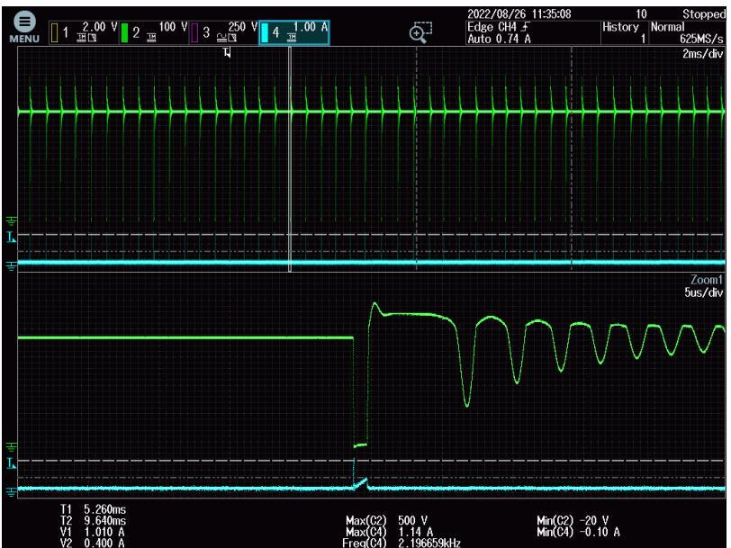

265 VAC

${ \mathsf { C H } } 2 \ { \mathsf { V } } _ { \mathsf { D S } }$  
$C H 4 1 _ { \mathsf { D } }$ $\mathtt { V } _ { \mathsf { D S } } mathtt { = } 5 0 0 \mathtt { V }$ $\mathsf { I } _ { \mathsf { M A X } } { = } 1 . 1 4 ~ \mathsf { A }$

Test Condition:  
➢ No Load  
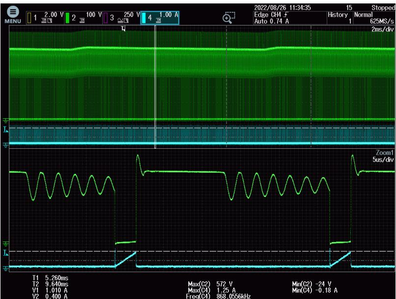

265 VAC

${ \mathsf { C H } } 2 { \mathsf { V } } _ { \mathsf { D S } }$  
$C H 4 1 _ { \mathsf { D } }$ $\mathtt { V } _ { \mathsf { D } \mathsf { S } } mathtt { = } 5 7 2 \mathtt { V }$ $\mathsf { I } _ { \mathsf { M A X } } { = } 1 . 2 5 ~ \mathsf { A }$

Test Condition:

➢ Full Load

## 输出二极管电压波形

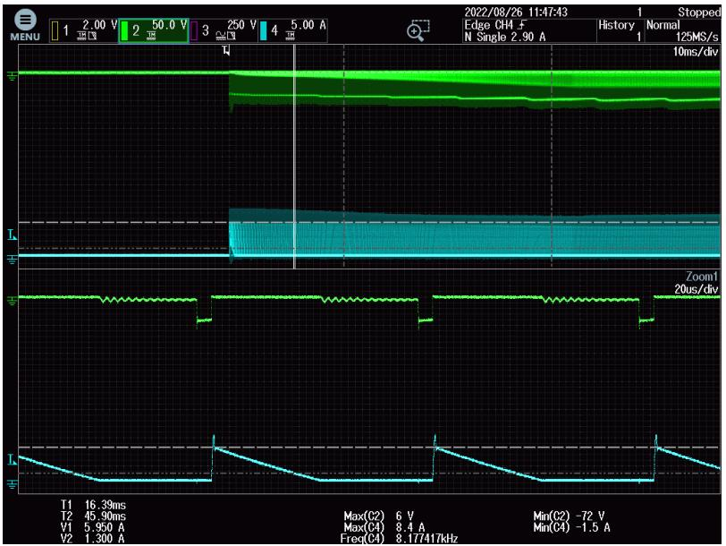

176 VAC

$C H 2 V _ { \mathsf { D } }$  
CH4 I $C H 4 1 _ { \mathsf { D } }$ $\mathtt { V } _ { \mathtt { D } } \mathtt { = } 7 2 \ \mathtt { V }$ $\mathsf { I } _ { \mathsf { D m a x } } { = } 8 . 4 ~ \mathsf { A }$ Dmax

Test Condition:

➢ Full Load  
➢ 开机

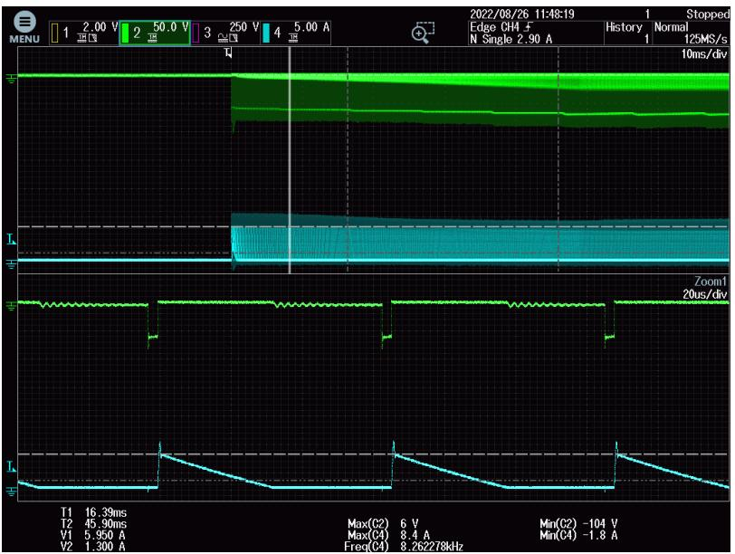

265 VAC

CH2 VD  
$C H 4 1 _ { \mathsf { D } }$ $\mathtt { V } _ { \mathtt { D } } { = } 1 0 4 \mathtt { V }$ $\mathsf { I } _ { \mathsf { D m a x } } { = } 8 . 4 ~ \mathsf { A }$ IDmax

➢ Full Load  
➢ 开机

Test Condition:  
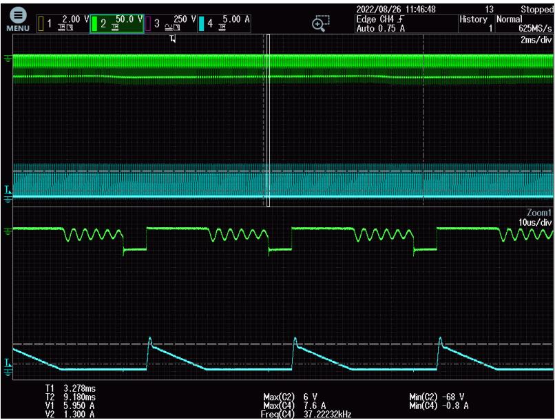

176 VAC

$C H 2 V _ { \mathsf { D } }$  
$C H 4 1 _ { \mathsf { D } }$ $\mathtt { V } _ { \mathtt { D } } \mathtt { = } 6 8 \mathtt { V }$ $\mathsf { I } _ { \mathsf { D m a x } } { = } 7 . 6 ~ \mathsf { A }$ Dmax

Test Condition:  
➢ Full Load  
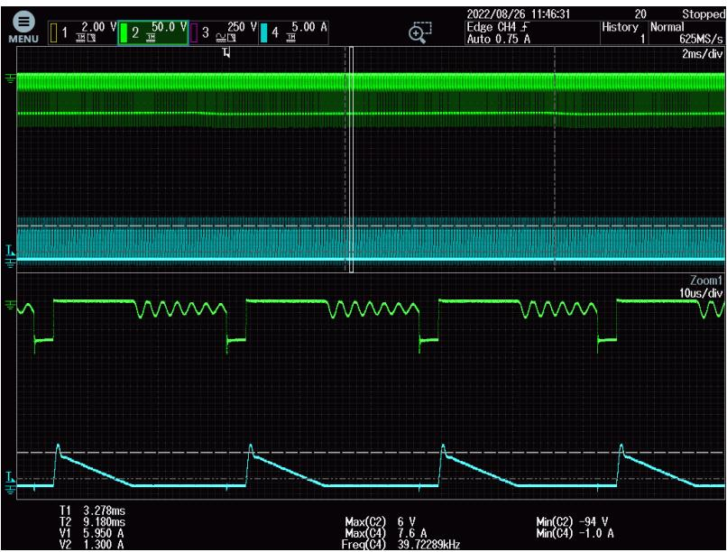

265 VAC

$C H 2 V _ { \mathsf { D } }$  
$C H 4 1 _ { \mathsf { D } }$ $\mathtt { V } _ { \mathtt { D } } { = } 9 4 \mathtt { V }$ $\mathsf { I } _ { \mathsf { D m a x } } { = } 7 . 6 ~ \mathsf { A }$

Test Condition:

➢ Full Load

## 输出短路时MOS和二极管波形

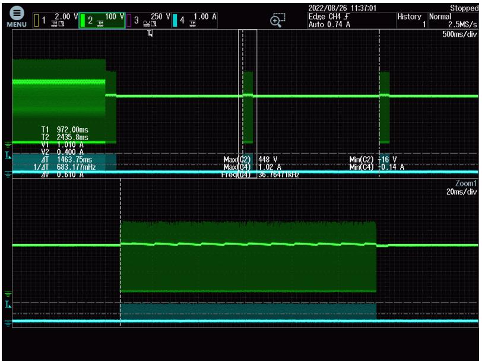

## 176 VAC

CH2 VDS  
CH4 ID $\begin{array} { r } { V _ { \mathsf { D S \_ m a x } } = 4 4 8 \mathsf { V } } \\ { \mathsf { I _ { D S \_ m a x } } = 1 . 0 2 \mathsf { A } } \end{array}$

## MOS

## Test Condition:

➢ Full Load

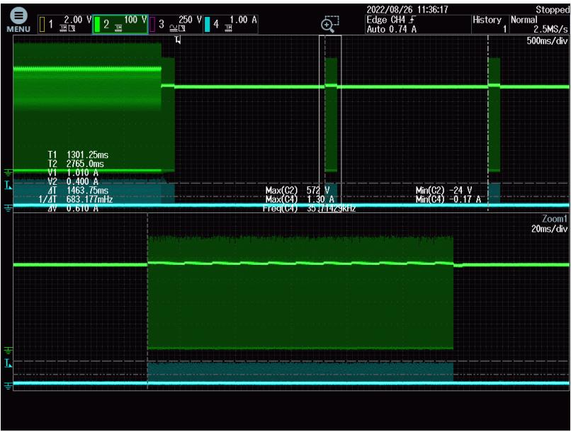

## 265 VAC

CH2 VDS  
CH4 ID $\begin{array} { l } { { \mathsf { V } _ { \mathsf { D S \_ m a x } } = 5 7 2 \mathsf { V } } } \\ { { \mathsf { I } _ { \mathsf { D S \_ m a x } } = 1 . 3 \mathsf { A } } } \end{array}$

## MOS

## Test Condition:

➢ Full Load

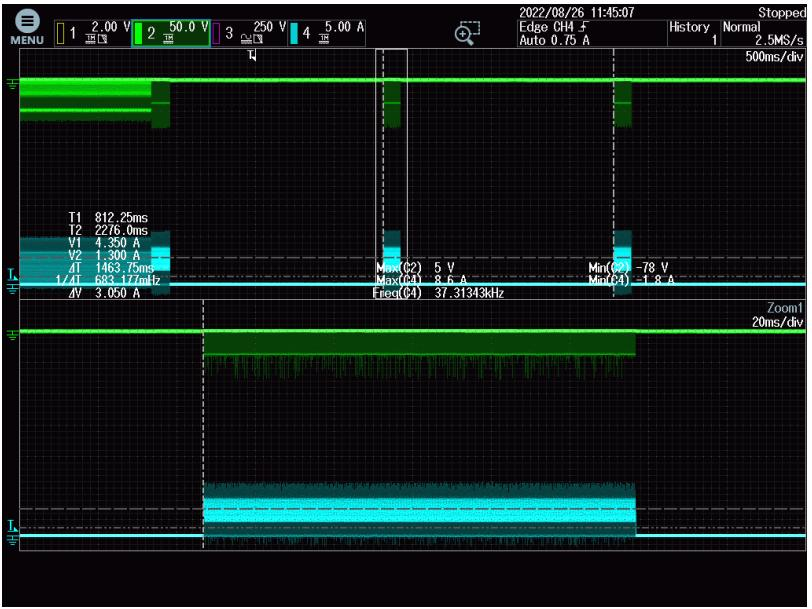

## 176 VAC

CH2 VD  
CH4 ID VD=78 V Dmax =8.6 A

## Test Condition:

➢ Full Load

## 二极管

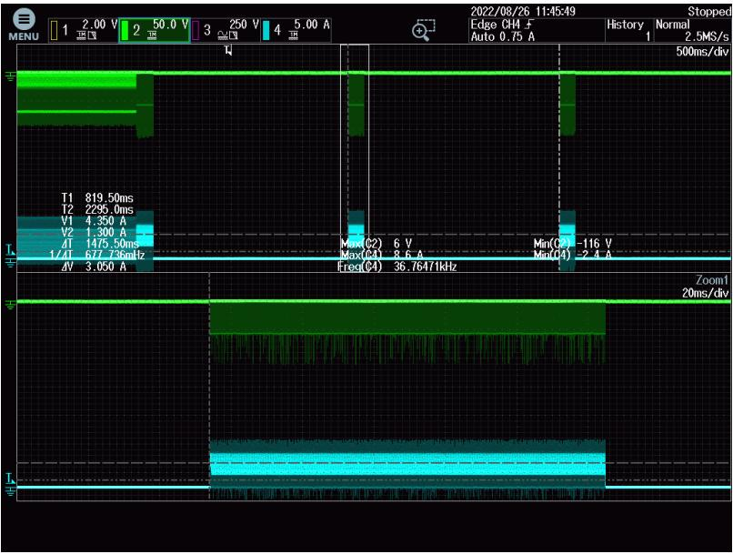

## 265 VAC

CH2 VD  
CH4 ID VD=116 V IDmax=8.6 A

## Test Condition:

➢ Full Load

## 二极管

## 温升测试

<table><tr><td rowspan="2">项目</td><td colspan="3">温度(°C)</td></tr><tr><td>176VAC</td><td>230VAC</td><td>265VAC</td></tr><tr><td>环境温度</td><td>32.9</td><td>33.2</td><td>33.2</td></tr><tr><td>BP86213D (U105)</td><td>90.4</td><td>87.3</td><td>87.9</td></tr><tr><td>SB5200 (D205)</td><td>98.3</td><td>99</td><td>99.7</td></tr><tr><td>变压器绕组 (T1)</td><td>89.3</td><td>89</td><td>89.5</td></tr><tr><td>变压器磁芯 (T1)</td><td>85.1</td><td>85.1</td><td>85.6</td></tr><tr><td>输入电解电容(EC102)</td><td>51</td><td>49.9</td><td>49.8</td></tr><tr><td>输出电解电容(EC201)</td><td>59.1</td><td>59.2</td><td>59.6</td></tr><tr><td>整流桥 (DB101)</td><td>52.7</td><td>50.8</td><td>50.5</td></tr></table>

## 测试说明

➢ 在温箱中进行测试  
➢ 电路板放在一个封闭的盒子内  
➢ 热电偶连接到各个测量点  
➢ 等测量点温度达到稳定后记录数据

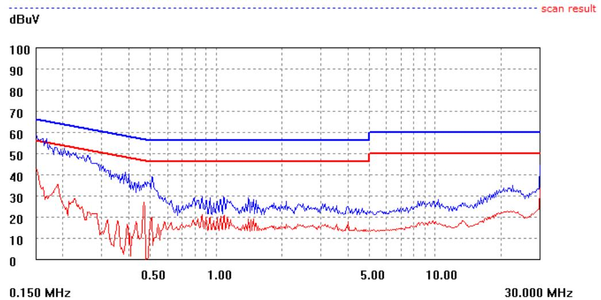

230VAC Line

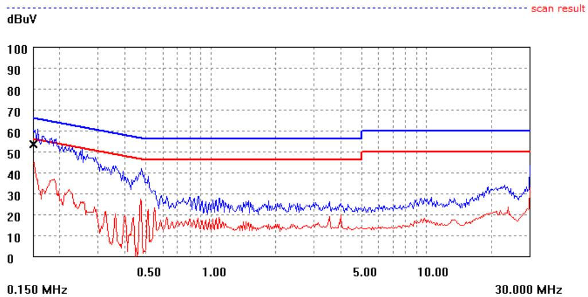

230VAC Neutral

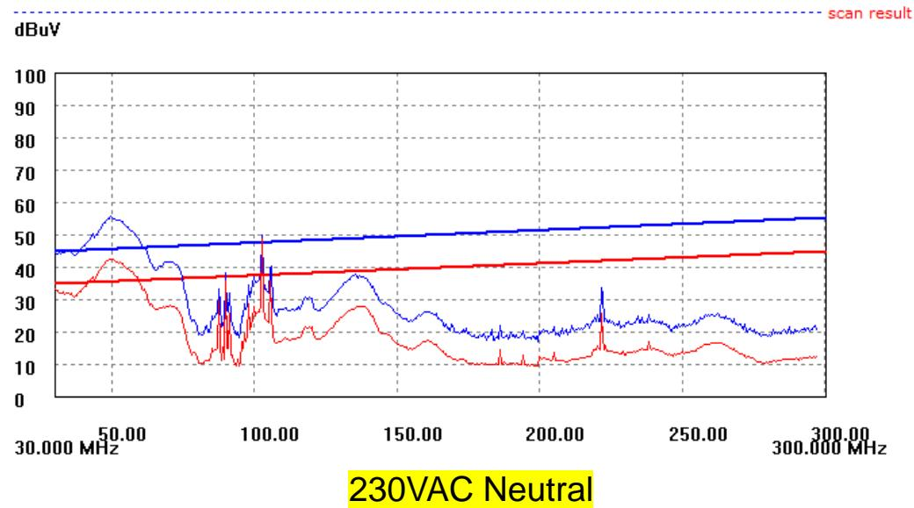

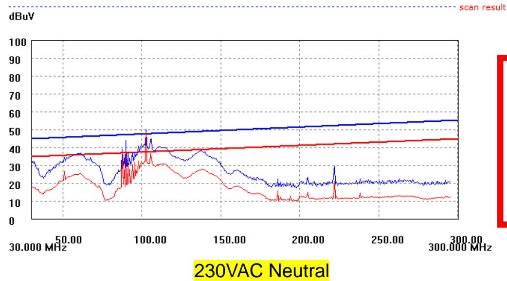

变压器1-4 脚之间加 10nF/1KV 电容

<table><tr><td>差模</td><td>电压</td><td>相位角</td><td>发生器阻抗</td><td>测试次数</td><td>测试结果</td></tr><tr><td>L to N</td><td>+2kV</td><td>0</td><td>2</td><td>10</td><td>Pass</td></tr><tr><td>L to N</td><td>-2kV</td><td>0</td><td>2</td><td>10</td><td>Pass</td></tr><tr><td>L to N</td><td>+2kV</td><td>85</td><td>2</td><td>10</td><td>Pass</td></tr><tr><td>L to N</td><td>-2kV</td><td>85</td><td>2</td><td>10</td><td>Pass</td></tr><tr><td>L to N</td><td>+2kV</td><td>180</td><td>2</td><td>10</td><td>Pass</td></tr><tr><td>L to N</td><td>-2kV</td><td>180</td><td>2</td><td>10</td><td>Pass</td></tr><tr><td>L to N</td><td>+2kV</td><td>270</td><td>2</td><td>10</td><td>Pass</td></tr><tr><td>L to N</td><td>-2kV</td><td>270</td><td>2</td><td>10</td><td>Pass</td></tr></table>

## 测试说明

➢ 按照GB/T17626.5和IEC61000-4-5的最新版本要求进行测试  
➢ 室温环境，230VAC输入，满载条件  
➢ 输入1.2/50us组合波浪涌电压  
➢ 每个测试点重复10次  
➢ 每次间隔时间1分钟  
➢ 试验时样机输出正常（符合A类标准）视为Pass

<table><tr><td>差模</td><td>电压</td><td>脉冲群持续时间</td><td>脉冲频率</td><td>测试时间</td><td>测试结果</td></tr><tr><td>L to N</td><td>+4kV</td><td>15ms</td><td>5kHz</td><td>120s</td><td>Pass</td></tr><tr><td>L to N</td><td>-4kV</td><td>15ms</td><td>5kHz</td><td>120s</td><td>Pass</td></tr><tr><td>L to N</td><td>+4kV</td><td>0.75ms</td><td>100kHz</td><td>120s</td><td>Pass</td></tr><tr><td>L to N</td><td>-4kV</td><td>0.75ms</td><td>100kHz</td><td>120s</td><td>Pass</td></tr><tr><td>L to N</td><td>+2kV</td><td>2ms</td><td>38kHz</td><td>120s</td><td>Pass</td></tr><tr><td>L to N</td><td>-2kV</td><td>2ms</td><td>38kHz</td><td>120s</td><td>Pass</td></tr><tr><td>L to N</td><td>+4kV</td><td>2ms</td><td>38kHz</td><td>120s</td><td>Pass</td></tr><tr><td>L to N</td><td>-4kV</td><td>2ms</td><td>38kHz</td><td>120s</td><td>Pass</td></tr></table>

## 测试说明

➢ 按照GB/T17626.4和IEC61000-4-4的最新版本要求进行测试  
➢ 室温环境，230VAC输入满载条件  
➢ 分别测试5kHz/100kHz/38kHz脉冲频率  
➢ 脉冲群周期为300ms  
➢ 每个测试条件测试时间120s  
➢ 试验时样机输出正常（符合A类标准）视为Pass

<table><tr><td>测试点</td><td>电压(V)</td><td>放电类型</td><td>放电次数</td><td>测试结果</td></tr><tr><td>Vo</td><td>+15kV</td><td>空气放电</td><td>10</td><td>Pass</td></tr><tr><td>Vo</td><td>-15kV</td><td>空气放电</td><td>10</td><td>Pass</td></tr><tr><td>GND</td><td>+15kV</td><td>空气放电</td><td>10</td><td>Pass</td></tr><tr><td>GND</td><td>-15kV</td><td>空气放电</td><td>10</td><td>Pass</td></tr><tr><td>Vo</td><td>+20kV</td><td>空气放电</td><td>10</td><td>Pass</td></tr><tr><td>Vo</td><td>-20kV</td><td>空气放电</td><td>10</td><td>Pass</td></tr><tr><td>GND</td><td>+20kV</td><td>空气放电</td><td>10</td><td>Pass</td></tr><tr><td>GND</td><td>-20kV</td><td>空气放电</td><td>10</td><td>Pass</td></tr></table>

## 测试说明

➢ 按照GB/T17626.2和IEC61000-4-2的最新版本要求进行测试  
➢ 室温环境，230VAC输入满载条件  
➢ 每个测试点重复10次  
➢ 分别对输出正端和地进行空气放电  
➢ 试验时样机输出正常（符合A类标准）视为Pass

## THANK YOU FOR WATCHING
