## BP86213D 参考设计

## (24V/0.5A)

上海晶丰明源半导体股份有限公司

Shanghai Bright Power Semiconductor Co., Ltd.

陈耀兵

2022 6 17

BP86213D  
电源规格  
电路图  
◼BOM  
◼PCB Layout  
电路实物图  
变压器规格书  
性能测试数据

## 产品特点:

➢ 650V MOSFET  
》集成高压启动、自供电电路  
》低待机功耗  
》集成输入欠压保护  
》内置软启动

## 应用领域:

》家用电器辅助电源  
➢ PC  
》适配器、充电器

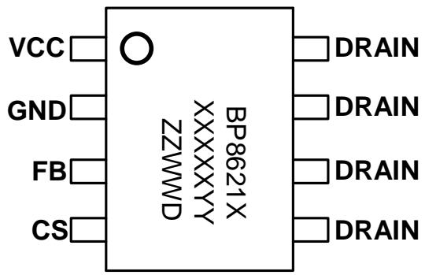

SOP-7

## 电源规格

<table><tr><td>项目描述</td><td>符号</td><td>最小</td><td>典型</td><td>最大</td><td>单位</td><td>备注</td></tr><tr><td colspan="7">输入</td></tr><tr><td>电压</td><td> $V_{IN}$ </td><td>90</td><td>115/230</td><td>264</td><td> $V_{AC}$ </td><td></td></tr><tr><td>频率</td><td> $f_{LINE}$ </td><td>47</td><td>50/60</td><td>63</td><td>Hz</td><td></td></tr><tr><td colspan="7">输出</td></tr><tr><td>输出电压</td><td> $V_{OUT}$ </td><td></td><td>24</td><td></td><td>V</td><td>±3%</td></tr><tr><td>输出电流</td><td> $I_{OUT}$ </td><td></td><td>0.5</td><td></td><td>A</td><td></td></tr><tr><td>输出电压纹波</td><td> $V_{RIPPLE}$ </td><td></td><td></td><td>240</td><td>mV</td><td>20MHz带宽</td></tr><tr><td>连续输出功率</td><td> $P_{OUT}$ </td><td></td><td>12</td><td></td><td>W</td><td></td></tr><tr><td colspan="7">效率</td></tr><tr><td>待机功耗</td><td> $P_{STDBY}$ </td><td></td><td></td><td>70</td><td>mW</td><td>230VAC</td></tr><tr><td>满载效率</td><td>η</td><td>81</td><td></td><td></td><td>%</td><td>115VAC/230VAC</td></tr><tr><td colspan="7">环境</td></tr><tr><td>传导EMI</td><td></td><td colspan="4">满足CISPR22/EN55022 Class B,至少6dB 裕量</td><td></td></tr><tr><td>Surge</td><td></td><td></td><td>2</td><td></td><td>kV</td><td>差模</td></tr><tr><td>EFT</td><td></td><td></td><td>4</td><td></td><td>kV</td><td>5kHz/100kHz/38kHz</td></tr><tr><td>ESD</td><td></td><td></td><td>15</td><td></td><td>kV</td><td>接触8kV,空气15kV</td></tr><tr><td>工作环境温度</td><td> $T_{AMP}$ </td><td>0</td><td></td><td>40</td><td>°C</td><td></td></tr></table>

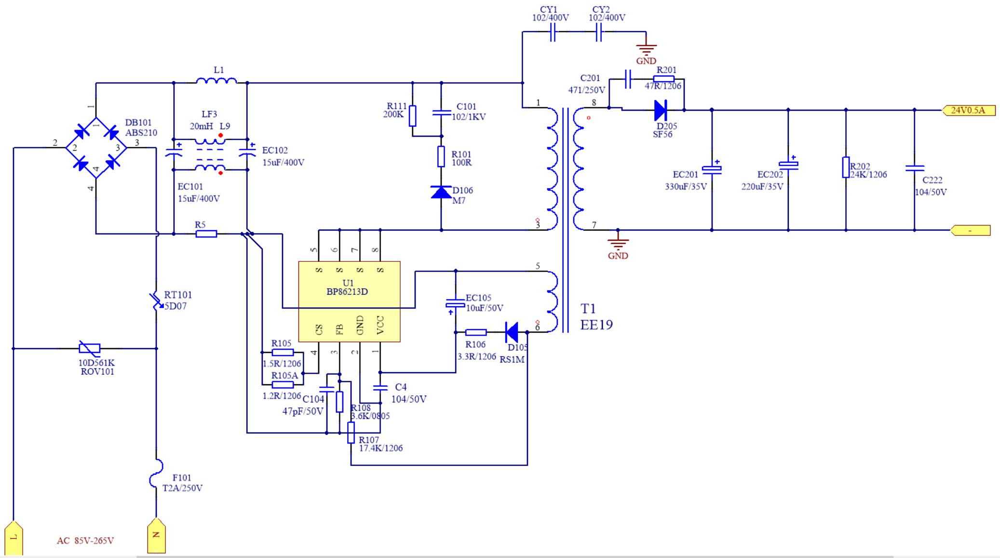

<table><tr><td>序号</td><td>元件标号</td><td>参数描述</td><td>封装尺寸</td><td>数量</td></tr><tr><td>1</td><td>C4, C222</td><td>104/50V</td><td>C-0805</td><td>2</td></tr><tr><td>2</td><td>C101</td><td>102/1KV</td><td>C-1206S</td><td>1</td></tr><tr><td>3</td><td>C104</td><td>47pF/50V</td><td>C-0805</td><td>1</td></tr><tr><td>4</td><td>C201</td><td>471/250V</td><td>C-0805</td><td>1</td></tr><tr><td>5</td><td>CY1, CY2</td><td>102/400V</td><td>CY10</td><td>2</td></tr><tr><td>6</td><td>D105</td><td>RS1M</td><td>D-SMB</td><td>1</td></tr><tr><td>7</td><td>D106</td><td>M7</td><td>D-SMB</td><td>1</td></tr><tr><td>8</td><td>D205</td><td>SF56</td><td>D-201</td><td>1</td></tr><tr><td>9</td><td>DB101</td><td>ABS210</td><td>DB-L-SMD</td><td>1</td></tr><tr><td>10</td><td>EC101, EC102</td><td>15uF/400V</td><td>C10</td><td>2</td></tr><tr><td>11</td><td>EC105</td><td>10uF/50V</td><td>C-D5*2.5*11-L</td><td>1</td></tr><tr><td>12</td><td>EC201</td><td>330uF/35V</td><td>C8 KM</td><td>1</td></tr><tr><td>13</td><td>EC202</td><td>220uF/35V</td><td>C8 KM</td><td>1</td></tr><tr><td>14</td><td>F101</td><td>T2A/250V</td><td>FUSE_F-P5_JZ</td><td>1</td></tr><tr><td>15</td><td>LF3</td><td>20mH L9</td><td>LF-U9</td><td>1</td></tr><tr><td>16</td><td>R101</td><td>100R</td><td>1206-R</td><td>1</td></tr><tr><td>17</td><td>R105</td><td>1.5R/1206</td><td>1206-R</td><td>1</td></tr><tr><td>18</td><td>R105A</td><td>1.2R/1206</td><td>1206-R</td><td>1</td></tr><tr><td>19</td><td>R106</td><td>3.3R/1206</td><td>1206-R</td><td>1</td></tr></table>

<table><tr><td>序号</td><td>元件标号</td><td>参数描述</td><td>封装尺寸</td><td>数量</td></tr><tr><td>20</td><td>R107</td><td>17.4K/1206</td><td>1206-R</td><td>1</td></tr><tr><td>21</td><td>R108</td><td>3.6K/0805</td><td>1206-R</td><td>1</td></tr><tr><td>22</td><td>R111</td><td>200K</td><td>1206-R</td><td>1</td></tr><tr><td>23</td><td>R201</td><td>47R/1206</td><td>1206-R</td><td>1</td></tr><tr><td>24</td><td>R202</td><td>24K/1206</td><td>1206-R</td><td>1</td></tr><tr><td>25</td><td>ROV101</td><td>10D561K</td><td>RV-L12*5*7.5-1</td><td>1</td></tr><tr><td>26</td><td>RT101</td><td>5D07</td><td>RT-L10*5*7.5</td><td>1</td></tr><tr><td>27</td><td>T1</td><td>EE19</td><td>T EE16(5+3)</td><td>1</td></tr><tr><td>28</td><td>U1</td><td>BP86213D</td><td>SOP8-JZ</td><td>1</td></tr></table>

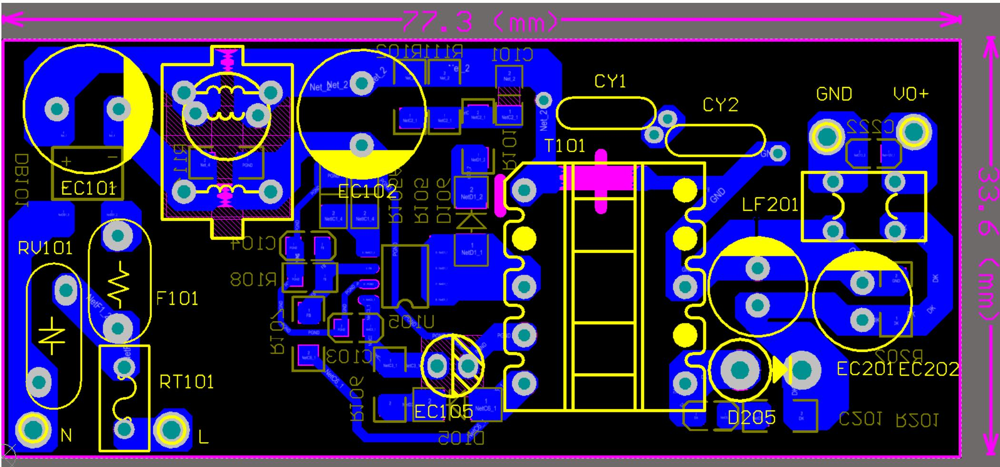

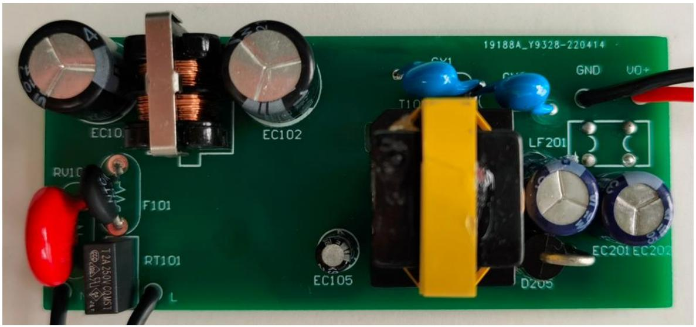

TOP SIDE

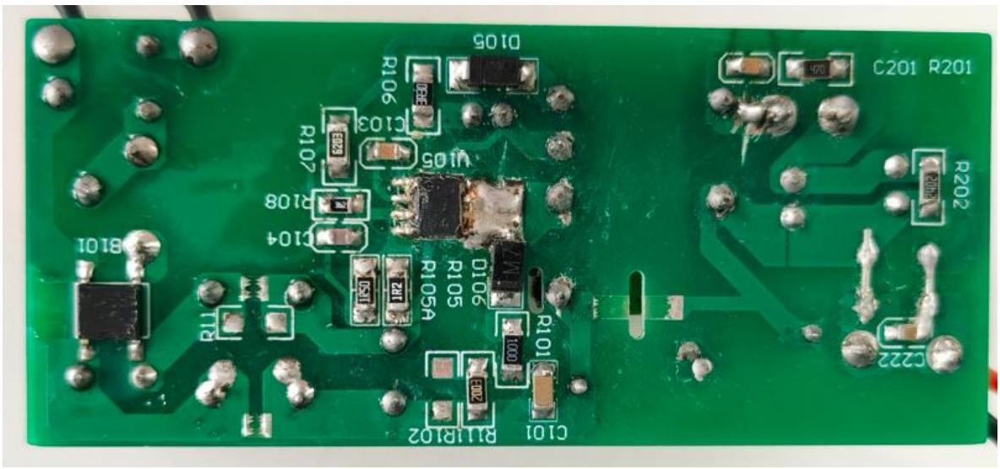

BOTTOM SIDE

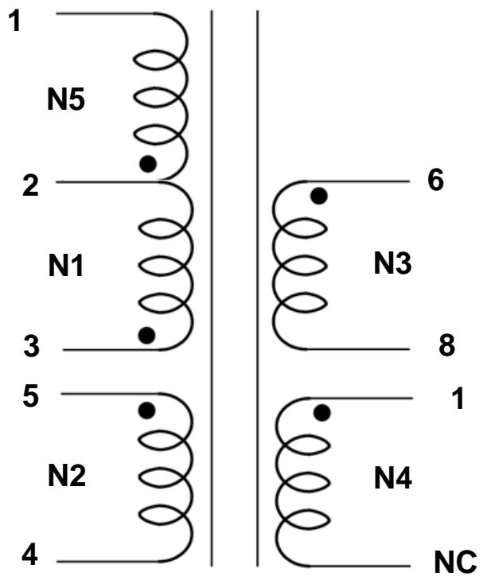

## 规格与材料

初级绕组感量L=0.97mH±7% (测试条件：0.3V，50kHz)  
漏感量 $L _ { \mathrm { | k } } { < } 3 \% ^ { \frac { 1 } { x } } L _ { \mathrm { P } }$  
➢ 骨架：EE19立式加高骨架 (5+5PIN)  
磁芯：EE19 PC40 或同等材质， $\mathsf { A e { = } } 2 2 . 7 \mathsf { m m } ^ { 2 }$  
》N1、N2、N4、N5:2UEW漆包线  
➢ N3：三层绝缘线  
绝缘胶带:3M900或同等材质  
耐压测试:3KV,50/60Hz,1Min  
成品要求：浸凡立水

<table><tr><td>序号</td><td>起始脚</td><td>终止脚</td><td>绕制规则</td><td>匝数</td><td>绕线方式</td></tr><tr><td>N1</td><td>3</td><td>2</td><td>2UEW φ0.2*1P</td><td>75Ts</td><td>密绕2层(PIN脚朝外)</td></tr><tr><td>胶带</td><td></td><td></td><td></td><td>2Ts</td><td></td></tr><tr><td>N2</td><td>5</td><td>4</td><td>2UEW φ0.17*2P</td><td>21Ts</td><td>密绕一层(PIN脚朝外)</td></tr><tr><td>胶带</td><td></td><td></td><td></td><td>2Ts</td><td></td></tr><tr><td>N3</td><td>6</td><td>8</td><td>TEX-E φ0.4*1P</td><td>40Ts</td><td>密绕3层(PIN脚朝外)</td></tr><tr><td>胶带</td><td></td><td></td><td></td><td>2Ts</td><td></td></tr><tr><td>N4</td><td>1</td><td>NC</td><td>2UEW φ0.13*2P</td><td>6Ts</td><td>均匀绕一层(PIN脚朝外)</td></tr><tr><td>胶带</td><td></td><td></td><td></td><td>2Ts</td><td></td></tr><tr><td>N5</td><td>2</td><td>1</td><td>2UEW φ0.2*1P</td><td>65Ts</td><td>密绕2层(PIN脚朝外)</td></tr><tr><td>胶带</td><td></td><td></td><td></td><td>3Ts</td><td></td></tr></table>

底视图

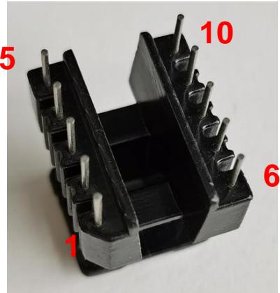

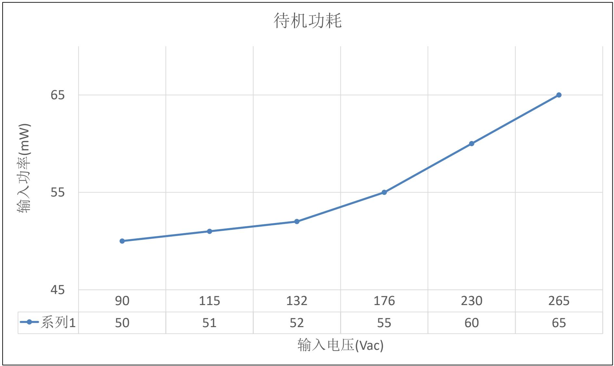

假负载电阻为24K

效率曲线  
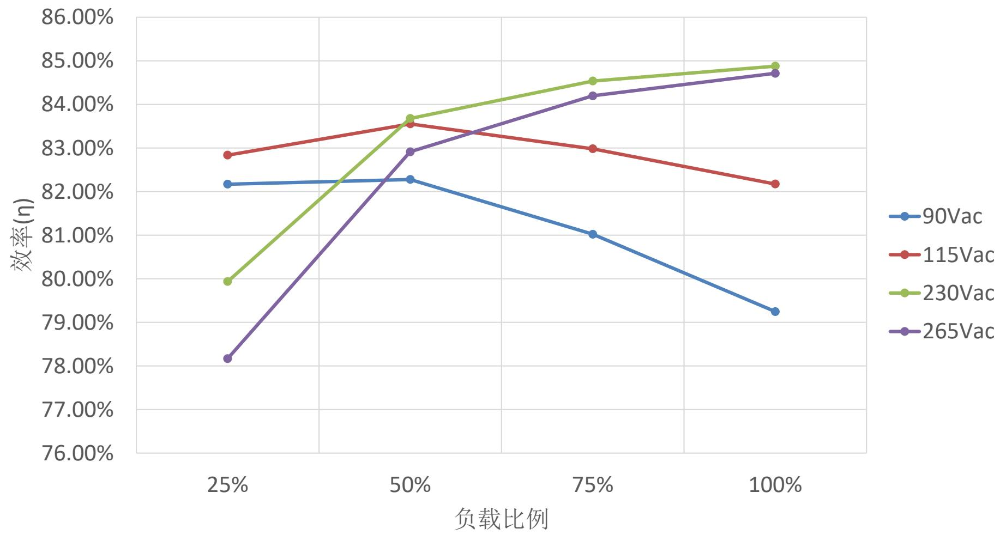

<table><tr><td> $V_{IN}(VAC)$ </td><td>Load(%)</td><td> $P_{IN}(W)$ </td><td> $V_{OUT}(V)$ </td><td> $I_{OUT}(A)$ </td><td> $P_{OUT}(W)$ </td><td>Eff(%)</td><td>AVG Eff(%)</td></tr><tr><td rowspan="6">90</td><td>空载</td><td></td><td></td><td></td><td>0</td><td></td><td></td></tr><tr><td>10%</td><td>1.53</td><td>23.814</td><td>0.05</td><td>1.1907</td><td>77.82%</td><td></td></tr><tr><td>25%</td><td>3.64</td><td>23.928</td><td>0.125</td><td>2.991</td><td>82.17%</td><td rowspan="4">81.18%</td></tr><tr><td>50%</td><td>7.31</td><td>24.058</td><td>0.25</td><td>6.0145</td><td>82.28%</td></tr><tr><td>75%</td><td>11.17</td><td>24.134</td><td>0.375</td><td>9.05025</td><td>81.02%</td></tr><tr><td>100%</td><td>15.27</td><td>24.202</td><td>0.5</td><td>12.101</td><td>79.25%</td></tr><tr><td rowspan="6">115</td><td>空载</td><td></td><td></td><td></td><td>0</td><td></td><td></td></tr><tr><td>10%</td><td>1.54</td><td>23.795</td><td>0.05</td><td>1.18975</td><td>77.26%</td><td></td></tr><tr><td>25%</td><td>3.61</td><td>23.923</td><td>0.125</td><td>2.990375</td><td>82.84%</td><td rowspan="4">82.89%</td></tr><tr><td>50%</td><td>7.2</td><td>24.063</td><td>0.25</td><td>6.01575</td><td>83.55%</td></tr><tr><td>75%</td><td>10.91</td><td>24.142</td><td>0.375</td><td>9.05325</td><td>82.98%</td></tr><tr><td>100%</td><td>14.74</td><td>24.225</td><td>0.5</td><td>12.1125</td><td>82.17%</td></tr><tr><td rowspan="6">230</td><td>空载</td><td></td><td></td><td></td><td>0</td><td></td><td></td></tr><tr><td>10%</td><td>1.71</td><td>23.84</td><td>0.05</td><td>1.192</td><td>69.71%</td><td></td></tr><tr><td>25%</td><td>3.74</td><td>23.917</td><td>0.125</td><td>2.989625</td><td>79.94%</td><td rowspan="4">83.26%</td></tr><tr><td>50%</td><td>7.19</td><td>24.066</td><td>0.25</td><td>6.0165</td><td>83.68%</td></tr><tr><td>75%</td><td>10.72</td><td>24.166</td><td>0.375</td><td>9.06225</td><td>84.54%</td></tr><tr><td>100%</td><td>14.29</td><td>24.258</td><td>0.5</td><td>12.129</td><td>84.88%</td></tr><tr><td rowspan="6">265</td><td>空载</td><td></td><td></td><td></td><td>0</td><td></td><td></td></tr><tr><td>10%</td><td>1.73</td><td>23.774</td><td>0.05</td><td>1.1887</td><td>68.71%</td><td></td></tr><tr><td>25%</td><td>3.82</td><td>23.888</td><td>0.125</td><td>2.986</td><td>78.17%</td><td rowspan="4">82.50%</td></tr><tr><td>50%</td><td>7.25</td><td>24.045</td><td>0.25</td><td>6.01125</td><td>82.91%</td></tr><tr><td>75%</td><td>10.76</td><td>24.159</td><td>0.375</td><td>9.059625</td><td>84.20%</td></tr><tr><td>100%</td><td>14.32</td><td>24.262</td><td>0.5</td><td>12.131</td><td>84.71%</td></tr></table>

## 输出电压调整率

<table><tr><td> $V_{IN}(VAC)$  $I_{OUT}(A)$ </td><td>90</td><td>115</td><td>132</td><td>176</td><td>230</td><td>265</td><td>平均值</td><td>线调整率</td></tr><tr><td>0</td><td>23.776</td><td>23.768</td><td>23.767</td><td>23.766</td><td>23.755</td><td>23.767</td><td>23.767</td><td>0.09%</td></tr><tr><td>20%</td><td>23.897</td><td>23.889</td><td>23.888</td><td>23.872</td><td>23.845</td><td>23.854</td><td>23.874</td><td>0.22%</td></tr><tr><td>40%</td><td>23.977</td><td>23.993</td><td>23.994</td><td>23.994</td><td>23.969</td><td>23.955</td><td>23.980</td><td>0.16%</td></tr><tr><td>60%</td><td>24.07</td><td>24.099</td><td>24.105</td><td>24.11</td><td>24.099</td><td>24.088</td><td>24.095</td><td>0.17%</td></tr><tr><td>80%</td><td>24.127</td><td>24.163</td><td>24.174</td><td>24.193</td><td>24.183</td><td>24.173</td><td>24.169</td><td>0.27%</td></tr><tr><td>100%</td><td>24.192</td><td>24.23</td><td>24.238</td><td>24.263</td><td>24.263</td><td>24.262</td><td>24.241</td><td>0.29%</td></tr><tr><td>平均值</td><td>24.007</td><td>24.024</td><td>24.028</td><td>24.033</td><td>24.019</td><td>24.017</td><td></td><td></td></tr><tr><td>负载调整率</td><td>1.73%</td><td>1.92%</td><td>1.96%</td><td>2.07%</td><td>2.11%</td><td>2.06%</td><td></td><td></td></tr></table>

◼ 计算方法：调整率=100%\*(最大值-最小值)/平均值  
假负载电阻24K

## 输出电压纹波

20MHz带宽，去掉示波器探头正端夹子和地线环，10uF/50V 0.1uF/50V

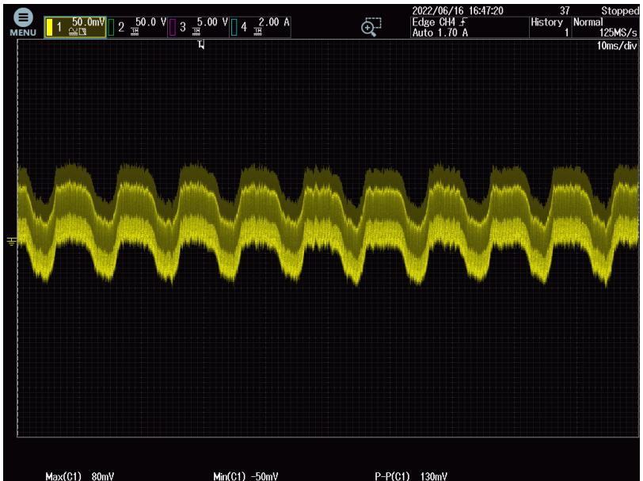

90 VAC  
CH1 VOUT $\mathsf { V } _ { \mathsf { O U T } }$ Ripple $v _ { p _ { \mathrm { K - P K } } } { = } 1 3 0 ~ \mathsf { m V }$  
➢ Full Load

Test Condition:

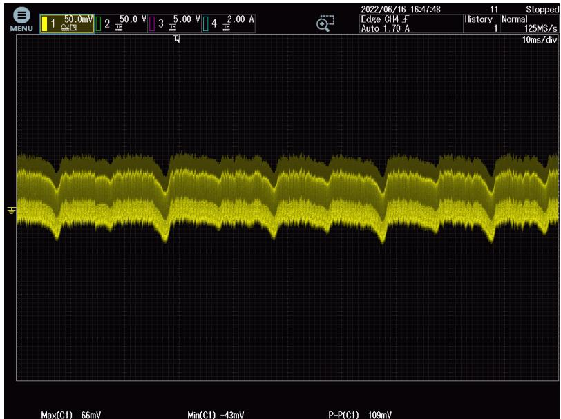

115 VAC  
CH1 VOUT ${ \mathsf { C H 1 } } { \mathsf { V } } _ { \mathsf { O U T } }$ Ripple $v _ { p _ { \mathrm { K - P K } } } { = } 1 0 9 ~ \mathsf { m V }$  
➢ Full Load

Test Condition:

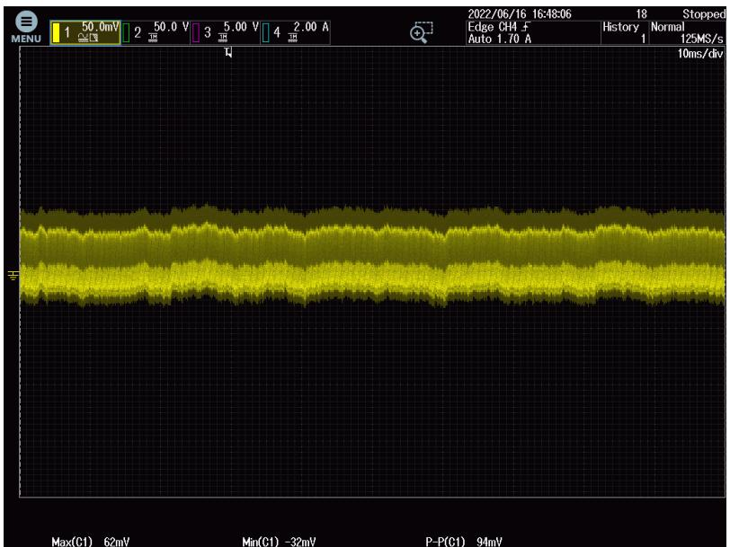

230 VAC  
CH1 VOUT $\mathsf { V } _ { \mathsf { O U T } }$ Ripple $\mathsf { V } _ { \mathsf { P K - P K } } { = } 9 4 \mathsf { m } \mathsf { v }$  
➢ Full Load

Test Condition:

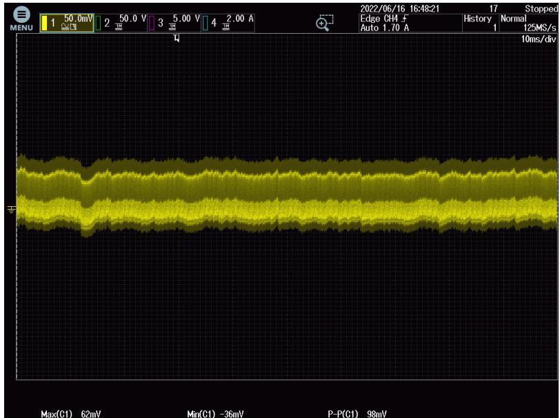

265 $\mathsf { v } _ { \mathsf { A C } }$  
CH1 VOUT $\mathsf { V } _ { \mathsf { O U T } }$ Ripple $\mathsf { V } _ { \mathsf { P K - P K } } { = } 9 8 \mathsf { m v }$  
➢ Full Load

Test Condition:

## (50%-100%)

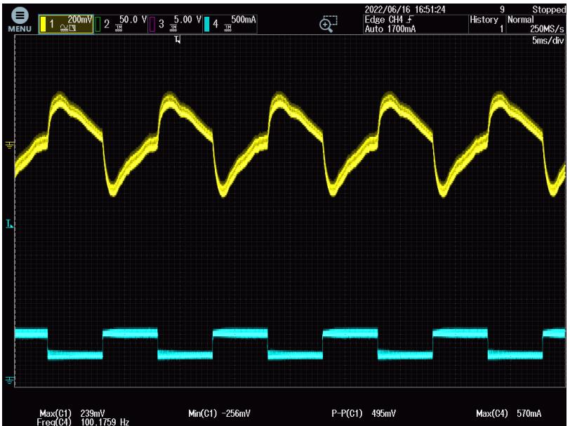

90 VAC

CH1 VOUT ${ \mathsf { C H 1 } } { \mathsf { V } } _ { \mathsf { O U T } }$ $V _ { P K - P K } = 4 9 5 m v$  
$\mathsf { C H 4 } \mathsf { I } _ { \mathsf { O U T } }$

## Test Condition:

➢ 0.25 A-0.5 A-0.25 A  
➢ Slew Rate: 0.5 A/μS  
➢ Frequency: 100 Hz

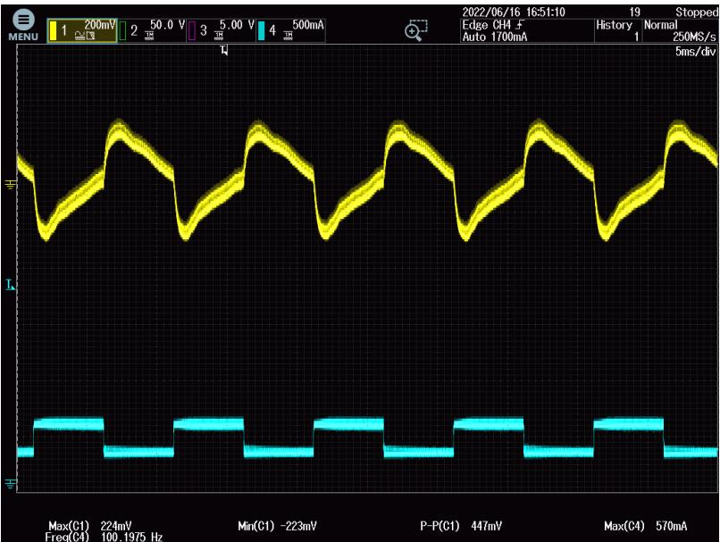

115 VAC

CH1 VOUT ${ \mathsf { C H 1 } } { \mathsf { V } } _ { \mathsf { O U T } }$ $V _ { P K - P K } = 4 4 7 m v$  
$\mathsf { C H 4 } \mathsf { I } _ { \mathsf { O U T } }$

## Test Condition:

➢ 0.25 A-0.5 A-0.25 A  
➢ Slew Rate: 0.5 A/μS  
➢ Frequency: 100 Hz

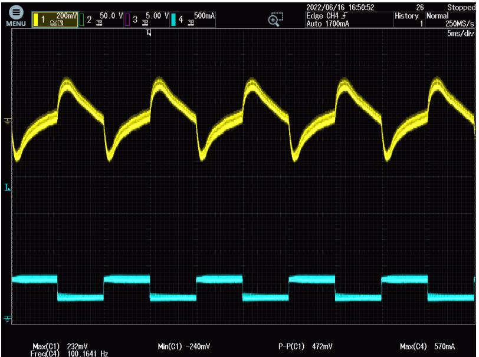

230 VAC

CH1 VOUT $\mathsf { V } _ { \mathsf { O U T } }$ $V _ { P K - P K } = 4 7 2 m v$  
$\mathsf { C H 4 } \mathsf { l } _ { \mathsf { O U T } }$

## Test Condition:

➢ 0.25 A-0.5 A-0.25 A  
➢ Slew Rate: 0.5 $\mathsf { A } / \mu \mathsf { S }$  
➢ Frequency: 100 Hz

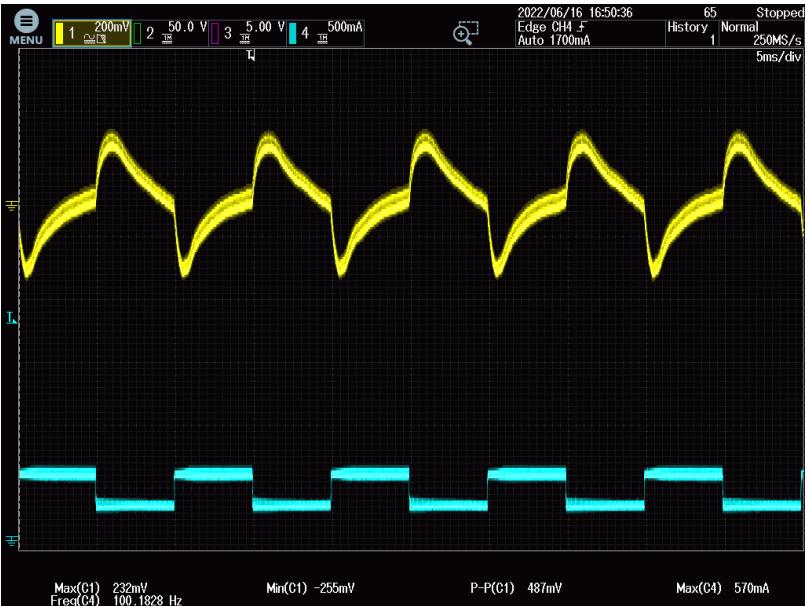

265 VAC

CH1 VOUT ${ \mathsf { C H 1 } } { \mathsf { V } } _ { \mathsf { O U T } }$ $V _ { P K - P K } { = } 4 8 7 ~ \mathsf { m V }$  
$\mathsf { C H 4 } \mathsf { I } _ { \mathsf { O U T } }$

## Test Condition:

➢ 0.25 A-0.5 A-0.25 A  
➢ Slew Rate: 0.5 A/μS  
➢ Frequency: 100 Hz

## (10%-90%)

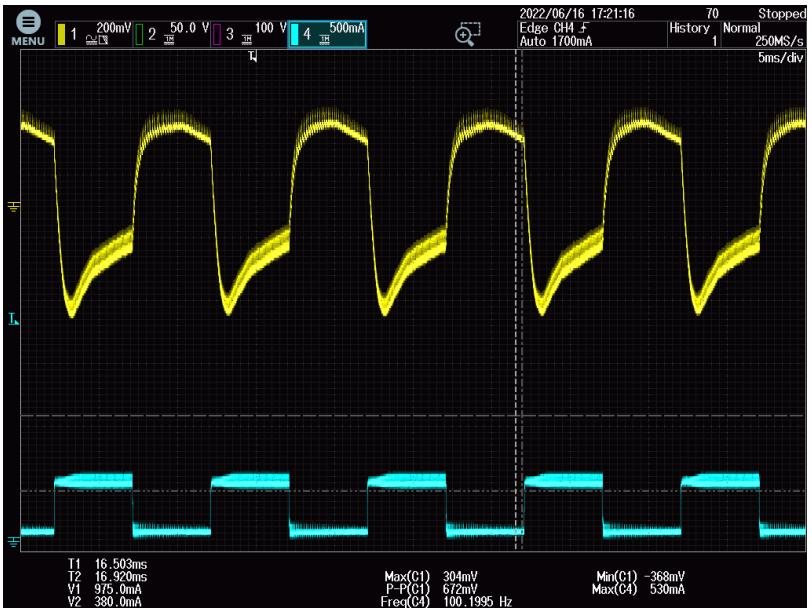

90 VAC

CH1 VOUT ${ \mathsf { C H 1 } } { \mathsf { V } } _ { \mathsf { O U T } }$ $V _ { P K - P K } = 6 7 2 m v$  
$\mathsf { C H 4 } \mathsf { I } _ { \mathsf { O U T } }$

## Test Condition:

➢ 0.05 A-0.45A-0.05 A  
➢ Slew Rate: 0.5 A/μS  
➢ Frequency: 100 Hz

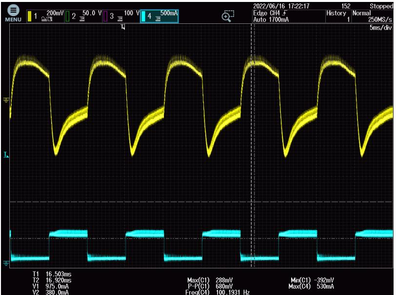

230 VAC

CH1 VOUT $\mathsf { V } _ { \mathsf { O U T } }$ $V _ { P K - P K } = 6 8 0 ~ \mathsf { m V }$  
$\mathsf { C H 4 } \mathsf { l } _ { \mathsf { O U T } }$

## Test Condition:

➢ 0.05 A-0.45A-0.05 A  
➢ Slew Rate: 0.5 $\mathsf { A } / \mu \mathsf { S }$  
➢ Frequency: 100 Hz

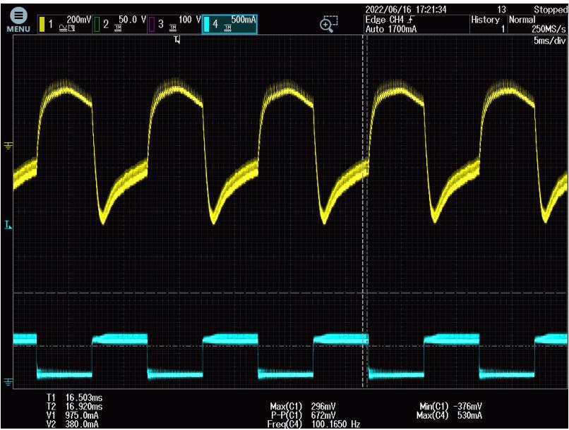

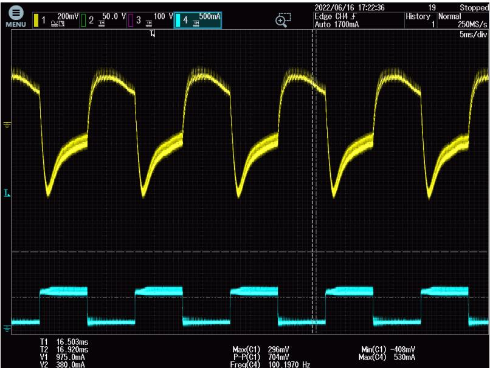

115 VAC

CH1 VOUT ${ \mathsf { C H 1 } } { \mathsf { V } } _ { \mathsf { O U T } }$ $V _ { P K - P K } = 6 7 2 m v$  
$\mathsf { C H 4 } \mathsf { I } _ { \mathsf { O U T } }$

## Test Condition:

➢ $0 . 0 5 \ : \mathsf { A } – 0 . 4 5 \mathsf { A } – 0 . 0 5 \ : \mathsf { A }$  
➢ Slew Rate: 0.5 A/μS  
➢ Frequency: 100 Hz

265 VAC

CH1 VOUT ${ \mathsf { C H 1 } } { \mathsf { V } } _ { \mathsf { O U T } }$ $V _ { P K - P K } = 7 0 4 m v$  
$\mathsf { C H 4 } \mathsf { I } _ { \mathsf { O U T } }$

## Test Condition:

➢ 0.05 A-0.45A-0.05 A  
➢ Slew Rate: 0.5 A/μS  
➢ Frequency: 100 Hz

## 输出电压开机波形

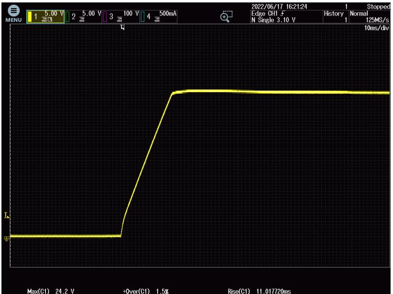

90 VAC

CH1 VOUT TRISE: 11 mS

## Test Condition:

➢ No Load

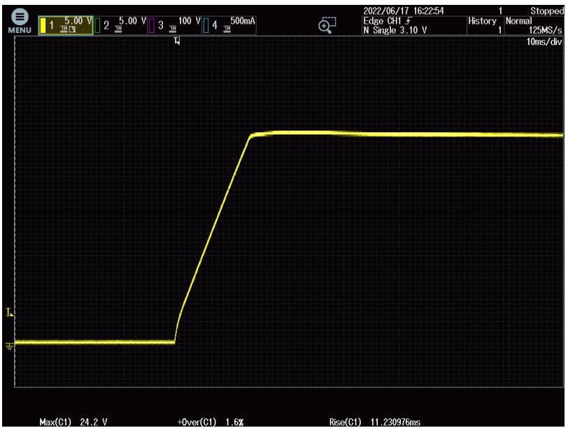

265 VAC

CH1 VOUT TRISE: 11.2 mS

## Test Condition:

➢ No Load

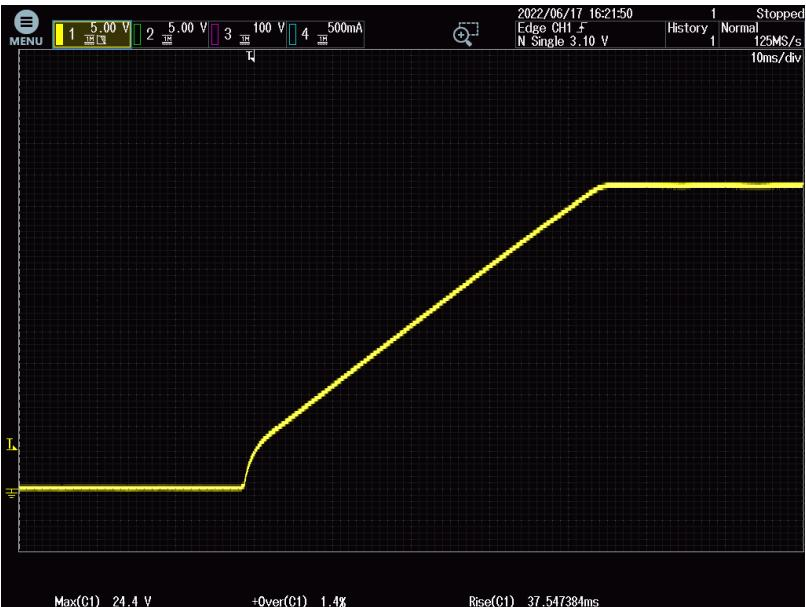

90 VAC

CH1 VOUT TRISE: 37.5 mS

## Test Condition:

➢ Full Load

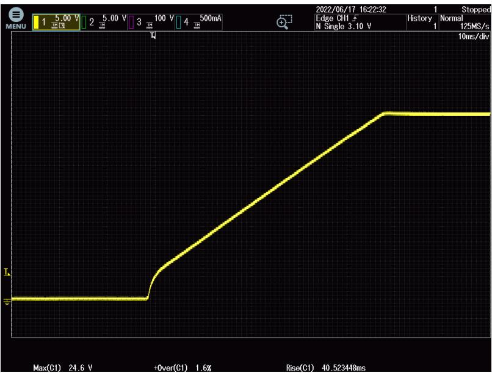

265 VAC

CH1 VOUT TRISE: 40.5 mS

## Test Condition:

➢ Full Load

## 开机延迟时间波形

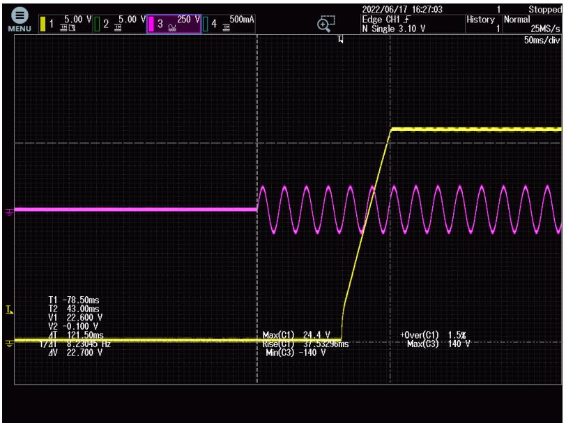

90 VAC

CH1 $\mathsf { V } _ { \mathsf { O U T } }$  
CH3 VIN $\mathsf { V } _ { \mathsf { I N } }$ ${ \sf T } _ { \sf D e l a y } \dot { \bullet }$ 121.5 mS

Test Condition:  
➢ Full Load  
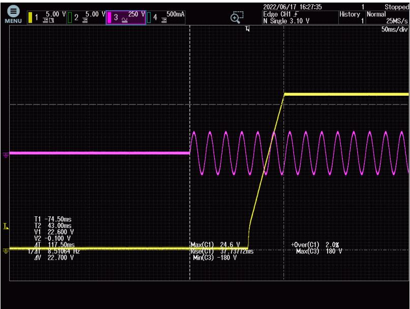

115 VAC

CH1 $\mathsf { V } _ { \mathsf { O U T } }$  
CH3 VIN $\mathsf { V } _ { \mathsf { I N } }$ ${ \sf T } _ { \sf D e l a y } \dot { \bullet }$ 117.5 mS

Test Condition:  
➢ Full Load  
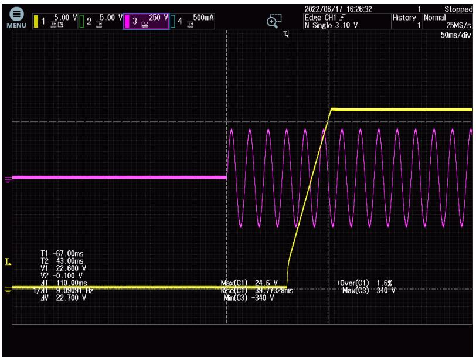

230 VAC

CH1 $\mathsf { V } _ { \mathsf { O U T } }$  
CH3 VIN $\mathsf { V } _ { \mathsf { I N } }$ $\bar { \mathsf { T } } _ { \mathsf { D e l a y } } \mathrm { : }$ 110 mS

Test Condition:  
➢ Full Load  
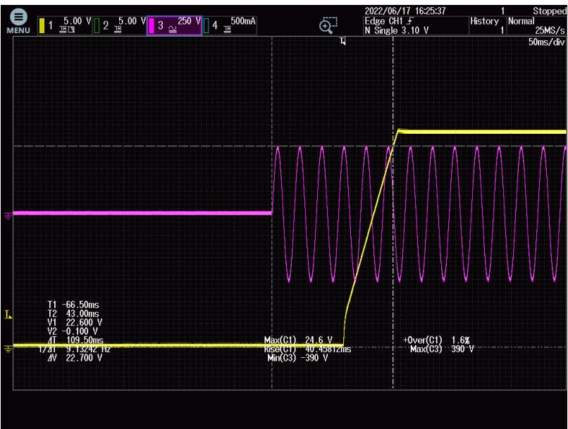

265 $\mathsf { v } _ { \mathsf { A C } }$

CH1 $\mathsf { V } _ { \mathsf { O U T } }$  
CH3 VIN $\mathsf { V } _ { \mathsf { I N } }$ ${ \sf T } _ { \sf D e l a y } \dot { \bullet }$ 109 mS

Test Condition:

➢ Full Load

## MOs漏源极电压电流波形 (启机）

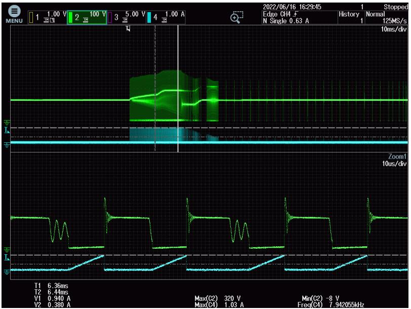

90 VAC

${ \mathsf { C H } } 2 { \mathsf { V } } _ { \mathsf { D S } }$  
$C H 4 1 _ { \mathsf { D } }$ $V _ { \mathsf { D } \mathsf { S } } { = } 3 2 0 \mathsf { V }$ IMAX= 1.03 A $\mathsf { I } _ { \mathsf { M A X } } = \mathsf { 1 } . 0 3 \mathsf { A }$

Test Condition:  
➢ No Load  
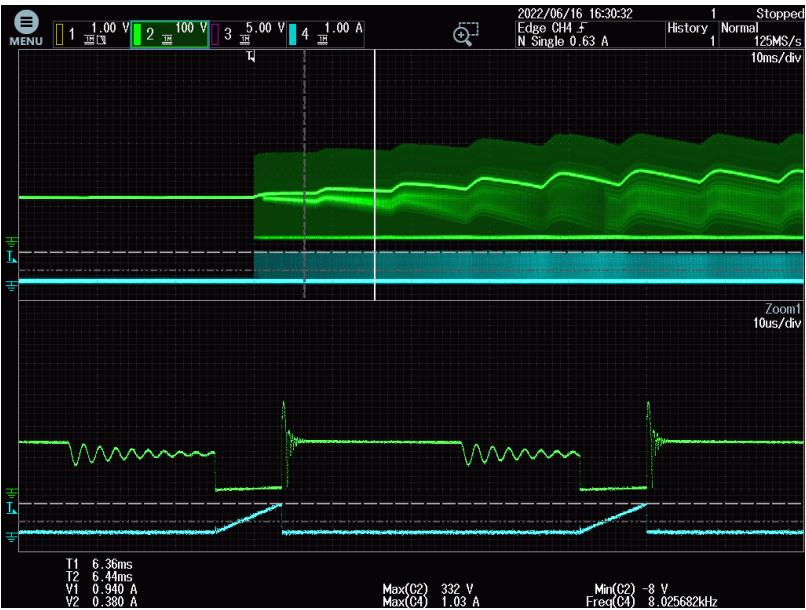

90 VAC

${ \mathsf { C H } } 2 { \mathsf { V } } _ { \mathsf { D S } }$  
$C H 4 1 _ { \mathsf { D } }$ $V _ { \mathsf { D } \mathsf { S } } = 3 3 2 \ \mathsf { V }$ IMAX= 1.03 A $\mathsf { I } _ { \mathsf { M A X } } = \mathbf { 1 } . \mathbf { 0 } 3 \mathsf { A }$

Test Condition:  
➢ Full Load  
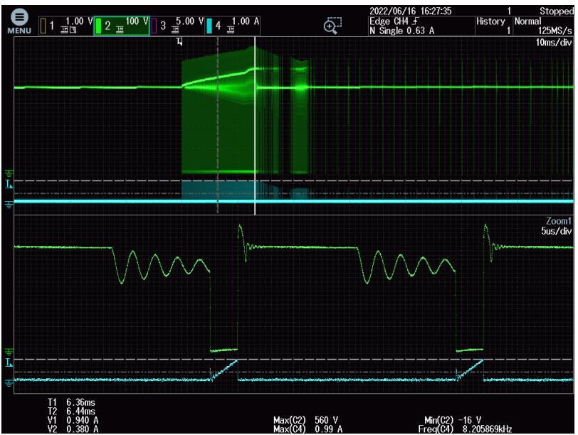

265 VAC

${ \mathsf { C H } } 2 \ { \mathsf { V } } _ { \mathsf { D S } }$  
$C H 4 1 _ { \mathsf { D } }$ $V _ { \mathsf { D S } } { = } 5 6 0 \lor$ IMAX=0.99 A $\mathsf { I } _ { \mathsf { M A X } } { = } \mathsf { 0 } . 9 9 \mathsf { A }$

Test Condition:  
➢ No Load  
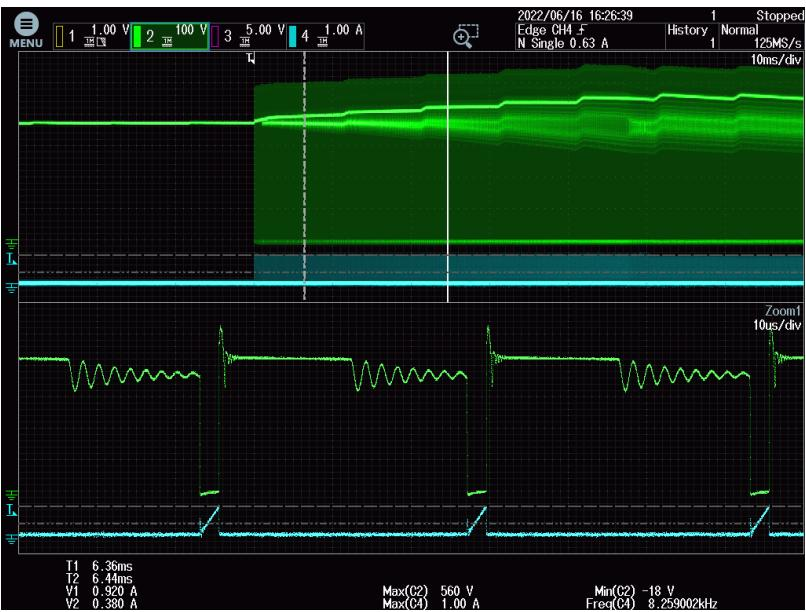

265 VAC

${ \mathsf { C H } } 2 { \mathsf { V } } _ { \mathsf { D S } }$  
$C H 4 1 _ { \mathsf { D } }$ $V _ { \mathsf { D S } } { = } 5 6 0 \ V$ $\mathsf { I } _ { \mathsf { M A X } } { = } \pmb { 1 } \pmb { \mathsf { A } }$

Test Condition:

➢ Full Load

## MOS漏源极电压电流波形 (正常工作)

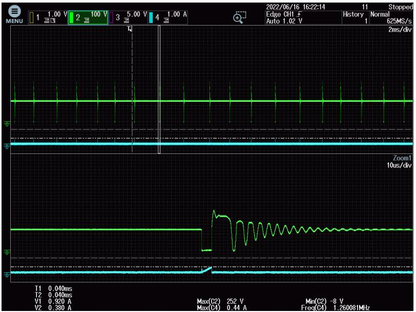

90 VAC

${ \mathsf { C H } } 2 { \mathsf { V } } _ { \mathsf { D S } }$  
$C H 4 1 _ { \mathsf { D } }$ $V _ { \mathsf { D } \mathsf { S } } = 2 5 2 \ \mathsf { V }$ $\mathsf { I } _ { \mathsf { M A X } } { = } 4 4 0 \mathsf { m } \mathsf { A }$

Test Condition:  
➢ No Load  
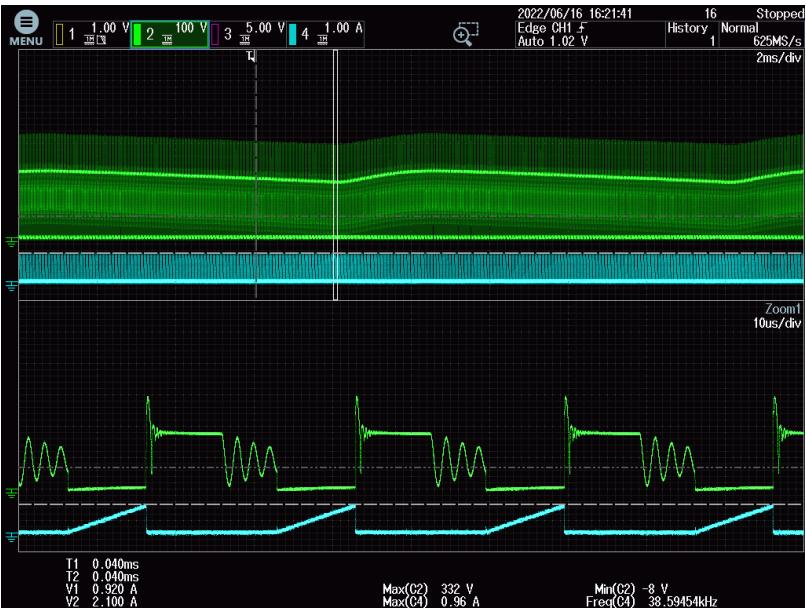

90 VAC

${ \mathsf { C H } } 2 { \mathsf { V } } _ { \mathsf { D S } }$  
$C H 4 1 _ { \mathsf { D } }$ $V _ { \mathsf { D } \mathsf { S } } = 3 3 2 \ \mathsf { V }$ IMAX= 960 mA $\mathsf { I } _ { \mathsf { M A X } } { = } 9 6 0 \mathsf { m } \mathsf { A }$

Test Condition:  
➢ Full Load  
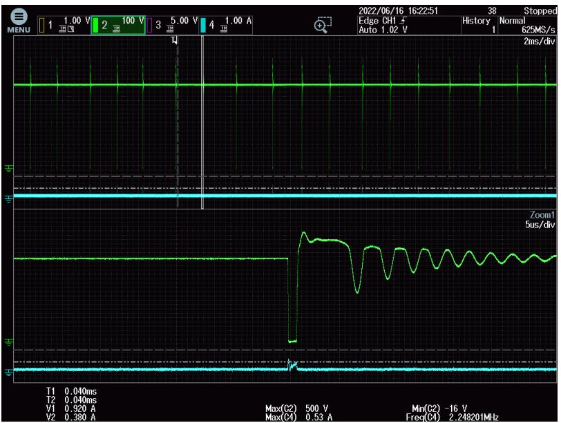

265 VAC

${ \mathsf { C H } } 2 \ { \mathsf { V } } _ { \mathsf { D S } }$  
$C H 4 1 _ { \mathsf { D } }$ $\mathtt { V } _ { \mathsf { D S } } mathtt { = } 5 0 0 \mathtt { V }$ IMAX=530 mA $\mathsf { I } _ { \mathsf { M A X } } { = } 5 3 0 \mathsf { m } \mathsf { A }$

Test Condition:  
➢ No Load  
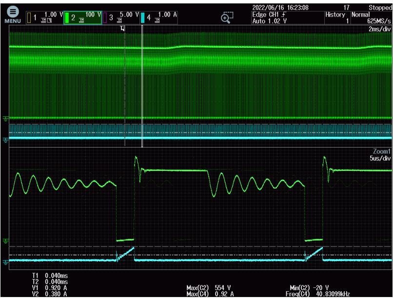

265 VAC

${ \mathsf { C H } } 2 { \mathsf { V } } _ { \mathsf { D S } }$  
$C H 4 1 _ { \mathsf { D } }$ $V _ { \mathsf { D S } } { = } 5 5 4 \mathrm { V }$ IMAX=920 mA $\mathsf { I } _ { \mathsf { M A X } } { = } 9 2 0 \mathsf { m } \mathsf { A }$

Test Condition:

➢ Full Load

## 输出二极管电压波形

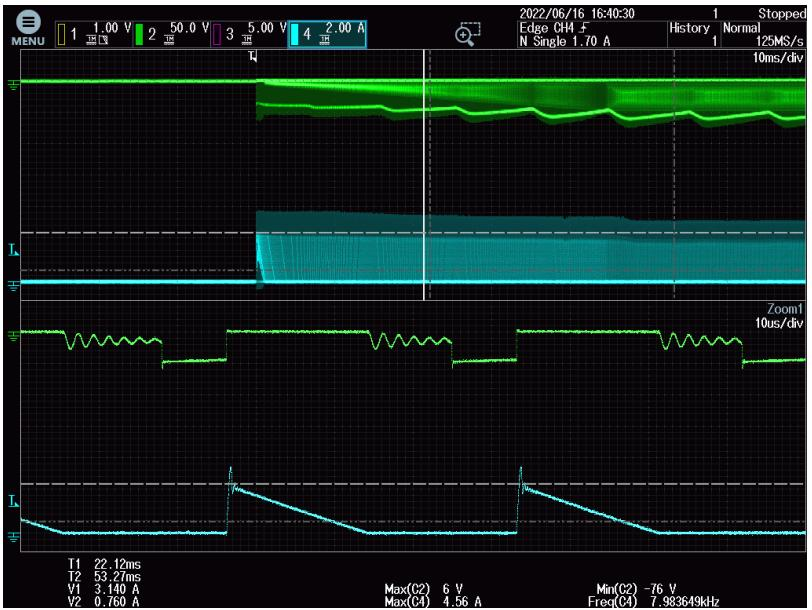

90 VAC

$C H 2 V _ { \mathsf { D } }$  
$C H 4 1 _ { \mathsf { D } }$ $\mathtt { V } _ { \mathtt { D } } \mathtt { = } 7 6 \mathtt { V }$ $\mathsf { I } _ { \mathsf { D m a x } } { = } 4 . 5 6 ~ \mathsf { A }$

## Test Condition:

➢ Full Load  
➢ 开机

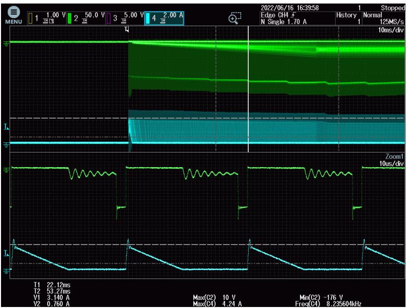

265 VAC

$C H 2 V _ { \mathsf { D } }$  
$C H 4 1 _ { \mathsf { D } }$ $\mathtt { V } _ { \mathtt { D } } mathtt { = } 1 7 6 \mathtt { V }$ $\mathsf { I } _ { \mathsf { D m a x } } { = } 4 . 2 4 ~ \mathsf { A }$ Dmax

## Test Condition:

➢ Full Load  
➢ 开机

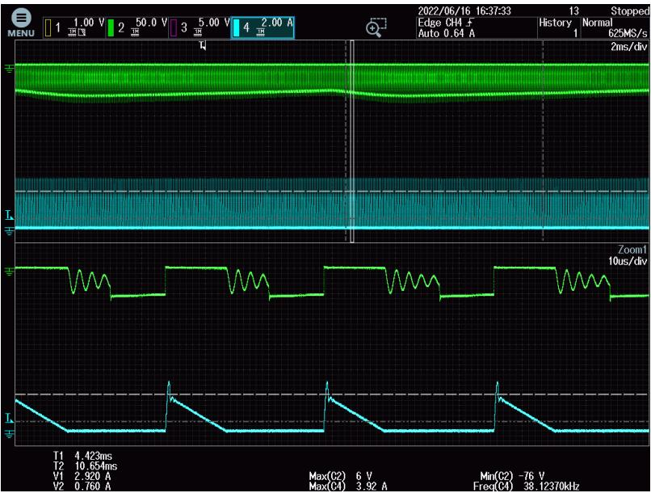

90 VAC

$C H 2 V _ { \mathsf { D } }$  
$C H 4 1 _ { \mathsf { D } }$ $\mathtt { V } _ { \mathtt { D } } \mathtt { = } 7 6 \mathtt { V }$ $\mathsf { I } _ { \mathsf { D m a x } } = 3 . 9 2 \mathrm { ~ A ~ }$ Dmax

## Test Condition:

➢ Full Load

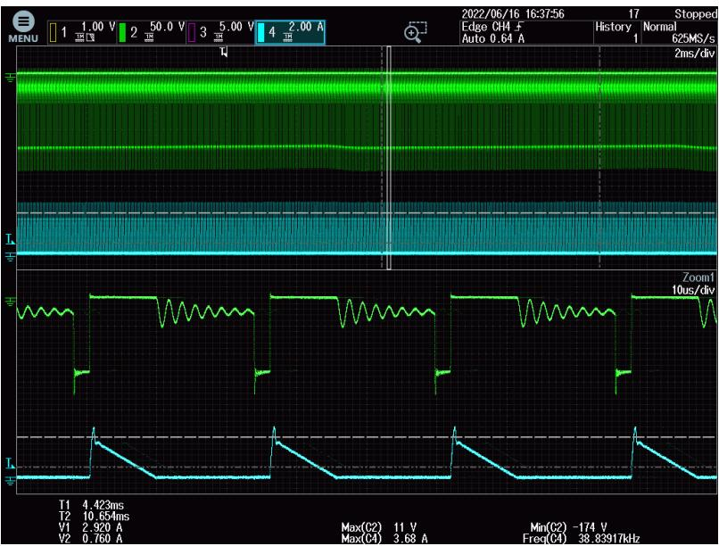

265 VAC

$C H 2 V _ { \mathsf { D } }$  
CH4 ID $C H 4 1 _ { \mathsf { D } }$ $\mathtt { V } _ { \mathtt { D } } { = } 1 7 4 \mathtt { V }$ IDmax=3.68 A $\mathsf { I } _ { \mathsf { D m a x } } { = } 3 . 6 8 \mathsf { A }$

## Test Condition:

➢ Full Load

## 输出短路时MOs和二极管波形

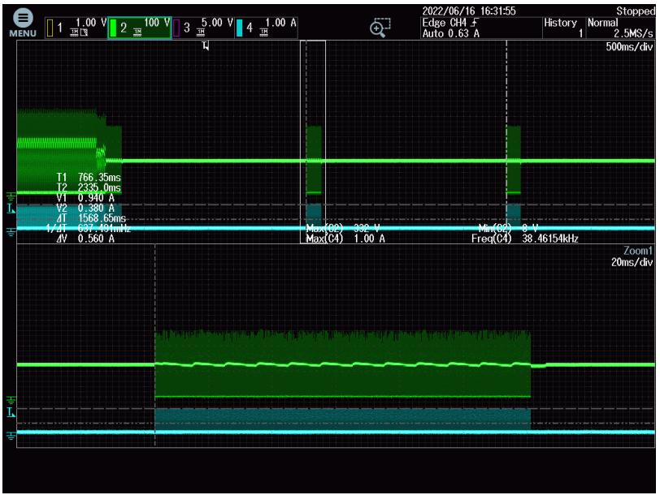

90 VAC

${ \mathsf { C H } } 2 { \mathsf { V } } _ { \mathsf { D S } }$  
$C H 4 1 _ { \mathsf { D } }$ $\begin{array} { l } { { \mathsf { V } } _ { { \mathsf { D } } { \mathsf { S } } \_ { \mathsf { m a x } } } { = } 3 3 2 { \mathsf { V } } } \\ { { \mathsf { I } } _ { { \mathsf { D } } { \mathsf { S } } \_ { \mathsf { m a x } } } { = } 1 { \mathsf { A } } } \end{array}$

## MOS

## Test Condition:

➢ Full Load

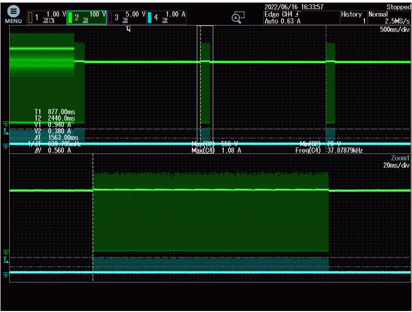

265 VAC

${ \mathsf { C H } } 2 { \mathsf { V } } _ { \mathsf { D S } }$  
CH4 ID $\mathtt { V _ { D S \_ m a x } } = 5 5 6 \lor$ $\mathsf { I } _ { \mathsf { D } \mathsf { S } \_ \mathsf { m a x } } = \mathsf { 1 } . 0 8 \mathsf { A }$

## MOS

## Test Condition:

➢ Full Load

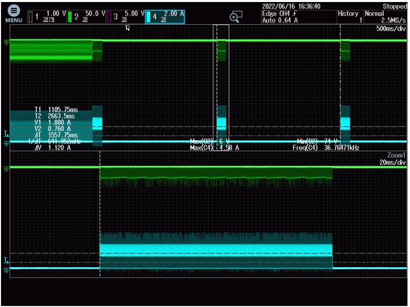

90 VAC

CH2 VD  
CH4 ID VD=74 V Dmax =4.58 A

## Test Condition:

➢ Full Load

## 二极管

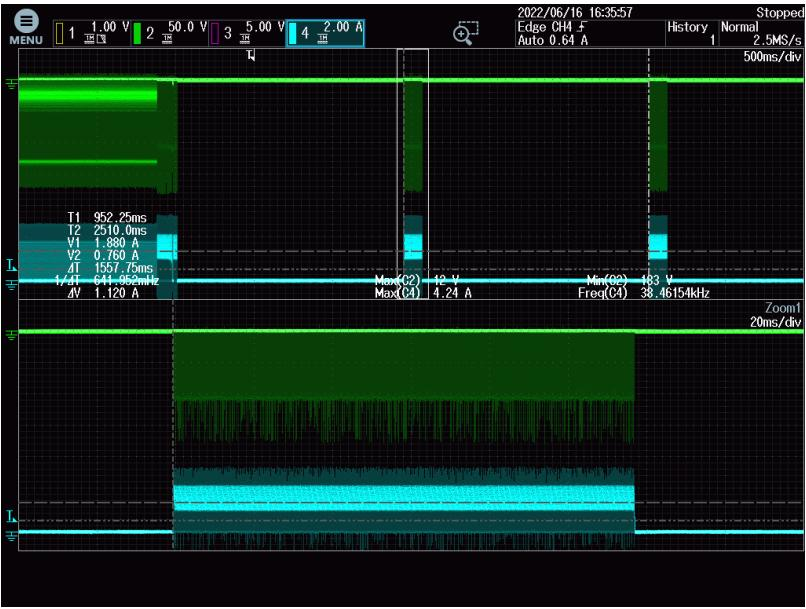

265 VAC

CH2 VD  
CH4 ID$\mathtt { V } _ { \mathtt { D } } \mathtt { = } 1 8 3 \mathrm { ~ V ~ }$ $\mathsf { I } _ { \mathsf { D m a x } } { = } 4 . 2 4 ~ \mathsf { A }$ IDmax

## Test Condition:

➢ Full Load

## 二极管

## 温升测试

<table><tr><td rowspan="2">项目</td><td colspan="4">温度(°C)</td></tr><tr><td>90VAC</td><td>115VAC</td><td>230VAC</td><td>265VAC</td></tr><tr><td>环境温度</td><td>38.8</td><td>40.4</td><td>39.9</td><td>39</td></tr><tr><td>BP86213D (U1)</td><td>103.5</td><td>90.8</td><td>75.3</td><td>75.3</td></tr><tr><td>SF56 (D205)</td><td>73.2</td><td>73.2</td><td>75.1</td><td>77</td></tr><tr><td>变压器绕组 (T1)</td><td>83.1</td><td>80.6</td><td>78.6</td><td>80.1</td></tr><tr><td>变压器磁芯 (T1)</td><td>79.8</td><td>77.1</td><td>75.6</td><td>77.5</td></tr><tr><td>输入电解电容(EC102)</td><td>66.9</td><td>63.1</td><td>56.4</td><td>55.9</td></tr><tr><td>输出电解电容(EC201)</td><td>64.6</td><td>64.9</td><td>65.8</td><td>67.1</td></tr><tr><td>整流桥 (DB101)</td><td>63.1</td><td>59.2</td><td>50.4</td><td>48.7</td></tr></table>

## 测试说明

➢ 在温箱中进行测试  
➢ 电路板放在一个封闭的盒子内  
➢ 热电偶连接到各个测量点  
➢ 等测量点温度达到稳定后记录数据

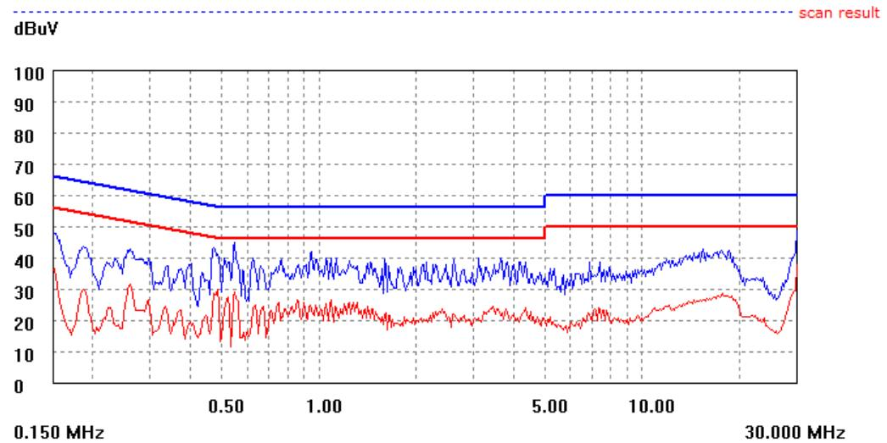

115VAC Line

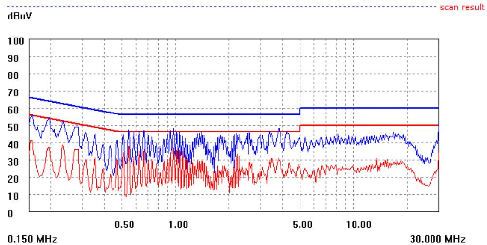

230VAC Line

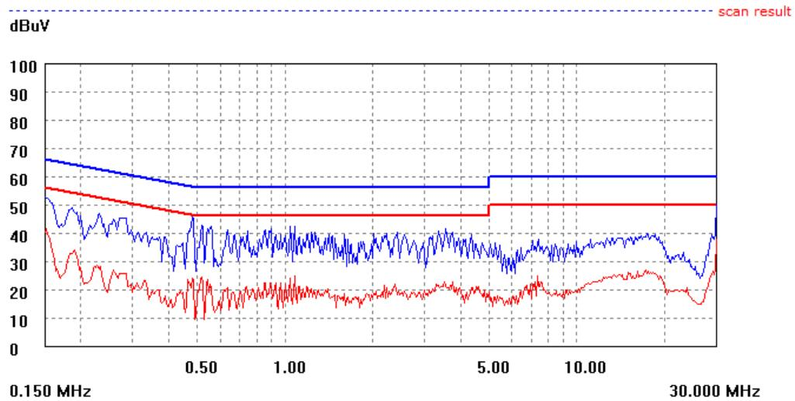

115VAC Neutral

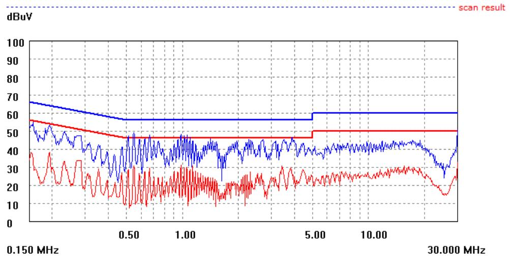

230VAC Neutral

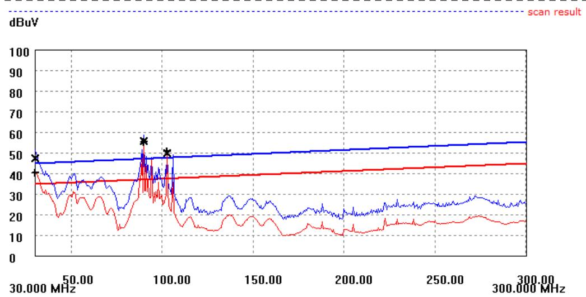

230VAC Line

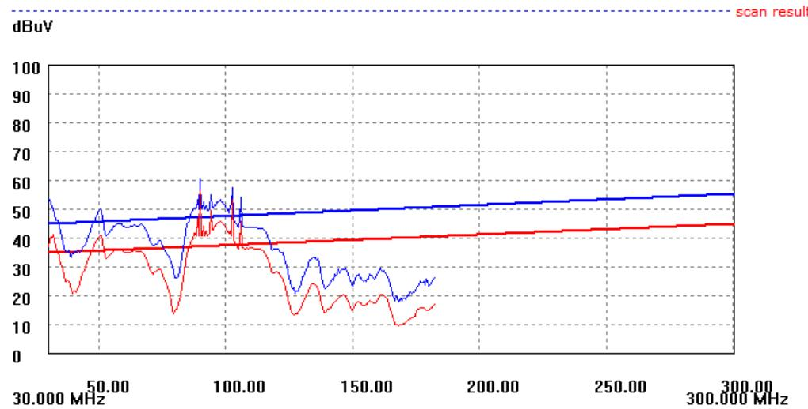

230VAC Neutral

## THANK YOU FOR WATCHING
