## BP86213D参考设计 5V/1A

颜臻正&黄朝龙

2023年9月25日

上海晶丰明源半导体股份有限公司

## 1. 参数规格

<table><tr><td>项目描述</td><td>符号</td><td>最小</td><td>典型</td><td>最大</td><td>单位</td><td>备注</td></tr><tr><td colspan="7">输入</td></tr><tr><td>电压</td><td> $V_{IN}$ </td><td>90</td><td>115/230</td><td>264</td><td> $V_{AC}$ </td><td></td></tr><tr><td>频率</td><td> $f_{LINE}$ </td><td>47</td><td>50/60</td><td>63</td><td>Hz</td><td></td></tr><tr><td colspan="7">输出</td></tr><tr><td>输出电压</td><td> $V_{OUT}$ </td><td></td><td>5</td><td></td><td>V</td><td>±3%</td></tr><tr><td>输出电流</td><td> $I_{OUT}$ </td><td></td><td>1.0</td><td></td><td>A</td><td></td></tr><tr><td>输出电压纹波</td><td> $V_{RIPPLE}$ </td><td></td><td>344</td><td></td><td>mV</td><td>20MHz带宽</td></tr><tr><td>连续输出功率</td><td> $P_{OUT}$ </td><td></td><td>5.0</td><td></td><td>W</td><td></td></tr><tr><td colspan="7">效率</td></tr><tr><td>待机功耗</td><td> $P_{STDBY}$ </td><td></td><td></td><td>200</td><td>mW</td><td>230VAC</td></tr><tr><td>满载效率</td><td>η</td><td>72.18</td><td></td><td></td><td>%</td><td>115VAC/230VAC</td></tr><tr><td colspan="7">环境</td></tr><tr><td>传导EMI</td><td></td><td colspan="4">满足CISPR22/EN55022 Class B,至少6dB 裕量</td><td></td></tr><tr><td>Surge</td><td></td><td></td><td>2</td><td></td><td>kV</td><td>差模</td></tr><tr><td>EFT</td><td></td><td></td><td>4</td><td></td><td>kV</td><td>5kHz/100kHz/38kHz</td></tr></table>

## 2. 原理图

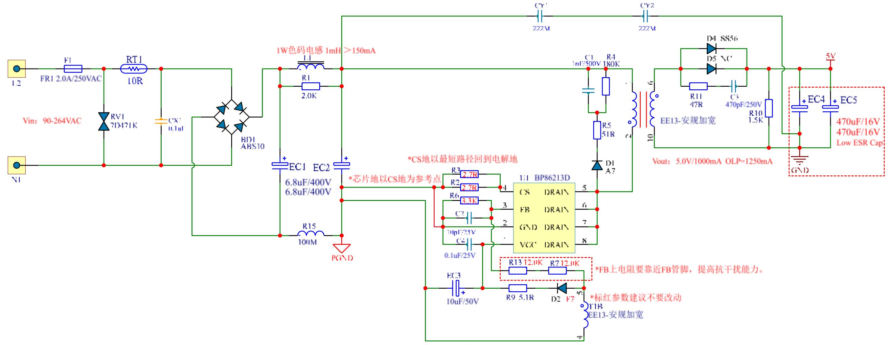

## 3. BOM 清单

<table><tr><td>序号</td><td>元件标号</td><td>规格参数</td><td>封装尺寸</td><td>数量</td></tr><tr><td>1</td><td>BD1</td><td>贴片整流桥ABS10</td><td>SOP-4</td><td>1</td></tr><tr><td>2</td><td>C1</td><td>贴片电容1.0nF/500V</td><td>C1206S</td><td>1</td></tr><tr><td>3</td><td>C2</td><td>贴片电容10pF/25V</td><td>C0805S</td><td>1</td></tr><tr><td>4</td><td>C3</td><td>贴片电容470pF/250V</td><td>C1206S</td><td>1</td></tr><tr><td>5</td><td>C4</td><td>贴片电容0.1uF/25V</td><td>C0805S</td><td>1</td></tr><tr><td>6</td><td>CX1</td><td>安规X电容0.1uF</td><td>CX 10</td><td>1</td></tr><tr><td>7</td><td>CY1, CY2</td><td>安规Y1电容222M</td><td>CY1</td><td>2</td></tr><tr><td>8</td><td>D1</td><td>贴片二极管A7</td><td>SOD-123FL</td><td>1</td></tr><tr><td>9</td><td>D2</td><td>贴片二极管F7</td><td>SOD-123FL</td><td>1</td></tr><tr><td>10</td><td>D4</td><td>肖特基二极管SS310</td><td>D-SMA</td><td>1</td></tr><tr><td>11</td><td>D5</td><td>NC</td><td>D-SMA</td><td>1</td></tr><tr><td>12</td><td>EC1</td><td>插件电解6.8uF/400V</td><td>C-DR8</td><td>1</td></tr><tr><td>13</td><td>EC2</td><td>插件电解6.8uF/400V</td><td>C-DR8</td><td>1</td></tr><tr><td>14</td><td>EC3</td><td>插件电解10uF/50V</td><td>C-DR5</td><td>1</td></tr><tr><td>15</td><td>EC4, EC5</td><td>插件电解470uF/16V高频低阻</td><td>C-DR6.3</td><td>2</td></tr><tr><td>16</td><td>F1</td><td>FR1 2.0A/250VAC</td><td>F-8X4</td><td>1</td></tr></table>

<table><tr><td>序号</td><td>元件标号</td><td>规格参数</td><td>封装尺寸</td><td>数量</td></tr><tr><td>17</td><td>L1</td><td>1W色码电感1.0mH &gt;150mA</td><td>L</td><td>1</td></tr><tr><td>18</td><td>R1</td><td>贴片电阻2.0K±5%</td><td>R1206S</td><td>1</td></tr><tr><td>19</td><td>R2</td><td>贴片电阻2.7R±1%</td><td>R1206S</td><td>1</td></tr><tr><td>20</td><td>R3</td><td>贴片电阻2.7R±1%</td><td>R1206S</td><td>1</td></tr><tr><td>21</td><td>R4</td><td>贴片电阻180K±5%</td><td>R1206S</td><td>1</td></tr><tr><td>22</td><td>R5</td><td>贴片电阻51R±5%</td><td>R1206S</td><td>1</td></tr><tr><td>23</td><td>R6</td><td>贴片电阻3.3K±1%</td><td>R0805S</td><td>1</td></tr><tr><td>24</td><td>R7, R13</td><td>贴片电阻12.0K±1%</td><td>R1206S</td><td>2</td></tr><tr><td>25</td><td>R9</td><td>贴片电阻5.1R±1%</td><td>R0805S</td><td>1</td></tr><tr><td>26</td><td>R10</td><td>贴片电阻1.0K±5%</td><td>R0805S</td><td>1</td></tr><tr><td>27</td><td>R11</td><td>贴片电阻47R±5%</td><td>R1206S</td><td>1</td></tr><tr><td>28</td><td>R15</td><td>贴片磁珠100Ω@100M 800mA</td><td>L 0603S</td><td>1</td></tr><tr><td>29</td><td>RT1</td><td>1W绕线电阻10R</td><td>RS 1W-V5</td><td>1</td></tr><tr><td>30</td><td>RV1</td><td>压敏电阻7D471K</td><td>VDR 7D</td><td>1</td></tr><tr><td>31</td><td>T1</td><td>EE13-5+5立式变压器</td><td>EE13 5+5安规加宽</td><td>1</td></tr><tr><td>32</td><td>U1</td><td>电源芯片BP86213D</td><td>SOP-8</td><td>1</td></tr></table>

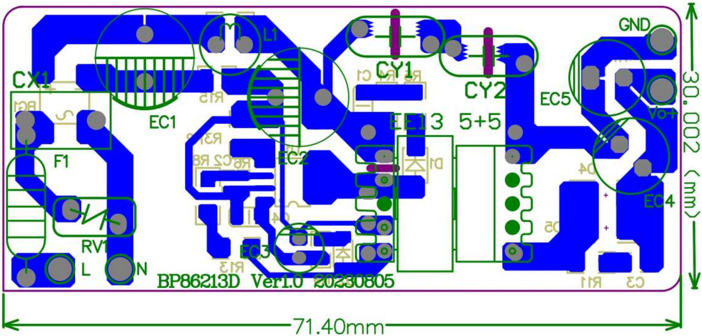

## 5. 实物样机

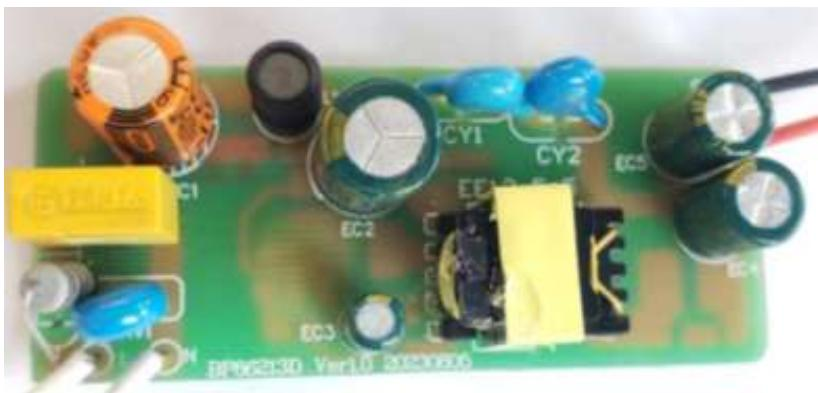

TOP SIDE

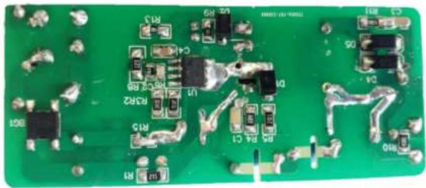

BOTTOM SIDE

## 原理图

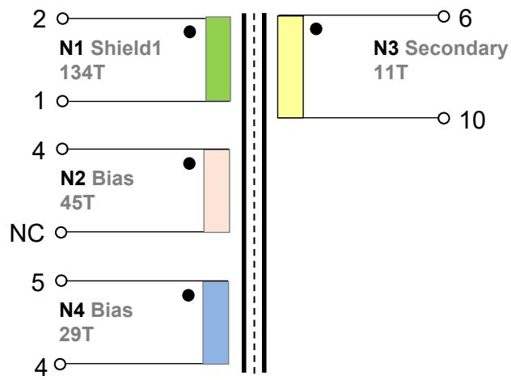

## 规格与材料

初级绕组感量 $\mathsf { L } _ { \mathsf { p } } { = } 1 . 7 \mathsf { m } \mathsf { H } \pm 5 \%$

（测试条件：2-1脚 0.3V，1kHz）

➢ 漏感量 $L _ { \mathrm { { 1 k } } } { < } 5 5 \mathrm { { u H } }$  
➢ 骨架EE13立式加宽 5+5PIN  
➢ 磁芯：EE13立式加宽 PC40 或同等材质 ， ${ \mathsf { A e } } { = } 1 7 . 1 { \mathsf { m m } } ^ { 2 }$  
➢ 绝缘胶带:3M900 或同等材质  
➢ 耐压测试: $3 \mathsf { K V } , 5 0 / 6 0 \mathsf { H z } , 1 \mathsf { M i n }$  
➢ 成品要求：浸凡立水

绕线方式

<table><tr><td>绕组</td><td>起始脚</td><td>终止脚</td><td>材料</td><td>匝数</td><td>绕线方式</td></tr><tr><td>N1</td><td>2</td><td>1</td><td> $\phi 0.15*1$ </td><td>156Ts</td><td>密绕三层(不交叉)</td></tr><tr><td colspan="4">胶带</td><td>2Ts</td><td></td></tr><tr><td>N2</td><td>4</td><td>NC</td><td> $\phi 0.16*1$ </td><td>45Ts</td><td>密绕一层(不交叉)</td></tr><tr><td colspan="4">胶带</td><td>2Ts</td><td></td></tr><tr><td>N3</td><td>6</td><td>10</td><td>三层绝缘线 $\phi 0.45*1$ </td><td>11Ts</td><td>密绕一层(交叉)</td></tr><tr><td colspan="4">胶带</td><td>2Ts</td><td></td></tr><tr><td>N4</td><td>5</td><td>4</td><td> $\phi 0.16*1$ </td><td>29Ts</td><td>密绕一层(不交叉)</td></tr><tr><td colspan="4">胶带</td><td>2Ts</td><td></td></tr></table>

脚位图  
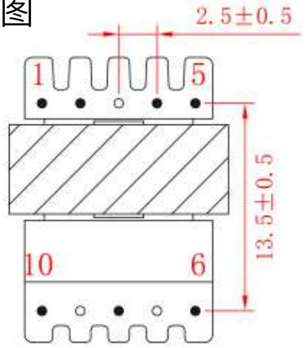

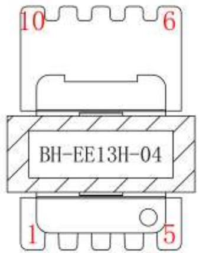

## 7. 效率参数

<table><tr><td> $V_{IN}(VAC)$ </td><td>Load(%)</td><td>PIN(W)</td><td>VOUT(V)1</td><td>IOUT(A)1</td><td>POUT(W)</td><td>Eff(%)</td><td>AVG Eff(%)</td></tr><tr><td rowspan="4">90</td><td>25%</td><td>1.74</td><td>5.14</td><td>0.25</td><td>1.285</td><td>73.85%</td><td rowspan="4">73.41%</td></tr><tr><td>50%</td><td>3.45</td><td>5.13</td><td>0.5</td><td>2.565</td><td>74.35%</td></tr><tr><td>75%</td><td>5.23</td><td>5.11</td><td>0.75</td><td>3.8325</td><td>73.28%</td></tr><tr><td>100%</td><td>7.08</td><td>5.11</td><td>1</td><td>5.11</td><td>72.18%</td></tr><tr><td rowspan="4">115</td><td>25%</td><td>1.77</td><td>5.11</td><td>0.25</td><td>1.2775</td><td>72.18%</td><td rowspan="4">73.21%</td></tr><tr><td>50%</td><td>3.45</td><td>5.11</td><td>0.5</td><td>2.555</td><td>74.06%</td></tr><tr><td>75%</td><td>5.2</td><td>5.1</td><td>0.75</td><td>3.825</td><td>73.56%</td></tr><tr><td>100%</td><td>6.98</td><td>5.1</td><td>1</td><td>5.1</td><td>73.07%</td></tr><tr><td rowspan="4">230</td><td>25%</td><td>1.95</td><td>5.11</td><td>0.25</td><td>1.2775</td><td>65.51%</td><td rowspan="4">70.41%</td></tr><tr><td>50%</td><td>3.6</td><td>5.11</td><td>0.5</td><td>2.555</td><td>70.97%</td></tr><tr><td>75%</td><td>5.29</td><td>5.11</td><td>0.75</td><td>3.8325</td><td>72.45%</td></tr><tr><td>100%</td><td>7.03</td><td>5.11</td><td>1</td><td>5.11</td><td>72.69%</td></tr><tr><td rowspan="4">265</td><td>25%</td><td>2.04</td><td>5.08</td><td>0.25</td><td>1.27</td><td>62.25%</td><td rowspan="4">68.45%</td></tr><tr><td>50%</td><td>3.7</td><td>5.08</td><td>0.5</td><td>2.54</td><td>68.65%</td></tr><tr><td>75%</td><td>5.38</td><td>5.09</td><td>0.75</td><td>3.8175</td><td>70.96%</td></tr><tr><td>100%</td><td>7.09</td><td>5.1</td><td>1</td><td>5.1</td><td>71.93%</td></tr></table>

  
8. 输出电压调整率

<table><tr><td> $V_{IN}(VAC)$ Load(%)</td><td>90</td><td>115</td><td>132</td><td>176</td><td>230</td><td>265</td><td>平均值</td><td>线调整率</td></tr><tr><td>0</td><td>5.25</td><td>5.27</td><td>5.26</td><td>5.26</td><td>5.24</td><td>5.25</td><td>5.26</td><td>0.57%</td></tr><tr><td>20%</td><td>5.13</td><td>5.12</td><td>5.12</td><td>5.12</td><td>5.11</td><td>5.11</td><td>5.12</td><td>0.39%</td></tr><tr><td>40%</td><td>5.13</td><td>5.13</td><td>5.12</td><td>5.12</td><td>5.12</td><td>5.11</td><td>5.12</td><td>0.39%</td></tr><tr><td>60%</td><td>5.11</td><td>5.12</td><td>5.12</td><td>5.13</td><td>5.1</td><td>5.11</td><td>5.12</td><td>0.59%</td></tr><tr><td>80%</td><td>5.10</td><td>5.12</td><td>5.11</td><td>5.12</td><td>5.11</td><td>5.11</td><td>5.11</td><td>0.39%</td></tr><tr><td>100%</td><td>5.1</td><td>5.11</td><td>5.11</td><td>5.12</td><td>5.11</td><td>5.12</td><td>5.11</td><td>0.39%</td></tr><tr><td>平均值</td><td>5.14</td><td>5.15</td><td>5.14</td><td>5.15</td><td>5.13</td><td>5.14</td><td rowspan="2" colspan="2"></td></tr><tr><td>负载调整率</td><td>2.92%</td><td>3.11%</td><td>2.92%</td><td>2.72%</td><td>2.73%</td><td>2.73%</td></tr></table>

◼ 计算方法：调整率=100%\*(最大值-最小值)/平均值  
假负载电阻1.5K

## 9. 输出电压纹波

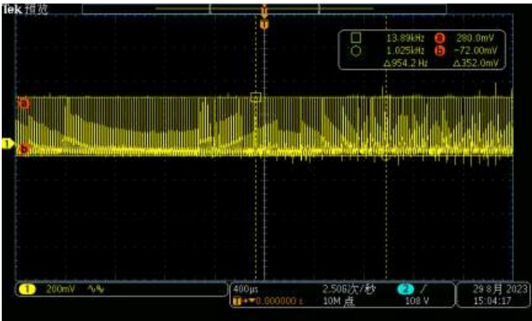

90 VAC

CH1 VOUT Ripple VPK-PK=352mV

Test Condition:

➢ Full Load

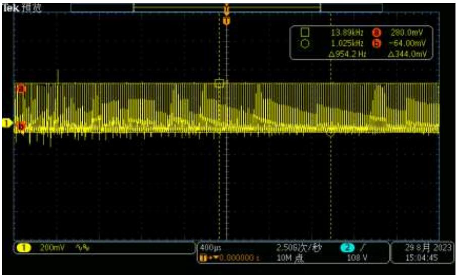

115 VAC

CH1 VOUT Ripple VPK-PK=344mV

Test Condition:

➢ Full Load

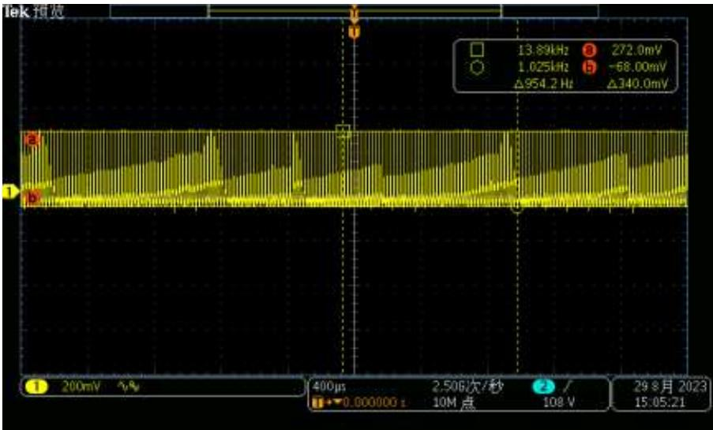

230 VAC

CH1 VOUT Ripple VPK-PK=340mV

Test Condition:

➢ Full Load

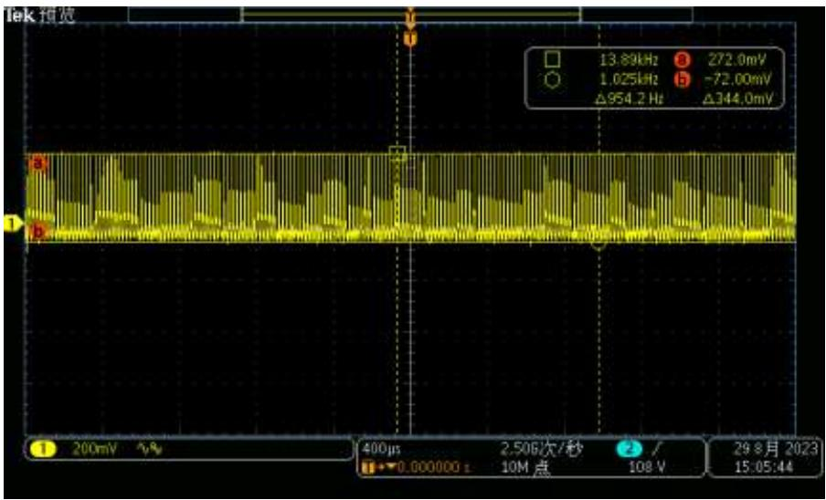

265 VAC

CH1 VOUT Ripple VPK-PK=344mV

Test Condition:

➢ Full Load

## 10. 动态负载（50 -100% ）

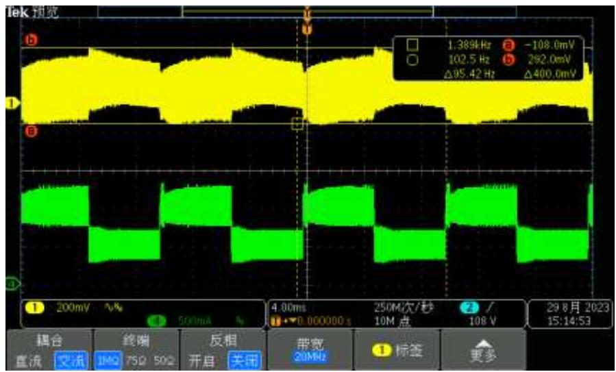

## 90 VAC

CH1 VOUT ${ \mathsf { C H 1 } } { \mathsf { V } } _ { \mathsf { O U T } }$ VPK-PK=400mV $V _ { P K - P K } = 4 0 0 m v$  
$\mathsf { C H 4 } \mathsf { I } _ { \mathsf { O U T } }$

## Test Condition:

➢ $0 . 5 \mathsf { A } \mathsf { - } 1 \mathsf { A } \mathsf { - } 0 . 5 \mathsf { A }$  
➢ Slew Rate: 0.5 $\mathsf { A } / \mu \mathsf { S }$  
➢ Frequency: 100 Hz

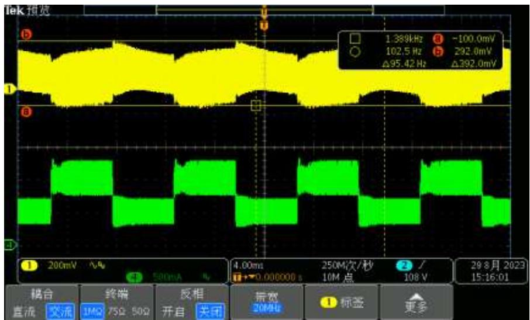

## 'BPS

## 晶丰明源

## 115 VAC

${ \mathsf { C H 1 } } { \mathsf { V } } _ { \mathsf { O U T } }$ CH1 VOUT $V _ { P K \mathrm { - } P K } = 3 9 2 \mathsf { m V }$  
$\mathsf { C H 4 } \mathsf { l } _ { \mathsf { O U T } }$

## Test Condition:

➢ $0 . 5 \mathsf { A } \mathsf { - } 1 \mathsf { A } \mathsf { - } 0 . 5 \mathsf { A }$  
➢ Slew Rate: 0.5 $\mathsf { A } / \mu \mathsf { S }$  
➢ Frequency: 100 Hz

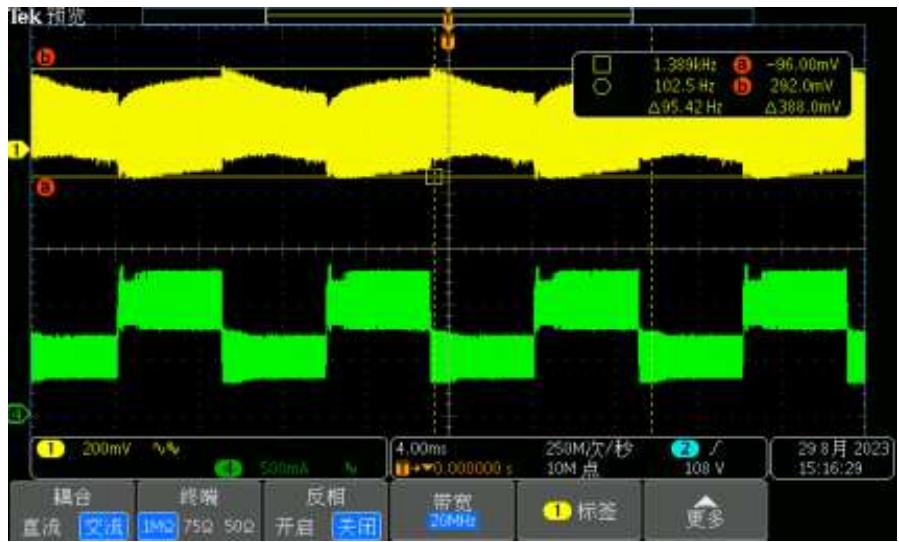

## 230 VAC

${ \mathsf { C H 1 } } { \mathsf { V } } _ { \mathsf { O U T } }$ CH1 VOUT $V _ { \mathsf { P K - P K } } = 3 8 8$ mV  
CH4 IOUT $\mathsf { C H 4 } \mathsf { I } _ { \mathsf { O U T } }$

## Test Condition:

➢ 0.5 A-1 A-0.5 A  
➢ Slew Rate: 0.5 A/ μS  
➢ Frequency: 100 Hz

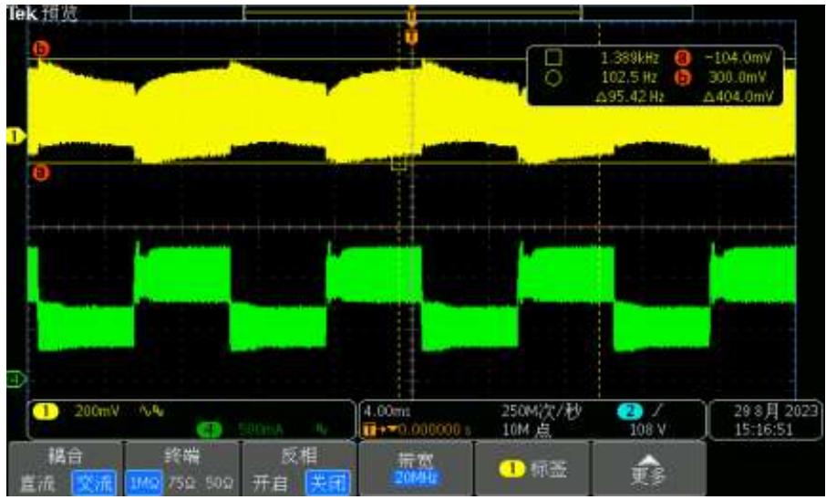

## 265 $\mathsf { v } _ { \mathsf { A C } }$

${ \mathsf { C H 1 } } { \mathsf { V } } _ { \mathsf { 0 U T } }$ CH1 VOUT $\mathsf { V } _ { \mathsf { P K - P K } } { = } 4 0 4 \mathsf { m V }$  
$\mathsf { C H 4 } \mathsf { I } _ { \mathsf { O U T } }$

## Test Condition:

➢ $0 . 5 \mathsf { A } \mathsf { - } 1 \mathsf { A } \mathsf { - } 0 . 5 \mathsf { A }$  
➢ Slew Rate: 0.5 A/ μS  
➢ Frequency: 100 Hz

## 11. 动态负载（10 -90%)

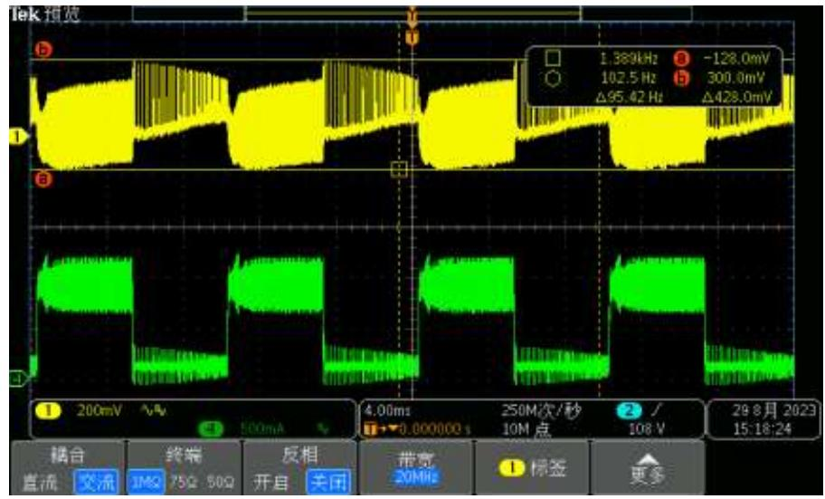

## $90 v _ { \mathsf { A C } }$

${ \mathsf { C H 1 } } { \mathsf { V } } _ { \mathsf { O U T } }$ CH1 VOUT $\mathsf { V } _ { \mathsf { P K - P K } } { = } 4 2 8 \mathsf { m V }$  
CH4 IOUT $\mathsf { C H 4 } \mathsf { I } _ { \mathsf { O U T } }$

## Test Condition:

➢ 0.1 A-0.9A-0.1 A  
Slew Rate: 0.5 $\mathsf { A } / \mu \mathsf { S }$  
➢ Frequency: 100 Hz

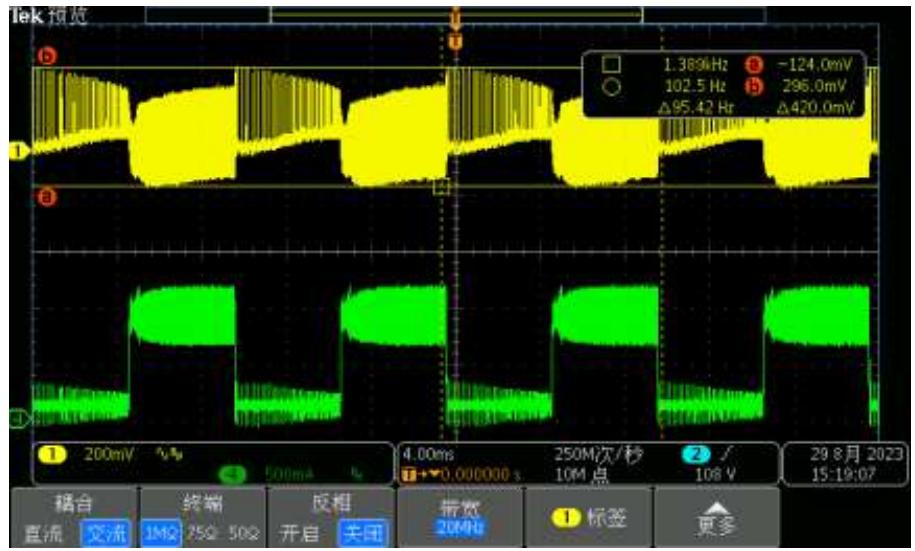

## 'BPS

## 晶丰明源

## $1 1 5 \ : \mathsf { V } _ { \mathsf { A C } }$

${ \mathsf { C H 1 } } { \mathsf { V } } _ { \mathsf { O U T } }$ CH1 VOUT $v _ { p _ { k - P K } } = 4 2 0 m v$  
$\mathsf { C H 4 } \mathsf { I } _ { \mathsf { O U T } }$

## Test Condition:

➢ $0 . 1 \mathsf { A } \mathsf { - } 0 . 9 \mathsf { A } \mathsf { - } 0 . 1$ A  
➢ Slew Rate: 0.5 $\mathsf { A } / \mu \mathsf { S }$  
➢ Frequency: 100 Hz

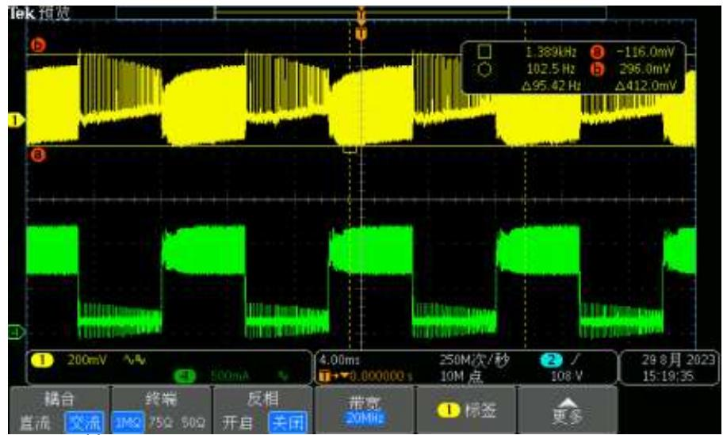

## 230 VAC

${ \mathsf { C H 1 } } { \mathsf { V } } _ { \mathsf { O U T } }$ CH1 VOUT $\mathsf { v } _ { \mathsf { P K - P K } } \mathsf { = }$ 412mV  
$\mathsf { C H 4 } \mathsf { I } _ { \mathsf { O U T } }$

## Test Condition:

➢ $0 . 1 \mathsf { A } \mathsf { - } 0 . 9 \mathsf { A } \mathsf { - } 0 . 1 \mathsf { A }$  
➢ Slew Rate: 0.5 A/ μS  
➢ Frequency: 100 Hz

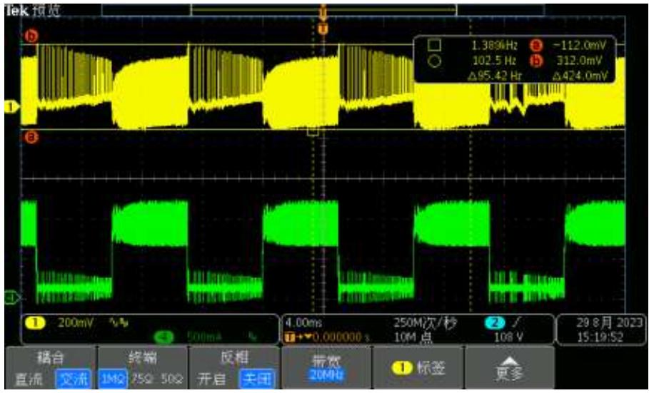

## 265 VAC

${ \mathsf { C H 1 } } { \mathsf { V } } _ { \mathsf { O U T } }$ CH1 VOUT $\mathsf { V } _ { \mathsf { P K - P K } } { = } 4 2 4 \mathsf { m V }$  
CH4 IOUT $\mathsf { C H 4 } \mathsf { I } _ { \mathsf { O U T } }$

## Test Condition:

➢ $0 . 1 \mathsf { A } \mathsf { - } 0 . 9 \mathsf { A } \mathsf { - } 0 . 1$ A  
➢ Slew Rate: 0.5 $\mathsf { A } / \mu \mathsf { S }$  
➢ Frequency: 100 Hz

## 12. 输出电压开机波形

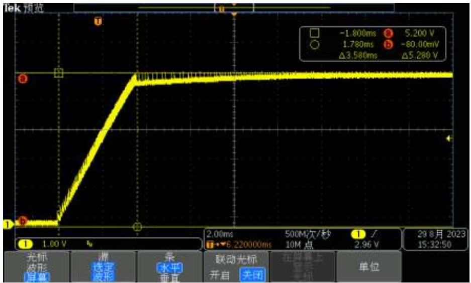

90 VAC

CH1 VOUT $\mathsf { V } _ { \mathsf { O U T } }$ TRISE: 3.58mS

## Test Condition:

➢ No Load

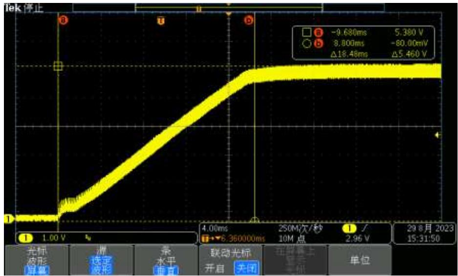

## 'BPS

晶丰明源

90 VAC

CH1 VOUT $\mathsf { V } _ { \mathsf { O U T } }$ TRISE: 18.48mS

## Test Condition:

➢ Full Load

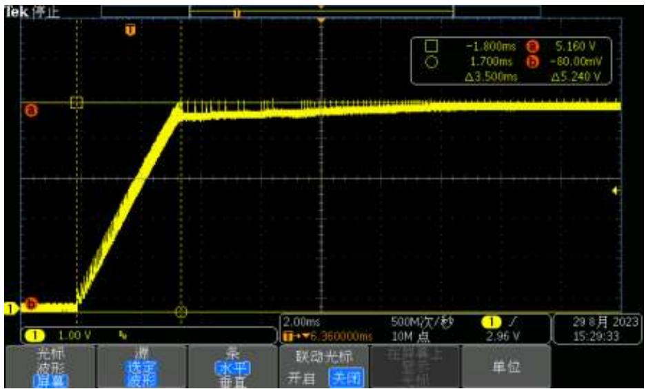

265 VAC

CH1 VOUT TRISE:3.5mS

## Test Condition:

➢ No Load

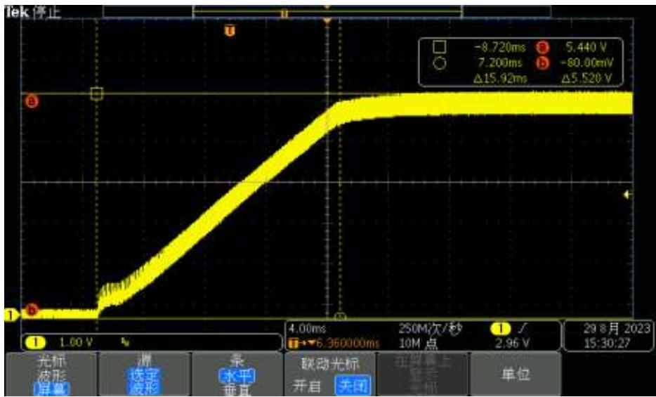

265 VAC

CH1 VOUT TRISE: 15.92mS

## Test Condition:

➢ Full Load

## 13. 开机延迟时间

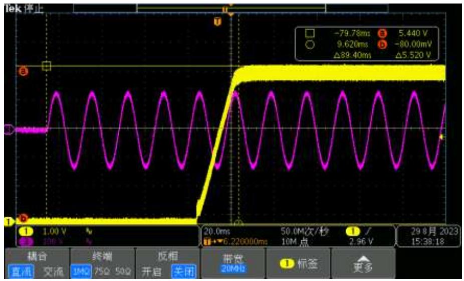

$90 v _ { \mathsf { A C } }$

CH1 $\mathsf { V } _ { \mathsf { O U T } }$  
CH3 VIN $\mathsf { V } _ { \mathsf { I N } }$ ${ \sf T } _ { \sf D e l a y } \dot { \cdot }$ 89.4mS

Test Condition:  
➢ Full Load  
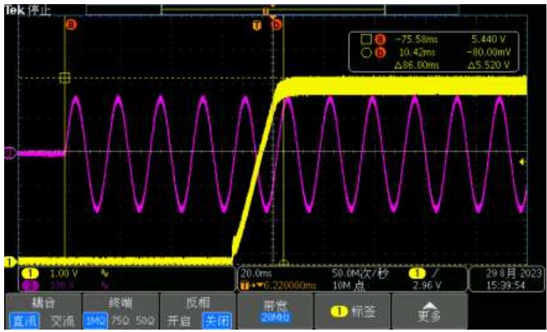

## 'BPS

晶丰明源

115 $\mathsf { v } _ { \mathsf { A C } }$

${ \mathsf { C H 1 } } { \mathsf { V } } _ { \mathsf { O U T } }$  
$\mathsf { C H 3 } \mathsf { V } _ { \mathsf { I N } }$ CH3 VIN ${ \sf T } _ { \sf D e l a y } \dot { \sf : }$ 86mS

Test Condition:  
➢ Full Load  
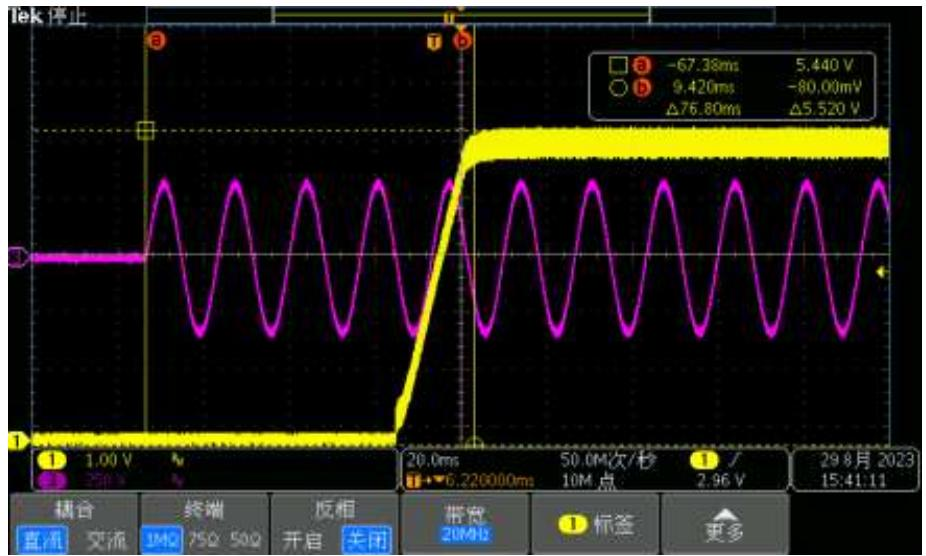

230 $\mathsf { v } _ { \mathsf { A C } }$

CH1 VOUT ${ \mathsf { C H 1 } } { \mathsf { V } } _ { \mathsf { O U T } }$  
CH3 $\mathsf { V } _ { \mathsf { I N } }$ ${ \sf T } _ { \sf D e l a y } \dot { \sf : }$ : 76.8mS

Test Condition:  
➢ Full Load  
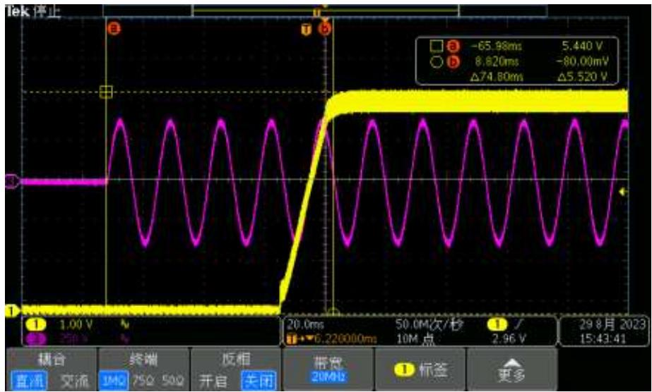

265 $\mathsf { v } _ { \mathsf { A C } }$

${ \mathsf { C H 1 } } { \mathsf { V } } _ { \mathsf { O U T } }$  
CH3 VIN $\mathsf { C H 3 } \mathsf { V } _ { \mathsf { I N } }$ ${ \sf T } _ { \sf D e l a y } \dot { \bullet }$ TDelay: 74.8mS

Test Condition:

➢ Full Load

## 14. MOS 漏源极电压电流波形 （启机）

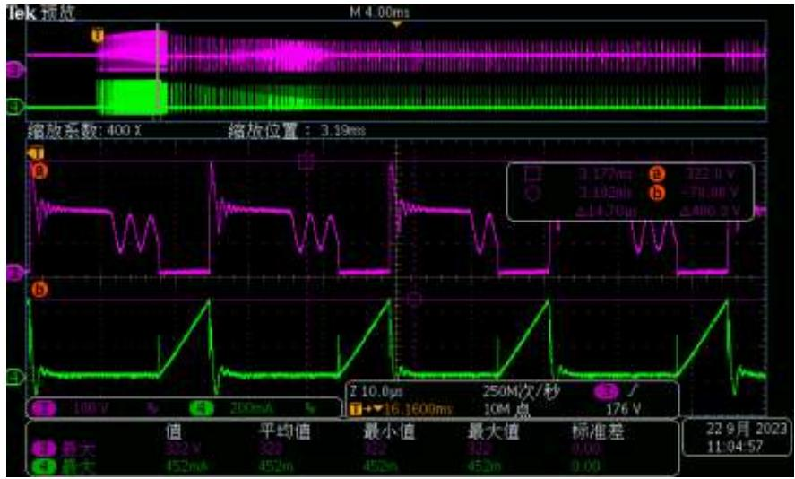

$90 \text{‰}$

${ \mathsf { C H 3 } } \mathsf { V } _ { \mathsf { D S } }$  
$C H 4 1 _ { \mathsf { D } }$ $V _ { \mathsf { D } \mathsf { S } } = 3 2 2 \mathsf { V }$ IMAX= 452mA $\mathsf { I } _ { \mathsf { M A X } } { = } 4 5 2 \mathsf { m A }$

Test Condition:  
➢ No Load  
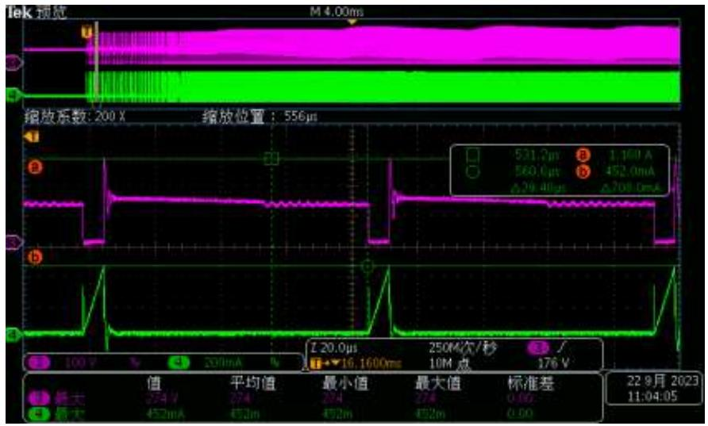

## 'BPS

## 晶丰明源

$90 v _ { \mathsf { A C } }$

${ \mathsf { C H 3 } } \mathsf { V _ { D S } }$  
$C H 4 1 _ { \mathsf { D } }$ $\mathtt { V _ { D S } } \mathtt { = } 2 7 4 \mathtt { V }$ $\mathsf { I } _ { \mathsf { M A X } } { = } 4 5 2 \mathsf { m } \mathsf { A }$

## Test Condition:

➢ Full Load

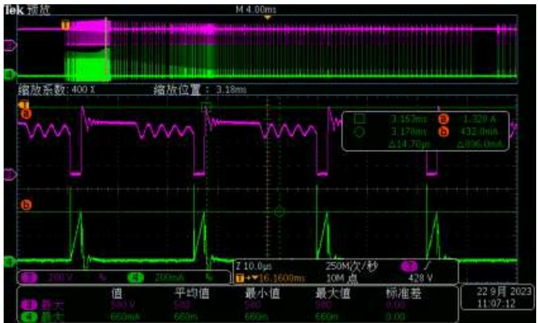

265 VAC

${ \mathsf { C H 3 } } \mathsf { V _ { D S } }$  
$C H 4 1 _ { \mathsf { D } }$ $V _ { \mathsf { D S } } { = } 5 8 0 \mathsf { V }$ $\mathsf { I } _ { \mathsf { M A X } } { = } 4 3 2 \mathsf { m } \mathsf { A }$

Test Condition:  
➢ No Load  
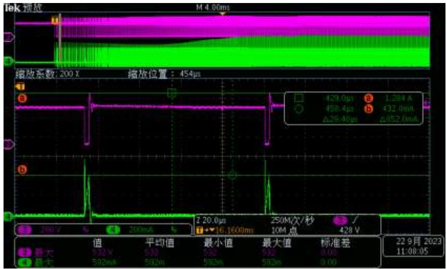

$2 6 5 \ : \mathsf { V } _ { \mathsf { A C } }$

${ \mathsf { C H 3 } } \mathsf { V _ { D S } }$  
$C H 4 1 _ { \mathsf { D } }$ $V _ { \mathsf { D S } } { = } 5 3 2 \mathsf { V }$ IMAX=432mA $\mathsf { I } _ { \mathsf { M A X } } { = } 4 3 2 \mathsf { m } \mathsf { A }$

## Test Condition:

➢ Full Load

## 15. MOS 漏源极电压电流波形（正常工作）

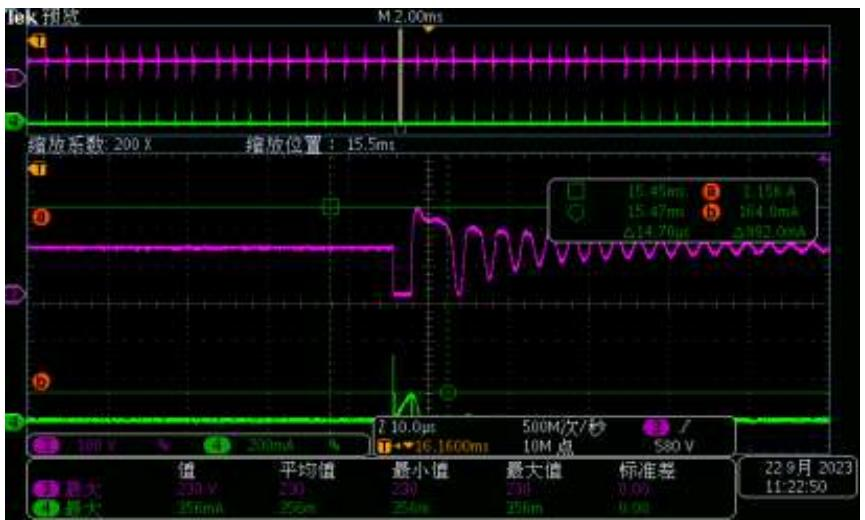

$90 v _ { \mathsf { A C } }$

${ \mathsf { C H 3 } } \mathsf { V } _ { \mathsf { D S } }$  
$C H 4 1 _ { \mathsf { D } }$ $V _ { \mathsf { D S } } { = } 2 3 0 \mathsf { V }$ $\mathsf { I } _ { \mathsf { M A X } } { = } 1 6 4 \mathsf { m } \mathsf { A }$

Test Condition:  
➢ No Load  
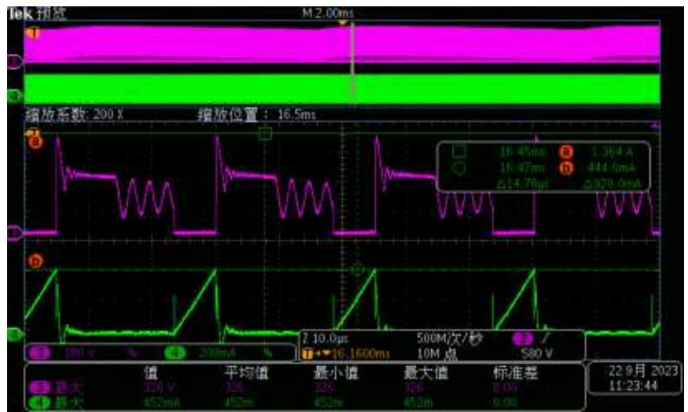

## 'BPS

晶丰明源

$90 v _ { \mathsf { A C } }$

${ \mathsf { C H 3 } } \mathsf { V _ { D S } }$  
$C H 4 1 _ { \mathsf { D } }$ $V _ { \mathsf { D } \mathsf { S } } ^ { } = 3 2 6 \mathsf { V }$ $\mathsf { I } _ { \mathsf { M A X } } { = } 4 4 4 \mathsf { m } \mathsf { A }$

## Test Condition:

➢ Full Load

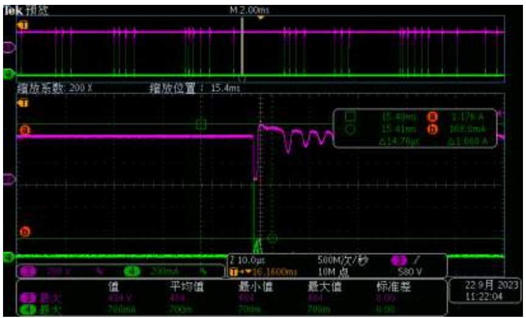

265 $\mathsf { v } _ { \mathsf { A C } }$

${ \mathsf { C H 3 } } \mathsf { V _ { D S } }$  
$C H 4 1 _ { \mathsf { D } }$ $V _ { \mathsf { D S } } { \mathsf { = } } 4 8 4 \mathsf { V }$ IMAX=168mA $\mathsf { I } _ { \mathsf { M A X } } { = } 1 6 8 \mathsf { m } \mathsf { A }$

Test Condition:  
➢ No Load  
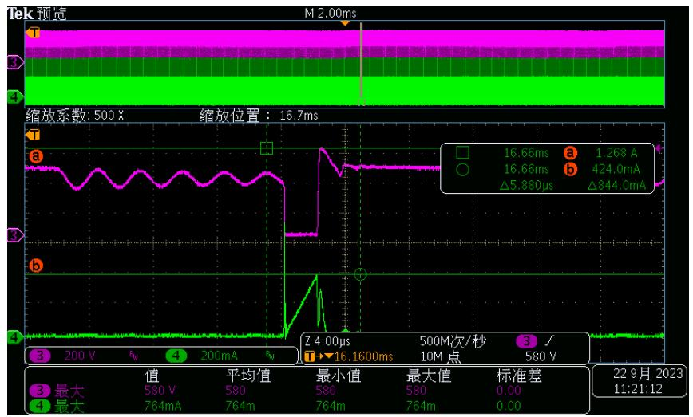

265 $\mathsf { v } _ { \mathsf { A C } }$

${ \mathsf { C H 3 } } \mathsf { V _ { D S } }$  
$C H 4 1 _ { \mathsf { D } }$ $\mathtt { V } _ { \mathtt { D S } } mathtt { = } 5 8 0 \mathtt { V }$ IMAX=424mA $\mathsf { I } _ { \mathsf { M A X } } { = } 4 2 4 \mathsf { m } \mathsf { A }$

## Test Condition:

➢ Full Load

## 16. 输出二极管波形

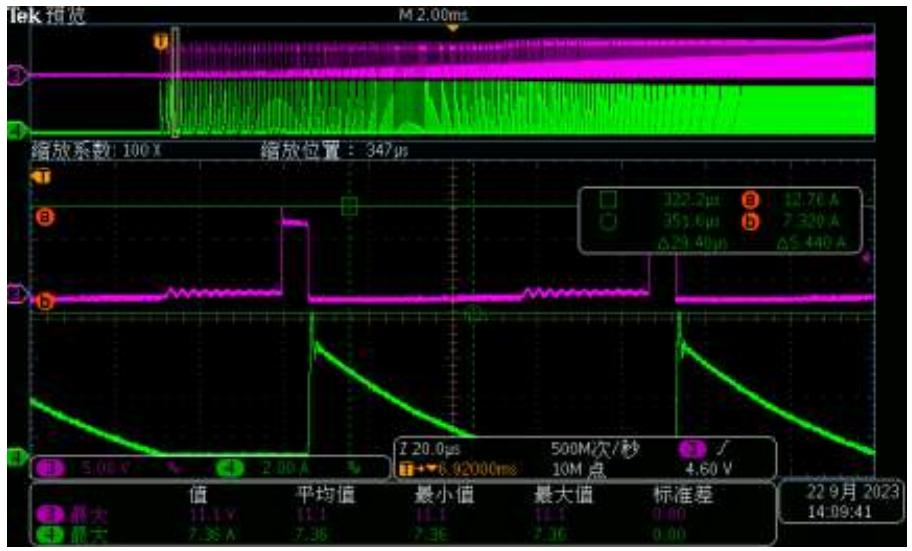

## $90 v _ { \mathsf { A C } }$

${ \mathsf { C H 1 V } } _ { \mathsf { D } }$  
$C H 4 1 _ { \mathsf { D } }$ $\mathsf { V } _ { \mathsf { D } } { \mathsf { = } } { \mathsf { 1 } } { \mathsf { 1 } } { \mathsf { . } } { \mathsf { 1 } } { \mathsf { V } }$ $\mathsf { I } _ { \mathsf { D m a x } } { = } 7 . 3 6 \mathsf { A }$

## Test Condition:

➢ Full Load  
➢ 开机

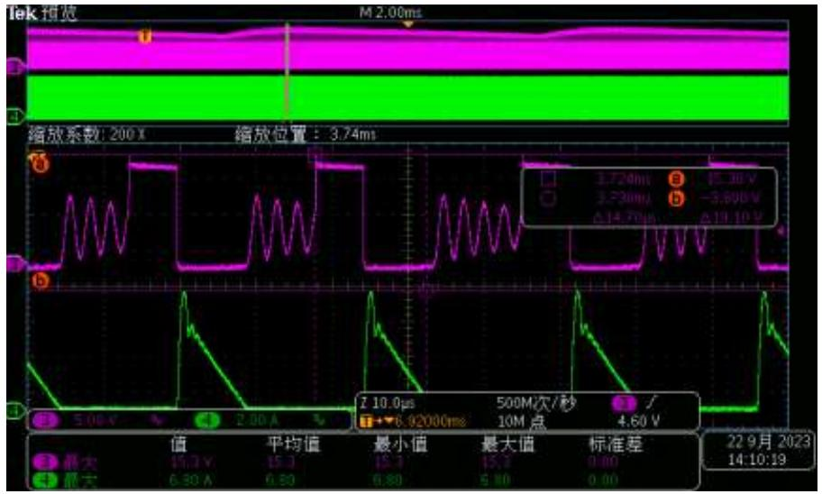

## 'BPS

## 晶丰明源

## $90 v _ { \mathsf { A C } }$

$C H \bot V _ { \mathsf { D } }$  
$C H 4 1 _ { \mathsf { D } }$ $\mathtt { V } _ { \mathtt { D } } mathtt { = } 1 5 . 3 \mathtt { V }$ $\mathsf { I } _ { \mathsf { D m a x } } { = } 6 . 8 \mathsf { A }$

## Test Condition:

➢ Full Load

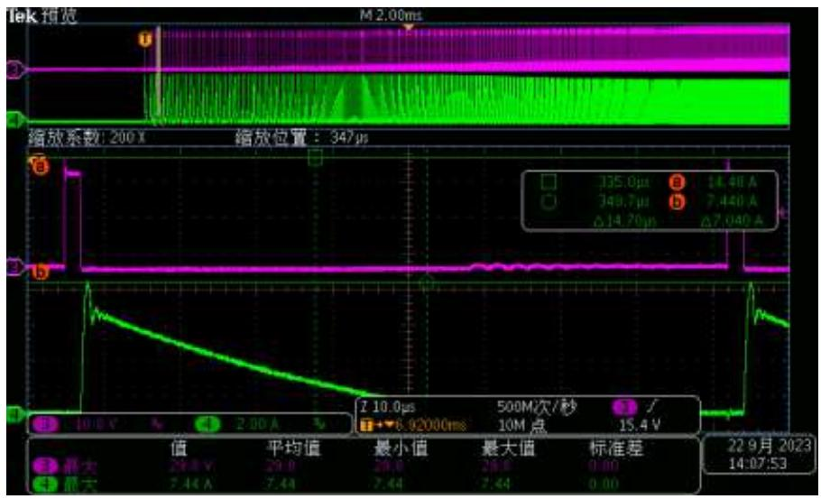

## 265 $\mathsf { v } _ { \mathsf { A C } }$

$C H \bot V _ { \mathsf { D } }$  
$C H 4 1 _ { \mathsf { D } }$ $\mathtt { V } _ { \mathtt { D } } mathtt { = } 2 9 . 8 \mathtt { V }$ $\mathsf { I } _ { \mathsf { D m a x } } { = } 7 . 4 4 \mathsf { A }$ Dmax

## Test Condition:

➢ Full Load  
➢ 开机

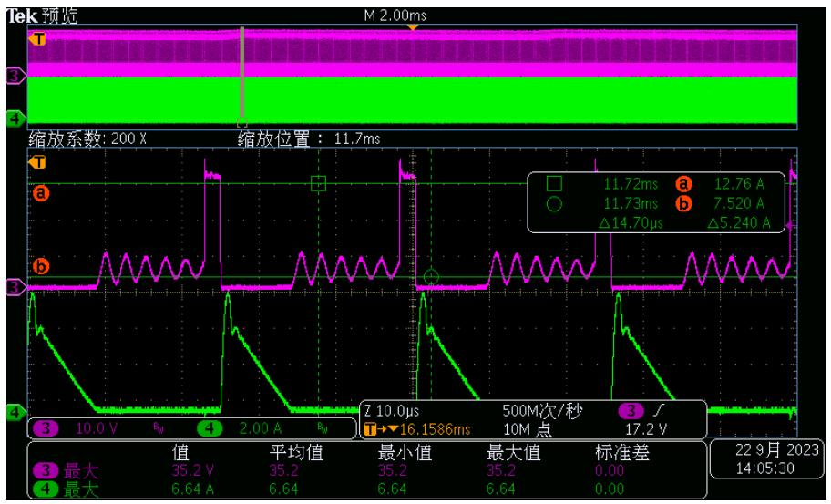

## $2 6 5 \ : \mathsf { V } _ { \mathsf { A C } }$

${ \mathsf { C H 1 V } } _ { \mathsf { D } }$  
$C H 4 1 _ { \mathsf { D } }$ $\mathtt { V } _ { \mathtt { D } } mathtt { = } 3 5 . 2 \mathtt { V }$ $\mathsf { I } _ { \mathsf { D m a x } } { = } 6 . 6 4 \mathsf { A }$ IDmax

## Test Condition:

➢ Full Load

## 17. 短路时二者波形

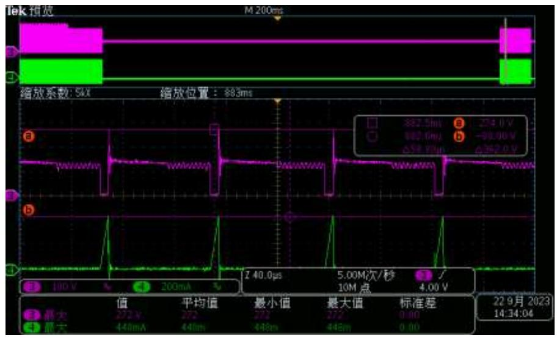

## $90 v _ { \mathsf { A C } }$

${ \mathsf { C H 3 } } \cup _ { \mathsf { D S } }$  
CH4 I $C H 4 1 _ { \mathsf { D } }$ $V _ { \mathsf { D S } } \mathsf { \Pi } _ { \mathsf { m a x } } = 2 7 2 \mathsf { V }$ $1 0 5 m a x = 4 4 8 m A$

## MOS

## Test Condition:

➢ Full Load

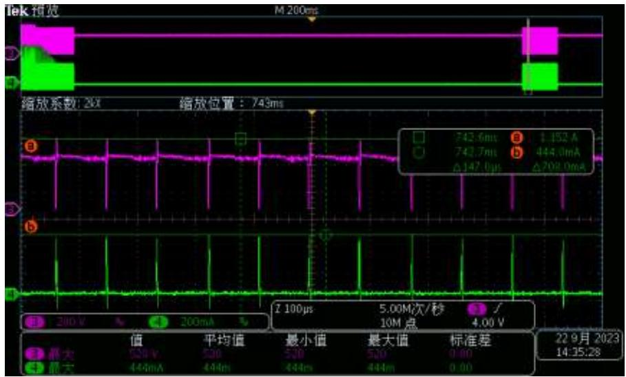

## 'BPS

## 晶丰明源

265 VAC

${ \mathsf { C H 3 } } \mathsf { V _ { D S } }$  
$C H 4 1 _ { \mathsf { D } }$ VDS \_max $\mathsf { V } _ { \mathsf { D S \_ m a x } } { = } 5 2 0 \mathsf { V }$ $\mathsf { I } _ { \mathsf { D S \_ m a x } } = 4 4 4 \mathsf { m A }$

## MOS

## Test Condition:

➢ Full Load

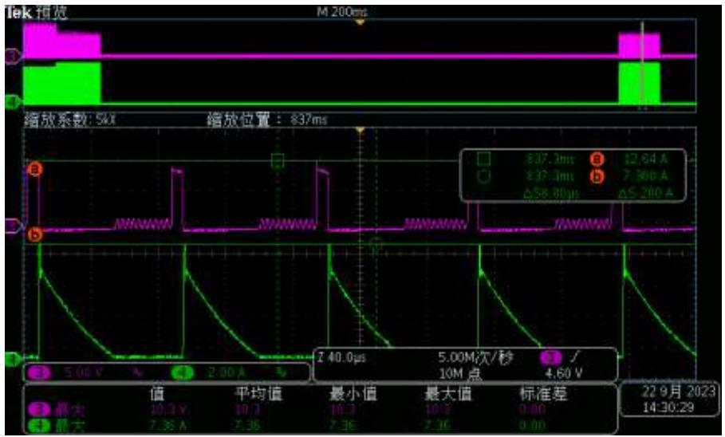

## $90 V _ { \mathsf { A C } }$

$C H 3 V _ { \mathsf { D } }$  
$C H 4 1 _ { \mathsf { D } }$ $\mathtt { V } _ { \mathtt { D } } mathtt { = } 1 0 . 3 \mathtt { V }$ $\mathsf { I } _ { \mathsf { D m a x } } { = } 7 . 3 6 \mathsf { A }$ Dmax

## 二极管

## Test Condition:

➢ Full Load

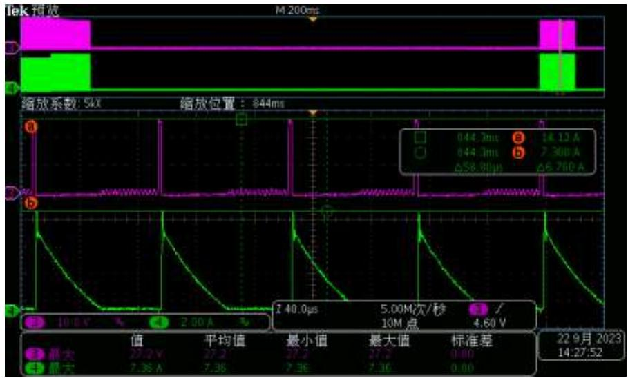

$2 6 5 \ : \mathsf { V } _ { \mathsf { A C } }$

$C H 3 V _ { \mathsf { D } }$  
$C H 4 1 _ { \mathsf { D } }$ $V _ { \mathrm { D } } { = } 2 7 . 2 \ V$ IDmax=7.36A $\mathsf { I } _ { \mathsf { D m a x } } { = } 7 . 3 6 \mathsf { A }$

## 二极管

## Test Condition:

➢ Full Load

## 18. MOSFET 电压波形

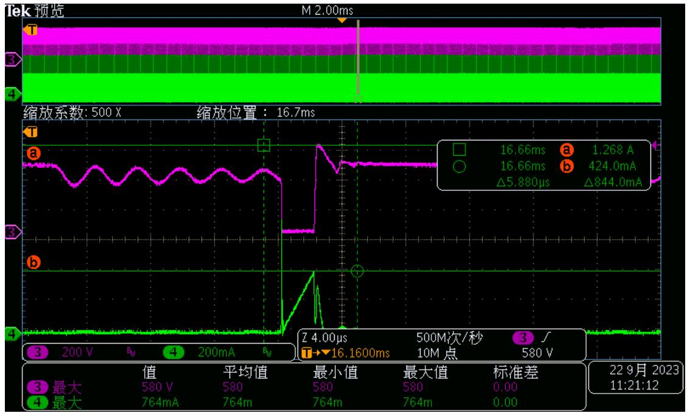

## 25晶丰明源

BrightPower Semiconductor

BP86213D

低功耗PSR隔离CC/CV控制芯片

极限参数（注2)（无特别说明情况下，TA=25°C)

<table><tr><td>符号</td><td>参数</td><td>参数范围</td><td>单位</td></tr><tr><td> $V_{DS}$ </td><td>内部 MOSFET 漏极到源极电压</td><td>-0.3~650</td><td>V</td></tr><tr><td> $V_{CC}$ </td><td>VCC 电压</td><td>-0.3~33</td><td>V</td></tr><tr><td> $I_{CC\_MAX}$ </td><td>VCC 引脚最大电源电流</td><td>30</td><td>mA</td></tr></table>

265 VAC

CH2 VR

$$
V _ {D S} = 5 8 0 V
$$

Test Condition:

➢ Full Load

满载正常工作:

Derating=580/650=90%

\*注：考虑到变压器漏感差异，及MOS管极限耐压差异。通常会预留8-10%的余量。

Vin\_max VDS＜【650V\*(1-10%)=580V】

## 19. 输出二极管反向电压波形

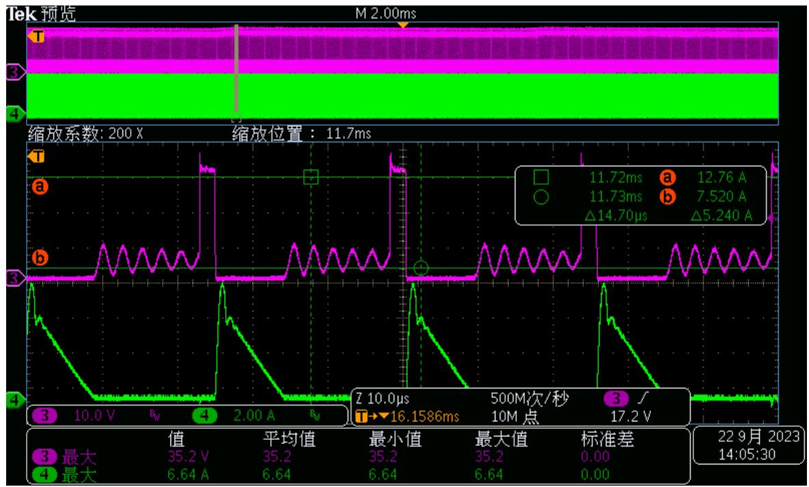

## MaximumRatingsandElectricalCharacteristics

Ratingat 25C ambient temperature unless otherwise specified

Single phase,half wave,6oHz,resistive or inductive load

Forcapacitive load derate current by 20%

<table><tr><td>Type Number</td><td>SYMBOL</td><td>SS52</td><td>SS53</td><td>SS54</td><td>SS545</td><td>SS55</td><td>SS56</td><td>SS58</td><td>SS510</td><td>SS515</td><td>SS520</td><td>SS525</td><td>Unit</td></tr><tr><td>Maximum Recurrent Peak Reverse Voltage</td><td> $V_{RRM}$ </td><td>20</td><td>30</td><td>40</td><td>45</td><td>50</td><td>60</td><td>80</td><td>100</td><td>150</td><td>200</td><td>250</td><td>V</td></tr><tr><td>Maximum RMS Voltage</td><td> $V_{RMS}$ </td><td>14</td><td>21</td><td>28</td><td>31</td><td>35</td><td>42</td><td>56</td><td>70</td><td>105</td><td>140</td><td>175</td><td>V</td></tr><tr><td>Maximum DC Blocking Voltage</td><td> $V_{DC}$ </td><td>20</td><td>30</td><td>40</td><td>45</td><td>50</td><td>60</td><td>80</td><td>100</td><td>150</td><td>200</td><td>250</td><td>V</td></tr><tr><td>Average Rectified Output Current@ $T_L=100°C$ </td><td>IF(AV)</td><td colspan="11">5.0</td><td>A</td></tr></table>

265 VAC

CH2 VR

V =35.2V

Test Condition:

➢ Full Load

满载正常工作:

Derating=35.2/60=58.67%

\*注：考虑到变压器漏感差异，及二极管极限耐压差异。通常会预留8-10%的余量。

Vin\_max VDiode＜【60V\*(1-10%)=54V】

## 20.退磁时间测试

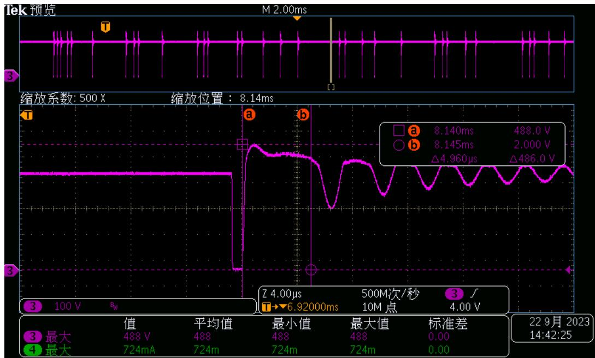

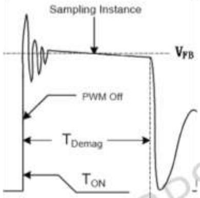

□CS峰值为0.6V时，采样点为距PWMOFF5.12us(典型值，上限偏到7us)处；  
□CS峰值为0.2V时，采样点为距PWMOFE2us处（采样脉宽580ns即1.42us\~2us期间采样，2us上限偏到3us）；  
□CS峰值处于0.2V和0.6V之间时，采样点跟CS峰值电压成正比，位于2us和5.12us之间

由于采样的不理想会影响输出电压的负载调整率，太早，采样不准不真实；太晚，系统反馈调节不及时。因此开关频率的选择需要覆盖采样时间的最大偏差。即重载CS峰值0.6V时的退磁时间要大于7us，轻载CS峰值为0.2V时的退磁时间要大于3us，综合考虑：

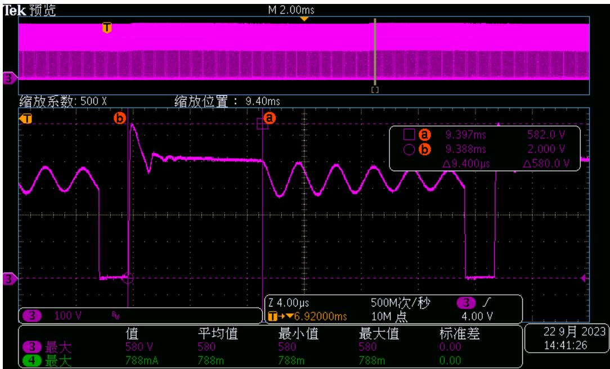

◼ 图一轻载退磁时间4.96uS，符合规格书要求。  
图二满载退磁时间9.4uS，符合规格书要求。

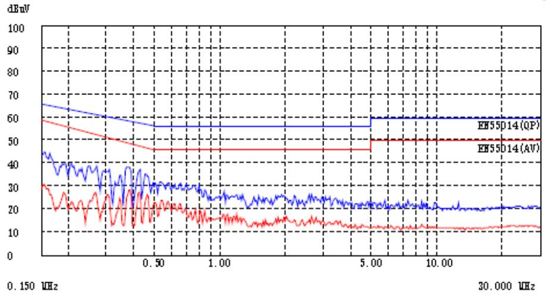

115VAC Line

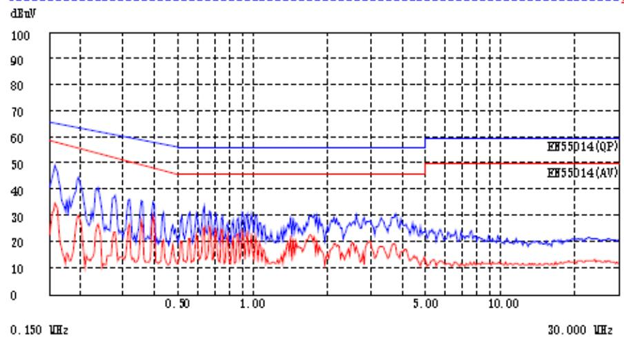

230VAC Line

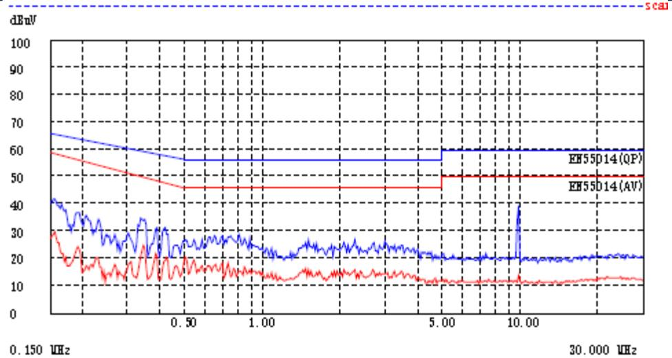

115VAC Neutral

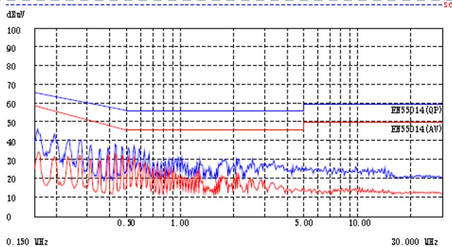

230VAC Neutral

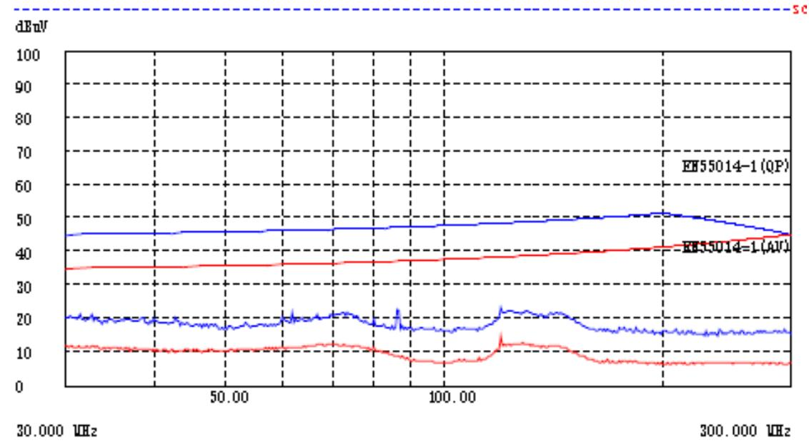

115VAC

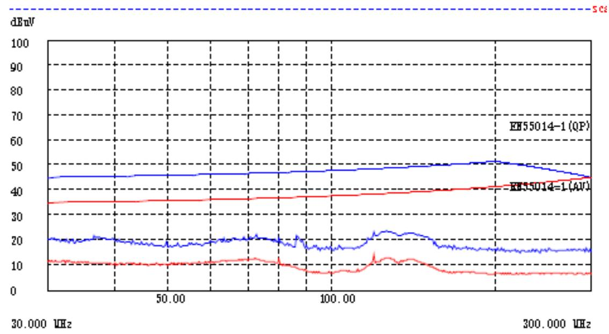

230VAC

## 23.温度数据

<table><tr><td rowspan="2">项目</td><td colspan="4">温度(°C)</td></tr><tr><td>90VAC</td><td>115VAC</td><td>230VAC</td><td>265VAC</td></tr><tr><td>输入功率</td><td>7.03</td><td>6.91</td><td>6.95</td><td>7.03</td></tr><tr><td>输出电压</td><td>5.02</td><td>5.02</td><td>5.03</td><td>5.02</td></tr><tr><td>BP86213D (1)</td><td>67.7</td><td>65.1</td><td>69.3</td><td>72.8</td></tr><tr><td>BP86213D (2)</td><td>67.6</td><td>65.2</td><td>69.1</td><td>72.5</td></tr><tr><td>续流管SS56</td><td>88.8</td><td>88.4</td><td>89.1</td><td>89.2</td></tr><tr><td>变压器绕组</td><td>70.1</td><td>68.8</td><td>69.8</td><td>70.6</td></tr><tr><td>变压器磁芯</td><td>69.6</td><td>68.5</td><td>69.5</td><td>70.2</td></tr><tr><td>环境温度</td><td>36.1</td><td>35.8</td><td>35.7</td><td>35.5</td></tr></table>

## 测试说明

➢ 在纸盒中进行测试，电路板放在一个封闭的盒子内  
➢ 热电偶连接到各个测量点，等测量点温度达到稳定后记录数据

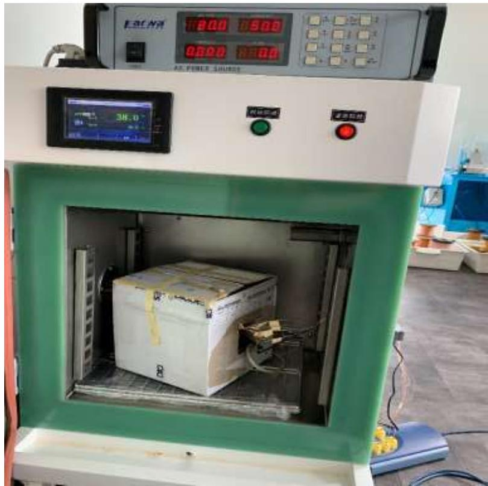

## 24. Surge浪涌测试

<table><tr><td>差模</td><td>电压</td><td>相位角</td><td>发生器阻抗</td><td>测试次数</td><td>测试结果</td></tr><tr><td>L to N</td><td>+2kV</td><td>0</td><td>2</td><td>10</td><td>Pass</td></tr><tr><td>L to N</td><td>-2kV</td><td>0</td><td>2</td><td>10</td><td>Pass</td></tr><tr><td>L to N</td><td>+2kV</td><td>90</td><td>2</td><td>10</td><td>Pass</td></tr><tr><td>L to N</td><td>-2kV</td><td>90</td><td>2</td><td>10</td><td>Pass</td></tr><tr><td>L to N</td><td>+2kV</td><td>180</td><td>2</td><td>10</td><td>Pass</td></tr><tr><td>L to N</td><td>-2kV</td><td>180</td><td>2</td><td>10</td><td>Pass</td></tr><tr><td>L to N</td><td>+2kV</td><td>270</td><td>2</td><td>10</td><td>Pass</td></tr><tr><td>L to N</td><td>-2kV</td><td>270</td><td>2</td><td>10</td><td>Pass</td></tr></table>

## 测试说明

➢ 按照GB/T17626.5和IEC61000-4-5的最新版本要求进行测试  
➢ 室温环境，230VAC输入，满载条件  
➢ 输入1.2/50us组合波浪涌电压  
➢ 每个测试点重复10次  
➢ 每次间隔时间1分钟  
➢ 试验时样机输出正常（符合A类标准）视为Pass

## 25. EFT 群脉冲测试

<table><tr><td>差模</td><td>电压</td><td>脉冲群持续时间</td><td>脉冲频率</td><td>测试时间</td><td>测试结果</td></tr><tr><td>L to N</td><td>+4kV</td><td>15ms</td><td>5kHz</td><td>120s</td><td>Pass</td></tr><tr><td>L to N</td><td>-4kV</td><td>15ms</td><td>5kHz</td><td>120s</td><td>Pass</td></tr><tr><td>L to N</td><td>+4kV</td><td>0.75ms</td><td>100kHz</td><td>120s</td><td>Pass</td></tr><tr><td>L to N</td><td>-4kV</td><td>0.75ms</td><td>100kHz</td><td>120s</td><td>Pass</td></tr><tr><td>L to N</td><td>+2kV</td><td>2ms</td><td>38kHz</td><td>120s</td><td>Pass</td></tr><tr><td>L to N</td><td>-2kV</td><td>2ms</td><td>38kHz</td><td>120s</td><td>Pass</td></tr><tr><td>L to N</td><td>+4kV</td><td>2ms</td><td>38kHz</td><td>120s</td><td>Pass</td></tr><tr><td>L to N</td><td>-4kV</td><td>2ms</td><td>38kHz</td><td>120s</td><td>Pass</td></tr></table>

## 测试说明

➢ 按照GB/T17626.4和IEC61000-4-4的最新版本要求进行测试  
➢ 室温环境，230VAC输入满载条件  
➢ 分别测试5kHz/100kHz/38kHz脉冲频率  
➢ 脉冲群周期为300ms  
➢ 每个测试条件测试时间120s  
➢ 试验时样机输出正常（符合A类标准）视为Pass

上海市浦东新区申江路5005弄星创科技广场3号楼9层

+86-21-51870166

sales@bpsemi.com

www.bpsemi.com

  
微信公众号

  
微信视频号
