## BP86213D隔离参考设计

## (12V0.5A 6V0.5A)

上海晶丰明源半导体股份有限公司

Shanghai Bright Power Semiconductor Co., Ltd.

梁 惠

时间： 2022年8月

## 内容

BP8621XD简介  
电源规格  
电路及实物图  
BOM  
PCB Layout图  
变压器  
性能测试数据

## 产品特点：

➢ 集成 650V 高压 MOSFET  
PWM+PFM多周期控制模式，低输出纹波  
➢ 内置软启动功能  
➢ 集成高压启动、自供电电路  
➢ 低音频噪声  
➢ 集成输入欠压保护

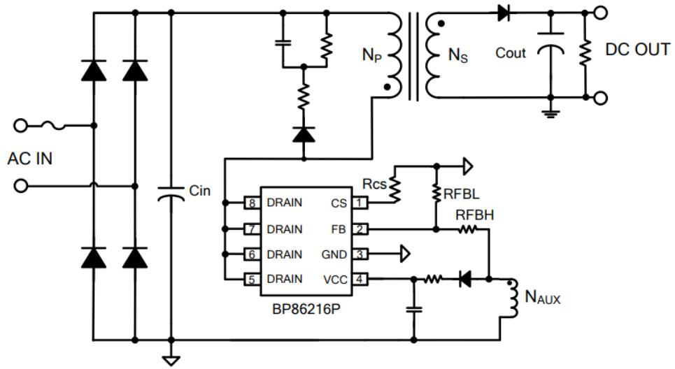

## 应用领域：

➢ 家用电器辅助电源  
➢ 电机驱动辅助电源  
➢ IOT/智能家居/智能照明  
➢ 工业控制辅助电源

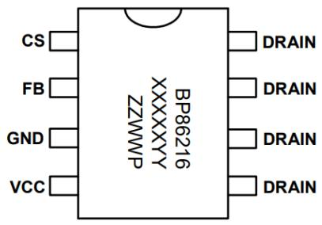

<table><tr><td>项目描述</td><td>符号</td><td>最小</td><td>典型</td><td>最大</td><td>单位</td><td>备注</td></tr><tr><td colspan="7">输入</td></tr><tr><td>电压</td><td> $V_{IN}$ </td><td>90</td><td>115/230</td><td>264</td><td> $V_{AC}$ </td><td></td></tr><tr><td>频率</td><td> $f_{LINE}$ </td><td>47</td><td>50/60</td><td>63</td><td>Hz</td><td></td></tr><tr><td colspan="7">输出</td></tr><tr><td>输出电压1</td><td> $V_{OUT1}$ </td><td>11.8</td><td>12</td><td>12.3</td><td>V</td><td></td></tr><tr><td>输出电流1</td><td> $I_{OUT1}$ </td><td>0</td><td>500</td><td></td><td>mA</td><td></td></tr><tr><td>输出电压2</td><td> $V_{OUT2}$ </td><td>5.71</td><td>6</td><td>6.06</td><td>V</td><td></td></tr><tr><td>输出电流2</td><td> $I_{OUT2}$ </td><td>0</td><td>500</td><td></td><td>mA</td><td></td></tr><tr><td>输出电压纹波1</td><td> $V_{RIPPLE}$ </td><td></td><td></td><td>150</td><td>mV</td><td>20MHz带宽</td></tr><tr><td>输出电压纹波2</td><td> $V_{RIPPLE}$ </td><td></td><td></td><td>200</td><td>mV</td><td>20MHz带宽</td></tr><tr><td>连续输出功率</td><td> $P_{OUT}$ </td><td></td><td>9</td><td></td><td>W</td><td></td></tr><tr><td colspan="7">效率</td></tr><tr><td>待机功耗</td><td> $P_{STDBY}$ </td><td></td><td></td><td>130</td><td>mW</td><td>230VAC,包含假负载</td></tr><tr><td>满载效率</td><td>η</td><td></td><td></td><td>76</td><td>%</td><td></td></tr><tr><td colspan="7">环境</td></tr><tr><td>传导EMI</td><td></td><td colspan="4">满足CISPR22/EN55022 Class B,至少6dB 裕量</td><td></td></tr><tr><td>Surge</td><td></td><td></td><td>2</td><td></td><td>kV</td><td>差模</td></tr><tr><td>EFT</td><td></td><td></td><td>4</td><td></td><td>kV</td><td>5kHz/100kHz/38kHz</td></tr><tr><td>ESD</td><td></td><td></td><td>15</td><td>20</td><td>kV</td><td>空气放电</td></tr><tr><td>工作环境温度</td><td> $T_{AMP}$ </td><td>0</td><td></td><td>50</td><td>°C</td><td></td></tr></table>

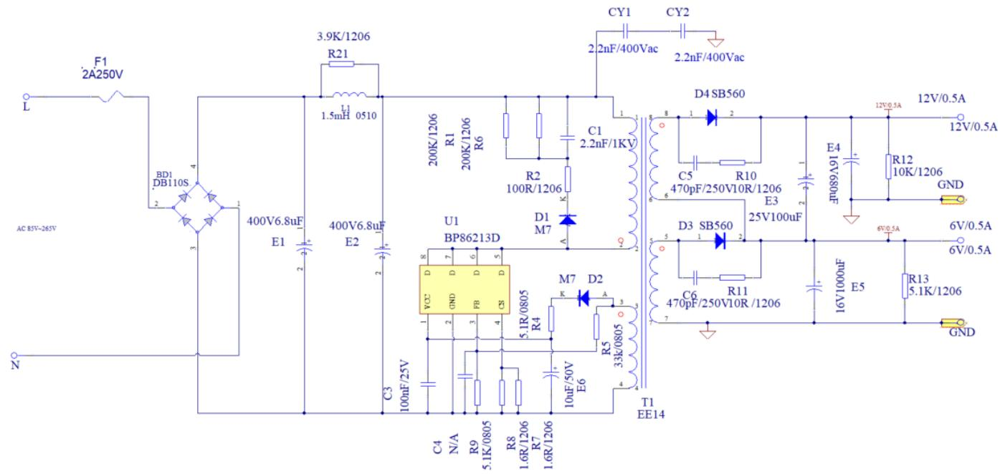

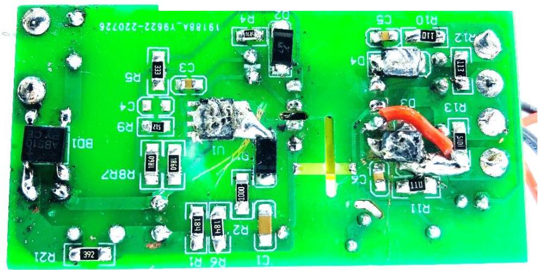

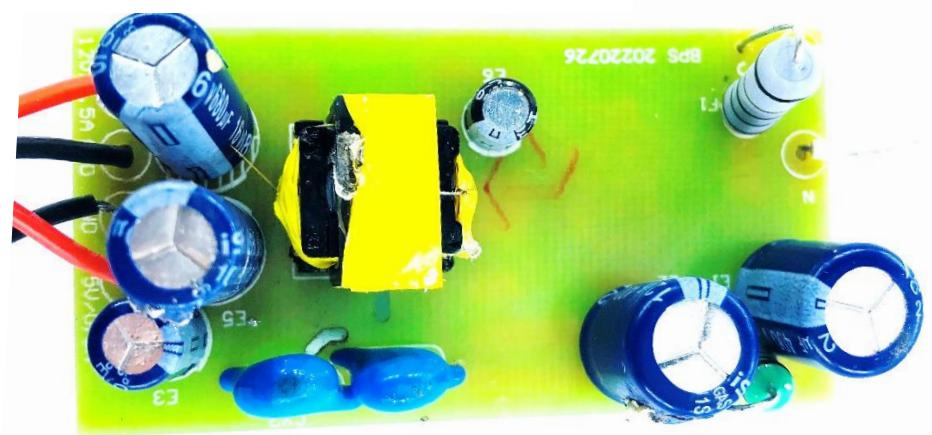

<table><tr><td>序号</td><td>元件标号</td><td>参数描述</td><td>封装尺寸</td><td>数量</td></tr><tr><td>1</td><td>PCB</td><td>CEM-1, 单面板</td><td>6.35mm*3.3mm</td><td>1</td></tr><tr><td>2</td><td>BD1</td><td>DB&#x27;110S</td><td>SMD</td><td>1</td></tr><tr><td>3</td><td>C1</td><td>1.2nF/1KV</td><td>&#x27;SMD1206</td><td>1</td></tr><tr><td>4</td><td>R1、R6</td><td>200K</td><td>SMD0805</td><td>2</td></tr><tr><td>5</td><td>R2</td><td>3.9K</td><td>SMD1206</td><td>1</td></tr><tr><td>6</td><td>D1</td><td>M7</td><td>SMA</td><td>1</td></tr><tr><td>7</td><td>C3</td><td>100nF/25V</td><td>SMD0805</td><td>1</td></tr><tr><td>8</td><td>C4</td><td>NC</td><td>SMD0805</td><td>1</td></tr><tr><td>9</td><td>R9</td><td>5.1K</td><td>SMD0805</td><td>1</td></tr><tr><td>10</td><td>R7、R8</td><td>1.6R</td><td>SMD1206</td><td>2</td></tr><tr><td>11</td><td>R4</td><td>5.1R</td><td>SMD0805</td><td>1</td></tr><tr><td>12</td><td>R5</td><td>33K</td><td>SMD0805</td><td>1</td></tr><tr><td>13</td><td>D2</td><td>M7</td><td>SMA</td><td>1</td></tr><tr><td>14</td><td>D4、D3</td><td>SB560</td><td>SMB</td><td>2</td></tr><tr><td>15</td><td>R10、R11</td><td>10R</td><td>SMD1206</td><td>2</td></tr><tr><td>16</td><td>C5、C6</td><td>470pF/250V</td><td>SMD0805</td><td>2</td></tr></table>

<table><tr><td>序号</td><td>元件标号</td><td>参数描述</td><td>封装尺寸</td><td>数量</td></tr><tr><td>17</td><td>R12</td><td>10K</td><td>SMD1206</td><td>1</td></tr><tr><td>18</td><td>R13</td><td>5.1K</td><td>SMD1206</td><td>1</td></tr><tr><td>19</td><td>U1</td><td>BP86213D</td><td>SOP8</td><td>1</td></tr><tr><td>20</td><td>F1</td><td>10R 绕线电阻</td><td>DIP</td><td>1</td></tr><tr><td>21</td><td>E1、E2</td><td>12uF 400V</td><td>8.5*3.5</td><td>1</td></tr><tr><td>22</td><td>L1</td><td>1mH</td><td>510</td><td>1</td></tr><tr><td>23</td><td>CY1, CY2</td><td>2.2nF 400V</td><td>DIP</td><td>2</td></tr><tr><td>24</td><td>E6</td><td>10uF/50V</td><td>5*2.5</td><td>1</td></tr><tr><td>25</td><td>E4</td><td>680uF 16V</td><td>8.5*3.5</td><td>1</td></tr><tr><td>26</td><td>E5</td><td>16V1000uF</td><td>8.5*3.5</td><td>1</td></tr><tr><td>27</td><td>E3</td><td>100uF 25V</td><td>6.5*2.5</td><td>1</td></tr><tr><td>28</td><td>T1</td><td>EE14 4+4 850uh</td><td>DIP</td><td>1</td></tr><tr><td>29</td><td colspan="3">总和</td><td>34</td></tr></table>

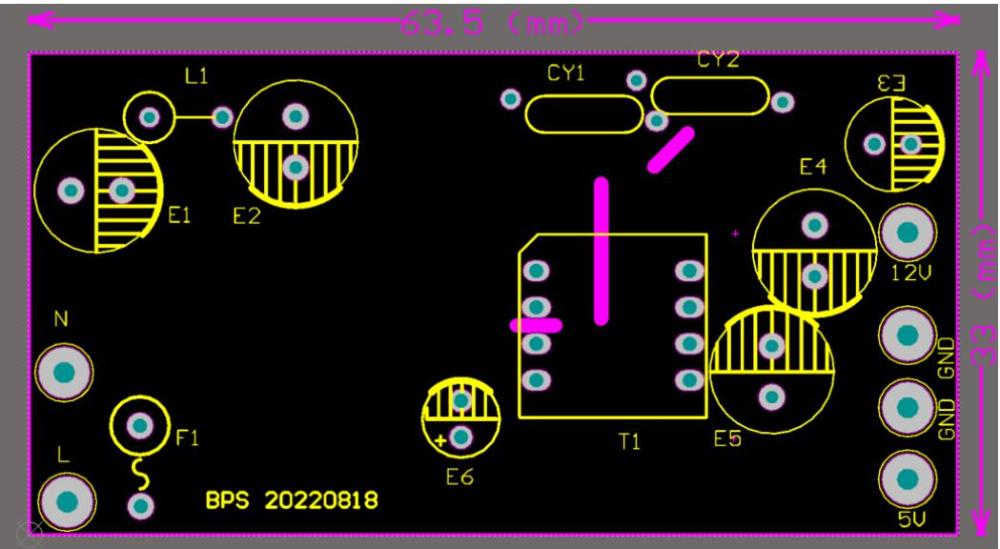

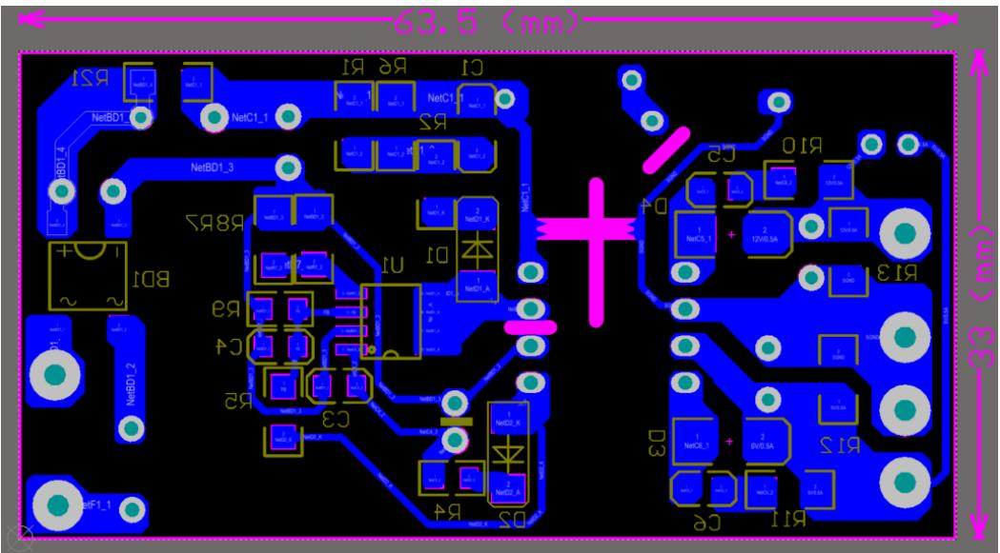

## 原理图

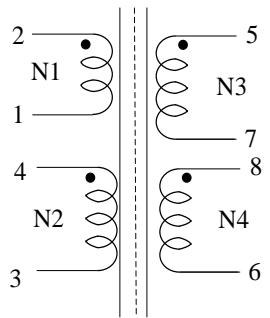

## 绕线方式

<table><tr><td>绕组</td><td>起始脚</td><td>终止脚</td><td>材料</td><td>匝数</td><td>绕线方式</td></tr><tr><td>N1</td><td>2</td><td>1</td><td> $\phi 0.17*1P$ </td><td>80Ts</td><td>密绕四层(PIN脚朝外)</td></tr><tr><td colspan="4">胶带</td><td>2Ts</td><td></td></tr><tr><td>N2</td><td>4</td><td>3</td><td> $\phi 0.17*1P$ </td><td>15Ts</td><td>密绕一层(PIN脚朝外)</td></tr><tr><td colspan="4">胶带</td><td>2Ts</td><td></td></tr><tr><td>N3</td><td>5</td><td>7</td><td> $\phi 0.35*1P(三层绝缘线)$ </td><td>6Ts</td><td>密绕一层(PIN脚朝外)</td></tr><tr><td colspan="4">胶带</td><td>2Ts</td><td></td></tr><tr><td>N4</td><td>8</td><td>6</td><td> $\phi 0.35*1P(三层绝缘线)$ </td><td>6Ts</td><td>密绕一层(PIN脚朝外)</td></tr><tr><td colspan="4">胶带</td><td>3Ts</td><td></td></tr></table>

## 规格与材料

➢ 初级绕组感量 $\mathsf { L } _ { \mathsf { p } } = 8 5 0 \mathsf { u } \mathsf { H } \pm 5 \%$ （测试条件： 0.3V，100kHz）  
➢ 漏感量 $\cdot L _ { | \ v { k } } < 1 0 0 \mathsf { u } \mathsf { H }$  
➢ 骨架：EE14（4+4PIN）  
➢ 磁芯： EE14 PC40 或同等材质 ， $\mathsf { A } \mathsf { e } = 2 5 \mathsf { m m } ^ { 2 }$  
➢ N1、N2: 2UEW 漆包线  
➢ N3 : 三层绝缘线  
➢ 绝缘胶带:3M900 或同等材质  
➢ 耐压测试: 3KV, 50/60Hz, 1Min  
➢ 成品要求：浸凡立水

## 脚位图

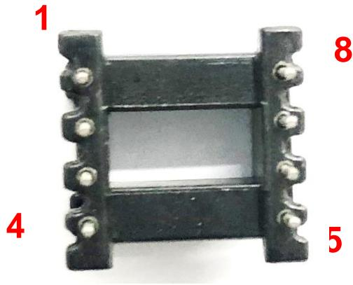

待机功耗  
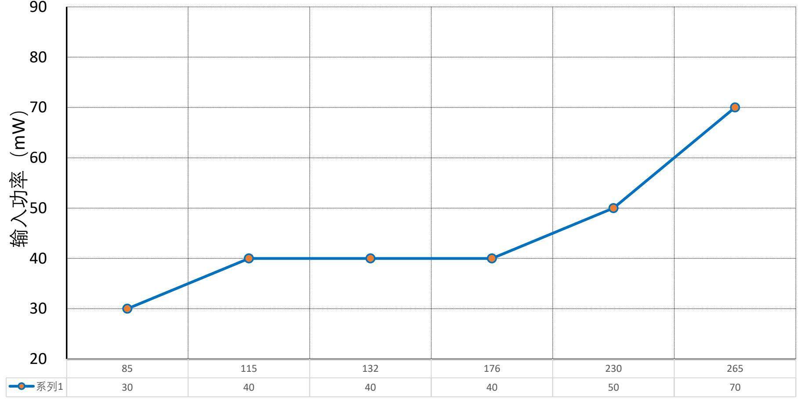

输入电压(VAC)

效率测试  
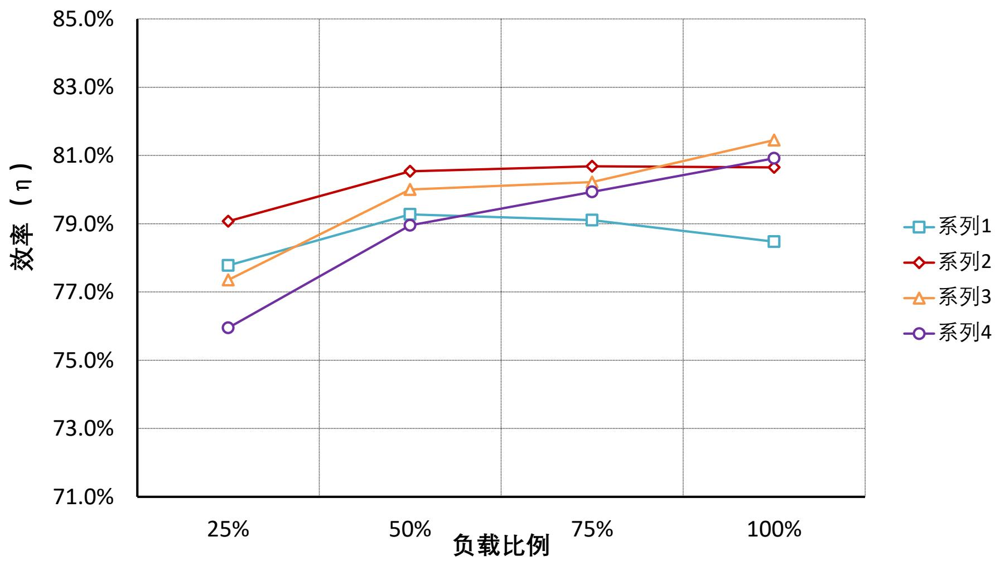

## 输出电压交叉调整率

<table><tr><td>输入电压AC (V)</td><td>输出电流1(A)</td><td>输出电压1(V)</td><td>输出电流2(A)</td><td>输出电压2(V)</td></tr><tr><td rowspan="2">115</td><td>0</td><td>14.24</td><td>0.5</td><td>11.65</td></tr><tr><td>0.5</td><td>5.84</td><td>0</td><td>5.8</td></tr><tr><td rowspan="2">230</td><td>0</td><td>14.45</td><td>0.5</td><td>11.63</td></tr><tr><td>0.5</td><td>5.81</td><td>0</td><td>5.79</td></tr></table>

## 输出电压纹波

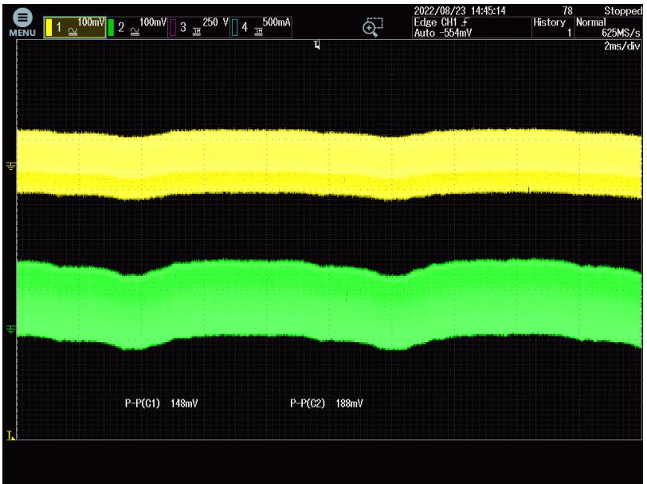

85 $\mathsf { v } _ { \mathsf { A C } }$

CH1 $\mathsf { V } _ { \mathsf { O U T } } \mathsf { R i p p l e }$ $\mathsf { V } _ { \mathsf { P K - P K } } { = } \pm 4 8 \mathsf { m V }$  
CH2 $\mathsf { V } _ { \mathsf { O U T } } \mathsf { R i p p l e }$ $\mathsf { V } _ { \mathsf { P K - P K } = } 1 8 8 \mathsf { m V }$

## Test Condition:

➢ Full Load

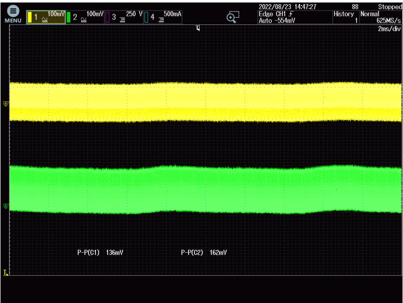

115 VAC

CH1 $\mathsf { V } _ { \mathsf { O U T } }$ Ripple $\mathsf { V } _ { \mathsf { P K - P K } } { = } \pm 3 6 \mathsf { m V }$  
CH2 $\mathsf { V } _ { \mathsf { O U T } }$ Ripple $\mathsf { V } _ { \mathsf { P K - P K } } { = } 1 6 2 \mathsf { m V }$

## Test Condition:

➢ Full Load

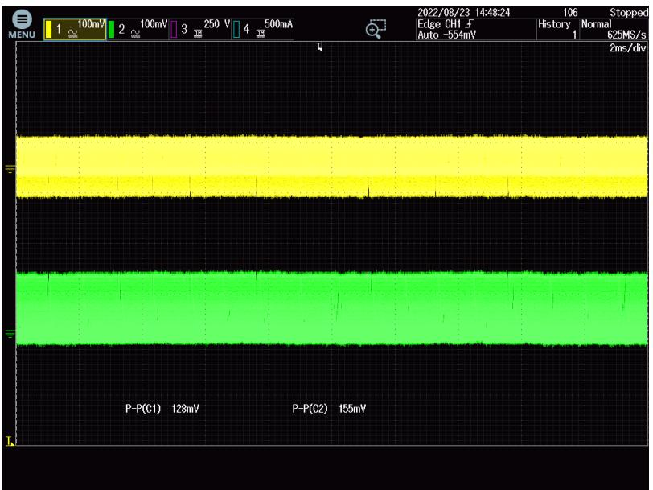

230 $\mathsf { v } _ { \mathsf { A C } }$

CH1 $\mathsf { V } _ { \mathsf { O U T } } \mathsf { R i p p l e }$ $\mathsf { V } _ { \mathsf { P K - P K } } { = } 1 2 8 \mathsf { m V }$  
CH2 $\mathsf { V } _ { \mathsf { O U T } } \mathsf { R i p p l e }$ $\mathsf { V } _ { \mathsf { P K - P K } } =$ 155mV

## Test Condition:

➢ Full Load

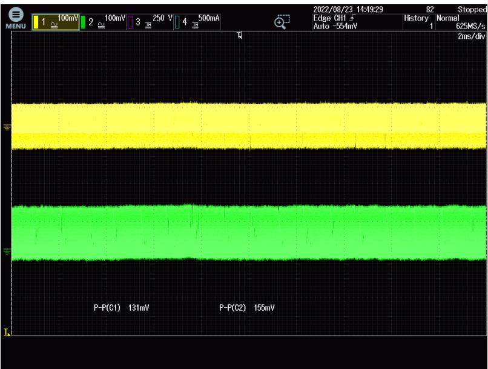

265 $\mathsf { v } _ { \mathsf { A C } }$

CH1 $\mathsf { V } _ { \mathsf { O U T } }$ Ripple $\mathsf { V } _ { \mathsf { P K - P K } } { = } \pmb { 1 3 } \pmb { 1 } \mathsf { m V }$  
CH2 $\mathsf { V } _ { \mathsf { O U T } }$ Ripple $\mathsf { V } _ { \mathsf { P K - P K } } { = } 1 5 5 \mathsf { m V }$

## Test Condition:

➢ Full Load

## 动态负载(50%-100%)

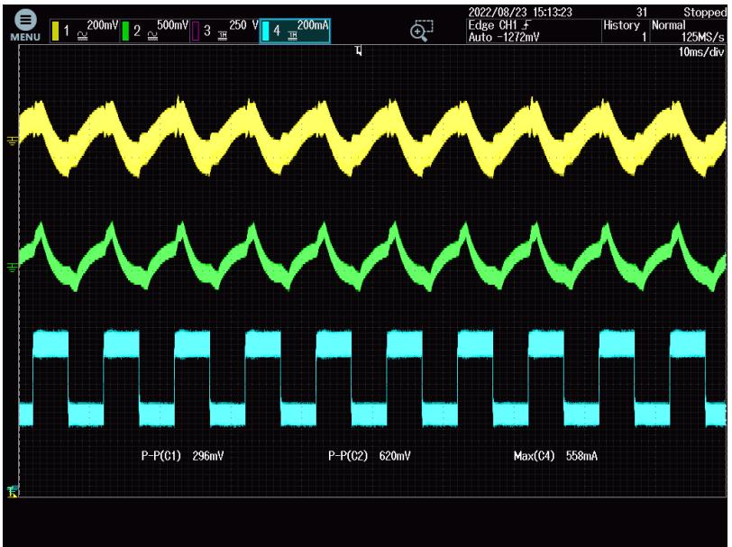

85VAC

CH1 VOUT ${ \mathsf { C H 1 } } { \mathsf { V } } _ { \mathsf { O U T } }$ $V _ { \mathsf { P K - P K } } { = } 2 9 6 ~ \mathsf { m V }$  
CH2 VOUT ${ \mathsf { C H } } 2 { \mathsf { V } } _ { \mathsf { O U T } }$ VPK-PK=620mV $\mathsf { V } _ { \mathsf { P K - P K } } { = } 6 2 0 \mathsf { m V }$

## Test Condition:

➢ $0 . 2 5 \ : \mathsf { A } – 0 . 5 \ : \mathsf { A } – 0 . 2 5 \ : \mathsf { A }$  
➢ 0.25A-0.5A-0.25 A  
➢ Slew Rate: 0.5 A/μS  
➢ Frequency: 100 Hz

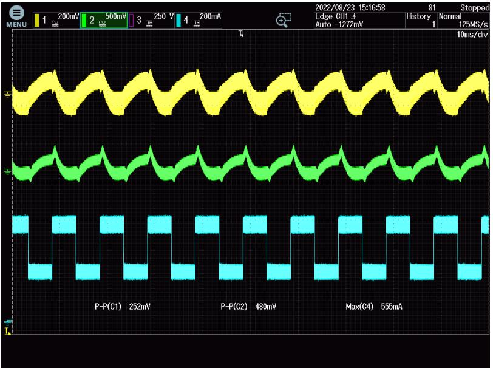

230 VAC

CH1 VOUT ${ \mathsf { C H 1 } } { \mathsf { V } } _ { \mathsf { O U T } }$ VPK-PK=252 mV $V _ { p | c - P K } = 2 5 2 m v$  
CH2 VOUT ${ \mathsf { C H } } 2 { \mathsf { V } } _ { \mathsf { O U T } }$ VPK-PK=480 mV $V _ { \mathsf { P K - P K } } { = } 4 8 0 ~ \mathsf { m V }$

## Test Condition:

➢ 0.25A-0.5A-0.25A  
➢ 0.25 A-0.5 A-0.25 A  
➢ Slew Rate: 0.5 A/μS  
➢ Frequency: 100 Hz

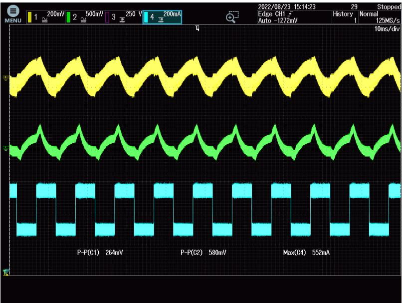

115 VAC

CH1 VOUT ${ \mathsf { C H 1 } } { \mathsf { V } } _ { \mathsf { O U T } }$ $V _ { \mathsf { P K - P K } } { = } 2 6 4 ~ \mathsf { m V }$  
CH2 VOUT ${ \mathsf { C H } } 2 { \mathsf { V } } _ { \mathsf { O U T } }$ $V _ { \mathsf { P K - P K } } { = } 5 8 0 ~ \mathsf { m V }$

## Test Condition:

➢ 0.25A-0.5A-0.25A  
➢ 0.25 A-0.5 A-0.25A  
➢ Slew Rate: 0.5 A/μS  
➢ Frequency: 100 Hz

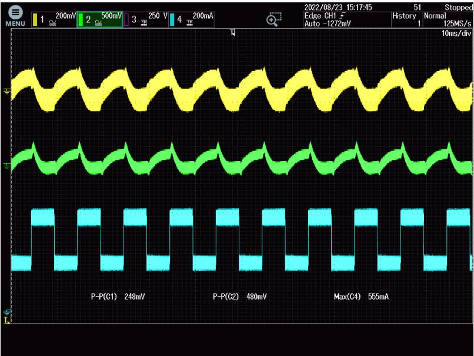

265 VAC

CH1 VOUT ${ \mathsf { C H 1 } } { \mathsf { V } } _ { \mathsf { O U T } }$ $V _ { P K - P K } = 2 4 8 m v$  
CH2 VOUT ${ \mathsf { C H } } 2 { \mathsf { V } } _ { \mathsf { O U T } }$ $V _ { \mathsf { P K - P K } } { = } 4 8 0 ~ \mathsf { m V }$

## Test Condition:

➢ 0.25A-0.5A-0.25A  
➢ 0.25A-0.5 A-0.25 A  
➢ Slew Rate: 0.5 A/μS  
➢ Frequency: 100 Hz

## 动态负载(10%-90%)

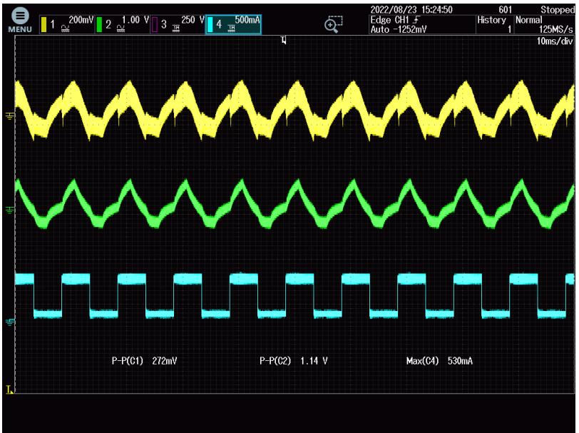

85VAC

${ \mathsf { C H 1 } } { \mathsf { V } } _ { \mathsf { O U T } }$ CH1 VOUT $V _ { P K - P K } = 2 7 2 m v$  
CH2 VOUT ${ \mathsf { C H } } 2 { \mathsf { V } } _ { \mathsf { O U T } }$ $\mathtt { V } _ { \mathtt { P K - P K } } = \mathtt { 1 } \mathtt { 1 } 4 0 \mathsf { m v }$

## Test Condition:

➢ 0.05 A-0. 5A-0.45A  
➢ 0.05 A-0.5 A-0.45 A  
➢ Slew Rate: 0.5 A/μS  
➢ Frequency: 100 Hz

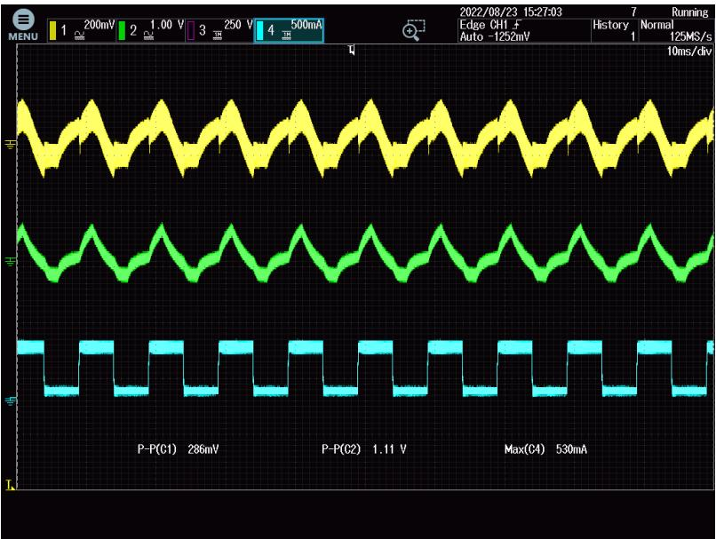

115 VAC

CH1 VOUT ${ \mathsf { C H 1 } } { \mathsf { V } } _ { \mathsf { O U T } }$ $V _ { \mathsf { P K - P K } } { = } 2 8 6 ~ \mathsf { m V }$  
CH2 VOUT ${ \mathsf { C H } } 2 { \mathsf { V } } _ { \mathsf { O U T } }$ VPK-PK=1110mV $\mathtt { V } _ { \mathtt { P K - P K } } mathtt { = 1 } 1 1 0 \mathsf { m V }$

## Test Condition:

➢ 0.05A-0.5 A-0.45 A  
➢ 0.05A-0.5 A-0.45 A  
➢ Slew Rate: 0.5 A/μS  
➢ Frequency: 100 Hz

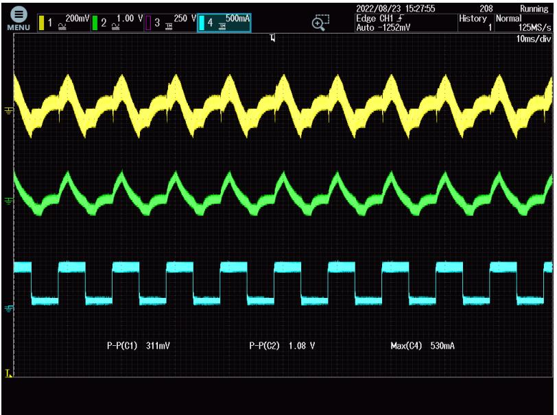

230 VAC

CH1 VOUT $\mathsf { V } _ { \mathsf { O U T } }$ VPK-PK=311 mV $\mathtt { V } _ { \mathtt { P K - P K } } = 3 1 1 \mathtt { m V }$  
CH2 VOUT ${ \mathsf { C H } } 2 { \mathsf { V } } _ { \mathsf { O U T } }$ VPK-PK=1080mV $\mathtt { V } _ { \mathtt { P K - P K } } = \mathtt { 1 0 8 0 m V }$

## Test Condition:

➢ 0.05 A-0.5A-0.45A  
➢ 0.05 A-0.05 A-0.45 A  
➢ Slew Rate: 0.5 A/μS  
➢ Frequency: 100 Hz

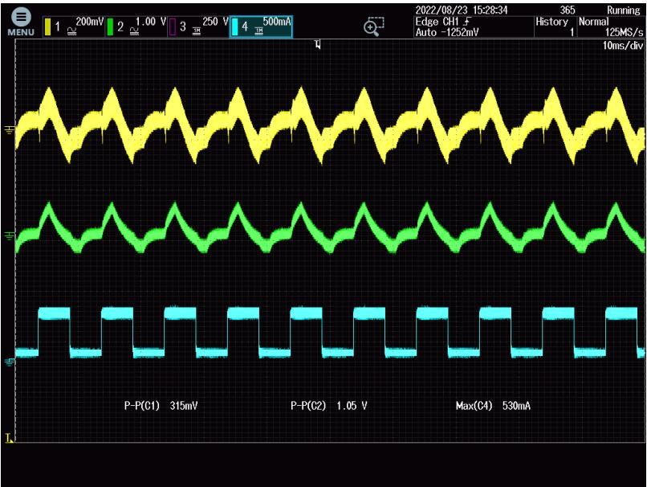

265 VAC

CH1 VOUT ${ \mathsf { C H 1 } } { \mathsf { V } } _ { \mathsf { O U T } }$ $\mathsf { V } _ { \mathsf { P K - P K } } { = } 3 1 5 \mathsf { m V }$  
CH2 VOUT ${ \mathsf { C H } } 2 { \mathsf { V } } _ { \mathsf { O U T } }$ VPK-PK=1050mV $V _ { \mathsf { P K - P K } } { = } 1 0 5 0 \mathsf { m V }$

## Test Condition:

➢ 0.05A-0.5 A-0.45 A  
➢ 0.05 A-0.5A-0.45 A  
➢ Slew Rate: 0.5 A/μS  
➢ Frequency: 100 Hz

## 输出电压开机波形

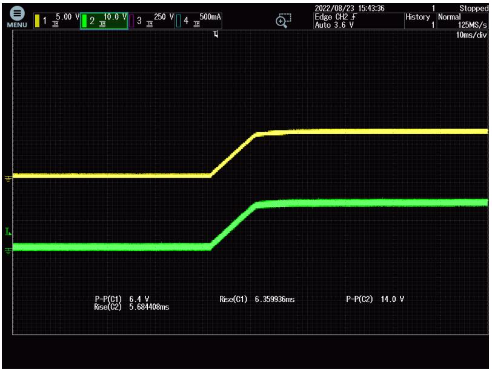

85 VAC

CH1 VOUT $\mathsf { V } _ { \mathsf { O U T } }$ ${ \sf T } _ { \sf R I S E } .$ 6.35mS  
CH2 VOUT $\mathsf { V } _ { \mathsf { O U T } }$ ${ \sf T } _ { \sf R I S E } .$ 5.68mS

Test Condition:  
➢ No Load  
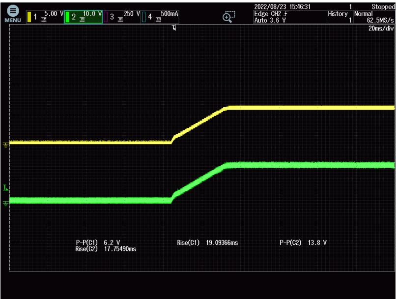

85 VAC

CH1 VOUT $\mathsf { V } _ { \mathsf { O U T } }$ ${ \sf T } _ { \sf R I S E } .$ 19.09mS  
CH2 VOUT $\mathsf { V } _ { \mathsf { O U T } }$ ${ \sf T } _ { \sf R I S E } .$ 17.75mS

Test Condition:  
➢ Full Load  
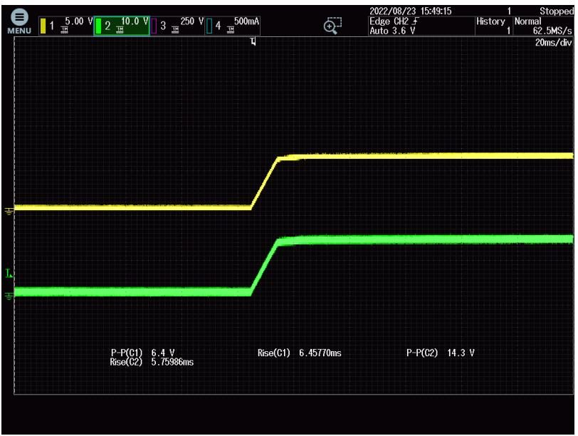

265 $\mathsf { v } _ { \mathsf { A C } }$

CH1 VOUT $\mathsf { V } _ { \mathsf { O U T } }$ ${ \sf T } _ { \sf R I S E } .$ 6.45mS  
CH2 VOUT $\mathsf { V } _ { \mathsf { O U T } }$ ${ \sf T } _ { \sf R I S E } .$ 5.75mS

Test Condition:  
➢ No Load  
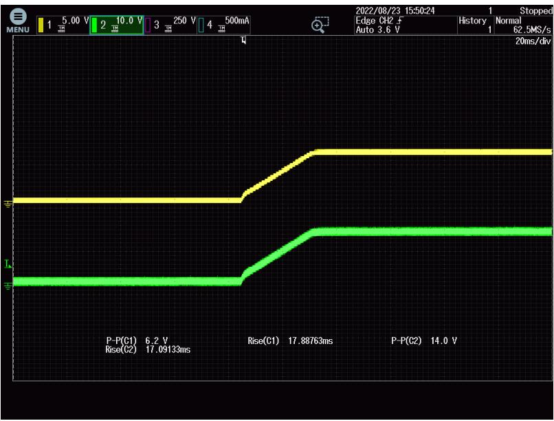

265 $\mathsf { v } _ { \mathsf { A C } }$

CH1 VOUT $\mathsf { V } _ { \mathsf { O U T } }$ ${ \sf T } _ { \sf R I S E } .$ 17.09 mS  
CH2 VOUT $\mathsf { V } _ { \mathsf { O U T } }$ TRISE:17.88mS

Test Condition:

➢ Full Load

## 启动延迟时间

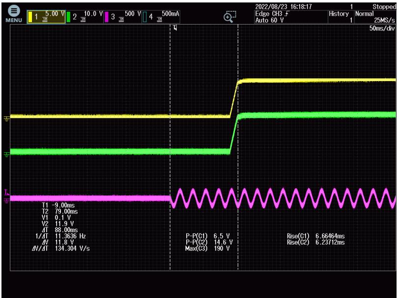

85 VAC

CH1 $\mathsf { V } _ { \mathsf { O U T } }$  
CH2 $\mathsf { V } _ { \mathsf { O U T } }$  
CH3 VINNAC $\mathsf { V I N } _ { \mathsf { N A C } }$  
$\mathsf { T } _ { \mathsf { D E L A Y } } .$ 88mS  
${ \mathsf { T } } _ { \mathsf { D E L A Y } } .$ 88 mS

Test Condition:  
➢ No Load  
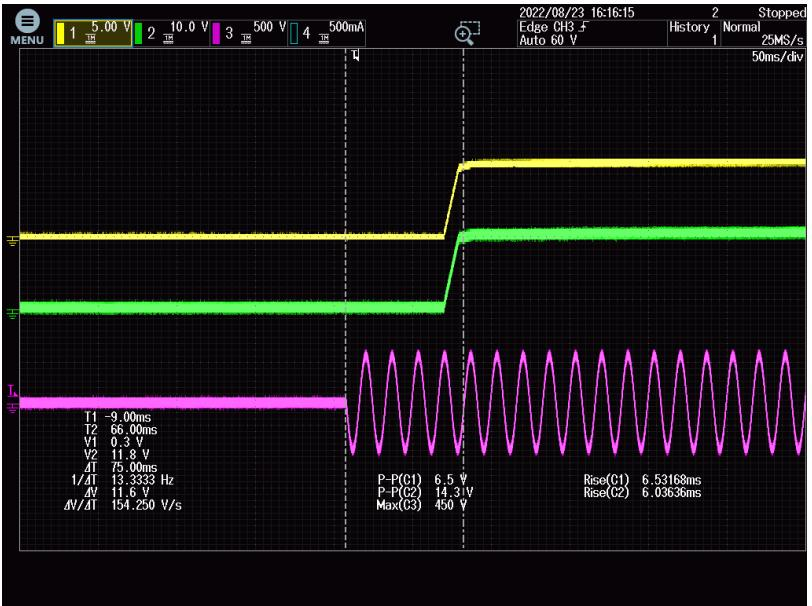

265 $\mathsf { v } _ { \mathsf { A C } }$

CH1 $\mathsf { V } _ { \mathsf { O U T } }$  
CH2 $\mathsf { V } _ { \mathsf { O U T } }$  
CH3 VINNAC $\mathsf { V I N } _ { \mathsf { N A C } }$  
${ \sf T } _ { \sf D E L A Y } .$ 75mS  
${ \sf T } _ { \sf D E L A Y } .$ 75mS

Test Condition:  
➢ No Load  
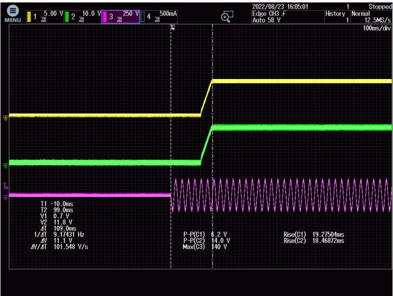

85 VAC

CH1 $\mathsf { V } _ { \mathsf { O U T } }$  
CH2 $\mathsf { V } _ { \mathsf { O U T } }$  
CH3 $\mathsf { V I N } _ { \mathsf { N A C } }$  
${ \bar { \mathsf { T } } } _ { { \mathsf { D E L A Y } } } .$ 109mS  
$\mathsf { T } _ { \mathsf { D E L A Y } } .$ 109mS

Test Condition:  
➢ Full Load  
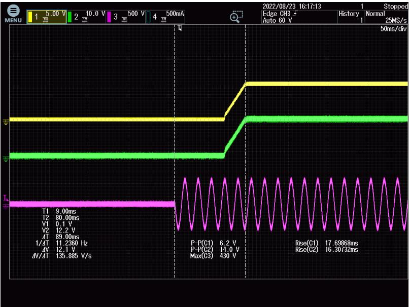

265 $\mathsf { v } _ { \mathsf { A C } }$

${ \mathsf { C H 1 } } { \mathsf { V } } _ { \mathsf { O U T } }$  
${ \mathsf { C H } } 2 { \mathsf { V } } _ { \mathsf { O U T } }$  
CH3 VINNAC $\mathsf { V I N } _ { \mathsf { N A C } }$  
$\mathsf { T } _ { \mathsf { D E L A Y } } .$ 89mS  
${ \bar { \mathsf { T } } } _ { { \mathsf { D E L A Y } } } .$ 89mS

Test Condition:

➢ Full Load

## 短路保护 （MOSFET波形）

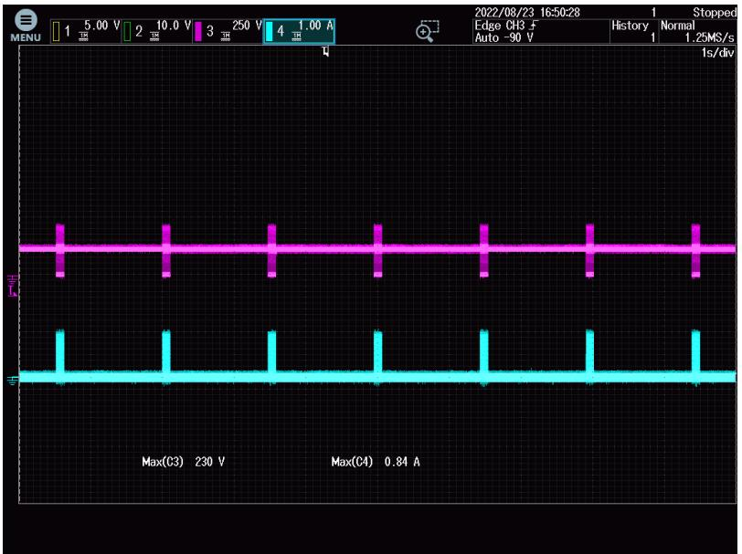

85VAC

CH3 VDS：  
CH4 ID：

$$
\begin{array}{l} I _ {D S \_ M A X} = 0. 8 4 A \\ V _ {D S \_ M A X} = 2 3 0 V \end{array}
$$

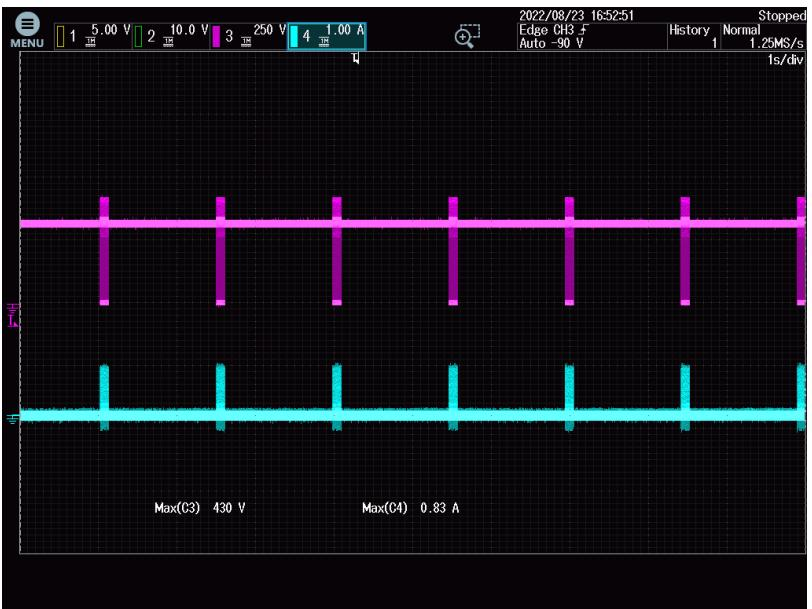

230 VAC

CH3 VDS：  
CH4 ID：

$$
I _ {D S \_ M A X} = 0. 8 3 A
$$

$$
V _ {D S \_ M A X} = 4 3 0 V
$$

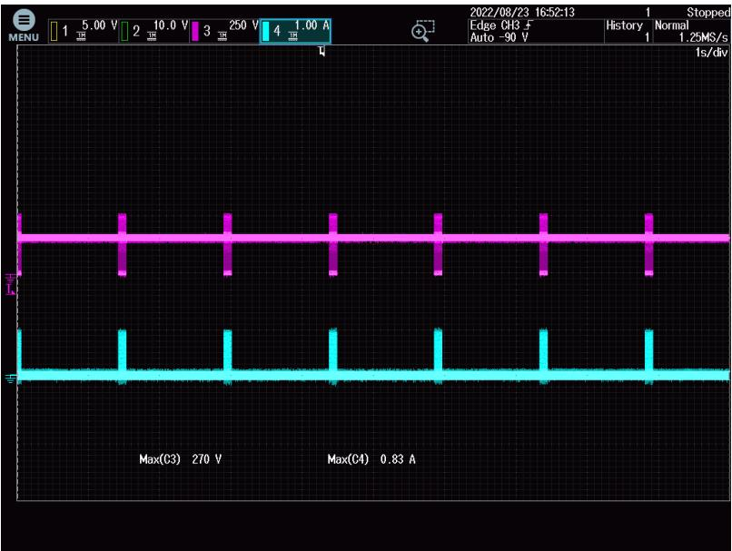

115 VAC

CH3 VDS：  
CH4 ID：

$$
I _ {D S \_ M A X} = 0. 8 3 A
$$

$$
V _ {D S \_ M A X} = 2 7 0 V
$$

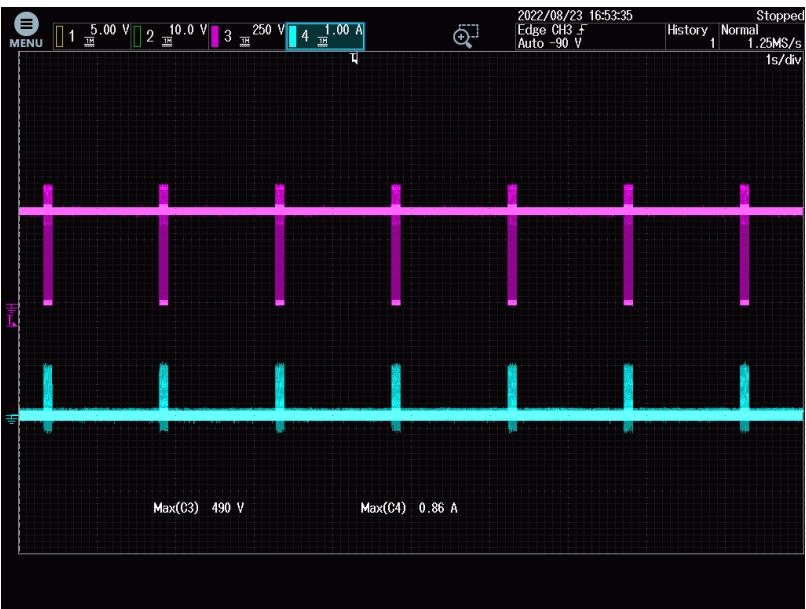

265 VAC

CH3 VDS：  
CH4 ID：

$$
I _ {D S \_ M A X} = 0. 8 6 A
$$

$$
V _ {D S \_ M A X} = 4 9 0 V
$$

## MOSFET稳态波形

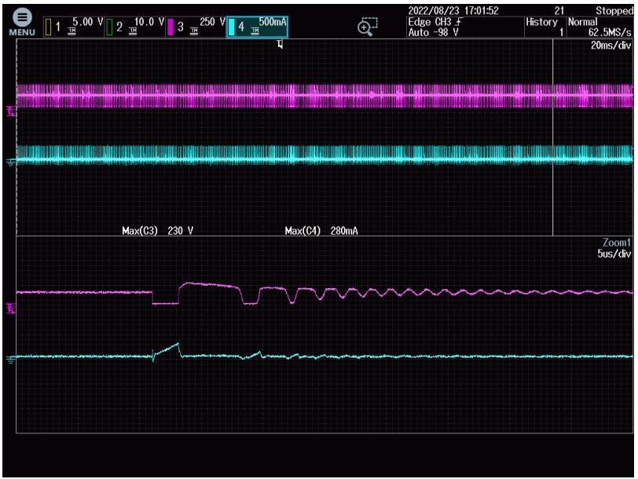

85VAC

CH1 VDS  
CH3 IDS

$$
\begin{array}{l} \mathrm {V_ {DS\_MAX}} = 2 3 0 \mathrm{V} \\ \mathrm {I_ {DS\_MAX}} = 0. 2 8 \mathrm{A} \end{array}
$$

## Test Condition:

➢ No Load

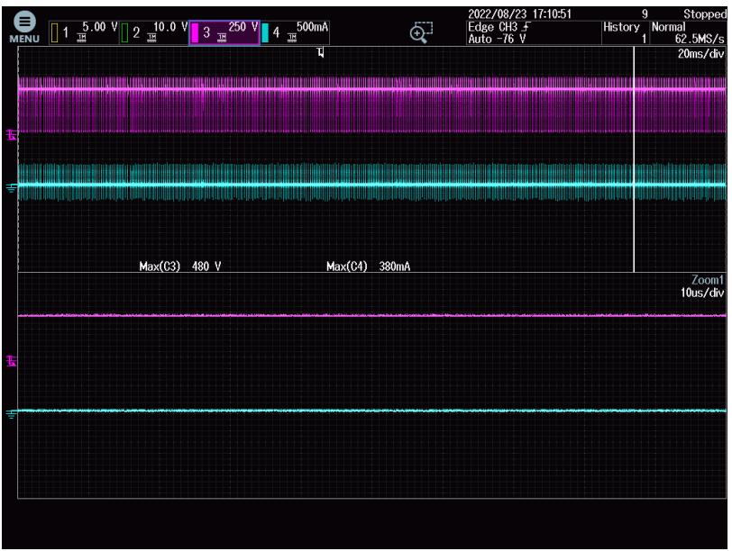

265 VAC

CH1 VDS  
CH3 IDS

$$
\begin{array}{l} \mathrm {V_ {DS\_MAX}} = 4 8 0 \mathrm{V} \\ \mathrm {I_ {DS\_MAX}} = 0. 3 8 \mathrm{A} \end{array}
$$

## Test Condition:

➢ No Load

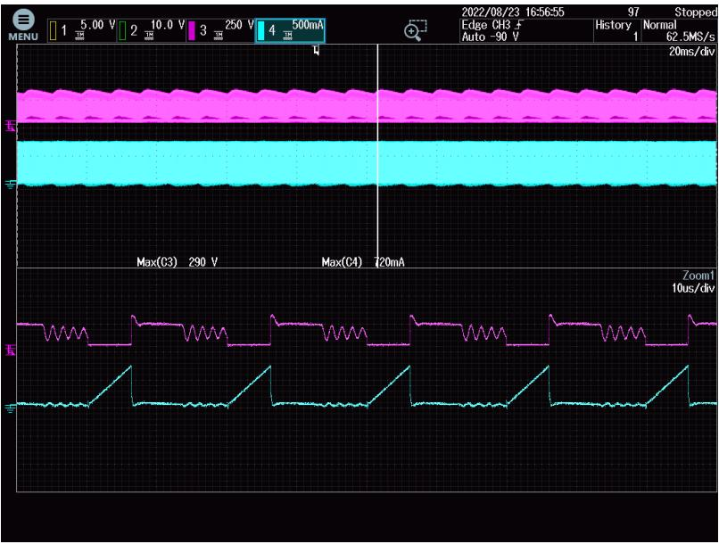

85 VAC

CH1 VDS  
CH3 IDS

$$
\begin{array}{l} \mathrm {V_ {DS\_MAX}} = 2 9 0 \mathrm{V} \\ \mathrm {I_ {DS\_MAX}} = 0. 7 2 \mathrm{A} \end{array}
$$

## Test Condition:

➢ Full Load

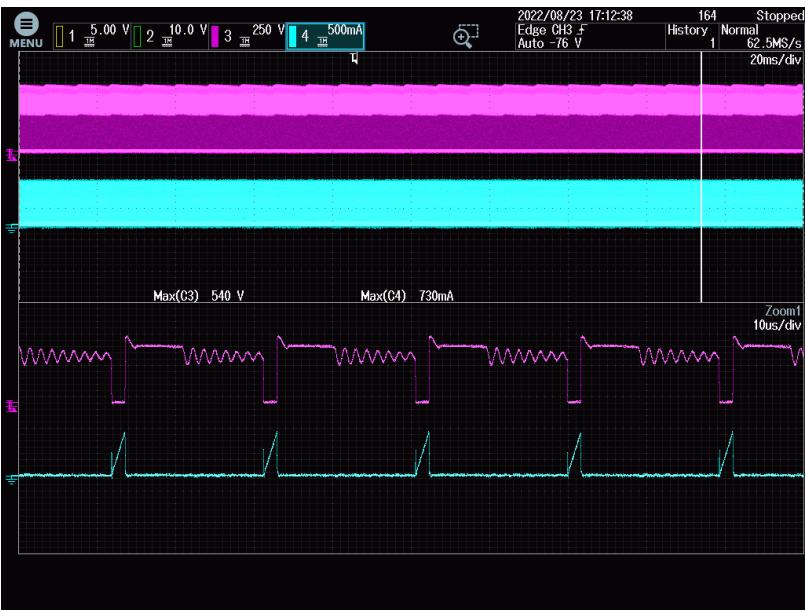

265 VAC

CH1 VDS  
CH3 IDS

$$
\begin{array}{l} \mathrm {V_ {DS\_MAX}} = 5 4 0 \mathrm{V} \\ \mathrm {I_ {DS\_MAX}} = 0. 7 3 \mathrm{A} \end{array}
$$

## Test Condition:

➢ Full Load

## 漏极开机波形

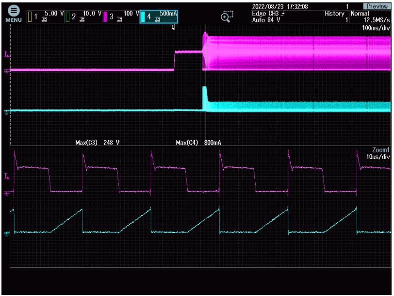

${ \otimes 5 } \mathsf { V } _ { \mathsf { A C } }$

${ \mathsf { C H 1 } } { \mathsf { V } } _ { { \mathsf { 0 U T P U T } } }$  
$C H 4 \mid _ { \mathsf { D R A I N } }$ CH4 IDRAIN $V _ { \mathsf { D S \_ M A X } } { = } 2 4 8 V$ $\mathsf { I } _ { \mathsf { D S \_ M A X } } { = } \mathsf { 0 } . 8 \mathsf { A }$

Test Condition:  
➢ 空载启动  
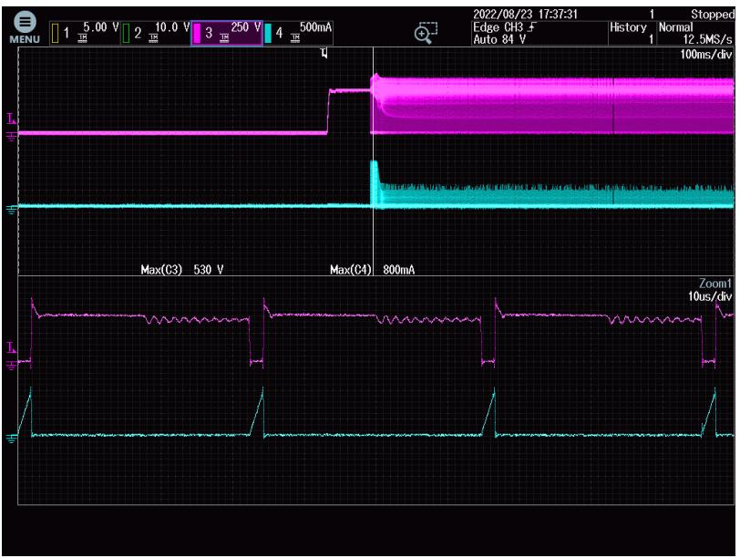

265 VAC

CH1 VOUTPUT ${ \mathsf { C H 1 V _ { \mathsf { 0 U T P U T } } } }$  
$\yen 123,456$ CH4 IDRAIN IDS\_MAX=0.8A

Test Condition:  
➢ 空载启动  
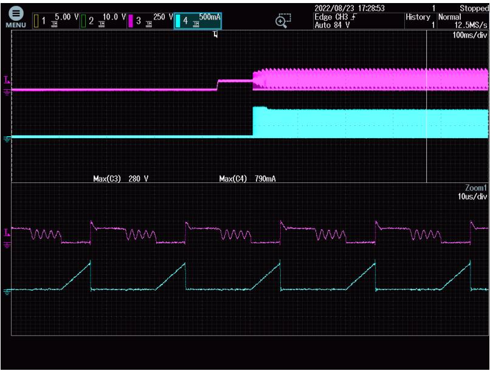

85 VAC

CH1 $\mathsf { V } _ { \mathsf { O U T P U T } }$  
CH4 IDRAIN $1 _ { \mathsf { D R A I N } }$ $V _ { \mathsf { D S \_ M A X } } { = } 2 8 0 \ V$ IDS\_MAX=0.79A $\lvert _ { \mathsf { D S \_ M A X } } \rvert = 0 . 7 9 \ A$

Test Condition:  
➢ 满载启动  

265 VAC

${ \mathsf { C H 1 } } { \mathsf { V } } _ { { \mathsf { 0 U T P U T } } }$  
CH4 IDRAIN $V _ { \mathsf { D S \_ M A X } } { = } 5 4 0 V$ $\mathsf { I } _ { \mathsf { D S \_ M A X } } { = } 0 . 8 2 \mathsf { A }$ IDS\_MAX=0.82A

Test Condition:

➢ 满载启动

## D-S电压波形

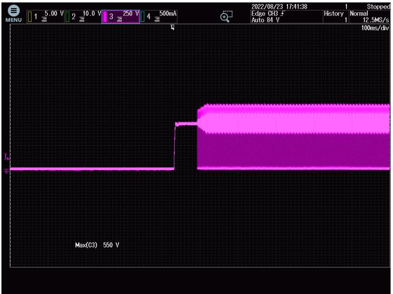

265 VAC

CH2 VDS VDSMAX: 550 V

Test Condition:

➢ 满载开机

极限参数(注3)

<table><tr><td>符号</td><td>参数</td><td>参数范围</td><td>单位</td></tr><tr><td> $V_{DRAIN}$ </td><td>内部高压 MOSFET 漏极到源极电压</td><td>-0.3~700</td><td>V</td></tr><tr><td> $V_{CC}$ </td><td> $V_{CC}$  电压</td><td>-0.3~9</td><td>V</td></tr><tr><td> $I_{CC\_MAX}$ </td><td> $V_{CC}$  引脚最大电流</td><td>20</td><td>mA</td></tr><tr><td> $V_{FB}$ </td><td>输出反馈端电压</td><td>-0.3~9</td><td>V</td></tr><tr><td> $P_{DMAX}$ </td><td>功耗(注 4)</td><td>1.5</td><td>W</td></tr><tr><td> $\theta_{JA}$ </td><td>结到环境的热阻(注 5)</td><td>80</td><td>°C/W</td></tr><tr><td> $\theta_{JC}$ </td><td>结到芯片表面的热阻(注 5)</td><td>20</td><td>°C/W</td></tr><tr><td> $T_{J}$ </td><td>工作结温范围</td><td>-40 to 150</td><td>°C</td></tr><tr><td> $T_{STG}$ </td><td>储存温度范围</td><td>-55 to 150</td><td>°C</td></tr><tr><td>ESD</td><td>人体模型 ESD(注 6)</td><td>2</td><td>kV</td></tr></table>

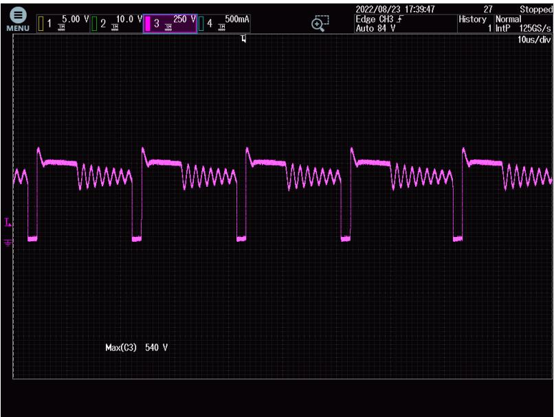

265 VAC

CH2 VDS VDSMAX: 540 V

Test Condition:满载正常工作

## 满载开机

Derating= 550 V /650V = 84.6 1%

## 满载正常工作

Derating = 540V / 650 V = 83.07%

## 12V输出肖特基反压波形

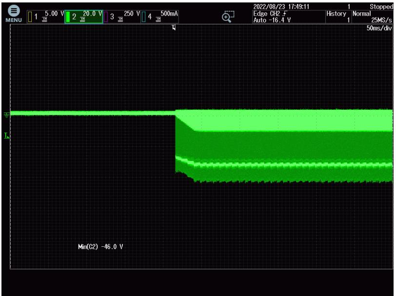

265 VAC

CH1 VDIODE VDSMAX:46V

Test Condition:

➢ 满载启动

<table><tr><td>PARAMETER</td><td>SYMBOL</td><td>MB54</td><td>MB54A</td><td>MB55</td><td>MB56</td><td>MB58</td><td>MB59</td><td>MB510</td><td>MB515</td><td>MB520</td><td>UNITS</td></tr><tr><td>Maximum Recurrent Peak Reverse Voltage</td><td> $V_{RRM}$ </td><td>40</td><td>45</td><td>50</td><td>60</td><td>80</td><td>90</td><td>100</td><td>150</td><td>200</td><td>V</td></tr><tr><td>Maximum RMS Voltage</td><td> $V_{RMS}$ </td><td>28</td><td>31.5</td><td>35</td><td>42</td><td>56</td><td>63</td><td>70</td><td>105</td><td>140</td><td>V</td></tr><tr><td>Maximum DC Blocking Voltage</td><td> $V_{DC}$ </td><td>40</td><td>45</td><td>50</td><td>60</td><td>80</td><td>90</td><td>100</td><td>150</td><td>200</td><td>V</td></tr><tr><td>Average Rectified Output Current (See Figure 1)</td><td> $I_{F(AV)}$ </td><td colspan="9">5</td><td>A</td></tr><tr><td>Non-Repetitive Peak Forward Surge Current : 8.3ms single half sine-wave superimposed on rated load</td><td> $I_{FSM}$ </td><td colspan="9">100</td><td>A</td></tr><tr><td>Forward Voltage at 5A (Note 1)</td><td> $V_F$ </td><td colspan="2">0.7</td><td colspan="2">0.74</td><td colspan="3">0.8</td><td colspan="2">0.9</td><td>V</td></tr><tr><td>Peak Reverse Current at Rated DC Blocking Voltage  $T_J=25°C$  $T_J=100°C$ </td><td> $I_R$ </td><td colspan="9">0.0510</td><td>mA</td></tr><tr><td>Typical Thermal Resistance (Note 2)</td><td> $R_{BJA}$  $R_{BJL}$ </td><td colspan="9">5517</td><td>°C /W</td></tr><tr><td>Operating Junction and Storage Temperature Range</td><td> $T_J,T_{STG}$ </td><td>-55 to +150</td><td colspan="8">-65 to +175</td><td>°C</td></tr></table>

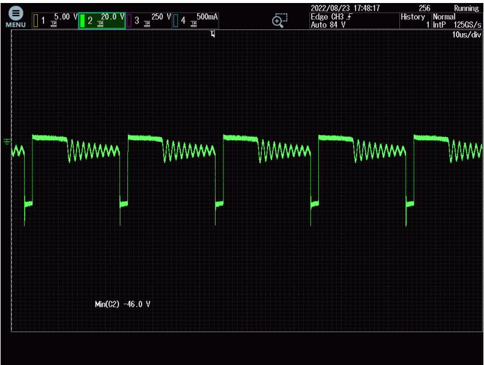

265 VAC

CH1 VDDIODE VMAX: 46V

Test Condition:

满载正常工作

## 满载开机

$\mathsf { D e r a t i n g } = 4 6 \mathsf { V } / 6 0 \mathsf { V } = 7 6 . 6 6 \%$

## 满载正常工作

Derating = 46 V / 60V = 76.66 %

## 12V输出肖特基反压波形

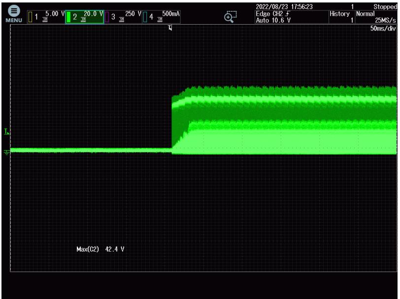

265 VAC

CH3 VDIODE VDSMAX: 42.4V

Test Condition:

满载启动

<table><tr><td>Parameter</td><td>Symbols</td><td>SS22</td><td>SS24</td><td>SS26</td><td>SS28</td><td>SS210</td><td>SS212</td><td>SS215</td><td>SS220</td><td>Units</td></tr><tr><td>Maximum Repetitive Peak Reverse Voltage</td><td> $V_{RRM}$ </td><td>20</td><td>40</td><td>60</td><td>80</td><td>100</td><td>120</td><td>150</td><td>200</td><td>V</td></tr><tr><td>Maximum RMS voltage</td><td> $V_{RMS}$ </td><td>14</td><td>28</td><td>42</td><td>56</td><td>70</td><td>84</td><td>105</td><td>140</td><td>V</td></tr><tr><td>Maximum DC Blocking Voltage</td><td> $V_{DC}$ </td><td>20</td><td>40</td><td>60</td><td>80</td><td>100</td><td>120</td><td>150</td><td>200</td><td>V</td></tr><tr><td>Maximum Average Forward Rectified Current</td><td> $I_{F(AV)}$ </td><td colspan="8">2.0</td><td>A</td></tr><tr><td>Peak Forward Surge Current,8.3ms Single Half Sine-wave Superimposed on Rated Load (JEDEC method)</td><td> $I_{FSM}$ </td><td colspan="8">50</td><td>A</td></tr><tr><td>Max Instantaneous Forward Voltage at 2 A</td><td> $V_F$ </td><td colspan="2">0.55</td><td colspan="2">0.70</td><td colspan="2">0.85</td><td colspan="2">0.95</td><td>V</td></tr><tr><td>Maximum DC Reverse Current  $T_a = 25°C$ at Rated DC Reverse Voltage  $T_a = 100°C$ </td><td> $I_R$ </td><td colspan="3">0.55</td><td colspan="5">0.33</td><td>mA</td></tr><tr><td>Typical Junction Capacitance $^{(1)}$ </td><td> $C_j$ </td><td colspan="2">220</td><td colspan="6">80</td><td>pF</td></tr><tr><td>Typical Thermal Resistance $^{(2)}$ </td><td> $R_{\theta JA}$ </td><td colspan="8">80</td><td>°C/W</td></tr><tr><td>Operating Junction Temperature Range</td><td> $T_j$ </td><td colspan="8">-55 ~ +125</td><td>°C</td></tr><tr><td>Storage Temperature Range</td><td> $T_{stg}$ </td><td colspan="8">-55 ~ +150</td><td>°C</td></tr></table>

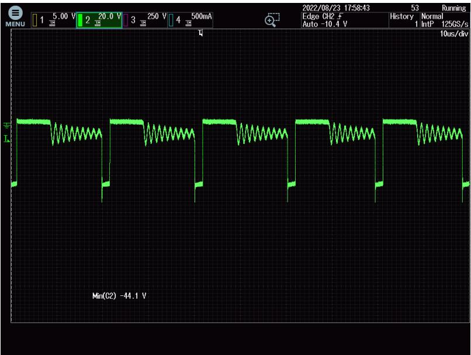

265 VAC

CH3 VDDIODE VMAX: 44.1V

Test Condition:

满载正常工作

## 满载开机

$\mathrm { D e r a t i n g } = 4 2 . 4 \lor / 6 0 \lor = 7 0 . 6 6 \%$

## 满载正常工作

Derating =44.1V / 60 V = 73.5%

<table><tr><td rowspan="2">项目</td><td colspan="2">85VAC</td><td colspan="2">265VAC</td></tr><tr><td>温度(°C)</td><td>温升(°C)</td><td>温度(°C)</td><td>温升(°C)</td></tr><tr><td>环境温度</td><td colspan="2">30</td><td colspan="2">29</td></tr><tr><td>BPA86216D (U1)</td><td>107</td><td>77</td><td>78</td><td>49</td></tr><tr><td>变压器绕组(T1)</td><td>91</td><td>61</td><td>84</td><td>55</td></tr><tr><td>变压器磁芯(T1)</td><td>83</td><td>53</td><td>77</td><td>48</td></tr><tr><td>输出肖特基(D4)</td><td>75</td><td>45</td><td>72</td><td>43</td></tr><tr><td>输出肖特基(D3)</td><td>89</td><td>59</td><td>86</td><td>57</td></tr><tr><td>输入电解电容(E2)</td><td>64</td><td>34</td><td>50</td><td>21</td></tr><tr><td>输出电解电容(E5)</td><td>61</td><td>31</td><td>59</td><td>30</td></tr></table>

## 测试说明

➢ 在温箱中进行测试  
➢ 电路板放在一个封闭的盒子内  
➢ 热电偶连接到各个测量点  
➢ 等测量点温度达到稳定后记录数据

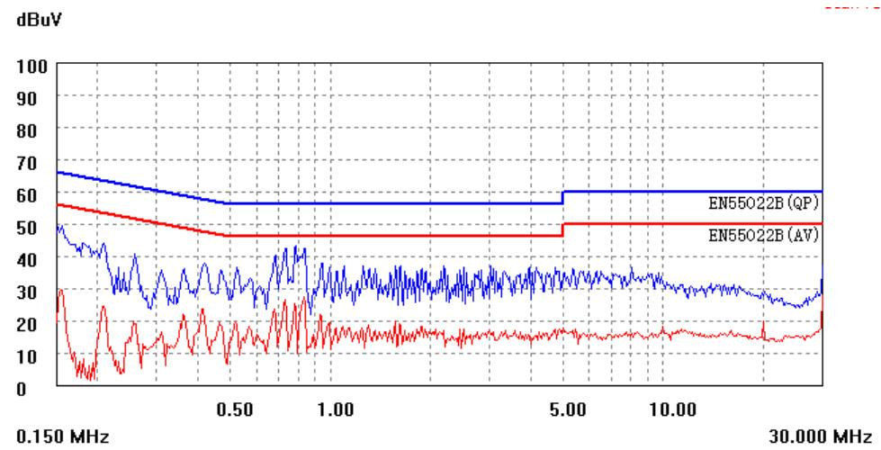

115VAC Line

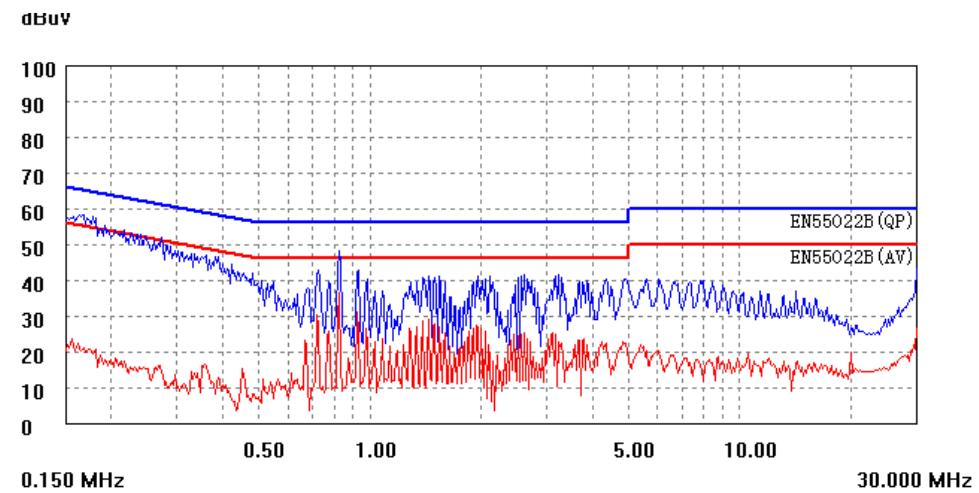

230VAC Line

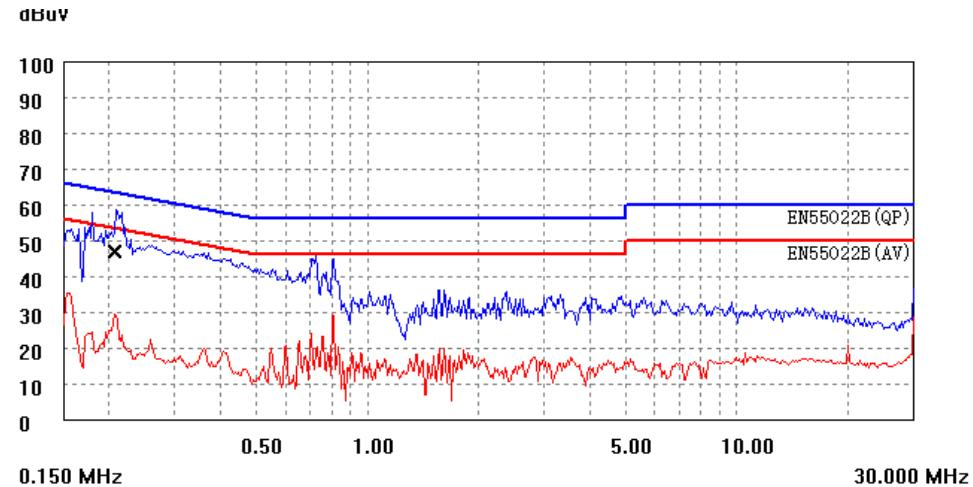

115VAC Neutral

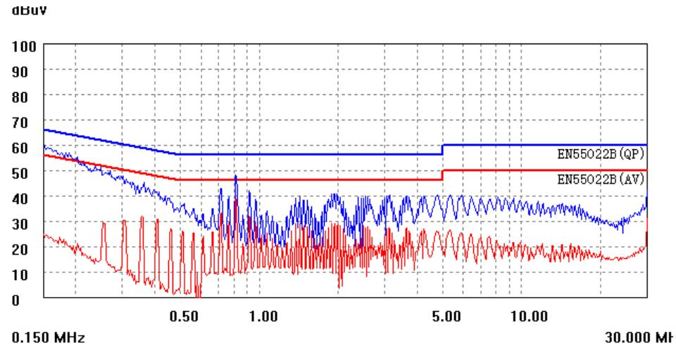

230VAC Neutral

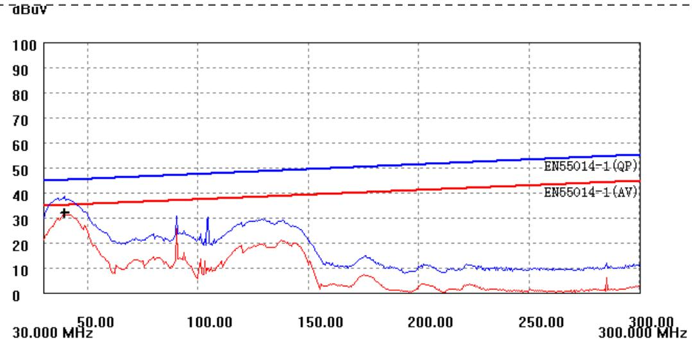

115VAC 满载

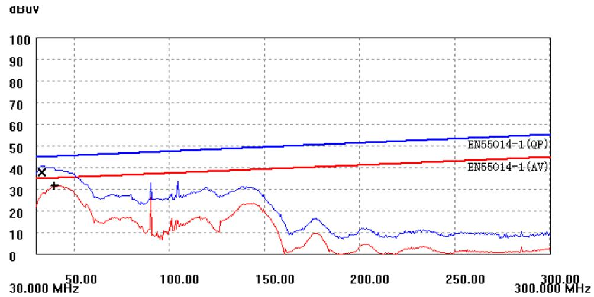

230VAC 满载

<table><tr><td>差模</td><td>电压</td><td>相位角</td><td>发生器阻抗</td><td>测试次数</td><td>测试结果</td></tr><tr><td>L to N</td><td>+2kV</td><td>0</td><td>2</td><td>10</td><td>Pass</td></tr><tr><td>L to N</td><td>-2kV</td><td>0</td><td>2</td><td>10</td><td>Pass</td></tr><tr><td>L to N</td><td>+2kV</td><td>90</td><td>2</td><td>10</td><td>Pass</td></tr><tr><td>L to N</td><td>-2kV</td><td>90</td><td>2</td><td>10</td><td>Pass</td></tr><tr><td>L to N</td><td>+2kV</td><td>180</td><td>2</td><td>10</td><td>Pass</td></tr><tr><td>L to N</td><td>-2kV</td><td>180</td><td>2</td><td>10</td><td>Pass</td></tr><tr><td>L to N</td><td>+2kV</td><td>270</td><td>2</td><td>10</td><td>Pass</td></tr><tr><td>L to N</td><td>-2kV</td><td>270</td><td>2</td><td>10</td><td>Pass</td></tr></table>

## 测试说明

➢ 按照GB/T17626.5和IEC61000-4-5的最新版本要求进行测试  
➢ 室温环境，230VAC输入，满载条件  
➢ 输入1.2/50us组合波浪涌电压  
➢ 每个测试点重复10次  
➢ 每次间隔时间1分钟  
➢ 试验时样机输出正常（符合A类标准）视为Pass

<table><tr><td>差模</td><td>电压</td><td>脉冲群持续时间</td><td>脉冲频率</td><td>测试时间</td><td>测试结果</td></tr><tr><td>L to N</td><td>+4kV</td><td>15ms</td><td>5kHz</td><td>120s</td><td>Pass</td></tr><tr><td>L to N</td><td>-4kV</td><td>15ms</td><td>5kHz</td><td>120s</td><td>Pass</td></tr><tr><td>L to N</td><td>+4kV</td><td>0.75ms</td><td>100kHz</td><td>120s</td><td>Pass</td></tr><tr><td>L to N</td><td>-4kV</td><td>0.75ms</td><td>100kHz</td><td>120s</td><td>Pass</td></tr><tr><td>L to N</td><td>+2kV</td><td>2ms</td><td>38kHz</td><td>120s</td><td>Pass</td></tr><tr><td>L to N</td><td>-2kV</td><td>2ms</td><td>38kHz</td><td>120s</td><td>Pass</td></tr><tr><td>L to N</td><td>+4kV</td><td>2ms</td><td>38kHz</td><td>120s</td><td>Pass</td></tr><tr><td>L to N</td><td>-4kV</td><td>2ms</td><td>38kHz</td><td>120s</td><td>Pass</td></tr></table>

## 测试说明

➢ 按照GB/T17626.4和IEC61000-4-4的最新版本要求进行测试  
➢ 室温环境，230VAC输入满载条件  
➢ 分别测试5kHz/100kHz/38kHz脉冲频率  
➢ 脉冲群周期为300ms  
➢ 每个测试条件测试时间120s  
➢ 试验时样机输出正常（符合A类标准）视为Pass

<table><tr><td>测试</td><td>电压(V)</td><td>放电类型</td><td>放电次数</td><td>测试结果</td></tr><tr><td>Vo</td><td>+15kV</td><td>空气放电</td><td>10</td><td>Pass</td></tr><tr><td>Vo</td><td>-15kV</td><td>空气放电</td><td>10</td><td>Pass</td></tr><tr><td>GND</td><td>+15kV</td><td>空气放电</td><td>10</td><td>Pass</td></tr><tr><td>GND</td><td>-15kV</td><td>空气放电</td><td>10</td><td>Pass</td></tr><tr><td>Vo</td><td>+20kV</td><td>空气放电</td><td>10</td><td>Pass</td></tr><tr><td>Vo</td><td>-20kV</td><td>空气放电</td><td>10</td><td>Pass</td></tr><tr><td>GND</td><td>+20kV</td><td>空气放电</td><td>10</td><td>Pass</td></tr><tr><td>GND</td><td>-20kV</td><td>空气放电</td><td>10</td><td>Pass</td></tr></table>

## 测试说明

➢ 按照GB/T17626.2和IEC61000-4-2的最新版本要求进行测试  
➢ 室温环境，230VAC输入满载条件  
➢ 每个测试点重复10次  
➢ 分别对输出正端和地进行空气放电  
➢ 试验时样机输出正常（符合A类标准）视为Pass

## THANK YOU FOR WATCHING
