## BPA8504D 非隔离参考设计

## (-5V/400mA)

上海晶丰明源半导体股份有限公司

Shanghai Bright Power Semiconductor Co., Ltd.

王岩

时间：2021年7月232021-10-29

## 内容

BPA8504D简介  
电源规格  
电路及实物图  
BOM  
PCB Layout图  
性能测试数据

## 产品特点：

集成 650V 高压 MOSFET  
PWM控制模式，低输出纹波  
内置软启动功能  
集成高压启动、自供电电路  
低音频噪声

## 应用领域：

家用电器辅助电源  
电机驱动辅助电源  
➢ IOT/智能家居/智能照明  
工业控制辅助电源

SOP7

<table><tr><td>项目描述</td><td>符号</td><td>最小</td><td>典型</td><td>最大</td><td>单位</td><td>备注</td></tr><tr><td colspan="7">输入</td></tr><tr><td>电压</td><td> $V_{IN}$ </td><td>85</td><td>115/230</td><td>264</td><td> $V_{AC}$ </td><td></td></tr><tr><td>频率</td><td> $f_{LINE}$ </td><td>47</td><td>50/60</td><td>63</td><td>Hz</td><td></td></tr><tr><td colspan="7">输出</td></tr><tr><td>输出电压</td><td> $V_{OUT}$ </td><td>4.75</td><td>5</td><td>5.25</td><td>V</td><td>±5%</td></tr><tr><td>输出电流</td><td> $I_{OUT}$ </td><td>0</td><td></td><td>400</td><td>mA</td><td></td></tr><tr><td>输出电压纹波</td><td> $V_{RIPPLE}$ </td><td></td><td></td><td>290</td><td>mV</td><td>20MHz带宽</td></tr><tr><td>连续输出功率</td><td> $P_{OUT}$ </td><td></td><td>2</td><td></td><td>W</td><td></td></tr><tr><td colspan="7">效率</td></tr><tr><td>待机功耗</td><td> $P_{STDBY}$ </td><td></td><td></td><td>120</td><td>mW</td><td>230VAC,包含假负载</td></tr><tr><td>满载效率</td><td>η</td><td>65</td><td></td><td></td><td>%</td><td></td></tr><tr><td colspan="7">环境</td></tr><tr><td>传导EMI</td><td></td><td colspan="4">满足CISPR22/EN55022 Class B,至少5dB 裕量</td><td></td></tr><tr><td>Surge</td><td></td><td></td><td>2</td><td></td><td>kV</td><td>差模</td></tr><tr><td>EFT</td><td></td><td></td><td>4</td><td></td><td>kV</td><td>5kHz/100kHz/38kHz</td></tr><tr><td>ESD</td><td></td><td></td><td>15</td><td>20</td><td>kV</td><td>空气放电</td></tr><tr><td>工作环境温度</td><td> $T_{AMP}$ </td><td>0</td><td></td><td>50</td><td>°C</td><td></td></tr></table>

## 电路及实物图

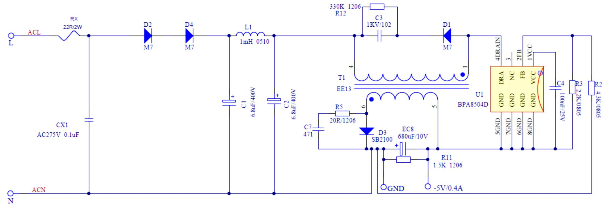

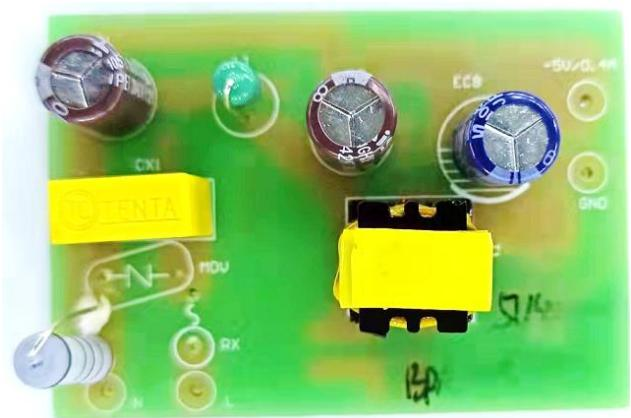

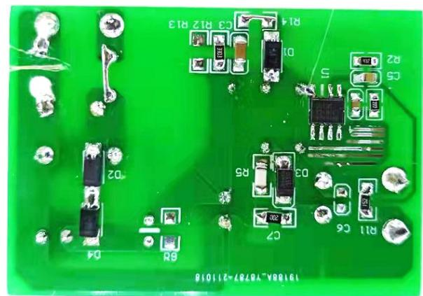

<table><tr><td>序号</td><td>元件标号</td><td>参数描述</td><td>封装尺寸</td><td>数量</td></tr><tr><td>1</td><td>PCB</td><td>CEM-1,双面板</td><td>60mm*42mm</td><td>1</td></tr><tr><td>2</td><td>RX1</td><td>22R 2W 绕线保险丝电阻</td><td>DIP</td><td>1</td></tr><tr><td>3</td><td>CX1</td><td>275V 0.1uF, x电容</td><td>DIP</td><td>1</td></tr><tr><td>4</td><td>L1</td><td>1mH色环电感 0510</td><td>DIP</td><td>1</td></tr><tr><td>5</td><td>C1,C2</td><td>400V6.8uF电解电容</td><td> $\phi 8*13$ </td><td>2</td></tr><tr><td>6</td><td>EC8</td><td>10V470uF电解电容</td><td> $\phi 10*13$ </td><td>1</td></tr><tr><td>7</td><td>T1</td><td>EE13 1.65mH</td><td>DIP</td><td>1</td></tr><tr><td>8</td><td>D2, D4,D1</td><td>M7,1A,1KV 二极管</td><td>SMA</td><td>3</td></tr><tr><td>9</td><td>D3</td><td>SS210 2A 100V肖特基二极管</td><td>SMA</td><td>1</td></tr><tr><td>10</td><td>U1</td><td>BPA8504D</td><td>SOP-7</td><td>1</td></tr><tr><td>11</td><td>R11</td><td>1.5K, ±5%</td><td>SMD1206</td><td>1</td></tr><tr><td>12</td><td>R5</td><td>22R, ±5%</td><td>SMD1206</td><td>1</td></tr><tr><td>13</td><td>R12</td><td>330K, ±5%</td><td>SMD1206</td><td>1</td></tr><tr><td>14</td><td>R3</td><td>2.2K, ±5%</td><td>SMD0805</td><td>1</td></tr><tr><td>15</td><td>R2</td><td>4.3K, ±5%</td><td>SMD0805</td><td>1</td></tr><tr><td>16</td><td>C4</td><td>100nF/16V,X7R</td><td>SMD0805</td><td>1</td></tr><tr><td>17</td><td>C3</td><td>1nF/1kV,X7R</td><td>SMD1206</td><td>1</td></tr><tr><td>18</td><td>C7</td><td>470pF/100V,X7R</td><td>SMD0805</td><td>1</td></tr><tr><td colspan="2"></td><td></td><td>Total</td><td>21</td></tr></table>

## 结构图

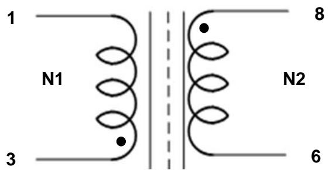

## 绕线方式

<table><tr><td>绕组</td><td>起始脚</td><td>终止脚</td><td>材料</td><td>匝数</td><td>绕线方式</td></tr><tr><td>N1</td><td>3</td><td>1</td><td> $\phi 0.17*1P$ </td><td>109Ts</td><td>密三二层(PIN脚朝外)</td></tr><tr><td colspan="4">胶带</td><td>2Ts</td><td></td></tr><tr><td>N2</td><td>8</td><td>6</td><td> $\phi 0.29*2P$ </td><td>11Ts</td><td>密绕一层(PIN脚朝外)</td></tr><tr><td colspan="4">胶带</td><td>3Ts</td><td></td></tr></table>

## 规格与材料

➢ 初级绕组感量 $\mathsf { L } _ { \mathsf { p } } = 1 7 0 0 \mathsf { u } \mathsf { H } \pm 7 \%$ （测试条件： 0.3V，50kHz）  
➢ 漏感量 $\mathrm { \cdot L _ { | k } } < 5 0 \mathrm { u } \mathrm { H }$  
➢ 骨架：EE13（5+5PIN）  
➢ 磁芯：EE13 PC40 或同等材质 ， $\mathsf { A } \mathsf { e } = 1 7 \mathsf { m } \mathsf { m } ^ { 2 }$  
➢ N1、N2: 2UEW 漆包线  
➢ 绝缘胶带:3M900 或同等材质  
➢ 成品要求：浸凡立水

## 脚位图

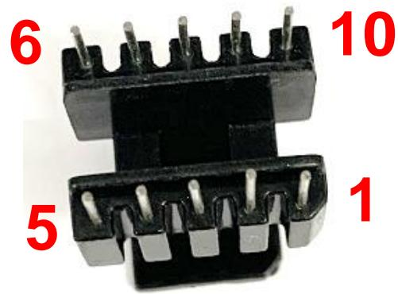

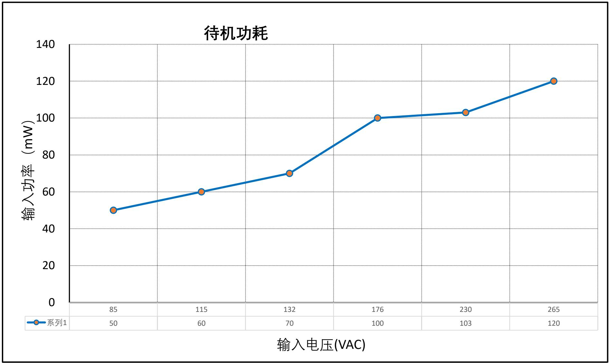

## 效率以及输出过流点

<table><tr><td>输入电压</td><td>85VAC</td><td>115VAC</td><td>230VAC</td><td>265VAC</td></tr><tr><td>整机效率</td><td>69.05%</td><td>71.53%</td><td>72.16%</td><td>71.2%</td></tr><tr><td>OCP点(@4.75V)</td><td>0.61A</td><td>0.65A</td><td>0.72A</td><td>0.75A</td></tr></table>

## 输出电压调整率

<table><tr><td> $V_{IN}(VAC)$ Load(%)</td><td>85</td><td>115</td><td>132</td><td>176</td><td>230</td><td>265</td><td>平均值</td><td>线调整率</td></tr><tr><td>0</td><td>4.988</td><td>4.992</td><td>4.993</td><td>4.993</td><td>4.996</td><td>4.998</td><td>4.993</td><td>0.20%</td></tr><tr><td>20%</td><td>4.987</td><td>4.987</td><td>4.986</td><td>4.986</td><td>4.986</td><td>4.989</td><td>4.987</td><td>0.06%</td></tr><tr><td>40%</td><td>5.008</td><td>5.007</td><td>5.004</td><td>5.004</td><td>5.004</td><td>5.002</td><td>5.005</td><td>0.12%</td></tr><tr><td>60%</td><td>5.028</td><td>5.027</td><td>5.025</td><td>5.024</td><td>5.023</td><td>5.021</td><td>5.025</td><td>0.14%</td></tr><tr><td>80%</td><td>5.042</td><td>5.044</td><td>5.042</td><td>5.042</td><td>5.041</td><td>5.040</td><td>5.042</td><td>0.08%</td></tr><tr><td>100%</td><td>5.040</td><td>5.043</td><td>5.041</td><td>5.041</td><td>5.051</td><td>5.055</td><td>5.045</td><td>0.30%</td></tr><tr><td>平均值</td><td>5.016</td><td>5.017</td><td>5.015</td><td>5.015</td><td>5.017</td><td>5.018</td><td rowspan="2" colspan="2"></td></tr><tr><td>负载调整率</td><td>1.10%</td><td>1.14%</td><td>1.12%</td><td>1.12%</td><td>1.30%</td><td>1.32%</td></tr></table>

◼ 计算方法：调整率=100%\*(最大值-最小值)/平均值  
测试条件：带1.5kΩ假负载（\~16mW）

## 输出电压纹波

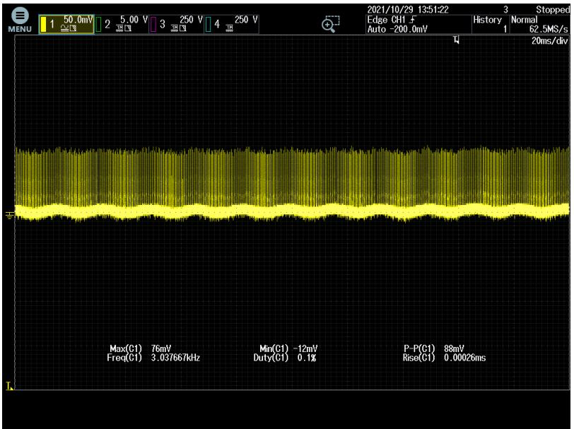

85 VAC

$\begin{array} { r l } { \mathbf { \ [ \eta ] } } & { \mathsf { C H 1 V _ { o u T } R i p p l e } } \\ & { \mathsf { V _ { P K - P K } } = 8 8 \mathsf { m V } } \end{array}$

## Test Condition:

➢ Full Load

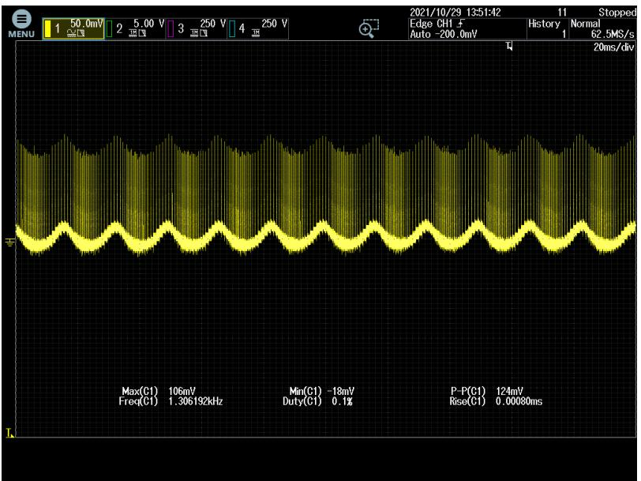

230 VAC

$\begin{array} { r l } { \mathbf { \Pi } } & { \mathsf { C H 1 } \mathsf { V _ { 0 \cup T } R i p p l e } } \\ & { \mathsf { V _ { P K - P K } } = \pm 2 4 \mathsf { m V } } \end{array}$

## Test Condition:

➢ Full Load

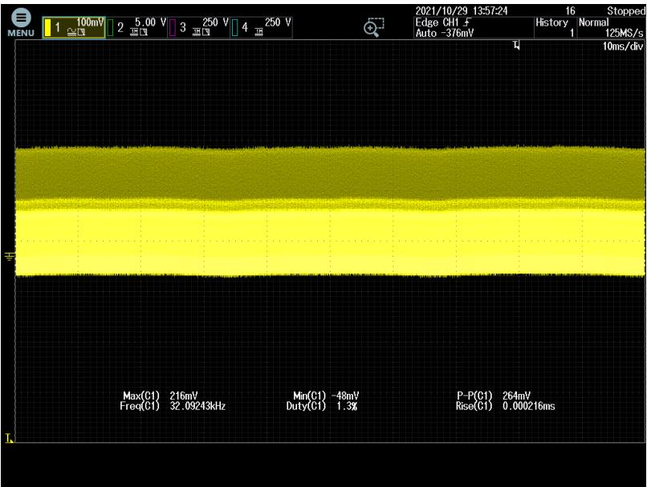

115 VAC

CH1 $\mathsf { V } _ { \mathsf { O U T } }$ Ripple $\mathsf { V } _ { \mathsf { P K - P K } } { = } 2 6 4 \mathsf { m V }$

## Test Condition:

➢ Full Load

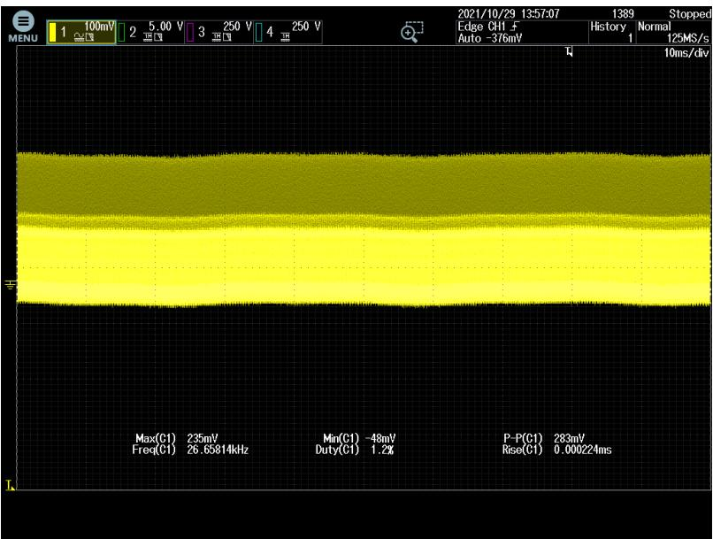

265 VAC

$\begin{array} { c c } { { \overline { { { \bf { u } } } } } } & { { \subset { \dot { { \bf { H } } } } 1 } \vee _ { \mathsf { o u T } } { \mathsf { R i p p l e } } } \\ { { } } & { { \mathsf { V } } _ { { \mathsf { P K - P K } } } { = } 2 8 3 { \mathsf { m V } } } \end{array}$

## Test Condition:

➢ Full Load

## 动态负载

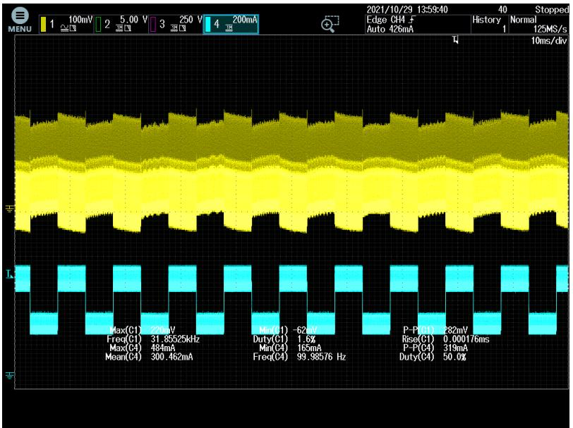

85 VAC

CH1 VOUT $\mathsf { V } _ { \mathsf { O U T } }$ $V _ { P K - P K } = 2 8 2 ~ \mathsf { m V }$  
CH4 IOUT ${ \mathsf I } _ { 0 \mathsf U \top }$

## Test Condition:

➢ 0.2 A-0.4 A-0.2 A  
➢ Slew Rate: 0.5 $\mathsf { A } / \mu \mathsf { S }$  
➢ Frequency: 100 Hz  
(50%-100%)

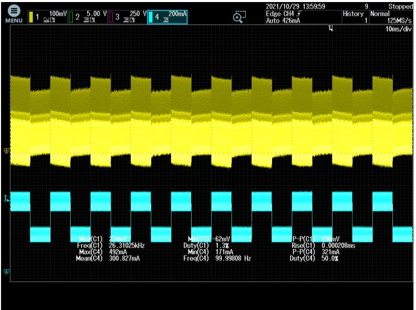

265 VAC

CH1 VOUT $\mathsf { V } _ { \mathsf { O U T } }$ $\mathsf { V } _ { \mathsf { P K - P K } } =$ 296 mV  
CH4 IOUT $\mathsf { C H 4 } \mathsf { I } _ { \mathsf { O U T } }$

## Test Condition:

➢ 0.2 A-0.4 A-0.2 A  
➢ Slew Rate: 0.5 $\mathsf { A } / \mu \mathsf { S }$  
➢ Frequency: 100 Hz  
(50%-100%)

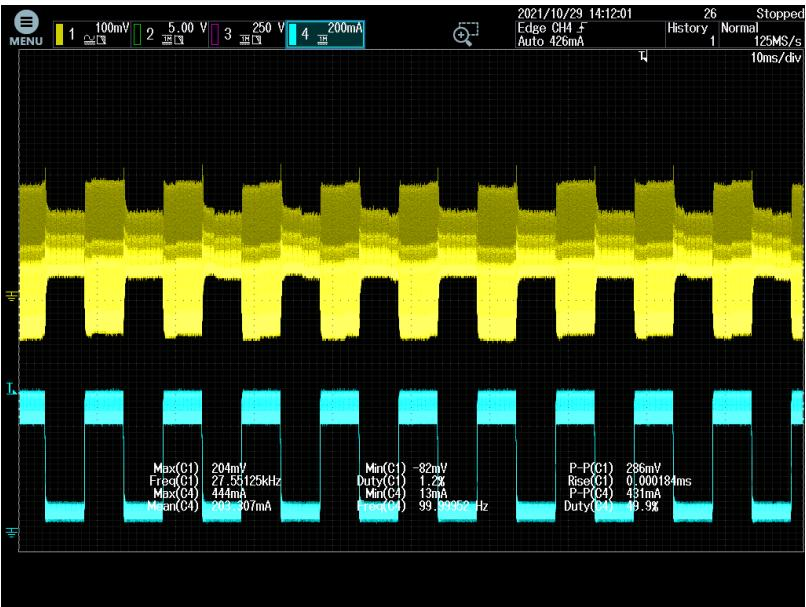

265 $\mathsf { v } _ { \mathsf { A C } }$

85 VAC

CH1 VOUT ${ \mathsf { C H 1 } } { \mathsf { V } } _ { \mathsf { O U T } }$ $\mathsf { V } _ { \mathsf { P K - P K } } { = } 2 8 6 \mathsf { m V }$  
CH4 IOUT ${ \mathsf I } _ { 0 \mathsf { U T } }$

## Test Condition:

➢ 0.04A-0.36 A-0.04 A  
➢ Slew Rate: 0.5 A/μS  
➢ Frequency: 100 Hz  
(10%-90%)

CH1 VOUT ${ \mathsf { C H 1 } } { \mathsf { V } } _ { \mathsf { O U T } }$ $\mathsf { V } _ { \mathsf { P K - P K } } { = } 2 8 4 \mathsf { m V }$ VPK-PK=284mV  
$\mathsf { C H 4 } \mathsf { I } _ { \mathsf { O U T } }$

## Test Condition:

➢ 0.04A-0.36 A-0.04 A  
➢ Slew Rate: 0.5 A/μS  
➢ Frequency: 100 Hz  
(10%-90%)

## 输出电压开机波形

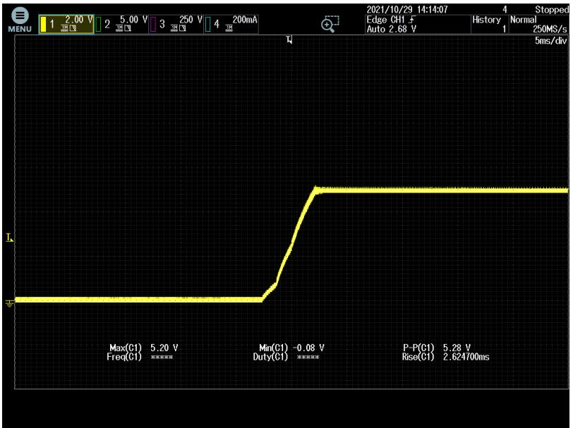

85 VAC

CH1 VOUT TRISE: 2.6 mS

## Test Condition:

➢ No Load

230 VAC

CH1 VOUT TRISE: 2.6 mS

## Test Condition:

➢ No Load

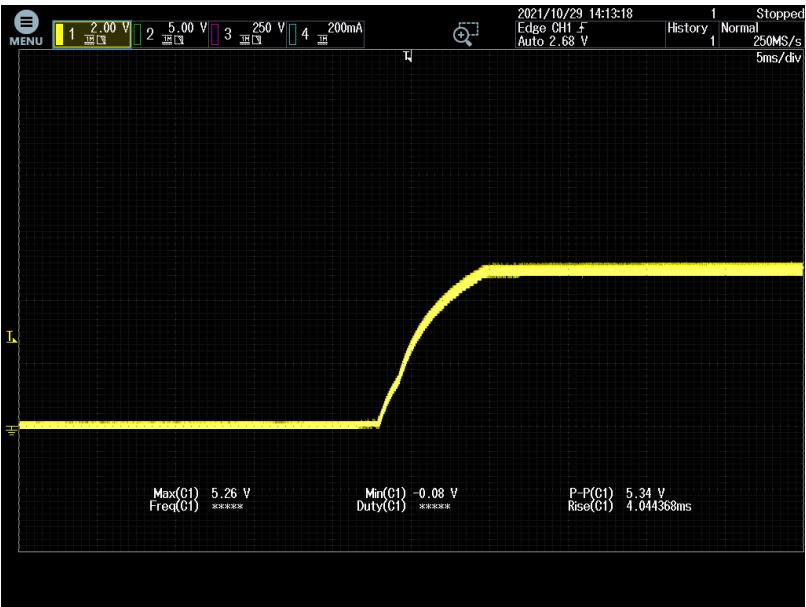

115 VAC

CH1 VOUT TRISE: 4.04 mS

## Test Condition:

➢ Full Load

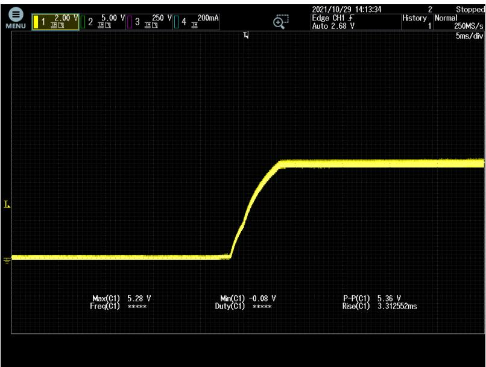

265 VAC

CH1 VOUT TRISE: 3.3 mS

## Test Condition:

➢ Full Load

## 漏源极电压和漏极电流开机和稳态波形

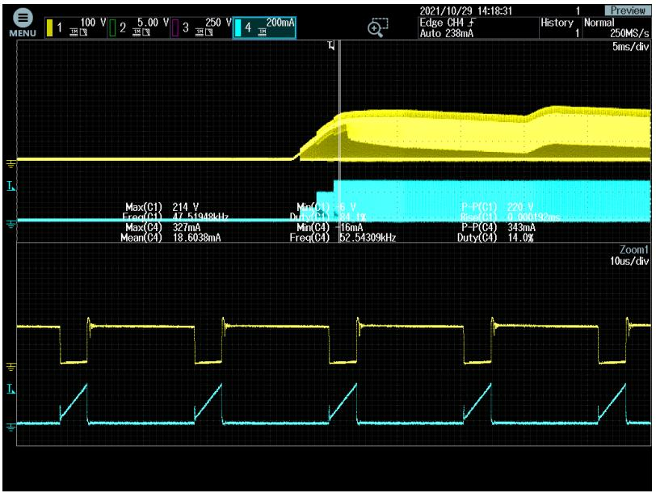

85 VAC

${ \mathsf { C H 1 } } \mathsf { V _ { D S } }$  
CH4 $\mathsf { I } _ { \mathsf { D } \mathsf { S } }$  
$\begin{array} { l } { { \mathsf { V } } _ { \mathsf { D S \_ m a x } } { = } 2 1 4 \mathsf { V } } \\ { { \mathsf { I } } _ { \mathsf { D S \_ m a x } } { = } 0 . 3 2 7 \mathsf { A } } \end{array}$ VDS \_max

## Test Condition:

➢ Full Load

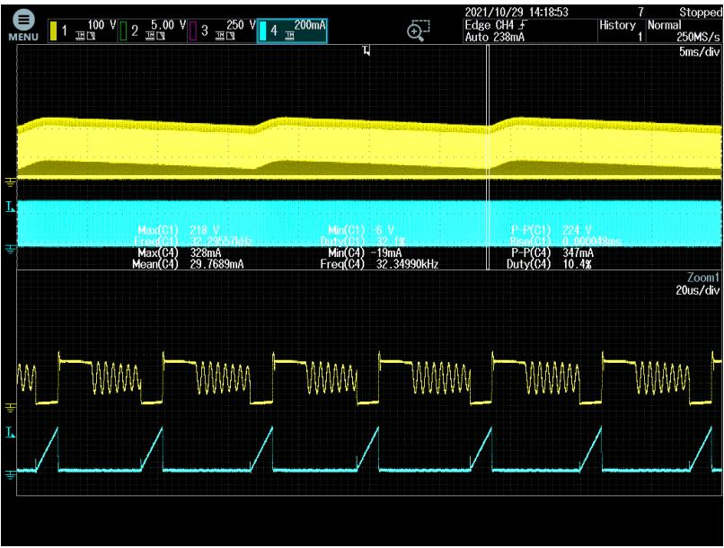

85 VAC

${ \mathsf { C H 1 V } } _ { \mathsf { D S } }$  
$C H 4 1 _ { \mathrm { D S } }$  
$\mathsf { V } _ { \mathsf { D S \_ m a x } } = 2 1 8 \mathsf { V }$ VDS \_max $\mathsf { I } _ { \mathsf { D } \mathsf { S } \_ \mathsf { m a x } } { = } 0 . 3 2 8 \mathsf { A }$

## Test Condition:

➢ Full Load

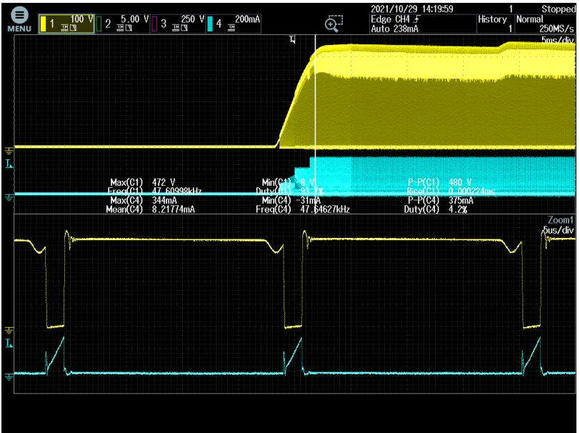

265 VAC

${ \mathsf { C H 1 } } \mathsf { V _ { D S } }$  
$C H 4 \mid _ { \mathrm { { D S } } }$  
VDS \_max =472V IDS\_max=0.344 A

## Test Condition:

➢ Full Load

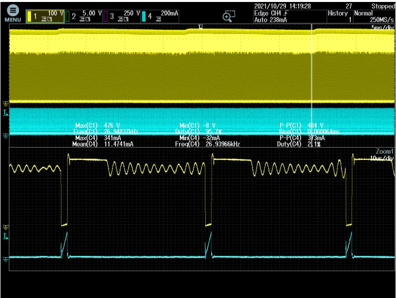

265 VAC

${ \mathsf { C H 1 } } \mathsf { V } _ { \mathsf { D S } }$  
$C H 4 1 _ { \mathrm { D S } }$  
$\mathsf { V } _ { \mathsf { D S \_ m a x } } { = } 4 7 6 \mathsf { V }$ $\mathsf { I } _ { \mathsf { D S \_ m a x } } { = } 0 . 3 4 1 \mathsf { A }$

## Test Condition:

➢ Full Load

## 输出二极管反向电压波形

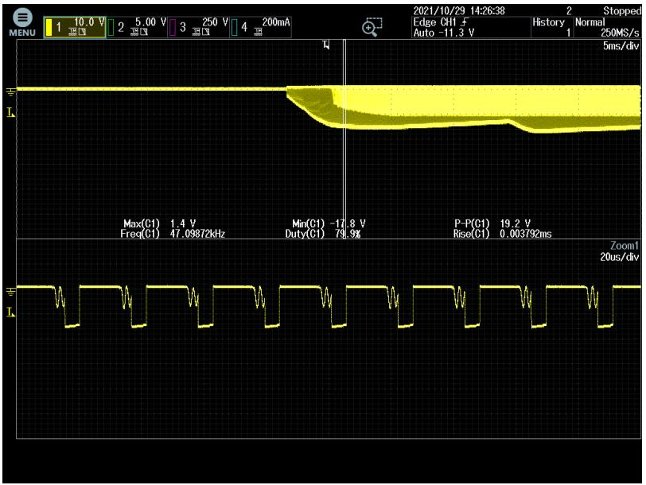

85 VAC

CH1 $V _ { \textsf { R } }$  
$\overline { { \mathbf { \Omega } } } \mathbf { V } _ { \mathbb { R } _ { - } \mathbf { M A X } } = 1 7 . 8 \mathsf { V }$

Test Condition:

➢ Full Load

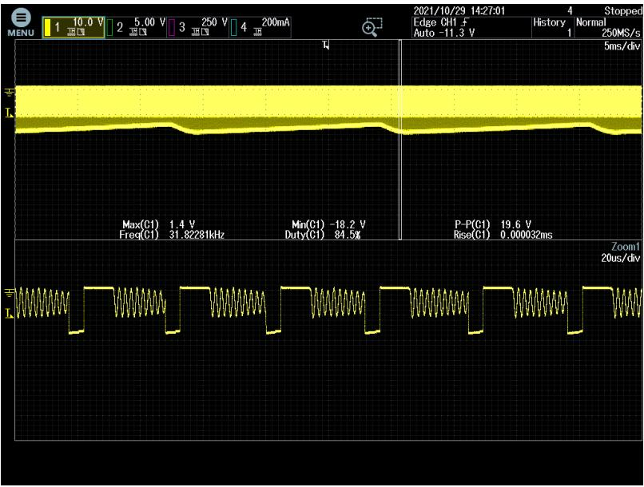

85 VAC

CH1 $V _ { \textsf { R } }$  
◼ $V _ { \mathrm { R \_ M A X } } = 1 8 . 2 V$

Test Condition:

➢ Full Load

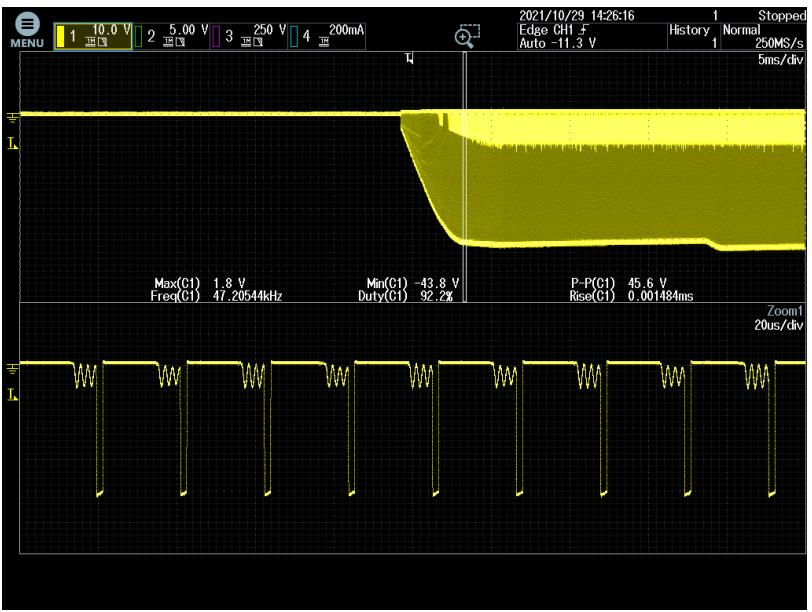

265 VAC

CH1 VR  
$V _ { R \_ M A X } = 4 3 . 8 V$

Test Condition:

➢ Full Load

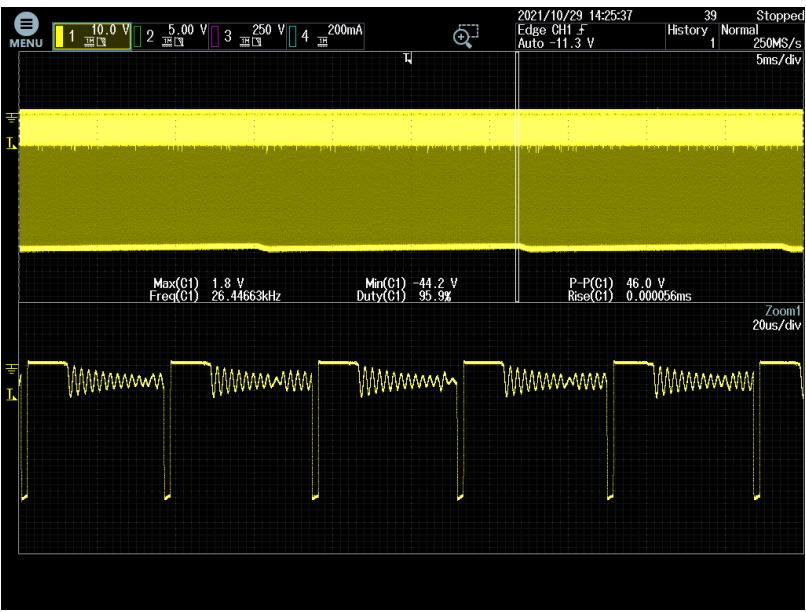

$2 6 5 \ : \mathsf { V } _ { \mathsf { A C } }$

CH1 VR  
$V _ { R \_ M A X } = 4 4 . 2 V$

Test Condition:

➢ Full Load

## 短路保护（MOSFET和输出二极管波形）

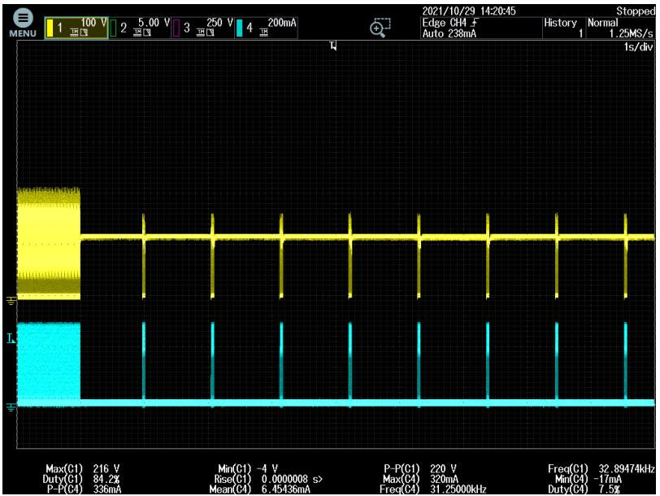

85 VAC

${ \mathsf { C H 1 } } \mathsf { V _ { D S } }$  
CH4 $\mathsf { I } _ { \mathsf { D } \mathsf { S } }$  
$\begin{array} { r } { V _ { \mathsf { D S \_ m a x } } = 2 1 6 V } \\ { \mathsf { I _ { D S \_ m a x } } = 0 . 3 2 \mathsf { A } } \end{array}$ VDS \_max

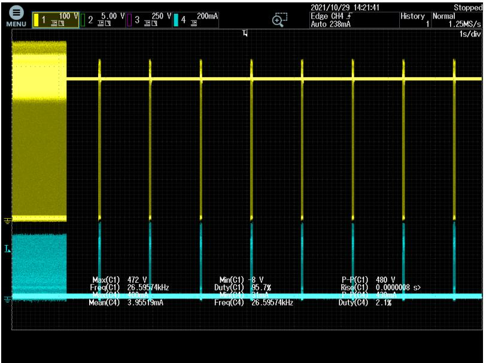

265 $\mathsf { v } _ { \mathsf { A C } }$

CH1 $\mathsf { V } _ { \mathsf { D } \mathsf { S } }$  
CH4 IDS  
$\begin{array} { r l } & { \mathsf { V } _ { \mathsf { D S \_ m a x } } = 4 7 2 \mathsf { V } } \\ & { \mathsf { I } _ { \mathsf { D S \_ m a x } } = 0 . 4 \mathsf { A } } \end{array}$

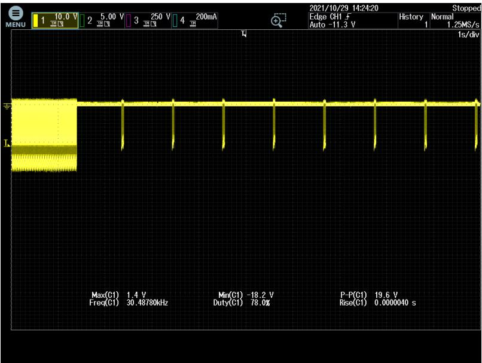

85 VAC

CH2 VR  
CH4 IR  
$V _ { \mathrm { R \_ M A X } } = 1 8 . 2 V$

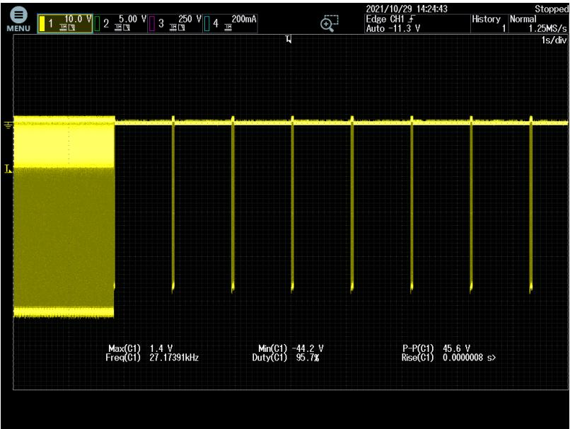

265 VAC

CH1 VR  
CH4 IR  
$V _ { R \_ M A X } = 4 4 . 2 V$

<table><tr><td rowspan="2">项目</td><td colspan="2">85VAC</td><td colspan="2">264VAC</td></tr><tr><td>温度(°C)</td><td>温升(°C)</td><td>温度(°C)</td><td>温升(°C)</td></tr><tr><td>环境温度</td><td colspan="2">26.9</td><td colspan="2">26.7</td></tr><tr><td>BPA8504D (U1)</td><td>49.1</td><td>22.2</td><td>53.2</td><td>26.5</td></tr><tr><td>变压器磁芯(T1)</td><td>45.2</td><td>18.3</td><td>47</td><td>20.3</td></tr><tr><td>变压器绕组(T1)</td><td>45.8</td><td>18.9</td><td>47.8</td><td>21.1</td></tr><tr><td>SB2100 (D3)</td><td>54</td><td>27.1</td><td>54.6</td><td>27.9</td></tr></table>

## 测试说明

➢ 在温箱中进行测试  
➢ 电路板放在一个封闭的盒子内  
➢ 热电偶连接到各个测量点  
➢ 等测量点温度达到稳定后记录数据

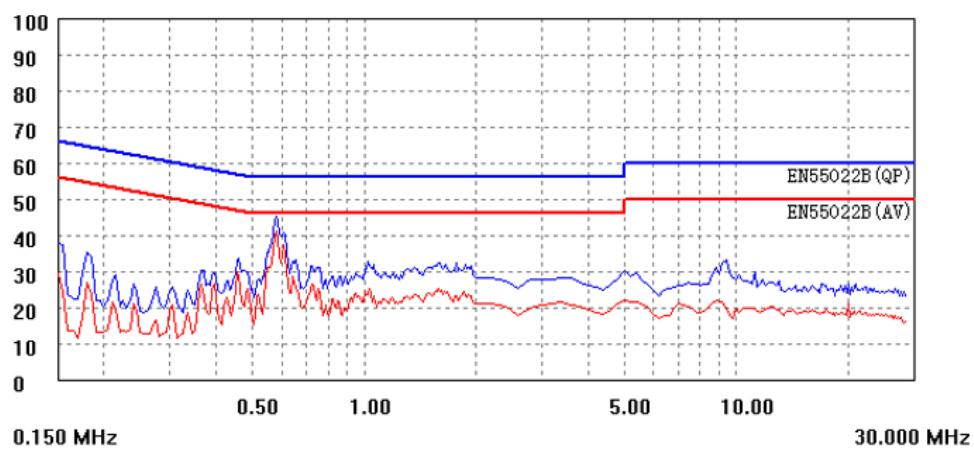

115VAC Line

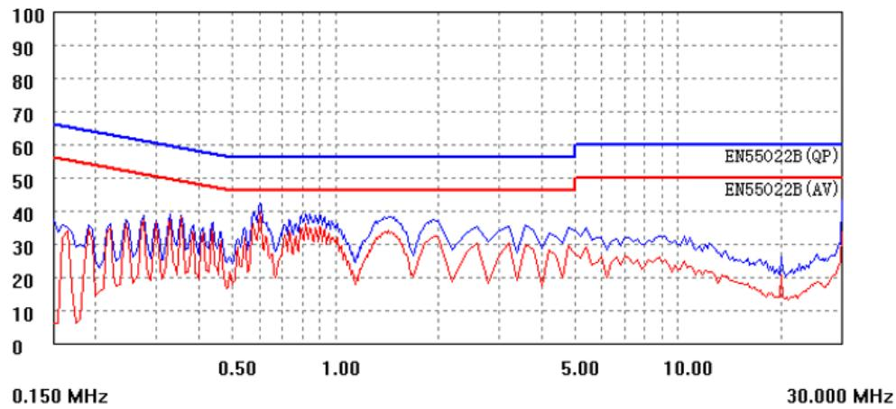

230VAC Line

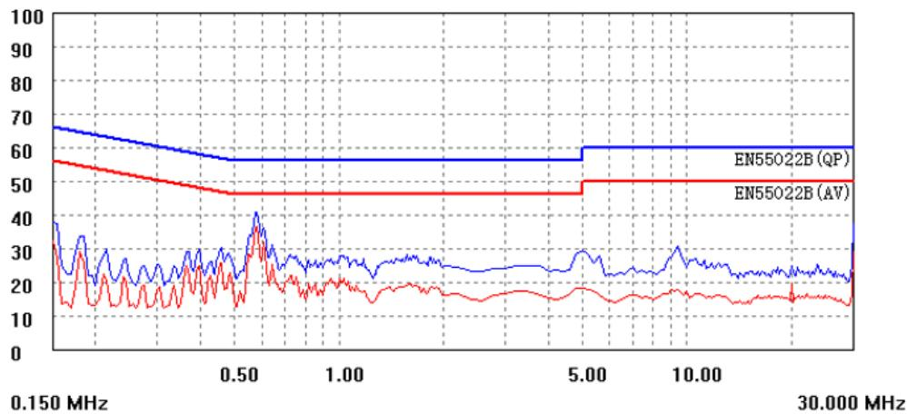

115VAC Neutral

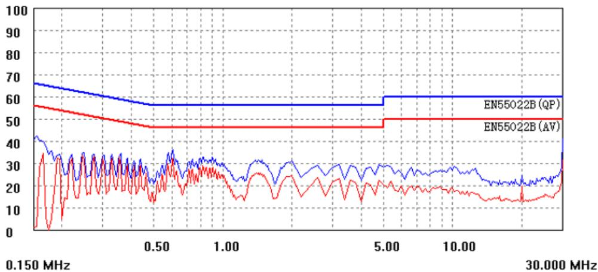

230VAC Neutral

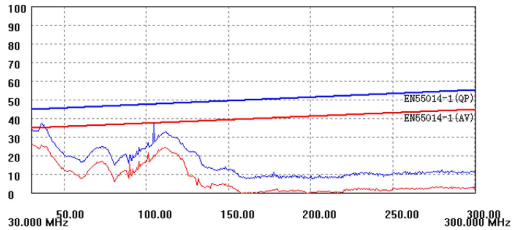

115VAC 空载  
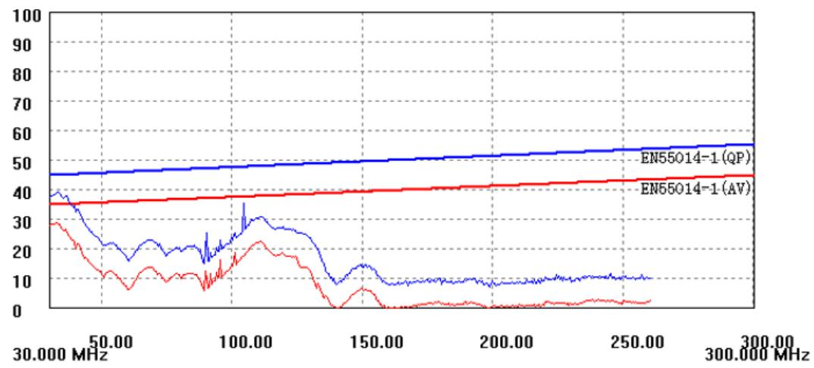

230VAC 空载

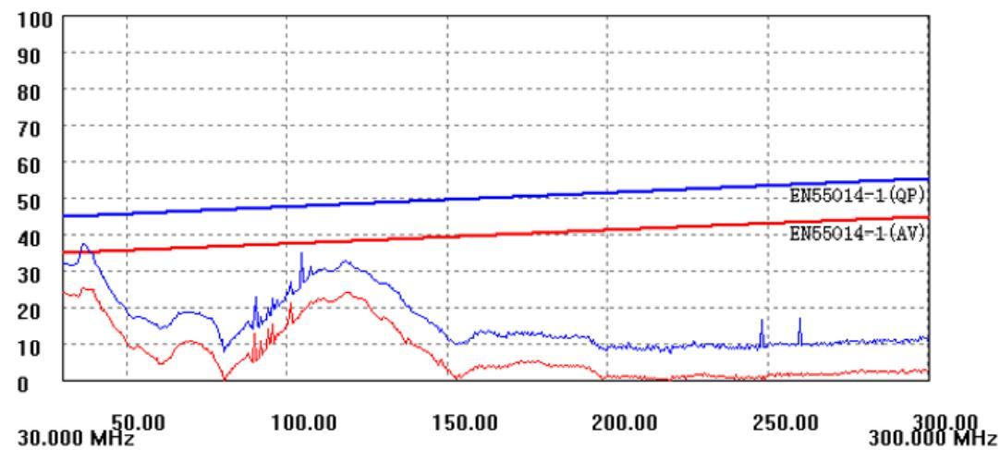

115VAC 满载

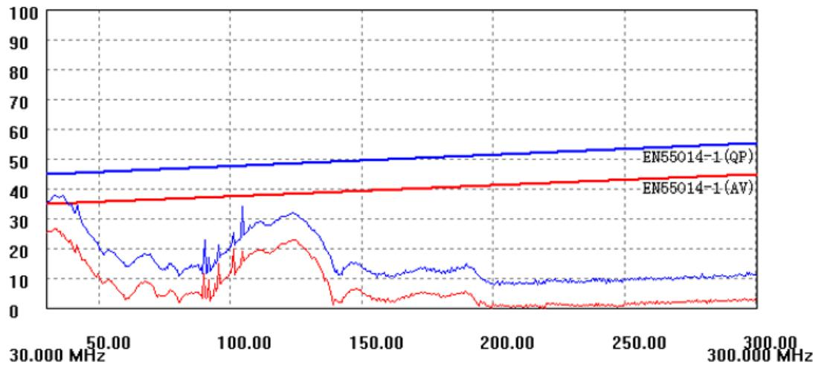

230VAC 满载

## THANK YOU FOR WATCHING
