## BPA8504D 客供测试评估\_5V80mA

上海晶丰明源半导体股份有限公司

Shanghai Bright Power Semiconductor Co., Ltd.

王岩

时间： 2021年6月

## 产品特点：

集成 650V 高压 MOSFET  
PWM控制模式，低输出纹波  
内置软启动功能  
集成高压启动、自供电电路  
低音频噪声

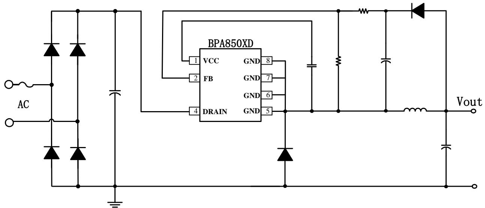

## 应用领域：

家用电器辅助电源  
电机驱动辅助电源  
➢ IOT/智能家居/智能照明  
工业控制辅助电源

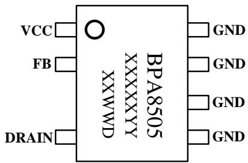

SOP7

<table><tr><td>项目描述</td><td>符号</td><td>最小</td><td>典型</td><td>最大</td><td>单位</td><td>备注</td></tr><tr><td colspan="7">输入</td></tr><tr><td>电压</td><td> $V_{IN}$ </td><td>85</td><td>115/230</td><td>264</td><td> $V_{AC}$ </td><td></td></tr><tr><td>频率</td><td> $f_{LINE}$ </td><td>47</td><td>50/60</td><td>63</td><td>Hz</td><td></td></tr><tr><td colspan="7">输出</td></tr><tr><td>输出电压</td><td> $V_{OUT}$ </td><td>4.75</td><td>5</td><td>5.25</td><td>V</td><td>±5%</td></tr><tr><td>输出电流</td><td> $I_{OUT}$ </td><td>0</td><td></td><td>80</td><td>mA</td><td></td></tr><tr><td>输出电压纹波</td><td> $V_{RIPPLE}$ </td><td></td><td></td><td>50</td><td>mV</td><td>20MHz带宽</td></tr><tr><td>连续输出功率</td><td> $P_{OUT}$ </td><td></td><td>0.5</td><td></td><td>W</td><td></td></tr><tr><td colspan="7">效率</td></tr><tr><td>待机功耗</td><td> $P_{STDBY}$ </td><td></td><td></td><td>260</td><td>mW</td><td>230VAC,包含假负载</td></tr><tr><td>满载效率</td><td>η</td><td>45</td><td></td><td></td><td>%</td><td></td></tr><tr><td colspan="7">环境</td></tr><tr><td>传导EMI</td><td></td><td colspan="4">满足CISPR22/EN55022 Class B, &gt;6dB 裕量</td><td></td></tr><tr><td>工作环境温度</td><td> $T_{AMP}$ </td><td>0</td><td></td><td>50</td><td>°C</td><td></td></tr></table>

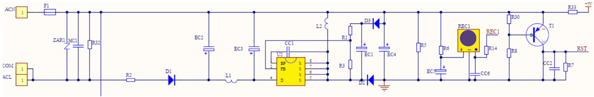

## 输出电压调整率

<table><tr><td> $V_{IN}(VAC)$ Load(%)</td><td>85</td><td>115</td><td>132</td><td>176</td><td>230</td><td>265</td><td>平均值</td><td>线调整率</td></tr><tr><td>0</td><td>5.088</td><td>5.088</td><td>5.088</td><td>5.088</td><td>5.088</td><td>5.088</td><td>5.089</td><td>0.00%</td></tr><tr><td>20%</td><td>4.880</td><td>4.877</td><td>4.878</td><td>4.872</td><td>4.870</td><td>4.867</td><td>4.874</td><td>0.27%</td></tr><tr><td>40%</td><td>4.818</td><td>4.812</td><td>4.815</td><td>4.808</td><td>4.805</td><td>4.802</td><td>4.810</td><td>0.33%</td></tr><tr><td>60%</td><td>4.779</td><td>4.772</td><td>4.775</td><td>4.769</td><td>4.768</td><td>4.764</td><td>4.771</td><td>0.31%</td></tr><tr><td>80%</td><td>4.750</td><td>4.747</td><td>4.749</td><td>4.743</td><td>4.742</td><td>4.736</td><td>4.743</td><td>0.27%</td></tr><tr><td>100%</td><td>4.719</td><td>4.719</td><td>4.719</td><td>4.714</td><td>4.713</td><td>4.708</td><td>4.715</td><td>0.23%</td></tr><tr><td>平均值</td><td>4.839</td><td>4.836</td><td>4.837</td><td>4.832</td><td>4.831</td><td>4.828</td><td rowspan="2" colspan="2"></td></tr><tr><td>负载调整率</td><td>7.63%</td><td>7.63%</td><td>7.63%</td><td>7.74%</td><td>7.76%</td><td>7.87%</td></tr></table>

◼ 计算方法：调整率=100%\*(最大值-最小值)/平均值  
测试条件：带1kΩ假负载（\~25mW）  
反馈以及续流二极管都为US1M

## 输出电压调整率

<table><tr><td> $V_{IN}(VAC)$ Load(%)</td><td>85</td><td>115</td><td>132</td><td>176</td><td>230</td><td>265</td><td>平均值</td><td>线调整率</td></tr><tr><td>0</td><td>5.175</td><td>5.175</td><td>5.175</td><td>5.175</td><td>5.175</td><td>5.175</td><td>5.175</td><td>0.00%</td></tr><tr><td>20%</td><td>5.023</td><td>5.021</td><td>5.021</td><td>5.017</td><td>5.012</td><td>5.009</td><td>5.017</td><td>0.28%</td></tr><tr><td>40%</td><td>4.981</td><td>4.977</td><td>4.978</td><td>4.974</td><td>4.969</td><td>4.965</td><td>4.974</td><td>0.32%</td></tr><tr><td>60%</td><td>4.954</td><td>4.953</td><td>4.952</td><td>4.949</td><td>4.945</td><td>4.941</td><td>4.949</td><td>0.26%</td></tr><tr><td>80%</td><td>4.926</td><td>4.936</td><td>4.938</td><td>4.932</td><td>4.929</td><td>4.924</td><td>4.932</td><td>0.28%</td></tr><tr><td>100%</td><td>4.904</td><td>4.920</td><td>4.920</td><td>4.915</td><td>4.913</td><td>4.912</td><td>4.914</td><td>0.33%</td></tr><tr><td>平均值</td><td>4.994</td><td>4.997</td><td>4.997</td><td>4.994</td><td>4.991</td><td>4.988</td><td rowspan="2" colspan="2"></td></tr><tr><td>负载调整率</td><td>5.43%</td><td>5.10%</td><td>5.10%</td><td>5.21%</td><td>5.25%</td><td>5.27%</td></tr></table>

◼ 计算方法：调整率=100%\*(最大值-最小值)/平均值  
测试条件：带1kΩ假负载（\~25mW）  
反馈以及续流二极管都为ES1J

## 输出电压纹波

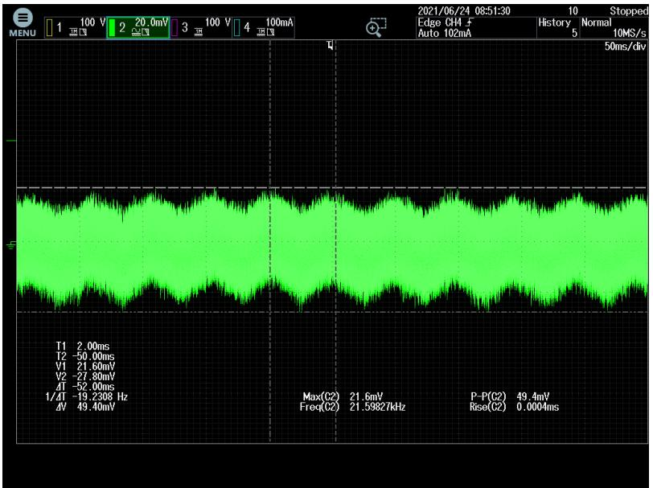

85 VAC

CH2 VOUT Ripple $V _ { P K - P K } = 4 9 . 4 m v$

## Test Condition:

➢ Full Load  
续流，反馈二极管 为ES1J，且输出电 容为LOWESR电容

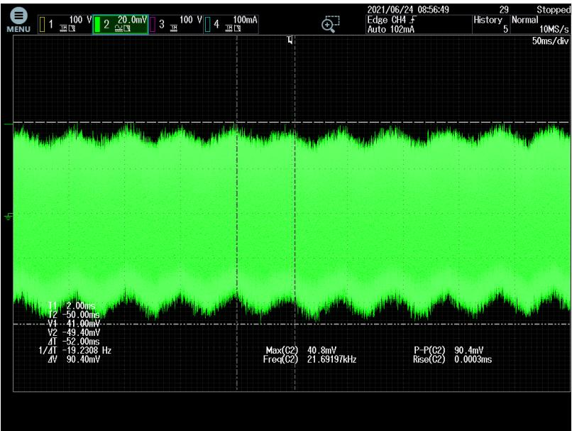

## 85 VAC

CH2 $\mathsf { V } _ { \mathsf { O U T } }$ Ripple $V _ { P K - P K } = 9 0 . 4 m v$

## Test Condition:

➢ Full Load  
续流，反馈二极管 为ES1J，输出电容 为客供电容

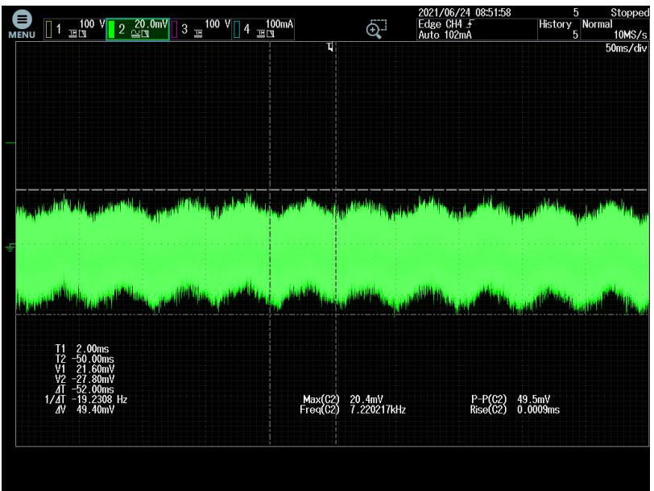

265 VAC

CH2 VOUT Ripple VPK-PK=49.5mV

## Test Condition:

➢ Full Load  
续流，反馈二极管 为ES1J，且输出电 容为LOWESR电容

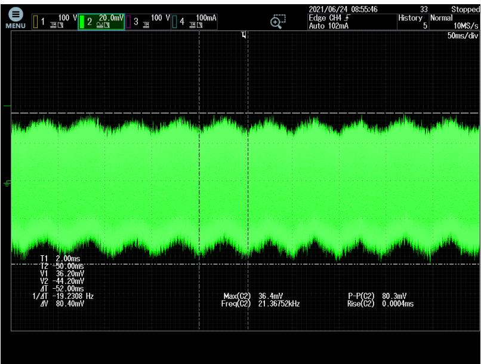

## 265 VAC

CH2 $\mathsf { V } _ { \mathsf { O U T } }$ Ripple $V _ { \mathsf { P K - P K } } { = } 8 0 . 3 \mathsf { m V }$

## Test Condition:

➢ Full Load  
续流，反馈二极管 为ES1J，输出电容 为客供电容

## 输出电压纹波

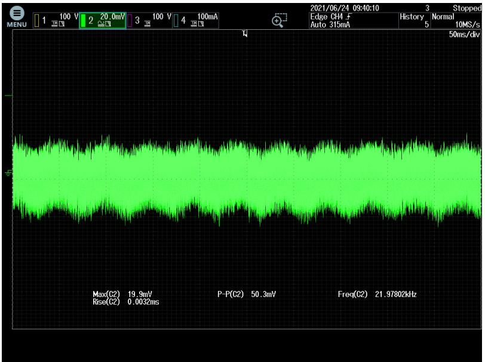

85 VAC

CH2 VOUT Ripple $V _ { P K - P K } = 5 0 . 3 m V$

## Test Condition:

➢ Full Load  
续流，反馈二极管 为US1M，且输出 电容为LOWESR电 容

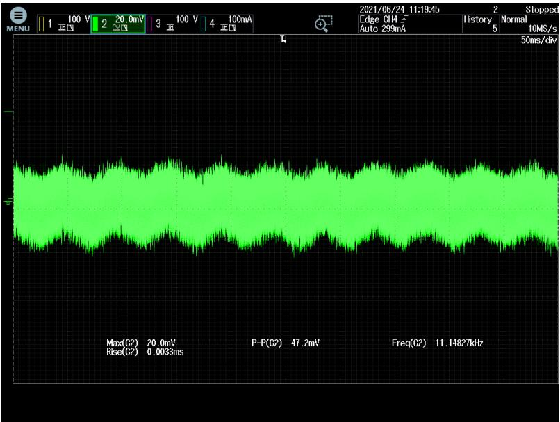

## 85 VAC

CH2 $\mathsf { V } _ { \mathsf { O U T } }$ Ripple $V _ { P K - P K } = 4 7 . 2 m v$

## Test Condition:

➢ Full Load  
续流二极管为ES1J, 反馈二极管为 US1M

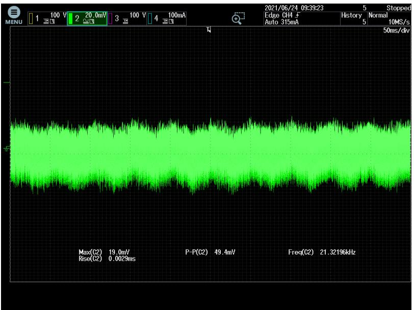

265 VAC

CH2 VOUT Ripple VPK-PK=49.4mV

## Test Condition:

➢ Full Load  
续流，反馈二极管 为US1M，且输出 电容为LOWESR电 容

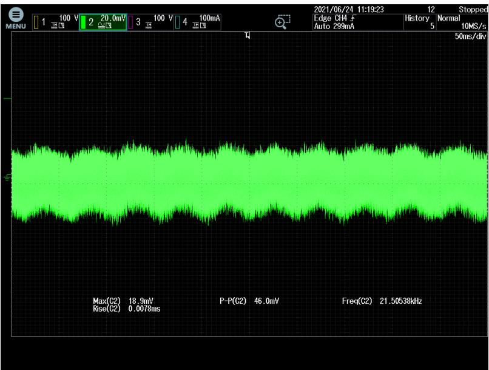

## 265 VAC

CH2 VOUT Ripple VPK-PK=46mV

## Test Condition:

➢ Full Load  
续流二极管为ES1J, 反馈二极管为 US1M

## 动态负载(50%-100%)

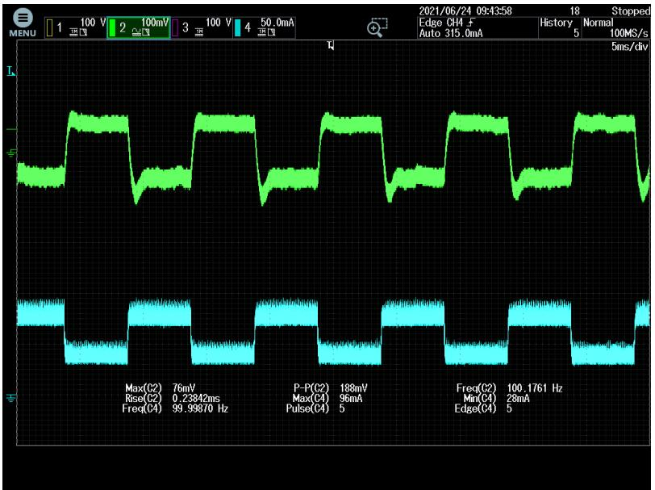

85 VAC

CH2 VOUT ${ \mathsf { C H } } 2 { \mathsf { V } } _ { \mathsf { O U T } }$ $v _ { p _ { \mathrm { K - P K } } } { = } 1 8 8 ~ \mathsf { m V }$  
CH4 IOUT $\mathsf { C H 4 } \mathsf { I } _ { \mathsf { O U T } }$

## Test Condition:

➢ 0.04 A-0.08 A-0.04 A  
➢ Slew Rate: 0.5 A/μS  
➢ Frequency: 100 Hz  
续流，反馈二极管 为US1M

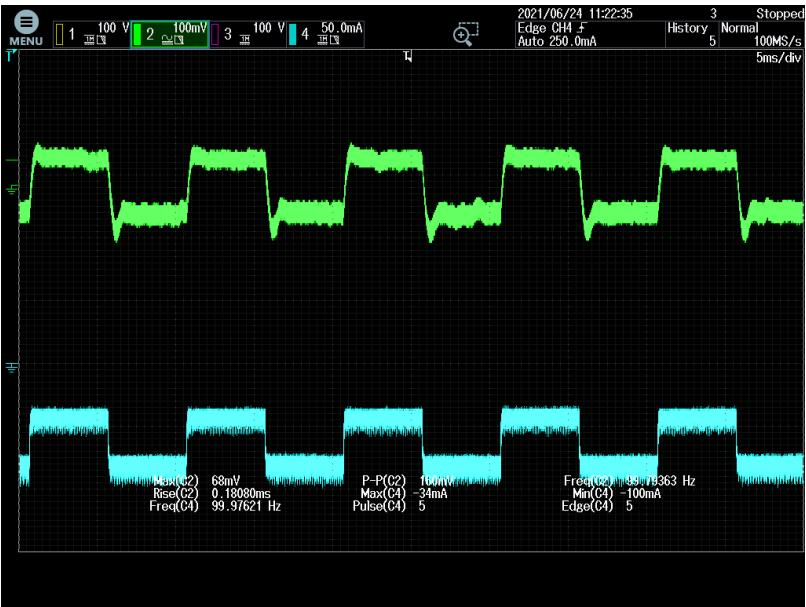

## 85 VAC

CH2 VOUT ${ \mathsf { C H } } 2 { \mathsf { V } } _ { \mathsf { O U T } }$ $v _ { p _ { \mathrm { K - P K } } } { = } 1 0 0 ~ \mathsf { m V }$  
CH4 IOUT $\mathsf { C H 4 } \mathsf { I } _ { \mathsf { O U T } }$

## Test Condition:

➢ 0.04 A-0.08 A-0.04 A  
➢ Slew Rate: 0.5 A/μS  
➢ Frequency: 100 Hz  
续流二极管为ES1J, 反馈二极管为US1M

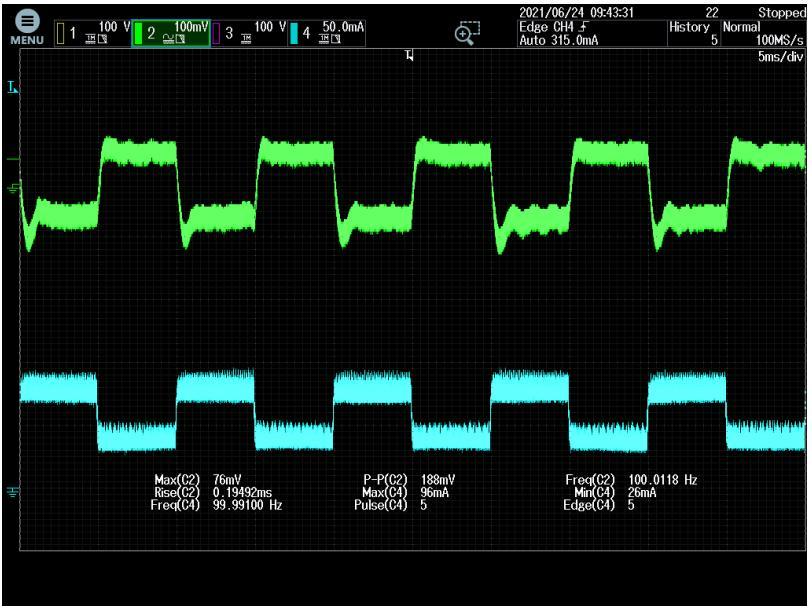

265 VAC

CH2 VOUT $\mathsf { V } _ { \mathsf { O U T } }$ VPK-PK=188 mV $v _ { p _ { \mathrm { K - P K } } } { = } 1 8 8 ~ \mathsf { m V }$  
CH4 ${ \mathsf I } _ { 0 \mathsf U \top }$

## Test Condition:

➢ 0.04 A-0.08 A-0.04 A  
➢ Slew Rate: 0.5 A/μS  
➢ Frequency: 100 Hz  
续流，反馈二极管 为US1M

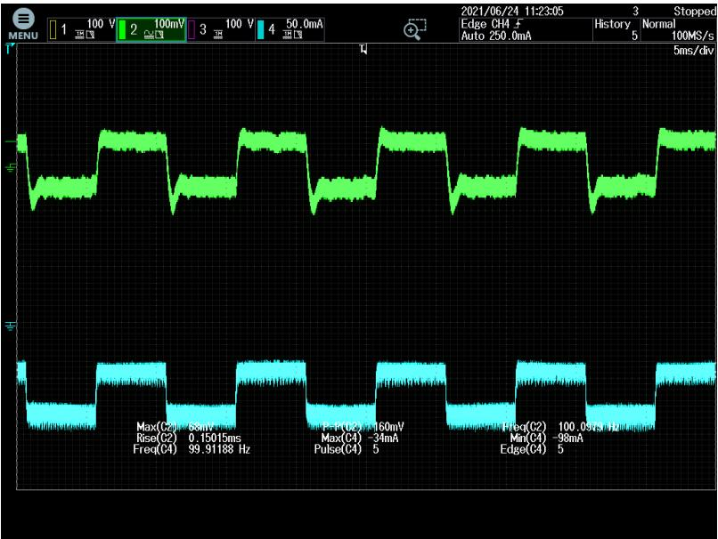

265 VAC

CH2 VOUT ${ \mathsf { C H } } 2 { \mathsf { V } } _ { \mathsf { O U T } }$ $v _ { p | c - P K } { = } 1 6 0 ~ \mathsf { m V }$  
CH4 IOUT $\mathsf { C H 4 } \mathsf { I } _ { \mathsf { O U T } }$

## Test Condition:

➢ 0.04 A-0.08 A-0.04 A  
➢ Slew Rate: 0.5 A/μS  
➢ Frequency: 100 Hz  
续流二极管为ES1J, 反馈二极管为US1M

## 动态负载(50%-100%)

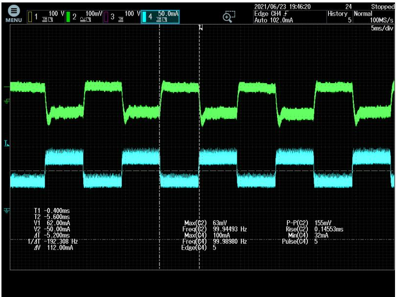

85 VAC

CH2 VOUT $\mathsf { V } _ { \mathsf { O U T } }$ VPK-PK=155 mV $v _ { p _ { k - P K } } { = } 1 5 5 m v$ CH4 IOUT $\mathsf { I } _ { 0 \mathsf { U T } }$

## Test Condition:

➢ 0.04 A-0.08 A-0.04 A  
➢ Slew Rate: 0.5 A/μS  
➢ Frequency: 100 Hz  
续流，反馈二极管 为ES1J，且输出电容 为LOWESR电容

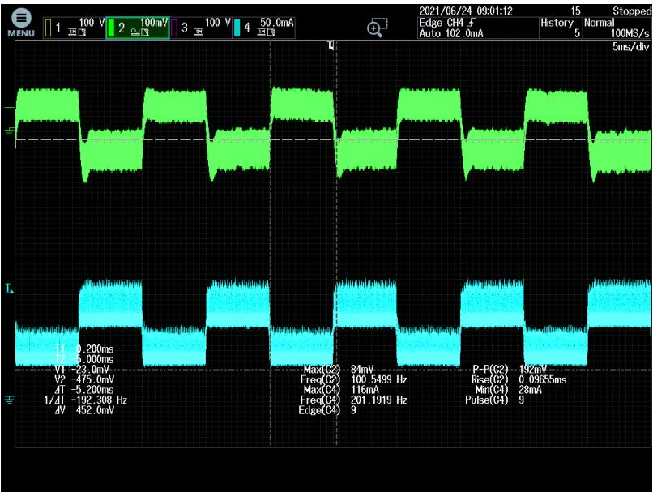

## 85 VAC

CH2 VOUT $v _ { p | c \cdot P K } = 1 9 2 m v$  
$\mathsf { C H 4 } \mathsf { I } _ { \mathsf { O U T } }$

## Test Condition:

➢ 0.04 A-0.08 A-0.04 A  
➢ Slew Rate: 0.5 A/μS  
➢ Frequency: 100 Hz  
续流，反馈二极管 为ES1J，且输出电容 为客供电容

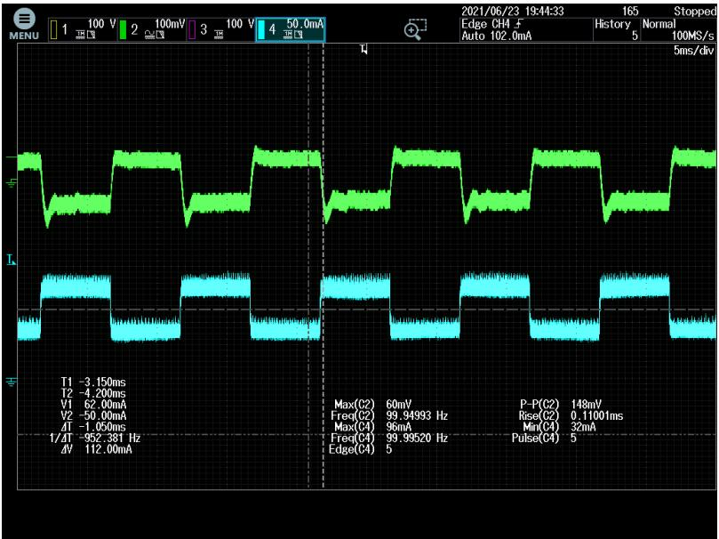

265 VAC

CH2 VOUT $\mathsf { V } _ { \mathsf { O U T } }$ VPK-PK=148 mV $v _ { p \kappa - P K } = 1 4 8 m v$  
CH4 ${ \mathsf I } _ { 0 \mathsf U \top }$

## Test Condition:

➢ 0.04 A-0.08 A-0.04 A  
➢ Slew Rate: 0.5 A/μS  
➢ Frequency: 100 Hz  
续流，反馈二极管 为ES1J，且输出电容 为LOWESR电容

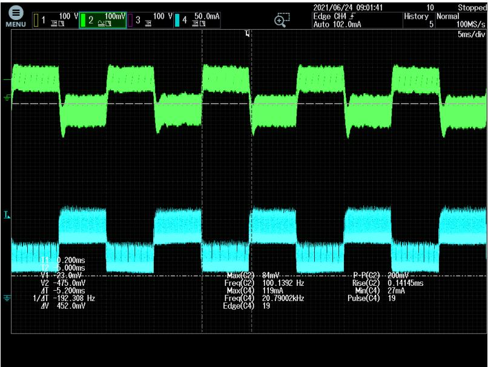

265 VAC

CH2 V $v _ { p _ { k - P K } } = 2 0 0 m v$  
$\mathsf { C H 4 } \mathsf { I } _ { \mathsf { O U T } }$

## Test Condition:

➢ 0.04 A-0.08 A-0.04 A  
➢ Slew Rate: 0.5 A/μS  
➢ Frequency: 100 Hz  
续流，反馈二极管 为ES1J，且输出电容 为客供电容

## 动态负载(10%-90%)

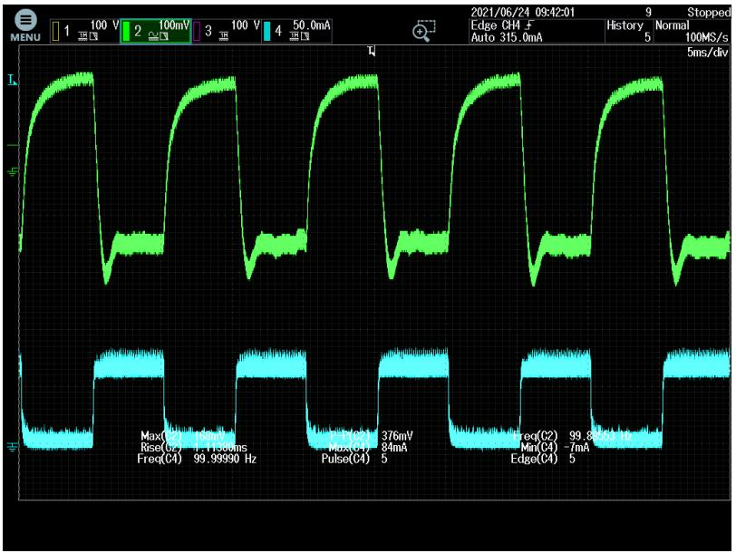

85 VAC

CH2 VOUT $\mathsf { V } _ { \mathsf { O U T } }$ $v _ { p \vert k - P K } = 3 7 6 m v$  
CH4 $\mathsf { I } _ { 0 \mathsf { U T } }$

## Test Condition:

➢ 0.008A-0.072 A-0.008A  
➢ Slew Rate: 0.5 A/μS  
➢ Frequency: 100 Hz  
续流，反馈二极管 为US1M

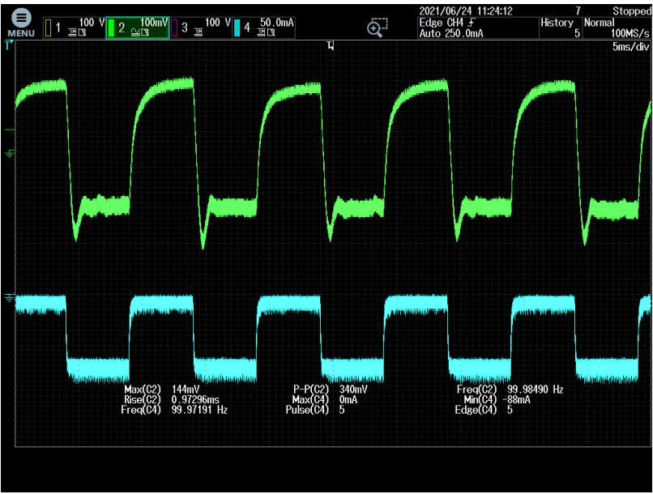

## 85 VAC

CH2 VOUT ${ \mathsf { C H } } 2 { \mathsf { V } } _ { \mathsf { O U T } }$ $V _ { P K - P K } = 3 4 0 m v$  
$\mathsf { C H 4 } \mathsf { I } _ { \mathsf { O U T } }$

## Test Condition:

➢ 0.008A-0.072 A-0.008A  
➢ Slew Rate: 0.5 A/μS  
➢ Frequency: 100 Hz  
续流二极管为ES1J, 反馈二极管为US1M

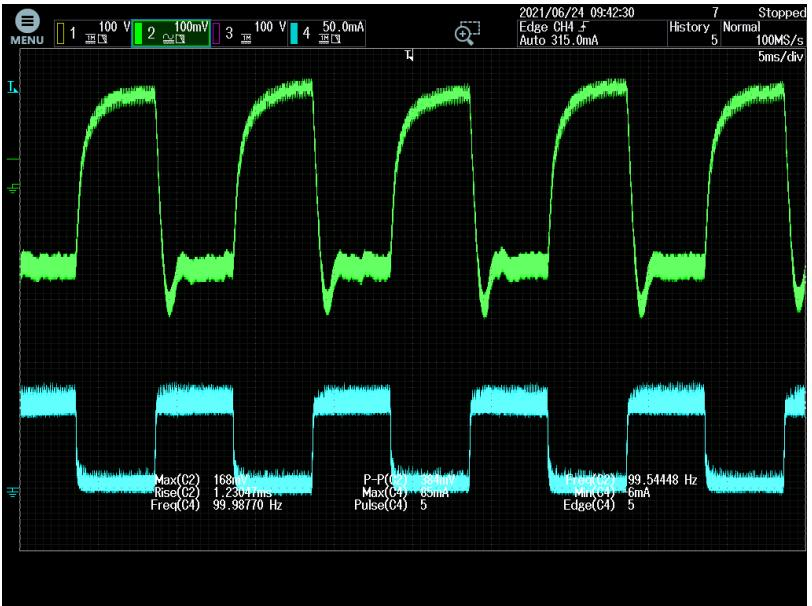

265 VAC

CH2 VOUT $\mathsf { V } _ { \mathsf { O U T } }$ VPK-PK=384mV $V _ { P K - P K } = 3 8 4 m v$  
CH4 ${ \mathsf I } _ { 0 \mathsf U \top }$

## Test Condition:

➢ 0.008A-0.072 A-0.008A  
➢ Slew Rate: 0.5 A/μS  
➢ Frequency: 100 Hz  
续流，反馈二极管 为US1M

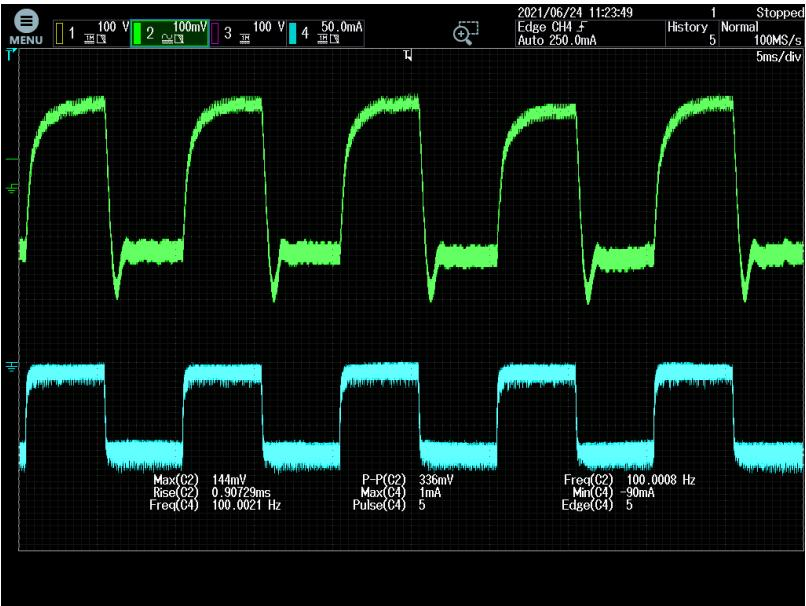

## 265 VAC

CH2 V ${ \mathsf { C H } } 2 { \mathsf { V } } _ { \mathsf { O U T } }$ VPK-PK=336mV $v _ { P K - P K } = 3 3 6 m v$  
$\mathsf { C H 4 } \mathsf { I } _ { \mathsf { O U T } }$

## Test Condition:

➢ 0.008A-0.072 A-0.008A  
➢ Slew Rate: 0.5 A/μS  
➢ Frequency: 100 Hz  
续流二极管为ES1J, 反馈二极管为US1M

## 动态负载(10%-90%)

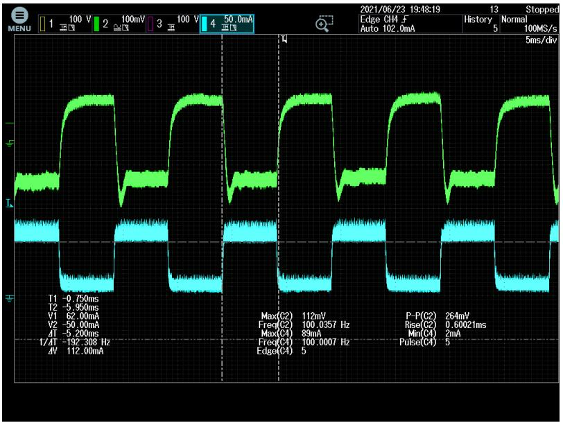

85 VAC

CH2 VOUT $\mathsf { V } _ { \mathsf { O U T } }$ $V _ { P K - P K } = 2 6 4 m v$ CH4 IOUT $\mathsf { I } _ { 0 \mathsf { U T } }$

## Test Condition:

➢ 0.008A-0.072 A-0.008A  
➢ Slew Rate: 0.5 A/μS  
➢ Frequency: 100 Hz  
续流，反馈二极管 为ES1J，且输出电容 为LOWESR电容

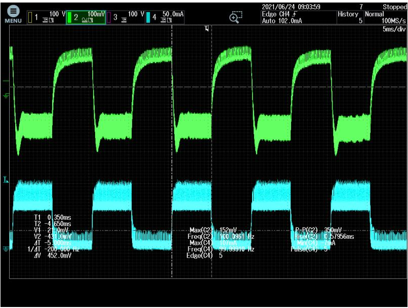

## 85 VAC

CH2 VOUT ${ \mathsf { C H } } 2 { \mathsf { V } } _ { \mathsf { O U T } }$ VPK-PK=350mV $V _ { P K - P K } = 3 5 0 m v$  
$\mathsf { C H 4 } \mathsf { I } _ { \mathsf { O U T } }$

## Test Condition:

➢ 0.008A-0.072 A-0.008A  
➢ Slew Rate: 0.5 A/μS  
➢ Frequency: 100 Hz  
续流，反馈二极管 为ES1J，且输出电容 为客供电容

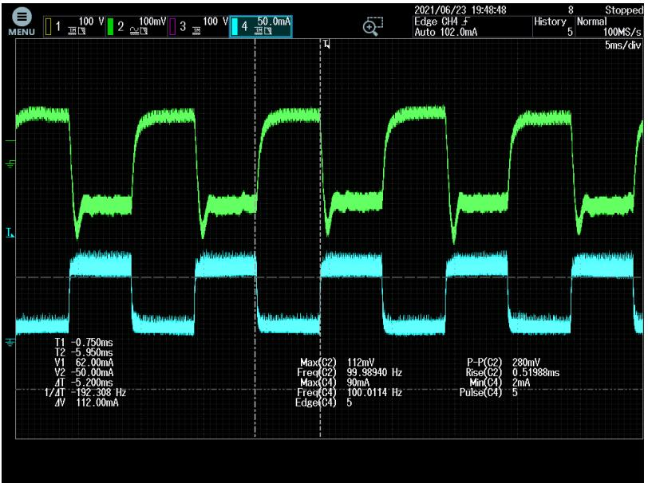

265 VAC

CH2 VOUT $\mathsf { V } _ { \mathsf { O U T } }$ VPK-PK=280mV $V _ { P K - P K } = 2 8 0 m v$  
CH4 ${ \mathsf I } _ { 0 \mathsf U \top }$

## Test Condition:

➢ 0.008A-0.072 A-0.008A  
➢ Slew Rate: 0.5 A/μS  
➢ Frequency: 100 Hz  
续流，反馈二极管 为ES1J，且输出电容 为LOWESR电容

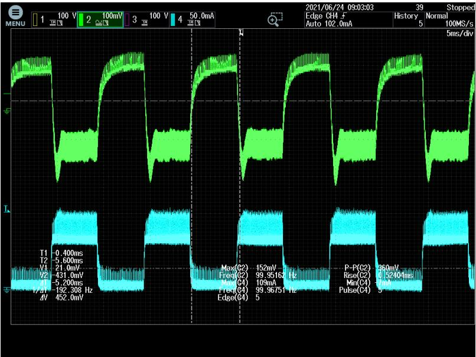

## 265 VAC

CH2 V ${ \mathsf { C H } } 2 { \mathsf { V } } _ { \mathsf { O U T } }$ $V _ { P K - P K } = 3 6 0 m v$  
$\mathsf { C H 4 } \mathsf { I } _ { \mathsf { O U T } }$

## Test Condition:

➢ 0.008A-0.072 A-0.008A  
➢ Slew Rate: 0.5 A/μS  
➢ Frequency: 100 Hz  
续流，反馈二极管 为ES1J，且输出电容 为客供电容

## 动态负载(10%-90%)

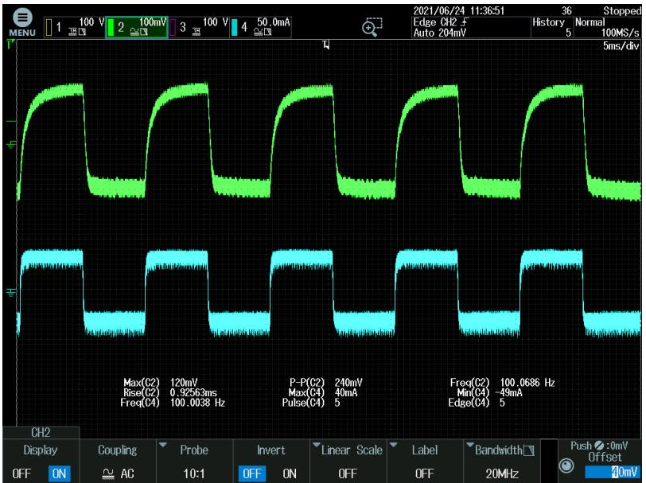

85 VAC

CH2 VOUT $\mathsf { V } _ { \mathsf { O U T } }$ $V _ { P K - P K } = 2 4 0 m v$ CH4 IOUT $\mathsf { I } _ { 0 \mathsf { U T } }$

## Test Condition:

➢ 0.008A-0.072 A-0.008A  
➢ Slew Rate: 0.5 A/μS  
➢ Frequency: 100 Hz  
续流二极管为ES1J, 反馈二极管为US1M  
1uF动态电容

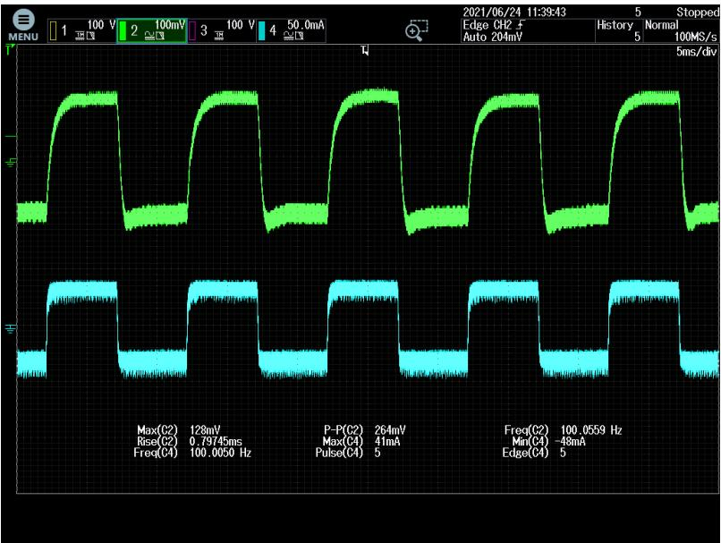

## 85 VAC

CH2 VOUT $V _ { P K - P K } = 2 6 4 m v$  
CH4 ${ \mathsf I } _ { 0 \mathsf U \top }$

## Test Condition:

➢ 0.008A-0.072 A-0.008A  
➢ Slew Rate: 0.5 A/μS  
➢ Frequency: 100 Hz  
续流二极管为ES1J, 反馈二极管为US1M  
0.1uF动态电容

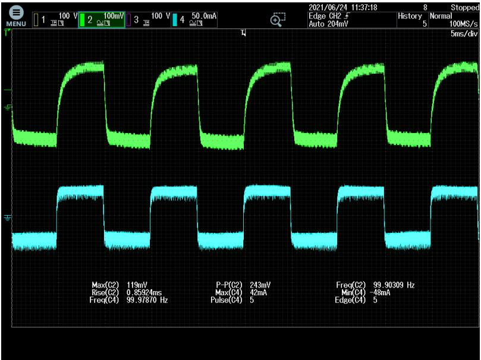

265 VAC

CH2 VOUT $V _ { P K - P K } = 2 4 3 m v$  
CH4 ${ \mathsf I } _ { 0 \mathsf U \top }$

## Test Condition:

➢ 0.008A-0.072 A-0.008A  
➢ Slew Rate: 0.5 A/μS  
➢ Frequency: 100 Hz  
续流二极管为ES1J, 反馈二极管为US1M  
1uF动态电容

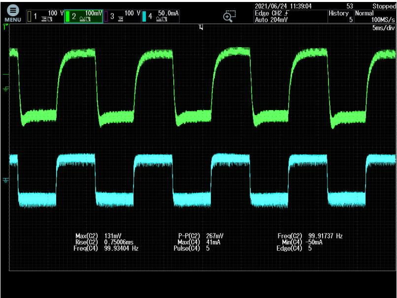

## 265 VAC

CH2 VOUT VPK-PK=267mV $v _ { p _ { k - P K } } = 2 6 7 m v$  
$\mathsf { C H 4 } \mathsf { I } _ { \mathsf { O U T } }$

## Test Condition:

➢ 0.008A-0.072 A-0.008A  
➢ Slew Rate: 0.5 A/μS  
➢ Frequency: 100 Hz  
续流二极管为ES1J, 反馈二极管为US1M  
0.1uF动态电容

## 漏源极电压/电流波形(续流二极管US1M)

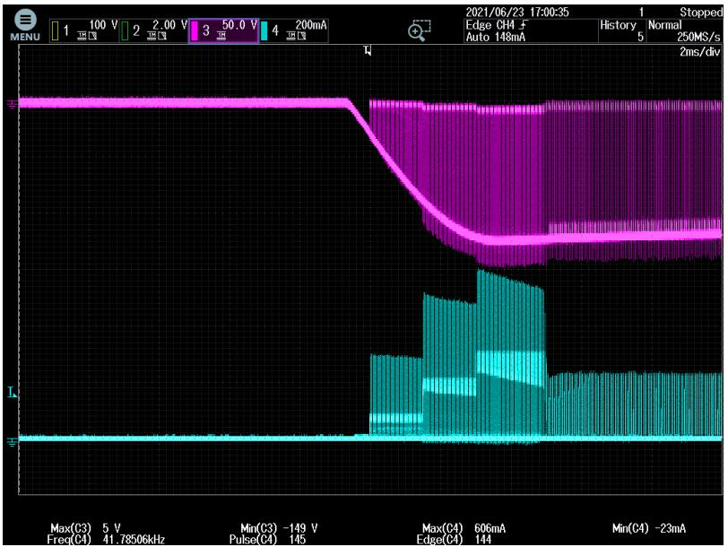

85 VAC  
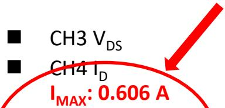

## Test Condition:

Full Load 启机  
续流，反馈二极管 为US1M，且输出 电容为LOWESR电 容

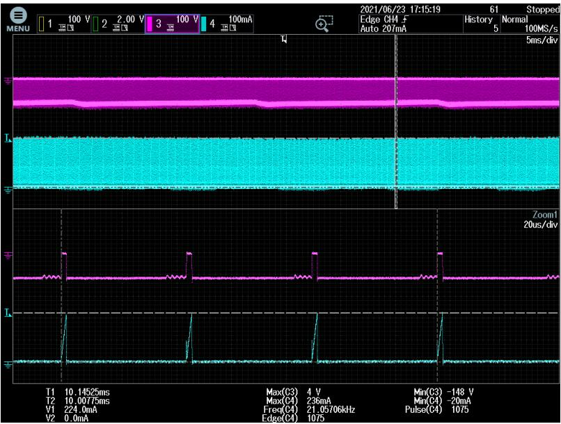

## 85 VAC

CH3 $\mathsf { V } _ { \mathsf { D } \mathsf { S } }$  
CH4 ID IMAX: 0.236 A

## Test Condition:

➢ Full Load  
续流，反馈二极管 为US1M，且输出 电容为LOWESR电 容

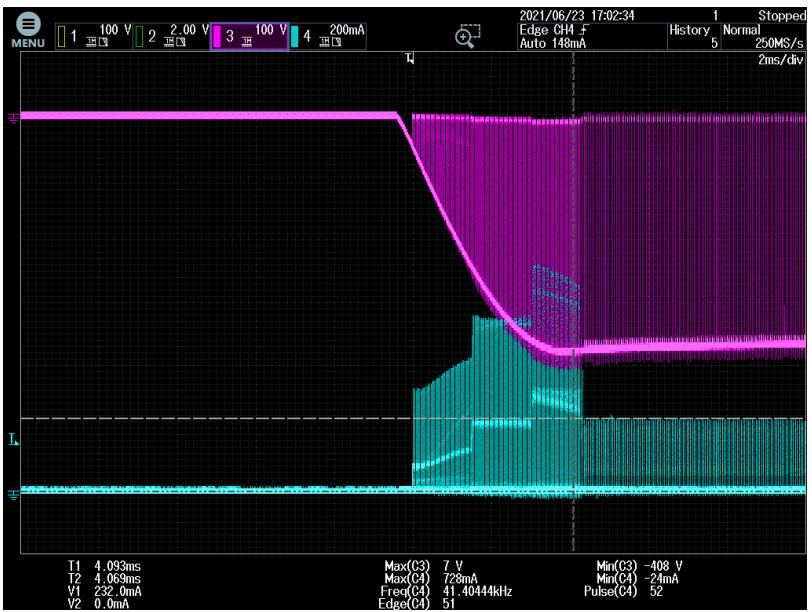

265 VAC  
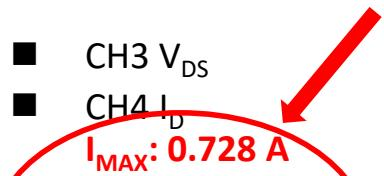

## Test Condition:

Full Load 启机  
馈 二极管 为US1M，且输出 电容为LOWESR电 容

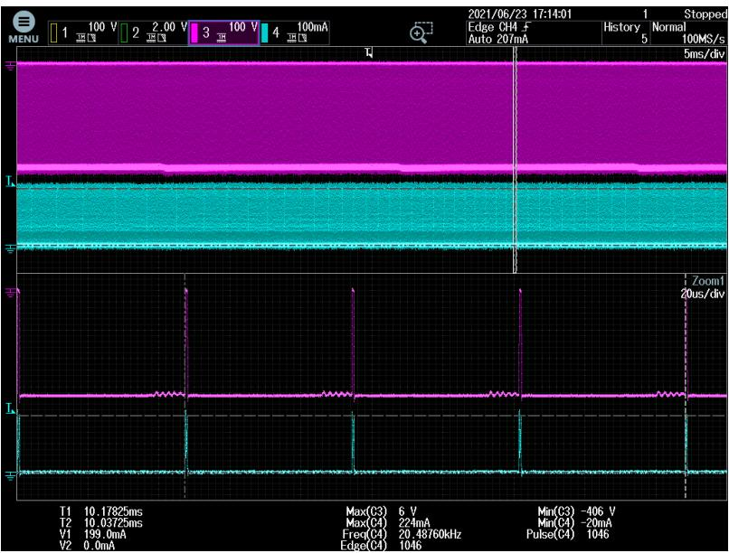

## 265 VAC

${ \mathsf { C H } } 2 \ { \mathsf { V } } _ { \mathsf { D S } }$  
CH4 ID IMAX: 0.224 A

## Test Condition:

➢ Full Load  
续流，反馈二极管 为US1M，且输出电 容为LOWESR电容

## 漏源极电压/电流波形(续流二极管ES1J)

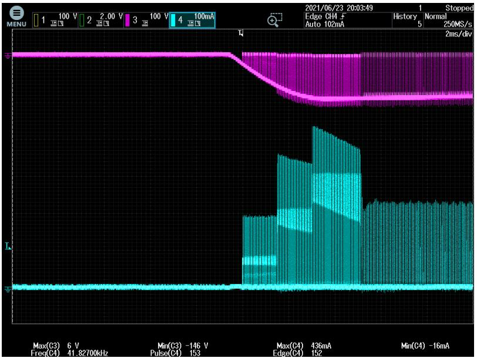

85 VAC  
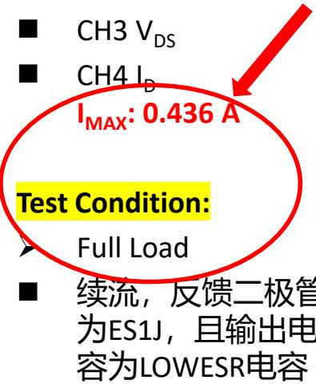

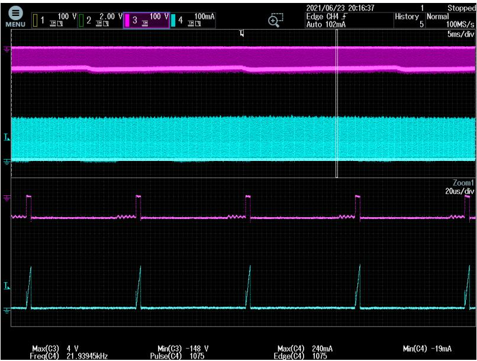

## 85 VAC

CH3 VDS  
CH4 ID IMAX: 0.240 A

## Test Condition:

➢ Full Load  
续流，反馈二极管 为ES1J，且输出电 容为LOWESR电容

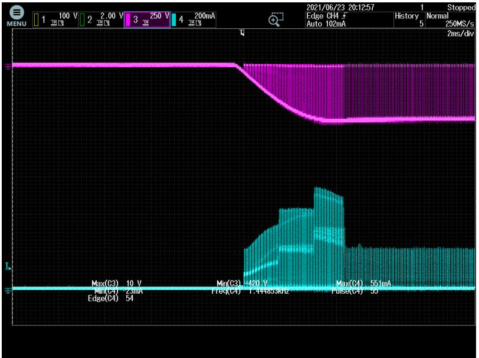

265 VAC  
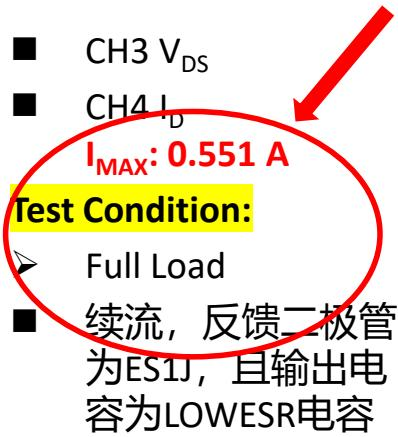

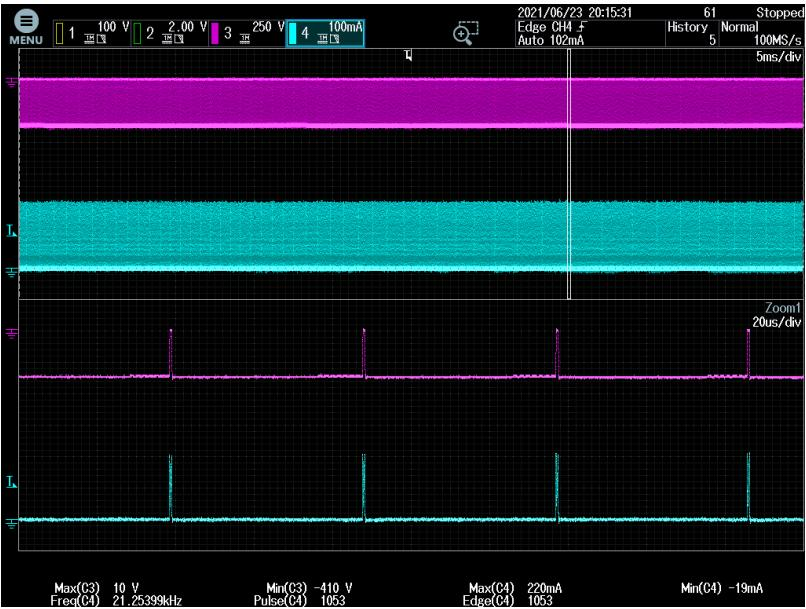

## 265 VAC

CH2 VDS  
CH4 ID I : 0.220 A

## Test Condition:

➢ Full Load  
续流，反馈二极管 为ES1J，且输出电 容为LOWESR电容

## 短路保护 （MOSFET波形）

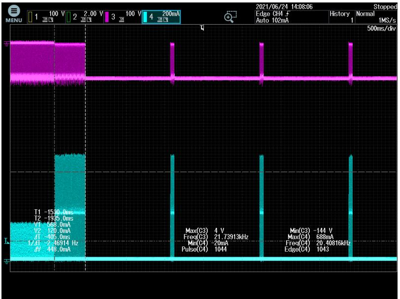

85 VAC

CH3 VDS  
CH4 ID  
◼ VDSMAX: 144 V IMAX: 0.791 A  
续流二极管为 US1M,反馈二极管 为US1M

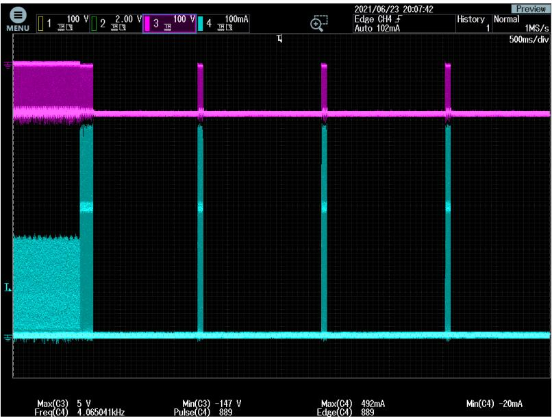

85 VAC

CH3 VDS  
CH4 ID  
◼ VDSMAX: 147 V IMAX: 0.492 A  
续流,反馈二极管为 ES1J

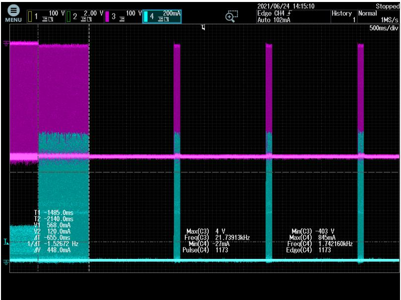

265 VAC

CH3 VDS  
CH4 ID  
◼ VDSMAX: 403 V IMAX: 0.845 A  
续流二极管为 US1M,反馈二极管 为US1M

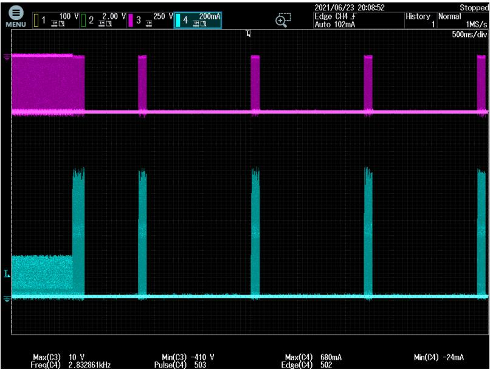

265 VAC

CH3 VDS  
CH4 ID  
◼ VDSMAX: 410 V IMAX: 0.68 A  
续流,反馈二极管为 ES1J

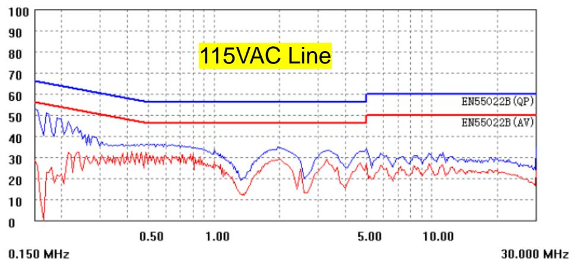

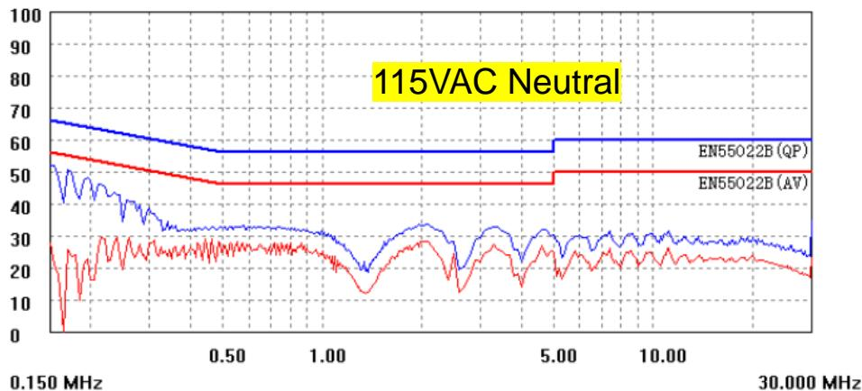

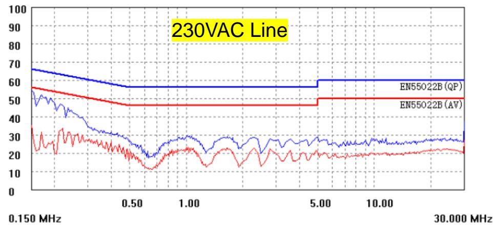

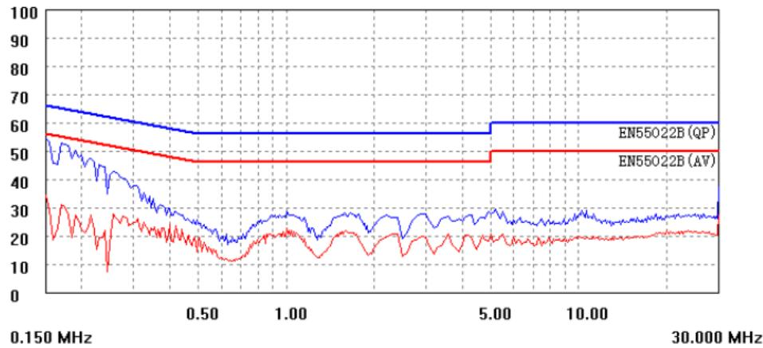

EMI TEST REPORT

<table><tr><td colspan="2">Organization:</td><td colspan="2">Operator:</td><td colspan="2">EUT:</td></tr><tr><td colspan="2">Place:</td><td>Time:</td><td>2021/6/24/15:19</td><td colspan="2">Test equipment:KH3932</td></tr><tr><td>Detector:</td><td>PK+AV</td><td>Test-time(ms):</td><td>30</td><td>SN:</td><td>320870</td></tr><tr><td>Limit:</td><td>EN55014-1</td><td>Transductor(PK/AV):</td><td>XSQ / XSQ</td><td>JZ:</td><td>2,15,1135</td></tr><tr><td colspan="2">Remark:</td><td></td><td></td><td></td><td></td></tr><tr><td colspan="2">Start(MHz)</td><td colspan="2">End(MHz)</td><td colspan="2">Step(MHz)</td></tr><tr><td colspan="2">30.000</td><td colspan="2">100.000</td><td colspan="2">0.500</td></tr><tr><td colspan="2">100.000</td><td colspan="2">230.000</td><td colspan="2">0.500</td></tr><tr><td colspan="2">230.000</td><td colspan="2">300.000</td><td colspan="2">0.500</td></tr><tr><td colspan="2">dBuV</td><td></td><td></td><td></td><td>scan result</td></tr></table>

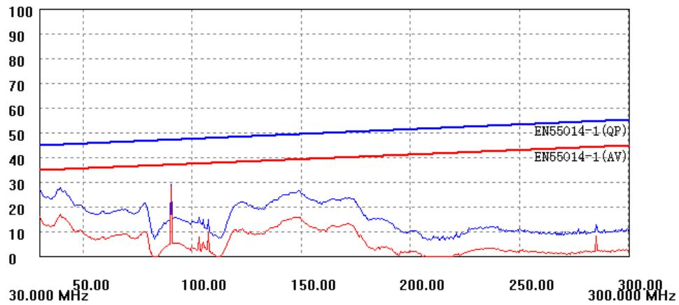

1150VAC 满载

EMI TEST REPORT

<table><tr><td colspan="2">Organization:</td><td colspan="2">Operator:</td><td colspan="2">EUT:</td></tr><tr><td colspan="2">Place:</td><td>Time:</td><td>2021/6/24/15:21</td><td colspan="2">Test equipment:KH3932</td></tr><tr><td>Detector:</td><td>PK+AV</td><td>Test-time(ms):</td><td>30</td><td>SN:</td><td>320870</td></tr><tr><td>Limit:</td><td>EN55014-1</td><td>Transductor(PK/AV):</td><td>XSQ / XSQ</td><td>JZ:</td><td>2,15,1135</td></tr><tr><td colspan="2">Remark:</td><td></td><td></td><td></td><td></td></tr><tr><td colspan="2">Start(MHz)</td><td colspan="2">End(MHz)</td><td colspan="2">Step(MHz)</td></tr><tr><td colspan="2">30.000</td><td colspan="2">100.000</td><td colspan="2">0.500</td></tr><tr><td colspan="2">100.000</td><td colspan="2">230.000</td><td colspan="2">0.500</td></tr><tr><td colspan="2">230.000</td><td colspan="2">300.000</td><td colspan="2">0.500</td></tr><tr><td colspan="2">dBuV</td><td></td><td></td><td></td><td>scan result</td></tr></table>

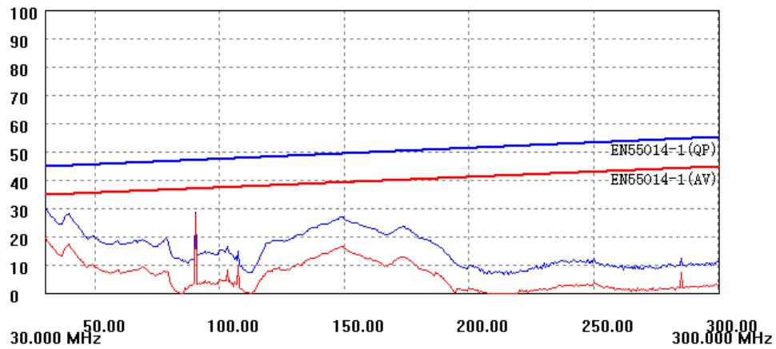

230VAC 满载

## 温度测试（5V/0.1A）

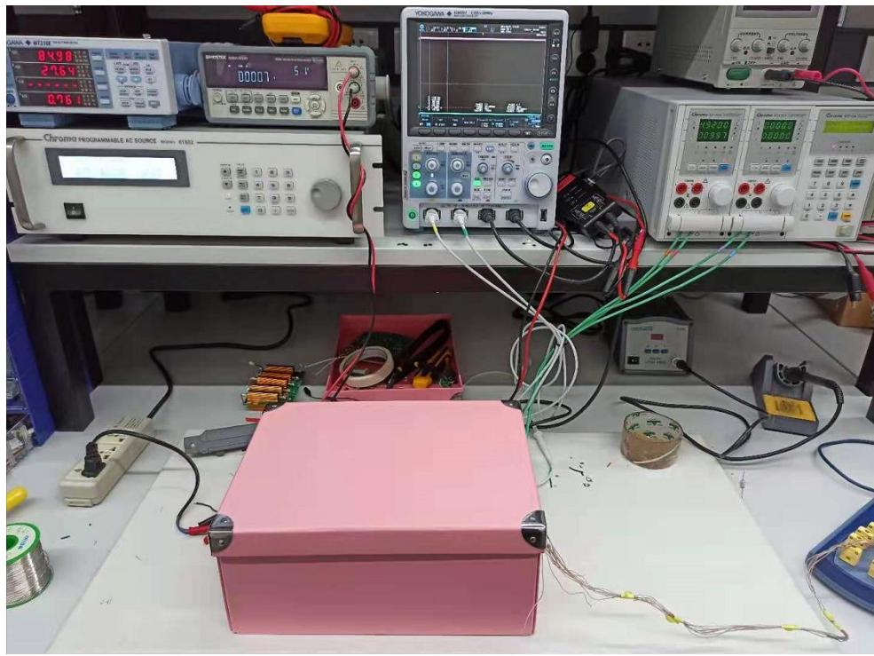

## 测试说明

➢常温下密闭纸箱中进行测试；  
➢电路板放在一个封闭的盒子内；  
➢热电偶连接到各个测量点；  
➢等测量点温度达到稳定后记录数据；

<table><tr><td rowspan="2">项目</td><td colspan="2">85VAC</td><td colspan="2">264VAC</td></tr><tr><td>温度</td><td>温升</td><td>温度</td><td>温升</td></tr><tr><td>环境温度</td><td colspan="2">27.5</td><td colspan="2">29</td></tr><tr><td>BPA8504D</td><td>36</td><td>8.5</td><td>45.6</td><td>16.6</td></tr><tr><td>续流二极管</td><td>35.4</td><td>7.9</td><td>36.6</td><td>7.6</td></tr><tr><td>功率电感</td><td>35</td><td>7.5</td><td>40</td><td>11</td></tr></table>

## ❑ 负载调整率改善

D2和D3由US1M改为ES1J，改善负载调整率，同时可以降低启机时刻Ids电流值，增强产品可靠性；

## ❑ 稳态和动态负载时，输出电压纹波优化

使用ESR较低同容量电容或者适当加大输出电容容值可以降低稳态和动态纹波电压；  
在FB上偏电阻R1上并联0.1uF电容可改善动态纹波电压，也可以适当加大电容容值，以满足更低纹波要求；

## ❑ 承受浪涌2KV改善建议

➢ 改产品虽无浪涌要求，但是建议输入整流二极管D1改为2PCS US1M或者M7串联，提高浪涌承受能力，增强产品可靠性；

## THANK YOU FOR WATCHING
