## BPA8505D&KP3114SGA对比测试

## (5V/0.25A@85\~265Vac)

上海晶丰明源半导体股份有限公司

Shanghai Bright Power Semiconductor Co., Ltd.

YSM

时间：2021年6月

## 电气参数对比

<table><tr><td></td><td>BPA8505D</td><td>KP3114SGA</td></tr><tr><td>开关频率</td><td>45KHz</td><td>30KHz</td></tr><tr><td>Mosfet BV</td><td>650V</td><td>700V</td></tr><tr><td> $R_{DS\_ON}$ </td><td>8.5Ω</td><td>20Ω</td></tr><tr><td>限流点</td><td>440mA</td><td>420mA</td></tr><tr><td>软启动</td><td>有</td><td>有</td></tr><tr><td>输出过压保护</td><td>有</td><td>有</td></tr><tr><td>过载保护</td><td>有</td><td>有</td></tr><tr><td>封装</td><td>DIP-7, SOP-7</td><td>SOP-8</td></tr></table>

## 测试数据对比

电源规格：85\~265Vac输入，5V/0.25A输出

<table><tr><td colspan="2"></td><td>BPA8505D</td><td>KP3114SGA</td><td></td></tr><tr><td colspan="2">待机功耗</td><td>107mW</td><td>60mW</td><td>230Vac输入</td></tr><tr><td colspan="2">负载调整率</td><td>4.86%~5.04%</td><td>0.2%~0.75%</td><td></td></tr><tr><td rowspan="2">满载效率</td><td>115Vac</td><td>68.2%</td><td>66.1%</td><td></td></tr><tr><td>230Vac</td><td>64.1%</td><td>62.4%</td><td></td></tr><tr><td rowspan="2">输出电压纹波</td><td>85Vac</td><td>26.2mV</td><td>35.9mV</td><td></td></tr><tr><td>265Vac</td><td>41mV</td><td>60.8mV</td><td></td></tr><tr><td rowspan="2">动态负载性能</td><td>50%-100%</td><td>150mVPK_PK</td><td>261mVPK_PK</td><td rowspan="2">265Vac输入</td></tr><tr><td>10%-90%</td><td>264mVPK_PK</td><td>332mVPK_PK</td></tr><tr><td rowspan="2">MOSFET应力</td><td> $V_{DS}$ </td><td>390V</td><td>390V</td><td rowspan="2">265Vac输入</td></tr><tr><td> $I_{DS}$ </td><td>0.871A</td><td>0.519A</td></tr><tr><td rowspan="2">续流二极管应力</td><td>VRR</td><td>390V</td><td>380V</td><td></td></tr><tr><td> $I_{PK}$ </td><td>0.56A</td><td>0.456A</td><td></td></tr><tr><td colspan="2">温升测试(环温50°C)</td><td>84.3°C</td><td>89.1°C</td><td>265Vac输入</td></tr><tr><td colspan="2">传导EMI</td><td>6dB裕量</td><td>6dB裕量</td><td></td></tr><tr><td colspan="2">Surge</td><td>Pass</td><td>Pass</td><td>差模2kV(增加1 Pcs 561压敏)</td></tr><tr><td colspan="2">EFT群脉冲</td><td>Pass</td><td>Pass</td><td>4kV,5kHz/38kHz/100kHz</td></tr><tr><td colspan="2">ESD</td><td>Pass</td><td>Pass</td><td>15kV空气放电</td></tr></table>

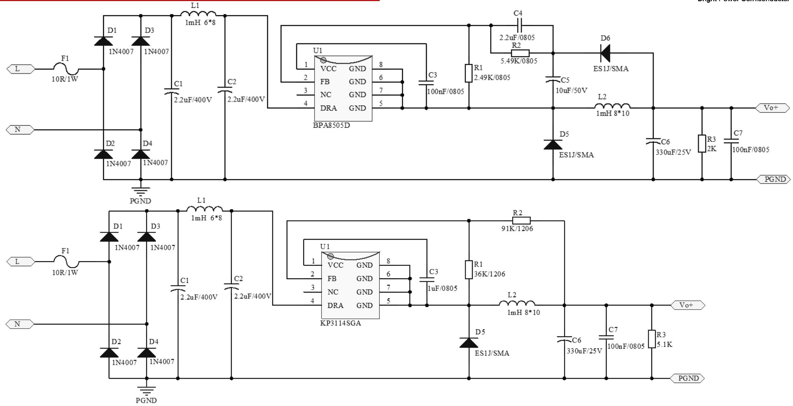

◼ KP3114SGA省FB电容、FB反馈二极管

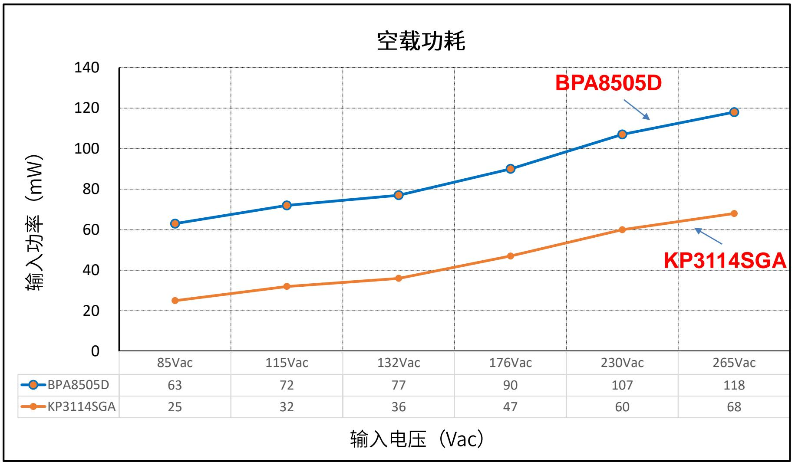

假负载：KP3114SGA假负载5.1K，BPA8505D假负载2K。

注1：BPA8505D的fs\_min与Ilimit\_min均比KP3114SGA大，故KP3114SAG使用较大的Rdummy（更小的功耗）就可以使输出稳定不飘高，所以KP3114SGA的待机要优于BPA8505D。

效率测试  
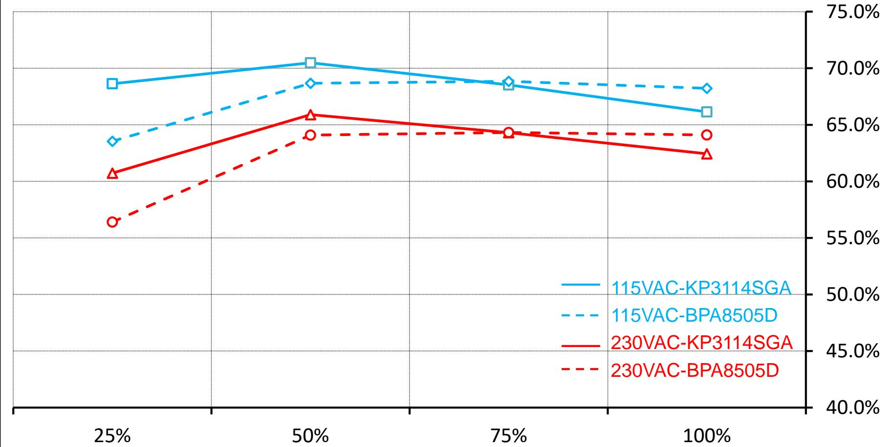

负载

## 输出电压调整率

BPA8505D

<table><tr><td> $V_{IN}(VAC)$ Load(%)</td><td>85</td><td>115</td><td>132</td><td>176</td><td>230</td><td>265</td><td>平均值</td><td>线调整率</td></tr><tr><td>0</td><td>5.249</td><td>5.249</td><td>5.250</td><td>5.251</td><td>5.254</td><td>5.255</td><td>5.25</td><td>0.12%</td></tr><tr><td>20%</td><td>5.063</td><td>5.061</td><td>5.060</td><td>5.057</td><td>5.056</td><td>5.054</td><td>5.06</td><td>0.17%</td></tr><tr><td>40%</td><td>5.033</td><td>5.030</td><td>5.028</td><td>5.028</td><td>5.028</td><td>5.027</td><td>5.03</td><td>0.12%</td></tr><tr><td>60%</td><td>5.019</td><td>5.013</td><td>5.013</td><td>5.011</td><td>5.011</td><td>5.011</td><td>5.01</td><td>0.16%</td></tr><tr><td>80%</td><td>5.011</td><td>5.004</td><td>5.005</td><td>5.005</td><td>5.004</td><td>5.004</td><td>5.01</td><td>0.15%</td></tr><tr><td>100%</td><td>5.003</td><td>5.001</td><td>5.001</td><td>4.999</td><td>4.999</td><td>5.001</td><td>5.00</td><td>0.07%</td></tr><tr><td>平均值</td><td>5.06</td><td>5.06</td><td>5.06</td><td>5.06</td><td>5.06</td><td>5.06</td><td rowspan="2" colspan="2"></td></tr><tr><td>负载调整率</td><td>4.86%</td><td>4.89%</td><td>4.92%</td><td>4.99%</td><td>5.04%</td><td>5.02%</td></tr></table>

◼ 计算方法：调整率=100%\*(最大值-最小值)/平均值

注2：从20%\~100%负载看，两款IC调整率差别不大。而空载时BPA8505D的输出不能做的太低（考虑待机功耗），进而导致全负载范围下的负载调整率 较差。

KP3114SGA

<table><tr><td> $V_{IN}(VAC)$ Load(%)</td><td>85</td><td>115</td><td>132</td><td>176</td><td>230</td><td>265</td><td>平均值</td><td>线调整率</td></tr><tr><td>0</td><td>5.145</td><td>5.132</td><td>5.125</td><td>5.107</td><td>5.076</td><td>5.057</td><td>5.11</td><td>1.72%</td></tr><tr><td>20%</td><td>5.116</td><td>5.111</td><td>5.108</td><td>5.105</td><td>5.097</td><td>5.093</td><td>5.11</td><td>0.45%</td></tr><tr><td>40%</td><td>5.112</td><td>5.111</td><td>5.108</td><td>5.105</td><td>5.095</td><td>5.095</td><td>5.10</td><td>0.33%</td></tr><tr><td>60%</td><td>5.116</td><td>5.111</td><td>5.108</td><td>5.102</td><td>5.096</td><td>5.088</td><td>5.10</td><td>0.55%</td></tr><tr><td>80%</td><td>5.117</td><td>5.116</td><td>5.113</td><td>5.107</td><td>5.096</td><td>5.091</td><td>5.11</td><td>0.51%</td></tr><tr><td>100%</td><td>5.125</td><td>5.122</td><td>5.120</td><td>5.112</td><td>5.101</td><td>5.091</td><td>5.11</td><td>0.67%</td></tr><tr><td>平均值</td><td>5.12</td><td>5.12</td><td>5.11</td><td>5.11</td><td>5.09</td><td>5.09</td><td rowspan="2" colspan="2"></td></tr><tr><td>负载调整率</td><td>0.64%</td><td>0.41%</td><td>0.33%</td><td>0.20%</td><td>0.49%</td><td>0.75%</td></tr></table>

## 输出电压纹波

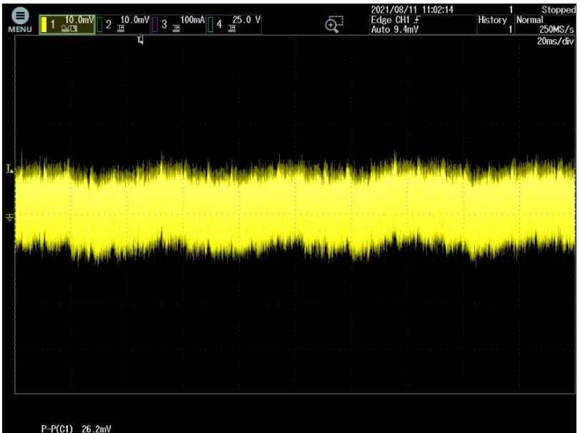

85 VAC

$\begin{array} { r l } { \mathbf { \Delta } } & { { } \mathsf { C H 1 } ~ \mathsf { V _ { o u T } } \mathsf { R i p p l e } } \\ { \mathbf { \Delta } } & { { } \mathsf { V _ { P K - P K } } { = } 2 6 . 2 ~ \mathsf { m V } } \end{array}$

Test Condition:

➢ Full Load

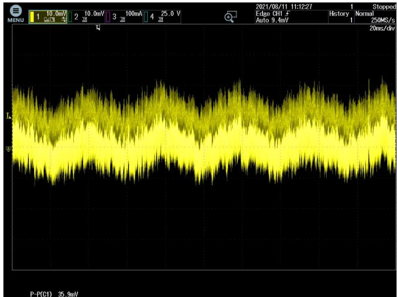

85 VAC

$\begin{array} { r l } { \mathbf { u } } & { { } \mathsf { C H 1 V _ { o u \top } R i p p l e } } \\ { \mathbf { \Delta } } & { { } \mathsf { V _ { P K - P K } } = 3 5 . 9 \mathsf { m V } } \end{array}$

Test Condition:

➢ Full Load

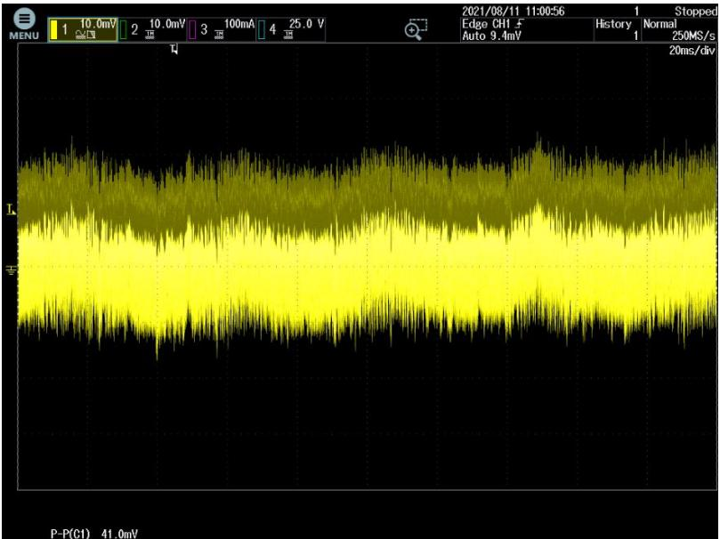

265 VAC

$\begin{array} { r l } { \mathbf { u } } & { { } \mathsf { C H 1 V _ { o u T } R i p p l e } } \\ { \mathbf { \Delta } } & { { } \mathsf { V _ { P K - P K } } = 4 1 \mathsf { m V } } \end{array}$

Test Condition:

➢ Full Load

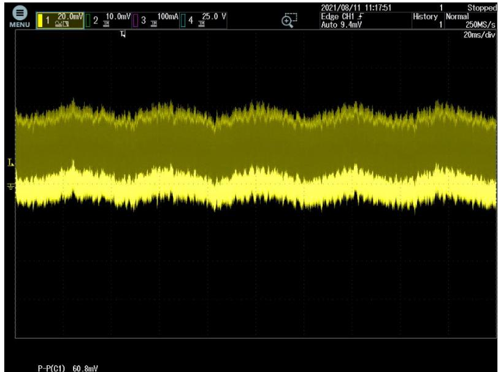

265 VAC

$\begin{array} { r l } { \mathbf { \delta u } } & { { } \mathsf { C H 1 } \mathsf { V _ { \mathrm { o u T } } R i p p l e } } \\ { \mathbf { \delta v _ { \mathsf { P K - P K } } = } 6 0 . 8 \mathsf { m V } } \end{array}$

Test Condition:

➢ Full Load

## (50%-100%)

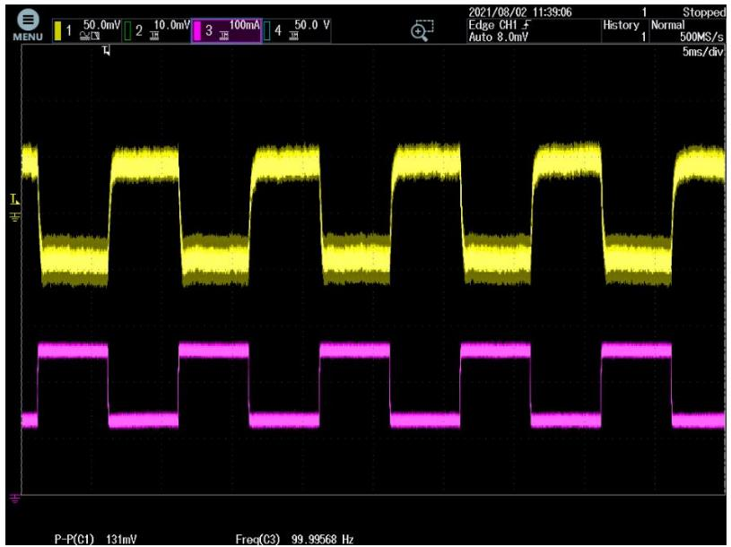

85 VAC

CH1 VOUT  
CH3 IOUT

$$
V _ {P K - P K} = 1 3 1 \mathrm{mV}
$$

## Test Condition:

➢ 0.125 A-0.25 A-0.125 A  
➢ Slew Rate: 0.5 A/μS  
➢ Frequency: 100 Hz

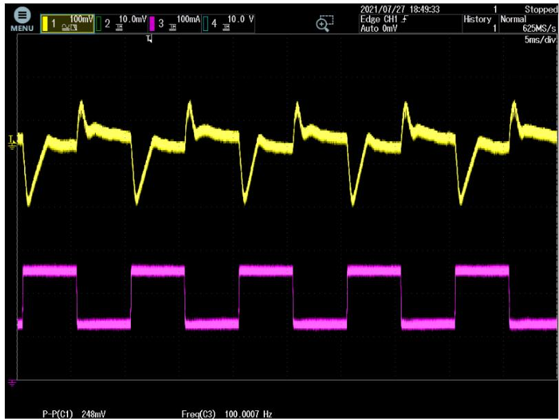

85 VAC

CH1 VOUT  
CH3 IOUT

$$
V _ {P K - P K} = 2 4 8 \mathrm{mV}
$$

## Test Condition:

➢ 0.125 A-0.25 A-0.125 A  
➢ Slew Rate: 0.5 A/μS  
➢ Frequency: 100 Hz

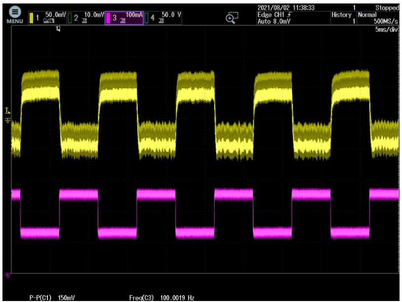

265 VAC

CH1 VOUT  
CH3 IOUT

$$
V _ {P K - P K} = 1 5 0 \mathrm{mV}
$$

## Test Condition:

➢ 0.125 A-0.25 A-0.125 A  
➢ Slew Rate: 0.5 A/μS  
➢ Frequency: 100 Hz

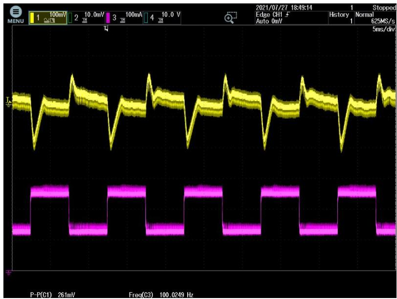

265 VAC

CH1 VOUT  
CH3 IOUT

$$
V _ {P K - P K} = 2 6 1 \mathrm{mV}
$$

## Test Condition:

➢ 0.125 A-0.25 A-0.125 A  
➢ Slew Rate: 0.5 A/μS  
➢ Frequency: 100 Hz

## (10%-90%)

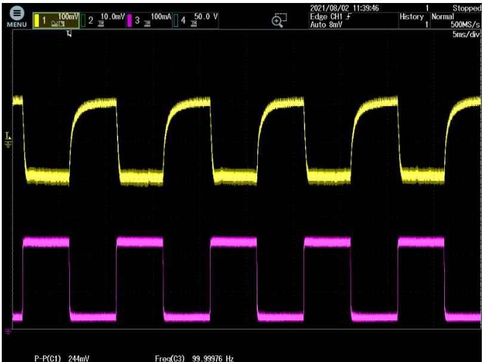

85 VAC

CH1 VOUT $\mathsf { C H 1 } \mathsf { V } _ { \mathsf { O U T } }$ $V _ { p | c - P K } = 2 4 4 m v$  
$\mathsf { C H 3 } \mathsf { I _ { 0 \mathsf { U T } } }$

## Test Condition:

➢ 0.025 A-0.25 A-0.025 A  
➢ Slew Rate: 0.5 A/μS  
➢ Frequency: 100 Hz

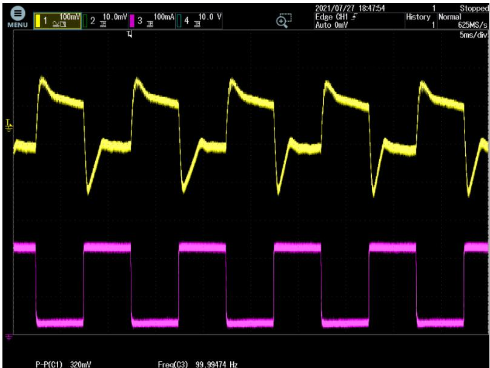

85 VAC

CH1 VOUT $\mathsf { V } _ { \mathsf { O U T } }$ $V _ { p | c - P K } = 3 2 0 ~ \mathsf { m V }$  
CH3 IOUT $\mathsf { C H 3 } \mathsf { I _ { 0 \mathsf { U T } } }$

## Test Condition:

➢ 0.025 A-0.25 A-0.025 A  
➢ Slew Rate: 0.5 A/μS  
➢ Frequency: 100 Hz

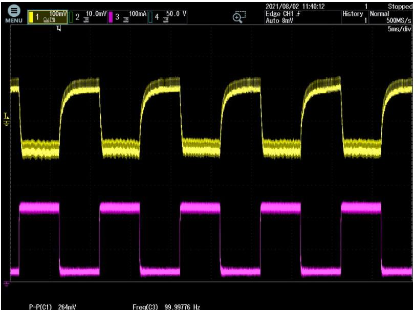

265 VAC

CH1 V $\mathsf { V } _ { \mathsf { O U T } }$ $V _ { \mathsf { P K - P K } } = 2 6 4 ~ \mathsf { m V }$  
CH3 IOUT

## Test Condition:

➢ 0.025 A-0.25 A-0.025 A  
➢ Slew Rate: 0.5 A/μS  
➢ Frequency: 100 Hz

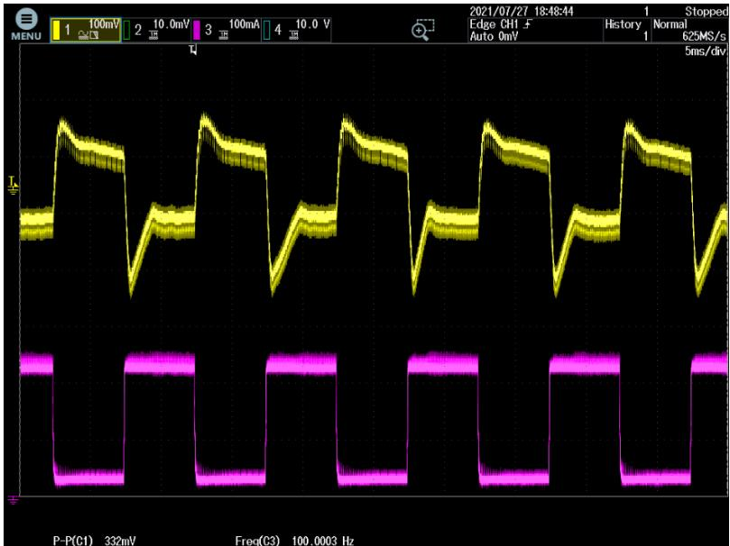

265 VAC

CH1 $\mathsf { V } _ { \mathsf { O U T } }$ $V _ { p | c - P K } = 3 3 2 m v$  
CH3 IOUT $\mathsf { C H 3 } \mathsf { I _ { 0 \mathsf { U T } } }$

## Test Condition:

➢ 0.025 A-0.25 A-0.025 A  
➢ Slew Rate: 0.5 A/μS  
➢ Frequency: 100 Hz

## 输出电压开机波形

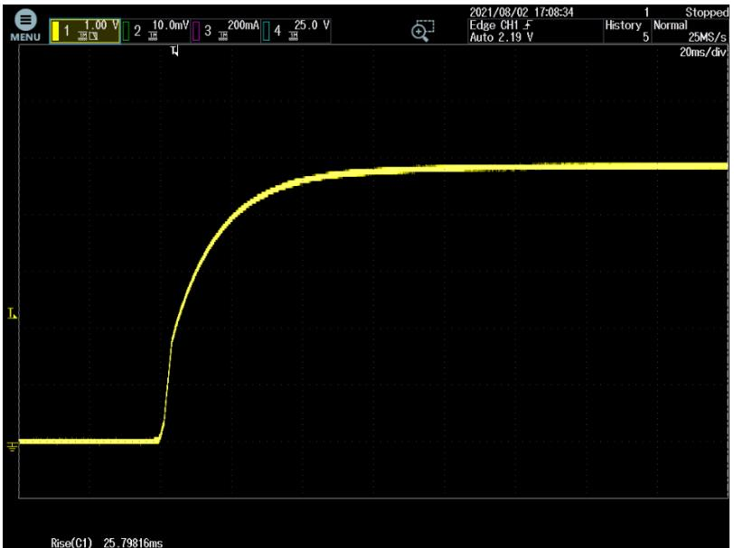

85 VAC  
  
Test Condition:  
➢ Full Load

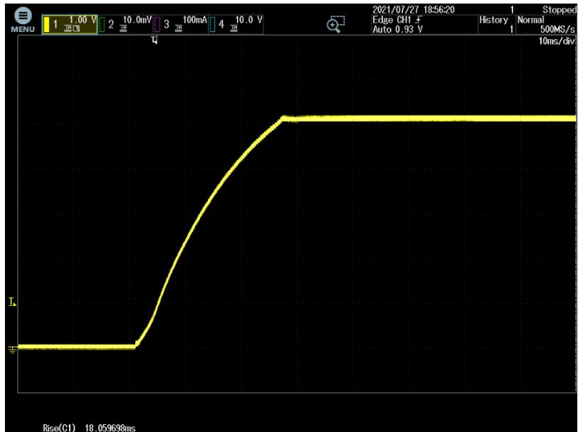

85 VAC  
  
Test Condition:  
➢ Full Load

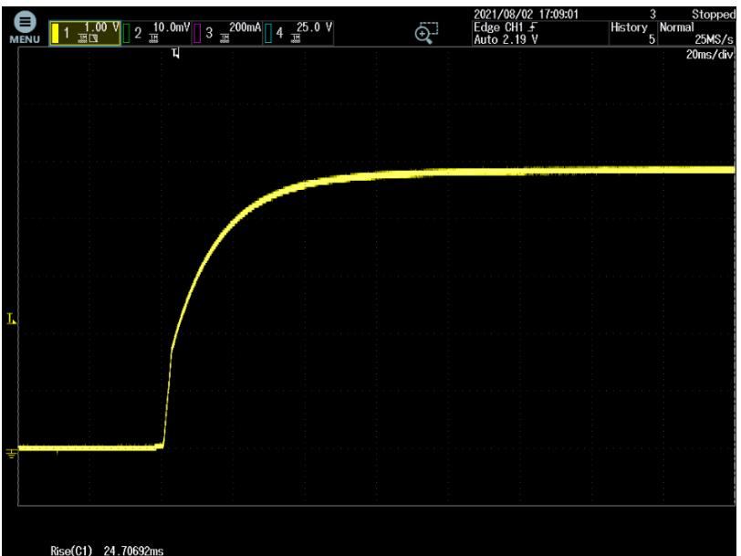

265 VAC  
  
Test Condition:  
➢ Full Load

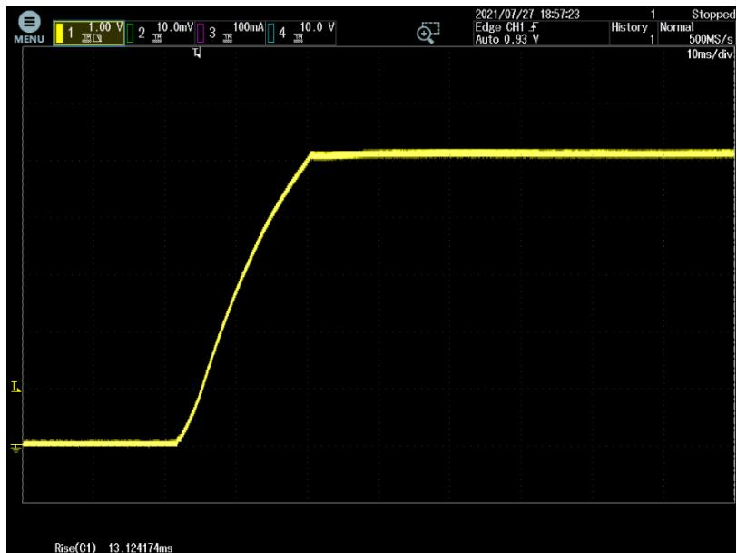

265 VAC  
  
Test Condition:  
➢ Full Load

## MOSFET

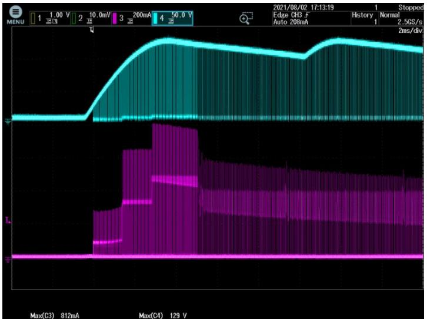

85 VAC

CH4 VDS  
CH3 IDS

$$
\begin{array}{l} \mathrm {V_ {DS\_MAX}} = 1 2 9 \mathrm{V} \\ \mathrm {I_ {DS\_MAX}} = 0. 8 1 2 \mathrm{A} \end{array}
$$

## Test Condition:

➢ Full Load

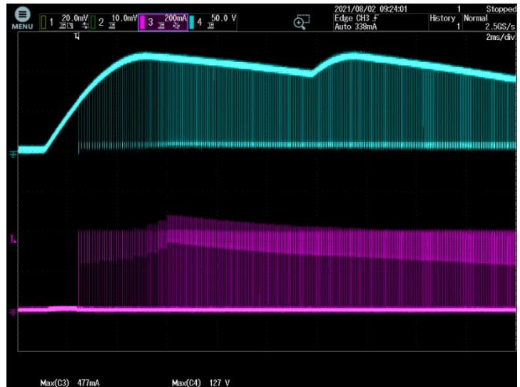

85 VAC

CH4 VDS  
CH3 IDS

$$
\begin{array}{l} \mathrm {V_ {DS\_MAX}} = 1 2 7 \mathrm{V} \\ \mathrm {I_ {DS\_MAX}} = 0. 4 7 7 \mathrm{A} \end{array}
$$

## Test Condition:

➢ Full Load

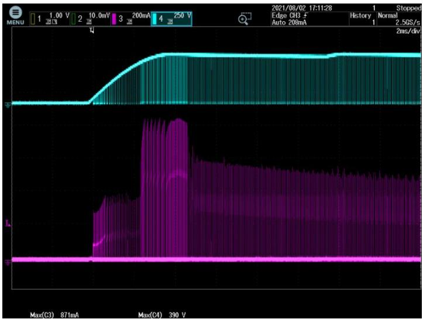

265 VAC

CH4 VDS  
CH3 IDS

$$
\begin{array}{l} V _ {D S \_ M A X} = 3 9 0 \mathrm{V} \\ I _ {D S \_ M A X} = 0. 8 7 1 \mathrm{A} \end{array}
$$

## Test Condition:

➢ Full Load

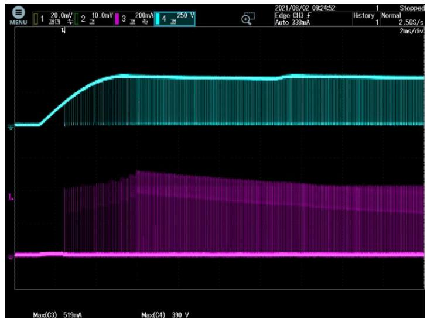

265 VAC

CH4 VDS  
CH3 IDS

$$
\begin{array}{l} V _ {D S \_ M A X} = 3 9 0 \mathrm{V} \\ I _ {D S \_ M A X} = 0. 5 1 9 \mathrm{A} \end{array}
$$

## Test Condition:

➢ Full Load

## BPA8505D

## KP3114SGA

注3：由于BPA8505D限流点较高、起机时CCM深度较深、开关速度比KP3114SGA快，导致开机时MOS的电流应力较大。

## MOSFET

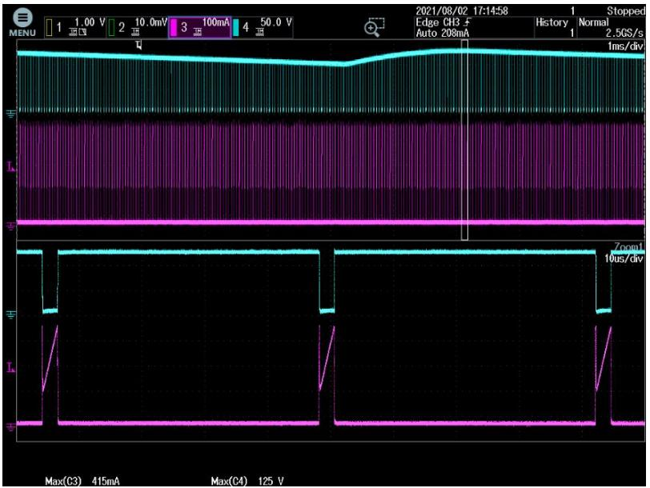

85 VAC

CH4 VDS  
CH3 IDS

$$
\begin{array}{l} V _ {D S \_ M A X} = 1 2 5 \mathrm{V} \\ I _ {D S \_ M A X} = 0. 4 1 5 \mathrm{A} \end{array}
$$

## Test Condition:

➢ Full Load

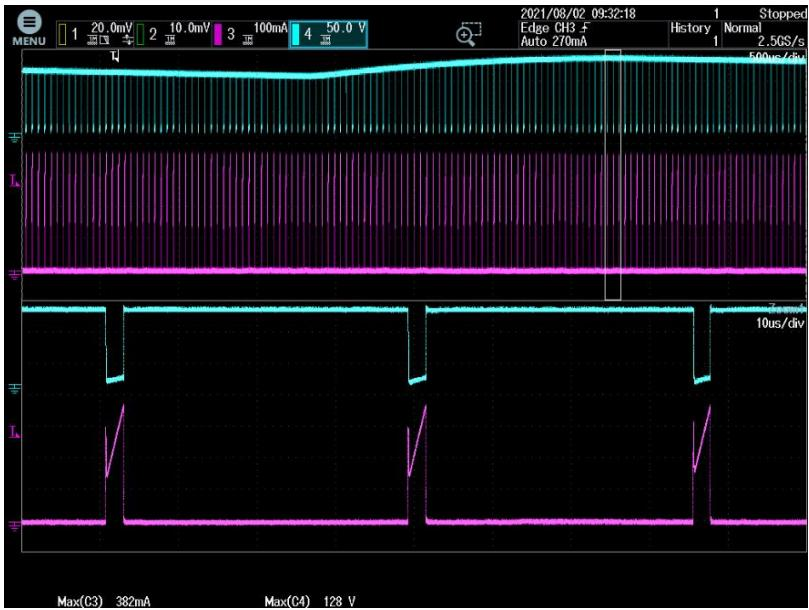

85 VAC

CH4 VDS  
CH3 IDS

$$
\begin{array}{l} V _ {D S \_ M A X} = 1 2 8 \mathrm{V} \\ I _ {D S \_ M A X} = 0. 3 8 2 \mathrm{A} \end{array}
$$

## Test Condition:

➢ Full Load

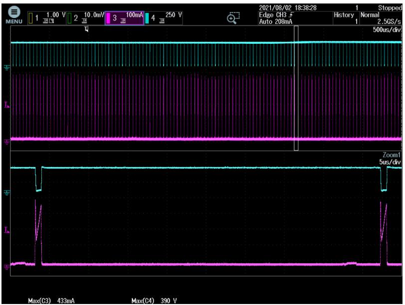

265 VAC

CH4 VDS  
CH3 IDS

$$
\begin{array}{l} \mathrm {V_ {DS\_MAX}} = 3 9 0 \mathrm{V} \\ \mathrm {I_ {DS\_MAX}} = 0. 4 3 3 \mathrm{A} \end{array}
$$

## Test Condition:

➢ Full Load

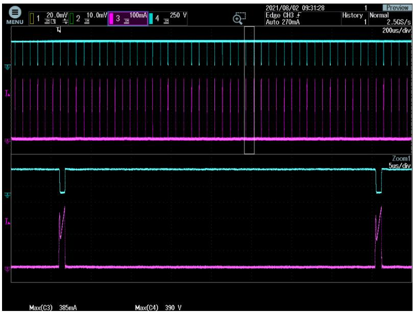

265 VAC

CH4 VDS

$$
\begin{array}{l} V _ {D S \_ M A X} = 3 9 0 \mathrm{V} \\ I _ {D S \_ M A X} = 0. 3 8 5 \mathrm{A} \end{array}
$$

## Test Condition:

➢ Full Load

## 输出二极管开机波形

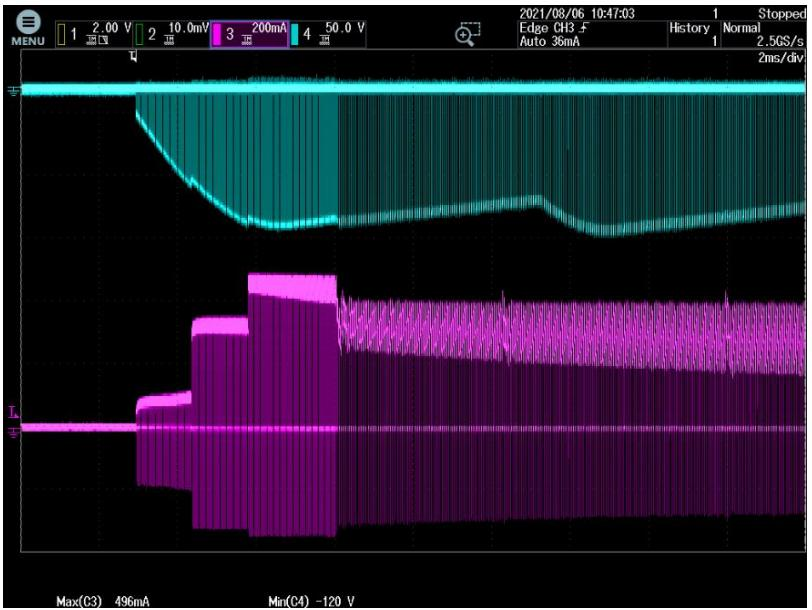

85 VAC

CH4 VR  
CH3 IF

$$
V _ {R \_ M A X} = 1 2 0 \mathrm{V}
$$

$$
I _ {F \_ M A X} = 0. 4 9 6 \mathrm{A}
$$

## Test Condition:

➢ Full Load

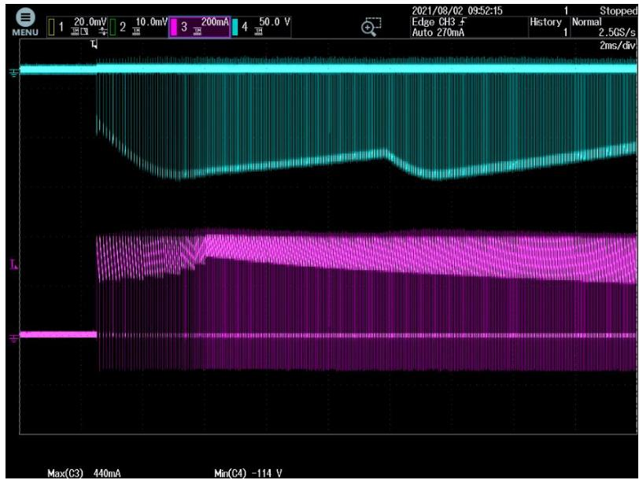

85 VAC

CH4 VR  
CH3 IF

$$
V _ {R \_ M A X} = 1 1 4 \mathrm{V}
$$

$$
I _ {F \_ M A X} = 0. 4 4 \mathrm{A}
$$

## Test Condition:

➢ Full Load

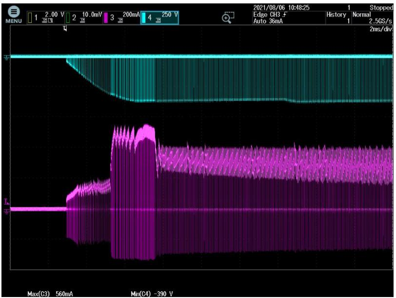

265 VAC

CH4 VR  
CH3 IF

$$
V _ {R \_ M A X} = 3 9 0 \mathrm{V}
$$

$$
I _ {F \_ M A X} = 0. 5 6 \mathrm{A}
$$

## Test Condition:

➢ Full Load

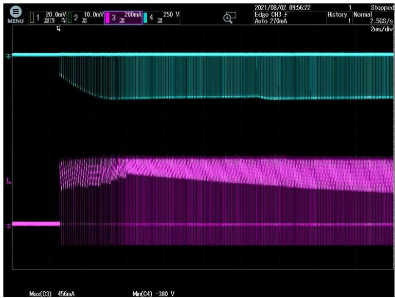

265 VAC

CH4 VR  
CH3 IF

$$
V _ {R \_ M A X} = 3 8 0 \mathrm{V}
$$

$$
I _ {F \_ M A X} = 0. 4 5 6 \mathrm{A}
$$

## Test Condition:

➢ Full Load

## 输出二极管稳态波形

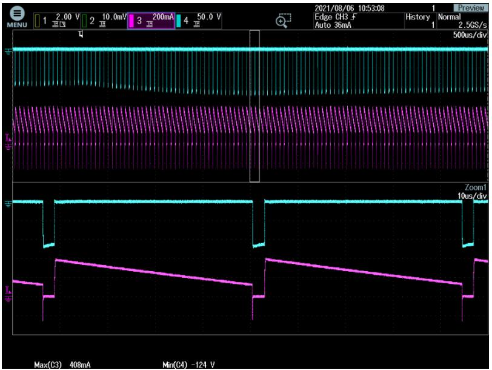

85 VAC

CH4 VR  
CH3 IF

$$
V _ {R \_ M A X} = 1 2 4 \mathrm{V}
$$

$$
I _ {F \_ M A X} = 0. 4 0 8 \mathrm{A}
$$

## Test Condition:

➢ Full Load

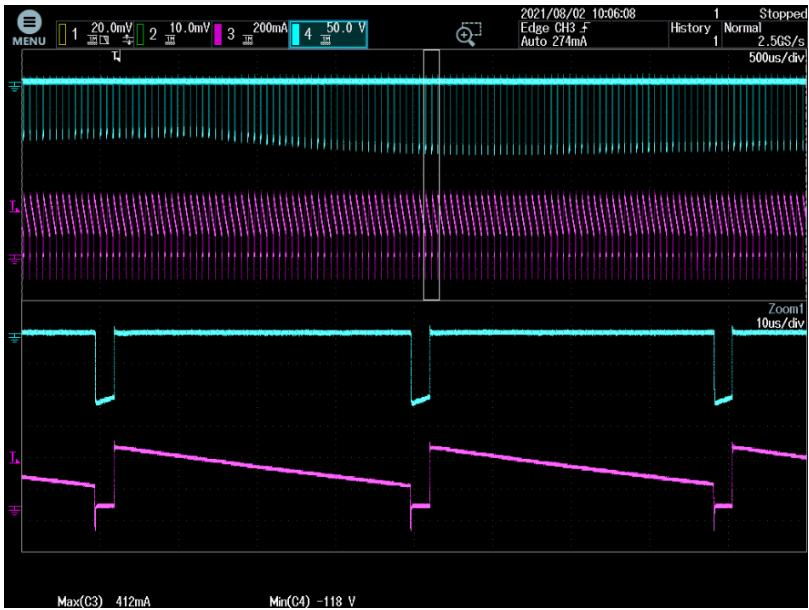

85 VAC

CH4 VR  
CH3 IF

$$
\begin{array}{l} \mathrm {V_ {R\_MAX}} = 1 1 8 \mathrm{V} \\ \mathrm {I_ {F\_MAX}} = 0. 4 1 2 \mathrm{A} \end{array}
$$

## Test Condition:

➢ Full Load

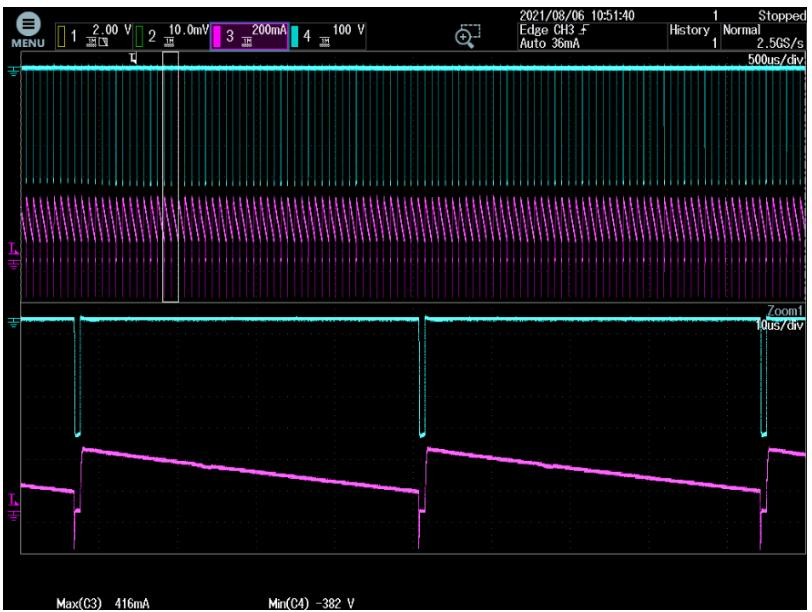

265 VAC

CH4 VR  
CH3 IF

$$
V _ {R \_ M A X} = 3 8 2 \mathrm{V}
$$

$$
I _ {F \_ M A X} = 0. 4 1 6 \mathrm{A}
$$

## Test Condition:

➢ Full Load

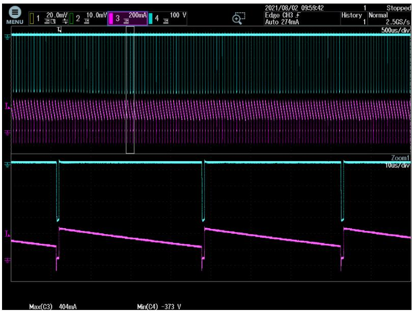

265 VAC

CH4 VR  
CH3 IF

$$
V _ {R \_ M A X} = 3 7 3 \mathrm{V}
$$

$$
I _ {F \_ M A X} = 0. 4 0 4 \mathrm{A}
$$

## Test Condition:

➢ Full Load

## MOSFET

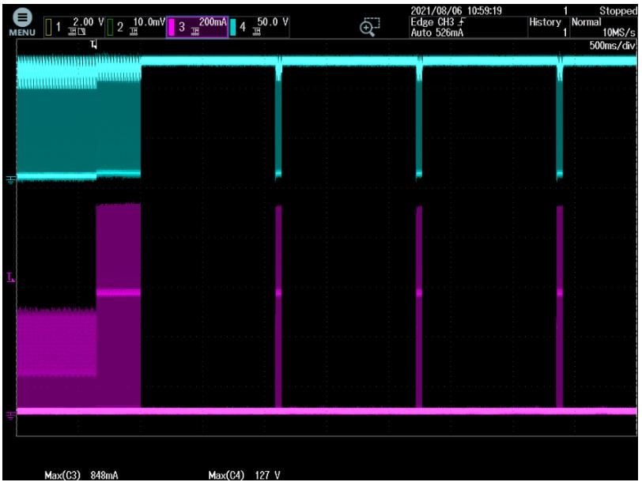

85 VAC

CH4 VDS  
CH3 IDS

$$
\begin{array}{l} \mathrm {V_ {DS\_MAX}} = 1 2 7 \mathrm{V} \\ \mathrm {I_ {DS\_MAX}} = 0. 8 4 8 \mathrm{A} \end{array}
$$

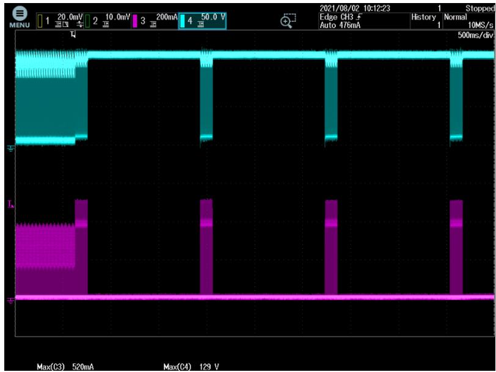

85 VAC

CH4 VDS  
CH3 IDS

$$
\begin{array}{l} \mathrm {V_ {DS\_MAX}} = 1 2 9 \mathrm{V} \\ \mathrm {I_ {DS\_MAX}} = 0. 5 2 \mathrm{A} \end{array}
$$

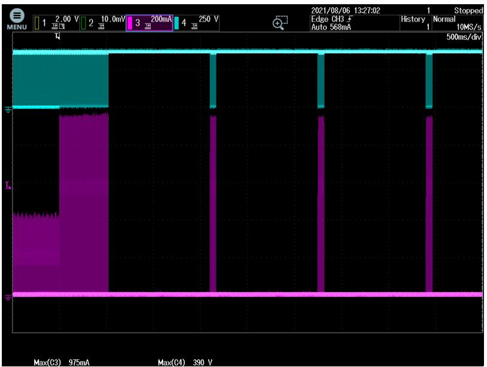

265 VAC

CH1 VDS  
CH3 IDS

$$
\begin{array}{l} \mathrm {V_ {DS\_MAX}} = 3 9 0 \mathrm{V} \\ \mathrm {I_ {DS\_MAX}} = 0. 9 7 5 \mathrm{A} \end{array}
$$

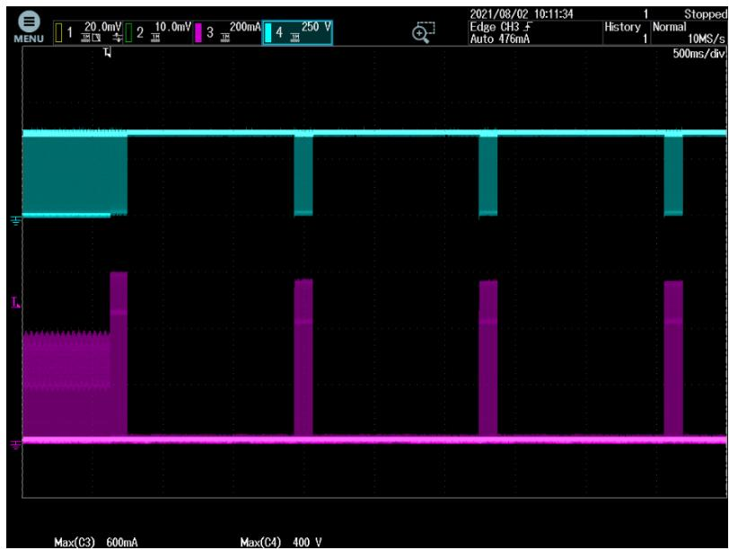

265 VAC

CH4 VDS

$$
\begin{array}{l} \mathrm {V_ {DS\_MAX}} = 4 0 0 \mathrm{V} \\ \mathrm {I_ {DS\_MAX}} = 0. 6 \mathrm{A} \end{array}
$$

## 温升测试

BPA8505D

<table><tr><td rowspan="2">项目</td><td>85VAC</td><td>115VAC</td><td>230VAC</td><td>265VAC</td></tr><tr><td>温度(°C)</td><td>温度(°C)</td><td>温度(°C)</td><td>温度(°C)</td></tr><tr><td>环境温度</td><td>50</td><td>50</td><td>50</td><td>50</td></tr><tr><td>BPA8505D (U1)</td><td>69.4</td><td>71.1</td><td>80.9</td><td>84.3</td></tr><tr><td>电感器绕组(L2)</td><td>68.4</td><td>68.9</td><td>71.9</td><td>72.9</td></tr><tr><td>电感器磁芯(L2)</td><td>62.2</td><td>62.7</td><td>64.7</td><td>65.1</td></tr><tr><td>整流二极管(D3)</td><td>71.2</td><td>72.4</td><td>77.8</td><td>79.6</td></tr><tr><td>整流桥(D1)</td><td>53.9</td><td>53.5</td><td>53.6</td><td>53.7</td></tr><tr><td>输入电解电容(C6)</td><td>58.1</td><td>57.3</td><td>59.9</td><td>60.7</td></tr><tr><td>输出电解电容(C3)</td><td>56.8</td><td>57.2</td><td>58.6</td><td>59.9</td></tr></table>

备注：增大芯片Source散热铜箔面积可以降低芯片温度

KP3114SGA

<table><tr><td rowspan="2">项目</td><td>85VAC</td><td>115VAC</td><td>230VAC</td><td>265VAC</td></tr><tr><td>温度(°C)</td><td>温度(°C)</td><td>温度(°C)</td><td>温度(°C)</td></tr><tr><td>环境温度</td><td>50</td><td>50</td><td>50</td><td>50</td></tr><tr><td>KP3114SGA (U1)</td><td>75.9</td><td>75.7</td><td>85.1</td><td>89.1</td></tr><tr><td>电感器绕组(L2)</td><td>66.1</td><td>66.6</td><td>68.8</td><td>69.8</td></tr><tr><td>电感器磁芯(L2)</td><td>65.2</td><td>65.6</td><td>67.8</td><td>68.8</td></tr><tr><td>整流二极管(D3)</td><td>71.6</td><td>71.7</td><td>76.3</td><td>78.1</td></tr><tr><td>整流桥(D1)</td><td>53.1</td><td>52.4</td><td>52.5</td><td>52.7</td></tr><tr><td>输入电解电容(C6)</td><td>56.3</td><td>55.8</td><td>57.1</td><td>57.6</td></tr><tr><td>输出电解电容(C3)</td><td>54.6</td><td>54.3</td><td>55.2</td><td>55.5</td></tr></table>

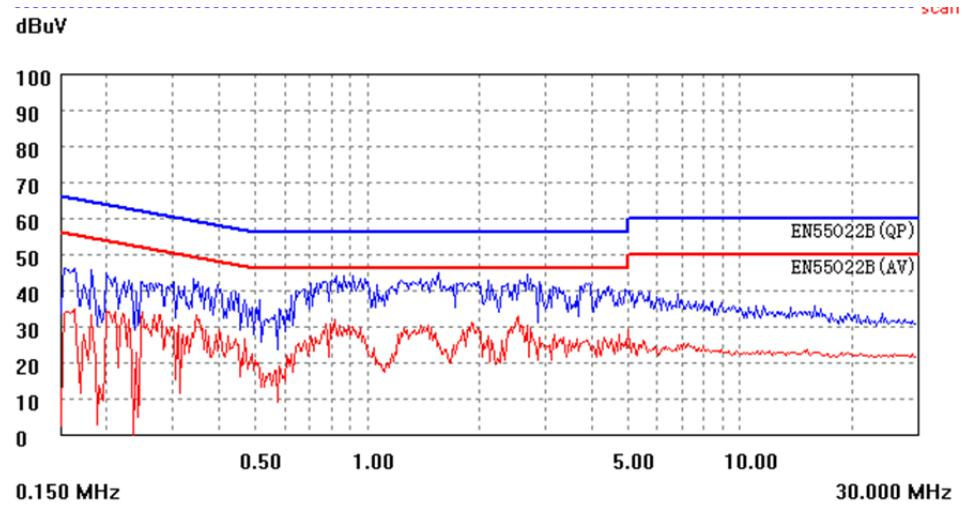

115Vac Line  
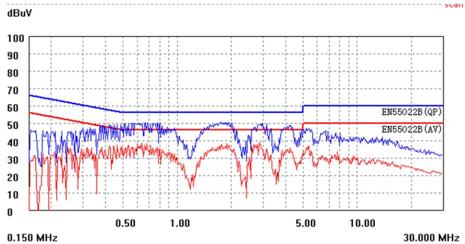

230Vac Line

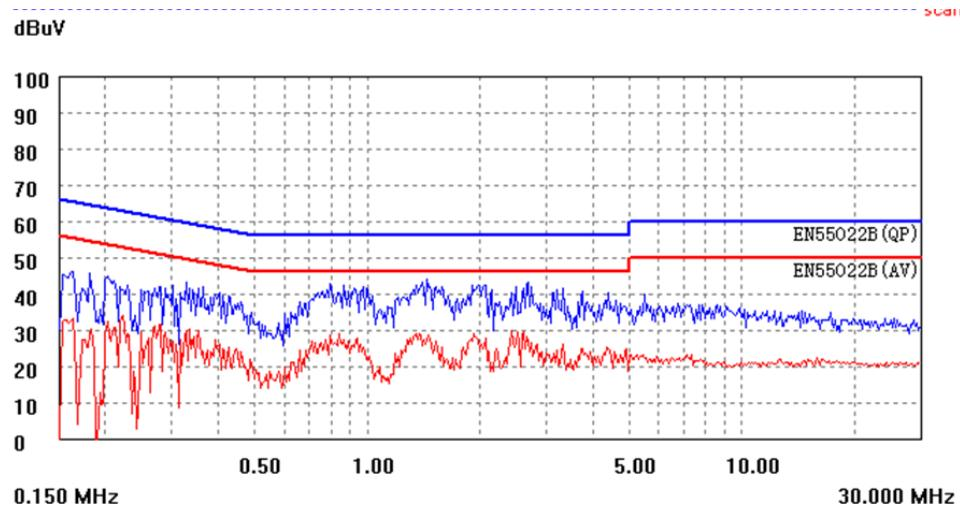

115Vac Neutral

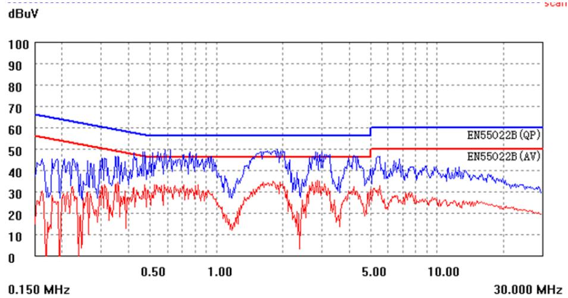

230Vac Neutral

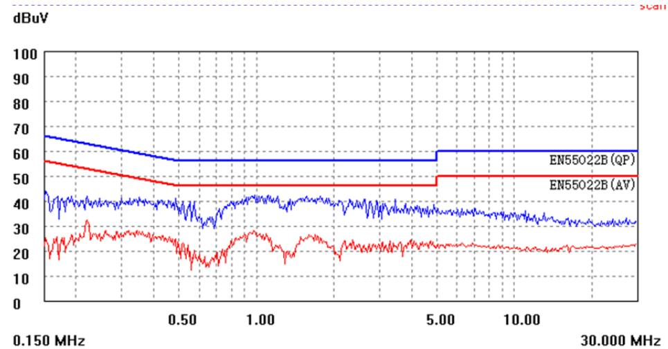

115Vac Line  
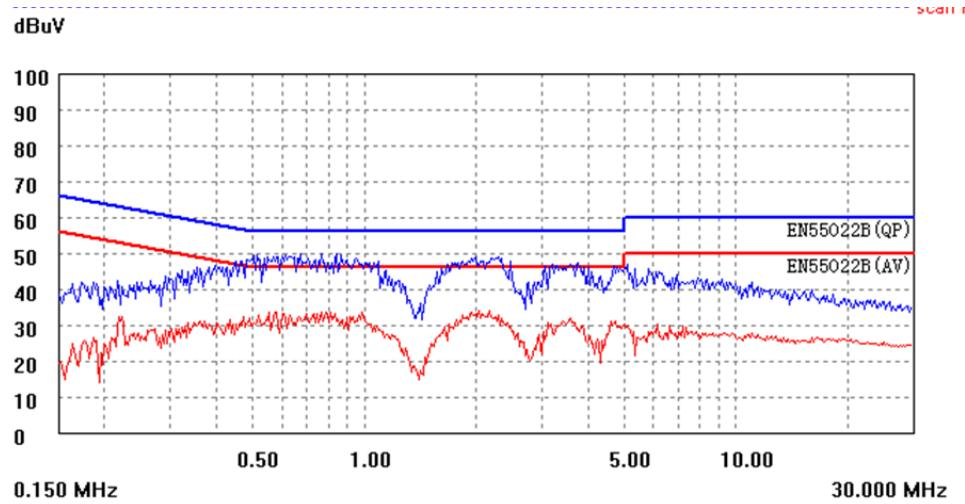

230Vac Line

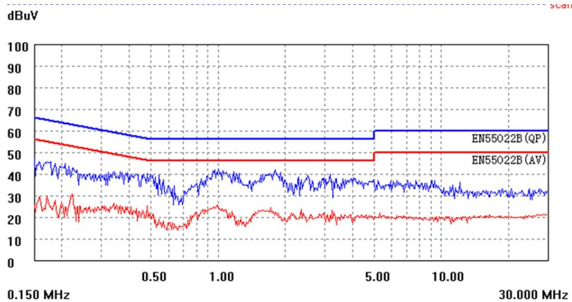

115Vac Neutral

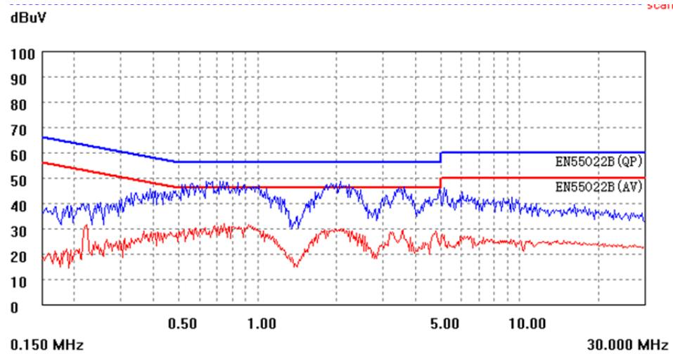

230Vac Neutral

BPA8505D

<table><tr><td>差模</td><td>电压</td><td>相位角</td><td>发生器阻抗</td><td>测试次数</td><td>测试结果</td></tr><tr><td>L to N</td><td>+1.5kV</td><td>0/90/180/270</td><td>2</td><td>10</td><td>Pass</td></tr><tr><td>L to N</td><td>-1.5kV</td><td>0/90/180/270</td><td>2</td><td>10</td><td>Pass</td></tr><tr><td>L to N</td><td>+2kV</td><td>0/90/180/270</td><td>2</td><td>10</td><td>Pass</td></tr><tr><td>L to N</td><td>-2kV</td><td>0/90/180/270</td><td>2</td><td>10</td><td>Pass</td></tr></table>

KP3114SGA

<table><tr><td>差模</td><td>电压</td><td>相位角</td><td>发生器阻抗</td><td>测试次数</td><td>测试结果</td></tr><tr><td>L to N</td><td>+1.5kV</td><td>0/90/180/270</td><td>2</td><td>10</td><td>Pass</td></tr><tr><td>L to N</td><td>-1.5kV</td><td>0/90/180/270</td><td>2</td><td>10</td><td>Pass</td></tr><tr><td>L to N</td><td>+2kV</td><td>0/90/180/270</td><td>2</td><td>10</td><td>Pass</td></tr><tr><td>L to N</td><td>-2kV</td><td>0/90/180/270</td><td>2</td><td>10</td><td>Pass</td></tr></table>

1PCS 561 BUS

## EFT

BPA8505D

<table><tr><td>差模</td><td>电压</td><td>脉冲群持续时间</td><td>脉冲频率</td><td>测试时间</td><td>测试结果</td></tr><tr><td>L to N</td><td>+4kV</td><td>15ms</td><td>5kHz</td><td>120s</td><td>Pass</td></tr><tr><td>L to N</td><td>-4kV</td><td>15ms</td><td>5kHz</td><td>120s</td><td>Pass</td></tr><tr><td>L to N</td><td>+4kV</td><td>0.75ms</td><td>100kHz</td><td>120s</td><td>Pass</td></tr><tr><td>L to N</td><td>-4kV</td><td>0.75ms</td><td>100kHz</td><td>120s</td><td>Pass</td></tr><tr><td>L to N</td><td>+2kV</td><td>2ms</td><td>38kHz</td><td>120s</td><td>Pass</td></tr><tr><td>L to N</td><td>-2kV</td><td>2ms</td><td>38kHz</td><td>120s</td><td>Pass</td></tr><tr><td>L to N</td><td>+4kV</td><td>2ms</td><td>38kHz</td><td>120s</td><td>Pass</td></tr><tr><td>L to N</td><td>-4kV</td><td>2ms</td><td>38kHz</td><td>120s</td><td>Pass</td></tr></table>

KP3114SGA

<table><tr><td>差模</td><td>电压</td><td>脉冲群持续时间</td><td>脉冲频率</td><td>测试时间</td><td>测试结果</td></tr><tr><td>L to N</td><td>+4kV</td><td>15ms</td><td>5kHz</td><td>120s</td><td>Pass</td></tr><tr><td>L to N</td><td>-4kV</td><td>15ms</td><td>5kHz</td><td>120s</td><td>Pass</td></tr><tr><td>L to N</td><td>+4kV</td><td>0.75ms</td><td>100kHz</td><td>120s</td><td>Pass</td></tr><tr><td>L to N</td><td>-4kV</td><td>0.75ms</td><td>100kHz</td><td>120s</td><td>Pass</td></tr><tr><td>L to N</td><td>+2kV</td><td>2ms</td><td>38kHz</td><td>120s</td><td>Pass</td></tr><tr><td>L to N</td><td>-2kV</td><td>2ms</td><td>38kHz</td><td>120s</td><td>Pass</td></tr><tr><td>L to N</td><td>+4kV</td><td>2ms</td><td>38kHz</td><td>120s</td><td>Pass</td></tr><tr><td>L to N</td><td>-4kV</td><td>2ms</td><td>38kHz</td><td>120s</td><td>Pass</td></tr></table>

BPA8505D

<table><tr><td>测试点</td><td>电压(V)</td><td>放电类型</td><td>放电次数</td><td>测试结果</td></tr><tr><td>Vo</td><td>+8kV</td><td>接触放电</td><td>10</td><td>Pass</td></tr><tr><td>Vo</td><td>-8kV</td><td>接触放电</td><td>10</td><td>Pass</td></tr><tr><td>GND</td><td>+8kV</td><td>接触放电</td><td>10</td><td>Pass</td></tr><tr><td>GND</td><td>-8kV</td><td>接触放电</td><td>10</td><td>Pass</td></tr><tr><td>Vo</td><td>+15kV</td><td>空气放电</td><td>10</td><td>Pass</td></tr><tr><td>Vo</td><td>-15kV</td><td>空气放电</td><td>10</td><td>Pass</td></tr><tr><td>GND</td><td>+15kV</td><td>空气放电</td><td>10</td><td>Pass</td></tr><tr><td>GND</td><td>-15kV</td><td>空气放电</td><td>10</td><td>Pass</td></tr></table>

KP3114SGA

<table><tr><td>测试点</td><td>电压(V)</td><td>放电类型</td><td>放电次数</td><td>测试结果</td></tr><tr><td>Vo</td><td>+8kV</td><td>接触放电</td><td>10</td><td>Pass</td></tr><tr><td>Vo</td><td>-8kV</td><td>接触放电</td><td>10</td><td>Pass</td></tr><tr><td>GND</td><td>+8kV</td><td>接触放电</td><td>10</td><td>Pass</td></tr><tr><td>GND</td><td>-8kV</td><td>接触放电</td><td>10</td><td>Pass</td></tr><tr><td>Vo</td><td>+15kV</td><td>空气放电</td><td>10</td><td>Pass</td></tr><tr><td>Vo</td><td>-15kV</td><td>空气放电</td><td>10</td><td>Pass</td></tr><tr><td>GND</td><td>+15kV</td><td>空气放电</td><td>10</td><td>Pass</td></tr><tr><td>GND</td><td>-15kV</td><td>空气放电</td><td>10</td><td>Pass</td></tr></table>

## THANK YOU FOR WATCHING
