## BPA8505D&KP3116SGA对比测试

## (5V/0.3A@85\~265Vac)

上海晶丰明源半导体股份有限公司

Shanghai Bright Power Semiconductor Co., Ltd.

YSM

时间：2021年7月

## 电气参数对比

<table><tr><td></td><td>BPA8505D</td><td>KP3116SGA</td></tr><tr><td>开关频率</td><td>45KHz</td><td>40KHz</td></tr><tr><td>Mosfet BV</td><td>650V</td><td>700V</td></tr><tr><td> $R_{DS\_ON}$ </td><td>8.5Ω</td><td>14Ω</td></tr><tr><td>限流点</td><td>440mA</td><td>500mA</td></tr><tr><td>软启动</td><td>有</td><td>有</td></tr><tr><td>输出过压保护</td><td>有</td><td>有</td></tr><tr><td>过载保护</td><td>有</td><td>有</td></tr><tr><td>封装</td><td>DIP-7, SOP-7</td><td>SOP-8</td></tr></table>

## 测试数据对比

电源规格：85\~265Vac输入，5V/0.3A输出

<table><tr><td colspan="2"></td><td>BPA8505D</td><td>KP3116SGA</td><td></td></tr><tr><td colspan="2">待机功耗</td><td>109mW</td><td>79mW</td><td>230Vac输入</td></tr><tr><td colspan="2">负载调整率</td><td>5.3%~5.6%</td><td>1.11%~2.02%</td><td></td></tr><tr><td rowspan="2">满载效率</td><td>115Vac</td><td>66.5%</td><td>65.2%</td><td></td></tr><tr><td>230Vac</td><td>62%</td><td>60.5%</td><td></td></tr><tr><td rowspan="2">输出电压纹波</td><td>85Vac</td><td>26.7mV</td><td>33.3mV</td><td></td></tr><tr><td>265Vac</td><td>41.2mV</td><td>59.1mV</td><td></td></tr><tr><td rowspan="2">动态负载性能</td><td>50%-100%</td><td>207mVPK_PK</td><td>341mVPK_PK</td><td rowspan="2">265Vac输入</td></tr><tr><td>10%-90%</td><td>296mVPK_PK</td><td>415mVPK_PK</td></tr><tr><td rowspan="2">MOSFET应力</td><td> $V_{DS}$ </td><td>390V</td><td>400V</td><td rowspan="2">265Vac输入</td></tr><tr><td> $I_{DS}$ </td><td>0.903A</td><td>0.78A</td></tr><tr><td rowspan="2">续流二极管应力</td><td>VRR</td><td>390V</td><td>390V</td><td></td></tr><tr><td> $I_{PK}$ </td><td>0.58A</td><td>0.704A</td><td></td></tr><tr><td colspan="2">温升测试(环温50°C)</td><td>91.8°C</td><td>96.7°C</td><td>265Vac输入</td></tr><tr><td colspan="2">传导EMI</td><td>6dB裕量</td><td>6dB裕量</td><td></td></tr><tr><td colspan="2">Surge</td><td>Pass</td><td>Pass</td><td>差模2kV(增加1 Pcs 561压敏)</td></tr><tr><td colspan="2">EFT群脉冲</td><td>Pass</td><td>Pass</td><td>4kV,5kHz/38kHz/100kHz</td></tr><tr><td colspan="2">ESD</td><td>Pass</td><td>Pass</td><td>15kV空气放电</td></tr></table>

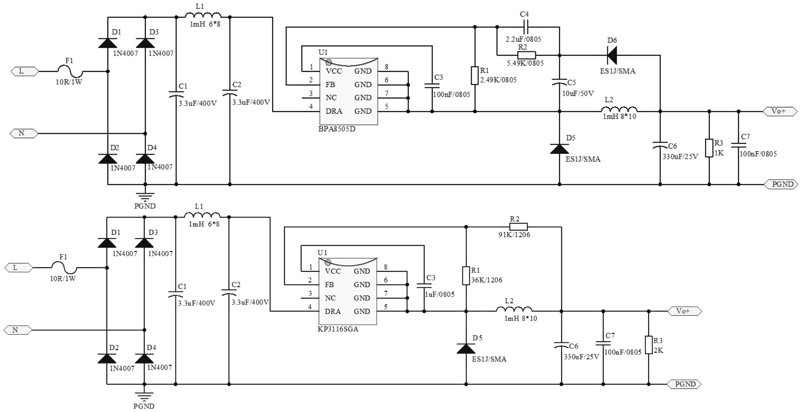  
◼ KP3116SGA省FB电容、FB反馈二极管

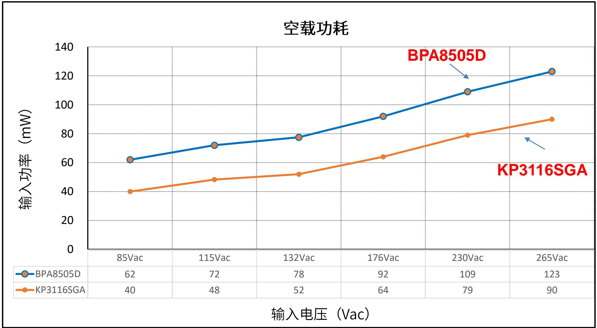

假负载：KP3116SGA假负载2K，BPA8505D假负载1K。

注1：BPA8505D的fs\_min与Ilimit\_min均比KP3116SGA大，故KP3116SAG使用较大的Rdummy（更小的功耗）就可以使输出稳定不飘高，所以KP3116SGA的待机要优于BPA8505D。

效率测试  
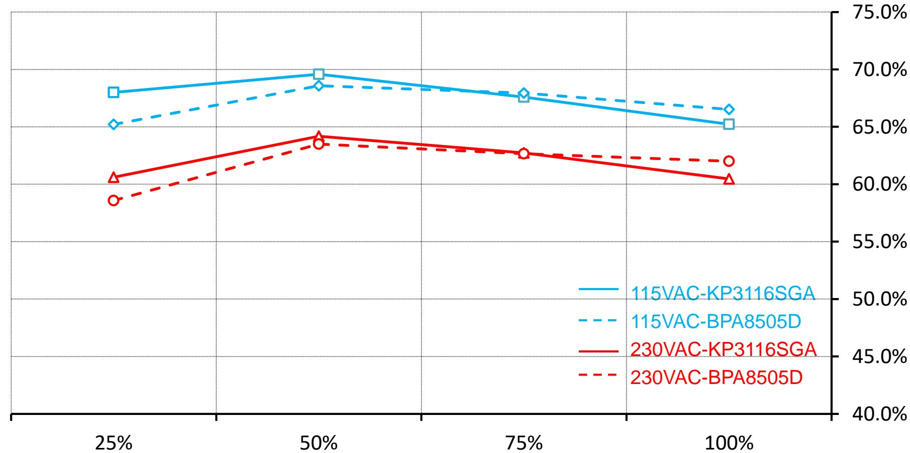

负载

## 输出电压调整率

BPA8505D

<table><tr><td> $V_{IN}(VAC)$ Load(%)</td><td>85</td><td>115</td><td>132</td><td>176</td><td>230</td><td>265</td><td>平均值</td><td>线调整率</td></tr><tr><td>0</td><td>5.206</td><td>5.206</td><td>5.208</td><td>5.208</td><td>5.210</td><td>5.212</td><td>5.21</td><td>0.12%</td></tr><tr><td>20%</td><td>5.005</td><td>5.001</td><td>5.000</td><td>4.997</td><td>4.996</td><td>4.996</td><td>5.00</td><td>0.18%</td></tr><tr><td>40%</td><td>4.974</td><td>4.970</td><td>4.967</td><td>4.966</td><td>4.966</td><td>4.964</td><td>4.97</td><td>0.20%</td></tr><tr><td>60%</td><td>4.956</td><td>4.955</td><td>4.951</td><td>4.951</td><td>4.950</td><td>4.950</td><td>4.95</td><td>0.12%</td></tr><tr><td>80%</td><td>4.946</td><td>4.943</td><td>4.943</td><td>4.942</td><td>4.941</td><td>4.942</td><td>4.94</td><td>0.10%</td></tr><tr><td>100%</td><td>4.941</td><td>4.935</td><td>4.935</td><td>4.935</td><td>4.933</td><td>4.932</td><td>4.94</td><td>0.18%</td></tr><tr><td>平均值</td><td>5.00</td><td>5.00</td><td>5.00</td><td>5.00</td><td>5.00</td><td>5.00</td><td rowspan="2" colspan="2"></td></tr><tr><td>负载调整率</td><td>5.30%</td><td>5.42%</td><td>5.46%</td><td>5.46%</td><td>5.54%</td><td>5.60%</td></tr></table>

计算方法：调整率=100%\*(最大值-最小值)/平均值  
注2：从20%\~100%负载看，两款IC的Vout变化相差不大。为了使BPA8505D 待机功耗不会过大，所以空载时Vout不能做的太低，进而导致在全负载范围 下的负载调整率要差。

KP3116SGA

<table><tr><td> $V_{IN}(VAC)$ Load(%)</td><td>85</td><td>115</td><td>132</td><td>176</td><td>230</td><td>265</td><td>平均值</td><td>线调整率</td></tr><tr><td>0</td><td>5.206</td><td>5.175</td><td>5.152</td><td>5.107</td><td>5.067</td><td>5.046</td><td>5.13</td><td>3.12%</td></tr><tr><td>20%</td><td>5.165</td><td>5.161</td><td>5.156</td><td>5.148</td><td>5.138</td><td>5.132</td><td>5.15</td><td>0.64%</td></tr><tr><td>40%</td><td>5.158</td><td>5.153</td><td>5.150</td><td>5.142</td><td>5.131</td><td>5.118</td><td>5.14</td><td>0.78%</td></tr><tr><td>60%</td><td>5.138</td><td>5.132</td><td>5.128</td><td>5.121</td><td>5.106</td><td>5.097</td><td>5.12</td><td>0.80%</td></tr><tr><td>80%</td><td>5.123</td><td>5.118</td><td>5.115</td><td>5.102</td><td>5.091</td><td>5.076</td><td>5.10</td><td>0.92%</td></tr><tr><td>100%</td><td>5.102</td><td>5.101</td><td>5.097</td><td>5.091</td><td>5.067</td><td>5.046</td><td>5.08</td><td>1.10%</td></tr><tr><td>平均值</td><td>5.15</td><td>5.14</td><td>5.13</td><td>5.12</td><td>5.10</td><td>5.09</td><td rowspan="2" colspan="2"></td></tr><tr><td>负载调整率</td><td>2.02%</td><td>1.44%</td><td>1.15%</td><td>1.11%</td><td>1.39%</td><td>1.69%</td></tr></table>

## 输出电压纹波

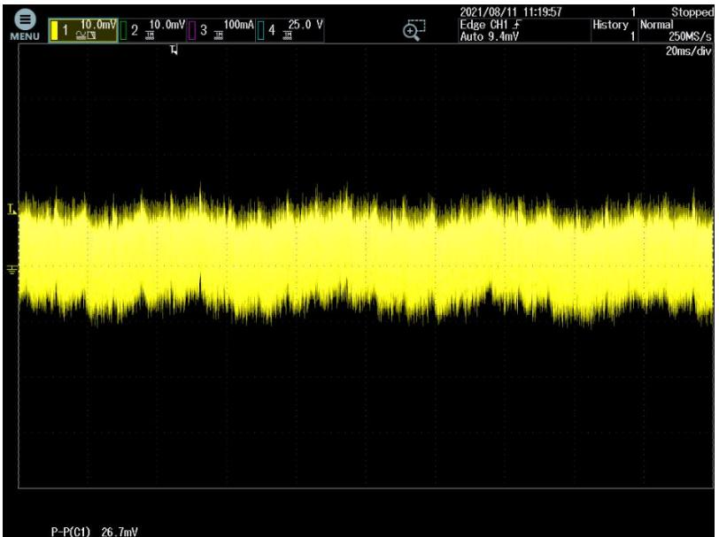

85 VAC

$\begin{array} { r l } { \mathbf { \Pi } } & { { } \mathsf { C H 1 } \lor _ { \mathsf { o u T } } \mathsf { R i p p l e } } \\ { \mathbf { \Pi } } & { { } \lor _ { \mathsf { P K - P K } } = 2 6 . 7 \mathbf { \Pi } \mathsf { m V } } \end{array}$

Test Condition:

➢ Full Load

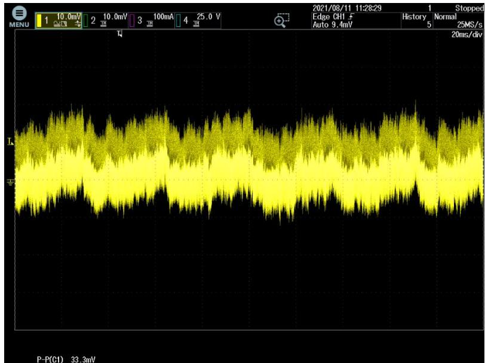

85 VAC

CH1 $\mathsf { V } _ { \mathsf { O U T } }$ Ripple VPK-PK=33.3 mV

Test Condition:

➢ Full Load

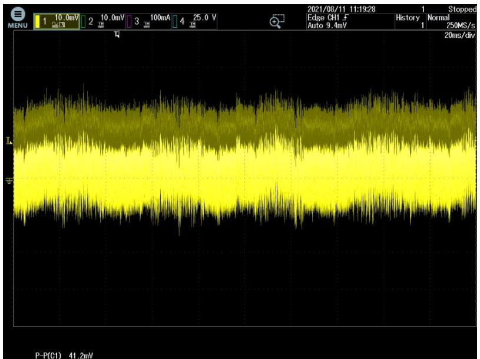

265 VAC

$\begin{array} { r l } { \mathbf { \Pi } } & { \mathsf { C H 1 V _ { o u T } R i p p l e } } \\ & { \mathsf { V _ { P K - P K } } = 4 1 . 2 \mathsf { m v } } \end{array}$

Test Condition:

➢ Full Load

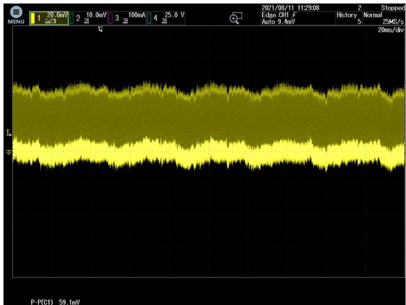

265 VAC

$\begin{array} { r l } { \mathbf { \delta u } } & { { } \mathsf { C H 1 V _ { o u T } R i p p l e } } \\ { \mathbf { \delta v _ { p k - P K } = 5 9 . 1 m v } } \end{array}$

Test Condition:

➢ Full Load

## (50%-100%)

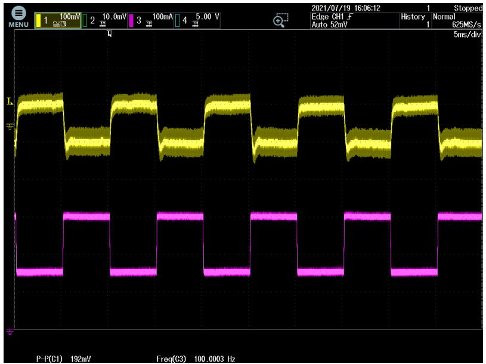

85 VAC

$\mathsf { C H 1 } \mathsf { V } _ { \mathsf { O U T } }$ $V _ { P K - P K } = 1 9 2 m v$  
$\mathsf { C H 3 } \mathsf { I _ { 0 \mathsf { U } \mathsf { T } } }$

## Test Condition:

➢ 0.15 A-0.3 A-0.15 A  
➢ Slew Rate: 0.5 A/μS  
➢ Frequency: 100 Hz

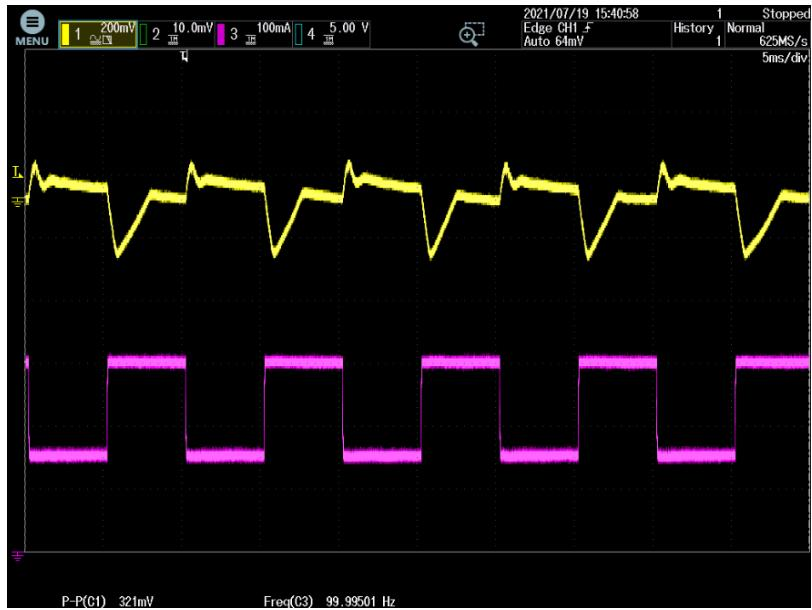

$8 5 V _ { A C }$

${ \mathsf { C H 1 } } { \mathsf { V } } _ { \mathsf { O U T } }$ CH1 VOUT $V _ { \mathsf { P K - P K } } = 3 2 1 \mathsf { m V }$  
CH3 IOUT $\mathsf { C H 3 } \mathsf { I _ { 0 \mathsf { U T } } }$

## Test Condition:

➢ 0.15 A-0.3 A-0.15 A  
➢ Slew Rate: 0.5 A/μS  
➢ Frequency: 100 Hz

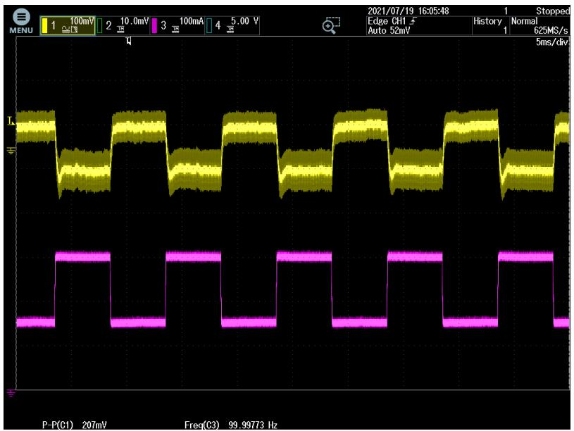

265 VAC

CH1 $\mathsf { V } _ { \mathsf { O U T } }$ $v _ { p _ { k - P K } } = 2 0 7 ~ \mathsf { m V }$  
CH3 ${ \mathsf I } _ { 0 \mathsf U \top }$

## Test Condition:

➢ 0.15 A-0.3 A-0.15 A  
➢ Slew Rate: 0.5 A/μS  
➢ Frequency: 100 Hz

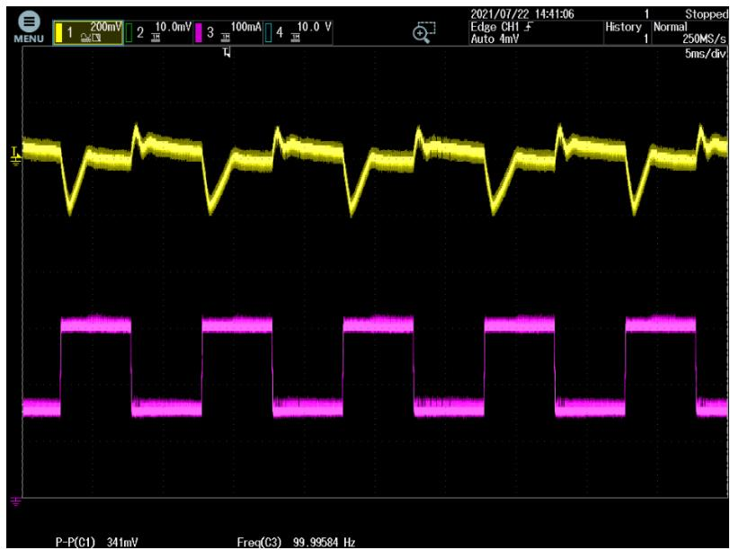

265 VAC

CH1 $\mathsf { V } _ { \mathsf { O U T } }$ $\mathsf { V } _ { \mathsf { P K - P K } } \equiv 3 4 1 \mathsf { m V }$  
$\mathsf { C H 3 } \mathsf { I _ { 0 \mathsf { U T } } }$

## Test Condition:

➢ 0.15 A-0.3 A-0.15 A  
➢ Slew Rate: 0.5 A/μS  
➢ Frequency: 100 Hz

## (10%-90%)

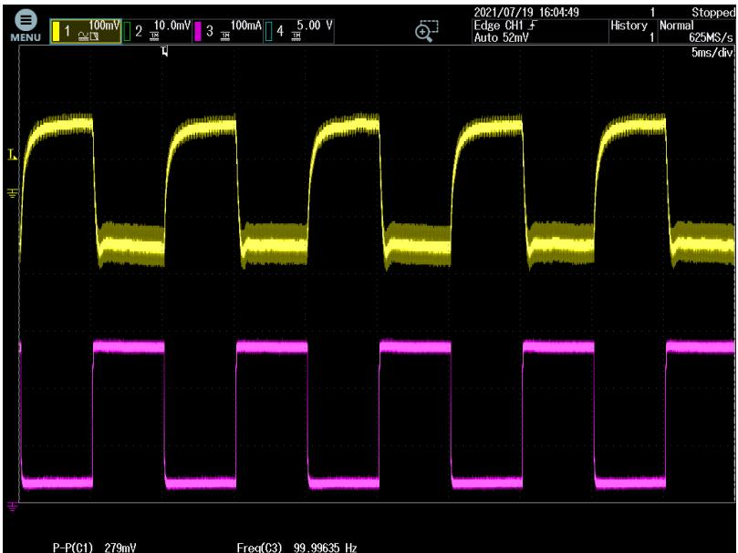

85 VAC

CH1 VOUT  
CH3 IOUT

$$
V _ {P K - P K} = 2 7 9 \mathrm{mV}
$$

## Test Condition:

➢ 0.03 A-0.3 A-0.03 A  
➢ Slew Rate: 0.5 A/μS  
➢ Frequency: 100 Hz

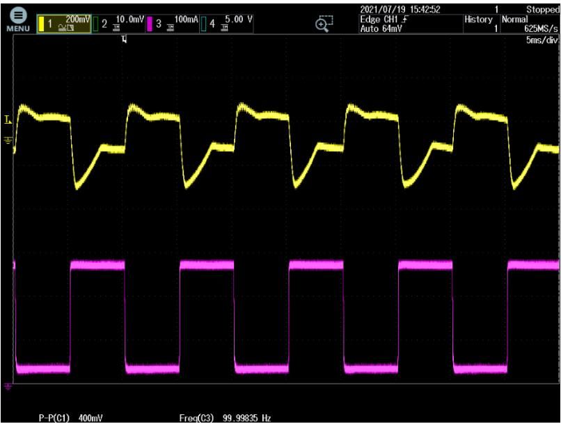

85 VAC

CH1 VOUT  
CH3 IOUT

$$
V _ {P K - P K} = 4 0 0 \mathrm{mV}
$$

## Test Condition:

➢ 0.03 A-0.3 A-0.03 A  
➢ Slew Rate: 0.5 A/μS  
➢ Frequency: 100 Hz

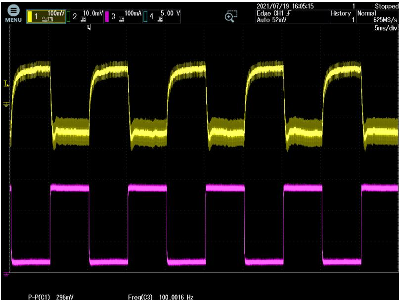

265 VAC

CH1 VOUT  
CH3 IOUT

$$
V _ {P K - P K} = 2 9 6 \mathrm{mV}
$$

## Test Condition:

➢ 0.03 A-0.3 A-0.03 A  
➢ Slew Rate: 0.5 A/μS  
➢ Frequency: 100 Hz

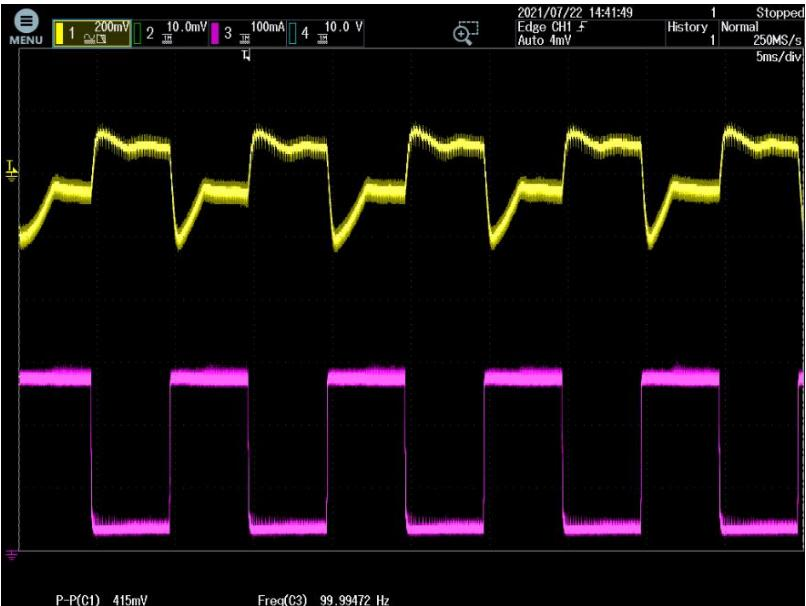

265 VAC

CH1 VOUT  
CH3 IOUT

$$
V _ {P K - P K} = 4 1 5 m V
$$

## Test Condition:

➢ 0.03 A-0.3 A-0.03 A  
➢ Slew Rate: 0.5 A/μS  
➢ Frequency: 100 Hz

## 输出电压开机波形

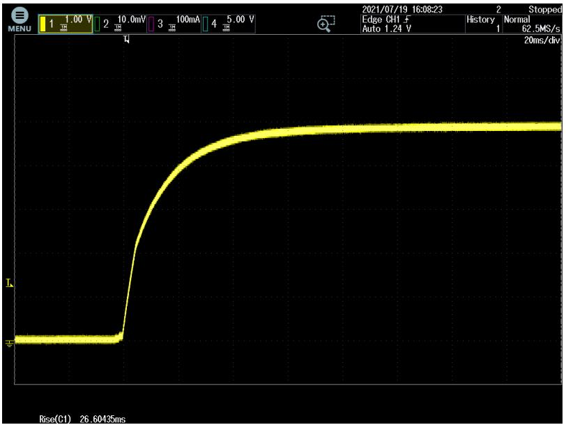

85 VAC  
  
Test Condition:  
➢ Full Load

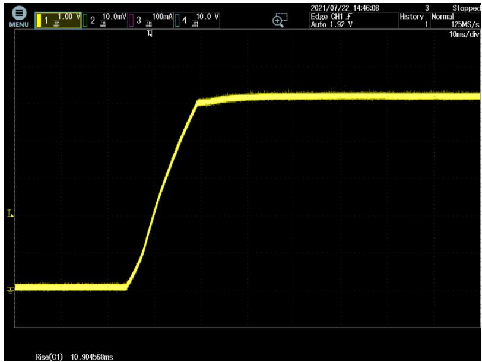

85 VAC  
  
Test Condition:  
➢ Full Load

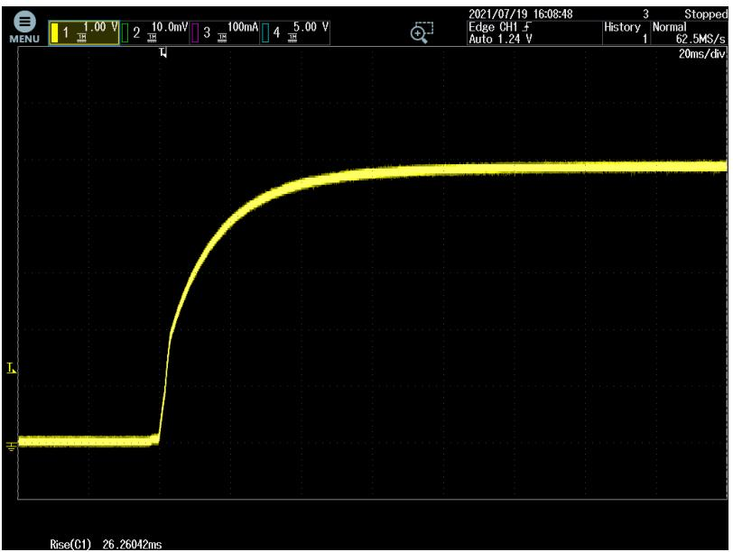

265 VAC  
  
Test Condition:  
➢ Full Load

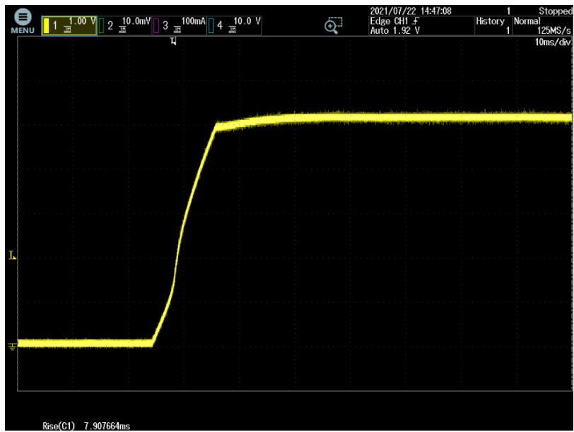

265 VAC  
  
Test Condition:  
➢ Full Load

## MOSFET

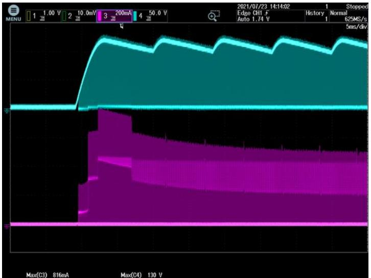

85 VAC

CH4 VDS  
CH3 IDS

$$
\begin{array}{l} \mathrm {V_ {DS\_MAX}} = 1 3 0 \mathrm{V} \\ \mathrm {I_ {DS\_MAX}} = 0. 8 1 6 \mathrm{A} \end{array}
$$

## Test Condition:

➢ Full Load

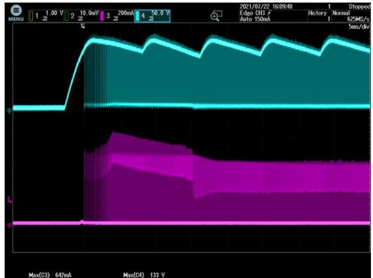

85 VAC

CH4 VDS  
CH3 IDS

$$
\begin{array}{l} \mathrm {V_ {DS\_MAX}} = 1 3 3 \mathrm{V} \\ \mathrm {I_ {DS\_MAX}} = 0. 6 4 2 \mathrm{A} \end{array}
$$

## Test Condition:

➢ Full Load

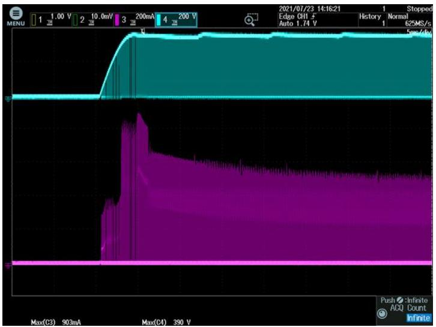

265 VAC

CH4 VDS  
CH3 IDS

$$
\begin{array}{l} V _ {D S \_ M A X} = 3 9 0 \mathrm{V} \\ I _ {D S \_ M A X} = 0. 9 0 3 \mathrm{A} \end{array}
$$

## Test Condition:

➢ Full Load

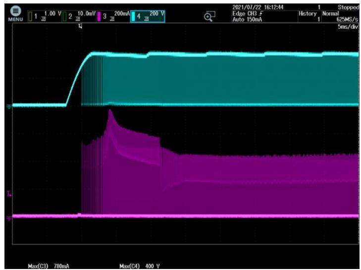

265 VAC

CH4 VDS  
CH3 IDS

$$
\begin{array}{l} V _ {D S \_ M A X} = 4 0 0 \mathrm{V} \\ I _ {D S \_ M A X} = 0. 7 8 \mathrm{A} \end{array}
$$

## Test Condition:

➢ Full Load

## BPA8505D

## KP3116SGA

注3：BPA8505D起机时CCM深度较深、开关速度比KP3116SGA快，所以导致开机时MOS的电流应力较大。

## MOSFET

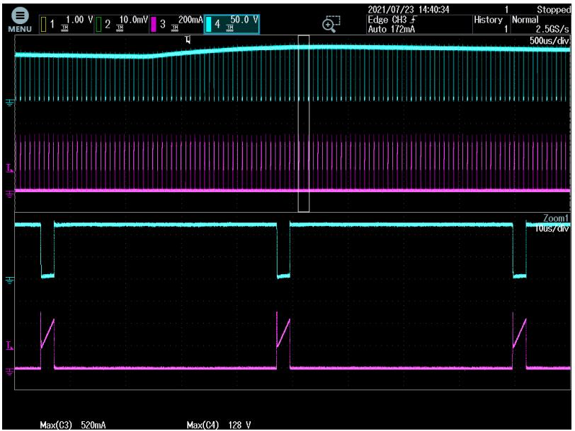

85 VAC

CH4 VDS  
CH3 IDS

$$
\begin{array}{l} V _ {D S \_ M A X} = 1 2 8 \mathrm{V} \\ I _ {D S \_ M A X} = 0. 5 2 0 \mathrm{A} \end{array}
$$

## Test Condition:

➢ Full Load

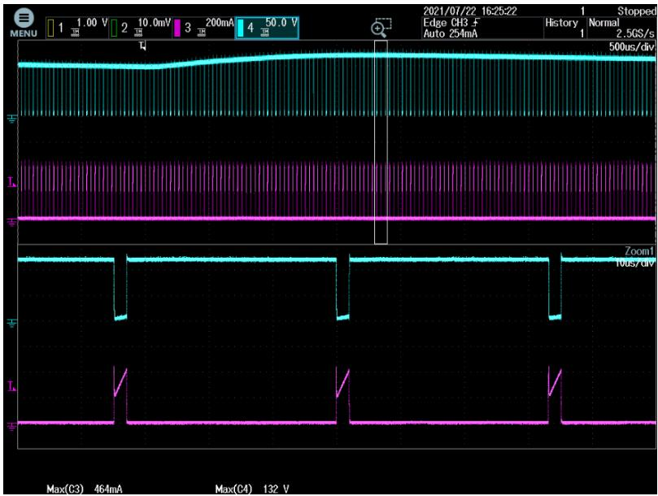

85 VAC

CH4 VDS  
CH3 IDS

$$
\begin{array}{l} V _ {D S \_ M A X} = 1 3 2 \mathrm{V} \\ I _ {D S \_ M A X} = 0. 4 6 4 \mathrm{A} \end{array}
$$

## Test Condition:

➢ Full Load

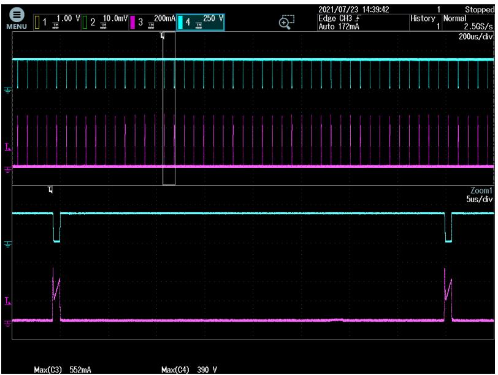

265 VAC

CH4 VDS  
CH3 IDS

$$
\begin{array}{l} \mathrm {V_ {DS\_MAX}} = 3 9 0 \mathrm{V} \\ \mathrm {I_ {DS\_MAX}} = 0. 5 5 2 \mathrm{A} \end{array}
$$

## Test Condition:

➢ Full Load

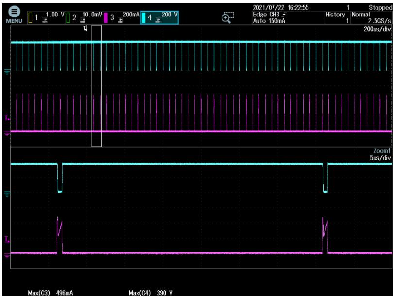

265 VAC

CH4 VDS  
CH3 IDS

$$
\begin{array}{l} V _ {D S \_ M A X} = 3 9 0 \mathrm{V} \\ I _ {D S \_ M A X} = 0. 4 9 6 \mathrm{A} \end{array}
$$

## Test Condition:

➢ Full Load

## 输出二极管开机波形

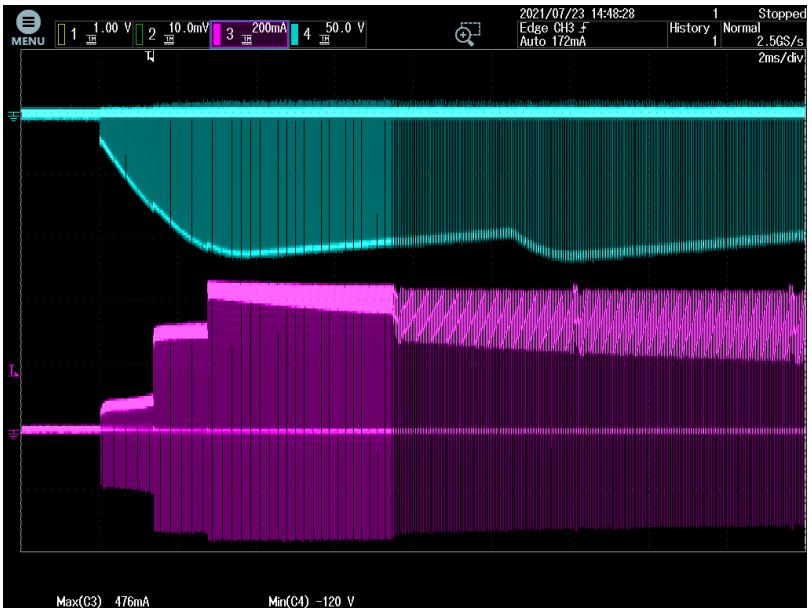

85 VAC

CH4 VR  
CH3 IF

$$
V _ {R \_ M A X} = 1 2 0 \mathrm{V}
$$

$$
I _ {F \_ M A X} = 0. 4 7 6 \mathrm{A}
$$

## Test Condition:

➢ Full Load

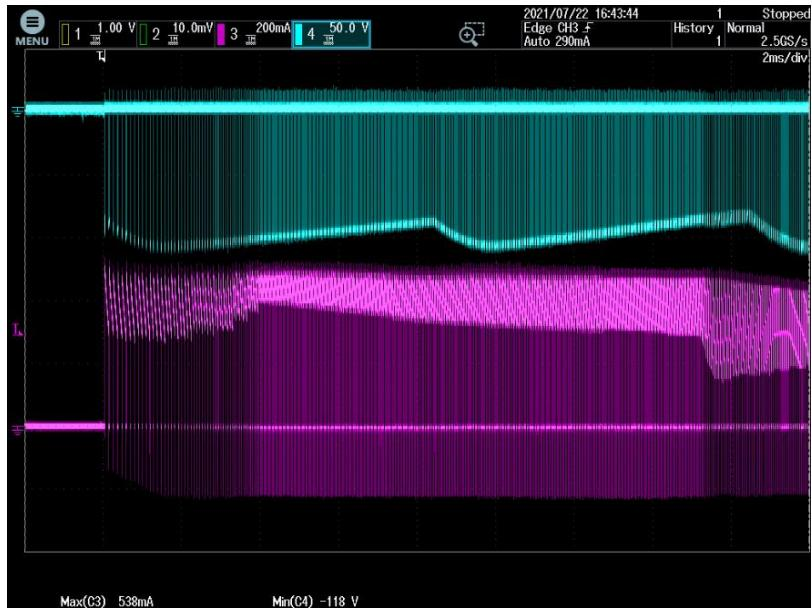

85 VAC

CH4 VR  
CH3 IF

$$
\begin{array}{l} V _ {R \_ M A X} = 1 1 8 \mathrm{V} \\ I _ {F \_ M A X} = 0. 5 3 8 \mathrm{A} \end{array}
$$

## Test Condition:

➢ Full Load

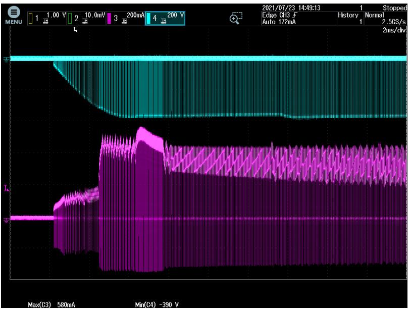

265 VAC

CH4 VR  
CH3 IF

$$
V _ {R \_ M A X} = 3 9 0 \mathrm{V}
$$

$$
I _ {F \_ M A X} = 0. 5 8 \mathrm{A}
$$

## Test Condition:

➢ Full Load

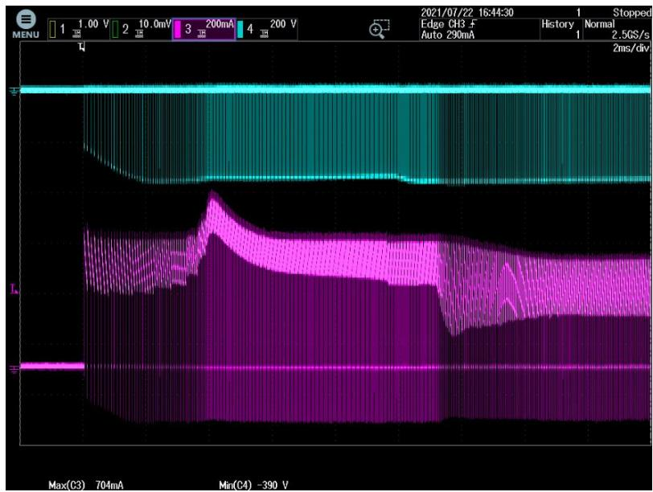

265 VAC

CH4 VR  
CH3 IF

$$
V _ {R \_ M A X} = 3 9 0 \mathrm{V}
$$

$$
I _ {F \_ M A X} = 0. 7 0 4 \mathrm{A}
$$

## Test Condition:

➢ Full Load

## 输出二极管稳态波形

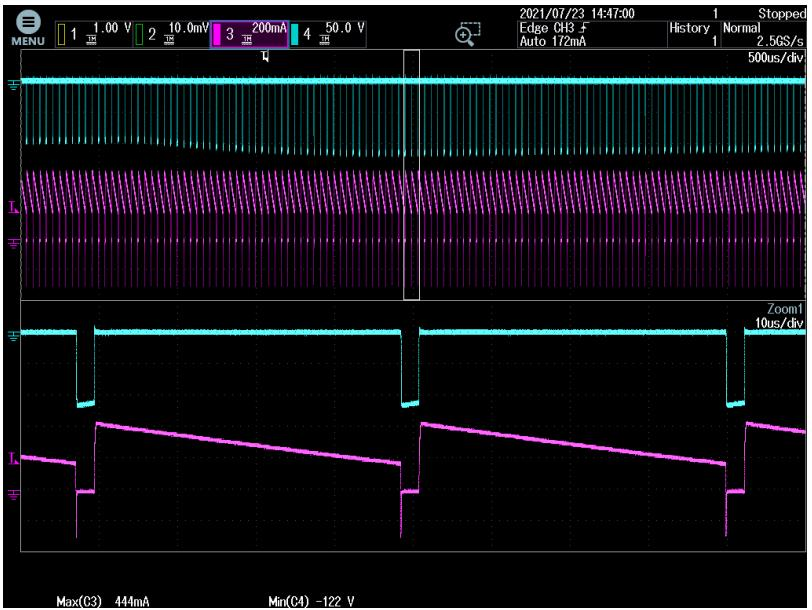

85 VAC

CH4 VR  
CH3 IF

$$
V _ {R \_ M A X} = 1 2 2 \mathrm{V}
$$

$$
I _ {F \_ M A X} = 0. 4 4 4 \mathrm{A}
$$

## Test Condition:

➢ Full Load

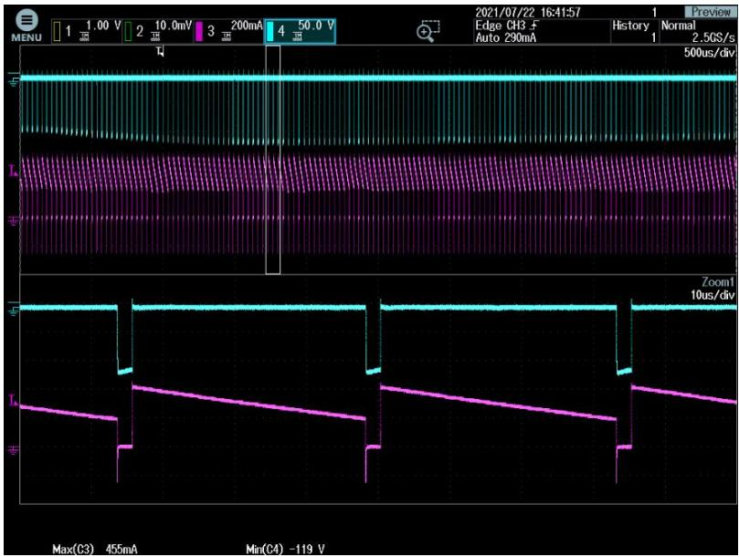

85 VAC

CH4 VR  
CH3 IF

$$
V _ {R \_ M A X} = 1 1 9 \mathrm{V}
$$

$$
I _ {F \_ M A X} = 0. 4 5 5 \mathrm{A}
$$

## Test Condition:

➢ Full Load

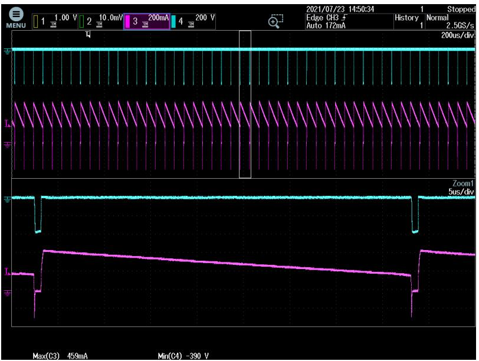

265 VAC

CH4 VR  
CH3 IF

$$
V _ {R \_ M A X} = 3 9 0 \mathrm{V}
$$

$$
I _ {F \_ M A X} = 0. 4 5 9 \mathrm{A}
$$

## Test Condition:

➢ Full Load

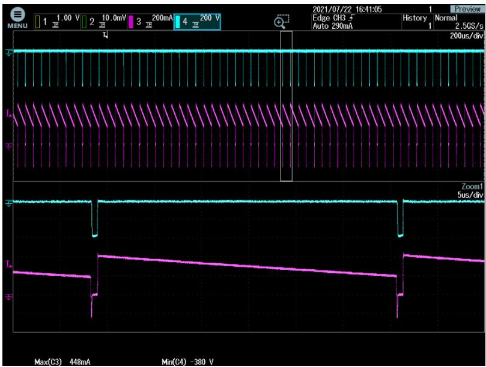

265 VAC

CH4 VR  
CH3 IF

$$
V _ {R \_ M A X} = 3 8 0 \mathrm{V}
$$

$$
I _ {F \_ M A X} = 0. 4 4 8 \mathrm{A}
$$

## Test Condition:

➢ Full Load

## MOSFET

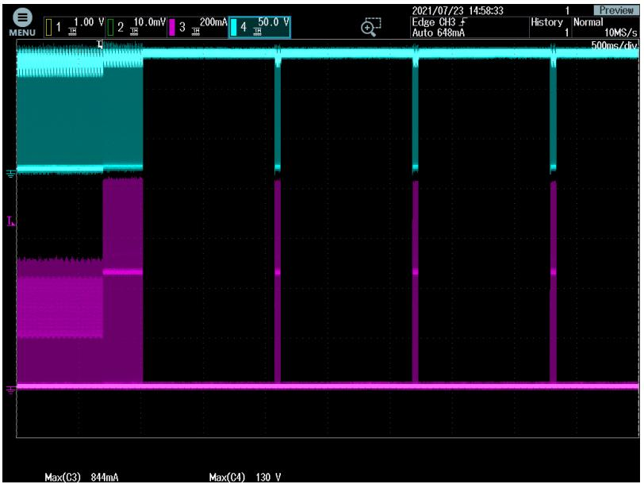

85 VAC

CH4 VDS  
CH3 IDS

$$
\begin{array}{l} \mathrm {V_ {DS\_MAX}} = 1 3 0 \mathrm{V} \\ \mathrm {I_ {DS\_MAX}} = 0. 8 4 \mathrm{A} \end{array}
$$

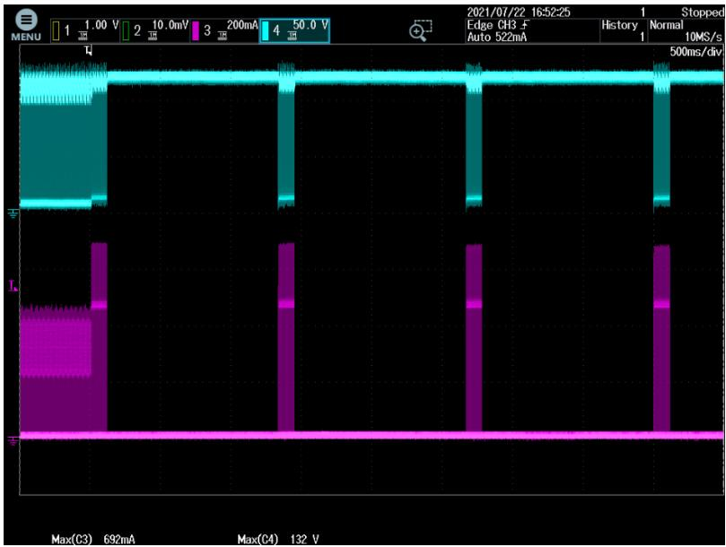

85 VAC

CH4 VDS  
CH3 IDS

$$
\begin{array}{l} \mathrm {V_ {DS\_MAX}} = 1 2 2 \mathrm{V} \\ \mathrm {I_ {DS\_MAX}} = 0. 6 9 2 \mathrm{A} \end{array}
$$

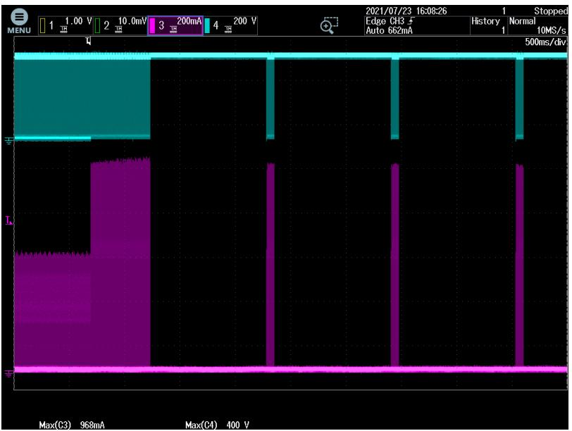

265 VAC

CH1 VDS  
CH3 IDS

$$
\begin{array}{l} \mathrm {V_ {DS\_MAX}} = 4 0 0 \mathrm{V} \\ \mathrm {I_ {DS\_MAX}} = 0. 9 6 8 \mathrm{A} \end{array}
$$

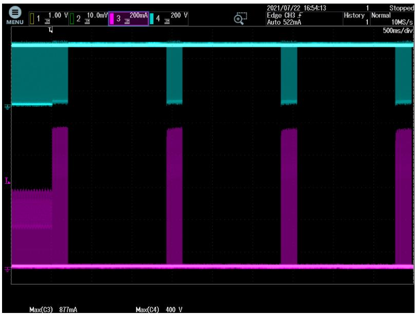

265 VAC

CH4 VDS

$$
\begin{array}{l} \mathrm {V_ {DS\_MAX}} = 4 0 0 \mathrm{V} \\ \mathrm {I_ {DS\_MAX}} = 0. 8 7 7 \mathrm{A} \end{array}
$$

## 温升测试

BPA8505D

<table><tr><td rowspan="2">项目</td><td>85VAC</td><td>115VAC</td><td>230VAC</td><td>265VAC</td></tr><tr><td>温度(°C)</td><td>温度(°C)</td><td>温度(°C)</td><td>温度(°C)</td></tr><tr><td>环境温度</td><td>50</td><td>50</td><td>50</td><td>50</td></tr><tr><td>BPA8505D (U1)</td><td>74.2</td><td>76.1</td><td>87.8</td><td>91.8</td></tr><tr><td>电感器绕组(L2)</td><td>73.8</td><td>74.6</td><td>77.9</td><td>78.9</td></tr><tr><td>电感器磁芯(L2)</td><td>66.2</td><td>67.2</td><td>68.9</td><td>69.3</td></tr><tr><td>整流二极管(D3)</td><td>76.1</td><td>77.4</td><td>83.9</td><td>86.1</td></tr><tr><td>整流桥(D1)</td><td>54.6</td><td>54.2</td><td>54.2</td><td>54.3</td></tr><tr><td>输入电解电容(C6)</td><td>59.7</td><td>59.9</td><td>61.9</td><td>62.7</td></tr><tr><td>输出电解电容(C3)</td><td>58.5</td><td>58.8</td><td>60.3</td><td>60.7</td></tr></table>

KP3116SGA

<table><tr><td rowspan="2">项目</td><td>85VAC</td><td>115VAC</td><td>230VAC</td><td>265VAC</td></tr><tr><td>温度(°C)</td><td>温度(°C)</td><td>温度(°C)</td><td>温度(°C)</td></tr><tr><td>环境温度</td><td>50</td><td>50</td><td>50</td><td>50</td></tr><tr><td>KP3116SGA (U1)</td><td>77.2</td><td>78.4</td><td>91.6</td><td>96.7</td></tr><tr><td>电感器绕组(L2)</td><td>70.4</td><td>70.8</td><td>74.1</td><td>75.3</td></tr><tr><td>电感器磁芯(L2)</td><td>65.1</td><td>65.5</td><td>67.7</td><td>69.2</td></tr><tr><td>整流二极管(D3)</td><td>75.9</td><td>76.9</td><td>84.1</td><td>86.6</td></tr><tr><td>整流桥(D1)</td><td>54.3</td><td>53.7</td><td>53.8</td><td>53.9</td></tr><tr><td>输入电解电容(C6)</td><td>57.6</td><td>56.5</td><td>59.2</td><td>59.9</td></tr><tr><td>输出电解电容(C3)</td><td>52.9</td><td>52.8</td><td>53.5</td><td>53.8</td></tr></table>

备注：增大芯片Source散热铜箔面积可以降低芯片温度

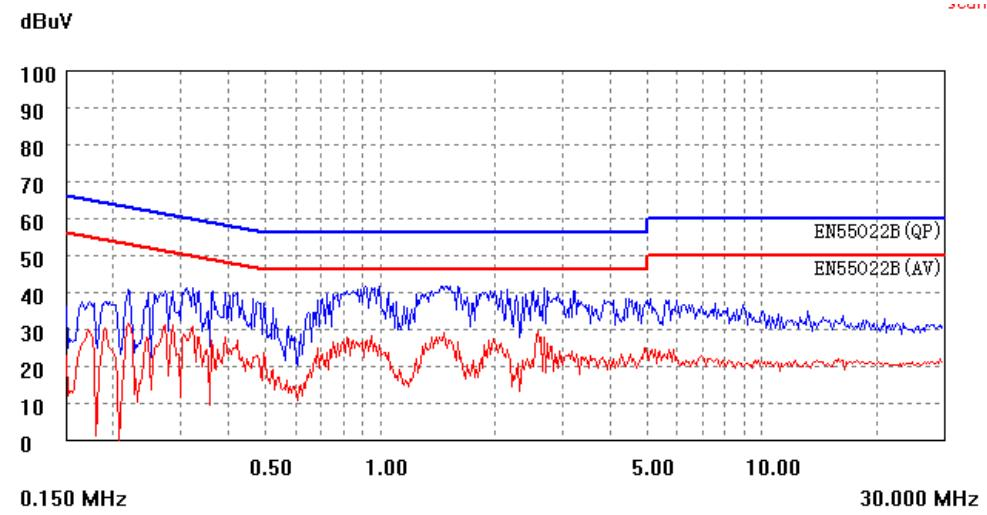

115Vac Line

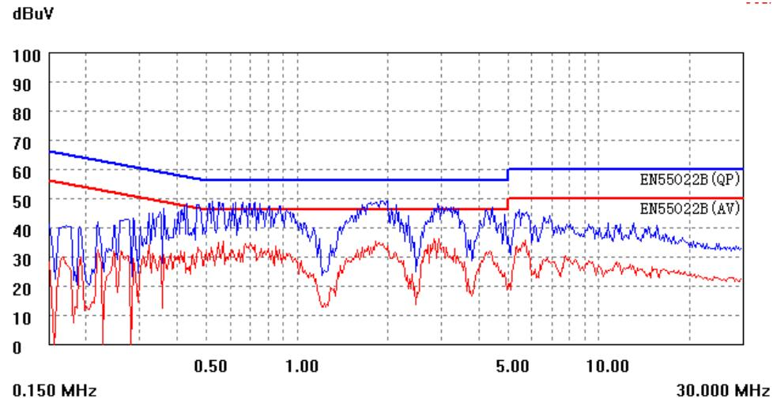

230Vac Line

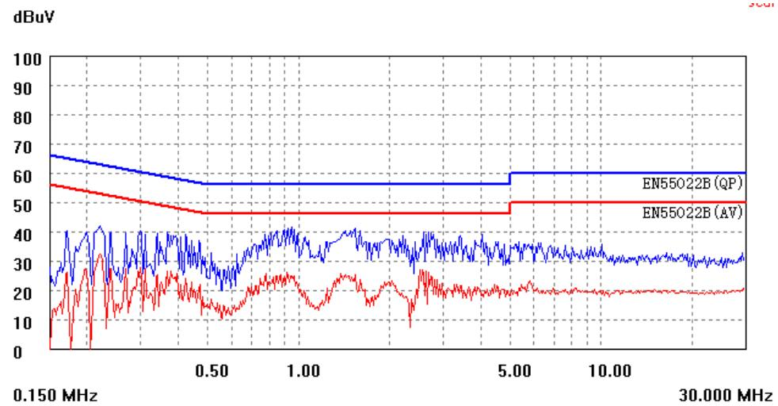

115Vac Neutral

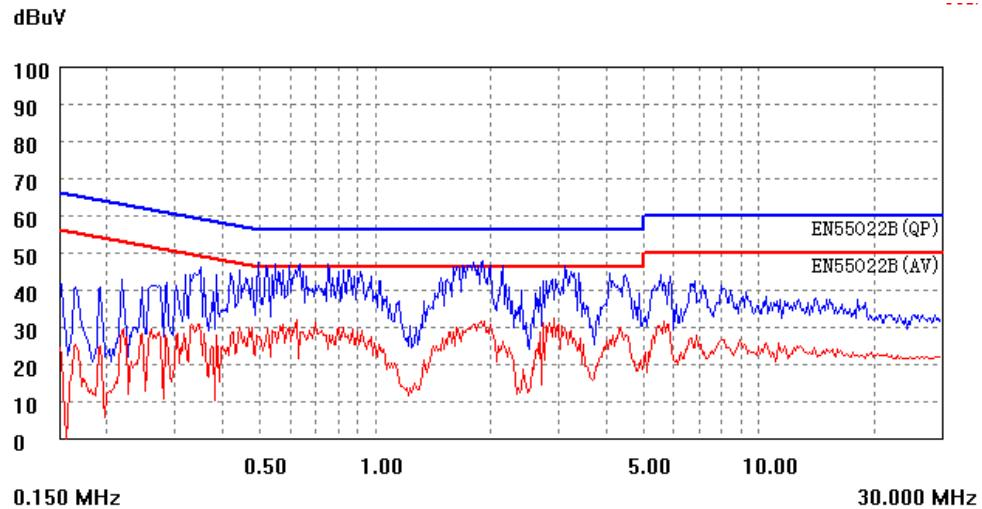

230Vac Neutral

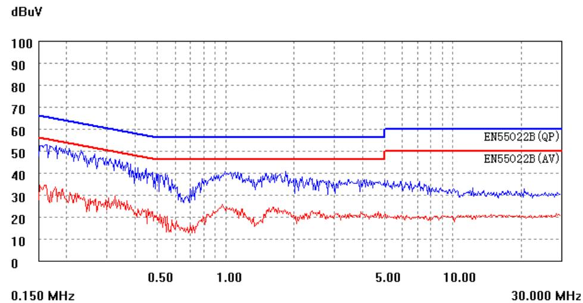

115Vac Line

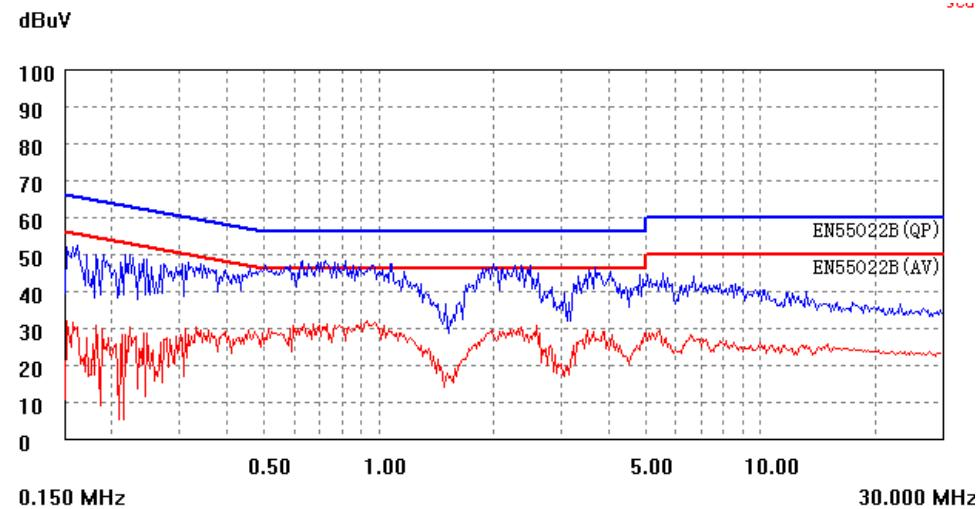

230Vac Line

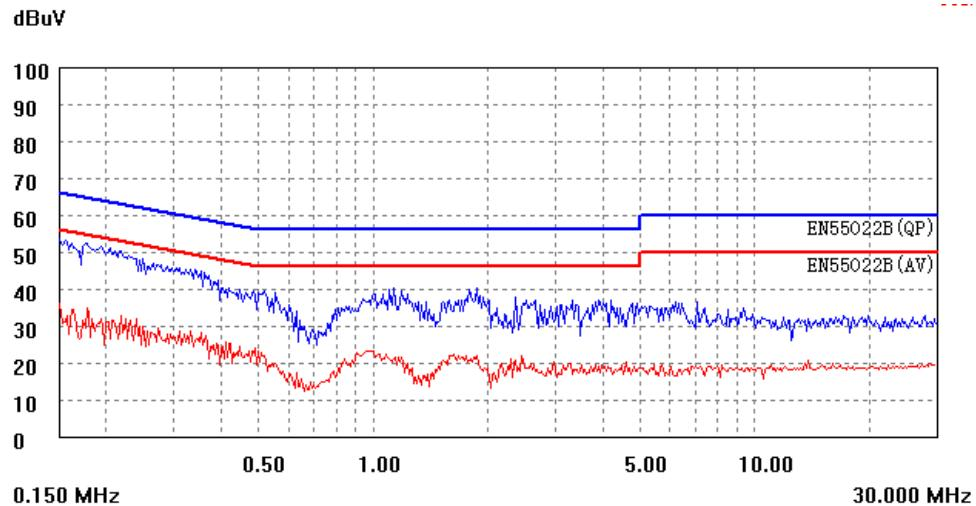

115Vac Neutral

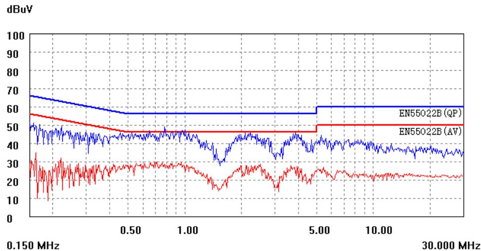

230Vac Neutral

BPA8505D

<table><tr><td>差模</td><td>电压</td><td>相位角</td><td>发生器阻抗</td><td>测试次数</td><td>测试结果</td></tr><tr><td>L to N</td><td>+1.5kV</td><td>0/90/180/270</td><td>2</td><td>10</td><td>Pass</td></tr><tr><td>L to N</td><td>-1.5kV</td><td>0/90/180/270</td><td>2</td><td>10</td><td>Pass</td></tr><tr><td>L to N</td><td>+2kV</td><td>0/90/180/270</td><td>2</td><td>10</td><td>Pass</td></tr><tr><td>L to N</td><td>-2kV</td><td>0/90/180/270</td><td>2</td><td>10</td><td>Pass</td></tr></table>

KP3116SGA

<table><tr><td>差模</td><td>电压</td><td>相位角</td><td>发生器阻抗</td><td>测试次数</td><td>测试结果</td></tr><tr><td>L to N</td><td>+1.5kV</td><td>0/90/180/270</td><td>2</td><td>10</td><td>Pass</td></tr><tr><td>L to N</td><td>-1.5kV</td><td>0/90/180/270</td><td>2</td><td>10</td><td>Pass</td></tr><tr><td>L to N</td><td>+2kV</td><td>0/90/180/270</td><td>2</td><td>10</td><td>Pass</td></tr><tr><td>L to N</td><td>-2kV</td><td>0/90/180/270</td><td>2</td><td>10</td><td>Pass</td></tr></table>

1PCS 561

## EFT

BPA8505D

<table><tr><td>差模</td><td>电压</td><td>脉冲群持续时间</td><td>脉冲频率</td><td>测试时间</td><td>测试结果</td></tr><tr><td>L to N</td><td>+4kV</td><td>15ms</td><td>5kHz</td><td>120s</td><td>Pass</td></tr><tr><td>L to N</td><td>-4kV</td><td>15ms</td><td>5kHz</td><td>120s</td><td>Pass</td></tr><tr><td>L to N</td><td>+4kV</td><td>0.75ms</td><td>100kHz</td><td>120s</td><td>Pass</td></tr><tr><td>L to N</td><td>-4kV</td><td>0.75ms</td><td>100kHz</td><td>120s</td><td>Pass</td></tr><tr><td>L to N</td><td>+2kV</td><td>2ms</td><td>38kHz</td><td>120s</td><td>Pass</td></tr><tr><td>L to N</td><td>-2kV</td><td>2ms</td><td>38kHz</td><td>120s</td><td>Pass</td></tr><tr><td>L to N</td><td>+4kV</td><td>2ms</td><td>38kHz</td><td>120s</td><td>Pass</td></tr><tr><td>L to N</td><td>-4kV</td><td>2ms</td><td>38kHz</td><td>120s</td><td>Pass</td></tr></table>

KP3116SGA

<table><tr><td>差模</td><td>电压</td><td>脉冲群持续时间</td><td>脉冲频率</td><td>测试时间</td><td>测试结果</td></tr><tr><td>L to N</td><td>+4kV</td><td>15ms</td><td>5kHz</td><td>120s</td><td>Pass</td></tr><tr><td>L to N</td><td>-4kV</td><td>15ms</td><td>5kHz</td><td>120s</td><td>Pass</td></tr><tr><td>L to N</td><td>+4kV</td><td>0.75ms</td><td>100kHz</td><td>120s</td><td>Pass</td></tr><tr><td>L to N</td><td>-4kV</td><td>0.75ms</td><td>100kHz</td><td>120s</td><td>Pass</td></tr><tr><td>L to N</td><td>+2kV</td><td>2ms</td><td>38kHz</td><td>120s</td><td>Pass</td></tr><tr><td>L to N</td><td>-2kV</td><td>2ms</td><td>38kHz</td><td>120s</td><td>Pass</td></tr><tr><td>L to N</td><td>+4kV</td><td>2ms</td><td>38kHz</td><td>120s</td><td>Pass</td></tr><tr><td>L to N</td><td>-4kV</td><td>2ms</td><td>38kHz</td><td>120s</td><td>Pass</td></tr></table>

BPA8505D

<table><tr><td>测试点</td><td>电压(V)</td><td>放电类型</td><td>放电次数</td><td>测试结果</td></tr><tr><td>Vo</td><td>+8kV</td><td>接触放电</td><td>10</td><td>Pass</td></tr><tr><td>Vo</td><td>-8kV</td><td>接触放电</td><td>10</td><td>Pass</td></tr><tr><td>GND</td><td>+8kV</td><td>接触放电</td><td>10</td><td>Pass</td></tr><tr><td>GND</td><td>-8kV</td><td>接触放电</td><td>10</td><td>Pass</td></tr><tr><td>Vo</td><td>+15kV</td><td>空气放电</td><td>10</td><td>Pass</td></tr><tr><td>Vo</td><td>-15kV</td><td>空气放电</td><td>10</td><td>Pass</td></tr><tr><td>GND</td><td>+15kV</td><td>空气放电</td><td>10</td><td>Pass</td></tr><tr><td>GND</td><td>-15kV</td><td>空气放电</td><td>10</td><td>Pass</td></tr></table>

KP3116SGA

<table><tr><td>测试点</td><td>电压(V)</td><td>放电类型</td><td>放电次数</td><td>测试结果</td></tr><tr><td>Vo</td><td>+8kV</td><td>接触放电</td><td>10</td><td>Pass</td></tr><tr><td>Vo</td><td>-8kV</td><td>接触放电</td><td>10</td><td>Pass</td></tr><tr><td>GND</td><td>+8kV</td><td>接触放电</td><td>10</td><td>Pass</td></tr><tr><td>GND</td><td>-8kV</td><td>接触放电</td><td>10</td><td>Pass</td></tr><tr><td>Vo</td><td>+15kV</td><td>空气放电</td><td>10</td><td>Pass</td></tr><tr><td>Vo</td><td>-15kV</td><td>空气放电</td><td>10</td><td>Pass</td></tr><tr><td>GND</td><td>+15kV</td><td>空气放电</td><td>10</td><td>Pass</td></tr><tr><td>GND</td><td>-15kV</td><td>空气放电</td><td>10</td><td>Pass</td></tr></table>

## THANK YOU FOR WATCHING
