## BPA8505D&LNK305DG对比测试

## (15V/0.25A@85\~265Vac)

上海晶丰明源半导体股份有限公司

Shanghai Bright Power Semiconductor Co., Ltd.

YSM

时间：2021年4月

## 电气参数对比

<table><tr><td></td><td>BPA8505D</td><td>LNK305DG</td></tr><tr><td>最高开关频率</td><td>45KHz</td><td>66KHz</td></tr><tr><td>Mosfet BV</td><td>650V</td><td>700V</td></tr><tr><td> $R_{DS\_ON}$ </td><td>8.5Ω</td><td>12Ω</td></tr><tr><td>限流点</td><td>440mA</td><td>375mA</td></tr><tr><td>软启动</td><td>有</td><td>无</td></tr><tr><td>输出过压保护</td><td>自动重启</td><td>无</td></tr><tr><td>过载保护</td><td>有</td><td>有</td></tr><tr><td>封装</td><td>SOP-7</td><td>SO-8C</td></tr></table>

## 测试数据对比

电源规格：85\~265Vac输入，15V/0.25A输出

<table><tr><td colspan="2"></td><td>BPA8505D</td><td>LNK305DG</td><td></td></tr><tr><td colspan="2">待机功耗</td><td>97mW</td><td>230mW</td><td>230Vac输入</td></tr><tr><td rowspan="2">满载效率</td><td>115Vac</td><td>81.7%</td><td>77.1%</td><td></td></tr><tr><td>230Vac</td><td>81.4%</td><td>74.2%</td><td></td></tr><tr><td rowspan="2">输出电压纹波</td><td>85Vac</td><td>60.6mV</td><td>65.7mV</td><td></td></tr><tr><td>265Vac</td><td>93mV</td><td>102mV</td><td></td></tr><tr><td rowspan="2">动态负载性能</td><td>50%-100%</td><td> $202mV_{PK\_PK}$ </td><td> $195mV_{PK\_PK}$ </td><td rowspan="2">265Vac输入</td></tr><tr><td>10%-90%</td><td> $315mV_{PK\_PK}$ </td><td> $292mV_{PK\_PK}$ </td></tr><tr><td rowspan="2">MOSFET应力</td><td> $V_{DS}$ </td><td>390V</td><td>400V</td><td rowspan="2">265Vac输入</td></tr><tr><td> $I_{DS}$ </td><td>0.93A</td><td>0.96A</td></tr><tr><td rowspan="2">续流二极管应力</td><td>VRR</td><td>380V</td><td>390V</td><td></td></tr><tr><td> $I_{PK}$ </td><td>0.58A</td><td>0.79A</td><td></td></tr><tr><td colspan="2">温升测试(环温50°C)</td><td>89.5°C</td><td>108.2°C</td><td>265Vac输入</td></tr><tr><td colspan="2">传导EMI</td><td>6dB裕量</td><td>5dB裕量</td><td></td></tr><tr><td colspan="2">Surge</td><td>Pass</td><td>Pass</td><td>差模2kV</td></tr><tr><td colspan="2">EFT群脉冲</td><td>Pass</td><td>Pass</td><td>4kV,5kHz/38kHz/100kHz</td></tr><tr><td colspan="2">ESD</td><td>Pass</td><td>Pass</td><td>18kV空气放电</td></tr></table>

## 电路及实物图

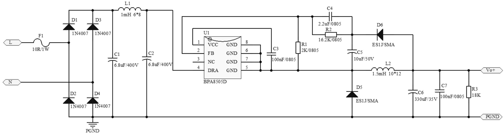

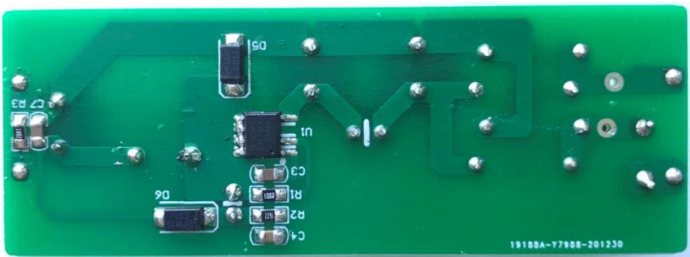

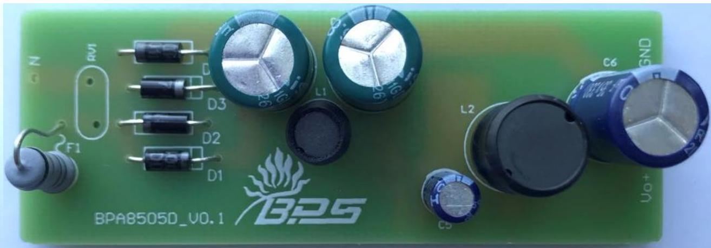

空载功耗  
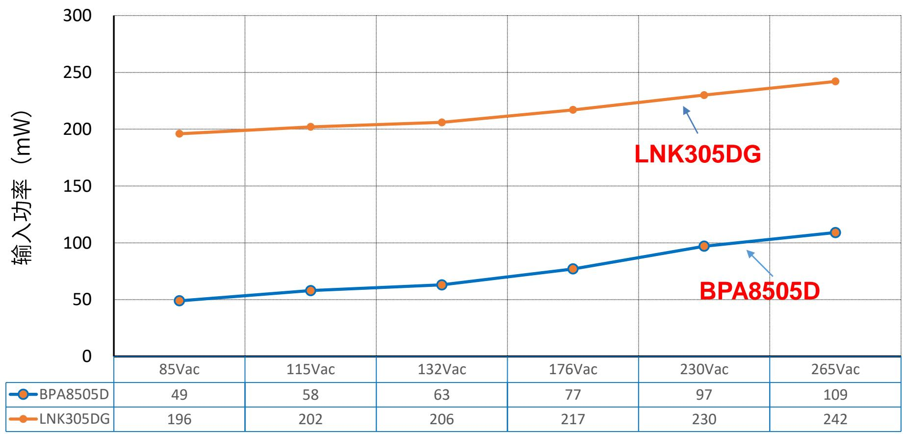

输入电压 (Vac)  
测试条件：BPA8505D $\mathsf { R } _ { \mathrm { d u m m y } } = 1 8 \mathsf { K o h m }$ ，LNK305DG Rdummy=1.8Kohm

效率测试  
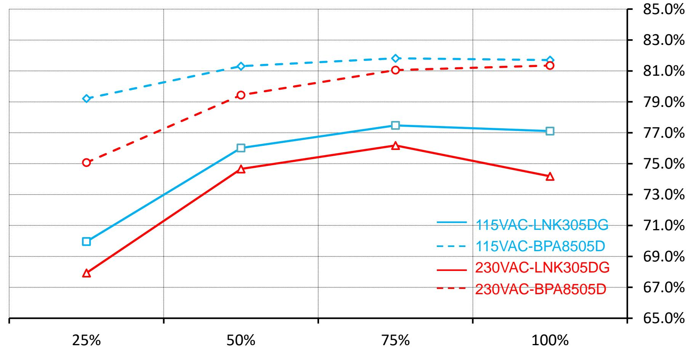

负载

## 输出电压调整率

BPA8505D

<table><tr><td> $V_{IN}(VAC)$ Load(%)</td><td>85</td><td>115</td><td>132</td><td>176</td><td>230</td><td>265</td><td>平均值</td><td>线调整率</td></tr><tr><td>0</td><td>15.51</td><td>15.50</td><td>15.51</td><td>15.50</td><td>15.51</td><td>15.51</td><td>15.51</td><td>0.06%</td></tr><tr><td>20%</td><td>14.99</td><td>14.99</td><td>14.98</td><td>14.98</td><td>14.98</td><td>14.98</td><td>14.98</td><td>0.05%</td></tr><tr><td>40%</td><td>14.98</td><td>14.98</td><td>14.98</td><td>14.98</td><td>14.97</td><td>14.97</td><td>14.98</td><td>0.07%</td></tr><tr><td>60%</td><td>14.99</td><td>15.00</td><td>15.00</td><td>15.00</td><td>15.00</td><td>14.99</td><td>15.00</td><td>0.07%</td></tr><tr><td>80%</td><td>15.02</td><td>15.02</td><td>15.03</td><td>15.02</td><td>15.02</td><td>15.01</td><td>15.02</td><td>0.08%</td></tr><tr><td>100%</td><td>15.04</td><td>15.04</td><td>15.04</td><td>15.04</td><td>15.04</td><td>15.04</td><td>15.04</td><td>0.03%</td></tr><tr><td>平均值</td><td>15.09</td><td>15.09</td><td>15.09</td><td>15.09</td><td>15.09</td><td>15.08</td><td rowspan="2" colspan="2"></td></tr><tr><td>负载调整率</td><td>3.48%</td><td>3.45%</td><td>3.47%</td><td>3.47%</td><td>3.55%</td><td>3.58%</td></tr></table>

◼ 计算方法：调整率=100%\*(最大值-最小值)/平均值  
测试条件：BPA8505D $\mathsf { R } _ { \mathrm { d u m m y } } = 1 8 \mathsf { K o h m }$ ，LNK305DG $\mathsf { R } _ { \mathrm { d u m m y } } { = } 1 . 8 mathsf { K o h m }$

LNK305DG

<table><tr><td> $V_{IN}(VAC)$ Load(%)</td><td>85</td><td>115</td><td>132</td><td>176</td><td>230</td><td>265</td><td>平均值</td><td>线调整率</td></tr><tr><td>0</td><td>15.67</td><td>15.66</td><td>15.66</td><td>15.66</td><td>15.67</td><td>15.68</td><td>15.66</td><td>0.17%</td></tr><tr><td>20%</td><td>15.18</td><td>15.17</td><td>15.17</td><td>15.17</td><td>15.17</td><td>15.17</td><td>15.17</td><td>0.04%</td></tr><tr><td>40%</td><td>15.12</td><td>15.12</td><td>15.11</td><td>15.11</td><td>15.11</td><td>15.12</td><td>15.11</td><td>0.07%</td></tr><tr><td>60%</td><td>15.09</td><td>15.08</td><td>15.08</td><td>15.08</td><td>15.08</td><td>15.09</td><td>15.08</td><td>0.05%</td></tr><tr><td>80%</td><td>15.07</td><td>15.07</td><td>15.07</td><td>15.07</td><td>15.07</td><td>15.07</td><td>15.07</td><td>0.03%</td></tr><tr><td>100%</td><td>15.04</td><td>15.04</td><td>15.05</td><td>15.05</td><td>15.04</td><td>15.05</td><td>15.04</td><td>0.03%</td></tr><tr><td>平均值</td><td>15.19</td><td>15.19</td><td>15.19</td><td>15.19</td><td>15.19</td><td>15.19</td><td rowspan="2" colspan="2"></td></tr><tr><td>负载调整率</td><td>4.14%</td><td>4.07%</td><td>4.02%</td><td>4.02%</td><td>4.11%</td><td>4.19%</td></tr></table>

## 输出电压纹波

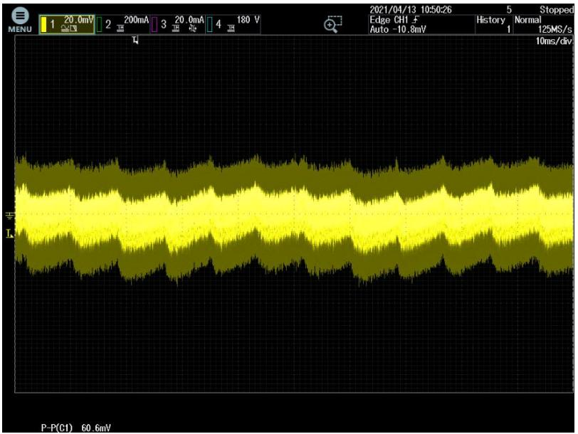

85 VAC  
  
Test Condition:  
➢ Full Load

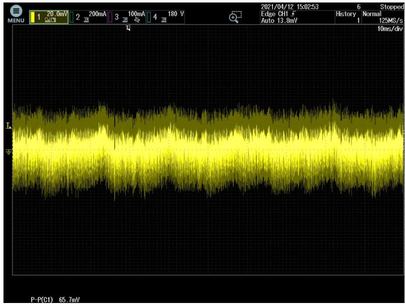

85 VAC  
  
Test Condition:  
➢ Full Load

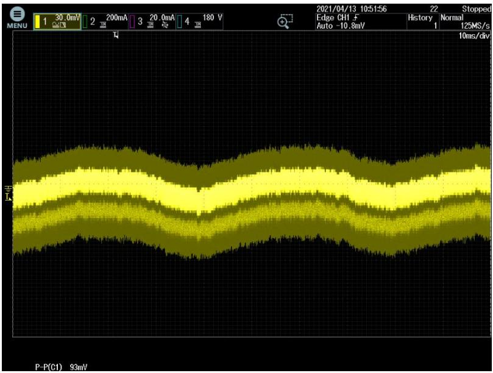

265 VAC  
  
Test Condition:  
➢ Full Load

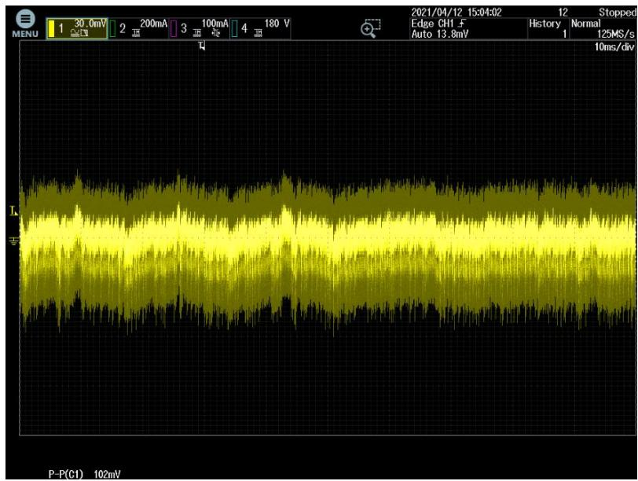

265 VAC  
  
Test Condition:  
➢ Full Load

## (50%-100%)

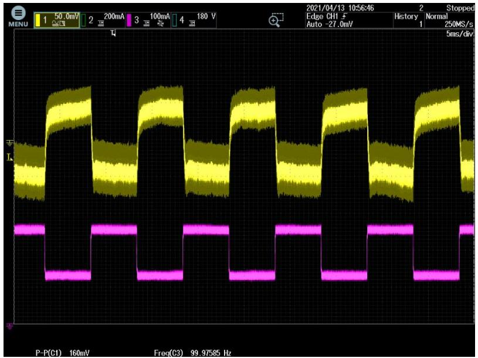

85 VAC

CH1 VOUT  
CH3 IOUT

$$
V _ {P K - P K} = 1 6 0 \mathrm{mV}
$$

## Test Condition:

➢ 0.125 A-0.25 A-0.125 A  
➢ Slew Rate: 0.5 A/μS  
➢ Frequency: 100 Hz

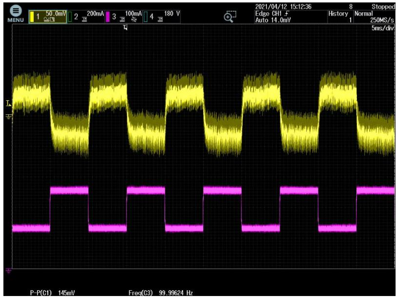

85 VAC

CH1 VOUT  
CH3 IOUT

$$
V _ {P K - P K} = 1 4 3 \mathrm{mV}
$$

## Test Condition:

➢ 0.125A-0.25 A-0.125 A  
➢ Slew Rate: 0.5 A/μS  
➢ Frequency: 100 Hz

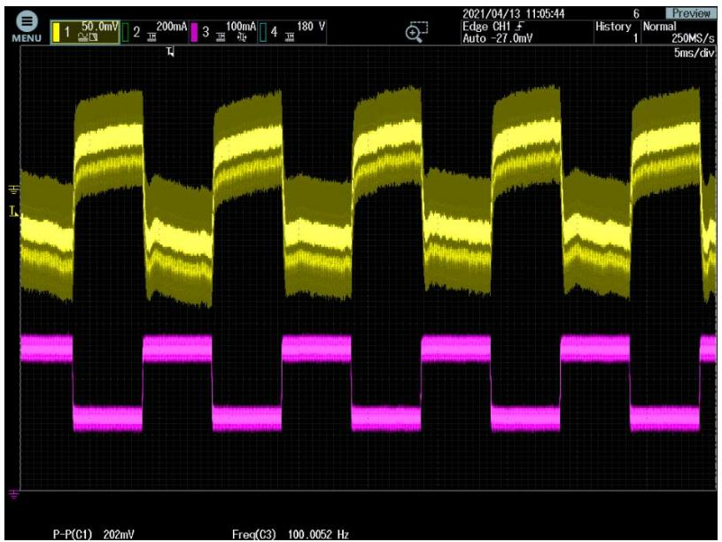

265 VAC

CH1 VOUT  
CH3 IOUT

$$
V _ {P K - P K} = 2 0 2 \mathrm{mV}
$$

## Test Condition:

➢ 0.125 A-0.25 A-0.125 A  
➢ Slew Rate: 0.5 A/μS  
➢ Frequency: 100 Hz

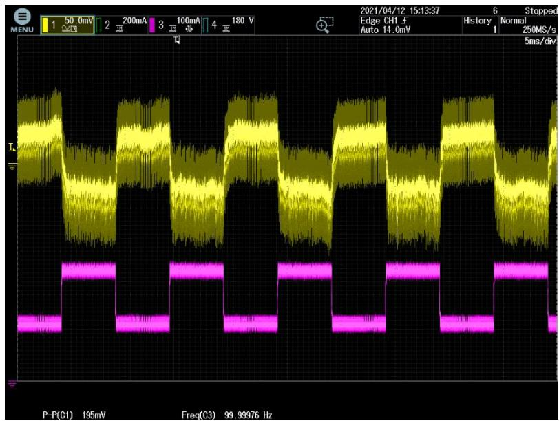

265 VAC

CH1 VOUT  
CH3 IOUT

$$
V _ {P K - P K} = 1 9 5 \mathrm{mV}
$$

## Test Condition:

➢ 0.125A-0.25 A-0.125 A  
➢ Slew Rate: 0.5 A/μS  
➢ Frequency: 100 Hz

## (10%-90%)

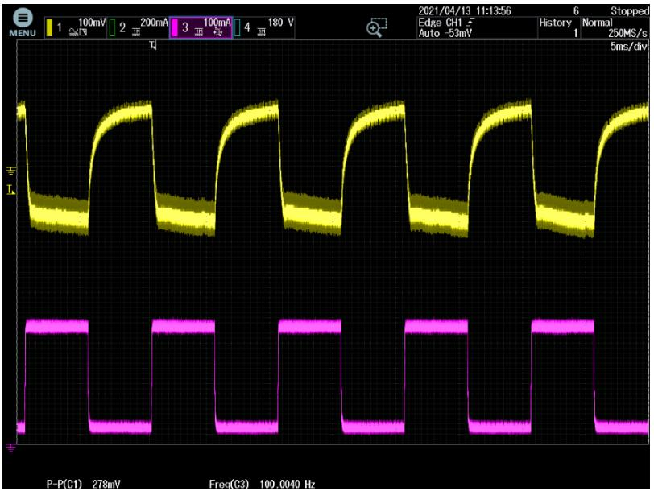

85 VAC

CH1 VOUT $\mathsf { C H 1 } \mathsf { V } _ { \mathsf { O U T } }$ $V _ { P K - P K } = 2 7 8 m v$  
$\mathsf { C H 3 } \mathsf { I _ { 0 \mathsf { U } \mathsf { T } } }$

## Test Condition:

➢ 0.025A-0.225 A-0.025 A  
➢ Slew Rate: 0.5 A/μS  
➢ Frequency: 100 Hz

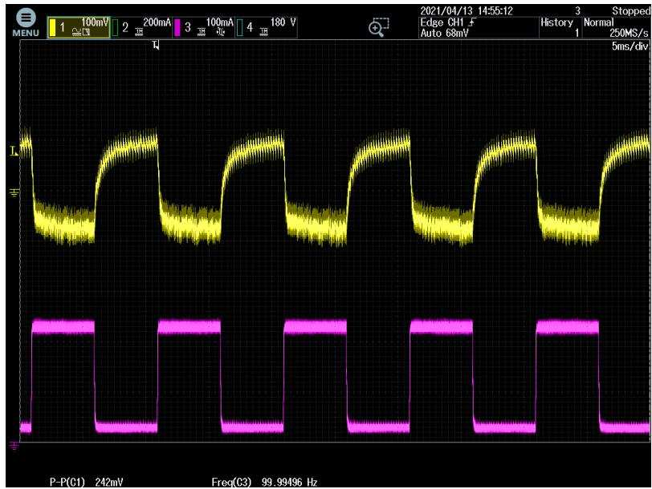

85 VAC

${ \mathsf { C H 1 } } { \mathsf { V } } _ { \mathsf { O U T } }$ $V _ { P K - P K } = 2 4 2 m v$  
$\mathsf { C H 3 } \mathsf { I _ { 0 \mathsf { U T } } }$

## Test Condition:

➢ 0.025A-0.225 A-0.025 A  
➢ Slew Rate: 0.5 A/μS  
➢ Frequency: 100 Hz

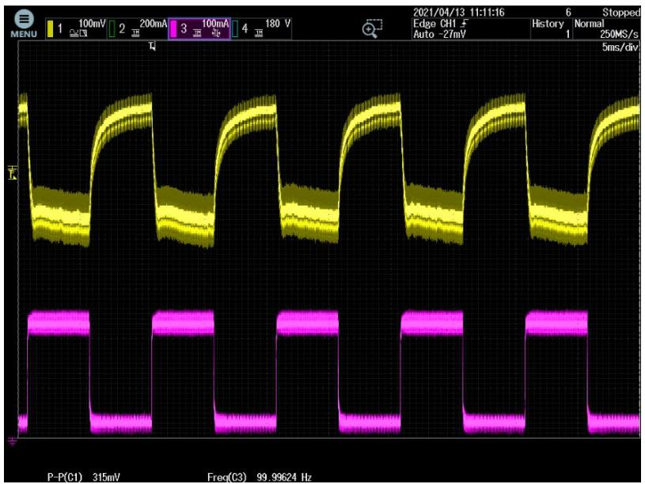

265 VAC

$\mathsf { C H 1 } \mathsf { V } _ { \mathsf { O U T } }$ CH1 V $V _ { \mathsf { P K - P K } } { = } 3 1 5 ~ \mathsf { m V }$  
$\mathsf { C H 3 } \mathsf { I _ { 0 \mathsf { U } \mathsf { T } } }$

## Test Condition:

➢ $0 . 0 2 5 \mathsf { A } \mathsf { - } 0 . 2 2 5 \mathsf { A } \mathsf { - } 0 . 0 2 5 \mathsf { A }$  
➢ Slew Rate: 0.5 A/μS  
➢ Frequency: 100 Hz

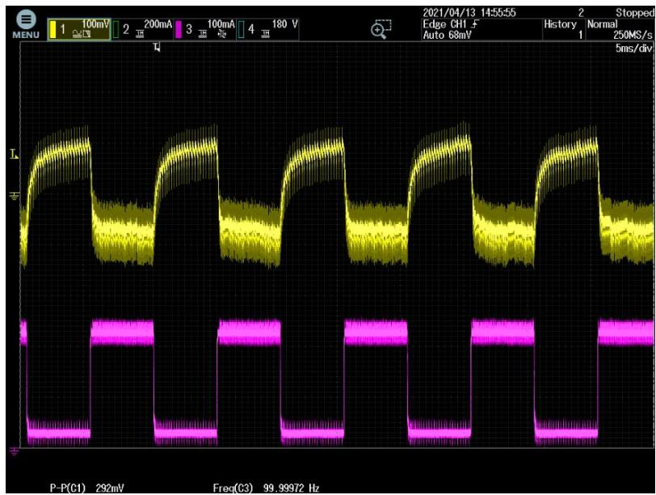

265 VAC

${ \mathsf { C H 1 } } { \mathsf { V } } _ { \mathsf { O U T } }$ $V _ { P K - P K } = 2 9 2 m v$  
$\mathsf { C H 3 } \mathsf { I _ { 0 \mathsf { U T } } }$

## Test Condition:

➢ 0.025A-0.225 A-0.025 A  
➢ Slew Rate: 0.5 A/μS  
➢ Frequency: 100 Hz

## 输出电压开机波形

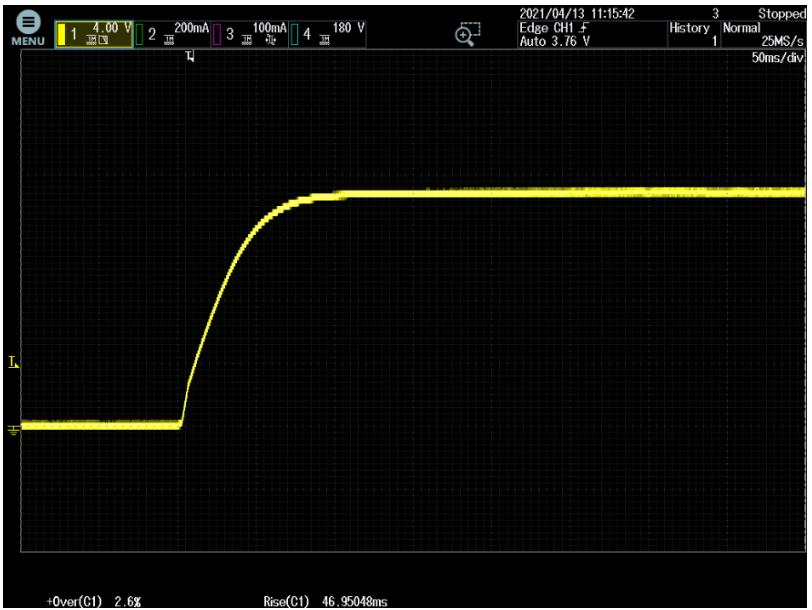

85 VAC  
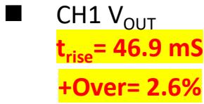

Test Condition:  
➢ Full Load

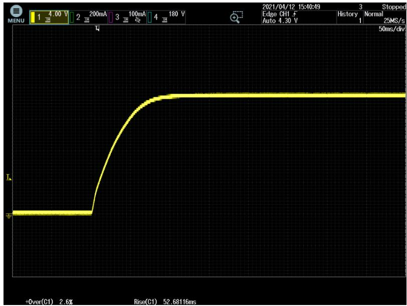

85 VAC  
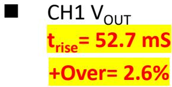

Test Condition:  
➢ Full Load

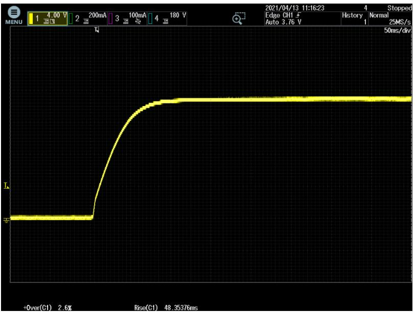

265 VAC  
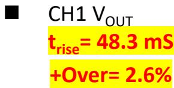

Test Condition:  
➢ Full Load

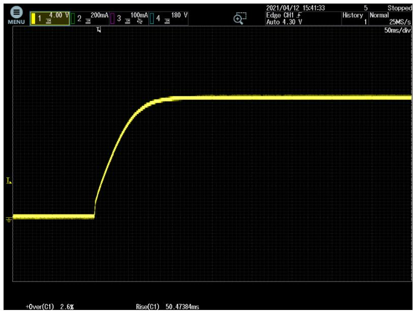

265 VAC  
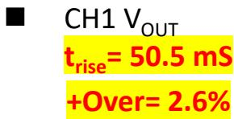

Test Condition:  
➢ Full Load

## MOSFET

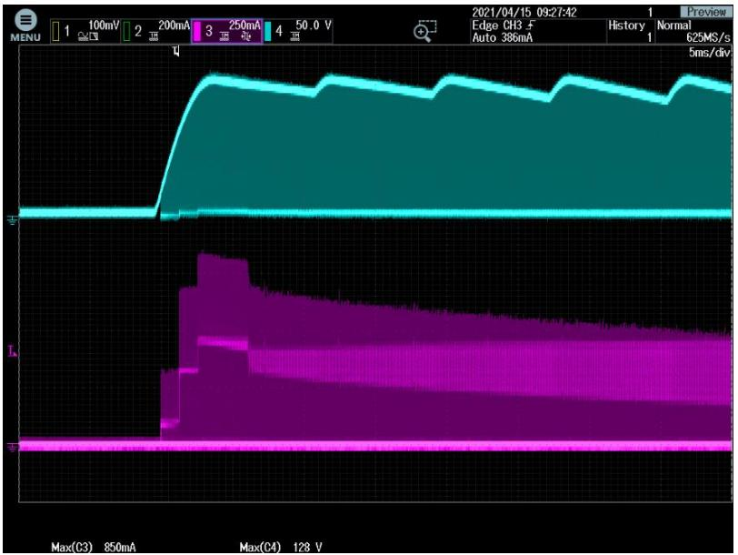

85 VAC

CH4 VDS  
CH3 IDS

$$
V _ {D S \_ M A X} = 1 2 8 V
$$

$$
I _ {D S \_ M A X} = 0. 8 5 \mathrm{A}
$$

## Test Condition:

➢ Full Load

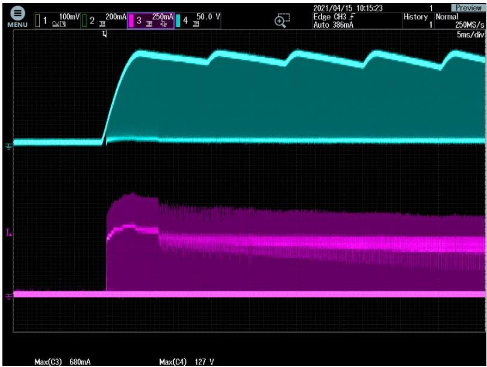

85 VAC

CH4 VDS  
CH3 IDS

$$
V _ {D S \_ M A X} = 1 2 7 V
$$

$$
I _ {D S \_ M A X} = 0. 6 8 \mathrm{A}
$$

## Test Condition:

➢ Full Load

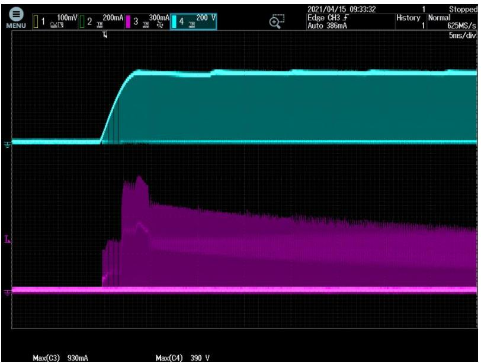

265 VAC

CH4 VDS  
CH3 IDS

$$
V _ {D S \_ M A X} = 3 9 0 V
$$

$$
I _ {D S \_ M A X} = 0. 9 3 \mathrm{A}
$$

## Test Condition:

➢ Full Load

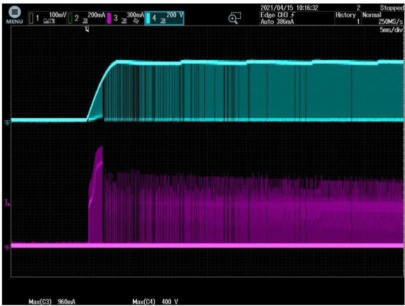

265 VAC

CH4 VDS  
CH3 IDS

$$
V _ {D S \_ M A X} = 4 0 0 V
$$

$$
I _ {D S \_ M A X} = 0. 9 6 \mathrm{A}
$$

## Test Condition:

➢ Full Load

## MOSFET

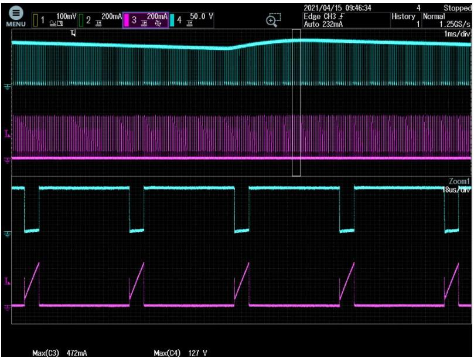

85 VAC  
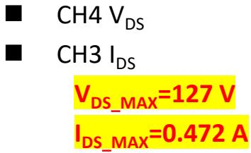

Test Condition:  
➢ Full Load

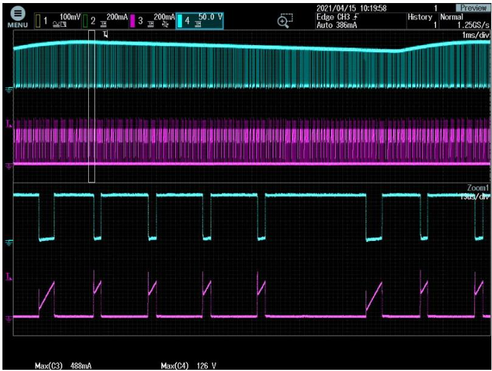

85 VAC  

Test Condition:  
➢ Full Load

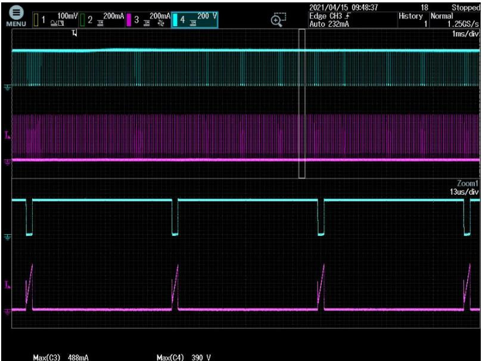

265 VAC  
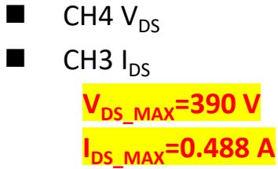

Test Condition:  
➢ Full Load

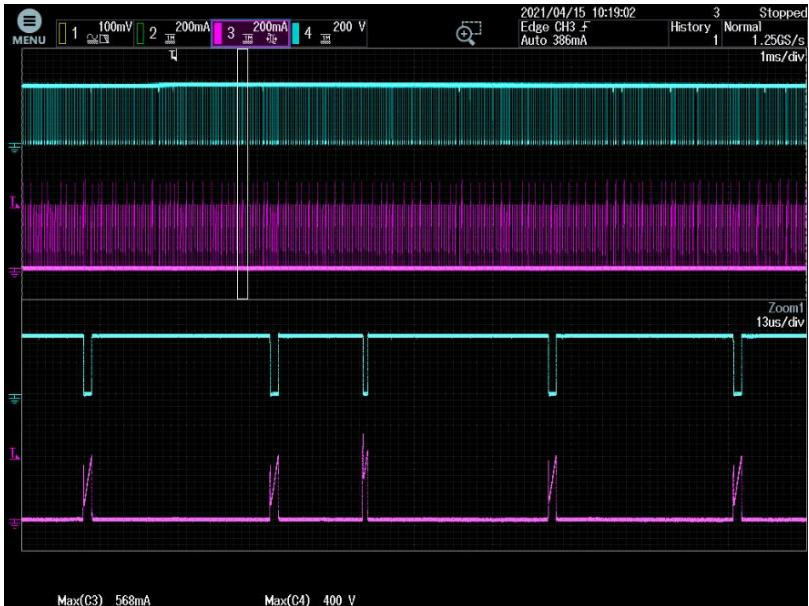

265 VAC  
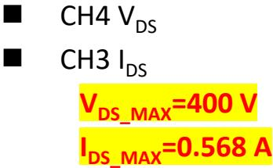

Test Condition:  
➢ Full Load

## 续流二极管开机波形

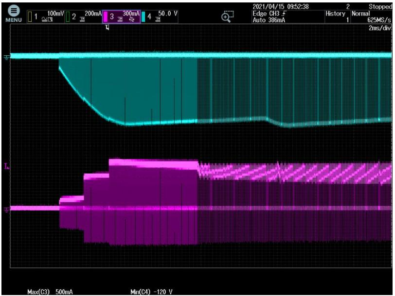

85 VAC

CH4 VR  
CH3 IF

$$
\begin{array}{l} \mathrm {V_ {R\_MAX}} = 1 2 0 \mathrm{V} \\ \mathrm {I_ {F\_MAX}} = 0. 5 \mathrm{A} \end{array}
$$

## Test Condition:

➢ Full Load

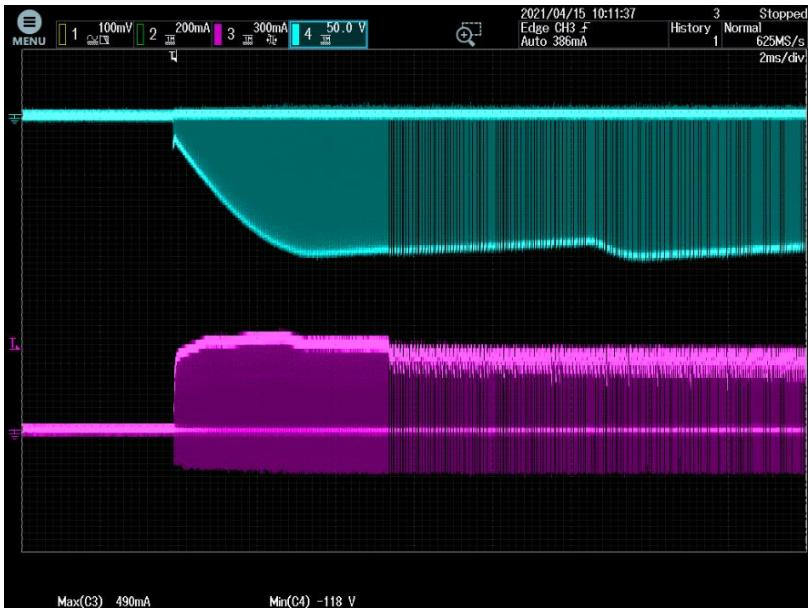

85 VAC

CH4 VR  
CH3 IF

$$
\begin{array}{l} \mathrm {V_ {R\_MAX}} = 1 1 8 \mathrm{V} \\ \mathrm {I_ {F\_MAX}} = 0. 4 9 \mathrm{A} \end{array}
$$

## Test Condition:

➢ Full Load

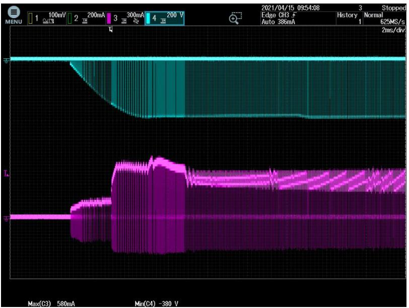

265 VAC

CH4 VR  
CH3 IF

$$
\begin{array}{l} \mathrm {V_ {R\_MAX}} = 3 8 0 \mathrm{V} \\ \mathrm {I_ {F\_MAX}} = 0. 5 8 \mathrm{A} \end{array}
$$

## Test Condition:

➢ Full Load

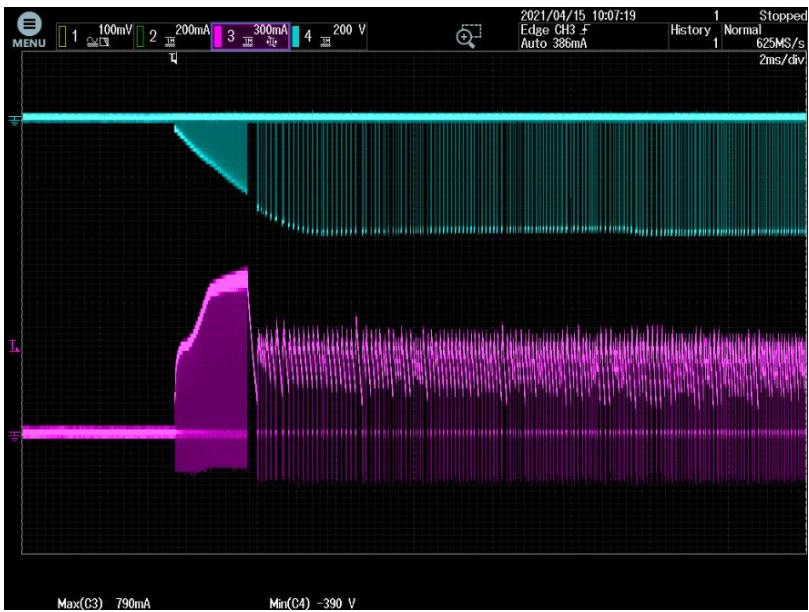

265 VAC

CH4 VR  
CH3 IF

$$
\begin{array}{l} \mathrm {V_ {R\_MAX}} = 3 9 0 \mathrm{V} \\ \mathrm {I_ {F\_MAX}} = 0. 7 9 \mathrm{A} \end{array}
$$

## Test Condition:

➢ Full Load

## 续流二极管稳态波形

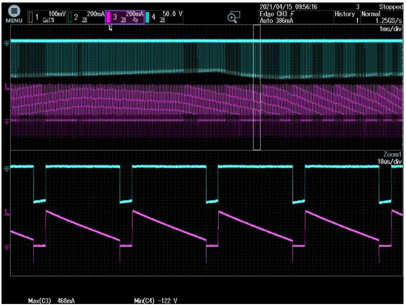

85 VAC

CH4 VR  
CH3 IF

$$
V _ {R \_ M A X} = 1 2 2 \mathrm{V}
$$

$$
I _ {F \_ M A X} = 0. 4 6 8 \mathrm{A}
$$

## Test Condition:

➢ Full Load

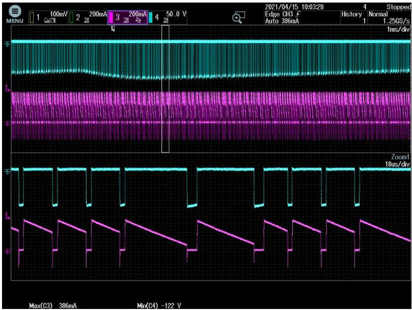

85 VAC

CH4 VR  
CH3 IF

$$
\begin{array}{l} V _ {R \_ M A X} = 1 2 2 \mathrm{V} \\ I _ {F \_ M A X} = 0. 3 8 6 \mathrm{A} \end{array}
$$

## Test Condition:

➢ Full Load

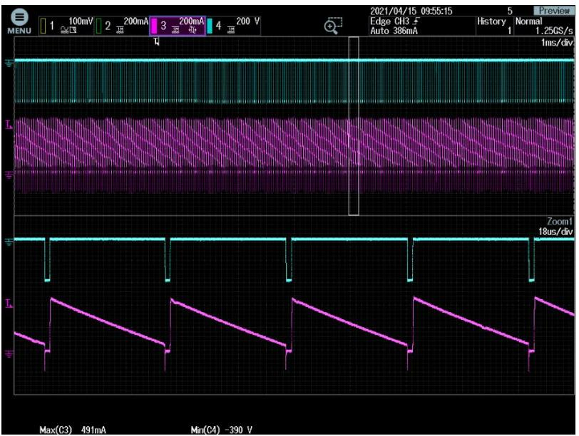

265 VAC

CH4 VR  
CH3 IF

$$
V _ {R \_ M A X} = 3 9 0 \mathrm{V}
$$

$$
I _ {F \_ M A X} = 0. 4 9 1 \mathrm{A}
$$

## Test Condition:

➢ Full Load

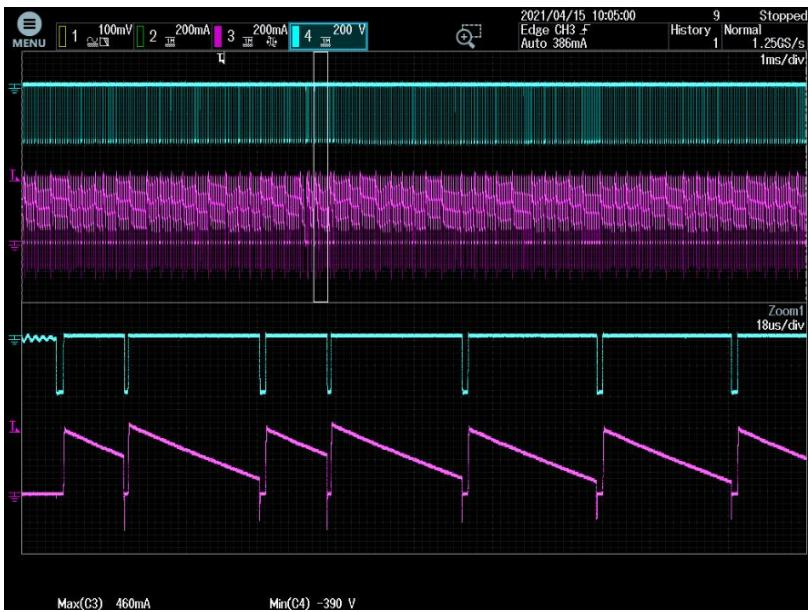

265 VAC

CH4 VR  
CH3 IF

$$
V _ {R \_ M A X} = 3 9 0 \mathrm{V}
$$

$$
I _ {F \_ M A X} = 0. 4 6 \mathrm{A}
$$

## Test Condition:

➢ Full Load

## MOSFET

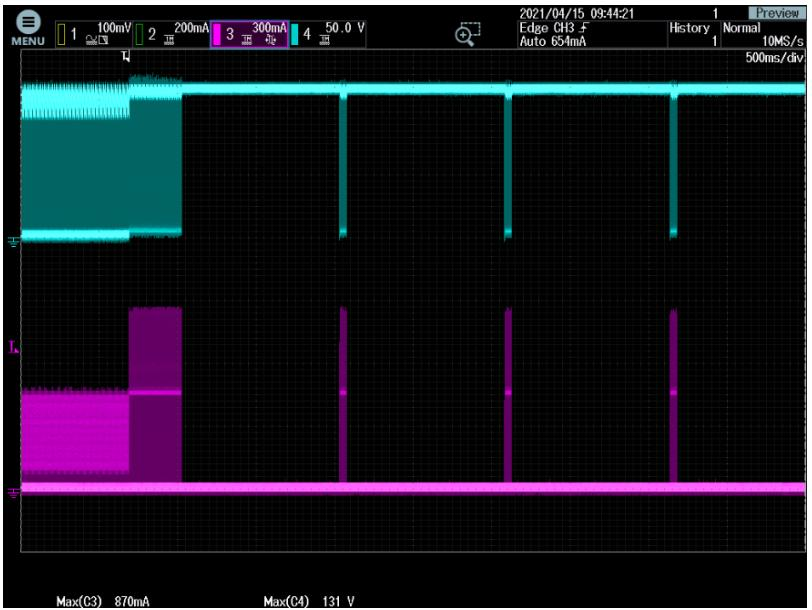

85 VAC

CH4 VDS  
CH3 IDS

$$
\begin{array}{l} \mathrm {V_ {DS\_MAX}} = 1 3 1 \mathrm{V} \\ \mathrm {I_ {DS\_MAX}} = 0. 8 7 \mathrm{A} \end{array}
$$

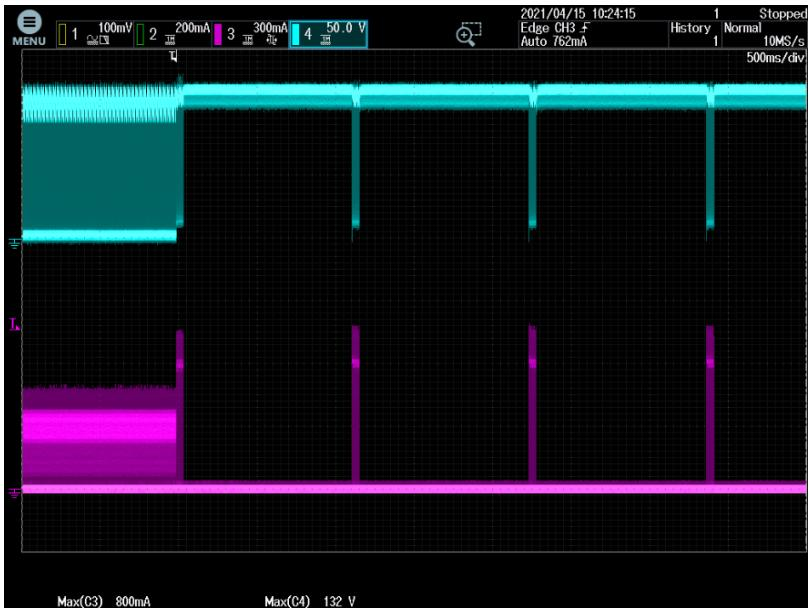

85 VAC

CH4 VDS  
CH3 IDS

$$
\begin{array}{l} \mathrm {V_ {DS\_MAX}} = 1 3 2 \mathrm{V} \\ \mathrm {I_ {DS\_MAX}} = 0. 8 \mathrm{A} \end{array}
$$

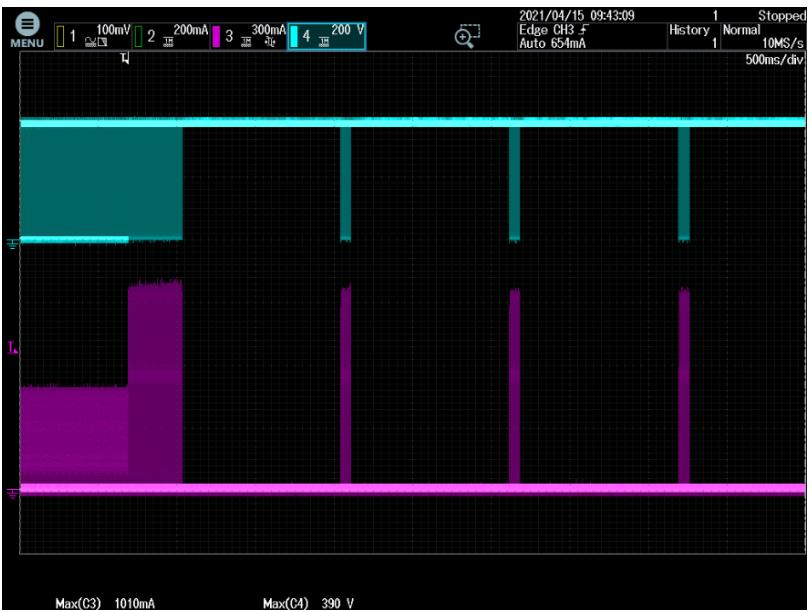

265 VAC

CH4 VDS  
CH3 IDS

$$
\begin{array}{l} \mathrm {V_ {DS\_MAX}} = 3 9 0 \mathrm{V} \\ \mathrm {I_ {DS\_MAX}} = 1. 0 1 \mathrm{A} \end{array}
$$

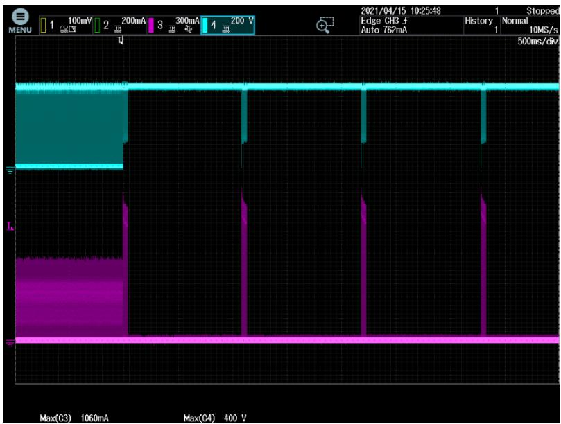

265 VAC

CH4 VDS

$$
\begin{array}{l} \mathrm {V_ {DS\_MAX}} = 4 0 0 \mathrm{V} \\ \mathrm {I_ {DS\_MAX}} = 1. 0 6 \mathrm{A} \end{array}
$$

## 温升测试

BPA8505D

<table><tr><td rowspan="2">项目</td><td>85VAC</td><td>115VAC</td><td>230VAC</td><td>265VAC</td></tr><tr><td>温度(°C)</td><td>温度(°C)</td><td>温度(°C)</td><td>温度(°C)</td></tr><tr><td>环境温度</td><td>50</td><td>50</td><td>50</td><td>50</td></tr><tr><td>BPA8505D (U1)</td><td>80.2</td><td>79.8</td><td>86.4</td><td>89.5</td></tr><tr><td>变压器绕组(L2)</td><td>72.4</td><td>72.3</td><td>77.1</td><td>78.6</td></tr><tr><td>变压器磁芯(L2)</td><td>70.4</td><td>71.3</td><td>75.1</td><td>75.2</td></tr><tr><td>整流二极管(D5)</td><td>76.2</td><td>75.7</td><td>80.5</td><td>81.2</td></tr><tr><td>整流桥(D1)</td><td>58.7</td><td>57.1</td><td>55.4</td><td>55.4</td></tr><tr><td>输入电解电容(C2)</td><td>63.1</td><td>62.6</td><td>63.1</td><td>64.6</td></tr><tr><td>输出电解电容(C6)</td><td>60.2</td><td>60.5</td><td>61.5</td><td>62.1</td></tr></table>

LNK305DG

<table><tr><td rowspan="2">项目</td><td>85VAC</td><td>115VAC</td><td>230VAC</td><td>265VAC</td></tr><tr><td>温度(°C)</td><td>温度(°C)</td><td>温度(°C)</td><td>温度(°C)</td></tr><tr><td>环境温度</td><td>50</td><td>50</td><td>50</td><td>50</td></tr><tr><td>LNK305DG (U1)</td><td>98.7</td><td>101.3</td><td>109.7</td><td>108.2</td></tr><tr><td>变压器绕组(L2)</td><td>74.4</td><td>75.4</td><td>80.5</td><td>81.1</td></tr><tr><td>变压器磁芯(L2)</td><td>72.2</td><td>73.1</td><td>77.7</td><td>78.3</td></tr><tr><td>整流二极管(D5)</td><td>85.1</td><td>86.6</td><td>91.1</td><td>90.4</td></tr><tr><td>整流桥(D1)</td><td>59.9</td><td>57.8</td><td>56.4</td><td>56.1</td></tr><tr><td>输入电解电容(C2)</td><td>66.9</td><td>66.7</td><td>68.5</td><td>68.2</td></tr><tr><td>输出电解电容(C6)</td><td>60.6</td><td>60.5</td><td>62.3</td><td>62.5</td></tr></table>

备注：增大芯片Source散热铜箔面积可以降低芯片温度

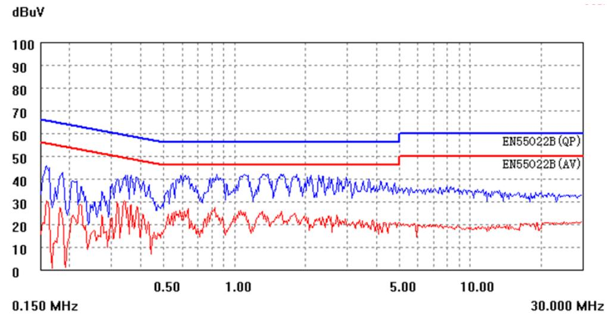

115Vac Line

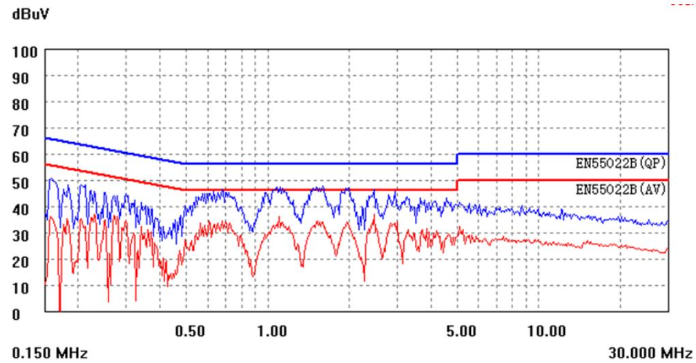

230Vac Line

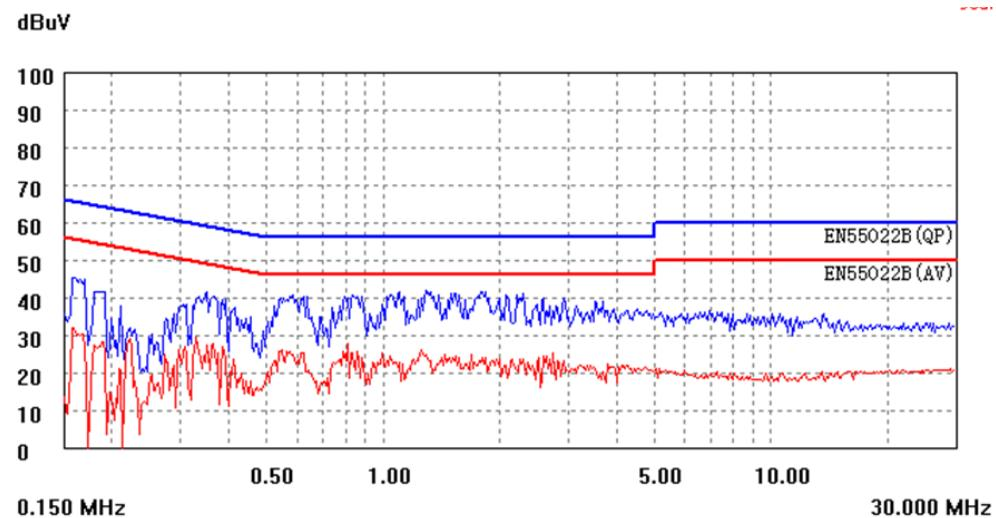

115Vac Neutral

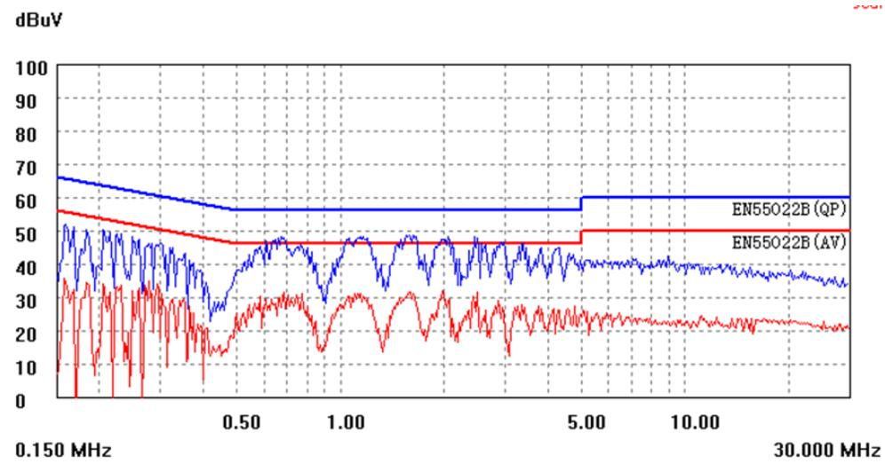

230Vac Neutral

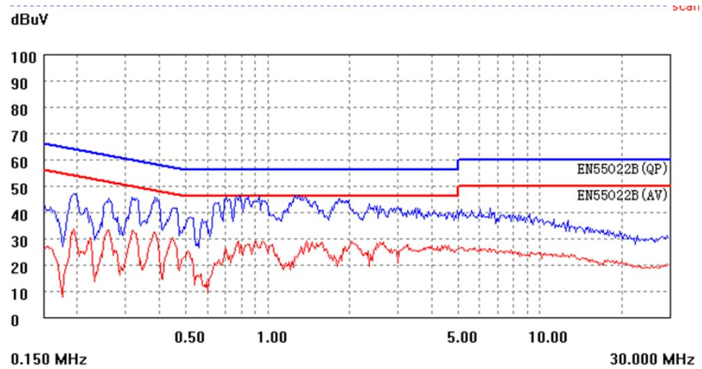

115Vac Line

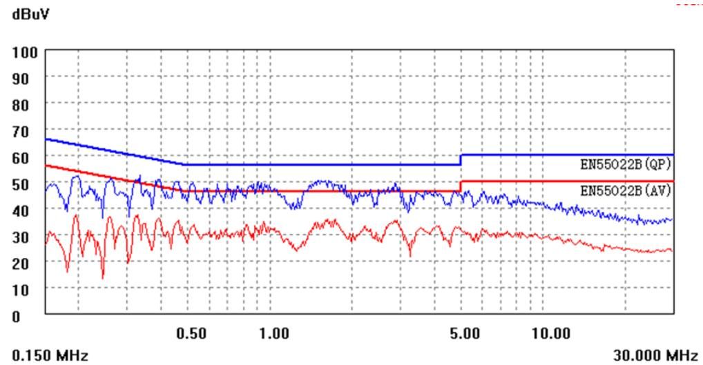

230Vac Line

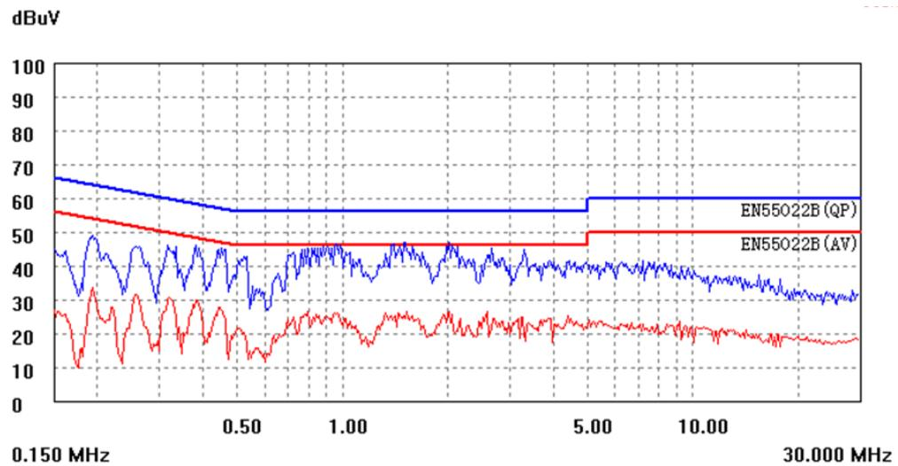

115Vac Neutral

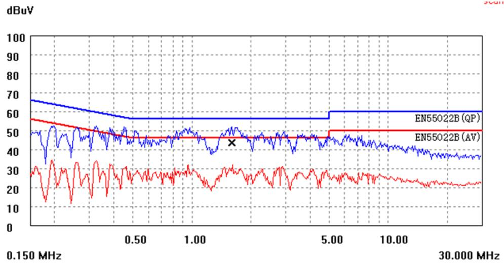

230Vac Neutral

BPA8505D

<table><tr><td>差模</td><td>电压</td><td>相位角</td><td>发生器阻抗</td><td>测试次数</td><td>测试结果</td></tr><tr><td>L to N</td><td>+1.5kV</td><td>0/90/180/270</td><td>2</td><td>10</td><td>Pass</td></tr><tr><td>L to N</td><td>-1.5kV</td><td>0/90/180/270</td><td>2</td><td>10</td><td>Pass</td></tr><tr><td>L to N</td><td>+2kV</td><td>0/90/180/270</td><td>2</td><td>10</td><td>Pass</td></tr><tr><td>L to N</td><td>-2kV</td><td>0/90/180/270</td><td>2</td><td>10</td><td>Pass</td></tr></table>

LNK305DG

<table><tr><td>差模</td><td>电压</td><td>相位角</td><td>发生器阻抗</td><td>测试次数</td><td>测试结果</td></tr><tr><td>L to N</td><td>+1.5kV</td><td>0/90/180/270</td><td>2</td><td>10</td><td>Pass</td></tr><tr><td>L to N</td><td>-1.5kV</td><td>0/90/180/270</td><td>2</td><td>10</td><td>Pass</td></tr><tr><td>L to N</td><td>+2kV</td><td>0/90/180/270</td><td>2</td><td>10</td><td>Pass</td></tr><tr><td>L to N</td><td>-2kV</td><td>0/90/180/270</td><td>2</td><td>10</td><td>Pass</td></tr></table>

## EFT

BPA8505D

<table><tr><td>差模</td><td>电压</td><td>脉冲群持续时间</td><td>脉冲频率</td><td>测试时间</td><td>测试结果</td></tr><tr><td>L to N</td><td>+4kV</td><td>15ms</td><td>5kHz</td><td>120s</td><td>Pass</td></tr><tr><td>L to N</td><td>-4kV</td><td>15ms</td><td>5kHz</td><td>120s</td><td>Pass</td></tr><tr><td>L to N</td><td>+4kV</td><td>0.75ms</td><td>100kHz</td><td>120s</td><td>Pass</td></tr><tr><td>L to N</td><td>-4kV</td><td>0.75ms</td><td>100kHz</td><td>120s</td><td>Pass</td></tr><tr><td>L to N</td><td>+2kV</td><td>2ms</td><td>38kHz</td><td>120s</td><td>Pass</td></tr><tr><td>L to N</td><td>-2kV</td><td>2ms</td><td>38kHz</td><td>120s</td><td>Pass</td></tr><tr><td>L to N</td><td>+4kV</td><td>2ms</td><td>38kHz</td><td>120s</td><td>Pass</td></tr><tr><td>L to N</td><td>-4kV</td><td>2ms</td><td>38kHz</td><td>120s</td><td>Pass</td></tr></table>

LNK305DG

<table><tr><td>差模</td><td>电压</td><td>脉冲群持续时间</td><td>脉冲频率</td><td>测试时间</td><td colspan="2">测试结果</td></tr><tr><td>L to N</td><td>+4kV</td><td>15ms</td><td>5kHz</td><td>120s</td><td>Pass</td><td></td></tr><tr><td>L to N</td><td>-4kV</td><td>15ms</td><td>5kHz</td><td>120s</td><td>Pass</td><td></td></tr><tr><td>L to N</td><td>+4kV</td><td>0.75ms</td><td>100kHz</td><td>120s</td><td>Pass</td><td></td></tr><tr><td>L to N</td><td>-4kV</td><td>0.75ms</td><td>100kHz</td><td>120s</td><td>Pass</td><td></td></tr><tr><td>L to N</td><td>+2kV</td><td>2ms</td><td>38kHz</td><td>120s</td><td>Pass</td><td></td></tr><tr><td>L to N</td><td>-2kV</td><td>2ms</td><td>38kHz</td><td>120s</td><td>Pass</td><td></td></tr><tr><td>L to N</td><td>+4kV</td><td>2ms</td><td>38kHz</td><td>120s</td><td>Pass</td><td></td></tr><tr><td>L to N</td><td>-4kV</td><td>2ms</td><td>38kHz</td><td>120s</td><td>Pass</td><td></td></tr></table>

BPA8505D

<table><tr><td>测试点</td><td>电压(V)</td><td>放电类型</td><td>放电次数</td><td>测试结果</td></tr><tr><td>Vo</td><td>+15kV</td><td>空气放电</td><td>10</td><td>Pass</td></tr><tr><td>Vo</td><td>-15kV</td><td>空气放电</td><td>10</td><td>Pass</td></tr><tr><td>GND</td><td>+15kV</td><td>空气放电</td><td>10</td><td>Pass</td></tr><tr><td>GND</td><td>-15kV</td><td>空气放电</td><td>10</td><td>Pass</td></tr><tr><td>Vo</td><td>+18kV</td><td>空气放电</td><td>10</td><td>Pass</td></tr><tr><td>Vo</td><td>-18kV</td><td>空气放电</td><td>10</td><td>Pass</td></tr><tr><td>GND</td><td>+18kV</td><td>空气放电</td><td>10</td><td>Pass</td></tr><tr><td>GND</td><td>-18kV</td><td>空气放电</td><td>10</td><td>Pass</td></tr></table>

LNK305DG

<table><tr><td>测试点</td><td>电压(V)</td><td>放电类型</td><td>放电次数</td><td>测试结果</td></tr><tr><td>Vo</td><td>+15kV</td><td>空气放电</td><td>10</td><td>Pass</td></tr><tr><td>Vo</td><td>-15kV</td><td>空气放电</td><td>10</td><td>Pass</td></tr><tr><td>GND</td><td>+15kV</td><td>空气放电</td><td>10</td><td>Pass</td></tr><tr><td>GND</td><td>-15kV</td><td>空气放电</td><td>10</td><td>Pass</td></tr><tr><td>Vo</td><td>+18kV</td><td>空气放电</td><td>10</td><td>Pass</td></tr><tr><td>Vo</td><td>-18kV</td><td>空气放电</td><td>10</td><td>Pass</td></tr><tr><td>GND</td><td>+18kV</td><td>空气放电</td><td>10</td><td>Pass</td></tr><tr><td>GND</td><td>-18kV</td><td>空气放电</td><td>10</td><td>Pass</td></tr></table>

## THANK YOU FOR WATCHING
