## BPA8505D 参考设计

## (-12V/0.5A)

上海晶丰明源半导体股份有限公司

Shanghai Bright Power Semiconductor Co., Ltd.

陈耀兵

2022 4 27

BPA8505D  
电源规格  
电路图  
◼BOM  
◼PCB Layout  
电路实物图  
变压器规格书  
性能测试数据

## 产品特点:

➢ 650V MOSFET  
➢ PWM  
》内置软启动功能  
》集成高压启动、 自供电电路  
》低音频噪声

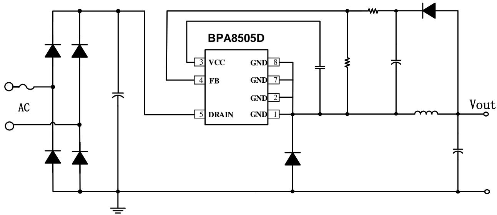

## 应用领域:

家用电器辅助电源  
电机驱动辅助电源  
➢ IOT/ /  
工业控制辅助电源

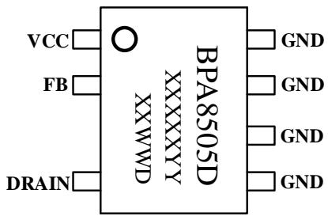

SOP7

## 电源规格

<table><tr><td>项目描述</td><td>符号</td><td>最小</td><td>典型</td><td>最大</td><td>单位</td><td>备注</td></tr><tr><td colspan="7">输入</td></tr><tr><td>电压</td><td> $V_{IN}$ </td><td>85</td><td>115/230</td><td>264</td><td> $V_{AC}$ </td><td></td></tr><tr><td>频率</td><td> $f_{LINE}$ </td><td>47</td><td>50/60</td><td>63</td><td>Hz</td><td></td></tr><tr><td colspan="7">输出</td></tr><tr><td>输出电压</td><td> $V_{OUT}$ </td><td></td><td>-12</td><td></td><td>V</td><td>±3%</td></tr><tr><td>输出电流</td><td> $I_{OUT}$ </td><td></td><td>0.5</td><td></td><td>A</td><td></td></tr><tr><td>输出电压纹波</td><td> $V_{RIPPLE}$ </td><td></td><td></td><td>150</td><td>mV</td><td>20MHz带宽</td></tr><tr><td>连续输出功率</td><td> $P_{OUT}$ </td><td></td><td>6</td><td></td><td>W</td><td></td></tr><tr><td colspan="7">效率</td></tr><tr><td>待机功耗</td><td> $P_{STDBY}$ </td><td></td><td></td><td>130</td><td>mW</td><td>230VAC</td></tr><tr><td>满载效率</td><td>η</td><td>74</td><td></td><td></td><td>%</td><td>115VAC/230VAC</td></tr><tr><td colspan="7">环境</td></tr><tr><td>传导EMI</td><td></td><td colspan="4">满足CISPR22/EN55022 Class B,至少6dB 裕量</td><td></td></tr><tr><td>Surge</td><td></td><td></td><td>2</td><td></td><td>kV</td><td>差模</td></tr><tr><td>EFT</td><td></td><td></td><td>4</td><td></td><td>kV</td><td>5kHz/100kHz/38kHz</td></tr><tr><td>ESD</td><td></td><td></td><td>15</td><td></td><td>kV</td><td>接触8kV,空气15kV</td></tr><tr><td>工作环境温度</td><td> $T_{AMP}$ </td><td>0</td><td></td><td>50</td><td>°C</td><td></td></tr></table>

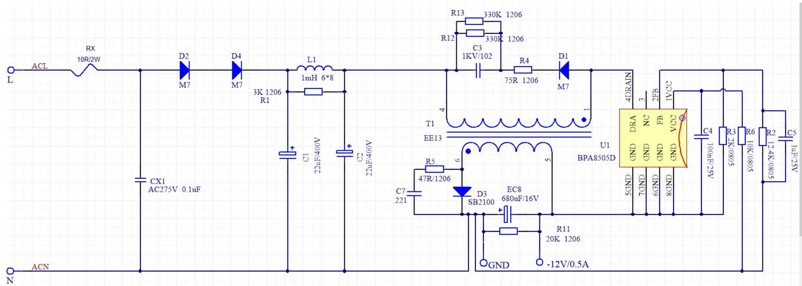

<table><tr><td>序号</td><td>元件标号</td><td>参数描述</td><td>封装尺寸</td><td>数量</td></tr><tr><td>1</td><td>PCB</td><td>CEM-1, 单面板</td><td>60.3mm*42mm</td><td>1</td></tr><tr><td>2</td><td>C1, C2</td><td>22uF/400V</td><td>EC 8.5 P3.5</td><td>2</td></tr><tr><td>3</td><td>C3</td><td>102/1KV</td><td>C1206</td><td>1</td></tr><tr><td>4</td><td>C4,</td><td>0.1uF/50V</td><td>C0805</td><td>1</td></tr><tr><td></td><td>C5</td><td>1uF/25V</td><td>C0805</td><td>1</td></tr><tr><td>5</td><td>C7</td><td>220pF/100V</td><td>C0805</td><td>1</td></tr><tr><td>6</td><td>CX1</td><td>AC275V 0.1uF</td><td>CX2/104/10</td><td>1</td></tr><tr><td>7</td><td>D1, D2, D4</td><td>M7</td><td>D SMA</td><td>3</td></tr><tr><td>8</td><td>D3</td><td>SB2100</td><td>D SMA</td><td>1</td></tr><tr><td>9</td><td>EC8</td><td>680uF/16V</td><td>E10*5</td><td>1</td></tr><tr><td>10</td><td>L1</td><td>1mH</td><td>6*8工字电感</td><td>1</td></tr><tr><td>11</td><td>R1</td><td>3K</td><td>R1206</td><td>1</td></tr><tr><td>12</td><td>R4</td><td>75R</td><td>R1206</td><td>1</td></tr><tr><td>13</td><td>R5</td><td>47R</td><td>R1206</td><td>1</td></tr><tr><td>14</td><td>R12, R13</td><td>330K</td><td>R1206</td><td>2</td></tr><tr><td>15</td><td>R2</td><td>12.4K</td><td>R0805</td><td>1</td></tr><tr><td>16</td><td>R3</td><td>2K</td><td>R0805</td><td>1</td></tr><tr><td>17</td><td>R6</td><td>10K</td><td>R0805</td><td>1</td></tr><tr><td>18</td><td>R11</td><td>20K</td><td>R0805</td><td>1</td></tr><tr><td>19</td><td>RX</td><td>10R/2W</td><td>F-2W</td><td>1</td></tr><tr><td>20</td><td>T1</td><td>EE13</td><td>T EE13(PIN5+5)</td><td>1</td></tr><tr><td>21</td><td>U1</td><td>BPA8505D</td><td>U SOP8</td><td>1</td></tr></table>

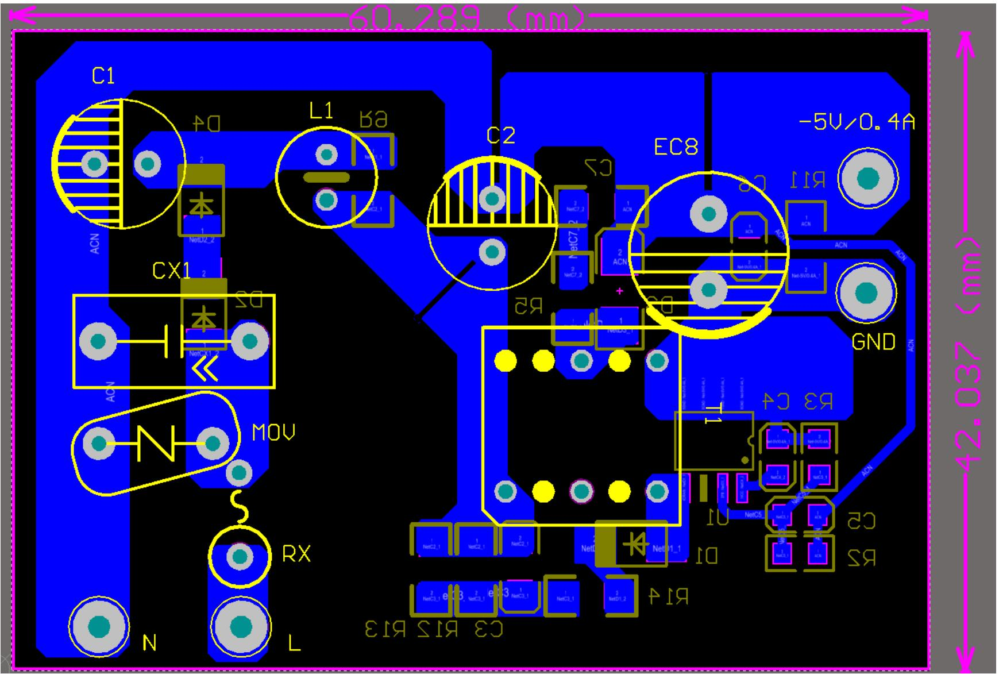

## 电路实物图

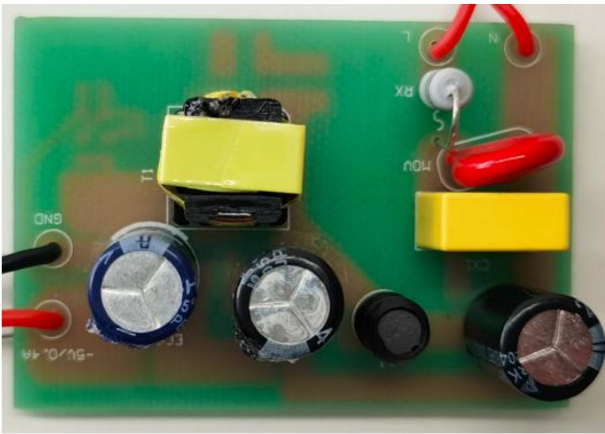

TOP SIDE

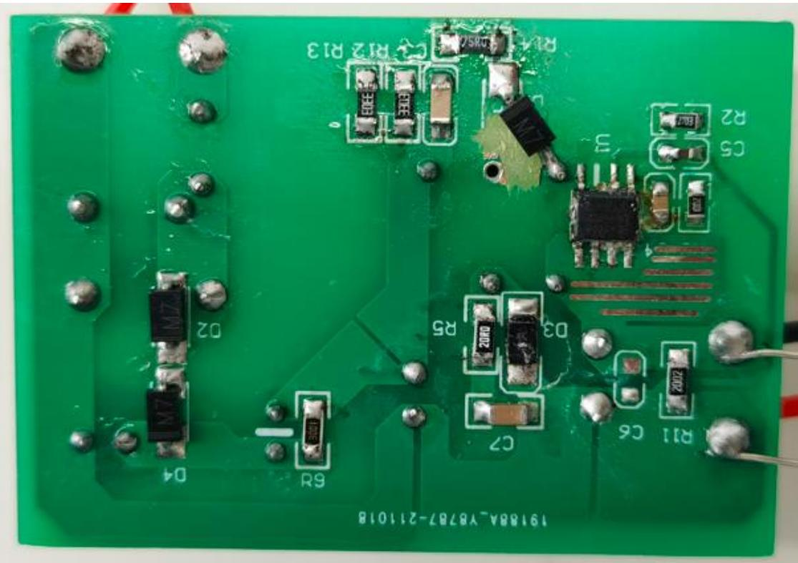

BOTTOM SIDE

## 变压器规格书

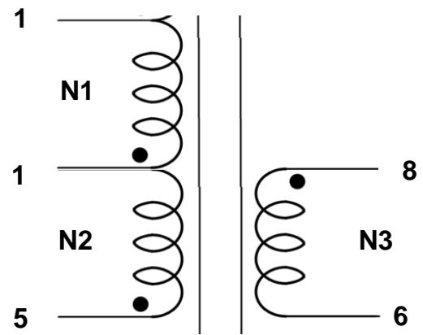

<table><tr><td>序号</td><td>起始脚</td><td>终止脚</td><td>绕制规则</td><td>匝数</td><td>绕线方式</td></tr><tr><td>N1</td><td>1</td><td>NC</td><td>2UEW φ0.13*2P</td><td>23Ts</td><td>密绕一层(PIN脚朝外)</td></tr><tr><td>胶带</td><td></td><td></td><td></td><td>2Ts</td><td></td></tr><tr><td>N2</td><td>5</td><td>1</td><td>2UEW φ0.15*1P</td><td>187Ts</td><td>密绕4.5层(PIN脚朝外)</td></tr><tr><td>胶带</td><td></td><td></td><td></td><td>2Ts</td><td></td></tr><tr><td>N3</td><td>8</td><td>6</td><td>2UEW φ0.4*1P</td><td>30Ts</td><td>密绕2层(PIN脚朝外)</td></tr><tr><td>胶带</td><td></td><td></td><td></td><td>3Ts</td><td></td></tr></table>

## 规格参数：

1）骨架：EE13立式（5+5PIN），磁芯材质：EE13 PC40 或同等材质 ， $\mathsf { A } \mathsf { e } = 1 7 \mathsf { m } \mathsf { m } ^ { 2 }$ ；  
2）N1、N2、N3: 2UEW 漆包线；  
3）绝缘胶带:3M900 或同等材质；  
4）初级绕组感量Lp：1.8mH±5%（测试条件： 0.3V，40kHz）；  
5）成品要求：浸凡立水；

待机功耗  
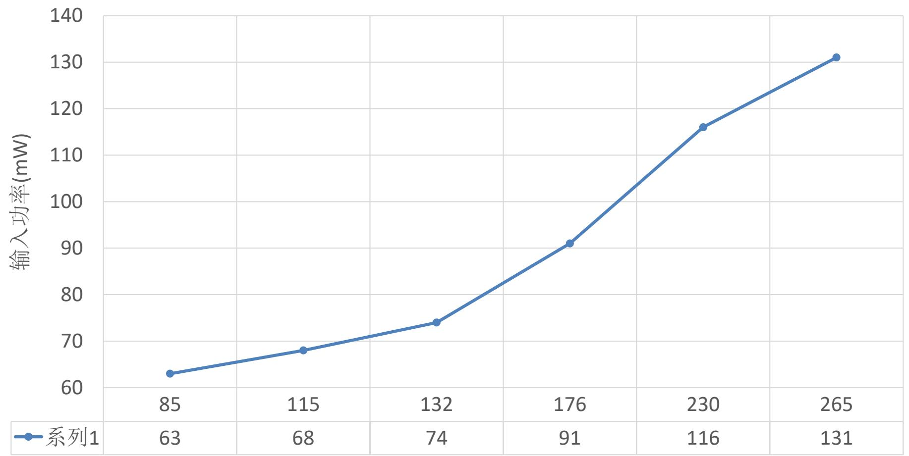

输入电压(Vac)

效率曲线  
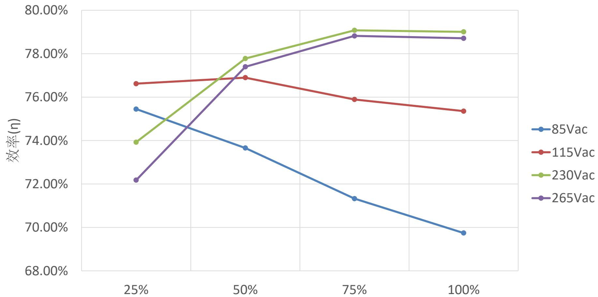

负载比例

<table><tr><td> $V_{IN}(VAC)$ </td><td>Load(%)</td><td> $P_{IN}(W)$ </td><td> $V_{OUT}(V)$ </td><td> $I_{OUT}(A)$ </td><td> $P_{OUT}(W)$ </td><td>Eff(%)</td><td>AVG Eff(%)</td></tr><tr><td rowspan="6">85</td><td>空载</td><td></td><td></td><td>0</td><td>0</td><td></td><td></td></tr><tr><td>10%</td><td>0.85</td><td>12.144</td><td>0.05</td><td>0.6072</td><td>71.44%</td><td></td></tr><tr><td>25%</td><td>2.02</td><td>12.193</td><td>0.125</td><td>1.524125</td><td>75.45%</td><td rowspan="4">72.55%</td></tr><tr><td>50%</td><td>4.16</td><td>12.257</td><td>0.25</td><td>3.06425</td><td>73.66%</td></tr><tr><td>75%</td><td>6.46</td><td>12.287</td><td>0.375</td><td>4.607625</td><td>71.33%</td></tr><tr><td>100%</td><td>8.78</td><td>12.247</td><td>0.5</td><td>6.1235</td><td>69.74%</td></tr><tr><td rowspan="6">115</td><td>空载</td><td></td><td></td><td></td><td>0</td><td></td><td></td></tr><tr><td>10%</td><td>0.85</td><td>12.144</td><td>0.05</td><td>0.6072</td><td>71.44%</td><td></td></tr><tr><td>25%</td><td>1.99</td><td>12.198</td><td>0.125</td><td>1.52475</td><td>76.62%</td><td rowspan="4">76.19%</td></tr><tr><td>50%</td><td>3.99</td><td>12.273</td><td>0.25</td><td>3.06825</td><td>76.90%</td></tr><tr><td>75%</td><td>6.08</td><td>12.305</td><td>0.375</td><td>4.614375</td><td>75.89%</td></tr><tr><td>100%</td><td>8.14</td><td>12.268</td><td>0.5</td><td>6.134</td><td>75.36%</td></tr><tr><td rowspan="6">230</td><td>空载</td><td></td><td></td><td></td><td>0</td><td></td><td></td></tr><tr><td>10%</td><td>0.93</td><td>12.139</td><td>0.05</td><td>0.60695</td><td>65.26%</td><td></td></tr><tr><td>25%</td><td>2.06</td><td>12.183</td><td>0.125</td><td>1.522875</td><td>73.93%</td><td rowspan="4">77.45%</td></tr><tr><td>50%</td><td>3.94</td><td>12.258</td><td>0.25</td><td>3.0645</td><td>77.78%</td></tr><tr><td>75%</td><td>5.84</td><td>12.315</td><td>0.375</td><td>4.618125</td><td>79.08%</td></tr><tr><td>100%</td><td>7.77</td><td>12.278</td><td>0.5</td><td>6.139</td><td>79.01%</td></tr><tr><td rowspan="6">265</td><td>空载</td><td></td><td></td><td></td><td>0</td><td></td><td></td></tr><tr><td>10%</td><td>0.98</td><td>12.138</td><td>0.05</td><td>0.6069</td><td>61.93%</td><td></td></tr><tr><td>25%</td><td>2.11</td><td>12.184</td><td>0.125</td><td>1.523</td><td>72.18%</td><td rowspan="4">76.78%</td></tr><tr><td>50%</td><td>3.96</td><td>12.26</td><td>0.25</td><td>3.065</td><td>77.40%</td></tr><tr><td>75%</td><td>5.86</td><td>12.317</td><td>0.375</td><td>4.618875</td><td>78.82%</td></tr><tr><td>100%</td><td>7.8</td><td>12.279</td><td>0.5</td><td>6.1395</td><td>78.71%</td></tr></table>

## 输出电压调整率

<table><tr><td> $V_{IN}(VAC)$  $I_{OUT}(A)$ </td><td>90</td><td>115</td><td>132</td><td>176</td><td>230</td><td>265</td><td>平均值</td><td>线调整率</td></tr><tr><td>0</td><td>12.13</td><td>12.136</td><td>12.14</td><td>12.143</td><td>12.152</td><td>12.153</td><td>12.142</td><td>0.19%</td></tr><tr><td>20%</td><td>12.204</td><td>12.202</td><td>12.2</td><td>12.196</td><td>12.192</td><td>12.19</td><td>12.197</td><td>0.11%</td></tr><tr><td>40%</td><td>12.267</td><td>12.266</td><td>12.263</td><td>12.26</td><td>12.253</td><td>12.246</td><td>12.259</td><td>0.17%</td></tr><tr><td>60%</td><td>12.302</td><td>12.306</td><td>12.306</td><td>12.308</td><td>12.304</td><td>12.302</td><td>12.305</td><td>0.05%</td></tr><tr><td>80%</td><td>12.3</td><td>12.306</td><td>12.31</td><td>12.313</td><td>12.323</td><td>12.324</td><td>12.313</td><td>0.19%</td></tr><tr><td>100%</td><td>12.257</td><td>12.27</td><td>12.276</td><td>12.28</td><td>12.284</td><td>12.285</td><td>12.275</td><td>0.23%</td></tr><tr><td>平均值</td><td>12.243</td><td>12.248</td><td>12.249</td><td>12.250</td><td>12.251</td><td>12.250</td><td></td><td></td></tr><tr><td>负载调整率</td><td>1.40%</td><td>1.39%</td><td>1.39%</td><td>1.39%</td><td>1.40%</td><td>1.40%</td><td></td><td></td></tr></table>

◼ 计算方法：调整率=100%\*(最大值-最小值)/平均值

## OLP

<table><tr><td> $V_{IN}(VAC)$  $I_{OUT}(A)$ </td><td>85</td><td>264</td></tr><tr><td>0.55</td><td>12.213</td><td>12.267</td></tr><tr><td>0.6</td><td>11.519</td><td>12.251</td></tr><tr><td>0.65</td><td>10.67</td><td>12.23</td></tr><tr><td>0.7</td><td>9.97</td><td>12.181</td></tr><tr><td>0.75</td><td>9.3</td><td>11.455</td></tr><tr><td>0.8</td><td>8.67</td><td>10.72</td></tr><tr><td>0.85</td><td>8.11</td><td>10.07</td></tr><tr><td>0.9</td><td>7.58</td><td>9.5</td></tr><tr><td>0.95</td><td>OLP</td><td>8.95</td></tr><tr><td>1</td><td></td><td>8.5</td></tr><tr><td>1.05</td><td></td><td>8.05</td></tr><tr><td>1.1</td><td></td><td>OLP</td></tr></table>

## 输出电压纹波

20MHz带宽，去掉示波器探头正端夹子和地线环，10uF/50V 0.1uF/50V

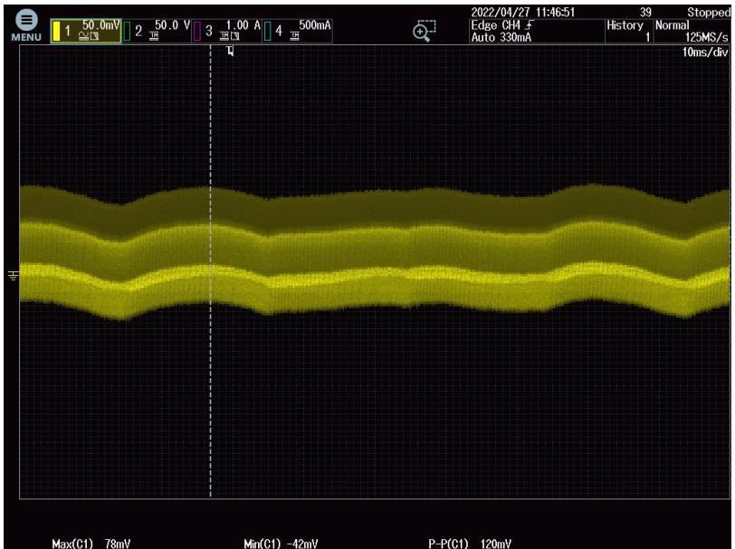

${ \otimes 5 } \mathsf { V _ { A C } }$  
CH1 VOUT $\mathsf { V } _ { \mathsf { O U T } }$ Ripple $v _ { p _ { \mathrm { K - P K } } } { = } 1 2 0 ~ \mathsf { m V }$  
➢ Full Load

Test Condition:

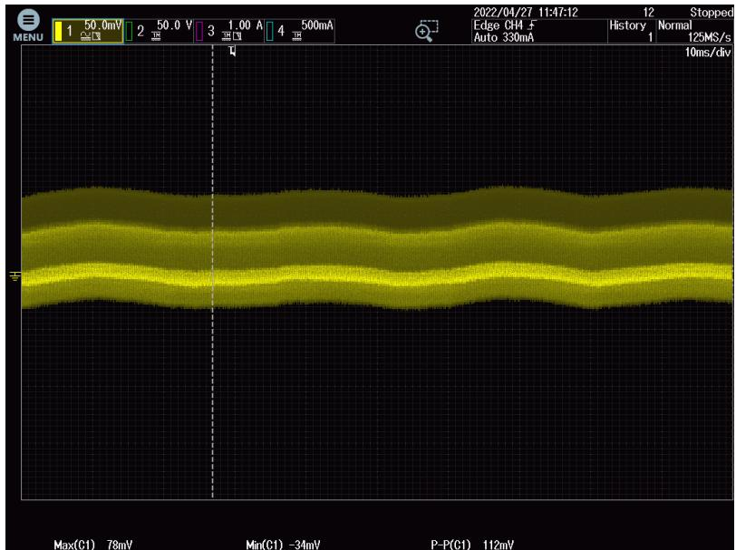

115 VAC  
${ \mathsf { C H 1 } } { \mathsf { V } } _ { \mathsf { O U T } }$ CH1 VOUT Ripple $\mathtt { V } _ { \mathtt { P K - P K } } = \mathtt { 1 } \mathtt { 1 } 2 \ m \vee$  
➢ Full Load

Test Condition:

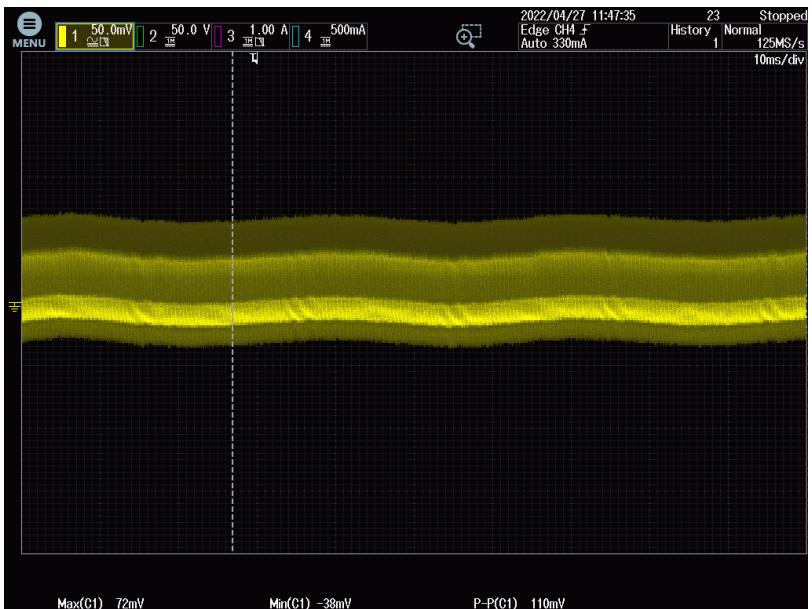

230 $\mathsf { v } _ { \mathsf { A C } }$  
CH1 VOUT $\mathsf { V } _ { \mathsf { O U T } }$ Ripple $\mathtt { V } _ { \mathtt { P K - P K } } = \mathtt { 1 1 0 \ m V }$  
➢ Full Load

Test Condition:

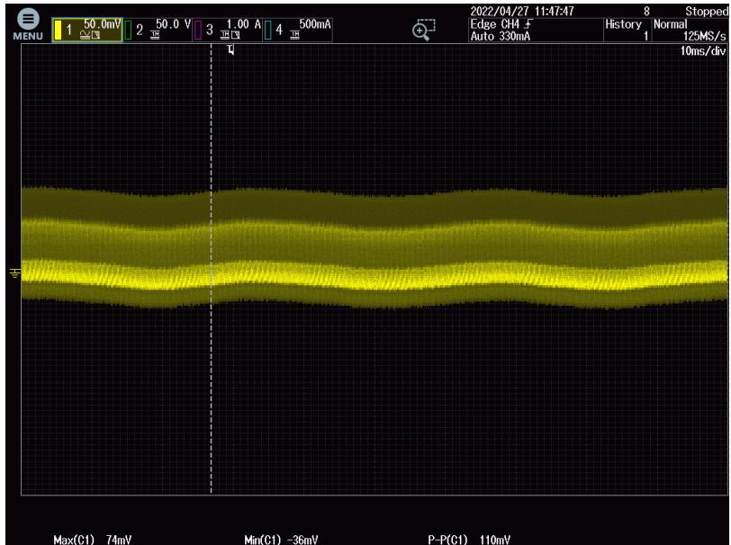

265 $\mathsf { v } _ { \mathsf { A C } }$  
CH1 VOUT $\mathsf { V } _ { \mathsf { O U T } }$ Ripple $\mathtt { V } _ { \mathtt { P K - P K } } = \mathtt { 1 1 0 \ m V }$  
➢ Full Load

Test Condition:

## (50%-100%)

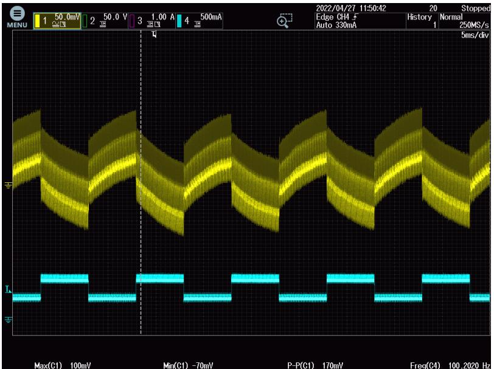

85 VAC

CH1 VOUT ${ \mathsf { C H 1 } } { \mathsf { V } } _ { \mathsf { O U T } }$ $v _ { p \vert k - P K } { = } 1 7 0 m v$  
$\mathsf { C H 4 } \mathsf { I } _ { \mathsf { O U T } }$

## Test Condition:

➢ $0 . 2 5 \ : \mathsf { A } – 0 . 5 \ : \mathsf { A } – 0 . 2 5 \ : \mathsf { A }$  
➢ Slew Rate: 0.5 A/μS  
➢ Frequency: 100 Hz

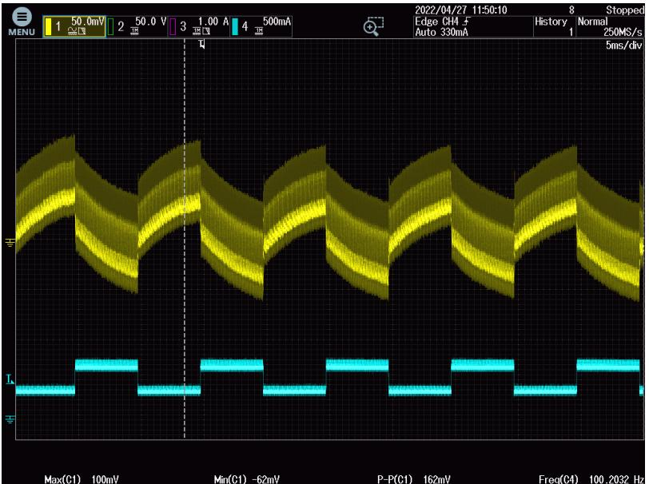

230 VAC

CH1 VOUT $\mathsf { V } _ { \mathsf { O U T } }$ $\mathsf { V } _ { \mathsf { P K - P K } } \equiv 1 6 2 \mathsf { m V }$  
$\mathsf { C H 4 } \mathsf { l } _ { \mathsf { O U T } }$

## Test Condition:

➢ 0.25 A-0.5 A-0.25 A  
➢ Slew Rate: 0.5 $\mathsf { A } / \mu \mathsf { S }$  
➢ Frequency: 100 Hz

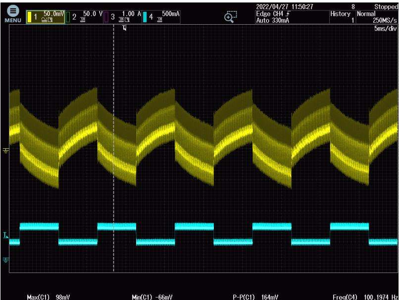

115 VAC

CH1 VOUT ${ \mathsf { C H 1 } } { \mathsf { V } } _ { \mathsf { O U T } }$ $V _ { p | c - P K } = 1 6 4 m v$  
$\mathsf { C H 4 } \mathsf { I } _ { \mathsf { O U T } }$

## Test Condition:

➢ 0.25 A-0.5 A-0.25 A  
➢ Slew Rate: 0.5 A/μS  
➢ Frequency: 100 Hz

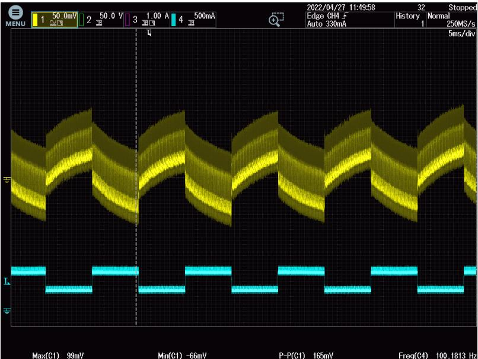

265 VAC

CH1 VOUT ${ \mathsf { C H 1 } } { \mathsf { V } } _ { \mathsf { O U T } }$ $v _ { p \vert k - P K } { = } 1 6 5 m v$  
$\mathsf { C H 4 } \mathsf { I } _ { \mathsf { O U T } }$

## Test Condition:

➢ 0.25 A-0.5 A-0.25 A  
➢ Slew Rate: 0.5 A/μS  
➢ Frequency: 100 Hz

## (10%-90%)

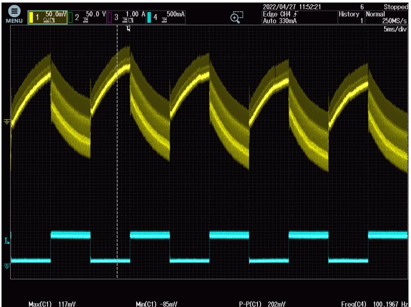

85 VAC

CH1 VOUT ${ \mathsf { C H 1 } } { \mathsf { V } } _ { \mathsf { O U T } }$ $V _ { P K - P K } = 2 0 2 m v$  
$\mathsf { C H 4 } \mathsf { I } _ { \mathsf { O U T } }$

## Test Condition:

➢ 0.05 A-0.45A-0.05 A  
➢ Slew Rate: 0.5 A/μS  
➢ Frequency: 100 Hz

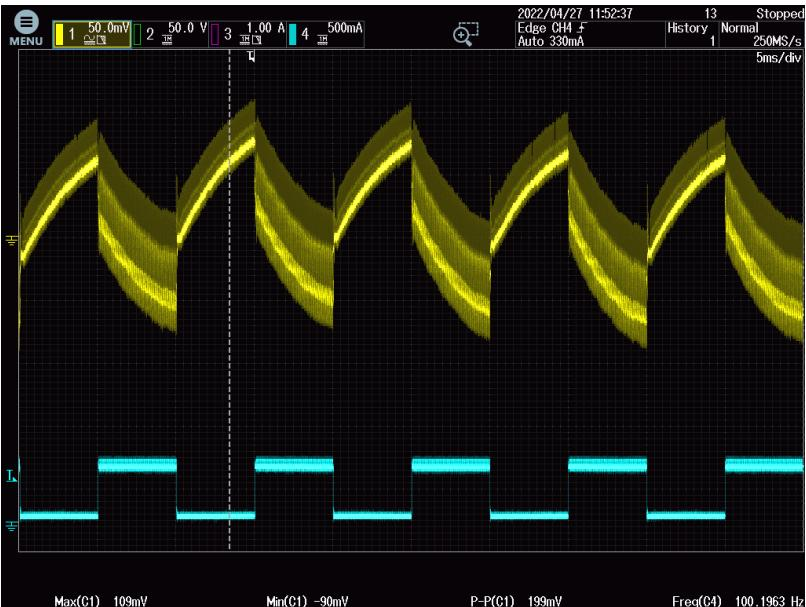

115 VAC

CH1 VOUT ${ \mathsf { C H 1 } } { \mathsf { V } } _ { \mathsf { O U T } }$ $V _ { P K - P K } = 1 9 9 m v$  
$\mathsf { C H 4 } \mathsf { I } _ { \mathsf { O U T } }$

## Test Condition:

➢ 0.05 A-0.45A-0.05 A  
➢ Slew Rate: 0.5 A/μS  
➢ Frequency: 100 Hz

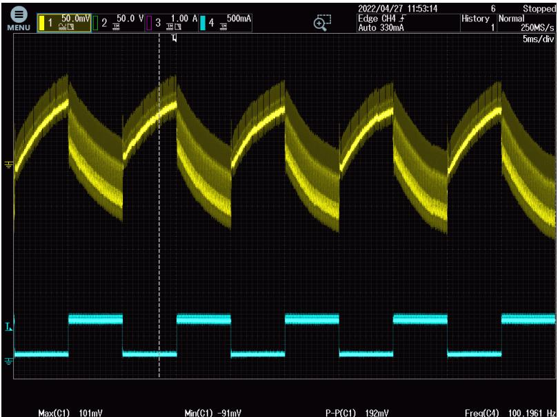

230 VAC

CH1 VOUT ${ \mathsf { C H 1 } } { \mathsf { V } } _ { \mathsf { O U T } }$ $V _ { P K - P K } = 1 9 2 m v$  
$\mathsf { C H 4 } \mathsf { l } _ { \mathsf { O U T } }$

## Test Condition:

➢ $0 . 0 5 \ : \mathsf { A } – 0 . 4 5 \mathsf { A } – 0 . 0 5 \ : \mathsf { A }$  
➢ Slew Rate: 0.5 $\mathsf { A } / \mu \mathsf { S }$  
➢ Frequency: 100 Hz

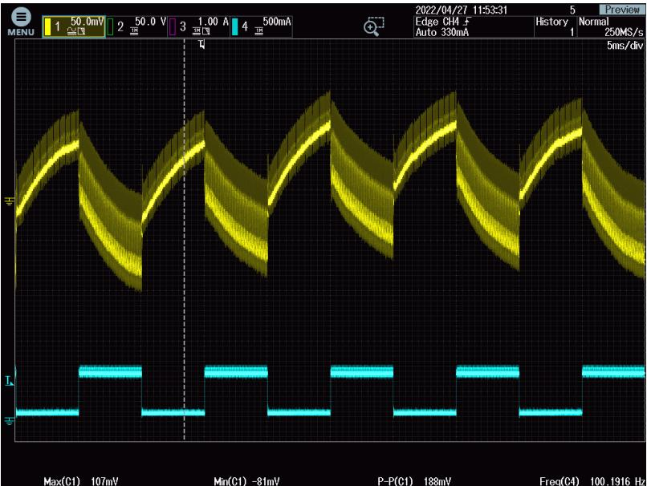

265 VAC

CH1 VOUT ${ \mathsf { C H 1 } } { \mathsf { V } } _ { \mathsf { O U T } }$ $v _ { p \kappa \mathrm { - } P \kappa } { = } 1 8 8 ~ \mathsf { m V }$  
$\mathsf { C H 4 } \mathsf { I } _ { \mathsf { O U T } }$

## Test Condition:

➢ 0.05 A-0.45A-0.05 A  
➢ Slew Rate: 0.5 A/μS  
➢ Frequency: 100 Hz

## 输出电压开机波形

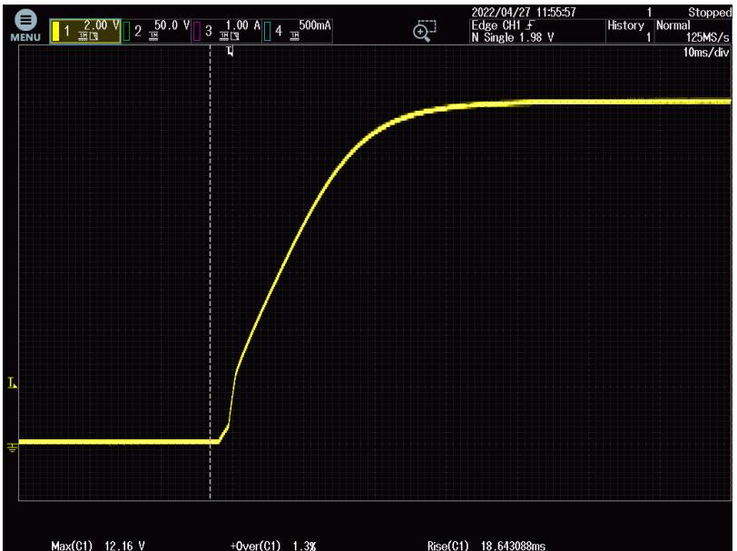

85 VAC

CH1 VOUT TRISE: 18.6mS

## Test Condition:

➢ No Load

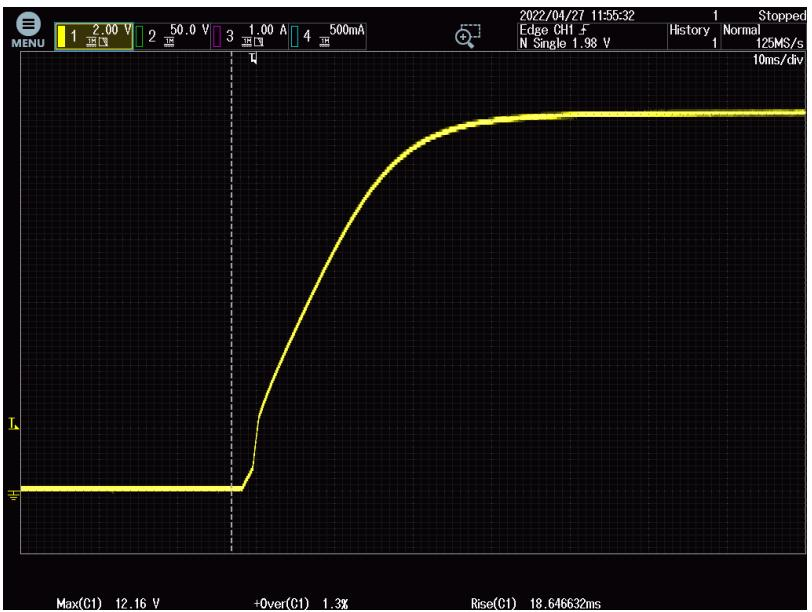

265 VAC

CH1 VOUT TRISE: 18.6 mS

## Test Condition:

➢ No Load

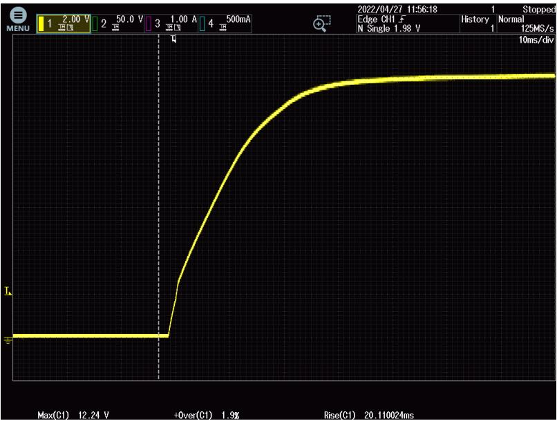

85 VAC

CH1 VOUT TRISE: 20.1 mS

## Test Condition:

➢ Full Load

265 VAC

CH1 VOUT TRISE: 18.6 mS

## Test Condition:

➢ Full Load

## MOs漏源极电压电流波形 (启机)

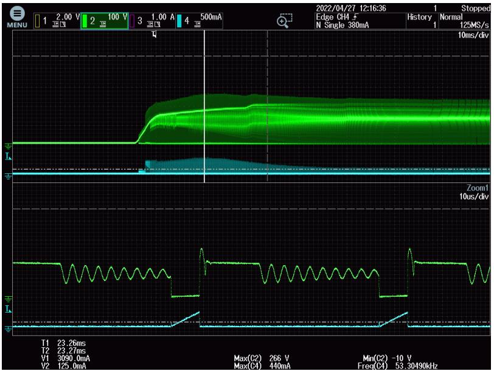

85 VAC

${ \mathsf { C H } } 2 { \mathsf { V } } _ { \mathsf { D S } }$  
$C H 4 1 _ { \mathsf { D } }$ $V _ { \mathsf { D } \mathsf { S } } { = } 2 6 6 \mathsf { V }$ IMAX=0.44 A $\mathsf { I } _ { \mathsf { M A X } } { = } 0 . 4 4 ~ \mathsf { A }$

Test Condition:  
➢ No Load  
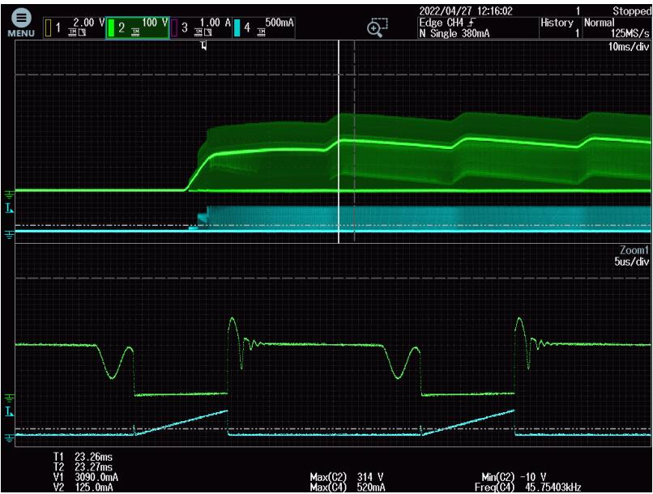

85 VAC

${ \mathsf { C H } } 2 { \mathsf { V } } _ { \mathsf { D S } }$  
$C H 4 1 _ { \mathsf { D } }$ $\mathtt { V _ { D S } } \mathtt { = } 3 1 4 \mathtt { V }$ IMAX= 0.52 A $\mathsf { I } _ { \mathsf { M A X } } = \mathbf { 0 . 5 2 A }$

Test Condition:  
➢ Full Load  
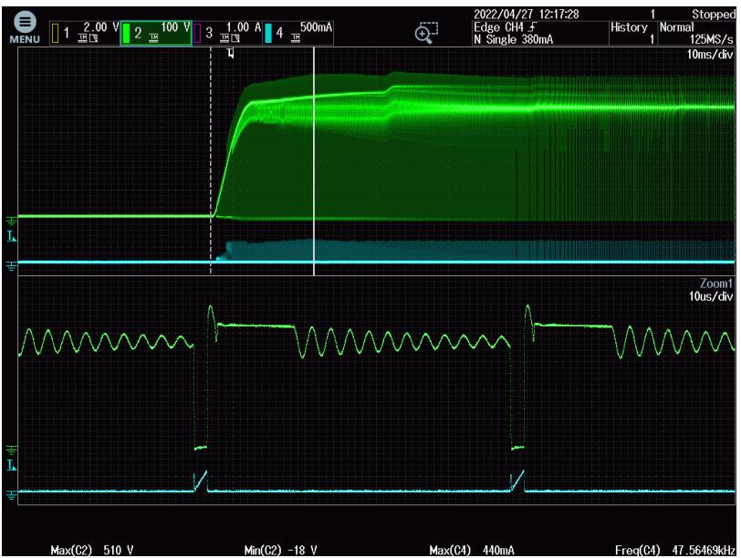

265 VAC

${ \mathsf { C H } } 2 \ { \mathsf { V } } _ { \mathsf { D S } }$  
$C H 4 1 _ { \mathsf { D } }$ $\mathtt { V } _ { \mathtt { D S } } mathtt { = } 5 1 0 \mathtt { V }$ IMAX=0.44 A $\mathsf { I } _ { \mathsf { M A X } } { = } 0 . 4 4 ~ \mathsf { A }$

Test Condition:  
➢ No Load  
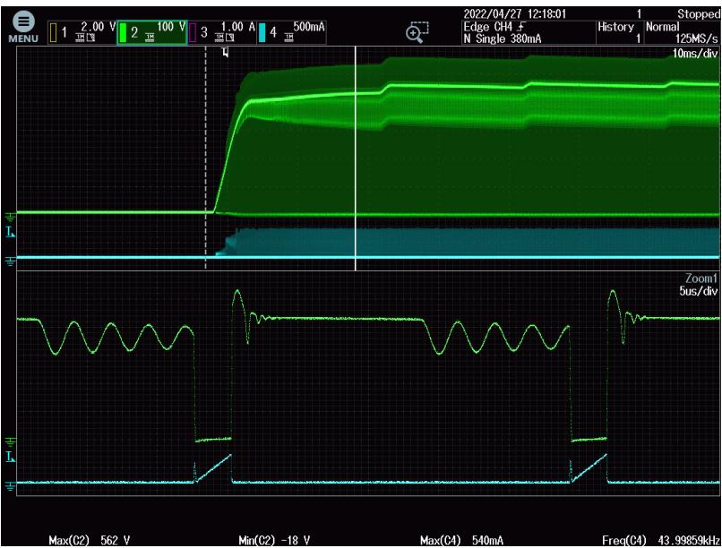

265 VAC

${ \mathsf { C H } } 2 { \mathsf { V } } _ { \mathsf { D S } }$  
$C H 4 1 _ { \mathsf { D } }$ $V _ { \mathsf { D S } } { = } 5 6 2 \vee$ $\mathsf { I } _ { \mathsf { M A X } } { = } 0 . 5 4 ~ \mathsf { A }$

Test Condition:

➢ Full Load

## MOS漏源极电压电流波形 (正常工作)

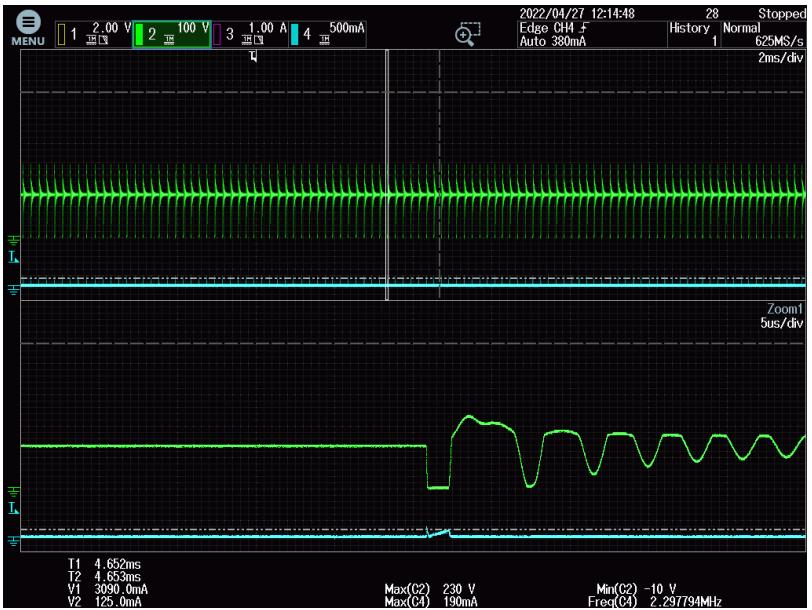

85 VAC

${ \mathsf { C H } } 2 { \mathsf { V } } _ { \mathsf { D S } }$  
$C H 4 1 _ { \mathsf { D } }$ $\mathtt { V } _ { \mathtt { D S } } mathtt { = } 2 3 0 \mathtt { V }$ IMAX= 190 mA $\mathsf { I } _ { \mathsf { M A X } } { = } 1 9 0 \mathsf { m } \mathsf { A }$

Test Condition:  
➢ No Load  
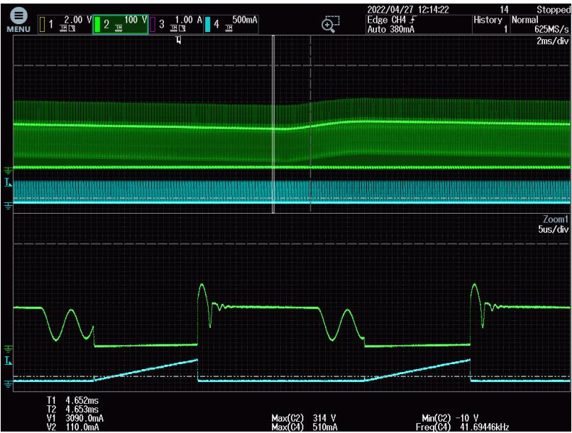

85 VAC

${ \mathsf { C H } } 2 { \mathsf { V } } _ { \mathsf { D S } }$  
$C H 4 1 _ { \mathsf { D } }$ $\mathtt { V _ { D S } } \mathtt { = } 3 1 4 \mathtt { V }$ IMAX= 0.51 A $\mathsf { I } _ { \mathsf { M A X } } = \mathbf { 0 . 5 1 A }$

Test Condition:  
➢ Full Load  
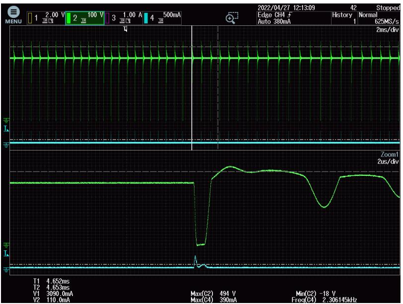

265 $\mathsf { v } _ { \mathsf { A C } }$

${ \mathsf { C H } } 2 \ { \mathsf { V } } _ { \mathsf { D S } }$  
$C H 4 1 _ { \mathsf { D } }$ $V _ { \mathsf { D } \mathsf { S } } { = } 4 9 4 \mathsf { V }$ IMAX=390 mA $\mathsf { I } _ { \mathsf { M A X } } { = } 3 9 0 \mathsf { m } \mathsf { A }$

Test Condition:  
➢ No Load  
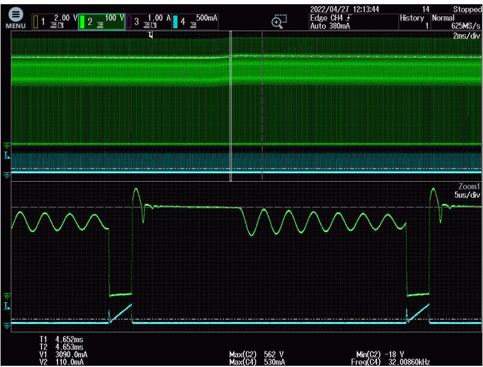

$2 6 5 \ : \mathsf { V } _ { \mathsf { A C } }$

${ \mathsf { C H } } 2 { \mathsf { V } } _ { \mathsf { D S } }$  
$C H 4 1 _ { \mathsf { D } }$ $V _ { \mathsf { D S } } { = } 5 6 2 \vee$ $\mathsf { I } _ { \mathsf { M A X } } { = } \mathsf { 0 } . 5 3 ~ \mathsf { A }$

Test Condition:

➢ Full Load

## 续流二极管电压波形

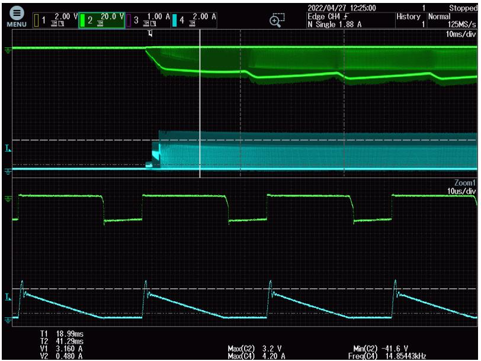

85 VAC

$C H 2 V _ { \mathsf { D } }$  
$C H 4 1 _ { \mathsf { D } }$ $\mathsf { V } _ { \mathsf { D } } { = } 4 1 . 6 \mathsf { V }$ $\mathsf { I } _ { \mathsf { D } } { = } 4 . 2 \mathsf { A }$

## Test Condition:

➢ Full Load  
➢ 开机

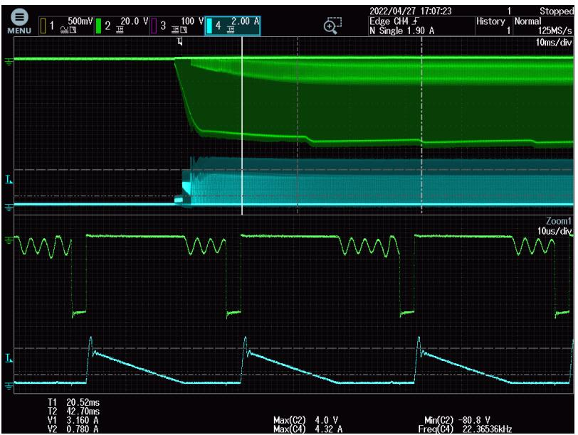

265 VAC

CH2 ${ \mathsf { V } } _ { \mathsf { D } }$  
CH4 ${ \sf I } _ { \sf D }$ $\mathtt { V } _ { \mathtt { D } } mathtt { = } 8 0 . 8 \ V$ $\mathsf { I } _ { \mathsf { D } } { = } 4 . 3 2 \mathsf { A }$

## Test Condition:

➢ Full Load  
➢ 开机

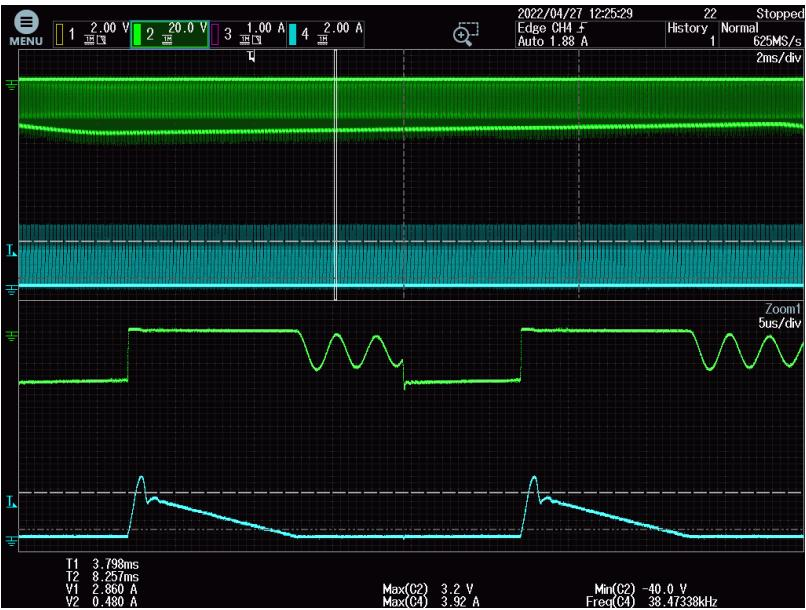

85 VAC

$C H 2 V _ { \mathsf { D } }$  
$C H 4 1 _ { \mathsf { D } }$ $\mathtt { V } _ { \mathtt { D } } \mathtt { = } 4 0 \ \mathtt { V }$ $\mathsf { I } _ { \mathsf { D } } { = } 3 . 9 2 \mathsf { A }$

## Test Condition:

➢ Full Load

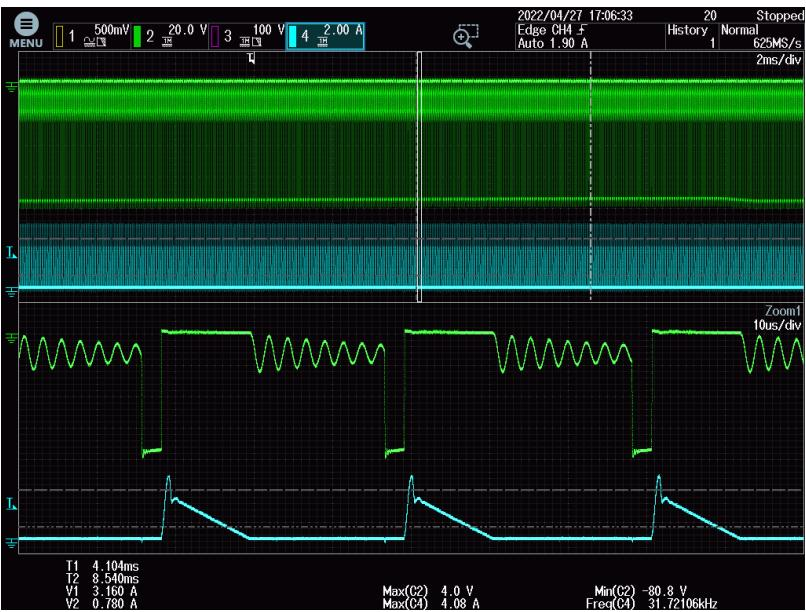

265 VAC

$C H 2 V _ { \mathsf { D } }$  
CH4 ID $C H 4 1 _ { \mathsf { D } }$ $\mathtt { V } _ { \mathtt { D } } { = } 8 0 . 8 \ V$ $\mathsf { I } _ { \mathsf { D } } { = } 4 . 0 8 \mathsf { A }$

## Test Condition:

➢ Full Load

## 输出短路时MOS和续流二极管波形

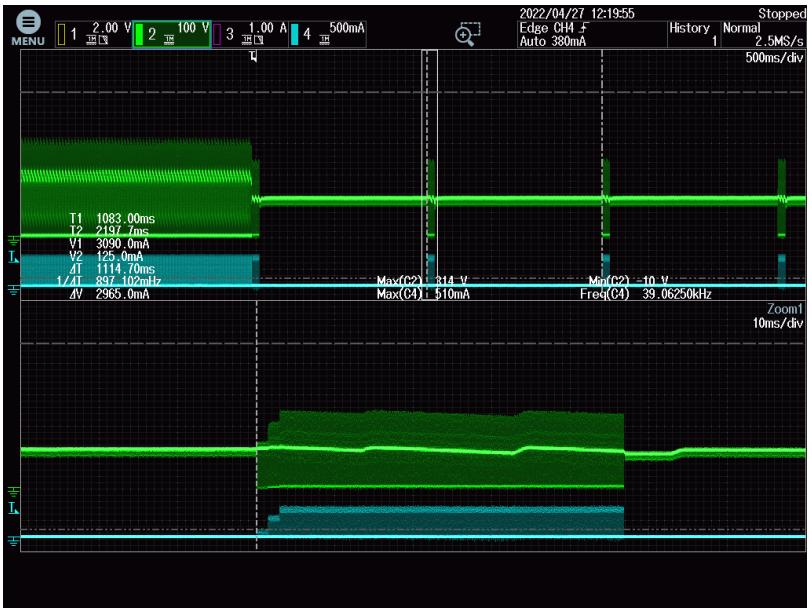

85 VAC

CH2 VDS  
CH4 ID $\begin{array} { r } { \mathsf { V } _ { \mathsf { D S \_ m a x } } = 3 1 4 \mathsf { V } } \\ { \mathsf { I _ { D S \_ m a x } } = 0 . 5 1 \mathsf { A } } \end{array}$

## MOS

## Test Condition:

➢ Full Load

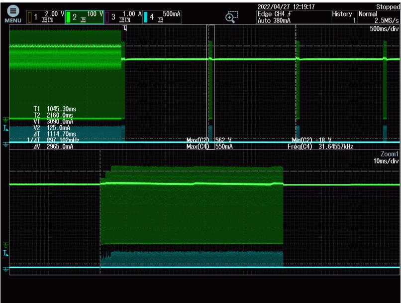

265 VAC

CH2 VDS  
CH4 ID $\mathtt { V } _ { \mathtt { D S \_ m a x } } = 5 6 2 \lor$ $\mathsf { I } _ { \mathsf { D } \mathsf { S } \_ \mathsf { m a x } } = \mathsf { 0 } . 5 5 \mathsf { A }$

## MOS

## Test Condition:

➢ Full Load

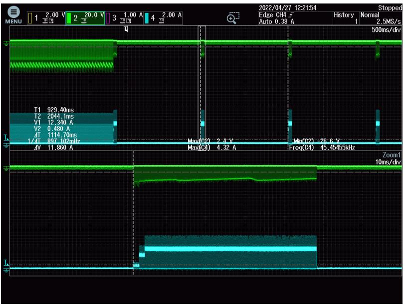

85 VAC

$C H 2 V _ { \mathsf { D } }$  
CH4 ID $\begin{array} { l } { { \mathsf { V } _ { \mathsf { D } \_ \mathsf { m a x } } = 2 6 . 6 \mathsf { V } } } \\ { { \mathsf { I } _ { \mathsf { D } \_ \mathsf { m a x } } = 4 . 3 2 \mathsf { A } } } \end{array}$ VD

## 二极管

## Test Condition:

➢ Full Load

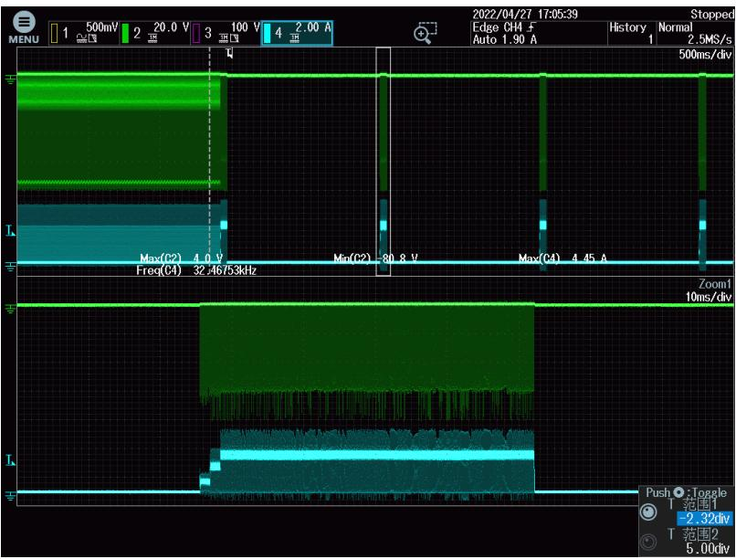

265 VAC

$C H 2 V _ { \mathsf { D } }$  
CH4 ID $C H 4 1 _ { \mathsf { D } }$ $\begin{array} { l } { { \mathsf { V } _ { \mathsf { D } } } _ { - \mathsf { m a x } } { = } 8 0 . 8 ~ \mathsf { V } } \\ { { \mathsf { I } _ { \mathsf { D } } } _ { - \mathsf { m a x } } { = } 4 . 4 5 ~ \mathsf { A } } \end{array}$

## 二极管

## Test Condition:

➢ Full Load

## 温升测试

<table><tr><td rowspan="2">项目</td><td colspan="4">温度(°C)</td></tr><tr><td>85VAC</td><td>115VAC</td><td>230VAC</td><td>264VAC</td></tr><tr><td>环境温度</td><td>48.2</td><td>49</td><td>49.7</td><td>49.7</td></tr><tr><td>BPA8505D (U1)</td><td>103.1</td><td>93.6</td><td>89.7</td><td>93.7</td></tr><tr><td>SB210 (D3)</td><td>96.3</td><td>92.1</td><td>89.1</td><td>90</td></tr><tr><td>变压器绕组 (T1)</td><td>102.7</td><td>95.9</td><td>91.1</td><td>91.9</td></tr><tr><td>变压器磁芯 (T1)</td><td>96.3</td><td>90.7</td><td>86.5</td><td>87.4</td></tr><tr><td>输入电解电容(C2)</td><td>69.5</td><td>66</td><td>63</td><td>63.4</td></tr><tr><td>输出电解电容(EC8)</td><td>75.1</td><td>71.9</td><td>69.7</td><td>70.6</td></tr></table>

## 测试说明

➢ 在温箱中进行测试  
➢ 电路板放在一个封闭的盒子内  
➢ 热电偶连接到各个测量点  
➢ 等测量点温度达到稳定后记录数据

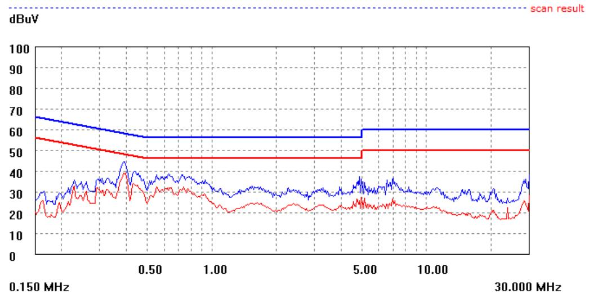

115VAC Line

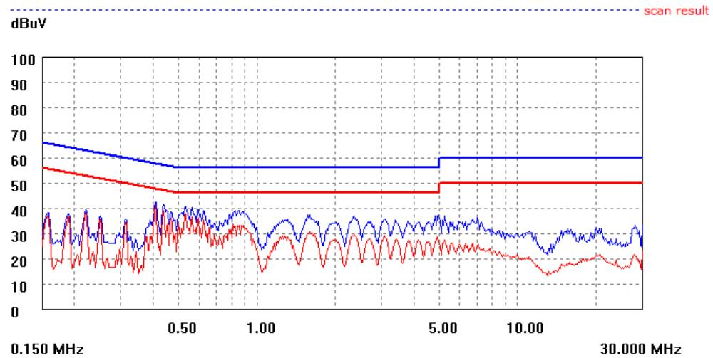

230VAC Line

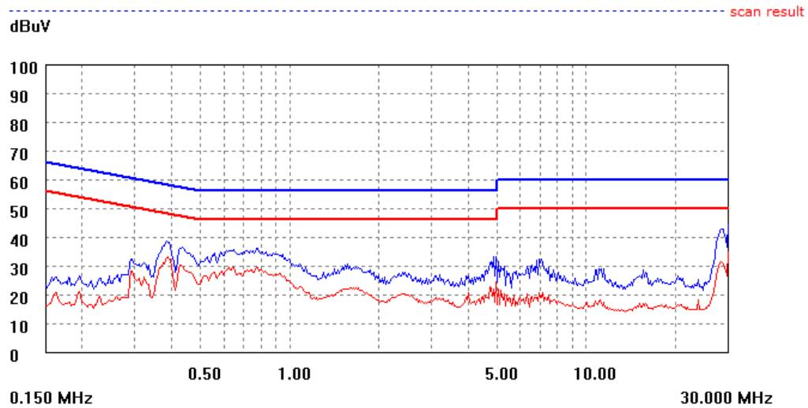

115VAC Neutral

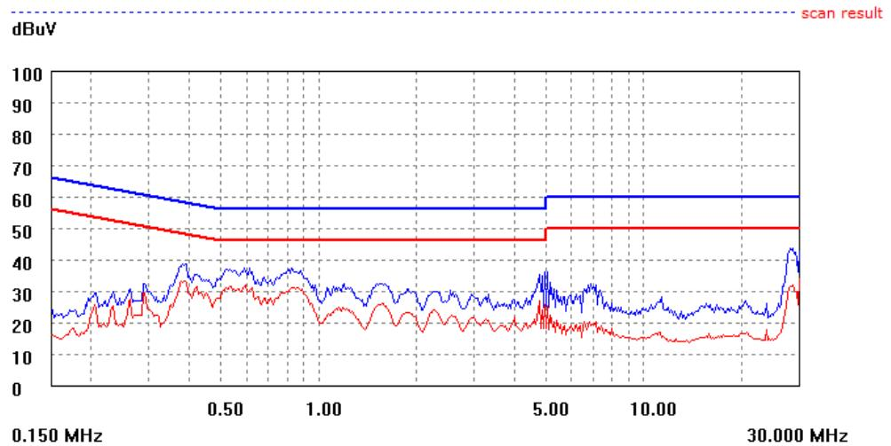

230VAC Neutral

## EMI (模拟)

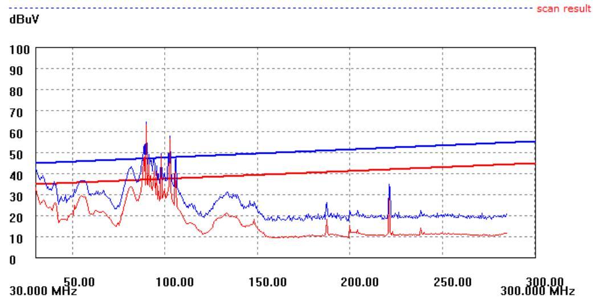

RE-115VAC

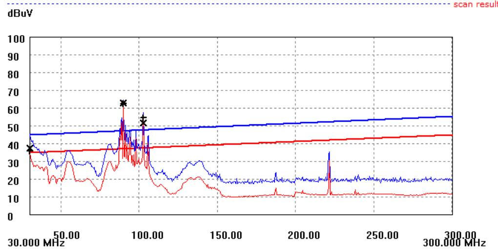

RE-230VAC

## THANK YOU FOR WATCHING
