## BPA8505D 客供测试评估\_5V150mA

上海晶丰明源半导体股份有限公司

Shanghai Bright Power Semiconductor Co., Ltd.

王岩

时间： 2021年7月

## 内容

BPA850XD简介  
电源规格  
电路及实物图  
PCB Layout图  
性能测试数据  
问题点反馈以及优化方法

## 产品特点：

集成 650V 高压 MOSFET  
PWM控制模式，低输出纹波  
内置软启动功能  
集成高压启动、自供电电路  
低音频噪声

## 应用领域：

家用电器辅助电源  
电机驱动辅助电源  
➢ IOT/智能家居/智能照明  
工业控制辅助电源

SOP7

<table><tr><td>项目描述</td><td>符号</td><td>最小</td><td>典型</td><td>最大</td><td>单位</td><td>备注</td></tr><tr><td colspan="7">输入</td></tr><tr><td>电压</td><td> $V_{IN}$ </td><td>85</td><td>115/230</td><td>265</td><td> $V_{AC}$ </td><td></td></tr><tr><td>频率</td><td> $f_{LINE}$ </td><td>47</td><td>50/60</td><td>63</td><td>Hz</td><td></td></tr><tr><td colspan="7">输出</td></tr><tr><td>输出电压</td><td> $V_{OUT}$ </td><td>4.75</td><td>5</td><td>5.25</td><td>V</td><td>±5%</td></tr><tr><td>输出电流</td><td> $I_{OUT}$ </td><td>0</td><td></td><td>150</td><td>mA</td><td></td></tr><tr><td>输出电压纹波</td><td> $V_{RIPPLE}$ </td><td></td><td></td><td>50</td><td>mV</td><td>20MHz带宽</td></tr><tr><td>连续输出功率</td><td> $P_{OUT}$ </td><td></td><td>0.75</td><td></td><td>W</td><td></td></tr><tr><td colspan="7">效率</td></tr><tr><td>待机功耗</td><td> $P_{STDBY}$ </td><td></td><td></td><td>145</td><td>mW</td><td>230VAC,包含假负载</td></tr><tr><td>满载效率</td><td>η</td><td>40</td><td></td><td></td><td>%</td><td></td></tr><tr><td colspan="7">环境</td></tr><tr><td>传导EMI</td><td></td><td colspan="4">满足CISPR22/EN55022 Class B, &gt;3dB 裕量</td><td></td></tr><tr><td>工作环境温度</td><td> $T_{AMP}$ </td><td>0</td><td></td><td>50</td><td>°C</td><td></td></tr></table>

BPA8505D  
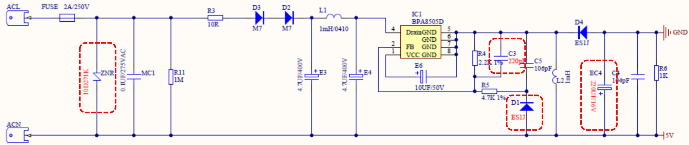

优化内容：1、压敏电阻不支持高压265VAC输入，如果出口日本等地区可以；

2、D1、D4都改为ES1J；  
3、C3改为220pF；  
4、EC4改为低ESR的电容；

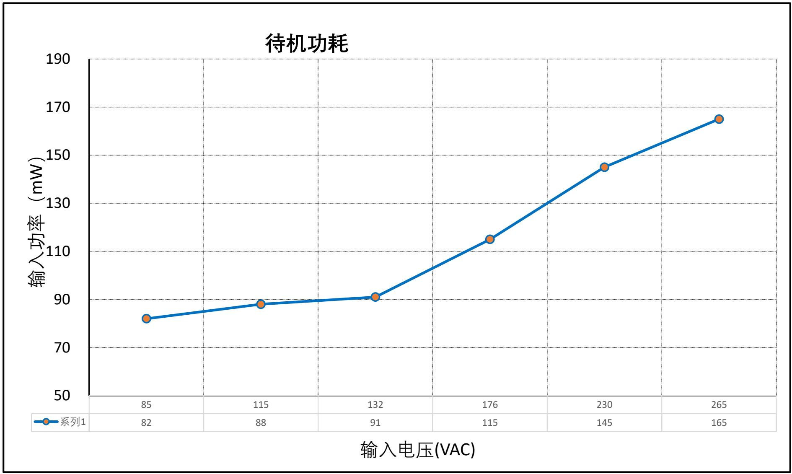

效率测试  
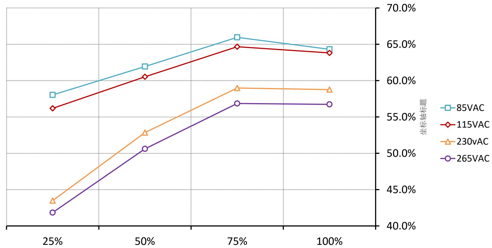

坐标轴标题

## 输出电压调整率

<table><tr><td> $V_{IN}(VAC)$ Load(%)</td><td>85</td><td>115</td><td>132</td><td>176</td><td>230</td><td>265</td><td>平均值</td><td>线调整率</td></tr><tr><td>0</td><td>5.068</td><td>5.075</td><td>5.072</td><td>5.073</td><td>5.072</td><td>5.096</td><td>5.076</td><td>0.55%</td></tr><tr><td>20%</td><td>4.880</td><td>4.886</td><td>4.880</td><td>4.884</td><td>4.880</td><td>4.882</td><td>4.882</td><td>0.12%</td></tr><tr><td>40%</td><td>4.834</td><td>4.833</td><td>4.832</td><td>4.834</td><td>4.836</td><td>4.834</td><td>4.834</td><td>0.08%</td></tr><tr><td>60%</td><td>4.810</td><td>4.806</td><td>4.804</td><td>4.807</td><td>4.805</td><td>4.805</td><td>4.806</td><td>0.12%</td></tr><tr><td>80%</td><td>4.786</td><td>4.790</td><td>4.784</td><td>4.788</td><td>4.788</td><td>4.786</td><td>4.787</td><td>0.13%</td></tr><tr><td>100%</td><td>4.776</td><td>4.773</td><td>4.772</td><td>4.772</td><td>4.776</td><td>4.776</td><td>4.774</td><td>0.08%</td></tr><tr><td>平均值</td><td>4.859</td><td>4.861</td><td>4.857</td><td>4.860</td><td>4.860</td><td>4.863</td><td rowspan="2" colspan="2"></td></tr><tr><td>负载调整率</td><td>6.01%</td><td>6.21%</td><td>6.18%</td><td>6.19%</td><td>6.09%</td><td>6.58%</td></tr></table>

◼ 计算方法：调整率=100%\*(最大值-最小值)/平均值  
测试条件：带1kΩ假负载（\~25mW）

## 原始样机测试数据

## ---元器件保持原始参数

上海晶丰明源半导体股份有限公司

Shanghai Bright Power Semiconductor Co., Ltd.

## 输出电压纹波（客供输出电容）

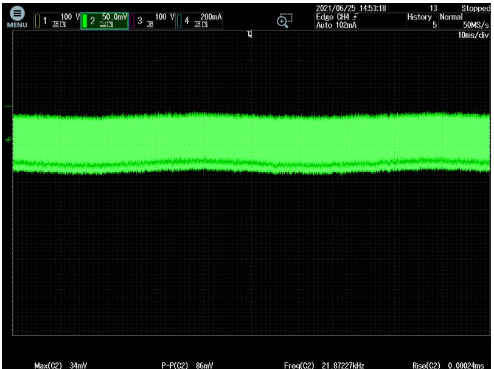

85 VAC

CH2 VOUT Ripple VPK-PK=86mV

## Test Condition:

➢ Full Load  
客供输出16V220uF 电容，FB下拉电阻 不并联电容

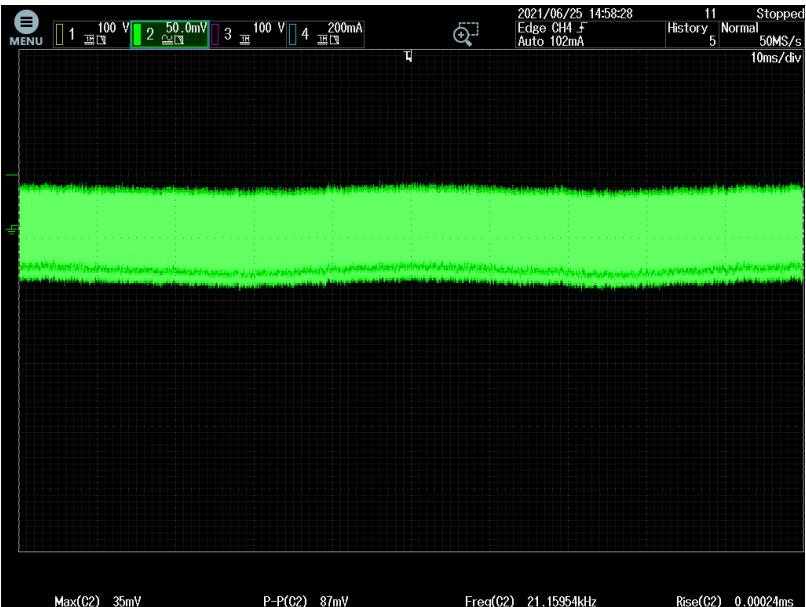

115 VAC

CH1 $\mathsf { V } _ { \mathsf { O U T } }$ Ripple $\mathtt { V } _ { \mathtt { P K - P K } } { = } 8 7 \mathsf { m V }$

## Test Condition:

➢ Full Load  
客供输出16V220uF 电容，FB下拉电阻 不并联电容

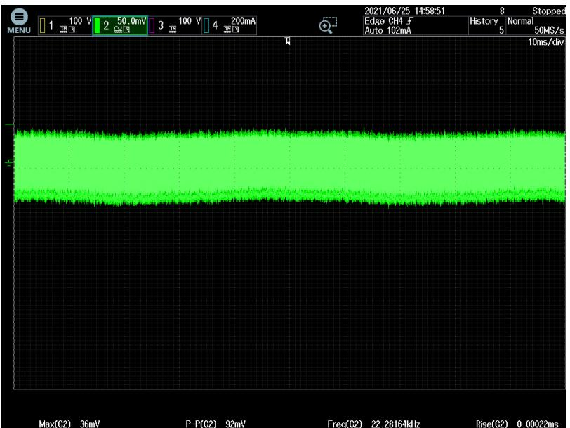

230 VAC

CH2 VOUT Ripple VPK-PK=92mV

## Test Condition:

➢ Full Load  
客供输出16V220uF 电容，FB下拉电阻 不并联电容

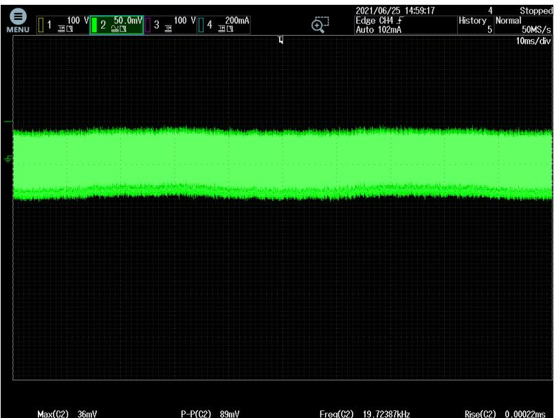

265 VAC

CH2 VOUT Ripple VPK-PK=89mV

## Test Condition:

➢ Full Load  
客供输出16V220uF 电容，FB下拉电阻 不并联电容

## 动态负载(50%-100%，客供输出电容)

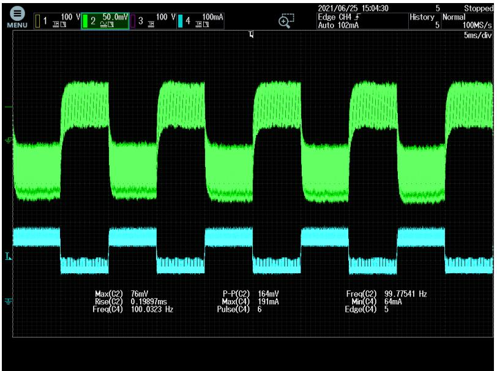

85 VAC

CH2 VOUT $\mathsf { V } _ { \mathsf { O U T } }$ $v _ { p \kappa \cdot P K } { = } 1 6 4 m v$ CH4 IOUT $\mathsf { I } _ { 0 \mathsf { U T } }$

## Test Condition:

➢ 0.075 A-0.15 A-0.075A  
➢ Slew Rate: 0.5 A/μS  
➢ Frequency: 100 Hz  
拉电阻不并联电

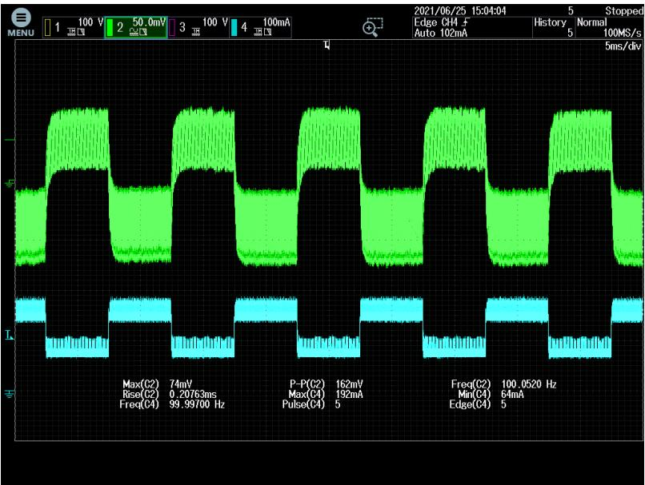

115 VAC

CH2 VOUT ${ \mathsf { C H } } 2 { \mathsf { V } } _ { \mathsf { O U T } }$ $v _ { p | k \cdot P K } = 1 6 2 m v$  
$\mathsf { C H 4 } \mathsf { I } _ { \mathsf { O U T } }$

## Test Condition:

➢ 0.075 A-0.15 A-0.075A  
➢ Slew Rate: 0.5 A/μS  
➢ Frequency: 100 Hz  
拉电阻不并联电

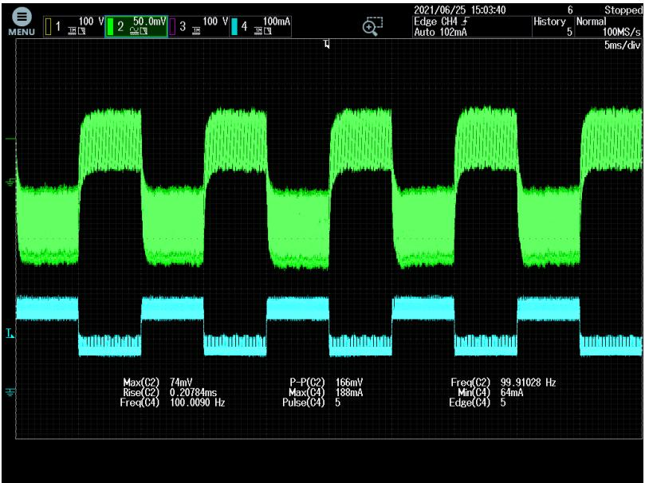

230 VAC

CH2 VOUT $\mathsf { V } _ { \mathsf { O U T } }$ $v _ { p \kappa \mathrm { - P K } } { = } 1 6 6 \ m v$  
CH4 ${ \mathsf I } _ { 0 \mathsf U \top }$

## Test Condition:

➢ 0.075 A-0.15 A-0.075A  
➢ Slew Rate: 0.5 A/μS  
➢ Frequency: 100 Hz  
拉电阻不并联电

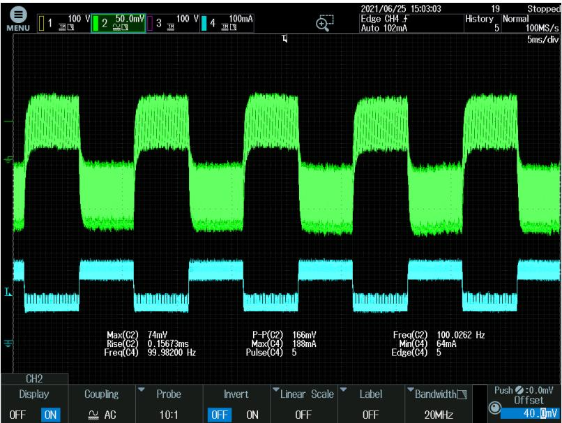

265 VAC

CH2 VOUT ${ \mathsf { C H } } 2 { \mathsf { V } } _ { \mathsf { O U T } }$ $v _ { p _ { k - P K } } = 1 6 6 m v$  
$\mathsf { C H 4 } \mathsf { I } _ { \mathsf { O U T } }$

## Test Condition:

➢ 0.075 A-0.15 A-0.075A  
➢ Slew Rate: 0.5 A/μS  
➢ Frequency: 100 Hz  
拉电阻不并联电

## 输出电压开机波形（下偏电阻并联2.2uF）

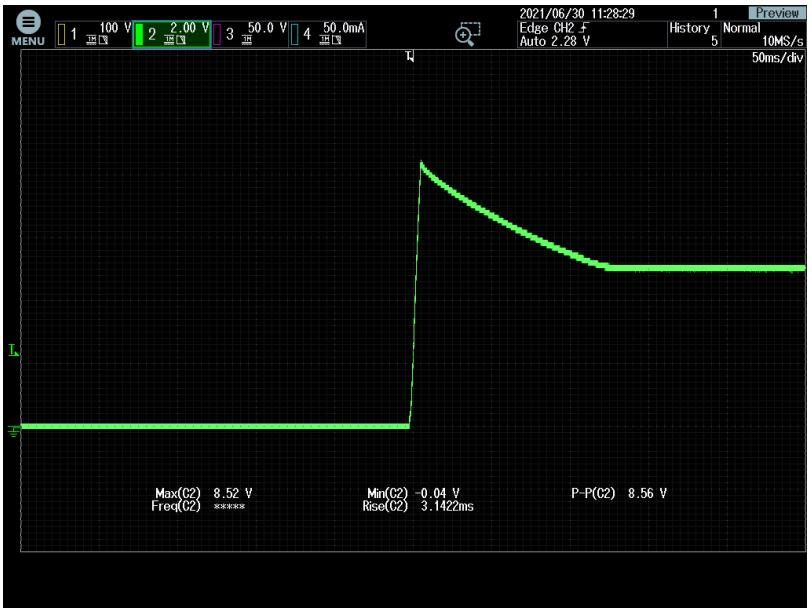

85 VAC

CH2 VOUT VOUTMAX: 8.52 V

## Test Condition:

➢ Full Load  
BPA8505D， FB下偏电阻2.2K并联C3，容值为2.2uF，无法稳定启机，切空载启机后，带载波形也是震荡；

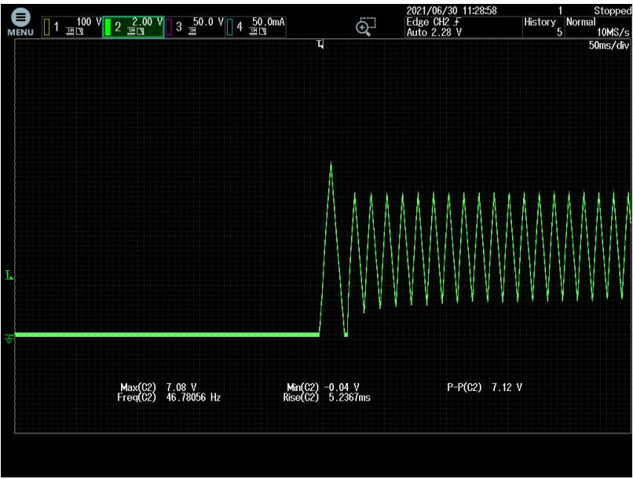

85 VAC

CH2 VOUT VOUTMAX: 7.08 V

## Test Condition:

➢ Full Load  
BPA8505D， FB下偏电阻2.2K并联C3，容值为2.2uF，无法稳定启机，切空载启机后，带载波形也是震荡；

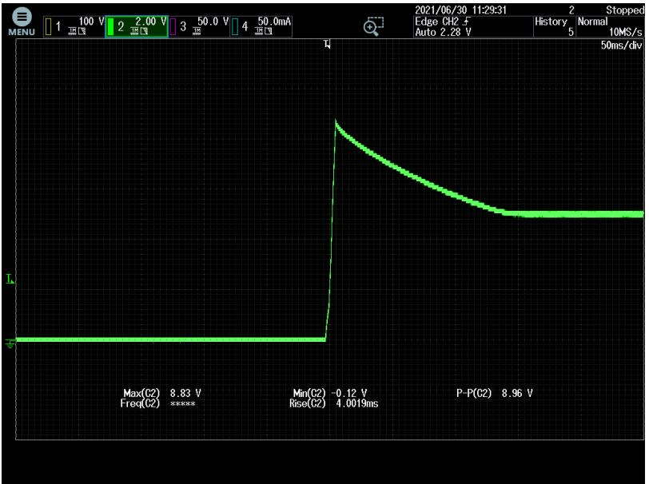

265 VAC

CH2 VOUT VOUTMAX: 8.83 V

## Test Condition:

➢ Full Load  
BPA8505D， FB下偏电阻2.2K并联C3，容值为2.2uF，无法稳定启机，切空载启机后，带载波形也是震荡；

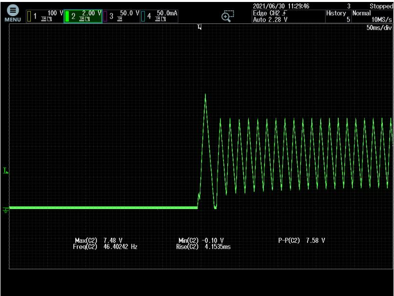

265 VAC

CH2 VOUT VOUTMAX: 7.48 V

## Test Condition:

➢ Full Load  
BPA8505D， FB下偏电阻2.2K并联C3，容值为2.2uF，无法稳定启机，切空载启机后，带载波形也是震荡；

## 漏极电流开机波形

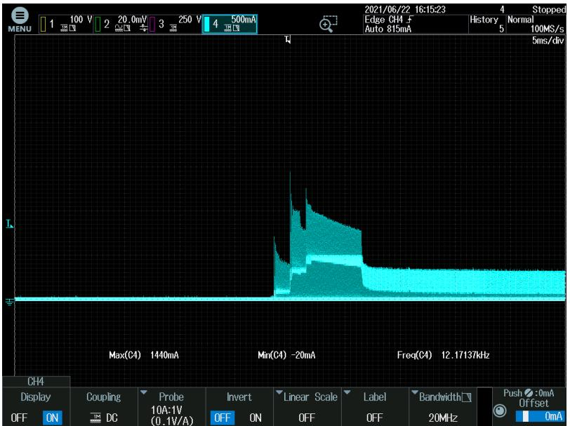

85 VAC

CH4 IDIMAX: 1.44A

## Test Condition:

➢ Full Load 0.15A  
反馈二极管为M7

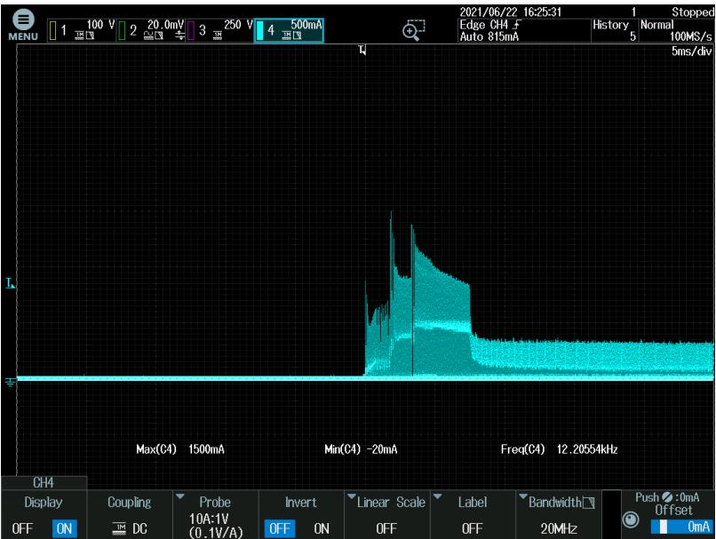

85 VAC

CH4 IDIMAX: 1.5 A

## Test Condition:

➢ Full Load 0.15A  
反馈二极管为M7

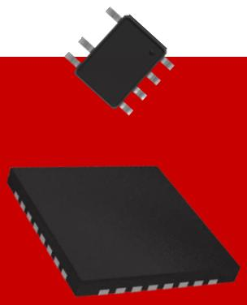

## 对样机优化后测试数据

## ---元器件参数优化后

上海晶丰明源半导体股份有限公司

Shanghai Bright Power Semiconductor Co., Ltd.

## 输出电压纹波

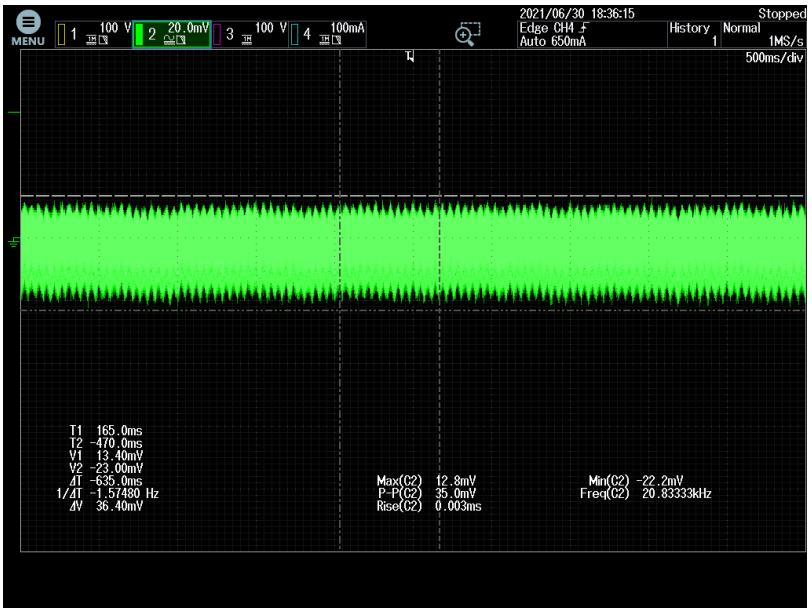

85 VAC

$\begin{array} { r l } & { \mathsf { C H 2 } \mathsf { V _ { 0 \cup \top } R i p p l e } } \\ & { \mathsf { V _ { P K - P K } } \mathsf { = } 3 5 \mathsf { m v } } \end{array}$

## Test Condition:

➢ Full Load  
实验室16V220uF电 容，FB下拉电阻并 联220pF电容

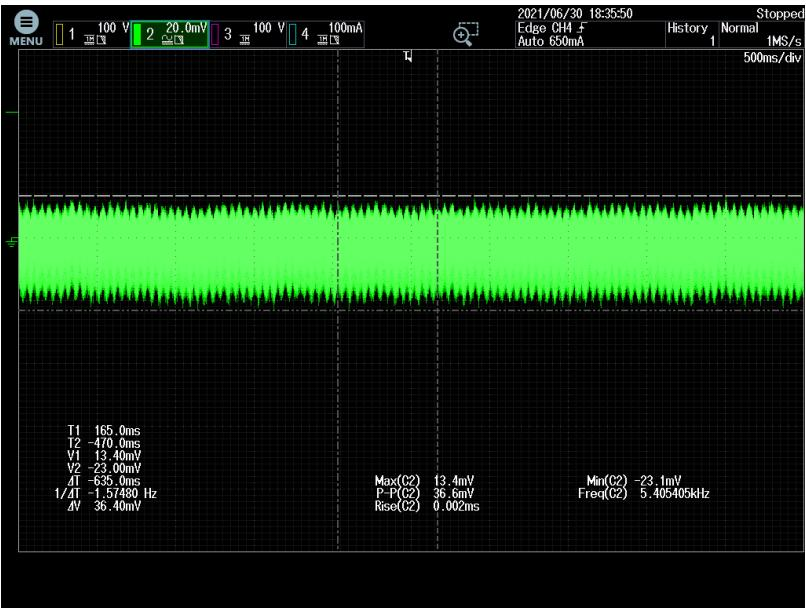

115 VAC

CH2 $\mathsf { V } _ { \mathsf { O U T } }$ Ripple $V _ { P K - P K } = 3 6 . 6 m V$

## Test Condition:

➢ Full Load  
实验室16V220uF电 容，FB下拉电阻并 联220pF电容

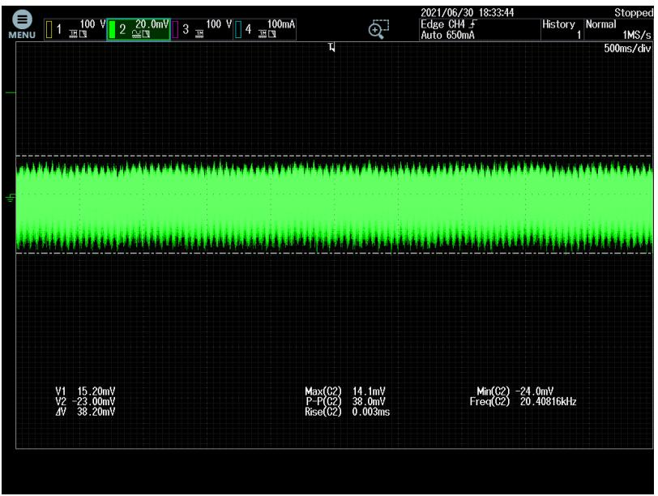

230 VAC

CH2 VOUT Ripple VPK-PK=38mV

## Test Condition:

➢ Full Load  
实验室16V220uF电 容，FB下拉电阻并 联220pF电容

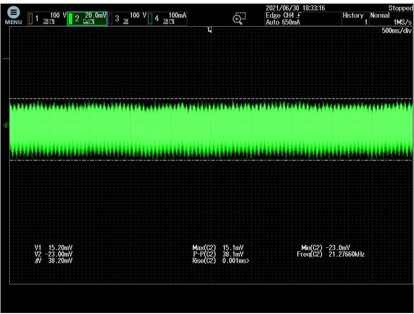

265 VAC

CH2 $\mathsf { V } _ { \mathsf { O U T } }$ Ripple VPK-PK=38.1mV

## Test Condition:

➢ Full Load  
实验室16V220uF电 容，FB下拉电阻并 联 $2 2 0 { \mathsf { p } } { \mathsf { F } }$ 电容

## 输出电压开机波形

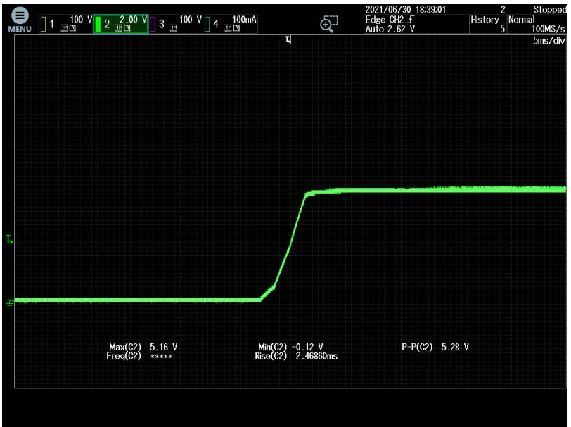

85 VAC

CH2 VOUT TRISE: 2.46 mS

## Test Condition:

➢ No Load  
BPA8505D，FB下偏电阻2.2K并联C3，容值为220pF，不引起过冲

85 VAC

CH2 VOUT TRISE: 3.67 mS

## Test Condition:

➢ Full Load  
BPA8505D，FB下偏电阻2.2K并联C3，容值为220pF，不引起过冲

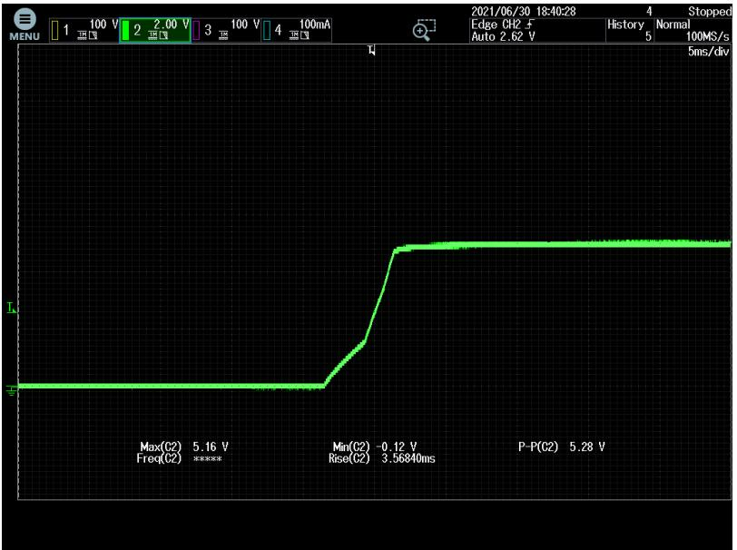

265 VAC

CH2 VOUT TRISE: 3.56 mS

## Test Condition:

➢ No Load  
BPA8505D，FB下偏电阻2.2K并联C3，容值为220pF，不引起过冲

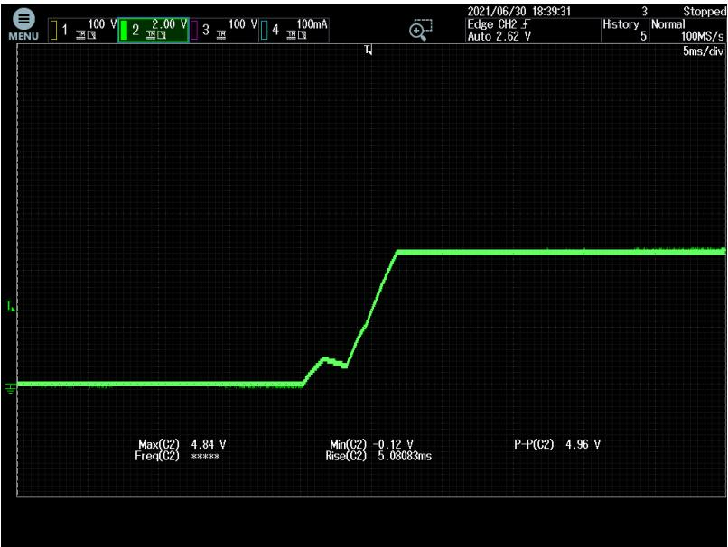

265 VAC

CH2 VOUT TRISE:5.08mS

## Test Condition:

➢ Full Load  
BPA8505D，FB下偏电阻2.2K并联C3，容值为220pF，不引起过冲

## 动态负载(50%-100%)

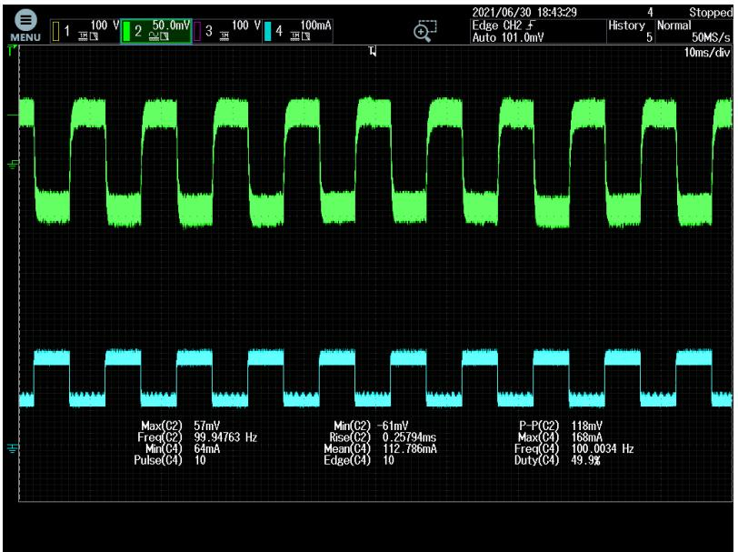

85 VAC

CH2 VOUT ${ \mathsf { C H } } 2 { \mathsf { V } } _ { \mathsf { O U T } }$ $v _ { p _ { k - P K } } { = } 1 1 8 m v$ CH4 IOUT $\mathsf { I } _ { 0 \mathsf { U T } }$

## Test Condition:

➢ 0.075 A-0.15 A-0.075A  
➢ Slew Rate: 0.5 A/μS  
➢ Frequency: 100 Hz  
非客供输出电容，FB下拉电阻并联220pF电容

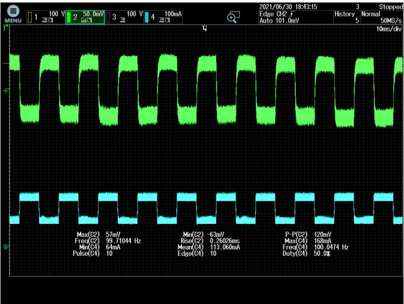

115 VAC

CH2 VOUT ${ \mathsf { C H } } 2 { \mathsf { V } } _ { \mathsf { O U T } }$ $v _ { p | \mathrm { x } \mathrm { . } p | } = 1 2 0 m v$  
$\mathsf { C H 4 } \mathsf { I } _ { \mathsf { O U T } }$

## Test Condition:

➢ 0.075 A-0.15 A-0.075A  
➢ Slew Rate: 0.5 A/μS  
➢ Frequency: 100 Hz  
非客供输出电容，FB下拉电阻并联220pF电容

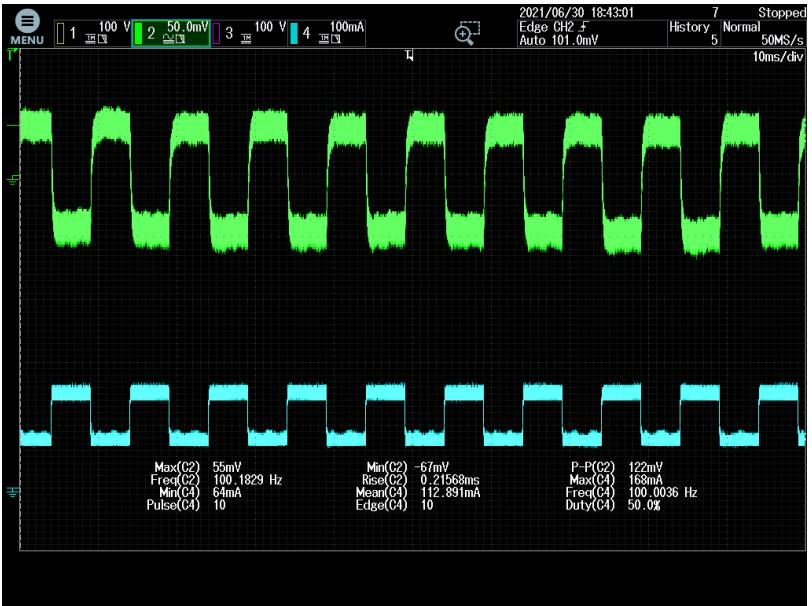

230 VAC

CH2 VOUT $\mathsf { V } _ { \mathsf { O U T } }$ VPK-PK=122 mV $v _ { p | \cdot \cdot P K } = 1 2 2 m v$  
CH4 ${ \mathsf I } _ { 0 \mathsf U \top }$

## Test Condition:

➢ 0.075 A-0.15 A-0.075A  
➢ Slew Rate: 0.5 A/μS  
➢ Frequency: 100 Hz  
非客供输出电容，FB下拉电阻并联220pF电容

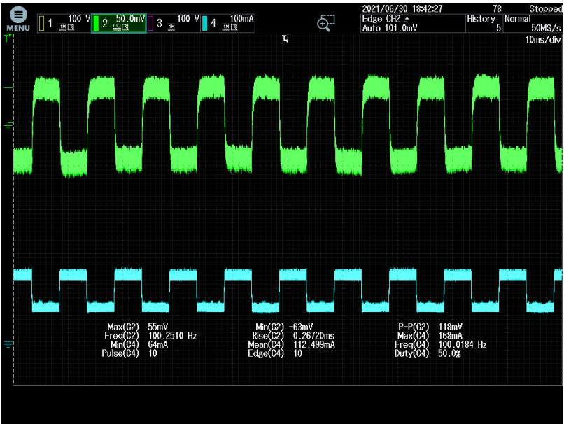

265 VAC

CH2 V ${ \mathsf { C H } } 2 { \mathsf { V } } _ { \mathsf { O U T } }$ $v _ { p _ { k - P K } } { = } 1 1 8 m v$  
$\mathsf { C H 4 } \mathsf { I } _ { \mathsf { O U T } }$

## Test Condition:

➢ 0.075 A-0.15 A-0.075A  
➢ Slew Rate: 0.5 A/μS  
➢ Frequency: 100 Hz  
非客供输出电容，FB下拉电阻并联220pF电容

## 动态负载(10%-90%)

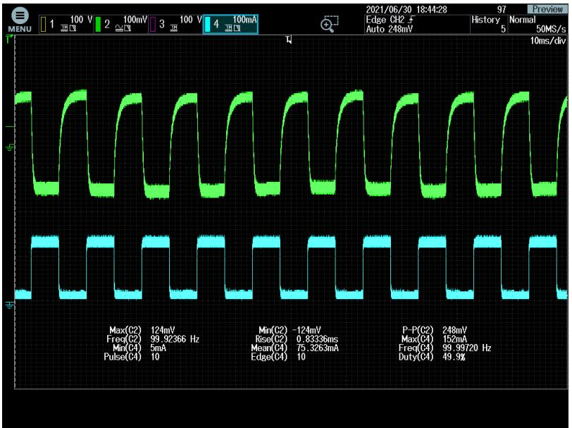

85 VAC

${ \mathsf { C H } } 2 { \mathsf { V } } _ { \mathsf { O U T } }$ CH2 VOUT $V _ { P K - P K } = 2 4 8 m v$ CH4 IOUT $\mathsf { I } _ { 0 \mathsf { U T } }$

## Test Condition:

➢ 0.015A-0.135 A-0.015A  
➢ Slew Rate: 0.5 $\mathsf { A } / \mu \mathsf { S }$  
➢ Frequency: 100 Hz  
非客供输出电容，FB下拉电阻并联220pF电容

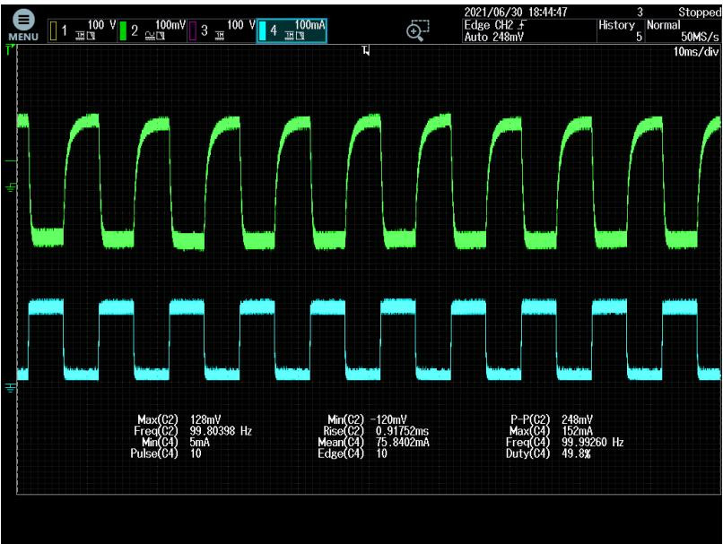

115 VAC

CH2 VOUT ${ \mathsf { C H } } 2 { \mathsf { V } } _ { \mathsf { O U T } }$ $V _ { P K - P K } = 2 4 8 m v$  
$\mathsf { C H 4 } \mathsf { I } _ { \mathsf { O U T } }$

## Test Condition:

➢ 0.015A-0.135 A-0.015A  
➢ Slew Rate: 0.5 A/μS  
➢ Frequency: 100 Hz  
非客供输出电容，FB下拉电阻并联220pF电容

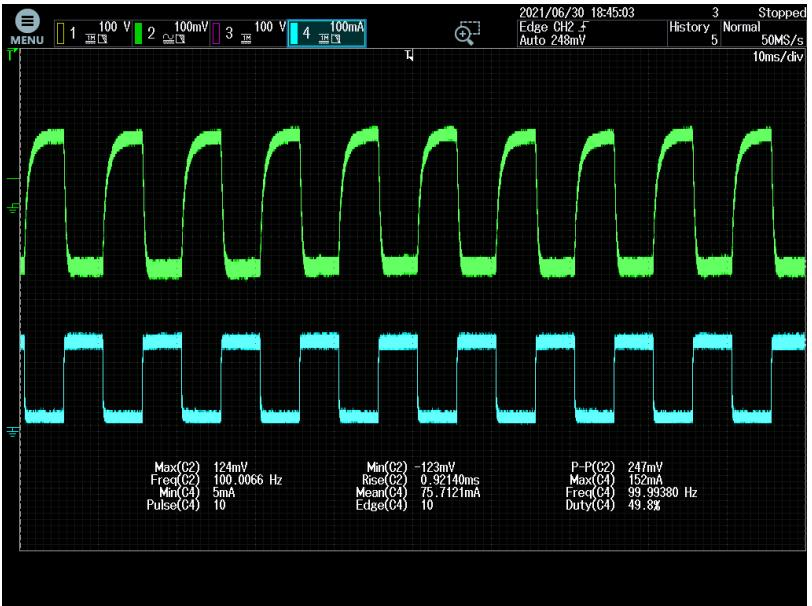

230 VAC

CH2 VOUT $\mathsf { V } _ { \mathsf { O U T } }$ VPK-PK=247mV $V _ { P K - P K } = 2 4 7 m v$  
CH4 ${ \mathsf I } _ { 0 \mathsf U \top }$

## Test Condition:

➢ 0.015A-0.135 A-0.015A  
➢ Slew Rate: 0.5 A/μS  
➢ Frequency: 100 Hz  
非客供输出电容，FB下拉电阻并联220pF电容

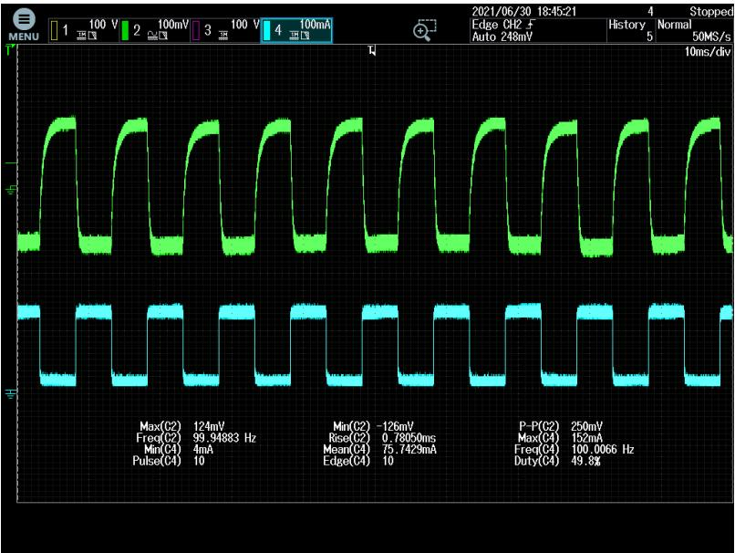

265 VAC

CH2 VOUT ${ \mathsf { C H } } 2 { \mathsf { V } } _ { \mathsf { O U T } }$ $v _ { p _ { k - P K } } = 2 5 0 m v$  
$\mathsf { C H 4 } \mathsf { I } _ { \mathsf { O U T } }$

## Test Condition:

➢ 0.015A-0.135 A-0.015A  
➢ Slew Rate: 0.5 A/μS  
➢ Frequency: 100 Hz  
非客供输出电容，FB下拉电阻并联220pF电容

## MOSFET漏源极电压和漏极电流波形

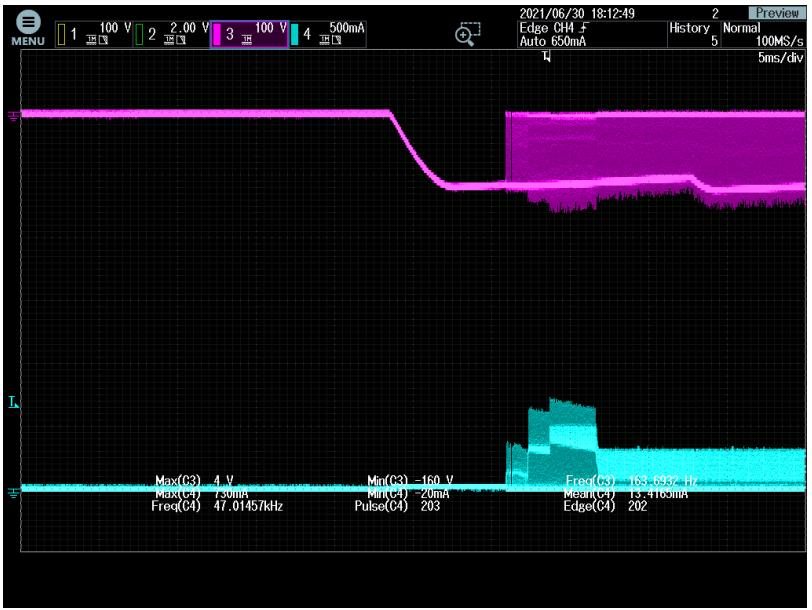

85 VAC

${ \mathsf { C H 3 } } \mathsf { V _ { D S } }$  
$C H 4 1 _ { \mathsf { D } }$ $V _ { \sf D S M A X } .$ 160 V $\mathsf { I } _ { \mathsf { M A X } } .$ 0.73 A

## Test Condition:

➢ Full Load  
FB下偏电阻2.2K并 联C3，容值为 220pF

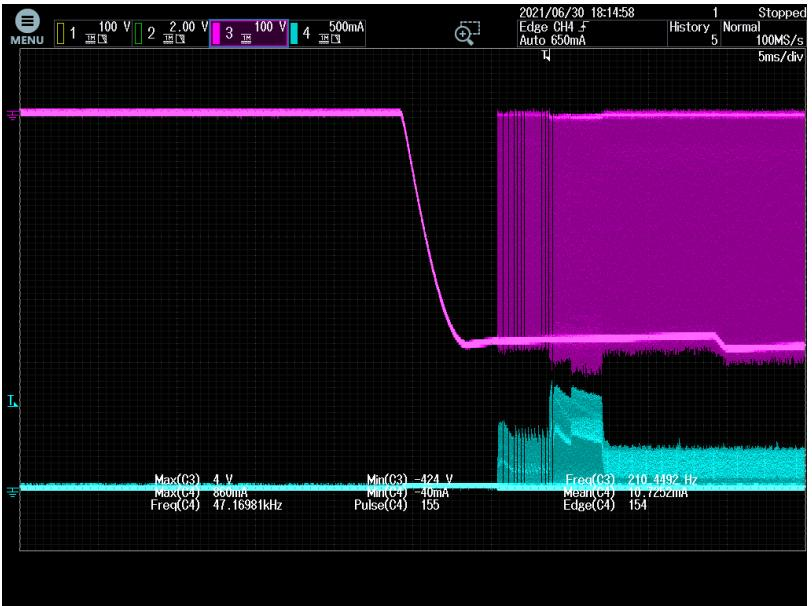

265 VAC

${ \mathsf { C H } } 2 \ { \mathsf { V } } _ { \mathsf { D S } }$  
CH4 ${ \sf I } _ { \sf D }$ $\mathsf { V } _ { \mathsf { D S M A X } } .$ 424 V $\mathsf { I } _ { \mathsf { M A X } } .$ 0.86 A

## Test Condition:

➢ Full Load  
FB下偏电阻2.2K并 联C3，容值为 220pF

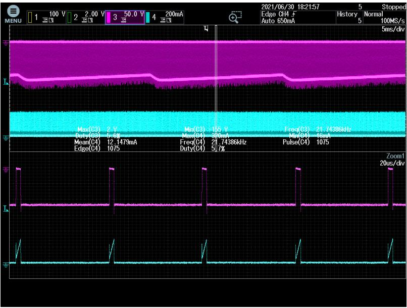

85 VAC

${ \mathsf { C H } } 2 { \mathsf { V } } _ { \mathsf { D S } }$  
CH4 ID $C H 4 1 _ { \mathsf { D } }$ $\mathsf { V } _ { \mathsf { D S M A X } } .$ 155 V $\mathsf { I } _ { \mathsf { M A X } } .$ 0.32 A

## Test Condition:

➢ Full Load  
FB下偏电阻2.2K并 联C3，容值为 220pF

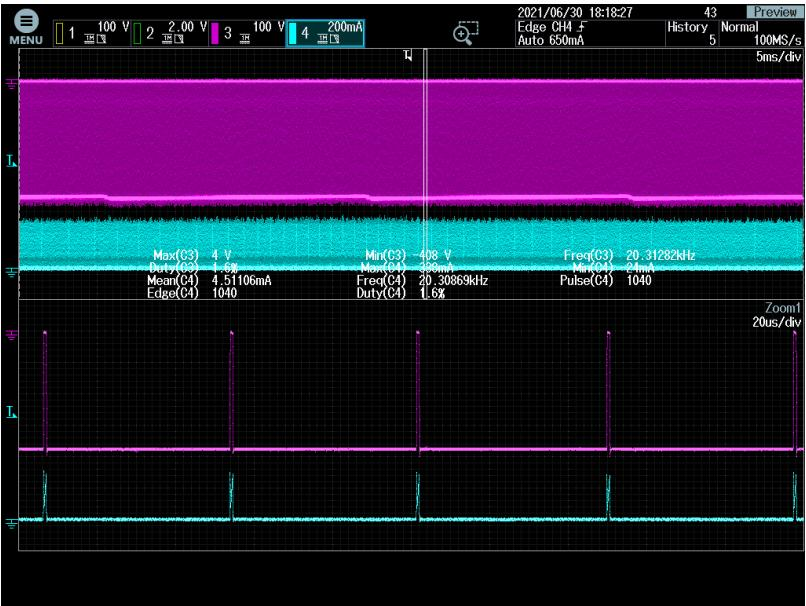

265 $\mathsf { v } _ { \mathsf { A C } }$

${ \mathsf { C H } } 2 { \mathsf { V } } _ { \mathsf { D S } }$  
CH4 I $C H 4 1 _ { \mathsf { D } }$ $\mathsf { V } _ { \mathsf { D S M A X } } .$ 408 V $\mathsf { I } _ { \mathsf { M A X } } .$ 0.338 A

## Test Condition:

➢ Full Load  
FB下偏电阻2.2K并 联C3，容值为 220pF

## 电感电流开机波形

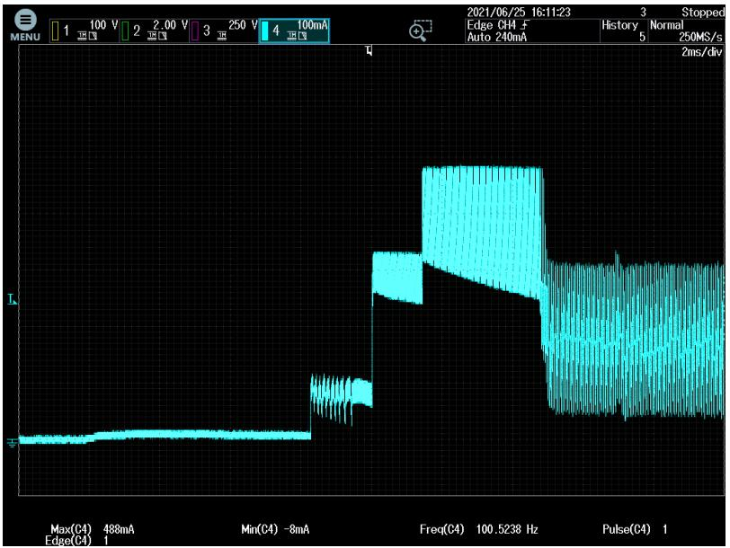

85 VAC

➢ CH4 IL IMAX : 0.488 A

## Test Condition:

➢ Full Load

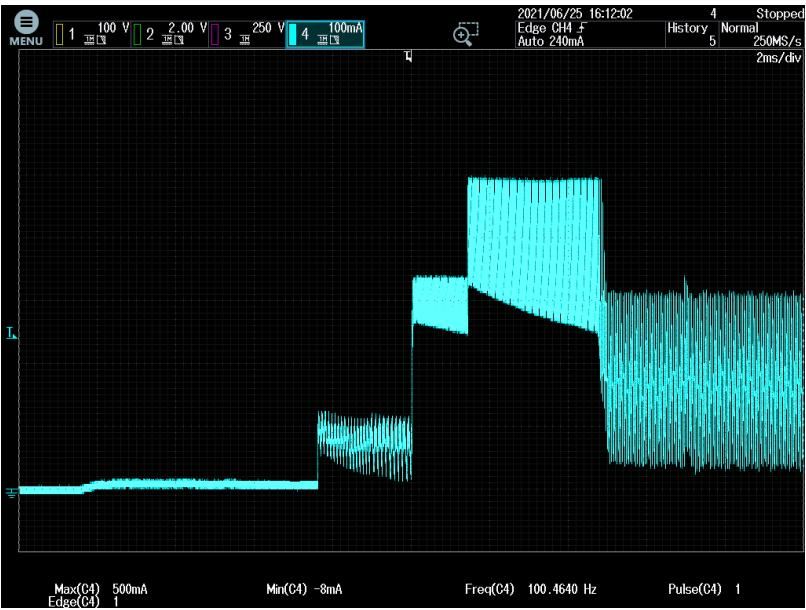

115 VAC

CH4 IL IMAX : 0.5 A

## Test Condition:

➢ Full Load

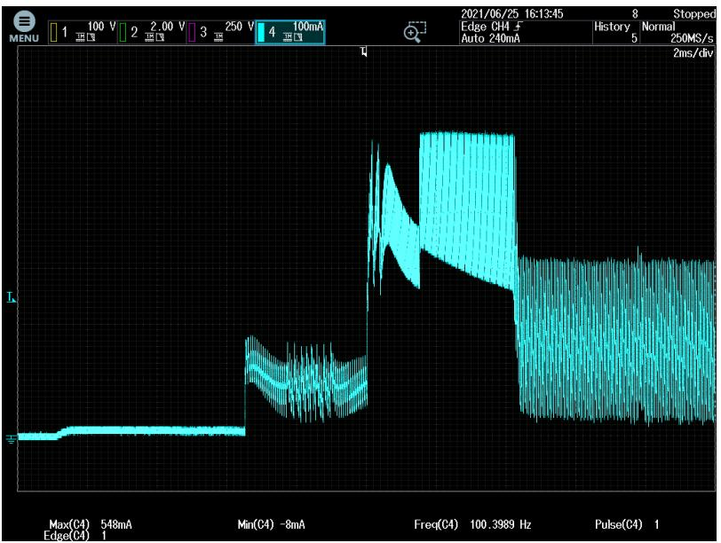

230 VAC

CH4 IL IMAX : 0.548 A

## Test Condition:

➢ Full Load

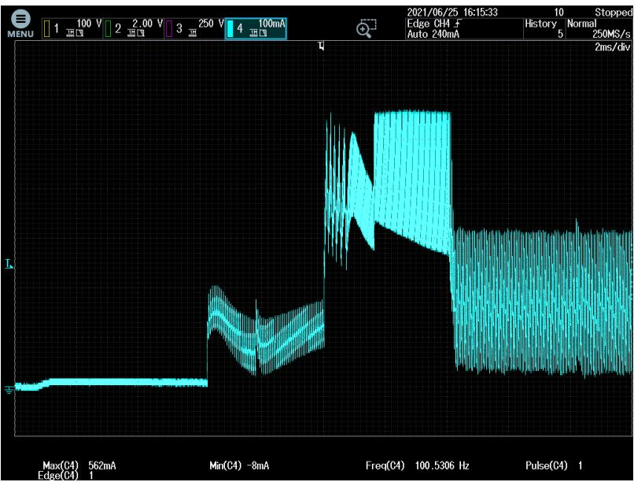

265 VAC

CH4 IL IMAX : 0.562 A

## Test Condition:

➢ Full Load

## 短路保护 （MOSFET波形）

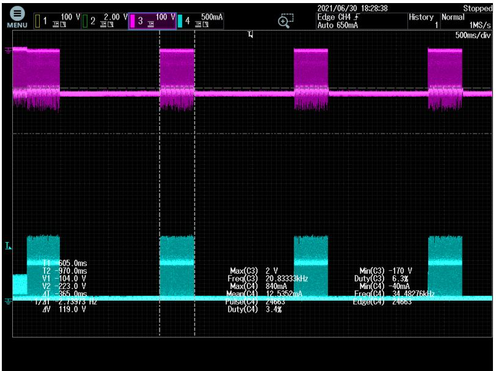

85 VAC

CH3 VDS  
CH4 ID  
◼ VDSMAX: 170 V IMAX: 0.84 A  
➢ Full Load  
FB下偏电阻2.2K并 联C3，容值为 220pF

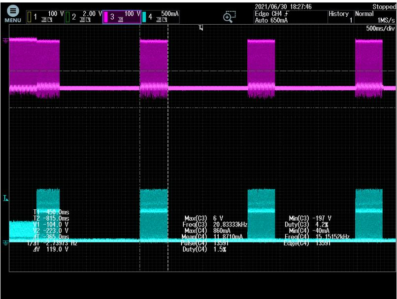

115 VAC

CH3 VDS  
CH4 ID  
◼ VDSMAX: 197 V IMAX: 0.86 A  
➢ Full Load  
FB下偏电阻2.2K并联 C3，容值为220pF

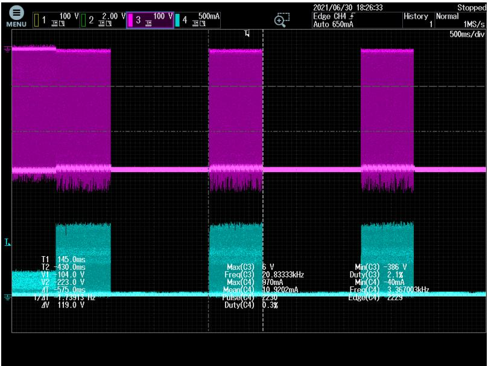  
230 VAC

CH3 VDS  
CH4 ID  
◼ VDSMAX: 386 V IMAX: 0.97 A  
➢ Full Load  
FB下偏电阻2.2K并 联C3，容值为 220pF

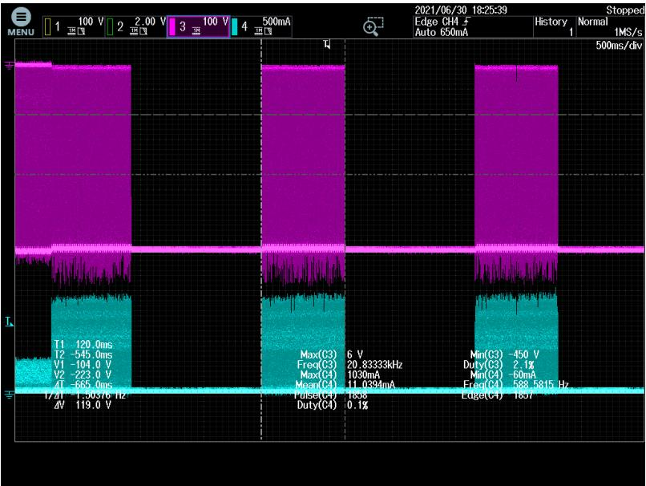

265 VAC

CH3 VDS  
CH4 ID  
VDSMAX: 450 V IMAX: 1.03 A  
➢ Full Load  
FB下偏电阻2.2K并 联C3，容值为 220pF

## 温度测试（5V/0.15A）

<table><tr><td rowspan="2">项目</td><td colspan="2">85VAC</td><td colspan="2">265VAC</td></tr><tr><td>温度</td><td>温升</td><td>温度</td><td>温升</td></tr><tr><td>环境温度</td><td colspan="2">25.6</td><td colspan="2">24.8</td></tr><tr><td>BPA8505D</td><td>38</td><td>12.4</td><td>49</td><td>24.2</td></tr><tr><td>续流二极管</td><td>41.2</td><td>15.6</td><td>43.1</td><td>18.3</td></tr><tr><td>功率电感</td><td>36.86</td><td>11.26</td><td>39.2</td><td>14.4</td></tr></table>

## 测试说明

➢常温下密闭纸箱中进行测试；  
➢电路板放在一个封闭的盒子内；  
➢热电偶连接到各个测量点；  
➢等测量点温度达到稳定后记录数据；

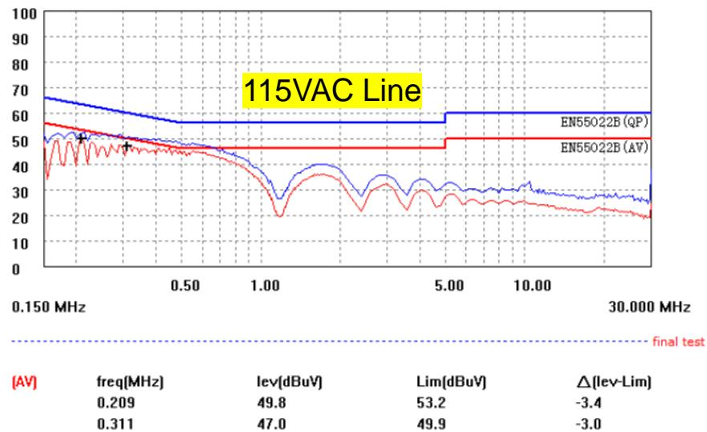

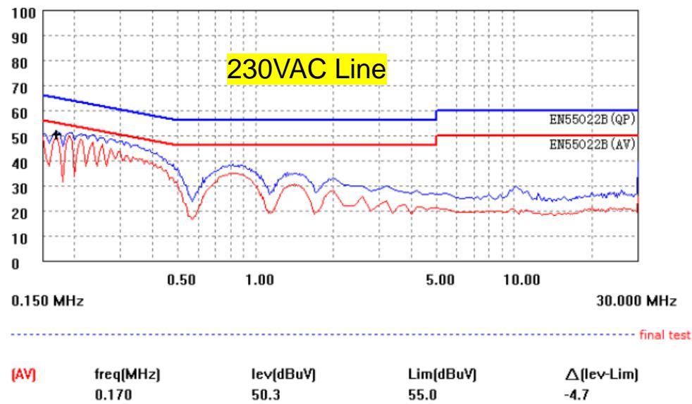

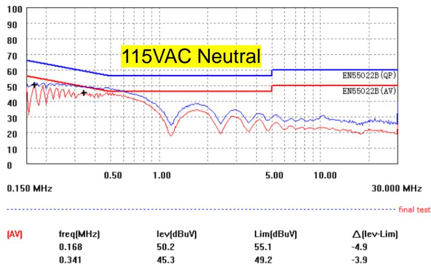

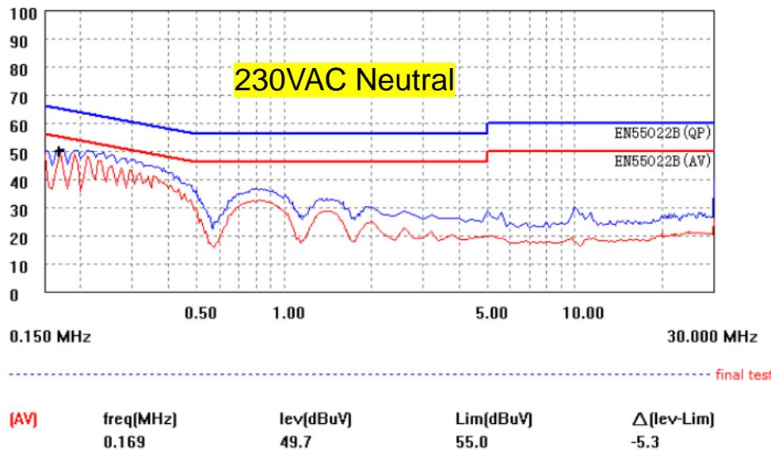

EMI TEST REPORT

<table><tr><td colspan="2">Organization:</td><td colspan="2">Operator:</td><td colspan="2">EUT:</td></tr><tr><td colspan="2">Place:</td><td colspan="2">Time: 2021/7/1/17:40</td><td colspan="2">Test equipment: KH3932</td></tr><tr><td>Detector:</td><td>PK+AV</td><td colspan="2">Test-time[ms]: 30</td><td colspan="2">SN: 320870</td></tr><tr><td>Limit:</td><td>EN55014-1</td><td colspan="2">Transductor(PK/AV): XSQ / XSQ</td><td colspan="2">JZ: 2,15,1140</td></tr><tr><td colspan="6">Remark:</td></tr><tr><td colspan="2">Start(MHz)</td><td colspan="2">End(MHz)</td><td colspan="2">Step(MHz)</td></tr><tr><td colspan="2">30.000</td><td colspan="2">100.000</td><td colspan="2">0.200</td></tr><tr><td colspan="2">100.000</td><td colspan="2">230.000</td><td colspan="2">0.500</td></tr><tr><td colspan="2">230.000</td><td colspan="2">300.000</td><td colspan="2">0.500</td></tr><tr><td colspan="6">dBuV</td></tr></table>

1150VAC 满载

EMI TEST REPORT

<table><tr><td colspan="2">Organization:</td><td colspan="2">Operator:</td><td colspan="2">EUT:</td></tr><tr><td colspan="2">Place:</td><td colspan="2">Time: 2021/7/1/17:38</td><td colspan="2">Test equipment: KH3932</td></tr><tr><td>Detector:</td><td>PK+AV</td><td colspan="2">Test-time[ms]: 30</td><td colspan="2">SN: 320870</td></tr><tr><td>Limit:</td><td>EN55014-1</td><td colspan="2">Transductor(PK/AV): XSQ / XSQ</td><td colspan="2">JZ: 2,15,1142</td></tr><tr><td colspan="6">Remark:</td></tr><tr><td colspan="2">Start(MHz)</td><td colspan="2">End(MHz)</td><td colspan="2">Step(MHz)</td></tr><tr><td colspan="2">30.000</td><td colspan="2">100.000</td><td colspan="2">0.200</td></tr><tr><td colspan="2">100.000</td><td colspan="2">230.000</td><td colspan="2">0.500</td></tr><tr><td colspan="2">230.000</td><td colspan="2">300.000</td><td colspan="2">0.500</td></tr><tr><td colspan="6">dBuV</td></tr></table>

230VAC 满载

◼ 1、16V220uF输出电解电容改成低ESR电容后，稳态和动态纹波峰-峰值降低50mV，如果有纹波要求，建议改成低ESR电容；  
◼ 2、反馈二极管D1必须改为ES1J，同时D4保持ES1J不变，降低启机时刻IDS电流峰值，增强产品可靠性；  
◼ 3、FB下拉电阻并联C3电容，改为220pF，因为该PCBLAYOUT布线较差，并电容以降低功率环路对FB反馈环路的影响；  
◼ 4、输入端压敏电阻请根据输入电压规格选取合适耐压值；  
◼ 5、经EMI传到测试，发现115VAC输入时，传到余量QP值仅为3db；

## THANK YOU FOR WATCHING
