## BPA8505P&LNK305P对比测试

## (14V/0.2A@85\~265Vac)

上海晶丰明源半导体股份有限公司

Shanghai Bright Power Semiconductor Co., Ltd.

文长川

时间： 2021年10月22日

## 电气特性对比

<table><tr><td></td><td>BPA8505P</td><td>LNK305P</td></tr><tr><td>开关频率</td><td>45KHz</td><td>66KHz</td></tr><tr><td>Mosfet BV</td><td>650V</td><td>700V</td></tr><tr><td> $R_{DS\_ON}$ </td><td>8.5Ω</td><td>12Ω</td></tr><tr><td>限流点</td><td>440mA</td><td>375mA</td></tr><tr><td>软启动</td><td>有</td><td>无</td></tr><tr><td>输出过压保护</td><td>有</td><td>有</td></tr><tr><td>输出短路保护</td><td>有</td><td>有</td></tr><tr><td>输出过载保护</td><td>有</td><td>有</td></tr><tr><td>反馈开路保护</td><td>有</td><td>有</td></tr><tr><td>过温保护</td><td>有</td><td>有</td></tr><tr><td>封装</td><td>DIP7</td><td>DIP7</td></tr></table>

## BPA8505P

多模式控制技术  
能有效降低系统待机功耗  
提高效率和改善动态性能  
减小系统工作在轻载时的音频噪声

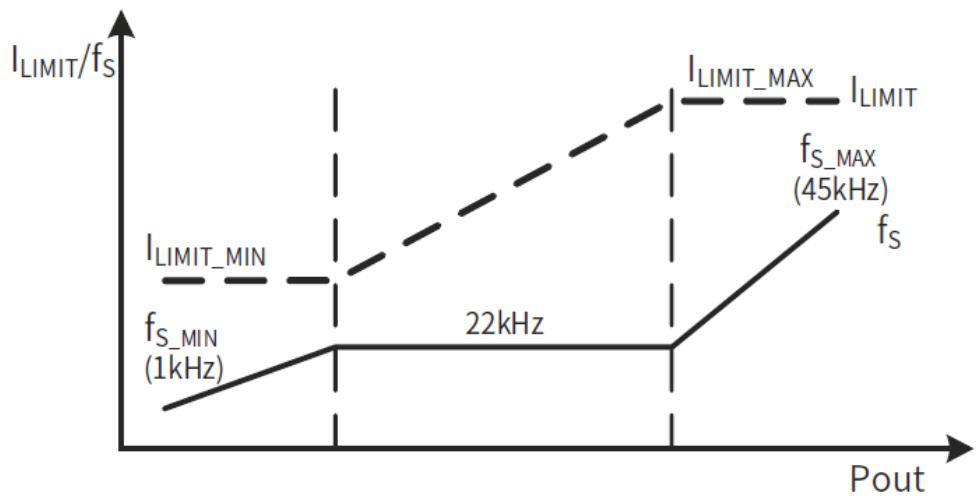

## LNK305P

ON/OFF模式控制技术  
待机功耗更高  
效率更低  
轻载音频噪声较大

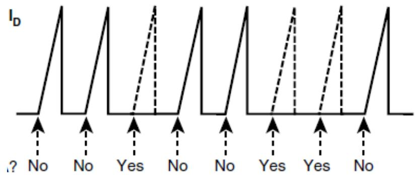

图8.控制模式

## 为什么BPA8505P的负载电压调整率会好？

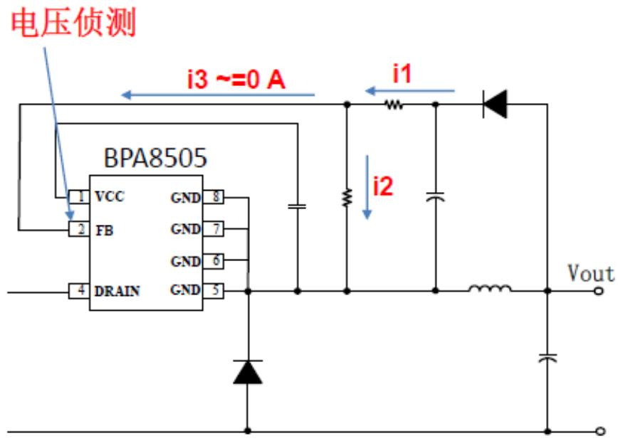

I1 =i2+i3

I1 =i2+i3

电源规格：85\~265Vac输入，14V/0.2A输出

<table><tr><td colspan="2"></td><td>BPA8505P</td><td>LNK305P</td><td></td></tr><tr><td colspan="2">待机功耗@230Vac</td><td>300mW</td><td>304mW</td><td>自供电,相同负载MCU</td></tr><tr><td rowspan="2">效率</td><td>115Vac</td><td>75.8%</td><td>70%</td><td>满载效率</td></tr><tr><td>230Vac</td><td>73.1%</td><td>64.4%</td><td>满载效率</td></tr><tr><td rowspan="2">输出电压纹波</td><td>85Vac</td><td>85.65mV</td><td>108mV</td><td>满载</td></tr><tr><td>265Vac</td><td>89.3mV</td><td>124mV</td><td>满载</td></tr><tr><td rowspan="2">动态负载性能</td><td>50%-100%</td><td>391mVPK_PK</td><td>679mVPK_PK</td><td>@265Vac</td></tr><tr><td>10%-90%</td><td>776mVPK_PK</td><td>779mVPK_PK</td><td>@265Vac</td></tr><tr><td rowspan="2">MOSFET应力</td><td> $V_{DS}$ </td><td>400V</td><td>410V</td><td>@265Vac,满载启机</td></tr><tr><td> $I_{DS}$ </td><td>0.86A</td><td>0.9A</td><td>@265Vac,满载启机</td></tr><tr><td colspan="2">温升测试(环温50°C)</td><td>26.24°C</td><td>38.49°C</td><td>@265Vac,满载</td></tr><tr><td colspan="2">传导EMI</td><td>&gt;4dB裕量</td><td>&gt;1dB裕量</td><td></td></tr><tr><td colspan="2">Surge</td><td>Pass</td><td>Pass</td><td>共模2kV</td></tr><tr><td colspan="2">EFT群脉冲</td><td>Pass</td><td>Pass</td><td>4kV,5kHz/38kHz/100kHz</td></tr><tr><td colspan="2">ESD</td><td>Pass</td><td>Pass</td><td>15kV空气放电</td></tr></table>

## 电路及实物图

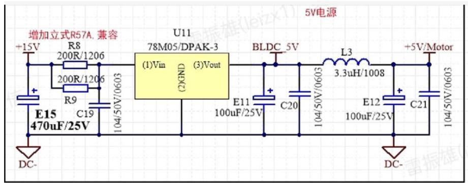

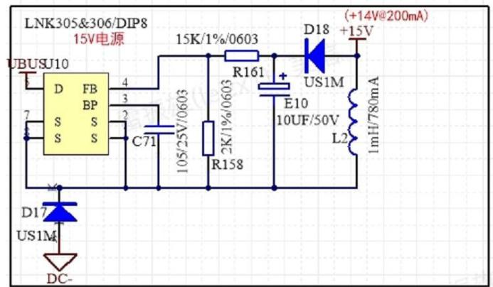

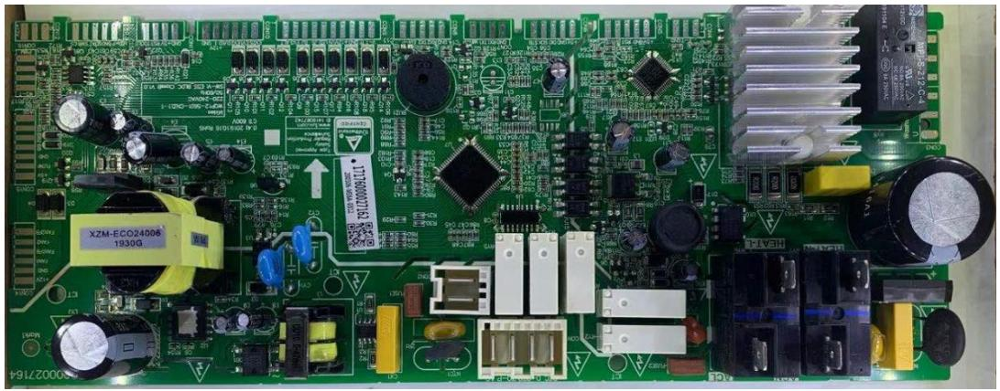

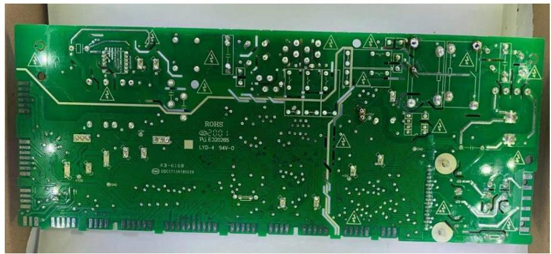

空载功耗  
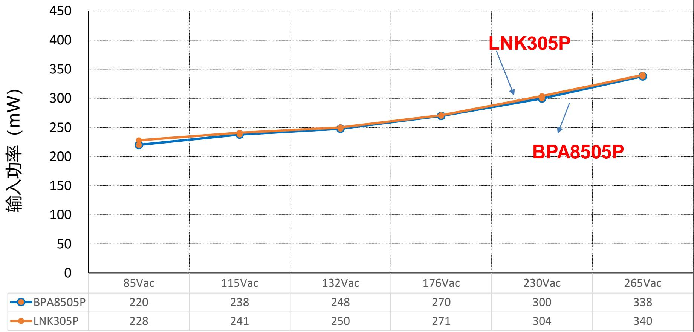

输入电压

效率测试  
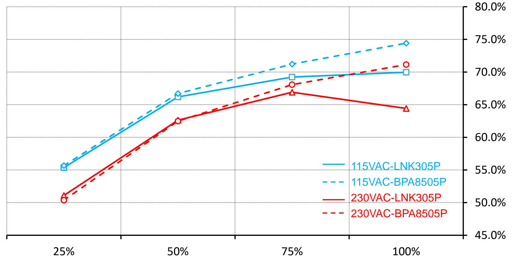

负载

## 输出电压调整率

BPA8505P

<table><tr><td> $V_{IN} (VAC)$ Load(%)</td><td>85</td><td>115</td><td>132</td><td>176</td><td>230</td><td>265</td><td>平均值</td><td>线调整率</td></tr><tr><td>0</td><td>13.70</td><td>13.69</td><td>13.69</td><td>13.68</td><td>13.68</td><td>13.67</td><td>13.69</td><td>0.22%</td></tr><tr><td>20%</td><td>13.59</td><td>13.58</td><td>13.58</td><td>13.57</td><td>13.57</td><td>13.57</td><td>13.58</td><td>0.15%</td></tr><tr><td>40%</td><td>13.50</td><td>13.50</td><td>13.52</td><td>13.52</td><td>13.50</td><td>13.50</td><td>13.51</td><td>0.15%</td></tr><tr><td>60%</td><td>13.49</td><td>13.48</td><td>13.47</td><td>13.46</td><td>13.45</td><td>13.44</td><td>13.47</td><td>0.37%</td></tr><tr><td>80%</td><td>13.42</td><td>13.40</td><td>13.40</td><td>13.38</td><td>13.36</td><td>13.36</td><td>13.39</td><td>0.45%</td></tr><tr><td>100%</td><td>13.33</td><td>13.31</td><td>13.30</td><td>13.27</td><td>13.26</td><td>13.25</td><td>13.29</td><td>0.60%</td></tr><tr><td>平均值</td><td>13.51</td><td>13.49</td><td>13.49</td><td>13.48</td><td>13.47</td><td>13.47</td><td rowspan="2" colspan="2"></td></tr><tr><td>负载调整率</td><td>2.74%</td><td>2.82%</td><td>2.89%</td><td>3.04%</td><td>3.12%</td><td>3.12%</td></tr></table>

◼ 计算方法：调整率=100%\*(最大值-最小值)/平均值  
测试条件：假负载为MCU电流

LNK305P

<table><tr><td> $V_{IN} (VAC)$ Load (%)</td><td>85</td><td>115</td><td>132</td><td>176</td><td>230</td><td>265</td><td>平均值</td><td>线调整率</td></tr><tr><td>0</td><td>14.03</td><td>14.03</td><td>14.02</td><td>14.02</td><td>14.01</td><td>14</td><td>14.02</td><td>0.21%</td></tr><tr><td>20%</td><td>13.88</td><td>13.87</td><td>13.868</td><td>13.86</td><td>13.86</td><td>13.85</td><td>13.86</td><td>0.22%</td></tr><tr><td>40%</td><td>13.78</td><td>13.77</td><td>13.77</td><td>13.76</td><td>13.76</td><td>13.75</td><td>13.77</td><td>0.22%</td></tr><tr><td>60%</td><td>13.67</td><td>13.65</td><td>13.64</td><td>13.63</td><td>13.62</td><td>13.62</td><td>13.64</td><td>0.37%</td></tr><tr><td>80%</td><td>13.43</td><td>13.41</td><td>13.41</td><td>13.4</td><td>13.4</td><td>13.42</td><td>13.41</td><td>0.22%</td></tr><tr><td>100%</td><td>13.23</td><td>13.19</td><td>13.16</td><td>13.12</td><td>13.12</td><td>13.14</td><td>13.16</td><td>0.84%</td></tr><tr><td>平均值</td><td>13.67</td><td>13.65</td><td>13.64</td><td>13.63</td><td>13.63</td><td>13.63</td><td rowspan="2" colspan="2"></td></tr><tr><td>负载调整率</td><td>5.85%</td><td>6.15%</td><td>6.30%</td><td>6.60%</td><td>6.53%</td><td>6.31%</td></tr></table>

◼ 计算方法：调整率=100%\*(最大值-最小值)/平均值  
测试条件：假负载为MCU电流

## 输出电压纹波

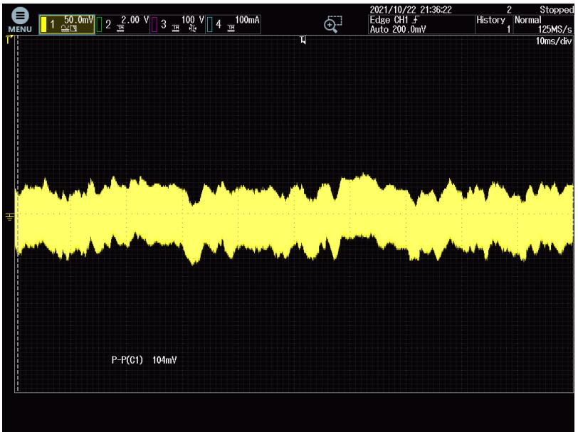

85 VAC  
  
Test Condition:  
➢ Full Load

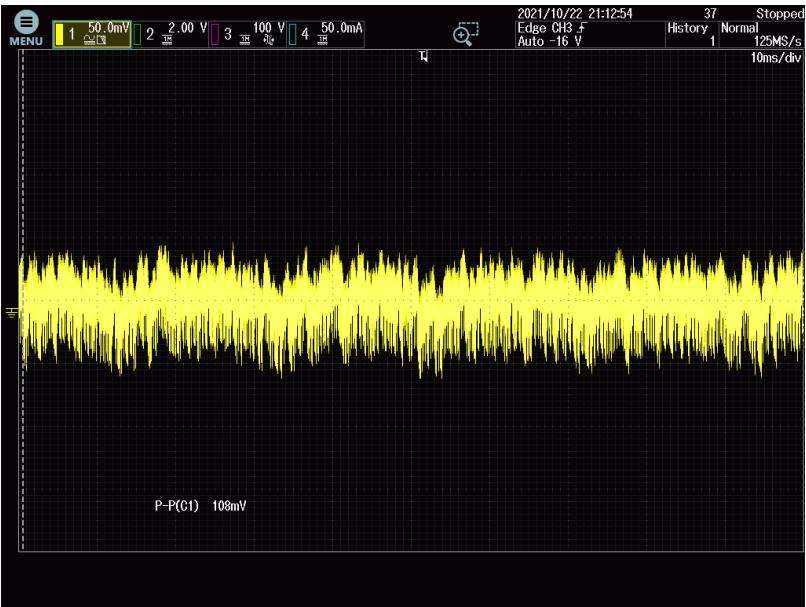

85 VAC  
  
Test Condition:  
➢ Full Load

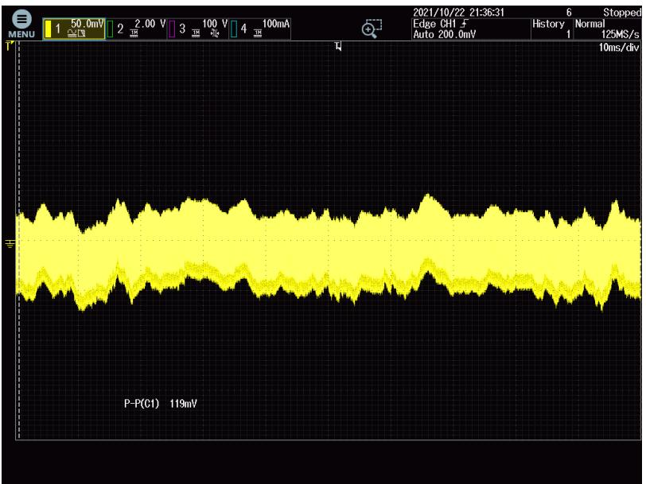

265 VAC  
  
Test Condition:  
➢ Full Load

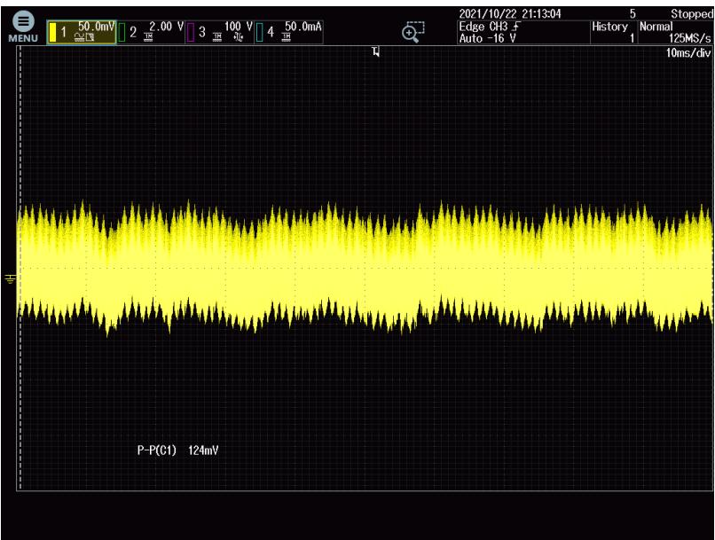

265 VAC  
  
Test Condition:  
➢ Full Load

## 动态负载(50%-100%)

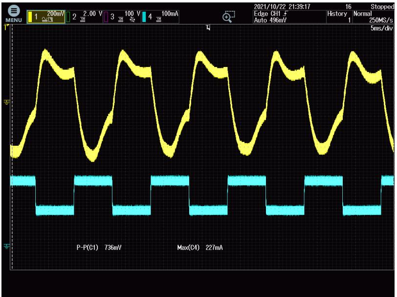

85 VAC

CH1 $\mathsf { V } _ { \mathsf { O U T } }$ $V _ { P K - P K } = 7 3 6 ~ \mathsf { m V }$  
$\mathsf { C H 4 } \mathsf { I } _ { \mathsf { O U T } }$

## Test Condition:

➢ 0.1 A-0.2 A-0.1 A  
➢ Slew Rate: 0.5 A/μS  
➢ Frequency: 100 Hz

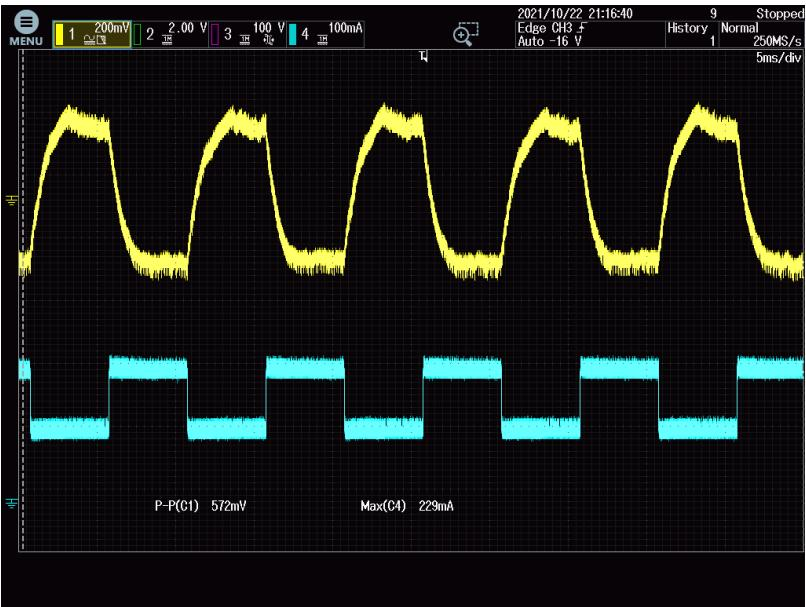

85 VAC

$\mathsf { C H 1 } \mathsf { V } _ { \mathsf { O U T } }$ $V _ { P K - P K } = 5 7 2 m v$  
$\mathsf { C H 4 } \mathsf { I } _ { \mathsf { O U T } }$

## Test Condition:

➢ 0.1 A-0.2 A-0.1 A  
➢ Slew Rate: 0.5 A/μS  
➢ Frequency: 100 Hz

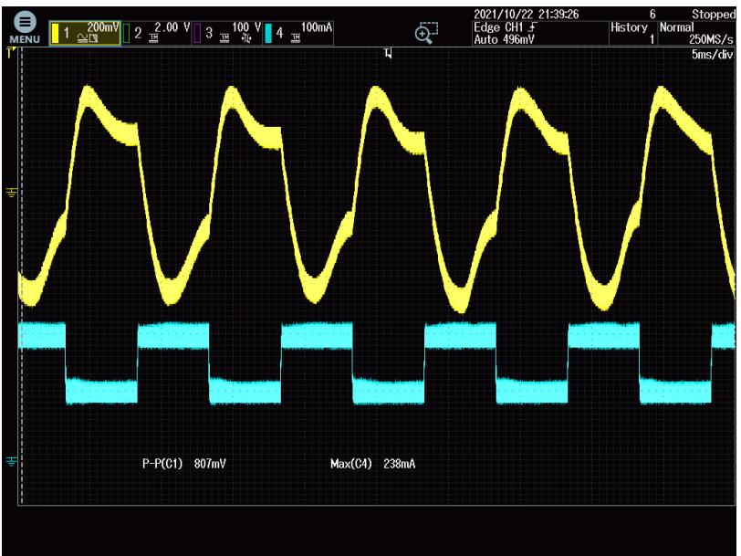

265 VAC

CH1 $\mathsf { V } _ { \mathsf { O U T } }$ $V _ { \mathsf { P K - P K } } = 8 0 7 ~ \mathsf { m V }$  
$\mathsf { C H 4 } \mathsf { l } _ { \mathsf { O U T } }$

## Test Condition:

➢ 0.1 A-0.2 A-0.1 A  
➢ Slew Rate: 0.5 A/μS  
➢ Frequency: 100 Hz

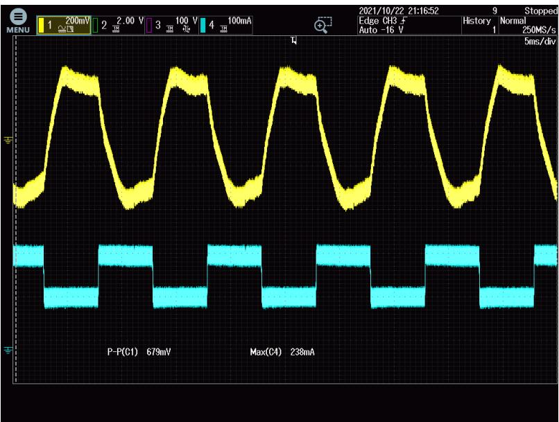

265 VAC

${ \mathsf { C H 1 } } { \mathsf { V } } _ { \mathsf { O U T } }$ $V _ { P K - P K } = 6 7 9 m v$  
$\mathsf { C H 4 } \mathsf { I } _ { \mathsf { O U T } }$

## Test Condition:

➢ 0.1 A-0.2 A-0.1 A  
➢ Slew Rate: 0.5 A/μS  
➢ Frequency: 100 Hz

## 动态负载(10%-90%)

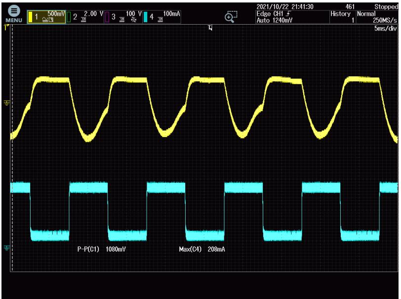

85 VAC

CH1 $\mathsf { V } _ { \mathsf { O U T } }$ $\mathtt { V } _ { \mathtt { P K - P K } } = 1 0 8 0 \mathtt { m v }$  
$\mathsf { C H 4 } \mathsf { I } _ { \mathsf { O U T } }$

## Test Condition:

➢ 0.02A-0.18 A-0.02 A  
➢ Slew Rate: 0.5 A/μS  
➢ Frequency: 100 Hz

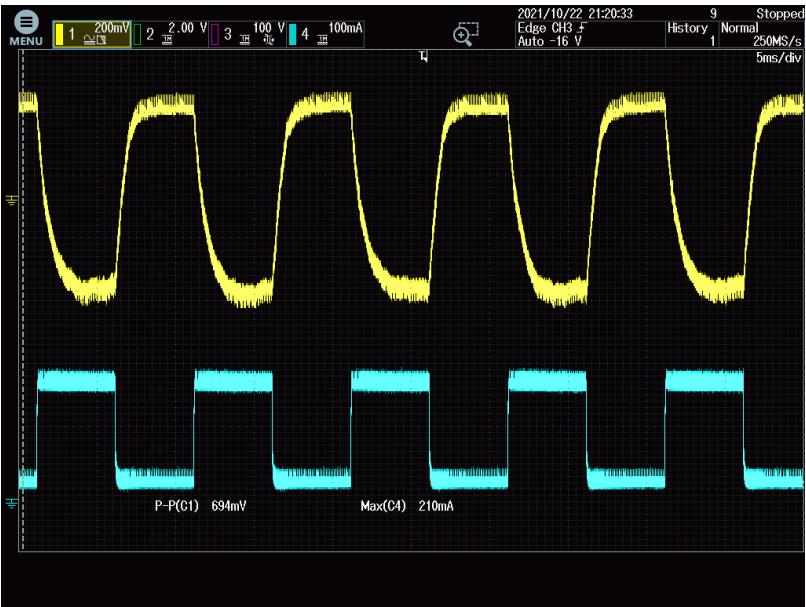

85 VAC

CH1 $\mathsf { V } _ { \mathsf { O U T } }$ $\mathsf { V } _ { \mathsf { P K - P K } } { = } 6 9 4 \mathsf { m V }$  
$\mathsf { C H 4 } \mathsf { I } _ { \mathsf { O U T } }$

## Test Condition:

➢ 0.02A-0.18 A-0.02 A  
➢ Slew Rate: 0.5 A/μS  
➢ Frequency: 100 Hz

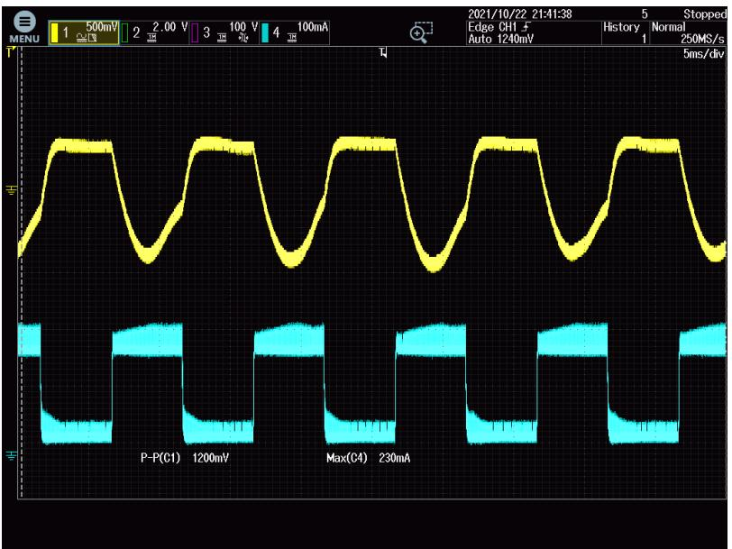  
265 VAC

CH1 $\mathsf { V } _ { \mathsf { O U T } }$ $\mathsf { V } _ { \mathsf { P K - P K } } { = } 1 2 0 0 \mathsf { m v }$  
$\mathsf { C H 4 } \mathsf { l } _ { \mathsf { O U T } }$

## Test Condition:

➢ 0.02A-0.18 A-0.02 A  
➢ Slew Rate: 0.5 A/μS  
➢ Frequency: 100 Hz

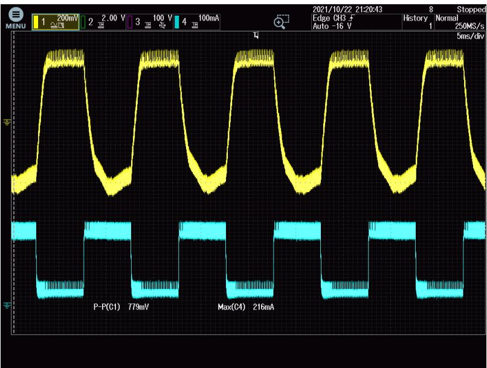

265 VAC

CH1 VOUT $V _ { P K - P K } { = } 7 7 9 m v$  
$\mathsf { C H 4 } \mathsf { I } _ { \mathsf { O U T } }$

## Test Condition:

➢ 0.02A-0.18 A-0.02 A  
➢ Slew Rate: 0.5 A/μS  
➢ Frequency: 100 Hz

## 输出电压开机波形

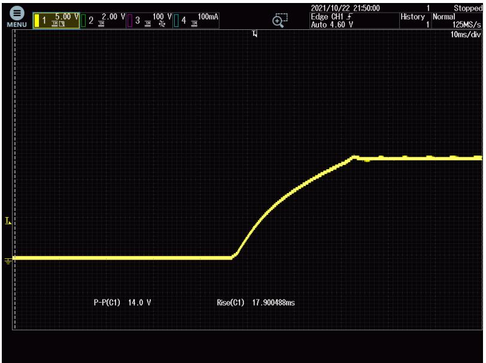

85 VAC  
  
Test Condition:  
➢ Full Load

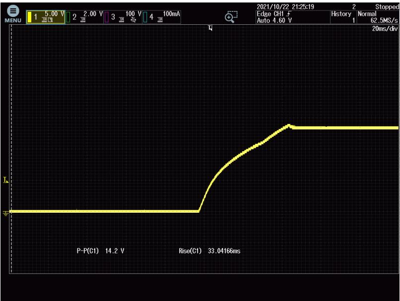

85 VAC  
  
Test Condition:  
➢ Full Load

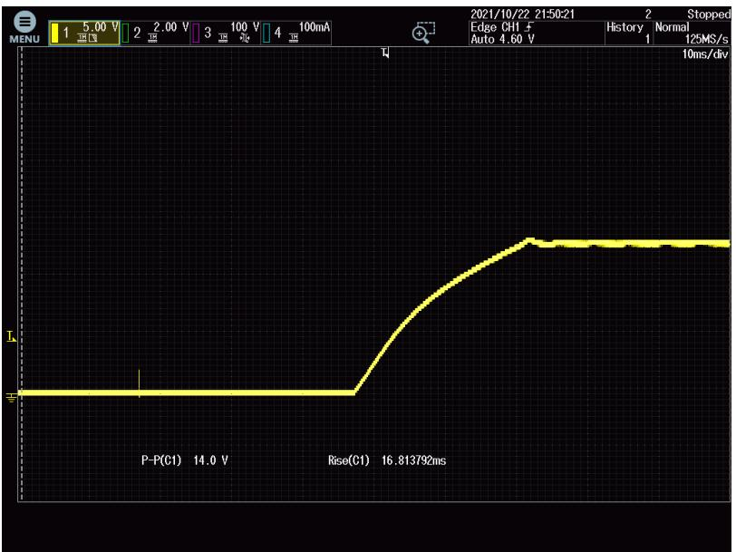

265 VAC  
  
Test Condition:  
➢ Full Load

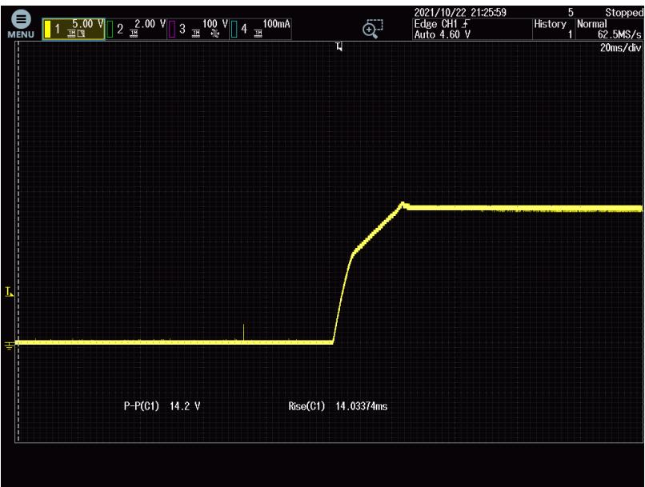

265 VAC  
  
Test Condition:  
➢ Full Load  
不能满载启机

## MOSFET开机波形

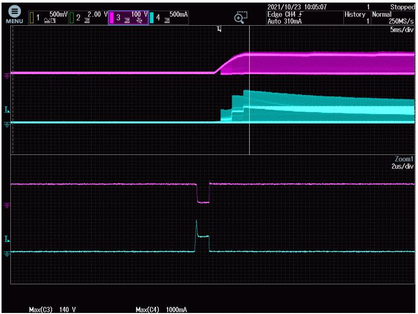

85 VAC

CH3 VDS  
CH4 IDS

$$
\begin{array}{r l} & V _ {D S \_ M A X} = 1 4 0 \mathrm{V} \\ & I _ {D S \_ M A X} = 1 \mathrm{A} \end{array}
$$

## Test Condition:

➢ Full Load

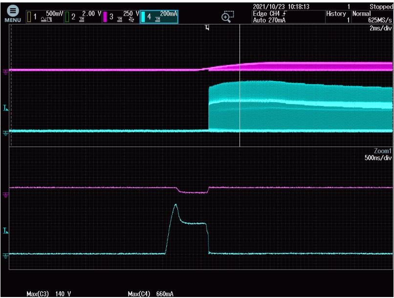

85 VAC

CH3 VDS  
CH4 IDS

$$
\begin{array}{l} \mathrm {V_ {DS\_MAX}} = 1 4 0 \mathrm{V} \\ \mathrm {I_ {DS\_MAX}} = 0. 6 6 \mathrm{A} \end{array}
$$

## Test Condition:

➢ Full Load

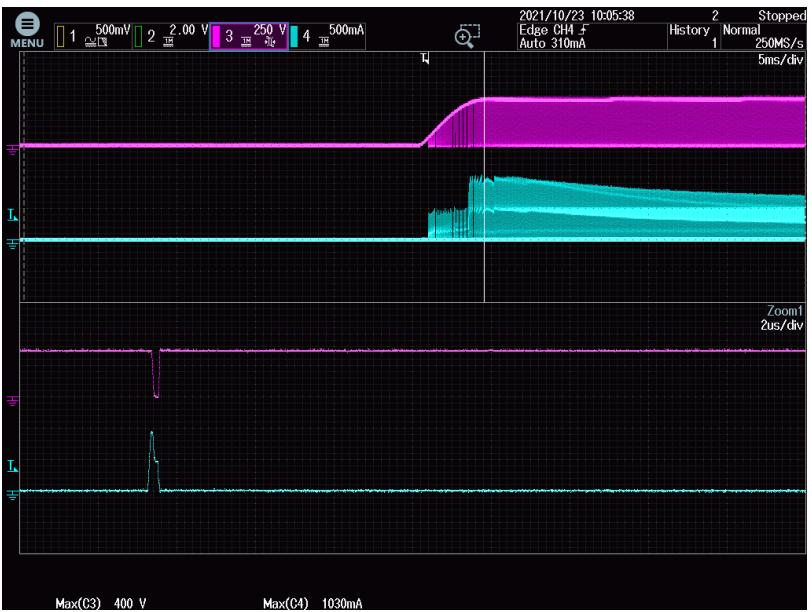

265 VAC

CH3 VDS  
CH4 IDS

$$
\begin{array}{l} V _ {D S \_ M A X} = 4 0 0 V \\ I _ {D S \_ M A X} = 1. 0 3 0 A \end{array}
$$

## Test Condition:

➢ Full Load

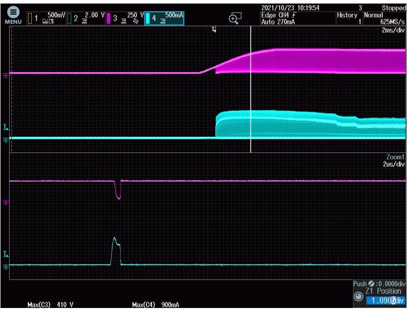

265 VAC

CH3 VDS  
CH4 IDS

$$
\begin{array}{l} \mathrm {V_ {DS\_MAX}} = 4 1 0 \mathrm{V} \\ \mathrm {I_ {DS\_MAX}} = 0. 9 \mathrm{A} \end{array}
$$

## Test Condition:

➢ Full Load

## MOSFET稳态波形

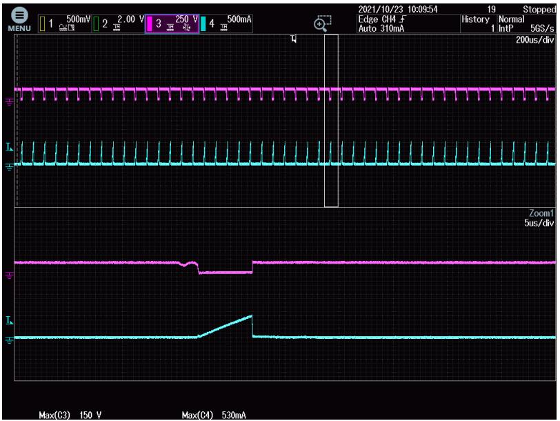

85 VAC

CH3 VDS  
CH4 IDS

$$
\begin{array}{l} \mathrm {V_ {DS\_MAX}} = 1 5 0 \mathrm{V} \\ \mathrm {I_ {DS\_MAX}} = 0. 5 3 \mathrm{A} \end{array}
$$

## Test Condition:

➢ Full Load

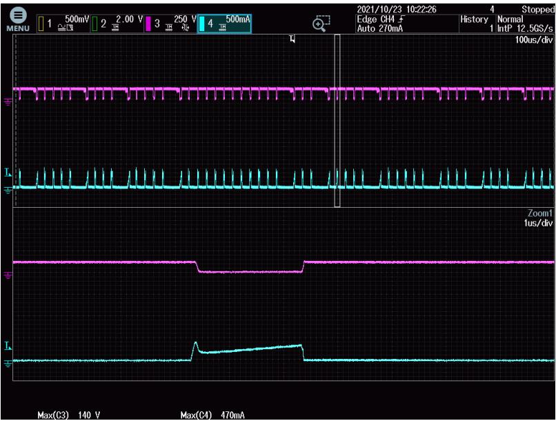

85 VAC

CH3 VDS  
CH4 IDS

$$
\begin{array}{l} \mathrm {V_ {DS\_MAX}} = 1 1 5. 4 \mathrm{V} \\ \mathrm {I_ {DS\_MAX}} = 0. 4 7 6 \mathrm{A} \end{array}
$$

## Test Condition:

➢ Full Load

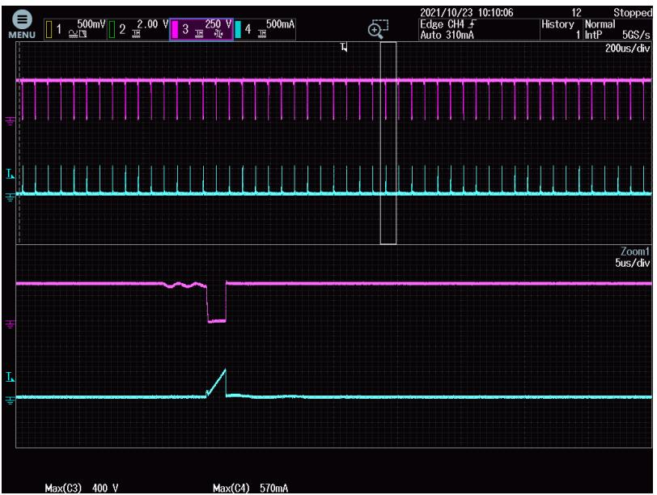

265 VAC

CH3 VDS  
CH4 IDS

$$
V _ {D S \_ M A X} = 3 7 4. 8 V
$$

$$
I _ {D S \_ M A X} = 0. 5 7 0 \mathrm{A}
$$

## Test Condition:

➢ Full Load

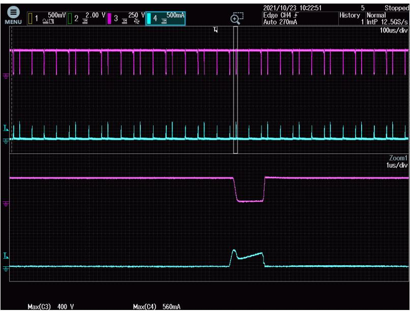

265 VAC

CH3 VDS  
CH4 IDS

$$
V _ {D S \_ M A X} = 4 0 0 V
$$

$$
I _ {D S \_ M A X} = 0. 5 6 \mathrm{A}
$$

## Test Condition:

➢ Full Load

## 电感电流开机波形

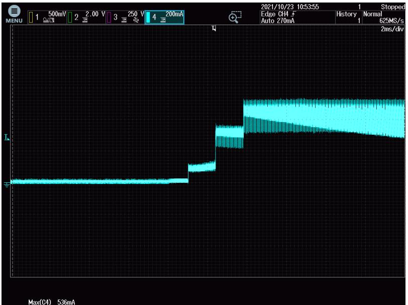

85 VAC  
  
Test Condition:  
➢ Full Load

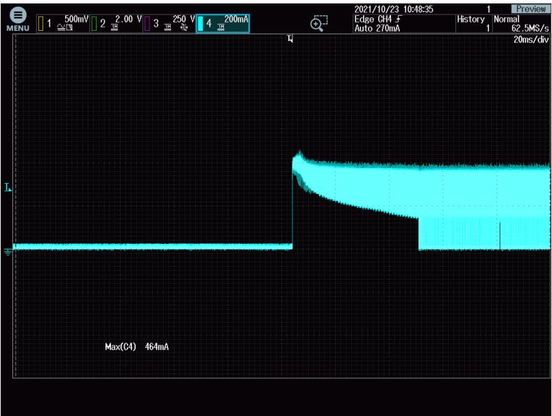

85 VAC  
  
Test Condition:  
➢ Full Load

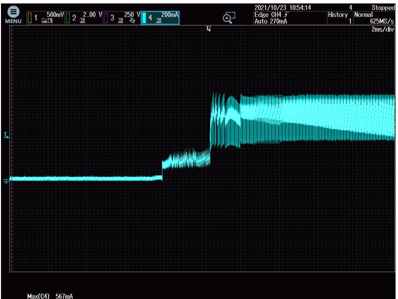

265 VAC  
  
Test Condition:  
➢ Full Load

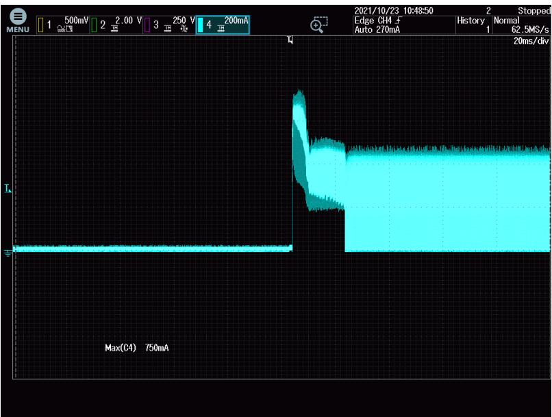

265 VAC  
  
Test Condition:  
➢ Full Load

## 电感电流工作稳态波形

85 VAC  
  
Test Condition:  
➢ Full Load

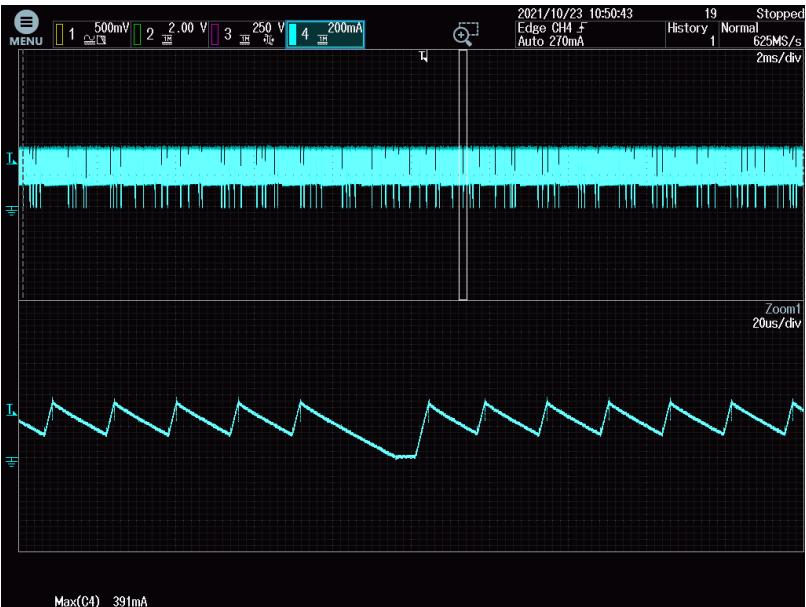

85 VAC  
  
Test Condition:  
➢ Full Load

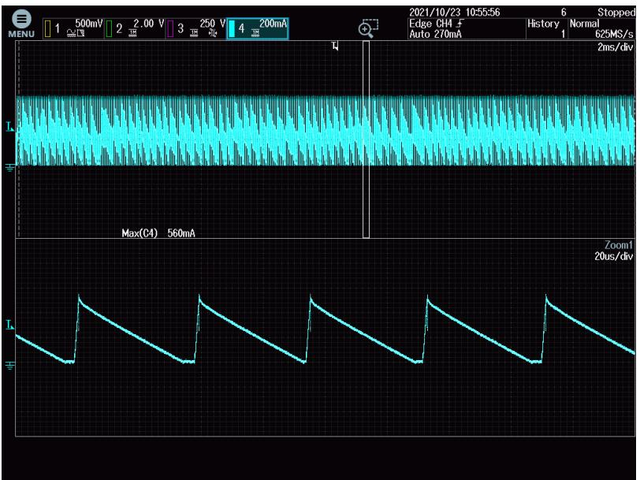

265 VAC  
  
Test Condition:  
➢ Full Load

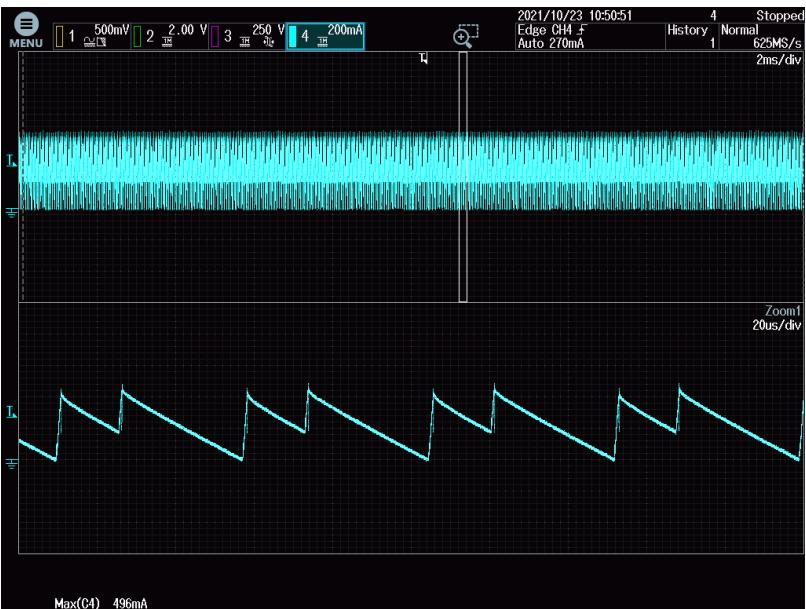

265 VAC  
  
Test Condition:  
➢ Full Load

## 输出短路保护（MOSFET波形）

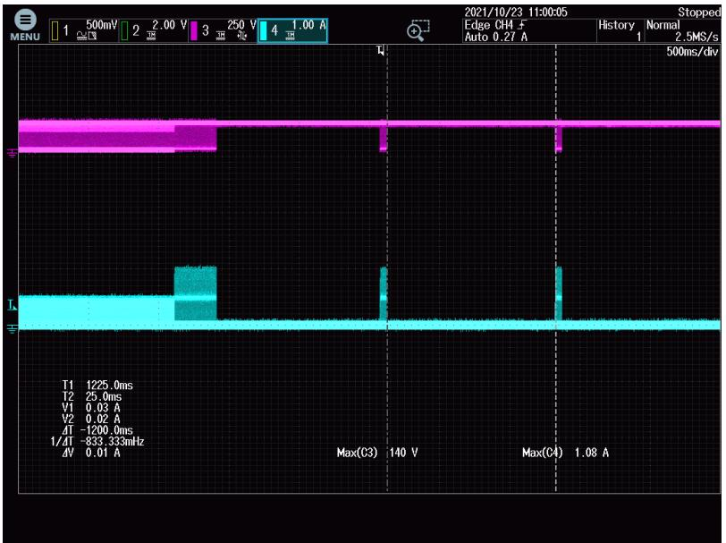

85 VAC

CH3 VDS  
CH4 IDS

$$
\begin{array}{l} \mathrm {V_ {DS\_MAX}} = 1 4 0 \mathrm{V} \\ \mathrm {I_ {DS\_MAX}} = 1. 0 8 \mathrm{A} \end{array}
$$

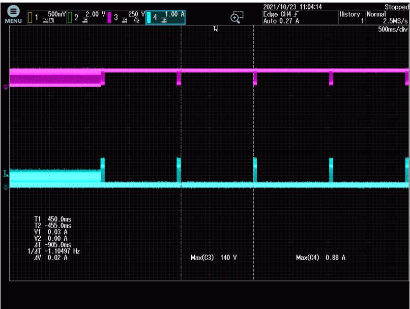

85 VAC

CH3 VDS  
CH4 IDS

$$
\begin{array}{l} \mathrm {V_ {DS\_MAX}} = 1 4 0 \mathrm{V} \\ \mathrm {I_ {DS\_MAX}} = 0. 8 8 \mathrm{A} \end{array}
$$

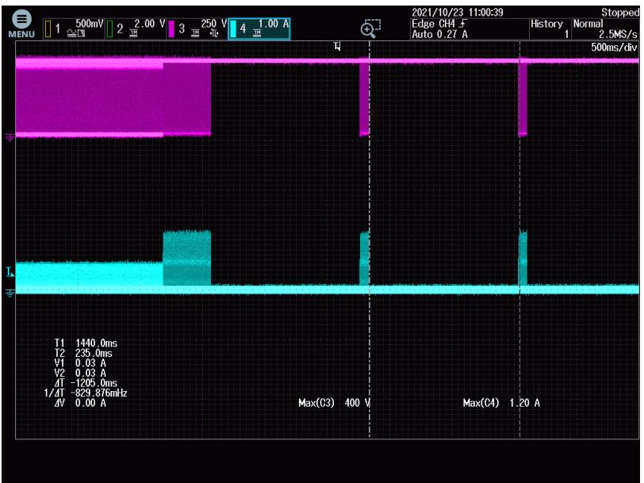

265 VAC

CH3 VDS  
CH4 IDS

$$
V _ {D S \_ M A X} = 4 0 0 \mathrm{V}
$$

$$
I _ {D S \_ M A X} = 1. 2 \mathrm{A}
$$

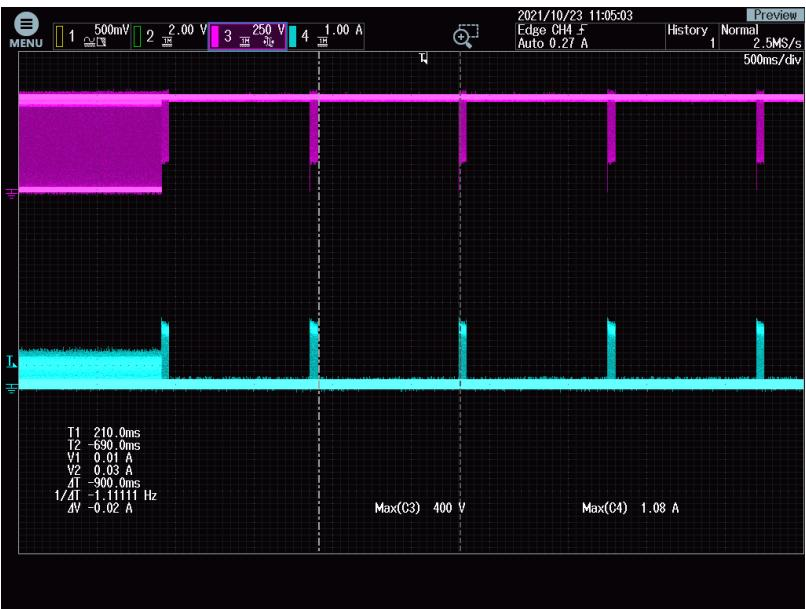

265 VAC

CH3 VDS  
CH4 IDS

$$
V _ {D S \_ M A X} = 4 0 0 \mathrm{V}
$$

$$
I _ {D S \_ M A X} = 1. 0 8 \mathrm{A}
$$

D17,D18由原来的US1M更改为ES1J

效率测试  
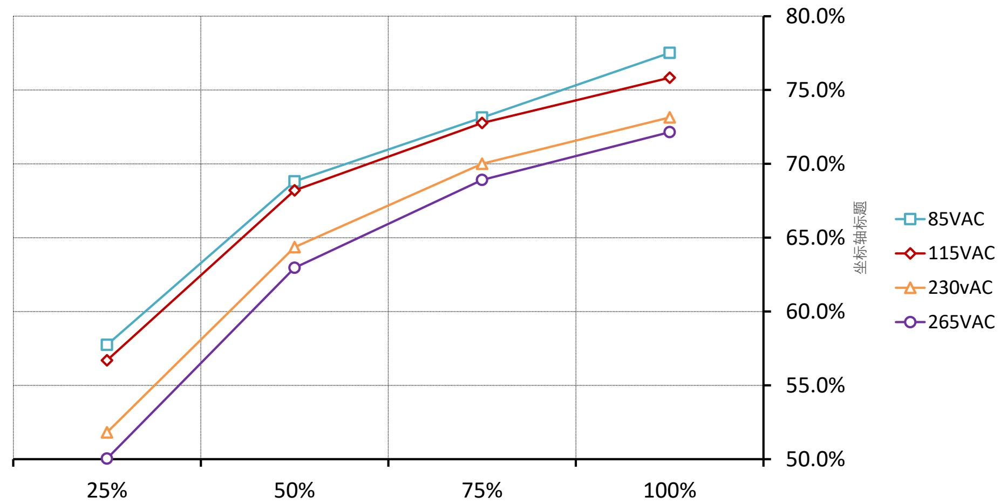

坐标轴标题

## 输出电压调整率

<table><tr><td> $V_{IN}(VAC)$ Load(%)</td><td>85</td><td>115</td><td>132</td><td>176</td><td>230</td><td>265</td><td>平均值</td><td>线调整率</td></tr><tr><td>0</td><td>13.8</td><td>13.79</td><td>13.78</td><td>13.78</td><td>13.77</td><td>13.77</td><td>13.78</td><td>0.22%</td></tr><tr><td>20%</td><td>13.72</td><td>13.72</td><td>13.71</td><td>13.71</td><td>13.7</td><td>13.7</td><td>13.71</td><td>0.15%</td></tr><tr><td>40%</td><td>13.69</td><td>13.7</td><td>13.7</td><td>13.7</td><td>13.69</td><td>13.69</td><td>13.70</td><td>0.07%</td></tr><tr><td>60%</td><td>13.72</td><td>13.71</td><td>13.71</td><td>13.70</td><td>13.7</td><td>13.69</td><td>13.71</td><td>0.22%</td></tr><tr><td>80%</td><td>13.70</td><td>13.71</td><td>13.71</td><td>13.70</td><td>13.7</td><td>13.69</td><td>13.70</td><td>0.15%</td></tr><tr><td>100%</td><td>13.7</td><td>13.7</td><td>13.71</td><td>13.7</td><td>13.7</td><td>13.7</td><td>13.70</td><td>0.07%</td></tr><tr><td>平均值</td><td>13.72</td><td>13.72</td><td>13.72</td><td>13.72</td><td>13.71</td><td>13.71</td><td rowspan="2" colspan="2"></td></tr><tr><td>负载调整率</td><td>0.80%</td><td>0.66%</td><td>0.58%</td><td>0.58%</td><td>0.58%</td><td>0.58%</td></tr></table>

◼ 计算方法：调整率=100%\*(最大值-最小值)/平均值  
测试条件：带MCU为假负载

## 输出电压纹波

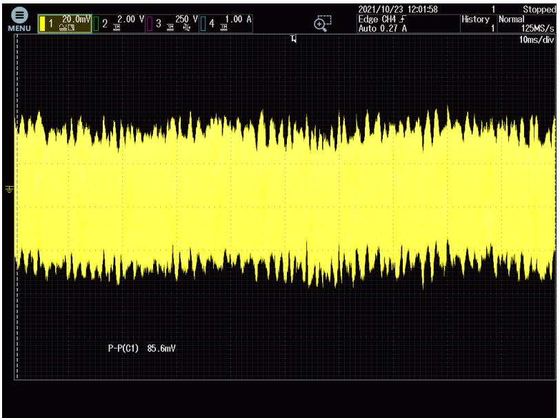

85 VAC

$\begin{array} { r l } { \mathbf { \Pi } } & { { } \mathsf { C H 1 } \mathsf { V _ { \mathsf { o u T } } R i p p l e } } \\ { \mathbf { \Pi } } & { { } \mathsf { V _ { P K - P K } } = 8 5 . 6 \mathsf { m v } } \end{array}$

## Test Condition:

➢ Full Load

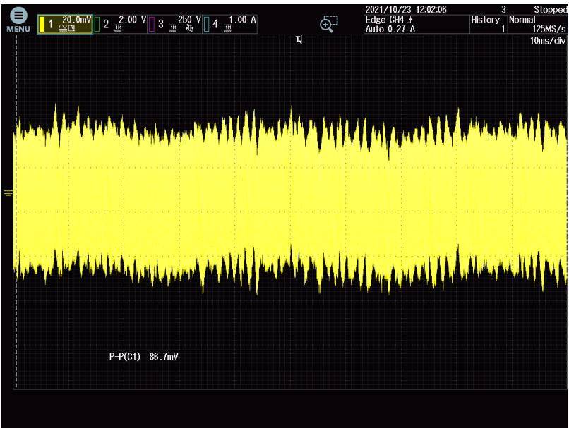

115 VAC

CH1 $\mathsf { V } _ { \mathsf { O U T } }$ Ripple VPK-PK=75.7mV

## Test Condition:

➢ Full Load

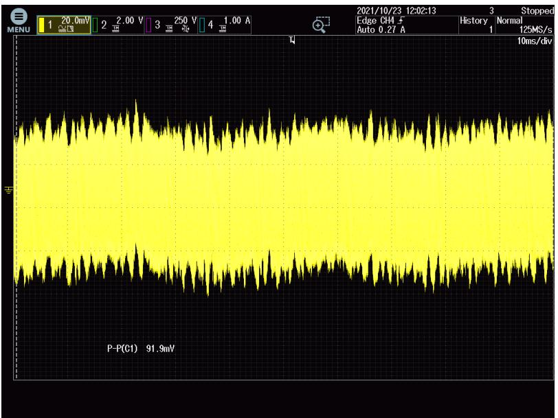

230 VAC

$\begin{array} { r l } { \mathbf { \Pi } } & { { } \mathsf { C H 1 } \mathsf { V _ { \mathsf { O U T } } R i p p l e } } \\ { \mathbf { \Pi } } & { { } \mathsf { V _ { P K - P K } } = \pm \pmb { 9 1 . 9 m v } } \end{array}$

## Test Condition:

➢ Full Load

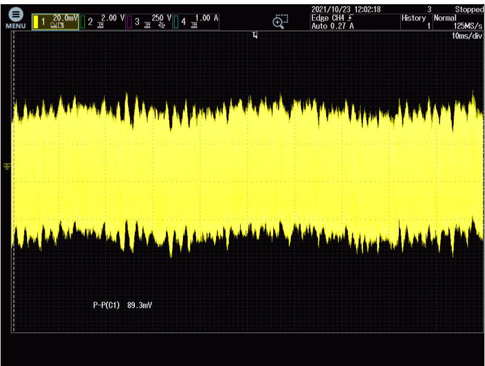

265 VAC

CH1 $\mathsf { V } _ { \mathsf { O U T } }$ Ripple VPK-PK=89.3mV

## Test Condition:

➢ Full Load

## 动态负载(50%-100%)

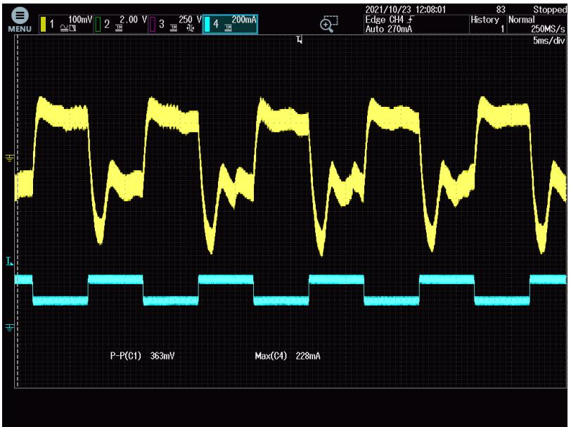

85 VAC

CH1 VOUT $\mathsf { V } _ { \mathsf { O U T } }$ $V _ { P K - P K } = 3 6 3 ~ \mathsf { m V }$  
$\mathsf { C H 4 } \mathsf { I } _ { \mathsf { O U T } }$

## Test Condition:

➢ $0 . 1 \mathsf { A } \mathsf { - } 0 . 2 \mathsf { A } \mathsf { - } 0 . 1 \mathsf { A }$  
➢ Slew Rate: 0.5 A/μS  
➢ Frequency: 100 Hz


115 VAC

CH1 VOUT ${ \mathsf { C H 1 } } { \mathsf { V } } _ { \mathsf { O U T } }$ $V _ { P K - P K } = 3 8 8 ~ \mathsf { m V }$  
$\mathsf { C H 4 } \mathsf { I } _ { \mathsf { O U T } }$

## Test Condition:

➢ 0.1 A-0.2 A-0.1 A  
➢ Slew Rate: 0.5 A/μS  
➢ Frequency: 100 Hz


230 VAC

CH1 VOUT ${ \mathsf { C H 1 } } { \mathsf { V } } _ { \mathsf { O U T } }$ $V _ { P K - P K } = 4 0 0 m V$  
$\mathsf { C H 4 } \mathsf { l } _ { \mathsf { O U T } }$

## Test Condition:

➢ 0.1 A-0.2 A-0.1 A  
➢ Slew Rate: 0.5 A/μS  
➢ Frequency: 100 Hz


265 VAC

CH1 VOUT ${ \mathsf { C H 1 } } { \mathsf { V } } _ { \mathsf { O U T } }$ $\mathsf { V } _ { \mathsf { P K - P K } } \mathsf { = } 3 9 1 \mathsf { m V }$  
$\mathsf { C H 4 } \mathsf { I } _ { \mathsf { O U T } }$

## Test Condition:

➢ 0.1 A-0.2 A-0.1 A  
➢ Slew Rate: 0.5 A/μS  
➢ Frequency: 100 Hz

## 动态负载(10%-90%)


85 VAC

CH1 VOUT $\mathsf { V } _ { \mathsf { O U T } }$ $\mathsf { V } _ { \mathsf { P K - P K } } { = } 7 7 6 \mathsf { m V }$  
CH4 IOUT $\mathsf { C H 4 } \mathsf { I } _ { \mathsf { O U T } }$

## Test Condition:

➢ 0.02A-0. 18 A-0.02A  
➢ Slew Rate: 0.5 A/μS  
➢ Frequency: 100 Hz


115 VAC

${ \mathsf { C H 1 } } { \mathsf { V } } _ { \mathsf { O U T } }$ CH1 VOUT $\mathsf { V } _ { \mathsf { P K - P K } } { = } 7 6 8 \mathsf { m V }$  
CH4 IOUT $\mathsf { C H 4 } \mathsf { I } _ { \mathsf { O U T } }$

## Test Condition:

➢ 0.02A-0. 18 A-0.02A  
➢ Slew Rate: 0.5 A/μS  
➢ Frequency: 100 Hz


230 VAC

CH1 VOUT $\mathsf { V } _ { \mathsf { O U T } }$ $\mathsf { V } _ { \mathsf { P K - P K } } { = } 7 5 2 \mathsf { m V }$  
CH4 IOUT $\mathsf { C H 4 } \mathsf { I } _ { \mathsf { O U T } }$

## Test Condition:

➢ 0.02A-0. 18 A-0.02A  
➢ Slew Rate: 0.5 A/μS  
➢ Frequency: 100 Hz


265 $\mathsf { v } _ { \mathsf { A C } }$

CH1 VOUT ${ \mathsf { C H 1 } } { \mathsf { V } } _ { \mathsf { O U T } }$ $\mathsf { V } _ { \mathsf { P K - P K } } { = } 7 7 6 \mathsf { m V }$ VPK-PK=776mV  
$\mathsf { C H 4 } \mathsf { I } _ { \mathsf { O U T } }$

## Test Condition:

➢ 0.02A-0. 18 A-0.02A  
➢ Slew Rate: 0.5 A/μS  
➢ Frequency: 100 Hz

## 输出电压开机波形


85 VAC

CH1 VOUT TRISE: 7.09 mS

## Test Condition:

➢ No Load


115 VAC

CH1 VOUT TRISE: 18.34 mS

## Test Condition:

➢ Full Load


230 VAC

CH1 VOUT TRISE: 6.75 mS

## Test Condition:

➢ No Load


265 VAC

CH1 VOUT TRISE: 16.34 mS

## Test Condition:

➢ Full Load

## 电感电流开机波形


85 VAC

➢ CH4 IL IMAX : 0.537 A

## Test Condition:

➢ No Load


115 VAC

CH4 IL IMAX : 0.552 A

## Test Condition:

➢ Full Load


230 VAC

CH4 IL IMAX : 0.584 A

## Test Condition:

➢ No Load


265 VAC

CH4 IL IMAX : 0.603 A

## Test Condition:

➢ Full Load

## 电感电流波形


85 VAC  
CH4 IL  
➢ No Load

Test Condition:


85 VAC  
CH4 IL  
➢ Full Load

Test Condition:


265 VAC  
CH4 IL  
➢ No Load

Test Condition:


265 VAC  
CH4 IL  
➢ Full Load

Test Condition:

## 漏源极电压和漏极电流开机波形


85 VAC

CH1 $\mathsf { V } _ { \mathsf { D } \mathsf { S } }$  
CH4 IDIMAX: 0.76 A

Test Condition:  
➢ No Load  


115 VAC

CH1 $\mathsf { V } _ { \mathsf { D } \mathsf { S } }$  
CH4 IDIMAX: 0.82 A

Test Condition:  
➢ Full Load  


230 VAC

CH1 VDS  
CH4 IDIMAX: 0.76 A

Test Condition:  
➢ No Load  


265 VAC

CH1 VDS  
CH4 IDIMAX: 0.86 A

Test Condition:

➢ Full Load

## MOSFET波形


85 VAC

CH3 VDS  
CH4 ID

Test Condition:  
➢ No Load  


85 VAC

CH3 VDS  
CH4 ID

Test Condition:  
➢ Full Load  


265 VAC

CH3 VDS  
CH4 ID

Test Condition:  
➢ No Load  


265 VAC

CH3 VDS  
CH4 ID

Test Condition:

➢ Full Load

## 短路保护 （MOSFET波形）


85 VAC

CH2 VDS  
CH4 ID


115 VAC

CH2 VDS  
CH4 ID


230 VAC

CH2 VDS  
CH4 ID


265 VAC

CH2 VDS  
CH4 ID

## 温升测试

BPA8505P

<table><tr><td rowspan="2">项目</td><td>85VAC</td><td>265VAC</td></tr><tr><td>温度(°C)</td><td>温度(°C)</td></tr><tr><td>环境温度</td><td>27.26</td><td>27.28</td></tr><tr><td>BPA8505P(U1)</td><td>47.58</td><td>53.52</td></tr><tr><td>电感磁芯(L2)</td><td>40.72</td><td>46.13</td></tr><tr><td>电感线包(L2)</td><td>40.23</td><td>45.56</td></tr><tr><td>输出电解电容(E15)</td><td>34.77</td><td>36.58</td></tr><tr><td>续流二极管(D17)</td><td>43.07</td><td>46.18</td></tr></table>

备注：增大芯片Source散热铜箔面积可以降低芯片温度

LNK305P

<table><tr><td rowspan="2">项目</td><td>85VAC</td><td>265VAC</td></tr><tr><td>温度(°C)</td><td>温度(°C)</td></tr><tr><td>环境温度</td><td>26.85</td><td>26.94</td></tr><tr><td>LNK305P(U1)</td><td>56.15</td><td>65.43</td></tr><tr><td>电感磁芯(L2)</td><td>39.05</td><td>45.12</td></tr><tr><td>电感线包(L2)</td><td>38.65</td><td>44.57</td></tr><tr><td>输出电解电容(E15)</td><td>33.06</td><td>35.37</td></tr><tr><td>续流二极管(D17)</td><td>44.02</td><td>47.84</td></tr></table>


115Vac Line  


230Vac Line


115Vac Neutral


230Vac Neutral


115Vac Line  


230Vac Line


115Vac Neutral


230Vac Neutral

BPA8505P

<table><tr><td>差模</td><td>电压</td><td>相位角</td><td>发生器阻抗</td><td>测试次数</td><td>测试结果</td></tr><tr><td>L to N</td><td>+2kV</td><td>0/90/180/270</td><td>2</td><td>10</td><td>Pass</td></tr><tr><td>L to N</td><td>-2kV</td><td>0/90/180/270</td><td>2</td><td>10</td><td>Pass</td></tr></table>

LNK305P

<table><tr><td>差模</td><td>电压</td><td>相位角</td><td>发生器阻抗</td><td>测试次数</td><td>测试结果</td></tr><tr><td>L to N</td><td>+2kV</td><td>0/90/180/270</td><td>2</td><td>10</td><td>Pass</td></tr><tr><td>L to N</td><td>-2kV</td><td>0/90/180/270</td><td>2</td><td>10</td><td>Pass</td></tr></table>

## EFT 群脉冲测试

BPA8505P

<table><tr><td>差模</td><td>电压</td><td>脉冲群持续时间</td><td>脉冲频率</td><td>测试时间</td><td>测试结果</td></tr><tr><td>L to N</td><td>+4kV</td><td>15ms</td><td>5kHz</td><td>120s</td><td>Pass</td></tr><tr><td>L to N</td><td>-4kV</td><td>15ms</td><td>5kHz</td><td>120s</td><td>Pass</td></tr><tr><td>L to N</td><td>+4kV</td><td>0.75ms</td><td>100kHz</td><td>120s</td><td>Pass</td></tr><tr><td>L to N</td><td>-4kV</td><td>0.75ms</td><td>100kHz</td><td>120s</td><td>Pass</td></tr><tr><td>L to N</td><td>+2kV</td><td>2ms</td><td>38kHz</td><td>120s</td><td>Pass</td></tr><tr><td>L to N</td><td>-2kV</td><td>2ms</td><td>38kHz</td><td>120s</td><td>Pass</td></tr><tr><td>L to N</td><td>+4kV</td><td>2ms</td><td>38kHz</td><td>120s</td><td>Pass</td></tr><tr><td>L to N</td><td>-4kV</td><td>2ms</td><td>38kHz</td><td>120s</td><td>Pass</td></tr></table>

LNK305P

<table><tr><td>差模</td><td>电压</td><td>脉冲群持续时间</td><td>脉冲频率</td><td>测试时间</td><td colspan="2">测试结果</td></tr><tr><td>L to N</td><td>+4kV</td><td>15ms</td><td>5kHz</td><td>120s</td><td>Pass</td><td></td></tr><tr><td>L to N</td><td>-4kV</td><td>15ms</td><td>5kHz</td><td>120s</td><td>Pass</td><td></td></tr><tr><td>L to N</td><td>+4kV</td><td>0.75ms</td><td>100kHz</td><td>120s</td><td>Pass</td><td></td></tr><tr><td>L to N</td><td>-4kV</td><td>0.75ms</td><td>100kHz</td><td>120s</td><td>Pass</td><td></td></tr><tr><td>L to N</td><td>+2kV</td><td>2ms</td><td>38kHz</td><td>120s</td><td>Pass</td><td></td></tr><tr><td>L to N</td><td>-2kV</td><td>2ms</td><td>38kHz</td><td>120s</td><td>Pass</td><td></td></tr><tr><td>L to N</td><td>+4kV</td><td>2ms</td><td>38kHz</td><td>120s</td><td>Pass</td><td></td></tr><tr><td>L to N</td><td>-4kV</td><td>2ms</td><td>38kHz</td><td>120s</td><td>Pass</td><td></td></tr></table>

BPA8505P

<table><tr><td>测试点</td><td>电压(V)</td><td>放电类型</td><td>放电次数</td><td>测试结果</td></tr><tr><td>Vo</td><td>+15kV</td><td>空气放电</td><td>10</td><td>Pass</td></tr><tr><td>Vo</td><td>-15kV</td><td>空气放电</td><td>10</td><td>Pass</td></tr><tr><td>GND</td><td>+15kV</td><td>空气放电</td><td>10</td><td>Pass</td></tr><tr><td>GND</td><td>-15kV</td><td>空气放电</td><td>10</td><td>Pass</td></tr></table>

LNK305P

<table><tr><td>测试点</td><td>电压(V)</td><td>放电类型</td><td>放电次数</td><td>测试结果</td></tr><tr><td>Vo</td><td>+15kV</td><td>空气放电</td><td>10</td><td>Pass</td></tr><tr><td>Vo</td><td>-15kV</td><td>空气放电</td><td>10</td><td>Pass</td></tr><tr><td>GND</td><td>+15kV</td><td>空气放电</td><td>10</td><td>Pass</td></tr><tr><td>GND</td><td>-15kV</td><td>空气放电</td><td>10</td><td>Pass</td></tr></table>

## 调整二极管前后数据对比

<table><tr><td>序号</td><td>型号</td><td>更改前后</td><td>50%-100%动态纹波</td><td>10%-90%动态纹波</td><td>最大电压调整率</td><td>短路输出 $I_{DS}$ </td><td>开机过冲</td></tr><tr><td>1</td><td>BPA8505P</td><td>D17,D18改前US1M</td><td>807(mV)</td><td>1200(mV)</td><td>3.12%</td><td>1.2A</td><td>有</td></tr><tr><td>2</td><td>LNK305P</td><td>D17,D18改前US1M</td><td>679(mV)</td><td>779(mV)</td><td>6.31%</td><td>1.08A</td><td>有</td></tr><tr><td>3</td><td>BPA8505P</td><td>D17,D18改后ES1J</td><td>391(mV)</td><td>779(mV)</td><td>0.58%</td><td>0.95A</td><td>无</td></tr></table>

◼ 建议D17,D18由US1M更换为ES1J或者是反向恢复时间在30ns以下的快恢复二极管  
◼ 更换后对比参数电流应力，动态相应都会更优

## THANK YOU FOR WATCHING
