## BPA8505P非隔离参考设计

## (15V/250mA)

上海晶丰明源半导体股份有限公司

Shanghai Bright Power Semiconductor Co., Ltd.

陈耀兵

2021 3 8

## 内容

BPA8505P  
电源规格  
电路及实物图  
BOM  
PCB Layout  
性能测试数据

## 产品特点:

650V MOSFET  
PWM控制模式，低输出纹波  
内置软启动功能  
集成高压启动、自供电电路  
低音频噪声

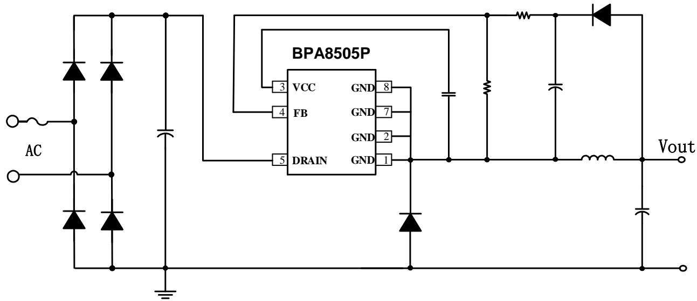

## 应用领域:

家用电器辅助电源  
电机驱动辅助电源  
➢ IOT/ /  
工业控制辅助电源

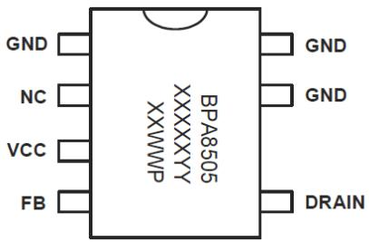

DIP7

1

<table><tr><td>项目描述</td><td>符号</td><td>最小</td><td>典型</td><td>最大</td><td>单位</td><td>备注</td></tr><tr><td colspan="7">输入</td></tr><tr><td>电压</td><td> $V_{IN}$ </td><td>85</td><td>115/230</td><td>264</td><td> $V_{AC}$ </td><td></td></tr><tr><td>频率</td><td> $f_{LINE}$ </td><td>47</td><td>50/60</td><td>63</td><td>Hz</td><td></td></tr><tr><td colspan="7">输出</td></tr><tr><td>输出电压</td><td> $V_{OUT}$ </td><td>14.25</td><td>15</td><td>15.75</td><td>V</td><td>±5%</td></tr><tr><td>输出电流</td><td> $I_{OUT}$ </td><td>0</td><td></td><td>250</td><td>mA</td><td></td></tr><tr><td>输出电压纹波</td><td> $V_{RIPPLE}$ </td><td></td><td></td><td>100</td><td>mV</td><td>20MHz带宽</td></tr><tr><td>连续输出功率</td><td> $P_{OUT}$ </td><td></td><td>3.75</td><td></td><td>W</td><td></td></tr><tr><td colspan="7">效率</td></tr><tr><td>待机功耗</td><td> $P_{STDBY}$ </td><td></td><td></td><td>150</td><td>mW</td><td>230VAC,包含假负载</td></tr><tr><td>满载效率</td><td>η</td><td>75</td><td></td><td></td><td>%</td><td></td></tr><tr><td colspan="7">环境</td></tr><tr><td>传导EMI</td><td></td><td colspan="4">满足CISPR22/EN55022 Class B,至少6dB 裕量</td><td></td></tr><tr><td>Surge</td><td></td><td></td><td>2</td><td></td><td>kV</td><td>差模</td></tr><tr><td>EFT</td><td></td><td></td><td>4</td><td></td><td>kV</td><td>5kHz/100kHz/38kHz</td></tr><tr><td>ESD</td><td></td><td></td><td>15</td><td>20</td><td>kV</td><td>空气放电</td></tr><tr><td>工作环境温度</td><td> $T_{AMP}$ </td><td>0</td><td></td><td>50</td><td>°C</td><td></td></tr></table>

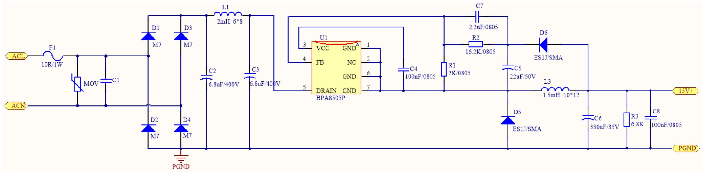

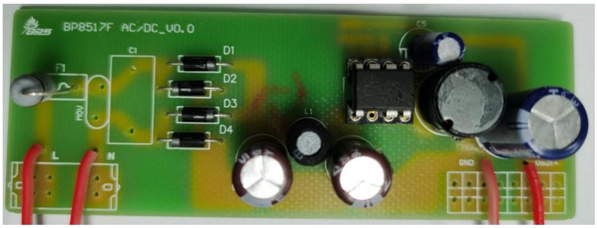

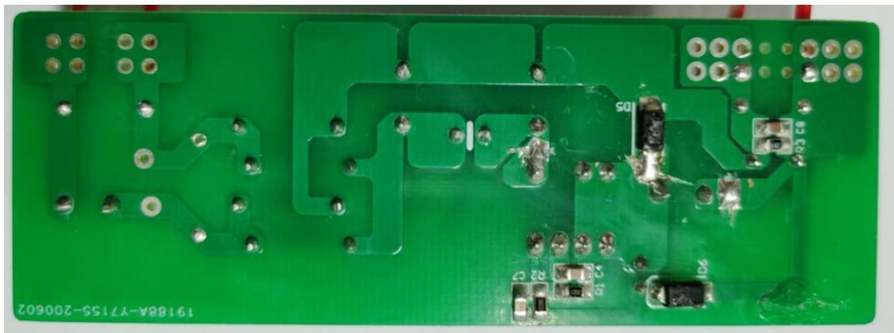

<table><tr><td>序号</td><td>元件标号</td><td>参数描述</td><td>封装尺寸</td><td>数量</td></tr><tr><td>1</td><td>PCB</td><td>CEM-1, 单面板</td><td>92.4mm*33mm</td><td>1</td></tr><tr><td>2</td><td>F1</td><td>1W, 10R保险丝电阻</td><td>DIP</td><td>1</td></tr><tr><td>3</td><td>CX1</td><td>X电容, 0.1uF/250VAC</td><td>12*6*12mm</td><td>1</td></tr><tr><td>4</td><td>D1,D2,D3,D4</td><td>IN4007, 1A/1000V</td><td>DO-41</td><td>4</td></tr><tr><td>5</td><td>D5,D6</td><td>ES1J, 1A/600V, trr=35ns</td><td>SMA</td><td>2</td></tr><tr><td>6</td><td>L1</td><td>2mH, 工字电感</td><td>∅6*8mm</td><td>1</td></tr><tr><td>7</td><td>L3</td><td>1.5mH, 工字电感, IRMS=300mA</td><td>∅10*12mm</td><td>1</td></tr><tr><td>8</td><td>C2, C3</td><td>6.8uF/400V, 电解电容</td><td>∅8*12mm</td><td>2</td></tr><tr><td>9</td><td>C5</td><td>22uF/50V, 电解电容</td><td>∅5*12mm</td><td>1</td></tr><tr><td>10</td><td>C6</td><td>330uF/35V, 电解电容</td><td>∅10*16mm</td><td>1</td></tr><tr><td>11</td><td>C7</td><td>2.2uF/25V, X7R, 瓷片电容</td><td>SMD0805</td><td>1</td></tr><tr><td>12</td><td>C4, C8</td><td>100nF/50V, X7R, 瓷片电容</td><td>SMD0805</td><td>2</td></tr><tr><td>13</td><td>R1</td><td>2K, ±1%</td><td>SMD0805</td><td>1</td></tr><tr><td>14</td><td>R2</td><td>16.2K, ±1%</td><td>SMD0805</td><td>1</td></tr><tr><td>15</td><td>R3</td><td>6.8K, ±5%</td><td>SMD0805</td><td>1</td></tr><tr><td>16</td><td>U1</td><td>BPA8505P, DIP7</td><td>DIP7</td><td>1</td></tr><tr><td></td><td></td><td></td><td>Total</td><td>22</td></tr></table>

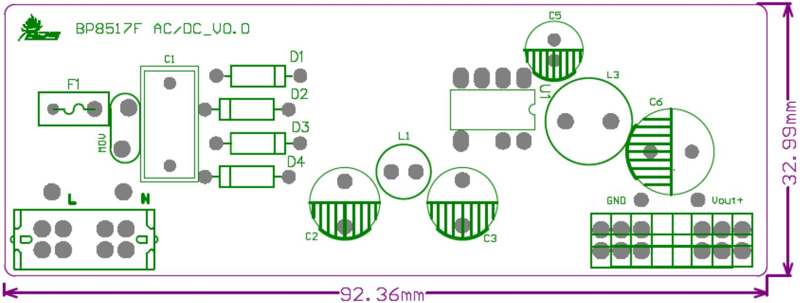

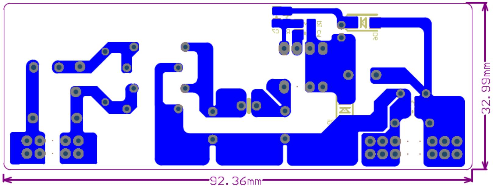

空载功耗  
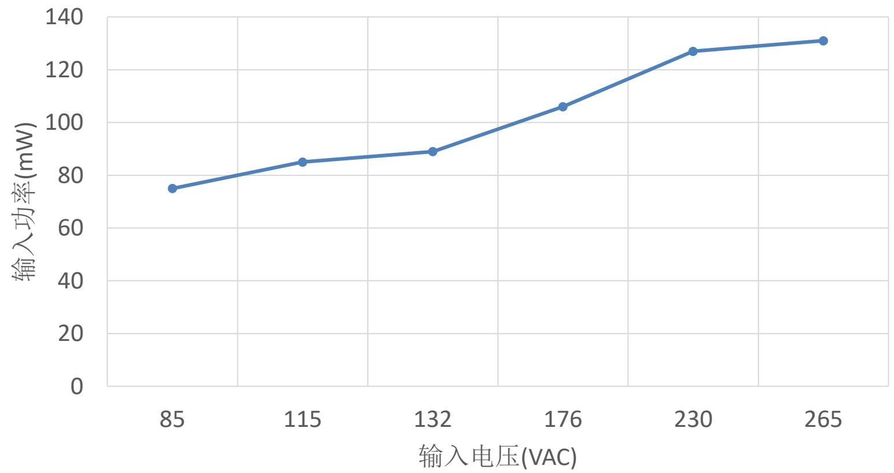

<table><tr><td>输入电压(VAC)</td><td>85</td><td>115</td><td>132</td><td>176</td><td>230</td><td>265</td></tr><tr><td>输入功率(mW)</td><td>75</td><td>85</td><td>89</td><td>106</td><td>127</td><td>131</td></tr></table>

效率曲线  
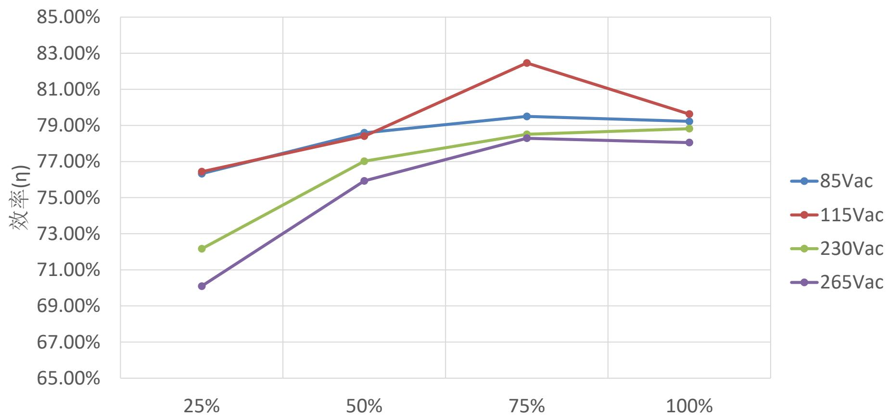

负载比例

## 输出电压调整率

<table><tr><td> $V_{IN}(VAC)$ Load(%)</td><td>85</td><td>115</td><td>132</td><td>176</td><td>230</td><td>265</td><td>平均值</td><td>线调整率</td></tr><tr><td>0</td><td>15.30</td><td>15.29</td><td>15.29</td><td>15.29</td><td>15.29</td><td>15.30</td><td>15.29</td><td>0.05%</td></tr><tr><td>20%</td><td>14.97</td><td>14.96</td><td>14.97</td><td>14.96</td><td>14.96</td><td>14.97</td><td>14.96</td><td>0.09%</td></tr><tr><td>40%</td><td>14.97</td><td>14.96</td><td>14.97</td><td>14.97</td><td>14.96</td><td>14.97</td><td>14.96</td><td>0.08%</td></tr><tr><td>60%</td><td>14.99</td><td>14.98</td><td>14.99</td><td>14.99</td><td>14.98</td><td>14.98</td><td>14.98</td><td>0.07%</td></tr><tr><td>80%</td><td>15.01</td><td>15.00</td><td>15.01</td><td>15.01</td><td>15.00</td><td>15.01</td><td>15.00</td><td>0.05%</td></tr><tr><td>100%</td><td>14.95</td><td>14.94</td><td>14.93</td><td>14.94</td><td>14.93</td><td>14.93</td><td>14.94</td><td>0.10%</td></tr><tr><td>平均值</td><td>15.03</td><td>15.02</td><td>15.03</td><td>15.03</td><td>15.02</td><td>15.03</td><td rowspan="2" colspan="2"></td></tr><tr><td>负载调整率</td><td>2.32%</td><td>2.36%</td><td>2.39%</td><td>2.36%</td><td>2.38%</td><td>2.40%</td></tr></table>

◼ 计算方法：调整率=100%\*(最大值-最小值)/平均值  
测试条件：带6.8kΩ假负载

## 输出电压纹波

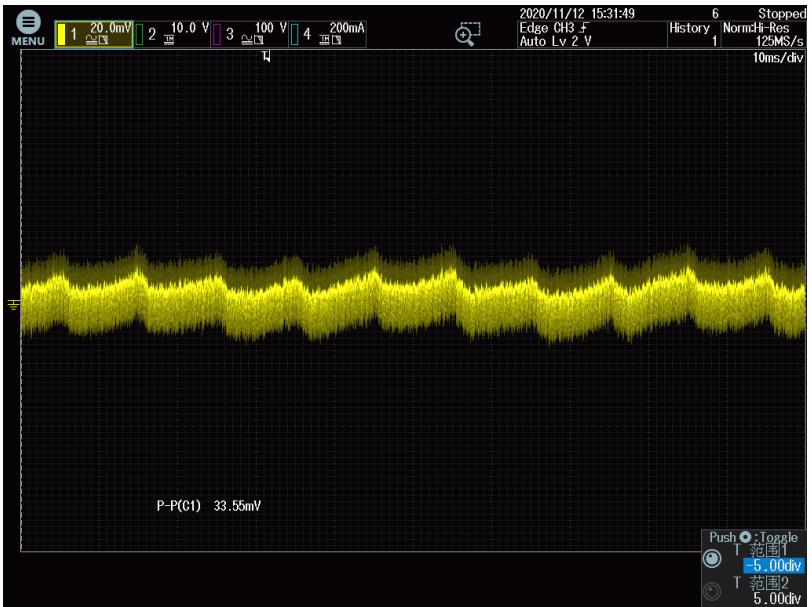

85 VAC  

## Test Condition:

➢ Full Load

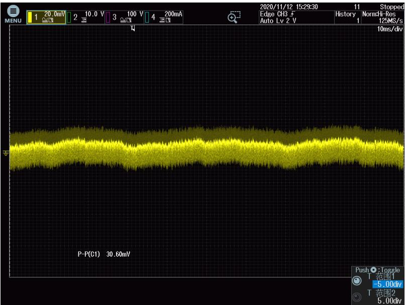

115 VAC  

## Test Condition:

➢ Full Load

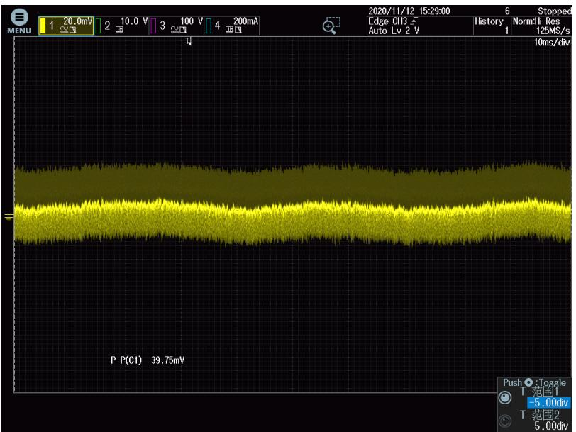

230 VAC  

## Test Condition:

➢ Full Load

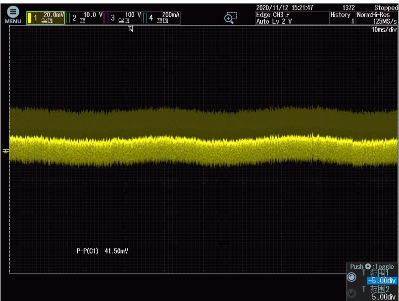

265 VAC  

## Test Condition:

➢ Full Load

## (50%-100%)

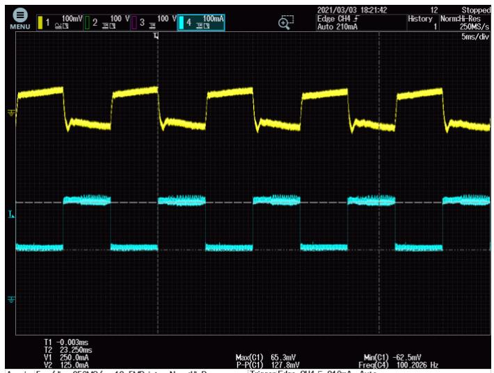

85 VAC

CH1 $\mathsf { V } _ { \mathsf { O U T } }$ $V _ { \mathsf { P K - P K } } = 1 2 7 . 8 ~ \mathsf { m V }$  
CH4 IOUT $\mathsf { C H 4 } \mathsf { I } _ { \mathsf { O U T } }$

## Test Condition:

➢ 0.125 A-0.25 A-0.125 A  
➢ Slew Rate: 0.5 A/μS  
➢ Frequency: 100 Hz

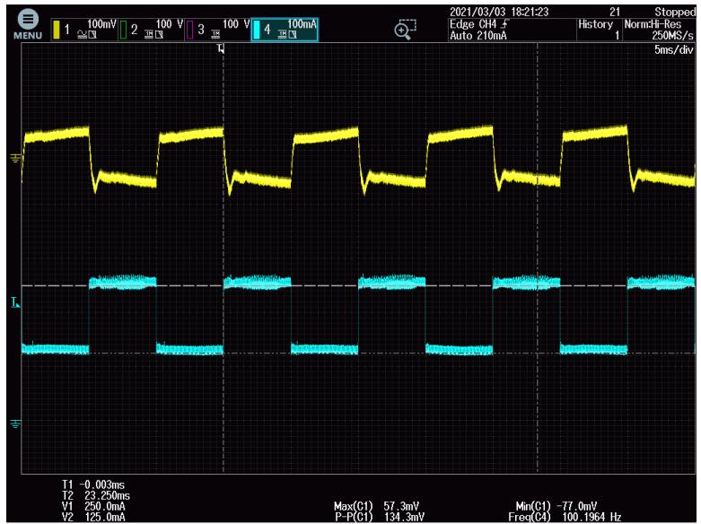

115 VAC

${ \mathsf { C H 1 } } { \mathsf { V } } _ { \mathsf { O U T } }$ $V _ { \mathsf { P K - P K } } { = } 1 3 4 . 3 \mathsf { m V }$  
CH4 IOUT $\mathsf { C H 4 } \mathsf { I } _ { \mathsf { O U T } }$

## Test Condition:

➢ 0.125 A-0.25 A-0.125 A  
➢ Slew Rate: 0.5 A/μS  
➢ Frequency: 100 Hz

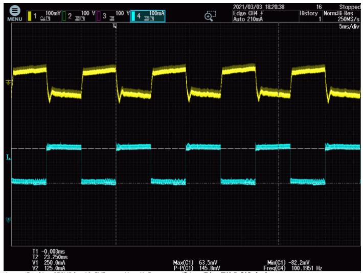

230 VAC

CH1 $\mathsf { V } _ { \mathsf { O U T } }$ $V _ { \mathsf { P K - P K } } { = } 1 4 5 . 8 \mathsf { m V }$  
CH4 IOUT $\mathsf { C H 4 } \mathsf { I } _ { \mathsf { O U T } }$

## Test Condition:

➢ 0.125 A-0.25 A-0.125 A  
➢ Slew Rate: 0.5 $\mathsf { A } / \mu \mathsf { S }$  
➢ Frequency: 100 Hz

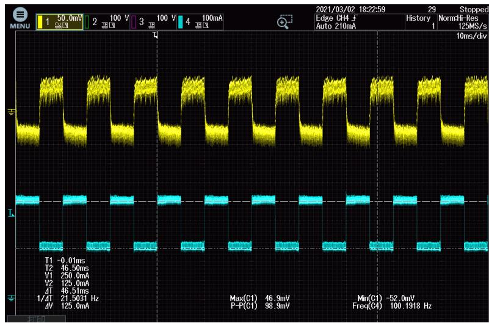

265 VAC

CH1 $\mathsf { V } _ { \mathsf { O U T } }$ $V _ { p | c - P K } = 1 4 6 ~ \mathsf { m V }$  
$\mathsf { C H 4 } \mathsf { I } _ { \mathsf { O U T } }$

## Test Condition:

➢ 0.125 A-0.25 A-0.125 A  
➢ Slew Rate: 0.5 A/μS  
➢ Frequency: 100 Hz

## (10%-90%)

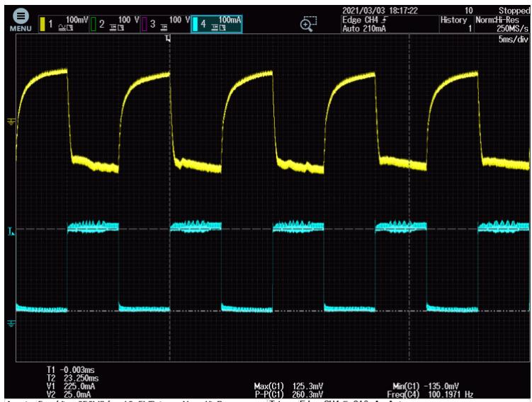

85 VAC

CH1 $\mathsf { V } _ { \mathsf { O U T } }$ $\mathsf { V } _ { \mathsf { P K - P K } } { = } 2 6 0 . 3 \mathsf { m V }$  
CH4 IOUT $\mathsf { C H 4 } \mathsf { I } _ { \mathsf { O U T } }$

## Test Condition:

➢ 0.025A-0.225 A-0.025 A  
➢ Slew Rate: 0.5 A/μS  
➢ Frequency: 100 Hz

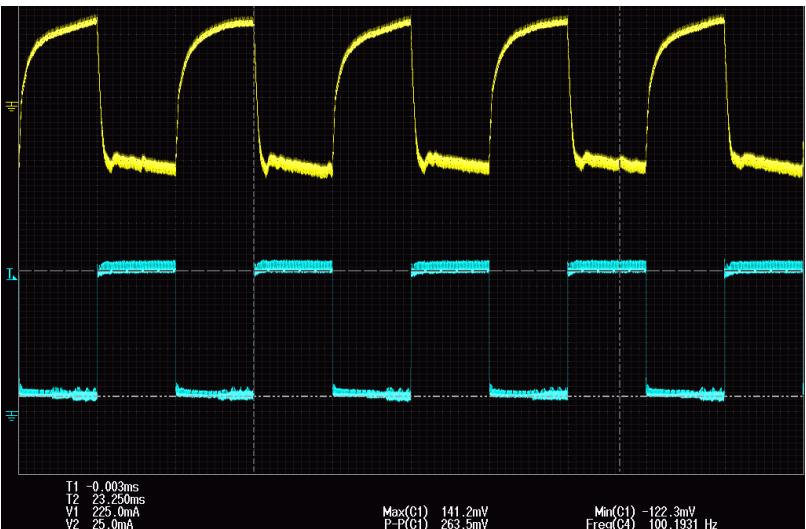

Acruire5mc/divr 250MS/s19 5MPnintsNnrm:Hi-Res  
TriggerFrlgeCH4F210mA.Autn  
115 VAC

CH1 $\mathsf { V } _ { \mathsf { O U T } }$ $\mathsf { V } _ { \mathsf { P K - P K } } { = } 2 6 3 . 5 \mathsf { m V }$  
CH4 IOUT $\mathsf { C H 4 } \mathsf { I } _ { \mathsf { O U T } }$

## Test Condition:

➢ 0.025A-0.225 A-0.025 A  
➢ Slew Rate: 0.5 A/μS  
➢ Frequency: 100 Hz

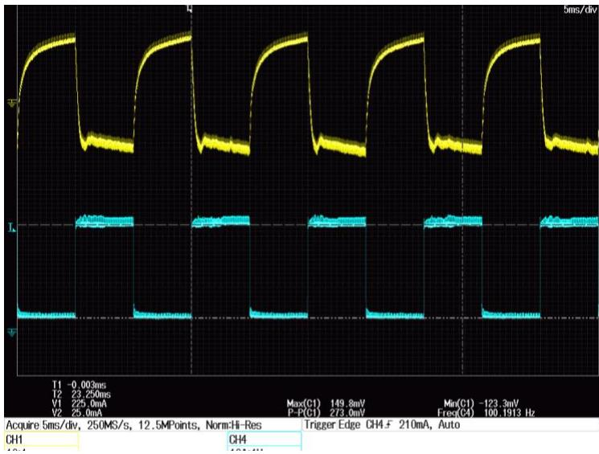

230 VAC

CH1 $\mathsf { V } _ { \mathsf { O U T } }$ $V _ { P K - P K } = 2 7 3 m v$  
CH4 IOUT $\mathsf { C H 4 } \mathsf { I } _ { \mathsf { O U T } }$

## Test Condition:

➢ 0.025A-0.225 A-0.025 A  
➢ Slew Rate: 0.5 $\mathsf { A } / \mu \mathsf { S }$  
➢ Frequency: 100 Hz

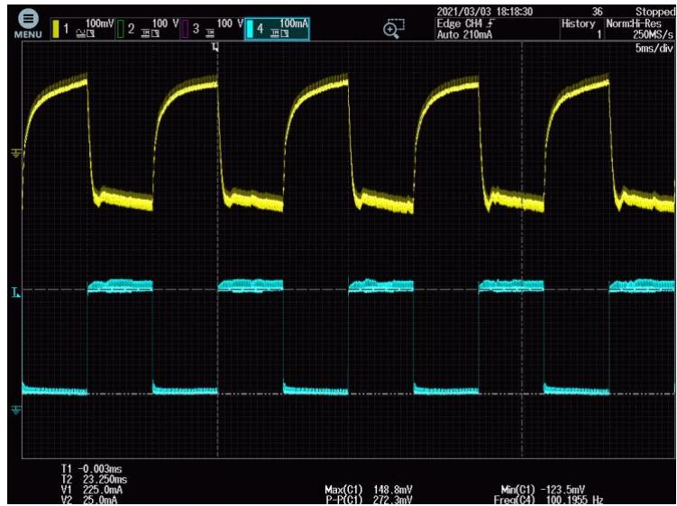

265 $\mathsf { v } _ { \mathsf { A C } }$

CH1 $\mathsf { V } _ { \mathsf { O U T } }$ $V _ { P K - P K } = 2 7 2 . 3 m v$  
$\mathsf { C H 4 } \mathsf { I } _ { \mathsf { O U T } }$

## Test Condition:

➢ 0.025A-0.225 A-0.025 A  
➢ Slew Rate: 0.5 A/μS  
➢ Frequency: 100 Hz

## 输出电压开机波形

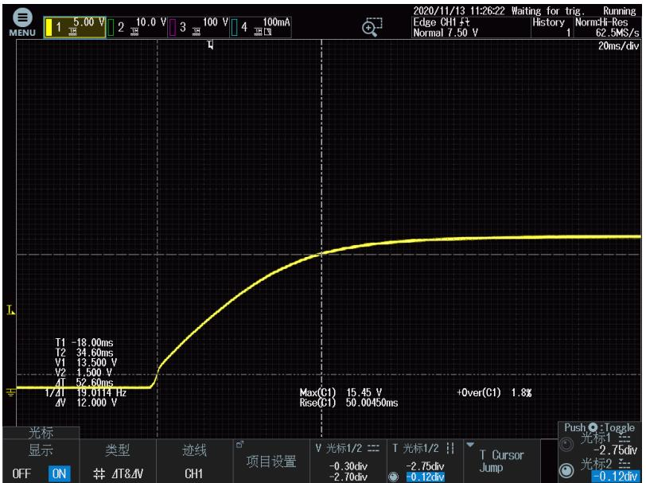

85 VAC  
  
Test Condition:  
➢ No Load

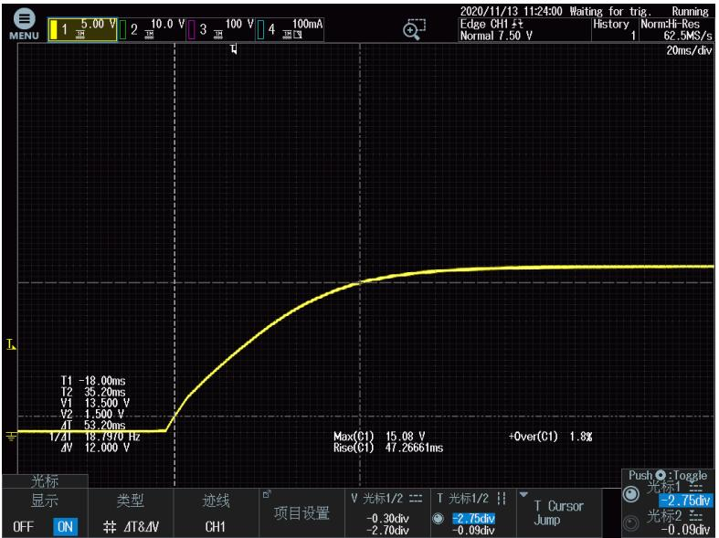

85 VAC  
  
Test Condition:  
➢ Full Load

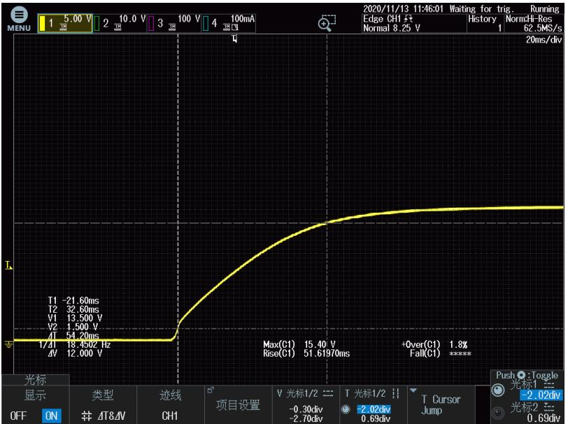

265 VAC  
  
Test Condition:  
➢ No Load

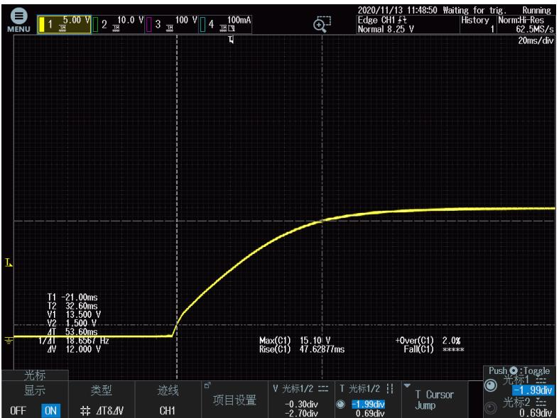

265 VAC  
  
Test Condition:  
➢ Full Load

## MOSFET

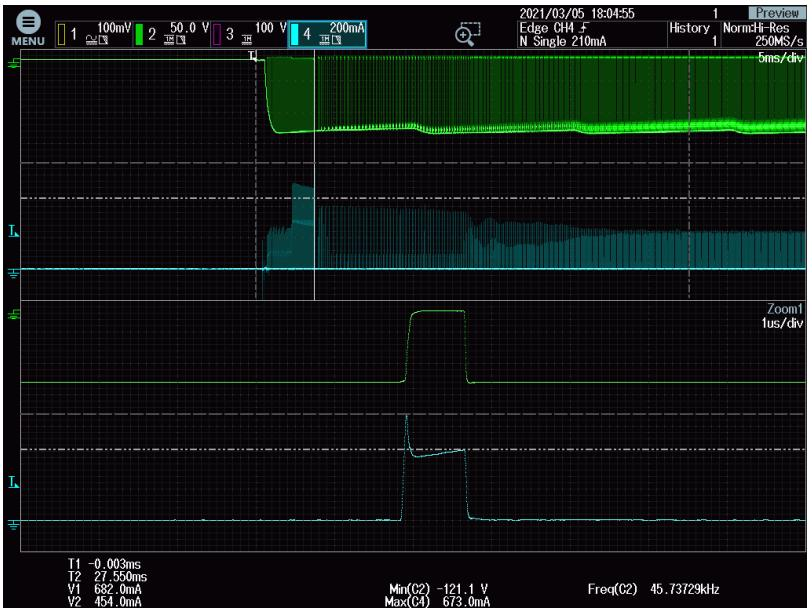

85 VAC

CH2 VDS  
CH4 IDS

$$
\begin{array}{l} V _ {D S \_ M A X} = 1 2 1 V \\ I _ {D S \_ M A X} = 0. 6 7 3 A \end{array}
$$

## Test Condition:

➢ No Load

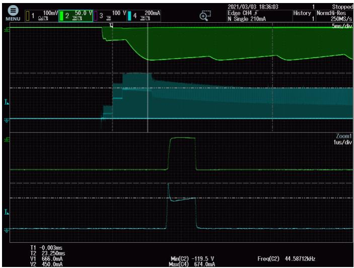  
85 VAC

CH2 VDS  
CH4 IDS

$$
\begin{array}{l} \mathrm {V_ {DS\_MAX}} = 1 1 9. 5 \mathrm{V} \\ \mathrm {I_ {DS\_MAX}} = 0. 6 7 4 \mathrm{A} \end{array}
$$

## Test Condition:

➢ Full Load

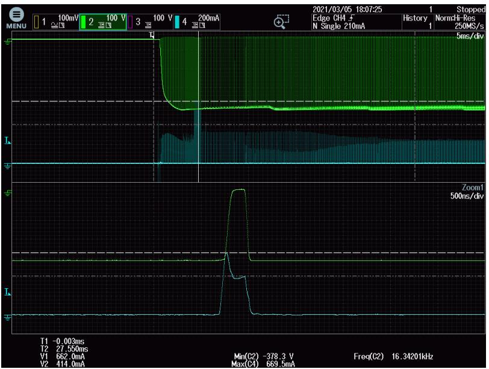

265 VAC

CH2 VDS  
CH4 IDS

$$
\begin{array}{l} V _ {D S \_ M A X} = 3 7 8. 3 V \\ I _ {D S \_ M A X} = 0. 6 7 A \end{array}
$$

## Test Condition:

➢ No Load

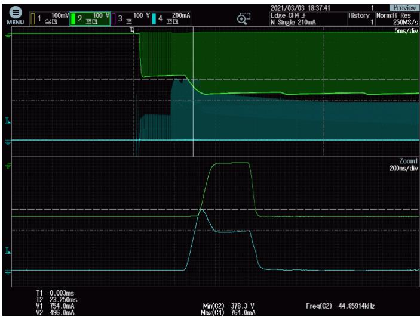

265 VAC

CH2 VDS  
CH4 IDS

$$
\begin{array}{l} V _ {D S \_ M A X} = 3 7 8. 3 V \\ I _ {D S \_ M A X} = 0. 7 6 4 A \end{array}
$$

## Test Condition:

➢ Full Load

## MOSFET

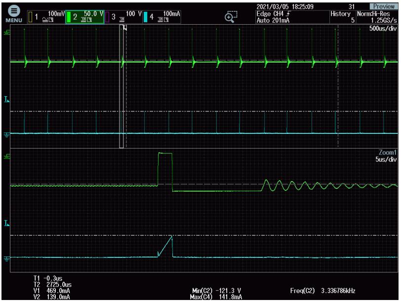

85 VAC

CH2 VDS  
CH4 IDS

$$
V _ {D S \_ M A X} = 1 2 1. 3 V
$$

$$
I _ {D S \_ M A X} = 0. 1 4 2 A
$$

## Test Condition:

➢ No Load

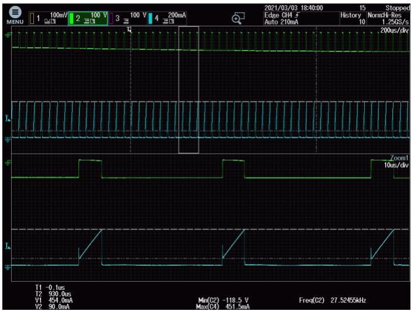

85 VAC

${ \mathsf { C H } } 2 { \mathsf { V } } _ { \mathsf { D S } }$  
$C H 4 \mid _ { \mathrm { { D S } } }$

$$
V _ {D S \_ M A X} = 1 1 9 V
$$

$$
I _ {D S \_ M A X} = 0. 4 5 2 \mathrm{A}
$$

## Test Condition:

➢ Full Load

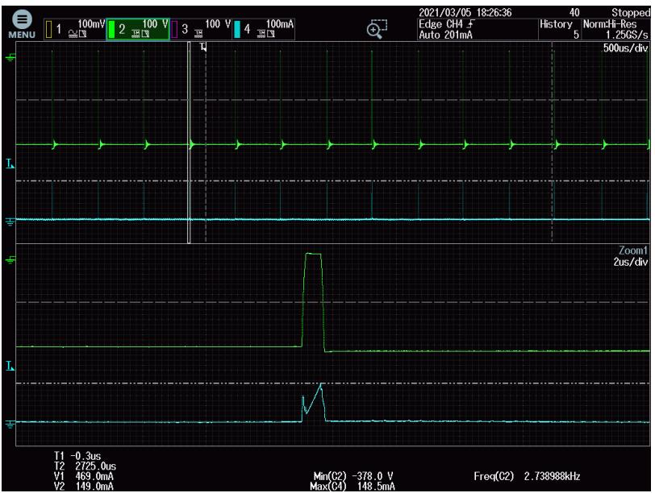

265 VAC

CH2 VDS  
CH4 IDS

$$
V _ {D S \_ M A X} = 3 7 8 V
$$

$$
I _ {D S \_ M A X} = 0. 1 4 9 \mathrm{A}
$$

## Test Condition:

➢ No Load

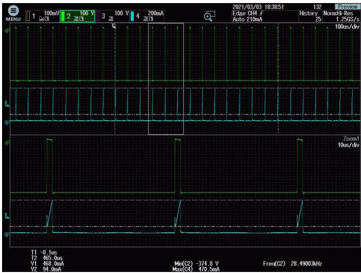

265 VAC

CH2 VDS  
CH4 IDS

$$
V _ {D S \_ M A X} = 3 7 4. 8 V
$$

$$
I _ {D S \_ M A X} = 0. 4 7 1 \mathrm{A}
$$

## Test Condition:

➢ Full Load

## 电感电流开机波形

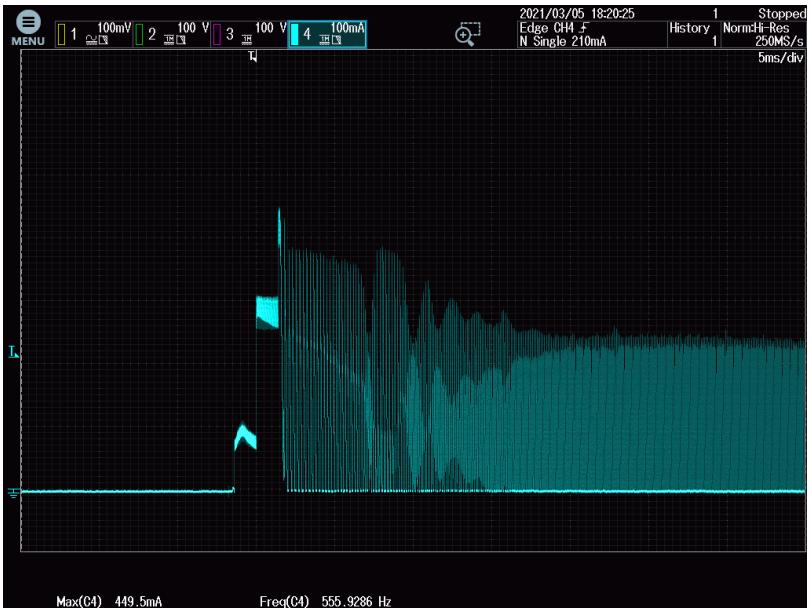

85 VAC  
  
Test Condition:  
➢ No Load

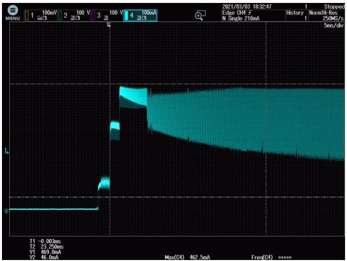

85 VAC  
  
Test Condition:  
➢ Full Load

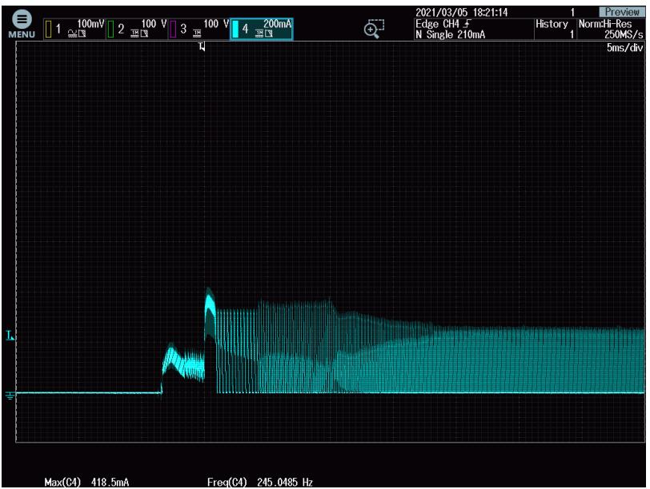

265 VAC  
  
Test Condition:  
➢ No Load

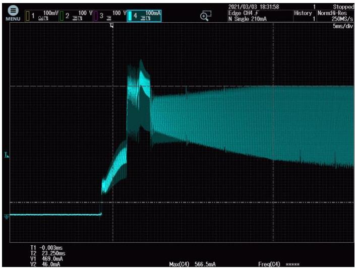

265 VAC  
  
Test Condition:  
➢ Full Load

## 电感电流稳态波形

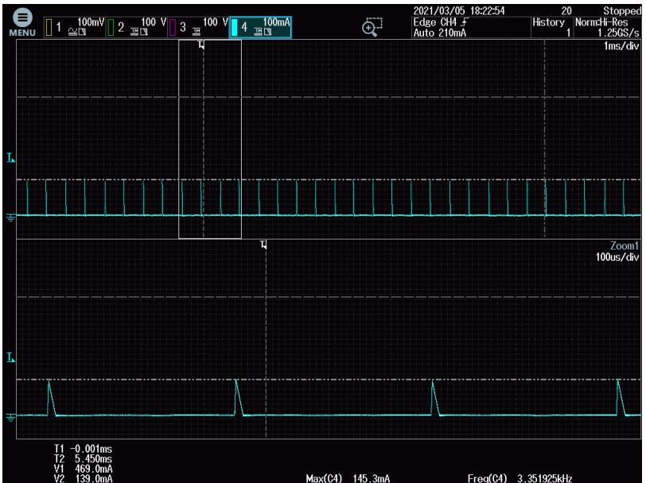

85 VAC  
  
Test Condition:  
➢ No Load

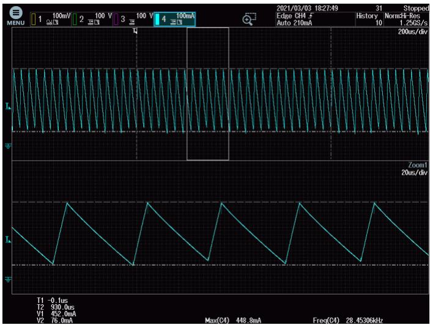

85 VAC  
  
Test Condition:  
➢ Full Load

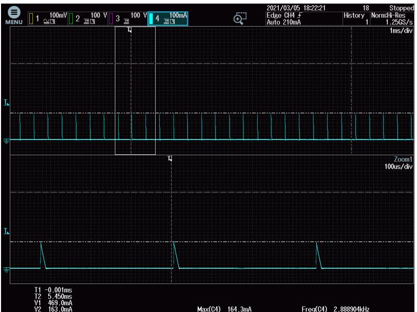

265 VAC  
  
Test Condition:  
➢ No Load

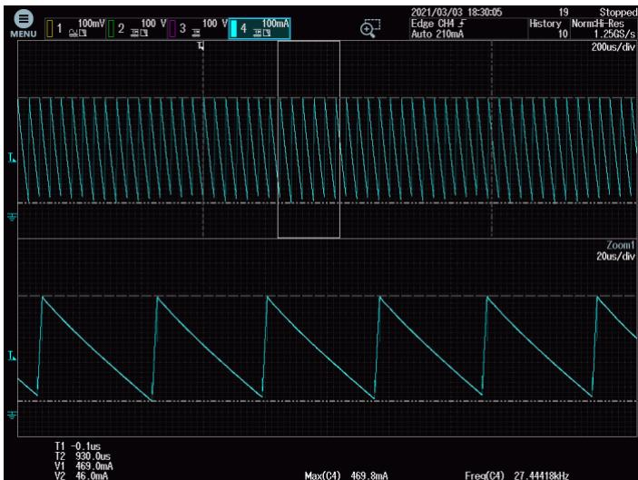

265 VAC  
  
Test Condition:  
➢ Full Load

## (MOSFET )

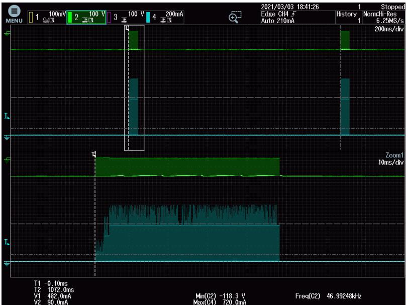

85 VAC

CH2 VDS  
CH4 $\mathsf { I } _ { \mathsf { D } \mathsf { S } }$

$$
\begin{array}{l} \mathrm {V_ {DS\_MAX}} = 1 1 8. 3 \mathrm{V} \\ \mathrm {I_ {DS\_MAX}} = 0. 7 2 \mathrm{A} \end{array}
$$

## Test Condition:

➢ Output Short

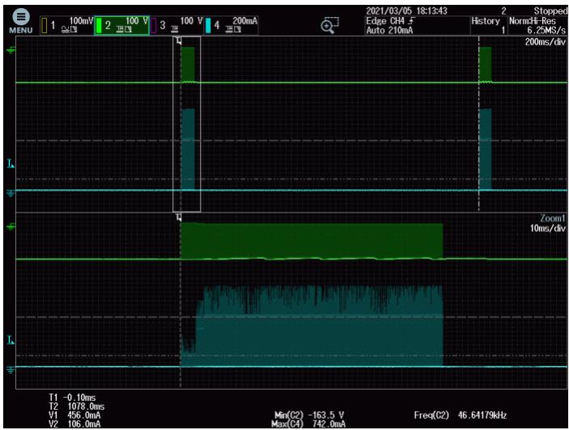

115 VAC

${ \mathsf { C H } } 2 { \mathsf { V } } _ { \mathsf { D S } }$  
$C H 4 \mid _ { \mathrm { { D S } } }$

$$
\begin{array}{l} \mathrm {V_ {DS\_MAX}} = 1 6 3. 5 \mathrm{V} \\ \mathrm {I_ {DS\_MAX}} = 0. 7 4 2 \mathrm{A} \end{array}
$$

## Test Condition:

➢ Output Short

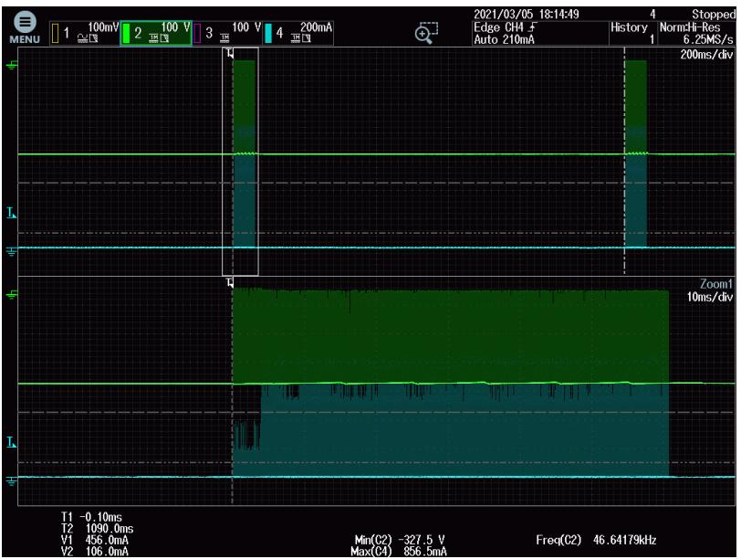

230 VAC

CH2 $\mathsf { V } _ { \mathsf { D } \mathsf { S } }$  
CH4 IDS

$$
\begin{array}{l} V _ {D S \_ M A X} = 3 2 7. 5 V \\ I _ {D S \_ M A X} = 0. 8 5 7 A \end{array}
$$

## Test Condition:

➢ Output Short

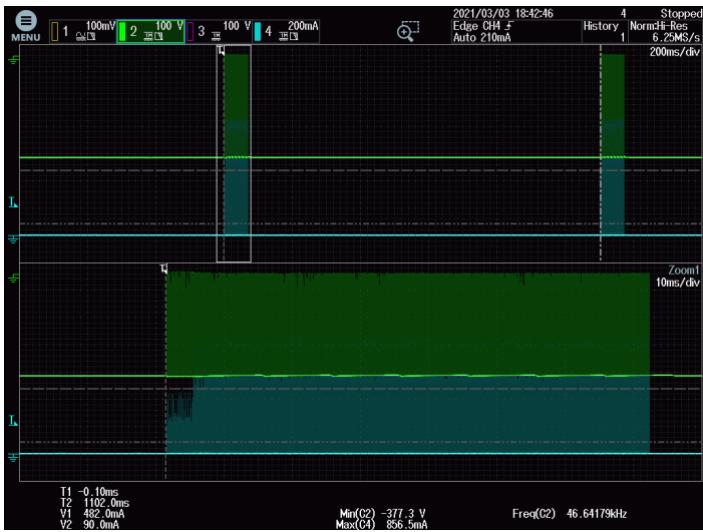

265 VAC

${ \mathsf { C H } } 2 { \mathsf { V } } _ { \mathsf { D S } }$  
$C H 4 1 _ { \mathrm { D S } }$

$$
\begin{array}{l} V _ {D S \_ M A X} = 3 7 7. 3 V \\ I _ {D S \_ M A X} = 0. 8 5 7 A \end{array}
$$

## Test Condition:

➢ Output Short

<table><tr><td rowspan="2">项目</td><td>85VAC</td><td>115VAC</td><td>230VAC</td><td>265VAC</td></tr><tr><td>温度(°C)</td><td>温度(°C)</td><td>温度(°C)</td><td>温度(°C)</td></tr><tr><td>环境温度</td><td>50.1</td><td>50.3</td><td>50</td><td>50</td></tr><tr><td>BP8505P (U1)</td><td>72.3</td><td>72.2</td><td>78.7</td><td>81.6</td></tr><tr><td>电感磁芯 (L3)</td><td>69.3</td><td>70.2</td><td>74.2</td><td>75.7</td></tr><tr><td>输出电解电容 (C3)</td><td>60.2</td><td>60.8</td><td>62.5</td><td>63.3</td></tr><tr><td>输入电解电容 (C6)</td><td>62.1</td><td>61.3</td><td>62.5</td><td>63.2</td></tr><tr><td>整流二极管 (D6)</td><td>59.9</td><td>60.5</td><td>62.4</td><td>63.4</td></tr><tr><td>续流二极管 (D5)</td><td>69.9</td><td>70.6</td><td>74.2</td><td>75.4</td></tr></table>

备注：增大芯片Source散热铜箔面积可以降低芯片温度

## 测试说明

➢ 在温箱中进行测试  
➢ 电路板放在一个封闭的盒子内  
➢ 热电偶连接到各个测量点  
➢ 等测量点温度达到稳定后记录数据

115VAC Line

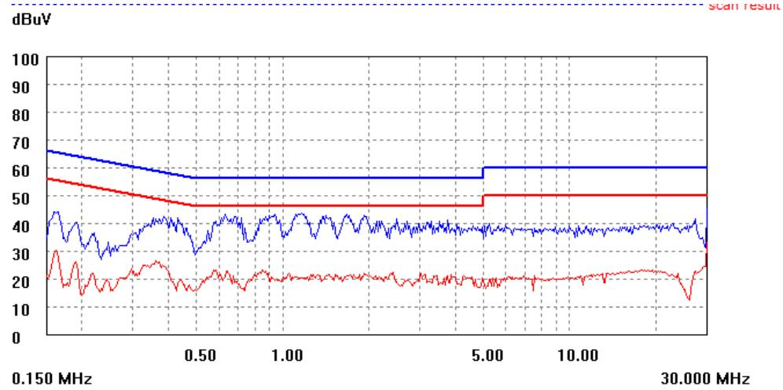

115VAC Neutral

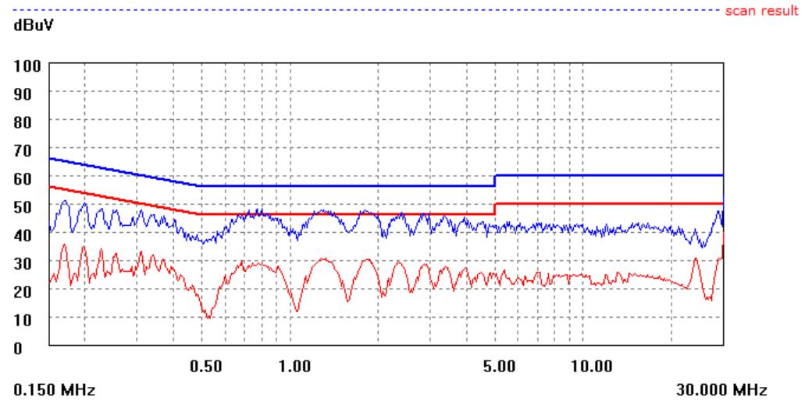

230VAC Line

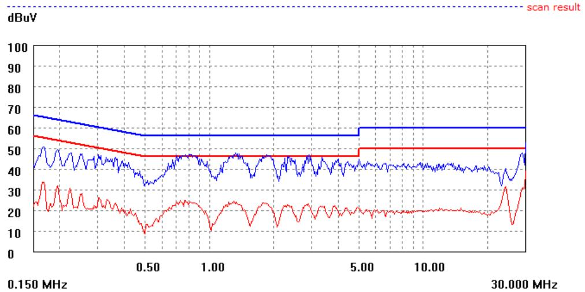

230VAC Neutral

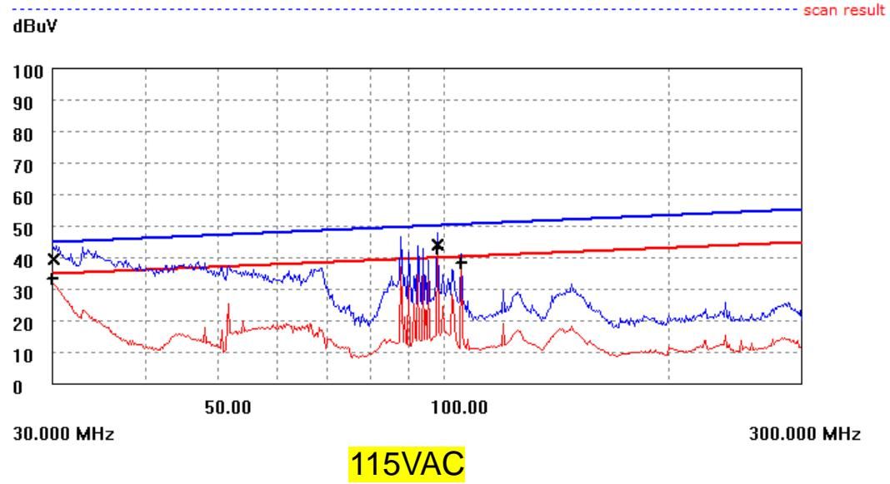

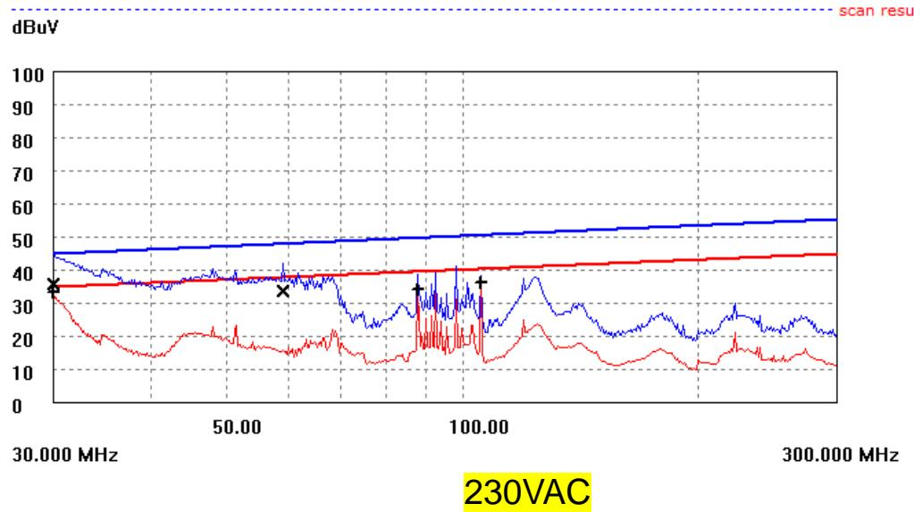

<table><tr><td>差模</td><td>电压</td><td>相位角</td><td>发生器阻抗</td><td>测试次数</td><td>测试结果</td></tr><tr><td>L to N</td><td>+2kV</td><td>0</td><td>2</td><td>10</td><td>Pass</td></tr><tr><td>L to N</td><td>-2kV</td><td>0</td><td>2</td><td>10</td><td>Pass</td></tr><tr><td>L to N</td><td>+2kV</td><td>90</td><td>2</td><td>10</td><td>Pass</td></tr><tr><td>L to N</td><td>-2kV</td><td>90</td><td>2</td><td>10</td><td>Pass</td></tr><tr><td>L to N</td><td>+2kV</td><td>180</td><td>2</td><td>10</td><td>Pass</td></tr><tr><td>L to N</td><td>-2kV</td><td>180</td><td>2</td><td>10</td><td>Pass</td></tr><tr><td>L to N</td><td>+2kV</td><td>270</td><td>2</td><td>10</td><td>Pass</td></tr><tr><td>L to N</td><td>-2kV</td><td>270</td><td>2</td><td>10</td><td>Pass</td></tr></table>

## 测试说明

➢ 按照GB/T17626.5和IEC61000-4-5的最新版本要求进行测试  
➢ 室温环境，230VAC输入，满载条件  
➢ 输入1.2/50us组合波浪涌电压  
➢ 每个测试点重复10次  
➢ 每次间隔时间1分钟  
➢ 试验时样机输出正常（符合A类标准）视为Pass

<table><tr><td>差模</td><td>电压</td><td>脉冲群持续时间</td><td>脉冲频率</td><td>测试时间</td><td>测试结果</td></tr><tr><td>L to N</td><td>+4kV</td><td>15ms</td><td>5kHz</td><td>120s</td><td>Pass</td></tr><tr><td>L to N</td><td>-4kV</td><td>15ms</td><td>5kHz</td><td>120s</td><td>Pass</td></tr><tr><td>L to N</td><td>+4kV</td><td>0.75ms</td><td>100kHz</td><td>120s</td><td>Pass</td></tr><tr><td>L to N</td><td>-4kV</td><td>0.75ms</td><td>100kHz</td><td>120s</td><td>Pass</td></tr><tr><td>L to N</td><td>+2kV</td><td>2ms</td><td>38kHz</td><td>120s</td><td>Pass</td></tr><tr><td>L to N</td><td>-2kV</td><td>2ms</td><td>38kHz</td><td>120s</td><td>Pass</td></tr><tr><td>L to N</td><td>+4kV</td><td>2ms</td><td>38kHz</td><td>120s</td><td>Pass</td></tr><tr><td>L to N</td><td>-4kV</td><td>2ms</td><td>38kHz</td><td>120s</td><td>Pass</td></tr></table>

## 测试说明

➢ 按照GB/T17626.4和IEC61000-4-4的最新版本要求进行测试  
➢ 室温环境，230VAC输入满载条件  
➢ 分别测试5kHz/100kHz/38kHz脉冲频率  
➢ 脉冲群周期为300ms  
➢ 每个测试条件测试时间120s  
➢ 试验时样机输出正常（符合A类标准）视为Pass

<table><tr><td>测试点</td><td>电压(V)</td><td>放电类型</td><td>放电次数</td><td>测试结果</td></tr><tr><td>Vo</td><td>+15kV</td><td>空气放电</td><td>10</td><td>Pass</td></tr><tr><td>Vo</td><td>-15kV</td><td>空气放电</td><td>10</td><td>Pass</td></tr><tr><td>GND</td><td>+15kV</td><td>空气放电</td><td>10</td><td>Pass</td></tr><tr><td>GND</td><td>-15kV</td><td>空气放电</td><td>10</td><td>Pass</td></tr><tr><td>Vo</td><td>+20kV</td><td>空气放电</td><td>10</td><td>Pass</td></tr><tr><td>Vo</td><td>-20kV</td><td>空气放电</td><td>10</td><td>Pass</td></tr><tr><td>GND</td><td>+20kV</td><td>空气放电</td><td>10</td><td>Pass</td></tr><tr><td>GND</td><td>-20kV</td><td>空气放电</td><td>10</td><td>Pass</td></tr></table>

## 测试说明

➢ 按照GB/T17626.2和IEC61000-4-2的最新版本要求进行测试  
➢ 室温环境，230VAC输入满载条件  
➢ 每个测试点重复10次  
➢ 分别对输出正端和地进行空气放电  
➢ 试验时样机输出正常（符合A类标准）视为Pass

## THANK YOU FOR WATCHING
