## 概述

BPA8506D 是一款高性能、高集成度、低待机功耗的开关电源驱动芯片，适用于全电压85\~265VAC输入的Buck、Buck-Boost、Flyback 等变换器拓扑应用。

BPA8506D 内部集成了 700V 高压 MOSFET、高压启动和自供电电路、电流采样电路，以及采用先进的控制技术，无需外部环路补偿即可实现优异的恒压输出特性，极大地减少了外围器件数量，节省了系统成本和体积，同时提高了可靠性。

BPA8506D 采用多模式控制技术，能有效降低系统待机功耗，提高效率和改善动态性能，并减小系统工作在轻载时的音频噪声。

BPA8506D 提供了丰富的保护功能，包括输出短路保护、输出过压保护、输出过载保护、逐周期限流、过温保护等，使系统更加安全可靠。

BPA8506D 提供 SOP-7 封装。

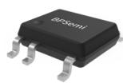  
SOP-7 封装

## 特点

内部集成 700V 高压 MOSFET  
集成高压启动和自供电电路  
低待机功耗<100mW  
优异的动态响应速度，输出电压纹波小  
良好的负载调整率和线性调整率  
降低音频噪声的降幅调制技术  
自适应开关频率，最高 45kHz  
改善 EMI 性能的频率调制技术  
内置软启动功能  
保护功能

 输出短路保护(SCP)  
输出过压保护(OVP)  
 输出过载保护(OLP)  
 逐周期限流(Cycle-by-Cycle)  
迟滞过温保护(OTP)

## 应用领域

家用电器辅助电源  
电机驱动辅助电源  
IOT/智能家居/智能照明  
工业控制辅助电源

## 典型应用

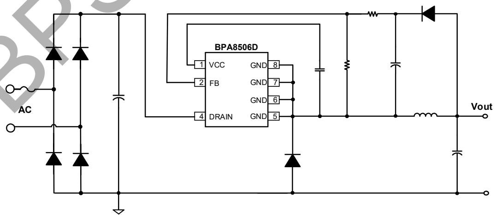

图 1. BPA8506D 典型 Buck 应用电路

定购信息

<table><tr><td>定购型号</td><td>封装</td><td>包装形式</td><td>打印</td></tr><tr><td>BPA8506D</td><td>SOP-7</td><td>卷盘4,000/盘</td><td>BPA8506XXXXYYZZWWD</td></tr></table>

## 管脚封装

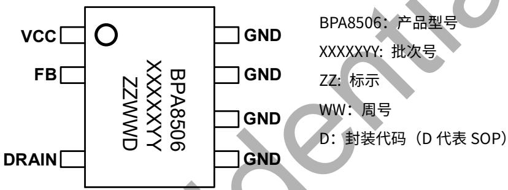

图 2. SOP-7 管脚封装图

管脚描述

<table><tr><td>管脚号</td><td>管脚名称</td><td>描述</td></tr><tr><td>1</td><td>VCC</td><td>芯片电源端,连接一个0.1μF的瓷片电容到芯片地做旁路电容</td></tr><tr><td>2</td><td>FB</td><td>输出电压反馈端,通过分压电阻采样电压,实现输出电压调节</td></tr><tr><td>4</td><td>DRAIN</td><td>芯片内部高压MOSFET漏极,此引脚也向芯片内部提供自供电电流</td></tr><tr><td>5、6、7、8</td><td>GND</td><td>芯片地,内部MOSFET源极</td></tr></table>

输出电流推荐表(Buck 拓扑) (注 1)

<table><tr><td rowspan="2">型号</td><td colspan="2">230VAC ±15%</td><td colspan="2">85~265VAC</td></tr><tr><td>DCM 模式</td><td>CCM 模式</td><td>DCM 模式</td><td>CCM 模式</td></tr><tr><td>BPA8506D</td><td>320mA</td><td>400mA</td><td>320mA</td><td>400mA</td></tr></table>

注 1：表中的推荐输出电流是在充分散热的条件下，非隔离 BUCK电路应用。

极限参数(注 2)

<table><tr><td>符号</td><td>参数</td><td>参数范围</td><td>单位</td></tr><tr><td> $V_{DRAIN}$ </td><td>内部高压 MOSFET 漏极到源极电压</td><td>-0.3~700</td><td>V</td></tr><tr><td> $I_{DS\_MAX}$ </td><td>内部高压 MOSFET 最大漏极电流(注 3)</td><td>1630 (3060)</td><td>mA</td></tr><tr><td> $V_{CC}$ </td><td>VCC 电压</td><td>-0.3~9</td><td>V</td></tr><tr><td> $I_{CC\_MAX}$ </td><td>VCC 引脚最大电流</td><td>20</td><td>mA</td></tr><tr><td> $V_{FB}$ </td><td>输出电压反馈端电压</td><td>-0.3~9</td><td>V</td></tr><tr><td> $P_{DMAX}$ </td><td>功耗(注 4)</td><td>0.97</td><td>W</td></tr><tr><td> $\theta_{JA}$ </td><td>结到环境的热阻(注 5)</td><td>129</td><td>°C/W</td></tr><tr><td> $\theta_{JC}$ </td><td>结到芯片表面的热阻(注 6)</td><td>70</td><td>°C/W</td></tr><tr><td> $T_J$ </td><td>工作结温范围</td><td>-40 to 150</td><td>°C</td></tr><tr><td> $T_{STG}$ </td><td>储存温度范围</td><td>-55 to 150</td><td>°C</td></tr><tr><td>ESD</td><td>人体模型 ESD(注 7)</td><td>2</td><td>kV</td></tr></table>

注 2：最大极限值是指超出该工作范围，芯片有可能损坏。电气参数定义了器件在工作范围内并且在保证特定性能指标的测试条件下的直流和交流电参数规范。对于未给定上下限值的参数，该规范不予保证其精度，但其典型值合理反映了器件性能。  
注 3：当漏极电压低于400V 时，可允许更高的最大漏极电流。  
注 4：温度升高最大功耗一定会减小，这也是由 TJMAX, θJA,和环境温度 TA所决定的。最大允许功耗为 $P _ { D M A X } = ( T _ { J M A X } - T _ { A } ) / \theta _ { J A }$ 或是极限范围给出的数字中比较低的那个值。  
注 5：1平方英寸双层 PCB板，按照JEDEC 标准测试。  
注 6：该值基于 JEDEC 定义的 1S0P 系统，并将根据应用环境而变化。有关更多信息，请参阅 EIA/JEDEC 标准。  
注 7：按照 JEDEC 标准测试, 100pF 电容通过 1.5kΩ 电阻放电。

电气参数(注 8)（无特别说明情况下， $V _ { C C } = 6 . 4 V , T _ { A } = 2 5 ^ { \circ } C )$

<table><tr><td>符号</td><td>描述</td><td>条件</td><td>最小值</td><td>典型值</td><td>最大值</td><td>单位</td></tr><tr><td colspan="7">VCC供电部分</td></tr><tr><td> $V_{CC\_ON}$ </td><td>VCC启动阈值电压</td><td></td><td>5.8</td><td>6.4</td><td>7</td><td>V</td></tr><tr><td> $V_{CC\_HYS}$ </td><td>VCC引脚电压迟滞</td><td></td><td>1</td><td>1.4</td><td>1.8</td><td>V</td></tr><tr><td> $V_{CC\_CLAMP}$ </td><td>VCC引脚钳位电压</td><td> $I_{CLAMP}=2mA$ </td><td></td><td>7</td><td></td><td>V</td></tr><tr><td rowspan="2"> $I_{CC}$ </td><td>VCC工作电流(最大工作频率)</td><td> $V_{FB}=1.5V, V_{DRAIN}=8V$  $V_{CC}=V_{CC\_ON}+0.2V$ </td><td>195</td><td>300</td><td>405</td><td>μA</td></tr><tr><td>VCC工作电流(最小工作频率)</td><td> $V_{FB}=2V, V_{DRAIN}=8V$  $V_{CC}=V_{CC\_ON}+0.2V$ </td><td>115</td><td>170</td><td>225</td><td>μA</td></tr><tr><td> $I_{CH1}$ </td><td rowspan="2">VCC电容充电电流</td><td> $V_{CC}=0V, V_{DRAIN}=40V$ </td><td>6</td><td>9</td><td>12</td><td>mA</td></tr><tr><td> $I_{CH2}$ </td><td> $V_{CC}=5V, V_{DRAIN}=40V$ </td><td>3</td><td>5</td><td>8.5</td><td>mA</td></tr><tr><td colspan="7">FB反馈</td></tr><tr><td> $V_{FB\_REF}$ </td><td>内部误差放大器基准</td><td></td><td>1.65</td><td>1.7</td><td>1.75</td><td>V</td></tr><tr><td> $V_{FB\_OVP}$ </td><td>输出过压阈值</td><td></td><td>2.4</td><td>2.9</td><td>3.4</td><td>V</td></tr><tr><td> $t_{OVP}$ </td><td>输出过压屏蔽时间</td><td></td><td></td><td>4</td><td></td><td>Cycles</td></tr><tr><td> $V_{FB\_OLP}$ </td><td>输出过载阈值</td><td></td><td></td><td>1.1</td><td></td><td>V</td></tr><tr><td> $t_{OLP}$ </td><td>输出过载屏蔽时间</td><td></td><td></td><td>400</td><td></td><td>ms</td></tr><tr><td> $V_{FB\_SC}$ </td><td>开机输出短路阈值</td><td></td><td></td><td>0.4</td><td></td><td>V</td></tr><tr><td> $t_{SC}$ </td><td>输出短路屏蔽时间</td><td></td><td></td><td>2048</td><td></td><td>Cycles</td></tr><tr><td> $t_{AR\_OFF}$ </td><td>自动重启停止时间</td><td></td><td></td><td>1</td><td></td><td>s</td></tr><tr><td colspan="7">振荡器</td></tr><tr><td> $f_{S\_MIN}$ </td><td>最小开关频率</td><td></td><td>0.5</td><td>1</td><td>1.5</td><td>kHz</td></tr><tr><td> $f_{S\_MAX}$ </td><td>最大开关频率</td><td></td><td>40.5</td><td>45</td><td>49.5</td><td>kHz</td></tr><tr><td> $D_{MAX}$ </td><td>最大占空比</td><td></td><td></td><td>60</td><td></td><td>%</td></tr><tr><td colspan="7">电流采样</td></tr><tr><td> $I_{LIMIT\_MAX}$ </td><td>最大电流限值(注9)</td><td> $V_{DRAIN}=17.5V$ </td><td>640</td><td>700</td><td>760</td><td>mA</td></tr><tr><td> $I_{LIMIT\_MIN}$ </td><td>最小电流限值</td><td>进入测试模式一</td><td colspan="3">0.3*  $I_{LIMIT\_MAX}$ </td><td>mA</td></tr><tr><td> $t_{LEB}$ </td><td>前沿消隐时间</td><td></td><td></td><td>260</td><td></td><td>ns</td></tr><tr><td> $t_{OFF\_DELAY}$ </td><td>MOSFET关断延时</td><td></td><td></td><td>100</td><td></td><td>ns</td></tr><tr><td colspan="7">功率管</td></tr><tr><td> $R_{DS\_ON}$ </td><td>功率管导通阻抗</td><td> $I_{DS}=18mA, T_J=25°C$ </td><td></td><td>6</td><td>7</td><td>Ω</td></tr><tr><td> $I_{DSS}$ </td><td>功率管关断漏电流</td><td> $V_{FB}=3.5V, V_{DS}=560V$  $V_{CC}=V_{CC\_ON}+0.2V$ </td><td></td><td></td><td>50</td><td>μA</td></tr><tr><td> $BV_{DSS}$ </td><td>功率管的击穿电压</td><td></td><td>700</td><td></td><td></td><td>V</td></tr><tr><td> $V_{DS\_SUP}$ </td><td>最小漏极启动电压</td><td></td><td></td><td>40</td><td></td><td>V</td></tr><tr><td colspan="7">过热保护</td></tr><tr><td> $T_{OTP}$ </td><td>过温保护阈值</td><td></td><td></td><td>145</td><td></td><td>°C</td></tr><tr><td> $T_{HYST}$ </td><td>过温保护迟滞</td><td></td><td></td><td>40</td><td></td><td>°C</td></tr></table>

注 8：规格书的最小、最大规范范围由测试保证，典型值由设计、测试或统计分析保证。  
注 9：电气参数 ILIMIT\_MAX是 FT用 DC方式测试，无关断延时。实际系统由于关断延时，ILIMIT\_MAX会⽐设计值⾼⼀点，⾼压更明显。此偏差受到输⼊电压，电感量影响。

## 内部结构框图

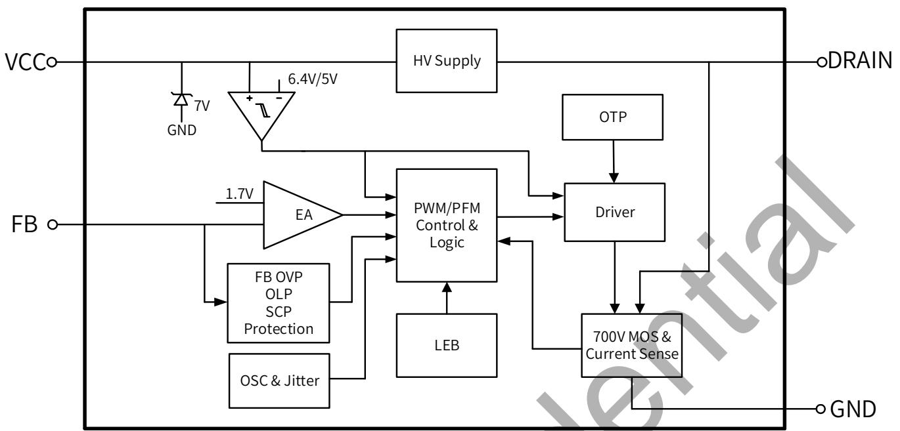

图 3. BPA8506D 内部框图

## 功能描述

BPA8506D 是一个高压输入具有恒压输出特性的驱动芯片，采用了先进的多模式控制和环路补偿技术，无需外部补偿电路。芯片内部集成 700V 功率开关、高压自供电电路、电流采样电路，以及丰富的保护功能，只需要极少的外围器件就可以达到优异的恒压输出特性。开关频率根据电感和负载自适应调整，使电源设计更加灵活，适应于较宽的输出电压范围。同时，具有较低的待机功耗、良好的输出电压调整率、较低的输出电压纹波、低音频噪声使得 BPA8506D 芯片特别适合于非隔离辅助电源应用。（注 10：以下描述到的参数均为电气参数列表中的典型值，除非特别说明是最大或最小值）

## 高压启动供电

BPA8506D 集成了高压启动电路，系统上电后，⺟线电压上升，当⺟线电压达到最小漏极启动电压 $\mathsf { V } _ { \mathsf { D S \_ S U P } } ( 4 0 \mathsf { V } ) \mathsf { H } \bar { \mathsf { \Sigma } }$ ，内部高压启动电路通过 DRAIN 端对 VCC 电容充电。当 VCC 电容电压达到芯片启动阈值 $\mathsf { V c c \_ o n } ( 6 . 4 \mathsf { V } )$ 时，芯片内部控制电路开始工作。因此，启动延迟时间为：

$$
t _ {S T A R T} = C _ {V C C} * \frac {V _ {C C \_ O N} - V _ {C C \_ I N T}}{I _ {C H}}
$$

其中， $\mathsf { C } _ { \mathsf { V C C } }$ 为 VCC 电容值， $\mathsf { I } _ { \mathsf { C H } }$ 为充电电流， $V _ { C C \_ O N }$ 为芯片启动阈值电压， $\mathsf { V } _ { \mathsf { C C \_ I N T } }$ 为初始 VCC 电压值。芯片正常工作时，在 MOSFET 关断期间，自供电电路通过 DRAIN 端对 VCC 电容充电并稳压到 $6 . 4 V _ { \circ }$ 。由于芯片需要的 VCC 电流极低，无需辅助绕组供电， $0 . 1 \mu \mathsf { F }$ 的 VCC 电容就可以满足 MOSFET导通期间芯片的供电需求，为了电容量不受温度和电压影响过大，建议使用 X7R/0805 的电容。BPA8506D 内置了 7V 稳压管，用于钳位 VCC 引脚电压，同时也可以保护芯片不会受到过高的尖峰电压而损坏。

## VCC欠压保护

VCC 引脚具有欠压保护功能，当 VCC 电压下降到低于 $\mathsf { V } _ { \mathsf { C C } \_ \mathsf { O N } - }$ $\mathsf { V } _ { \mathsf { C C } \_ \mathsf { H Y S } } ( 5 \mathsf { V } )$ 时，欠压保护电路使芯片停止工作，内部 MOSFET关断。VCC 电压需要上升到 $\mathsf { V c c \_ o n } \ne$ 能重新启动芯片（图 4所示）。

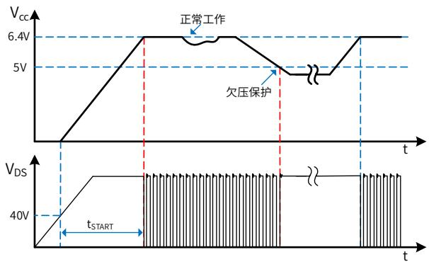

图 4. 高压启动与 VCC 欠压保护时序

## 软启动

芯片具有软启动功能，在软启动过程中，MOSFET 峰值电流(限流点)逐渐增加。由于启动时输出电压一般较低，MOSFET关断期间输出电压对电感的去磁较少，电感电流进入深度连续模式(CCM)，使得续流二极管的反向恢复电流较大。续流二极管反向恢复电流会通过 MOSFET 并产生损耗，过大的电流尖峰还可能会导致 MOSFET损坏。软启动电路通过控制启动过程中 MOSFET峰值电流逐渐增加，可以有效降低二极管的反向恢复电流，从而降低 MOSFET 电流应⼒。 由保护电路触发产生的重启动也会经历一次软启动过程，以避免输出电压过冲。软启动过程如图 5 所示，起始限流值为 30%最大限流值，63 个开关周期(TS)后增加到 70%最大限流值，持续 64 个开关周期后结束软启动，限流值变为最大值。

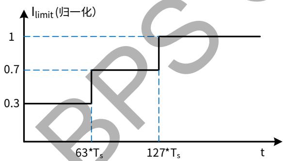

图 5. 软启动过程

## 输出电压设置

续流二极管导通期间，输出电压通过反馈二极管对反馈电容充电，使得反馈电容电压等于输出电压，通过外部分压电阻$\mathsf { R e } _ { \mathsf { F B H } } / \mathsf { R e } _ { \mathsf { F B L } }$ 分压后与内部基准电压比较，产生的误差信号经放大后控制峰值电流和开关频率，从而调整输出电压 $V _ { \sf O U T c }$ 。内部基准电压为 1.7V。对于典型的 Buck 电路，输出电压的计算公式如下：

$$
V _ {O U T} = \frac {1 . 7 V * (R _ {F B L} + R _ {F B H})}{R _ {F B L}}
$$

其中，RFBL是 FB 下分压电阻，RFBH是 FB 上分压电阻，如图6 所示。为了提高 FB输入端的抗⼲扰能⼒，建议下分压电阻RFBL取2kΩ左右，上分压电阻的取值根据输出电压计算得到。实际应用中需要考虑续流二极管和反馈二极管的压降对输出电压精度的影响。由于续流二极管正向导通时，电流等于电感电流，正向压降 VF比较大，而通过反馈二极管的电流较小，正向压降比较小，因此反馈电容上的实际电压比输出电压略高。为了达到较好的输出电压调整精度，上分压电阻需要在计算值的基础上向上微调。

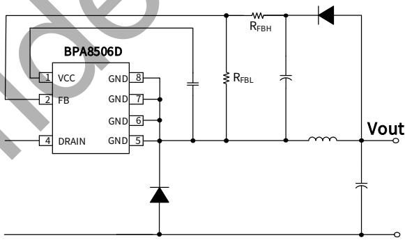

图 6. 输出电压采样

## 多模式控制

BPA8506D 芯片采用 PWM/PFM 多模式控制技术，能有效降低系统待机功耗，提高平均效率，并减小系统工作在轻载时的噪声。电感峰值电流控制模式，具有较快的动态响应速度。如图 7 所示，重载条件下，芯片工作在 PFM 模式，MOSFET限流点（电感峰值电流）保持最大值 $\mathsf { I } _ { \mathsf { L I M I T } } \mathsf { \_ m A X }$ 不变，开关频率随负载增加而升高，最高为 $\mathsf { f } _ { \mathsf { S \_ M A X } }$ (45kHz)。随着负载减小，开关频率降低，达到 22kHz 后芯片进入 PWM 工作模式。PWM模式下开关频率保持 22kHz 不变，MOSFET限流点随负载减小而降低。随着负载的继续减小，芯片进入 PFM 与 PWM 的混合模式，MOSFET 限流点与开关频率同时降低，直到空载条件下，开关频率降低到最小值 $\mathsf { f } _ { \mathsf { S \_ M I N } }$ (1kHz)。轻载和空载条件下，较小的电感峰值电流在磁芯中产生的磁通密度也相应减小，因此能有效抑制音频噪声。

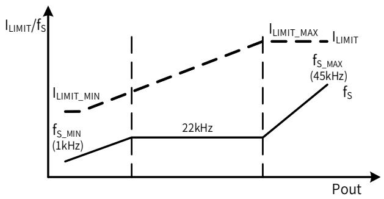

图 7. 控制模式

## 电流检测

BPA8506D 芯片内部集成电流采样电路，对 MOSFET电流逐周期限制，无需外加电流采样电阻，以实现电流模式控制。当一个开关周期开始时，控制电路开通 MOSFET，漏极电流上升，当电流上升达到内部限制值时，控制电路关断 MOSFET，直到下一个开关周期开始。内置前沿消隐(Leading EdgeBlanking)时间 tLEB可以避免由于外部电路的容性或二极管的反向恢复导致 MOSFET 在开通瞬间出现的电流尖峰误触发MOSFET关断。CCM 模式下续流二极管的反向恢复时间值得特别注意，如果反向恢复时间大于 tLEB，就有可能触发MOSFET提前关断，因此需要选择超快恢复二极管。

## 自动重启

由于外部故障（输出短路、过压、过载等）触发相应的保护，控制电路关断 MOSFET，系统停止工作。BPA8506D 内部的自动重启电路等待 $\tan \angle O F F$ (1s)时间后重新启动系统，恢复工作，如果启动后故障没有消除，则重新触发相应的保护电路工作。

## 短路保护/过载保护

BPA8506D 内部控制电路通过FB引脚检测输出短路故障。如图 8 所示，上电启动后，如果 FB 电压在 tSC (2048Cycles)时间内未达到 $V _ { F B \_ S C } ( 0 . 4 V )$ ，则会触发短路保护并进入自动重启程序。FB引脚直接短路到地也可以触发该保护。正常工作过程中，当芯片检测到 FB电压低于 $\mathsf { V } _ { \mathsf { F B \_ O L P } } ( 1 . 1 \mathsf { V } )$ 并且持续时间超过 $\tan ( 4 0 0 \mathsf { m s } )$ 时，芯片会触发过载保护并进入自动重启程序。

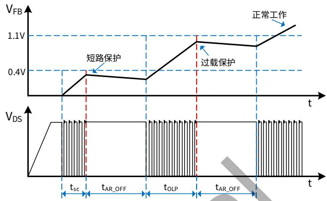

图 8. 短路保护、过载保护工作模式

## 输出过压保护

FB 引脚也被用来检测输出过压故障。当 FB 电压连续 4 个开关周期高于 $\mathsf { V } _ { \mathsf { F B } _ { - } \mathsf { O V P } } ( 2 . 9 \mathsf { V } ) \sharp \vec { \mathfrak { I } }$ ，则触发输出过压保护，芯片进入自动重启程序。

## 过温保护

BPA8506D 内置了过温保护电路，当结温达到过温保护阈值TOTP (145℃)时，芯片会停止工作，直到结温下降到 TOTP-THYST$( 1 0 5 ^ { \circ } \mathsf { C } )$ 时，芯片重新启动。 $T _ { \mathsf { H Y S T } } ( 4 0 ^ { \circ } \mathsf { C } )$ 为温度迟滞，较大的温度迟滞有利于把系统温度控制在一个较低的水平。

## 应用指南

## 开关频率选择

BPA8506D 芯片采用多模式控制，开关频率和电感峰值电流随负载自适应变化，需要根据输出规格选择合适的开关频率以达到设计优化的目的。对于非隔离拓扑，通常输入输出电压相差较大，占空比很小，在一定的开关频率下 MOSFET 导通时间短。过短的导通时间使得 MOSFET 没有完全导通而导致较大的损耗。因此对于输出电压较低的情况（比如 5V），只有通过选择较低的开关频率来增加 MOSFET 导通时间，对于BPA8506D 芯片，MOSFET 导通时间需要≥650ns。但是，开关频率过低要求较大的电感，会导致系统体积变大，甚至满载时进入音频范围，因此对于常用输出电压，下表推荐了相应的开关频率。

<table><tr><td>输出电压</td><td>5V</td><td>9V</td><td>12V</td><td> $\geqslant$ 15V</td></tr><tr><td>推荐开关频率</td><td>25kHz</td><td>30kHz</td><td>35kHz</td><td>40kHz</td></tr></table>

## 输出电感计算（Buck拓扑）

BPA8506D 可工作于 CCM 和 DCM 工作模式，取决于额定输出电流和输出电感感量。当 Buck 变换器输出电流$\mathsf { l o u r } { > } 0 . 5 ^ { \star } \mathsf { l } _ { \mathsf { L I M I T \_ M A X } }$ 时，电感需要工作于 CCM 才能满足负载电流要求；当 $\mathsf { l o u r } ^ { < 0 . 5 ^ { \star } | _ { \mathsf { L I M I T \_ M A X } } }$ 时，DCM 和 CCM 都可以满足输出负载电流要求，工作模式取决于电感的感量大小。电感感量越大，带载能⼒越强，因为需要更多圈数，体积也会更大，成本相对高，动态响应较慢，CCM 下开关损耗大。小感量电感可以减小尺寸、降低价格以及改善系统动态响应，DCM 下开关损耗小，但同时会增大电感的峰值电流和输出纹波电压，峰值带载能⼒也较小。通常，在满足最大输出电流的前提下，尽量选取小电感量。实际选择电感时，通常根据输入输出规格，计算出能满足输出电流的最小电感值，然后从电感供应商的选 型 手 册 中 选 取 大 一 档 的 标 准 值 电 感 。 因 此 ，$\mathsf { l o u r } { > } 0 . 5 ^ { \star } \mathsf { l } _ { \mathsf { L I M I T \_ M A X } }$ 时按照 CCM 计算电感量， $\mathsf { l o u r } { < } 0 . 5 ^ { \star } \mathsf { l } _ { \mathsf { L I M I T \_ M A X } }$ 时按照 DCM 计算电感量。

CCM 模式下，如图 9 所示，根据输入/输出电压、系统开关频率、满载输出电流以及芯片最大限流值计算最小电感值：

$$
L _ {M I N} = \frac {(V _ {O U T} + V _ {D i o d e}) * (V _ {I N} - V _ {D S} - V _ {O U T})}{(V _ {I N} - V _ {D S} + V _ {D i o d e}) * f _ {S} * \Delta I _ {L}}
$$

其中，VIN 输入直流⺟线电压

$\mathsf { V o u r }$ 输出电压

$\mathsf { I o u r }$ 输出电流

$V _ { \sf D i o d e }$ 续流二极管压降

$\mathsf { V } _ { \mathsf { D S } }$ 开关管 $\tan$ 时间内平均压降

$\mathsf { f } _ { \mathsf { S } }$ 开关频率

$\tan$ 开关管开通时间

$\mathsf { t } _ { 0 \mathsf { F } \mathsf { F } }$ 开关管关断时间

$\mathsf { I } _ { \mathsf { L I M I T } } \mathsf { \_ M A X }$ 芯片最大限流值

$$
\Delta I _ {L} = 2 * (I _ {L I M I T \_ M A X} - I _ {O U T})
$$

$$
V _ {D S} = I _ {O U T} * R _ {d s (O N)}
$$

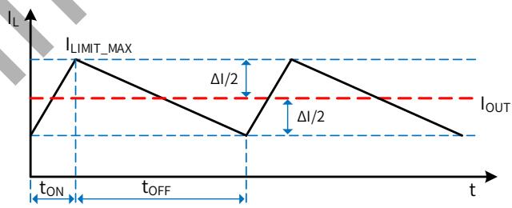

图 9. CCM 模式下的电感电流

电感电流有效值为：

$$
I _ {R M S} = \sqrt {I _ {L I M I T \_ M A X} ^ {2} - I _ {L I M I T _ {M A X}} * \Delta I _ {L} + \frac {\Delta I _ {L} ^ {2}}{3}}
$$

DCM 模式下(如图 10 所示)，根据输入/输出电压、系统开关频率、满载输出电流以及芯片最大限流值计算最小电感值：

$$
L _ {M I N} = \frac {2 * I _ {O U T} * (V _ {O U T} + V _ {D i o d e}) * (V _ {I N} - V _ {D S} - V _ {O U T})}{(V _ {I N} - V _ {D S} + V _ {D i o d e}) * f _ {S} * I _ {L I M I T \_ M A X} ^ {2}}
$$

其中，

$$
V _ {D S} = \frac {1}{2} * I _ {L I M I T \_ M A X} * R _ {d s (O N)}
$$

电感电流有效值为：

$$
I _ {R M S} = I _ {L I M I T \_ M A X} * \sqrt {\frac {t _ {O N} + t _ {O F F}}{3} * f _ {S}}
$$

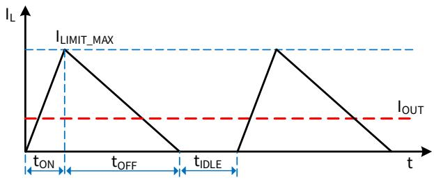

图 10. DCM 模式下的电感电流

一般来说， $V _ { \parallel N }$ 是一个范围，通常选择最大输入直流⺟线电压代入计算公式，或者也可以分别计算最高和最低⺟线电压对应的电感量，最后取两者中较大者。上述两个电感表达式计算出来的都是输出额定电流所需的最小电感量，设计中需要考虑实际电感的精度，通常取计算值的 1.1 倍以保证批量生产时能满足最低电感量的要求。表达式中 ILIMIT\_MAX 应该取芯片最大限流值的下限。

为了降低待机功耗，减小输出端需要的假负载，BPA8506D通过多模式控制降低了空载下的限流点和开关频率。为了使空载时电感电流可控，电感量需要足够大以至于在 MOSFET最小导通时间内电流峰值不超过芯片最低限流值。即

$$
L \geq \frac {t _ {L E B} * (V _ {I N \_ M A X} - V _ {O U T})}{I _ {L I M I T \_ M I N}}
$$

其中， $\tan \tt { t } _ { L E B }$ 为前沿消隐时间， $\mathsf { I } _ { \mathsf { L I M I } } \mathsf { \Pi } _ { = } \mathsf { M I N }$ 为芯片的最低限流值。

如图 11 所示，电感量小于临界值会导致 tLEB时刻电感峰值电流大于芯片控制的限流点，平均输出电流过大，需要较大的假负载给电感电流提供通路，从而稳定输出电压。因此，通常最终的电感值需要同时满足以上两个条件。待机要求不高的应用只需要满足额定输出电流对最小电感的要求就可以了。

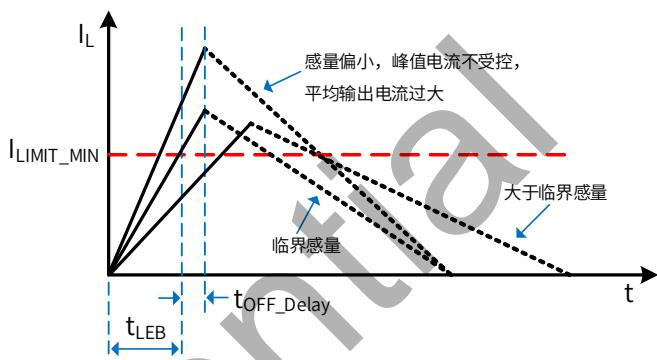

图 11. 空载下的电感电流

确定电感值后，还需要确认电感的有效值电流是否满足上述计算值，同时还需要保证电感磁芯在芯片最大限流值 ILIMIT\_MAX不饱和，供应商的选型手册中一般会给出电感的有效值电流和饱和电流值。 一般来说，输出电流在 300mA 以下推荐使用成本较低的工字电感，300mA 以上由于受到磁芯饱和、成本和 EMI 的限制，通常使用闭环磁路的磁芯电感，比如 EE10，EE13 等。以下表格提供了常用的输出电压/电流对应的标准电感值。

常用 Buck 输出电感推荐值

<table><tr><td>输出电压(V)</td><td>输出电流(mA)</td><td>推荐电感量(μH)</td><td>工作模式</td><td>电感有效值电流(mA)</td><td>最大限流点(mA)</td></tr><tr><td rowspan="2">5</td><td>300</td><td>470</td><td>DCM</td><td>375</td><td>760</td></tr><tr><td>400</td><td>560</td><td>CCM</td><td>423</td><td>760</td></tr><tr><td rowspan="2">12</td><td>300</td><td>560</td><td>DCM</td><td>375</td><td>760</td></tr><tr><td>400</td><td>680</td><td>CCM</td><td>423</td><td>760</td></tr><tr><td rowspan="2">15</td><td>300</td><td>680</td><td>DCM</td><td>375</td><td>760</td></tr><tr><td>400</td><td>1000</td><td>CCM</td><td>423</td><td>760</td></tr><tr><td rowspan="2">18</td><td>300</td><td>680</td><td>DCM</td><td>375</td><td>760</td></tr><tr><td>400</td><td>1000</td><td>CCM</td><td>423</td><td>760</td></tr></table>

## 输入电容选择

输入滤波电容对工频电压纹波、传导 EMI、以及电源抵抗 Surge的能⼒都起到关键的作用。电容量的选择要保证直流⺟线电压不能过低(通常不要低于 70V)，因此电容量取决于输出功率和电源效率。 全电压 85\~265VAC 输入时，如果使用全波整流，一般取≥3μF/W；对于半波整流，电容量一般取≥6μF/W。 单高压 176\~265VAC 输入时，在满足 EMI 和 Surge 的前提下容量可以减半。

## 输出电容的选择

输出电容的作用是滤除电感电流中的交流成分，提供稳定的直流电压给负载，一般根据输出电压纹波要求来选取合适的电容。当输出电流恒定时，输出纹波主要由输出电容的 ESR 以及容量决定。

$$
\Delta V _ {O U T} = \Delta V _ {E S R} + \Delta V _ {C}
$$

CCM 模式下，由容性产生的纹波电压为：

$$
\Delta V _ {C} = \frac {\Delta I _ {L}}{8 * C _ {O U T} * f _ {S}}
$$

DCM 模式下，由容性产生的纹波电压为：

$$
\Delta V _ {C} = \frac {I _ {O U T} * (I _ {L I M I T \_ M A X} - I _ {O U T}) ^ {2}}{C _ {O U T} * f _ {S} * I _ {L I M I T \_ M A X} ^ {2}}
$$

实际应用中，为了得到较小的 ESR，电容量相对比较大，因此由容量产生的输出电压纹波很小，⼏乎可以忽略，因此电压纹波主要由电容的 ESR 产生：

$$
\Delta V _ {E S R} = \Delta I _ {L} * E S R \quad (\text { C   C   M })
$$

$$
\Delta V _ {E S R} = I _ {\text { LIMIT\_MAX }} * E S R \quad (\mathrm{DCM})
$$

ESR 不仅产生输出电压纹波，还会导致电容产生损耗而发热，缩短电解电容的寿命，特别是工作于 DCM 模式时。

## 续流二极管选择

在 BUCK 变换器中，特别是 CCM 模式下，MOSFET 开通瞬间续流二极管反向恢复电流会流过 MOSFET并产生损耗，同时也会产生 EMI 问题，过大的电流尖峰还可能会导致 MOSFET 损坏。DCM 模式下，虽然正常工作没有反向恢复问题，但是开机和输出短路等条件下依然是 CCM。因此，续流二极管建议使用trr≤35ns 的超快恢复二极管，不能使用普通快恢复二极管或者慢管。续流二极管需要能承受雷击条件下的输入电压，因此一般选取 600V 或以上的耐压，额定电流一般选取输出电流的 3\~4倍。常用的有 ES1J，STTH1R06，ES2J，USB260，BYV26C 等。

## 反馈电容

反馈电容的作用是对输出电压进⾏采样—保持，合适的电容值可以实现较好的输出电压调整率和动态响应，容值太小会导致空载输出电压偏高，容值太大会使环路响应慢，动态负载性能变差。推荐使用 10\~22μF 的电解电容，根据输出电压选取合适的额定电压，一般取 1.5\*VOUT。

## 反馈二极管选择

反馈二极管的作用是在续流二极管导通时，向反馈电容充电。正常工作条件下，因为反馈回路消耗的电流很小，流过二极管的电流较小，反向恢复问题可以忽略。但是在开机或者重启动时，由于反馈电容电压很低，充电时间较⻓，会存在反向恢复问题，因此需要使用快恢复二极管，通常使用 FR107，RS1M等常用的快恢复二极管。

## 假负载计算

为了维持较好的动态响应，芯片的最低开关频率设置为 1kHz。当输出空载时，需要一个假负载为电感电流提供回路，从而稳定输出电压，电感的平均电流即为假负载的电流。

$$
I _ {A V G} = \frac {1}{2} I _ {L} * (T _ {O N} + T _ {O F F}) * f _ {S \_ M I N}
$$

其中，IL为空载时电感峰值电流：

$$
I _ {L} = \frac {V _ {I N \_ M A X} - V _ {D S} - V _ {O U T}}{L} * t _ {D e l a y} + I _ {L I M I T \_ M I N}
$$

ILIMIT\_MIN 为芯片的最低限流值，fS\_MIN为芯片最低频率 1kHz，VDS为开关管tON时间内平均压降，TON，TOFF分别为空载时MOSFET开通和关断时间：

$$
T _ {O N} = \frac {L * I _ {L}}{V _ {I N _ {M A X}} - V _ {D S} - V _ {O U T}}
$$

$$
T _ {O F F} = \frac {L * I _ {L}}{V _ {O U T} + V _ {D i o d e}}
$$

$$
R _ {L} = \frac {V _ {O U T}}{I _ {A V G}}
$$

以上计算未考虑芯片自供电电流通过假负载，实际需要的假负载电流稍大，一般为 1\~3mA左右。

## 优化动态响应

为了改善输出动态响应速度，降低开机时输出电压过冲，可以在上分压电阻上并联一个电容（图 12），一般取 0.47\~4.7μF。需要根据输出电压和负载特性进⾏调整，容值太大可能会引起环路不稳定，因此在满足性能的条件下尽量使用小容值，根据输出电压选取合适的额定电压，一般取 1.5\*VOUT。

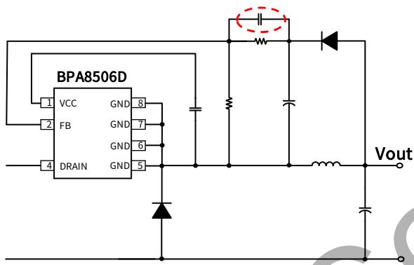

图 12. 优化动态响应

## VCC 外部供电

BPA8506D 内部集成高压自供电电路，无需辅助供电即可实现较低的待机功耗。由于自供电电路是线性稳压，高压输入时的待机功耗比低压输入高得多。通过外部给 VCC 供电的方式可以关闭内部自供电电路，从而降低高压下的待机功耗。如图 13所示，连接一个电阻到 VCC 引脚和反馈电容的正端之间。反馈电容通过电阻给 VCC 供电，电阻值需要根据不同输出电压调整，以保证提供给 VCC 的电流为 500μA 左右。阻值太大会导致外部提供的电流不够，自供电电路不能完全被关断，仍然有部分损耗；阻值太小会导致多余的电流流向内部稳压管，产生损耗。实际调试过程中，电阻值从大往小逐渐减小，直到 VCC 电压从6.4V 变为 7V 为止。VCC 电容建议使用 X7R 材质的 10V/0805瓷片电容，0.1\~1μF 容量。PCB layout 时尽可能将 VCC 电容靠近芯片的 VCC 和 GND 引脚。

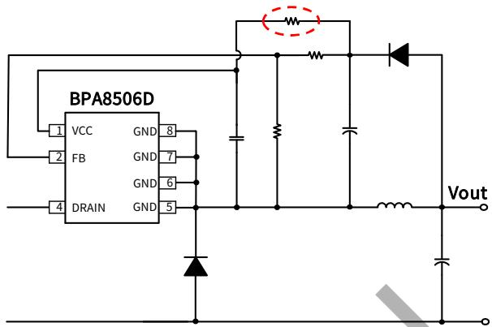

图 13. VCC 外部供电方法

## Buck-boost 应用

BPA8506D 芯片也可以应用于 Buck-boost 拓扑中，实现负电压输出，应用电路如图 14 所示，芯片的基本功能与 Buck 拓扑类似。由于电感只在 MOSFET 关断期间对输出端提供能量，相同的输出功率需要较大感量的电感。

CCM 模式下，通过以下表达式计算最小电感值：

$$
\begin{array}{l} L _ {M I N} \\ = \frac {0 . 5 * V _ {O U T} ^ {\prime} * V _ {I N} ^ {\prime 2} * \frac {1}{f _ {S}}}{(V _ {I N} ^ {\prime} + V _ {O U T} ^ {\prime}) * [ V _ {I N} ^ {\prime} * I _ {L I M I T \_ M A X} - (V _ {I N} ^ {\prime} + V _ {O U T} ^ {\prime}) * I _ {O U T} ]} \\ \end{array}
$$

其中 ${ V _ { I N } } ^ { \prime } = V _ { I N } - V _ { D S }$

$$
V _ {O U T} ^ {\prime} = V _ {O U T} + V _ {D i o d e}
$$

$$
V _ {D S} = \frac {V _ {I N} ^ {\prime} + V _ {O U T} ^ {\prime}}{V _ {I N} ^ {\prime}} * I _ {O U T} * R _ {d s (O N)}
$$

$V _ { \parallel N }$ 输入直流⺟线电压

$\mathsf { V } _ { \mathsf { O U T } }$ 输出电压

$\mathsf { I } _ { 0 \mathsf { U T } }$ 输出电流

$V _ { \sf D i o d e }$ 续流二极管压降

$\mathsf { V } _ { \mathsf { D S } }$ 开关管 $\tan$ 时间内平均压降

ILIMIT\_MAX 芯片最大限流值

电感电流有效值为：

$$
I _ {R M S} = \sqrt {I _ {L I M I T \_ M A X} ^ {2} - I _ {L I M I T _ {M A X}} * \Delta I _ {L} + \frac {\Delta I _ {L} ^ {2}}{3}}
$$

其中

$$
\Delta I _ {L} = 2 * (I _ {L I M I T _ {M A X}} - \frac {I _ {O U T}}{V _ {I N}} ^ {\prime} * (V _ {I N} ^ {\prime} + V _ {O U T} ^ {\prime}))
$$

DCM 模式下，通过以下表达式计算最小电感值：

$$
L _ {M I N} = \frac {2 * (V _ {O U T} + V _ {D i o d e}) * I _ {O U T}}{I _ {L I M I T \_ M A X} ^ {2} * f _ {S}}
$$

电感电流有效值为：

$$
I _ {R M S} = I _ {L I M I T \_ M A X} * \sqrt {\frac {t _ {O N} + t _ {O F F}}{3} * f _ {S}}
$$

空载条件对最小感量的限制跟 BUCK拓扑基本一致。以下表格提供了常用的输出电压/电流对应的标准电感值：

由于电感只在 MOSFET 关断期间对输出端提供能量，因此输出滤波电容纹波电流比 BUCK 拓扑大，电压纹波主要由电容的ESR 产生：

$$
\Delta V _ {E S R} = I _ {\text { LIMIT\_MAX }} * E S R \quad (\text { 适应于DCM / CCM })
$$

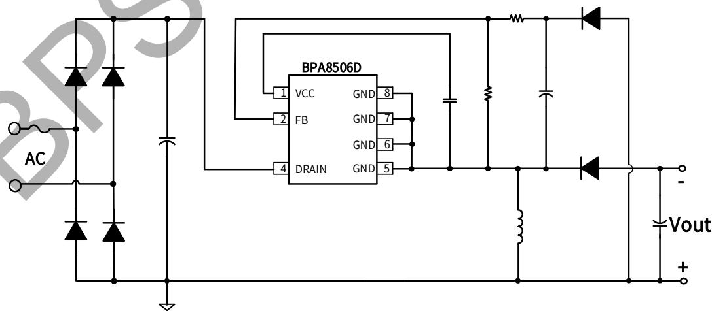

图 14. BPA8506D Buck-boost 应用电路

常用 Buck-boost 输出电感推荐值

<table><tr><td>输出电压(V)</td><td>输出电流(mA)</td><td>推荐电感量(μH)</td><td>工作模式</td><td>电感有效值电流(mA)</td><td>最大限流点(mA)</td></tr><tr><td rowspan="2">-5</td><td>300</td><td>470</td><td>DCM</td><td>381</td><td>760</td></tr><tr><td>400</td><td>560</td><td>CCM</td><td>430</td><td>760</td></tr><tr><td rowspan="2">-12</td><td>300</td><td>560</td><td>DCM</td><td>385</td><td>760</td></tr><tr><td>400</td><td>820</td><td>CCM</td><td>436</td><td>760</td></tr><tr><td rowspan="2">-15</td><td>300</td><td>680</td><td>DCM</td><td>386</td><td>760</td></tr><tr><td>400</td><td>1000</td><td>CCM</td><td>438</td><td>760</td></tr><tr><td rowspan="2">-18</td><td>300</td><td>820</td><td>DCM</td><td>388</td><td>760</td></tr><tr><td>400</td><td>1200</td><td>CCM</td><td>441</td><td>760</td></tr></table>

## Flyback 应用

BPA8506D 同样可以应用于 Flyback 拓扑中，实现隔离恒压输出，应用电路如图 15 所示。辅助绕组产生的直流电压 VAUX通过分压电阻连接到 BPA8506D 的 FB 引脚，与内部基准电压比较，产生的误差信号经放大后控制峰值电流和开关频率，从而调整辅助电压 $V _ { A U X _ { 0 } }$ 在不考虑漏感的理想情况下，输出电压 $\mathsf { V o u r }$ 和辅助电压 $\mathsf { V } _ { \mathsf { A U X } }$ 按匝数呈如下关系：

$$
V _ {O U T} = \frac {N _ {S}}{N _ {A U X}} * \left(V _ {A U X} + V _ {D i o d e \_ A}\right) - V _ {D i o d e \_ S}
$$

其中， $\mathsf { V } _ { \sf D i o d e \_ A }$ 和 ${ \mathsf { V } } _ { \mathsf { D i o d e \_ S } }$ 分别为辅助二极管和输出二极管的压降。由于辅助绕组和输出绕组之间漏感的存在，输出电压调整率不理想，因此对于输出电压调整率要求比较高的场合不是特别适合。

采用 BPA8506D 设计的反激变换器既可以工作于 CCM 模式，也可以工作于 DCM 模式。选取次级到初级的反射电压时需要考虑最高输入电压和 MOSFET 的最高耐压值并留一定的裕量，通常选取 $V _ { O R } = 8 0 \sim 9 0 V$ 作为起始值开始变压器的计算，因此变压器匝比可以通过以下表达式得到：

$$
\frac {N _ {S}}{N _ {P}} = \frac {V _ {O U T} + V _ {D i o d e \_ S}}{V _ {O R}}
$$

输入电容的选择与 BUCK类似，通常需要保证最低⺟线直流电压 $V _ { \vert \mathrm { N } _ { - } \mathrm { M I N } } \geq 7 0 \vee$ ，稳态下的最大占空比为：

$$
D _ {M A X} = \frac {V _ {O R}}{V _ {I N \_ M I N} + V _ {O R}}
$$

临界模式下最大输出电流为：

$$
I _ {D C} = \frac {1}{2} * \frac {N _ {P}}{N _ {S}} * I _ {L I M I T \_ M A X} * (1 - D _ {M A X})
$$

当额定输出电流大于以上值时，低线电压输入条件需要工作于CCM 模式，反之可以工作于 DCM 模式。DCM 模式下，变压器初级电感计算的表达式为：

$$
L _ {P} = \frac {2 * (V _ {O U T} + V _ {D i o d e}) * I _ {O U T}}{I _ {L I M I T \_ M A X} ^ {2} * f _ {S}}
$$

由于 $\mathsf { I } _ { \mathsf { L I M I T } } \mathsf { \Gamma } _ { \mathrm { \Gamma } _ { \mathrm { - } } \mathsf { M A X } }$ 存在偏差，因此计算时需要使用电气参数表中的下限值。CCM 模式下，变压器电感量越大，输出带载能⼒越强，即进入 CCM 越深，输出平均电流越大。CCM 模式下，变压器初级电感计算的表达式为：

$$
L _ {P} = \frac {(1 - D _ {M A X}) ^ {2} * V _ {O R}}{2 (I _ {L I M I T \_ M A X} * (1 - D _ {M A X}) - I _ {O U T} * \frac {N _ {S}}{N _ {P}}) * f _ {S}}
$$

初级匝数可以通过初级电感和初级限流点来计算，保证最大磁通密度小于 3000 高斯。

$$
N _ {P} = \frac {L _ {P} * I _ {L I M I T \_ M A X}}{B _ {M A X} * A _ {e}}
$$

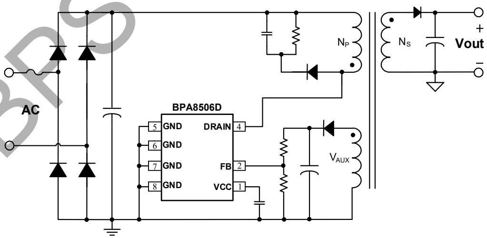

图 15. BPA8506D Flyback 应用电路

## PCB Layout 指南

在设计 BPA8506D 应用 PCB 时，需要遵循以下建议：

1) VCC 旁路电容需要紧靠芯片 VCC 和 GND 引脚。  
2) 接到 FB 的分压电阻必须靠近 FB 引脚，且节点要远离⺟线电压、⺟线地、输出电感以及输出电压端，以防止 FB采样信号受到⼲扰。  
3) 输出地应单点接地到⺟线电容负端。信号地应单点接地到 芯片地。  
4) 芯片地引脚能很好地起到散热作用，可以在 PCB 上铺铜来降低芯片的温度，但是芯片地也为动点（相对⺟线地电压），在满足散热的条件下铺铜面积应尽量小。同时，芯片地要远离输入交流端，以减小容性耦合产生的 EMI 问题。  
5) BUCK 变换器中，芯片 MOSFET 漏极接输入直流⺟线，为静点，可以铺铜皮提高芯片的散热能⼒。但是需要保证漏

极和 FB 脚、芯片地的距离大于 2mm。

6) 大部分输出电感为工字形电感，开放式磁路容易产生⼲扰，需要远离芯片 FB 脚和电压采样电阻，同时需要远离输入端以避免 EMI 问题。  
7) 为了达到较好的辐射 EMI，需要尽可能减小功率环路的面积。输入⺟线电容，芯片 DRAIN引脚，GND，续流二极管形成的环路，电流断续，容易产生辐射 EMI，因此⺟线电容应尽量靠近芯片漏极或者加瓷片电容缩小环路面积。续流二极管，输出电感，输出电容形成的环路，电流连续，但是存在较大纹波，也需要减小环路面积。  
8) 为了减小动点的面积，反馈二极管和反馈电容应尽量靠近芯片。  
9) 为了使芯片和动点远离交流输入端，可以将输入电解电容放置在芯片和交流输入端之间。  
10) 请参考图 16 中的建议。

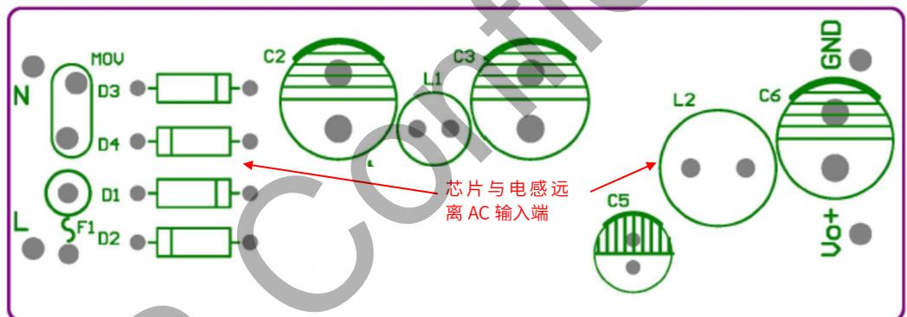

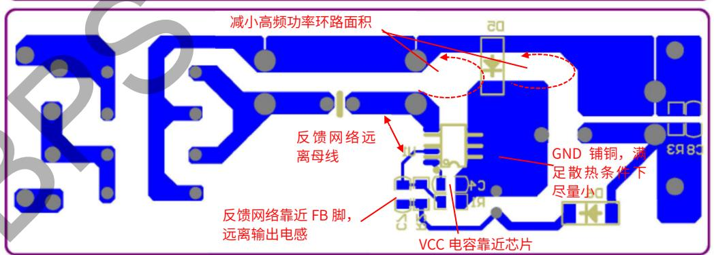

图 16. PCB Layout 建议

## 特性曲线

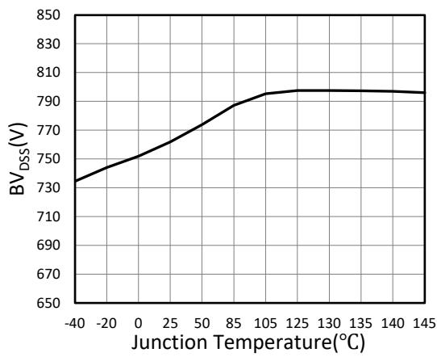

图 17. $\mathsf { B V } _ { \mathsf { D S S } } \mathsf { V S } .$ Temperature

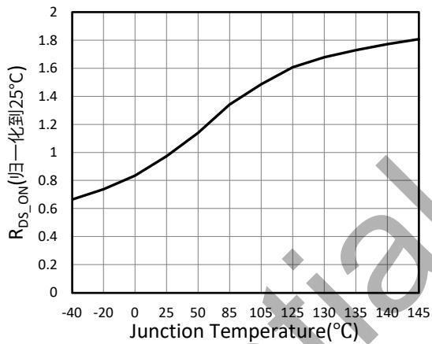

图 18. RDS\_ON vs. Temperature

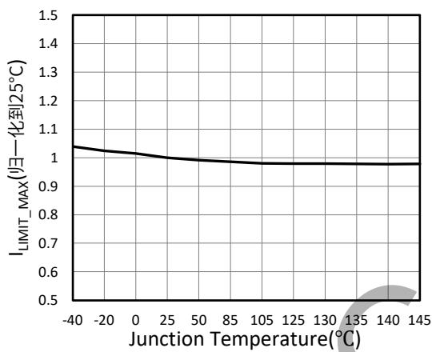

图 19. ILIMIT\_MAX vs. Temperature

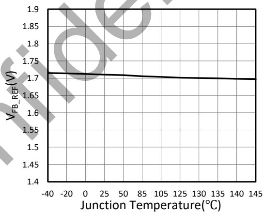

图 20. $V _ { F B \_ R E F } \lor S .$ Temperature

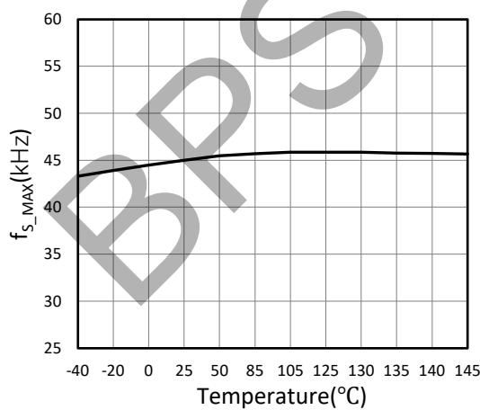

图 21. $\mathsf { f } _ { \mathsf { S \_ M A X V S } } .$ . Temperature

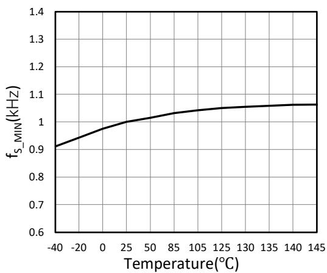

图 22. $\mathsf { f } _ { \mathsf { S \_ M I N } } \mathsf { v s . }$ Temperature

## 封装信息

SOP-7 封装外形尺寸  
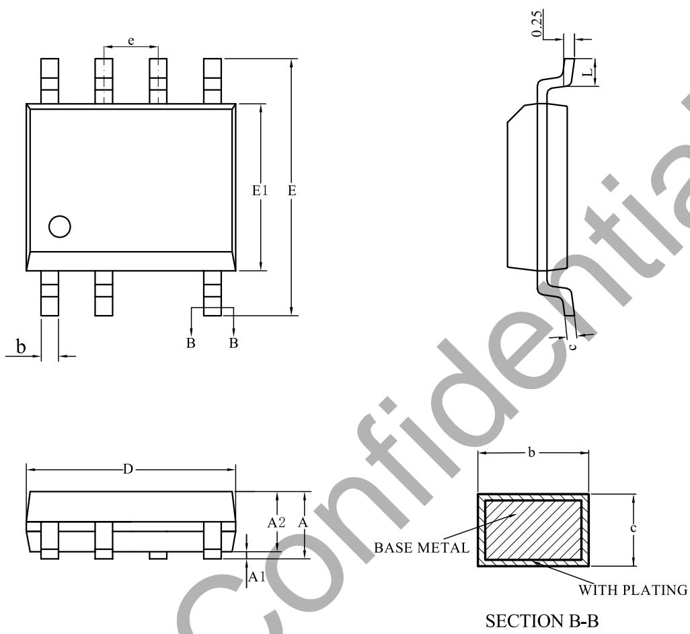

<table><tr><td rowspan="2">SYMBOL</td><td colspan="3">MILLIMETER</td></tr><tr><td>MIN</td><td>NOM</td><td>MAX</td></tr><tr><td>A</td><td>1.30</td><td>—</td><td>1.80</td></tr><tr><td>A1</td><td>0.10</td><td>—</td><td>0.25</td></tr><tr><td>A2</td><td>1.25</td><td>—</td><td>1.65</td></tr><tr><td>b</td><td>0.33</td><td>—</td><td>0.51</td></tr><tr><td>c</td><td>0.17</td><td>—</td><td>0.25</td></tr><tr><td>D</td><td>4.70</td><td>4.90</td><td>5.10</td></tr><tr><td>E</td><td>5.80</td><td>6.00</td><td>6.20</td></tr><tr><td>E1</td><td>3.70</td><td>3.90</td><td>4.10</td></tr><tr><td>e</td><td colspan="3">1.27BSC</td></tr><tr><td>L</td><td>0.40</td><td>—</td><td>1.00</td></tr></table>

版本信息

<table><tr><td>版本</td><td>日期</td><td>记录</td></tr><tr><td>Rev.1.2</td><td>2024/01</td><td>1. 基于 BPA8504-8506_CN_DS_Rev.1.1 保留 BPA8506D 信息2. 更新  $BV_{DSS}$  为 700V3. 删除“反馈开路保护”4. 增加  $I_{LIMIT\_MAX}$  测试条件5. 更新封装外形尺寸</td></tr><tr><td>Rev.1.3</td><td>2025/04</td><td>1. 更新最小  $I_{LIMIT\_MIN}$  比例2. 删除设计实例3. 增加电子器件报废说明</td></tr></table>

## 免责声明

晶丰明源尽⼒确保本产品规格书内容的准确和可靠，但是保留在没有通知的情况下，修改规格书内容的权利。

本产品规格书未包含任何针对晶丰明源或第三方所有的知识产权的授权。针对本产品规格书所记载的信息，晶丰明源不做任何明示或暗示的保证，包括但不限于对规格书内容的准确性、商业上的适销性、特定目的的适用性或者不侵犯晶丰明源或任何第三人知识产权做任何明示或暗示保证，晶丰明源也不就因本规格书本⾝及其使用有关的偶然或必然损失承担任何责任。

## 电子器件报废说明

该产品在生命周期结束后，由客⼾按照一般电子产品的报废流程进⾏处理。
