## BPA8506D&LNK306DN对比测试

## (12V/0.35A@85\~265Vac)

上海晶丰明源半导体股份有限公司

Shanghai Bright Power Semiconductor Co., Ltd.

YSM

时间：2021年4月

## 电气参数对比

<table><tr><td></td><td>BPA8506D</td><td>LNK306DN</td></tr><tr><td>最高开关频率</td><td>45KHz</td><td>66KHz</td></tr><tr><td>Mosfet BV</td><td>650V</td><td>700V</td></tr><tr><td> $R_{DS_ON}$ </td><td>6Ω</td><td>7Ω</td></tr><tr><td>限流点</td><td>700mA</td><td>482mA</td></tr><tr><td>软启动</td><td>有</td><td>无</td></tr><tr><td>输出过压保护</td><td>自动重启</td><td>无</td></tr><tr><td>过载保护</td><td>有</td><td>有</td></tr><tr><td>封装</td><td>SOP-7</td><td>SO-8C</td></tr></table>

## 测试数据对比

电源规格：85\~265Vac输入，12V/0.35A输出

<table><tr><td colspan="2"></td><td>BPA8506D</td><td>LNK306DN</td><td></td></tr><tr><td colspan="2">待机功耗</td><td>106mW</td><td>261mW</td><td>230Vac输入</td></tr><tr><td rowspan="2">满载效率</td><td>115Vac</td><td>76.4%</td><td>72.9%</td><td></td></tr><tr><td>230Vac</td><td>74.9%</td><td>72.1%</td><td></td></tr><tr><td rowspan="2">输出电压纹波</td><td>85Vac</td><td>58.2mV</td><td>59.7mV</td><td></td></tr><tr><td>265Vac</td><td>82mV</td><td>87mV</td><td></td></tr><tr><td rowspan="2">动态负载性能</td><td>50%-100%</td><td> $196mV_{PK\_PK}$ </td><td> $192mV_{PK\_PK}$ </td><td rowspan="2">265Vac输入</td></tr><tr><td>10%-90%</td><td> $320mV_{PK\_PK}$ </td><td> $295mV_{PK\_PK}$ </td></tr><tr><td rowspan="2">MOSFET应力</td><td> $V_{DS}$ </td><td>400V</td><td>400V</td><td rowspan="2">265Vac输入</td></tr><tr><td> $I_{DS}$ </td><td>1.48A</td><td>1.51A</td></tr><tr><td rowspan="2">续流二极管应力</td><td>VRR</td><td>390V</td><td>390V</td><td></td></tr><tr><td> $I_{PK}$ </td><td>0.81A</td><td>1.09A</td><td></td></tr><tr><td colspan="2">温升测试(环温50°C)</td><td>108.2°C(带载350mA)</td><td>109.2°C(带载330mA)</td><td>265Vac输入</td></tr><tr><td colspan="2">传导EMI</td><td>&gt;6dB裕量</td><td>6dB裕量</td><td></td></tr><tr><td colspan="2">Surge</td><td>Pass</td><td>Pass</td><td>差模2kV</td></tr><tr><td colspan="2">EFT群脉冲</td><td>Pass</td><td>Pass</td><td>4kV,5kHz/38kHz/100kHz</td></tr><tr><td colspan="2">ESD</td><td>Pass</td><td>Pass</td><td>18kV空气放电</td></tr></table>

## 电路及实物图

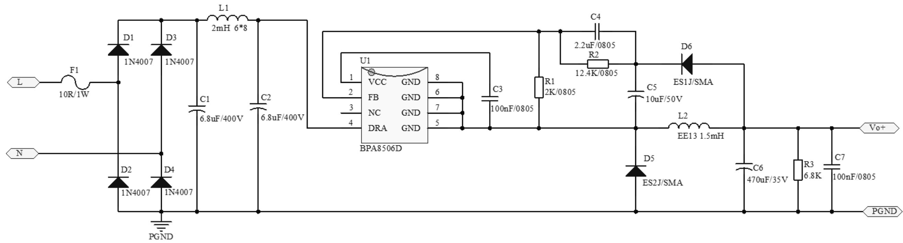

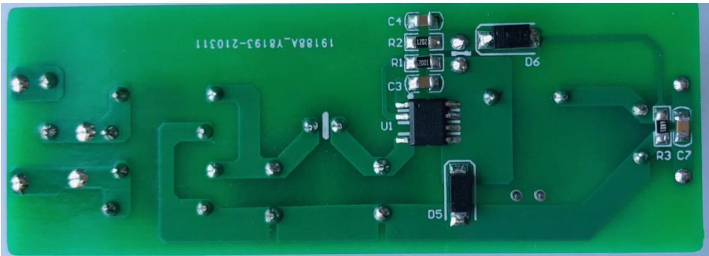

空载功耗  
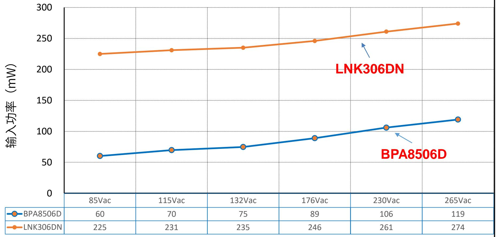

输入电压 (Vac)  
1测试条件：BPA8506D Rdummy=6.8Kohm，LNK306DN Rdummy=1Kohm

效率测试  
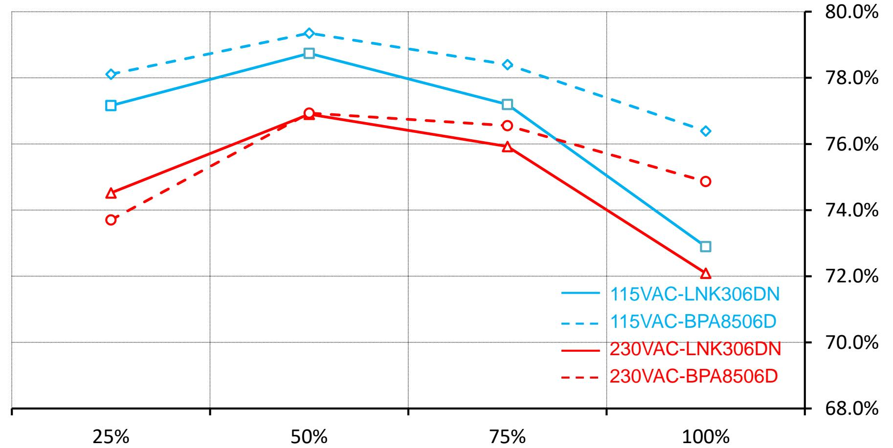

负载

## 输出电压调整率

BPA8506D

<table><tr><td> $V_{IN}(VAC)$ Load(%)</td><td>85</td><td>115</td><td>132</td><td>176</td><td>230</td><td>265</td><td>平均值</td><td>线调整率</td></tr><tr><td>0</td><td>12.55</td><td>12.55</td><td>12.54</td><td>12.55</td><td>12.55</td><td>12.56</td><td>12.55</td><td>0.17%</td></tr><tr><td>20%</td><td>12.02</td><td>12.01</td><td>12.01</td><td>12.01</td><td>12.00</td><td>12.00</td><td>12.01</td><td>0.10%</td></tr><tr><td>40%</td><td>11.98</td><td>11.97</td><td>11.97</td><td>11.97</td><td>11.97</td><td>11.96</td><td>11.97</td><td>0.12%</td></tr><tr><td>60%</td><td>11.96</td><td>11.96</td><td>11.96</td><td>11.96</td><td>11.95</td><td>11.95</td><td>11.96</td><td>0.07%</td></tr><tr><td>80%</td><td>11.96</td><td>11.95</td><td>11.95</td><td>11.95</td><td>11.95</td><td>11.95</td><td>11.95</td><td>0.08%</td></tr><tr><td>100%</td><td>11.95</td><td>11.95</td><td>11.95</td><td>11.94</td><td>11.94</td><td>11.93</td><td>11.94</td><td>0.16%</td></tr><tr><td>平均值</td><td>12.07</td><td>12.07</td><td>12.06</td><td>12.06</td><td>12.06</td><td>12.06</td><td rowspan="2" colspan="2"></td></tr><tr><td>负载调整率</td><td>4.99%</td><td>4.95%</td><td>4.95%</td><td>5.04%</td><td>5.09%</td><td>5.26%</td></tr></table>

计算方法：调整率=100%\*(最大值-最小值)/平均值  
■测试条件:BPA8506DRdummy=6.8Kohm，LNK306DN $R _ { \mathrm { d u m m y } } = 1 \mathsf { K o h m }$

LNK306DN

<table><tr><td> $V_{IN}(VAC)$ Load(%)</td><td>85</td><td>115</td><td>132</td><td>176</td><td>230</td><td>265</td><td>平均值</td><td>线调整率</td></tr><tr><td>0</td><td>12.63</td><td>12.63</td><td>12.63</td><td>12.63</td><td>12.63</td><td>12.65</td><td>12.63</td><td>0.16%</td></tr><tr><td>20%</td><td>12.17</td><td>12.17</td><td>12.17</td><td>12.17</td><td>12.17</td><td>12.17</td><td>12.17</td><td>0.02%</td></tr><tr><td>40%</td><td>12.12</td><td>12.11</td><td>12.12</td><td>12.12</td><td>12.11</td><td>12.11</td><td>12.11</td><td>0.02%</td></tr><tr><td>60%</td><td>12.09</td><td>12.09</td><td>12.10</td><td>12.09</td><td>12.09</td><td>12.08</td><td>12.09</td><td>0.09%</td></tr><tr><td>80%</td><td>12.07</td><td>12.07</td><td>12.06</td><td>12.07</td><td>12.06</td><td>12.06</td><td>12.06</td><td>0.07%</td></tr><tr><td>100%</td><td>12.04</td><td>12.04</td><td>12.03</td><td>12.03</td><td>12.03</td><td>12.03</td><td>12.04</td><td>0.08%</td></tr><tr><td>平均值</td><td>12.19</td><td>12.18</td><td>12.18</td><td>12.18</td><td>12.18</td><td>12.18</td><td rowspan="2" colspan="2"></td></tr><tr><td>负载调整率</td><td>4.83%</td><td>4.86%</td><td>4.86%</td><td>4.88%</td><td>4.90%</td><td>5.01%</td></tr></table>

## 输出电压纹波

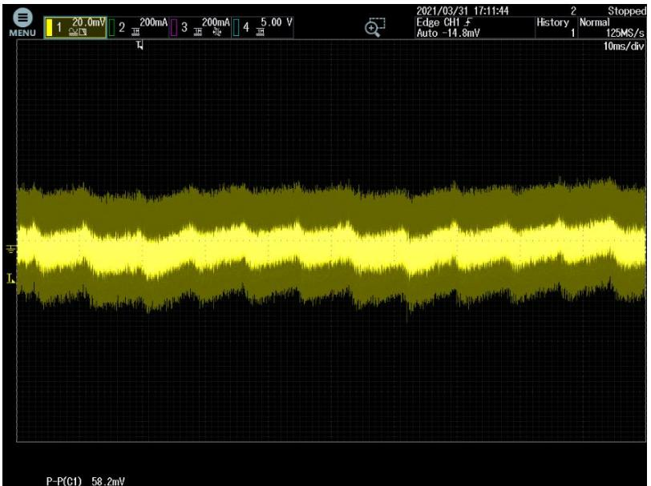

85 VAC  
  
Test Condition:  
➢ Full Load

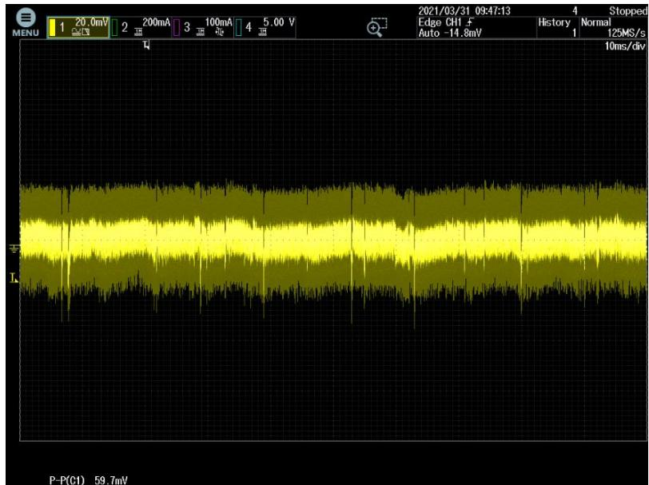

85 VAC  
  
Test Condition:  
➢ Full Load

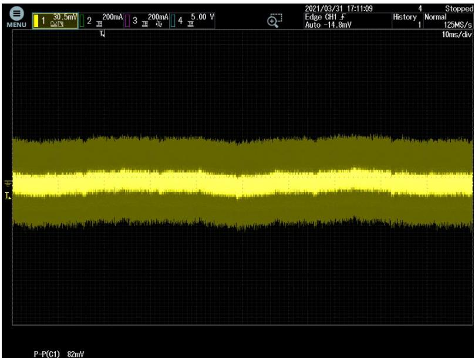

265 VAC  
  
Test Condition:  
➢ Full Load

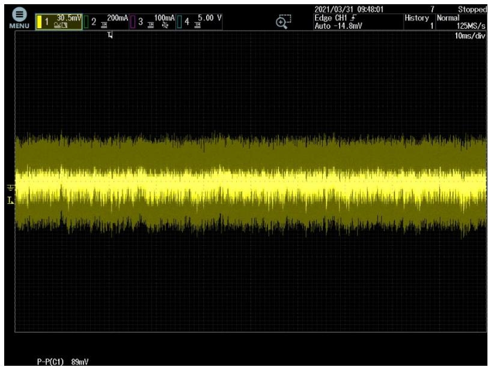

265 VAC  
  
Test Condition:  
➢ Full Load

## (50%-100%)

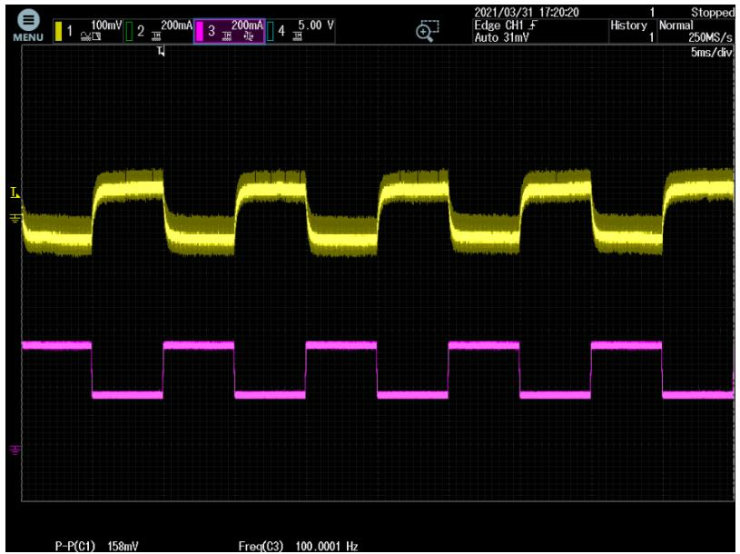

85 VAC

CH1 VOUT  
CH3 IOUT

$$
V _ {P K - P K} = 1 5 8 \mathrm{mV}
$$

## Test Condition:

➢ 0.175 A-0.35 A-0.175 A  
➢ Slew Rate: 0.5 A/μS  
➢ Frequency: 100 Hz

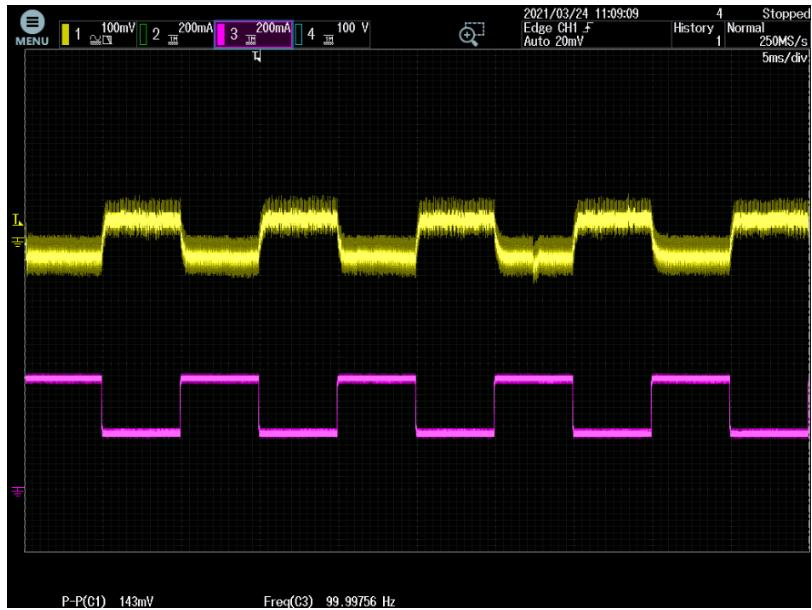

85 VAC

CH1 VOUT  
CH3 IOUT

$$
V _ {P K - P K} = 1 4 3 \mathrm{mV}
$$

## Test Condition:

➢ 0.175 A-0.35 A-0.175 A  
➢ Slew Rate: 0.5 A/μS  
➢ Frequency: 100 Hz

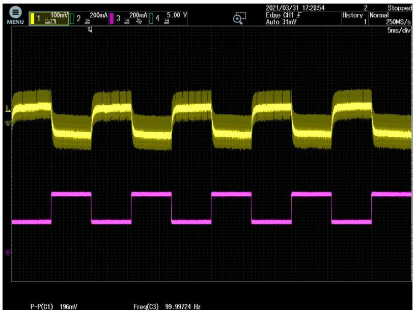

265 VAC

CH1 VOUT  
CH3 IOUT

$$
V _ {P K - P K} = 1 9 6 \mathrm{mV}
$$

## Test Condition:

➢ 0.175 A-0.35 A-0.175 A  
➢ Slew Rate: 0.5 A/μS  
➢ Frequency: 100 Hz

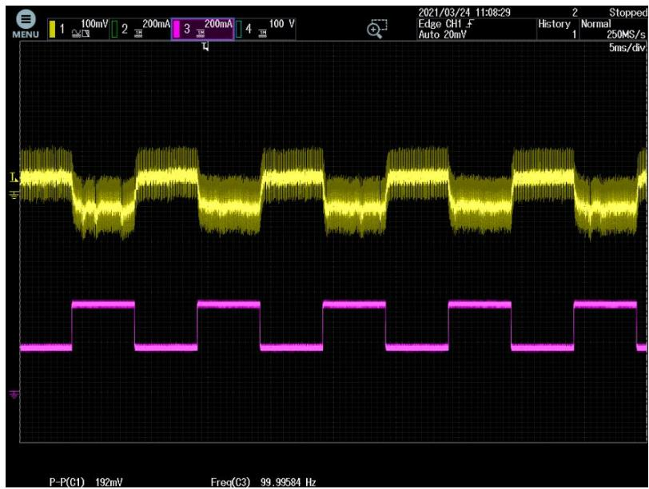

265 VAC

CH1 VOUT  
CH3 IOUT

$$
V _ {P K - P K} = 1 9 2 \mathrm{mV}
$$

## Test Condition:

➢ 0.175 A-0.35 A-0.175 A  
➢ Slew Rate: 0.5 A/μS  
➢ Frequency: 100 Hz

## (10%-90%)

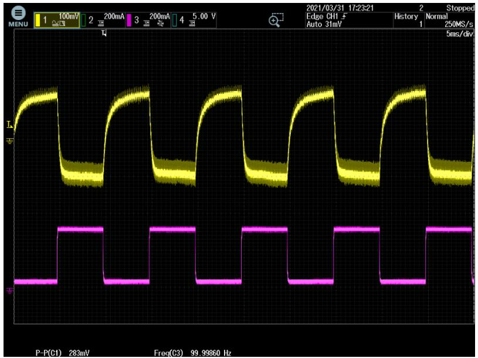

85 VAC

CH1 VOUT $\begin{array} { r l } {  { \mathsf { C H 1 V _ { 0 \cup \mathsf { T } } } } } \\ & { \mathsf { V _ { P K - P K } } \equiv 2 8 3 \mathsf { m v } } \end{array}$  
$\mathsf { C H 3 } \mathsf { I _ { 0 \mathsf { U } \mathsf { T } } }$

## Test Condition:

➢ 0.035A-0.315 A-0.035 A  
➢ Slew Rate: 0.5 A/μS  
➢ Frequency: 100 Hz

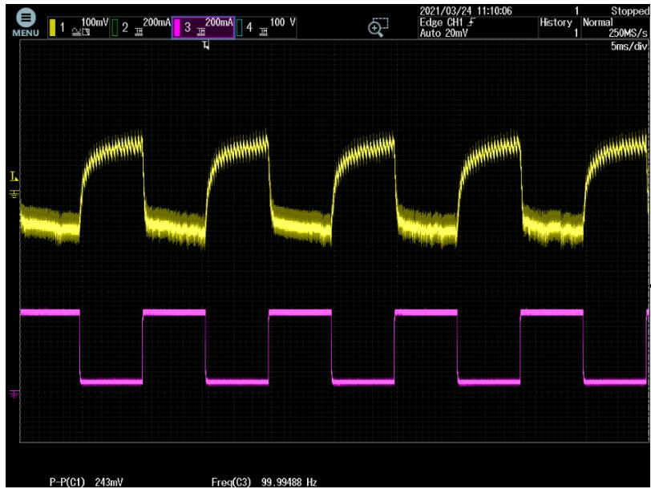

85 VAC

$\begin{array} { r l } & { \mathsf { C H 1 V } _ { \mathrm { O U T } } } \\ & { \mathsf { V } _ { \mathsf { P K - P K } } { = } 2 4 3 \mathsf { m V } } \\ & { \mathsf { C H 3 } \mathsf { I } _ { \mathrm { O U T } } } \end{array}$

## Test Condition:

➢ 0.035A-0.315 A-0.035 A  
Slew Rate: 0.5 A/μS  
Frequency: 100 Hz

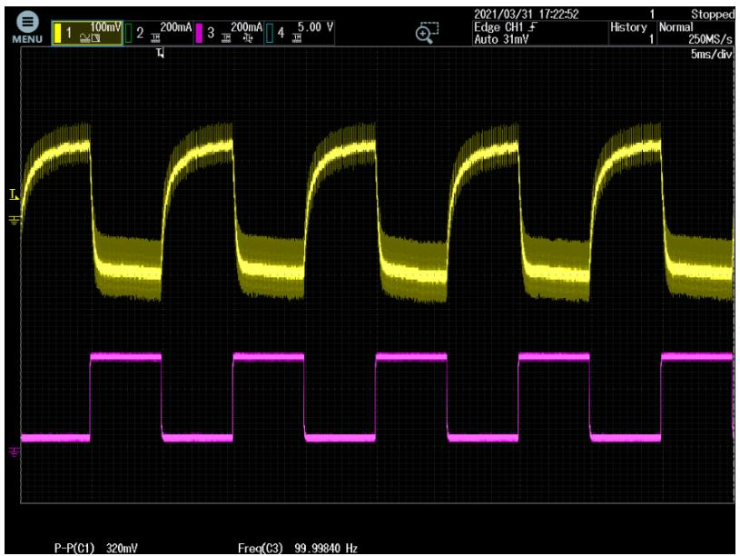

265 VAC

$\mathsf { C H 1 } \mathsf { V } _ { \mathsf { O U T } }$ $V _ { \mathsf { P K - P K } } { = } 3 2 0 ~ \mathsf { m V }$  
$\mathsf { C H 3 } \mathsf { I _ { 0 \mathsf { U } \mathsf { T } } }$

## Test Condition:

➢ 0.035A-0.315 A-0.035 A  
➢ Slew Rate: 0.5 A/μS  
➢ Frequency: 100 Hz

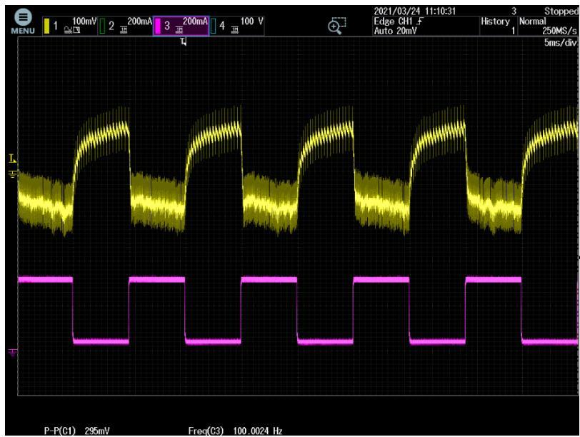

265 VAC

$\begin{array} { r l } & { \mathsf { C H 1 V } _ { \mathrm { O U T } } } \\ & { \mathsf { V } _ { \mathsf { P K - P K } } { = } 2 9 5 \mathsf { m V } } \\ & { \mathsf { C H 3 } \mathsf { I } _ { \mathrm { O U T } } } \end{array}$

## Test Condition:

➢ 0.035A-0.315 A-0.035 A  
Slew Rate: 0.5 A/μS  
Frequency: 100 Hz

## 输出电压开机波形

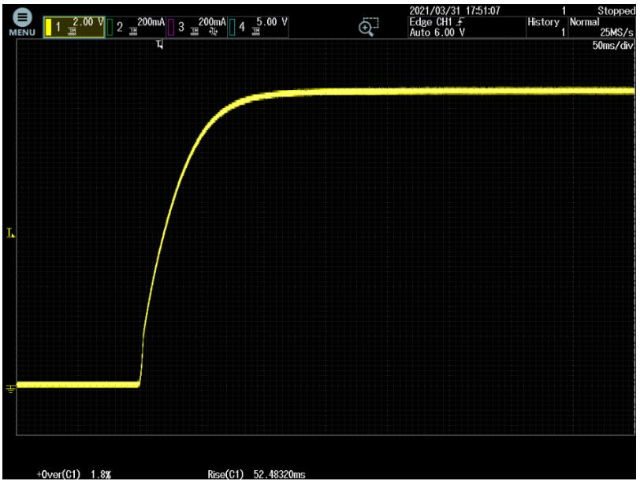

115 VAC  
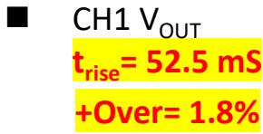

Test Condition:  
➢ Full Load

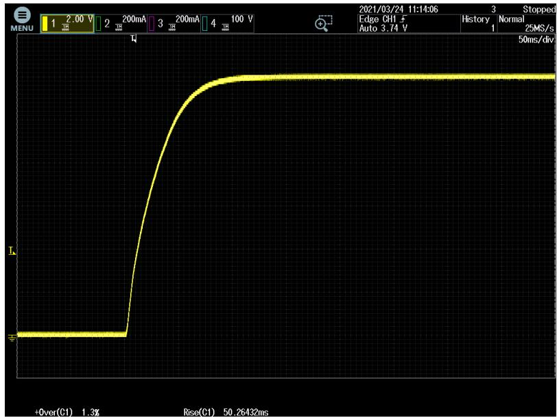

115 VAC  
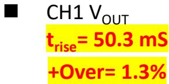

Test Condition:  
➢ Full Load

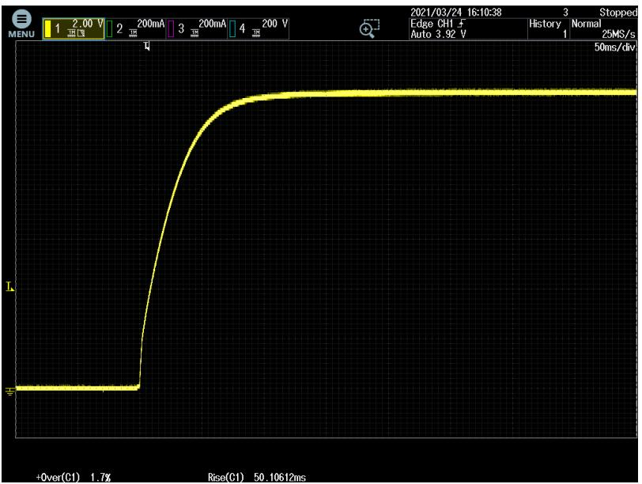

265 VAC  
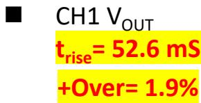

Test Condition:  
➢ Full Load

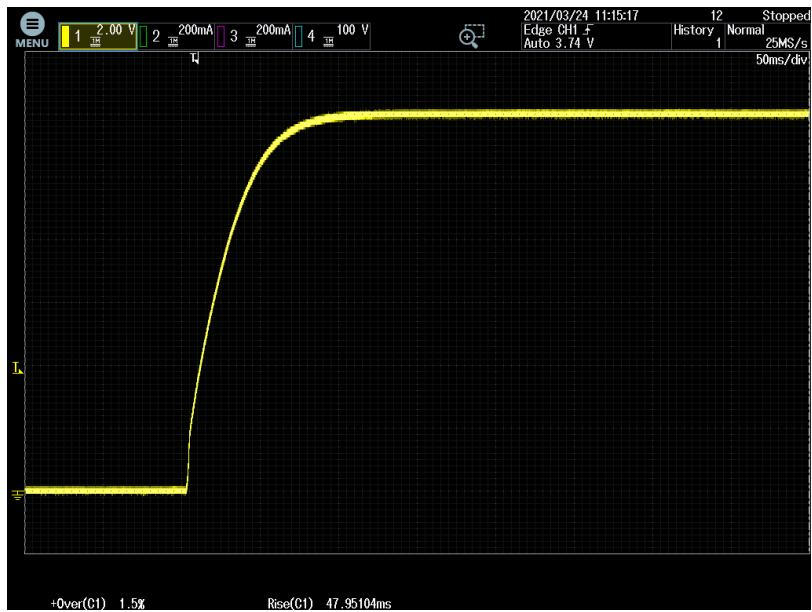

265 VAC  
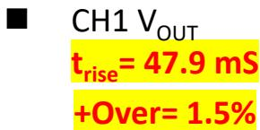

Test Condition:  
➢ Full Load

## MOSFET

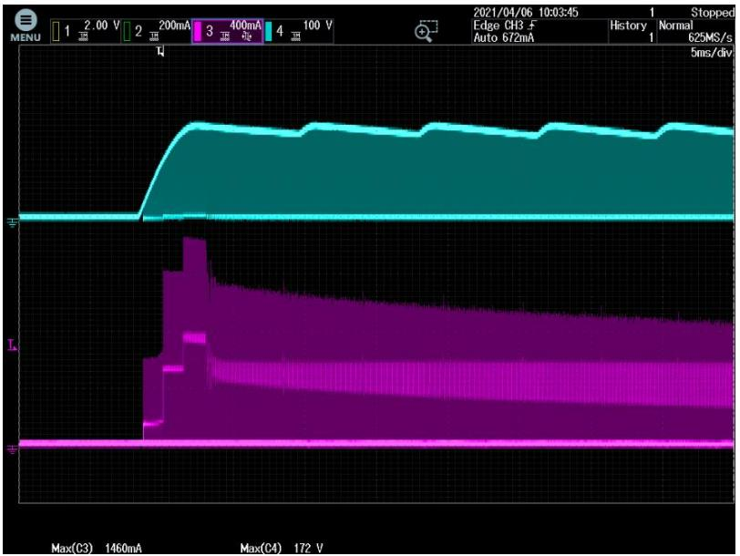

115 VAC

CH4 VDS  
CH3 IDS

$$
V _ {D S \_ M A X} = 1 7 2 V
$$

$$
I _ {D S \_ M A X} = 1. 4 6 \mathrm{A}
$$

## Test Condition:

➢ Full Load

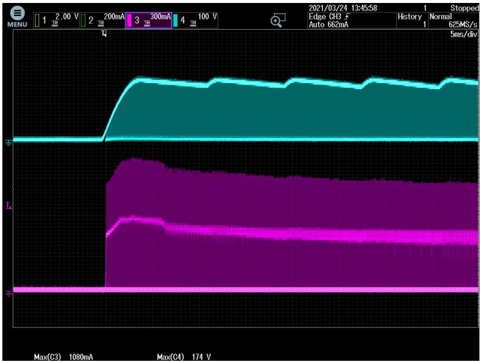

115 VAC

CH4 VDS  
CH3 IDS

$$
V _ {D S \_ M A X} = 1 7 4 V
$$

$$
I _ {D S \_ M A X} = 1. 0 8 \mathrm{A}
$$

## Test Condition:

➢ Full Load

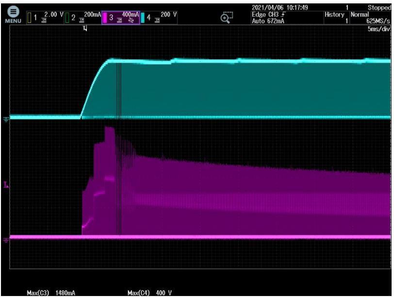

265 VAC

CH4 VDS  
CH3 IDS

$$
V _ {D S \_ M A X} = 4 0 0 V
$$

$$
I _ {D S \_ M A X} = 1. 4 8 \mathrm{A}
$$

## Test Condition:

➢ Full Load

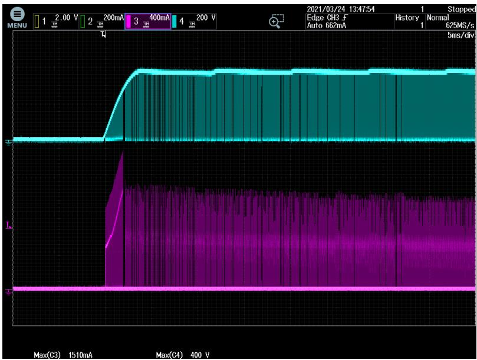

265 VAC

CH4 VDS  
CH3 IDS

$$
V _ {D S \_ M A X} = 4 0 0 V
$$

$$
I _ {D S \_ M A X} = 1. 5 1 \mathrm{A}
$$

## Test Condition:

➢ Full Load

## MOSFET

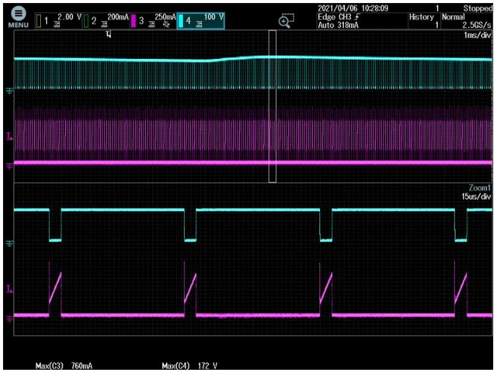

115 VAC

CH4 VDS  
CH3 IDS

$$
\begin{array}{l} \mathrm {V_ {DS\_MAX}} = 1 7 2 \mathrm{V} \\ \mathrm {I_ {DS\_MAX}} = 0. 7 6 \mathrm{A} \end{array}
$$

## Test Condition:

➢ Full Load

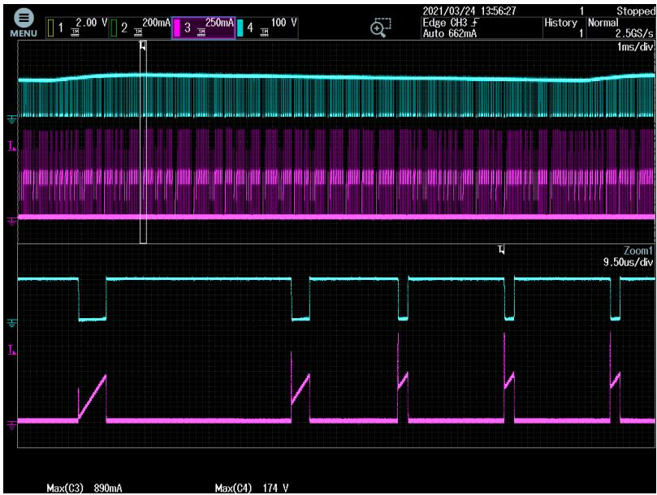

115 VAC

CH4 VDS  
CH3 IDS $V _ { \mathsf { D S \_ M A X } } { = } 1 7 4 \lor$ $\mathsf { I } _ { \mathsf { D S \_ M A X } } { = } \mathsf { 0 } . 8 9 \mathrm { \ A }$

## Test Condition:

➢ Full Load

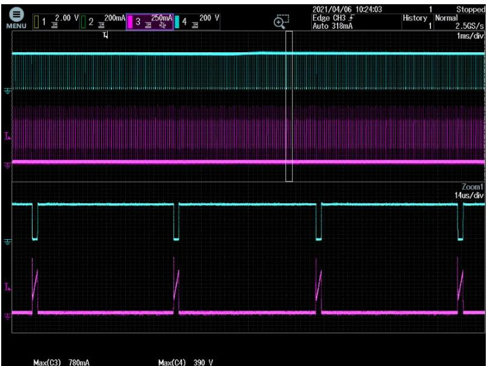

265 VAC

CH4 VDS  
CH3 IDS

$$
V _ {D S \_ M A X} = 3 9 0 \mathrm{V}
$$

$$
I _ {D S \_ M A X} = 0. 7 8 \mathrm{A}
$$

## Test Condition:

➢ Full Load

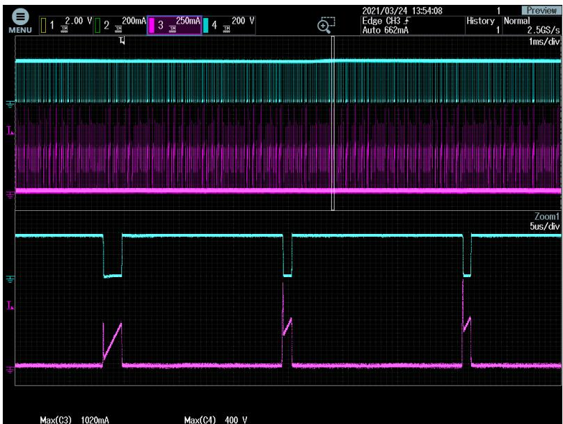

265 VAC

CH4 VDS  
CH3 IDS

$$
V _ {D S \_ M A X} = 4 0 0 \mathrm{V}
$$

$$
I _ {D S \_ M A X} = 1. 0 2 \mathrm{A}
$$

## Test Condition:

➢ Full Load

## 续流二极管开机波形

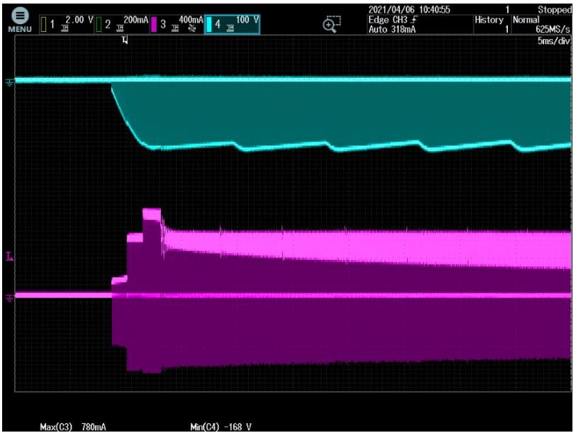

115 VAC

CH4 VR  
CH3 IF

$$
V _ {R \_ M A X} = 1 6 8 \mathrm{V}
$$

$$
I _ {F \_ M A X} = 0. 7 8 \mathrm{A}
$$

## Test Condition:

➢ Full Load

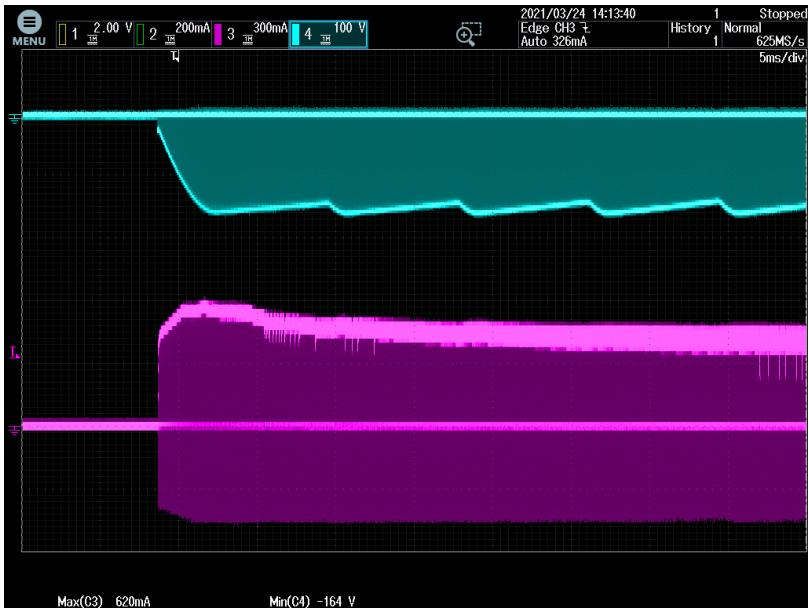

115 VAC

CH4 VR  
CH3 IF

$$
\begin{array}{l} \mathrm {V_ {R\_MAX}} = 1 6 4 \mathrm{V} \\ \mathrm {I_ {F\_MAX}} = 0. 6 2 \mathrm{A} \end{array}
$$

## Test Condition:

➢ Full Load

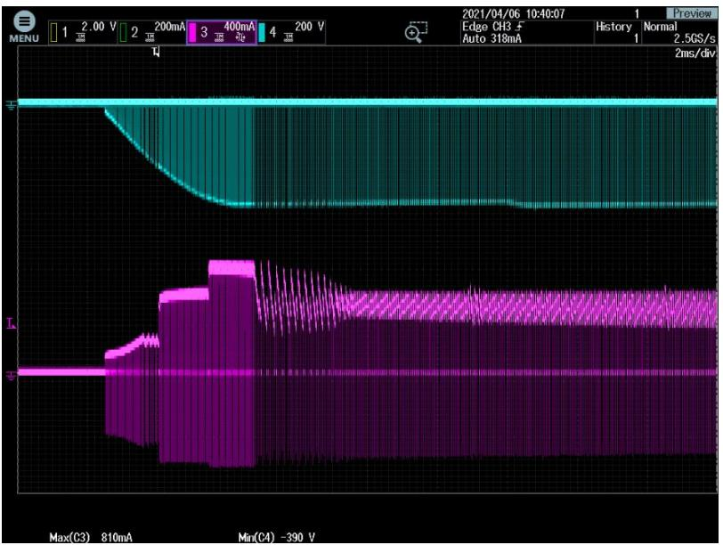

265 VAC

CH4 VR  
CH3 IF

$$
V _ {R \_ M A X} = 3 9 0 \mathrm{V}
$$

$$
I _ {F \_ M A X} = 0. 8 1 \mathrm{A}
$$

## Test Condition:

➢ Full Load

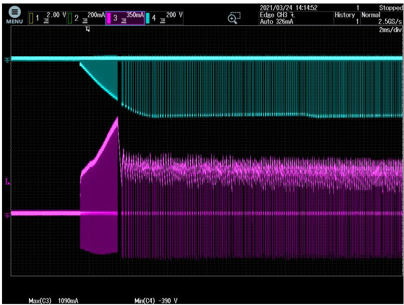

265 VAC

CH4 VR  
CH3 IF

$$
V _ {R \_ M A X} = 3 9 0 \mathrm{V}
$$

$$
I _ {F \_ M A X} = 1. 0 9 \mathrm{A}
$$

## Test Condition:

➢ Full Load

## 续流二极管稳态波形

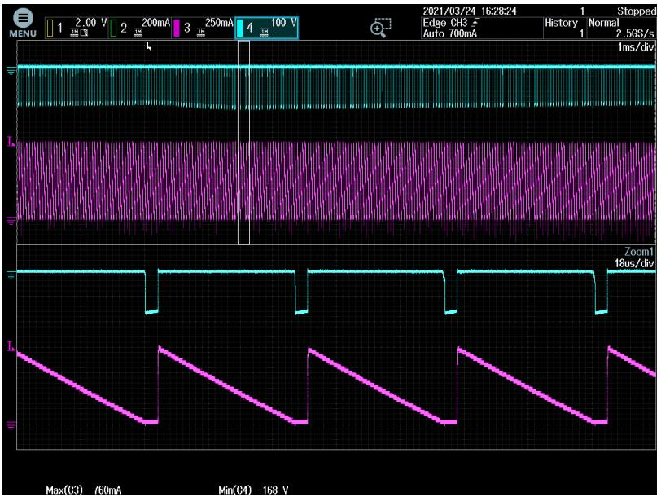

115 VAC

CH4 VR  
CH3 IF

$$
V _ {R \_ M A X} = 1 6 7 \mathrm{V}
$$

$$
I _ {F \_ M A X} = 0. 5 8 \mathrm{A}
$$

## Test Condition:

➢ Full Load

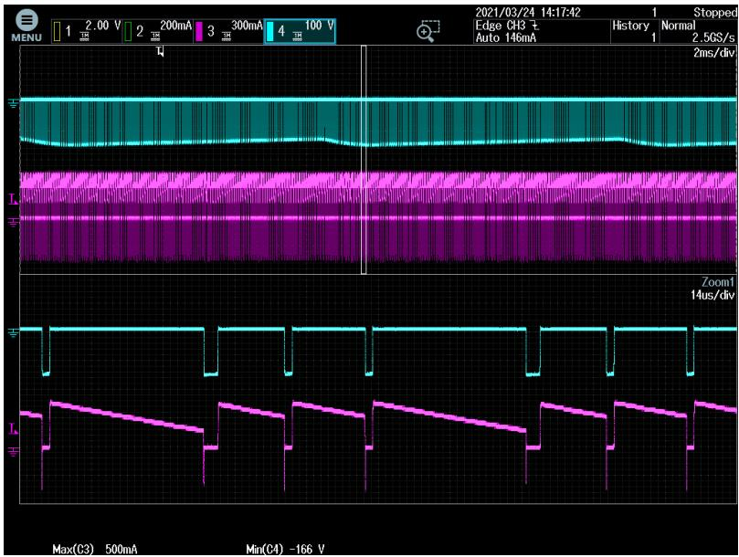

115 VAC

CH4 VR  
CH3 IF

$$
V _ {R \_ M A X} = 1 6 6 \mathrm{V}
$$

$$
I _ {F \_ M A X} = 0. 5 \mathrm{A}
$$

## Test Condition:

➢ Full Load

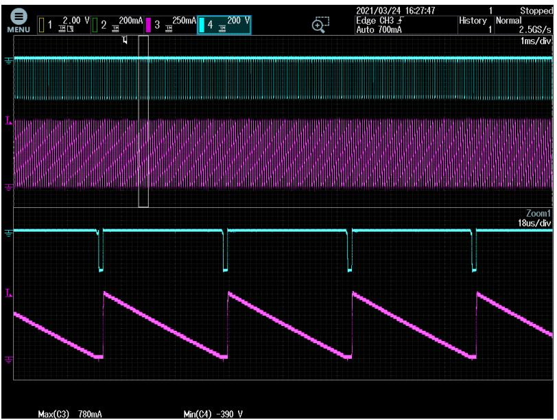

265 VAC

CH4 VR  
CH3 IF

$$
V _ {R \_ M A X} = 3 9 0 \mathrm{V}
$$

$$
I _ {F \_ M A X} = 0. 6 \mathrm{A}
$$

## Test Condition:

➢ Full Load

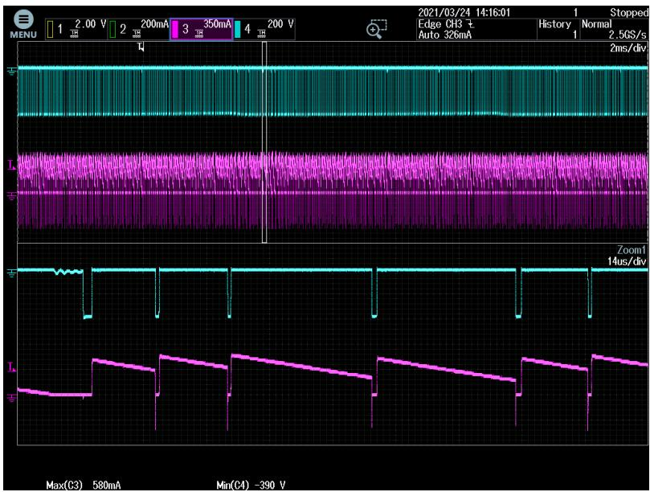

265 VAC

CH4 VR  
CH3 IF

$$
V _ {R \_ M A X} = 3 9 0 \mathrm{V}
$$

$$
I _ {F \_ M A X} = 0. 5 8 \mathrm{A}
$$

## Test Condition:

➢ Full Load

## MOSFET

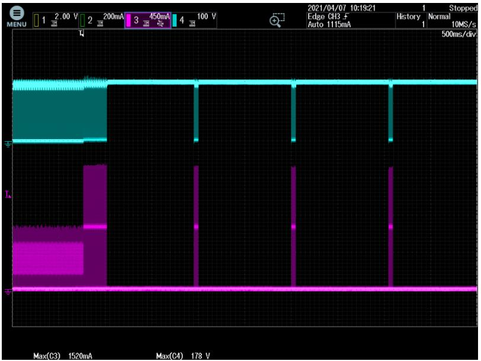

115 VAC

CH4 VDS  
CH3 IDS

$$
\begin{array}{l} \mathrm {V_ {DS\_MAX}} = 1 7 8 \mathrm{V} \\ \mathrm {I_ {DS\_MAX}} = 1. 5 2 \mathrm{A} \end{array}
$$

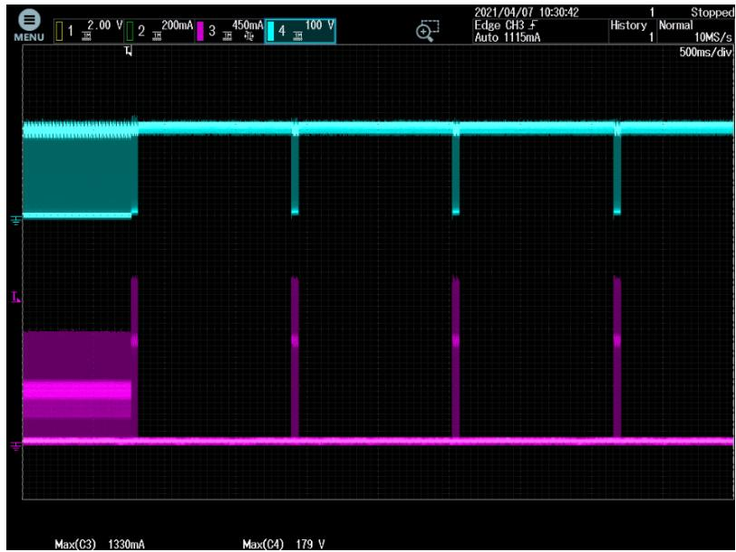

115 VAC

CH4 VDS  
CH3 IDS

$$
\begin{array}{l} \mathrm {V_ {DS\_MAX}} = 1 7 9 \mathrm{V} \\ \mathrm {I_ {DS\_MAX}} = 1. 3 3 \mathrm{A} \end{array}
$$

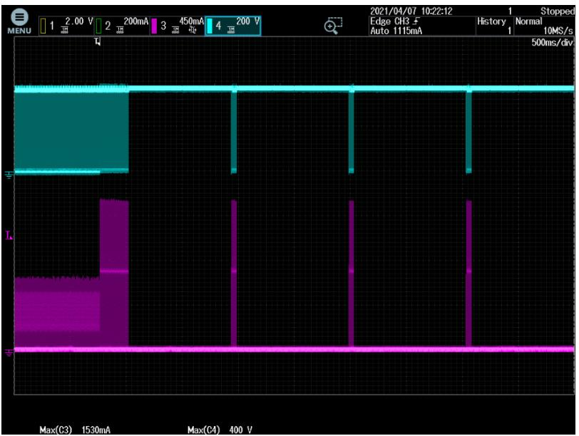

265 VAC

CH4 VDS  
CH3 IDS

$$
\begin{array}{l} \mathrm {V_ {DS\_MAX}} = 4 0 0 \mathrm{V} \\ \mathrm {I_ {DS\_MAX}} = 1. 5 3 \mathrm{A} \end{array}
$$

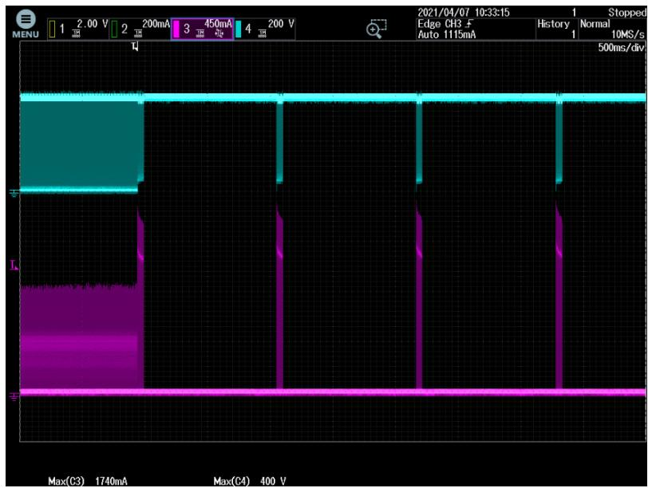

265 VAC

CH4 VDS

$$
\begin{array}{l} \mathrm {V_ {DS\_MAX}} = 4 0 0 \mathrm{V} \\ \mathrm {I_ {DS\_MAX}} = 1. 7 4 \mathrm{A} \end{array}
$$

## 温升测试

BPA8506D

<table><tr><td rowspan="2">项目</td><td>85VAC</td><td>115VAC</td><td>230VAC</td><td>265VAC</td></tr><tr><td>温度(°C)</td><td>温度(°C)</td><td>温度(°C)</td><td>温度(°C)</td></tr><tr><td>环境温度</td><td>50</td><td>50</td><td>50</td><td>50</td></tr><tr><td>BPA8506D (U1)</td><td>89.5</td><td>90.3</td><td>102.6</td><td>108.2</td></tr><tr><td>变压器绕组(L2)</td><td>85.8</td><td>86.2</td><td>90.7</td><td>92.5</td></tr><tr><td>变压器磁芯(L2)</td><td>83.6</td><td>84.9</td><td>89.8</td><td>91.8</td></tr><tr><td>整流二极管(D5)</td><td>82.2</td><td>82.9</td><td>88.7</td><td>91.2</td></tr><tr><td>整流桥(D1)</td><td>58.7</td><td>57.1</td><td>55.8</td><td>56.2</td></tr><tr><td>输入电解电容(C2)</td><td>66.7</td><td>66.4</td><td>68.2</td><td>69.7</td></tr><tr><td>输出电解电容(C6)</td><td>62.2</td><td>62.7</td><td>64.5</td><td>65.4</td></tr></table>

BPA8506D 12V/350mA

备注：增大芯片Source散热铜箔面积可以降低芯片温度

LNK306DN

<table><tr><td rowspan="2">项目</td><td>85VAC</td><td>115VAC</td><td>230VAC</td><td>265VAC</td></tr><tr><td>温度(°C)</td><td>温度(°C)</td><td>温度(°C)</td><td>温度(°C)</td></tr><tr><td>环境温度</td><td>50</td><td>50</td><td>50</td><td>50</td></tr><tr><td>LNK306DG (U1)</td><td>111.6</td><td>113.1</td><td>106.3</td><td>109.2</td></tr><tr><td>变压器绕组(L2)</td><td>92.1</td><td>93.2</td><td>93.3</td><td>94.7</td></tr><tr><td>变压器磁芯(L2)</td><td>88.6</td><td>89.9</td><td>89.6</td><td>91.2</td></tr><tr><td>整流二极管(D5)</td><td>94.6</td><td>97.4</td><td>93.8</td><td>95.2</td></tr><tr><td>整流桥(D1)</td><td>63.2</td><td>60.2</td><td>58.1</td><td>57.8</td></tr><tr><td>输入电解电容(C2)</td><td>77.2</td><td>77.1</td><td>74.8</td><td>75.6</td></tr><tr><td>输出电解电容(C6)</td><td>65.8</td><td>65.4</td><td>66.3</td><td>66.6</td></tr></table>

230Vac 265Vac 12V/350mA OTP 330mA

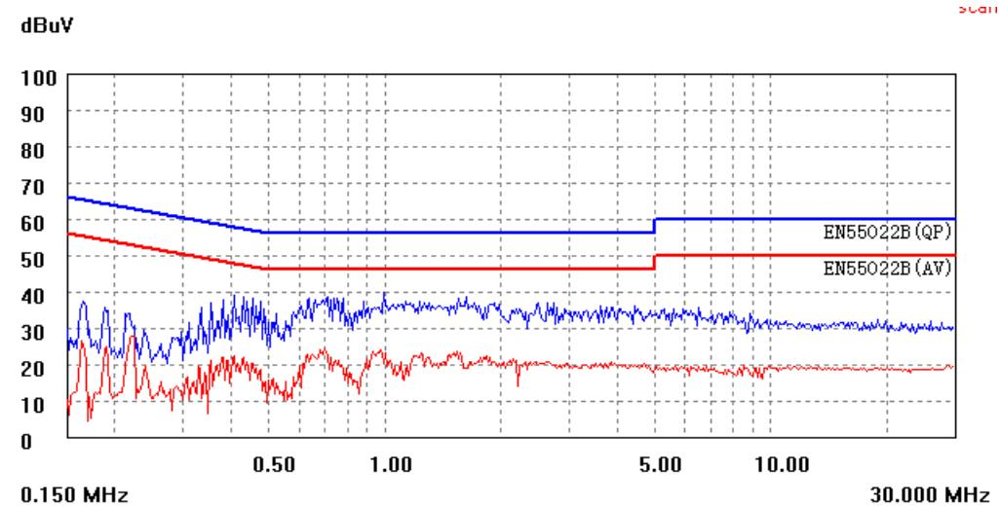

115Vac Line

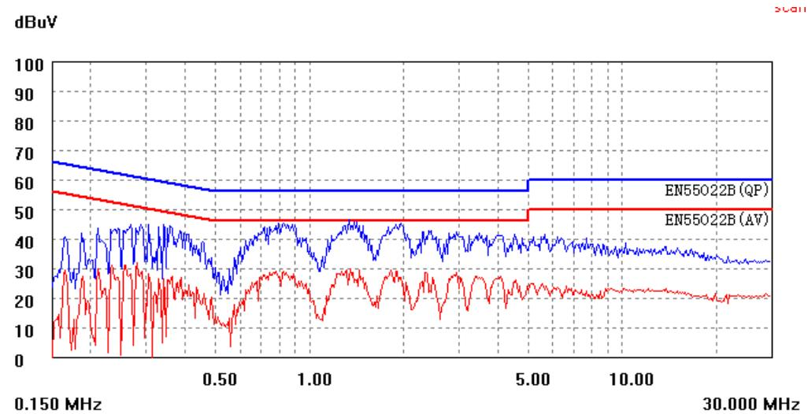

230Vac Line

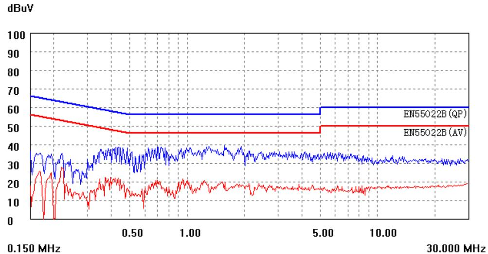

115Vac Neutral

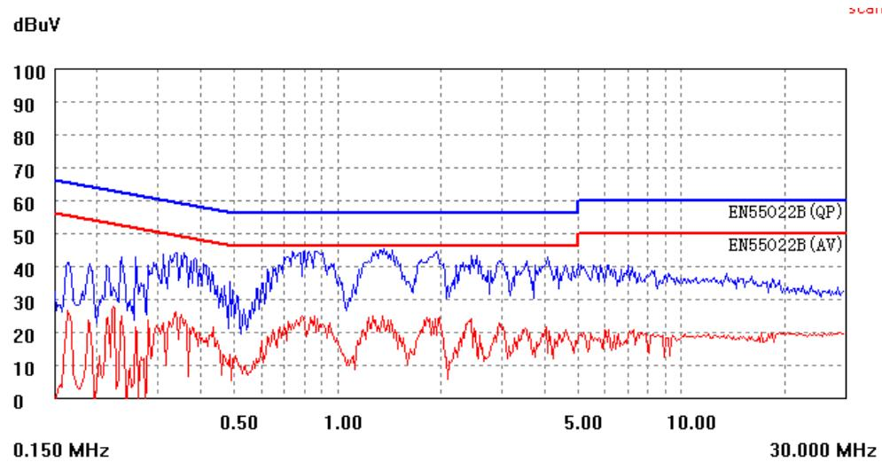

230Vac Neutral

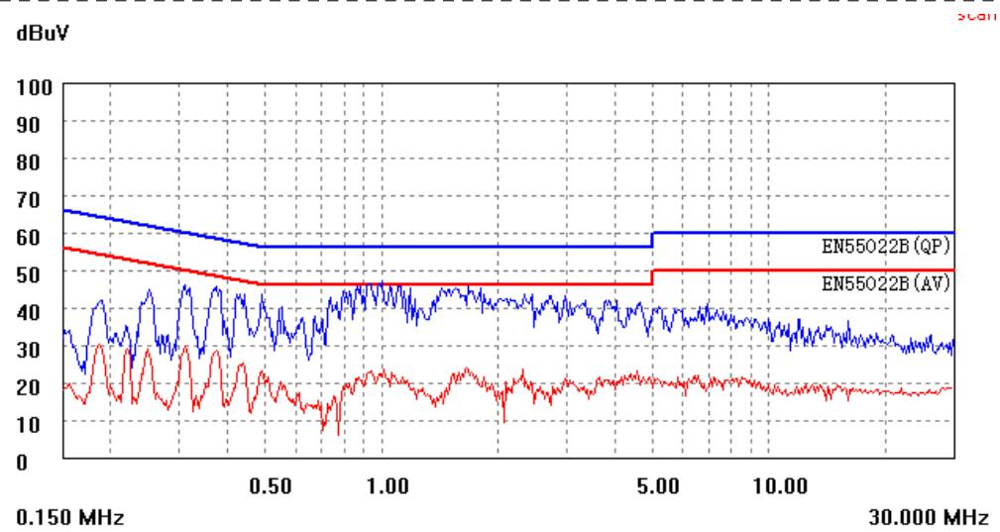

115Vac Line

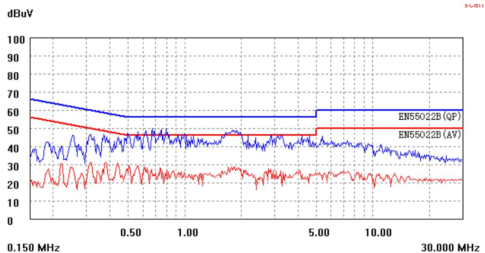

230Vac Line

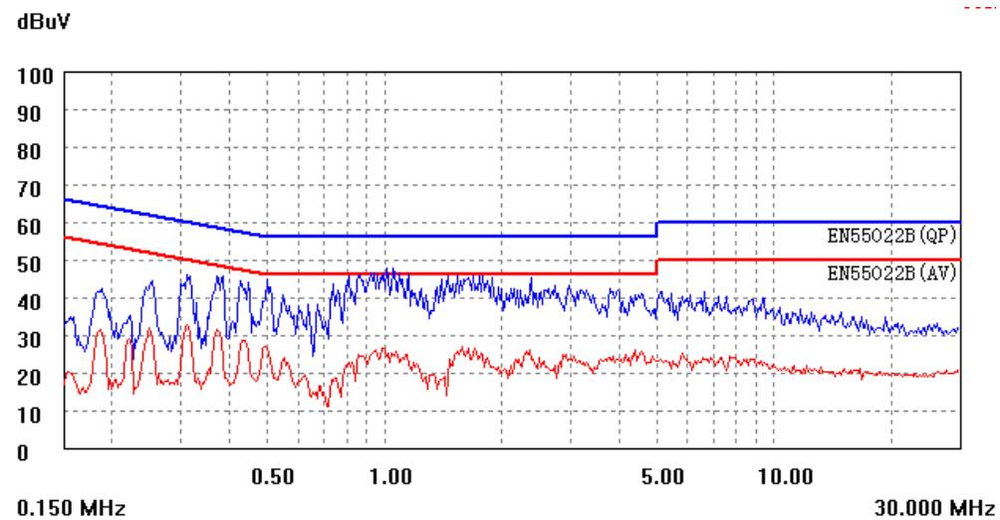

115Vac Neutral

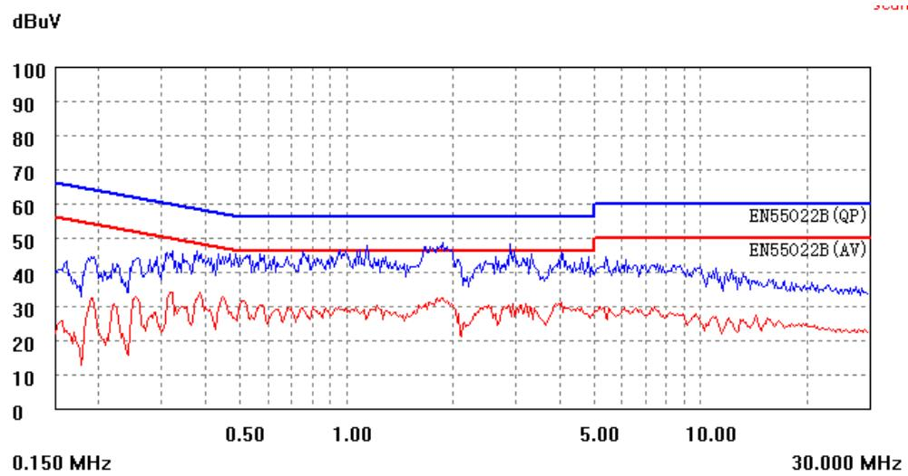

230Vac Neutral

BPA8506D

<table><tr><td>差模</td><td>电压</td><td>相位角</td><td>发生器阻抗</td><td>测试次数</td><td>测试结果</td></tr><tr><td>L to N</td><td>+1.5kV</td><td>0/90/180/270</td><td>2</td><td>10</td><td>Pass</td></tr><tr><td>L to N</td><td>-1.5kV</td><td>0/90/180/270</td><td>2</td><td>10</td><td>Pass</td></tr><tr><td>L to N</td><td>+2kV</td><td>0/90/180/270</td><td>2</td><td>10</td><td>Pass</td></tr><tr><td>L to N</td><td>-2kV</td><td>0/90/180/270</td><td>2</td><td>10</td><td>Pass</td></tr></table>

LNK306DN

<table><tr><td>差模</td><td>电压</td><td>相位角</td><td>发生器阻抗</td><td>测试次数</td><td>测试结果</td></tr><tr><td>L to N</td><td>+1.5kV</td><td>0/90/180/270</td><td>2</td><td>10</td><td>Pass</td></tr><tr><td>L to N</td><td>-1.5kV</td><td>0/90/180/270</td><td>2</td><td>10</td><td>Pass</td></tr><tr><td>L to N</td><td>+2kV</td><td>0/90/180/270</td><td>2</td><td>10</td><td>Pass</td></tr><tr><td>L to N</td><td>-2kV</td><td>0/90/180/270</td><td>2</td><td>10</td><td>Pass</td></tr></table>

## EFT

BPA8506D

<table><tr><td>差模</td><td>电压</td><td>脉冲群持续时间</td><td>脉冲频率</td><td>测试时间</td><td>测试结果</td></tr><tr><td>L to N</td><td>+4kV</td><td>15ms</td><td>5kHz</td><td>120s</td><td>Pass</td></tr><tr><td>L to N</td><td>-4kV</td><td>15ms</td><td>5kHz</td><td>120s</td><td>Pass</td></tr><tr><td>L to N</td><td>+4kV</td><td>0.75ms</td><td>100kHz</td><td>120s</td><td>Pass</td></tr><tr><td>L to N</td><td>-4kV</td><td>0.75ms</td><td>100kHz</td><td>120s</td><td>Pass</td></tr><tr><td>L to N</td><td>+2kV</td><td>2ms</td><td>38kHz</td><td>120s</td><td>Pass</td></tr><tr><td>L to N</td><td>-2kV</td><td>2ms</td><td>38kHz</td><td>120s</td><td>Pass</td></tr><tr><td>L to N</td><td>+4kV</td><td>2ms</td><td>38kHz</td><td>120s</td><td>Pass</td></tr><tr><td>L to N</td><td>-4kV</td><td>2ms</td><td>38kHz</td><td>120s</td><td>Pass</td></tr></table>

LNK306DN

<table><tr><td>差模</td><td>电压</td><td>脉冲群持续时间</td><td>脉冲频率</td><td>测试时间</td><td colspan="2">测试结果</td></tr><tr><td>L to N</td><td>+4kV</td><td>15ms</td><td>5kHz</td><td>120s</td><td>Pass</td><td></td></tr><tr><td>L to N</td><td>-4kV</td><td>15ms</td><td>5kHz</td><td>120s</td><td>Pass</td><td></td></tr><tr><td>L to N</td><td>+4kV</td><td>0.75ms</td><td>100kHz</td><td>120s</td><td>Pass</td><td></td></tr><tr><td>L to N</td><td>-4kV</td><td>0.75ms</td><td>100kHz</td><td>120s</td><td>Pass</td><td></td></tr><tr><td>L to N</td><td>+2kV</td><td>2ms</td><td>38kHz</td><td>120s</td><td>Pass</td><td></td></tr><tr><td>L to N</td><td>-2kV</td><td>2ms</td><td>38kHz</td><td>120s</td><td>Pass</td><td></td></tr><tr><td>L to N</td><td>+4kV</td><td>2ms</td><td>38kHz</td><td>120s</td><td>Pass</td><td></td></tr><tr><td>L to N</td><td>-4kV</td><td>2ms</td><td>38kHz</td><td>120s</td><td>Pass</td><td></td></tr></table>

BPA8506D

<table><tr><td>测试点</td><td>电压(V)</td><td>放电类型</td><td>放电次数</td><td>测试结果</td></tr><tr><td>Vo</td><td>+15kV</td><td>空气放电</td><td>10</td><td>Pass</td></tr><tr><td>Vo</td><td>-15kV</td><td>空气放电</td><td>10</td><td>Pass</td></tr><tr><td>GND</td><td>+15kV</td><td>空气放电</td><td>10</td><td>Pass</td></tr><tr><td>GND</td><td>-15kV</td><td>空气放电</td><td>10</td><td>Pass</td></tr><tr><td>Vo</td><td>+18kV</td><td>空气放电</td><td>10</td><td>Pass</td></tr><tr><td>Vo</td><td>-18kV</td><td>空气放电</td><td>10</td><td>Pass</td></tr><tr><td>GND</td><td>+18kV</td><td>空气放电</td><td>10</td><td>Pass</td></tr><tr><td>GND</td><td>-18kV</td><td>空气放电</td><td>10</td><td>Pass</td></tr></table>

LNK306DN

<table><tr><td>测试点</td><td>电压(V)</td><td>放电类型</td><td>放电次数</td><td>测试结果</td></tr><tr><td>Vo</td><td>+15kV</td><td>空气放电</td><td>10</td><td>Pass</td></tr><tr><td>Vo</td><td>-15kV</td><td>空气放电</td><td>10</td><td>Pass</td></tr><tr><td>GND</td><td>+15kV</td><td>空气放电</td><td>10</td><td>Pass</td></tr><tr><td>GND</td><td>-15kV</td><td>空气放电</td><td>10</td><td>Pass</td></tr><tr><td>Vo</td><td>+18kV</td><td>空气放电</td><td>10</td><td>Pass</td></tr><tr><td>Vo</td><td>-18kV</td><td>空气放电</td><td>10</td><td>Pass</td></tr><tr><td>GND</td><td>+18kV</td><td>空气放电</td><td>10</td><td>Pass</td></tr><tr><td>GND</td><td>-18kV</td><td>空气放电</td><td>10</td><td>Pass</td></tr></table>

## THANK YOU FOR WATCHING
