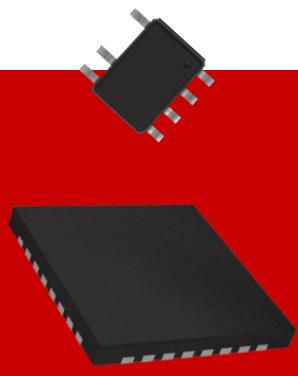

## BPA8506D & SC1145D 对比测试

## （12V0.3A）

上海晶丰明源半导体股份有限公司

Shanghai Bright Power Semiconductor Co., Ltd.

王岩

时间：07/20/2021

## 内容

参考电路  
特性参数对比  
电路及实物图  
性能测试对比  
结论和建议

SC1145D  
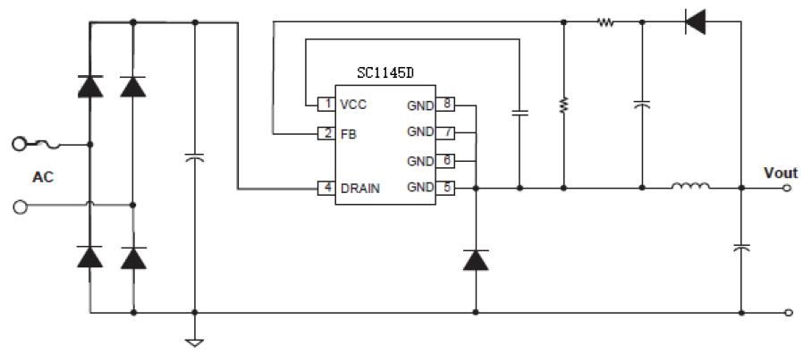

◼ 开关式控制技术，IC集成700V高压MOSFET、高压启动电路和自供电电路，开关频率66KHz；  
◼ 保护功能：输出短路保护、反馈开环保护、输出过载保护、IC过温保护；模式为重启动；

BPA8506D  
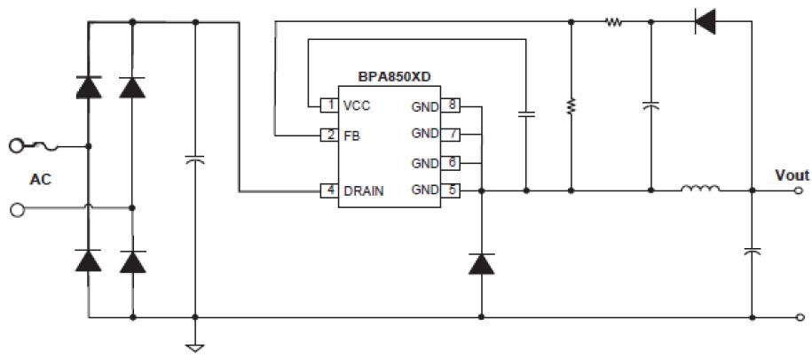

PWM/PFM多模式控制技术，IC集成650V高压MOSFET、高压启动电路和自供电电路，开关频率45KHz；  
◼ 保护功能：输出短路保护、反馈开环保护、输出过载保护、IC过温保护；模式为重启动；  
◼ 输出过压保护：FB引脚用来检测输出过压故障，当FB电压连续4个开关周期高于 $\cdot v _ { F B \_ O \vee P }$ （2.9V）时，则出发输出过压保护，芯片进入自动重启动程序；  
输出软起动功能：IC内置软起动功能，启动过程中MOSFET电流峰值逐步增加，降低二极管反向恢复电流，有效降低MOSFET电流应力；

## SC1145D

◼ 开关式控制方式：使用简单的脉冲数调整输出电压，具有较高的环路带宽和快速动态响应，无需外部环路补偿电路，该方式可以实现低待机功耗、高轻载效率以及优异EMI性能；

## BPA8506D

◼ 多模式控制方式：能有效降低系统待机功耗，提高系统平均效率，降低系统轻载时的噪声；

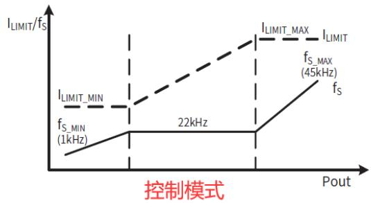

◼ 软启动： $0 . 4 ^ { * } \vert _ { \mathrm { \vert i m i t } }$ 限流点启动，63个开关周期后增加到$0 . 4 ^ { * } \vert _ { \mathrm { \vert i m i t \ } }$ 限流点，127个周期后，增大到最大限流点 。

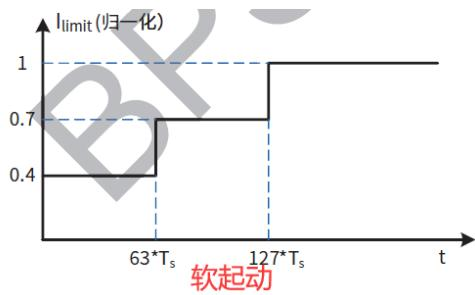

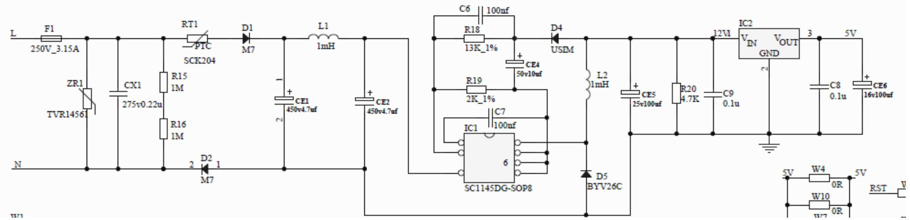

## 待机功耗对比

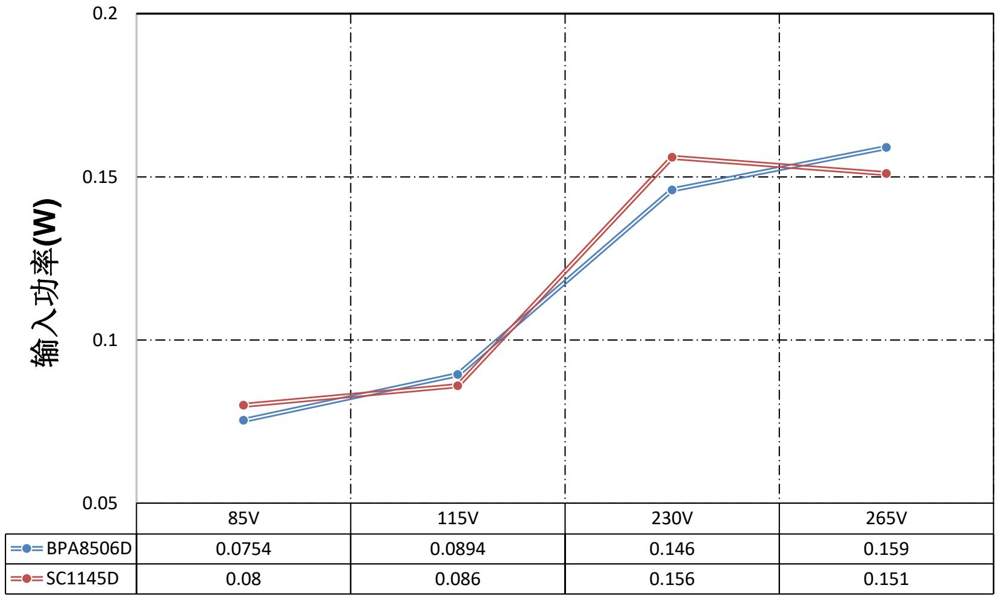

## 输入电压(VAC)

基于整机AC输入电路、去除5V LDO电路和继电器后测试结果

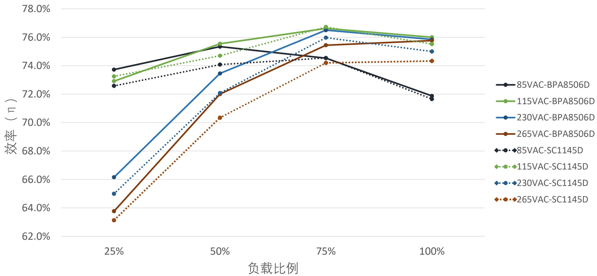

## 输出电压调整率(反馈二极管为ES1J)

<table><tr><td> $V_{IN}(VAC)$ Load(%)</td><td>85</td><td>115</td><td>230</td><td>265</td><td>平均值</td><td>线调整率</td><td> $V_{IN}(VAC)$ Load(%)</td><td>85</td><td>115</td><td>230</td><td>265</td><td>平均值</td><td>线调整率</td></tr><tr><td>0</td><td>12.298</td><td>12.300</td><td>12.300</td><td>12.300</td><td>12.300</td><td>0.02%</td><td>0</td><td>11.904</td><td>11.909</td><td>11.900</td><td>11.896</td><td>11.902</td><td>0.11%</td></tr><tr><td>20%</td><td>11.713</td><td>11.718</td><td>11.710</td><td>11.710</td><td>11.713</td><td>0.07%</td><td>20%</td><td>11.510</td><td>11.492</td><td>11.489</td><td>11.473</td><td>11.491</td><td>0.32%</td></tr><tr><td>40%</td><td>11.655</td><td>11.660</td><td>11.648</td><td>11.645</td><td>11.652</td><td>0.13%</td><td>40%</td><td>11.450</td><td>11.436</td><td>11.424</td><td>11.420</td><td>11.433</td><td>0.26%</td></tr><tr><td>60%</td><td>11.633</td><td>11.634</td><td>11.621</td><td>11.612</td><td>11.625</td><td>0.19%</td><td>60%</td><td>11.427</td><td>11.418</td><td>11.403</td><td>11.395</td><td>11.411</td><td>0.28%</td></tr><tr><td>80%</td><td>11.621</td><td>11.617</td><td>11.609</td><td>11.608</td><td>11.614</td><td>0.11%</td><td>80%</td><td>11.400</td><td>11.398</td><td>11.382</td><td>11.375</td><td>11.389</td><td>0.22%</td></tr><tr><td>100%</td><td>11.512</td><td>11.513</td><td>11.558</td><td>11.553</td><td>11.534</td><td>0.40%</td><td>100%</td><td>11.385</td><td>11.374</td><td>11.351</td><td>11.345</td><td>11.364</td><td>0.35%</td></tr><tr><td>平均值</td><td>11.739</td><td>11.740</td><td>11.741</td><td>11.738</td><td rowspan="2" colspan="2">SC1145D</td><td>平均值</td><td>11.513</td><td>11.505</td><td>11.492</td><td>11.484</td><td rowspan="2" colspan="2">BPA8506D</td></tr><tr><td>负载调整率</td><td>6.70%</td><td>6.70%</td><td>6.32%</td><td>6.36%</td><td>负载调整率</td><td>4.51%</td><td>4.65%</td><td>4.78%</td><td>4.80%</td></tr></table>

◼ 计算方法：调整率=100%\*(最大值-最小值)/平均值  
反馈二极管为ES1J

## 输出电压纹波

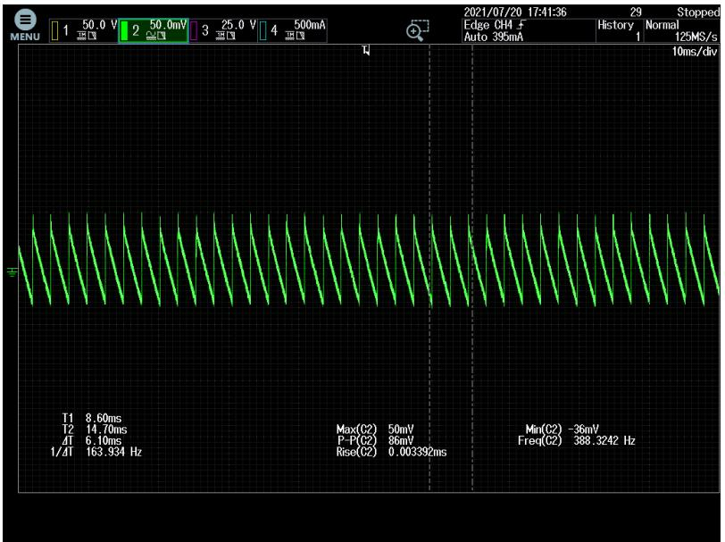

SC1145D

85 VAC  
  
Test Condition:  
➢ No Load

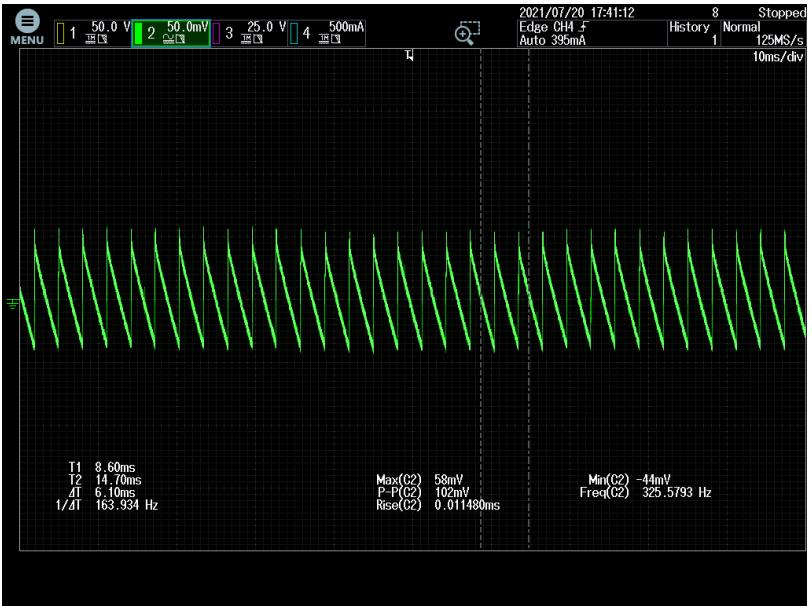

SC1145D

265 VAC  
  
Test Condition:  
➢ No Load

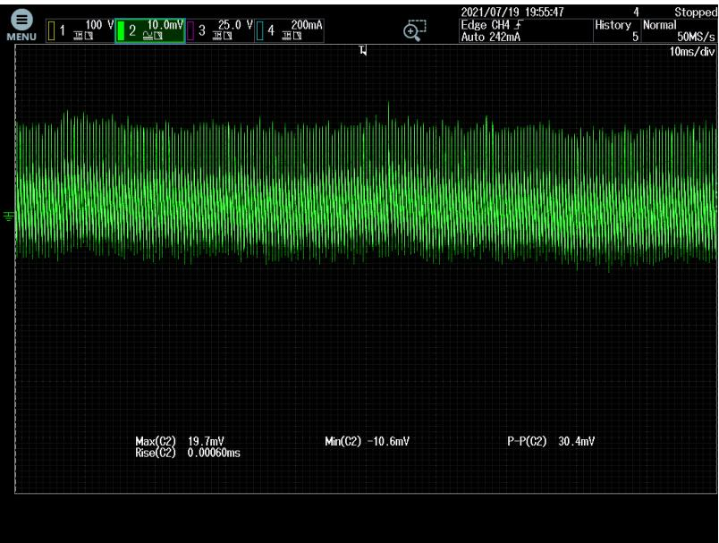

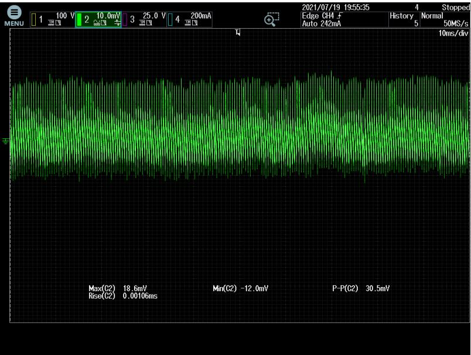

## BPA8506D

85 VAC  
  
Test Condition:  
➢ No Load

BPA8506D  
265 VAC  
  
Test Condition:  
➢ No Load

## 输出电压纹波

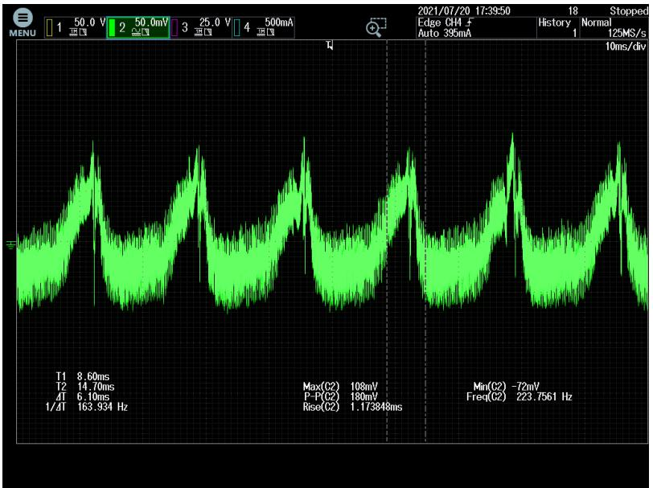

SC1145D

85 VAC  
  
Test Condition:  
➢ FULL Load

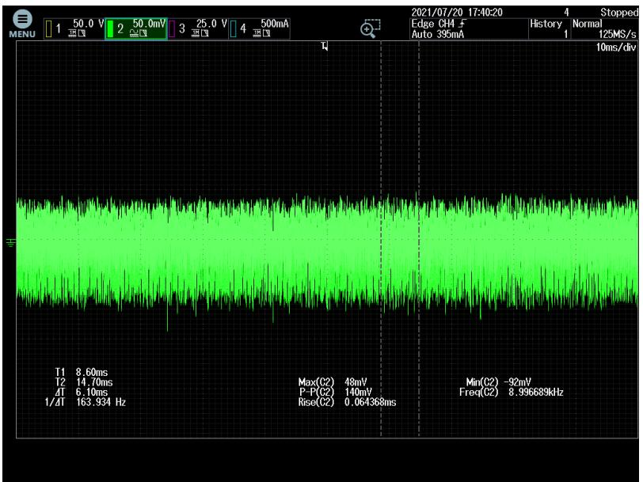

SC1145D

265 VAC  
  
Test Condition:  
➢ FULL Load

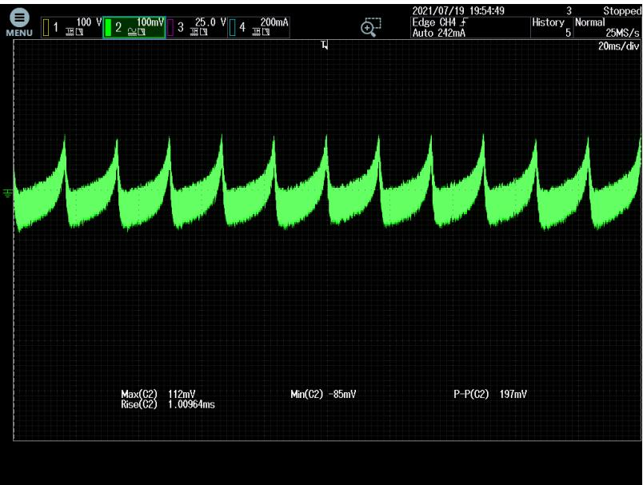

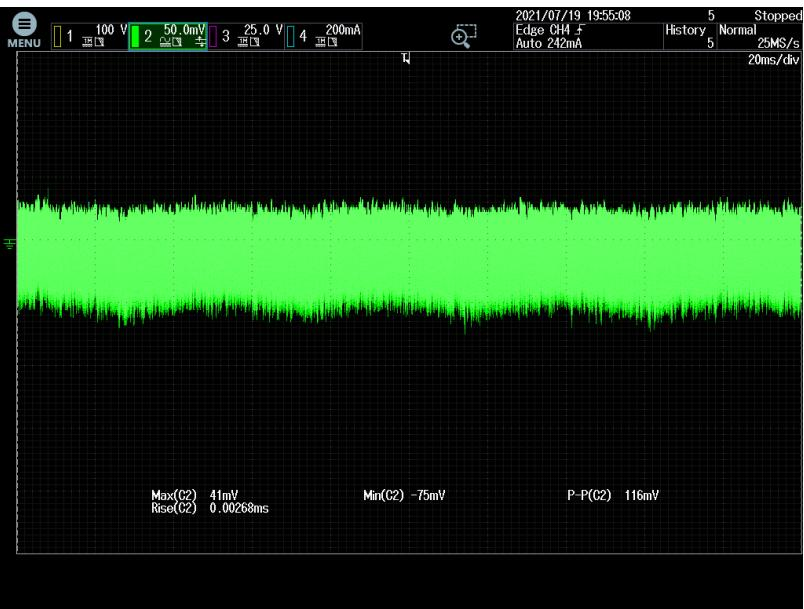

## BPA8506D

## 85 VAC

  
Test Condition:  
➢ FULL Load

## BPA8506D

265 VAC  
  
Test Condition:  
➢ FULL Load

## 动态负载(50%-100%)

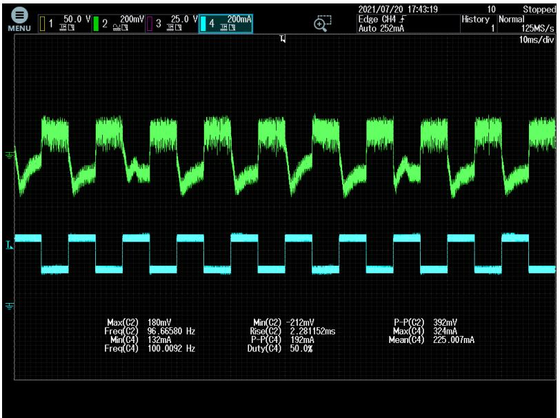

## SC1145D

## 85 VAC

CH2 V V =392mV  
CH4 ${ \mathsf I } _ { 0 \mathsf U \top }$

## Test Condition:

➢ CH4 0.15 A-0.3 A-0.15 A  
➢ Slew Rate: 0.5 A/μS  
➢ Frequency: 100 Hz

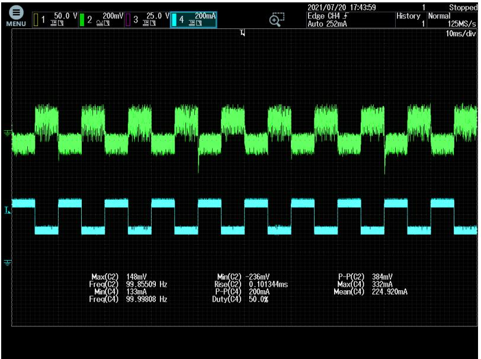

## SC1145D

## 265 VAC

CH2 V V =384mV  
CH4 $\mathsf { I } _ { 0 \mathsf { U T } }$

## Test Condition:

➢ CH4 0.15 A-0.3 A-0.15 A  
➢ Slew Rate: 0.5 A/μS  
➢ Frequency: 100 Hz

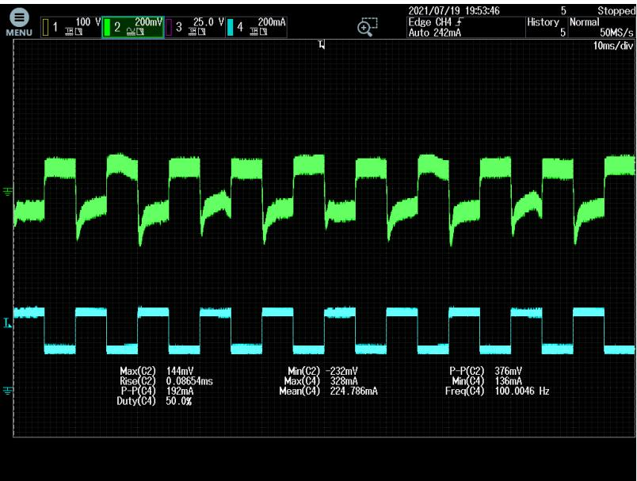

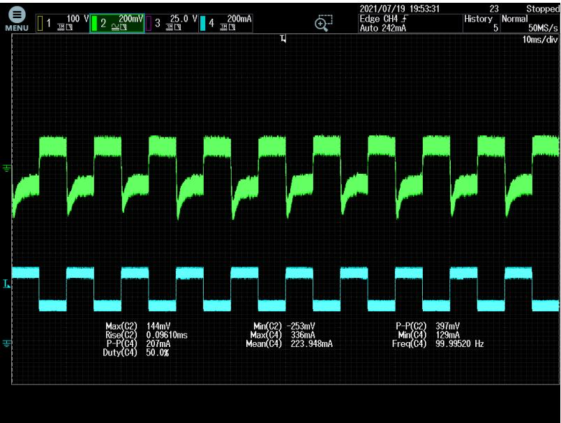

## BPA8506D

## 85 VAC

CH2 V VPK-PK=376mV  
CH4 $\mathsf { I } _ { 0 \mathsf { U T } }$

## Test Condition:

➢ CH4 0.15 A-0.3 A-0.15 A  
➢ Slew Rate: 0.5 A/μS  
➢ Frequency: 100 Hz

## BPA8506D

## 265 VAC

CH2 V VPK-PK=397mV  
CH4 $\mathsf { I } _ { 0 \mathsf { U T } }$

## Test Condition:

➢ CH4 0.15 A-0.3 A-0.15 A  
➢ Slew Rate: 0.5 A/μS  
➢ Frequency: 100 Hz

## 动态负载(10%-90%)

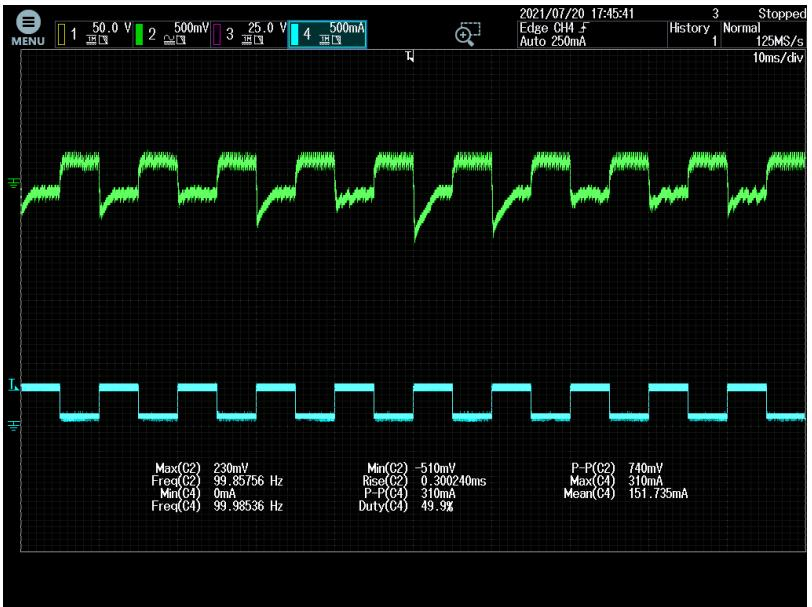

## SC1145D

## 85 VAC

CH2 $\mathsf { V } _ { \mathsf { O U T } }$ V =740mV  
CH4 ${ \mathsf I } _ { 0 \mathsf U \top }$

## Test Condition:

➢ CH4 0.03 A-0.27 A-0.03 A  
➢ Slew Rate: 0.5 A/μS  
➢ Frequency: 100 Hz

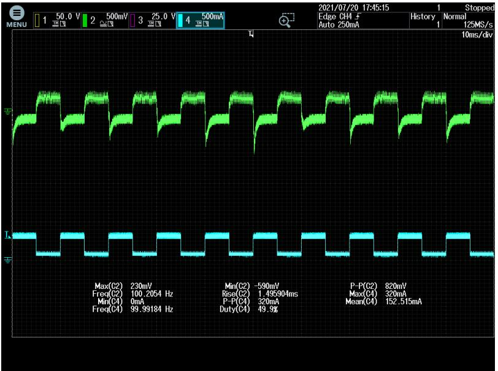

## SC1145D

## 265 VAC

CH2 $\mathsf { V } _ { \mathsf { O U T } }$ $\mathsf { V } _ { \mathsf { P K - P K } } { = } 8 2 0 \mathsf { m V }$  
CH4 $\mathsf { I } _ { 0 \mathsf { U T } }$

## Test Condition:

➢ CH4 0.03 A-0.27 A-0.03 A  
➢ Slew Rate: 0.5 A/μS  
➢ Frequency: 100 Hz

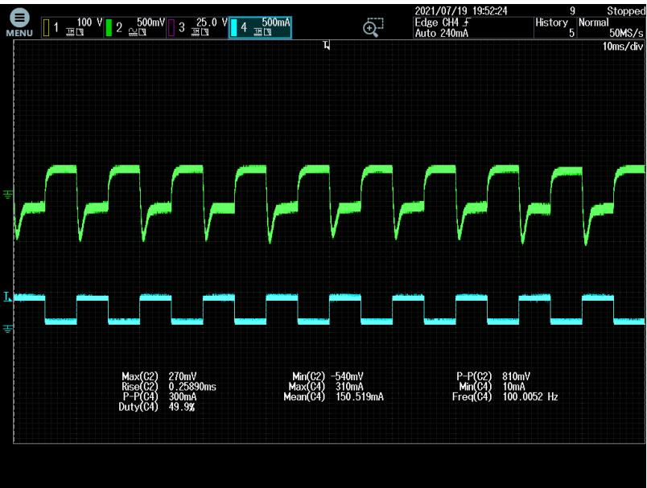

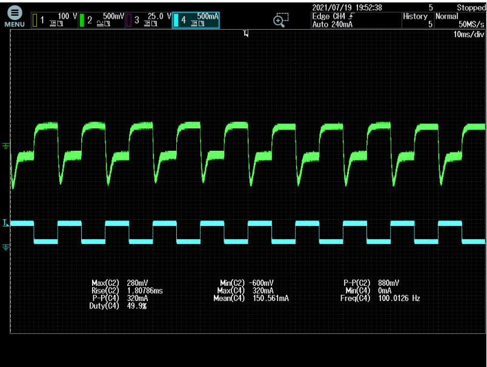

## BPA8506D

## 85 VAC

CH2 V $\mathsf { V } _ { \mathsf { P K - P K } } { = } 8 1 0 \mathsf { m V }$  
CH4 $\mathsf { I } _ { 0 \mathsf { U T } }$

## Test Condition:

➢ CH4 0.03 A-0.27 A-0.03 A  
➢ Slew Rate: 0.5 A/μS  
➢ Frequency: 100 Hz

## BPA8506D

## 265 VAC

CH2 V VPK-PK=880mV  
$\mathsf { C H 4 } \mathsf { I } _ { \mathsf { O U T } }$

## Test Condition:

➢ CH4 0.03 A-0.27 A-0.03 A  
➢ Slew Rate: 0.5 A/μS  
➢ Frequency: 100 Hz

## 输出电压启机波形

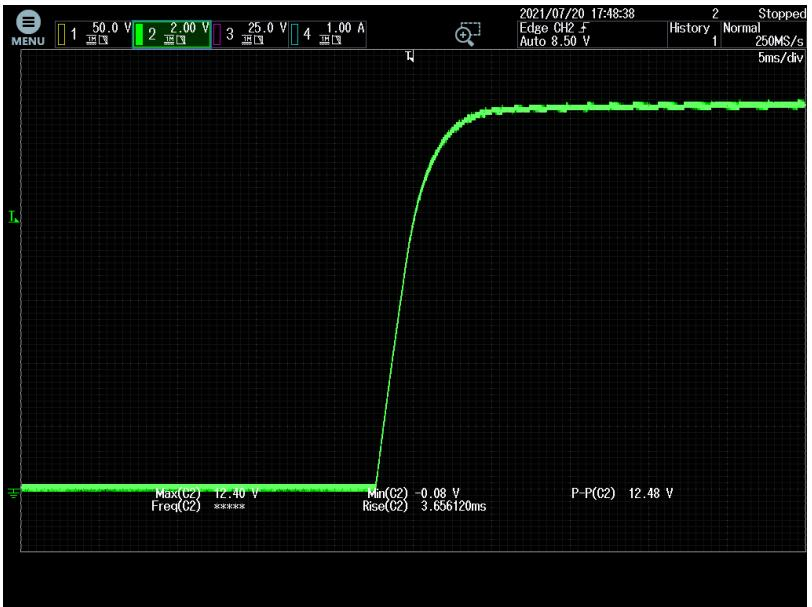

SC1145D

85 VAC  

Test Condition:  

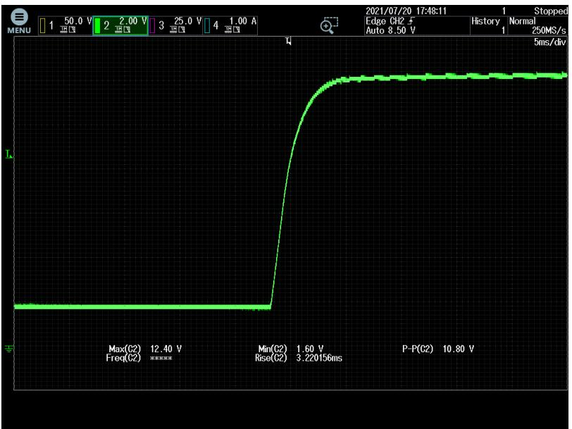

SC1145D

265 VAC  

Test Condition:  

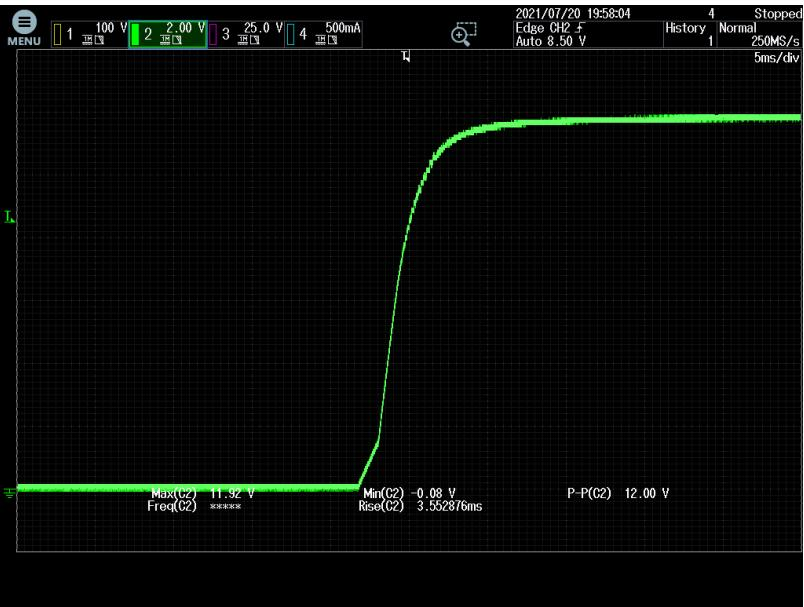

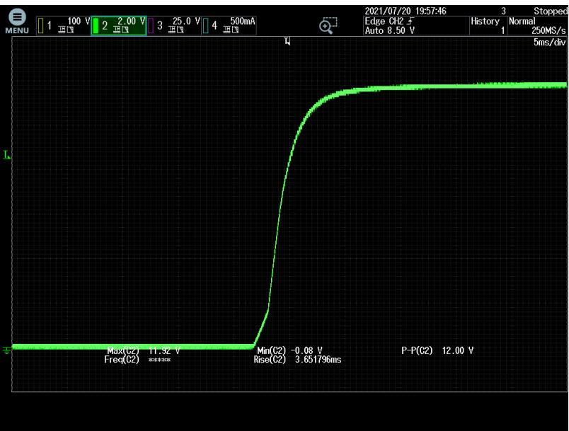

## BPA8506D

## 85 VAC

Test Condition:  

BPA8506D  
265 VAC  

Test Condition:  

## 输出电压启机波形

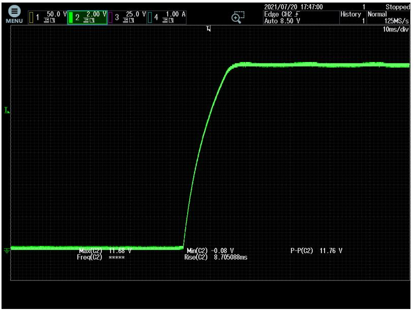

SC1145D

85 VAC  
  
Test Condition:  
➢ Full Load

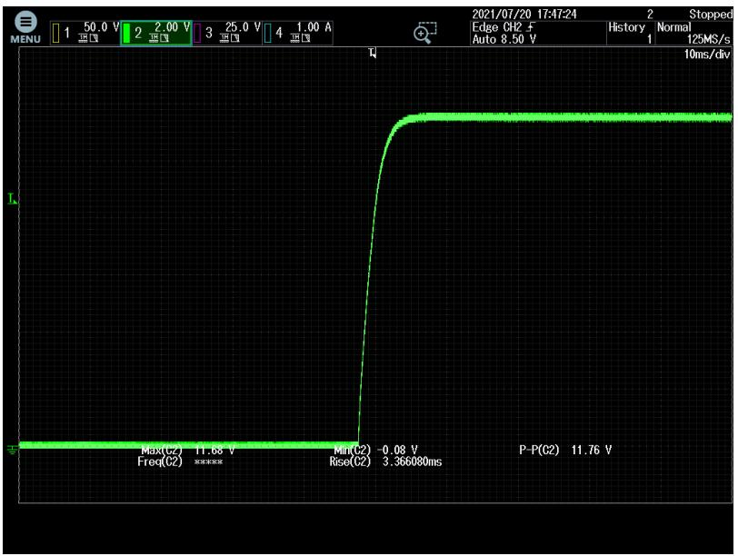

SC1145D

265 VAC  
  
Test Condition:  
➢ Full Load

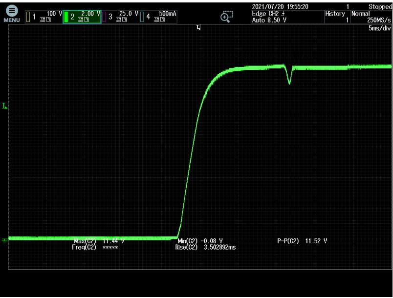

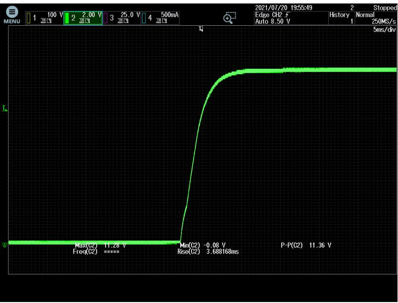

## BPA8506D

## 85 VAC

  
Test Condition:  
➢ Full Load

## BPA8506D

265 VAC  
  
Test Condition:  
➢ Full Load

## MOSFET启机电流波形--反馈二极管ES1J

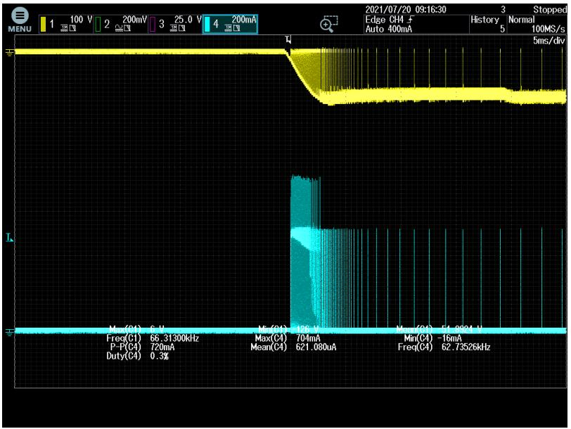

SC1145D  
85 VAC

CH1 VDS  
CH4 IDS

$$
\begin{array}{l} \mathrm {V_ {DS\_MAX}} = 1 2 6 \mathrm{V} \\ \mathrm {I_ {DS\_MAX}} = 0. 7 0 4 \mathrm{A} \end{array}
$$

Test Condition:  
➢ No Load  
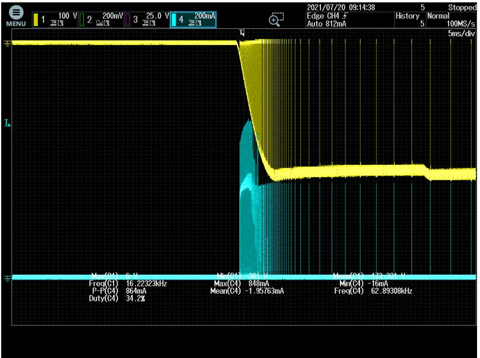

SC1145D  
265 VAC

CH1 VDS  
CH4 IDS

$$
\begin{array}{l} \mathrm {V_ {DS\_MAX}} = 3 8 1 \mathrm{V} \\ \mathrm {I_ {DS\_MAX}} = 0. 8 4 8 \mathrm{A} \end{array}
$$

Test Condition:  
➢ No Load  
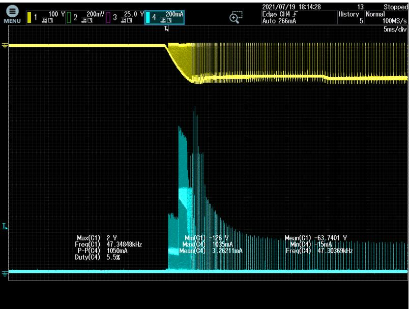

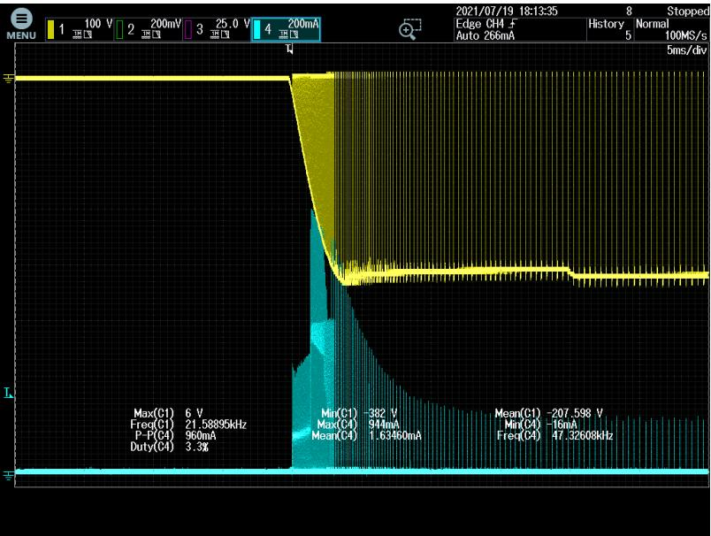

Test Condition:  
➢ No Load

## BPA8506D

## 85 VAC

CH1 VDS  
CH4 IDS

$$
\begin{array}{l} \mathrm {V_ {DS\_MAX}} = 1 2 6 \mathrm{V} \\ \mathrm {I_ {DS\_MAX}} = 1. 0 3 5 \mathrm{A} \end{array}
$$

## BPA8506D

## 265 VAC

CH1 VDS  
CH4 IDS

$$
V _ {D S \_ M A X} = 3 8 2 V
$$

$$
I _ {D S \_ M A X} = 0. 9 4 4 A
$$

Test Condition:

➢ No Load

## MOSFET启机电流波形--反馈二极管ES1J

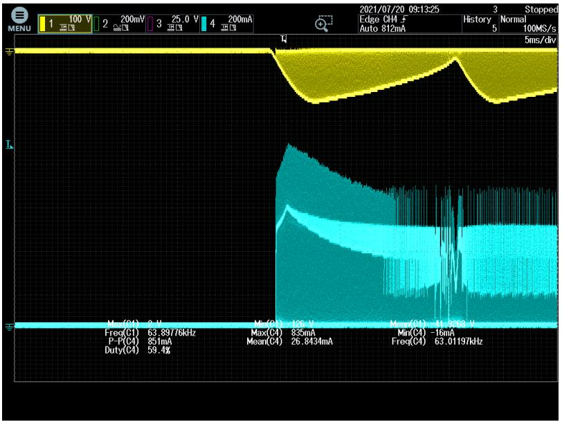

SC1145D  
85 VAC

CH1 VDS  
CH4 IDS

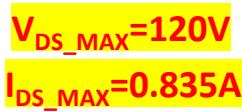  
Test Condition:

➢ Full Load  
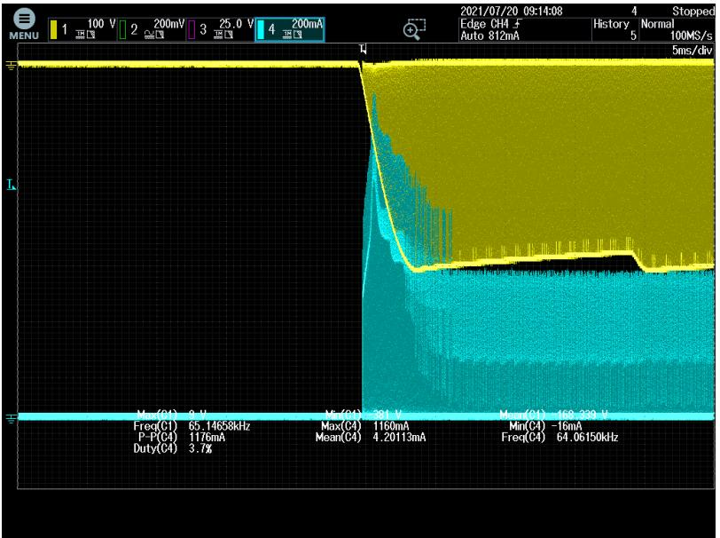

SC1145D  
265 VAC

CH1 VDS  
CH4 IDS

  
Test Condition:  
➢ Full Load

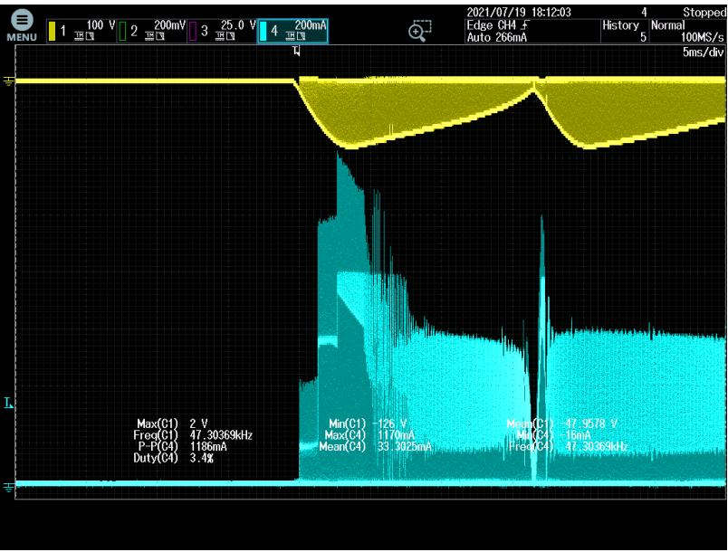

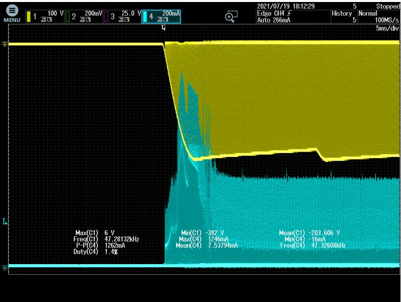

Test Condition:  
➢ Full Load

## BPA8506D

## 85 VAC

CH1 VDS  
CH4 IDS

$$
V _ {D S \_ M A X} = 1 2 6 V
$$

$$
I _ {D S \_ M A X} = 1. 1 7 A
$$

## BPA8506D

## 265 VAC

CH1 VDS  
CH4 IDS

$$
V _ {D S \_ M A X} = 3 8 2 V
$$

$$
I _ {D S \_ M A X} = 1. 2 4 6 A
$$

Test Condition:

➢ Full Load

## MOSFET稳态波形

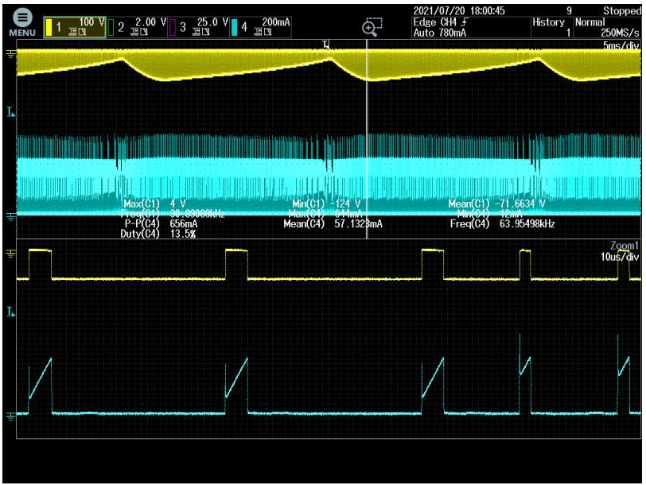

SC1145D

85 VAC  
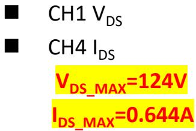

Test Condition:

➢ Full Load

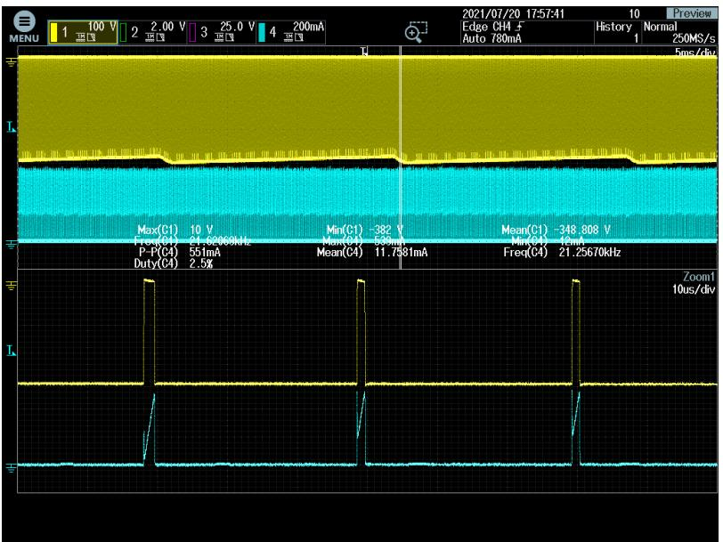

SC1145D

265 VAC  
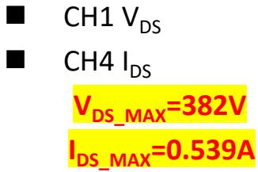

Test Condition:

➢ Full Load

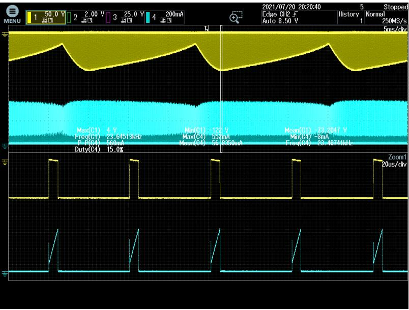

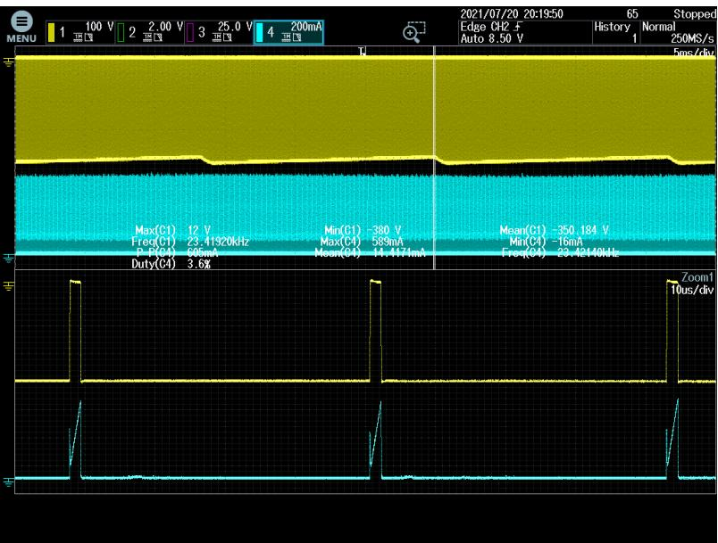

## BPA8506D

## 85 VAC

CH1 VDS  
CH4 IDS

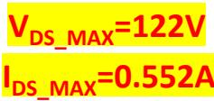  
Test Condition:

➢ Full Load

## BPA8506D

265 VAC

CH1 VDS  
CH4 IDS

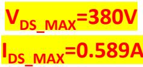  
Test Condition:

➢ Full Load

## 电感启机电流波形

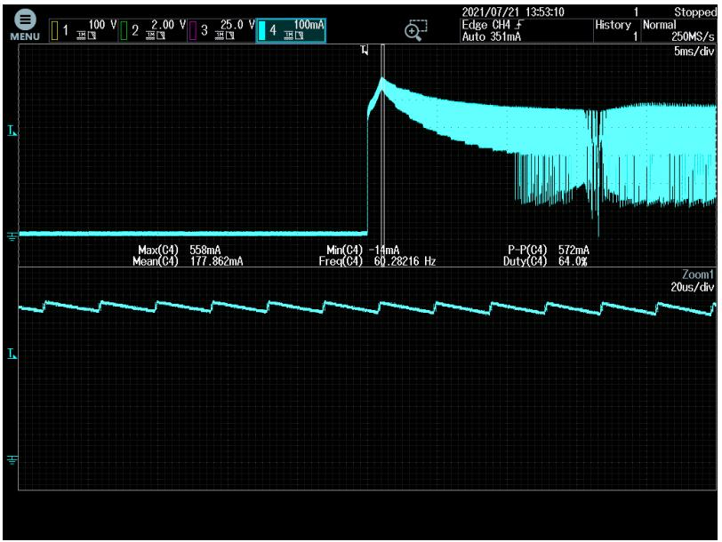

SC1145D

85 VAC  
  
Test Condition:

➢ Full Load


SC1145D

265 VAC  
  
Test Condition:

➢ Full Load


## BPA8506D

## 85 VAC

  
Test Condition:

➢ Full Load

## BPA8506D

265 VAC  
  
Test Condition:

➢ Full Load

## 电感稳态电流波形


SC1145D

85 VAC  
  
Test Condition:  
➢ Full Load


SC1145D

265 VAC  
  
Test Condition:  
➢ Full Load


## BPA8506D

## 85 VAC

  
Test Condition:  
➢ Full Load

## BPA8506D

265 VAC  
  
Test Condition:  
➢ Full Load

## MOSFET启机电流波形(煲机1H测试结果)


SC1145D

85 VAC  
  
Test Condition:  
➢ Full Load


SC1145D

265 VAC  
  
Test Condition:  
➢ Full Load


BPA8506D

85 VAC  
  
Test Condition:  
➢ Full Load


BPA8506D

265 VAC  
  
Test Condition:  
➢ Full Load

## 短路保护（MOSFET电压电流波形）


SC1145D  
85 VAC

CH1 VDS  
CH4 IDS

$$
\begin{array}{l} \mathrm {V_ {DS\_MAX}} = 1 2 4 \mathrm{V} \\ \mathrm {I_ {DS\_MAX}} = 1. 1 3 \mathrm{A} \end{array}
$$

## Test Condition:

➢ Output Short


SC1145D  
265 VAC

CH1 VDS  
CH4 IDS

$$
V _ {D S \_ M A X} = 3 8 0 V
$$

$$
I _ {D S \_ M A X} = 1. 6 5 \mathrm{A}
$$

## Test Condition:

➢ Output Short


## BPA8506D

## 85 VAC

CH1 VDS  
CH4 IDS

$$
\begin{array}{l} \mathrm {V_ {DS\_MAX}} = 1 2 4 \mathrm{V} \\ \mathrm {I_ {DS\_MAX}} = 1. 2 5 \mathrm{A} \end{array}
$$

## Test Condition:

➢ Output Short

## BPA8506D

265 VAC

CH1 VDS  
CH4 IDS

$$
\begin{array}{l} V _ {D S \_ M A X} = 3 8 0 V \\ I _ {D S \_ M A X} = 1. 4 4 A \end{array}
$$

## Test Condition:

➢ Output Short


SC1145D


SC1145D


温度测试（12V/0.3A）

<table><tr><td rowspan="2">项目</td><td colspan="2">85VAC</td><td colspan="2">265VAC</td></tr><tr><td>温度</td><td>温升</td><td>温度</td><td>温升</td></tr><tr><td>环境温度</td><td colspan="2">29.3</td><td colspan="2">29.6</td></tr><tr><td>SC1145D</td><td>61.3</td><td>32</td><td>64</td><td>34.4</td></tr><tr><td>D5续流二极管</td><td>62</td><td>32.7</td><td>66.4</td><td>36.8</td></tr><tr><td>反馈二极管</td><td>44</td><td>14.7</td><td>45.3</td><td>15.7</td></tr><tr><td>功率工字电感</td><td>53.7</td><td>24.4</td><td>58.3</td><td>28.7</td></tr></table>

<table><tr><td rowspan="2">项目</td><td colspan="2">85VAC</td><td colspan="2">265VAC</td></tr><tr><td>温度</td><td>温升</td><td>温度</td><td>温升</td></tr><tr><td>环境温度</td><td colspan="2">29</td><td colspan="2">28.4</td></tr><tr><td>BPA8506D</td><td>60.8</td><td>31.8</td><td>66.9</td><td>38.5</td></tr><tr><td>D5续流二极管</td><td>60.9</td><td>31.9</td><td>64.9</td><td>36.5</td></tr><tr><td>反馈二极管</td><td>43.6</td><td>14.6</td><td>45.3</td><td>16.9</td></tr><tr><td>功率工字电感</td><td>53.3</td><td>24.3</td><td>57.4</td><td>29</td></tr></table>

## 测试说明

➢常温下密闭纸箱中进行测试；  
➢电路板放在一个封闭的盒子内；  
➢热电偶连接到各个测量点；  
➢等测量点温度达到稳定后记录数据；


## 测试数据对比总结

<table><tr><td colspan="2"></td><td>SC1145D</td><td>BPA8506D</td><td></td></tr><tr><td colspan="2">待机功耗@230Vac</td><td>156mW</td><td>146mW</td><td>自供电</td></tr><tr><td>效率</td><td>230Vac</td><td>75%</td><td>75.8%</td><td>平均效率</td></tr><tr><td rowspan="2">输出电压纹波</td><td>85Vac</td><td>180mV</td><td>197mV</td><td rowspan="2">12V0.3A满载</td></tr><tr><td>265Vac</td><td>140mV</td><td>116mV</td></tr><tr><td rowspan="4">动态负载性能</td><td rowspan="2">50%-100%</td><td> $392mV_{PK\_PK}$ </td><td> $376mV_{PK\_PK}$ </td><td>@85Vac</td></tr><tr><td> $384mV_{PK\_PK}$ </td><td> $397mV_{PK\_PK}$ </td><td>@265Vac</td></tr><tr><td rowspan="2">10%-90%</td><td> $740mV_{PK\_PK}$ </td><td> $810mV_{PK\_PK}$ </td><td>@85Vac</td></tr><tr><td> $820mV_{PK\_PK}$ </td><td> $880mV_{PK\_PK}$ </td><td>@265Vac</td></tr><tr><td rowspan="2">MOSFET应力</td><td> $V_{DS}$ </td><td>381V</td><td>382V</td><td>@265Vac,满载</td></tr><tr><td> $I_{DS}$ </td><td>1.16A</td><td>1.24A</td><td>@265Vac,满载</td></tr><tr><td>温升</td><td>最大值</td><td>小于40°</td><td>小于40°</td><td></td></tr></table>

电源规格：85\~265Vac输入，12V/0.3A输出；

❑ 原有设计SC1145D在265VAC输入启机时刻，MOSFET的IDS电流峰值为1.68A，稍微偏大，更换BPA8506D后IDS电流峰值达2.42A，有安全隐患（原因是BPA8506限流点更大，MOSFET开关速度更快），建议更换D4反馈二极管M7为ES1J ：

➢ 更换ES1J后， BPA8506D 启机时刻IDS电流峰值降低为1.246A，低于原设计的1.68A；

❑ 265VAC输入时，带载启机时刻，SC1145D和BPA8506D电源都出现电感饱和现象。29°环温老化1H，电感稳态未见明显饱和现象；

➢ 建议更换饱和偏置电流大于770mA的功率电感（需要供应商提供饱和偏置电流数据） ；

❑ 电源待机功耗、效率、纹波幅值、动态纹波幅值等性能基本一致，如满足贵司要求，其余元件可以不用调整；

## THANK YOU FOR WATCHING
