## BPA8506D隔离参考设计

## (18V0.4A 5V0.5A)

上海晶丰明源半导体股份有限公司

Shanghai Bright Power Semiconductor Co., Ltd.

梁 惠

时间： 2022年6月

## 内容

BPA8506D简介  
电源规格  
电路及实物图  
BOM  
PCB Layout图  
变压器  
性能测试数据

## 产品特点：

➢ 集成 650V 高压 MOSFET  
➢ 集成高压启动、自供电电路  
➢ 低待机功耗  
➢ 内置软启动  
➢ 优异的动态响应速度，输出电压纹波小

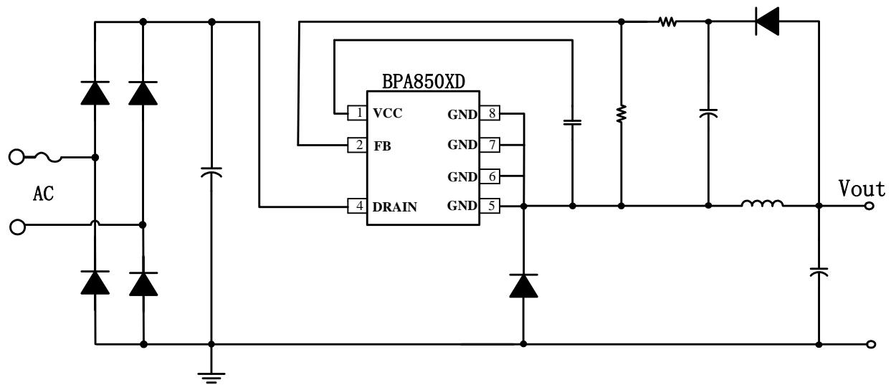

## 应用领域：

➢ 家用电器辅助电源  
➢ 电机驱动辅助电源  
➢ IOT/智能家居/智能照明  
➢ 工业控制辅助电源

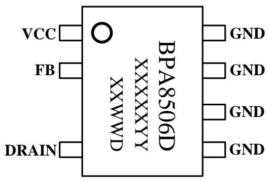

SOP7

<table><tr><td>项目描述</td><td>符号</td><td>最小</td><td>典型</td><td>最大</td><td>单位</td><td>备注</td></tr><tr><td colspan="7">输入</td></tr><tr><td>电压</td><td> $V_{IN}$ </td><td>90</td><td>115/230</td><td>264</td><td> $V_{AC}$ </td><td></td></tr><tr><td>频率</td><td> $f_{LINE}$ </td><td>47</td><td>50/60</td><td>63</td><td>Hz</td><td></td></tr><tr><td colspan="7">输出</td></tr><tr><td>输出电压1</td><td> $V_{OUT1}$ </td><td>17.1</td><td>18</td><td>18.9</td><td>V</td><td>±7%</td></tr><tr><td>输出电流1</td><td> $I_{OUT1}$ </td><td>0</td><td>400</td><td></td><td>mA</td><td></td></tr><tr><td>输出电压2</td><td> $V_{OUT2}$ </td><td>4.75</td><td>5</td><td>5.25</td><td>V</td><td>±5%</td></tr><tr><td>输出电流2</td><td> $I_{OUT2}$ </td><td>0</td><td>500</td><td></td><td>mA</td><td></td></tr><tr><td>输出电压纹波1</td><td> $V_{RIPPLE}$ </td><td></td><td></td><td>150</td><td>mV</td><td>20MHz带宽</td></tr><tr><td>输出电压纹波2</td><td> $V_{RIPPLE}$ </td><td></td><td></td><td>80</td><td>mV</td><td>20MHz带宽</td></tr><tr><td>连续输出功率</td><td> $P_{OUT}$ </td><td></td><td>9.7</td><td></td><td>W</td><td></td></tr><tr><td colspan="7">效率</td></tr><tr><td>待机功耗</td><td> $P_{STDBY}$ </td><td></td><td></td><td>170</td><td>mW</td><td>230VAC,包含假负载</td></tr><tr><td>满载效率</td><td>η</td><td></td><td></td><td>80.3</td><td>%</td><td></td></tr><tr><td colspan="7">环境</td></tr><tr><td>传导EMI</td><td></td><td colspan="4">满足CISPR22/EN55022 Class B,至少6dB 裕量</td><td></td></tr><tr><td>Surge</td><td></td><td></td><td>2</td><td></td><td>kV</td><td>差模</td></tr><tr><td>EFT</td><td></td><td></td><td>4</td><td></td><td>kV</td><td>5kHz/100kHz/38kHz</td></tr><tr><td>ESD</td><td></td><td></td><td>15</td><td>20</td><td>kV</td><td>空气放电</td></tr><tr><td>工作环境温度</td><td> $T_{AMP}$ </td><td>0</td><td></td><td>50</td><td>°C</td><td></td></tr></table>

## 电路及实物图

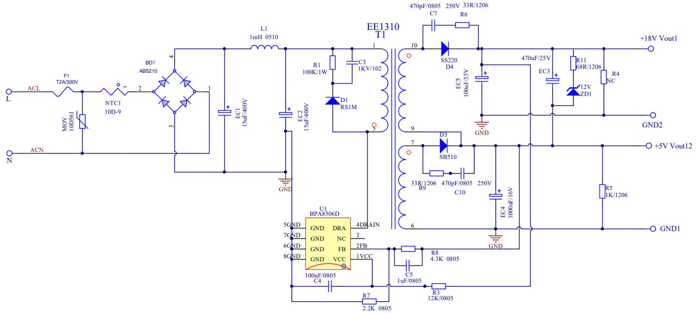

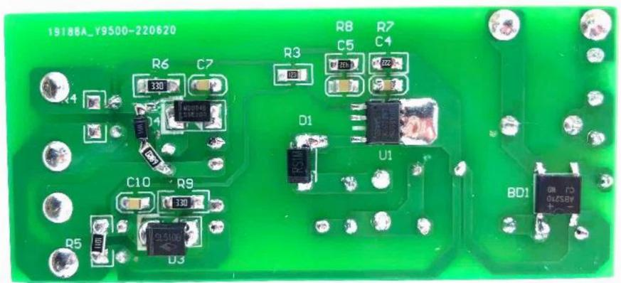

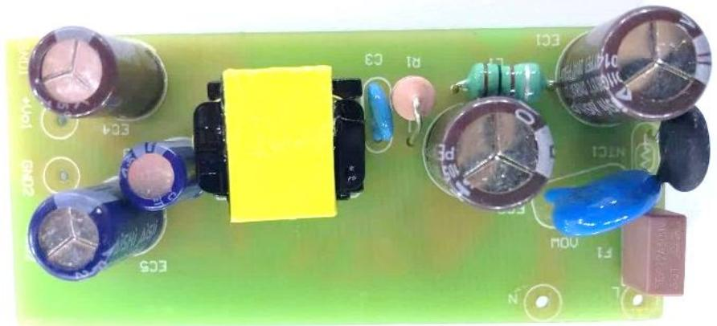

<table><tr><td>序号</td><td>元件标号</td><td>参数描述</td><td>封装尺寸</td><td>数量</td></tr><tr><td>1</td><td>PCB</td><td>CEM-1, 单面板</td><td>71.3mm*32.1mm</td><td>1</td></tr><tr><td>2</td><td>BD1</td><td>ABS210</td><td>SMD</td><td>1</td></tr><tr><td>3</td><td>C3</td><td>1nF/1KV</td><td>DIP</td><td>1</td></tr><tr><td>4</td><td>C7, C10</td><td>470pF/250V</td><td>SMD0805</td><td>2</td></tr><tr><td>5</td><td>C5</td><td>1uF</td><td>SMD0805</td><td>1</td></tr><tr><td>6</td><td>C4</td><td>100nF</td><td>SMD0805</td><td>1</td></tr><tr><td>7</td><td>NTC1</td><td>10D-9</td><td>DIP</td><td>1</td></tr><tr><td>8</td><td>MOV</td><td>10D561</td><td>DIP</td><td>1</td></tr><tr><td>9</td><td>T1</td><td>EE1310 950uH</td><td>DIP</td><td>1</td></tr><tr><td>10</td><td>R1</td><td>100K 1W</td><td>DIP</td><td>1</td></tr><tr><td>11</td><td>D1</td><td>RS1M</td><td>SMA</td><td>1</td></tr><tr><td>12</td><td>EC1、EC2</td><td>15uF 400V</td><td>ø5*10</td><td>2</td></tr><tr><td>13</td><td>D4</td><td>SS220</td><td>SMA</td><td>1</td></tr><tr><td>14</td><td>D3</td><td>SS510</td><td>SMB</td><td>1</td></tr><tr><td>15</td><td>U1</td><td>BPA8506D</td><td>SOP7</td><td>1</td></tr></table>

<table><tr><td>序号</td><td>元件标号</td><td>参数描述</td><td>封装尺寸</td><td>数量</td></tr><tr><td>16</td><td>R7</td><td>2.2K</td><td>SMD0805</td><td>1</td></tr><tr><td>17</td><td>R6、R9</td><td>33R</td><td>SMD1206</td><td>2</td></tr><tr><td>18</td><td>R8</td><td>4.3K</td><td>SMD0805</td><td>1</td></tr><tr><td>19</td><td>R3</td><td>12K</td><td>SMD0805</td><td>1</td></tr><tr><td>20</td><td>R5</td><td>1K</td><td>SMD1206</td><td>1</td></tr><tr><td>21</td><td>EC5</td><td>100uF 35V</td><td> $\phi 3.5*8.5$ </td><td>1</td></tr><tr><td>22</td><td>EC3</td><td>470uF 25V</td><td> $\phi 2.5*6.5$ </td><td>1</td></tr><tr><td>23</td><td>EC4</td><td>1000uF 16V</td><td> $\phi 3.5*8.5$ </td><td>1</td></tr><tr><td>24</td><td>R4</td><td>NC</td><td>NC</td><td>1</td></tr><tr><td>25</td><td>R11</td><td>68R</td><td>SMD1206</td><td>1</td></tr><tr><td>26</td><td>ZD1</td><td>12V</td><td>SOD-123</td><td>1</td></tr><tr><td>27</td><td colspan="3">总和</td><td>29</td></tr></table>

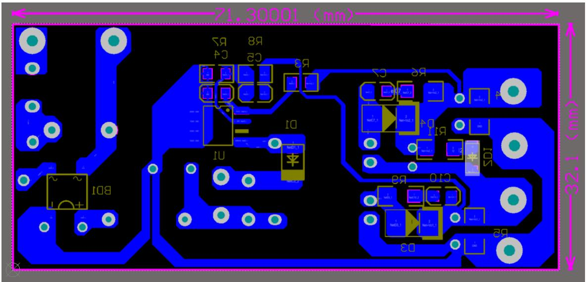

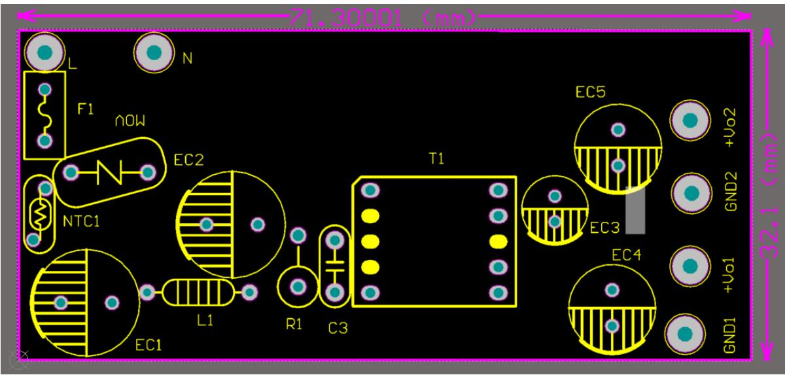

## 原理图

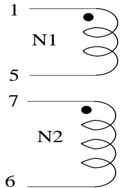

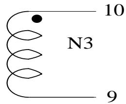

## 绕线方式

<table><tr><td>绕组</td><td>起始脚</td><td>终止脚</td><td>材料</td><td>匝数</td><td>绕线方式</td></tr><tr><td>N1</td><td>1</td><td>5</td><td> $\phi 0.23*1P$ </td><td>85Ts</td><td>密绕三层(PIN脚朝外)</td></tr><tr><td colspan="4">胶带</td><td>2.1Ts</td><td></td></tr><tr><td>N2</td><td>7</td><td>6</td><td> $\phi 0.35*2P$ </td><td>7Ts</td><td>密绕一层(PIN脚朝外)</td></tr><tr><td colspan="4">胶带</td><td>2.1Ts</td><td></td></tr><tr><td>N3</td><td>10</td><td>9</td><td> $\phi 0.35*1P$ </td><td>17Ts</td><td>密绕一层(PIN脚朝外)</td></tr><tr><td colspan="4">胶带</td><td>3Ts</td><td></td></tr></table>

## 规格与材料

➢ 初级绕组感量 $\mathsf { L } _ { \mathsf { p } } { = } 9 5 0 \mathsf { u } \mathsf { H } { \pm } 7 \%$ （测试条件： 0.3V，100kHz）  
➢ 漏感量 $\mathrm { \cdot L _ { \vert k } } < 3 0 \mathrm { u } \mathrm { H }$  
➢ 骨架：EE1310（5+5PIN）  
➢ 磁芯： EE1310 PC40 或同等材质 ， $\mathsf { A e } = 3 1 . 6 \mathsf { m m } ^ { 2 }$  
➢ N1、N2、N3、: 2UEW 漆包线  
➢ 绝缘胶带:3M900 或同等材质  
➢ 耐压测试:  
➢ 成品要求：浸凡立水

## 脚位图

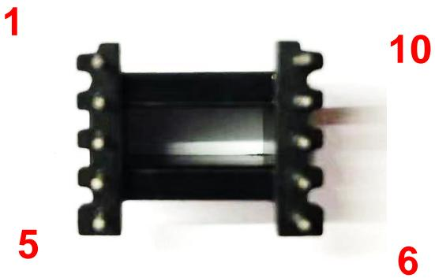

待机功耗（包含25mW假负载）  
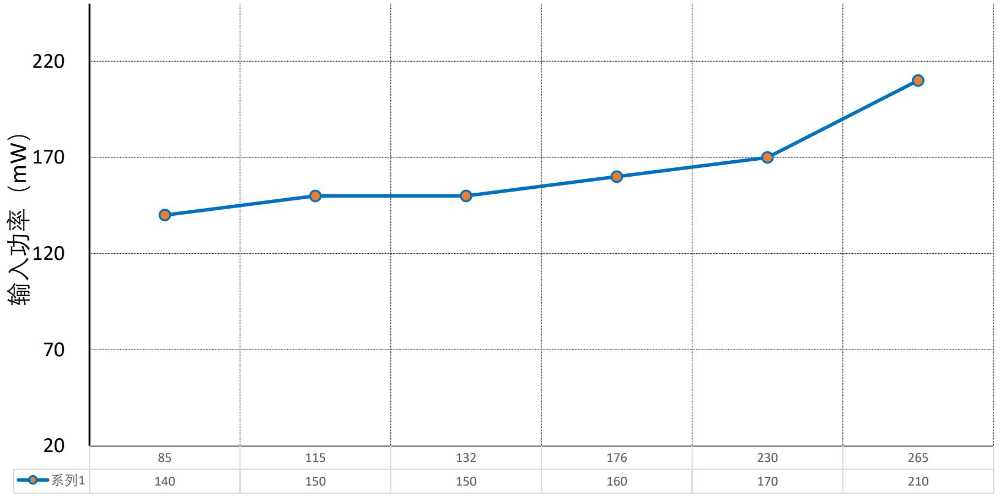

输入电压(VAC)

效率测试  
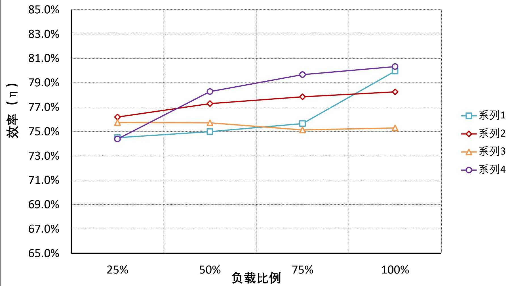

## 输出电压交叉调整率

<table><tr><td>输入电压AC (V)</td><td>输出电流1(A)</td><td>输出电压1(V)</td><td>输出电流2(A)</td><td>输出电压2(V)</td></tr><tr><td rowspan="2">115</td><td>0</td><td>19.25</td><td>0.5</td><td>5.07</td></tr><tr><td>0.4</td><td>17.85</td><td>0</td><td>5.12</td></tr><tr><td rowspan="2">230</td><td>0</td><td>19.34</td><td>0.5</td><td>5.07</td></tr><tr><td>0.4</td><td>17.89</td><td>0</td><td>5.12</td></tr></table>

## 输出电压纹波

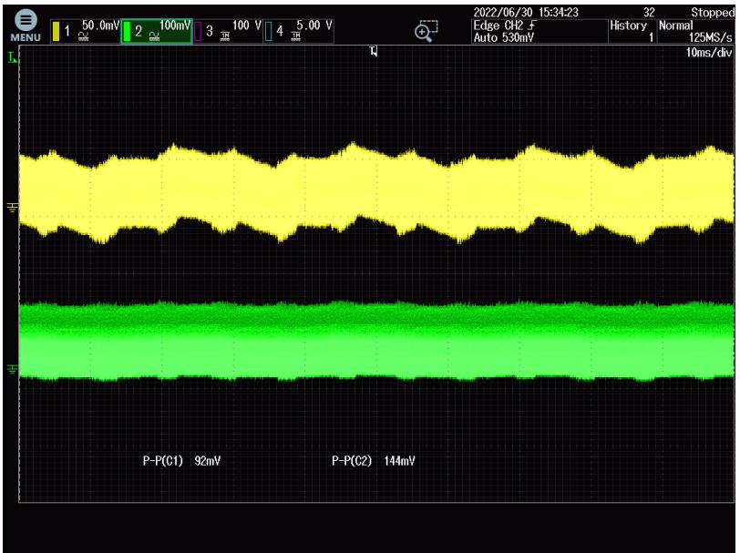

85 $\mathsf { \Delta } \mathsf { v } _ { \mathsf { A C } }$

CH1 $\mathsf { V } _ { \mathsf { O U T } } \mathsf { R i p p l e }$ $\mathbf { V } _ { \mathsf { P K - P K } } { = } 9 2 \mathsf { m } \mathbf { V }$  
CH2 $\mathsf { V } _ { \mathsf { O U T } } \mathsf { R i p p l e }$ $\mathsf { V } _ { \mathsf { P K - P K } = } \pm 1 1 4 \mathsf { m V }$

Test Condition:  
➢ Full Load  
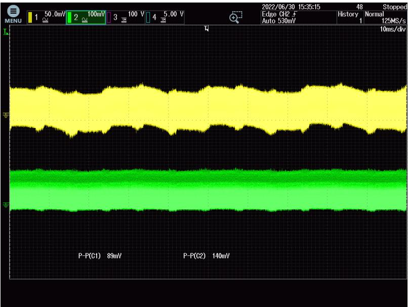

115 VAC

CH1 $\mathsf { V } _ { \mathsf { O U T } }$ Ripple $\mathbf { V } _ { \mathsf { P K - P K } } { = } 8 9 \mathsf { m V }$  
CH2 $\mathsf { V } _ { \mathsf { O U T } }$ Ripple $\mathsf { V } _ { \mathsf { P K - P K } } { = } \mathsf { 1 } 4 0 \mathsf { m V }$

Test Condition:  
➢ Full Load  
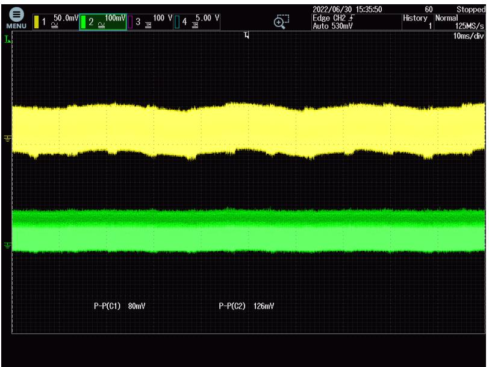

230 VAC

CH1 $\mathsf { V } _ { \mathsf { O U T } } \mathsf { R i p p l e }$ $\mathtt { V } _ { \mathtt { P K - P K } } { = } 8 0 \mathsf { m V }$  
CH2 $\mathsf { V } _ { \mathsf { O U T } }$ Ripple $\mathsf { V } _ { \mathsf { P K - P K } = } \mathsf { 1 } 2 6 \mathsf { m } \mathsf { v }$

Test Condition:  
➢ Full Load  
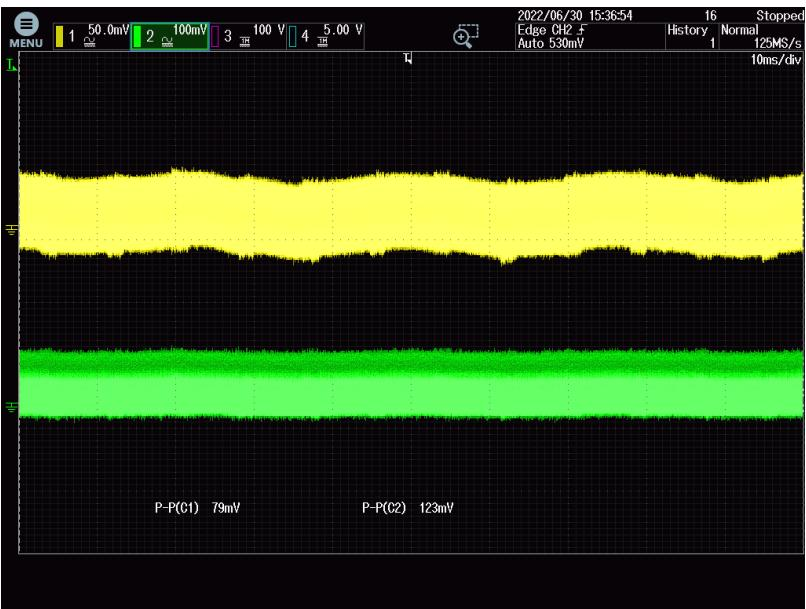

265 $\mathsf { v } _ { \mathsf { A C } }$

CH1 $\mathsf { V } _ { \mathsf { O U T } }$ Ripple $\mathbf { V } _ { \mathsf { P K - P K } } { = } 7 9 \mathsf { m V }$  
$\mathsf { C H } 2 \mathsf { V } _ { \mathsf { O U T } } \mathsf { R i p p l e }$ $\mathsf { V } _ { \mathsf { P K - P K } } { = } \pm 2 3 \mathsf { m V }$

Test Condition:

➢ Full Load

## 动态负载(50%-100%)

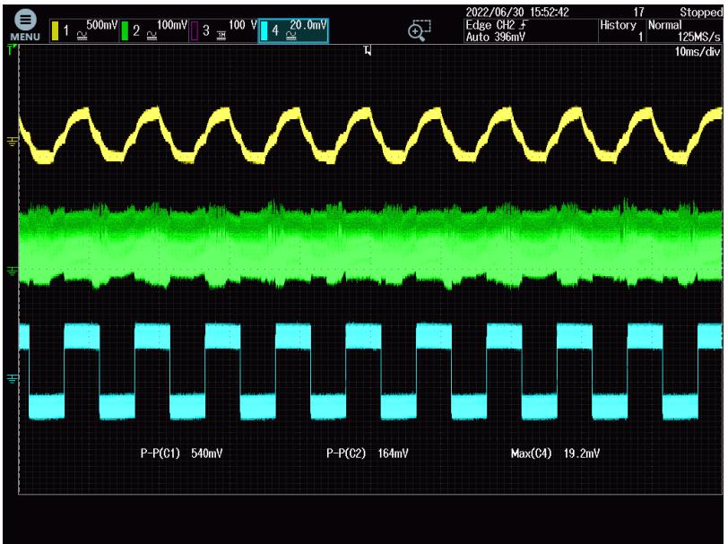

85VAC

${ \mathsf { C H 1 } } { \mathsf { V } } _ { \mathsf { O U T } }$ CH1 VOUT $V _ { \mathsf { P K - P K } } { = } 5 4 0 ~ \mathsf { m V }$  
CH2 VOUT ${ \mathsf { C H } } 2 { \mathsf { V } } _ { \mathsf { O U T } }$ VPK-PK=164mV $\mathsf { V } _ { \mathsf { P K - P K } } { = } 1 6 4 \mathsf { m V }$

## Test Condition:

➢ $0 . 2 \ A { - } 0 . 4 \ A { - } 0 . 2 \ A$  
➢ $0 . 2 5 \mathsf { A } \mathsf { - } 0 . 5 \mathsf { A } \mathsf { - } 0 . 2 5 \mathsf { A }$  
➢ Slew Rate: 0.5 A/μS  
➢ Frequency: 100 Hz

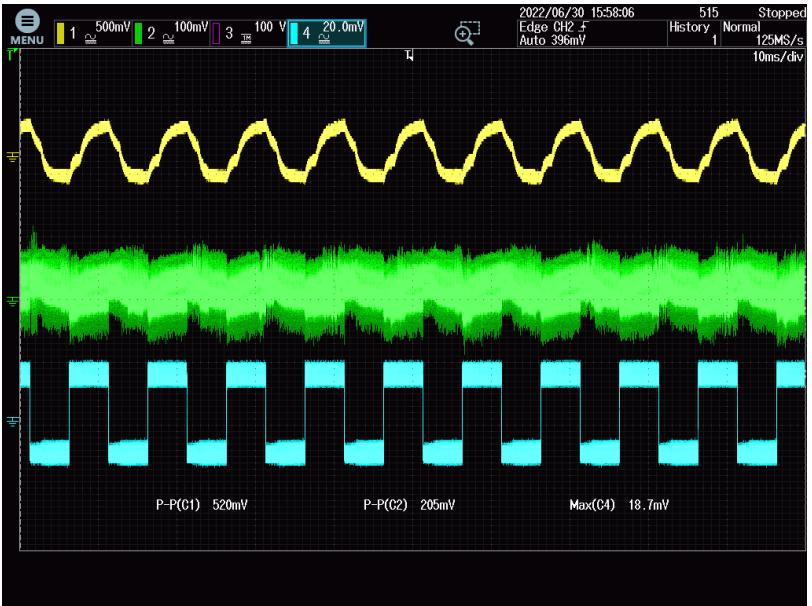

230 VAC

CH1 VOUT ${ \mathsf { C H 1 } } { \mathsf { V } } _ { \mathsf { O U T } }$ $v _ { p _ { \mathrm { K - P K } } } { = } 5 2 0 ~ \mathsf { m V }$  
CH2 VOUT ${ \mathsf { C H } } 2 { \mathsf { V } } _ { \mathsf { O U T } }$ VPK-PK=205mV $\mathsf { V } _ { \mathsf { P K - P K } } { = } 2 0 5 \mathsf { m V }$

## Test Condition:

➢ 0.2A-0.4A-0.2A  
➢ 0.25 A-0.5 A-0.25 A  
➢ Slew Rate: 0.5 A/μS  
➢ Frequency: 100 Hz

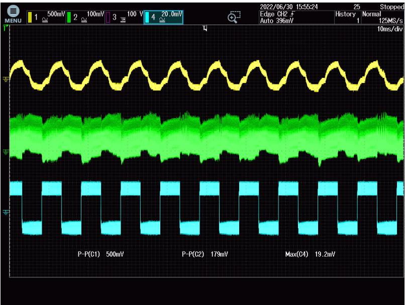

115 VAC

CH1 VOUT ${ \mathsf { C H 1 } } { \mathsf { V } } _ { \mathsf { O U T } }$ $v _ { p _ { \mathrm { K - P K } } } { = } 5 0 0 ~ \mathsf { m V }$  
CH2 VOUT ${ \mathsf { C H } } 2 { \mathsf { V } } _ { \mathsf { O U T } }$ VPK-PK=179 mV $\mathsf { V } _ { \mathsf { P K - P K } } { = } 1 7 9 \mathsf { m V }$

## Test Condition:

➢ $0 . 2 \mathsf { A } \mathsf { - } 0 . 4 \mathsf { A } \mathsf { - } 0 . 2 \mathsf { A }$  
➢ 0.25 A-0.5A-0.25 A  
➢ Slew Rate: 0.5 A/μS  
➢ Frequency: 100 Hz

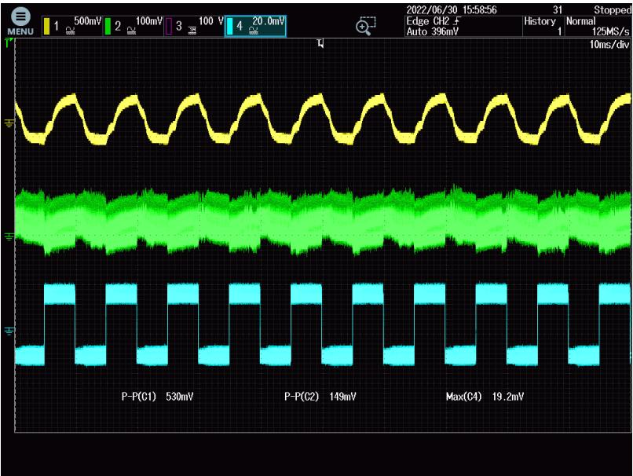

265 VAC

CH1 VOUT ${ \mathsf { C H 1 } } { \mathsf { V } } _ { \mathsf { O U T } }$ $\mathsf { V } _ { \mathsf { P K - P K } } { = } 5 3 0 \mathsf { m V }$  
CH2 VOUT ${ \mathsf { C H } } 2 { \mathsf { V } } _ { \mathsf { O U T } }$ $V _ { \mathsf { P K - P K } } { = } 1 4 9 ~ \mathsf { m V }$

## Test Condition:

➢ 0.2A-0.4A-0.2A  
➢ 0.25A-0.5 A-0.25 A  
➢ Slew Rate: 0.5 A/μS  
➢ Frequency: 100 Hz

## 动态负载(10%-90%)

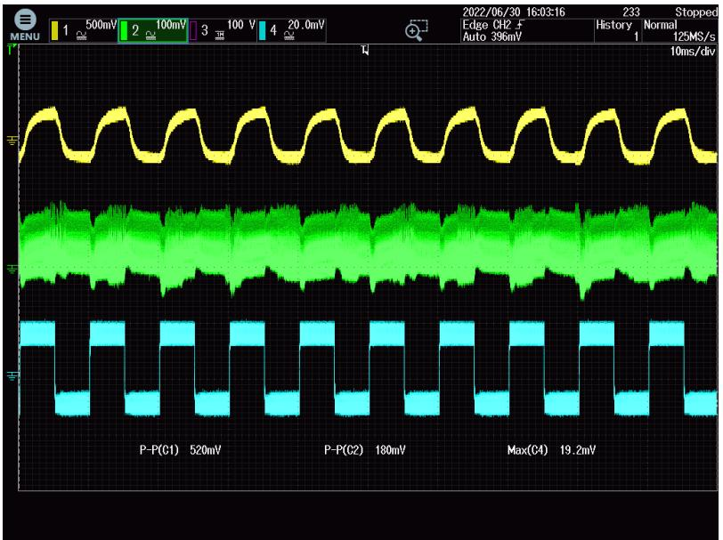

85VAC

${ \mathsf { C H 1 } } { \mathsf { V } } _ { \mathsf { O U T } }$ CH1 VOUT $\mathsf { V } _ { \mathsf { P K - P K } } { = } 5 2 0 \mathsf { m V }$  
CH2 VOUT ${ \mathsf { C H } } 2 { \mathsf { V } } _ { \mathsf { O U T } }$ $\mathsf { V } _ { \mathsf { P K - P K } } \mathsf { = } \mathsf { 1 8 0 m V }$

## Test Condition:

➢ 0.04 A-0. 36A-0.04A  
➢ 0.05 A-0.45 A-0.05 A  
➢ Slew Rate: 0.5 A/μS  
➢ Frequency: 100 Hz

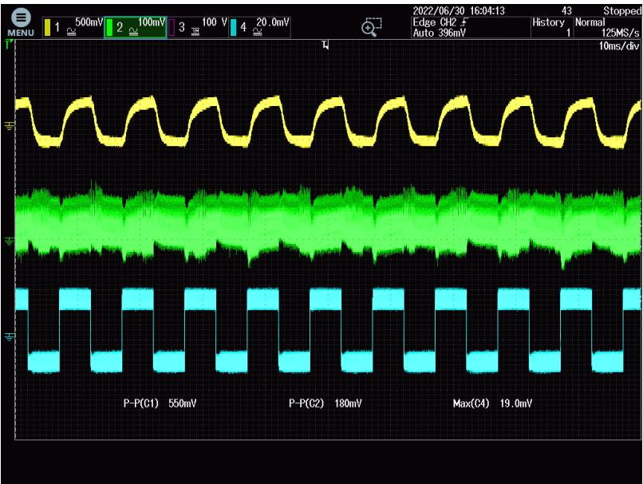

115 VAC

CH1 VOUT ${ \mathsf { C H 1 } } { \mathsf { V } } _ { \mathsf { O U T } }$ $V _ { \mathsf { P K - P K } } { = } 5 5 0 ~ \mathsf { m V }$  
CH2 VOUT ${ \mathsf { C H } } 2 { \mathsf { V } } _ { \mathsf { O U T } }$ VPK-PK=180mV $\mathsf { V } _ { \mathsf { P K - P K } } { = } 1 8 0 \mathsf { m V }$

## Test Condition:

➢ 0.04 A-0. 36A-0.04A  
➢ 0.05 A-0.45 A-0.05 A  
➢ Slew Rate: 0.5 A/μS  
➢ Frequency: 100 Hz

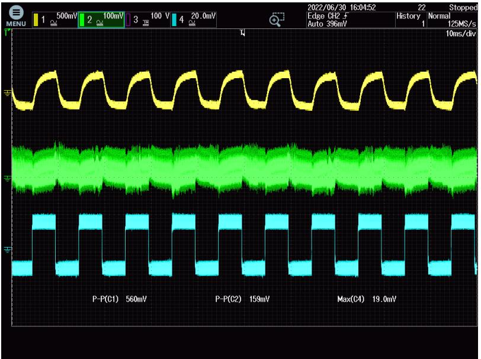

230 VAC

CH1 VOUT $\mathsf { V } _ { \mathsf { O U T } }$ VPK-PK=560 mV $v _ { p _ { \mathrm { K - P K } } } { = } 5 6 0 ~ \mathsf { m V }$  
CH2 VOUT ${ \mathsf { C H } } 2 { \mathsf { V } } _ { \mathsf { O U T } }$ VPK-PK=159mV $\mathsf { V } _ { \mathsf { P K - P K } } { = } 1 5 9 \mathsf { m V }$

## Test Condition:

➢ 0.04 A-0. 36A-0.04A  
➢ 0.05A-0.45 A-0.05 A  
➢ Slew Rate: 0.5 A/μS  
➢ Frequency: 100 Hz

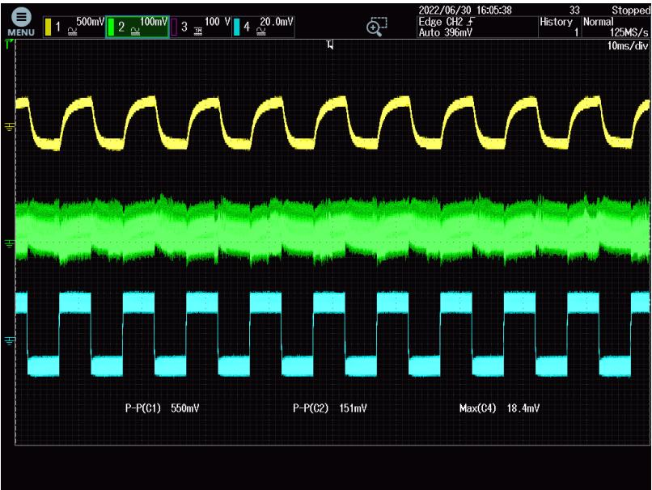

265 VAC

CH1 VOUT ${ \mathsf { C H 1 } } { \mathsf { V } } _ { \mathsf { O U T } }$ $V _ { \mathsf { P K - P K } } { = } 5 5 0 ~ \mathsf { m V }$  
CH2 VOUT ${ \mathsf { C H } } 2 { \mathsf { V } } _ { \mathsf { O U T } }$ VPK-PK=151mV $\mathsf { V } _ { \mathsf { P K - P K } } { = } 1 5 1 \mathsf { m V }$

## Test Condition:

➢ 0.04 A-0. 36A-0.04A  
➢ 0.05 A-0.45 A-0.05 A  
➢ Slew Rate: 0.5 A/μS  
➢ Frequency: 100 Hz

## 输出电压开机波形

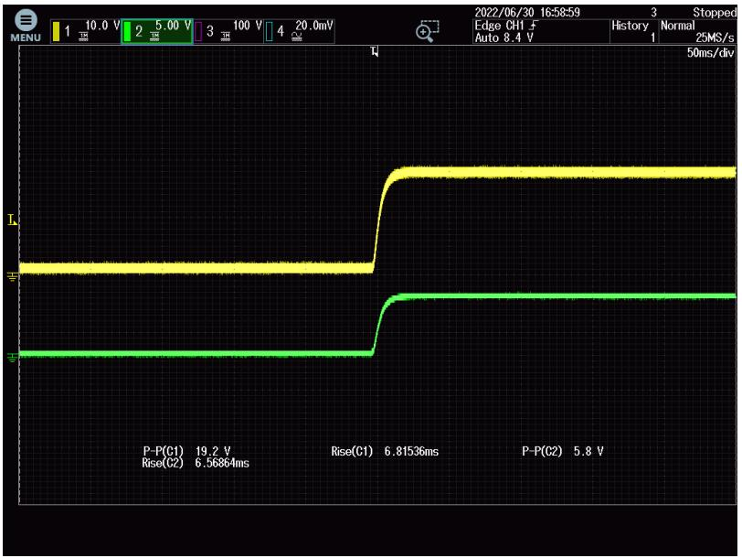

$8 5 V _ { A C }$

CH1 VOUT $\mathsf { V } _ { \mathsf { O U T } }$ ${ \sf T } _ { \sf R I S E } .$ 6.81mS  
CH2 VOUT $\mathsf { V } _ { \mathsf { O U T } }$ ${ \sf T } _ { \sf R I S E } .$ 6.56mS

Test Condition:  
➢ No Load  
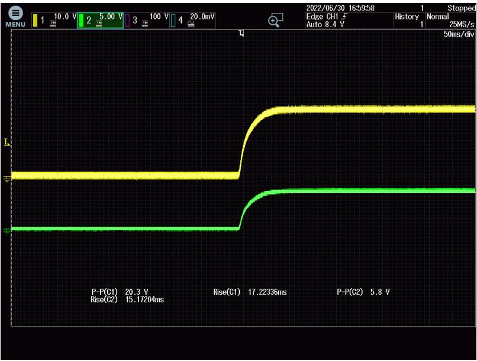

85 VAC

CH1 VOUT $\mathsf { V } _ { \mathsf { O U T } }$ ${ \sf T } _ { \sf R I S E } .$ 17.22mS  
CH2 VOUT $\mathsf { V } _ { \mathsf { O U T } }$ ${ \sf T } _ { \sf R I S E } .$ 15.8mS

Test Condition:  
➢ Full Load  
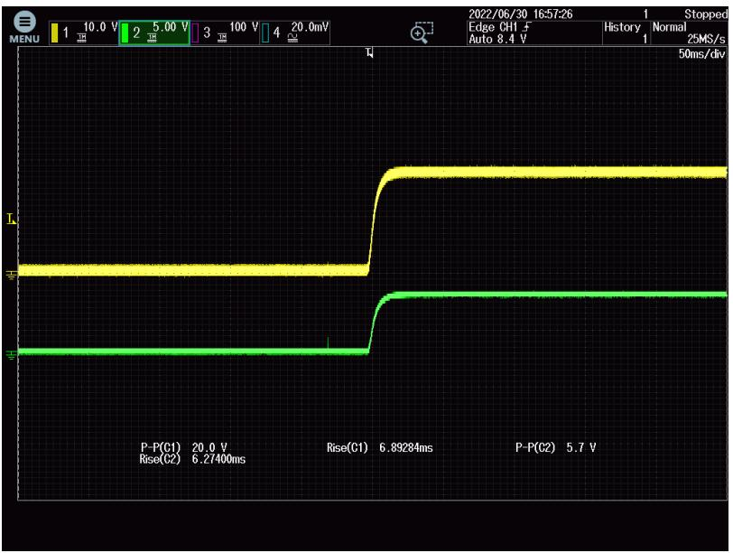

265 $\mathsf { v } _ { \mathsf { A C } }$

CH1 VOUT $\mathsf { V } _ { \mathsf { O U T } }$ ${ \sf T } _ { \sf R I S E } .$ 6.89mS  
CH2 VOUT $\mathsf { V } _ { \mathsf { O U T } }$ ${ \sf T } _ { \sf R I S E } .$ 6.27mS

Test Condition:  
➢ No Load  
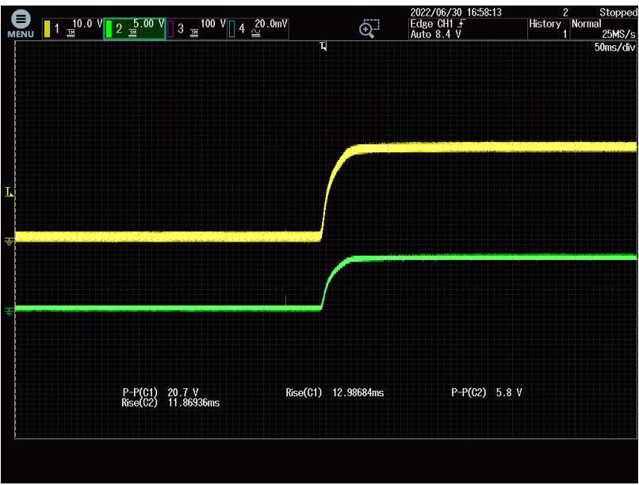

265 $\mathsf { v } _ { \mathsf { A C } }$

CH1 VOUT $\mathsf { V } _ { \mathsf { O U T } }$ ${ \sf T } _ { \sf R I S E } .$ 12.98 mS  
CH2 VOUT $\mathsf { V } _ { \mathsf { O U T } }$ TRISE:11.86mS

Test Condition:

➢ Full Load

## 启动延迟时间

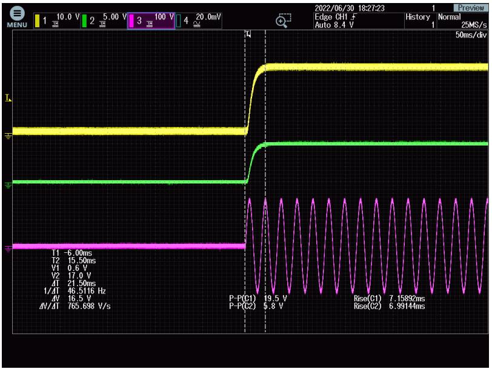

85 VAC

CH1 $\mathsf { V } _ { \mathsf { O U T } }$  
CH2 $\mathsf { V } _ { \mathsf { O U T } }$  
CH3 VINNAC $\mathsf { V I N } _ { \mathsf { N A C } }$ ${ \bar { \mathsf { T } } } _ { { \mathsf { D E L A Y } } } .$ 21.5 mS ${ \mathsf { T } } _ { \mathsf { D E L A Y } } .$ 21.5mS

Test Condition:  
➢ No Load  
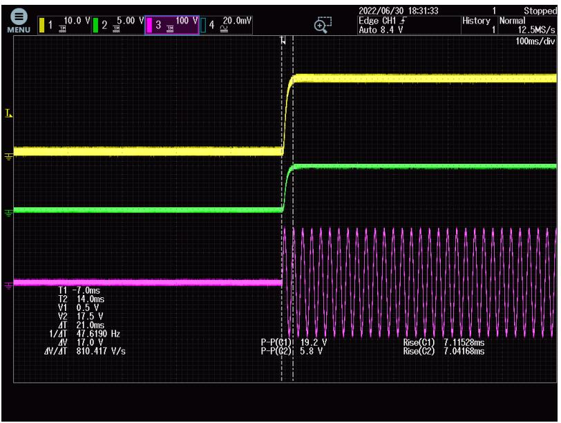

265 $\mathsf { v } _ { \mathsf { A C } }$

CH1 $\mathsf { V } _ { \mathsf { O U T } }$  
CH2 $\mathsf { V } _ { \mathsf { O U T } }$  
CH3 VINNAC $\mathsf { V I N } _ { \mathsf { N A C } }$  
${ \sf T } _ { \sf D E L A Y } .$ 21mS  
${ \sf T } _ { \sf D E L A Y } .$ 21mS

Test Condition:  
➢ No Load  
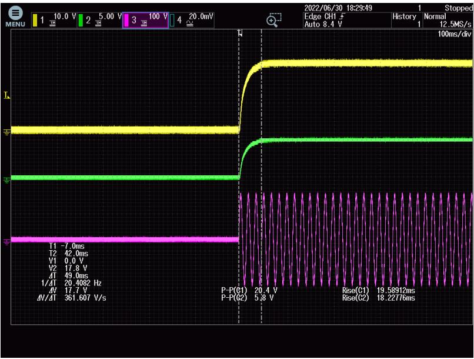

85 VAC

CH1 $\mathsf { V } _ { \mathsf { O U T } }$  
CH2 $\mathsf { V } _ { \mathsf { O U T } }$  
CH3 VINNAC $\mathsf { V I N } _ { \mathsf { N A C } }$  
${ \bar { \mathsf { T } } } _ { { \mathsf { D E L A Y } } } .$ 49mS  
$\mathsf { T } _ { \mathsf { D E L A Y } } .$ 49mS

Test Condition:  
➢ Full Load  
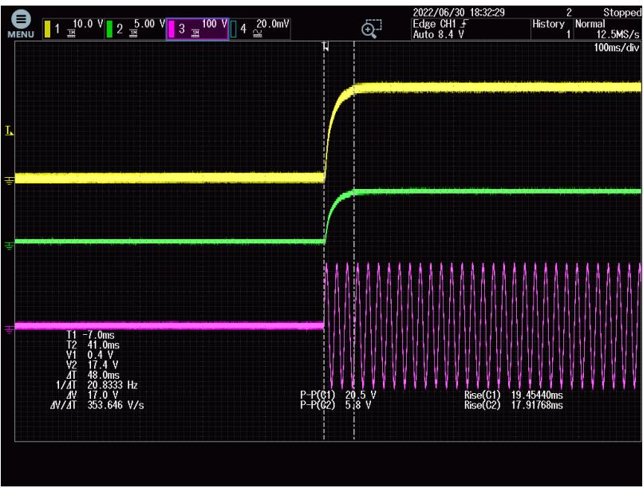

265 $\mathsf { v } _ { \mathsf { A C } }$

${ \mathsf { C H 1 } } { \mathsf { V } } _ { \mathsf { O U T } }$  
CH2 VOUT ${ \mathsf { C H } } 2 { \mathsf { V } } _ { \mathsf { O U T } }$  
CH3 VINNAC $\mathsf { V I N } _ { \mathsf { N A C } }$  
$\mathsf { T } _ { \mathsf { D E L A Y } } .$ 20.83mS  
TDELAY: 20.83mS $\mathsf { T } _ { \mathsf { D E L A Y } } .$

Test Condition:

➢ Full Load

## 短路保护 （MOSFET波形）

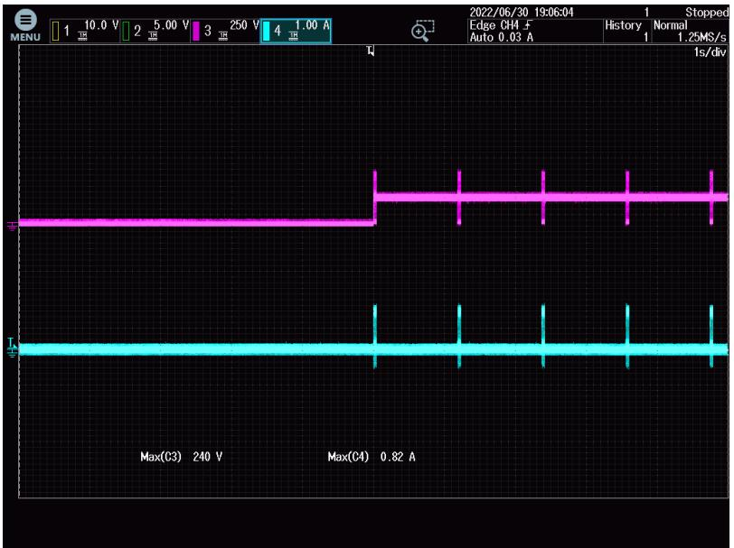

85VAC

CH3 VDS：  
CH4 ID：

$$
\begin{array}{l} I _ {D S \_ M A X} = 0. 8 2 A \\ V _ {D S \_ M A X} = 2 4 0 V \end{array}
$$

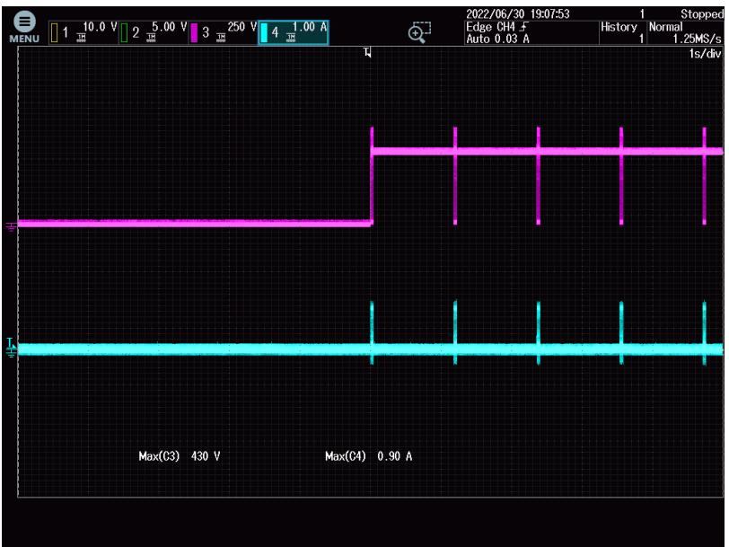

230 VAC

CH3 VDS：  
CH4 ID：

$$
\begin{array}{l} I _ {D S \_ M A X} = 0. 9 A \\ V _ {D S \_ M A X} = 4 3 0 V \end{array}
$$

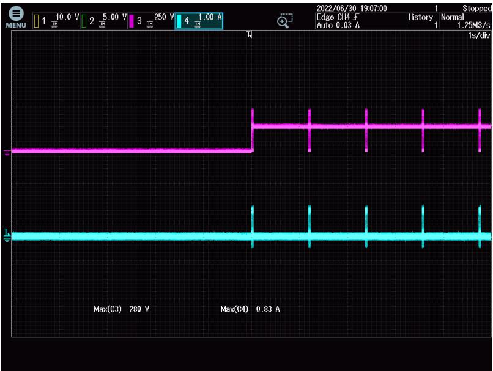

115 VAC

CH3 VDS：  
CH4 ID：

$$
\begin{array}{l} I _ {D S \_ M A X} = 0. 8 3 A \\ V _ {D S \_ M A X} = 2 8 0 \end{array}
$$

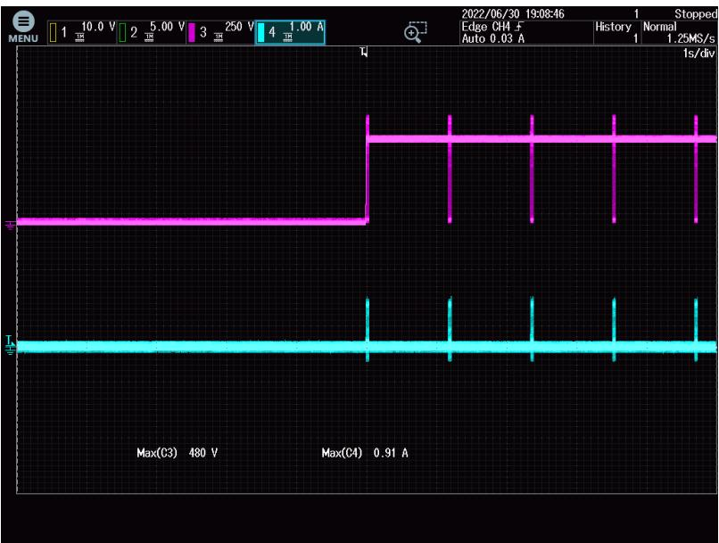

265 VAC

CH3 VDS：500V  
CH4 ID：1.86A

$$
\begin{array}{l} I _ {D S \_ M A X} = 0. 9 1 A \\ V _ {D S \_ M A X} = 4 8 0 V \end{array}
$$

## MOSFET稳态波形

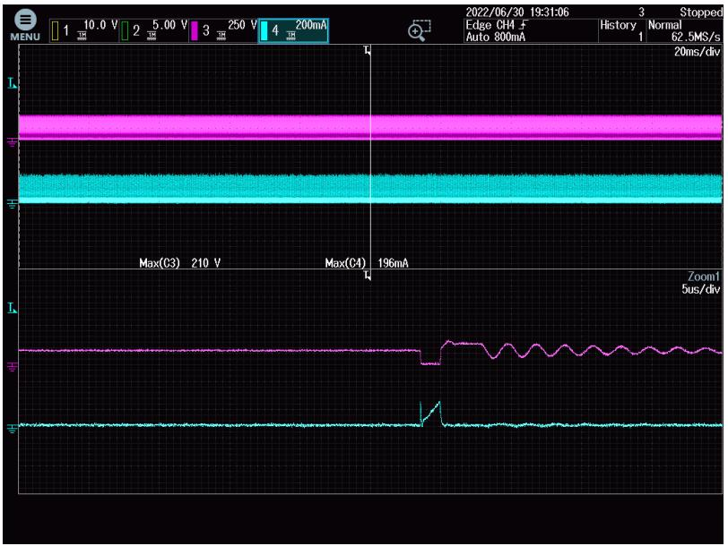

85VAC  
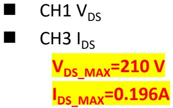

Test Condition:  
➢ No Load

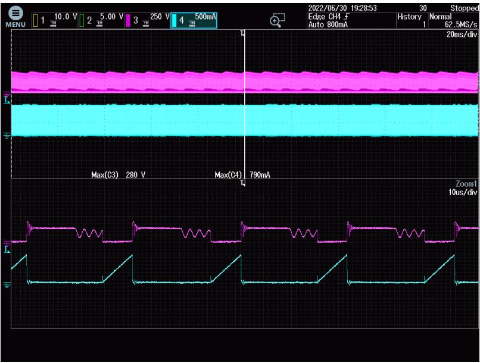

85 VAC  
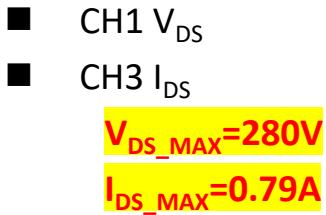

Test Condition:  
➢ Full Load

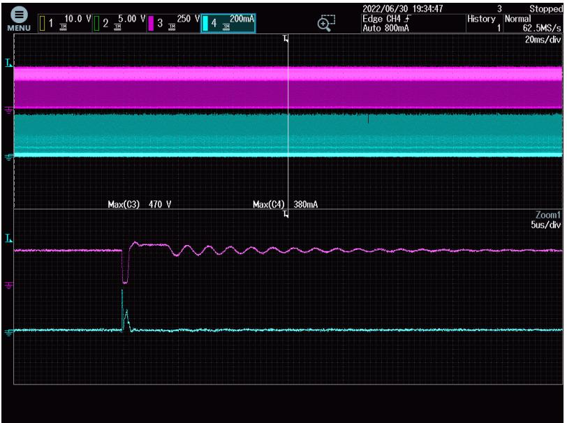

265 VAC  
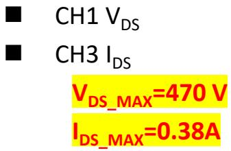

Test Condition:  
➢ No Load

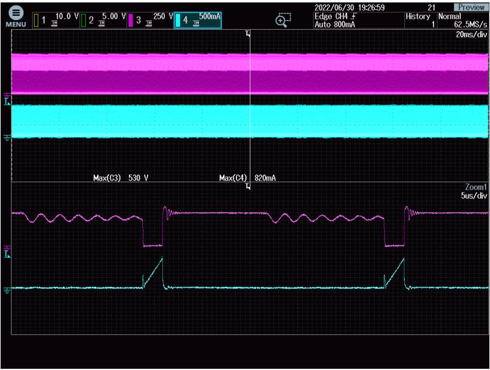

265 VAC  
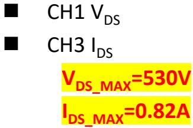

Test Condition:  
➢ Full Load

## 漏极电流波形

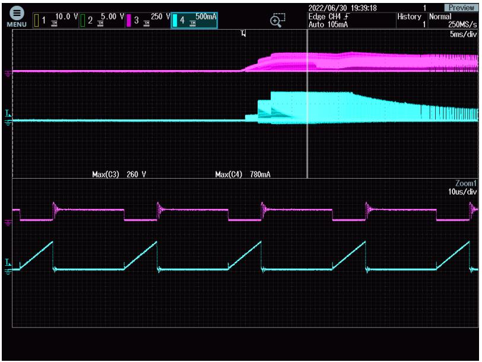

${ \otimes 5 } \mathsf { V } _ { \mathsf { A C } }$

CH1 VOUTPUT ${ \mathsf { C H 1 } } { \mathsf { V } } _ { { \mathsf { 0 U T P U T } } }$  
CH4 IDRAIN $\mathsf { I } _ { \mathsf { D R A I N } }$ $V _ { \mathsf { D S \_ M A X } } { = } 2 6 0 \vee$ IDS\_MAX=0.78 A

## Test Condition:

空载启动

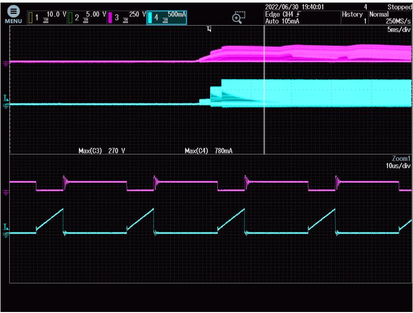

85 VAC

CH1 VOUTPUT $\mathsf { V } _ { \mathsf { O U T P U T } }$  
CH4 IDRAIN $1 _ { \mathsf { D R A I N } }$ $V _ { \mathsf { D S \_ M A X } } { = } 2 7 0 \lor$ IDS\_MAX=0.78A $1 _ { \mathsf { D S \_ M A X } } { = } 0 . 7 8 \mathsf { A }$

## Test Condition:

满载启动

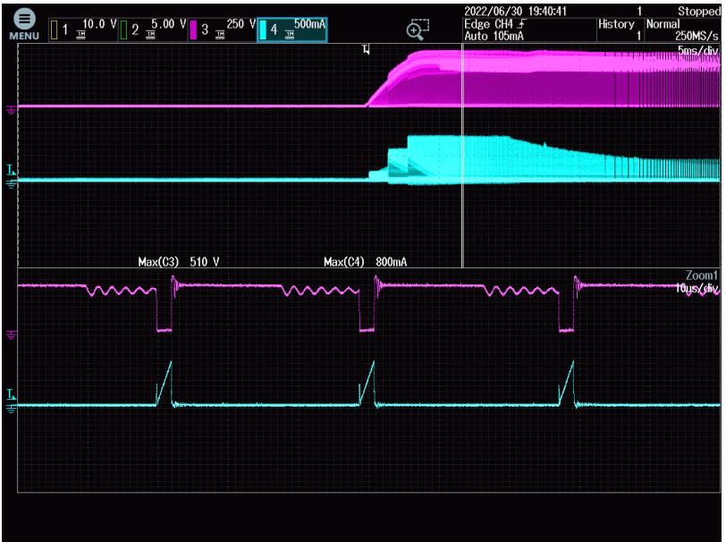

265 VAC

${ \mathsf { C H 1 V _ { \mathsf { 0 U T P U T } } } }$ CH1 VOUTPUT  
$\begin{array} { r l } { = } & { \mathrm { C H 4 ~ I _ { D R A I N } } } \\ & { \mathrm { V _ { D S \_ M A X } = 5 1 0 ~ V } } \\ & { \mathrm { I _ { D S \_ M A X } = 0 . 8 A } } \end{array}$ CH4 IDRAIN IDS\_MAX=0.8A

## Test Condition:

➢ 空载启动

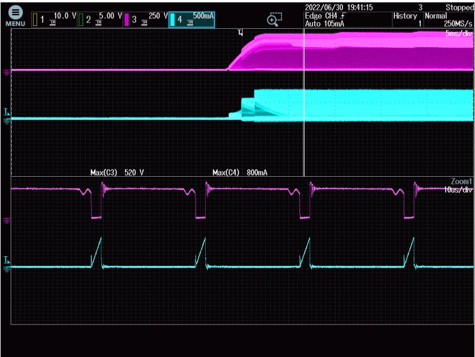

265 VAC

${ \mathsf { C H 1 } } { \mathsf { V } } _ { { \mathsf { 0 U T P U T } } }$  
CH4 IDRAIN $V _ { \mathsf { D S \_ M A X } } { = } 5 2 0 \mathsf { V }$ IDS\_MAX=0.8A

## Test Condition:

➢ 满载启动

## D-S电压波形

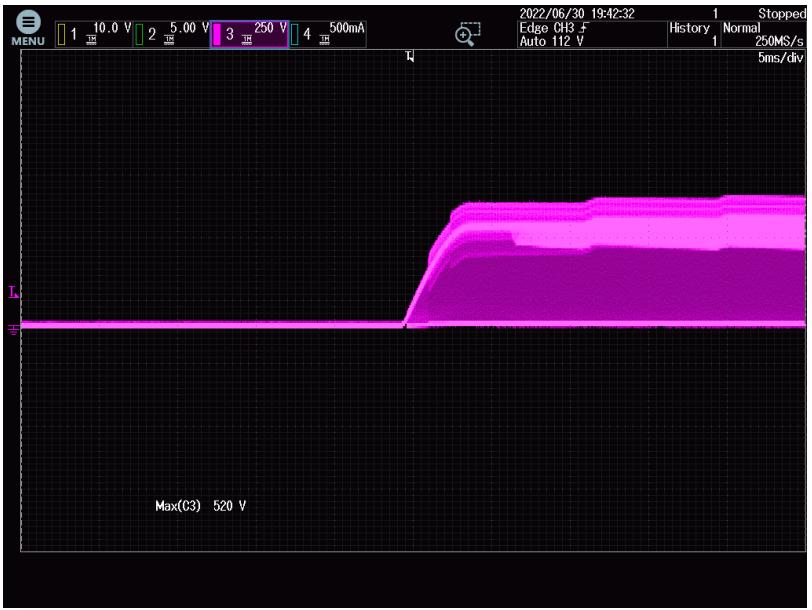

265 VAC

CH2 VDS VDSMAX: 520 V

Test Condition:

➢ 满载开机

极限参数(注3)

<table><tr><td>符号</td><td>参数</td><td>参数范围</td><td>单位</td></tr><tr><td> $V_{DRAIN}$ </td><td>内部高压 MOSFET 漏极到源极电压</td><td>-0.3~700</td><td>V</td></tr><tr><td> $V_{CC}$ </td><td> $V_{CC}$  电压</td><td>-0.3~9</td><td>V</td></tr><tr><td> $I_{CC\_MAX}$ </td><td> $V_{CC}$  引脚最大电流</td><td>20</td><td>mA</td></tr><tr><td> $V_{FB}$ </td><td>输出反馈端电压</td><td>-0.3~9</td><td>V</td></tr><tr><td> $P_{DMAX}$ </td><td>功耗(注 4)</td><td>1.5</td><td>W</td></tr><tr><td> $\theta_{JA}$ </td><td>结到环境的热阻(注 5)</td><td>80</td><td>°C/W</td></tr><tr><td> $\theta_{JC}$ </td><td>结到芯片表面的热阻(注 5)</td><td>20</td><td>°C/W</td></tr><tr><td> $T_{J}$ </td><td>工作结温范围</td><td>-40 to 150</td><td>°C</td></tr><tr><td> $T_{STG}$ </td><td>储存温度范围</td><td>-55 to 150</td><td>°C</td></tr><tr><td>ESD</td><td>人体模型 ESD(注 6)</td><td>2</td><td>kV</td></tr></table>

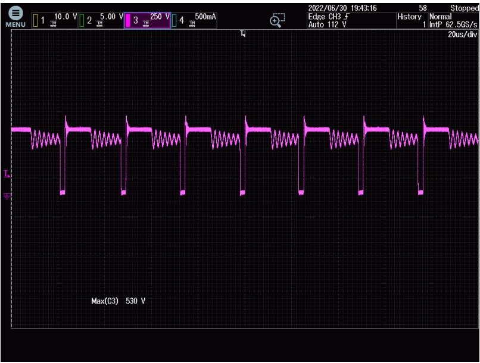

265 VAC

CH2 VDS VDSMAX: 530 V

Test Condition:满载正常工作

## 满载开机

Derating= 520 V /650V = 80%

## 满载正常工作

Derating = 530V / 650 V = 81.53 %

## 5V输出肖特基反压波形

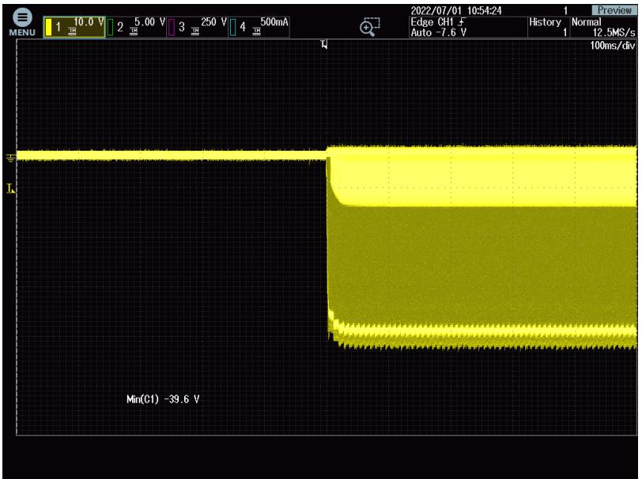

265 VAC

CH1 VDIODE VDSMAX:39.6V

Test Condition:

➢ 满载启动

<table><tr><td>PARAMETER</td><td>SYMBOL</td><td>MB54</td><td>MB54A</td><td>MB55</td><td>MB56</td><td>MB58</td><td>MB59</td><td>MB510</td><td>MB515</td><td>MB520</td><td>UNITS</td></tr><tr><td>Maximum Recurrent Peak Reverse Voltage</td><td> $V_{RRM}$ </td><td>40</td><td>45</td><td>50</td><td>60</td><td>80</td><td>90</td><td>100</td><td>150</td><td>200</td><td>V</td></tr><tr><td>Maximum RMS Voltage</td><td> $V_{RMS}$ </td><td>28</td><td>31.5</td><td>35</td><td>42</td><td>56</td><td>63</td><td>70</td><td>105</td><td>140</td><td>V</td></tr><tr><td>Maximum DC Blocking Voltage</td><td> $V_{DC}$ </td><td>40</td><td>45</td><td>50</td><td>60</td><td>80</td><td>90</td><td>100</td><td>150</td><td>200</td><td>V</td></tr><tr><td>Average Rectified Output Current (See Figure 1)</td><td> $I_{F(AV)}$ </td><td colspan="9">5</td><td>A</td></tr><tr><td>Non-Repetitive Peak Forward Surge Current : 8.3ms single half sine-wave superimposed on rated load</td><td> $I_{FSM}$ </td><td colspan="9">100</td><td>A</td></tr><tr><td>Forward Voltage at 5A (Note 1)</td><td> $V_F$ </td><td colspan="2">0.7</td><td colspan="2">0.74</td><td colspan="3">0.8</td><td colspan="2">0.9</td><td>V</td></tr><tr><td>Peak Reverse Current at Rated DC Blocking Voltage  $T_J=25°C$  $T_J=100°C$ </td><td> $I_R$ </td><td colspan="9">0.0510</td><td>mA</td></tr><tr><td>Typical Thermal Resistance (Note 2)</td><td> $R_{\theta JA}$  $R_{\theta JL}$ </td><td colspan="9">5517</td><td>°C /W</td></tr><tr><td>Operating Junction and Storage Temperature Range</td><td> $T_J,T_{STG}$ </td><td>-55 to +150</td><td colspan="8">-65 to +175</td><td>°C</td></tr></table>

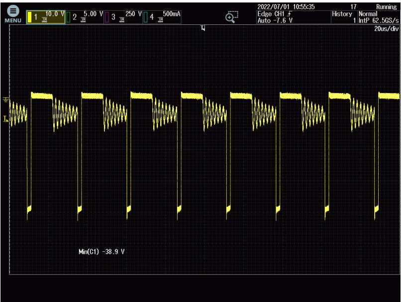

265 VAC

CH1 VDDIODE VMAX: 38.9V

Test Condition:

满载正常工作

## 满载开机

Derating = 39.6V / 100 V =39.6%

## 满载正常工作

Derating = 38.9 V / 100V = 38.9 %

## 18V输出肖特基反压波形

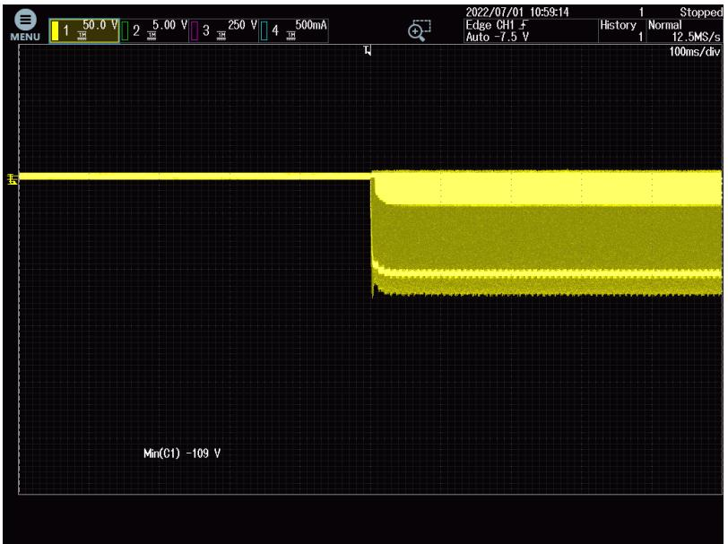

265 VAC

CH3 VDIODE VDSMAX: 109V

Test Condition:

➢ 满载启动

<table><tr><td>Parameter</td><td>Symbols</td><td>SS22</td><td>SS24</td><td>SS26</td><td>SS28</td><td>SS210</td><td>SS212</td><td>SS215</td><td>SS220</td><td>Units</td></tr><tr><td>Maximum Repetitive Peak Reverse Voltage</td><td> $V_{RRM}$ </td><td>20</td><td>40</td><td>60</td><td>80</td><td>100</td><td>120</td><td>150</td><td>200</td><td>V</td></tr><tr><td>Maximum RMS voltage</td><td> $V_{RMS}$ </td><td>14</td><td>28</td><td>42</td><td>56</td><td>70</td><td>84</td><td>105</td><td>140</td><td>V</td></tr><tr><td>Maximum DC Blocking Voltage</td><td> $V_{DC}$ </td><td>20</td><td>40</td><td>60</td><td>80</td><td>100</td><td>120</td><td>150</td><td>200</td><td>V</td></tr><tr><td>Maximum Average Forward Rectified Current</td><td> $I_{F(AV)}$ </td><td colspan="8">2.0</td><td>A</td></tr><tr><td>Peak Forward Surge Current,8.3ms Single Half Sine-wave Superimposed on Rated Load (JEDEC method)</td><td> $I_{FSM}$ </td><td colspan="8">50</td><td>A</td></tr><tr><td>Max Instantaneous Forward Voltage at 2 A</td><td> $V_{F}$ </td><td colspan="2">0.55</td><td colspan="2">0.70</td><td colspan="2">0.85</td><td colspan="2">0.95</td><td>V</td></tr><tr><td>Maximum DC Reverse Current  $T_a = 25°C$ at Rated DC Reverse Voltage  $T_a = 100°C$ </td><td> $I_R$ </td><td colspan="3">0.55</td><td colspan="5">0.33</td><td>mA</td></tr><tr><td>Typical Junction Capacitance $^{(1)}$ </td><td> $C_j$ </td><td colspan="2">220</td><td colspan="6">80</td><td>pF</td></tr><tr><td>Typical Thermal Resistance $^{(2)}$ </td><td> $R_{\theta JA}$ </td><td colspan="8">80</td><td>°C/W</td></tr><tr><td>Operating Junction Temperature Range</td><td> $T_j$ </td><td colspan="8">-55 ~ +125</td><td>°C</td></tr><tr><td>Storage Temperature Range</td><td> $T_{stg}$ </td><td colspan="8">-55 ~ +150</td><td>°C</td></tr></table>

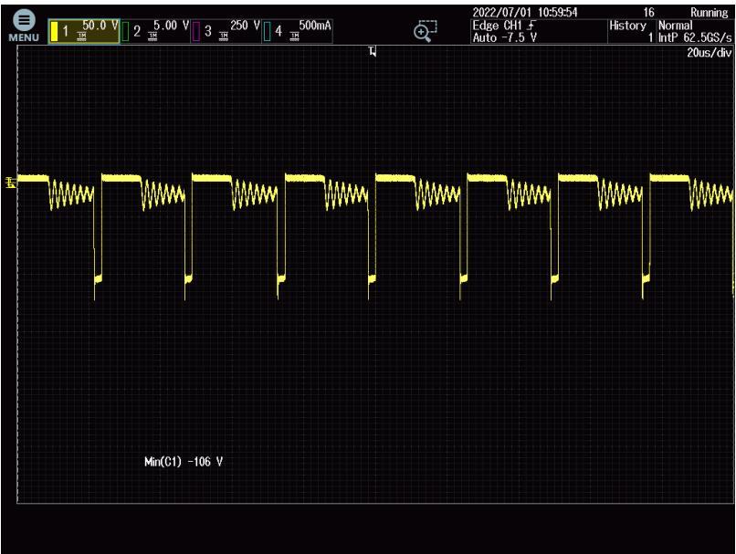

265 VAC

CH3 VDDIODE VMAX: 106V

Test Condition:

满载正常工作

## 满载开机

$\mathsf { D e r a t i n g } = 1 0 9 \mathsf { V } / 2 0 0 \mathsf { V } = 5 4 . 5 \%$

## 满载正常工作

Derating =106V / 200 V = 53%

<table><tr><td rowspan="2">项目</td><td colspan="2">85VAC</td><td colspan="2">265VAC</td></tr><tr><td>温度(°C)</td><td>温升(°C)</td><td>温度(°C)</td><td>温升(°C)</td></tr><tr><td>环境温度</td><td colspan="2">31</td><td colspan="2">30</td></tr><tr><td>BPA8506D (U1)</td><td>94</td><td>63</td><td>69</td><td>39</td></tr><tr><td>变压器绕组 (T1)</td><td>74</td><td>43</td><td>71</td><td>41</td></tr><tr><td>变压器磁芯 (T1)</td><td>68</td><td>37</td><td>65</td><td>35</td></tr><tr><td>输出肖特基 (D4)</td><td>74</td><td>43</td><td>75</td><td>45</td></tr><tr><td>输出肖特基 (D3)</td><td>79</td><td>48</td><td>78</td><td>48</td></tr><tr><td>输入电解电容(E2)</td><td>63</td><td>32</td><td>49</td><td>19</td></tr><tr><td>输出电解电容(E5)</td><td>54</td><td>23</td><td>53</td><td>23</td></tr></table>

## 测试说明

➢ 在温箱中进行测试  
➢ 电路板放在一个封闭的盒子内  
➢ 热电偶连接到各个测量点  
➢ 等测量点温度达到稳定后记录数据

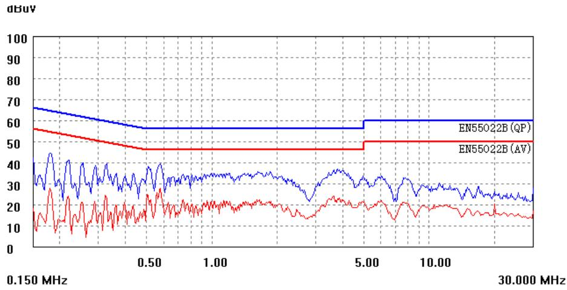

115VAC Line  
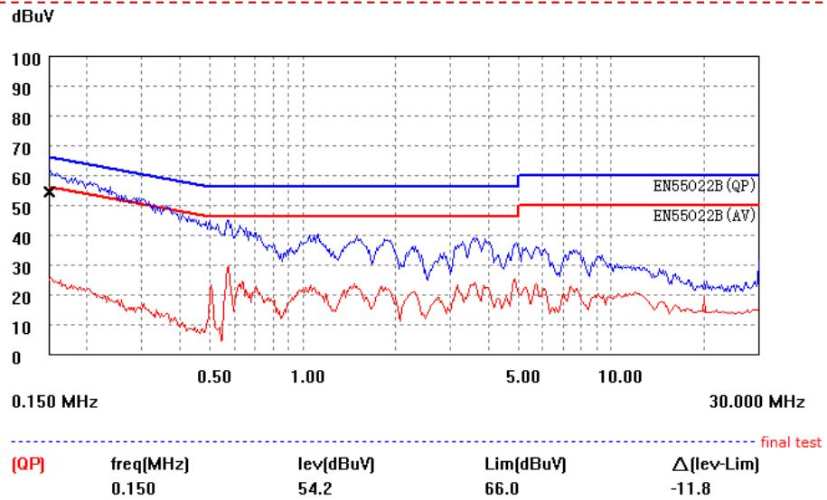

230VAC Line

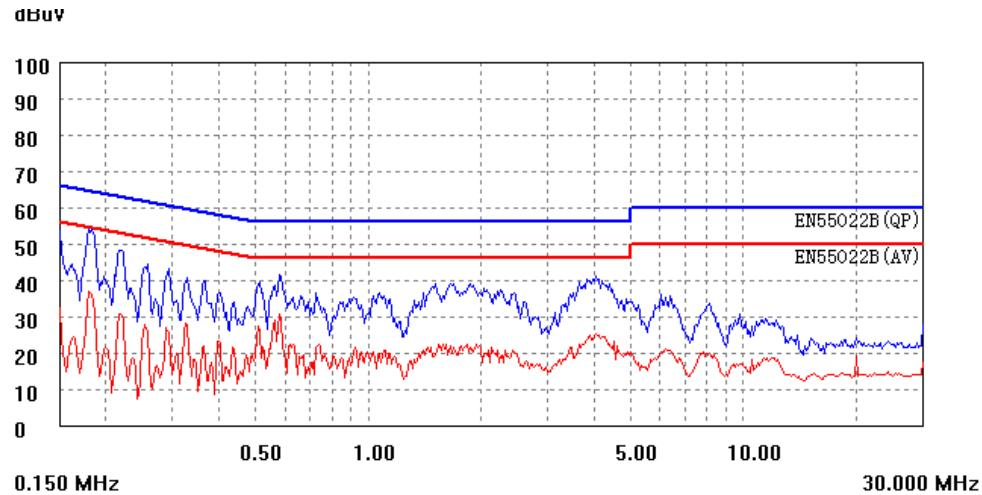

115VAC Neutral  
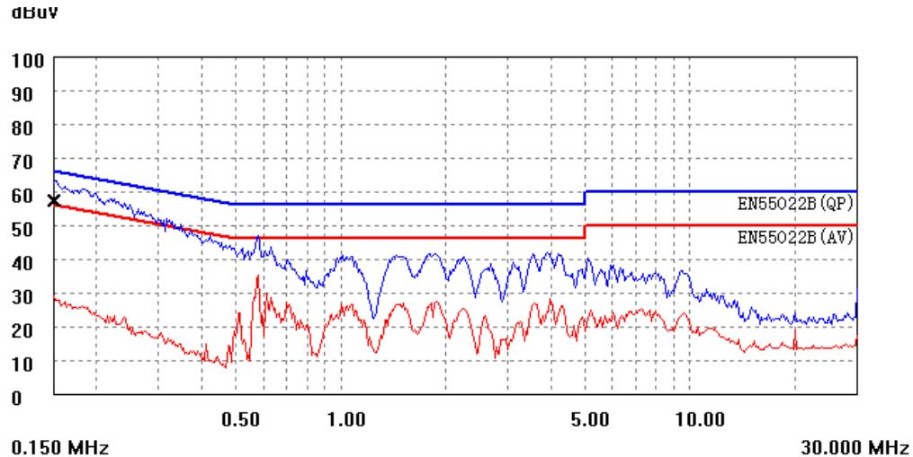

230VAC Neutral

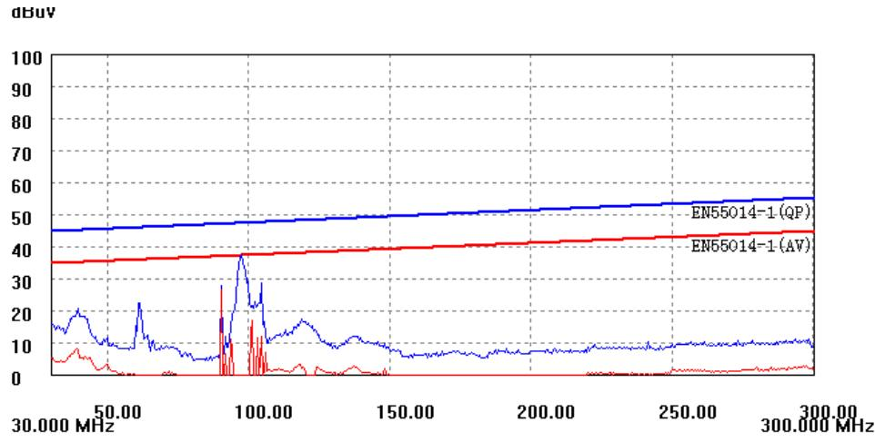

115VAC 空载  
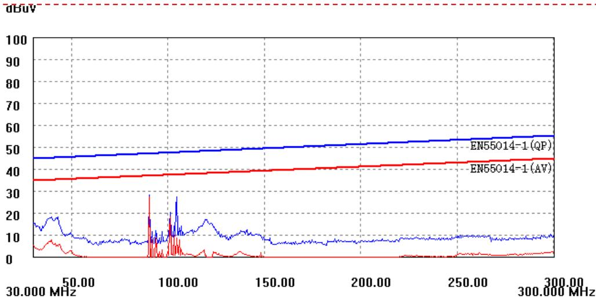

230VAC 空载

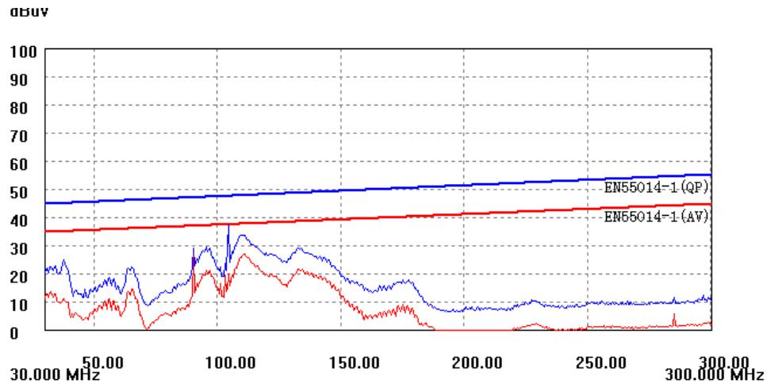

115VAC 满载  
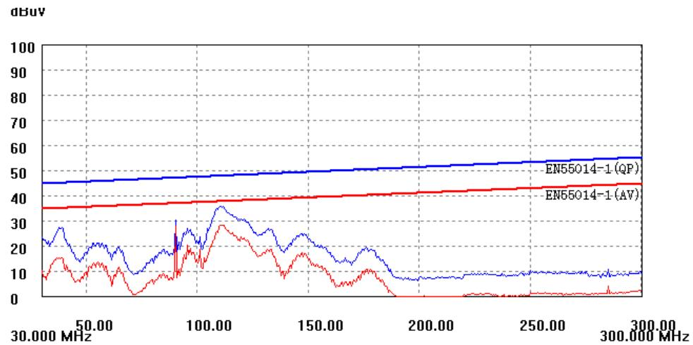

230VAC 满载

<table><tr><td>差模</td><td>电压</td><td>相位角</td><td>发生器阻抗</td><td>测试次数</td><td>测试结果</td></tr><tr><td>L to N</td><td>+2kV</td><td>0</td><td>2</td><td>10</td><td>Pass</td></tr><tr><td>L to N</td><td>-2kV</td><td>0</td><td>2</td><td>10</td><td>Pass</td></tr><tr><td>L to N</td><td>+2kV</td><td>90</td><td>2</td><td>10</td><td>Pass</td></tr><tr><td>L to N</td><td>-2kV</td><td>90</td><td>2</td><td>10</td><td>Pass</td></tr><tr><td>L to N</td><td>+2kV</td><td>180</td><td>2</td><td>10</td><td>Pass</td></tr><tr><td>L to N</td><td>-2kV</td><td>180</td><td>2</td><td>10</td><td>Pass</td></tr><tr><td>L to N</td><td>+2kV</td><td>270</td><td>2</td><td>10</td><td>Pass</td></tr><tr><td>L to N</td><td>-2kV</td><td>270</td><td>2</td><td>10</td><td>Pass</td></tr></table>

## 测试说明

➢ 按照GB/T17626.5和IEC61000-4-5的最新版本要求进行测试  
➢ 室温环境，230VAC输入，满载条件  
➢ 输入1.2/50us组合波浪涌电压  
➢ 每个测试点重复10次  
➢ 每次间隔时间1分钟  
➢ 试验时样机输出正常（符合A类标准）视为Pass

<table><tr><td>差模</td><td>电压</td><td>脉冲群持续时间</td><td>脉冲频率</td><td>测试时间</td><td>测试结果</td></tr><tr><td>L to N</td><td>+4kV</td><td>15ms</td><td>5kHz</td><td>120s</td><td>Pass</td></tr><tr><td>L to N</td><td>-4kV</td><td>15ms</td><td>5kHz</td><td>120s</td><td>Pass</td></tr><tr><td>L to N</td><td>+4kV</td><td>0.75ms</td><td>100kHz</td><td>120s</td><td>Pass</td></tr><tr><td>L to N</td><td>-4kV</td><td>0.75ms</td><td>100kHz</td><td>120s</td><td>Pass</td></tr><tr><td>L to N</td><td>+2kV</td><td>2ms</td><td>38kHz</td><td>120s</td><td>Pass</td></tr><tr><td>L to N</td><td>-2kV</td><td>2ms</td><td>38kHz</td><td>120s</td><td>Pass</td></tr><tr><td>L to N</td><td>+4kV</td><td>2ms</td><td>38kHz</td><td>120s</td><td>Pass</td></tr><tr><td>L to N</td><td>-4kV</td><td>2ms</td><td>38kHz</td><td>120s</td><td>Pass</td></tr></table>

## 测试说明

➢ 按照GB/T17626.4和IEC61000-4-4的最新版本要求进行测试  
➢ 室温环境，230VAC输入满载条件  
➢ 分别测试5kHz/100kHz/38kHz脉冲频率  
➢ 脉冲群周期为300ms  
➢ 每个测试条件测试时间120s  
➢ 试验时样机输出正常（符合A类标准）视为Pass

<table><tr><td>测试</td><td>电压(V)</td><td>放电类型</td><td>放电次数</td><td>测试结果</td></tr><tr><td>Vo</td><td>+15kV</td><td>空气放电</td><td>10</td><td>Pass</td></tr><tr><td>Vo</td><td>-15kV</td><td>空气放电</td><td>10</td><td>Pass</td></tr><tr><td>GND</td><td>+15kV</td><td>空气放电</td><td>10</td><td>Pass</td></tr><tr><td>GND</td><td>-15kV</td><td>空气放电</td><td>10</td><td>Pass</td></tr><tr><td>Vo</td><td>+20kV</td><td>空气放电</td><td>10</td><td>Pass</td></tr><tr><td>Vo</td><td>-20kV</td><td>空气放电</td><td>10</td><td>Pass</td></tr><tr><td>GND</td><td>+20kV</td><td>空气放电</td><td>10</td><td>Pass</td></tr><tr><td>GND</td><td>-20kV</td><td>空气放电</td><td>10</td><td>Pass</td></tr></table>

## 测试说明

➢ 按照GB/T17626.2和IEC61000-4-2的最新版本要求进行测试  
➢ 室温环境，230VAC输入满载条件  
➢ 每个测试点重复10次  
➢ 分别对输出正端和地进行空气放电  
➢ 试验时样机输出正常（符合A类标准）视为Pass

## THANK YOU FOR WATCHING
