# BPA8506D 参考设计

# (24V/0.5A peak0.6A)

上海晶丰明源半导体股份有限公司

Shanghai Bright Power Semiconductor Co., Ltd.

陈耀兵

2022 3 25

BPA8506D  
电源规格  
电路图  
◼BOM  
◼PCB Layout  
电路实物图  
变压器规格书  
性能测试数据

## 产品特点:

➢ 650V MOSFET  
➢ PWM  
》内置软启动功能  
》集成高压启动、 自供电电路  
》低音频噪声

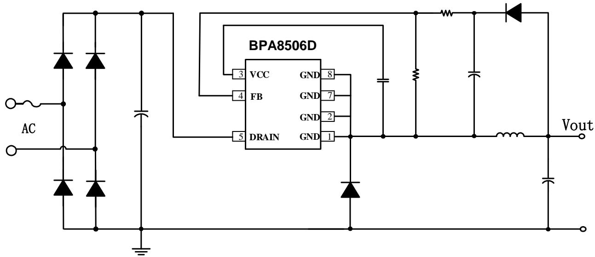

## 应用领域:

家用电器辅助电源  
电机驱动辅助电源  
➢ IOT/ /  
工业控制辅助电源

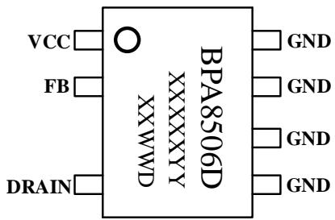

SOP7

## 电源规格

<table><tr><td>项目描述</td><td>符号</td><td>最小</td><td>典型</td><td>最大</td><td>单位</td><td>备注</td></tr><tr><td colspan="7">输入</td></tr><tr><td>电压</td><td> $V_{IN}$ </td><td>90</td><td>115/230</td><td>264</td><td> $V_{AC}$ </td><td></td></tr><tr><td>频率</td><td> $f_{LINE}$ </td><td>47</td><td>50/60</td><td>63</td><td>Hz</td><td></td></tr><tr><td colspan="7">输出</td></tr><tr><td>输出电压</td><td> $V_{OUT}$ </td><td></td><td>24</td><td></td><td>V</td><td>±3%</td></tr><tr><td>输出电流</td><td> $I_{OUT}$ </td><td></td><td>0.5</td><td>0.6</td><td>A</td><td>0.6A为短时峰值电流</td></tr><tr><td>输出电压纹波</td><td> $V_{RIPPLE}$ </td><td></td><td></td><td>200</td><td>mV</td><td>20MHz带宽</td></tr><tr><td>连续输出功率</td><td> $P_{OUT}$ </td><td></td><td>12</td><td>14.4</td><td>W</td><td>14.4W为短时峰值功率</td></tr><tr><td colspan="7">效率</td></tr><tr><td>待机功耗</td><td> $P_{STDBY}$ </td><td></td><td></td><td>160</td><td>mW</td><td>230VAC</td></tr><tr><td>满载效率</td><td>η</td><td>85</td><td></td><td></td><td>%</td><td>115VAC/230VAC</td></tr><tr><td colspan="7">环境</td></tr><tr><td>传导EMI</td><td></td><td colspan="4">满足CISPR22/EN55022 Class B,至少6dB 裕量</td><td></td></tr><tr><td>Surge</td><td></td><td></td><td>2</td><td></td><td>kV</td><td>差模</td></tr><tr><td>EFT</td><td></td><td></td><td>4</td><td></td><td>kV</td><td>5kHz/100kHz/38kHz</td></tr><tr><td>ESD</td><td></td><td></td><td>15</td><td></td><td>kV</td><td>接触8kV,空气15kV</td></tr><tr><td>工作环境温度</td><td> $T_{AMP}$ </td><td>0</td><td></td><td>40</td><td>°C</td><td></td></tr></table>

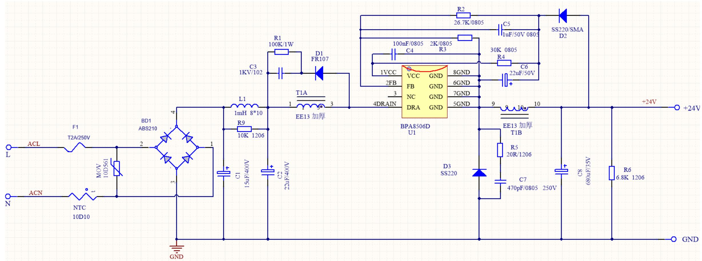

<table><tr><td>序号</td><td>元件标号</td><td>参数描述</td><td>封装尺寸</td><td>数量</td></tr><tr><td>1</td><td>PCB</td><td>CEM-1, 单面板</td><td>60.5mm*28mm</td><td>1</td></tr><tr><td>2</td><td>F1</td><td>保险丝,T2A</td><td>DIP</td><td>1</td></tr><tr><td>3</td><td>BD1</td><td>整流桥, 2A/1000V</td><td>ABS</td><td>1</td></tr><tr><td>4</td><td>D2,D3</td><td>SS220, 肖特基2A/200V</td><td>SMA</td><td>2</td></tr><tr><td>5</td><td>D1</td><td>FR107,1A/1000V,trr=250ns</td><td>DIP</td><td>1</td></tr><tr><td>6</td><td>L1</td><td>1mH, 工字电感</td><td>∅8*10mm</td><td>1</td></tr><tr><td>7</td><td>T1</td><td>2mH, EE1310</td><td>DIP</td><td>1</td></tr><tr><td>8</td><td>C1</td><td>15uF/400V, 电解电容</td><td>∅8*10mm</td><td>1</td></tr><tr><td>9</td><td>C2</td><td>22uF/400V, 电解电容</td><td>∅8*16mm</td><td>1</td></tr><tr><td>10</td><td>C6</td><td>22uF/50V, 电解电容</td><td>∅5*12mm</td><td>1</td></tr><tr><td>11</td><td>C8</td><td>680uF/35V, 电解电容</td><td>∅10*16mm</td><td>1</td></tr><tr><td>12</td><td>C3</td><td>1NF/1KV, 瓷片电容</td><td>DIP</td><td>1</td></tr><tr><td>13</td><td>R1</td><td>100K/2W,碳膜电阻</td><td>DIP</td><td>1</td></tr><tr><td>14</td><td>MOV</td><td>10D561</td><td>DIP</td><td>1</td></tr><tr><td>15</td><td>C4</td><td>100nF/50V, X7R, 瓷片电容</td><td>SMD0805</td><td>1</td></tr><tr><td>16</td><td>C5</td><td>1UF/50V, X7R, 瓷片电容</td><td>SMD0805</td><td>1</td></tr><tr><td>17</td><td>C7</td><td>470PF/250V, X7R, 瓷片电容</td><td>SMD0805</td><td>1</td></tr><tr><td>18</td><td>R3</td><td>2K, ±1%</td><td>SMD0805</td><td>1</td></tr><tr><td>19</td><td>R2</td><td>26.7K, ±1%</td><td>SMD0805</td><td>1</td></tr><tr><td>20</td><td>R4</td><td>30K, ±5%</td><td>SMD0805</td><td>1</td></tr><tr><td>21</td><td>R9</td><td>10K, ±5%</td><td>SMD1206</td><td>1</td></tr><tr><td>22</td><td>R6</td><td>6.8K, ±5%</td><td>SMD1206</td><td>1</td></tr><tr><td>23</td><td>R5</td><td>20R, ±5%</td><td>SMD1206</td><td>1</td></tr><tr><td>24</td><td>U1</td><td>BPA8506D, SOP7</td><td>SOP7</td><td>1</td></tr><tr><td></td><td></td><td></td><td>Total</td><td>25</td></tr></table>

60.50mm  
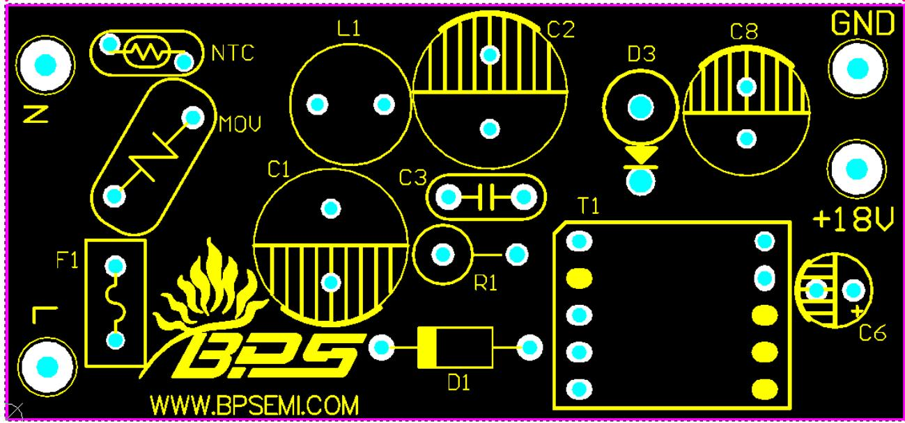

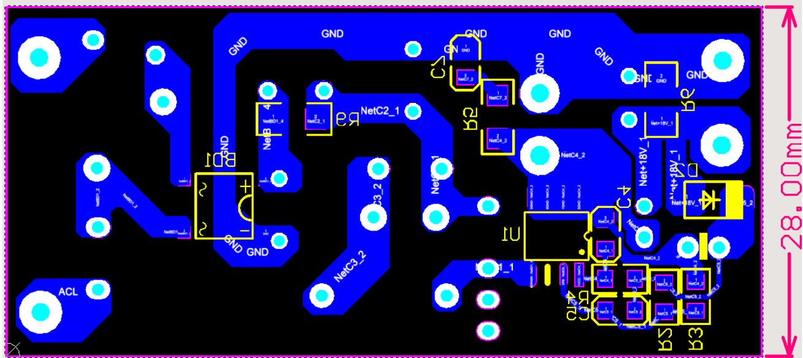

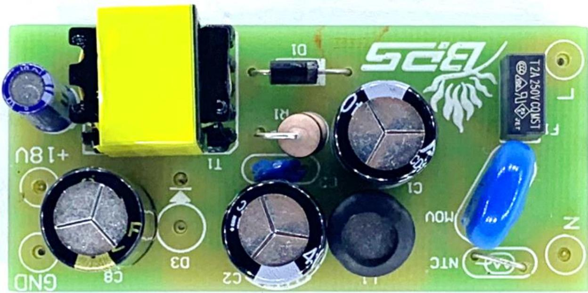

TOP SIDE

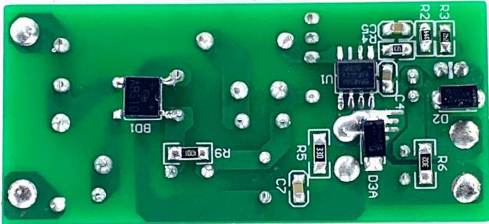

BOTTOM SIDE

## 变压器规格书

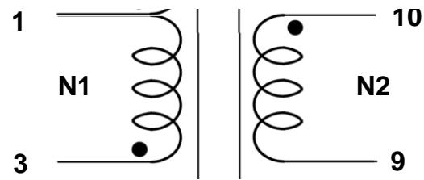

<table><tr><td>序号</td><td>起始脚</td><td>终止脚</td><td>绕制规则</td><td>匝数</td><td>绕线方式</td></tr><tr><td>N1</td><td>3</td><td>1</td><td>2UEW φ0.2*1P</td><td>98Ts</td><td>密绕三层(PIN脚朝外)</td></tr><tr><td>胶带</td><td></td><td></td><td></td><td>2Ts</td><td></td></tr><tr><td>N2</td><td>10</td><td>9</td><td>2UEW φ0.45*1P</td><td>28Ts</td><td>密绕二层(PIN脚朝外)</td></tr><tr><td>胶带</td><td></td><td></td><td></td><td>3Ts</td><td></td></tr></table>

## 规格参数：

1）骨架：EE1310立式（5+5PIN），磁芯材质：EE1310 PC40 或同等材质 ， $\mathsf { A } \mathsf { e } = 3 5 \mathsf { m m } ^ { 2 }$ ；  
2）N1、N2: 2UEW 漆包线；  
3）绝缘胶带:3M900 或同等材质；  
4）初级绕组感量Lp：1mH±5%（测试条件： 0.3V，40kHz）；  
5）成品要求：浸凡立水；

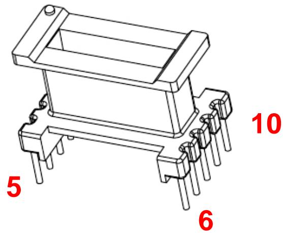

待机功耗  
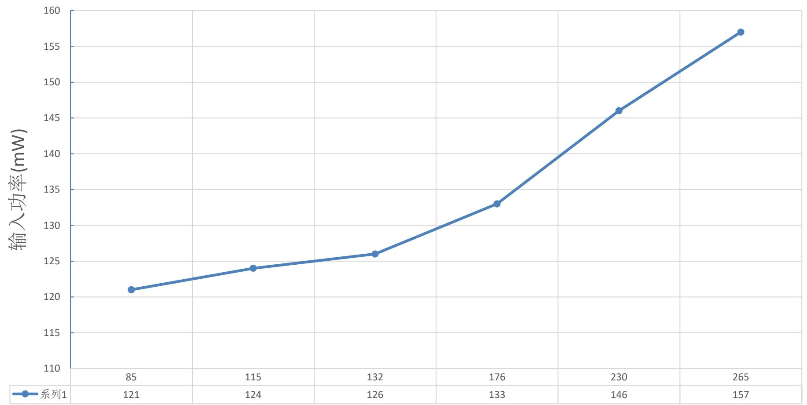

输入电压(VAC)

效率曲线  
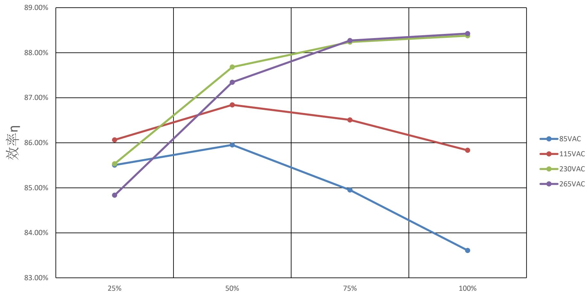

负载比例

<table><tr><td> $V_{IN}(VAC)$ </td><td>Load(%)</td><td> $P_{IN}(W)$ </td><td> $V_{OUT}(V)$ </td><td> $I_{OUT}(A)$ </td><td> $P_{OUT}(W)$ </td><td>Eff(%)</td><td>AVG Eff(%)</td></tr><tr><td rowspan="6">85</td><td>空载</td><td></td><td></td><td>0</td><td>0</td><td></td><td></td></tr><tr><td>10%</td><td>1.49</td><td>24.108</td><td>0.05</td><td>1.2054</td><td>80.90%</td><td></td></tr><tr><td>25%</td><td>3.52</td><td>24.078</td><td>0.125</td><td>3.00975</td><td>85.50%</td><td rowspan="4">85.00%</td></tr><tr><td>50%</td><td>7.01</td><td>24.101</td><td>0.25</td><td>6.02525</td><td>85.95%</td></tr><tr><td>75%</td><td>10.65</td><td>24.126</td><td>0.375</td><td>9.04725</td><td>84.95%</td></tr><tr><td>100%</td><td>14.44</td><td>24.146</td><td>0.5</td><td>12.073</td><td>83.61%</td></tr><tr><td rowspan="6">115</td><td>空载</td><td></td><td></td><td></td><td>0</td><td></td><td></td></tr><tr><td>10%</td><td>1.49</td><td>24.114</td><td>0.05</td><td>1.2057</td><td>80.92%</td><td></td></tr><tr><td>25%</td><td>3.5</td><td>24.098</td><td>0.125</td><td>3.01225</td><td>86.06%</td><td rowspan="4">86.31%</td></tr><tr><td>50%</td><td>6.95</td><td>24.142</td><td>0.25</td><td>6.0355</td><td>86.84%</td></tr><tr><td>75%</td><td>10.48</td><td>24.176</td><td>0.375</td><td>9.066</td><td>86.51%</td></tr><tr><td>100%</td><td>14.1</td><td>24.205</td><td>0.5</td><td>12.1025</td><td>85.83%</td></tr><tr><td rowspan="6">230</td><td>空载</td><td></td><td></td><td></td><td>0</td><td></td><td></td></tr><tr><td>10%</td><td>1.54</td><td>24.104</td><td>0.05</td><td>1.2052</td><td>78.26%</td><td></td></tr><tr><td>25%</td><td>3.52</td><td>24.086</td><td>0.125</td><td>3.01075</td><td>85.53%</td><td rowspan="4">87.46%</td></tr><tr><td>50%</td><td>6.88</td><td>24.13</td><td>0.25</td><td>6.0325</td><td>87.68%</td></tr><tr><td>75%</td><td>10.28</td><td>24.189</td><td>0.375</td><td>9.070875</td><td>88.24%</td></tr><tr><td>100%</td><td>13.68</td><td>24.18</td><td>0.5</td><td>12.09</td><td>88.38%</td></tr><tr><td rowspan="6">265</td><td>空载</td><td></td><td></td><td></td><td>0</td><td></td><td></td></tr><tr><td>10%</td><td>1.57</td><td>24.106</td><td>0.05</td><td>1.2053</td><td>76.77%</td><td></td></tr><tr><td>25%</td><td>3.55</td><td>24.093</td><td>0.125</td><td>3.011625</td><td>84.83%</td><td rowspan="4">87.22%</td></tr><tr><td>50%</td><td>6.91</td><td>24.142</td><td>0.25</td><td>6.0355</td><td>87.34%</td></tr><tr><td>75%</td><td>10.28</td><td>24.198</td><td>0.375</td><td>9.07425</td><td>88.27%</td></tr><tr><td>100%</td><td>13.68</td><td>24.193</td><td>0.5</td><td>12.0965</td><td>88.42%</td></tr></table>

## 输出电压调整率

<table><tr><td> $V_{IN}(VAC)$  $I_{OUT}(A)$ </td><td>90</td><td>115</td><td>132</td><td>176</td><td>230</td><td>265</td><td>平均值</td><td>线调整率</td></tr><tr><td>0</td><td>24.601</td><td>24.578</td><td>24.572</td><td>24.567</td><td>24.561</td><td>24.564</td><td>24.574</td><td>0.16%</td></tr><tr><td>20%</td><td>24.138</td><td>24.136</td><td>24.132</td><td>24.13</td><td>24.13</td><td>24.127</td><td>24.132</td><td>0.05%</td></tr><tr><td>40%</td><td>24.148</td><td>24.153</td><td>24.155</td><td>24.154</td><td>24.153</td><td>24.148</td><td>24.152</td><td>0.03%</td></tr><tr><td>60%</td><td>24.163</td><td>24.182</td><td>24.188</td><td>24.194</td><td>24.193</td><td>24.192</td><td>24.185</td><td>0.13%</td></tr><tr><td>80%</td><td>24.185</td><td>24.21</td><td>24.216</td><td>24.225</td><td>24.226</td><td>24.228</td><td>24.215</td><td>0.18%</td></tr><tr><td>100%</td><td>24.181</td><td>24.216</td><td>24.21</td><td>24.208</td><td>24.207</td><td>24.209</td><td>24.205</td><td>0.14%</td></tr><tr><td>平均值</td><td>24.236</td><td>24.246</td><td>24.246</td><td>24.246</td><td>24.245</td><td>24.245</td><td></td><td></td></tr><tr><td>负载调整率</td><td>1.91%</td><td>1.82%</td><td>1.81%</td><td>1.80%</td><td>1.78%</td><td>1.80%</td><td></td><td></td></tr></table>

◼ 计算方法：调整率=100%\*(最大值-最小值)/平均值

## OLP

<table><tr><td> $V_{IN}(VAC)$  $I_{OUT}(A)$ </td><td>85</td><td>264</td></tr><tr><td>0.66</td><td>24.079</td><td>24.16</td></tr><tr><td>0.72</td><td>22.093</td><td>24.138</td></tr><tr><td>0.78</td><td>20.823</td><td>24.11</td></tr><tr><td>0.84</td><td>19.74</td><td>24.074</td></tr><tr><td>0.9</td><td>18.79</td><td>23.39</td></tr><tr><td>0.96</td><td>18</td><td>21.82</td></tr><tr><td>1.02</td><td>17.29</td><td>20.364</td></tr><tr><td>1.08</td><td>16.72</td><td>19.17</td></tr><tr><td>1.14</td><td>16.15</td><td>18.057</td></tr><tr><td>1.2</td><td>15.54</td><td>17.05</td></tr><tr><td>1.26</td><td>OLP</td><td>16.23</td></tr><tr><td>1.32</td><td></td><td>15.44</td></tr><tr><td>1.38</td><td></td><td>OLP</td></tr></table>

## 输出电压纹波

20MHz带宽，去掉示波器探头正端夹子和地线环，10uF/50V 0.1uF/50V

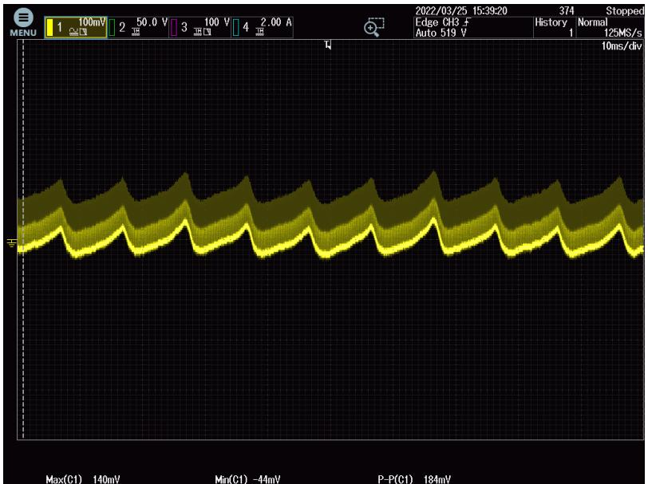

85 VAC  
CH1 VOUT $\mathsf { V } _ { \mathsf { O U T } }$ Ripple $V _ { \mathsf { P K - P K } } { = } 1 8 4 ~ \mathsf { m V }$  
➢ Full Load

Test Condition:

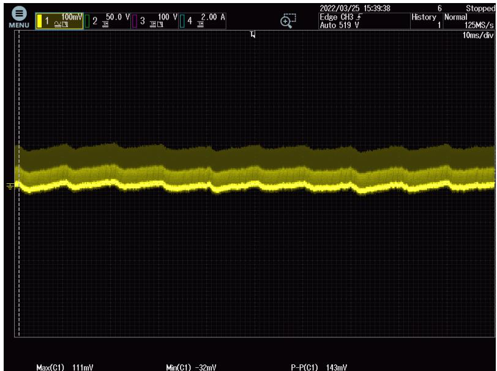

115 VAC  
CH1 VOUT ${ \mathsf { C H 1 } } { \mathsf { V } } _ { \mathsf { O U T } }$ Ripple $V _ { \mathsf { P K - P K } } { = } 1 4 3 ~ \mathsf { m V }$  
➢ Full Load

Test Condition:

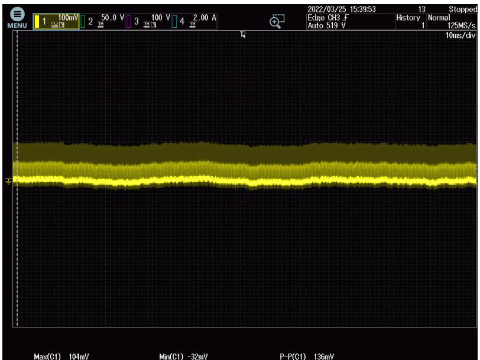

230 VAC  
CH1 VOUT $\mathsf { V } _ { \mathsf { O U T } }$ Ripple $v _ { p _ { \mathrm { K - P K } } } { = } 1 3 6 ~ \mathsf  m v$  
➢ Full Load

Test Condition:

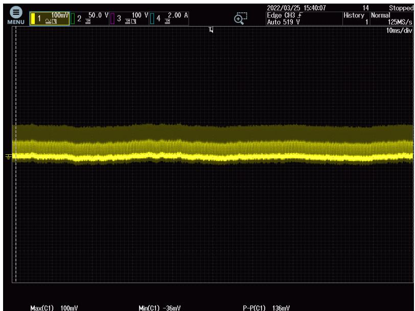

265 $\mathsf { v } _ { \mathsf { A C } }$  
CH1 VOUT $\mathsf { V } _ { \mathsf { O U T } }$ Ripple $v _ { p _ { \mathrm { K - P K } } } { = } 1 3 6 ~ \mathsf  m v$  
➢ Full Load

Test Condition:

## (50%-100%)

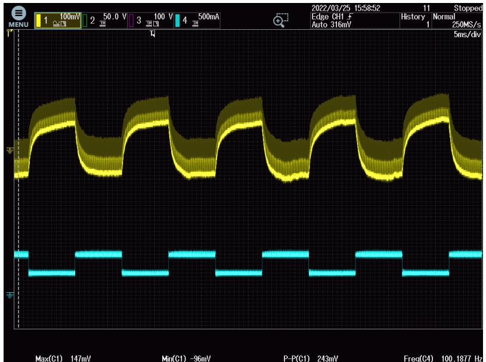

85 VAC

CH1 VOUT ${ \mathsf { C H 1 } } { \mathsf { V } } _ { \mathsf { O U T } }$ $V _ { P K - P K } = 2 4 3 ~ \mathsf { m V }$  
$\mathsf { C H 4 } \mathsf { I } _ { \mathsf { O U T } }$

## Test Condition:

➢ $0 . 2 5 \ : \mathsf { A } – 0 . 5 \ : \mathsf { A } – 0 . 2 5 \ : \mathsf { A }$  
➢ Slew Rate: 0.5 A/μS  
➢ Frequency: 100 Hz

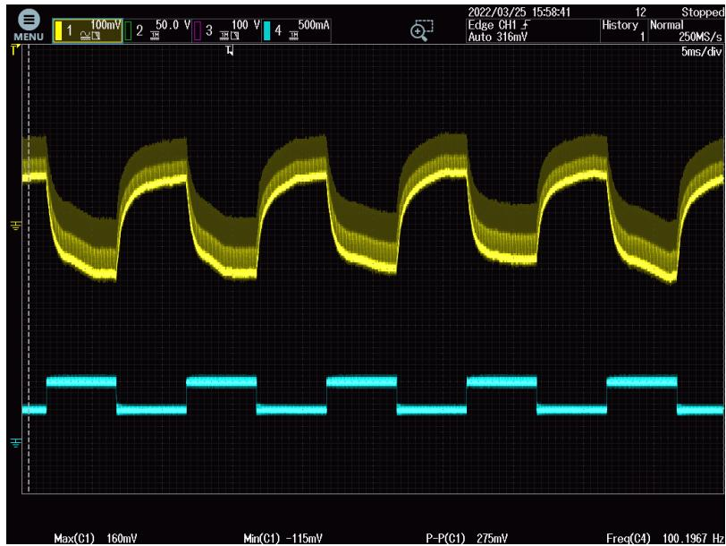

115 VAC

CH1 VOUT ${ \mathsf { C H 1 } } { \mathsf { V } } _ { \mathsf { O U T } }$ $V _ { P K - P K } = 2 7 5 m v$  
$\mathsf { C H 4 } \mathsf { I } _ { \mathsf { O U T } }$

## Test Condition:

➢ 0.25 A-0.5 A-0.25 A  
➢ Slew Rate: 0.5 A/μS  
➢ Frequency: 100 Hz

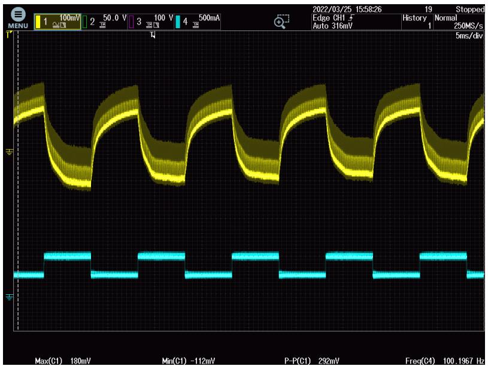

230 VAC

CH1 VOUT $\mathsf { V } _ { \mathsf { O U T } }$ $V _ { P K - P K } = 2 9 2 ~ \mathsf { m V }$  
$\mathsf { C H 4 } \mathsf { l } _ { \mathsf { O U T } }$

## Test Condition:

➢ 0.25 A-0.5 A-0.25 A  
➢ Slew Rate: 0.5 $\mathsf { A } / \mu \mathsf { S }$  
➢ Frequency: 100 Hz

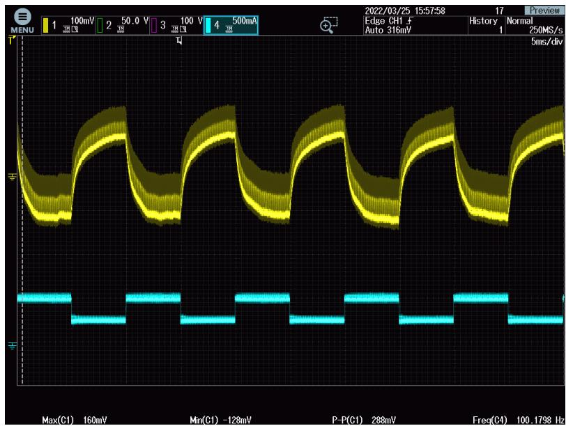

265 VAC

CH1 VOUT ${ \mathsf { C H 1 } } { \mathsf { V } } _ { \mathsf { O U T } }$ $v _ { p _ { \mathrm { K - P K } } } { = } 2 8 8 ~ \mathsf { m V }$  
$\mathsf { C H 4 } \mathsf { I } _ { \mathsf { O U T } }$

## Test Condition:

➢ 0.25 A-0.5 A-0.25 A  
➢ Slew Rate: 0.5 A/μS  
➢ Frequency: 100 Hz

## (10%-90%)

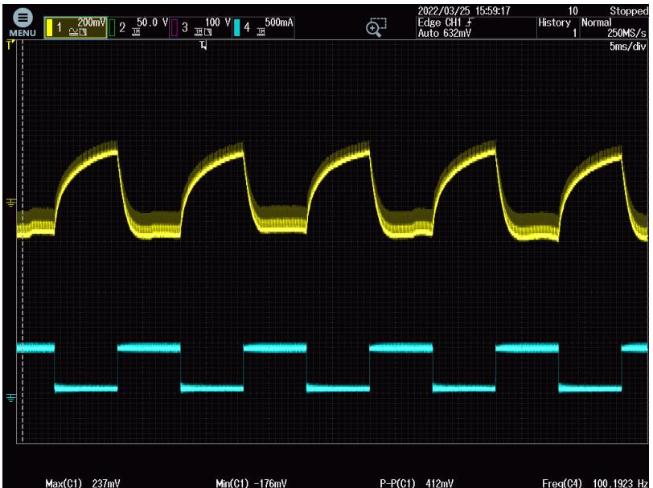

85 VAC

CH1 VOUT ${ \mathsf { C H 1 } } { \mathsf { V } } _ { \mathsf { O U T } }$ $\mathsf { V } _ { \mathsf { P K - P K } } { = } 4 1 2 \mathsf { m V }$  
$\mathsf { C H 4 } \mathsf { I } _ { \mathsf { O U T } }$

## Test Condition:

➢ $0 . 0 5 \ : \mathsf { A } – 0 . 4 5 \mathsf { A } – 0 . 0 5 \ : \mathsf { A }$  
➢ Slew Rate: 0.5 A/μS  
➢ Frequency: 100 Hz

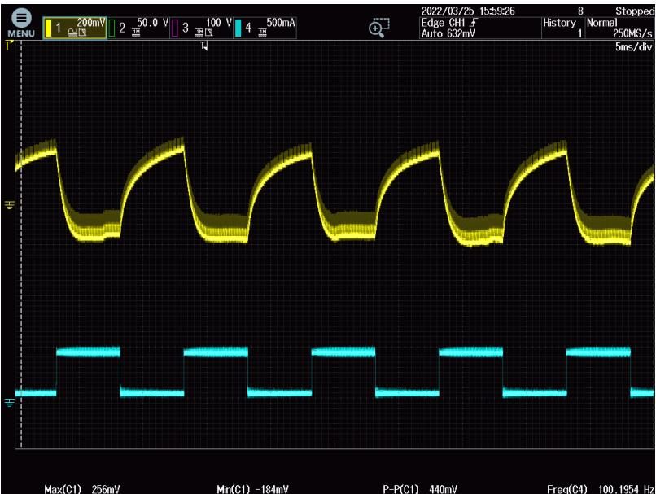

115 VAC

CH1 VOUT ${ \mathsf { C H 1 } } { \mathsf { V } } _ { \mathsf { O U T } }$ $V _ { P K - P K } = 4 4 0 m v$  
$\mathsf { C H 4 } \mathsf { I } _ { \mathsf { O U T } }$

## Test Condition:

➢ $0 . 0 5 \ : \mathsf { A } – 0 . 4 5 \mathsf { A } – 0 . 0 5 \ : \mathsf { A }$  
➢ Slew Rate: 0.5 A/μS  
➢ Frequency: 100 Hz

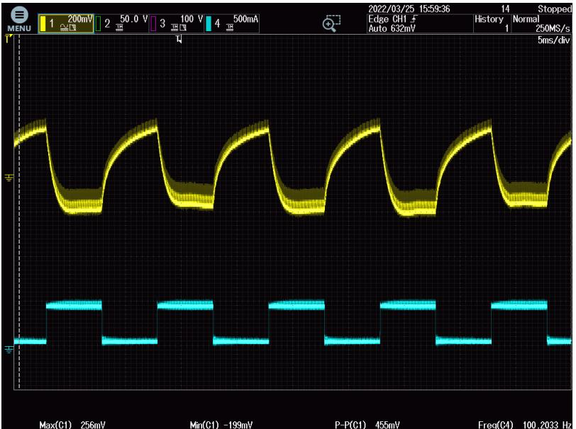

230 VAC

CH1 VOUT ${ \mathsf { C H 1 } } { \mathsf { V } } _ { \mathsf { O U T } }$ $v _ { p _ { k - P K } } = 4 5 5 m v$  
$\mathsf { C H 4 } \mathsf { l } _ { \mathsf { O U T } }$

## Test Condition:

➢ 0.05 A-0.45A-0.05 A  
➢ Slew Rate: 0.5 $\mathsf { A } / \mu \mathsf { S }$  
➢ Frequency: 100 Hz

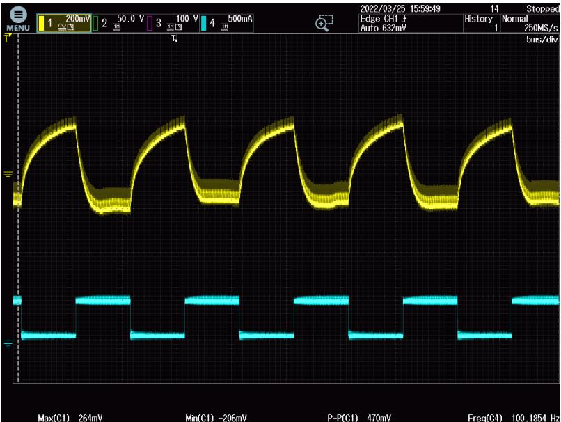

265 VAC

CH1 VOUT ${ \mathsf { C H 1 } } { \mathsf { V } } _ { \mathsf { O U T } }$ $V _ { P K - P K } = 4 7 0 m v$  
$\mathsf { C H 4 } \mathsf { I } _ { \mathsf { O U T } }$

## Test Condition:

➢ 0.05 A-0.45A-0.05 A  
➢ Slew Rate: 0.5 A/μS  
➢ Frequency: 100 Hz

## 输出电压开机波形

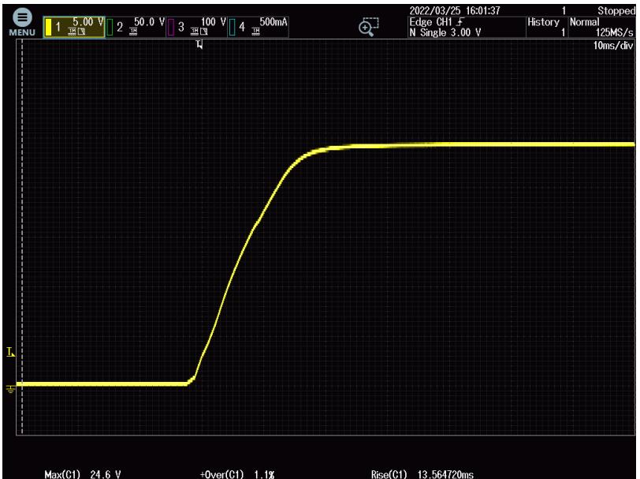

85 VAC

CH1 VOUT TRISE: 13.6 mS

## Test Condition:

➢ No Load

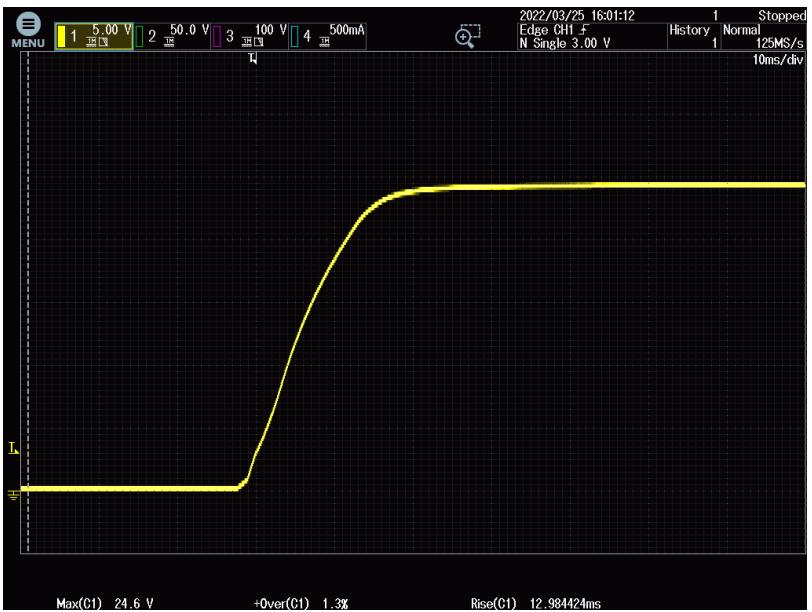

265 VAC

CH1 VOUT TRISE: 13 mS

## Test Condition:

➢ No Load

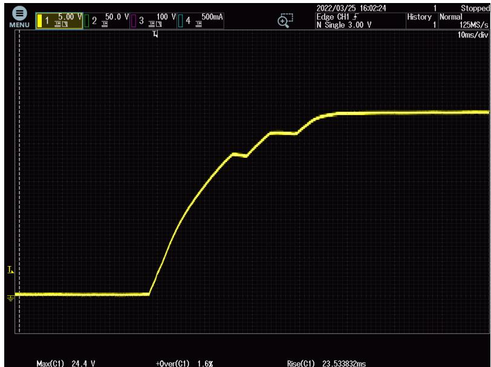

85 VAC

CH1 VOUT TRISE: 23.5 mS

## Test Condition:

➢ Full Load

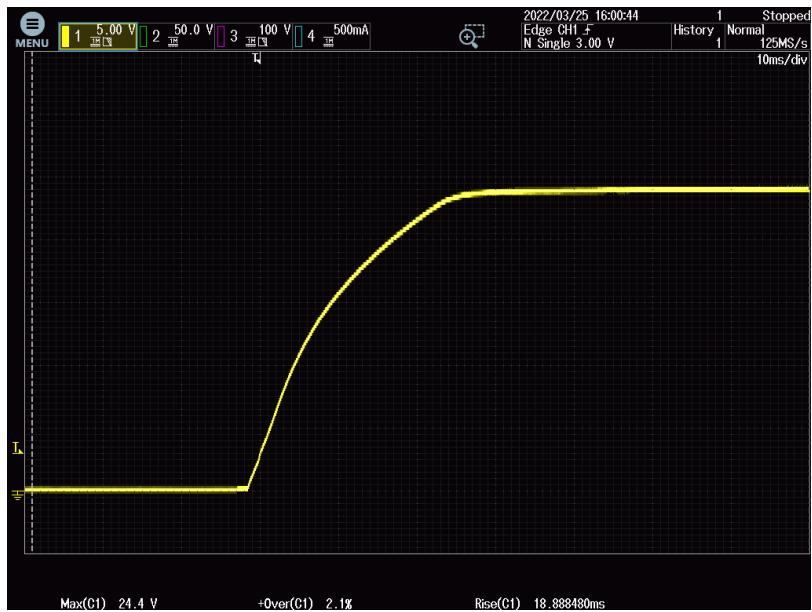

265 VAC

CH1 VOUT TRISE: 18.9 mS

## Test Condition:

➢ Full Load

## MOs漏源极电压电流波形 (启机)

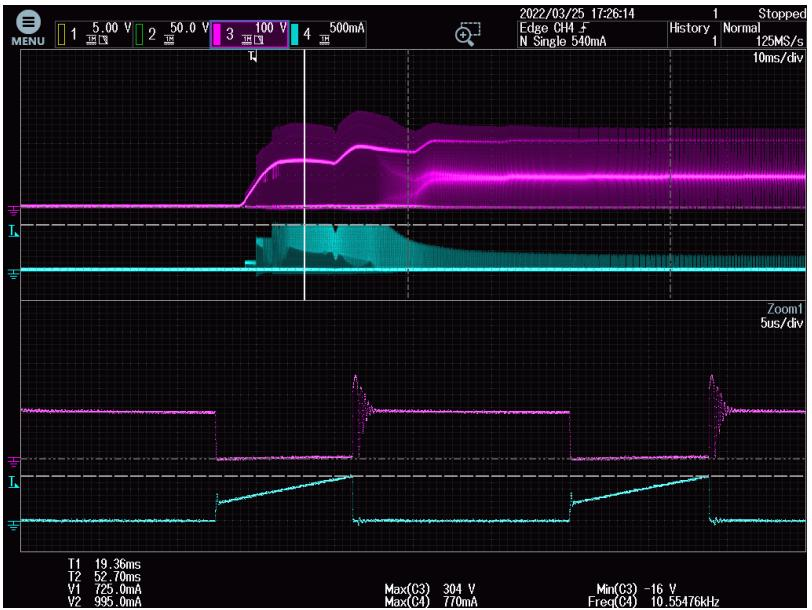

85 VAC

${ \mathsf { C H } } 2 { \mathsf { V } } _ { \mathsf { D S } }$  
$C H 4 1 _ { \mathsf { D } }$ $\mathtt { V _ { D S } } \mathtt { = } 3 0 4 \lor$ IMAX=0.77 A $\mathsf { I } _ { \mathsf { M A X } } { = } \mathsf { 0 } . 7 7 \mathsf { A }$

Test Condition:  
➢ No Load  
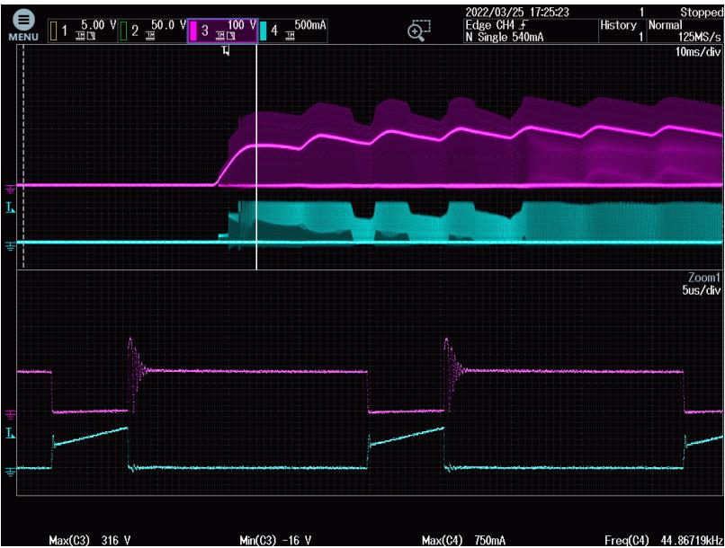

85 VAC

${ \mathsf { C H } } 2 { \mathsf { V } } _ { \mathsf { D S } }$  
$C H 4 1 _ { \mathsf { D } }$ $V _ { \mathsf { D } \mathsf { S } } ^ { } 3 1 6 \mathsf { V }$ IMAX= 0.75 A $\mathsf { I } _ { \mathsf { M A X } } = \mathbf { 0 . 7 5 } \ : \mathsf { A }$

Test Condition:  
➢ Full Load  
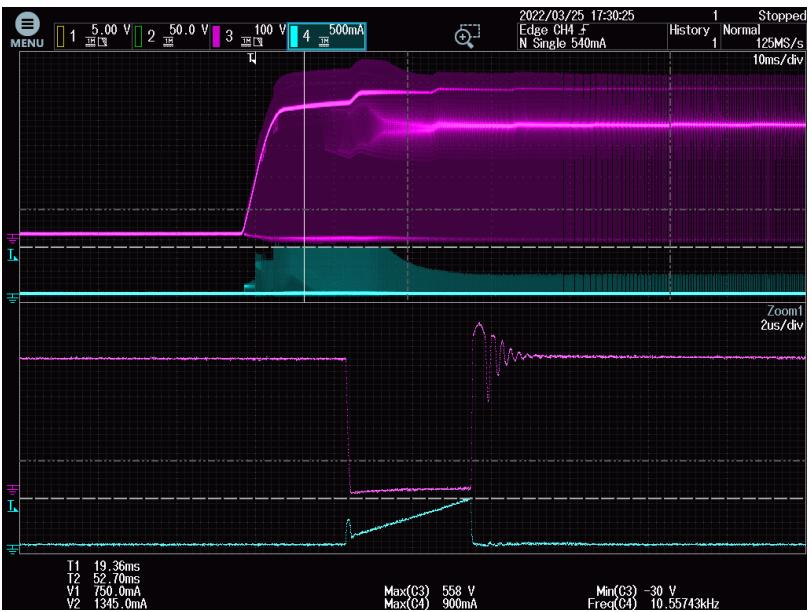

265 VAC

${ \mathsf { C H } } 2 \ { \mathsf { V } } _ { \mathsf { D S } }$  
$C H 4 1 _ { \mathsf { D } }$ $V _ { \mathsf { D S } } { = } 5 5 8 \mathsf { V }$ IMAX=0.9 A $\mathsf { I } _ { \mathsf { M A X } } { = } \mathsf { 0 } . 9 \mathsf { A }$

Test Condition:  
➢ No Load  
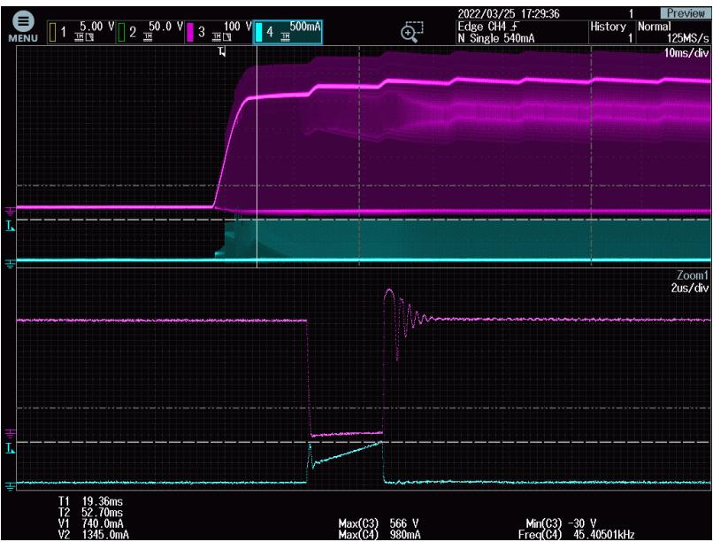

265 VAC

${ \mathsf { C H } } 2 { \mathsf { V } } _ { \mathsf { D S } }$  
$C H 4 1 _ { \mathsf { D } }$ $V _ { \mathsf { D S } } { = } 5 6 6 \lor$ $\mathsf { I } _ { \mathsf { M A X } } { = } \mathsf { 0 } . 9 8 \mathsf { A }$

Test Condition:

➢ Full Load

## MOS漏源极电压电流波形 (正常工作)

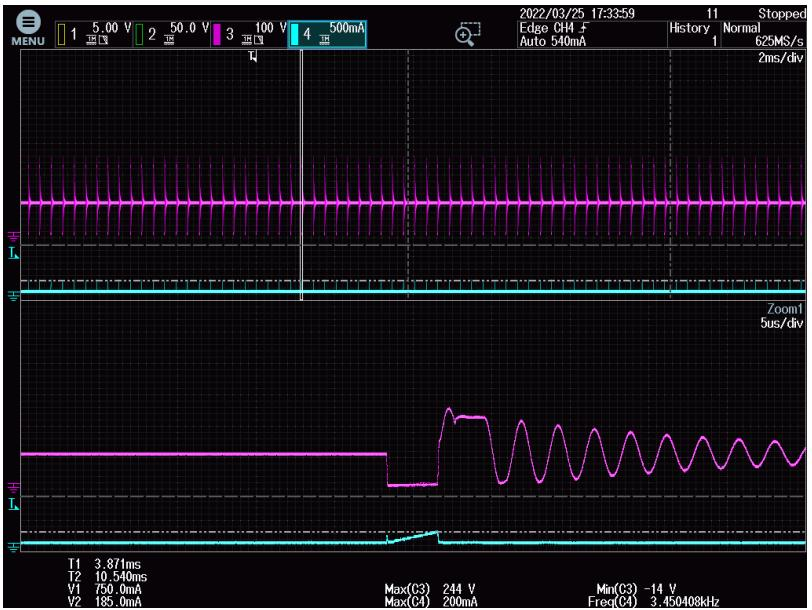

85 VAC

${ \mathsf { C H } } 2 { \mathsf { V } } _ { \mathsf { D S } }$  
$C H 4 1 _ { \mathsf { D } }$ $V _ { \mathsf { D S } } { = } 2 4 4 \vee$ IMAX= 200 mA $\mathsf { I } _ { \mathsf { M A X } } = 2 0 0 \mathsf { m A }$

Test Condition:  
➢ No Load  
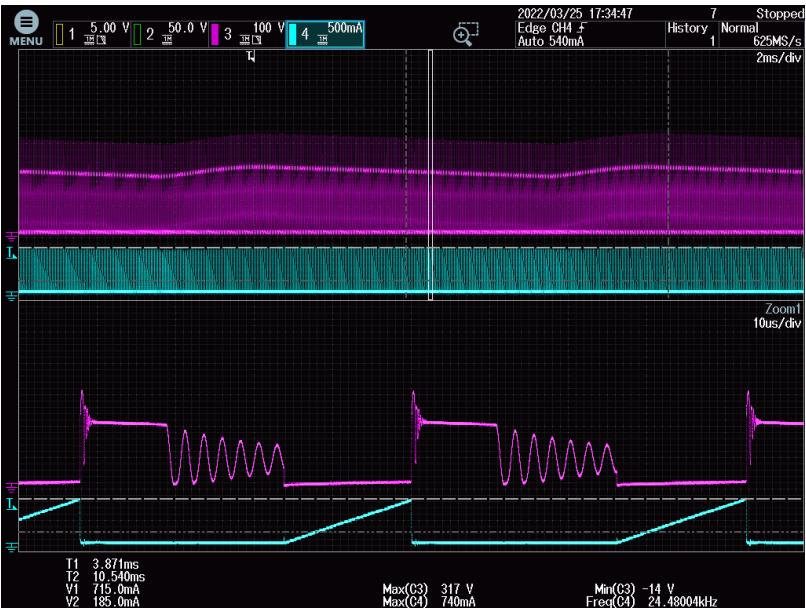

85 VAC

${ \mathsf { C H } } 2 { \mathsf { V } } _ { \mathsf { D S } }$  
$C H 4 1 _ { \mathsf { D } }$ $\mathtt { V } _ { \mathtt { D S } } mathtt { = } 3 1 7 \mathtt { V }$ IMAX= 0.74 A $\mathsf { I } _ { \mathsf { M A X } } = 0 . 7 4 \ : \mathsf { A }$

Test Condition:  
➢ Full Load  
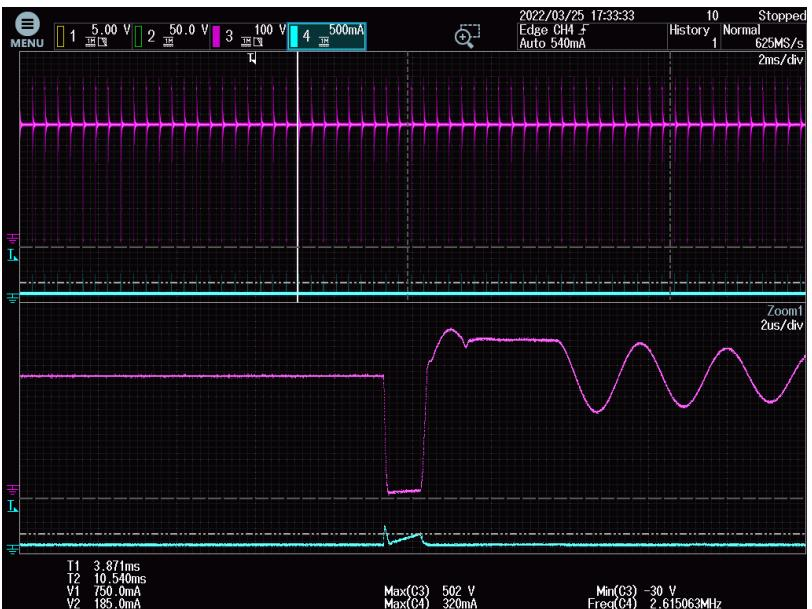

265 VAC

${ \mathsf { C H } } 2 \ { \mathsf { V } } _ { \mathsf { D S } }$  
$C H 4 1 _ { \mathsf { D } }$ $\mathtt { V } _ { \mathtt { D S } } mathtt { = } 5 0 2 \mathtt { V }$ IMAX=320 mA $\mathsf { I } _ { \mathsf { M A X } } { = } 3 2 0 \mathsf { m } \mathsf { A }$

Test Condition:  
➢ No Load  
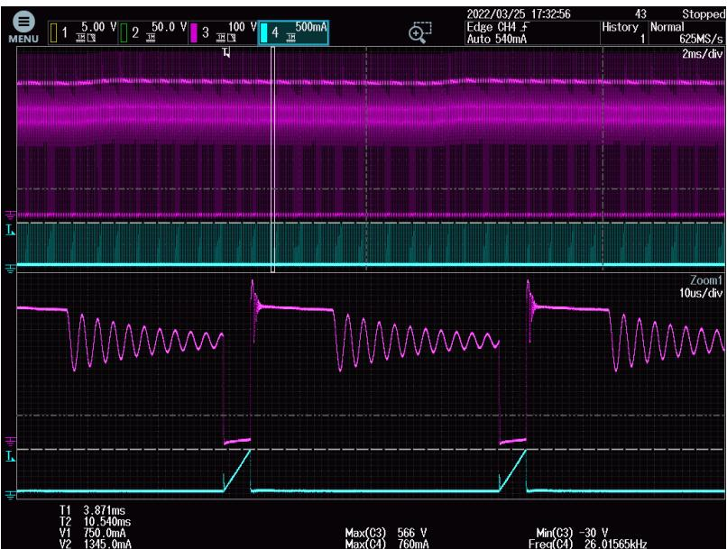

265 VAC

${ \mathsf { C H } } 2 { \mathsf { V } } _ { \mathsf { D S } }$  
$C H 4 1 _ { \mathsf { D } }$ $V _ { \mathsf { D S } } { = } 5 6 6 \lor$ $\mathsf { I } _ { \mathsf { M A X } } { = } 0 . 7 6 ~ \mathsf { A }$

Test Condition:

➢ Full Load

## 续流二极管电压波形

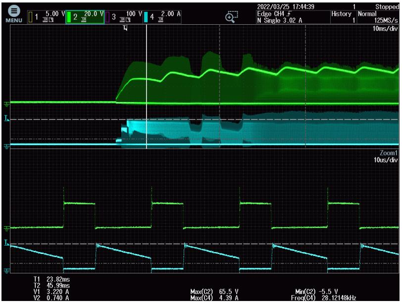

${ \otimes 5 } \mathsf { V } _ { \mathsf { A C } }$

$C H 2 V _ { \mathsf { D } }$  
$C H 4 1 _ { \mathsf { D } }$ $\mathtt { V } _ { \mathtt { D } } { = } 6 5 . 5 \mathtt { V }$ $\mathsf { I } _ { \mathsf { D } } { = } 4 . 3 9 \mathsf { A }$

Test Condition:

➢ Full Load  
➢ 开机

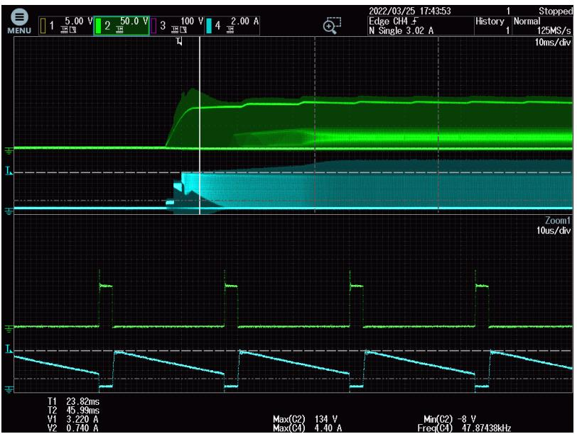

265 VAC

$C H 2 V _ { \mathsf { D } }$  
$C H 4 1 _ { \mathsf { D } }$ $\mathtt { V } _ { \mathtt { D } } \mathtt { = } 1 3 4 \mathtt { V }$ $\mathsf { I } _ { \mathsf { D } } { = } 4 . 4 \mathsf { A }$

➢ Full Load  
➢ 开机

Test Condition:  
85 VAC  
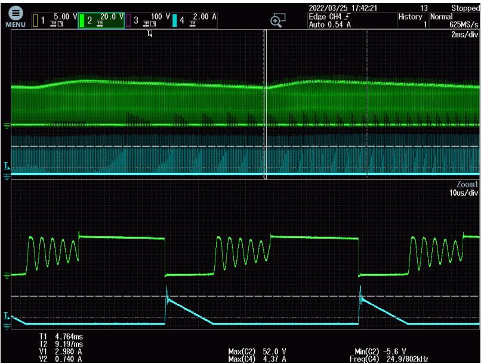

$C H 2 V _ { \mathsf { D } }$  
$C H 4 1 _ { \mathsf { D } }$ $\mathtt { V } _ { \mathtt { D } } \mathtt { = } 5 2 \ \mathtt { V }$ $\mathsf { I } _ { \mathsf { D } } { = } 4 . 3 7 \mathsf { A }$

Test Condition:  
➢ Full Load  
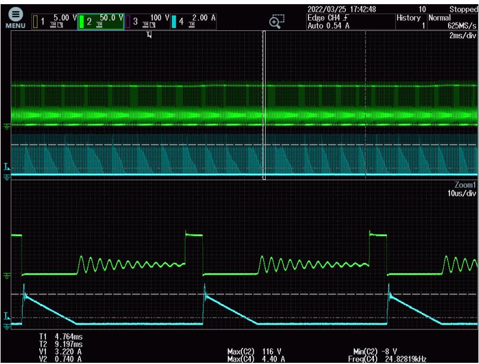

265 VAC

$C H 2 V _ { \mathsf { D } }$  
$C H 4 1 _ { \mathsf { D } }$ $\mathtt { V } _ { \mathtt { D } } mathtt { = } 1 1 6 \mathtt { V }$ $\mathsf { I } _ { \mathsf { D } } { = } 4 . 4 \mathsf { A }$

Test Condition:

➢ Full Load

## 输出短路时MOS和续流二极管波形

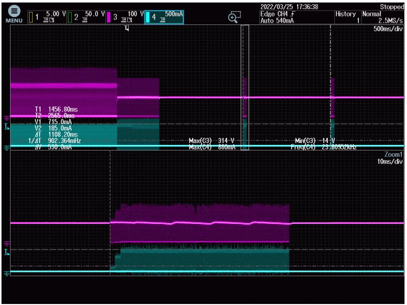

85 VAC

CH2 VDS  
CH4 ID $\begin{array} { r } { V _ { \mathsf { D S \_ m a x } } = 3 1 4 \ V } \\ { \mathsf { I _ { D S \_ m a x } } = 0 . 8 8 \ A } \end{array}$

## MOS

## Test Condition:

➢ Full Load

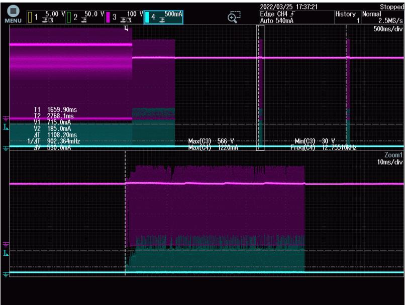

265 VAC

CH2 VDS  
CH4 ID $\begin{array} { r } { V _ { \mathsf { D S \_ m a x } } = 5 6 6 \vee } \\ { \mathsf { I _ { D S \_ m a x } } = 1 . 2 2 \mathsf { A } } \end{array}$

## MOS

## Test Condition:

➢ Full Load

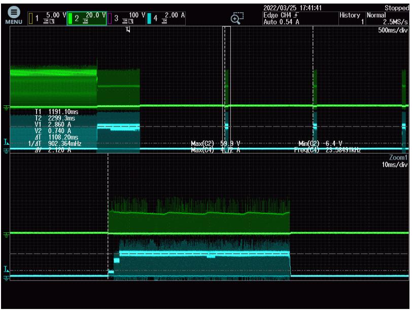

85 VAC

CH2 VD  
CH4 ID $\begin{array} { r l } & { \mathsf { V } _ { \mathsf { D \_ m a x } } = 5 9 . 9 \mathsf { V } } \\ & { \mathsf { I } _ { \mathsf { D \_ m a x } } = 4 . 7 2 \mathsf { A } } \end{array}$

## 二极管

## Test Condition:

➢ Full Load

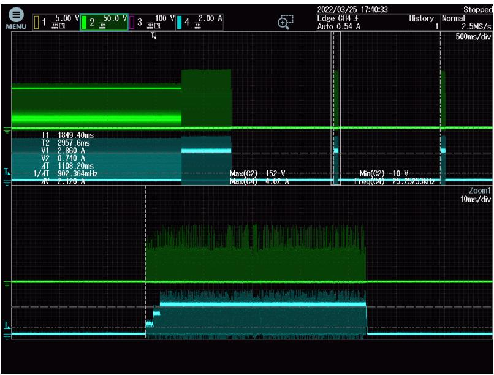

265 VAC

CH2 VD  
CH4 ID $\begin{array} { r l } & { \mathsf { V } _ { \mathsf { D \_ m a x } } = 1 5 2 \mathsf { V } } \\ & { \mathsf { I } _ { \mathsf { D \_ m a x } } = 4 . 0 2 \mathsf { A } } \end{array}$

## 二极管

## Test Condition:

➢ Full Load

## 温升测试

<table><tr><td rowspan="2">项目</td><td colspan="4">温度(°C)</td></tr><tr><td>85VAC</td><td>115VAC</td><td>230VAC</td><td>264VAC</td></tr><tr><td>环境温度</td><td>38.8</td><td>39.5</td><td>38.7</td><td>38.1</td></tr><tr><td>BPA8506D (U1)</td><td>106.3</td><td>93.6</td><td>82.2</td><td>81.5</td></tr><tr><td>SS220 (D3)</td><td>85.8</td><td>80.5</td><td>76.6</td><td>76.2</td></tr><tr><td>变压器绕组(T1)</td><td>79.6</td><td>76.9</td><td>74.6</td><td>74.3</td></tr><tr><td>变压器磁芯(T1)</td><td>76.8</td><td>74.1</td><td>71.6</td><td>71.3</td></tr><tr><td>输入电解电容(C2)</td><td>61.5</td><td>58.7</td><td>55.1</td><td>54.5</td></tr><tr><td>输出电解电容(C8)</td><td>66.3</td><td>63.8</td><td>61.5</td><td>61</td></tr><tr><td>钳位电阻(R1)</td><td>66.6</td><td>63.6</td><td>60.3</td><td>59.5</td></tr></table>

## 测试说明

➢ 在温箱中进行测试  
➢ 电路板放在一个封闭的盒子内  
➢ 热电偶连接到各个测量点  
➢ 等测量点温度达到稳定后记录数据

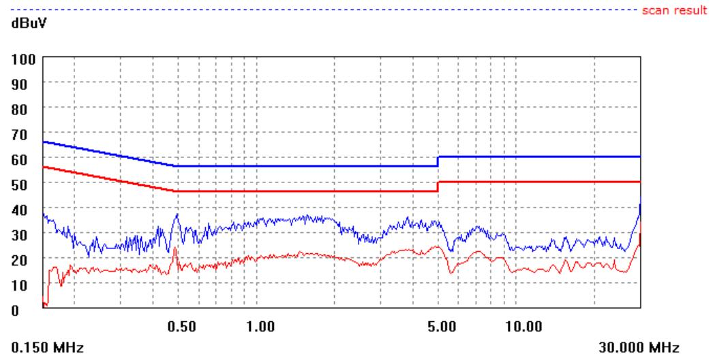

115VAC Line

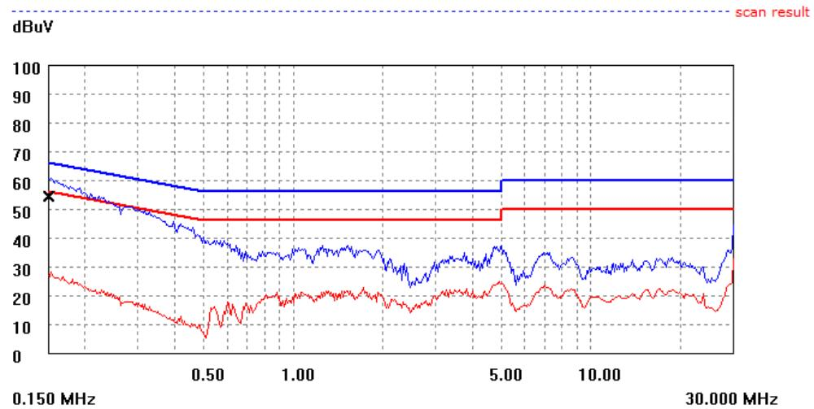

230VAC Line

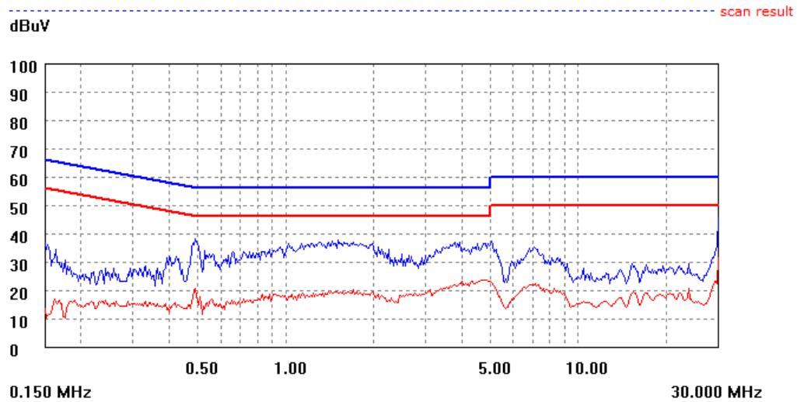

115VAC Neutral

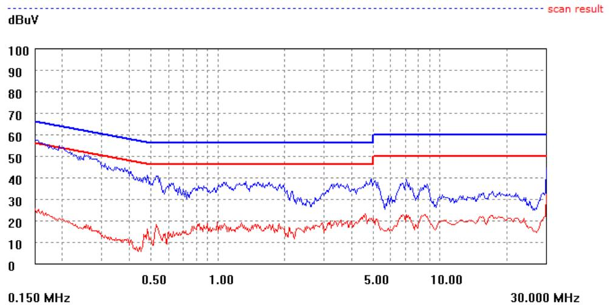

230VAC Neutral

<table><tr><td>差模</td><td>电压</td><td>相位角</td><td>发生器阻抗</td><td>测试次数</td><td>测试结果</td></tr><tr><td>L to N</td><td>+2kV</td><td>0</td><td>2</td><td>10</td><td>Pass</td></tr><tr><td>L to N</td><td>-2kV</td><td>0</td><td>2</td><td>10</td><td>Pass</td></tr><tr><td>L to N</td><td>+2kV</td><td>90</td><td>2</td><td>10</td><td>Pass</td></tr><tr><td>L to N</td><td>-2kV</td><td>90</td><td>2</td><td>10</td><td>Pass</td></tr><tr><td>L to N</td><td>+2kV</td><td>180</td><td>2</td><td>10</td><td>Pass</td></tr><tr><td>L to N</td><td>-2kV</td><td>180</td><td>2</td><td>10</td><td>Pass</td></tr><tr><td>L to N</td><td>+2kV</td><td>270</td><td>2</td><td>10</td><td>Pass</td></tr><tr><td>L to N</td><td>-2kV</td><td>270</td><td>2</td><td>10</td><td>Pass</td></tr></table>

## 测试说明

➢ 按照GB/T17626.5和IEC61000-4-5的最新版本要求进行测试  
➢ 室温环境，230VAC输入，满载条件  
➢ 输入1.2/50us组合波浪涌电压  
➢ 每个测试点重复10次  
➢ 每次间隔时间1分钟  
➢ 试验时样机输出正常（符合A类标准）视为Pass

<table><tr><td>测试点</td><td>电压(V)</td><td>放电类型</td><td>放电次数</td><td>测试结果</td></tr><tr><td>Vo</td><td>+15kV</td><td>空气放电</td><td>10</td><td>Pass</td></tr><tr><td>Vo</td><td>-15kV</td><td>空气放电</td><td>10</td><td>Pass</td></tr><tr><td>GND</td><td>+15kV</td><td>空气放电</td><td>10</td><td>Pass</td></tr><tr><td>GND</td><td>-15kV</td><td>空气放电</td><td>10</td><td>Pass</td></tr><tr><td>Vo</td><td>+8kV</td><td>接触放电</td><td>10</td><td>Pass</td></tr><tr><td>Vo</td><td>-8kV</td><td>接触放电</td><td>10</td><td>Pass</td></tr><tr><td>GND</td><td>+8kV</td><td>接触放电</td><td>10</td><td>Pass</td></tr><tr><td>GND</td><td>-8kV</td><td>接触放电</td><td>10</td><td>Pass</td></tr></table>

## 测试说明

➢ 按照GB/T17626.2和IEC61000-4-2的最新版本要求进行测试  
➢ 室温环境，230VAC输入满载条件  
➢ 每个测试点重复10次  
➢ 分别对输出正端和地进行空气放电  
➢ 试验时样机输出正常（符合A类标准）视为Pass

## THANK YOU FOR WATCHING
