## BPA8506D非隔离参考设计

## (48VIN-12V/300mA)

上海晶丰明源半导体股份有限公司

Shanghai Bright Power Semiconductor Co., Ltd.

陈耀兵

2021 3 18

## 内容

BPA8506D  
电源规格  
电路及实物图  
BOM  
PCB Layout  
性能测试数据

## 产品特点:

650V MOSFET  
PWM控制模式，低输出纹波  
内置软启动功能  
集成高压启动、自供电电路  
低音频噪声

## 应用领域:

家用电器辅助电源  
电机驱动辅助电源  
➢ IOT/ /  
工业控制辅助电源

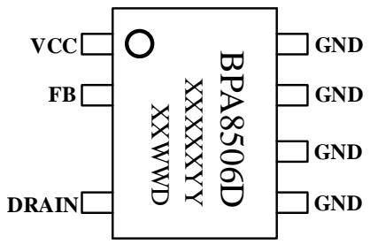

SOP7

<table><tr><td>项目描述</td><td>符号</td><td>最小</td><td>典型</td><td>最大</td><td>单位</td><td>备注</td></tr><tr><td colspan="7">输入</td></tr><tr><td>电压</td><td> $V_{IN}$ </td><td>43</td><td>48</td><td>53</td><td> $V_{DC}$ </td><td></td></tr><tr><td colspan="7">输出</td></tr><tr><td>输出电压</td><td> $V_{OUT}$ </td><td>11.4</td><td>12</td><td>12.6</td><td>V</td><td>±5%</td></tr><tr><td>输出电流</td><td> $I_{OUT}$ </td><td>0</td><td></td><td>300</td><td>mA</td><td></td></tr><tr><td>输出电压纹波</td><td> $V_{RIPPLE}$ </td><td></td><td></td><td>100</td><td>mV</td><td>20MHz带宽</td></tr><tr><td>连续输出功率</td><td> $P_{OUT}$ </td><td></td><td>3.6</td><td></td><td>W</td><td></td></tr><tr><td colspan="7">效率</td></tr><tr><td>待机功耗</td><td> $P_{STDBY}$ </td><td></td><td></td><td>100</td><td>mW</td><td>48VDC,包含假负载</td></tr><tr><td>满载效率</td><td>η</td><td>70</td><td></td><td></td><td>%</td><td></td></tr><tr><td colspan="7">环境</td></tr><tr><td>Surge</td><td></td><td></td><td>2</td><td></td><td>kV</td><td>差模</td></tr><tr><td>EFT</td><td></td><td></td><td>4</td><td></td><td>kV</td><td>5kHz/100kHz/38kHz</td></tr><tr><td>ESD</td><td></td><td></td><td>15</td><td>20</td><td>kV</td><td>空气放电</td></tr><tr><td>工作环境温度</td><td> $T_{AMP}$ </td><td>0</td><td></td><td>50</td><td>°C</td><td></td></tr></table>

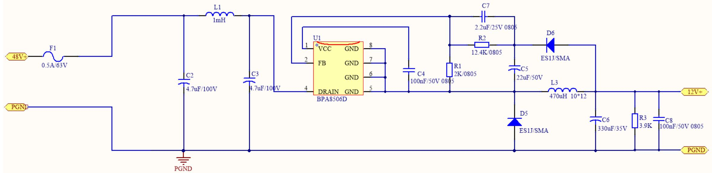

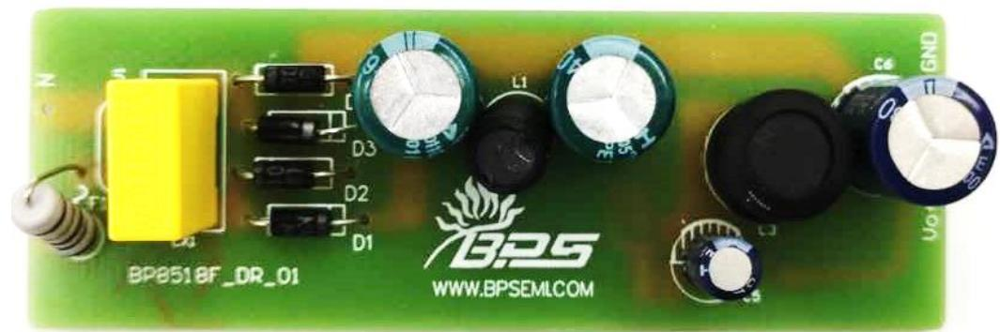

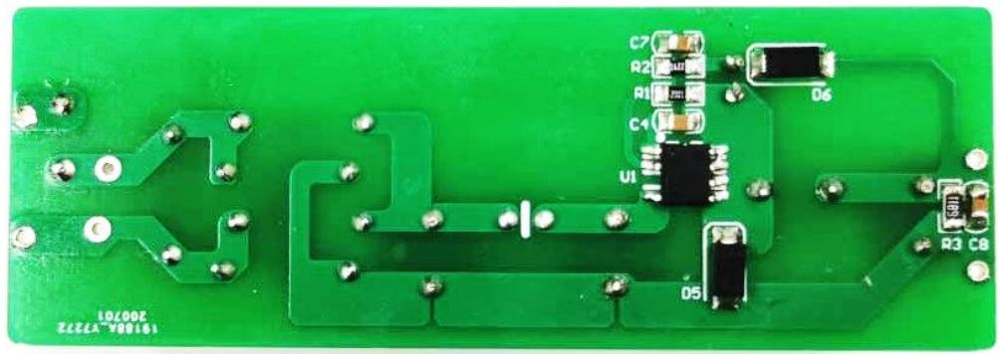

<table><tr><td>序号</td><td>元件标号</td><td>参数描述</td><td>封装尺寸</td><td>数量</td></tr><tr><td>1</td><td>PCB</td><td>CEM-1, 单面板</td><td>92.4mm*33mm</td><td>1</td></tr><tr><td>2</td><td>F1</td><td>0.5A/63V, 贴片保险丝</td><td>1206</td><td>1</td></tr><tr><td>3</td><td>D5,D6</td><td>ES1J, 1A/600V, trr=35ns</td><td>SMA</td><td>2</td></tr><tr><td>4</td><td>L1</td><td>1mH, 工字电感</td><td>∅6*8mm</td><td>1</td></tr><tr><td>5</td><td>L3</td><td>1.5mH, 工字电感, IRMS=300mA</td><td>∅10*12mm</td><td>1</td></tr><tr><td>6</td><td>C2, C3</td><td>4.7uF/400V, 电解电容</td><td>∅8*12mm</td><td>2</td></tr><tr><td>7</td><td>C5</td><td>22uF/50V, 电解电容</td><td>∅5*12mm</td><td>1</td></tr><tr><td>8</td><td>C6</td><td>330uF/35V, 电解电容</td><td>∅10*16mm</td><td>1</td></tr><tr><td>9</td><td>C7</td><td>2.2uF/25V, X7R, 瓷片电容</td><td>SMD0805</td><td>1</td></tr><tr><td>10</td><td>C4, C8</td><td>100nF/50V, X7R, 瓷片电容</td><td>SMD0805</td><td>2</td></tr><tr><td>11</td><td>R1</td><td>2K, ±1%</td><td>SMD0805</td><td>1</td></tr><tr><td>12</td><td>R2</td><td>12.4K, ±1%</td><td>SMD0805</td><td>1</td></tr><tr><td>13</td><td>R3</td><td>3.9K, ±5%</td><td>SMD0805</td><td>1</td></tr><tr><td>14</td><td>U1</td><td>BPA8506D, SOP7</td><td>SOP7</td><td>1</td></tr><tr><td></td><td></td><td></td><td></td><td></td></tr><tr><td></td><td></td><td></td><td></td><td></td></tr><tr><td></td><td></td><td></td><td>Total</td><td>18</td></tr></table>

待机功耗  
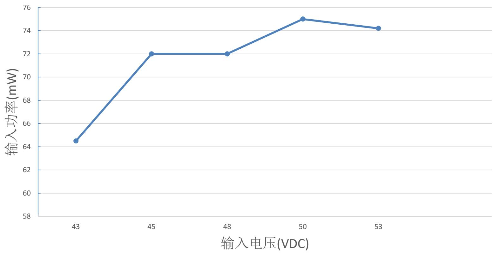

<table><tr><td>输入电压(VDC)</td><td>43</td><td>45</td><td>48</td><td>50</td><td>53</td></tr><tr><td>输入功率(mW)</td><td>64.5</td><td>72</td><td>72</td><td>75</td><td>74.2</td></tr></table>

效率曲线  
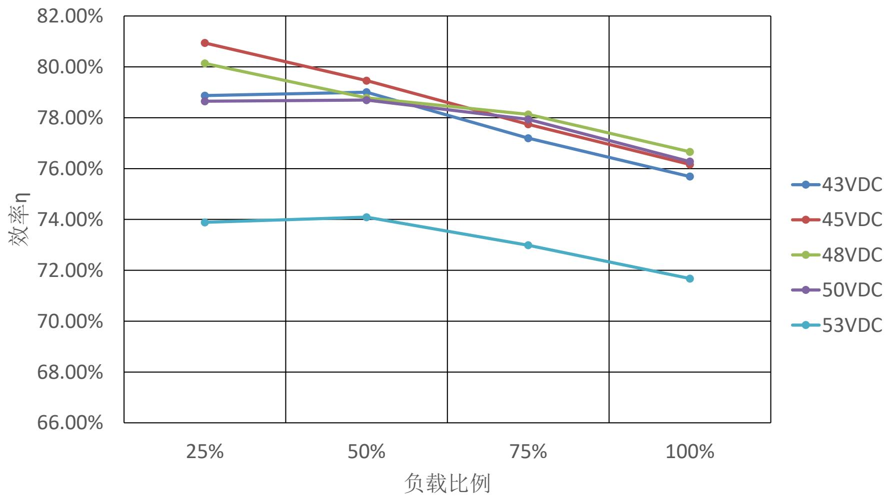

## 输出电压调整率

<table><tr><td> $V_{IN}(VDC)$  $I_{OUT}(A)$ </td><td>43</td><td>45</td><td>48</td><td>50</td><td>53</td><td>平均值</td><td>线调整率</td></tr><tr><td>0</td><td>12.091</td><td>12.088</td><td>12.082</td><td>12.086</td><td>12.08</td><td>12.085</td><td>0.09%</td></tr><tr><td>20%</td><td>11.807</td><td>11.812</td><td>11.804</td><td>11.807</td><td>11.809</td><td>11.808</td><td>0.07%</td></tr><tr><td>40%</td><td>11.782</td><td>11.785</td><td>11.781</td><td>11.782</td><td>11.783</td><td>11.783</td><td>0.03%</td></tr><tr><td>60%</td><td>11.775</td><td>11.777</td><td>11.775</td><td>11.777</td><td>11.777</td><td>11.776</td><td>0.02%</td></tr><tr><td>80%</td><td>11.776</td><td>11.777</td><td>11.774</td><td>11.781</td><td>11.775</td><td>11.777</td><td>0.06%</td></tr><tr><td>100%</td><td>11.776</td><td>11.774</td><td>11.775</td><td>11.78</td><td>11.768</td><td>11.775</td><td>0.10%</td></tr><tr><td>平均值</td><td>11.835</td><td>11.836</td><td>11.832</td><td>11.836</td><td>11.832</td><td></td><td></td></tr><tr><td>负载调整率</td><td>2.67%</td><td>2.65%</td><td>2.60%</td><td>2.61%</td><td>2.64%</td><td></td><td></td></tr></table>

◼ 计算方法：调整率=100%\*(最大值-最小值)/平均值  
测试条件：带3.9kΩ假负载

## 输出电压纹波

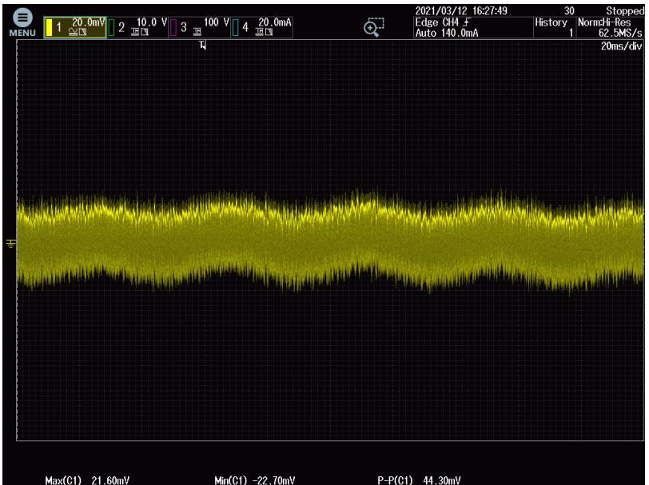

43 VDC  
  
Test Condition:  
➢ Full Load

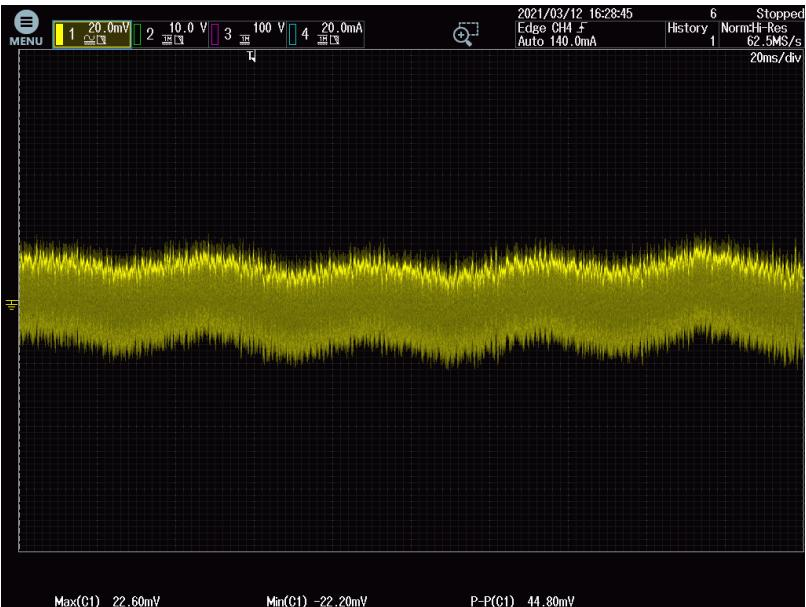

48 VDC  
  
Test Condition:  
➢ Full Load

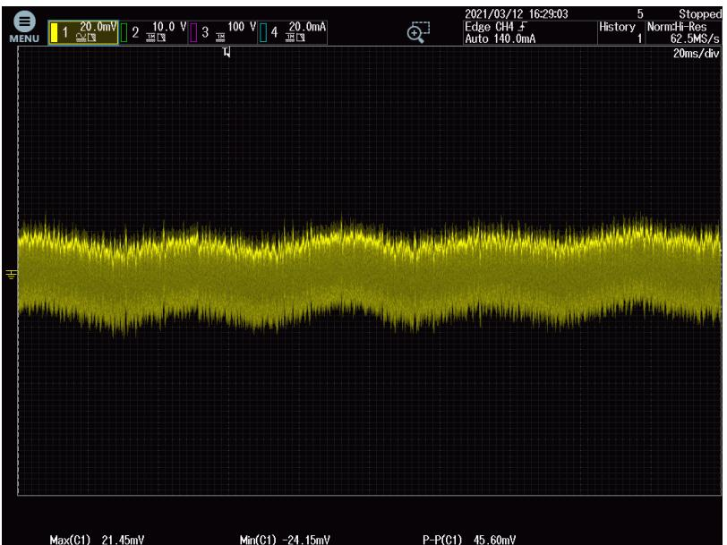

50 VDC  
  
Test Condition:  
➢ Full Load

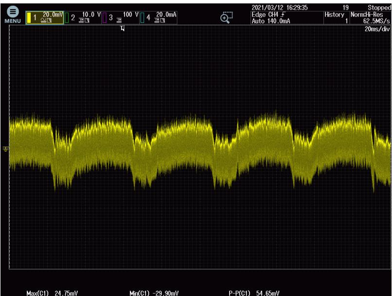

53 VDC  
  
Test Condition:  
➢ Full Load

## (50%-100%)

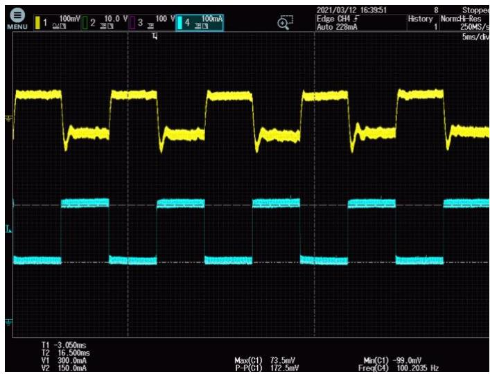

43 VDC

$\mathsf { C H 1 } \mathsf { V } _ { \mathsf { O U T } }$ $V _ { \mathsf { P K - P K } } { = } 1 7 2 . 5 \mathsf { m v }$  
$\mathsf { C H 4 } \mathsf { I } _ { \mathsf { O U T } }$

## Test Condition:

➢ 0.15 A-0.3 A-0.15 A  
➢ Slew Rate: 0.5 A/μS  
➢ Frequency: 100 Hz

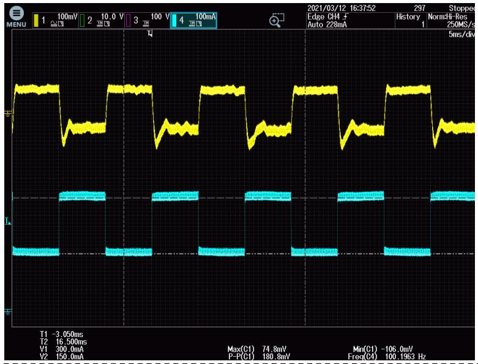

48 VDC

CH1 VOUT $\mathsf { C H 1 } \mathsf { V } _ { \mathsf { O U T } }$ $V _ { \mathsf { P K - P K } } = 1 8 0 . 8 ~ \mathsf { m V }$  
$\mathsf { C H 4 } \mathsf { I } _ { \mathsf { O U T } }$

## Test Condition:

➢ 0.15 A-0.3 A-0.15 A  
➢ Slew Rate: 0.5 A/μS  
➢ Frequency: 100 Hz

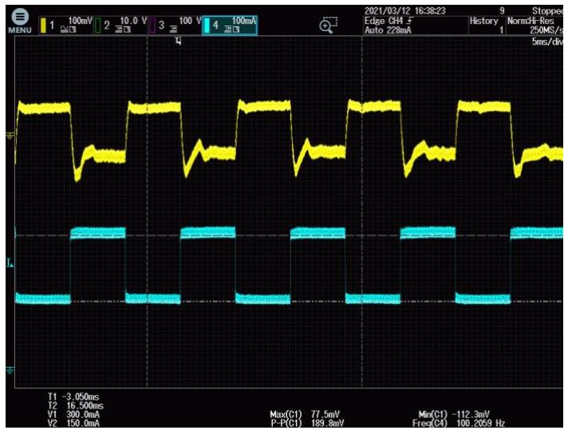

50 VDC

CH1 $\mathsf { V } _ { \mathsf { O U T } }$ $V _ { \mathsf { P K - P K } } = 1 8 9 . 8 ~ \mathsf { m V }$  
$\mathsf { C H 4 } \mathsf { l } _ { \mathsf { O U T } }$

## Test Condition:

➢ 0.15 A-0.3 A-0.15 A  
➢ Slew Rate: 0.5 A/μS  
➢ Frequency: 100 Hz

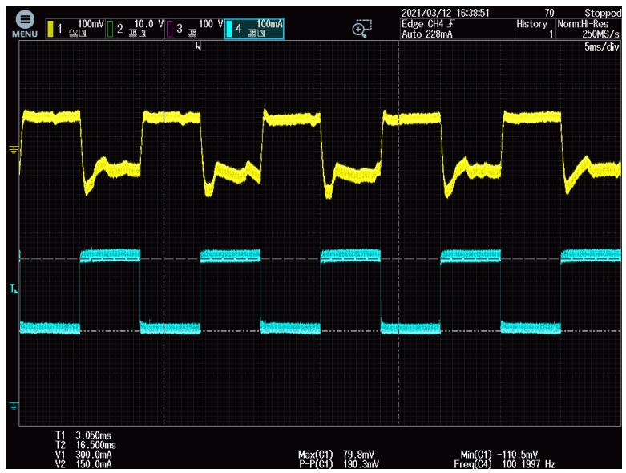

53 VDC

${ \mathsf { C H 1 } } { \mathsf { V } } _ { \mathsf { O U T } }$ $V _ { \mathsf { P K - P K } } = 1 9 0 . 3 ~ \mathsf { m V }$  
$\mathsf { C H 4 } \mathsf { I } _ { \mathsf { O U T } }$

## Test Condition:

➢ 0.15 A-0.3 A-0.15 A  
➢ Slew Rate: 0.5 A/μS  
➢ Frequency: 100 Hz

## (10%-90%)

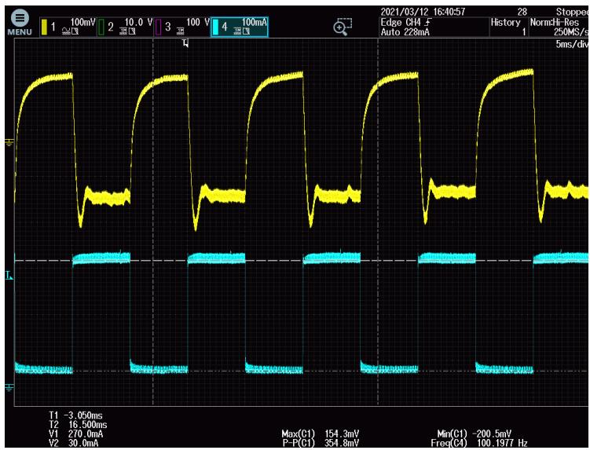

43 VDC

CH1 $\mathsf { V } _ { \mathsf { O U T } }$ $V _ { \mathsf { P K - P K } } = 3 5 4 . 8 ~ \mathsf { m V }$  
CH4 IOUT $\mathsf { C H 4 } \mathsf { I } _ { \mathsf { O U T } }$

## Test Condition:

➢ 0.03 A-0.27 A-0.03A  
➢ Slew Rate: 0.5 A/μS  
➢ Frequency: 100 Hz

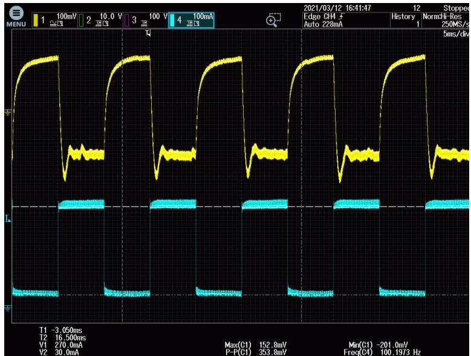

48 VDC

CH1 $\mathsf { V } _ { \mathsf { O U T } }$ $V _ { \mathsf { P K - P K } } = 3 5 3 . 8 ~ \mathsf { m V }$  
CH4 IOUT $\mathsf { C H 4 } \mathsf { I } _ { \mathsf { O U T } }$

## Test Condition:

➢ 0.03 A-0.27 A-0.03A  
➢ Slew Rate: 0.5 A/μS  
➢ Frequency: 100 Hz

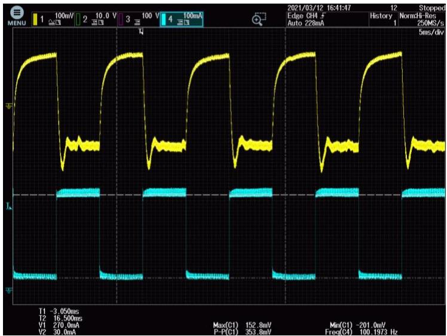

50 VDC

CH1 $\mathsf { V } _ { \mathsf { O U T } }$ $V _ { \mathsf { P K - P K } } = 3 5 3 . 8 ~ \mathsf { m V }$  
CH4 IOUT $\mathsf { C H 4 } \mathsf { I } _ { \mathsf { O U T } }$

## Test Condition:

➢ 0.03 A-0.27 A-0.03A  
➢ Slew Rate: 0.5 $\mathsf { A } / \mu \mathsf { S }$  
➢ Frequency: 100 Hz

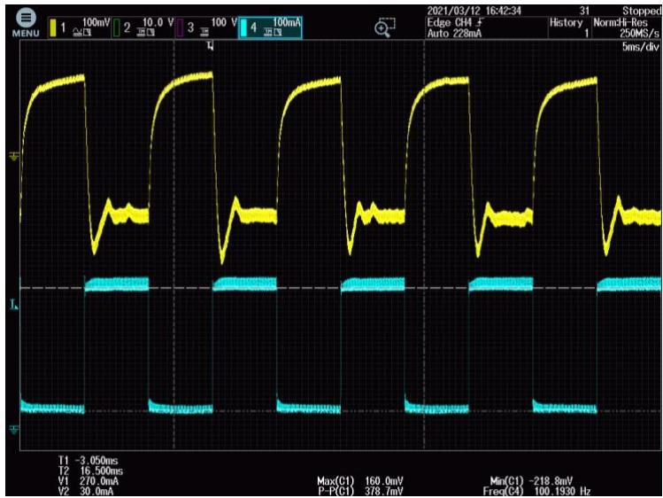

53 VDC

CH1 $\mathsf { V } _ { \mathsf { O U T } }$ $V _ { p | \mathrm { X - P K } } = 3 7 8 . 7 ~ \mathsf { m V }$  
$\mathsf { C H 4 } \mathsf { I } _ { \mathsf { O U T } }$

## Test Condition:

➢ 0.03 A-0.27 A-0.03A  
➢ Slew Rate: 0.5 A/μS  
➢ Frequency: 100 Hz

## 输出电压开机波形

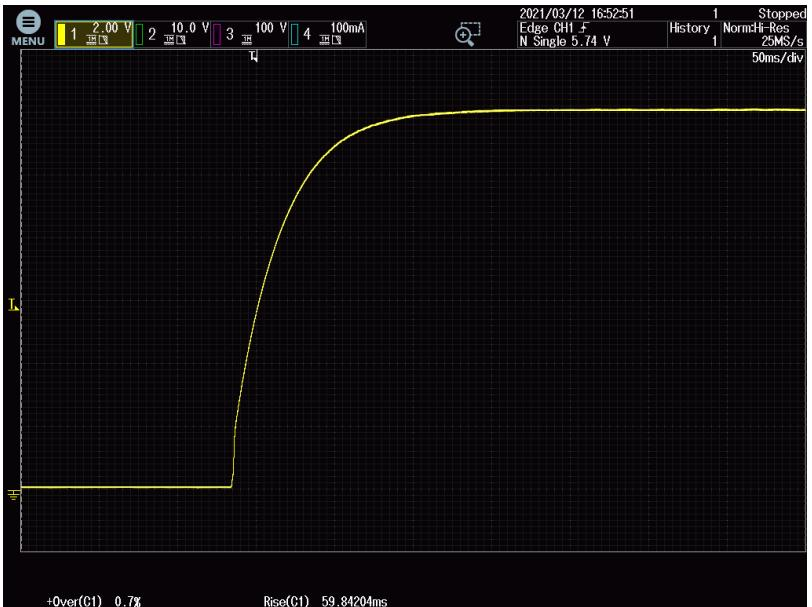

43 VDC  
  
Test Condition:  
➢ No Load

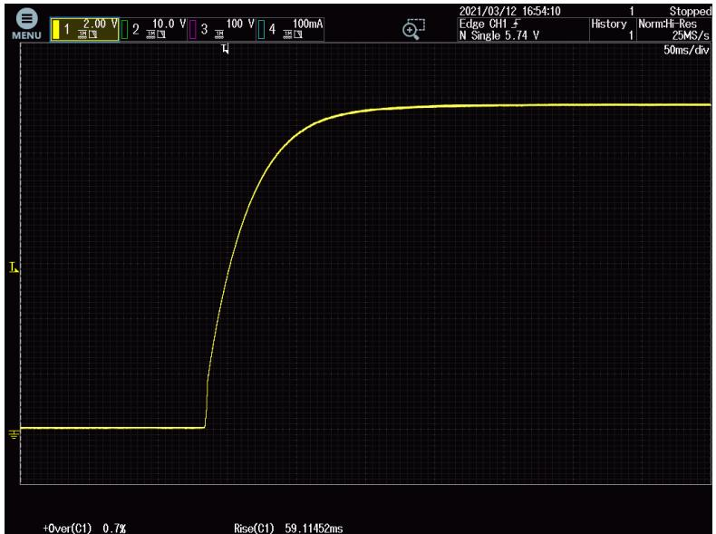

43 VDC  
  
Test Condition:  
➢ Full Load

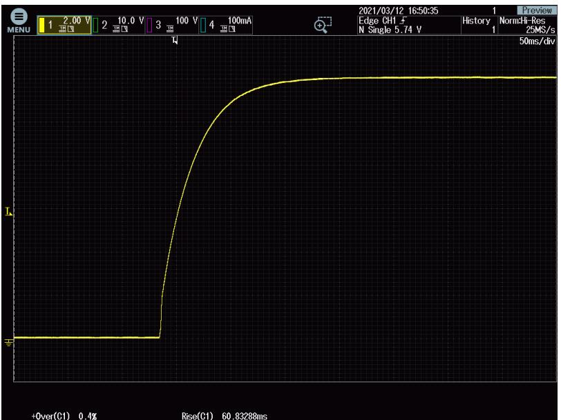

53 VDC  
  
Test Condition:  
➢ No Load

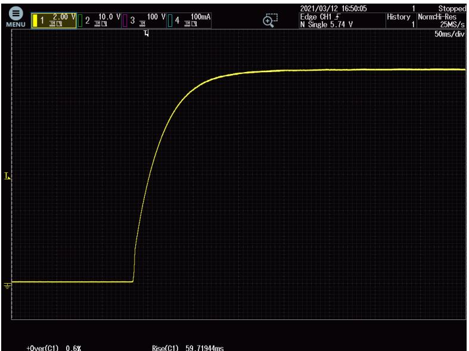

53 VDC  
  
Test Condition:  
➢ Full Load

## MOSFET

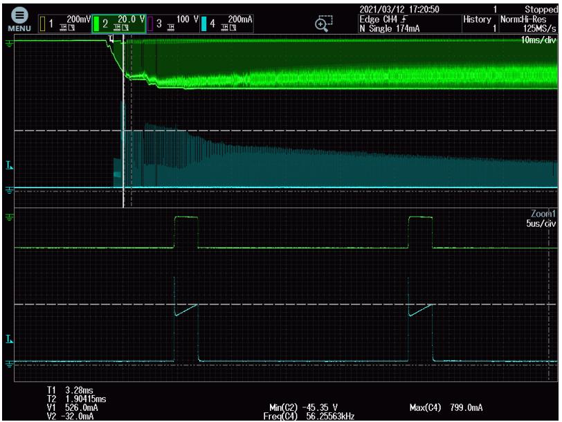

$43 \text{‰}$

${ \mathsf { C H } } 2 { \mathsf { V } } _ { \mathsf { D S } }$  
$C H 4 \mid _ { \mathrm { D S } }$

$$
\begin{array}{l} \mathrm {V_ {DS\_MAX}} = 4 5. 3 5 \mathrm{V} \\ \mathrm {I_ {DS\_MAX}} = 0. 7 9 9 \mathrm{A} \end{array}
$$

## Test Condition:

➢ No Load

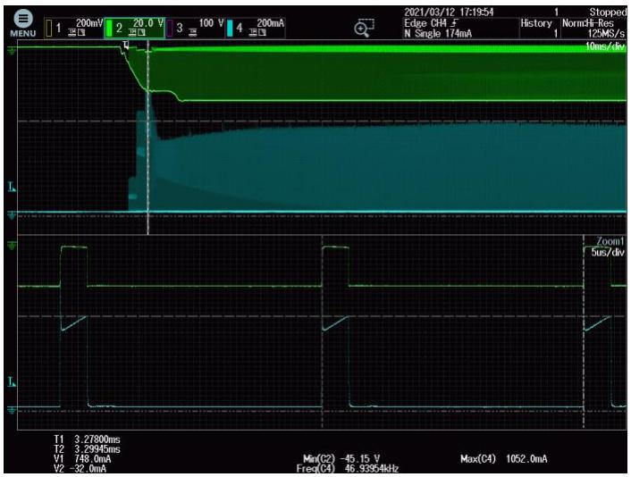

$43 \text{‰}$

${ \mathsf { C H } } 2 { \mathsf { V } } _ { \mathsf { D S } }$  
$C H 4 \mid _ { \mathrm { { D S } } }$

$$
\begin{array}{l} \mathrm {V_ {DS\_MAX}} = 4 5. 1 5 \mathrm{V} \\ \mathrm {I_ {DS\_MAX}} = 1. 0 5 2 \mathrm{A} \end{array}
$$

## Test Condition:

➢ Full Load

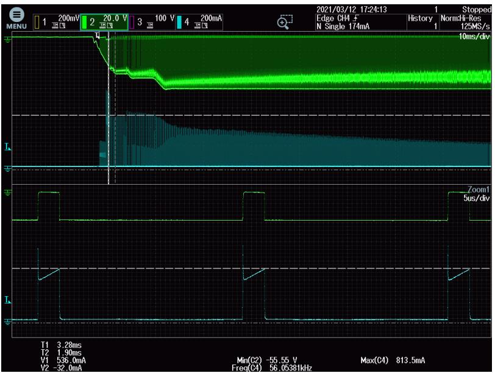

$5 3 V _ { \sf D C }$

${ \mathsf { C H } } 2 \ { \mathsf { V } } _ { \mathsf { D S } }$  
$C H 4 \mid _ { \mathrm { { D S } } }$

$$
\begin{array}{l} V _ {D S \_ M A X} = 5 5. 5 5 V \\ I _ {D S \_ M A X} = 0. 8 1 4 A \end{array}
$$

## Test Condition:

➢ No Load

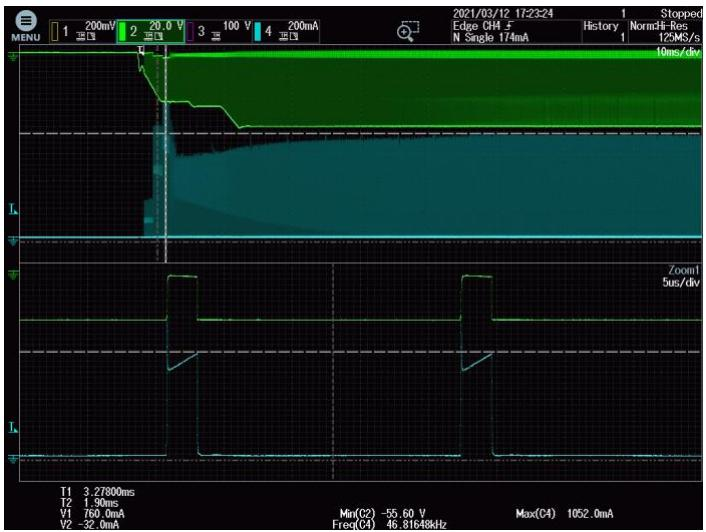

$5 3 \text{‰}$

${ \mathsf { C H } } 2 { \mathsf { V } } _ { \mathsf { D S } }$  
$C H 4 1 _ { \mathrm { D S } }$

$$
\begin{array}{l} V _ {D S \_ M A X} = 5 5. 6 V \\ I _ {D S \_ M A X} = 1. 0 5 2 A \end{array}
$$

## Test Condition:

➢ Full Load

## MOSFET

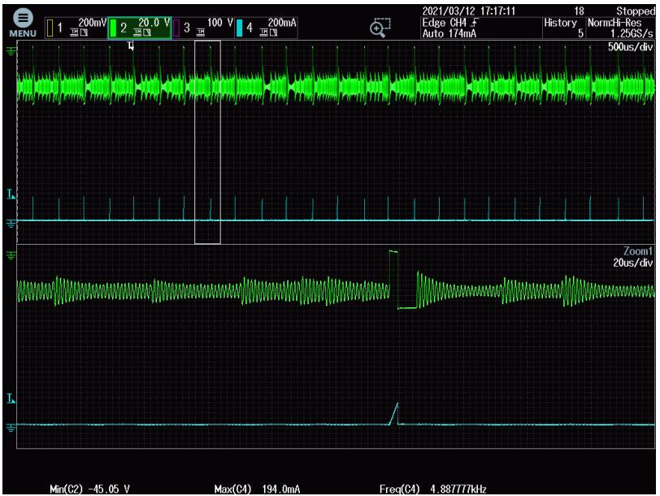

43 VDC

${ \mathsf { C H } } 2 { \mathsf { V } } _ { \mathsf { D S } }$  
$C H 4 \mid _ { \mathrm { D S } }$

$$
V _ {D S \_ M A X} = 4 5. 0 5 V
$$

$$
I _ {D S \_ M A X} = 0. 1 9 4 A
$$

## Test Condition:

➢ No Load

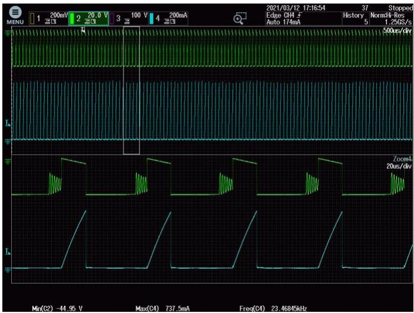

43 VDC

${ \mathsf { C H } } 2 { \mathsf { V } } _ { \mathsf { D S } }$  
$C H 4 \mid _ { \mathrm { { D S } } }$

$$
V _ {D S \_ M A X} = 4 4. 9 5 V
$$

$$
I _ {D S \_ M A X} = 0. 7 3 8 \mathrm{A}
$$

## Test Condition:

➢ Full Load

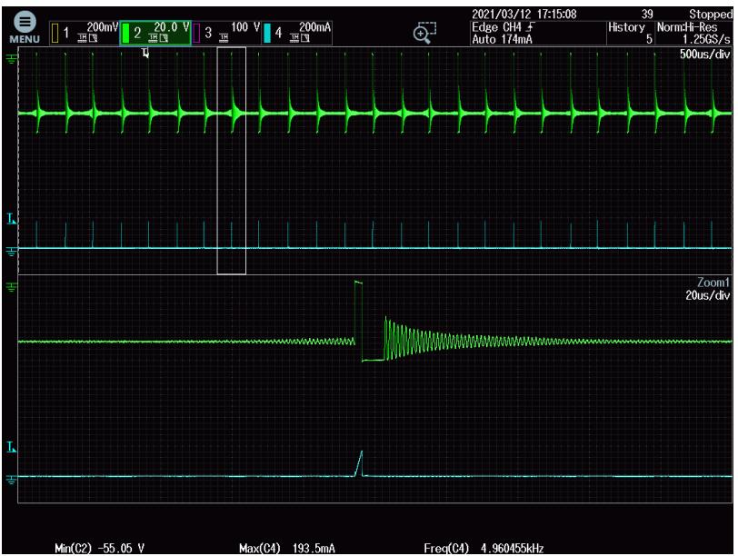

$5 3 V _ { \sf D C }$

${ \mathsf { C H } } 2 \ { \mathsf { V } } _ { \mathsf { D S } }$  
$C H 4 \mid _ { \mathrm { { D S } } }$

$$
V _ {D S \_ M A X} = 5 5. 0 5 V
$$

$$
I _ {D S \_ M A X} = 0. 1 9 4 \mathrm{A}
$$

## Test Condition:

➢ No Load

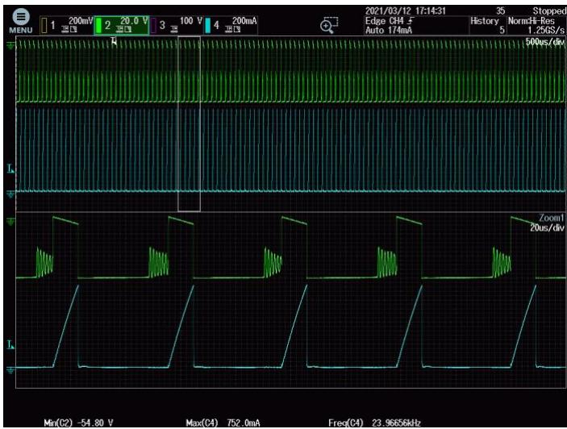

$5 3 \text{‰}$

${ \mathsf { C H } } 2 { \mathsf { V } } _ { \mathsf { D S } }$  
$C H 4 1 _ { \mathrm { D S } }$

$$
V _ {D S \_ M A X} = 5 4. 8 V
$$

$$
I _ {D S \_ M A X} = 0. 7 5 2 \mathrm{A}
$$

## Test Condition:

➢ Full Load

## 电感电流开机波形

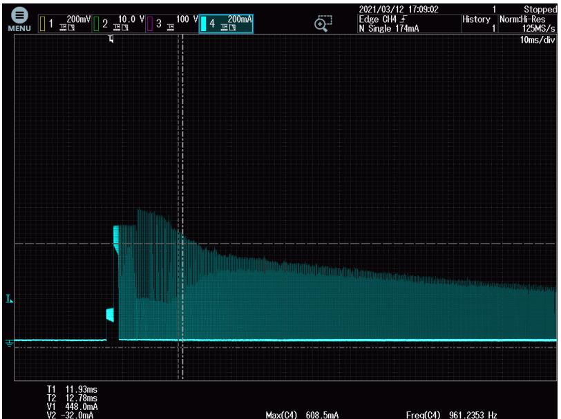

43 VDC  
  
Test Condition:  
➢ No Load

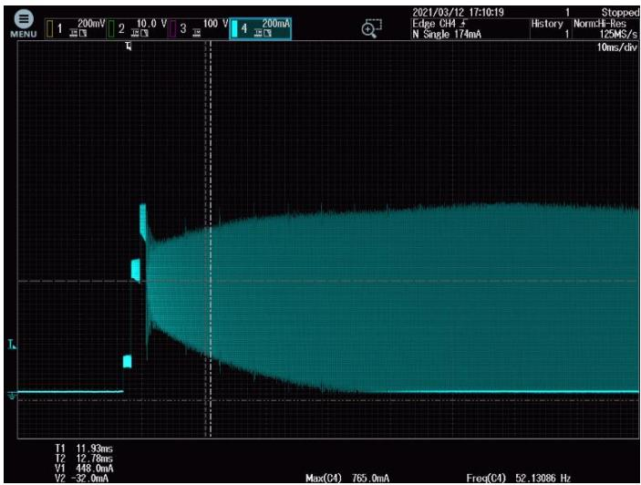

43 VDC  
  
Test Condition:  
➢ Full Load

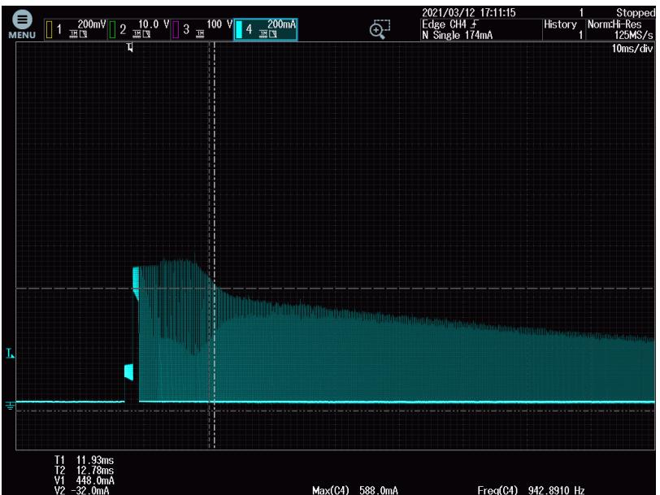

53 VDC  
  
Test Condition:  
➢ No Load

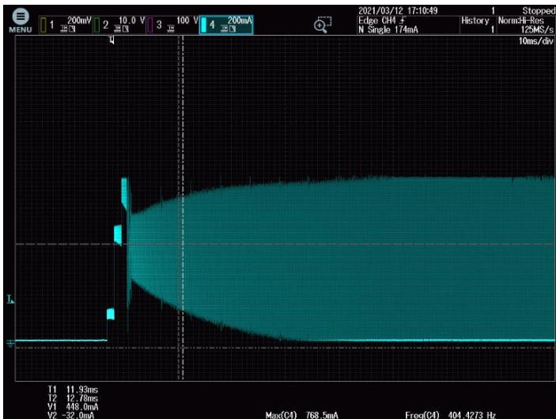

53 VDC  
  
Test Condition:  
➢ Full Load

## 电感电流稳态波形

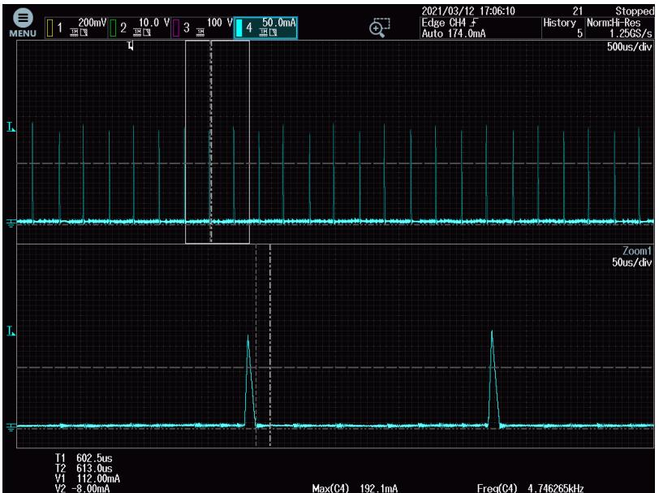

43 VDC  
  
Test Condition:  
➢ No Load

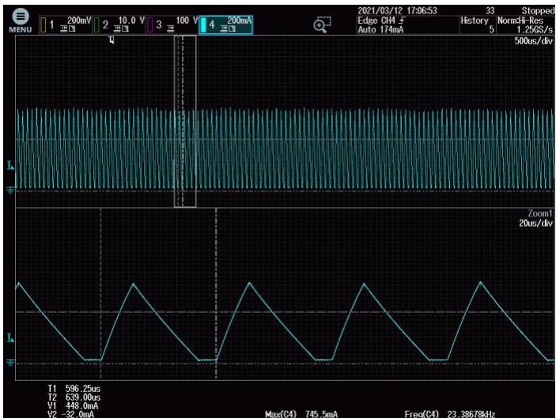

43 VDC  
  
Test Condition:  
➢ Full Load

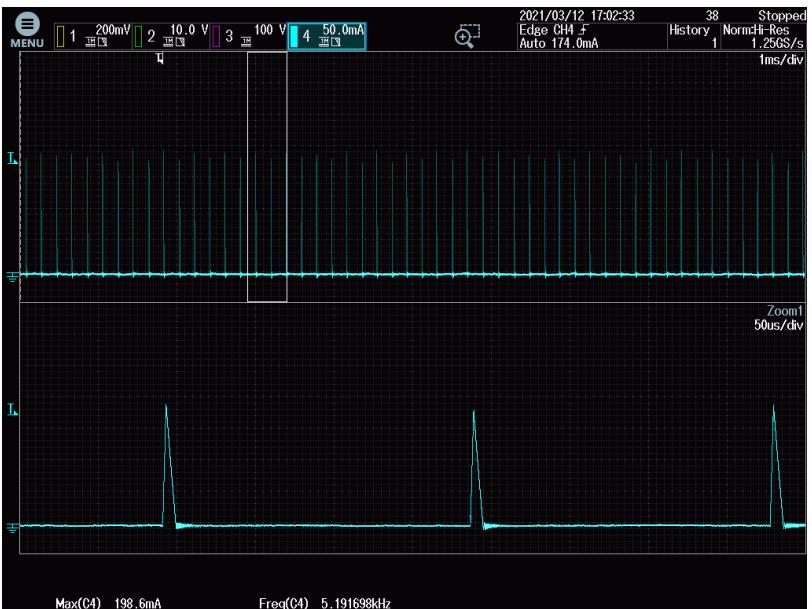

53 VDC  
  
Test Condition:  
➢ No Load

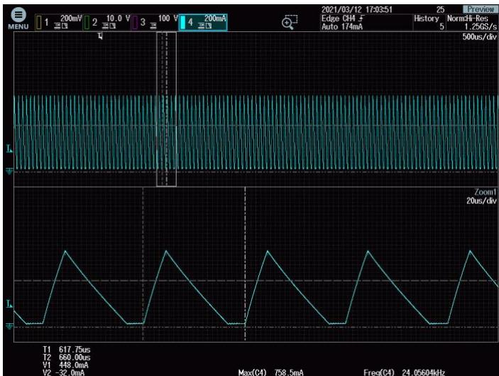

53 VDC  
  
Test Condition:  
➢ Full Load

## (MOSFET )

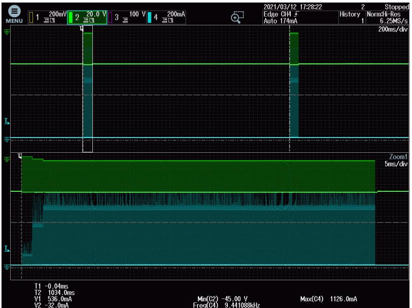

$43 \text{‰}$

${ \mathsf { C H } } 2 { \mathsf { V } } _ { \mathsf { D S } }$  
$C H 4 \mid _ { \mathrm { D S } }$

$$
V _ {D S \_ M A X} = 4 5 V
$$

$$
I _ {D S \_ M A X} = 1. 1 2 6 A
$$

## Test Condition:

➢ Output Short

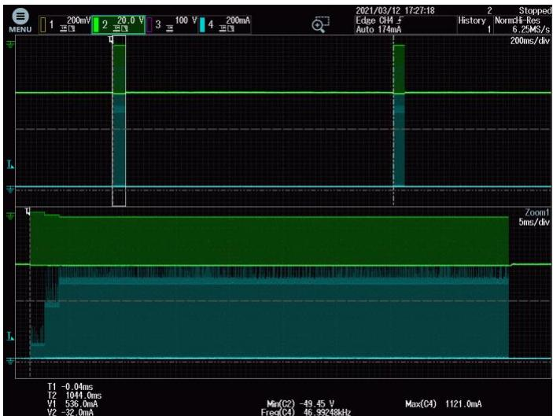

48 VDC

${ \mathsf { C H } } 2 { \mathsf { V } } _ { \mathsf { D S } }$  
$C H 4 \mid _ { \mathrm { { D S } } }$

$$
V _ {D S \_ M A X} = 4 9. 4 5 V
$$

$$
I _ {D S \_ M A X} = 1. 1 2 1 \mathrm{A}
$$

## Test Condition:

➢ Output Short

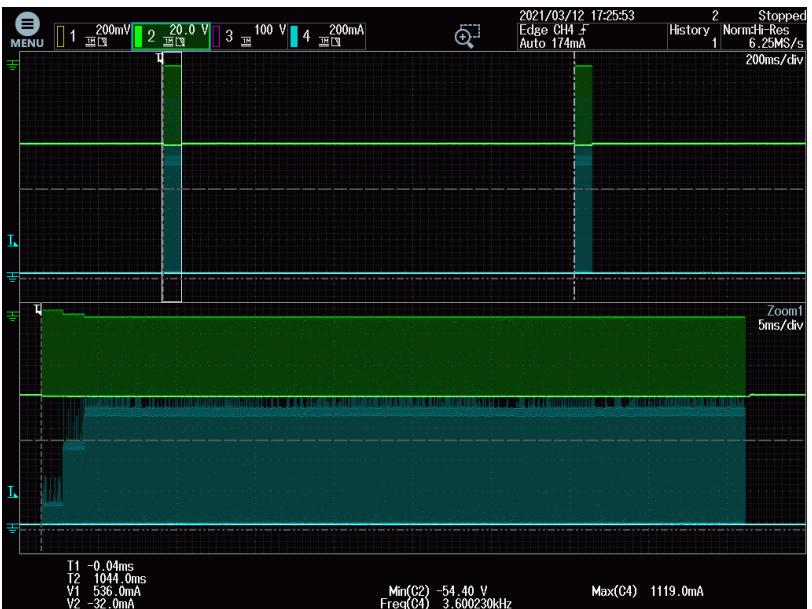

$5 3 V _ { \sf D C }$

${ \mathsf { C H } } 2 \ { \mathsf { V } } _ { \mathsf { D S } }$  
$C H 4 \mid _ { \mathrm { { D S } } }$

$$
V _ {D S \_ M A X} = 5 4. 4 V
$$

$$
I _ {D S \_ M A X} = 1. 1 1 9 \mathrm{A}
$$

## Test Condition:

➢ Output Short

<table><tr><td rowspan="2">项目</td><td>43VDC</td><td>48VDC</td><td>53VDC</td></tr><tr><td>温度(°C)</td><td>温度(°C)</td><td>温度(°C)</td></tr><tr><td>环境温度</td><td>50.4</td><td>51.2</td><td>51.8</td></tr><tr><td>BP8506D (U1)</td><td>94.5</td><td>93.5</td><td>89.3</td></tr><tr><td>电感绕组(L3)</td><td>80.7</td><td>80.9</td><td>80.6</td></tr><tr><td>电感磁芯(L3)</td><td>75.5</td><td>75.9</td><td>75.7</td></tr><tr><td>续流二极管(D5)</td><td>88.9</td><td>88.5</td><td>87.7</td></tr><tr><td>输入电解电容(C6)</td><td>71.9</td><td>71.2</td><td>70.2</td></tr><tr><td>输出电解电容(C3)</td><td>68.7</td><td>69.1</td><td>69</td></tr></table>

备注：增大芯片Source散热铜箔面积可以降低芯片温度

## 测试说明

➢ 在温箱中进行测试  
➢ 电路板放在一个封闭的盒子内  
➢ 热电偶连接到各个测量点  
➢ 等测量点温度达到稳定后记录数据

## THANK YOU FOR WATCHING
