## BPA85906D Buck参考设计

## (15V/400mA)

时间：2023年8月

'BPS

晶丰明源

## 内容

BPA85906D简介  
电源规格  
电路原理图  
 PCB Layout和实物图  
 BOM  
性能测试数据  
重要声明

## BPA85906D简介

高低压脚之间爬电距离＞3mm  
集成 650 V 高压 MOSFET  
PWM控制模式 ，低输出纹波  
低待机功耗 （ ＜100mW ）  
内置软启动功能  
集成高压启动、自供电电路  
低音频噪声

应用领域：

家用电器辅助电源  
 PC待机电源  
电机驱动辅助电源  
 IOT/智能家居/智能照明  
 通信、工业控制辅助电源

典型电路 -Buck:  
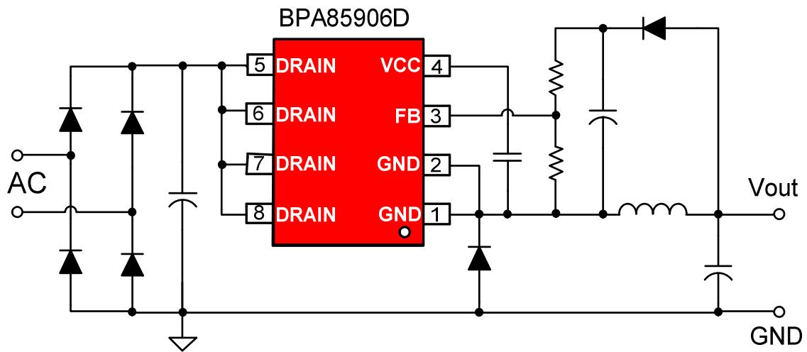

封装管脚图 -SOP8:

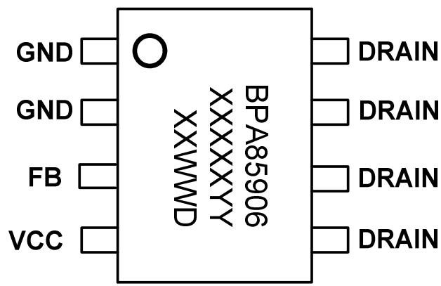

## 电源规格

<table><tr><td>项目描述</td><td>符号</td><td>最小</td><td>典型</td><td>最大</td><td>单位</td><td>备注</td></tr><tr><td colspan="7">输入</td></tr><tr><td>电压</td><td> $V_{IN}$ </td><td>85</td><td></td><td>265</td><td> $V_{AC}$ </td><td></td></tr><tr><td>频率</td><td> $f_{LINE}$ </td><td>47</td><td>50/60</td><td>63</td><td>Hz</td><td></td></tr><tr><td colspan="7">输出</td></tr><tr><td>输出电压</td><td> $V_{OUT}$ </td><td>14.25</td><td>15</td><td>15.75</td><td>V</td><td>±5%</td></tr><tr><td>输出电流</td><td> $I_{OUT}$ </td><td></td><td>400</td><td></td><td>mA</td><td></td></tr><tr><td>输出电压纹波</td><td> $V_{RIPPLE}$ </td><td></td><td></td><td>100</td><td>mV</td><td>稳态,20MHz带宽</td></tr><tr><td>连续输出功率</td><td> $P_{OUT}$ </td><td></td><td>6</td><td></td><td>W</td><td></td></tr><tr><td colspan="7">效率</td></tr><tr><td>待机功耗</td><td> $P_{STDBY}$ </td><td></td><td></td><td>83</td><td>mW</td><td>包含假负载,230VAC</td></tr><tr><td>满载效率</td><td>η</td><td>80.18</td><td></td><td></td><td>%</td><td></td></tr><tr><td colspan="7">环境</td></tr><tr><td>传导EMI</td><td></td><td colspan="4">满足CISPR22/EN55022 Class B,至少6dB 裕量</td><td></td></tr><tr><td>Surge</td><td></td><td></td><td>2</td><td></td><td>kV</td><td>差模</td></tr><tr><td>EFT</td><td></td><td></td><td>4</td><td></td><td>KV</td><td>5kHz/100kHz/38kHz</td></tr><tr><td>ESD</td><td></td><td></td><td>15</td><td>20</td><td>KV</td><td>空气放电</td></tr><tr><td>工作环境温度</td><td>TAMP</td><td></td><td></td><td>50</td><td>°C</td><td></td></tr></table>

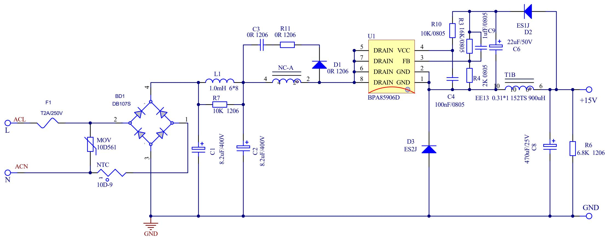

## PCB layout 和实物图

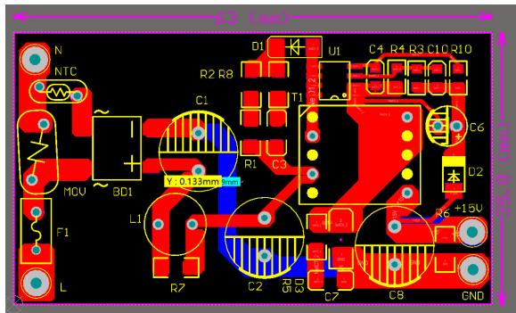

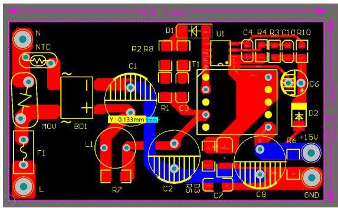

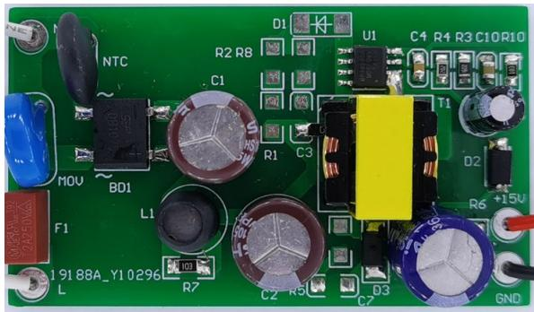

实物图-正面图

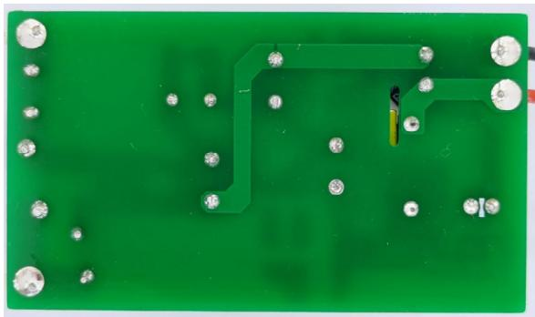

实物图-背面图

<table><tr><td>序号</td><td>元件标号</td><td>参数描述</td><td>封装尺寸</td><td>数量</td></tr><tr><td>1</td><td>PCB</td><td>FR-4,双面板</td><td>60mm*35mm</td><td>1</td></tr><tr><td>2</td><td>F1</td><td>2A,保险丝</td><td>DIP</td><td>1</td></tr><tr><td>3</td><td>BD1</td><td>DB107S, 1A/1000V</td><td>SMD</td><td>1</td></tr><tr><td>4</td><td>D2</td><td>ES1J, 1A/600V, trr=35ns</td><td>SMA</td><td>1</td></tr><tr><td>5</td><td>D3</td><td>ES2J, 2A/600V, trr=35ns</td><td>SMA</td><td>1</td></tr><tr><td>6</td><td>L1</td><td>1.0mH,工字电感</td><td>6*8</td><td>1</td></tr><tr><td>7</td><td>L3</td><td>0.9mH,EE13立式 0.31*1 152TS</td><td>EE13</td><td>1</td></tr><tr><td>8</td><td>C2, C1</td><td>8.2uF/400V,电解电容</td><td>ø10*12mm</td><td>2</td></tr><tr><td>9</td><td>C6</td><td>22uF/50V,电解电容</td><td>ø5*12mm</td><td>1</td></tr><tr><td>10</td><td>C8</td><td>470uF/25V,电解电容</td><td>ø10*16mm</td><td>1</td></tr><tr><td>11</td><td>C4</td><td>100nF/50V, X7R,贴片电容</td><td>SMD0805</td><td>1</td></tr><tr><td>12</td><td>C9</td><td>1uF/50V, X7R,贴片电容</td><td>SMD0805</td><td>1</td></tr><tr><td>13</td><td>R3</td><td>16K, ±1%</td><td>SMD0805</td><td>1</td></tr><tr><td>14</td><td>R4</td><td>2K, ±1%</td><td>SMD0805</td><td>1</td></tr><tr><td>15</td><td>R6</td><td>6.8K, ±5%</td><td>SMD1206</td><td>1</td></tr><tr><td>16</td><td>R7</td><td>10K, ±5%</td><td>SMD1206</td><td>1</td></tr><tr><td>17</td><td>R10</td><td>10K, ±5%</td><td>SMD0805</td><td>1</td></tr><tr><td>18</td><td>C3,R11,D1</td><td>0R, ±5%</td><td>SMD1206</td><td>3</td></tr><tr><td>19</td><td>NTC</td><td>10D-9</td><td>DIP</td><td>1</td></tr><tr><td>20</td><td>U1</td><td>BPA85906D</td><td>SOP8</td><td>1</td></tr><tr><td>21</td><td>MOV</td><td>10D561</td><td>DIP</td><td>1</td></tr><tr><td></td><td></td><td></td><td>Total</td><td>24</td></tr></table>

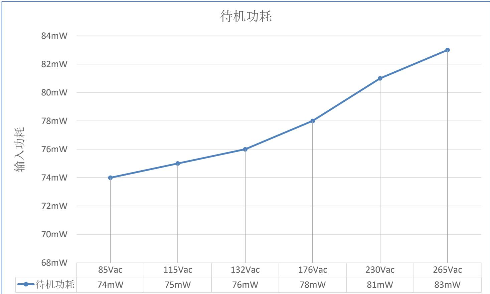

转换效率  
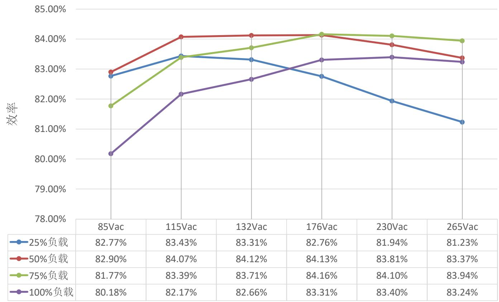

调整率- （负载和线性调整率）

<table><tr><td colspan="9">调整率</td></tr><tr><td>VIN(VAC) $I_{OUT}(mA)$ </td><td>85Vac</td><td>115Vac</td><td>132Vac</td><td>176Vac</td><td>230Vac</td><td>265Vac</td><td>平均值</td><td>线调整率</td></tr><tr><td>0%负载(0mA)</td><td>15.64V</td><td>15.64V</td><td>15.63V</td><td>15.63V</td><td>15.63V</td><td>15.64V</td><td>15.64</td><td>0.08%</td></tr><tr><td>25%负载(100mA)</td><td>15.16V</td><td>15.16V</td><td>15.16V</td><td>15.15V</td><td>15.15V</td><td>15.15V</td><td>15.16</td><td>0.09%</td></tr><tr><td>50%负载(200mA)</td><td>15.15V</td><td>15.15V</td><td>15.15V</td><td>15.14V</td><td>15.14V</td><td>15.14V</td><td>15.15</td><td>0.07%</td></tr><tr><td>75%负载(300mA)</td><td>15.15V</td><td>15.16V</td><td>15.16V</td><td>15.16V</td><td>15.15V</td><td>15.16V</td><td>15.16</td><td>0.07%</td></tr><tr><td>100%负载(400mA)</td><td>15.17V</td><td>15.18V</td><td>15.17V</td><td>15.17V</td><td>15.17V</td><td>15.17V</td><td>15.17</td><td>0.07%</td></tr><tr><td>平均值</td><td>15.26</td><td>15.26</td><td>15.25</td><td>15.25</td><td>15.25</td><td>15.25</td><td rowspan="2" colspan="2">/</td></tr><tr><td>负载调整率</td><td>3.24%</td><td>3.18%</td><td>3.15%</td><td>3.24%</td><td>3.22%</td><td>3.25%</td></tr></table>

 调整率计算方法：调整率=100%\*(最大值-最小值)/平均值

## 输出电压纹波

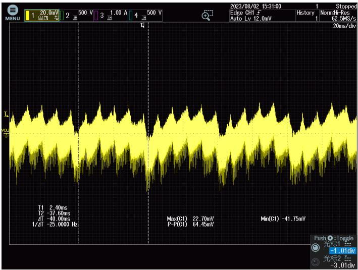

85 VAC

CH1 VOUT $\mathsf { V } _ { \mathsf { O U T } }$ $V _ { p | c - P K } = 6 4 . 4 5 m v$

Test Condition:

 Full Load (400mA)

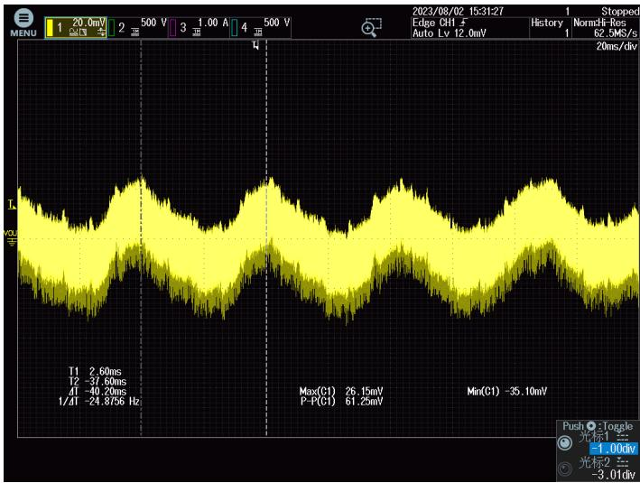

115 VAC

CH1 VOUT $\mathsf { V } _ { \mathsf { O U T } }$ $\mathsf { V } _ { \mathsf { P K - P K } } { = } 6 1 . 2 5 \mathsf { m V }$

Test Condition:

 Full Load (400mA)

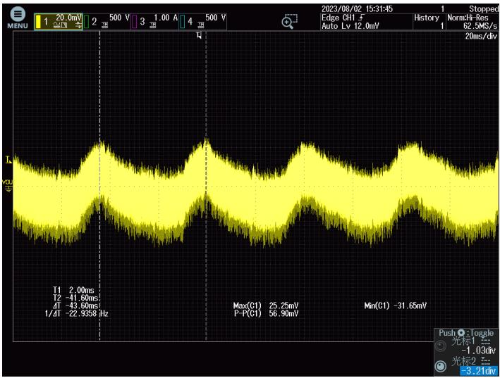

230 VAC

CH1 V $\mathsf { V } _ { \mathsf { O U T } }$ $V _ { p | \mathrm { X - P K } } = 5 6 . 9 0 \mathrm { m V }$

Test Condition:

 Full Load (400mA)

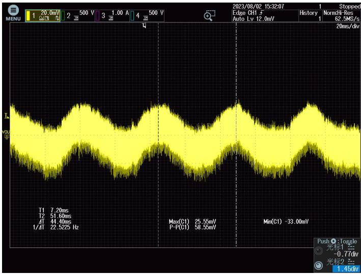

265 VAC

CH1 V $\mathsf { V } _ { \mathsf { O U T } }$ $V _ { p \vert k - P K } = 5 8 . 5 5 m v$

Test Condition:

 Full Load (400mA)

动态负载（50%-100%）  
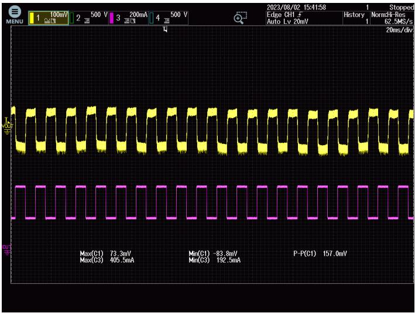

85 VAC

CH1 VOUT  
VPK-PK=157mV  
CH3 IOUT

## Test Condition:

 0.2 A-0.4 A-0.2 A  
 Slew Rate: 0.5 A/μS  
 Frequency: 100 Hz

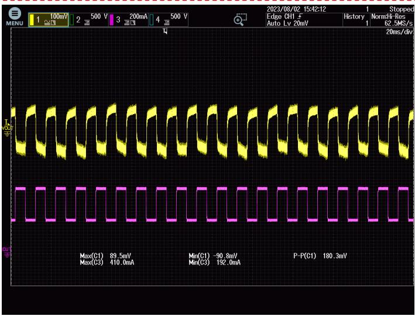

230 VAC

CH1 VOUT  
V =180.3mV  
CH3 IOUT

## Test Condition:

 0.2 A-0.4 A-0.2 A  
 Slew Rate: 0.5 A/μS  
 Frequency: 100 Hz

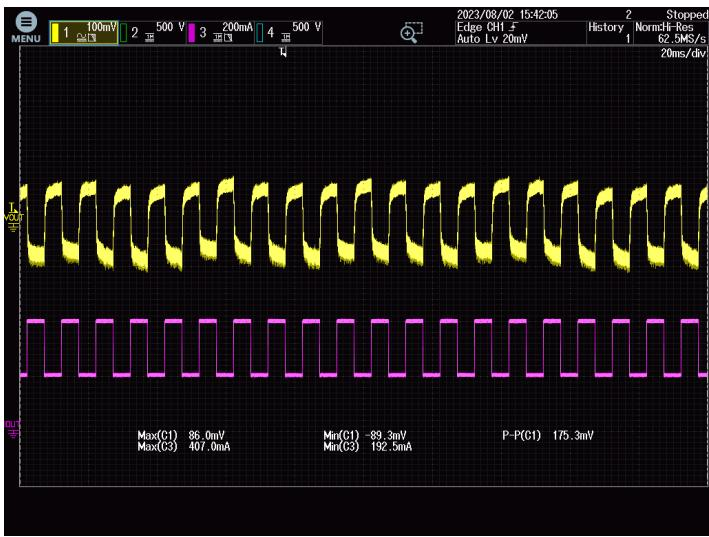

115 VAC

CH1 VOUT  
V =175.3mV  
CH3 IOUT

## Test Condition:

 0.2 A-0.4 A-0.2 A  
 Slew Rate: 0.5 A/μS  
 Frequency: 100 Hz

265 VAC

CH1 VOUT  
V =181.3mV  
CH3 IOUT

## Test Condition:

 0.2 A-0.4 A-0.2 A  
 Slew Rate: 0.5 A/μS  
 Frequency: 100 Hz

动态负载（10%-90%）  
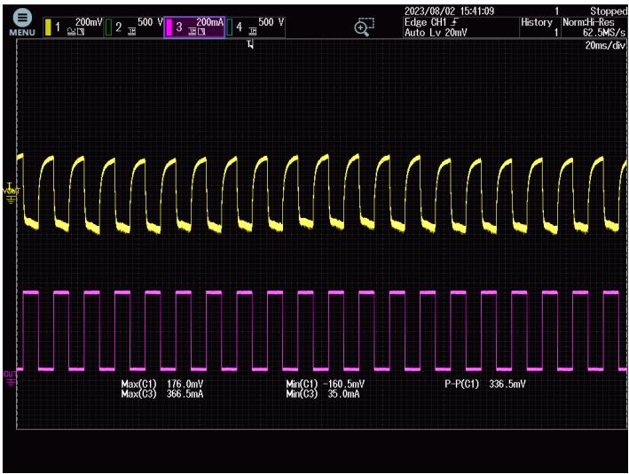

CH1 VOUT  
VPK-PK=336.5mV  
CH3 IOUT

## Test Condition:

 0.04A-0.36A-0.04A  
 Slew Rate: 0.5 A/μS  
 Frequency: 100 Hz

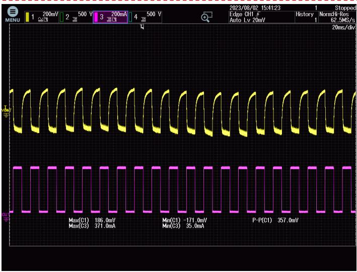

CH1 VOUT  
V =357.0mV  
CH3 IOUT

## Test Condition:

 0.04A-0.36A-0.04A  
 Slew Rate: 0.5 A/μS  
 Frequency: 100 Hz

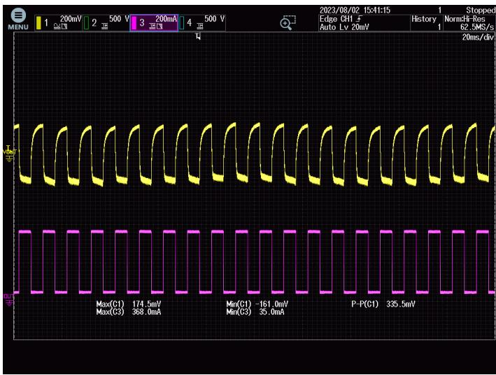

CH1 VOUT  
V =335.5mV  
CH3 IOUT

## Test Condition:

 0.04A-0.36A-0.04A  
 Slew Rate: 0.5 A/μS  
 Frequency: 100 Hz

CH1 VOUT  
V =364.5mV

CH3 IOUT

## Test Condition:

 0.04A-0.36A-0.04A  
 Slew Rate: 0.5 A/μS  
 Frequency: 100 Hz

## 输出电压开机波形

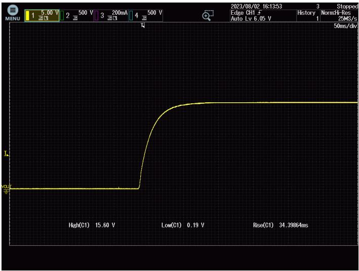

85 VAC

CH1 VOUT T : 34.4mS

## Test Condition:

 No Load(0mA)

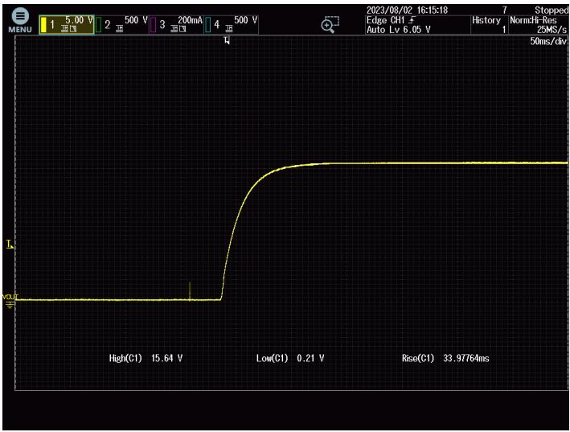

265 VAC

CH1 VOUT-3.3V T DELAY : 34.0mS

## Test Condition:

 No Load(0mA)

85 VAC

CH1 VOUT T : 34.3mS

## Test Condition:

 Full Load(400mA)

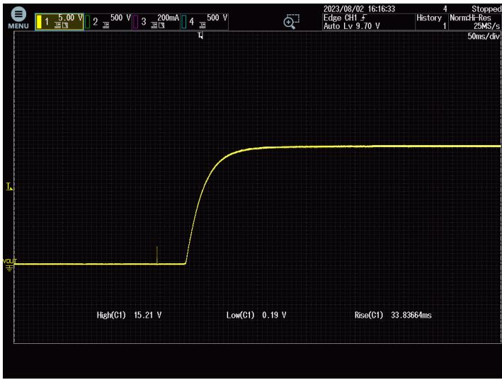

265 VAC

CH1 VOUT-3.3V TRISE: 33.8mS

## Test Condition:

 Full Load(400mA)

## 输出电压关机波形

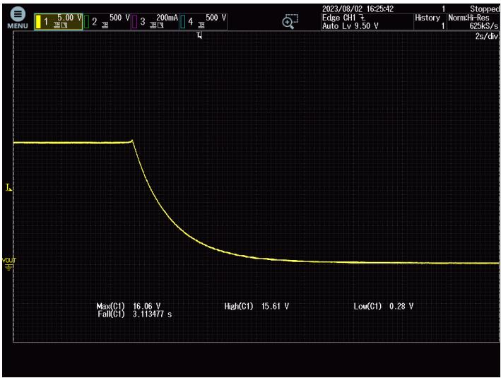

85 VAC

CH1 V TFALL: 3.1S

## Test Condition:

 No Load(0mA)

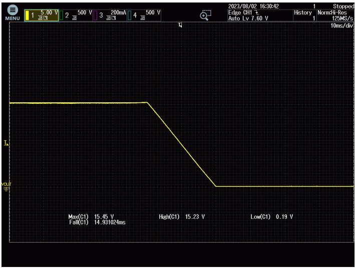

265 VAC

CH1 V TFALL: 3.1S

## Test Condition:

 No Load(0mA)

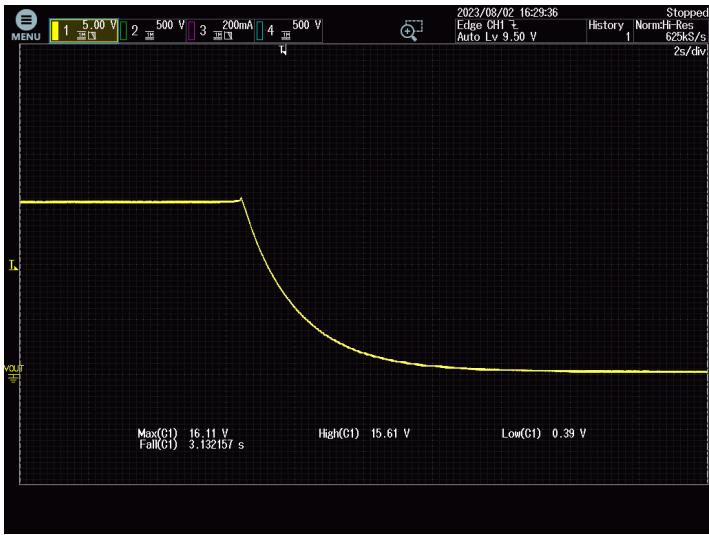

85 VAC

CH1 VOUT TFALL: 14.9mS

## Test Condition:

 Full Load(400mA)

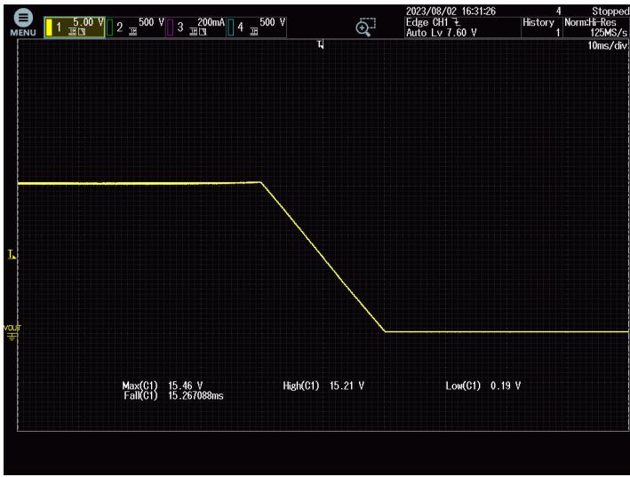

265 VAC

CH1 VOUT-3.3V TFALL: 15.3mS

## Test Condition:

 Full Load(400mA)

## 漏源极电压和漏极电流开机波形

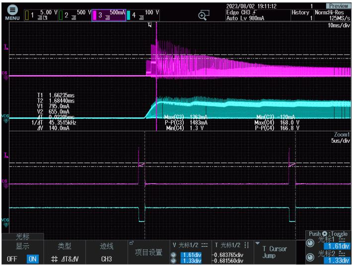

85 VAC

CH3 $\mathsf { I } _ { \mathsf { D } \mathsf { S } }$  
CH4 $\mathsf { V } _ { \mathsf { D } \mathsf { S } }$

$$
I _ {\text { MAX }}: 1. 3 6 \mathrm{A}
$$

$$
V _ {\text { MAX }}: 1 6 8. 0 \mathrm{V}
$$

## Test Condition:

 No Load(0mA)

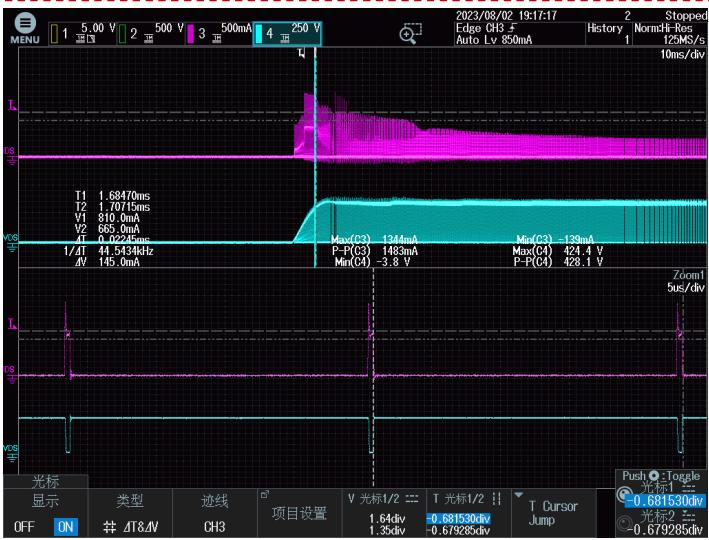

265 VAC

CH3 $\mathsf { I } _ { \mathsf { D } \mathsf { S } }$  
CH4 $\mathsf { V } _ { \mathsf { D } \mathsf { S } }$

$$
I _ {\text { MAX }}: 1. 3 4 \mathrm{A}
$$

$$
V _ {\text { MAX }}: 4 2 4. 4 \mathrm{V}
$$

## Test Condition:

 No Load(0mA)

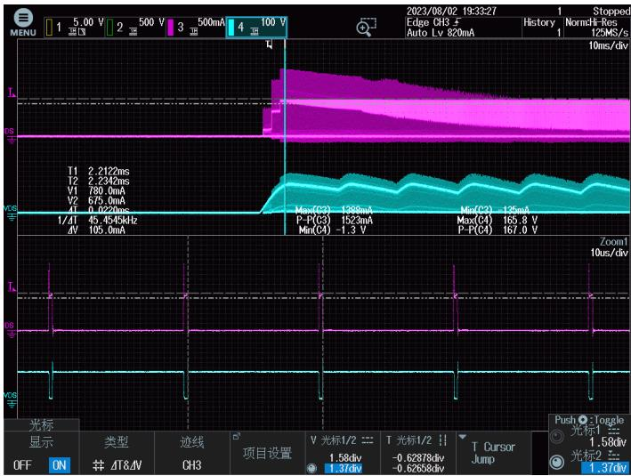

85 VAC

CH3 $\mathsf { I } _ { \mathsf { D } \mathsf { S } }$  
CH4 $\mathsf { V } _ { \mathsf { D } \mathsf { S } }$

$$
I _ {\text { MAX }}: 1. 3 9 \mathrm{A}
$$

$$
V _ {\text { MAX }}: 1 6 5. 8 \mathrm{V}
$$

## Test Condition:

 Full Load(400mA)

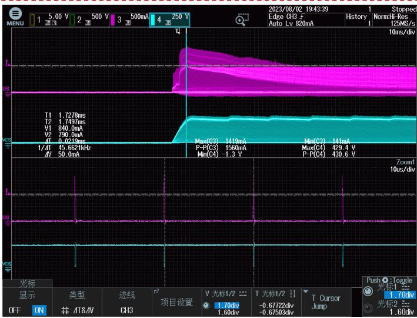

265 $\mathsf { v } _ { \mathsf { A C } }$

CH3 $\mathsf { I } _ { \mathsf { D } \mathsf { S } }$  
CH4 $\mathsf { V } _ { \mathsf { D } \mathsf { S } }$

$$
I _ {\text { MAX }}: 1. 4 2 \mathrm{A}
$$

$$
V _ {\text { MAX }}: 4 2 9. 4 \mathrm{V}
$$

## Test Condition:

 Full Load(400mA)

## 漏源极电压和漏极电流正常工作波形

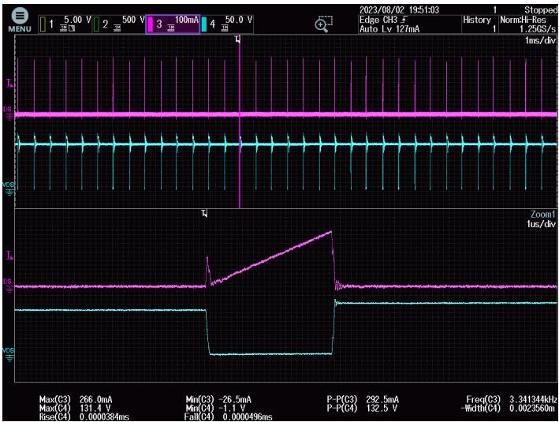

85 VAC

$C H 3 \mid _ { \mathsf { D S } }$  
CH4 VDS $\mathsf { V } _ { \mathsf { D } \mathsf { S } }$ IMAX: 266mA $\mathsf { I } _ { \mathsf { M A X } } .$ $V _ { \mathrm { M A X } } : 1 3 1 . 4 \mathsf { V }$

Test Condition:  
 No Load(0mA)  
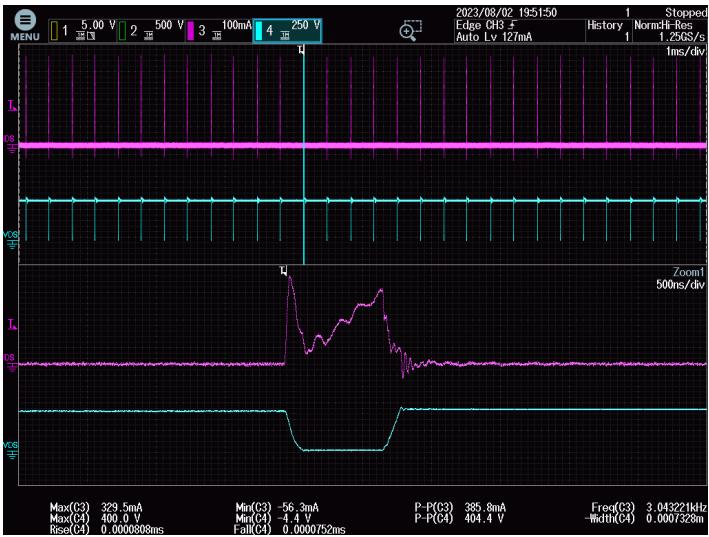

265 $\mathsf { v } _ { \mathsf { A C } }$

CH3 $\mathsf { I } _ { \mathsf { D } \mathsf { S } }$  
CH4 $\mathsf { V } _ { \mathsf { D } \mathsf { S } }$ $\mathsf { I } _ { \mathsf { M A X } } .$ 329.5mA $V _ { \mathrm { M A X } } : 4 0 0 . 0 \mathsf { V }$

Test Condition:  
 No Load(0mA)  
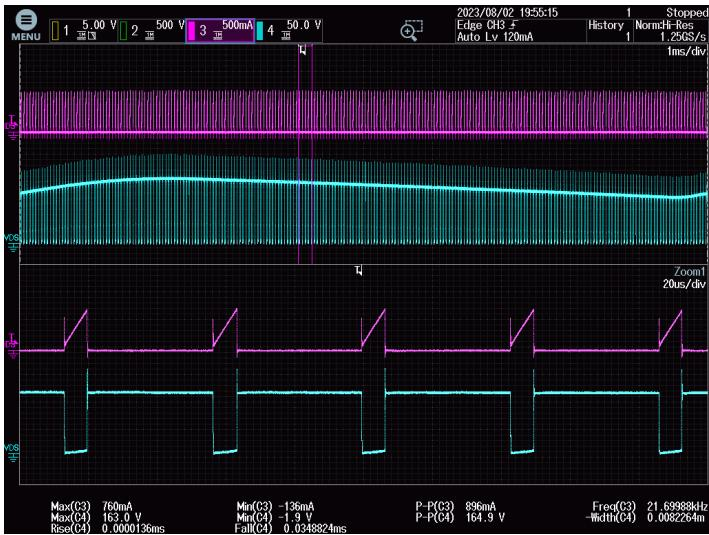

85 $\mathsf { v } _ { \mathsf { A C } }$

CH3 $\mathsf { I } _ { \mathsf { D } \mathsf { S } }$  
CH4 VDS $\mathsf { V } _ { \mathsf { D } \mathsf { S } }$ IMAX: 760mA $\mathsf { I } _ { \mathsf { M A X } } .$ ${ \mathsf { V } } _ { { \mathsf { M A X } } } .$ 163.0V

Test Condition:  
 Full Load(400mA)  
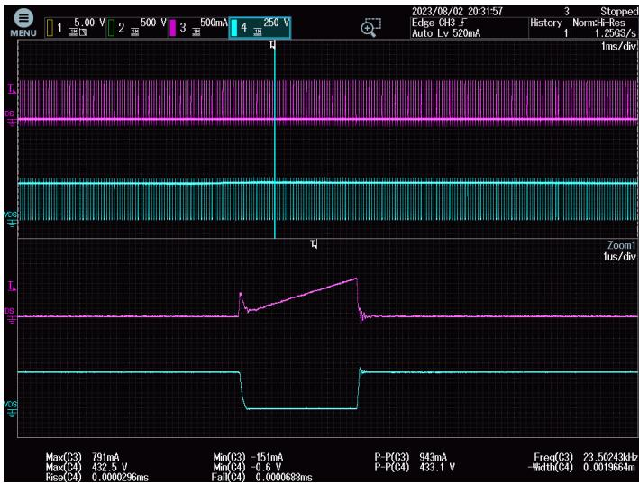

265 $\mathsf { v } _ { \mathsf { A C } }$

CH3 $\mathsf { I } _ { \mathsf { D } \mathsf { S } }$  
CH4 V $\mathsf { V } _ { \mathsf { D } \mathsf { S } }$ IMAX: 791mA $\mathsf { I } _ { \mathsf { M A X } } .$ ${ \mathsf { V } } _ { { \mathsf { M A X } } } .$ 432.5V

Test Condition:

 Full Load(400mA)

## 电感电流开机波形

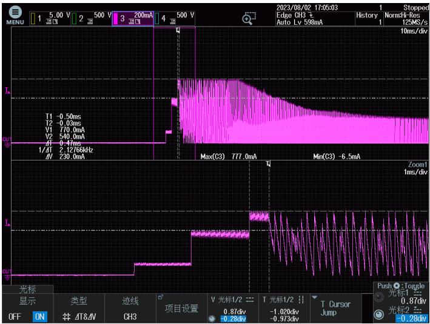

85 VAC

CH3 I Ilimit-max : 770mA

## Test Condition:

 No Load(0mA)

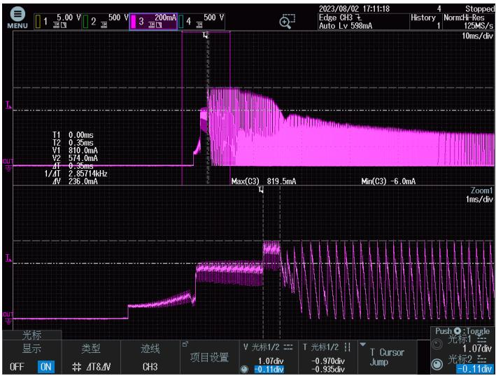

265 VAC

CH3 I Ilimit-max : 810mA

## Test Condition:

 No Load(0mA)

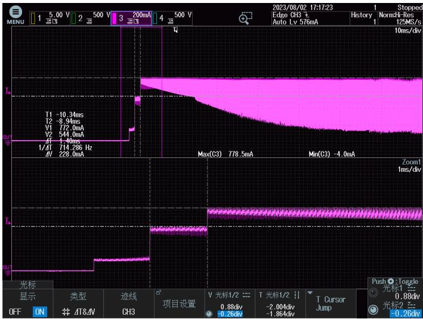

85 VAC

CH3 I Ilimit-max : 772mA

## Test Condition:

 Full Load(400mA)

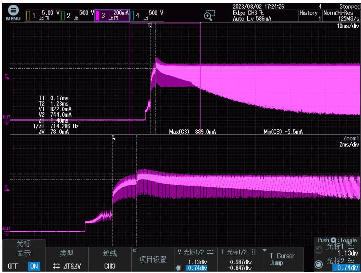

265 VAC

CH3 I Ilimit-max : 822mA

## Test Condition:

 Full Load(400mA)

## 电感电流正常工作波形

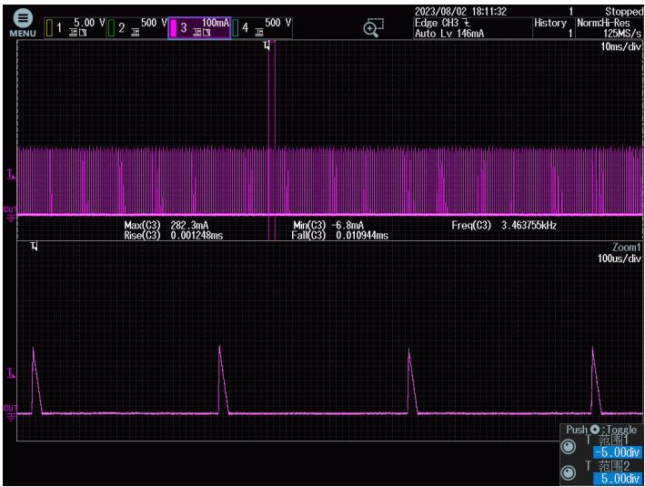

85 VAC

CH3 I Imax: 282.3mA Freq:3.46KHz

## Test Condition:

 No Load(0mA)

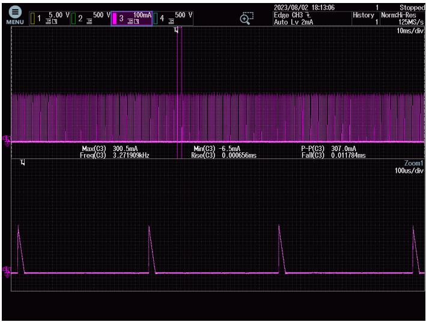

265 VAC

CH3 I Imax: 300.5mA F :3.27KHz

## Test Condition:

 No Load(0mA)

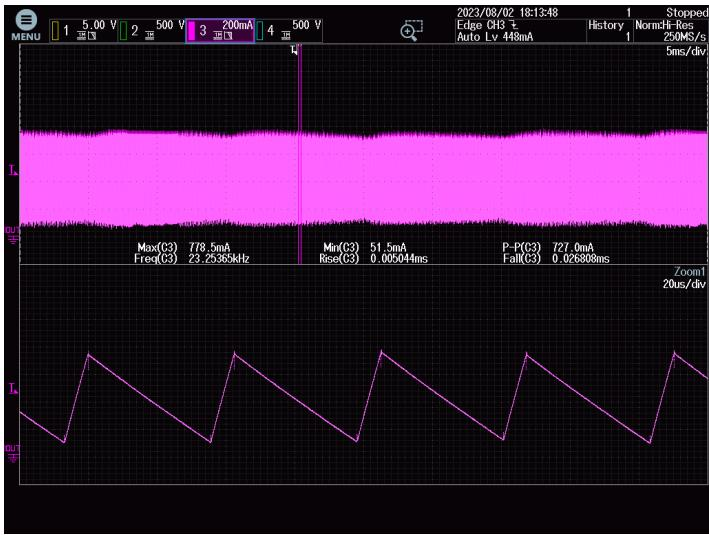

85 VAC

CH3 I max : 778.5mA :23.25KHz

## Test Condition:

 Full Load(400mA)

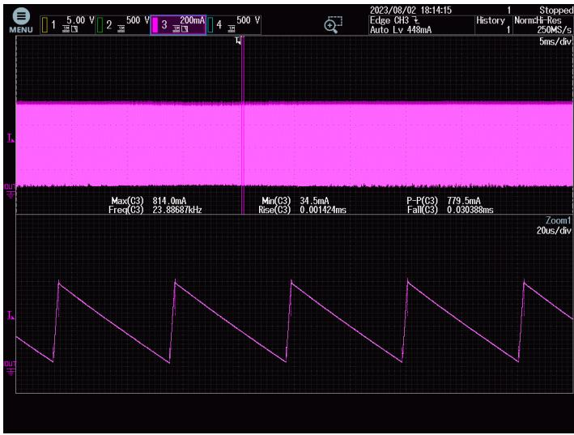

265 VAC

CH3 I I : 814.0mA F :23.89KHz

## Test Condition:

 Full Load(400mA)

## 输出短路保护

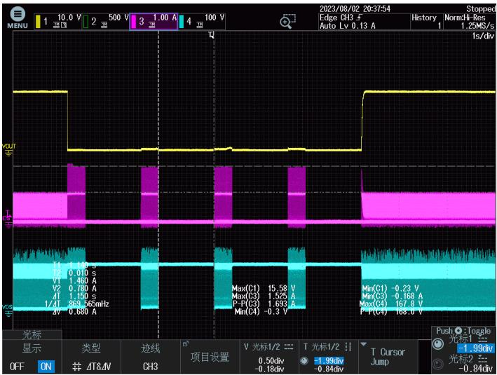

85 $\mathsf { v } _ { \mathsf { A C } }$

CH1 $\mathsf { V } _ { \mathsf { O U T } }$  
CH3 $\mathsf { I } _ { \mathsf { D } \mathsf { S } }$  
CH4 V $\mathsf { V } _ { \mathsf { D } \mathsf { S } }$ IMAX: 1.53A $\mathsf { I } _ { \mathsf { M A X } } .$ $\mathsf { V } _ { \mathsf { M A X } } \colon 1 6 7 . 8 \mathsf { V }$

保护间隔时间：1.15S

## Test Condition:

 输出短路

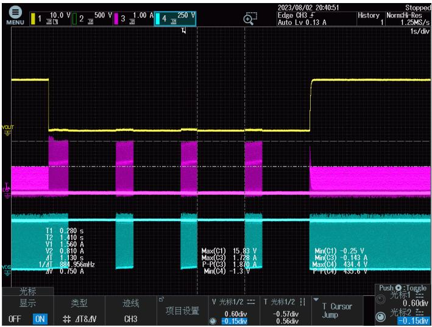

265 VAC

CH1 $\mathsf { V } _ { \mathsf { O U T } }$  
CH3 $\mathsf { I } _ { \mathsf { D } \mathsf { S } }$  
CH4 V $\mathsf { V } _ { \mathsf { D } \mathsf { S } }$ $\mathsf { I } _ { \mathsf { M A X } } \colon 1 . 7 3 \mathsf { A }$ $V _ { \max } : 4 3 4 . 4 V$

## Test Condition:

 输出短路

保护间隔时间：1.13S  
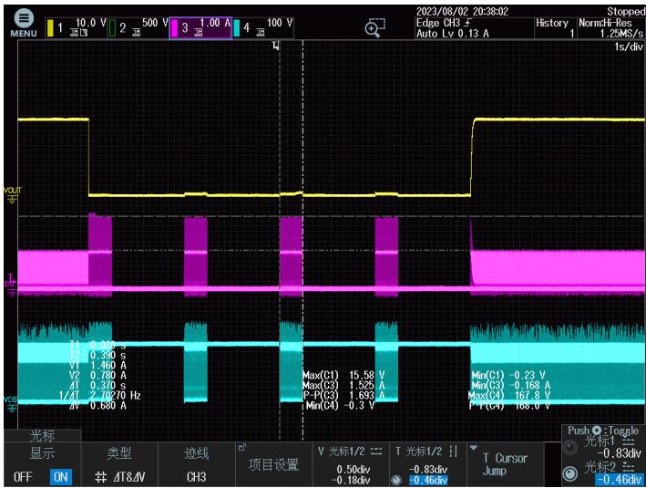

85 $\mathsf { v } _ { \mathsf { A C } }$

CH1 $\mathsf { V } _ { \mathsf { O U T } }$  
CH3 $\mathsf { I } _ { \mathsf { D } \mathsf { S } }$  
${ \mathsf { C H } } 4 \ { \mathsf { V } } _ { \mathsf { D S } }$ IMAX: 1.53A $\mathsf { I } _ { \mathsf { M A X } } \colon 1 . 5 3 \mathsf { A }$ $\mathsf { V } _ { \mathsf { M A X } } \colon 1 6 7 . 8 \mathsf { V }$

保护触发时间：0.37S

## Test Condition:

 输出短路

265 $\mathsf { v } _ { \mathsf { A C } }$

CH1 $\mathsf { V } _ { \mathsf { O U T } }$  
CH3 $\mathsf { I } _ { \mathsf { D } \mathsf { S } }$  
CH4 $\mathsf { V } _ { \mathsf { D } \mathsf { S } }$ $\mathsf { I } _ { \mathsf { M A X } } \colon 1 . 7 3 \mathsf { A }$ $V _ { \max } : 4 3 4 . 4 V$

保护触发时间：0.40S

## Test Condition:

 输出短路

## 温升测试

<table><tr><td colspan="9">满载温升测试</td></tr><tr><td rowspan="2">项目</td><td colspan="2">85Vac</td><td colspan="2">115Vac</td><td colspan="2">230Vac</td><td colspan="2">265Vac</td></tr><tr><td>温度(°C)</td><td>温升(°C)</td><td>温度(°C)</td><td>温升(°C)</td><td>温度(°C)</td><td>温升(°C)</td><td>温度(°C)</td><td>温升(°C)</td></tr><tr><td>环境温度</td><td colspan="2">29.16</td><td colspan="2">28.91</td><td colspan="2">27.15</td><td colspan="2">27.72</td></tr><tr><td>BPA85906D (U1)</td><td>68.93</td><td>39.77</td><td>63.13</td><td>34.22</td><td>62.47</td><td>35.32</td><td>63.12</td><td>35.40</td></tr><tr><td>续流二极管(D3)</td><td>68.19</td><td>39.03</td><td>68.53</td><td>39.62</td><td>67.95</td><td>40.80</td><td>69.80</td><td>42.08</td></tr><tr><td>电感磁芯(T1)</td><td>60.43</td><td>31.27</td><td>59.90</td><td>30.99</td><td>63.03</td><td>35.88</td><td>63.86</td><td>36.14</td></tr><tr><td>电感线圈(T1)</td><td>61.93</td><td>32.77</td><td>61.37</td><td>32.46</td><td>64.92</td><td>37.77</td><td>65.99</td><td>38.27</td></tr><tr><td>整流桥(BD1)</td><td>45.47</td><td>16.31</td><td>41.04</td><td>12.13</td><td>35.32</td><td>8.17</td><td>34.89</td><td>7.17</td></tr><tr><td>输入电解电容(C2)</td><td>50.66</td><td>21.50</td><td>47.57</td><td>18.66</td><td>42.75</td><td>15.60</td><td>43.89</td><td>16.17</td></tr></table>

## 测试说明

 在温箱中进行测试,电路板放在一个封闭的盒子内热电偶连接到各个测量点等测量点温度达到稳定后记录数据

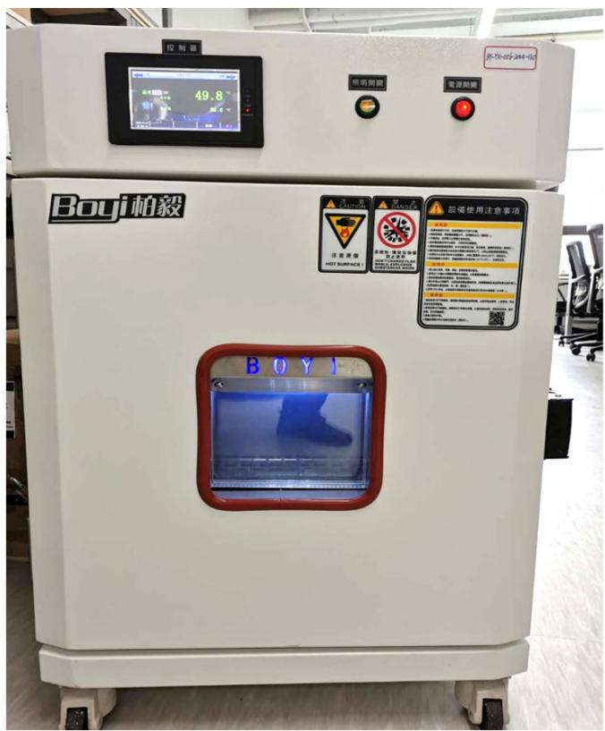

高低温试验箱

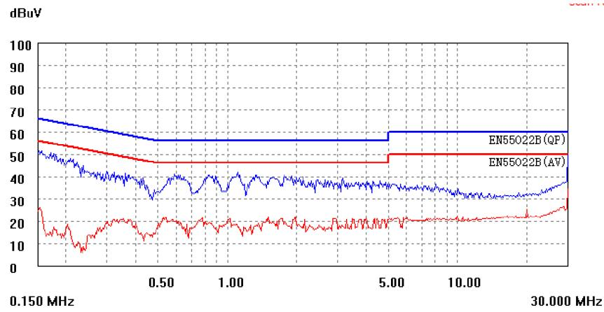

115VAC Line  
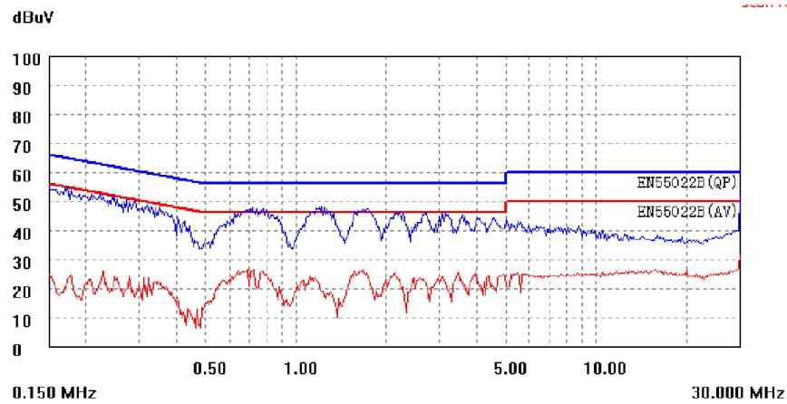

230VAC Line

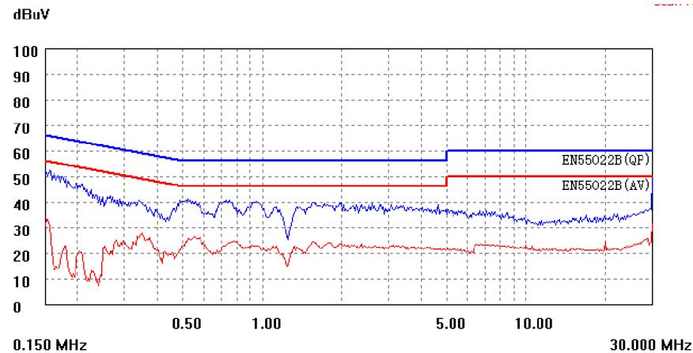

115VAC Neutral

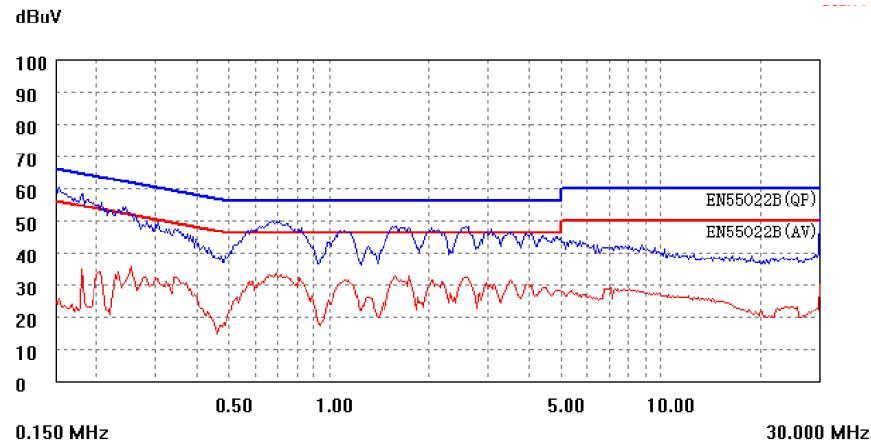

230VAC Neutral

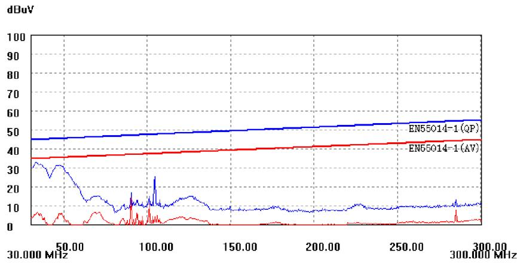

115VAC 空载  

230VAC 空载

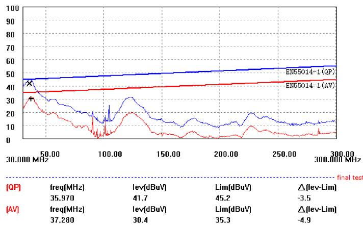

115VAC 满载

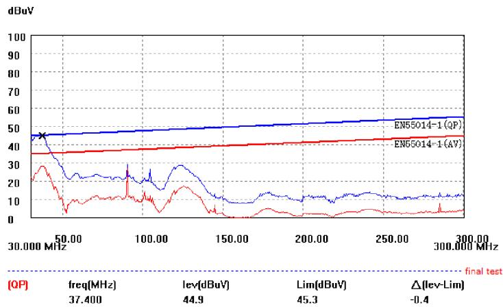

230VAC 满载

## Surge浪涌测试

<table><tr><td>差模</td><td>电压</td><td>相位角</td><td>发生器阻抗</td><td>测试次数</td><td>测试结果</td></tr><tr><td>L to N</td><td>+2kV</td><td>0</td><td>2</td><td>10</td><td>Pass</td></tr><tr><td>L to N</td><td>-2kV</td><td>0</td><td>2</td><td>10</td><td>Pass</td></tr><tr><td>L to N</td><td>+2kV</td><td>90</td><td>2</td><td>10</td><td>Pass</td></tr><tr><td>L to N</td><td>-2kV</td><td>90</td><td>2</td><td>10</td><td>Pass</td></tr><tr><td>L to N</td><td>+2kV</td><td>180</td><td>2</td><td>10</td><td>Pass</td></tr><tr><td>L to N</td><td>-2kV</td><td>180</td><td>2</td><td>10</td><td>Pass</td></tr><tr><td>L to N</td><td>+2kV</td><td>270</td><td>2</td><td>10</td><td>Pass</td></tr><tr><td>L to N</td><td>-2kV</td><td>270</td><td>2</td><td>10</td><td>Pass</td></tr></table>

## 测试说明

 按照GB/T17626.5和IEC61000-4-5的最新版本要求进行测试  
 室温环境，230VAC输入，满载条件  
 输入1.2/50us组合波浪涌电压  
 每个测试点重复10次  
 每次间隔时间1分钟  
 试验时样机输出正常（符合A类标准）视为Pass

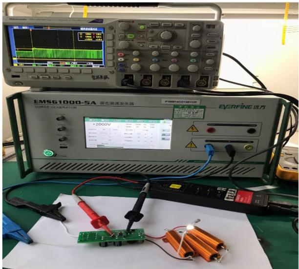

## EFT脉冲群测试

<table><tr><td>差模</td><td>电压</td><td>脉冲群持续时间</td><td>脉冲频率</td><td>测试时间</td><td>测试结果</td></tr><tr><td>L to N</td><td>+4kV</td><td>15ms</td><td>5kHz</td><td>120s</td><td>Pass</td></tr><tr><td>L to N</td><td>-4kV</td><td>15ms</td><td>5kHz</td><td>120s</td><td>Pass</td></tr><tr><td>L to N</td><td>+4kV</td><td>0.75ms</td><td>100kHz</td><td>120s</td><td>Pass</td></tr><tr><td>L to N</td><td>-4kV</td><td>0.75ms</td><td>100kHz</td><td>120s</td><td>Pass</td></tr><tr><td>L to N</td><td>+2kV</td><td>2ms</td><td>38kHz</td><td>120s</td><td>Pass</td></tr><tr><td>L to N</td><td>-2kV</td><td>2ms</td><td>38kHz</td><td>120s</td><td>Pass</td></tr><tr><td>L to N</td><td>+4kV</td><td>2ms</td><td>38kHz</td><td>120s</td><td>Pass</td></tr><tr><td>L to N</td><td>-4kV</td><td>2ms</td><td>38kHz</td><td>120s</td><td>Pass</td></tr></table>

## 测试说明

 按照GB/T17626.4和IEC61000-4-4的最新版本要求进行测试  
 室温环境，230VAC输入满载条件  
 分别测试5kHz/100kHz/38kHz脉冲频率  
 脉冲群周期为300ms  
 每个测试条件测试时间120s  
 试验时样机输出正常（符合A类标准）视为Pass

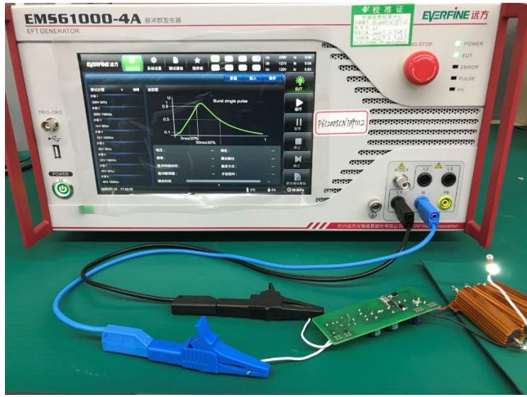

<table><tr><td>测试点</td><td>电压(V)</td><td>放电类型</td><td>放电次数</td><td>测试结果</td></tr><tr><td>Vout</td><td>+15kV</td><td>空气放电</td><td>10</td><td>Pass</td></tr><tr><td>Vout</td><td>-15kV</td><td>空气放电</td><td>10</td><td>Pass</td></tr><tr><td>GND</td><td>+15kV</td><td>空气放电</td><td>10</td><td>Pass</td></tr><tr><td>GND</td><td>-15kV</td><td>空气放电</td><td>10</td><td>Pass</td></tr><tr><td>Vout</td><td>+20kV</td><td>空气放电</td><td>10</td><td>Pass</td></tr><tr><td>Vout</td><td>-20kV</td><td>空气放电</td><td>10</td><td>Pass</td></tr><tr><td>GND</td><td>+20kV</td><td>空气放电</td><td>10</td><td>Pass</td></tr><tr><td>GND</td><td>-20kV</td><td>空气放电</td><td>10</td><td>Pass</td></tr></table>

## 测试说明

 按照GB/T17626.2和IEC61000-4-2的最新版本要求进行测试  
 室温环境，230VAC输入满载条件  
 每个测试点重复10次  
 分别对输出正端和地进行空气放电  
 试验时样机输出正常（符合A类标准）视为Pass

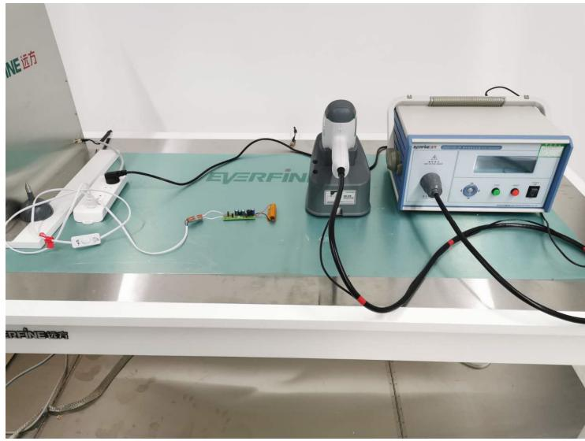

本文档中的数据和信息仅供参考，不构成任何形式的建议、验收标准或保证。实际测试数据和结果可能同文档中列出的数据和结果存在差异，请用户自行确认产品的适用性，此文档供参考评估。

## THANK YOU FOR WATCHING
