## 大家电

BPA85906D 15V400mA 降压芯片推广资料V0.1

时间：2023年8月

## 典型应用图 （Buck）

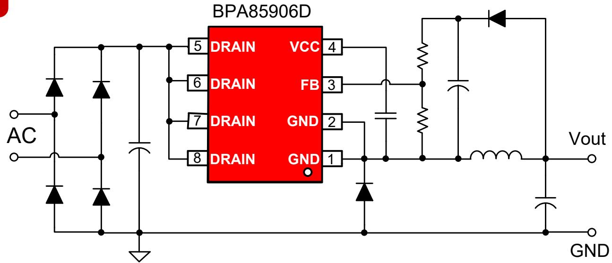

## 产品特点

高低压脚之间爬电距离＞3mm  
集成 650V 高压 MOSFET  
PWM控制模式，低输出纹波  
低待机功耗（＜100mW）  
内置软启动功能  
集成高压启动、自供电电路  
低音频噪声  
➢ SOP8封装

## 产品规格

<table><tr><td colspan="5">输出电流表</td></tr><tr><td rowspan="2">型号</td><td colspan="2">230VAC ±15%</td><td colspan="2">85 ~ 265VAC</td></tr><tr><td>DCM模式</td><td>CCM模式</td><td>DCM模式</td><td>CCM模式</td></tr><tr><td>BPA85906D</td><td>320mA</td><td>450mA</td><td>320mA</td><td>450mA</td></tr></table>

注：表中的推荐输出电流是在充分散热的条件下，非隔离BUCK电路应用。

## 目标应用

家用电器辅助电源  
➢ PC待机电源  
电机驱动辅助电源  
➢ IOT/智能家居/智能照明  
➢ 通信、工业控制辅助电源

输出电压调整率

<table><tr><td> $I_{OUT}(mA)$ \VIN(VAC)</td><td>85Vac</td><td>115Vac</td><td>132Vac</td><td>176Vac</td><td>230Vac</td><td>265Vac</td><td>线调整率</td></tr><tr><td>0%负载(0mA)</td><td>15.64V</td><td>15.64V</td><td>15.63V</td><td>15.63V</td><td>15.63V</td><td>15.64V</td><td>0.08%</td></tr><tr><td>25%负载(100mA)</td><td>15.16V</td><td>15.16V</td><td>15.16V</td><td>15.15V</td><td>15.15V</td><td>15.15V</td><td>0.09%</td></tr><tr><td>50%负载(200mA)</td><td>15.15V</td><td>15.15V</td><td>15.15V</td><td>15.14V</td><td>15.14V</td><td>15.14V</td><td>0.07%</td></tr><tr><td>75%负载(300mA)</td><td>15.15V</td><td>15.16V</td><td>15.16V</td><td>15.16V</td><td>15.15V</td><td>15.16V</td><td>0.07%</td></tr><tr><td>100%负载(400mA)</td><td>15.17V</td><td>15.18V</td><td>15.17V</td><td>15.17V</td><td>15.17V</td><td>15.17V</td><td>0.07%</td></tr><tr><td>负载调整率</td><td>3.24%</td><td>3.18%</td><td>3.15%</td><td>3.24%</td><td>3.22%</td><td>3.25%</td><td>/</td></tr></table>

◼ 调整率计算方法：调整率=100%\*(最大值-最小值)/平均值

## 待机功耗

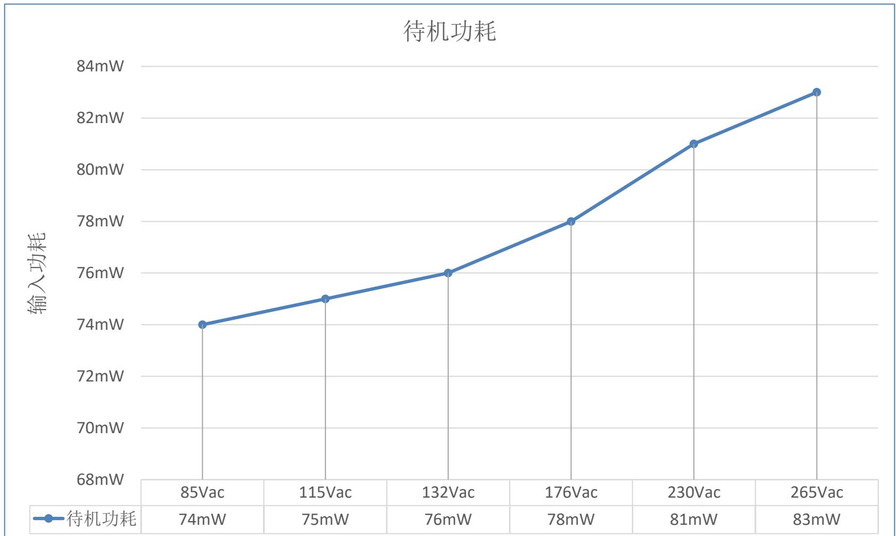

## 转换效率

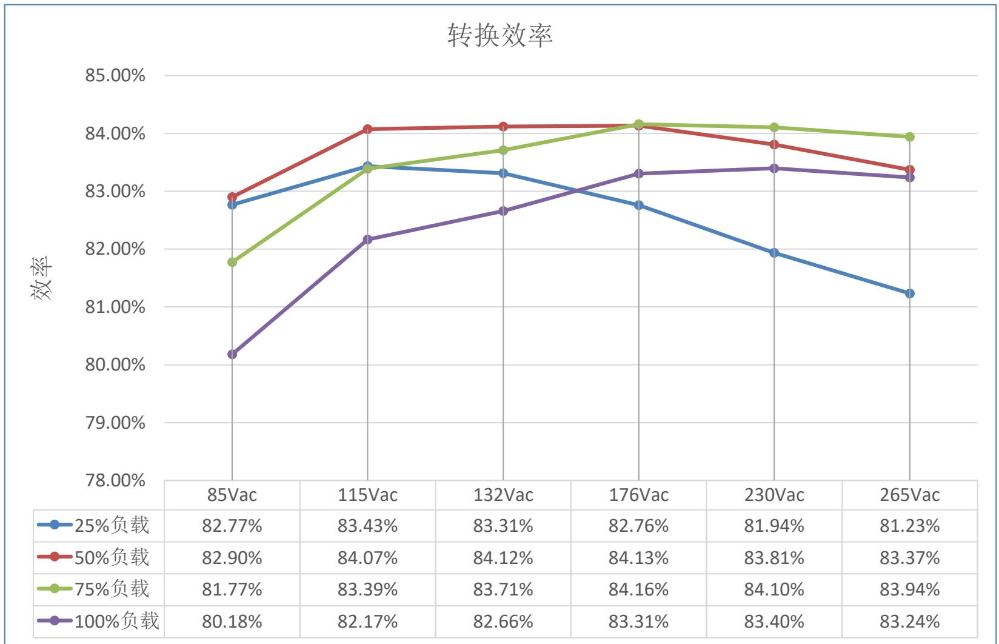

## 输出电压纹波

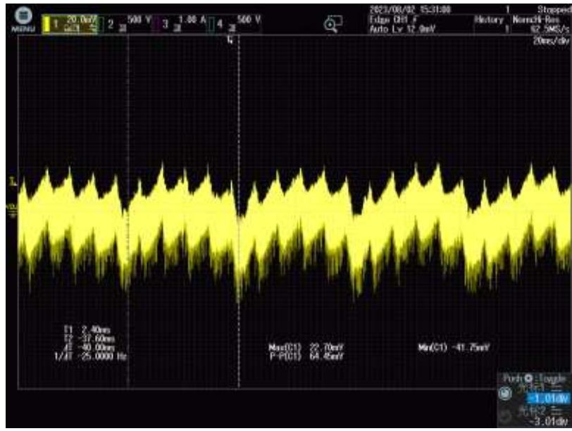

## 85VAC

$\begin{array} { r l } & { \mathsf { C H 1 V } _ { \mathsf { O U T } } } \\ & { \mathsf { V } _ { \mathsf { P K - P K } } \mathsf { = } 6 4 . 4 5 \mathsf { m v } } \end{array}$ CH1 VOUT

## Test Condition:

➢ Full Load(400mA)

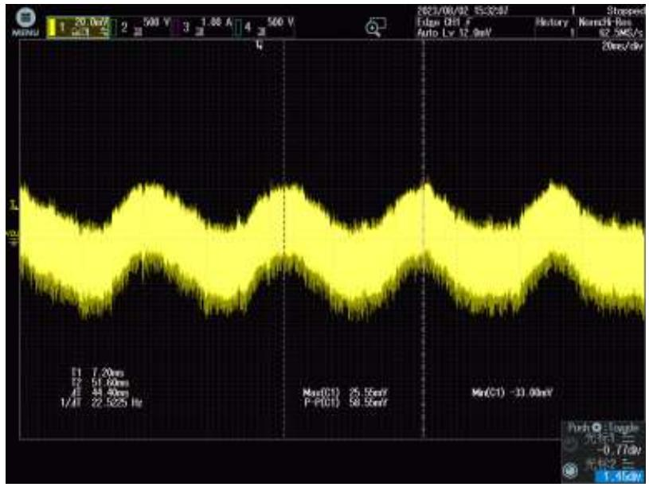

## 265VAC

CH1 VOUT ${ \mathsf { C H 1 } } { \mathsf { V } } _ { \mathsf { O U T } }$ $V _ { p \vert k - P K } = 5 8 . 5 5 m v$

## Test Condition:

➢ Full Load(400mA)

## 动态纹波（50%-100%）

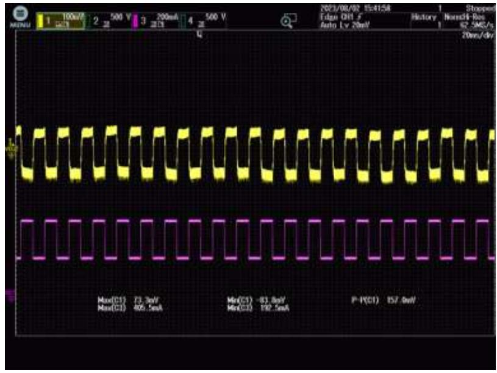

## 85VAC

CH1 VOUT ${ \mathsf { C H 1 } } { \mathsf { V } } _ { \mathsf { O U T } }$  
$V _ { \mathsf { P K - P K } } { = } 1 5 7 . 0 \mathsf { m V }$

CH3 IOUT

## Test Condition:

➢ $0 . 2 \ A { - } 0 . 4 \ A { - } 0 . 2 \ A$  
➢ Slew Rate: 0.5 A/μS  
➢ Frequency: 100 Hz

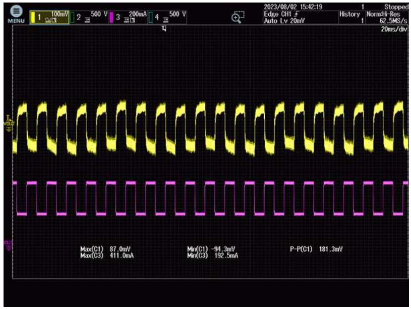

## 265VAC

CH1 VOUT ${ \mathsf { C H 1 } } { \mathsf { V } } _ { \mathsf { O U T } }$  
$\mathtt { V } _ { \mathtt { P K - P K } } = 1 8 1 . 3 \mathsf { m V }$  
CH3 IOUT $\mathsf { C H 3 } \mathsf { I _ { 0 \mathsf { U } \mathsf { T } } }$

## Test Condition:

➢ 0.2 A-0.4 A-0.2 A  
➢ Slew Rate: 0.5 A/μS  
➢ Frequency: 100 Hz

## 输出短路保护

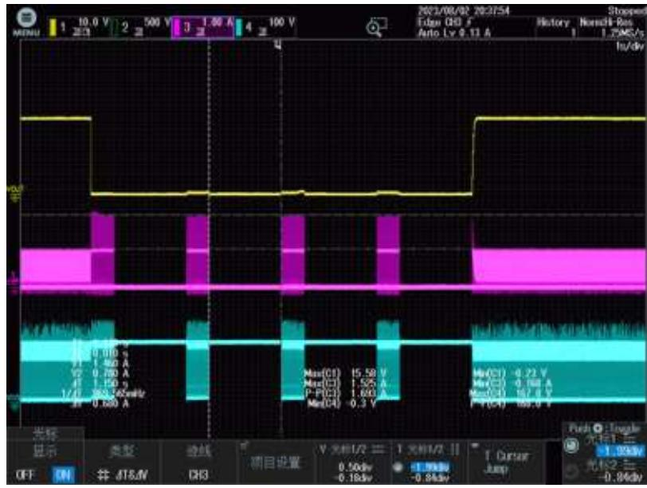

## 85VAC

${ \mathsf { C H 1 } } { \mathsf { V } } _ { \mathsf { O U T } }$  
$C H 3 \mid _ { \mathsf { D S } }$  
CH4 VDS ${ \mathsf { C H } } 4 \ { \mathsf { V } } _ { \mathsf { D S } }$ $\mathsf { I } _ { \mathsf { M A X } } \colon 1 . 5 3 \mathsf { A }$ $\mathsf { V } _ { \mathsf { M A X } } \colon 1 6 7 . 8 \mathsf { V }$

## Test Condition:

➢ 输出短路

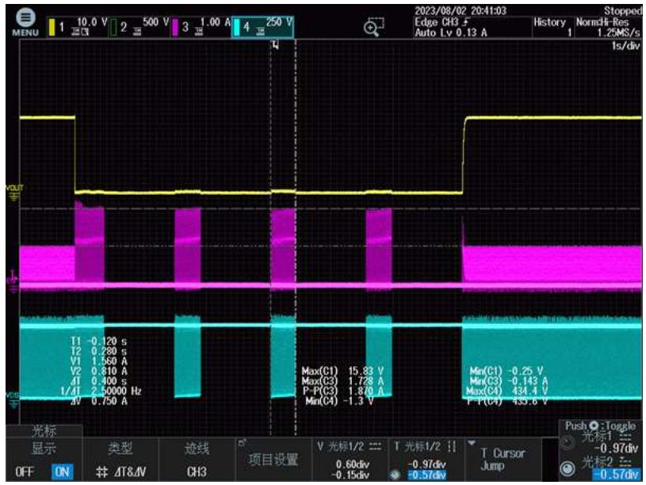

## 85VAC

${ \mathsf { C H 1 } } { \mathsf { V } } _ { \mathsf { O U T } }$  
$C H 3 \mid _ { \mathsf { D S } }$  
CH4 VDS ${ \mathsf { C H } } 4 \vee _ { \mathsf { D S } }$ IMAX: 1.73A $\mathsf { I } _ { \mathsf { M A X } } \colon 1 . 7 3 \mathsf { A }$ $V _ { \max } : 4 3 4 . 4 V$

## Test Condition:

➢ 输出短路

## 传导EMI

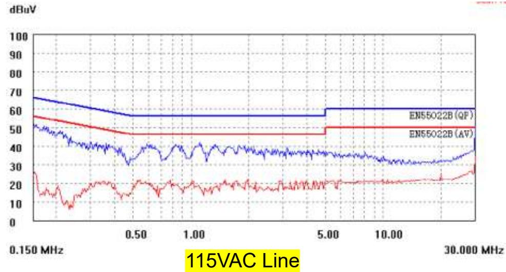

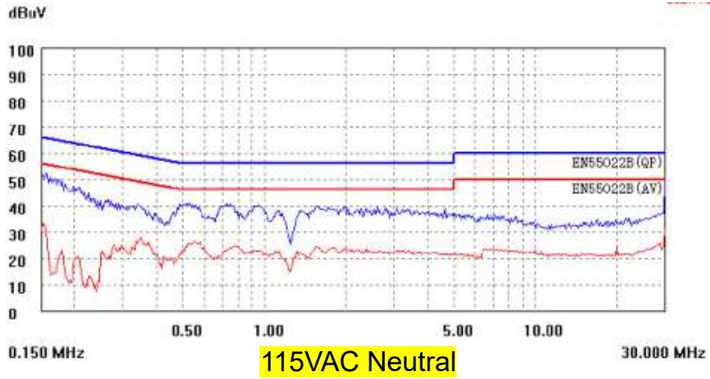

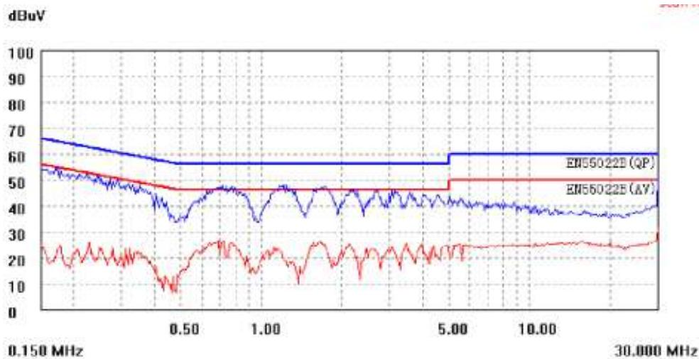

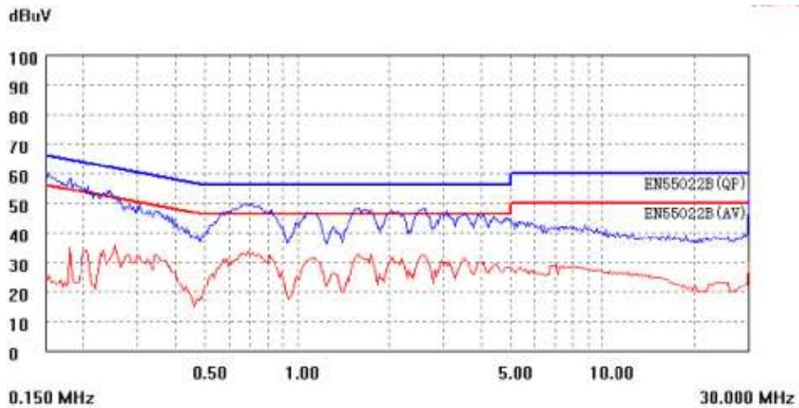

230VAC Line  
230VAC Neutral

## THANK YOU FOR WATCHING
