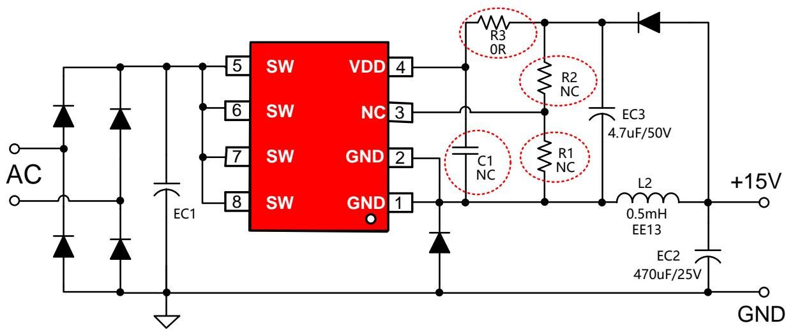

## BPA85906D兼容PN6654说明

时间：2023年8月

BPA85906D  

PN6654  

1、如上面电路图，BPA85906D芯片替换PN6654芯片时，需要增加3个电阻和1个贴片电容（R1、R2、R3和C1。  
2、兼容说明：在PCB画板过程中，在PN6654电路的基础上，预留R1、R2、R3和C1的位号（可以参考BPA85906D芯片电路），这样BPA85906D和PN6654芯片可以互相兼容。

<table><tr><td></td><td>BPA85906D</td><td>PN6654</td></tr><tr><td>Mosfet BV</td><td>650V</td><td>650V</td></tr><tr><td> $R_{DS\_ON}$ </td><td>6Ω</td><td>3.6Ω</td></tr><tr><td>限流点</td><td>0.7A</td><td>1.15A</td></tr><tr><td>软启动</td><td>有</td><td>有</td></tr><tr><td>VCC启动阈值电压/迟滞</td><td>6.4V/1.4V</td><td>14V/2V</td></tr><tr><td>输出短路保护</td><td>有</td><td>有</td></tr><tr><td>输出过压保护</td><td>有</td><td>无</td></tr><tr><td>输出过载保护</td><td>有</td><td>有</td></tr><tr><td>过温保护</td><td>有</td><td>有</td></tr></table>

## THANK YOU FOR WATCHING
