## BPA85906D非隔离参考设计

## \_5V0.3A\_12V0.85A\_15V0.15A

文长川

时间：2023年8月05日

BPS

晶丰明源

## 内容

BPA85906D简介  
电源规格  
电路及实物图  
BOM  
PCB Layout图  
变压器  
性能测试数据

## 产品特点：

➢ 集成 650V 高压 MOSFET  
➢PWM控制模式，低输出纹波  
➢内置软启动功能  
➢集成高压启动、 自供电电路  
➢低音频噪声

## 应用领域：

➢ 家用电器辅助电源  
➢ 电机驱动辅助电源  
➢ IOT/智能家居/智能照明  
➢ 工业控制辅助电源

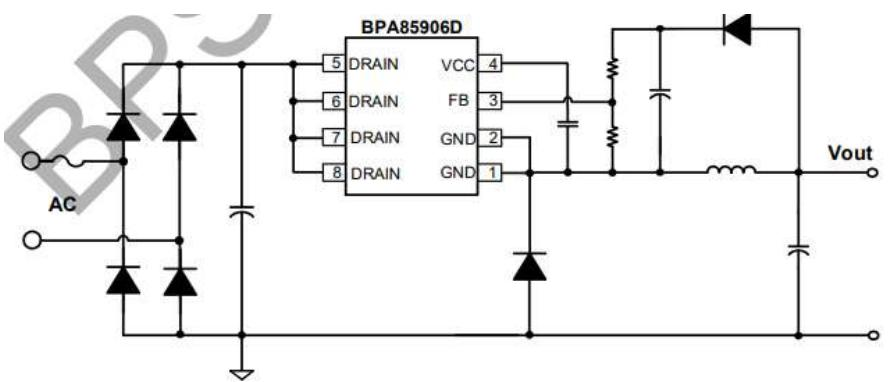

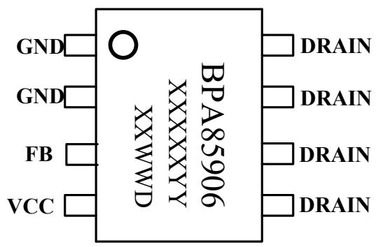

SOP8

<table><tr><td>项目描述</td><td>符号</td><td>最小</td><td>典型</td><td>最大</td><td>单位</td><td>备注</td></tr><tr><td colspan="7">输入</td></tr><tr><td>电压</td><td> $V_{IN}$ </td><td>85</td><td>115/230</td><td>282</td><td> $V_{AC}$ </td><td></td></tr><tr><td>频率</td><td> $f_{LINE}$ </td><td>47</td><td>50/60</td><td>63</td><td>Hz</td><td></td></tr><tr><td colspan="7">输出</td></tr><tr><td>输出电压1</td><td> $V_{OUT1}$ </td><td></td><td>5</td><td></td><td>V</td><td>±5%</td></tr><tr><td>输出电流1</td><td> $I_{OUT1}$ </td><td></td><td>300</td><td></td><td>mA</td><td></td></tr><tr><td>输出电压2</td><td> $V_{OUT2}$ </td><td></td><td>12</td><td></td><td>V</td><td></td></tr><tr><td>输出电流2</td><td> $I_{OUT2}$ </td><td></td><td>850</td><td></td><td>mA</td><td></td></tr><tr><td>输出电压3</td><td> $V_{OUT3}$ </td><td></td><td>15</td><td></td><td>V</td><td></td></tr><tr><td>输出电流3</td><td> $I_{OUT3}$ </td><td></td><td>150</td><td></td><td>mA</td><td></td></tr><tr><td>输出电压纹波1</td><td> $V_{RIPPLE}$ </td><td></td><td>200</td><td></td><td>mV</td><td>20MHz带宽</td></tr><tr><td>输出电压纹波2</td><td> $V_{RIPPLE}$ </td><td></td><td>100</td><td></td><td>mV</td><td>20MHz带宽</td></tr><tr><td>输出电压纹波3</td><td> $V_{RIPPLE}$ </td><td></td><td>100</td><td></td><td>mV</td><td>20MHz带宽</td></tr><tr><td>连续输出功率</td><td> $P_{OUT}$ </td><td></td><td>14</td><td></td><td>W</td><td></td></tr><tr><td colspan="7">效率</td></tr><tr><td>待机功耗</td><td> $P_{STDBY}$ </td><td></td><td>100</td><td></td><td>mW</td><td>230VAC,包含假负载</td></tr><tr><td>满载效率</td><td>η</td><td></td><td>80</td><td></td><td>%</td><td></td></tr><tr><td colspan="7">环境</td></tr><tr><td>传导EMI</td><td></td><td colspan="4">满足CISPR22/EN55022 Class B,至少6dB 裕量</td><td></td></tr><tr><td>Surge</td><td></td><td></td><td>2</td><td></td><td>kV</td><td>差模</td></tr><tr><td>EFT</td><td></td><td></td><td>4</td><td></td><td>kV</td><td>5kHz/100kHz/38kHz</td></tr><tr><td>ESD</td><td></td><td></td><td>15</td><td>20</td><td>kV</td><td>空气放电</td></tr><tr><td>工作环境温度</td><td> $T_{AMP}$ </td><td>0</td><td></td><td>50</td><td>°C</td><td></td></tr></table>

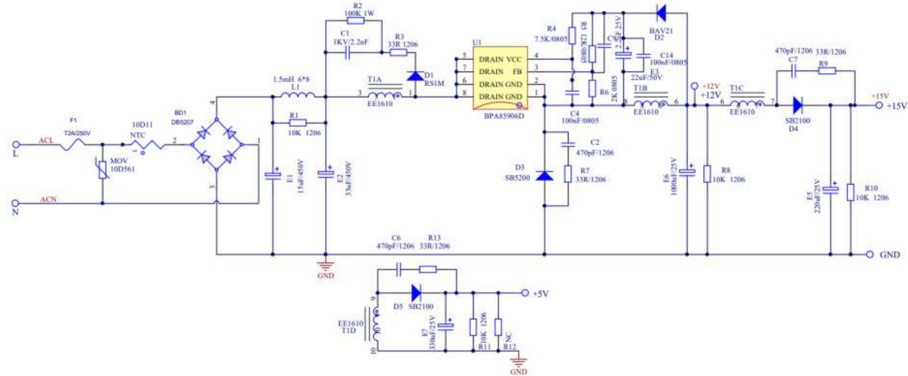

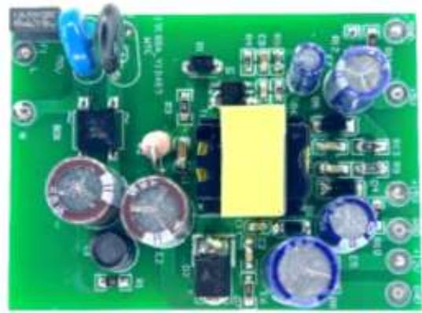

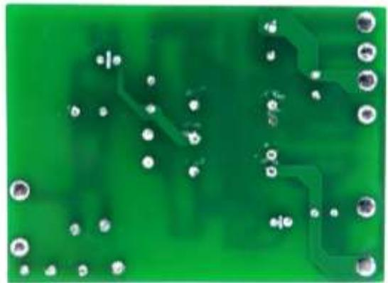

<table><tr><td>序号</td><td>元件标号</td><td>参数描述</td><td>封装尺寸</td><td>数量</td></tr><tr><td>1</td><td>PCB</td><td>FR-4,双面板</td><td>50mm*69mm</td><td>1</td></tr><tr><td>2</td><td>F1</td><td>T2A 250V 方型保险丝</td><td>DIP</td><td>1</td></tr><tr><td>3</td><td>E1</td><td>450V15uF电解电容</td><td> $\phi 10*13$ </td><td>2</td></tr><tr><td>4</td><td>E2</td><td>450V33uF电解电容</td><td> $\phi 10*13$ </td><td>2</td></tr><tr><td>5</td><td>L1</td><td>工字电感1.5mH</td><td> $\phi 6*8$ </td><td>1</td></tr><tr><td>6</td><td>MOV</td><td>10D561</td><td>DIP</td><td>1</td></tr><tr><td>7</td><td>NTC</td><td>10D11</td><td>DIP</td><td>1</td></tr><tr><td>8</td><td>U1</td><td>BPA85906D</td><td>SOP8</td><td>1</td></tr><tr><td>9</td><td>E3</td><td>50V22uF电解电容</td><td> $\phi 5*11$ </td><td>1</td></tr><tr><td>10</td><td>T1</td><td>EE1610 1mH</td><td>DIP</td><td>1</td></tr><tr><td>11</td><td>E6</td><td>25V/1000uF电解电容</td><td> $\phi 10*16mm$ </td><td>1</td></tr><tr><td>12</td><td>E5</td><td>25V/220uF电解电容</td><td> $\phi 8*10mm$ </td><td>1</td></tr><tr><td>13</td><td>E7</td><td>25V/330uF电解电容</td><td> $\phi 8*10mm$ </td><td>1</td></tr><tr><td>14</td><td>BD1</td><td>DB207 2A1KV整流桥</td><td>SMD</td><td>1</td></tr><tr><td>15</td><td>D1</td><td>RS1M 1A,1KV快速二极管</td><td>SMA</td><td>1</td></tr></table>

<table><tr><td>序号</td><td>元件标号</td><td>参数描述</td><td>封装尺寸</td><td>数量</td></tr><tr><td>16</td><td>D3</td><td>SB5200 5A200V肖特基二极管</td><td>SMC</td><td>1</td></tr><tr><td>17</td><td>D4,D5</td><td>SS210 2A100V肖特基二极管</td><td>SMA</td><td>2</td></tr><tr><td>18</td><td>D2</td><td>BAV21 1A250V超快恢复二极管</td><td>SOD-123</td><td>1</td></tr><tr><td>19</td><td>C1</td><td>1nF 1KV贴片电容 X7R</td><td>SMD1206</td><td>1</td></tr><tr><td>20</td><td>R1,R10,R10,R11</td><td>10K, ±5%</td><td>SMD1206</td><td>4</td></tr><tr><td>21</td><td>R3,R13,R7,R9</td><td>33R, ±5%</td><td>SMD1206</td><td>4</td></tr><tr><td>22</td><td>R2</td><td>100K, 1W ±5%金属氧化膜</td><td>DIP</td><td>1</td></tr><tr><td>23</td><td>R4</td><td>7.5K, ±5%</td><td>SMD0805</td><td>1</td></tr><tr><td>24</td><td>R5</td><td>12K, ±1%</td><td>SMD0805</td><td>1</td></tr><tr><td>25</td><td>R6</td><td>2K, ±5%</td><td>SMD0805</td><td>1</td></tr><tr><td>26</td><td>C14,C4</td><td>100nF/16V,X7R</td><td>SMD0805</td><td>2</td></tr><tr><td>27</td><td>C9</td><td>2.2uF/16V,X7R</td><td>SMD0805</td><td>1</td></tr><tr><td>28</td><td>C2,C6,C7</td><td>470pF/250V,X7R</td><td>SMD0805</td><td>3</td></tr><tr><td colspan="2"></td><td></td><td>Total</td><td>40</td></tr></table>

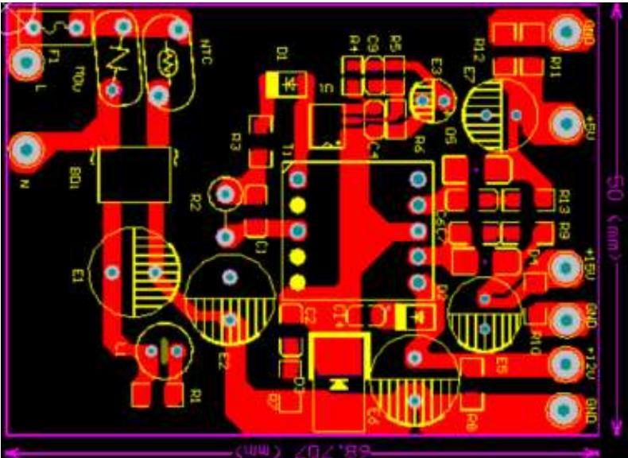

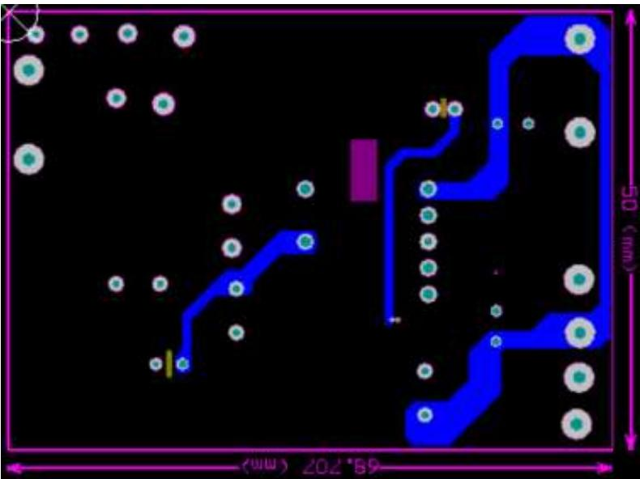

## 原理图

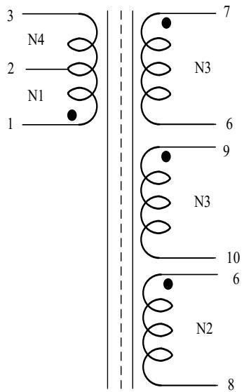

## 绕线方式

<table><tr><td>绕组</td><td>起始脚</td><td>终止脚</td><td>材料</td><td>匝数</td><td>绕线方式</td></tr><tr><td>N1</td><td>1</td><td>2</td><td> $\phi 0.25*1P$ </td><td>61Ts</td><td>密绕一层(PI N脚朝外)</td></tr><tr><td colspan="4">胶带</td><td>1.5Ts</td><td></td></tr><tr><td>N2</td><td>6</td><td>8</td><td> $\phi 0.45*1P$ </td><td>17Ts</td><td>密绕一层(PI N脚朝外)</td></tr><tr><td colspan="4">胶带</td><td>1.5Ts</td><td></td></tr><tr><td rowspan="2"> $N^β$ </td><td>7</td><td>6</td><td> $\phi 0.35*1P$ </td><td>5Ts</td><td rowspan="2">同层并绕密绕一层(PI N脚朝外)</td></tr><tr><td>9</td><td>10</td><td> $\phi 0.35*1P$ </td><td>8Ts</td></tr><tr><td colspan="4">胶带</td><td>2.1Ts</td><td></td></tr><tr><td>N4</td><td>2</td><td>3</td><td> $\phi 0.25*1P$ </td><td>33Ts</td><td>密绕一层(PI N脚朝外)</td></tr><tr><td colspan="4">胶带</td><td>3Ts</td><td></td></tr></table>

## 规格与材料

➢ 初级绕组感量 $\mathsf { L } _ { \mathsf { p 3 - 1 } } \mathsf { = } 1 0 0 0 \mathsf { u H } \pm 7 \%$ （测试条件： 0.3V，$1 0 k \mathsf { H } z )$ ）  
➢ 漏感量 $L _ { { \sf I k } } { < } 3 0 { \sf u H }$  
➢ 骨架：EE1610立式（5+5PIN）  
➢ 磁芯：EE1610 PC44 或同等材质 ， $\mathsf { A e } { = } 3 8 \mathsf { m m } ^ { 2 }$  
➢ N1、N2、N3、N4: 2UEW 漆包线  
➢ 绝缘胶带:3M900 或同等材质  
➢ 成品要求：浸凡立水

## 脚位图

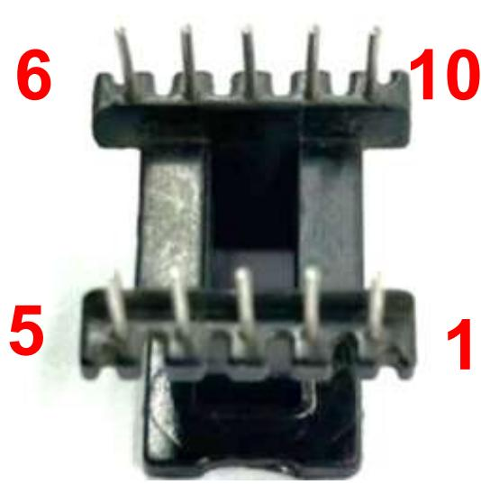

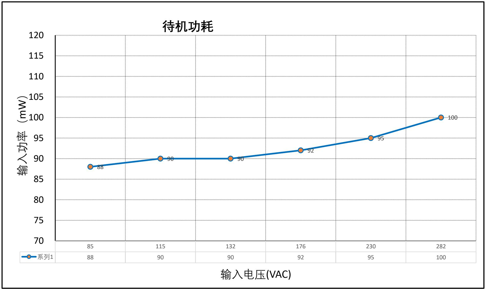

效率测试  
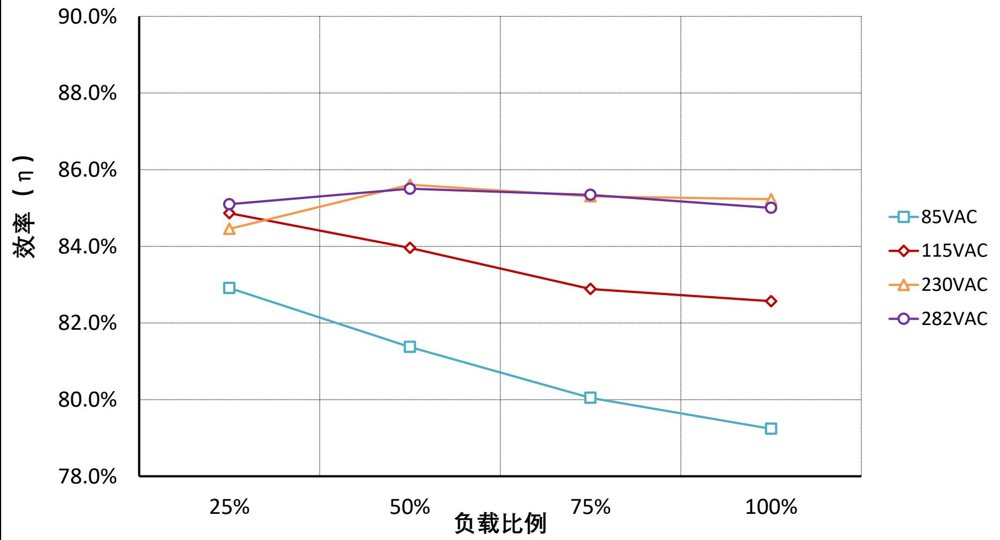

## 输出电压交叉调整率

<table><tr><td> $V_{OUT}(V)$  $I_{OUT}(A)$ </td><td></td><td>5V</td><td>12V</td><td>15V</td></tr><tr><td rowspan="2"> $I_{O\_5V}=0A$  $I_{O\_12V}=0A$  $I_{O\_15V}=0A$ </td><td>115VAC</td><td>5.68</td><td>12.4</td><td>15.6</td></tr><tr><td>230VAC</td><td>5.68</td><td>12.4</td><td>15.65</td></tr><tr><td rowspan="2"> $I_{O\_5V}=0.3A$  $I_{O\_12V}=0A$  $I_{O\_15V}=0A$ </td><td>115VAC</td><td>3.4</td><td>30</td><td>30</td></tr><tr><td>230VAC</td><td>3.1</td><td>20</td><td>20.00</td></tr><tr><td rowspan="2"> $I_{O\_5V}=0.3A$  $I_{O\_12V}=10mA$  $I_{O\_15V}=0A$ </td><td>115VAC</td><td>3.47</td><td>12.37</td><td>15.1</td></tr><tr><td>230VAC</td><td>3.89</td><td>12.2</td><td>15.11</td></tr><tr><td rowspan="2"> $I_{O\_5V}=0A$  $I_{O\_12V}=0.85A$  $I_{O\_15V}=0A$ </td><td>115VAC</td><td>7.74</td><td>11.81</td><td>16.70</td></tr><tr><td>230VAC</td><td>7.7</td><td>11.81</td><td>16.8</td></tr><tr><td rowspan="2"> $I_{O\_5V}=0A$  $I_{O\_12V}=0A$  $I_{O\_15V}=0.15A$ </td><td>115VAC</td><td>5.92</td><td>11.96</td><td>14.89</td></tr><tr><td>230VAC</td><td>5.88</td><td>11.95</td><td>14.88</td></tr><tr><td rowspan="2"> $I_{O\_5V}=0.3A$  $I_{O\_12V}=1A$  $I_{O\_15V}=0.15A$ </td><td>115VAC</td><td>5.35</td><td>11.84</td><td>15.1</td></tr><tr><td>230VAC</td><td>5.35</td><td>11.84</td><td>15.06</td></tr></table>

## 输出电压纹波

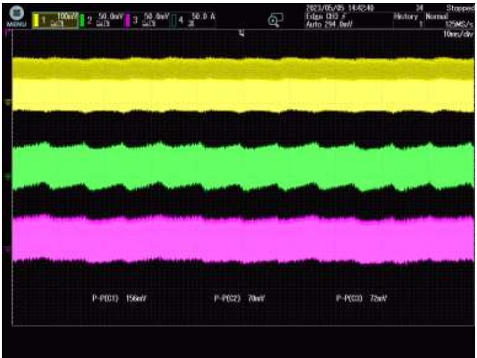

${ \otimes 5 } \mathsf { V } _ { \mathsf { A C } }$

CH1 $\mathsf { V } _ { \mathsf { O U T - 5 V } }$ $\mathsf { R i p p } | \mathsf { e }$  
$\mathsf { V } _ { \mathsf { P K - P K } } { = } 1 5 6 \mathsf { m V }$  
CH2 $\mathsf { V } _ { \mathsf { O U T } - 1 2 \mathsf { V } }$ Ripple  
$\mathsf { V } _ { \mathsf { P K - P K } } { = } 7 0 \mathsf { m } \mathsf { v }$  
CH3 $\mathsf { V } _ { \mathsf { O U T } - 1 5 \mathsf { V } }$ Ripple $\mathbf { V } _ { \mathsf { P K - P K } } { = } 7 2 \mathsf { m } \mathbf { V }$

Test Condition:  
➢ Full Load  
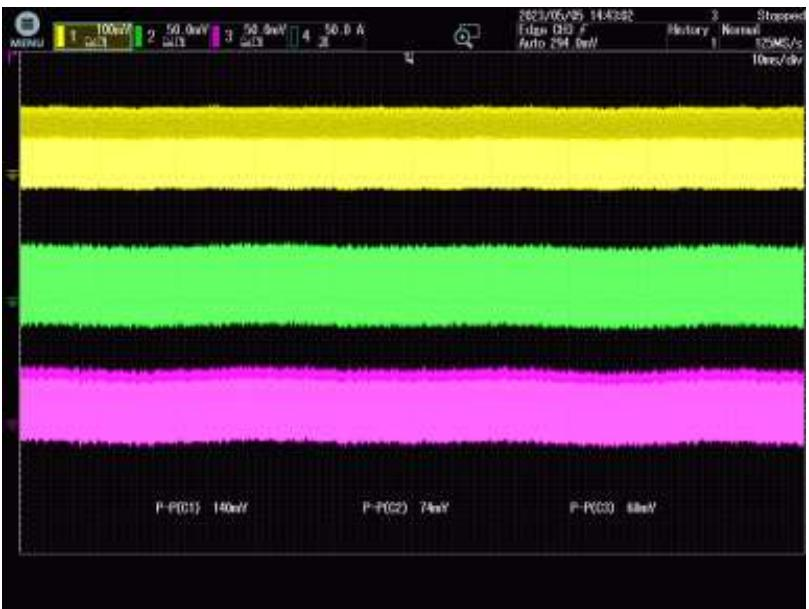

230 VAC

CH1 $\mathsf { V } _ { \mathsf { O U T - 5 V } }$ Ripple  
$\mathsf { V } _ { \mathsf { P K - P K } } { = } \mathsf { 1 } 4 0 \mathsf { m V }$  
CH2 $\mathsf { V } _ { \mathsf { O U T } - 1 2 \mathsf { V } }$ Ripple  
$\mathsf { V } _ { \mathsf { P K - P K } } { = } 7 4 \mathsf { m } \mathsf { v }$  
CH3 $\mathsf { V } _ { \mathsf { O U T } - 1 5 \mathsf { V } }$ Ripple $\mathsf { V } _ { \mathsf { P K - P K } } { = } 6 8 \mathsf { m V }$ VPK-PK=68mV

Test Condition:  
➢ Full Load  
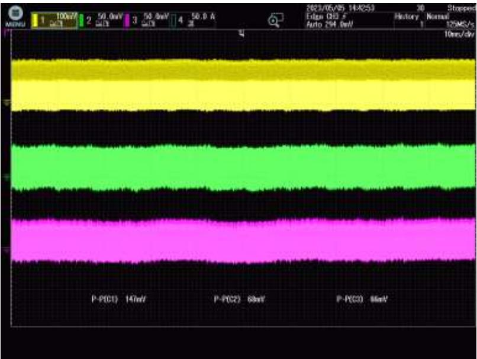

$1 1 5 \mathsf { V } _ { \mathsf { A C } }$

${ \mathsf { C H 1 } } { \mathsf { V } } _ { { \mathsf { O U T } } - { \mathsf { 5 V } } }$ Ripple  
$\mathsf { V } _ { \mathsf { P K - P K } } { = } 1 4 7 \mathsf { m V }$  
${ \mathsf { C H } } 2 { \mathsf { V } } _ { 0 \mathsf { U T } - 1 2 { \mathsf { V } } }$ Ripple  
$\mathtt { V } _ { \mathtt { P K - P K } } = 6 8 \mathsf { m V }$  
CH3 $\mathsf { V } _ { \mathsf { O U T - 1 5 V } }$ Ripple $\mathsf { V } _ { \mathsf { P K - P K } } { = } 6 6 \mathsf { m V }$

Test Condition:  
➢ Full Load  
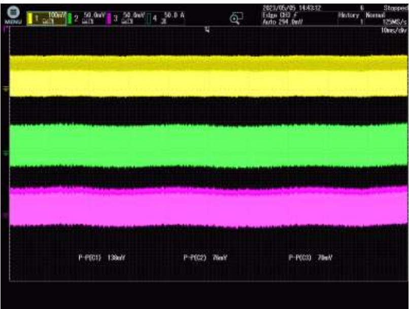

$2 8 2 \mathsf { V } _ { \mathsf { A C } }$

CH1 $\mathsf { V } _ { \mathsf { O U T - 5 V } }$ Ripple  
$\mathsf { V } _ { \mathsf { P K - P K } } { = } \pm 3 8 \mathsf { m V }$  
${ \mathsf { C H } } 2 { \mathsf { V } } _ { 0 \mathsf { U T } - 1 2 { \mathsf { V } } }$ Ripple  
$v _ { p \kappa \mathrm { - } P \kappa } = 7 6 m v$  
CH3 $\mathsf { V } _ { \mathsf { O U T - 1 5 V } }$ Ripple $\mathsf { V } _ { \mathsf { P K - P K } } { = } 7 0 \mathsf { m } \mathsf { v }$

Test Condition:

➢ Full Load

## 动态负载(50%-100%)

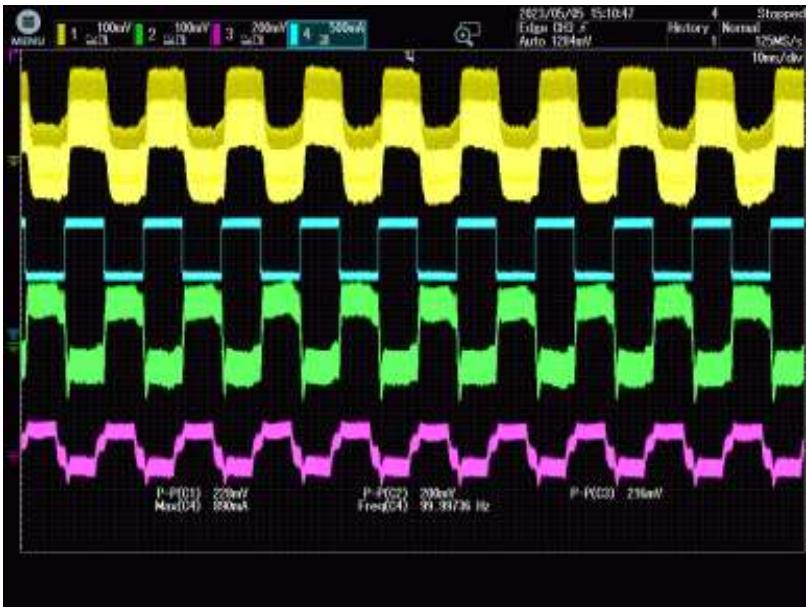

CH1 $\mathsf { V } _ { \mathsf { O U T - 5 V } }$ Ripple $V _ { \mathsf { P K - P K } } { = } 2 2 8 \mathsf { m V }$ VPK-PK=228mV  
${ \mathsf { C H } } 2 { \mathsf { V } } _ { 0 \mathsf { U T } - 1 2 { \mathsf { V } } }$ Ripple VPK-PK=200mV $\mathsf { V } _ { \mathsf { P K - P K } } { = } 2 0 0 \mathsf { m V }$  
CH3 $\mathsf { V } _ { \mathsf { O U T } - \underline { { 1 } } \mathsf { S V } }$ Ripple VPK-PK=216mV

## Test Condition:

➢ CH1 ：0.15 A-0.3A-0.15 A  
➢ CH2 ：0.425A-0.85A-0.425 A  
➢ CH3 ：0.075A-0.15A-0.075A  
➢ Slew Rate: 0.5 A/μS  
➢ Frequency: 100 Hz

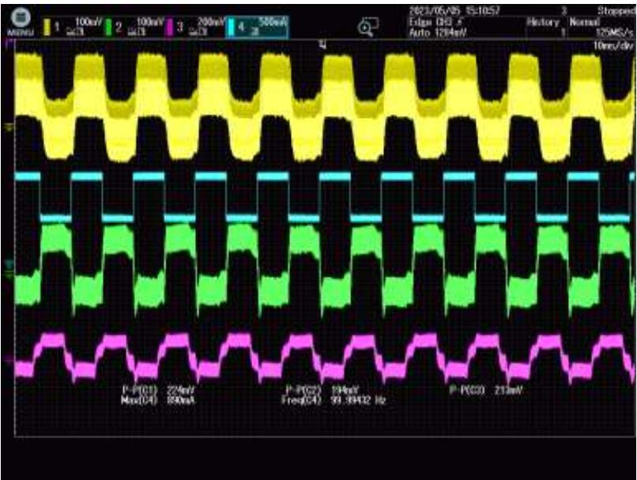

115 VAC

$\mathsf { C H 1 V _ { 0 \sqcup T - S V } } \mathsf { R i p p l e }$ VPK-PK=224mV $\mathsf { V } _ { \mathsf { P K - P K } } { = } 2 2 4 \mathsf { m V }$  
CH2 VOUT-12V Ripple VPK-PK=194mV $\mathsf { V } _ { \mathsf { P K - P K } } { = } 1 9 4 \mathsf { m V }$  
CH3 $\mathsf { V } _ { \mathsf { O U T - 1 5 V } }$ Ripple $V _ { P K - P K } = 2 1 3 m v$

## Test Condition:

➢ CH1 ：0.15 A-0.3A-0.15 A  
➢ CH2 ：0.425A-0.85A-0.425 A  
➢ CH3 ：0.075A-0.15A-0.075A  
➢ Slew Rate: 0.5 A/μS  
➢ Frequency: 100 Hz

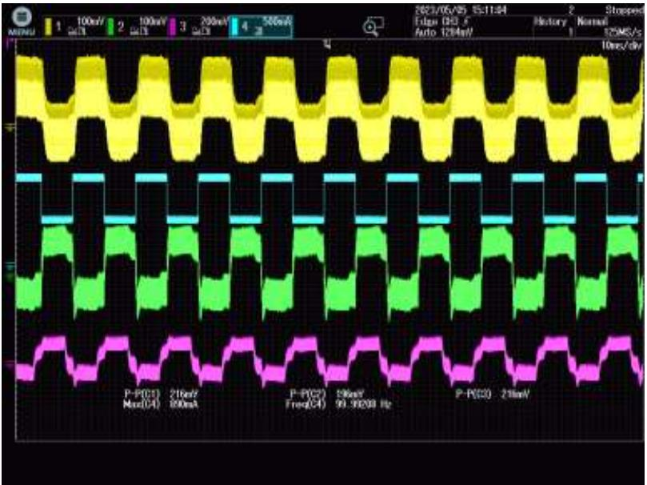

230 VAC

CH1 $\mathsf { V } _ { \mathsf { O U T - 5 V } }$ Ripple $\mathsf { V } _ { \mathsf { P K - P K } } { = } 2 1 5 \mathsf { m V }$  
${ \mathsf { C H } } 2 { \mathsf { V } } _ { 0 \cup { \mathsf { T } } - 1 2 { \mathsf { V } } }$ Ripple VPK-PK=196mV $\mathsf { V } _ { \mathsf { P K - P K } } { = } 1 9 6 \mathsf { m V }$  
CH3 VOUT-15V Ripple $V _ { P K - P K } = 2 1 6 m v$

## Test Condition:

➢ CH1 ：0.15 A-0.3A-0.15 A  
➢ CH2 ：0.425A-0.85A-0.425 A  
➢ CH3 ：0.075A-0.15A-0.075A  
➢ Slew Rate: 0.5 A/μS  
➢ Frequency: 100 Hz

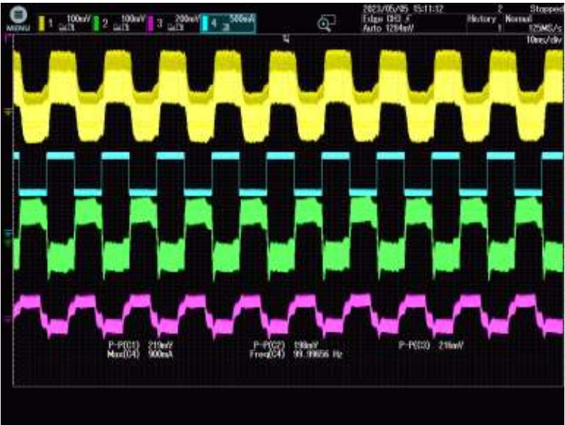

282 VAC

CH1 $\mathsf { V } _ { \mathsf { O U T - S V } }$ Ripple $\mathsf { V } _ { \mathsf { P K - P K } } { = } 2 1 9 \mathsf { m V }$  
${ \mathsf { C H } } 2 { \mathsf { V } } _ { 0 \cup \mathsf { T } - 1 2 { \mathsf { V } } }$ Ripple $\mathsf { V } _ { \mathsf { P K - P K } } \mathsf { = } \mathsf { 1 9 9 m V }$  
CH3 VOUT-15V $\mathsf { V } _ { \mathsf { O U T } - \underline { { 1 } } \mathsf { S } \mathsf { V } }$ Ripple $\mathsf { V } _ { \mathsf { P K - P K } }$ =216mV

## Test Condition:

➢ CH1 ：0.15 A-0.3A-0.15 A  
➢ CH2 ：0.425A-0.85A-0.425 A  
➢ CH3 ：0.075A-0.15A-0.075A  
➢ Slew Rate: 0.5 A/μS  
➢ Frequency: 100 Hz

## 动态负载(10%-90%)

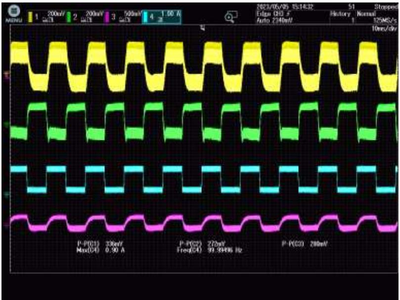

## 85 VAC

$\mathsf { C H 1 V _ { o u r - 5 v } R i p p l e }$ $\mathsf { V } _ { \mathsf { P K - P K } } { = } 3 3 6 \mathsf { m v }$  
${ \mathsf { C H } } 2 { \mathsf { V } } _ { 0 \cup \mathsf { T } - 1 2 { \mathsf { V } } }$ Ripple $\mathsf { V } _ { \mathsf { P K - P K } } { = } 2 7 2 \mathsf { m V }$  
${ \mathsf { C H 3 } } { \mathsf { V } } _ { 0 \cup \mathsf { T } - 1 5 \mathsf { V } }$ Ripple $V _ { P K - P K } = 2 8 0 m v$ V =280mV

## Test Condition:

➢ CH1 ：0.03A-0.27A-0.03A  
➢ CH2 ：0.085A-0.765A-0.085A  
➢ CH3 ：0.015A-0.135A-0.015A  
➢ Slew Rate: 0.5 A/μS  
➢ Frequency: 100 Hz

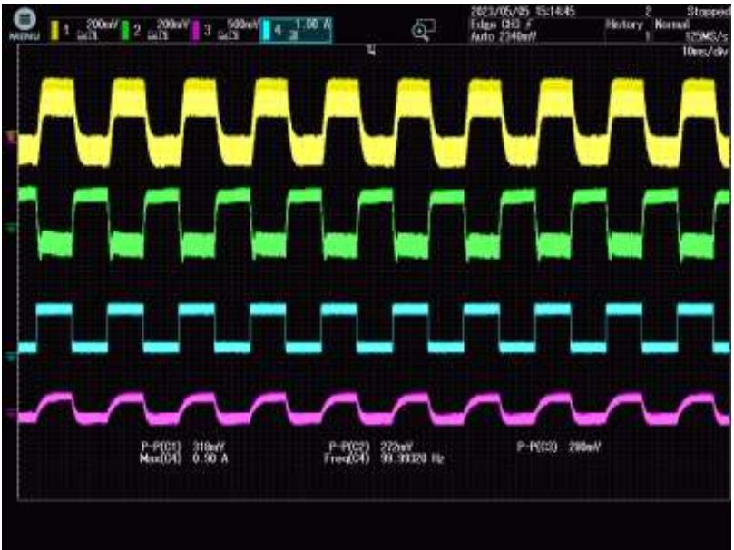

## 230 VAC

${ \mathsf { C H 1 } } { \mathsf { V } } _ { { \mathsf { O U T } } \cdot { \mathsf { 5 V } } }$ Ripple $\mathsf { V } _ { \mathsf { P K - P K } } { = } 3 1 9 \mathsf { m V }$  
$\mathsf { C H } 2 \mathsf { V } _ { 0 \sqcup \mathsf { T } - 1 2 \mathsf { V } } \mathsf { R i p p l e }$ $\mathsf { V } _ { \mathsf { P K - P K } } { = } 2 7 2 \mathsf { m V }$  
$\begin{array} { r l } & { \mathsf { C H 3 } \mathsf { V _ { O U T - 1 5 V } R i p p l e } } \\ & { \mathsf { V _ { P K - P K } } \mathsf { = } 2 8 0 \mathsf { m V } } \end{array}$

## Test Condition:

➢ CH1 ：0.03A-0.27A-0.03A  
➢ CH2 ：0.085A-0.765A-0.085A  
➢ CH3 ：0.015A-0.135A-0.015A  
➢ $\mathsf { S l e w R a t e } \colon 0 . 5 \mathsf { A } / \mu \mathsf { S }$  
➢ Frequency: 100 Hz

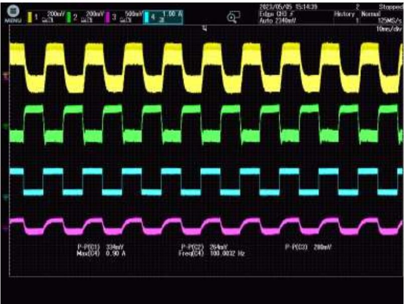

## 115 VAC

CH1 $\mathsf { V } _ { \mathsf { O U T - S V } }$ Ripple $\mathsf { V } _ { \mathsf { P K - P K } } { = } 3 3 4 \mathsf { m V }$  
$\mathsf { C H } 2 \mathsf { V } _ { 0 \sqcup \mathsf { T } - 1 2 \mathsf { V } } \mathsf { R i p p l e }$ $\mathsf { V } _ { \mathsf { P K - P K } } { = } 2 6 4 \mathsf { m v }$  
CH3 $\mathsf { V } _ { \mathsf { O U T - 1 5 V } }$ Ripple $V _ { P K - P K } = 2 8 0 m v$

## Test Condition:

➢ CH1 ：0.03A-0.27A-0.03A  
➢ CH2 ：0.085A-0.765A-0.085A  
➢ CH3 ：0.015A-0.135A-0.015A  
➢ Slew Rate: 0.5 A/μS  
➢ Frequency: 100 Hz

## 282 VAC

CH1 $\mathsf { V } _ { \mathsf { O U T - S V } }$ Ripple $\mathsf { V } _ { \mathsf { P K - P K } } { = } 3 1 9 \mathsf { m V }$  
${ \mathsf { C H } } 2 { \mathsf { V } } _ { 0 \cup \mathsf { T } - 1 2 { \mathsf { V } } }$ Ripple $\mathsf { V } _ { \mathsf { P K - P K } } { = } 2 7 1 \mathsf { m V }$ VPK-PK=271mV  
CH3 VOUT-15V $\mathsf { V } _ { \mathsf { O U T - 1 5 V } }$ Ripple $V _ { P K - P K } = 3 0 0 m v$

## Test Condition:

➢ CH1 ：0.03A-0.27A-0.03A  
➢ CH2 ：0.085A-0.765A-0.085 A  
➢ CH3 ：0.015A-0.135A-0.015A  
➢ Slew Rate: 0.5 A/μS  
➢ Frequency: 100 Hz

## 输出电压开机波形

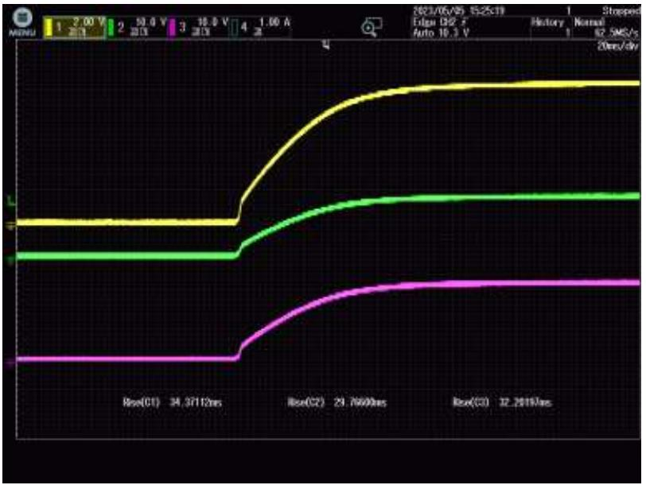

85 VAC

CH1 VOUT-5V TRISE: 34 mS  
CH2 VOUT-12V Ripple TRISE: 29 mS  
CH3 VOUT-15V TRISE: 32 mS

Test Condition:  
➢ No Load  
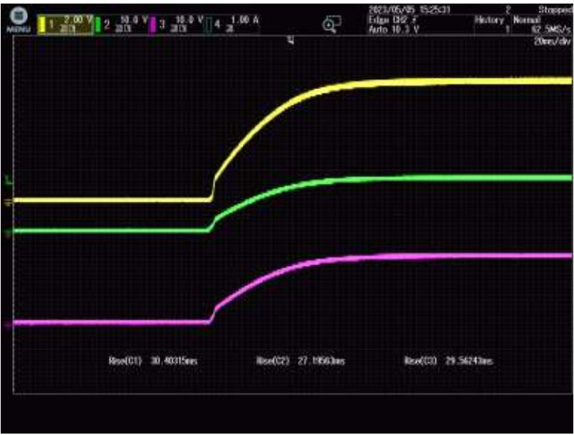

85 VAC

CH1 VOUT-5V TRISE: 30 mS  
CH2 VOUT-12V Ripple TRISE: 27 mS  
CH3 VOUT-15V TRISE: 29 mS

Test Condition:  
➢ Full Load  
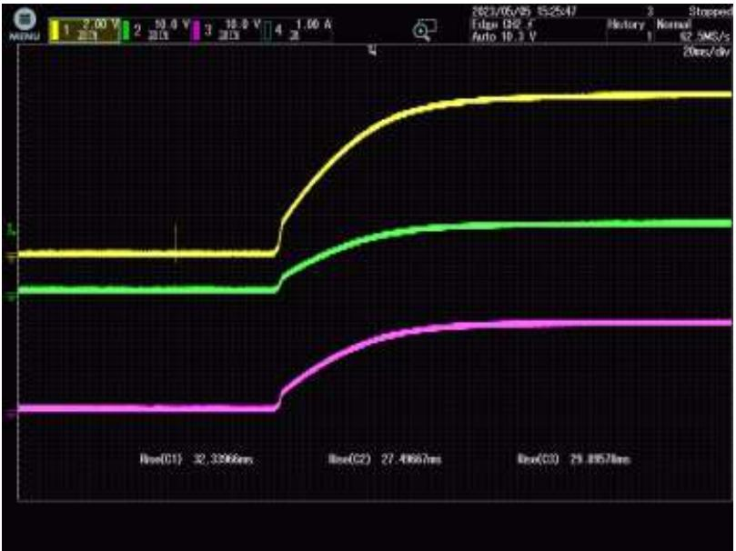

282 VAC

CH1 VOUT-5V TRISE: 32 mS  
CH2 VOUT-12V Ripple TRISE: 27 mS  
CH3 VOUT-15V TRISE: 29 mS

Test Condition:  
➢ No Load  
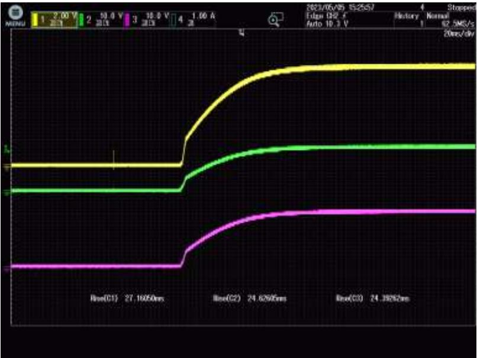

282 VAC

CH1 VOUT-5V TRISE: 27 mS  
CH2 VOUT-12V Ripple TRISE: 24 mS  
CH3 VOUT-15V TRISE: 24 mS

Test Condition:

➢ Full Load

## 漏极电压电流启动波形

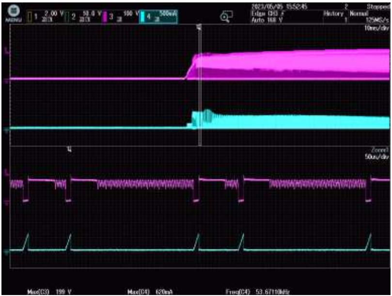

85 VAC

CH3 VVDS：  
CH4 IDRAIN:

$$
\begin{array}{l} \mathrm {V_ {DS\_MAX}} = 1 9 9 \mathrm{V} \\ \mathrm {I_ {DS\_MAX}} = 0. 6 2 \mathrm{A} \end{array}
$$

## Test Condition:

➢ No Load

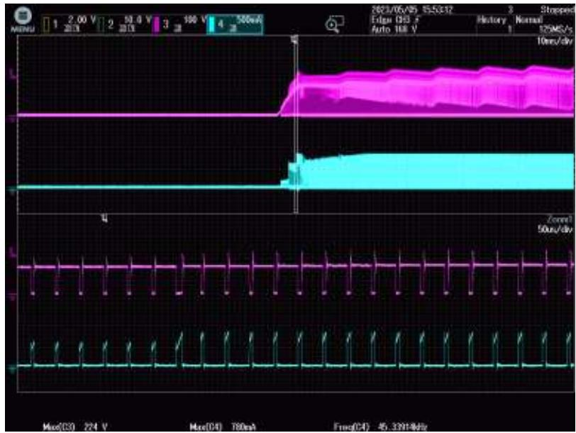

85 VAC

CH3 VVDS：  
CH4 IDRAIN:

$$
\begin{array}{l} \mathrm {V_ {DS\_MAX}} = 2 2 4 \mathrm{V} \\ \mathrm {I_ {DS\_MAX}} = 0. 7 8 \mathrm{A} \end{array}
$$

## Test Condition:

➢ Full Load

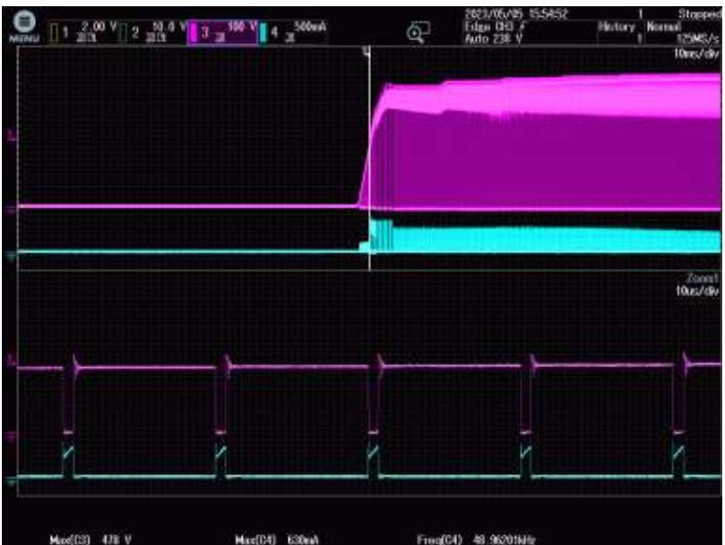

282 VAC

CH3 VVDS:  
CH4 IDRAIN:

$$
V _ {D S \_ M A X} = 4 9 0 \mathrm{V}
$$

$$
I _ {D S \_ M A X} = 0. 6 3 A
$$

## Test Condition:

➢ No Load

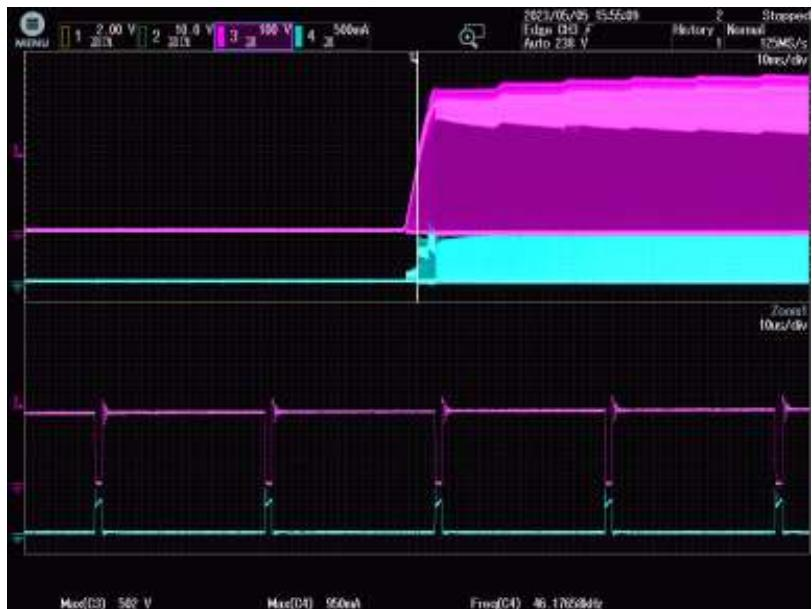

282 VAC

CH3 VVDS:  
CH4 IDRAIN:

$$
V _ {D S \_ M A X} = 5 0 2 \mathrm{V}
$$

$$
I _ {D S \_ M A X} = 0. 9 5 A
$$

## Test Condition:

➢ Full Load

## MOSFET稳态波形

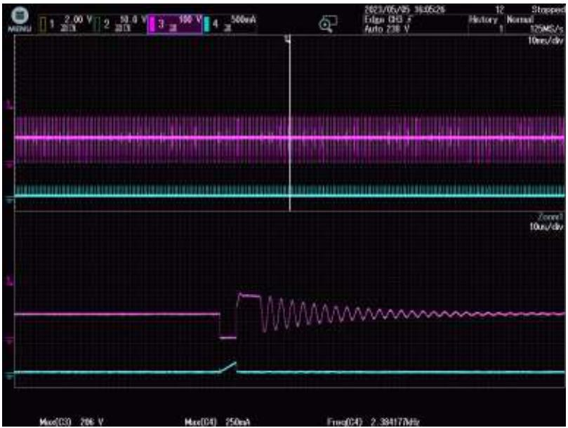

${ \otimes 5 } \mathsf { V } _ { \mathsf { A C } }$

${ \mathsf { C H 3 } } \mathsf { V _ { D S } }$  
CH4 $\mathsf { I } _ { \mathsf { D } \mathsf { S } }$

$$
\begin{array}{l} \mathrm {V_ {DS\_MAX}} = 2 0 6 \mathrm{V} \\ \mathrm {I_ {DS\_MAX}} = 0. 2 5 \mathrm{A} \end{array}
$$

## Test Condition:

➢ No Load

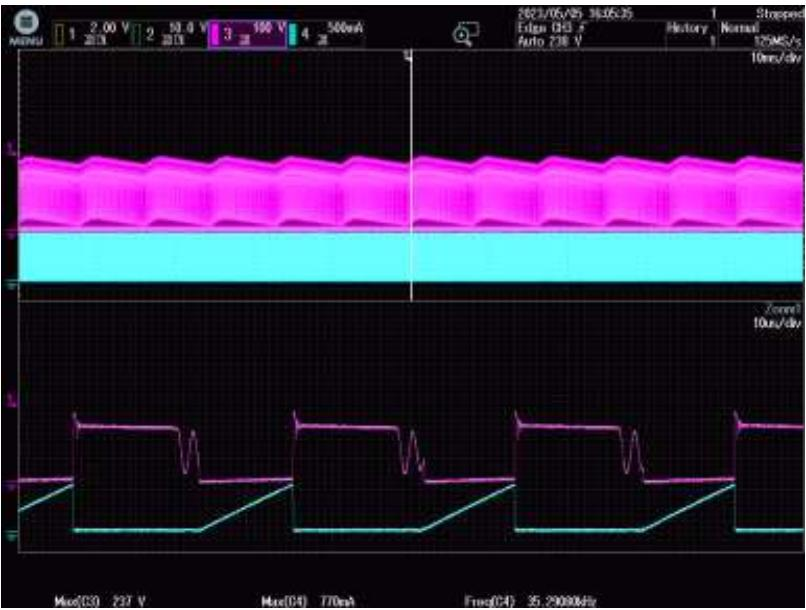

${ \tt S 5 V } _ { \sf A C }$

${ \mathsf { C H 3 } } \mathsf { V _ { D S } }$  
$C H 3 \mid _ { \mathsf { D S } }$

$$
\begin{array}{l} \mathrm {V_ {DS\_MAX}} = 2 5 2 \mathrm{V} \\ \mathrm {I_ {DS\_MAX}} = 0. 7 7 \mathrm{A} \end{array}
$$

## Test Condition:

➢ Full Load

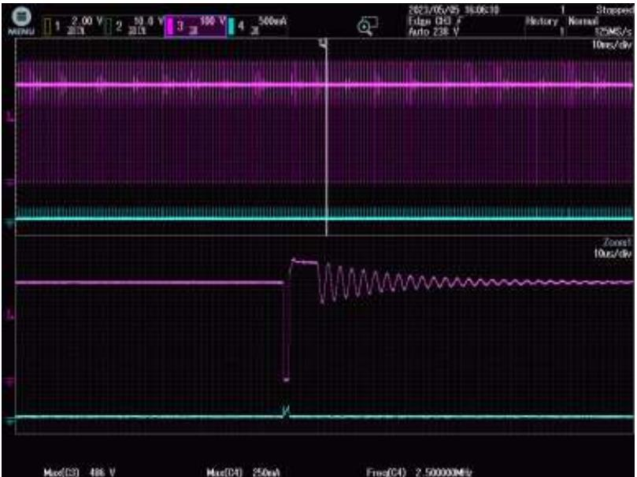

$2 8 2 \mathtt { V _ { A C } }$

${ \mathsf { C H 3 } } \mathsf { V _ { D S } }$  
$C H 4 \mid _ { \mathrm { { D S } } }$

$$
V _ {D S \_ M A X} = 4 8 6 V
$$

$$
I _ {D S \_ M A X} = 0. 2 5 A
$$

## Test Condition:

➢ No Load

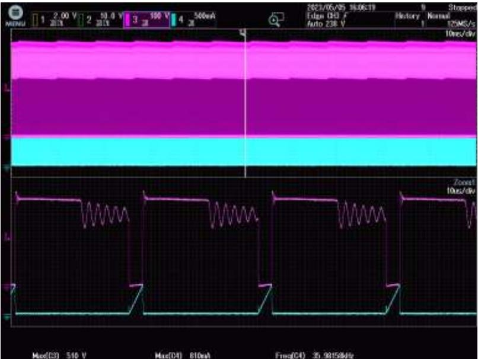

$2 8 2 \mathsf { V } _ { \mathsf { A C } }$

${ \mathsf { C H 3 } } \mathsf { V } _ { \mathsf { D S } }$  
$C H 4 1 _ { \mathrm { D S } }$

$$
V _ {D S \_ M A X} = 5 1 0 V
$$

$$
I _ {D S \_ M A X} = 0. 8 1 A
$$

## Test Condition:

➢ Full Load

## 短路保护 （MOSFET波形）

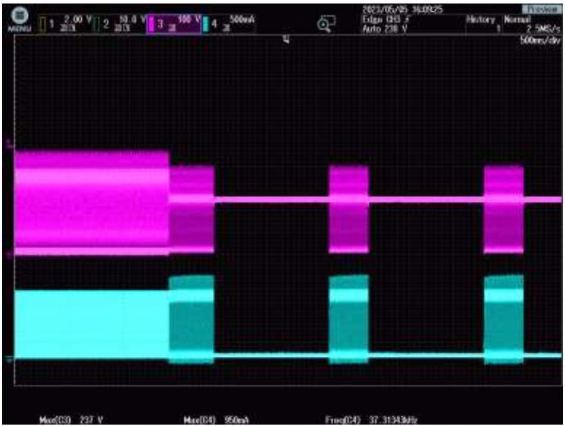

${ \otimes 5 } \mathsf { V } _ { \mathsf { A C } }$

${ \mathsf { C H 3 } } \mathsf { V _ { D S } }$  
$C H 4 1 _ { \mathsf { D } }$

$$
\begin{array}{l} \mathrm {V_ {DS\_MAX}} = 2 3 7 \mathrm{V} \\ \mathrm {I_ {DS\_MAX}} = 0. 9 5 \mathrm{A} \end{array}
$$

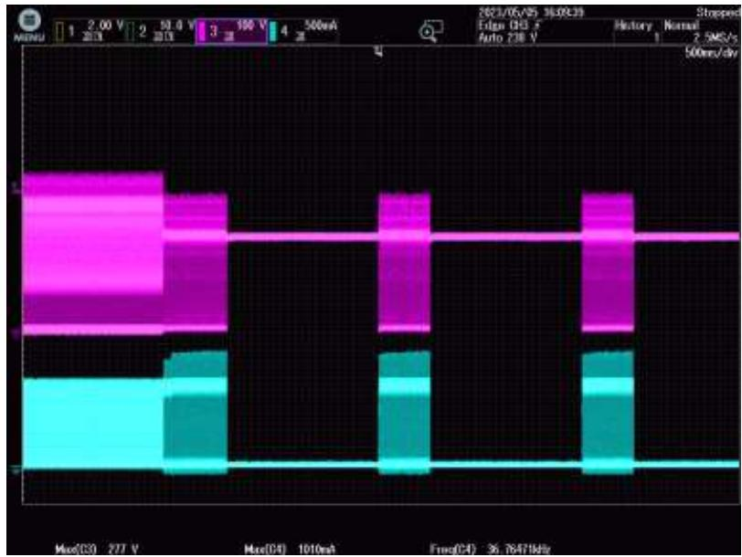

$1 1 5 \mathsf { V } _ { \mathsf { A C } }$

${ \mathsf { C H 3 } } \mathsf { V _ { D S } }$ CH4 ID $V _ { \mathsf { D S \_ M A X } } { = } 2 7 7 \lor$ $\mathsf { I } _ { \mathsf { D S \_ M A X } } { = } \mathtt { 1 A }$

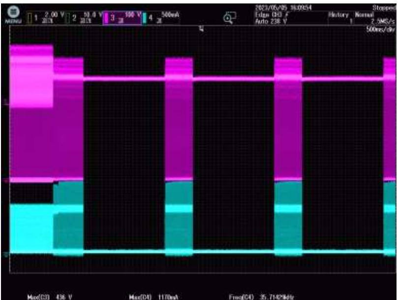

230 VAC

CH3 $\mathsf { V } _ { \mathsf { D } \mathsf { S } }$  
CH4 ID

$$
V _ {D S \_ M A X} = 4 3 6 \mathrm{V}
$$

$$
I _ {D S \_ M A X} = 1. 1 7 A
$$

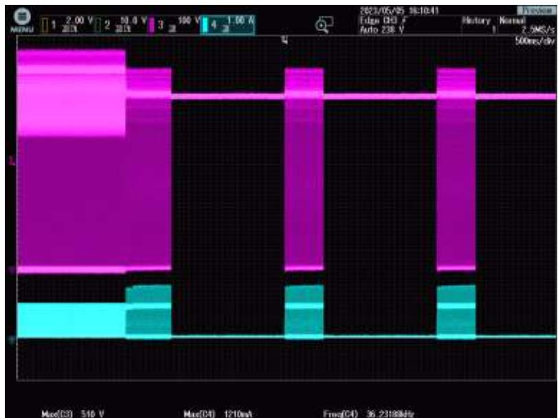

$2 8 2 \mathsf { V } _ { \mathsf { A C } }$

${ \mathsf { C H 3 } } \mathsf { V } _ { \mathsf { D S } }$  
CH4 ID

$$
V _ {D S \_ M A X} = 5 1 0 V
$$

$$
I _ {D S \_ M A X} = 1. 2 A
$$

## 电感开机电流

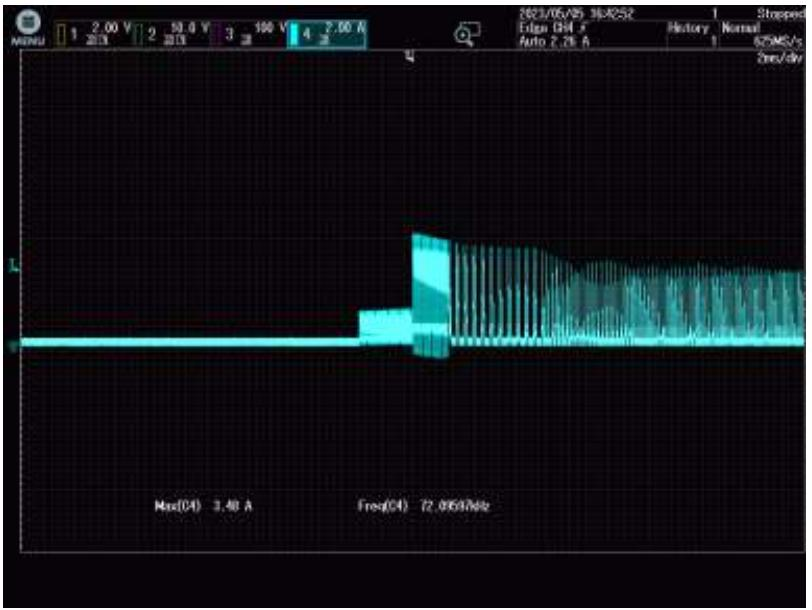

${ \tt S 5 V } _ { \sf A C }$

➢ CH4 IL IMAX : 3.48A $\mathsf { I } _ { \mathsf { M A X } } \colon 3 . 4 8 \mathsf { A }$

Test Condition:

➢ No Load

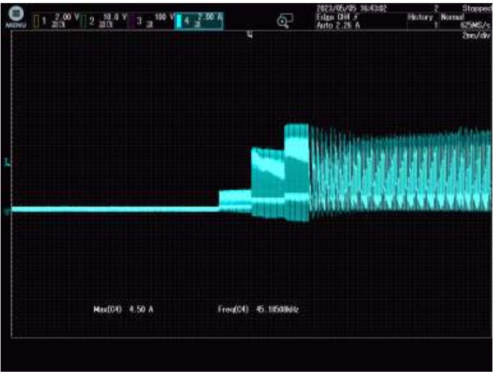

115 VAC

➢ CH4 IL IMAX : 4.5A $1 _ { \mathrm { M A X } } \colon 4 . 5 \mathsf { A }$

Test Condition:

➢ No Load

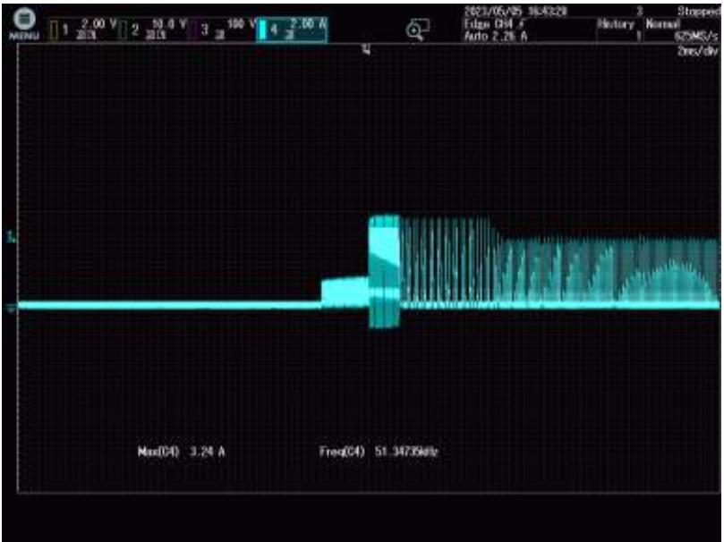

230 VAC

➢ ${ \mathsf { C H } } 4 1 _ { \mathrm { L } }$ $\mathsf { I } _ { \mathsf { M A X } } \colon 3 . 2 4 \mathsf { A }$ IMAX : 3.24A

Test Condition:

➢ No Load

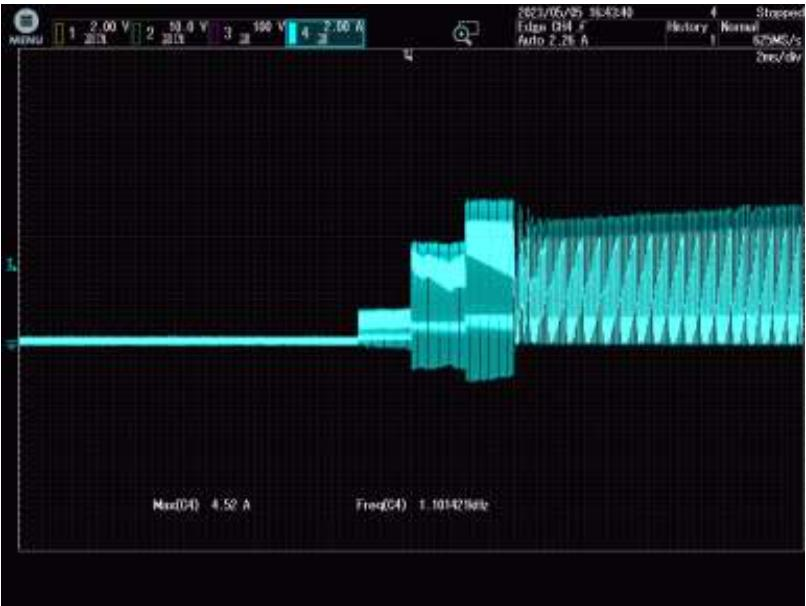

282 VAC

➢ CH4 I IMAX : 4.52A $1 _ { \mathrm { { M A X } } } : 4 . 5 2 \mathrm { { A } }$

Test Condition:

➢ No Load

## 电感工作电流

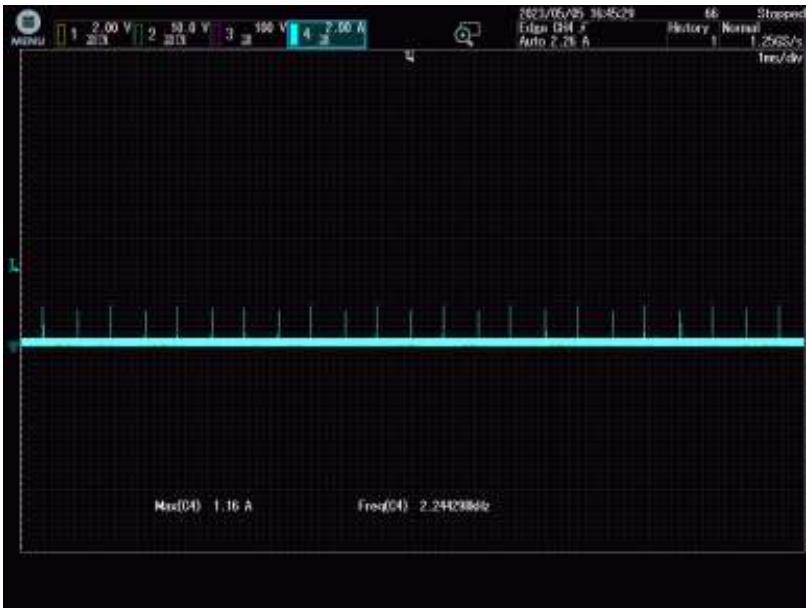

85 VAC

CH4 IL

Test Condition:

➢ No Load

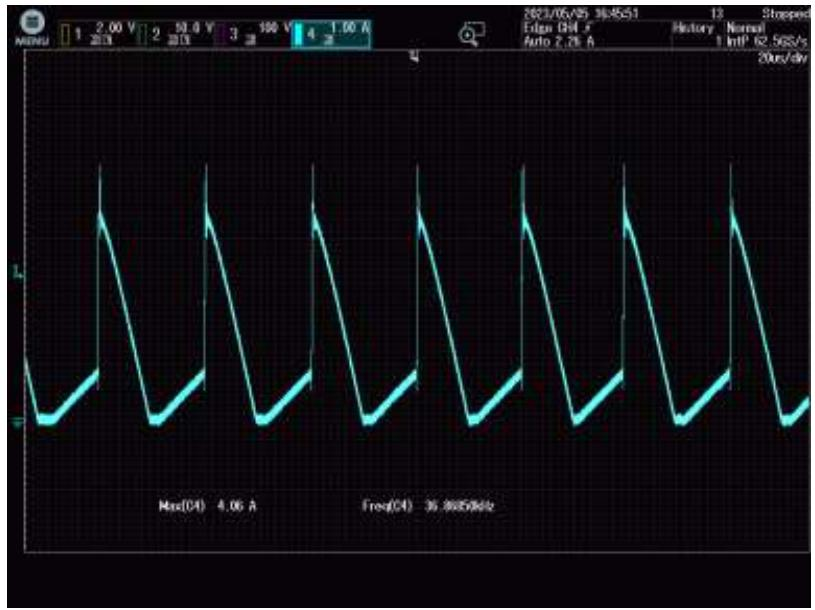

85 VAC

CH4 IL

Test Condition:

➢ Full Load

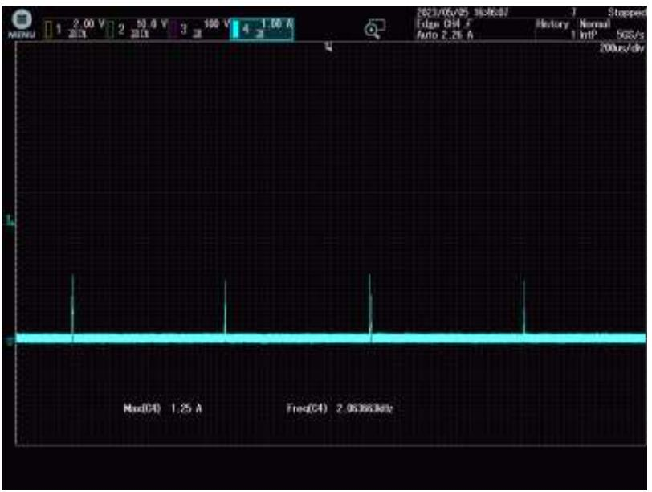

282 VAC

CH4 IL

Test Condition:

➢ No Load

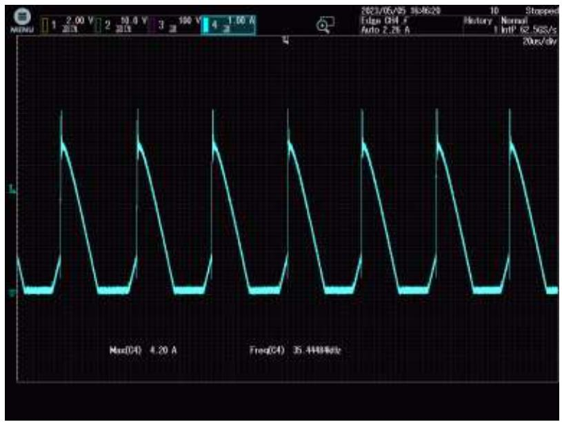

282 VAC

CH4 IL

Test Condition:

➢ Full Load

## D-S电压波形

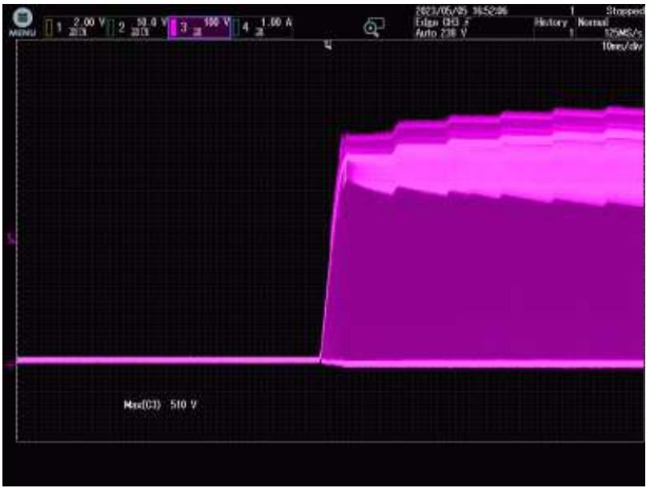

$2 8 2 \mathtt { V _ { A C } }$

CH3 VDS $\mathsf { V } _ { \mathsf { D } \mathsf { S } }$ $V \mathsf { D S } _ { \mathsf { M A X } } \colon 5 1 0 \mathrm { ~ V ~ }$

## Test Condition:

➢ 满载开机

极限参数（注2）

<table><tr><td>符号</td><td>参数</td><td>参数范围</td><td>单位</td></tr><tr><td> $V_{DRAIN}$ </td><td>内部高压 MOSFET 耐压</td><td>-0.3~650</td><td>V</td></tr><tr><td> $V_{CC}$ </td><td> $V_{CC}$ 电压</td><td>-0.3~40</td><td>V</td></tr><tr><td> $I_{CC\_MAX}$ </td><td> $V_{CC}$ 引脚最大电流</td><td>10</td><td>mA</td></tr><tr><td> $V_{FB}$ </td><td>FB 反馈端电压</td><td>-0.3~7</td><td>V</td></tr><tr><td> $V_{DEM}$ </td><td>DEM 引脚电压</td><td>-0.3~7</td><td>V</td></tr><tr><td> $V_{CS}$ </td><td>CS 引脚电压</td><td>-0.3~7</td><td>V</td></tr><tr><td> $P_{DMAX}$ </td><td>功耗(注 3)</td><td>1.5</td><td>W</td></tr><tr><td> $T_J$ </td><td>工作结温范围</td><td>-40 to 150</td><td>°C</td></tr><tr><td>Confidential</td><td>储存温度范围</td><td>-55 to 150</td><td>°C</td></tr></table>

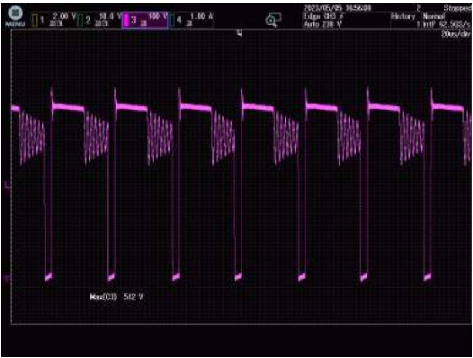

$2 8 2 \mathsf { V } _ { \mathsf { A C } }$

CH3 VDS $\mathsf { V } _ { \mathsf { D } \mathsf { S } }$ $\mathsf { V D S } _ { \mathsf { M A X } } { \boldsymbol { : } } 5 1 2 \mathsf { V }$

Test Condition:满载正常工作

## 满载开机

Derating= 510V / 650V =78.46%

## 满载正常工作

Derating = 512V / 650 V = 78.76 %

## 5V输出肖特基反压波形

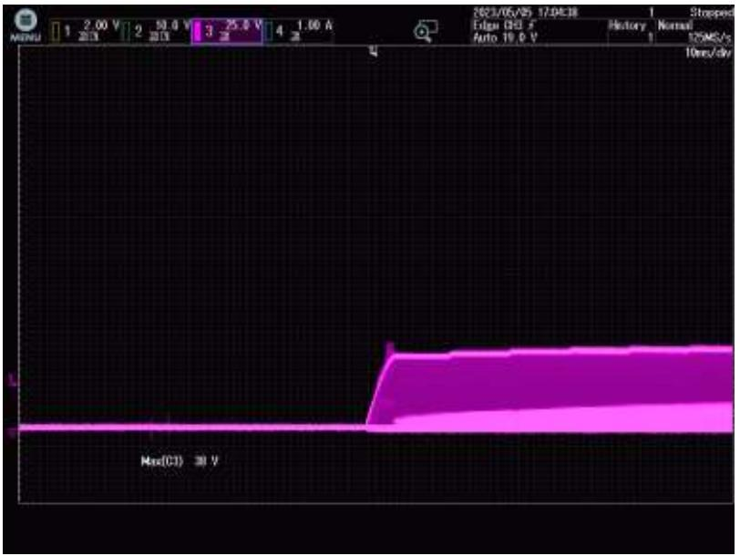

$2 8 2 \mathtt { V _ { A C } }$

$\begin{array} { r l } & { \mathsf { C H } 2 \mathsf { V } _ { \mathsf { D I O D E } } } \\ & { \mathsf { V D S } _ { \mathsf { M A X } } \colon 3 8 \mathsf { V } } \end{array}$ CH2 VDIODE

## Test Condition:

➢ 满载启动

<table><tr><td>Parameter</td><td>Symbols</td><td>5922</td><td>5924</td><td>5926</td><td>5928</td><td>59210</td><td>59212</td><td>59215</td><td>59220</td><td>Units</td></tr><tr><td>Maximum Repetitive Peak Reverse Voltage</td><td> $V_{\text{rms}}$ </td><td>20</td><td>40</td><td>60</td><td>80</td><td>100</td><td>120</td><td>150</td><td>200</td><td>V</td></tr><tr><td>Maximum RMS voltage</td><td> $V_{\text{rms}}$ </td><td>14</td><td>28</td><td>42</td><td>56</td><td>70</td><td>84</td><td>105</td><td>140</td><td>V</td></tr><tr><td>Maximum DC Blocking Voltage</td><td> $V_{DC}$ </td><td>20</td><td>40</td><td>60</td><td>80</td><td>100</td><td>120</td><td>150</td><td>200</td><td>V</td></tr><tr><td>Maximum Average Forward Rectified Current</td><td> $I_{\text{rms}}$ </td><td colspan="8">2.0</td><td>A</td></tr><tr><td>Peak Forward Surge Current, 8.3ms Single Half Sine-wave Superimposed on Rated Load (JEDEC method)</td><td> $I_{\text{rms}}$ </td><td colspan="8">50</td><td>A</td></tr><tr><td>Max Instantaneous Forward Voltage at 2 A</td><td> $V_F$ </td><td colspan="2">0.55</td><td colspan="2">0.70</td><td colspan="2">0.65</td><td colspan="2">0.95</td><td>V</td></tr><tr><td>Maximum DC Reverse Current  $T_r = 25°C$ at Rated DC Reverse Voltage  $T_s = 100°C$ </td><td> $I_n$ </td><td colspan="3">0.55</td><td colspan="5">0.33</td><td>mA</td></tr><tr><td>Typical Junction Capacitance $^{111}$ </td><td> $C_j$ </td><td colspan="2">220</td><td colspan="6">80</td><td>pF</td></tr><tr><td>Typical Thermal Resistance $^{111}$ </td><td> $R_{\text{rms}}$ </td><td colspan="8">80</td><td>°C/W</td></tr><tr><td>Operating Junction Temperature Range</td><td> $T_j$ </td><td colspan="8">-55 ~ +125</td><td>°C</td></tr><tr><td>Storage Temperature Range</td><td> $T_{\text{avg}}$ </td><td colspan="8">-55 ~ +150</td><td>°C</td></tr></table>

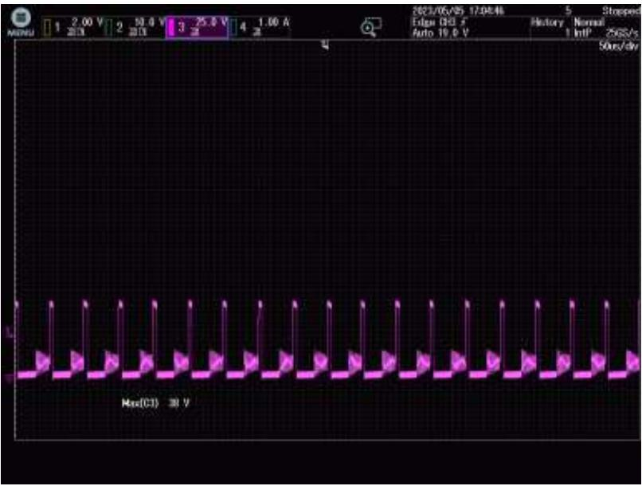

$2 8 2 \mathsf { V } _ { \mathsf { A C } }$

$\begin{array} { l } { { \mathsf { C H } } { 2 } { \mathsf { V } } _ { \mathsf { D D } \mathsf { I O D E } } } \\ { { \mathsf { V } } _ { \mathsf { M A X } } \colon { 3 } { 8 } { \mathsf { V } } } \end{array}$ CH2 VDDIODE

## Test Condition:

满载正常工作

## 满载开机

$\mathrm { D e r a t i n g } = 3 8 \lor / 1 0 0 \lor = 3 8 \%$

## 满载正常工作

$\mathrm { D e r a t i n g } = 3 8 \vee / 1 0 0 \vee = 3 8 \%$

## 12V输出肖特基反压波形

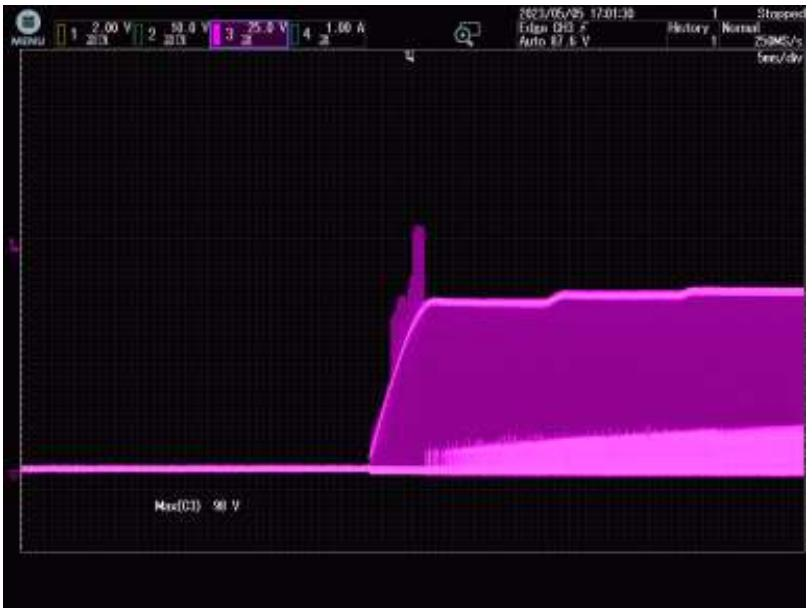

$2 8 2 \mathtt { V _ { A C } }$

$\begin{array} { r l } { \mathbf { 1 } } & { { } \mathsf { C H 2 } \mathsf { V _ { D I O D E } } } \\ { \mathbf { 1 } } & { { } \mathsf { V D S _ { M A X } } \mathbf { : 9 8 V } } \end{array}$ CH2 VDIODE

## Test Condition:

➢ 满载启动

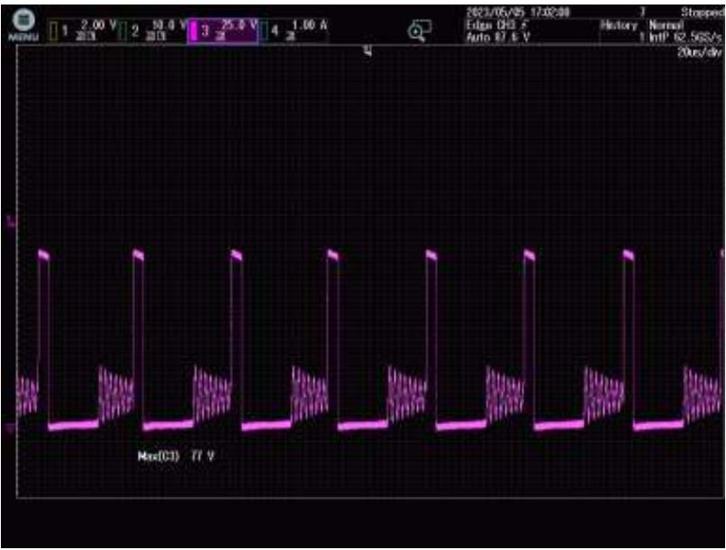

$2 8 2 \mathsf { V } _ { \mathsf { A C } }$

$\begin{array} { l } { { \mathsf { C H } } 2 \mathsf { V } _ { \mathsf { D D } \mathsf { I O D E } } } \\ { { \mathsf { V } } _ { \mathsf { M A X } } { \mathsf { : } } 7 7 { \mathsf { V } } } \end{array}$ CH2 VDDIODE

## Test Condition:

满载正常工作

<table><tr><td>Parameter</td><td>Symbols</td><td>5922</td><td>5924</td><td>5926</td><td>5928</td><td>59210</td><td>59212</td><td>59215</td><td>59220</td><td>Units</td></tr><tr><td>Maximum Repetitive Peak Reverse Voltage</td><td> $V_{\text{rms}}$ </td><td>20</td><td>40</td><td>60</td><td>80</td><td>100</td><td>120</td><td>150</td><td>200</td><td>V</td></tr><tr><td>Maximum RMS voltage</td><td> $V_{\text{rms}}$ </td><td>14</td><td>28</td><td>42</td><td>56</td><td>70</td><td>84</td><td>105</td><td>140</td><td>V</td></tr><tr><td>Maximum DC Blocking Voltage</td><td> $V_{DC}$ </td><td>20</td><td>40</td><td>60</td><td>80</td><td>100</td><td>120</td><td>150</td><td>200</td><td>V</td></tr><tr><td>Maximum Average Forward Rectified Current</td><td> $I_{\text{rms}}$ </td><td colspan="8">2.0</td><td>A</td></tr><tr><td>Peak Forward Surge Current, 8.3ms Single Half Sine-wave Superimposed on Rated Load (JEDEC method)</td><td> $I_{\text{rms}}$ </td><td colspan="8">50</td><td>A</td></tr><tr><td>Max Instantaneous Forward Voltage at 2 A</td><td> $V_F$ </td><td colspan="2">0.55</td><td colspan="2">0.70</td><td colspan="2">0.65</td><td colspan="2">0.95</td><td>V</td></tr><tr><td>Maximum DC Reverse Current  $T_r = 25°C$ at Rated DC Reverse Voltage  $T_s = 100°C$ </td><td> $I_n$ </td><td colspan="3">0.55</td><td colspan="5">0.33</td><td>mA</td></tr><tr><td>Typical Junction Capacitance $^{111}$ </td><td> $C_j$ </td><td colspan="2">220</td><td colspan="6">80</td><td>pF</td></tr><tr><td>Typical Thermal Resistance $^{111}$ </td><td> $R_{\text{rms}}$ </td><td colspan="8">80</td><td>°C/W</td></tr><tr><td>Operating Junction Temperature Range</td><td> $T_j$ </td><td colspan="8">-55 ~ +125</td><td>°C</td></tr><tr><td>Storage Temperature Range</td><td> $T_{\text{avg}}$ </td><td colspan="8">-55 ~ +150</td><td>°C</td></tr></table>

## 满载开机

$\scriptstyle \mathbf { D e r a t i n g } = 9 8 \lor / 2 0 0 \lor = 4 9 \%$

## 满载正常工作

Derating =77V / 200 V = 38.5%

## 15V输出肖特基反压波形

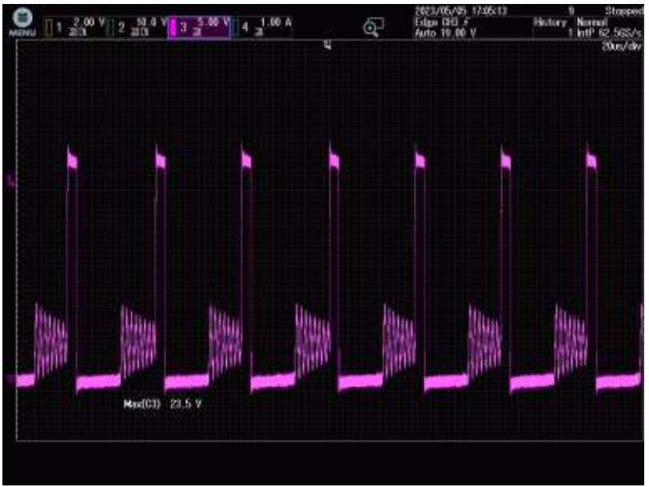

282 VAC

$\begin{array} { r l } { \mathbf { \Pi } } & { \mathsf { C H 2 V } _ { \mathsf { D I O D E } } } \\ & { \mathsf { V D S } _ { \mathsf { M A X } } : 2 3 . 5 \mathsf { V } } \end{array}$ CH2 VDIODE

## Test Condition:

➢ 满载启动

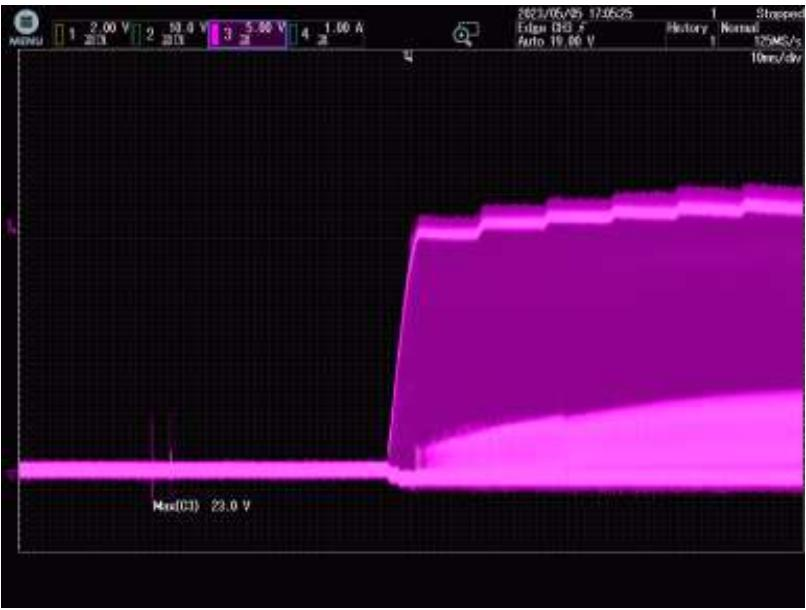

$2 8 2 \mathsf { V } _ { \mathsf { A C } }$

$\begin{array} { l } { { \mathsf { C H } } { 2 } { \mathsf { V } } _ { \mathsf { D D } \mathsf { I O D E } } } \\ { { \mathsf { V } } _ { \mathsf { M A X } } \colon { 2 } { 3 } { \mathsf { V } } } \end{array}$ CH2 VDDIODE

## Test Condition:

满载正常工作

<table><tr><td>Parameter</td><td>Symbols</td><td>5922</td><td>5924</td><td>5926</td><td>5928</td><td>59210</td><td>59212</td><td>59215</td><td>59220</td><td>Units</td></tr><tr><td>Maximum Repetitive Peak Reverse Voltage</td><td> $V_{\text{rms}}$ </td><td>20</td><td>40</td><td>60</td><td>80</td><td>100</td><td>120</td><td>150</td><td>200</td><td>V</td></tr><tr><td>Maximum RMS voltage</td><td> $V_{\text{rms}}$ </td><td>14</td><td>28</td><td>42</td><td>56</td><td>70</td><td>84</td><td>105</td><td>140</td><td>V</td></tr><tr><td>Maximum DC Blocking Voltage</td><td> $V_{DC}$ </td><td>20</td><td>40</td><td>60</td><td>80</td><td>100</td><td>120</td><td>150</td><td>200</td><td>V</td></tr><tr><td>Maximum Average Forward Rectified Current</td><td> $I_{\text{rms}}$ </td><td colspan="8">2.0</td><td>A</td></tr><tr><td>Peak Forward Surge Current, 8.3ms Single Half Sine-wave Superimposed on Rated Load (JEDEC method)</td><td> $I_{\text{rms}}$ </td><td colspan="8">50</td><td>A</td></tr><tr><td>Max Instantaneous Forward Voltage at 2 A</td><td> $V_F$ </td><td colspan="2">0.55</td><td colspan="2">0.70</td><td colspan="2">0.65</td><td colspan="2">0.95</td><td>V</td></tr><tr><td>Maximum DC Reverse Current  $T_r = 25°C$ at Rated DC Reverse Voltage  $T_s = 100°C$ </td><td> $I_n$ </td><td colspan="3">0.55</td><td colspan="5">0.33</td><td>mA</td></tr><tr><td>Typical Junction Capacitance $^{111}$ </td><td> $C_j$ </td><td colspan="2">220</td><td colspan="6">80</td><td>pF</td></tr><tr><td>Typical Thermal Resistance $^{111}$ </td><td> $R_{\text{rms}}$ </td><td colspan="8">80</td><td>°C/W</td></tr><tr><td>Operating Junction Temperature Range</td><td> $T_j$ </td><td colspan="8">-55 ~ +125</td><td>°C</td></tr><tr><td>Storage Temperature Range</td><td> $T_{\text{avg}}$ </td><td colspan="8">-55 ~ +150</td><td>°C</td></tr></table>

## 满载开机

$\mathsf { D e r a t i n g } = 2 3 . 5 \mathsf { V } / 1 0 0 \mathsf { V } = 2 3 . 5 \%$

## 满载正常工作

Derating =23V / 100 V = 23%

## 温升测试（5V300mA\_12V850mA\_15V150mA)

<table><tr><td rowspan="2">项目</td><td colspan="2">85VAC</td><td colspan="2">282VAC</td></tr><tr><td>温度(°C)</td><td>温升(°C)</td><td>温度(°C)</td><td>温升(°C)</td></tr><tr><td>环境温度</td><td colspan="2">28.76</td><td colspan="2">28.44</td></tr><tr><td>BPA85906D (U1)</td><td>119.5</td><td>90.74</td><td>72.9</td><td>44.46</td></tr><tr><td>变压器绕组(T1)</td><td>75.11</td><td>46.35</td><td>68.3</td><td>39.86</td></tr><tr><td>变压器磁芯(T1)</td><td>70.86</td><td>42.1</td><td>65.71</td><td>37.27</td></tr><tr><td>输出肖特基(D3)</td><td>83.76</td><td>55</td><td>79.06</td><td>50.62</td></tr><tr><td>整流桥(DB1)</td><td>60.37</td><td>31.61</td><td>42.44</td><td>14</td></tr><tr><td>输入电解电容(E2)</td><td>63.72</td><td>34.96</td><td>50.73</td><td>22.29</td></tr><tr><td>输出电解电容(E6)</td><td>48.82</td><td>20.06</td><td>46.46</td><td>18.02</td></tr></table>

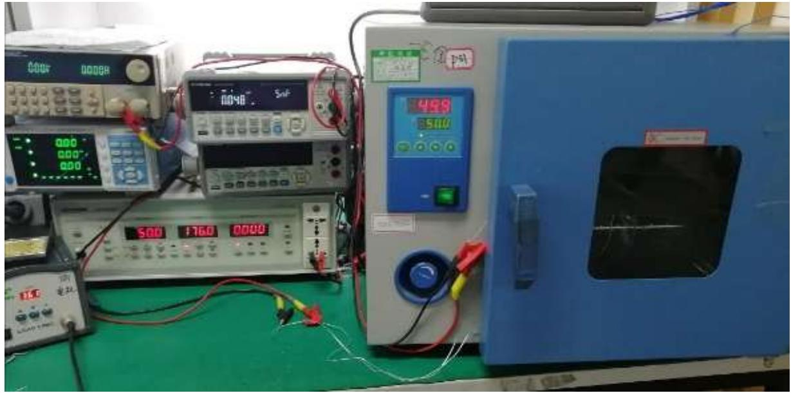

## 测试说明

➢ 在温箱中进行测试  
➢ 电路板放在一个封闭的盒子内  
➢ 热电偶连接到各个测量点  
➢ 等测量点温度达到稳定后记录数据

## 温升测试（5V240mA\_12V680mA\_15V120mA) 整体降20%

<table><tr><td rowspan="2">项目</td><td colspan="2">85VAC</td><td colspan="2">282VAC</td></tr><tr><td>温度(°C)</td><td>温升(°C)</td><td>温度(°C)</td><td>温升(°C)</td></tr><tr><td>环境温度</td><td colspan="2">28.04</td><td colspan="2">28.07</td></tr><tr><td>BPA85906D (U1)</td><td>91.31</td><td>63.27</td><td>64.45</td><td>36.38</td></tr><tr><td>变压器绕组(T1)</td><td>65.15</td><td>37.11</td><td>61.16</td><td>33.09</td></tr><tr><td>变压器磁芯(T1)</td><td>62.17</td><td>34.13</td><td>59.19</td><td>31.12</td></tr><tr><td>输出肖特基(D3)</td><td>72.85</td><td>44.81</td><td>70.18</td><td>42.11</td></tr><tr><td>整流桥(DB1)</td><td>53.29</td><td>25.25</td><td>39.63</td><td>11.56</td></tr><tr><td>输入电解电容(E2)</td><td>55.55</td><td>27.51</td><td>46.58</td><td>18.51</td></tr><tr><td>输出电解电容(E6)</td><td>44.69</td><td>16.65</td><td>43.37</td><td>15.3</td></tr></table>

## 测试说明

➢ 在温箱中进行测试  
➢ 电路板放在一个封闭的盒子内  
➢ 热电偶连接到各个测量点  
➢ 等测量点温度达到稳定后记录数据

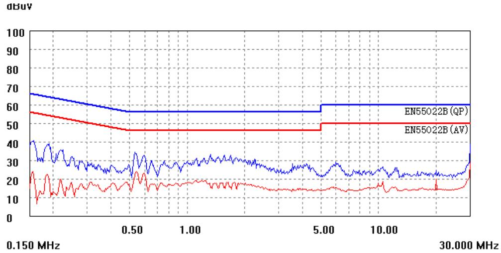

115VAC Line  
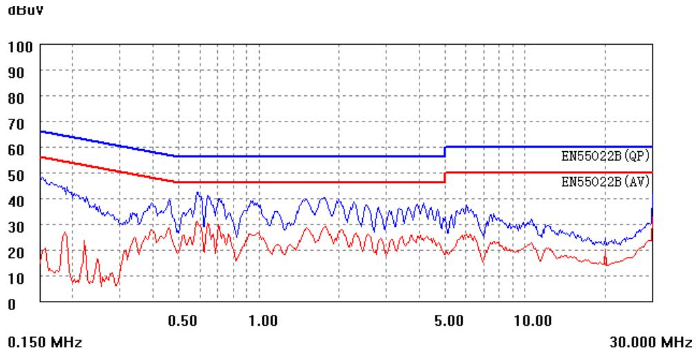

230VAC Line

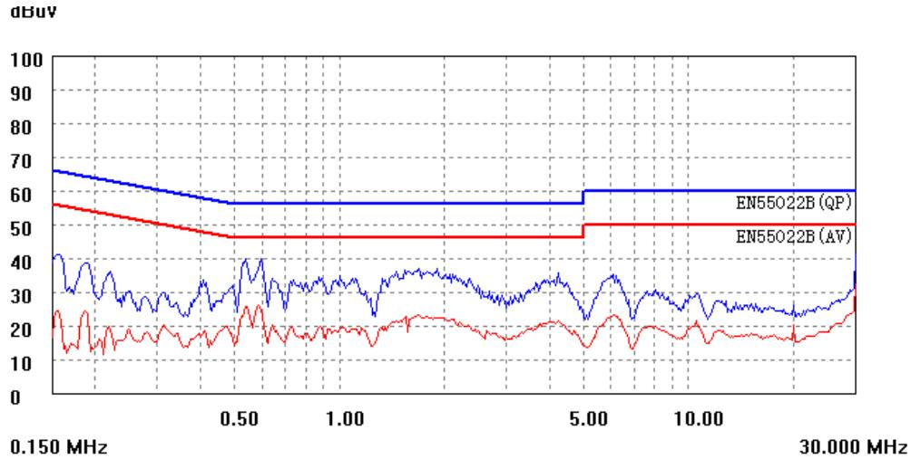

115VAC Neutral

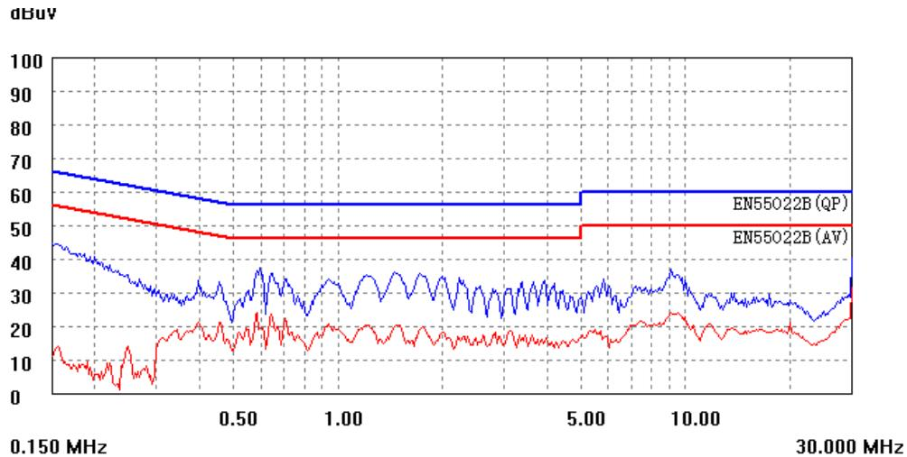

230VAC Neutral

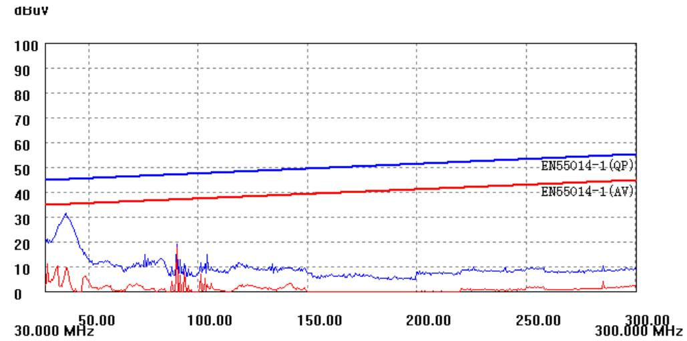

115VAC 空载  
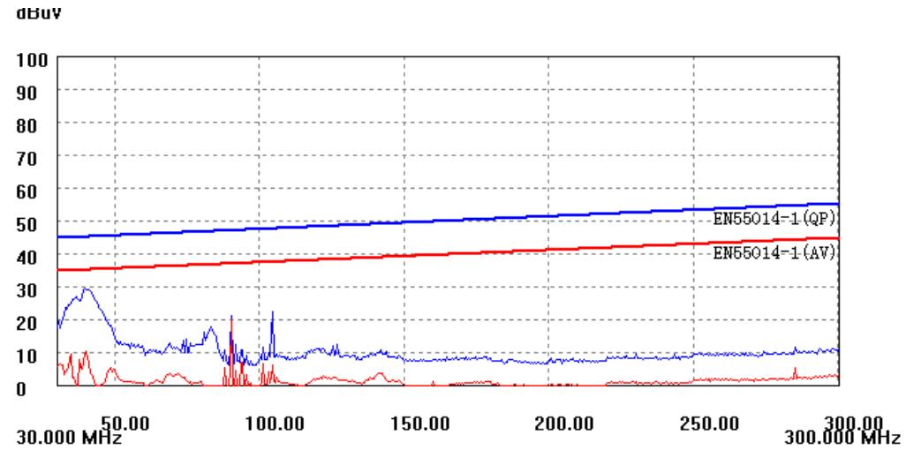

230VAC 空载

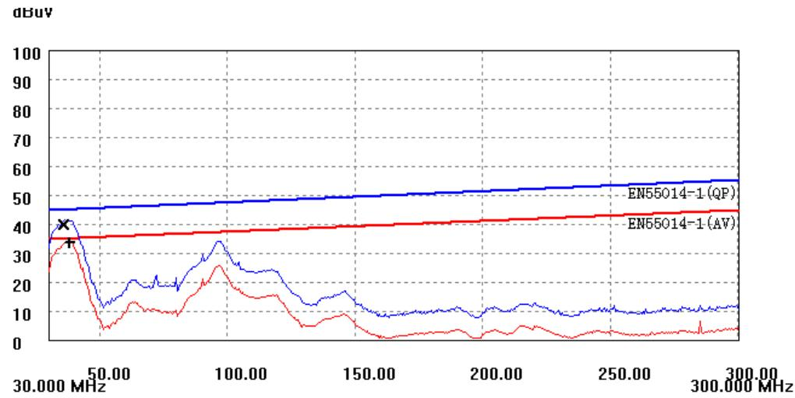

115VAC 满载

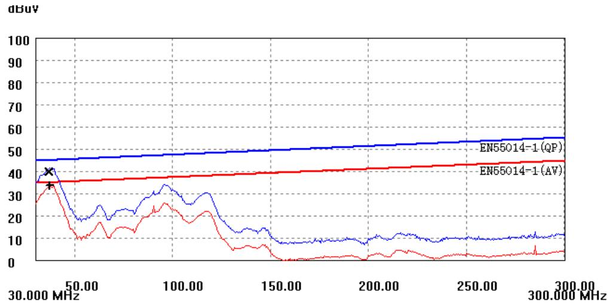

230VAC 满载

<table><tr><td>差模</td><td>电压</td><td>相位角</td><td>发生器阻抗</td><td>测试次数</td><td>测试结果</td></tr><tr><td>L to N</td><td>+2kV</td><td>0</td><td>2</td><td>10</td><td>Pass</td></tr><tr><td>L to N</td><td>-2kV</td><td>0</td><td>2</td><td>10</td><td>Pass</td></tr><tr><td>L to N</td><td>+2kV</td><td>90</td><td>2</td><td>10</td><td>Pass</td></tr><tr><td>L to N</td><td>-2kV</td><td>90</td><td>2</td><td>10</td><td>Pass</td></tr><tr><td>L to N</td><td>+2kV</td><td>180</td><td>2</td><td>10</td><td>Pass</td></tr><tr><td>L to N</td><td>-2kV</td><td>180</td><td>2</td><td>10</td><td>Pass</td></tr><tr><td>L to N</td><td>+2kV</td><td>270</td><td>2</td><td>10</td><td>Pass</td></tr><tr><td>L to N</td><td>-2kV</td><td>270</td><td>2</td><td>10</td><td>Pass</td></tr></table>

## 测试说明

➢ 按照GB/T17626.5和IEC61000-4-5的最新版本要求进行测试  
➢ 室温环境，230VAC输入，满载条件  
➢ 输入1.2/50us组合波浪涌电压  
➢ 每个测试点重复10次  
➢ 每次间隔时间1分钟  
➢ 试验时样机输出正常（符合A类标准）视为Pass

<table><tr><td>差模</td><td>电压</td><td>脉冲群持续时间</td><td>脉冲频率</td><td>测试时间</td><td>测试结果</td></tr><tr><td>L to N</td><td>+4kV</td><td>15ms</td><td>5kHz</td><td>120s</td><td>Pass</td></tr><tr><td>L to N</td><td>-4kV</td><td>15ms</td><td>5kHz</td><td>120s</td><td>Pass</td></tr><tr><td>L to N</td><td>+4kV</td><td>0.75ms</td><td>100kHz</td><td>120s</td><td>Pass</td></tr><tr><td>L to N</td><td>-4kV</td><td>0.75ms</td><td>100kHz</td><td>120s</td><td>Pass</td></tr><tr><td>L to N</td><td>+2kV</td><td>2ms</td><td>38kHz</td><td>120s</td><td>Pass</td></tr><tr><td>L to N</td><td>-2kV</td><td>2ms</td><td>38kHz</td><td>120s</td><td>Pass</td></tr><tr><td>L to N</td><td>+4kV</td><td>2ms</td><td>38kHz</td><td>120s</td><td>Pass</td></tr><tr><td>L to N</td><td>-4kV</td><td>2ms</td><td>38kHz</td><td>120s</td><td>Pass</td></tr></table>

## 测试说明

➢ 按照GB/T17626.4和IEC61000-4-4的最新版本要求进行测试  
➢ 室温环境，230VAC输入满载条件  
➢ 分别测试5kHz/100kHz/38kHz脉冲频率  
➢ 脉冲群周期为300ms  
➢ 每个测试条件测试时间120s  
➢ 试验时样机输出正常（符合A类标准）视为Pass

<table><tr><td>测试</td><td>电压(V)</td><td>放电类型</td><td>放电次数</td><td>测试结果</td></tr><tr><td>Vo</td><td>+15kV</td><td>空气放电</td><td>10</td><td>Pass</td></tr><tr><td>Vo</td><td>-15kV</td><td>空气放电</td><td>10</td><td>Pass</td></tr><tr><td>GND</td><td>+15kV</td><td>空气放电</td><td>10</td><td>Pass</td></tr><tr><td>GND</td><td>-15kV</td><td>空气放电</td><td>10</td><td>Pass</td></tr><tr><td>Vo</td><td>+20kV</td><td>空气放电</td><td>10</td><td>Pass</td></tr><tr><td>Vo</td><td>-20kV</td><td>空气放电</td><td>10</td><td>Pass</td></tr><tr><td>GND</td><td>+20kV</td><td>空气放电</td><td>10</td><td>Pass</td></tr><tr><td>GND</td><td>-20kV</td><td>空气放电</td><td>10</td><td>Pass</td></tr></table>

## 测试说明

➢ 按照GB/T17626.2和IEC61000-4-2的最新版本要求进行测试  
➢ 室温环境，230VAC输入满载条件  
➢ 每个测试点重复10次  
➢ 分别对输出正端和地进行空气放电  
➢ 试验时样机输出正常（符合A类标准）视为Pass

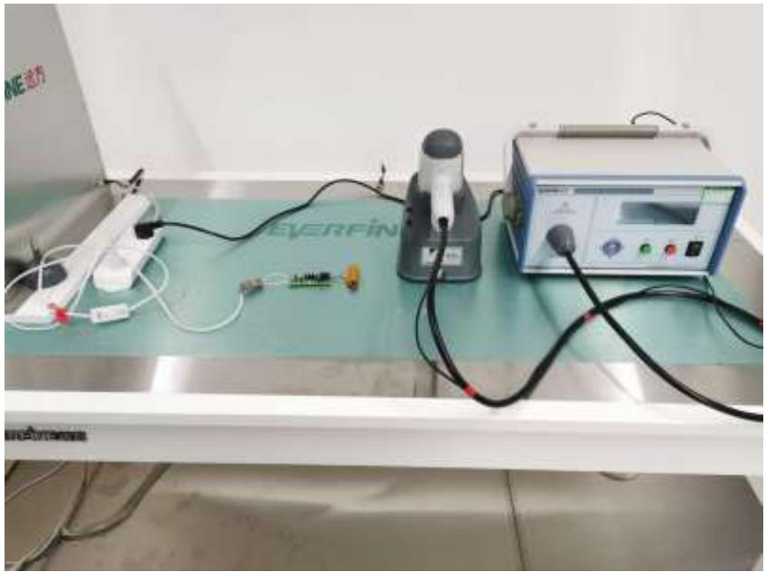

## THANK YOU FOR WATCHING
