## BPA85968D Buck参考设计

## (0.7mH. -15V/500mA)

时间：2024年8月

## 内容

BP85968D简介  
电源规格  
电路图  
PCB Layout  
BOM  
性能测试数据  
重要声明

## BP85968D简介

集成650V高压MOSFET  
集成输出电压采样  
集成高压启动和自供电电路  
无需外部补偿电路  
低待机功耗  
固定15V输出  
改善EMI性能的频率调制技术  
丰富的保护功能

应用领域：

小家电辅助电源  
电机驱动辅助电源  
➢ IOT/智能家居/智能照明

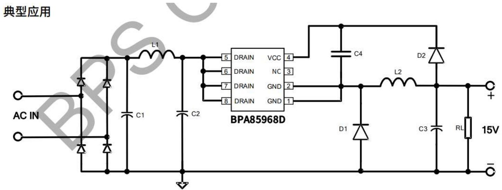

图1.BPA85968D典型BUCK应用电路

<table><tr><td>项目描述</td><td>符号</td><td>最小</td><td>典型</td><td>最大</td><td>单位</td><td>备注</td></tr><tr><td colspan="7">输入</td></tr><tr><td>电压</td><td> $V_{IN}$ </td><td>85</td><td></td><td>265</td><td> $V_{AC}$ </td><td></td></tr><tr><td>频率</td><td> $f_{LINE}$ </td><td>47</td><td>50/60</td><td>63</td><td>Hz</td><td></td></tr><tr><td colspan="7">输出</td></tr><tr><td>输出电压</td><td> $V_{OUT}$ </td><td>11.4</td><td>12</td><td>12.6</td><td>V</td><td>±5%</td></tr><tr><td>输出电流</td><td> $I_{OUT}$ </td><td>400</td><td>500</td><td></td><td>mA</td><td></td></tr><tr><td>输出电压纹波</td><td> $V_{RIPPLE}$ </td><td></td><td></td><td>240</td><td>mV</td><td>稳态,20MHz带宽</td></tr><tr><td colspan="7">效率</td></tr><tr><td>待机功耗</td><td> $P_{STDBY}$ </td><td></td><td></td><td>52</td><td>mW</td><td>Vin=230VAC</td></tr><tr><td>满载效率</td><td>n</td><td>76</td><td></td><td></td><td>%</td><td></td></tr><tr><td colspan="7">环境</td></tr><tr><td>传导EMI</td><td></td><td colspan="4">满足EN55022 Class B</td><td></td></tr><tr><td>Surge</td><td></td><td></td><td></td><td>2</td><td>kV</td><td></td></tr><tr><td>工作环境温度</td><td> $T_{AMP}$ </td><td></td><td>40</td><td></td><td>°C</td><td></td></tr></table>

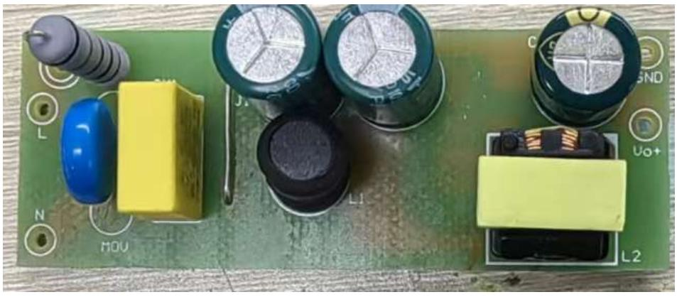

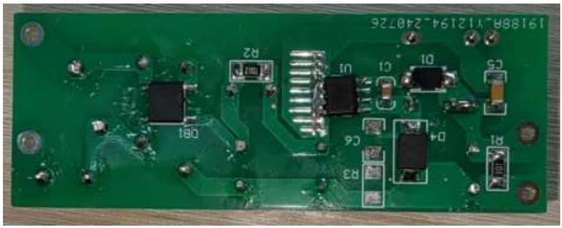

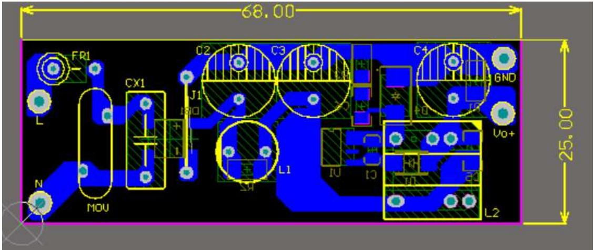

<table><tr><td>序号</td><td>原件标号</td><td>参数</td><td>描述</td><td>数量</td></tr><tr><td>1</td><td>FR1</td><td>2W, 10R绕线电阻</td><td>绕线电阻</td><td>1</td></tr><tr><td>2</td><td>CX1</td><td>100nF, X1</td><td>X电容</td><td>1</td></tr><tr><td>3</td><td>R2</td><td>2K7, ±5%</td><td>R1206</td><td>2</td></tr><tr><td>4</td><td>C2, C3</td><td>10uF/400V</td><td>电解电容</td><td>1</td></tr><tr><td>5</td><td>D1</td><td>ES1J, 1A/600V</td><td>贴片二极管</td><td>1</td></tr><tr><td>6</td><td>D4</td><td>ES3J, 3A/600V</td><td>贴片二极管</td><td>1</td></tr><tr><td>7</td><td>L1</td><td>1mH</td><td>工字电感 8X10</td><td>1</td></tr><tr><td>8</td><td>L2</td><td>0.7mH</td><td>EE13电感</td><td>1</td></tr><tr><td>9</td><td>U1</td><td>BP85968D</td><td>IC-SOP-8</td><td>1</td></tr><tr><td>10</td><td>C1</td><td>1uF/50V</td><td>贴片电容</td><td>1</td></tr><tr><td>11</td><td>C4</td><td>470uF/25V</td><td>电解电容</td><td>1</td></tr><tr><td>12</td><td>R1</td><td>10K, ±5%</td><td>贴片电阻</td><td>1</td></tr><tr><td>总计</td><td></td><td></td><td></td><td>13</td></tr></table>

待机功耗  
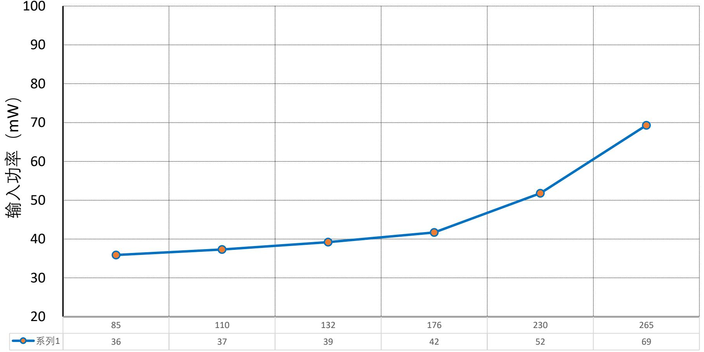

输入电压(VAC)

效率测试  
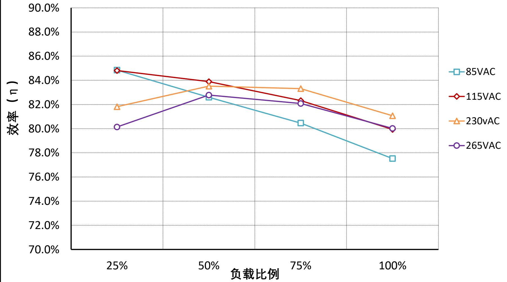

效率测试  
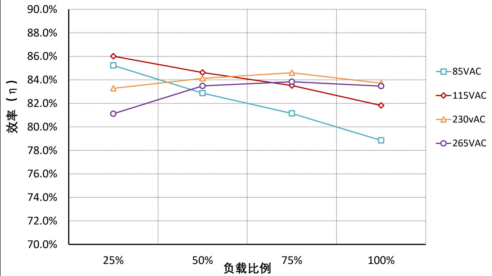

## 输出电压调整率(700uH)

<table><tr><td> $V_{IN}(VAC)$ Load(%)</td><td>85</td><td>115</td><td>132</td><td>176</td><td>230</td><td>265</td><td>平均值</td><td>线调整率</td></tr><tr><td>0</td><td>15.51</td><td>15.51</td><td>15.51</td><td>15.50</td><td>15.5</td><td>15.48</td><td>15.50</td><td>0.19%</td></tr><tr><td>20%</td><td>15.17</td><td>15.16</td><td>15.17</td><td>15.15</td><td>15.17</td><td>15.16</td><td>15.16</td><td>0.16%</td></tr><tr><td>40%</td><td>15.05</td><td>15.03</td><td>15.04</td><td>15.03</td><td>15.05</td><td>15.03</td><td>15.04</td><td>0.16%</td></tr><tr><td>60%</td><td>14.98</td><td>14.96</td><td>14.97</td><td>14.96</td><td>14.97</td><td>14.96</td><td>14.97</td><td>0.13%</td></tr><tr><td>80%</td><td>14.94</td><td>14.92</td><td>14.93</td><td>14.92</td><td>14.93</td><td>14.92</td><td>14.93</td><td>0.13%</td></tr><tr><td>100%</td><td>14.9</td><td>14.89</td><td>14.9</td><td>14.89</td><td>14.9</td><td>14.9</td><td>14.90</td><td>0.07%</td></tr><tr><td>平均值</td><td>15.09</td><td>15.08</td><td>15.09</td><td>15.07</td><td>15.09</td><td>15.07</td><td rowspan="2" colspan="2"></td></tr><tr><td>负载调整率</td><td>4.04%</td><td>4.11%</td><td>4.02%</td><td>4.03%</td><td>3.95%</td><td>3.85%</td></tr></table>

◼ 计算方法：调整率=100%\*(最大值-最小值)/平均值  
测试条件：假负载10K

## 输出电压调整率(380uH)

<table><tr><td> $V_{IN}(VAC)$ Load(%)</td><td>85</td><td>115</td><td>132</td><td>176</td><td>230</td><td>265</td><td>平均值</td><td>线调整率</td></tr><tr><td>0</td><td>15.45</td><td>15.43</td><td>15.42</td><td>15.41</td><td>15.38</td><td>15.35</td><td>15.41</td><td>0.65%</td></tr><tr><td>20%</td><td>15.02</td><td>15.03</td><td>15.01</td><td>15.03</td><td>15</td><td>15.03</td><td>15.02</td><td>0.20%</td></tr><tr><td>40%</td><td>14.88</td><td>14.9</td><td>14.87</td><td>14.9</td><td>14.87</td><td>14.90</td><td>14.89</td><td>0.19%</td></tr><tr><td>60%</td><td>14.81</td><td>14.83</td><td>14.8</td><td>14.83</td><td>14.8</td><td>14.82</td><td>14.82</td><td>0.22%</td></tr><tr><td>80%</td><td>14.77</td><td>14.79</td><td>14.77</td><td>14.79</td><td>14.77</td><td>14.77</td><td>14.78</td><td>0.17%</td></tr><tr><td>100%</td><td>14.75</td><td>14.75</td><td>14.74</td><td>14.74</td><td>14.74</td><td>14.74</td><td>14.74</td><td>0.10%</td></tr><tr><td>平均值</td><td>14.95</td><td>14.96</td><td>14.94</td><td>14.95</td><td>14.92</td><td>14.93</td><td rowspan="2" colspan="2"></td></tr><tr><td>负载调整率</td><td>4.68%</td><td>4.55%</td><td>4.56%</td><td>4.46%</td><td>4.29%</td><td>4.11%</td></tr></table>

◼ 计算方法：调整率=100%\*(最大值-最小值)/平均值  
测试条件：假负载10K

<table><tr><td> $I_{OUT}(A)$  $V_{IN}(VAC)$ </td><td>85</td><td>264</td></tr><tr><td>0.5</td><td>14.9</td><td>14.89</td></tr><tr><td>0.6</td><td>14.85</td><td>14.85</td></tr><tr><td>0.7</td><td>14.81</td><td>14.82</td></tr><tr><td>0.8</td><td>14.75</td><td>14.76</td></tr><tr><td>0.9</td><td>OLP</td><td>OLP</td></tr></table>

700uH

<table><tr><td> $I_{OUT}(A)$  $V_{IN}(VAC)$ </td><td>85</td><td>264</td></tr><tr><td>0.5</td><td>14.76</td><td>14.72</td></tr><tr><td>0.6</td><td>14.72</td><td>14.69</td></tr><tr><td>0.7</td><td>14.67</td><td>14.66</td></tr><tr><td>0.8</td><td>OLP</td><td>13.49</td></tr><tr><td>0.9</td><td>OLP</td><td>OLP</td></tr></table>

380uH

## 输出电压纹波

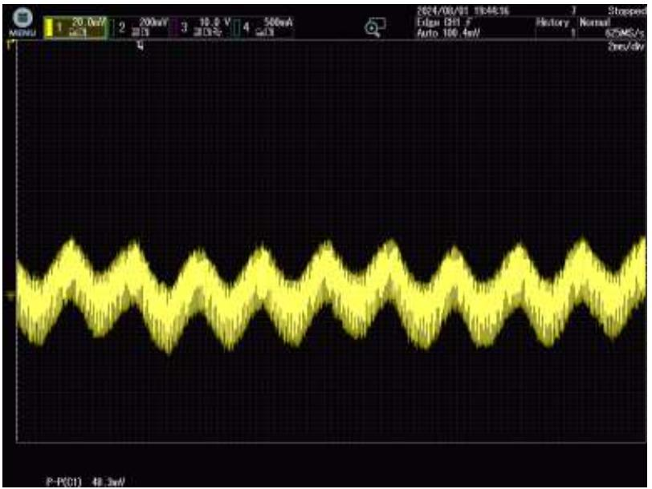

85 VAC

CH1 $\mathsf { V } _ { \mathsf { O U T } } \mathsf { R i p p l e }$ $V _ { P K - P K } = 4 8 . 3 m V$

## Test Condition:

➢ Full Load

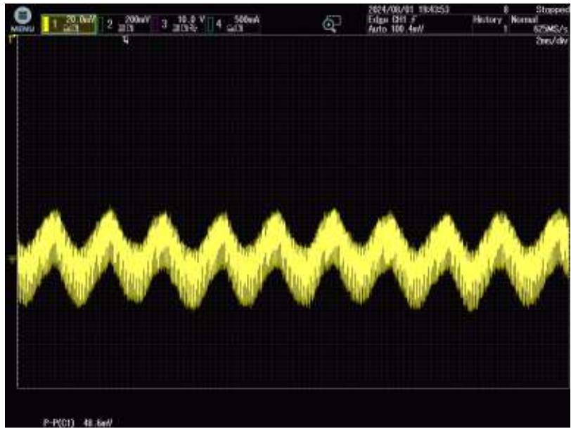

115 VAC

CH1 $\mathsf { V } _ { \mathsf { O U T } }$ Ripple $V _ { P K - P K } = 4 8 . 6 m V$

## Test Condition:

➢ Full Load

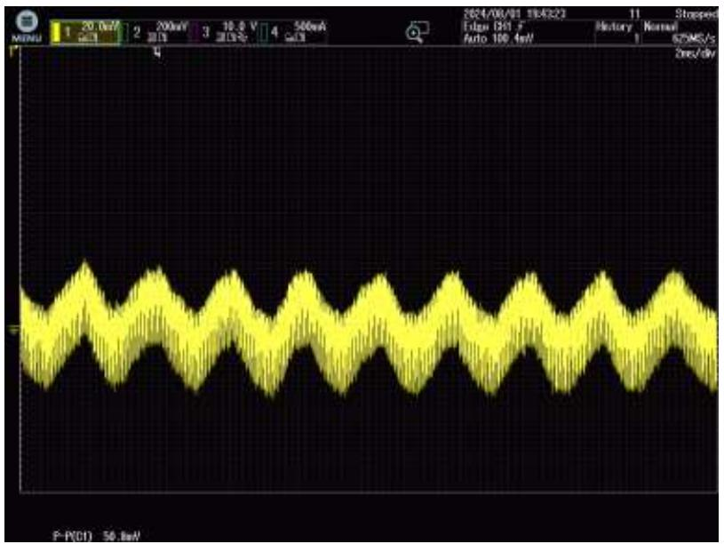

230 VAC

CH1 $\mathsf { V } _ { \mathsf { O U T } } \mathsf { R i p p l e }$ $V _ { P K - P K } = 5 0 . 8 m V$

## Test Condition:

➢ Full Load

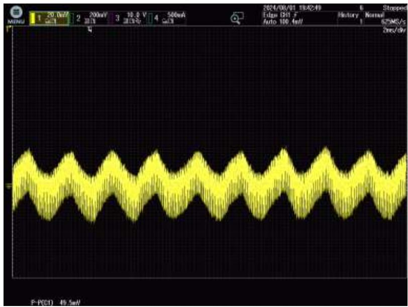

265 VAC

CH1 $\mathsf { V } _ { \mathsf { O U T } }$ Ripple $V _ { P K - P K } = 4 9 . 5 m V$

## Test Condition:

➢ Full Load

## 动态负载(50%-100%)

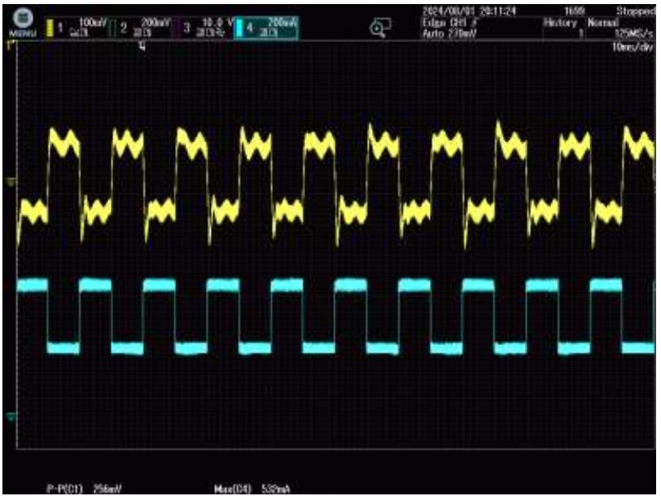

85 VAC

$\begin{array} { r l } { \mathbf { \Pi } } & { { } \mathsf { C H 1 } \mathbf { V } _ { \mathsf { O U T } } } \\ { \mathbf { \Pi } } & { { } \mathsf { V } _ { \mathsf { P K - P K } } = 2 5 6 \mathsf { m v } } \end{array}$ CH1 VOUT

## Test Condition:

➢ 0.25 A-0.5 A-0.25 A  
➢ Slew Rate: 0.5 A/μS  
➢ Frequency: 100 Hz

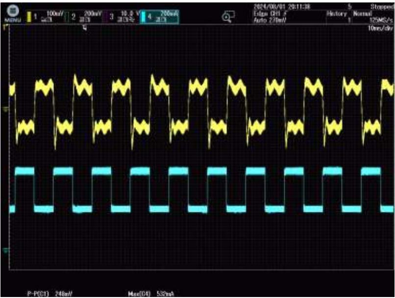

115 VAC

CH1 VOUT VPK-PK=286 mV

## Test Condition:

➢ 0.25 A-0.5 A-0.25 A  
➢ Slew Rate: 0.5 A/μS  
➢ Frequency: 100 Hz

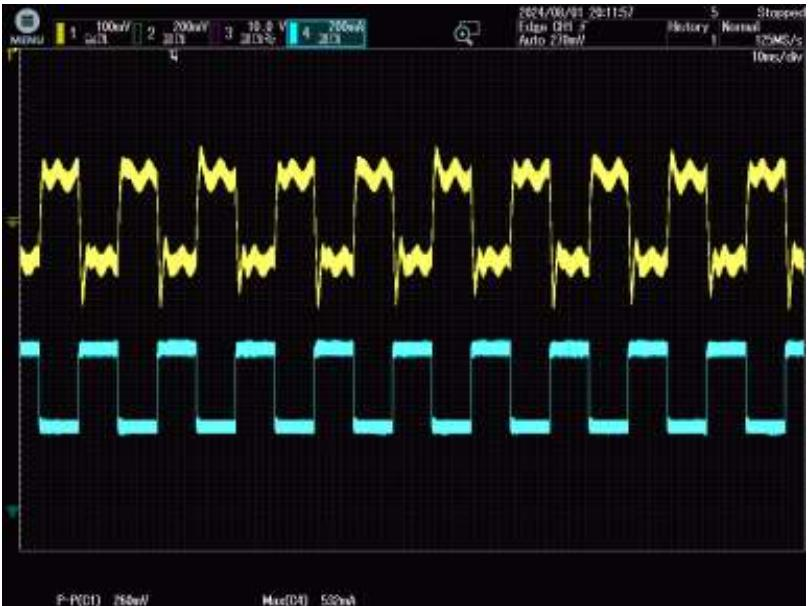

230 VAC

CH1 VOUT VPK-PK=260 mV

## Test Condition:

➢ 0.25 A-0.5 A-0.25 A  
➢ Slew Rate: 0.5 A/μS  
➢ Frequency: 100 Hz

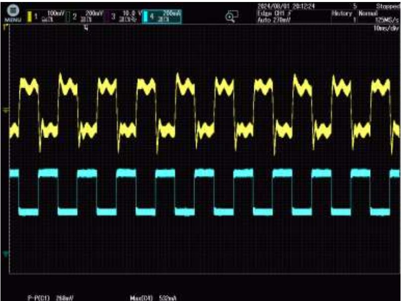

265 VAC

CH1 VOUT VPK-PK=267mV

## Test Condition:

➢ 0.25 A-0.5 A-0.25 A  
➢ Slew Rate: 0.5 A/μS  
➢ Frequency: 100 Hz

## 动态负载(10%-90%)1uF VCC

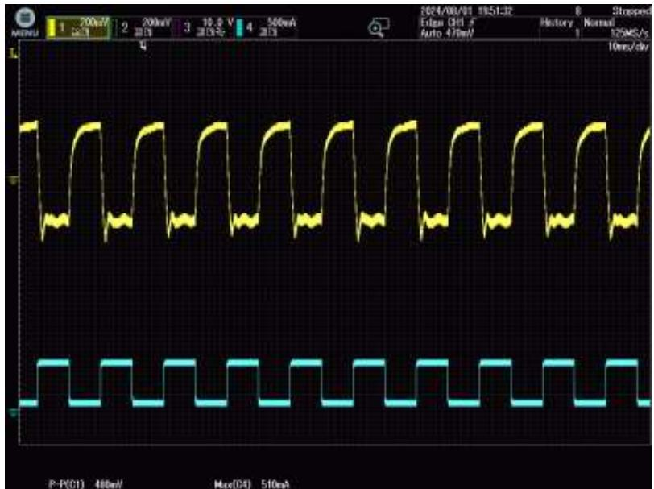

85 VAC

$\begin{array} { r l } & { \mathsf { C H 1 V } _ { \mathsf { O U T } } } \\ & { \mathsf { V } _ { \mathsf { P K - P K } } \mathsf { = } 4 8 0 \mathsf { m v } } \end{array}$ CH1 VOUT

## Test Condition:

➢ $0 . 0 5 \mathsf { A } \mathsf { - 0 } . 4 5 \mathsf { A } \mathsf { - 0 } . 0 5 \mathsf { A }$  
➢ Slew Rate: 0.5 A/μS  
➢ Frequency: 100 Hz

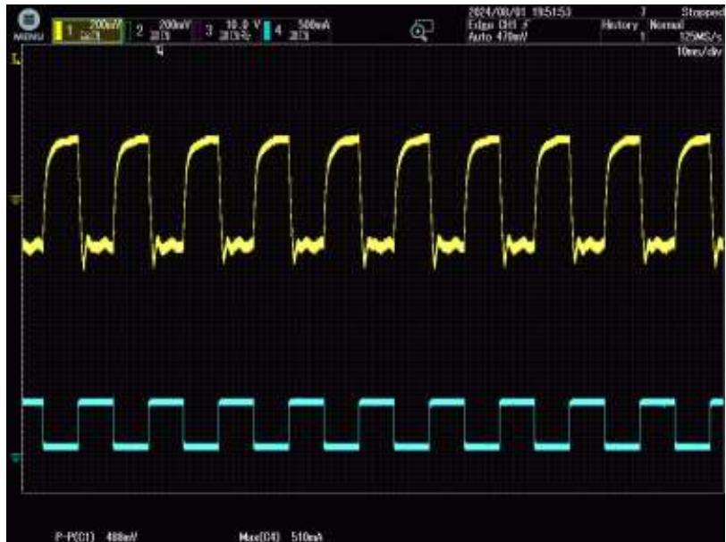

115 VAC

CH1 VOUT $\mathsf { V } _ { \mathsf { O U T } }$ $\mathsf { V } _ { \mathsf { P K - P K } } { = } 4 8 8 \mathsf { m V }$

## Test Condition:

➢ $0 . 0 5 \mathsf { A } \mathsf { - 0 } . 4 5 \mathsf { A } \mathsf { - 0 } . 0 5 \mathsf { A }$  
➢ Slew Rate: 0.5 A/μS  
➢ Frequency: 100 Hz

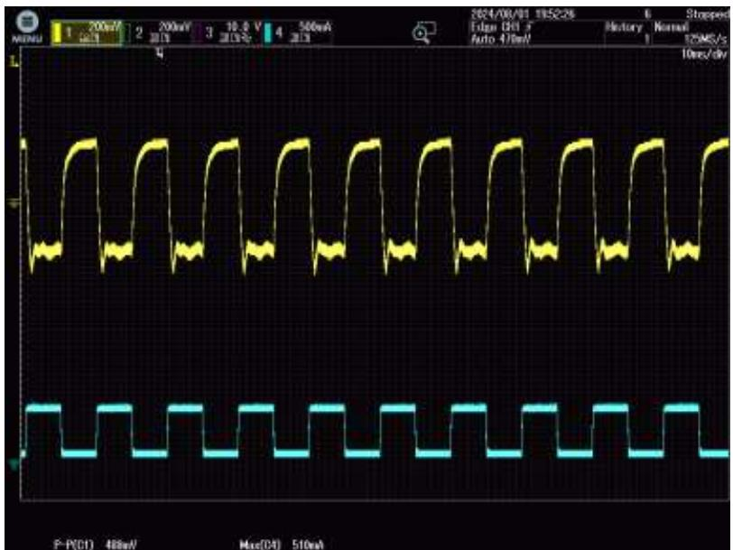

230 VAC

CH1 VOUT $\mathsf { V } _ { \mathsf { O U T } }$ VPK-PK=488mV

## Test Condition:

➢ 0.05A-0.45A-0.05A  
➢ Slew Rate: 0.5 A/μS  
➢ Frequency: 100 Hz

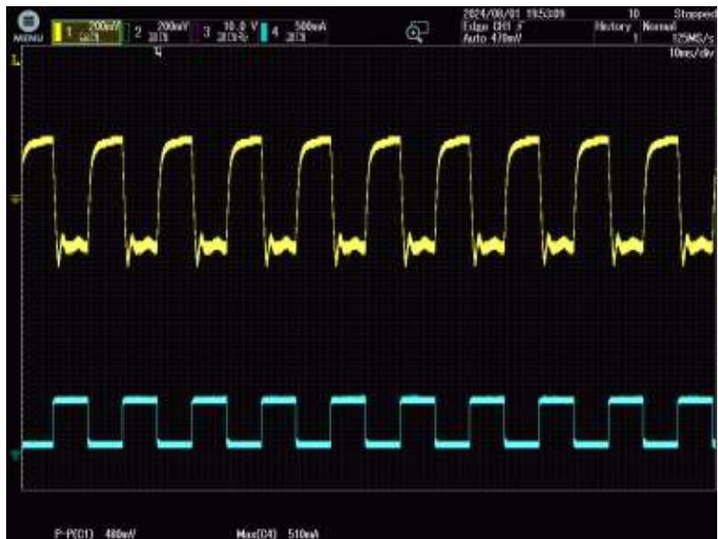

265 VAC

$\begin{array} { r l } & { \mathsf { C H 1 V } _ { \mathsf { O U T } } } \\ & { \mathsf { V } _ { \mathsf { P K - P K } } \mathsf { = } 4 8 0 \mathsf { m v } } \end{array}$ CH1 VOUT

## Test Condition:

➢ $0 . 0 5 \mathsf { A } \mathsf { - 0 } . 4 5 \mathsf { A } \mathsf { - 0 } . 0 5 \mathsf { A }$  
➢ Slew Rate: 0.5 A/μS  
➢ Frequency: 100 Hz

## 动态负载(10%-90%)0.1uF VCC

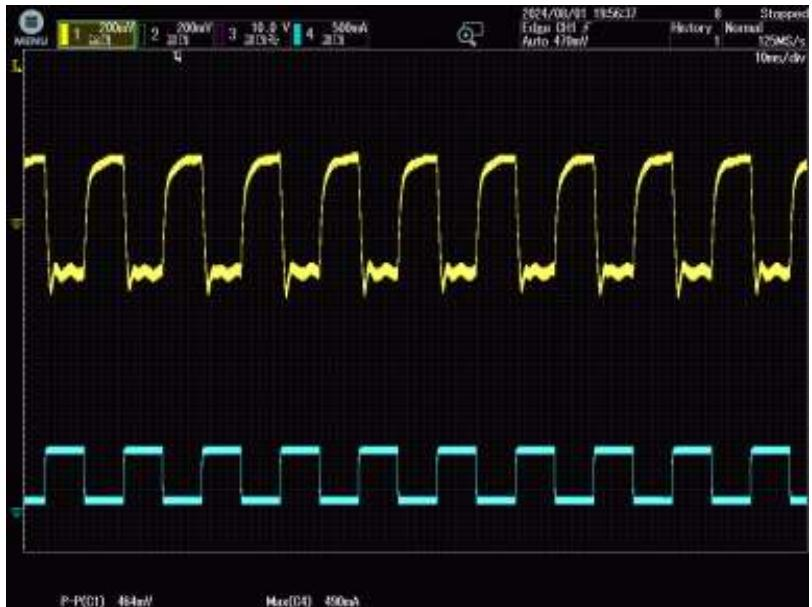

85 VAC

CH1 VOUT VPK-PK=464mV

## Test Condition:

➢ $0 . 0 5 \mathsf { A } \mathsf { - 0 } . 4 5 \mathsf { A } \mathsf { - 0 } . 0 5 \mathsf { A }$  
➢ Slew Rate: 0.5 A/μS  
➢ Frequency: 100 Hz

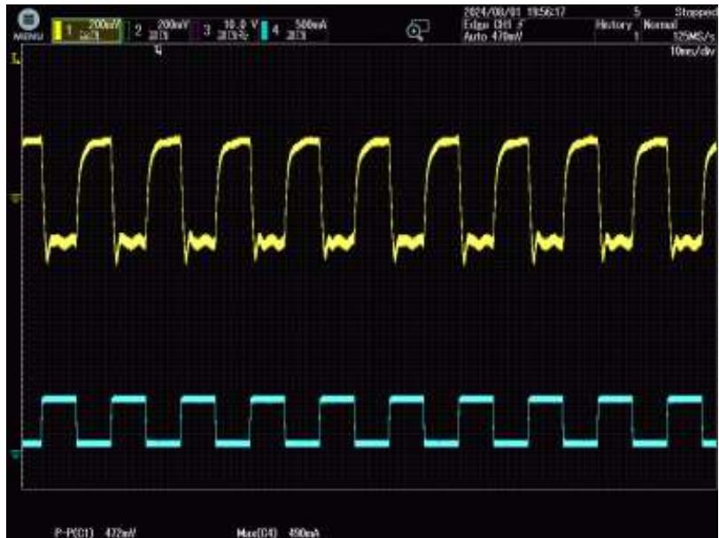

115 VAC

CH1 VOUT VPK-PK=472mV

## Test Condition:

➢ $0 . 0 5 \mathsf { A } \mathsf { - 0 } . 4 5 \mathsf { A } \mathsf { - 0 } . 0 5 \mathsf { A }$  
➢ Slew Rate: 0.5 A/μS  
➢ Frequency: 100 Hz

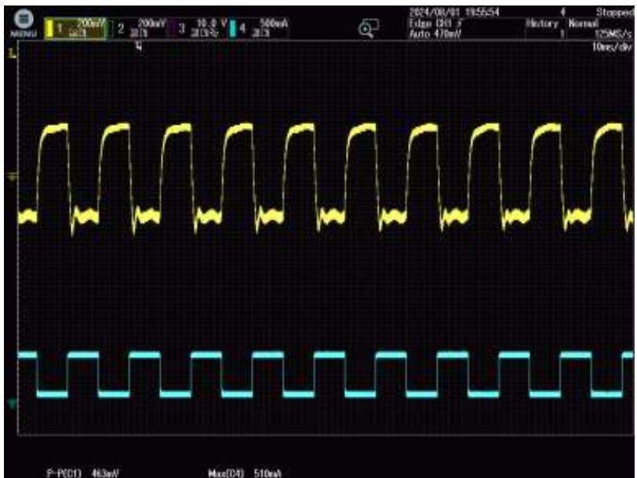

230 VAC

CH1 VOUT VPK-PK=463mV

## Test Condition:

➢ $0 . 0 5 \mathsf { A } \mathsf { - 0 } . 4 5 \mathsf { A } \mathsf { - 0 } . 0 5 \mathsf { A }$  
➢ Slew Rate: 0.5 A/μS  
➢ Frequency: 100 Hz

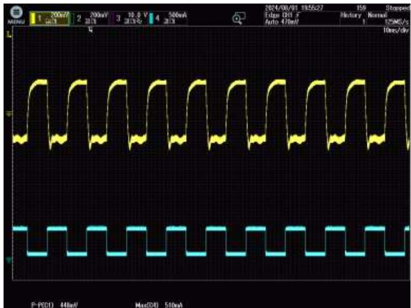

265 VAC

CH1 VOUT VPK-PK=448mV

## Test Condition:

➢ $0 . 0 5 \mathsf { A } \mathsf { - 0 } . 4 5 \mathsf { A } \mathsf { - 0 } . 0 5 \mathsf { A }$  
➢ Slew Rate: 0.5 A/μS  
➢ Frequency: 100 Hz

## 输出电压开机波形

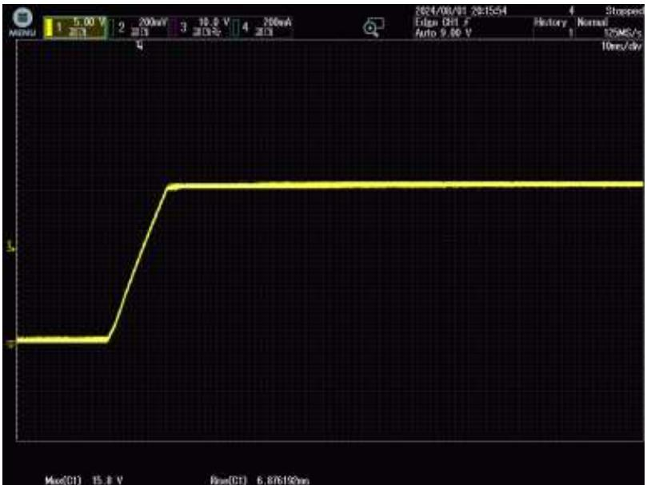

85 VAC

CH1 VOUT TRISE: 6.87mS

## Test Condition:

➢ No Load

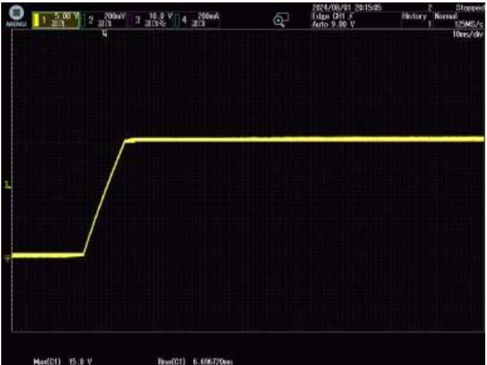

265 VAC

CH1 VOUT TRISE: 6.7mS

## Test Condition:

➢ No Load

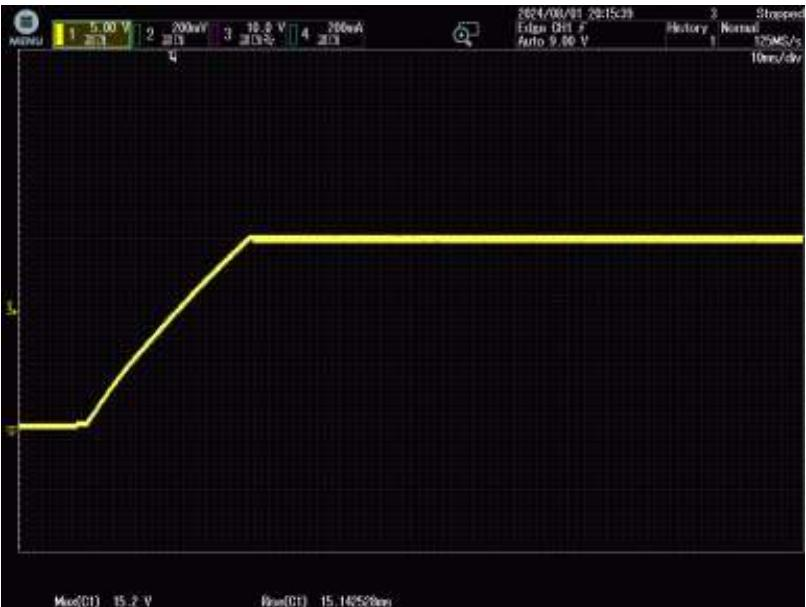

85 VAC

CH1 VOUT TRISE: 15mS

## Test Condition:

➢ Full Load

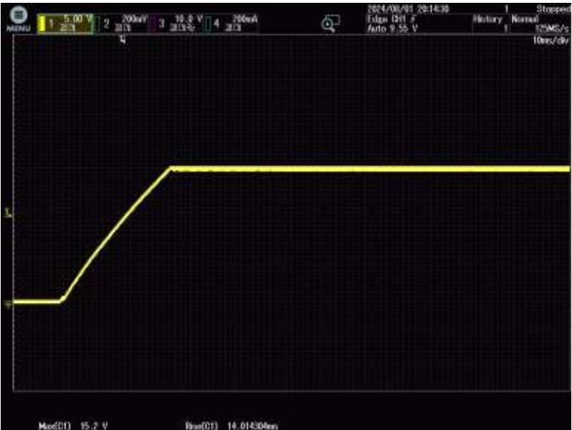

265 VAC

CH1 VOUT TRISE:14mS

## Test Condition:

➢ Full Load

## 漏极开机电流波形(700uH)

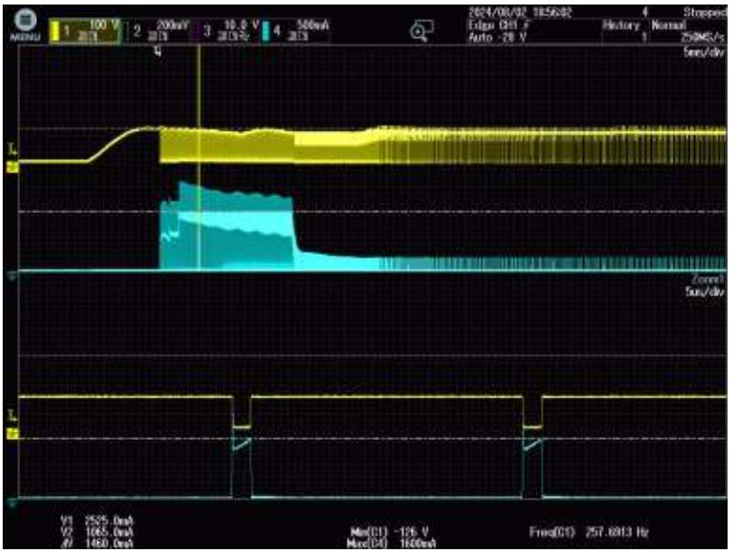

${ \otimes 5 } \mathsf { V } _ { \mathsf { A C } }$

${ \mathsf { C H 1 } } \mathsf { V _ { D S } }$  
$C H 4 \mid _ { \mathsf { D R A I N } }$ CH4 IDRAIN $\mathsf { I } _ { \mathsf { D S \_ M A X } } \mathsf { = } \mathsf { 1 } . 6 0 \mathsf { A }$ $\mathsf { V } _ { \mathsf { D S \_ M A X } } \mathbf { = } \mathbf { 1 } 2 6 \mathsf { V }$

## Test Condition:

➢ 空载启动

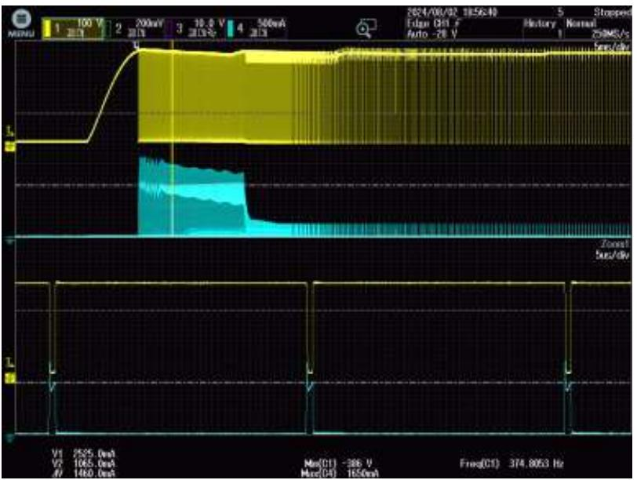

265 $\mathsf { v } _ { \mathsf { A C } }$

${ \mathsf { C H 1 } } \mathsf { V _ { D S } }$  
CH4 IDRAIN IDS\_MAX=1.650A $\mathsf { I } _ { \mathsf { D S \_ M A X } } \mathsf { = } \mathsf { 1 } . 6 5 0 \mathsf { A }$ $V _ { \mathsf { D S \_ M A X } } \equiv 3 8 6 V$

## Test Condition:

➢ 空载启动

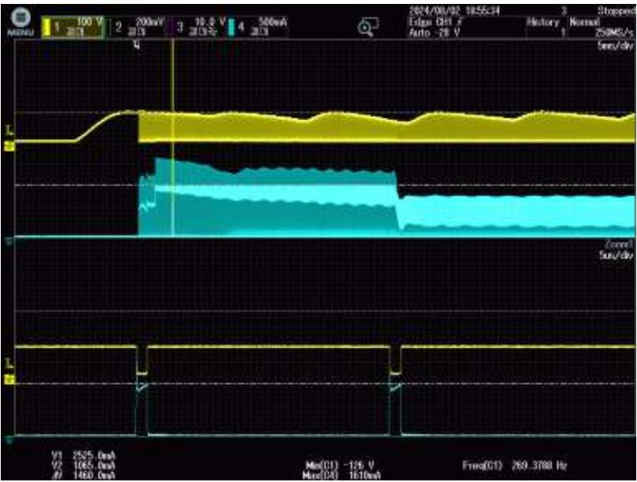

${ \tt S 5 V } _ { \sf A C }$

$\begin{array} { r l } { \mathbb { \mathbf { \Pi } } } & { { } \mathsf { C H 1 } \mathsf { V } _ { \mathsf { D S } } } \end{array}$  
$C H 4 \mid _ { \mathsf { D R A I N } }$ CH4 IDRAIN $\mathsf { I } _ { \mathsf { D S \_ M A X } } \mathsf { = } \mathsf { 1 } . 6 \mathsf { 1 } \mathsf { A }$ $V _ { \mathsf { D S \_ M A X } } \mathbf { = } \mathbf { 1 } 2 6 \mathsf { V }$

## Test Condition:

➢ 满载启动

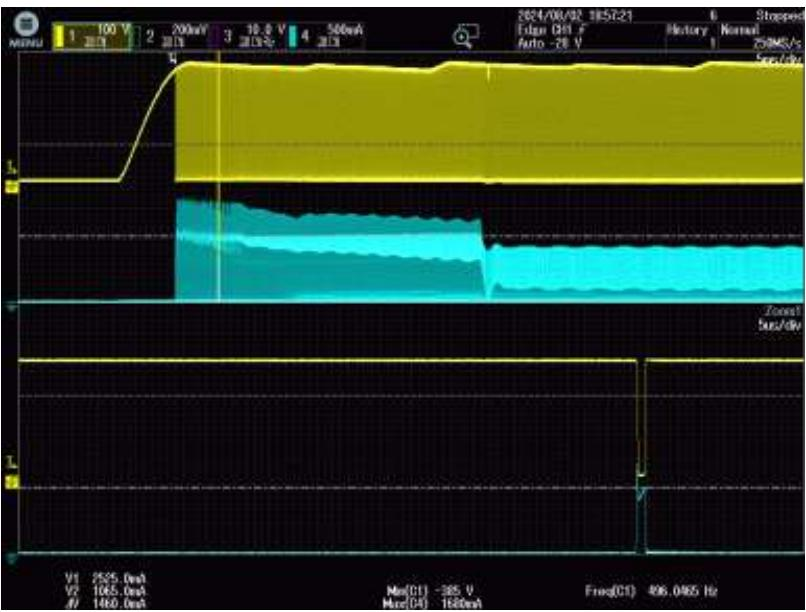

$2 6 5 \ : \mathsf { V } _ { \mathsf { A C } }$

${ \mathsf { C H 1 } } \mathsf { V } _ { \mathsf { D S } }$  
$\mathsf { C H 4 } \mathsf { I } _ { \mathsf { D R A I N } }$ CH4 IDRAIN IDS\_MAX=1.680A $\mathsf { I } _ { \mathsf { D S \_ M A X } } { = } 1 . 6 8 0 \mathsf { A }$ $V _ { \mathsf { D S \_ M A X } } \equiv 3 8 5 \mathsf { V }$

## Test Condition:

➢ 满载启动

## 漏极开机电流波形 （380uH）

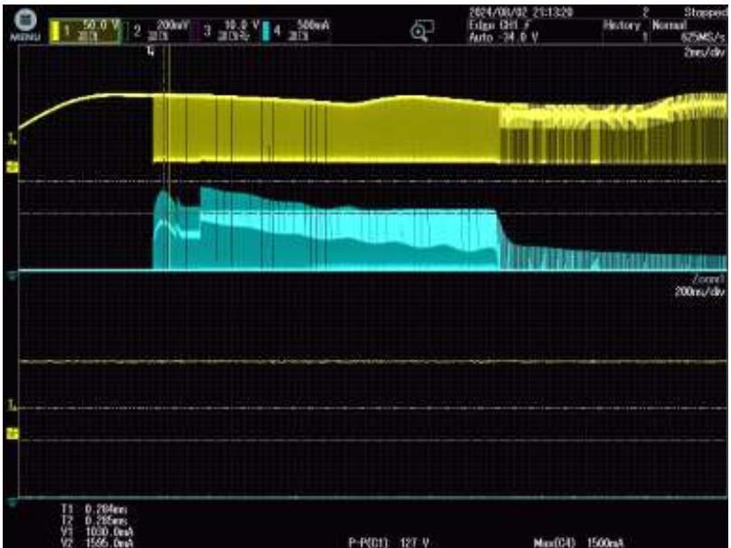

${ \otimes 5 } \mathsf { V } _ { \mathsf { A C } }$

${ \mathsf { C H 1 } } \mathsf { V _ { D S } }$  
CH4 IDRAIN $\mathsf { I } _ { \mathsf { D R A I N } }$ IDS\_MAX=1.500A $\mathsf { I } _ { \mathsf { D S \_ M A X } } { = } 1 . 5 0 0 \mathsf { A }$ $V _ { \mathsf { D S \_ M A X } } \equiv \mathbb { 1 } 2 7 \mathsf { V }$

## Test Condition:

➢ 空载启动

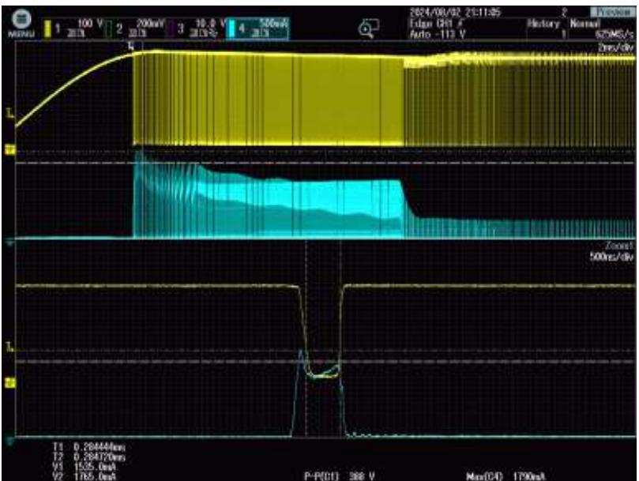

265 $\mathsf { v } _ { \mathsf { A C } }$

${ \mathsf { C H 1 } } \mathsf { V _ { D S } }$  
CH4 IDRAIN IDS\_MAX=1.650A $\mathsf { I } _ { \mathsf { D S \_ M A X } } \mathsf { = } \mathsf { 1 } . 6 5 0 \mathsf { A }$ $V _ { \mathsf { D S \_ M A X } } \equiv 3 8 6 V$

## Test Condition:

➢ 空载启动

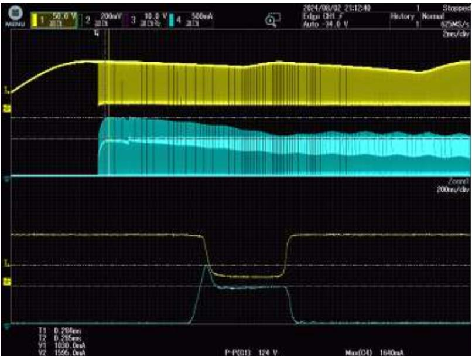

${ \tt S 5 V } _ { \sf A C }$

${ \mathsf { C H 1 } } \mathsf { V } _ { \mathsf { D S } }$  
$C H 4 \mid _ { \mathsf { D R A I N } }$ CH4 IDRAIN $\mathsf { I } _ { \mathsf { D S \_ M A X } } \mathsf { = } \mathsf { 1 } . 6 4 \mathsf { A }$ $V _ { \mathsf { D S \_ M A X } } \equiv \pmb { 1 } 2 4 \mathsf { V }$

## Test Condition:

➢ 满载启动

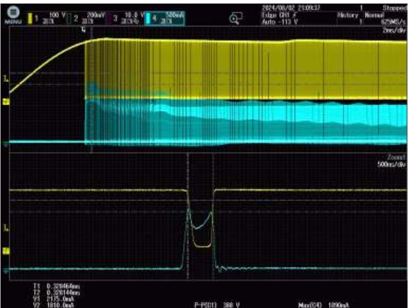

$2 6 5 \ : \mathsf { V } _ { \mathsf { A C } }$

$\begin{array} { r l } { \mathbb { \mathbf { \Pi } } } & { { } \mathsf { C H 1 } \mathsf { V } _ { \mathsf { D S } } } \end{array}$  
CH4 IDRAIN $\mathsf { I } _ { \mathsf { D S \_ M A X } } \mathsf { = } \mathsf { 1 } . 8 9 \mathsf { A }$ $V _ { \mathsf { D S \_ M A X } } \equiv 3 8 8 \mathsf { V }$

## Test Condition:

➢ 满载启动

## MOSFET稳态波形(38uH)

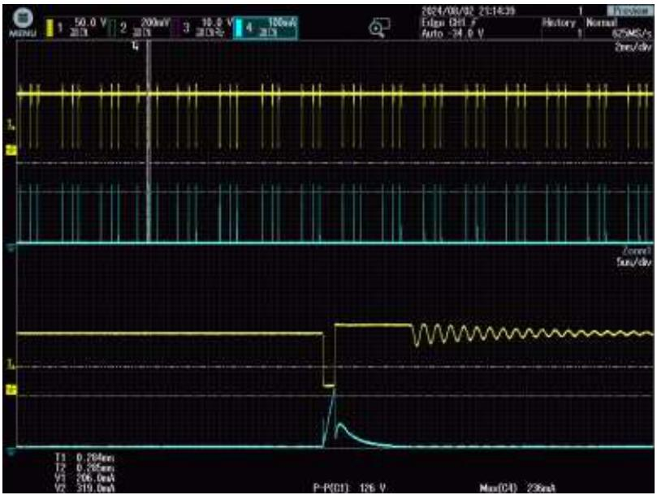

85 VAC  

Test Condition:  
➢ No Load

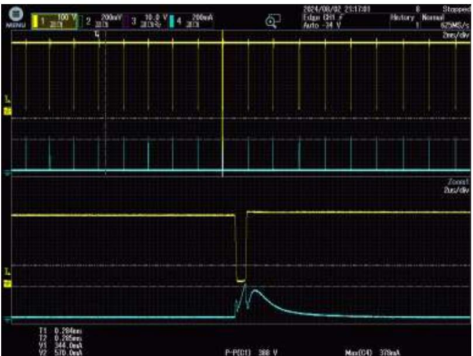

265 VAC  
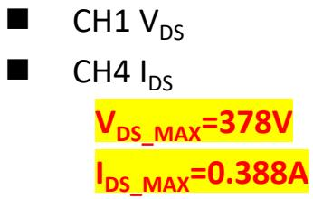

Test Condition:  
➢ No Load

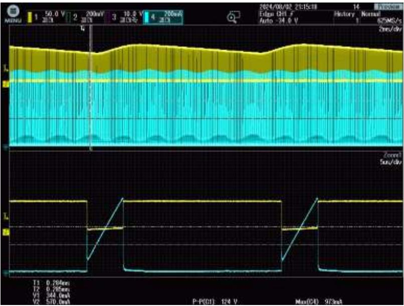

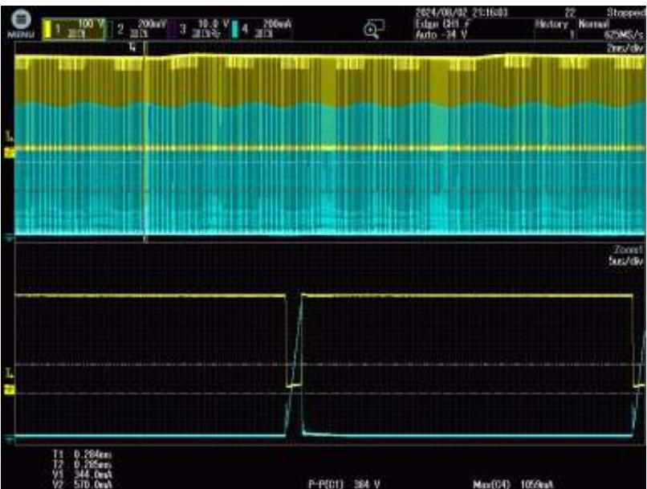

85 VAC  

Test Condition:  
➢ Full Load

265 VAC  
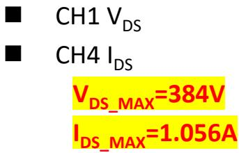

Test Condition:  
➢ Full Load

## 短路保护 （MOSFET波形）

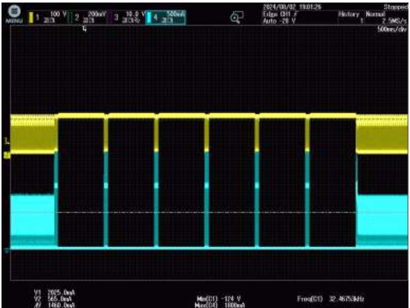

${ \otimes 5 } \mathsf { V } _ { \mathsf { A C } }$

${ \mathsf { C H 1 } } \mathsf { V } _ { \mathsf { D S } } .$  
$C H 4 1 _ { \mathsf { D } } { \mathsf { : } }$

$$
\begin{array}{l} I _ {D S \_ M A X} = 1. 8 0 0 A \\ V _ {D S \_ M A X} = 1 2 4 V \end{array}
$$

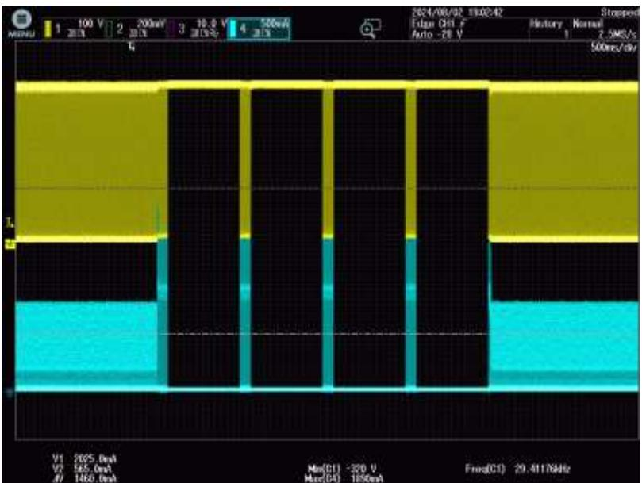

230 VAC

${ \mathsf { C H 1 } } \mathsf { V } _ { \mathsf { D S } } .$  
$C H 4 1 _ { \mathsf { D } } { \mathsf { : } }$

$$
\begin{array}{l} I _ {D S \_ M A X} = 1. 8 9 0 A \\ V _ {D S \_ M A X} = 3 2 0 V \end{array}
$$

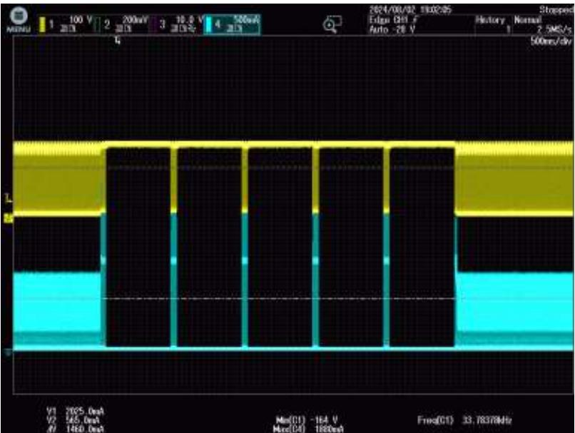

$1 1 5 \mathsf { V } _ { \mathsf { A C } }$

${ \mathsf { C H 1 } } \mathsf { V } _ { \mathsf { D S } } .$  
$C H 4 1 _ { \mathsf { D } } { \mathsf { : } }$

$$
\begin{array}{l} I _ {D S \_ M A X} = 1. 8 8 A \\ V _ {D S \_ M A X} = 1 6 4 V \end{array}
$$

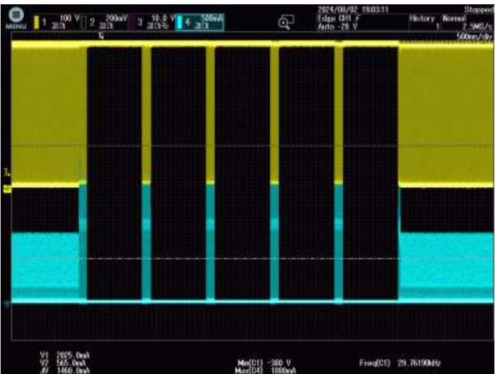

$2 6 5 \ : \mathsf { V } _ { \mathsf { A C } }$

${ \mathsf { C H 1 } } \mathsf { V } _ { \mathsf { D S } } .$  
${ \mathsf { C H } } 4 \mathsf { I } _ { \mathsf { D } } { \mathrm { : } }$

$$
\begin{array}{l} I _ {D S \_ M A X} = 1. 8 8 0 A \\ V _ {D S \_ M A X} = 3 8 0 V \end{array}
$$

## 短路保护（MOSFET波形 380uH）

${ \otimes 5 } \mathsf { V } _ { \mathsf { A C } }$

${ \mathsf { C H 1 } } \mathsf { V } _ { \mathsf { D S } } .$  
$C H 4 1 _ { \mathsf { D } } { \mathsf { : } }$

$$
\begin{array}{l} I _ {D S \_ M A X} = 1. 8 0 0 A \\ V _ {D S \_ M A X} = 1 2 4 V \end{array}
$$

$1 1 5 \mathsf { V } _ { \mathsf { A C } }$

${ \mathsf { C H 1 } } \mathsf { V } _ { \mathsf { D S } } .$  
$C H 4 1 _ { \mathsf { D } } { \mathsf { : } }$

$$
\begin{array}{l} I _ {D S \_ M A X} = 1. 8 8 A \\ V _ {D S \_ M A X} = 1 6 4 V \end{array}
$$

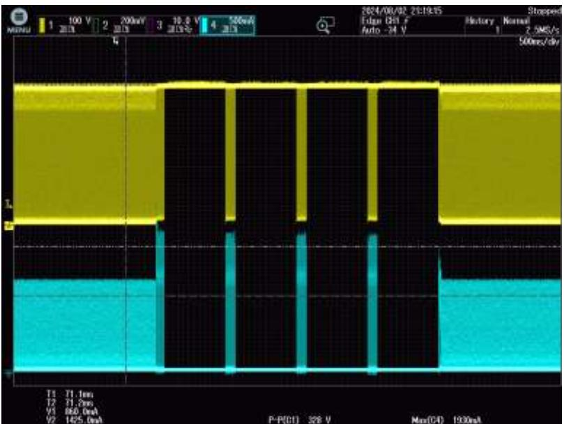

230 VAC

${ \mathsf { C H 1 } } \mathsf { V } _ { \mathsf { D S } } .$  
$C H 4 1 _ { \mathsf { D } } { \mathsf { : } }$

$$
\begin{array}{l} I _ {D S \_ M A X} = 1. 9 3 0 A \\ V _ {D S \_ M A X} = 3 2 8 V \end{array}
$$

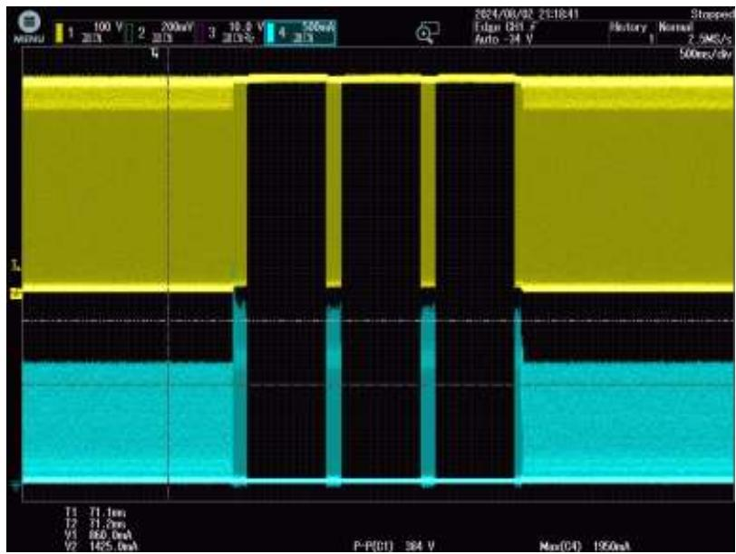

$2 6 5 \ : \mathsf { V } _ { \mathsf { A C } }$

${ \mathsf { C H 1 } } \mathsf { V } _ { \mathsf { D S } } .$  
${ \mathsf { C H } } 4 \mathsf { I } _ { \mathsf { D } } { \mathrm { : } }$

$$
\begin{array}{l} I _ {D S \_ M A X} = 1. 9 5 0 A \\ V _ {D S \_ M A X} = 3 8 4 V \end{array}
$$

<table><tr><td rowspan="2">项目</td><td colspan="2">85VAC</td><td colspan="2">230VAC</td><td colspan="2">265VAC</td></tr><tr><td>温度(°C)</td><td>温升(°C)</td><td>温度(°C)</td><td>温升(°C)</td><td>温度(°C)</td><td>温升(°C)</td></tr><tr><td>环境温度</td><td colspan="2">30.64</td><td colspan="2">30.64</td><td colspan="2">30.64</td></tr><tr><td>BPA85968D (U1)</td><td>89</td><td>58.36</td><td>89.45</td><td>58.81</td><td>93.17</td><td>62.53</td></tr><tr><td>输出二极管(ES3J SMB)</td><td>77.08</td><td>46.44</td><td>80.45</td><td>49.81</td><td>81.52</td><td>50.88</td></tr><tr><td>变压器线圈(T1)</td><td>68.42</td><td>37.78</td><td>75.2</td><td>44.56</td><td>76.98</td><td>46.34</td></tr><tr><td>变压器磁芯(T1)</td><td>63.25</td><td>32.61</td><td>69.19</td><td>38.55</td><td>70.76</td><td>40.12</td></tr><tr><td>BPA85968D (U1)</td><td>82.18</td><td>51.54</td><td>68.82</td><td>38.18</td><td>69.01</td><td>38.37</td></tr><tr><td>输出二极管(ES3J SMB)</td><td>73.87</td><td>43.23</td><td>73.23</td><td>42.59</td><td>73.31</td><td>42.67</td></tr><tr><td>变压器线圈(T1)</td><td>58.45</td><td>27.81</td><td>64.23</td><td>33.59</td><td>65.44</td><td>34.8</td></tr><tr><td>变压器磁芯(T1)</td><td>56.78</td><td>26.14</td><td>62.49</td><td>31.85</td><td>63.71</td><td>33.07</td></tr></table>

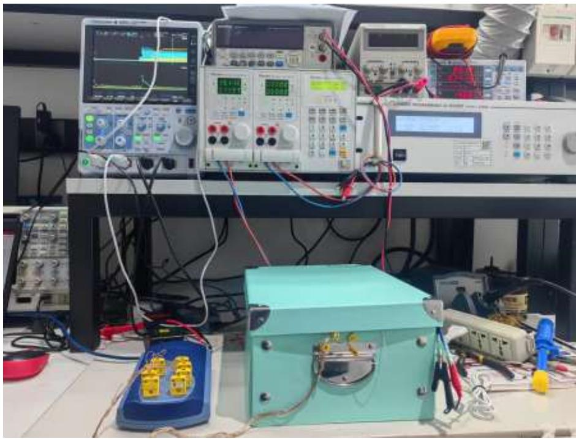

## 测试说明

➢ 在适配器壳中进行测试  
➢ 电路板放在一个封闭的盒子内  
➢ 热电偶连接到各个测量点  
等测量点温度达到稳定后记录数据  
➢ 测试了两台样机，一台样机为700uH电感，一台为380uH电感

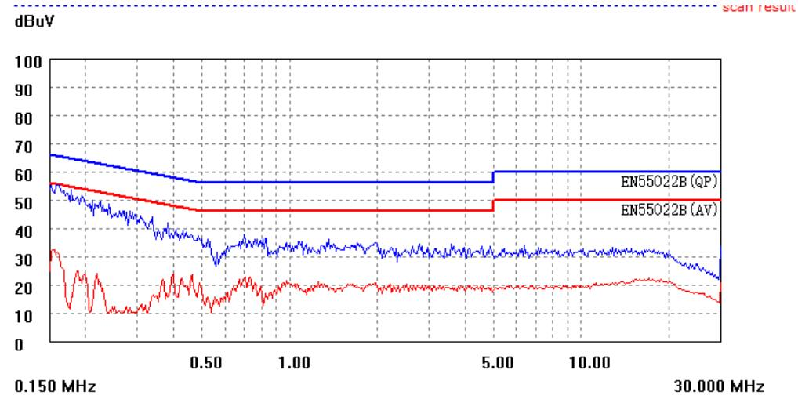

115VAC Line  
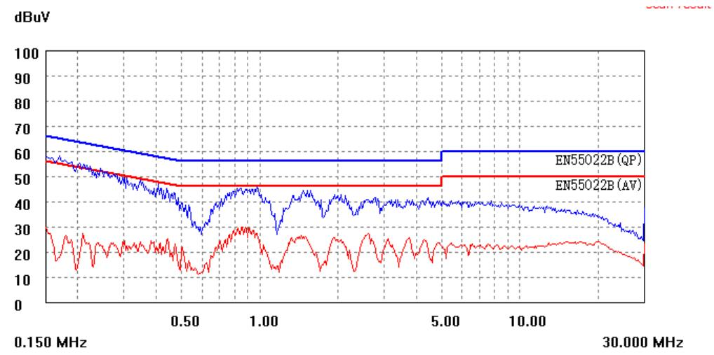

230VAC Line

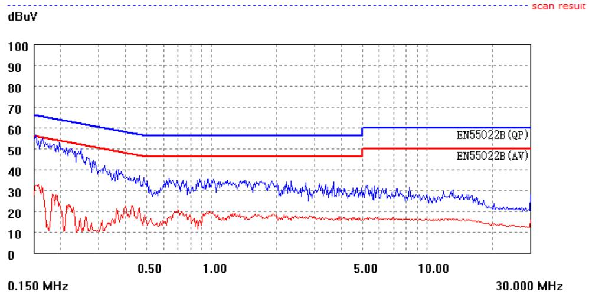

115VAC Neutral

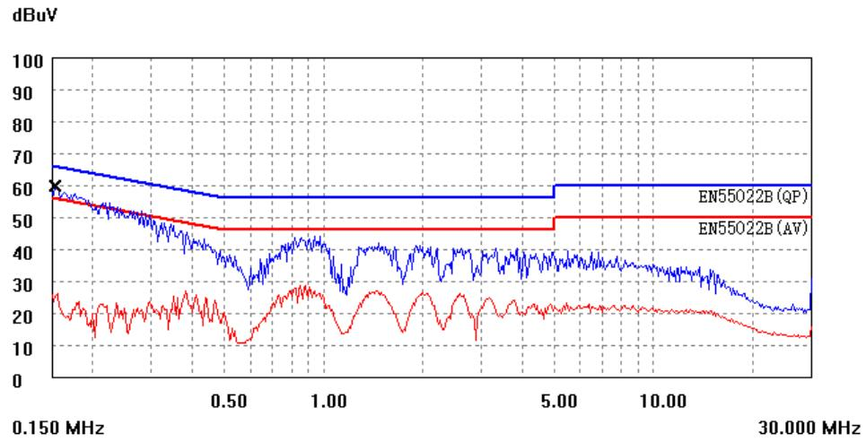

230VAC Neutral

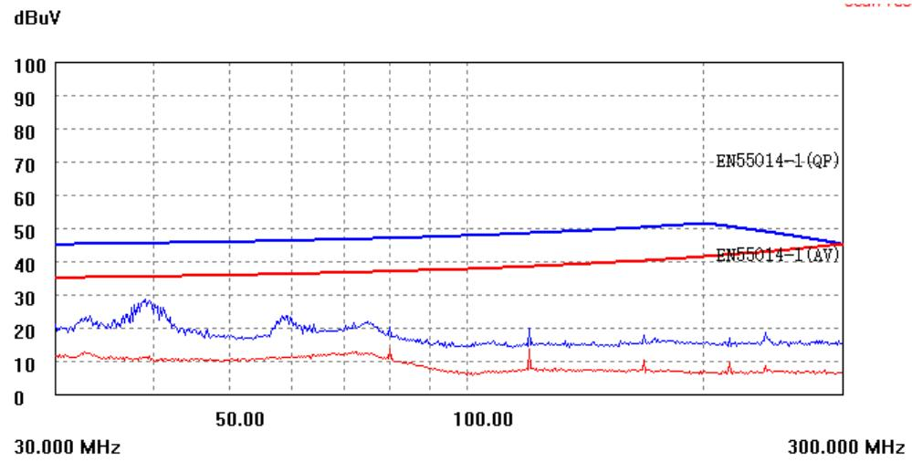

115VAC 空载  
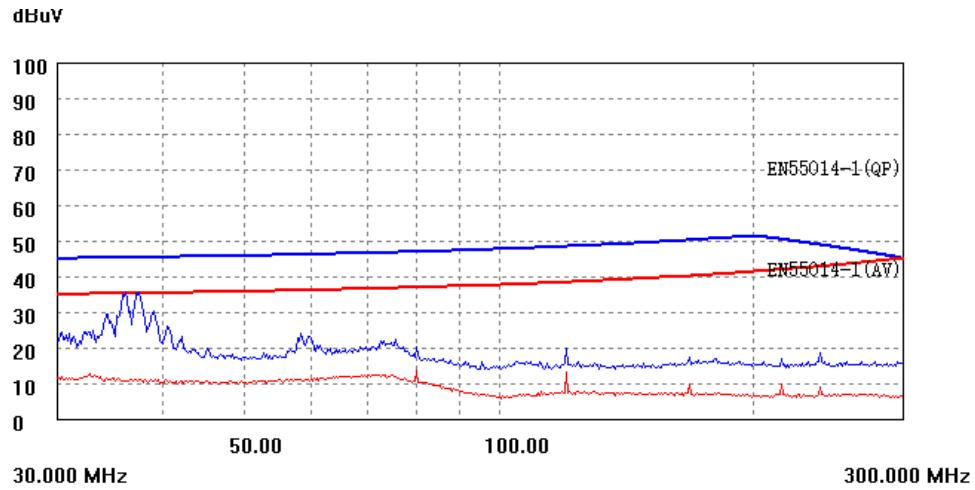

230VAC 空载

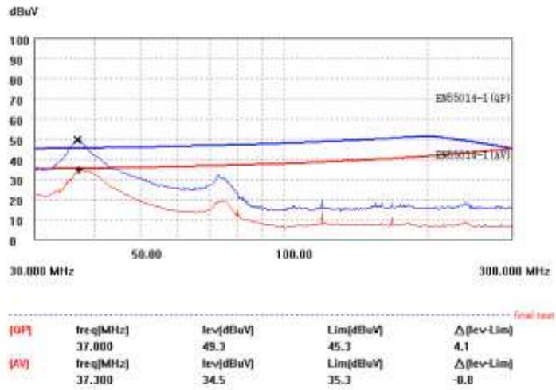

115VAC 满载  
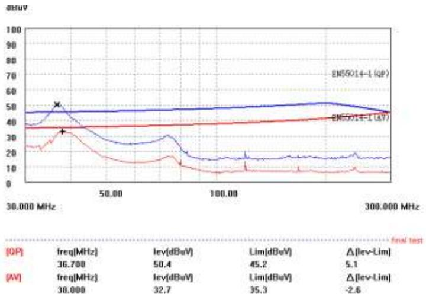

230VAC 满载

<table><tr><td>差模</td><td>电压</td><td>相位角</td><td>发生器阻抗</td><td>测试次数</td><td>测试结果</td></tr><tr><td>L to N</td><td>+2kV</td><td>0</td><td>2</td><td>10</td><td>Pass</td></tr><tr><td>L to N</td><td>-2kV</td><td>0</td><td>2</td><td>10</td><td>Pass</td></tr><tr><td>L to N</td><td>+2kV</td><td>90</td><td>2</td><td>10</td><td>Pass</td></tr><tr><td>L to N</td><td>-2kV</td><td>90</td><td>2</td><td>10</td><td>Pass</td></tr><tr><td>L to N</td><td>+2kV</td><td>180</td><td>2</td><td>10</td><td>Pass</td></tr><tr><td>L to N</td><td>-2kV</td><td>180</td><td>2</td><td>10</td><td>Pass</td></tr><tr><td>L to N</td><td>+2kV</td><td>270</td><td>2</td><td>10</td><td>Pass</td></tr><tr><td>L to N</td><td>-2kV</td><td>270</td><td>2</td><td>10</td><td>Pass</td></tr></table>

## 测试说明

➢ 按照GB/T17626.5和IEC61000-4-5的最新版本要求进行测试  
➢ 室温环境，230VAC输入，满载条件  
➢ 输入1.2/50us组合波浪涌电压  
➢ 每个测试点重复10次  
➢ 每次间隔时间1分钟  
➢ 试验时样机输出正常（符合A类标准）视为Pass

## EFT 群脉冲测试

<table><tr><td>差模</td><td>电压</td><td>脉冲群持续时间</td><td>脉冲频率</td><td>测试时间</td><td>测试结果</td></tr><tr><td>L to N</td><td>+4kV</td><td>15ms</td><td>5kHz</td><td>120s</td><td>Pass</td></tr><tr><td>L to N</td><td>-4kV</td><td>15ms</td><td>5kHz</td><td>120s</td><td>Pass</td></tr><tr><td>L to N</td><td>+4kV</td><td>0.75ms</td><td>100kHz</td><td>120s</td><td>Pass</td></tr><tr><td>L to N</td><td>-4kV</td><td>0.75ms</td><td>100kHz</td><td>120s</td><td>Pass</td></tr><tr><td>L to N</td><td>+2kV</td><td>2ms</td><td>38kHz</td><td>120s</td><td>Pass</td></tr><tr><td>L to N</td><td>-2kV</td><td>2ms</td><td>38kHz</td><td>120s</td><td>Pass</td></tr><tr><td>L to N</td><td>+4kV</td><td>2ms</td><td>38kHz</td><td>120s</td><td>Pass</td></tr><tr><td>L to N</td><td>-4kV</td><td>2ms</td><td>38kHz</td><td>120s</td><td>Pass</td></tr></table>

## 测试说明

➢ 按照GB/T17626.4和IEC61000-4-4的最新版本要求进行测试  
➢ 室温环境，230VAC输入满载条件  
➢ 分别测试5kHz/100kHz/38kHz脉冲频率  
➢ 脉冲群周期为300ms  
➢ 每个测试条件测试时间120s  
➢ 试验时样机输出正常（符合A类标准）视为Pass

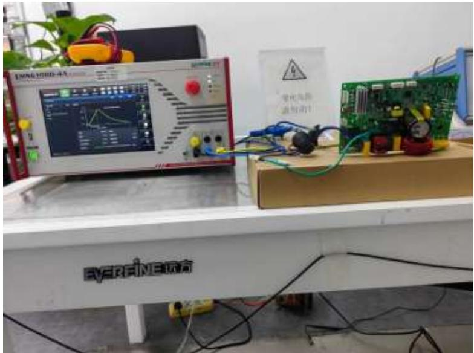

<table><tr><td>测试</td><td>电压(V)</td><td>放电类型</td><td>放电次数</td><td>测试结果</td></tr><tr><td>Vo</td><td>+15kV</td><td>空气放电</td><td>10</td><td>PASS</td></tr><tr><td>Vo</td><td>-15kV</td><td>空气放电</td><td>10</td><td>PASS</td></tr><tr><td>GND</td><td>+15kV</td><td>空气放电</td><td>10</td><td>PASS</td></tr><tr><td>GND</td><td>-15kV</td><td>空气放电</td><td>10</td><td>PASS</td></tr><tr><td>Vo</td><td>+20kV</td><td>空气放电</td><td>10</td><td>PASS</td></tr><tr><td>Vo</td><td>-20kV</td><td>空气放电</td><td>10</td><td>PASS</td></tr><tr><td>GND</td><td>+20kV</td><td>空气放电</td><td>10</td><td>PASS</td></tr><tr><td>GND</td><td>-20kV</td><td>空气放电</td><td>10</td><td>PASS</td></tr></table>

## 测试说明

➢ 按照GB/T17626.2和IEC61000-4-2的最新版本要求进行测试  
➢ 室温环境，230VAC输入满载条件  
➢ 每个测试点重复10次  
➢ 分别对输出正端和地进行空气放电  
➢ 试验时样机输出正常（符合A类标准）视为Pass

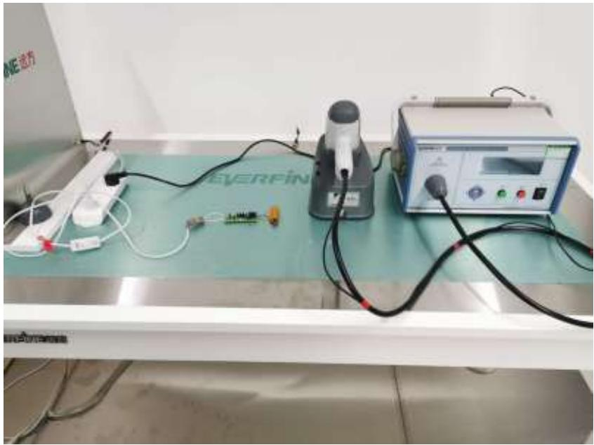

## 重要声明

本文档中的数据和信息仅供参考，不构成任何形式的建议、验收标准或保证。实际测试数据和结果可能同文档中列出的数据和结果存在差异，请用户自行确认产品的适用性。  
此文档测试的BP85958P样品未经CP/FT工序，后续根据批量数据可能微调某些参数，可能略影响性能表现。此文档供参考评估，最终性能表现请以量产版本芯片为准。

上海市浦东新区申江路5005弄星创科技广场3号楼9层

+86-21-51870166

sales@bpsemi.com

www.bpsemi.com

  
微信公众号

  
微信视频号
