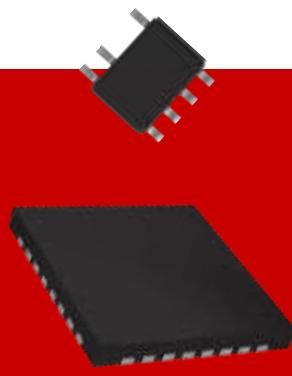

## BPA8604P&LNK364P对比测试 (12V/0.25A, 5V/0.25A@85\~265Vac)

上海晶丰明源半导体股份有限公司

Shanghai Bright Power Semiconductor Co., Ltd.

WHX

时间： 2021年5月

## 电气参数对比

<table><tr><td></td><td>BPA8604P</td><td>LNK364P</td></tr><tr><td>开关频率</td><td>132kHz</td><td>132kHz</td></tr><tr><td>Mosfet BV</td><td>700V</td><td>700V</td></tr><tr><td> $R_{DS\_ON}$ </td><td>20ohm</td><td>24ohm</td></tr><tr><td>限流点</td><td>250mA</td><td>250mA</td></tr><tr><td>软启动</td><td>有</td><td>无</td></tr><tr><td>输入过压保护</td><td>无</td><td>无</td></tr><tr><td>输入欠压保护</td><td>无</td><td>无</td></tr><tr><td>输出过压保护</td><td>无</td><td>无</td></tr><tr><td>过载保护</td><td>有</td><td>有</td></tr><tr><td>封装</td><td>DIP-7</td><td>DIP-7</td></tr></table>

## 测试数据对比

电源规格：85\~265Vac输入，12V/0.25A， 5V/0.25A输出

<table><tr><td colspan="2"></td><td>BPA8604P</td><td>LNK364P</td><td></td></tr><tr><td colspan="2">待机功耗</td><td>100mW</td><td>83mW</td><td></td></tr><tr><td rowspan="2">效率(满载整机)</td><td>115Vac</td><td>72%</td><td>74.1%</td><td></td></tr><tr><td>230Vac</td><td>70.85%</td><td>69.53%</td><td></td></tr><tr><td rowspan="2">输出电压纹波</td><td>85Vac</td><td>103mV</td><td>98mV</td><td></td></tr><tr><td>265Vac</td><td>99mV</td><td>78mV</td><td></td></tr><tr><td rowspan="2">动态负载性能(反馈那一路,比如5V)</td><td>50%-100%</td><td> $131mV_{PK\_PK}$ </td><td> $117mV_{PK\_PK}$ </td><td></td></tr><tr><td>10%-90%</td><td> $128mV_{PK\_PK}$ </td><td> $132mV_{PK\_PK}$ </td><td></td></tr><tr><td rowspan="2">MOSFET应力</td><td> $V_{DS}$ </td><td>550V</td><td>540V</td><td></td></tr><tr><td> $I_{DS}$ </td><td>0.472A</td><td>0.376A</td><td></td></tr><tr><td rowspan="2">二极管应力(12V输出)</td><td>VRR</td><td>70V</td><td>66V</td><td></td></tr><tr><td> $I_{PK}$ </td><td>-A</td><td>-A</td><td></td></tr><tr><td rowspan="2">二极管应力(5V输出)</td><td>VRR</td><td>29.6V</td><td>30.3V</td><td></td></tr><tr><td> $I_{PK}$ </td><td>1.64A</td><td>1.57A</td><td></td></tr><tr><td colspan="2">温升测试(环温28°C)</td><td>97.38°C</td><td>94.34°C</td><td></td></tr><tr><td colspan="2">传导EMI</td><td>&gt;6dB裕量</td><td>&gt;6dB裕量</td><td></td></tr><tr><td colspan="2">Surge</td><td>Pass</td><td>Pass</td><td>共模2kV,差模4kV</td></tr><tr><td colspan="2">EFT群脉冲</td><td>Pass</td><td>Pass</td><td>4kV,5kHz/38kHz/100kHz</td></tr><tr><td colspan="2">ESD</td><td>Pass</td><td>Pass</td><td>8kV接触放电/15kV空气放电</td></tr></table>

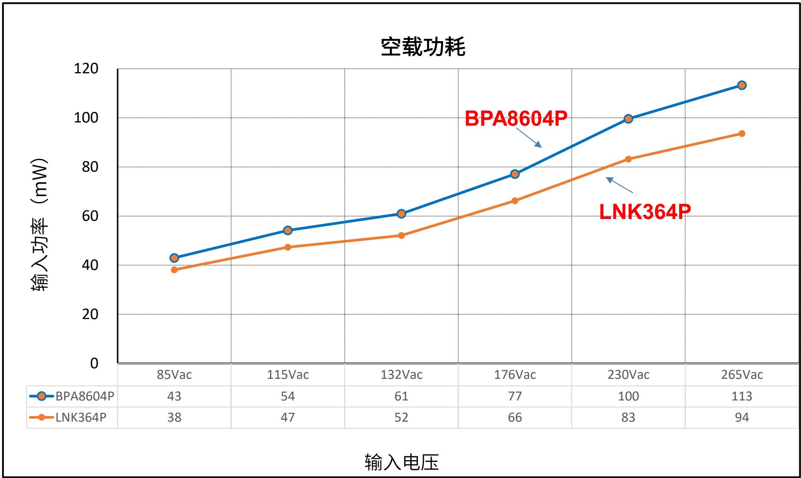

效率曲线  
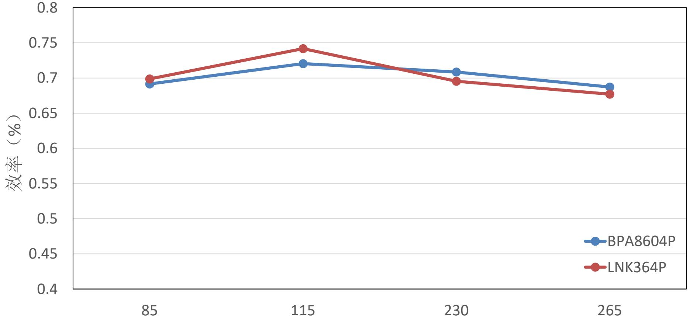

输入电压（VAC）

## 输出电压调整率

BPA8604P

<table><tr><td rowspan="2"></td><td rowspan="2"> $V_{IN}(VAC)$ Load(%)</td><td colspan="2">85V</td><td colspan="2">115V</td><td colspan="2">230V</td><td colspan="2">264V</td><td colspan="2">输入调整率</td></tr><tr><td>5V</td><td>12V</td><td>5V</td><td>12V</td><td>5V</td><td>12V</td><td>5V</td><td>12V</td><td>5V</td><td>12V</td></tr><tr><td>5V=0%</td><td>12V=0%</td><td>4.973</td><td>13.966</td><td>4.974</td><td>13.991</td><td>4.979</td><td>14.131</td><td>4.984</td><td>14.191</td><td>0.23%</td><td>1.60%</td></tr><tr><td rowspan="3">5V=50%</td><td>12V=0%</td><td>4.945</td><td>15.386</td><td>4.949</td><td>15.459</td><td>4.946</td><td>15.769</td><td>4.943</td><td>15.854</td><td>0.13%</td><td>3.00%</td></tr><tr><td>12V=50%</td><td>4.953</td><td>12.459</td><td>4.950</td><td>12.459</td><td>4.954</td><td>12.481</td><td>4.950</td><td>12.488</td><td>0.08%</td><td>0.23%</td></tr><tr><td>12V=100%</td><td>4.953</td><td>12.266</td><td>4.958</td><td>12.261</td><td>4.956</td><td>12.266</td><td>4.950</td><td>12.261</td><td>0.15%</td><td>0.04%</td></tr><tr><td rowspan="3">5V=100%</td><td>12V=0%</td><td>4.969</td><td>15.523</td><td>4.968</td><td>15.575</td><td>4.970</td><td>15.861</td><td>4.969</td><td>15.934</td><td>0.05%</td><td>2.61%</td></tr><tr><td>12V=50%</td><td>4.970</td><td>12.659</td><td>4.971</td><td>12.656</td><td>4.974</td><td>12.681</td><td>4.974</td><td>12.693</td><td>0.08%</td><td>0.29%</td></tr><tr><td>12V=100%</td><td>4.976</td><td>12.431</td><td>4.976</td><td>12.426</td><td>4.978</td><td>12.441</td><td>4.976</td><td>12.452</td><td>0.02%</td><td>0.21%</td></tr><tr><td colspan="2">负载交叉调整率</td><td>0.63%</td><td>24.08%</td><td>0.55%</td><td>24.46%</td><td>0.65%</td><td>26.31%</td><td>0.83%</td><td>26.82%</td><td colspan="2"></td></tr></table>

LNK364P

<table><tr><td rowspan="2"></td><td rowspan="2"> $V_{IN}(VAC)$ Load(%)</td><td colspan="2">85V</td><td colspan="2">115V</td><td colspan="2">230V</td><td colspan="2">264V</td><td colspan="2">输入调整率</td></tr><tr><td>5V</td><td>12V</td><td>5V</td><td>12V</td><td>5V</td><td>12V</td><td>5V</td><td>12V</td><td>5V</td><td>12V</td></tr><tr><td>5V=0%</td><td>12V=0%</td><td>4.974</td><td>13.734</td><td>4.973</td><td>13.773</td><td>4.975</td><td>13.955</td><td>4.973</td><td>14.010</td><td>0.05%</td><td>1.99%</td></tr><tr><td rowspan="3">5V=50%</td><td>12V=0%</td><td>4.969</td><td>15.035</td><td>4.966</td><td>15.101</td><td>4.968</td><td>15.508</td><td>4.968</td><td>15.626</td><td>0.05%</td><td>3.86%</td></tr><tr><td>12V=50%</td><td>4.960</td><td>12.373</td><td>4.961</td><td>12.386</td><td>4.963</td><td>12.405</td><td>4.964</td><td>12.416</td><td>0.08%</td><td>0.35%</td></tr><tr><td>12V=100%</td><td>4.955</td><td>12.159</td><td>4.956</td><td>12.179</td><td>4.961</td><td>12.208</td><td>4.963</td><td>12.219</td><td>0.15%</td><td>0.49%</td></tr><tr><td rowspan="3">5V=100%</td><td>12V=0%</td><td>4.960</td><td>15.100</td><td>4.963</td><td>15.219</td><td>4.959</td><td>15.638</td><td>4.959</td><td>15.781</td><td>0.07%</td><td>4.41%</td></tr><tr><td>12V=50%</td><td>4.955</td><td>12.556</td><td>4.956</td><td>12.570</td><td>4.959</td><td>12.614</td><td>4.960</td><td>12.628</td><td>0.10%</td><td>0.57%</td></tr><tr><td>12V=100%</td><td>4.953</td><td>12.341</td><td>4.956</td><td>12.350</td><td>4.965</td><td>12.391</td><td>4.965</td><td>12.405</td><td>0.25%</td><td>0.52%</td></tr><tr><td colspan="2">负载交叉调整率</td><td>0.43%</td><td>22.07%</td><td>0.33%</td><td>22.74%</td><td>0.33%</td><td>25.35%</td><td>0.28%</td><td>26.22%</td><td colspan="2"></td></tr></table>

## 输出电压纹波

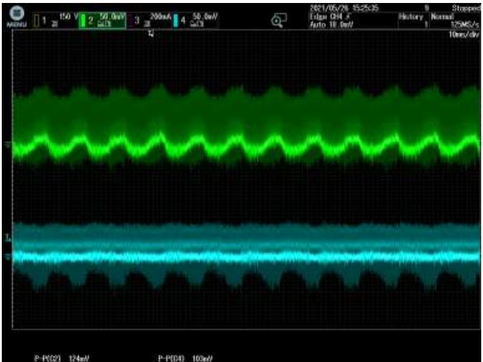

85 VAC

$\mathsf { C H } 2 \mathsf { V } _ { 0 \sqcup \mathsf { T } \_ 1 2 \vee } \mathsf { R i p p l e }$ $\mathsf { V } _ { \mathsf { P K - P K } } { = } 1 2 4 \mathsf { m V }$  
CH4 $\mathsf { V } _ { 0 \mathsf { U T } \_ 5 \vee } \mathsf { R i p p l e }$ $V _ { P K - P K } = \pm 0 . 3 m v$

Test Condition:  
➢ Full Load  
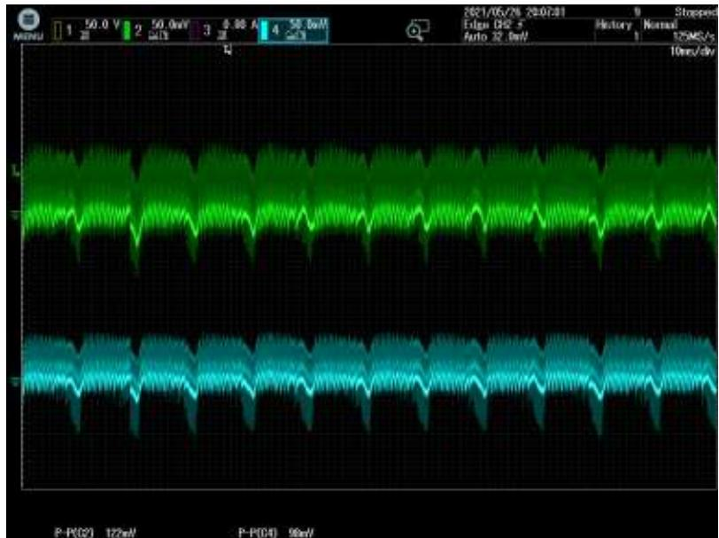

85 VAC

$\mathsf { C H 2 V } _ { \mathsf { O U T } \_ 1 2 \mathsf { V } }$ Ripple $\mathsf { V } _ { \mathsf { P K - P K } } { = } 1 2 2 \mathsf { m V }$  
CH4 $\mathsf { V } _ { \mathsf { O U T } \_ 5 \mathsf { V } }$ Ripple $V _ { p \vert k - P K } = 9 8 m v$

Test Condition:  
➢ Full Load  
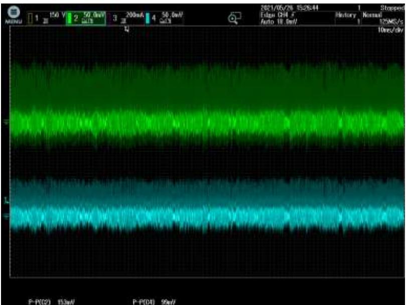

265 VAC

$\mathsf { C H } 2 \mathsf { V } _ { 0 \sqcup \mathsf { T } \_ 1 2 \vee } \mathsf { R i p p l e }$ $v _ { p _ { k - P K } } = 1 5 3 m v$  
CH4 $\mathsf { V } _ { 0 \mathsf { U T } \_ 5 \vee } \mathsf { R i p p l e }$ $V _ { p | k \mathrm { - } P | k } = 9 9 \min$

Test Condition:  
➢ Full Load  
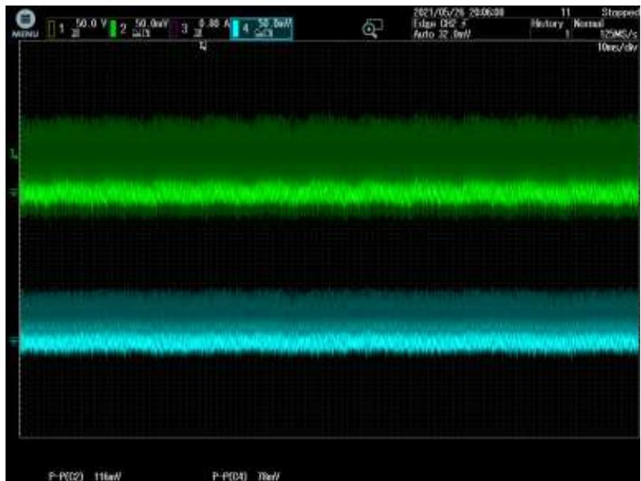

$2 6 5 \ : \mathsf { V } _ { \mathsf { A C } }$

$\mathsf { C H } 2 \mathsf { V } _ { 0 \sqcup \mathsf { T } \_ 1 2 \vee } \mathsf { R i p p l e }$ $\mathsf { V } _ { \mathsf { P K - P K } } { = } \pmb { 1 } \bar { 1 6 } \mathsf { m v }$  
CH4 $\mathsf { V } _ { 0 \mathsf { U T } \_ 5 \vee } \mathsf { R i p p l e }$ $\mathsf { V } _ { \mathsf { P K - P K } } { = } 7 8 \mathsf { m V }$

Test Condition:

➢ Full Load

## 动态负载(50%-100%)

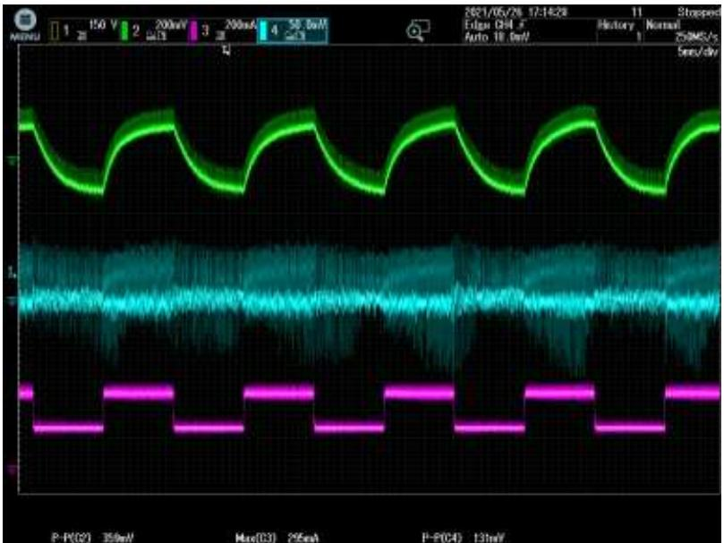

85 VAC

$\mathsf { C H 4 V _ { 0 \cup T \ 5 \vee } }$ $v _ { \mathsf { p } \kappa - \mathsf { P K } } = 1 3 1 \mathsf { m v }$  
CH2 $\mathsf { V } _ { \mathsf { O U T } \ 5 \mathsf { V } }$ $V _ { p | \mathrm { K \mathrm { - } P K } } = 3 5 9 ~ \mathrm { m V }$  
CH3 IOUT\_5V $\mathsf { C H 3 } \mathsf { I _ { 0 \cup \mathsf { T } \_ 5 \mathsf { V } } }$

## Test Condition:

➢ $0 . 1 2 5 \mathsf { A } – 0 . 2 5 \mathsf { A } – 0 . 1 2 5 \mathsf { A }$  
➢ Slew Rate: $0 . 5 \mathsf { A } / \mu \mathsf { S }$  
➢ Frequency: 100 Hz

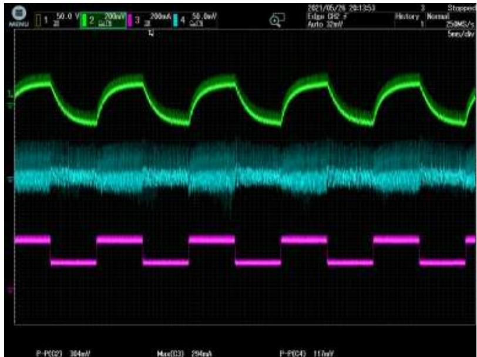

85 VAC

$\mathsf { C H 4 V _ { 0 \cup T \ 5 \vee } }$ $v _ { p _ { \vert k - P K } } = 1 1 7 m v$  
$\mathsf { C H 2 V _ { O U T } } \mathsf { 5 v }$ $V _ { p | c - P K } = 3 0 4 m v$  
CH3 IOUT\_5V

## Test Condition:

➢ $0 . 1 2 5 \mathsf { A } – 0 . 2 5 \mathsf { A } – 0 . 1 2 5 \mathsf { A }$  
➢ Slew Rate: 0.5 A/μS  
➢ Frequency: 100 Hz

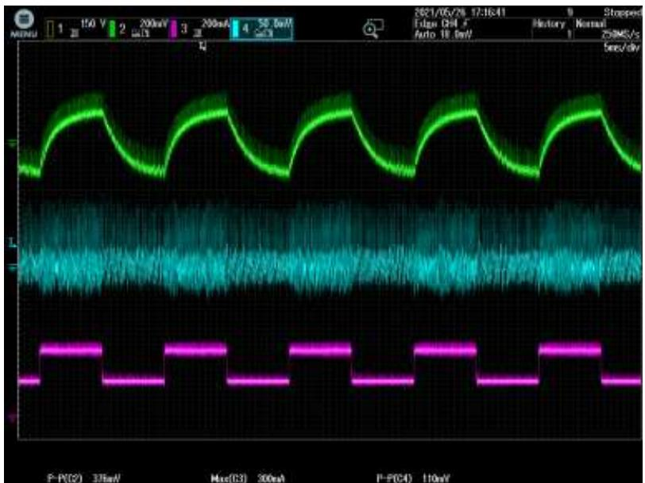

265 VAC

CH4 $\mathsf { V } _ { \mathsf { O U T } \ 5 \mathsf { V } }$ $v _ { p _ { k - P K } } = 1 1 0 m v$  
CH2 $\mathsf { V } _ { \mathsf { O U T } \ 5 \mathsf { V } }$ $v _ { p _ { K - P K } } = 3 \bar { 7 } 6 \mathsf { m v }$  
CH3 IOUT\_5V $\mathsf { I } _ { 0 \mathsf { U T } _ { - } 5 \mathsf { V } }$

## Test Condition:

➢ $0 . 1 2 5 \mathsf { A } – 0 . 2 5 \mathsf { A } – 0 . 1 2 5 \mathsf { A }$  
➢ Slew Rate: 0.5 A/μS  
➢ Frequency: 100 Hz

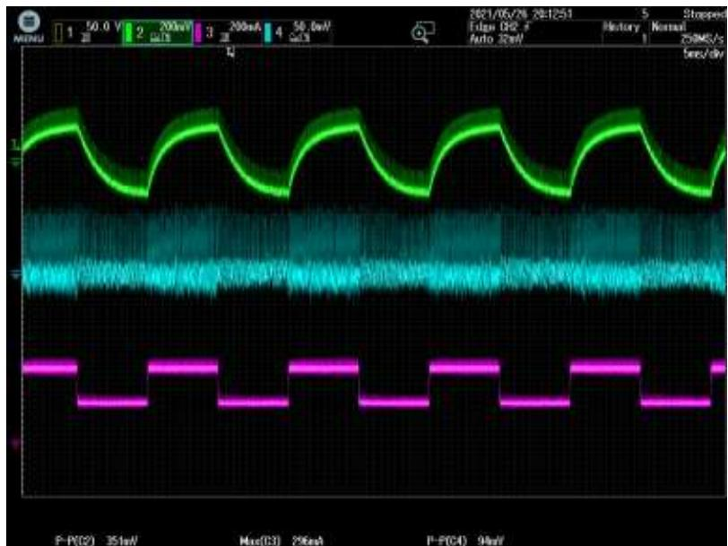

265 VAC

$\mathsf { C H 4 V _ { 0 \mathsf { U T } \ 5 \mathsf { v } } }$ $V _ { \mathsf { P K - P K } } { = } 9 4 ~ \mathsf { m V }$  
$\mathsf { C H 2 V _ { O U T } } \mathsf { 5 v }$ $v _ { p _ { k - P K } } = 3 5 1 m v$  
CH3 IOUT\_5V

## Test Condition:

➢ $0 . 1 2 5 \mathsf { A } – 0 . 2 5 \mathsf { A } – 0 . 1 2 5 \mathsf { A }$  
➢ Slew Rate: 0.5 A/μS  
➢ Frequency: 100 Hz

## 动态负载(10%-90%)

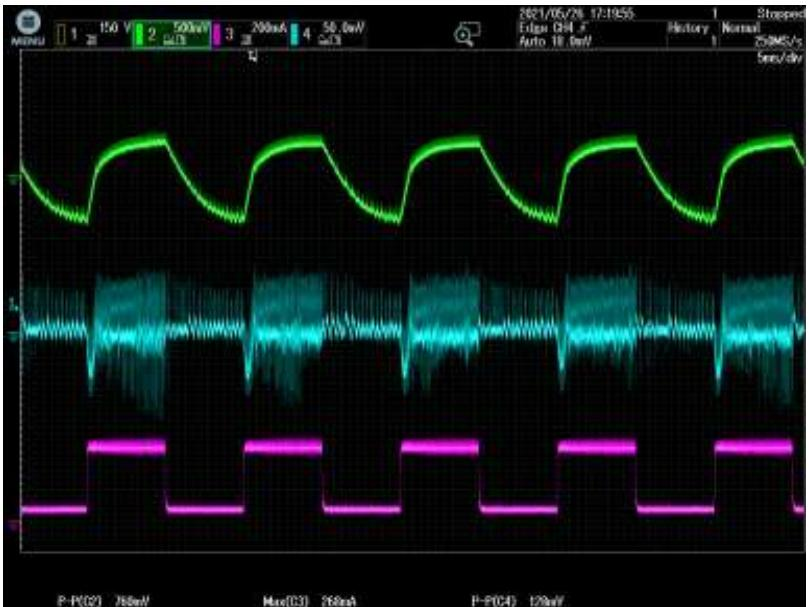

85 VAC

$\mathtt { C H 4 V } _ { \mathtt { 0 U T } \_ \mathtt { 5 V } }$  
$\begin{array} { r } { \mathsf { C H } 2 \mathsf { V } _ { \mathsf { o u r } } \mathsf { \Pi } _ { \mathsf { S V } } } \\ { \mathsf { V } _ { \mathsf { P K } \cdot \mathsf { P K } } = 7 6 \mathsf { 0 } \mathsf { r } } \end{array}$ mV  
CH3 IOUT\_5V $\mathsf { I } _ { \mathsf { O U T } \_ 5 \mathsf { V } }$

## Test Condition:

➢ 0.025A-0.225A-0.025A  
➢ Slew Rate: 0.5 A/μS  
➢ Frequency: 100 Hz

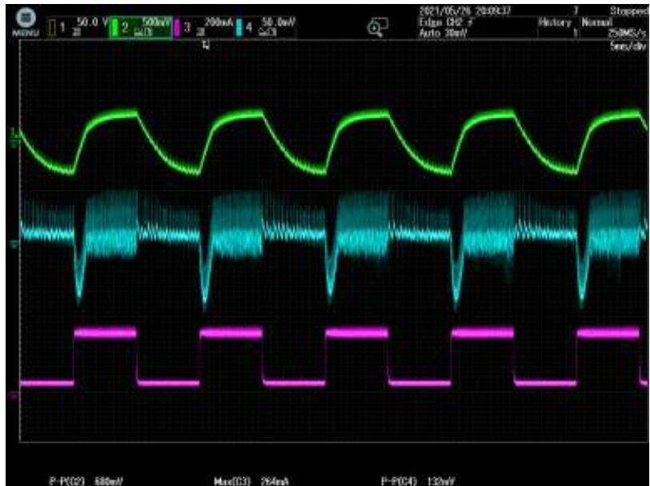

85 VAC

$\mathtt { C H 4 V _ { \scriptscriptstyle 0 \vee \dag , 5 2 , \mit \Psi } } _ { \sf m V }$  
$\mathtt { C H 2 } \mathtt { V _ { 0 \sqcup T } } _ { \mathtt { V _ { P K } } = 6 8 0 \operatorname* { m v } }$  
CH3 IOUT\_5V $\mathsf { C H 3 } \mathsf { I } _ { 0 \mathsf { U T } \_ 5 \mathsf { V } }$

## Test Condition:

➢ 0.025A-0.225A-0.025A  
➢ Slew Rate: 0.5 A/μS  
➢ Frequency: 100 Hz

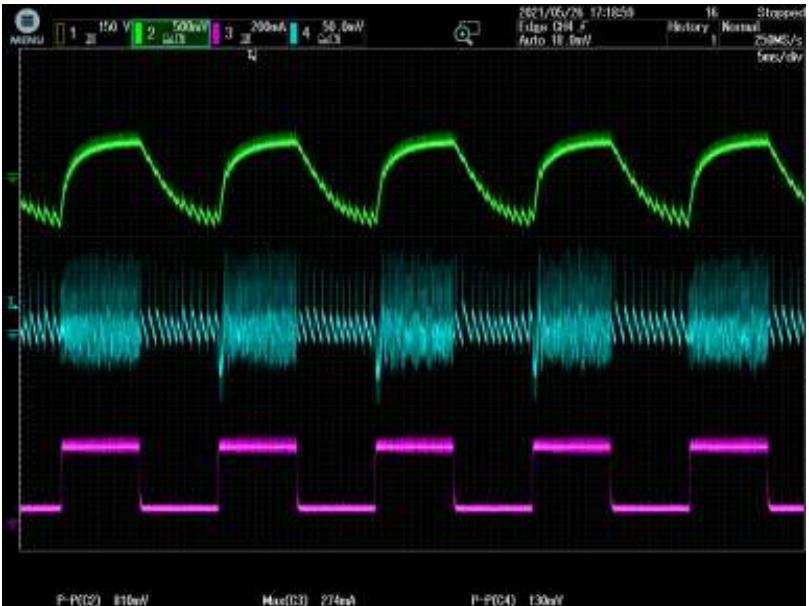

265 VAC

$\mathtt { C H 4 V _ { \mathtt { O U T } } } _ { \mathtt { P K } \mathtt { - P K } } = \mathtt { 1 } 3 0 \mathtt { m v }$  
$\mathtt { C H 2 } \mathtt { V _ { 0 \sqcup T } } _ { \mathtt { V _ { P K } } = 8 \mathtt { T 0 } \mathtt { m v } }$  
CH3 IOUT\_5V $\mathsf { I } _ { 0 \cup \mathsf { T } _ { - } 5 \mathsf { V } }$

## Test Condition:

➢ 0.025A-0.225A-0.025A  
➢ Slew Rate: 0.5 A/μS  
➢ Frequency: 100 Hz

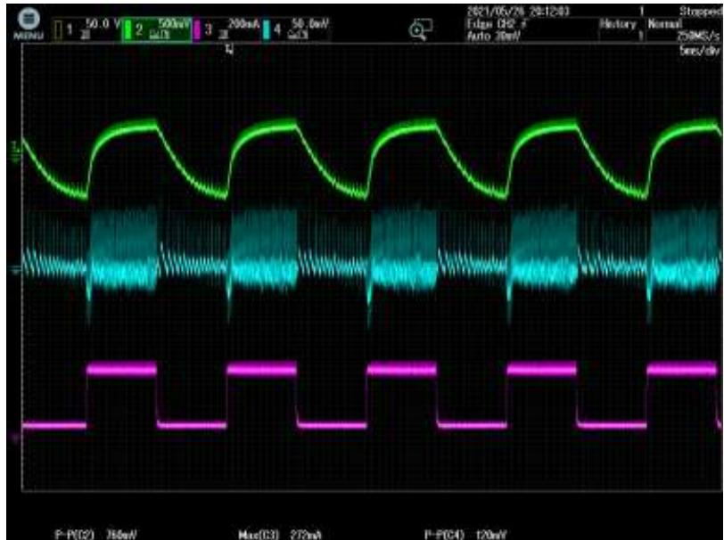

265 VAC

$\mathsf { C H 4 V } _ { \mathsf { o u r } } \mathsf { \Pi } _ { \mathsf { m v } }$  
$\mathsf { C H } 2 \mathsf { V } _ { \mathsf { O U T } } 5 \mathsf { v } _ { \mathsf { m V } }$  
CH3 IOUT\_5V

## Test Condition:

➢ 0.025A-0.225A-0.025A  
➢ Slew Rate: 0.5 A/μS  
➢ Frequency: 100 Hz

## 输出电压开机波形

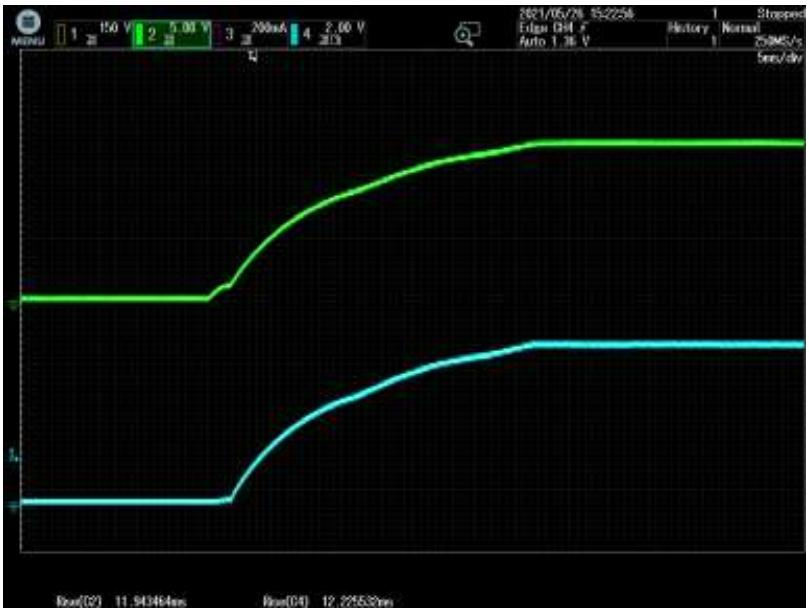

85 VAC

$\begin{array} { l l } { { \mathsf { C H 2 } } { \mathsf { V } } _ { 0 \cup \mathsf { T } _ { - } 1 2 \vee } } \\ { { \mathsf { t } } _ { \mathsf { r i s e } } { = } 1 2 \mathsf { m S } } \end{array}$ CH2 VOUT\_12V  
$\begin{array} { l } { \mathsf { C H 4 V _ { 0 \cup \mathsf { T } } } } \\ { \displaystyle \mathbf { t } _ { \mathsf { r i s e } } = 1 2 . 2 \mathsf { m s } } \end{array}$

Test Condition:  
➢ Full Load  
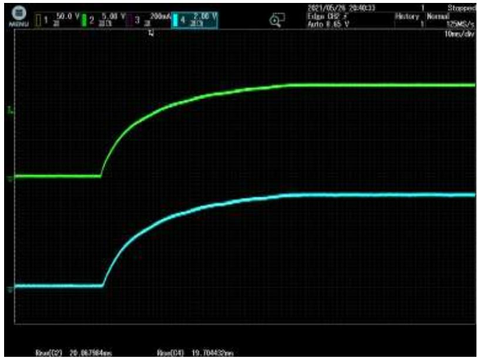

85 VAC

$\begin{array} { l l } { { \mathsf { C H 2 } } { \mathsf { V } } _ { 0 \cup \mathsf { T } \_ 1 2 \vee } } \\ { { \mathsf { t } } _ { \mathsf { r i s e } } { = } 2 0 \mathsf { m } { \mathsf { S } } } \end{array}$ CH2 VOUT\_12V  
$\begin{array} { r l } { \mathbf { \eta } } & { { } \mathsf { C H } 4 \mathsf { V } _ { 0 \cup \intercal } } \\ { \mathbf { \epsilon } } & { { } \mathbf { t } _ { \mathrm { r i s e } } { = } 1 9 . 7 \mathsf { m s } } \end{array}$

Test Condition:  
➢ Full Load  
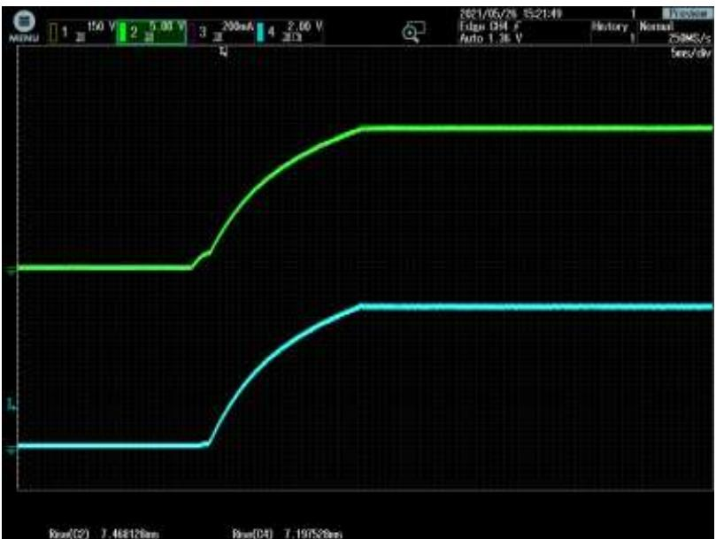

265 VAC

$\begin{array} { l l } { { \mathsf { C H 2 } } { \mathsf { V } } _ { 0 \cup \mathsf { T } _ { - } 1 2 \vee } } \\ { { \mathsf { t } } _ { \mathsf { r i s e } } { = } 7 . 5 ~ \mathsf { m s } } \end{array}$ CH2 V  
$\begin{array} { c } { { \mathsf { C H 4 } \mathsf { V } _ { 0 \cup \mathsf { T } \_ 5 \vee } } } \\ { { \mathsf { t } _ { \mathrm { r i s e } } \mathsf { = 7 } . 2 \mathsf { m s } } } \end{array}$ CH4 V

Test Condition:  
➢ Full Load  
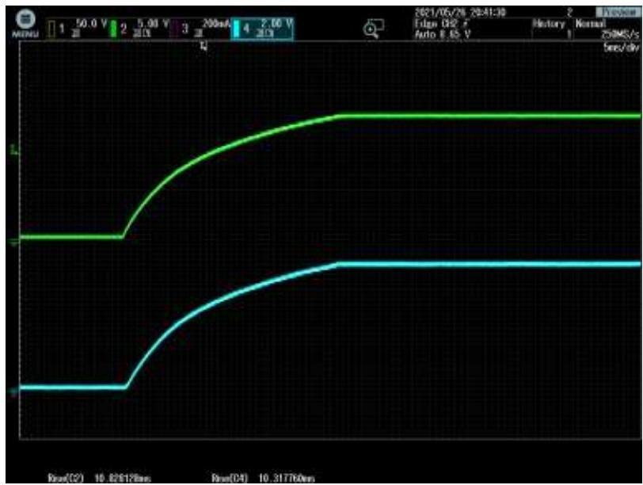

265 VAC

$\begin{array} { l l } { { \mathsf { C H 2 } } { \mathsf { V } } _ { 0 \cup \mathsf { T } _ { - } 1 2 \vee } } \\ { { \mathsf { t } } _ { \mathsf { r i s e } } { = } 1 0 . 8 ~ \mathsf { m s } } \end{array}$ CH2 V  
$\begin{array} { l } { { \mathsf { C H 4 V } _ { 0 \cup \top \top } } _ { 5 \vee } } \\ { { \mathfrak { t } _ { \mathsf { r i s e } } } { = } 1 0 . 3 ~ \mathsf { m s } } \end{array}$ CH4 VOUT\_5V

Test Condition:

➢ Full Load

## MOSFET开机波形

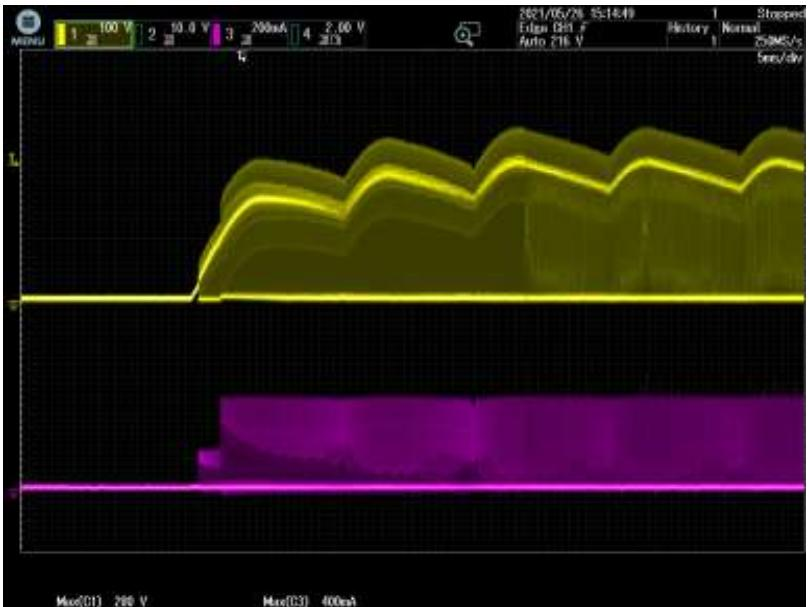

85 VAC

CH1 VDS  
CH3 IDS

$$
\begin{array}{l} \mathrm {V_ {DS\_MAX}} = 2 8 0 \mathrm{V} \\ \mathrm {I_ {DS\_MAX}} = 0. 4 \mathrm{A} \end{array}
$$

## Test Condition:

➢ Full Load

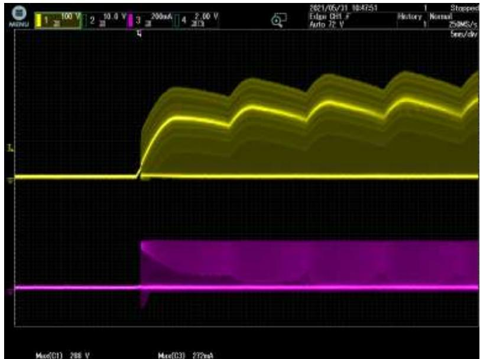

85 VAC

CH1 VDS  
CH3 IDS

$$
\begin{array}{l} \mathrm {V_ {DS\_MAX}} = 2 8 8 \mathrm{V} \\ \mathrm {I_ {DS\_MAX}} = 0. 2 7 2 \mathrm{A} \end{array}
$$

## Test Condition:

➢ Full Load

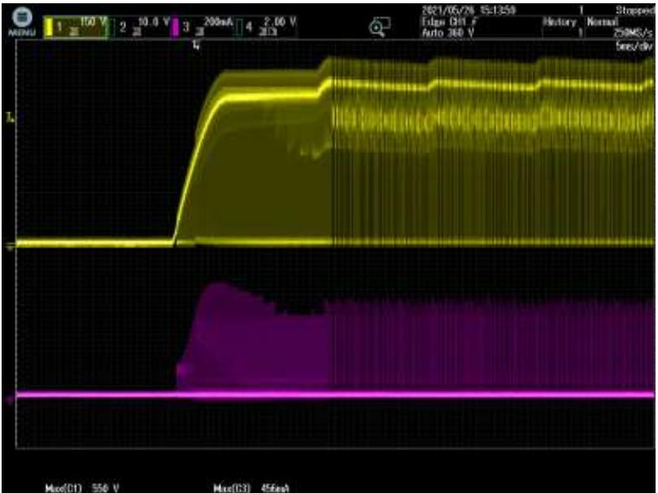

265 VAC

CH1 VDS  
CH3 IDS

$$
\begin{array}{l} \mathrm {V_ {DS\_MAX}} = 5 5 0 \mathrm{V} \\ \mathrm {I_ {DS\_MAX}} = 0. 4 5 6 \mathrm{A} \end{array}
$$

## Test Condition:

➢ Full Load

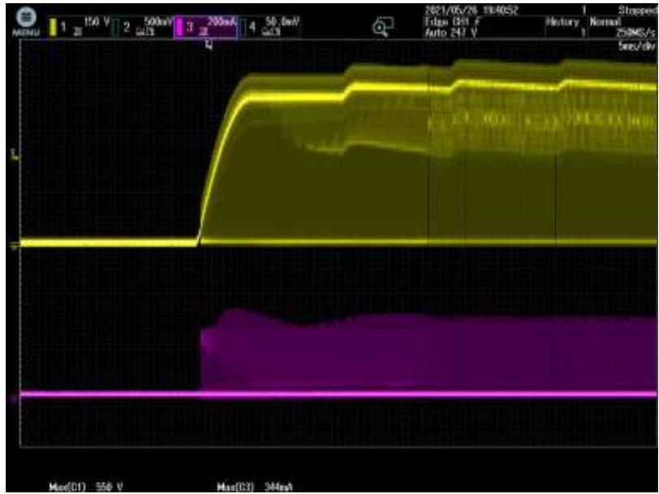

265 VAC

CH1 $\mathsf { V } _ { \mathsf { D } \mathsf { S } }$  
CH3 IDS

$$
\begin{array}{l} \mathrm {V_ {DS\_MAX}} = 5 5 0 \mathrm{V} \\ \mathrm {I_ {DS\_MAX}} = 0. 3 4 4 \mathrm{A} \end{array}
$$

## Test Condition:

➢ Full Load

## MOSFET稳态波形

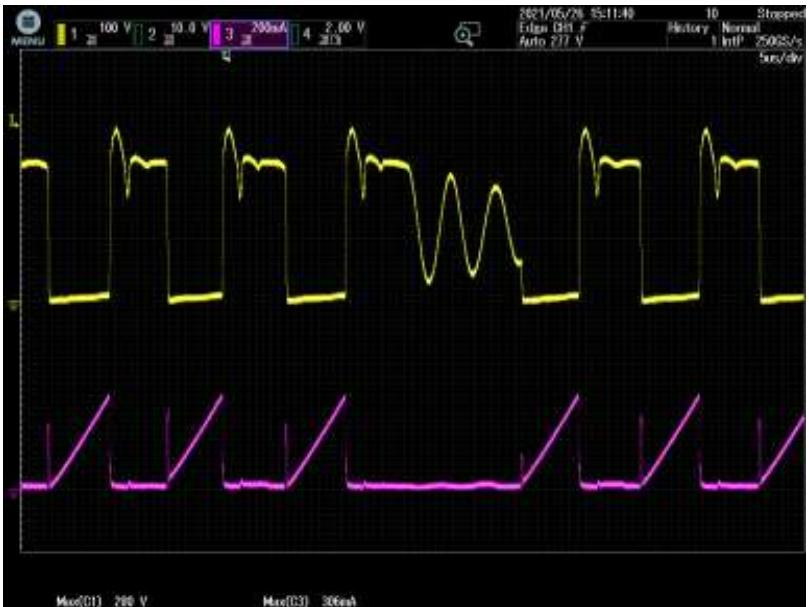

85 VAC  
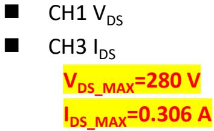

Test Condition:  
➢ Full Load

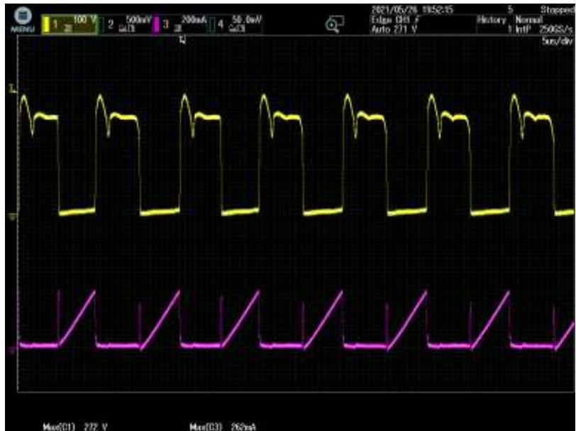

85 VAC  
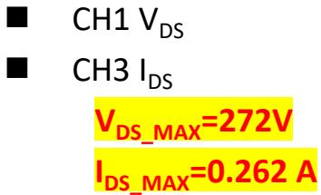

Test Condition:  
➢ Full Load

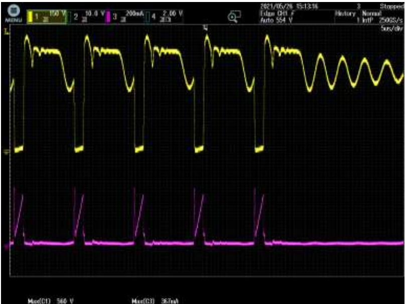

265 VAC  
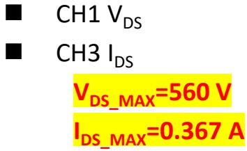

Test Condition:  
➢ Full Load

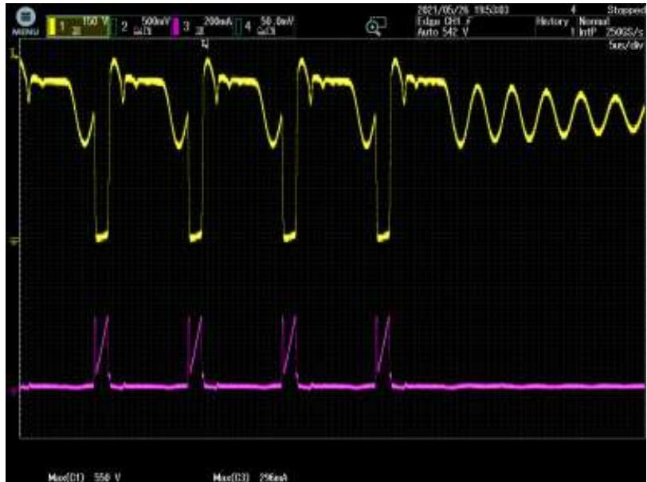

265 VAC  
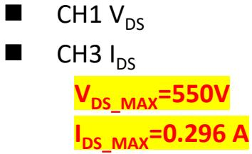

Test Condition:  
➢ Full Load

## 输出二极管开机波形

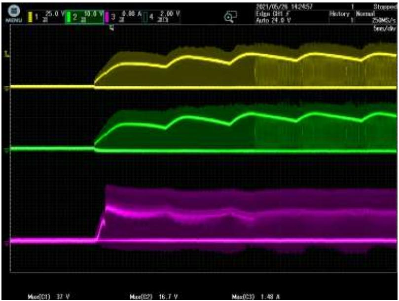

${ \otimes 5 } \mathsf { V } _ { \mathsf { A C } }$

CH1 VR\_12V $V _ { R \_ 1 2 \vee }$  
CH2 VR\_5V $V _ { R \_ 5 \vee }$  
CH3 IF

$$
\begin{array}{l} \mathrm {V_ {R - 12V\_MAX}} = 3 7 \mathrm{V} \\ \mathrm {V_ {R - 5V\_MAX}} = 1 6. 7 \mathrm{V} \\ \mathrm {I_ {F\_MAX}} = 1. 4 8 \mathrm{A} \end{array}
$$

## Test Condition:

➢ Full Load

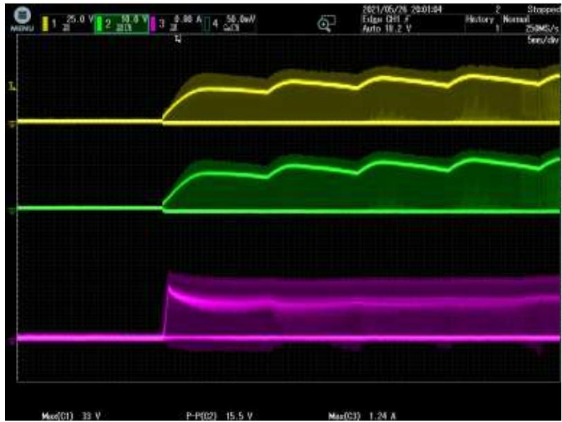

85 VAC

CH1 VR\_12V $V _ { R \_ 1 2 \vee }$  
CH2 VR\_5V $\mathsf { C H } 2 \mathsf { V } _ { \mathsf { R } \mathsf { \_ { 5 \mathsf { V } } } }$  
CH3 IF

$$
\begin{array}{l} V _ {R - 1 2 V \_ M A X} = 3 3 \mathrm{V} \\ V _ {R - 5 V \_ M A X} = 1 5. 5 \mathrm{V} \\ I _ {F \_ M A X} = 1. 2 4 \mathrm{A} \end{array}
$$

## Test Condition:

➢ Full Load

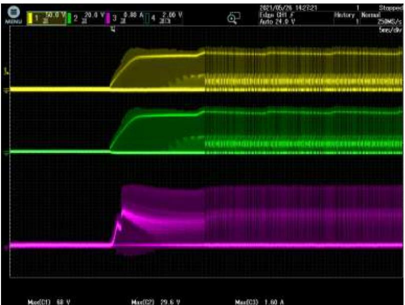

265 VAC

CH1 VR\_12V $V _ { R \_ 1 2 \vee }$  
CH2 VR\_5V $\mathsf { C H } 2 \mathsf { V } _ { \mathsf { R } \mathsf { \_ { 5 \mathsf { V } } } }$  
$C H 3 1 _ { F }$

$$
\begin{array}{l} \mathrm {V_ {R - 12V\_MAX}} = 6 8 \mathrm{V} \\ \mathrm {V_ {R - 5V\_MAX}} = 2 9. 6 \mathrm{V} \\ \mathrm {I_ {F\_MAX}} = 1. 6 \mathrm{A} \end{array}
$$

## Test Condition:

➢ Full Load

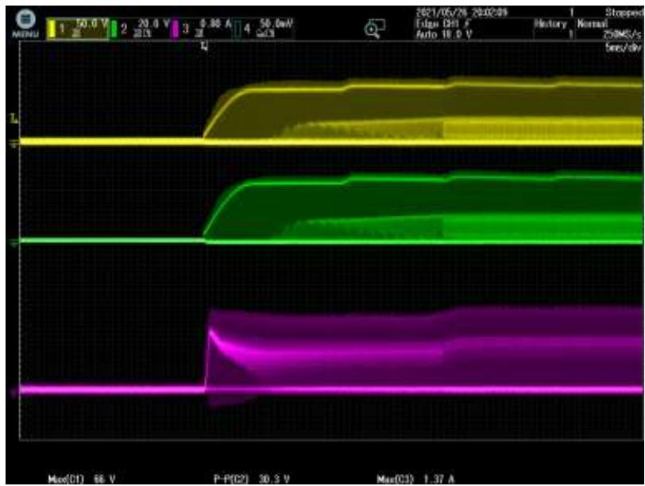

$2 6 5 \ : \mathsf { V } _ { \mathsf { A C } }$

CH1 VR\_12V $\mathsf { C H 1 V } _ { \mathsf { R } _ { \mathsf { - } } 1 2 \mathsf { V } }$  
$\mathsf { C H } 2 \mathsf { V } _ { \mathsf { R } \_ \mathsf { 5 V } }$  
$C H 3 1 _ { \mathsf { F } }$

$$
\begin{array}{l} V _ {R - 1 2 V \_ M A X} = 6 6 \mathrm{V} \\ V _ {R - 5 V \_ M A X} = 3 0. 3 \mathrm{V} \\ I _ {F \_ M A X} = 1. 3 7 \mathrm{A} \end{array}
$$

## Test Condition:

➢ Full Load

## 输出二极管稳态波形

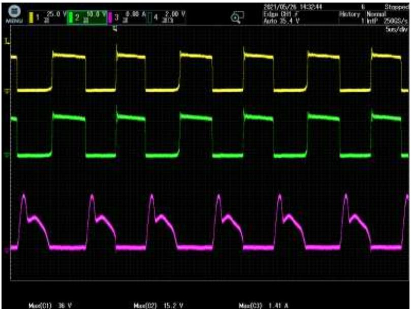

85 VAC

CH1 VR\_12V  
CH2 VR\_5V  
CH3 IF

$$
\begin{array}{l} \mathrm {V_ {R - 12V\_MAX}} = 3 6 \mathrm{V} \\ \mathrm {V_ {R - 5V\_MAX}} = 1 5. 2 \mathrm{V} \\ \mathrm {I_ {F\_MAX}} = 1. 4 1 \mathrm{A} \end{array}
$$

## Test Condition:

➢ Full Load

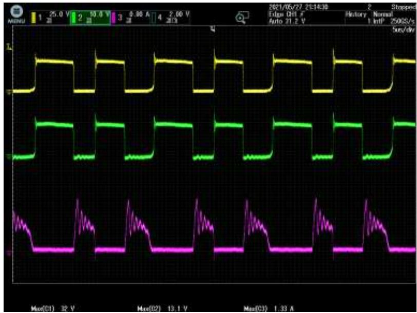

85 VAC

CH1 VR\_12V $V _ { R \_ 1 2 \vee }$  
CH2 VR\_5V $V _ { R \_ 5 \vee }$  
CH3 IF

$$
\begin{array}{l} V _ {R - 1 2 V \_ M A X} = 3 2 V \\ V _ {R - 5 V \_ M A X} = 1 3. 1 V \\ I _ {F \_ M A X} = 1. 3 3 A \end{array}
$$

## Test Condition:

➢ Full Load

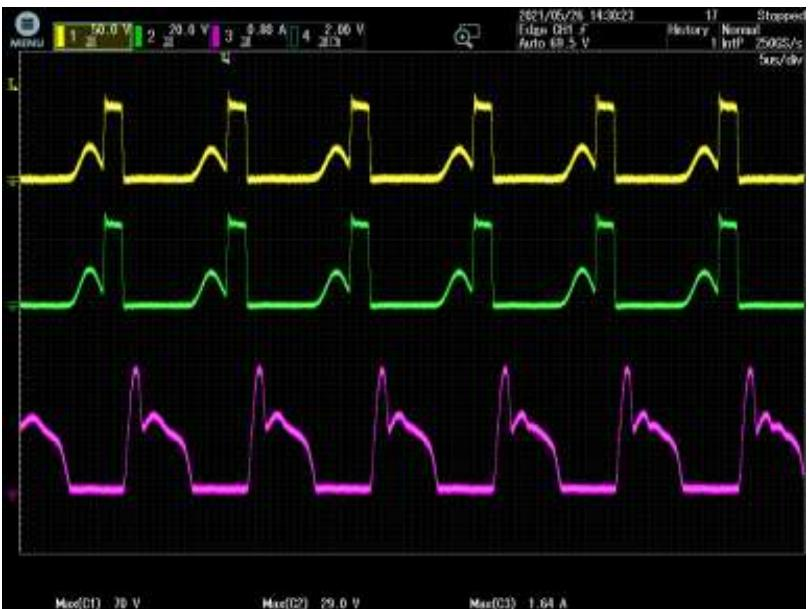

265 VAC

CH1 VR\_12V  
CH2 VR\_5V  
CH3 IF

$$
\begin{array}{l} \mathrm {V_ {R - 12V\_MAX}} = 7 0 \mathrm{V} \\ \mathrm {V_ {R - 5V\_MAX}} = 2 9 \mathrm{V} \\ \mathrm {I_ {F\_MAX}} = 1. 6 4 \mathrm{A} \end{array}
$$

## Test Condition:

➢ Full Load

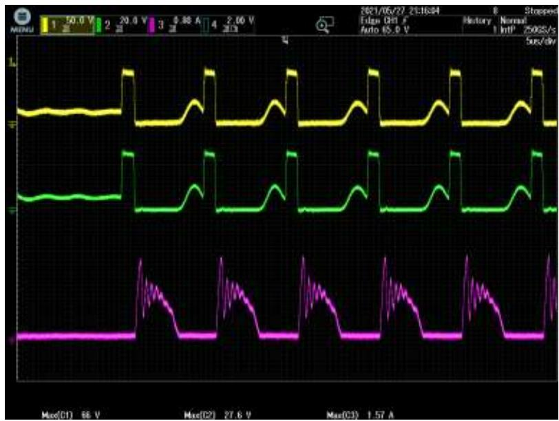

265 VAC

CH1 VR\_12V $V _ { R \_ 1 2 \vee }$  
CH2 $V _ { R \_ 5 \vee }$  
CH3 IF

$$
\begin{array}{l} V _ {R - 1 2 V \_ M A X} = 6 6 \mathrm{V} \\ V _ {R - 5 V \_ M A X} = 2 7. 6 \mathrm{V} \\ I _ {F \_ M A X} = 1. 5 7 \mathrm{A} \end{array}
$$

## Test Condition:

➢ Full Load

## 输出短路保护（MOSFET波形）

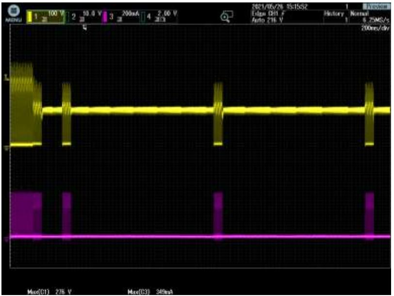

${ \otimes 5 } \mathsf { V } _ { \mathsf { A C } }$

${ \mathsf { C H 1 } } \mathsf { V _ { D S } }$  
$C H 3 \mid _ { \mathsf { D S } }$

$$
\begin{array}{l} \mathrm {V_ {DS\_MAX}} = 2 7 6 \mathrm{V} \\ \mathrm {I_ {DS\_MAX}} = 0. 3 4 9 \mathrm{A} \end{array}
$$

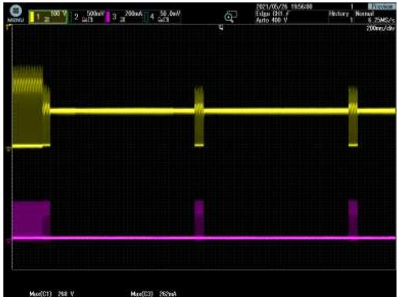

${ \tt S 5 V } _ { \sf A C }$

${ \mathsf { C H 1 } } \mathsf { V } _ { \mathsf { D S } }$  
$C H 3 \mid _ { \mathsf { D S } }$

$$
\begin{array}{l} \mathrm {V_ {DS\_MAX}} = 2 6 8 \mathrm{V} \\ \mathrm {I_ {DS\_MAX}} = 0. 2 6 2 \mathrm{A} \end{array}
$$

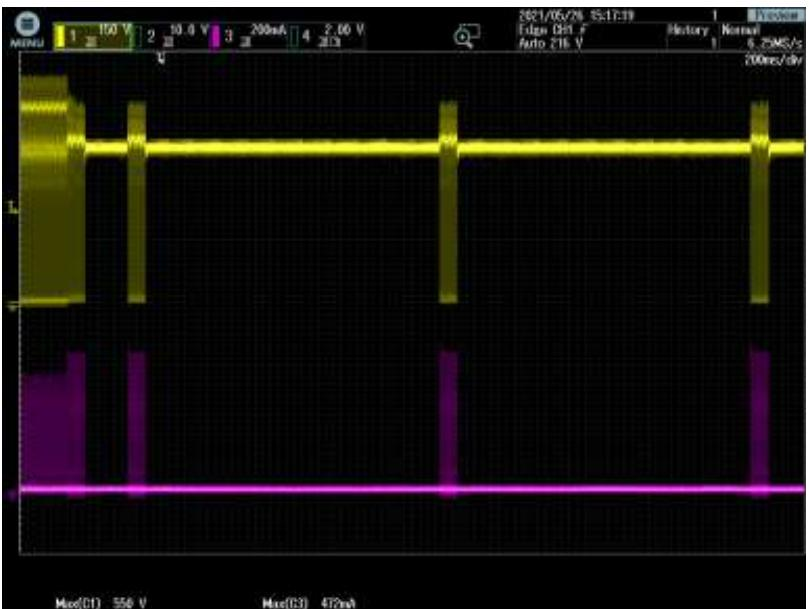

265 VAC

${ \mathsf { C H 1 } } \mathsf { V _ { D S } }$  
$C H 3 \mid _ { \mathsf { D S } }$

$$
\begin{array}{l} \mathrm {V_ {DS\_MAX}} = 5 5 0 \mathrm{V} \\ \mathrm {I_ {DS\_MAX}} = 0. 4 7 2 \mathrm{A} \end{array}
$$

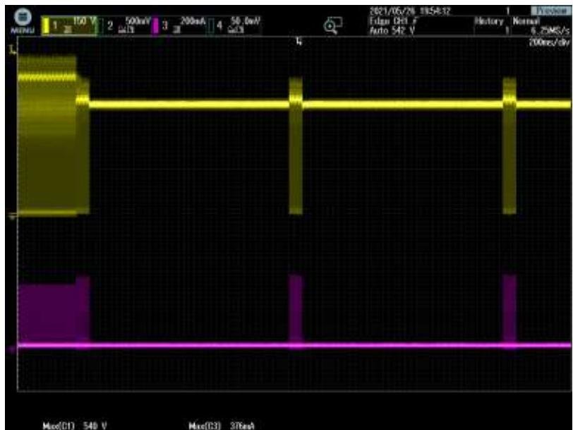

$2 6 5 \ : \mathsf { V } _ { \mathsf { A C } }$

${ \mathsf { C H 1 } } \mathsf { V } _ { \mathsf { D S } }$  
$C H 3 \mid _ { \mathsf { D S } }$

$$
\begin{array}{l} V _ {D S \_ M A X} = 5 4 0 \mathrm{V} \\ I _ {D S \_ M A X} = 0. 3 7 6 \mathrm{A} \end{array}
$$

## 温升测试

BPA8604P

<table><tr><td rowspan="2">项目</td><td>85VAC</td><td>115VAC</td><td>230VAC</td><td>265VAC</td></tr><tr><td>温度(°C)</td><td>温度(°C)</td><td>温度(°C)</td><td>温度(°C)</td></tr><tr><td>环境温度</td><td>28.34</td><td>28.1</td><td>28.8</td><td>28.96</td></tr><tr><td>BPA8604P (U2)</td><td>82.11</td><td>65.44</td><td>90.76</td><td>97.38</td></tr><tr><td>变压器绕组(T1)</td><td>51.2</td><td>50.74</td><td>54.3</td><td>55.17</td></tr><tr><td>变压器磁芯(T1)</td><td>50.1</td><td>49.9</td><td>53.79</td><td>54.71</td></tr><tr><td>整流二极管(D3)</td><td>47.7</td><td>47.33</td><td>48.78</td><td>49.16</td></tr><tr><td>整流桥(D1)</td><td>39.04</td><td>35.53</td><td>35.59</td><td>35.81</td></tr><tr><td>输入电解电容(C6)</td><td>45.68</td><td>42.06</td><td>44.8</td><td>45.64</td></tr><tr><td>输出电解电容(C3)</td><td>35.06</td><td>34.8</td><td>36.06</td><td>36.29</td></tr></table>

LNK364P

<table><tr><td rowspan="2">项目</td><td>85VAC</td><td>115VAC</td><td>230VAC</td><td>265VAC</td></tr><tr><td>温度(°C)</td><td>温度(°C)</td><td>温度(°C)</td><td>温度(°C)</td></tr><tr><td>环境温度</td><td>28.26</td><td>27.99</td><td>28.04</td><td>28.18</td></tr><tr><td>LNK364P (U2)</td><td>71.14</td><td>56.2</td><td>88.42</td><td>94.34</td></tr><tr><td>变压器绕组(T1)</td><td>52.23</td><td>51.68</td><td>55.2</td><td>56.05</td></tr><tr><td>变压器磁芯(T1)</td><td>51.25</td><td>50.84</td><td>54.43</td><td>55.29</td></tr><tr><td>整流二极管(D3)</td><td>49.37</td><td>48.53</td><td>50.24</td><td>50.75</td></tr><tr><td>整流桥(D1)</td><td>38.98</td><td>35.53</td><td>34.69</td><td>34.78</td></tr><tr><td>输入电解电容(C6)</td><td>44.98</td><td>41.68</td><td>44.92</td><td>45.75</td></tr><tr><td>输出电解电容(C3)</td><td>37.7</td><td>36.65</td><td>37.91</td><td>38.3</td></tr></table>

备注：增大芯片Source散热铜箔面积可以降低芯片温度。

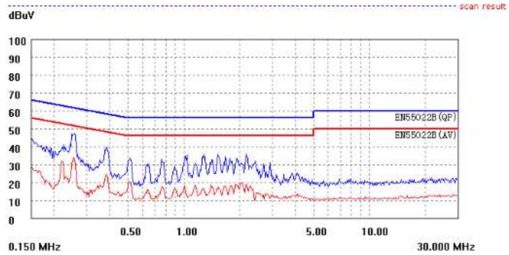

115Vac Line  
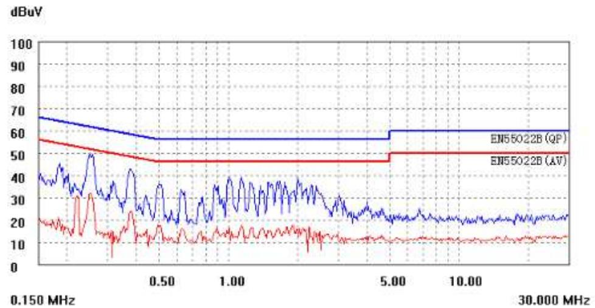

230Vac Line

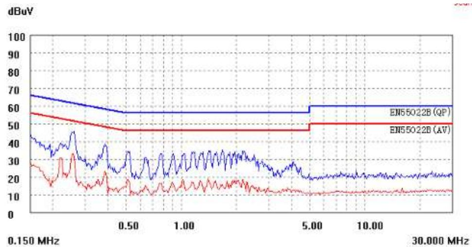

115Vac Neutral

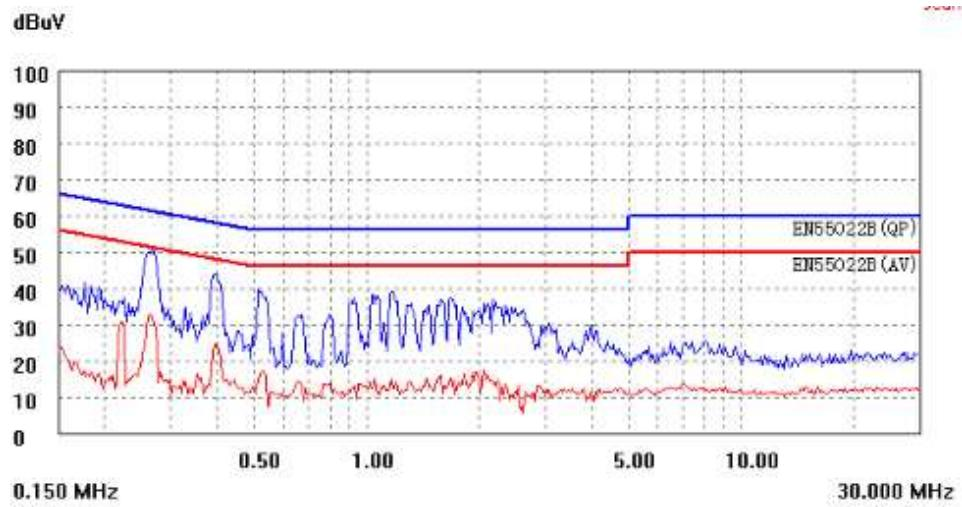

230Vac Neutral

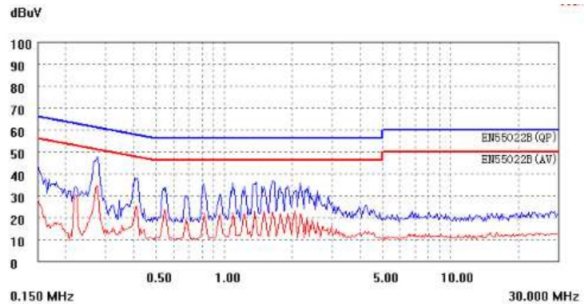

115Vac Line  
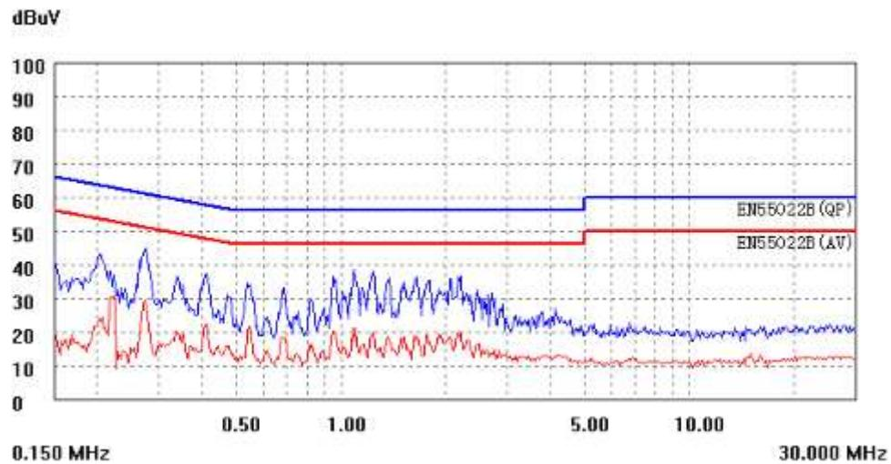

230Vac Line

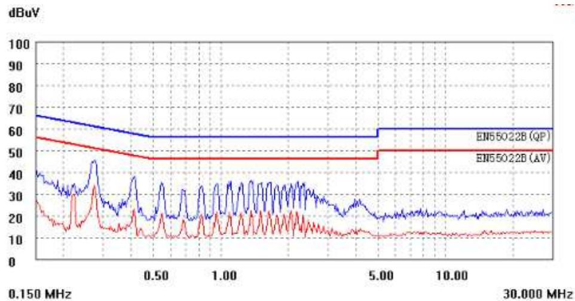

115Vac Neutral

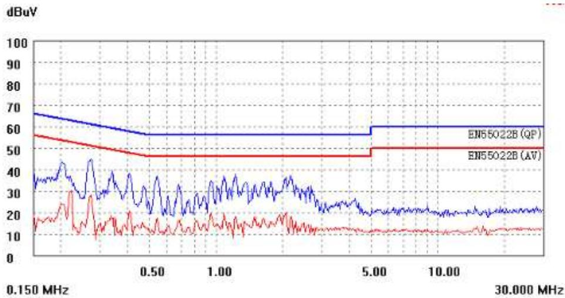

230Vac Neutral

## THANK YOU FOR WATCHING
