# BPA8604D 非隔离参考设计

# (5V/1A)

上海晶丰明源半导体股份有限公司

Shanghai Bright Power Semiconductor Co., Ltd.

陈耀兵

2021 10 9

BPA8604   
电源规格  
电路图  
◼BOM  
◼PCB Layout   
电路实物图  
变压器规格书  
性能测试数据

# 产品特点:

》集成交流电压过零检测与过零信号输 出功能   
➢ 700V MOSFET   
➢ ON/OFF   
》内置软启动功能  
》集成高压启动、自供电电路  
➢ EMI

# 应用领域:

》家用电器辅助电源  
》微波炉辅助电源

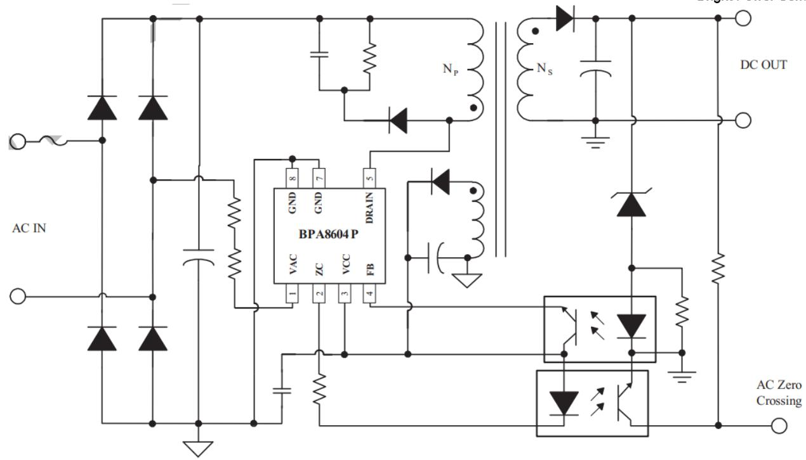

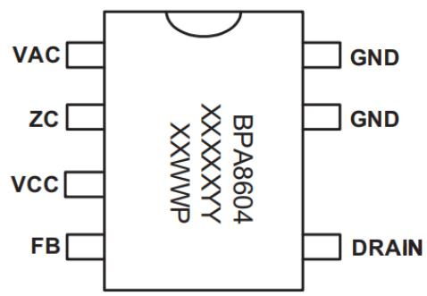

<table><tr><td>项目描述</td><td>符号</td><td>最小</td><td>典型</td><td>最大</td><td>单位</td><td>备注</td></tr><tr><td colspan="7">输入</td></tr><tr><td>电压</td><td> $V_{IN}$ </td><td>90</td><td>115/230</td><td>264</td><td> $V_{AC}$ </td><td></td></tr><tr><td>频率</td><td> $f_{LINE}$ </td><td>47</td><td>50/60</td><td>63</td><td>Hz</td><td></td></tr><tr><td colspan="7">输出</td></tr><tr><td>输出电压</td><td> $V_{OUT}$ </td><td></td><td>5</td><td></td><td>V</td><td>±3%</td></tr><tr><td>输出电流</td><td> $I_{OUT}$ </td><td></td><td>1</td><td></td><td>A</td><td></td></tr><tr><td>输出电压纹波</td><td> $V_{RIPPLE}$ </td><td></td><td></td><td>250</td><td>mV</td><td>20MHz带宽可增大输出电容或增加二级滤波减小纹波</td></tr><tr><td>连续输出功率</td><td> $P_{OUT}$ </td><td></td><td>5</td><td></td><td>W</td><td></td></tr><tr><td colspan="7">效率</td></tr><tr><td>待机功耗</td><td> $P_{STDBY}$ </td><td></td><td></td><td>50</td><td>mW</td><td>230VAC</td></tr><tr><td>满载效率</td><td>η</td><td>72</td><td></td><td></td><td>%</td><td>115VAC/230VAC</td></tr><tr><td colspan="7">环境</td></tr><tr><td>传导EMI</td><td></td><td colspan="4">满足CISPR22/EN55022 Class B,至少6dB 裕量</td><td></td></tr><tr><td>Surge</td><td></td><td></td><td>2</td><td></td><td>kV</td><td>差模</td></tr><tr><td>EFT</td><td></td><td></td><td>4</td><td></td><td>kV</td><td>5kHz/100kHz/38kHz</td></tr><tr><td>ESD</td><td></td><td></td><td>15</td><td></td><td>kV</td><td>接触8kV,空气15kV</td></tr><tr><td>工作环境温度</td><td> $T_{AMP}$ </td><td>0</td><td></td><td>45</td><td>°C</td><td></td></tr></table>

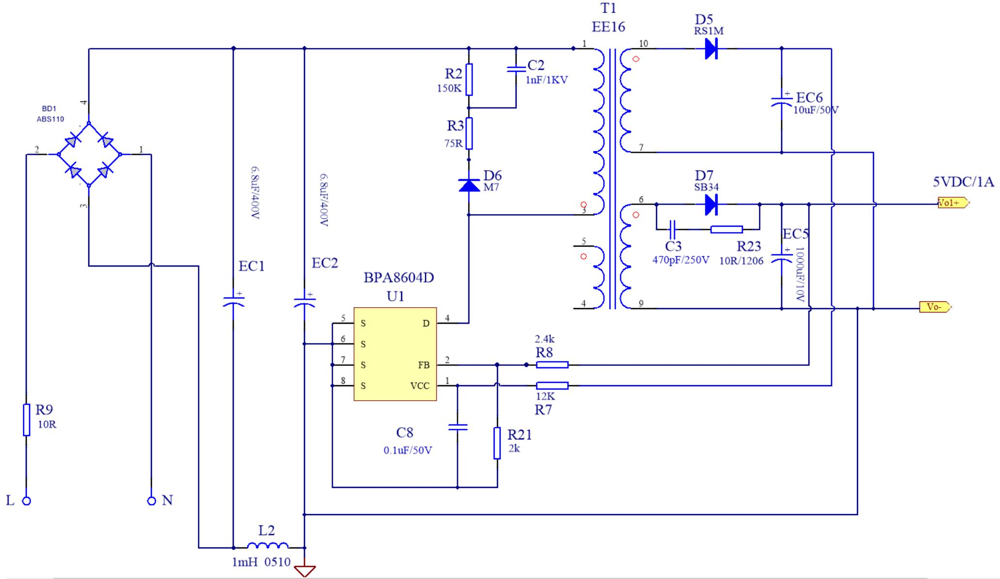

<table><tr><td>序号</td><td>元件标号</td><td>参数描述</td><td>封装尺寸</td><td>数量</td></tr><tr><td>1</td><td>BD1</td><td>ABS110</td><td>BD_SMD(bs210)</td><td>1</td></tr><tr><td>2</td><td>C2</td><td>1nF/1KV</td><td>50V104</td><td>1</td></tr><tr><td>3</td><td>C3</td><td>470pF/250V</td><td>0805-C</td><td>1</td></tr><tr><td>4</td><td>C8</td><td>0.1uF/50V</td><td>0805-C</td><td>1</td></tr><tr><td>5</td><td>D5</td><td>RS1M</td><td>SMA</td><td>1</td></tr><tr><td>6</td><td>D6</td><td>M7</td><td>D SMA</td><td>1</td></tr><tr><td>7</td><td>D7</td><td>SB34</td><td>SMB</td><td>1</td></tr><tr><td>8</td><td>EC1, EC2</td><td>6.8uF/400V</td><td>EC 6.5 P2.5</td><td>2</td></tr><tr><td>9</td><td>EC5</td><td>1000uF/10V</td><td>EC 10 P5.0</td><td>1</td></tr><tr><td>10</td><td>EC6</td><td>10uF/50V</td><td>EC 6.3 P2.5</td><td>1</td></tr><tr><td>11</td><td>L2</td><td>1mH 0510</td><td>L/D 6 P3.0</td><td>1</td></tr><tr><td>12</td><td>R2</td><td>150K</td><td>1206-r</td><td>1</td></tr><tr><td>13</td><td>R3</td><td>75R</td><td>1206-r</td><td>1</td></tr><tr><td>14</td><td>R7</td><td>12k</td><td>0805-r</td><td>1</td></tr><tr><td>15</td><td>R8</td><td>2.4k</td><td>0805-r</td><td>1</td></tr><tr><td>16</td><td>R9</td><td>10R</td><td>F-2W</td><td>1</td></tr><tr><td>17</td><td>R21</td><td>2k</td><td>0805-r</td><td>1</td></tr><tr><td>18</td><td>R23</td><td>10R/1206</td><td>0805-r</td><td>1</td></tr><tr><td>19</td><td>T1</td><td>EE16</td><td>T EE16(5+5)</td><td>1</td></tr><tr><td>20</td><td>U1</td><td>BPA8604D</td><td>U SOP-8</td><td>1</td></tr><tr><td>21</td><td>PCB</td><td>CEM-1,单面板</td><td>77.7mm*30.6mm</td><td>1</td></tr></table>

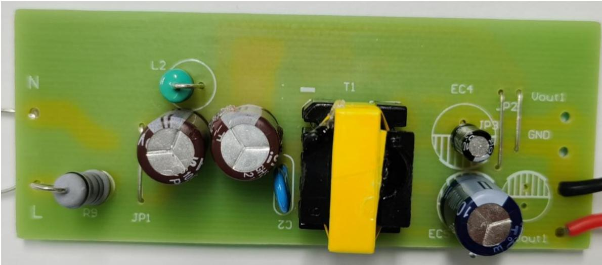

# TOP SIDE

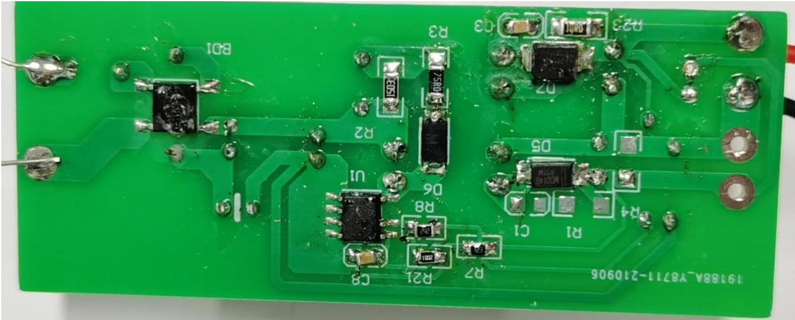

# BOTTOM SIDE

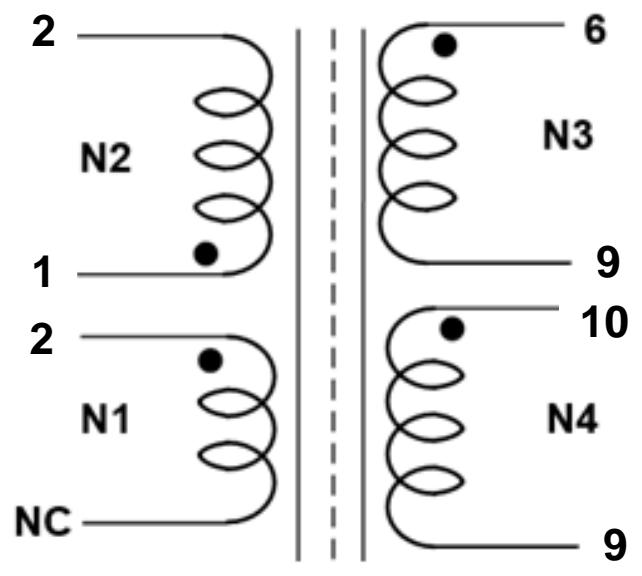

<table><tr><td>序号</td><td>起始脚</td><td>终止脚</td><td>绕制规则</td><td>匝数</td><td>绕线方式</td></tr><tr><td>N1</td><td>2</td><td>NC</td><td>2UEW φ0.15*2P</td><td>22Ts</td><td>密绕一层(PIN脚朝外)</td></tr><tr><td>胶带</td><td></td><td></td><td></td><td>2Ts</td><td></td></tr><tr><td>N2</td><td>1</td><td>2</td><td>2UEW φ0.15*1P</td><td>131Ts</td><td>密绕三层(PIN脚朝外)</td></tr><tr><td>胶带</td><td></td><td></td><td></td><td>2Ts</td><td></td></tr><tr><td>N3</td><td>6</td><td>9</td><td>2UEW φ0.5*1P</td><td>8Ts</td><td>均匀绕一层(PIN脚朝外)</td></tr><tr><td>胶带</td><td></td><td></td><td></td><td>2Ts</td><td></td></tr><tr><td>N4</td><td>10</td><td>9</td><td>2UEW φ0.15*1P</td><td>18Ts</td><td>均匀绕一层(PIN脚朝外)</td></tr><tr><td>胶带</td><td></td><td></td><td></td><td>3Ts</td><td></td></tr></table>

# 规格与材料

➢ 初级绕组感量 $L _ { p } = 2 0 0 0 \cup H \pm 7 \%$ (测试条件：0.3V，100kHz)  
漏感量 $\angle 1 k < 8 0 \mu \ H$   
骨架：EE16底部加高 $( 5 + 5 \mathsf { P } | \mathsf { N } )$   
磁芯：EE16PC40或同等材质， ${ \mathsf { A e } } { = } 1 9 . 2 { \mathsf { m m } } ^ { 2 }$   
》 N1、N2、N3、N4:2UEW漆包线  
绝缘胶带:3M900或同等材质   
成品要求：浸凡立水

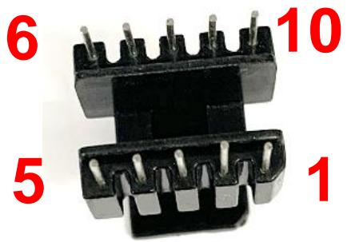

待机功耗   
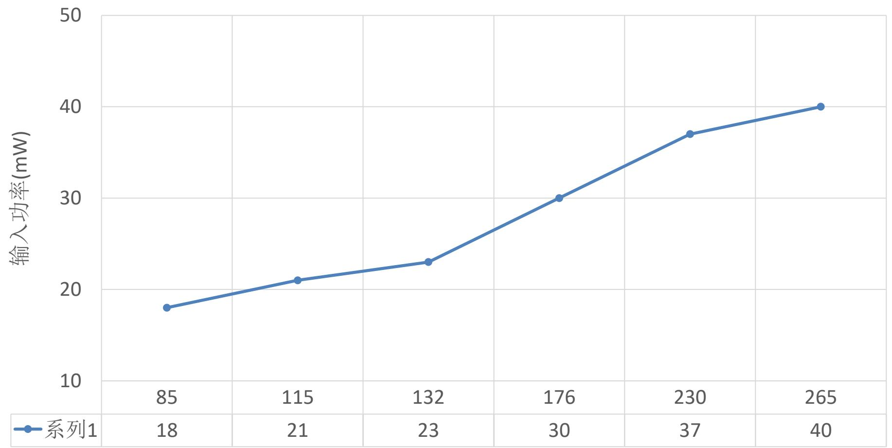

输入电压(Vac)

效率曲线  
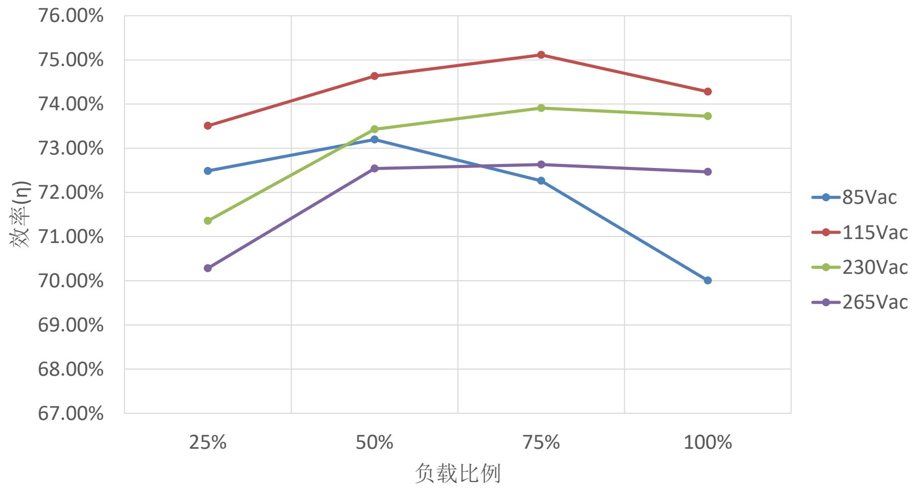

<table><tr><td> $V_{IN}(VAC)$ </td><td>Load(%)</td><td> $P_{IN}(W)$ </td><td> $V_{OUT}(V)$ </td><td>线端</td><td> $I_{OUT}(A)$ </td><td> $P_{OUT}(W)$ </td><td>Eff(%)</td><td>AVG Eff(%)</td></tr><tr><td rowspan="6">85</td><td>空载</td><td></td><td></td><td></td><td></td><td>0</td><td></td><td></td></tr><tr><td>10%</td><td>0.72</td><td>4.9905</td><td></td><td>0.1</td><td>0.49905</td><td>69.31%</td><td></td></tr><tr><td>25%</td><td>1.72</td><td>4.9871</td><td></td><td>0.25</td><td>1.246775</td><td>72.49%</td><td rowspan="4">71.99%</td></tr><tr><td>50%</td><td>3.4</td><td>4.9774</td><td></td><td>0.5</td><td>2.4887</td><td>73.20%</td></tr><tr><td>75%</td><td>5.14</td><td>4.9525</td><td></td><td>0.75</td><td>3.714375</td><td>72.26%</td></tr><tr><td>100%</td><td>7.03</td><td>4.9215</td><td></td><td>1</td><td>4.9215</td><td>70.01%</td></tr><tr><td rowspan="6">115</td><td>空载</td><td></td><td></td><td></td><td></td><td>0</td><td></td><td></td></tr><tr><td>10%</td><td>0.71</td><td>4.9943</td><td></td><td>0.1</td><td>0.49943</td><td>70.34%</td><td></td></tr><tr><td>25%</td><td>1.7</td><td>4.9986</td><td></td><td>0.25</td><td>1.24965</td><td>73.51%</td><td rowspan="4">74.38%</td></tr><tr><td>50%</td><td>3.35</td><td>5.0005</td><td></td><td>0.5</td><td>2.50025</td><td>74.63%</td></tr><tr><td>75%</td><td>4.99</td><td>4.9975</td><td></td><td>0.75</td><td>3.748125</td><td>75.11%</td></tr><tr><td>100%</td><td>6.67</td><td>4.9546</td><td></td><td>1</td><td>4.9546</td><td>74.28%</td></tr><tr><td rowspan="6">230</td><td>空载</td><td></td><td></td><td></td><td></td><td>0</td><td></td><td></td></tr><tr><td>10%</td><td>0.74</td><td>4.9982</td><td></td><td>0.1</td><td>0.49982</td><td>67.54%</td><td></td></tr><tr><td>25%</td><td>1.75</td><td>4.995</td><td></td><td>0.25</td><td>1.24875</td><td>71.36%</td><td rowspan="4">73.11%</td></tr><tr><td>50%</td><td>3.4</td><td>4.9932</td><td></td><td>0.5</td><td>2.4966</td><td>73.43%</td></tr><tr><td>75%</td><td>5.06</td><td>4.9865</td><td></td><td>0.75</td><td>3.739875</td><td>73.91%</td></tr><tr><td>100%</td><td>6.69</td><td>4.9323</td><td></td><td>1</td><td>4.9323</td><td>73.73%</td></tr><tr><td rowspan="6">265</td><td>空载</td><td></td><td></td><td></td><td></td><td>0</td><td></td><td></td></tr><tr><td>10%</td><td>0.76</td><td>5.0021</td><td></td><td>0.1</td><td>0.50021</td><td>65.82%</td><td></td></tr><tr><td>25%</td><td>1.78</td><td>5.0043</td><td></td><td>0.25</td><td>1.251075</td><td>70.29%</td><td rowspan="4">71.98%</td></tr><tr><td>50%</td><td>3.45</td><td>5.0054</td><td></td><td>0.5</td><td>2.5027</td><td>72.54%</td></tr><tr><td>75%</td><td>5.16</td><td>4.997</td><td></td><td>0.75</td><td>3.74775</td><td>72.63%</td></tr><tr><td>100%</td><td>6.8</td><td>4.9277</td><td></td><td>1</td><td>4.9277</td><td>72.47%</td></tr></table>

# 输出电压调整率

<table><tr><td> $V_{IN}(VAC)$  $I_{OUT}(A)$ </td><td>90</td><td>115</td><td>132</td><td>176</td><td>230</td><td>265</td><td>平均值</td><td>线调整率</td></tr><tr><td>0</td><td>5.0135</td><td>5.0138</td><td>5.0142</td><td>5.0143</td><td>5.0143</td><td>5.0144</td><td>5.014</td><td>0.02%</td></tr><tr><td>20%</td><td>5.0172</td><td>5.0176</td><td>5.0173</td><td>5.0182</td><td>5.0185</td><td>5.0192</td><td>5.018</td><td>0.04%</td></tr><tr><td>40%</td><td>5.0204</td><td>5.0196</td><td>5.0194</td><td>5.021</td><td>5.0193</td><td>5.0182</td><td>5.020</td><td>0.06%</td></tr><tr><td>60%</td><td>5.0094</td><td>5.0107</td><td>5.0136</td><td>5.0162</td><td>5.0134</td><td>5.0146</td><td>5.013</td><td>0.14%</td></tr><tr><td>80%</td><td>4.9707</td><td>4.9659</td><td>5.0076</td><td>5.0147</td><td>5.0091</td><td>5.004</td><td>4.995</td><td>0.98%</td></tr><tr><td>100%</td><td>4.9519</td><td>4.9575</td><td>4.9575</td><td>4.9485</td><td>4.9371</td><td>4.935</td><td>4.948</td><td>0.45%</td></tr><tr><td>平均值</td><td>4.997</td><td>4.998</td><td>5.005</td><td>5.005</td><td>5.002</td><td>5.001</td><td></td><td></td></tr><tr><td>负载调整率</td><td>1.37%</td><td>1.24%</td><td>1.24%</td><td>1.45%</td><td>1.64%</td><td>1.68%</td><td></td><td></td></tr></table>

◼ 计算方法：调整率=100%\*(最大值-最小值)/平均值

# 输出电压随芯片温度变化

负载1A条件下测试 

<table><tr><td>序号</td><td>输入电压(VAC)</td><td>芯片温度(°C)</td><td>输出电压(V)</td></tr><tr><td>1</td><td>85</td><td>40.1</td><td>4.9564</td></tr><tr><td>2</td><td>85</td><td>91.2</td><td>4.8533</td></tr><tr><td>3</td><td>115</td><td>75.6</td><td>4.8943</td></tr><tr><td>4</td><td>230</td><td>76.8</td><td>4.8865</td></tr><tr><td>5</td><td>265</td><td>78.7</td><td>4.8762</td></tr></table>

空载条件下测试

<table><tr><td>序号</td><td>输入电压(VAC)</td><td>芯片温度(°C)</td><td>输出电压(V)</td></tr><tr><td>1</td><td>85</td><td>26.4</td><td>5.0052</td></tr><tr><td>2</td><td>85</td><td>33.1</td><td>4.9495</td></tr><tr><td>3</td><td>85</td><td>88.1</td><td>4.9179</td></tr><tr><td>4</td><td>85</td><td>79.4</td><td>4.9377</td></tr><tr><td>5</td><td>85</td><td>73.2</td><td>4.9494</td></tr><tr><td>6</td><td>85</td><td>57.4</td><td>4.9755</td></tr></table>

# 输出电压纹波

20MHz带宽，去掉示波器探头正端夹子和地线环，10uF/50V 0.1uF/50V

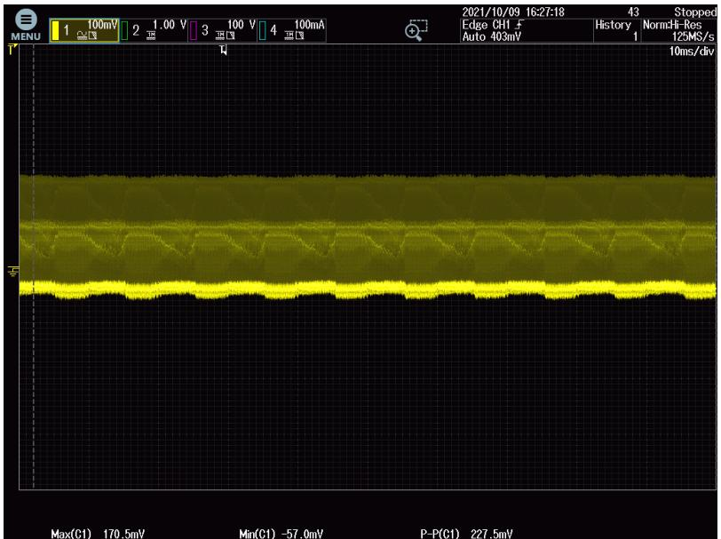

85 VAC   
CH1 VOUT $\mathsf { V } _ { \mathsf { o u r } }$ Ripple $\cdots$ VPK-PK=227.5 mV   
➢ Full Load

Test Condition:

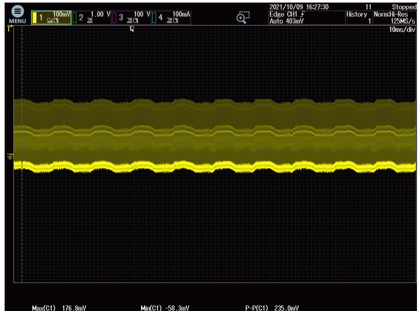

115 VAC   
CH1 VOUT ${ \mathsf { C H 1 } } { \mathsf { V } } _ { \mathsf { O U T } }$ Ripple $\_$   
➢ Full Load

Test Condition:

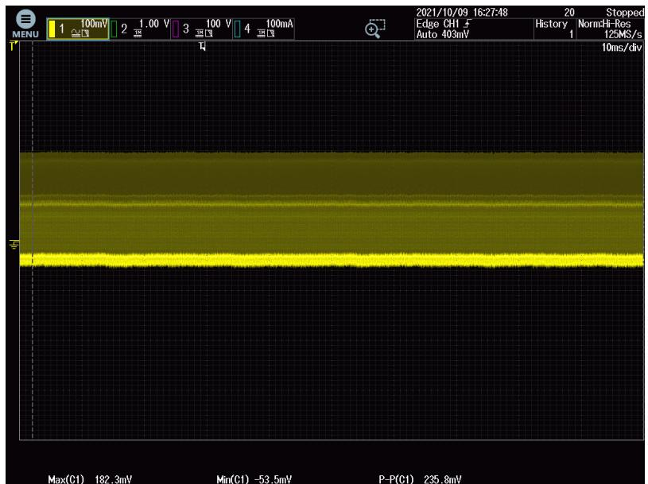

230 VAC   
CH1 VOUT Ripple $\cdots$ VPK-PK=235.8 mV   
➢ Full Load

Test Condition:

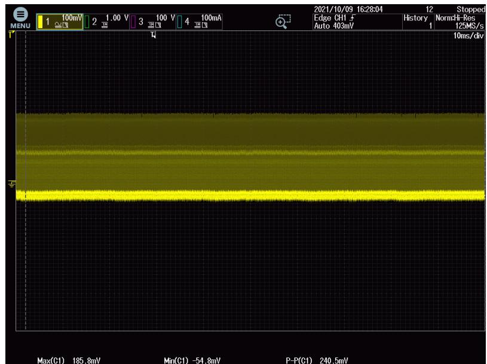

265 VAC   
CH1 VOUT $\begin{array} { l } { \mathsf { C H 1 V _ { o u \intercal } } } \\ { \mathsf { R i p p l e } } \end{array}$ $\dot { }$ VPK-PK=240.5mV $\mathsf { \Lambda } _ { \mathsf { P K } } ^ { \mathsf { P N } } = 2 4 0 . 5 \mathsf { m } \mathsf { v }$   
➢ Full Load

Test Condition:

# (50%-100%)

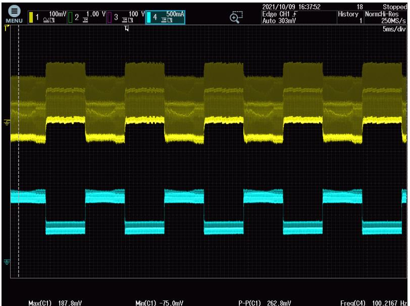

85 VAC

CH1 VOUT $\mathsf { V } _ { \mathsf { O U T } }$ $\mathsf { V } _ { \mathsf { P K - P K } } { = } 2 6 2 . 8 \mathsf { m V }$   
$\mathsf { C H 4 } \mathsf { I } _ { \mathsf { O U T } }$

# Test Condition:

➢ $0 . 5 \mathsf { A } \mathsf { - } 1 \mathsf { A } \mathsf { - } 0 . 5 \mathsf { A }$   
➢ Slew Rate: 0.5 A/μS   
➢ Frequency: 100 Hz

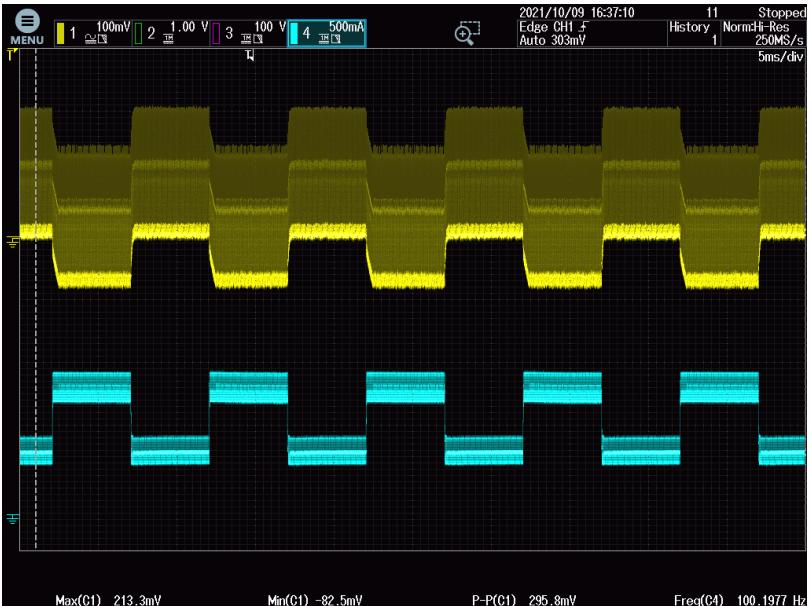

230 VAC

CH1 VOUT $\mathsf { V } _ { \mathsf { O U T } }$ $\_$   
$\mathsf { C H 4 } \mathsf { l } _ { \mathsf { O U T } }$

# Test Condition:

➢ 0.5 A-1 A-0.5 A   
➢ Slew Rate: 0.5 $\mathsf { A } / \mu \mathsf { S }$   
➢ Frequency: 100 Hz

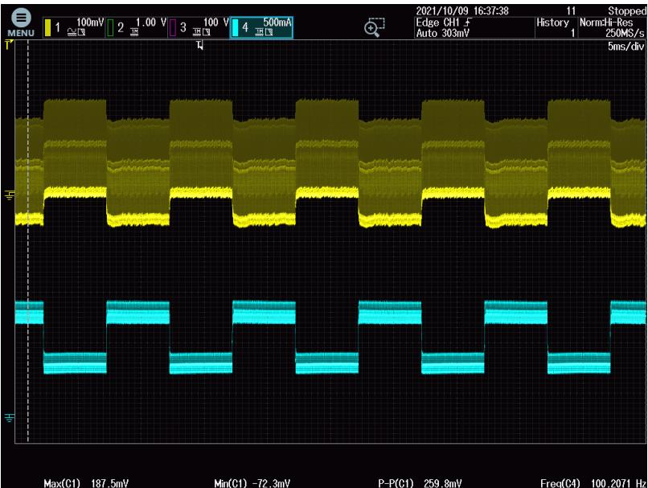

115 VAC

CH1 VOUT ${ \mathsf { C H 1 } } { \mathsf { V } } _ { \mathsf { O U T } }$ VPK-PK=259.8 mV   
$\mathsf { C H 4 } \mathsf { I } _ { \mathsf { O U T } }$

# Test Condition:

➢ $0 . 5 \mathsf { A } \mathsf { - } 1 \mathsf { A } \mathsf { - } 0 . 5 \mathsf { A }$   
➢ Slew Rate: 0.5 A/μS   
➢ Frequency: 100 Hz

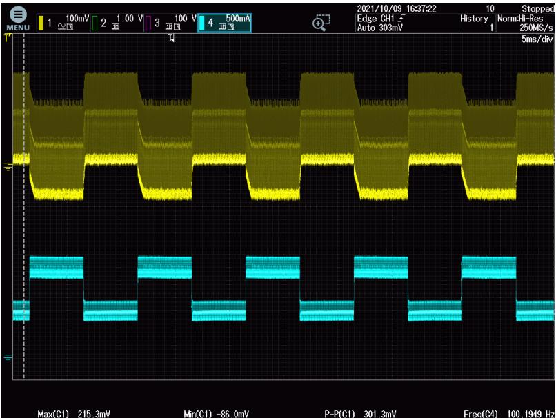

265 VAC

CH1 VOUT ${ \mathsf { C H 1 } } { \mathsf { V } } _ { \mathsf { O U T } }$ VPK-PK=301.3 mV   
$\mathsf { C H 4 } \mathsf { I } _ { \mathsf { O U T } }$

# Test Condition:

➢ $0 . 5 \mathsf { A } \mathsf { - } 1 \mathsf { A } \mathsf { - } 0 . 5 \mathsf { A }$   
➢ Slew Rate: 0.5 A/μS   
➢ Frequency: 100 Hz

# (10%-90%)

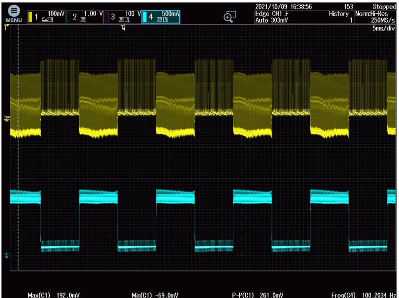

85 VAC

CH1 VOUT $\mathsf { V } _ { \mathsf { O U T } }$ $\_$   
$\mathsf { C H 4 } \mathsf { I } _ { \mathsf { O U T } }$

# Test Condition:

➢ 0.1 A-0.9A-0.1 A   
➢ Slew Rate: 0.5 A/μS   
➢ Frequency: 100 Hz

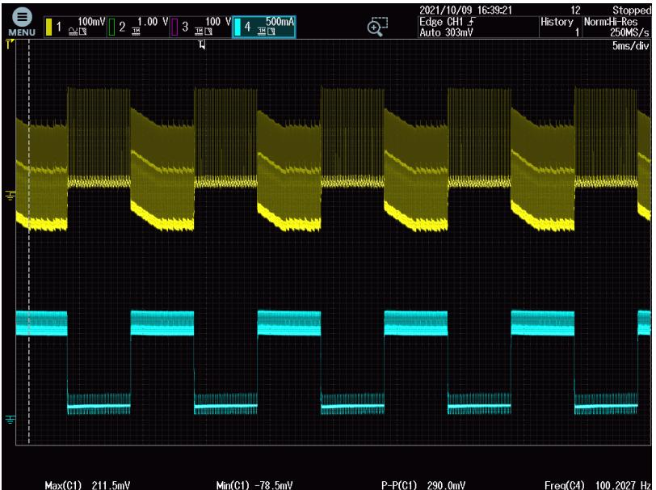

230 VAC

CH1 VOUT $\mathsf { V } _ { \mathsf { O U T } }$ $V _ { \mathsf { P K - P K } } = 2 9 0 \mathsf { m V }$   
$\mathsf { C H 4 } \mathsf { l } _ { \mathsf { O U T } }$

# Test Condition:

➢ $0 . 1 \mathsf { A } \mathsf { - } 0 . 9 \mathsf { A } \mathsf { - } 0 . 1 \mathsf { A }$   
➢ Slew Rate: 0.5 $\mathsf { A } / \mu \mathsf { S }$   
➢ Frequency: 100 Hz

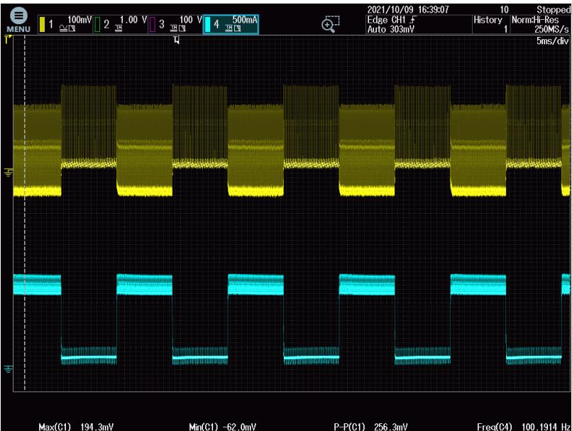

115 VAC

CH1 VOUT $\mathsf { V } _ { \mathsf { O U T } }$ $V _ { P K - P K } = 2 5 6 . 3 m v$   
$\mathsf { C H 4 } \mathsf { I } _ { \mathsf { O U T } }$

# Test Condition:

➢ $0 . 1 \mathsf { A } \mathsf { - } 0 . 9 \mathsf { A } \mathsf { - } 0 . 1 \mathsf { A }$   
➢ Slew Rate: 0.5 A/μS   
➢ Frequency: 100 Hz

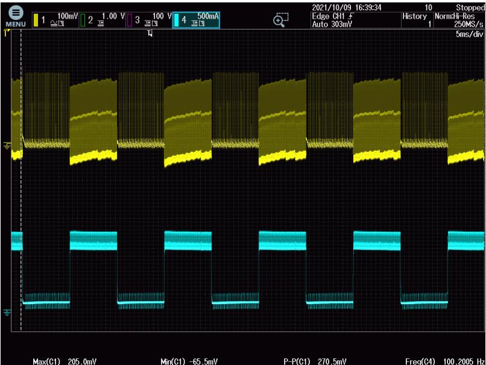

265 VAC

CH1 VOUT $\mathsf { V } _ { \mathsf { O U T } }$ VPK-PK=270.5 mV   
$\mathsf { C H 4 } \mathsf { I } _ { \mathsf { O U T } }$

# Test Condition:

➢ $0 . 1 \mathsf { A } \mathsf { - } 0 . 9 \mathsf { A } \mathsf { - } 0 . 1 \mathsf { A }$   
➢ Slew Rate: 0.5 A/μS   
➢ Frequency: 100 Hz

# 输出电压开机波形

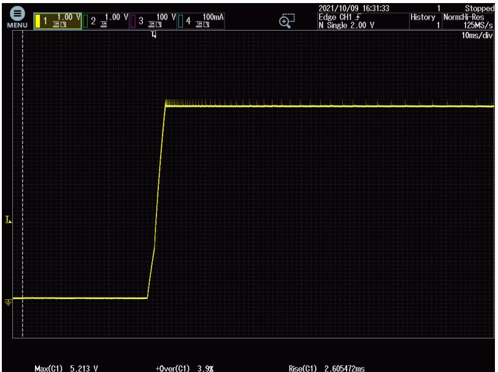

85 VAC   
CH1 VOUT TRISE: 2.6 mS   
➢ No Load

Test Condition:

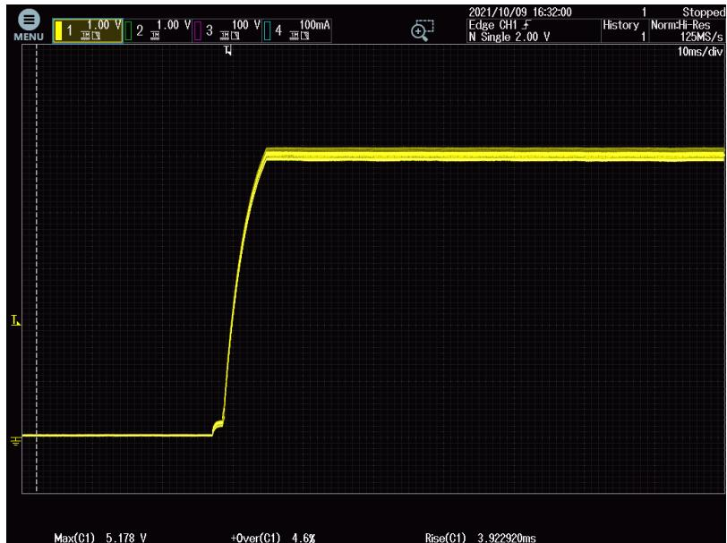

85 VAC   
CH1 VOUT TRISE: 3.9 mS   
➢ Full Load

Test Condition:

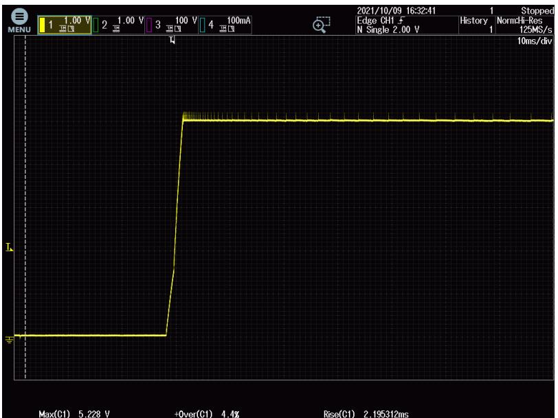

265 VAC   
CH1 VOUT TRISE: 2.2 mS   
➢ No Load

Test Condition:

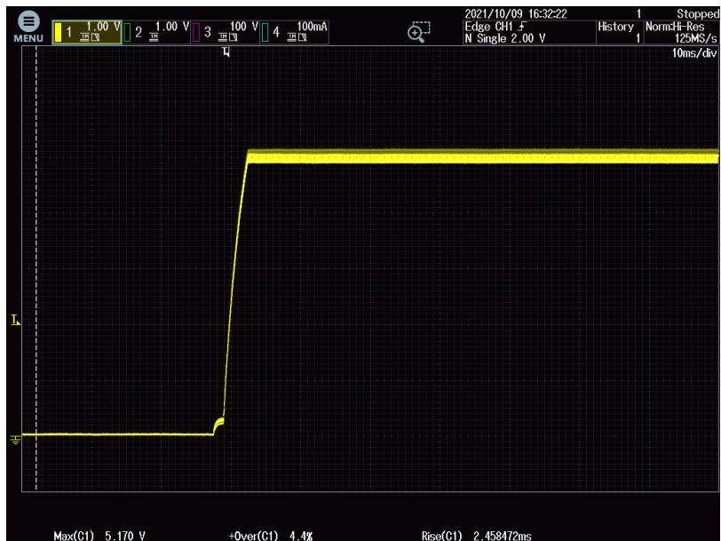

265 VAC   
CH1 VOUT TRISE2.46 mS   
➢ Full Load

Test Condition:

# MOS漏源极电压电流波形 (启机)

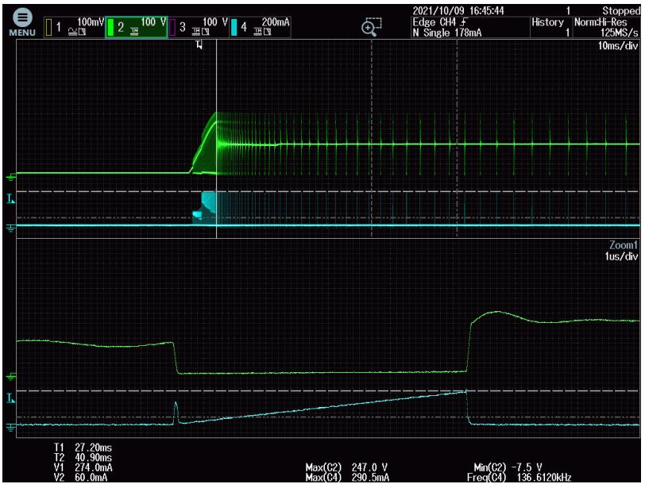

85 VAC

${ \mathsf { C H } } 2 { \mathsf { V } } _ { \mathsf { D S } }$   
$C H 4 1 _ { \mathsf { D } }$ $\cdot$ $\mathsf { I } _ { \mathsf { M A X } } = 2 9 0 . 5 ~ \mathsf { m A }$

Test Condition:   
➢ No Load   
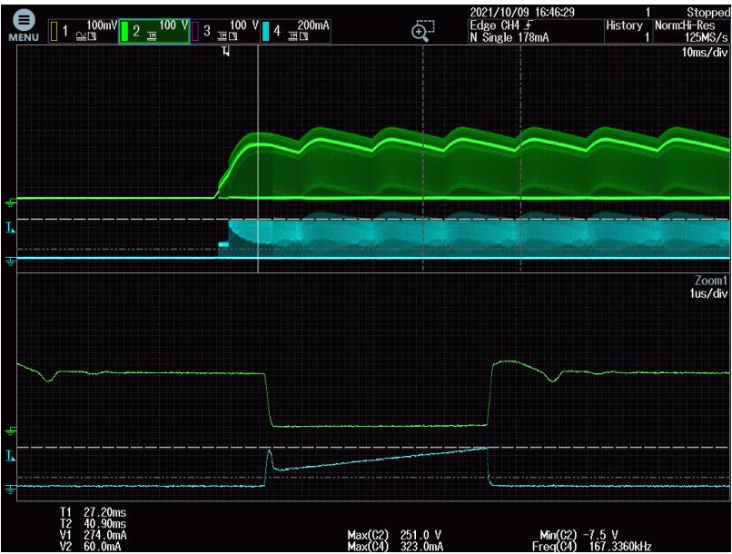

85 VAC

${ \mathsf { C H } } 2 { \mathsf { V } } _ { \mathsf { D S } }$   
$C H 4 1 _ { \mathsf { D } }$ $\mathtt { V } _ { \mathtt { D S } } mathtt { = } 2 5 1 \mathtt { V }$ IMAX= 323 mA $\cdot$

Test Condition:   
➢ Full Load   
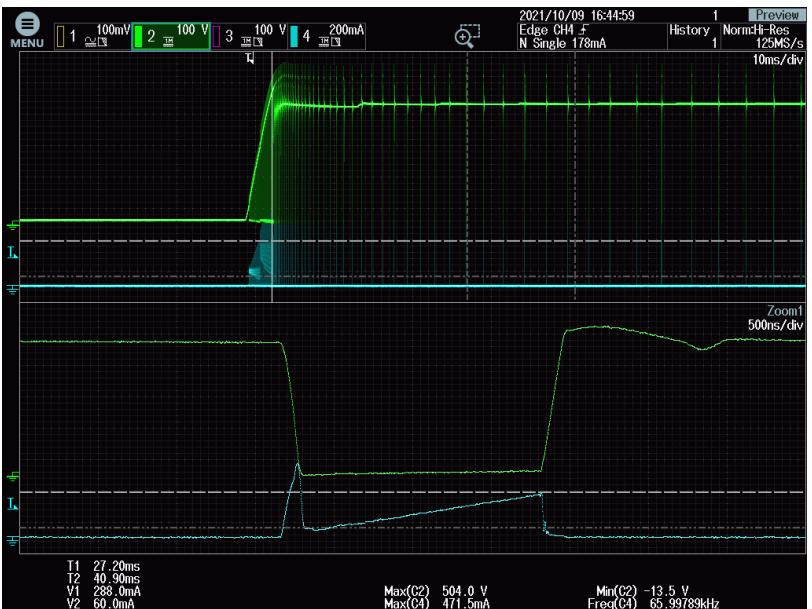

265 VAC

${ \mathsf { C H } } 2 \ { \mathsf { V } } _ { \mathsf { D S } }$   
$C H 4 1 _ { \mathsf { D } }$ $V _ { \mathsf { D S } } { = } 5 0 4 \lor$ IMAX=471.5 $\_$

Test Condition:   
➢ No Load   
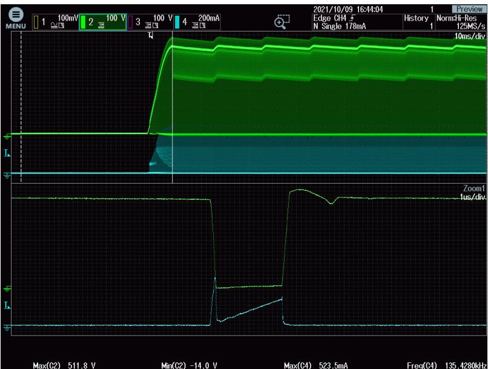

$2 6 5 \ : \mathsf { V } _ { \mathsf { A C } }$

${ \mathsf { C H } } 2 { \mathsf { V } } _ { \mathsf { D S } }$   
$C H 4 1 _ { \mathsf { D } }$ $\cdot$ $\mathsf { I } _ { \mathsf { M A X } } { = } 5 2 3 . 5 \mathsf { m A }$

Test Condition:

➢ Full Load

# MOs漏源极电压电流波形 (正常工作)

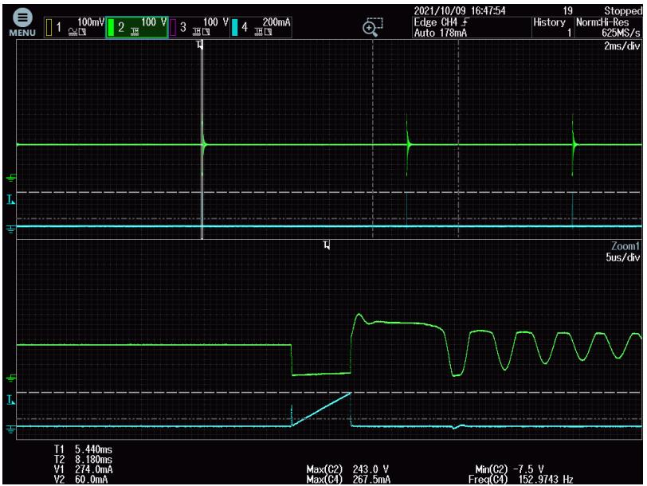

85 VAC

${ \mathsf { C H } } 2 { \mathsf { V } } _ { \mathsf { D S } }$   
$C H 4 1 _ { \mathsf { D } }$ $\cdot$ $\_$

Test Condition:   
➢ No Load   
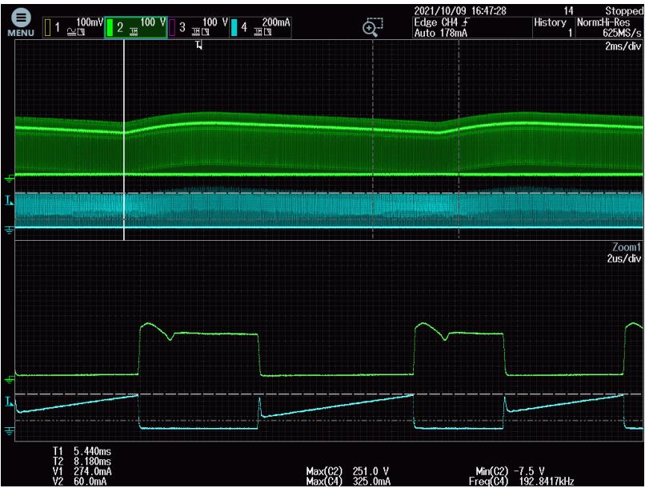

85 VAC

${ \mathsf { C H } } 2 { \mathsf { V } } _ { \mathsf { D S } }$   
$C H 4 1 _ { \mathsf { D } }$ $\cdot$ $1 _ { \mathrm { M A X } } = 3 2 5 ~ \mathrm { m A }$

Test Condition:   
➢ Full Load   
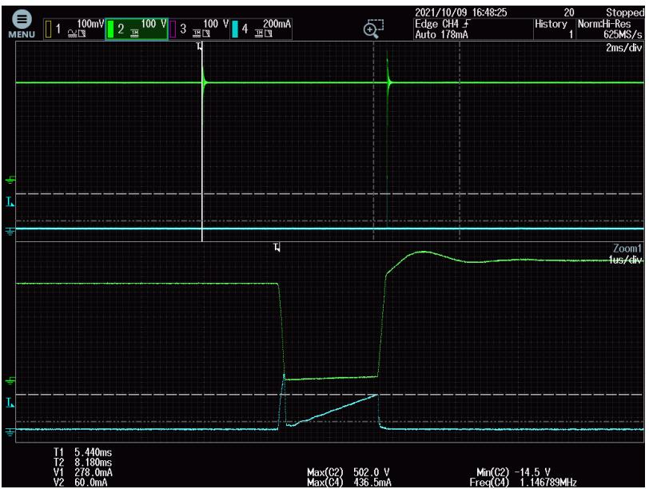

265 VAC

${ \mathsf { C H } } 2 \ { \mathsf { V } } _ { \mathsf { D S } }$   
$C H 4 1 _ { \mathsf { D } }$ $\cdot$ $\mathsf { I } _ { \mathsf { M A X } } { = } 4 3 6 . 5 ~ \mathsf { m A }$

Test Condition:   
➢ No Load   
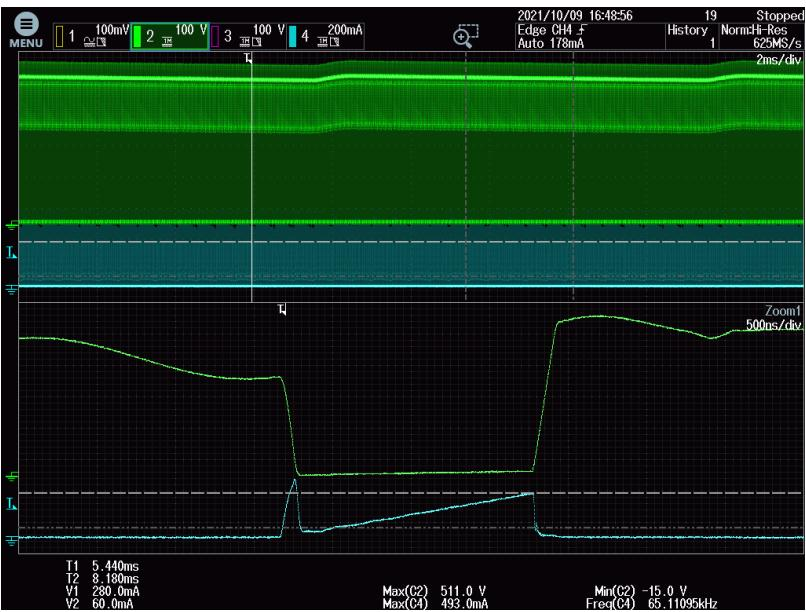

$2 6 5 \ : \mathsf { V } _ { \mathsf { A C } }$

${ \mathsf { C H } } 2 { \mathsf { V } } _ { \mathsf { D S } }$   
$C H 4 1 _ { \mathsf { D } }$ $\mathtt { V } _ { \mathsf { D } \mathsf { S } } mathtt { = } 5 1 1 \mathtt { V }$ IMAX=493 mA $\cdot$

Test Condition:

➢ Full Load

# 输出二极管电压波形

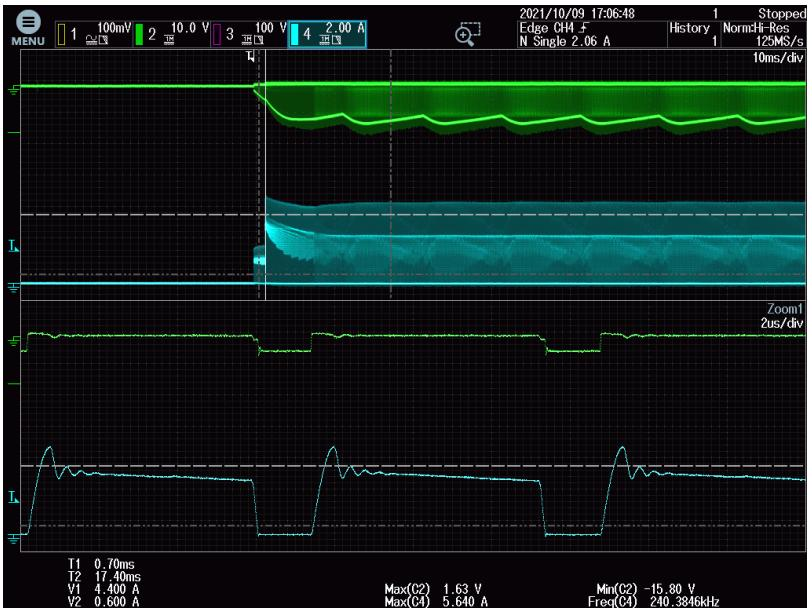

85 VAC

CH2 VD   
$C H 4 1 _ { \mathsf { D } }$ $\cdot$ $\mathsf { I } _ { \mathsf { D m a x } } { = } 5 . 6 4 ~ \mathsf { A }$ Dmax

# Test Condition:

➢ Full Load   
➢ 开机

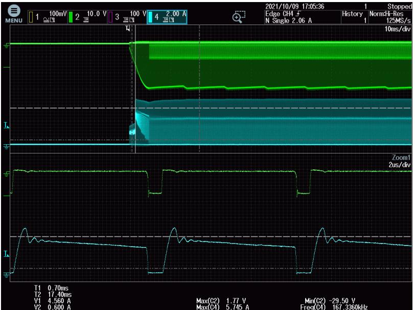

265 VAC

CH2 VD   
CH4 ID $\cdot$ $\mathsf { I } _ { \mathsf { D m a x } } { = } 5 . 7 4 5 \mathrm { ~ A ~ }$ Dmax

# Test Condition:

➢ Full Load   
➢ 开机

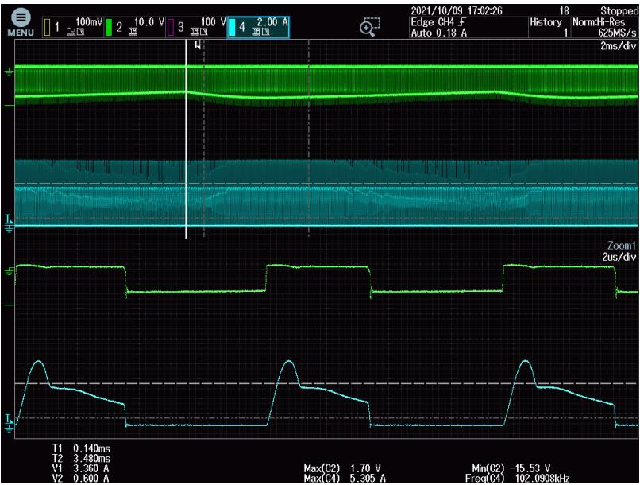

85 VAC

$C H 2 V _ { \mathsf { D } }$   
$C H 4 1 _ { \mathsf { D } }$ $\cdot$ $\mathsf { I } _ { \mathsf { D m a x } } = 5 . 3 0 5 \mathsf { A }$ Dmax

# Test Condition:

➢ Full Load

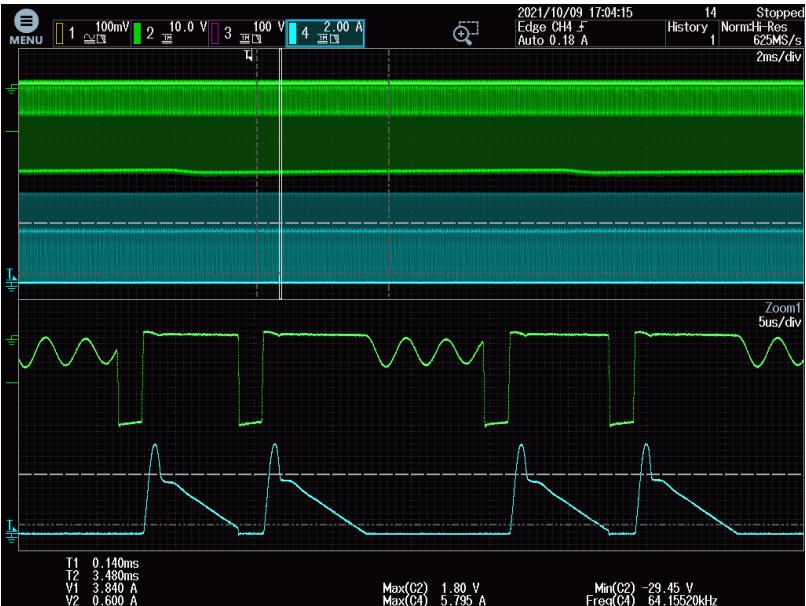

265 VAC

CH2 VD   
CH4 ID $C H 4 1 _ { \mathsf { D } }$ $\cdot$ $\mathsf { I } _ { \mathsf { D m a x } } { = } 5 . 7 9 5 \mathsf { A }$

# Test Condition:

➢ Full Load

# 输出短路时MOs和二极管波形

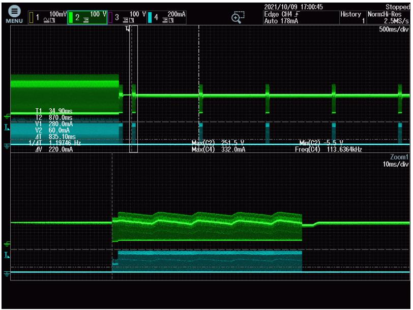

85 VAC

${ \mathsf { C H } } 2 { \mathsf { V } } _ { \mathsf { D S } }$   
CH4 ID $\cdot$

# MOS

# Test Condition:

➢ Full Load

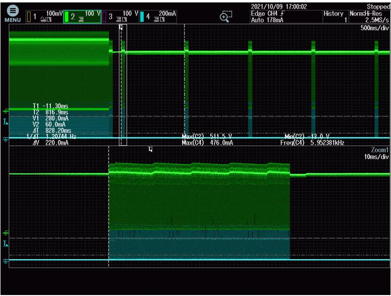

265 VAC

CH2 VDS   
CH4 ID $\begin{array} { r } { \mathsf { V } _ { \mathsf { D S \_ m a x } } = 5 1 1 . 5 \mathsf { V } } \\ { \mathsf { I } _ { \mathsf { D S \_ m a x } } = 4 7 6 \mathsf { m A } } \end{array}$

# MOS

# Test Condition:

➢ Full Load

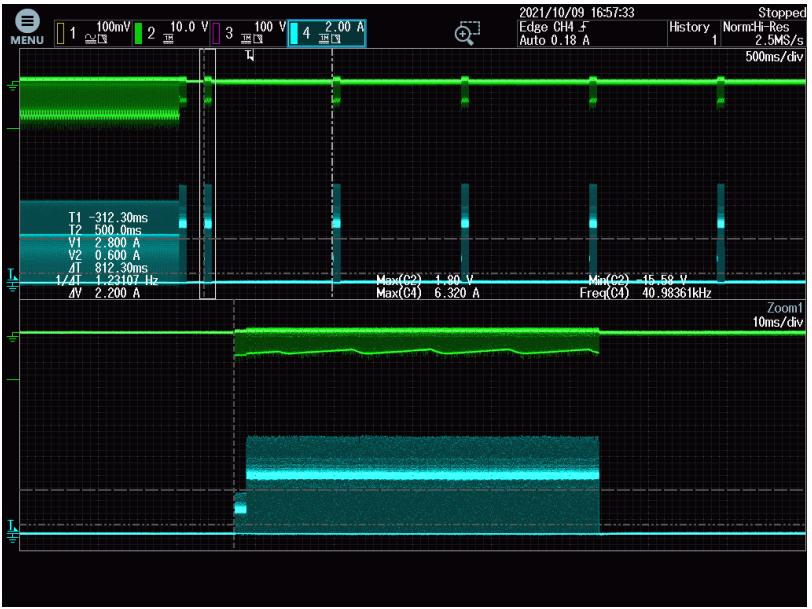  
85 VAC

CH2 VD   
CH4 ID VD=15.58 V Dmax =6.32 A

# Test Condition:

➢ Full Load

# 二极管

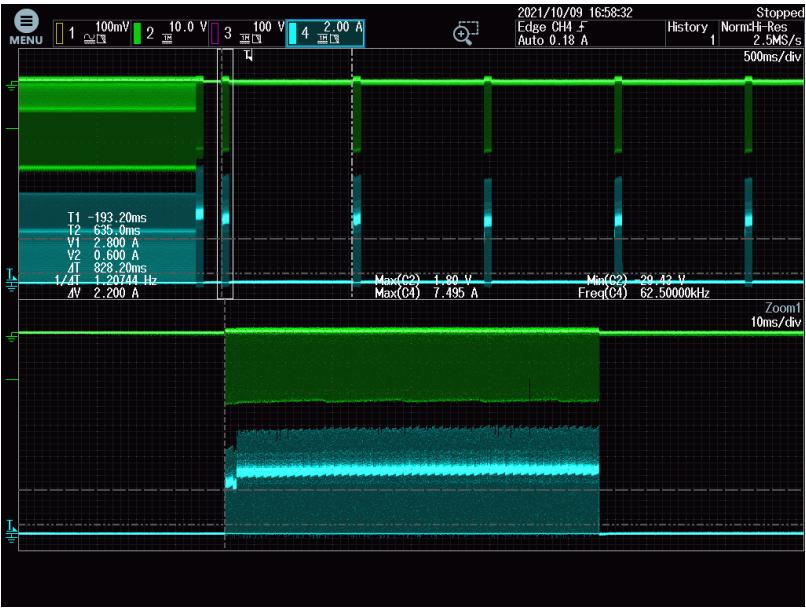

265 VAC

CH2 VD   
CH4 ID VD=29.42 V IDmax=7.495 A

# Test Condition:

➢ Full Load

# 二极管

# 温升测试

<table><tr><td rowspan="2">项目</td><td colspan="4">温度(°C)</td></tr><tr><td>85VAC</td><td>115VAC</td><td>230VAC</td><td>264VAC</td></tr><tr><td>环境温度</td><td>45.3</td><td>44.4</td><td>44.9</td><td>45.1</td></tr><tr><td>BPA8604D (U1)</td><td>91.2</td><td>75.6</td><td>76.8</td><td>78.7</td></tr><tr><td>SB34 (D7)</td><td>81.9</td><td>78.5</td><td>79.8</td><td>80.4</td></tr><tr><td>变压器绕组 (T1)</td><td>75.3</td><td>71.2</td><td>73.1</td><td>73.9</td></tr><tr><td>变压器磁芯 (T1)</td><td>69.9</td><td>66.9</td><td>69.1</td><td>69.9</td></tr><tr><td>输入电解电容(EC2)</td><td>73.5</td><td>64.9</td><td>63.9</td><td>64.2</td></tr><tr><td>输出电解电容(EC5)</td><td>69.5</td><td>68.1</td><td>68.7</td><td>68.9</td></tr><tr><td>整流桥(BD1)</td><td>62.2</td><td>56.1</td><td>52.9</td><td>52.6</td></tr></table>

# 测试说明

➢ 在温箱中进行测试  
➢ 电路板放在一个封闭的盒子内  
➢ 热电偶连接到各个测量点   
➢ 等测量点温度达到稳定后记录数据

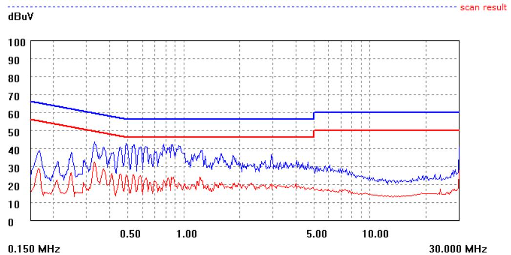

115VAC Line

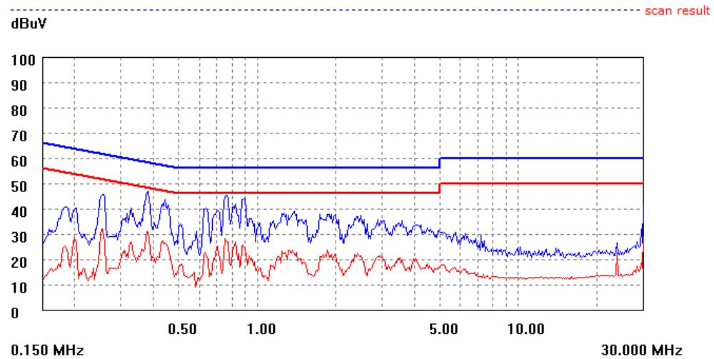

230VAC Line

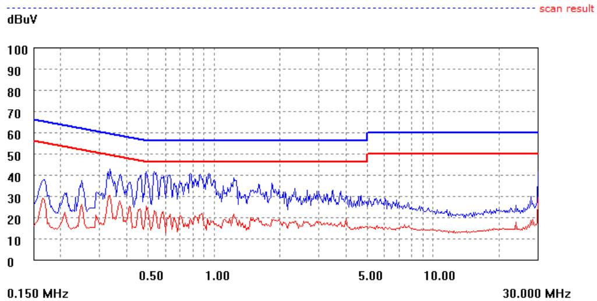

115VAC Neutral

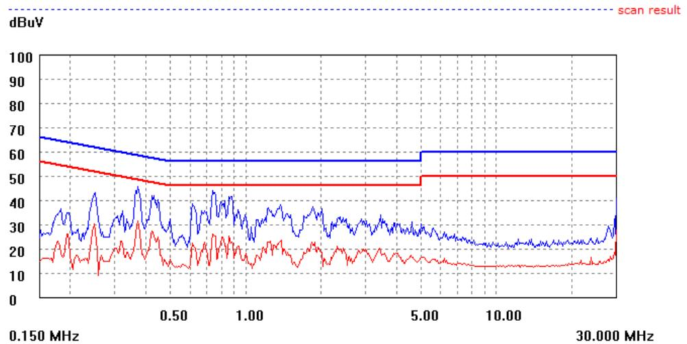

230VAC Neutral

<table><tr><td>差模</td><td>电压</td><td>相位角</td><td>发生器阻抗</td><td>测试次数</td><td>测试结果</td></tr><tr><td>L to N</td><td>+2kV</td><td>0</td><td>2</td><td>10</td><td>Pass</td></tr><tr><td>L to N</td><td>-2kV</td><td>0</td><td>2</td><td>10</td><td>Pass</td></tr><tr><td>L to N</td><td>+2kV</td><td>90</td><td>2</td><td>10</td><td>Pass</td></tr><tr><td>L to N</td><td>-2kV</td><td>90</td><td>2</td><td>10</td><td>Pass</td></tr><tr><td>L to N</td><td>+2kV</td><td>180</td><td>2</td><td>10</td><td>Pass</td></tr><tr><td>L to N</td><td>-2kV</td><td>180</td><td>2</td><td>10</td><td>Pass</td></tr><tr><td>L to N</td><td>+2kV</td><td>270</td><td>2</td><td>10</td><td>Pass</td></tr><tr><td>L to N</td><td>-2kV</td><td>270</td><td>2</td><td>10</td><td>Pass</td></tr></table>

# ◼ 测试说明

➢ 按照GB/T17626.5和IEC61000-4-5的最新版本要求进行测试  
➢ 室温环境，230VAC输入，满载条件  
➢ 输入1.2/50us组合波浪涌电压   
➢ 每个测试点重复10次  
➢ 每次间隔时间1分钟  
➢ 试验时样机输出正常（符合A类标准）视为Pass

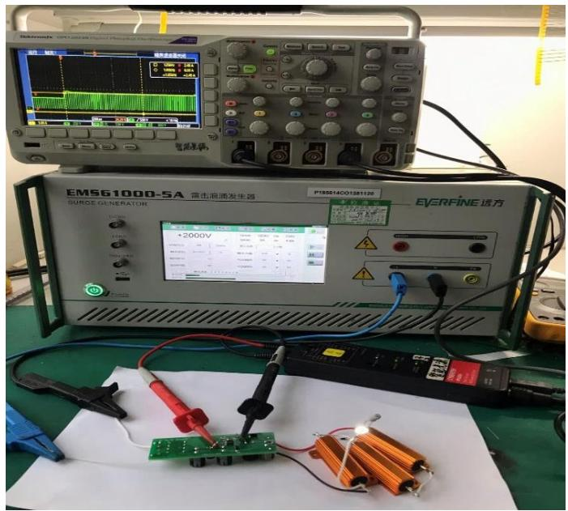

<table><tr><td>测试点</td><td>电压(V)</td><td>放电类型</td><td>放电次数</td><td>测试结果</td></tr><tr><td>Vo</td><td>+15kV</td><td>空气放电</td><td>10</td><td>Pass</td></tr><tr><td>Vo</td><td>-15kV</td><td>空气放电</td><td>10</td><td>Pass</td></tr><tr><td>GND</td><td>+15kV</td><td>空气放电</td><td>10</td><td>Pass</td></tr><tr><td>GND</td><td>-15kV</td><td>空气放电</td><td>10</td><td>Pass</td></tr><tr><td>Vo</td><td>+8kV</td><td>接触放电</td><td>10</td><td>Pass</td></tr><tr><td>Vo</td><td>-8kV</td><td>接触放电</td><td>10</td><td>Pass</td></tr><tr><td>GND</td><td>+8kV</td><td>接触放电</td><td>10</td><td>Pass</td></tr><tr><td>GND</td><td>-8kV</td><td>接触放电</td><td>10</td><td>Pass</td></tr></table>

# 测试说明

➢ 按照GB/T17626.2和IEC61000-4-2的最新版本要求进行测试  
➢ 室温环境，230VAC输入满载条件  
➢ 每个测试点重复10次  
➢ 分别对输出正端和地进行空气放电  
➢ 试验时样机输出正常（符合A类标准）视为Pass

# THANK YOU FOR WATCHING
