## BPA8604D&LNK364D对比测试

## (12V/0.4A@85\~265Vac)

上海晶丰明源半导体股份有限公司

Shanghai Bright Power Semiconductor Co., Ltd.

WHX

时间：2021年8月

## 电气参数对比

<table><tr><td></td><td>BPA8604D</td><td>LNK364D</td></tr><tr><td>开关频率</td><td>132kHz</td><td>132kHz</td></tr><tr><td>Mosfet BV</td><td>700V</td><td>700V</td></tr><tr><td> $R_{DS\_ON}$ </td><td>20ohm</td><td>24ohm</td></tr><tr><td>限流点</td><td>250mA</td><td>250mA</td></tr><tr><td>软启动</td><td>有</td><td>无</td></tr><tr><td>输入过压保护</td><td>无</td><td>无</td></tr><tr><td>输入欠压保护</td><td>无</td><td>无</td></tr><tr><td>输出过压保护</td><td>无</td><td>无</td></tr><tr><td>过载保护</td><td>有</td><td>有</td></tr><tr><td>封装</td><td>SOP-7</td><td>SOP-7</td></tr></table>

## 测试数据对比

电源规格：85\~265Vac输入， 12V/0.4A输出

<table><tr><td colspan="2"></td><td>BPA8604D</td><td>LNK364D</td><td></td></tr><tr><td colspan="2">待机功耗</td><td>33.7mW</td><td>30.6mW</td><td></td></tr><tr><td rowspan="2">效率(满载整机)</td><td>115Vac</td><td>74.9%</td><td>74.6%</td><td></td></tr><tr><td>230Vac</td><td>76.8%</td><td>76.1%</td><td></td></tr><tr><td rowspan="2">输出电压纹波</td><td>85Vac</td><td>132mV</td><td>133mV</td><td></td></tr><tr><td>265Vac</td><td>142mV</td><td>164mV</td><td></td></tr><tr><td rowspan="2">动态负载性能</td><td>50%-100%</td><td> $142mV_{PK\_PK}$ </td><td> $171mV_{PK\_PK}$ </td><td></td></tr><tr><td>10%-90%</td><td> $143mV_{PK\_PK}$ </td><td> $170mV_{PK\_PK}$ </td><td></td></tr><tr><td rowspan="2">MOSFET应力</td><td> $V_{DS}$ </td><td>550V</td><td>550V</td><td></td></tr><tr><td> $I_{DS}$ </td><td>0.489A</td><td>0.338A</td><td></td></tr><tr><td rowspan="2">二极管应力</td><td>VRR</td><td>61.6V</td><td>61.6V</td><td></td></tr><tr><td> $I_{PK}$ </td><td>3.14A</td><td>2.98A</td><td></td></tr><tr><td colspan="2">温升测试(环温28°C)</td><td>103°C</td><td>OTP</td><td></td></tr><tr><td colspan="2">传导EMI</td><td>&gt;6dB裕量</td><td>&gt;6dB裕量</td><td></td></tr><tr><td colspan="2">Surge</td><td>Pass</td><td>Pass</td><td>共模2kV,差模4kV</td></tr><tr><td colspan="2">EFT群脉冲</td><td>Pass</td><td>Pass</td><td>4kV,5kHz/38kHz/100kHz</td></tr><tr><td colspan="2">ESD</td><td>Pass</td><td>Pass</td><td>8kV接触放电/15kV空气放电</td></tr></table>

## 电路及实物图

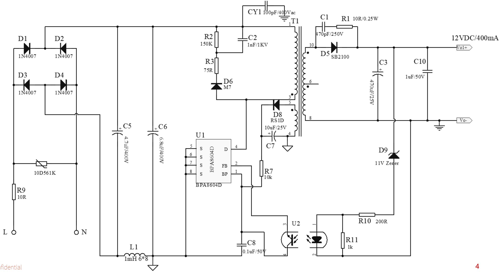

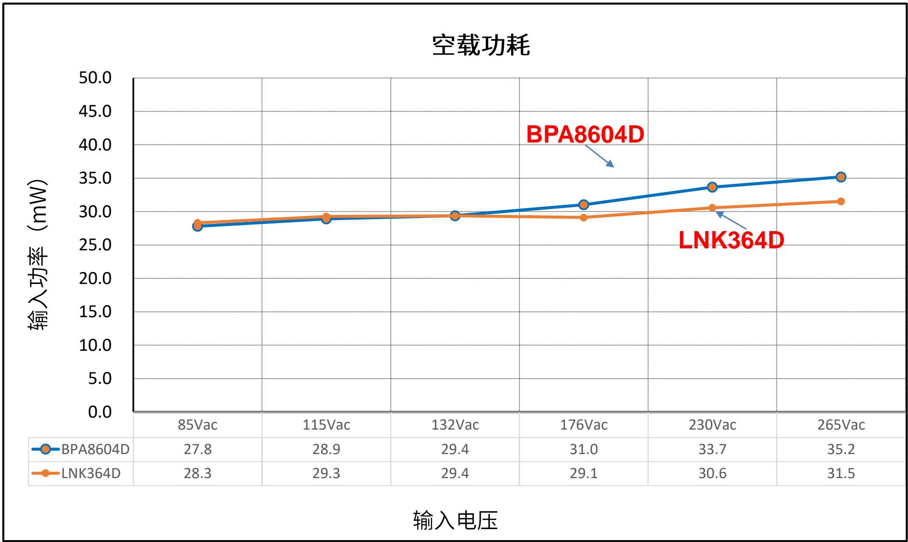

效率曲线  
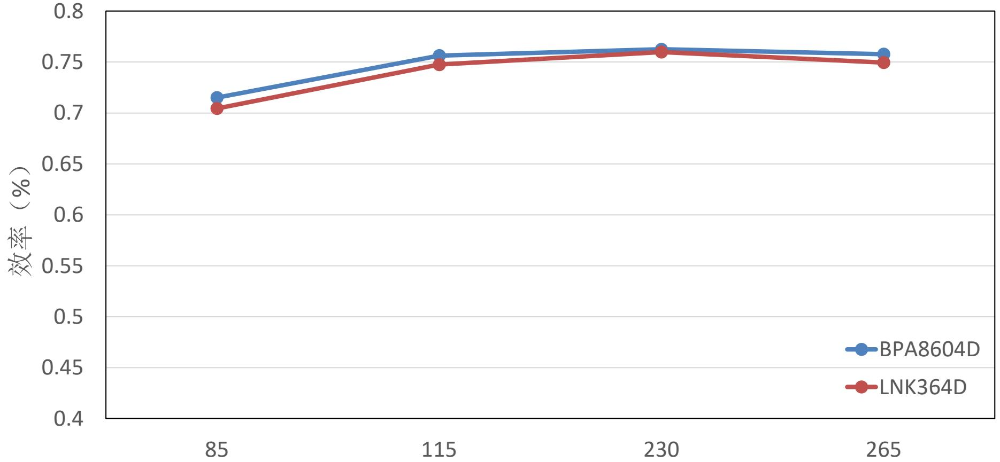

输入电压（VAC）

## 输出电压调整率

BPA8604D

<table><tr><td> $V_{IN}(VAC)$ Load(%)</td><td>85</td><td>115</td><td>132</td><td>176</td><td>230</td><td>265</td><td>平均值</td><td>线调整率</td></tr><tr><td>0</td><td>12.053</td><td>12.051</td><td>12.051</td><td>12.051</td><td>12.055</td><td>12.056</td><td>12.05</td><td>0.04%</td></tr><tr><td>20%</td><td>12.046</td><td>12.048</td><td>12.048</td><td>12.046</td><td>12.050</td><td>12.050</td><td>12.05</td><td>0.03%</td></tr><tr><td>40%</td><td>12.044</td><td>12.044</td><td>12.045</td><td>12.045</td><td>12.046</td><td>12.046</td><td>12.05</td><td>0.02%</td></tr><tr><td>60%</td><td>12.043</td><td>12.043</td><td>12.045</td><td>12.043</td><td>12.044</td><td>12.043</td><td>12.04</td><td>0.02%</td></tr><tr><td>80%</td><td>12.040</td><td>12.043</td><td>12.043</td><td>12.041</td><td>12.043</td><td>12.043</td><td>12.04</td><td>0.02%</td></tr><tr><td>100%</td><td>12.039</td><td>12.041</td><td>12.040</td><td>12.040</td><td>12.040</td><td>12.041</td><td>12.04</td><td>0.02%</td></tr><tr><td>平均值</td><td>12.04</td><td>12.05</td><td>12.05</td><td>12.04</td><td>12.05</td><td>12.05</td><td rowspan="2" colspan="2"></td></tr><tr><td>负载调整率</td><td>0.12%</td><td>0.08%</td><td>0.09%</td><td>0.09%</td><td>0.12%</td><td>0.12%</td></tr></table>

LNK364D

<table><tr><td> $V_{IN}(VAC)$ Load(%)</td><td>85</td><td>115</td><td>132</td><td>176</td><td>230</td><td>265</td><td>平均值</td><td>线调整率</td></tr><tr><td>0</td><td>12.050</td><td>12.051</td><td>12.056</td><td>12.060</td><td>12.058</td><td>12.058</td><td>12.06</td><td>0.08%</td></tr><tr><td>20%</td><td>12.046</td><td>12.044</td><td>12.051</td><td>12.053</td><td>12.051</td><td>12.050</td><td>12.05</td><td>0.07%</td></tr><tr><td>40%</td><td>12.039</td><td>12.041</td><td>12.044</td><td>12.044</td><td>12.040</td><td>12.041</td><td>12.04</td><td>0.04%</td></tr><tr><td>60%</td><td>12.036</td><td>12.038</td><td>12.041</td><td>12.041</td><td>12.-038</td><td>12.038</td><td>12.04</td><td>0.04%</td></tr><tr><td>80%</td><td>12.034</td><td>12.036</td><td>12.036</td><td>12.038</td><td>12.036</td><td>12.035</td><td>12.04</td><td>0.03%</td></tr><tr><td>100%</td><td>12.030</td><td>12.034</td><td>12.031</td><td>12.034</td><td>12.033</td><td>12.033</td><td>12.03</td><td>0.03%</td></tr><tr><td>平均值</td><td>12.04</td><td>12.04</td><td>12.04</td><td>12.05</td><td>12.04</td><td>12.04</td><td rowspan="2" colspan="2"></td></tr><tr><td>负载调整率</td><td>0.17%</td><td>0.14%</td><td>0.21%</td><td>0.22%</td><td>0.21%</td><td>0.21%</td></tr></table>

计算方法：调整率=100%\*(最大值-最小值)/平均值  
测试条件：无假负载

## 输出电压纹波

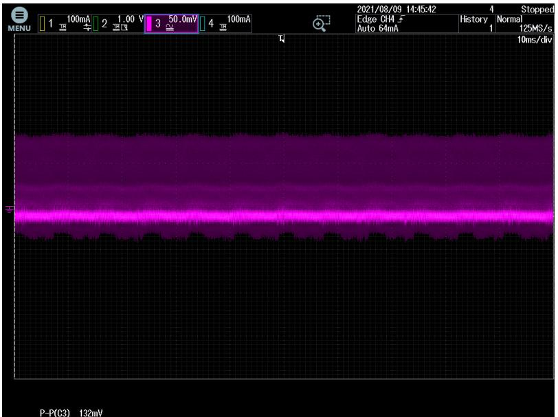

85 VAC

$\begin{array} { l l } { { \pmb { \mathbb { 1 } } } } & { { \mathsf { C H 3 } } { \mathsf { V } } _ { \mathsf { O U T } _ { - 1 2 \vee } } { \mathsf { R i p p l e } } } \\ & { { \mathsf { V } } _ { { \mathsf { P K - P K } } } { \pmb { \mathrm { 1 3 2 m V } } } } \end{array}$

Test Condition:

➢ Full Load

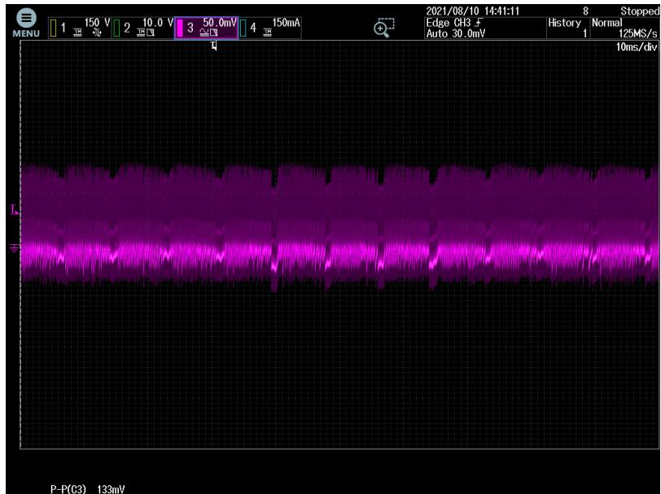

85 VAC

CH3 $\mathsf { V } _ { \mathsf { O U T } \_ 1 2 \mathsf { V } }$ Ripple $\mathsf { V } _ { \mathsf { P K - P K } } { = } \pm 3 3 \mathsf { m V }$

Test Condition:

➢ Full Load

265 VAC

CH3 $\mathsf { V } _ { \mathsf { O U T } \_ 1 2 \mathsf { V } }$ Ripple $V _ { p | k - P K } = \pm 4 2 m v$

Test Condition:

➢ Full Load

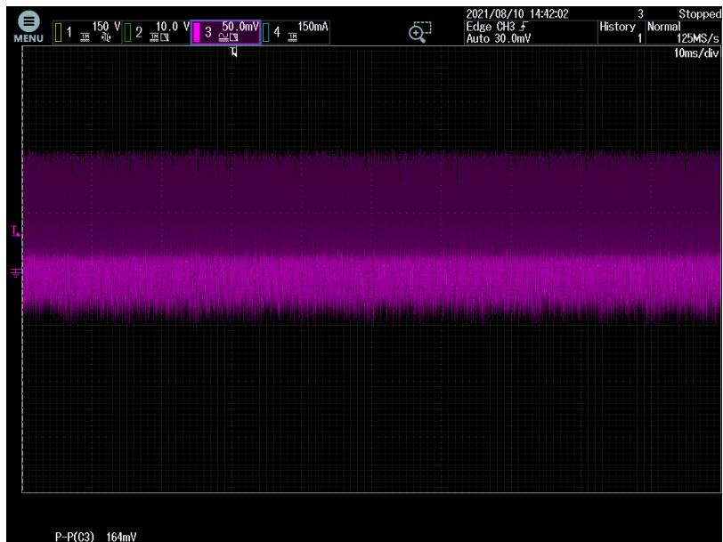

265 VAC

CH3 $\mathsf { V } _ { \mathsf { o u r \_ 1 2 v } }$ Ripple $V _ { p | k - P K } = 1 6 4 m v$

Test Condition:

➢ Full Load

## (50%-100%)

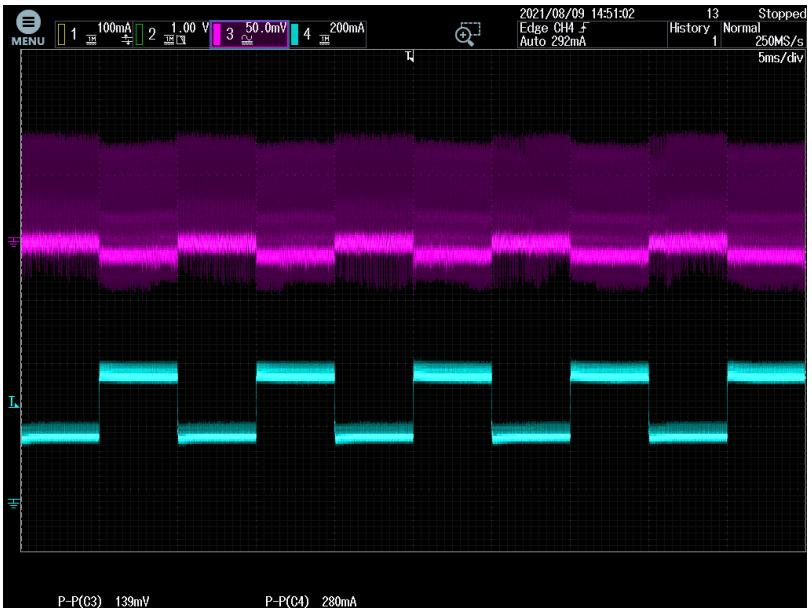

85 VAC

CH3 VOUT\_12V $\mathsf { V } _ { \mathsf { O U T } \_ 1 2 \mathsf { V } }$ $v _ { p _ { k - P K } } { = } 1 3 9 \mathsf { m V }$  
CH4 IOUT\_12V $\mathsf { I } _ { \mathsf { O U T } \_ 1 2 \mathsf { V } }$

## Test Condition:

➢ 0.2A-0.4A-0.2A  
➢ Slew Rate: 0.5 A/μS  
➢ Frequency: 100 Hz

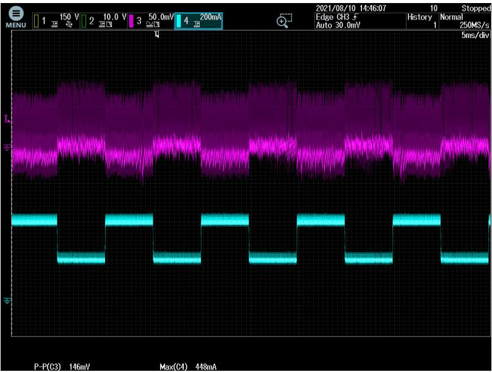

85 VAC

CH3 VOUT\_12V $\mathsf { V } _ { \mathsf { O U T } \_ 1 2 \mathsf { V } }$ $V _ { p | c - P K } = 1 4 6 ~ \mathsf { m V }$  
CH4 IOUT\_12V $\mathsf { C H } 4 \mathsf { I } _ { \mathsf { O U T } _ { - } 1 2 \mathsf { V } }$

## Test Condition:

➢ 0.2A-0.4A-0.2A  
➢ Slew Rate: 0.5 A/μS  
➢ Frequency: 100 Hz

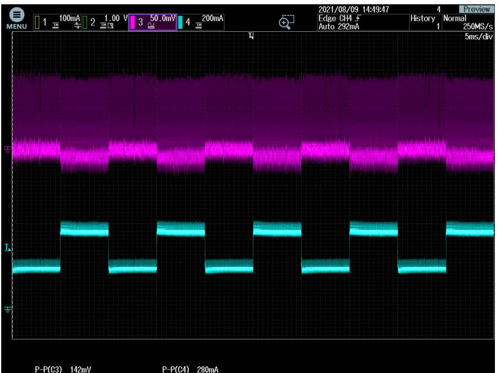

265 VAC

CH3 V $\mathsf { V } _ { \mathsf { O U T } \_ 1 2 \mathsf { V } }$ $V _ { \mathsf { P K - P K } } = 1 4 2 ~ \mathsf { m V }$  
CH4 IOUT\_12V $\mathsf { I } _ { 0 \mathsf { U T } _ { - } 1 2 \mathsf { V } }$

## Test Condition:

➢ 0.2A-0.4A-0.2A  
➢ Slew Rate: 0.5 A/μS  
➢ Frequency: 100 Hz

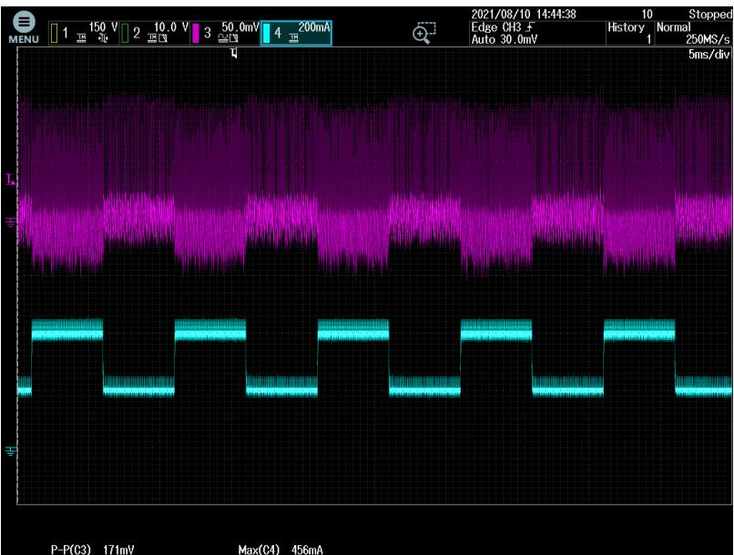

265 VAC

CH3 V $\mathsf { V } _ { \mathsf { o u r \_ 1 2 v } }$ $\mathsf { V } _ { \mathsf { P K - P K } } \mathsf { = } \mathsf { 1 } \bar { 7 } \mathsf { 1 } m v$  
CH4 IOUT\_12V $\mathsf { C H } 4 \mathsf { I } _ { \mathsf { O U T } _ { - } 1 2 \mathsf { V } }$

## Test Condition:

➢ 0.2A-0.4A-0.2A  
➢ Slew Rate: 0.5 A/μS  
➢ Frequency: 100 Hz

## (10%-90%)

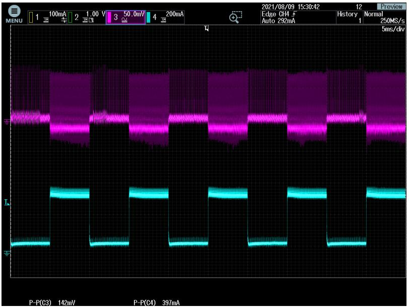

85 VAC

CH3 VOUT\_12V $\mathsf { V } _ { \mathsf { O U T } \_ 1 2 \mathsf { V } }$ $V _ { p | c - P K } = 1 4 2 m v$  
CH4 IOUT\_12V $\mathsf { I } _ { \mathsf { O U T } \_ 1 2 \mathsf { V } }$

## Test Condition:

➢ 0.04A-0.36A-0.04A  
➢ Slew Rate: 0.5 A/μS  
➢ Frequency: 100 Hz

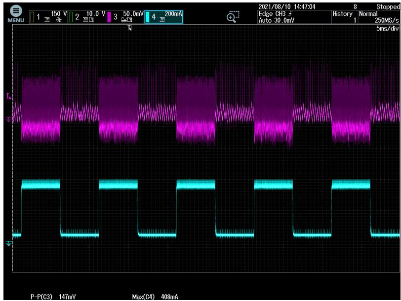

85 VAC

CH3 VOUT\_12V $\mathsf { V } _ { \mathsf { O U T } \_ 1 2 \mathsf { V } }$ $V _ { p | c - P K } = 1 4 7 ~ \mathsf { m V }$  
CH4 IOUT\_12V $\mathsf { C H } 4 \mathsf { I } _ { \mathsf { O U T } _ { - } 1 2 \mathsf { V } }$

## Test Condition:

➢ 0.04A-0.36A-0.04A  
➢ Slew Rate: 0.5 A/μS  
➢ Frequency: 100 Hz

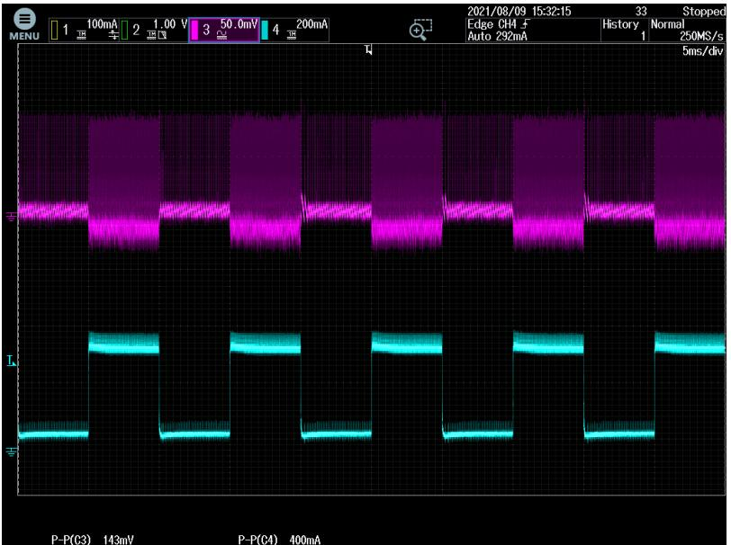

265 VAC

CH3 V $\mathsf { V } _ { \mathsf { O U T } \_ 1 2 \mathsf { V } }$ $V _ { p | c - P K } = 1 4 3 ~ \mathsf { m V }$  
CH4 IOUT\_12V

## Test Condition:

➢ 0.04A-0.36A-0.04A  
➢ Slew Rate: 0.5 A/μS  
➢ Frequency: 100 Hz

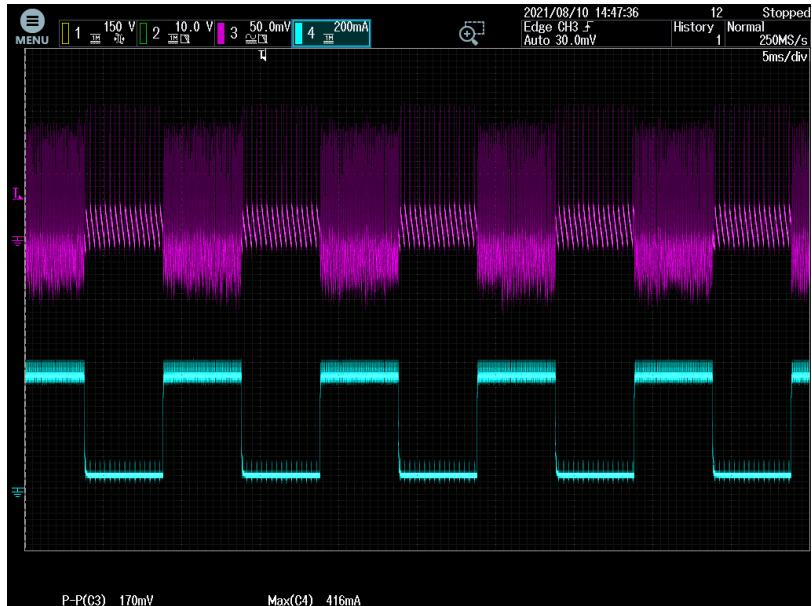

265 VAC

CH3 V $v _ { p _ { \mathrm { K - P K } } } = 1 7 0 \ m v$  
CH4 IOUT\_12V $\mathsf { C H } 4 \mathsf { I } _ { \mathsf { O U T } _ { - } 1 2 \mathsf { V } }$

## Test Condition:

➢ 0.04A-0.36A-0.04A  
➢ Slew Rate: 0.5 A/μS  
➢ Frequency: 100 Hz

## 输出电压开机波形

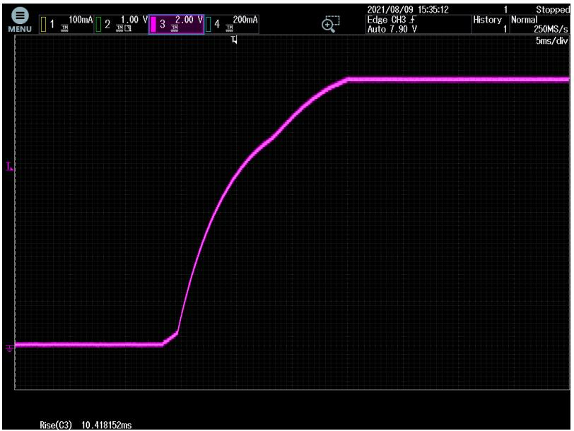

85 VAC  
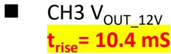  
Test Condition:  
➢ Full Load

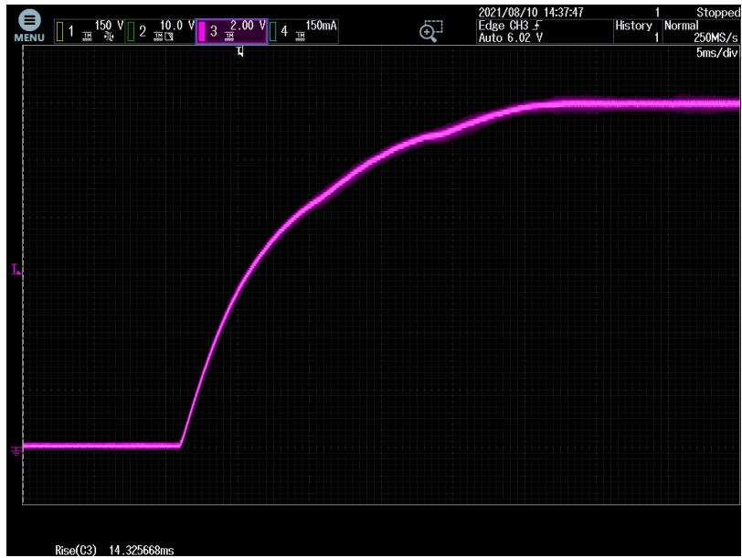

85 VAC  
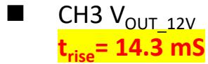  
Test Condition:  
➢ Full Load

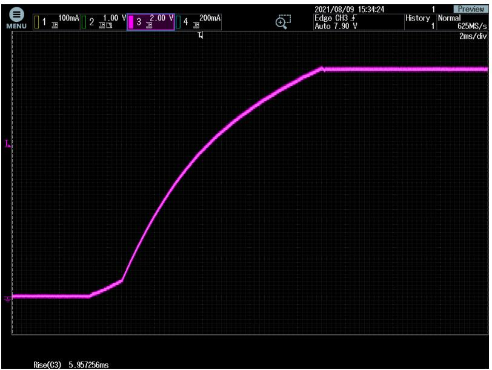

265 VAC  
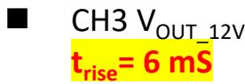  
Test Condition:  
➢ Full Load

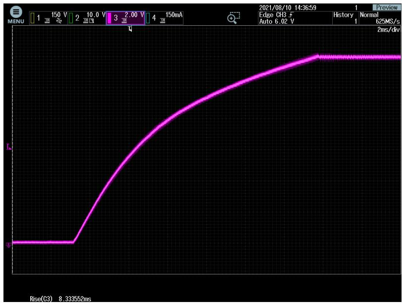

265 VAC  
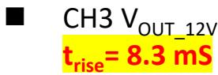  
Test Condition:  
➢ Full Load

## MOSFET

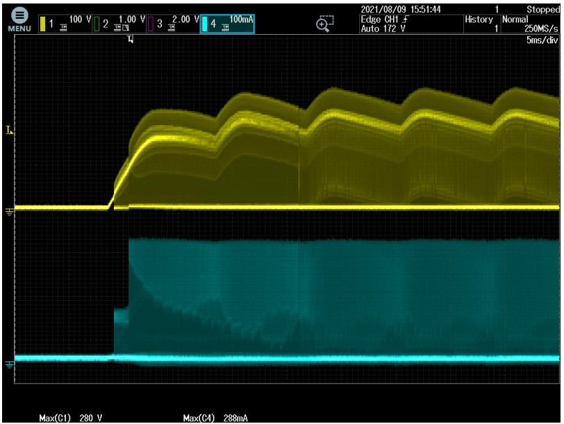

85 VAC

CH1 VDS  
CH4 IDS

$$
\begin{array}{l} \mathrm {V_ {DS\_MAX}} = 2 8 0 \mathrm{V} \\ \mathrm {I_ {DS\_MAX}} = 0. 2 8 8 \mathrm{A} \end{array}
$$

## Test Condition:

➢ Full Load

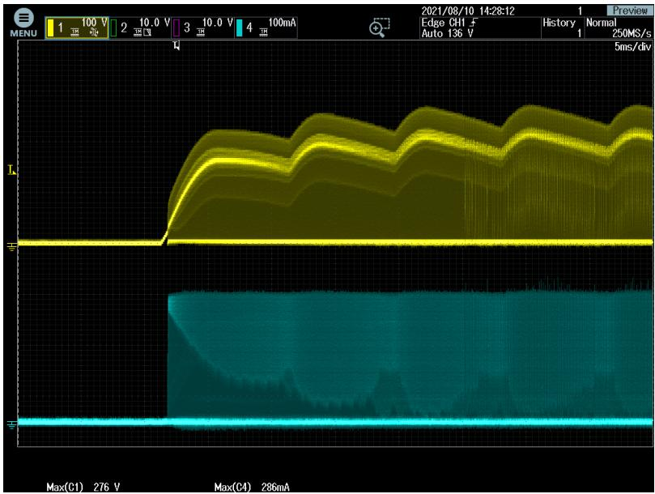

85 VAC

CH1 VDS  
CH4 IDS

$$
\begin{array}{l} \mathrm {V_ {DS\_MAX}} = 2 7 6 \mathrm{V} \\ \mathrm {I_ {DS\_MAX}} = 0. 2 8 6 \mathrm{A} \end{array}
$$

## Test Condition:

➢ Full Load

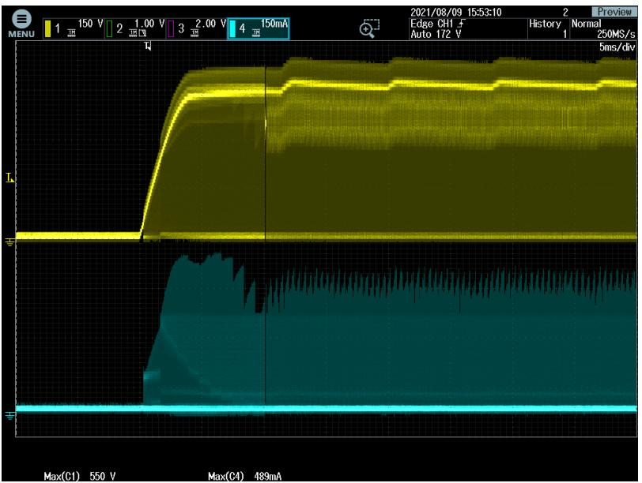

265 VAC

CH1 VDS  
CH4 IDS

$$
\begin{array}{l} \mathrm {V_ {DS\_MAX}} = 5 5 0 \mathrm{V} \\ \mathrm {I_ {DS\_MAX}} = 0. 4 8 9 \mathrm{A} \end{array}
$$

## Test Condition:

➢ Full Load

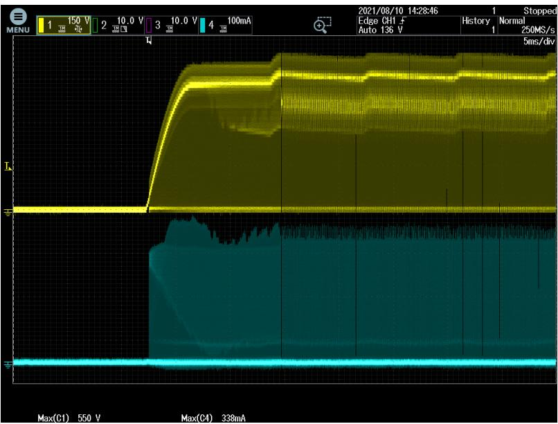

265 VAC

CH1 VDS  
CH3 IDS

$$
\begin{array}{l} V _ {D S \_ M A X} = 5 5 0 V \\ I _ {D S \_ M A X} = 0. 3 3 8 A \end{array}
$$

## Test Condition:

➢ Full Load

## MOSFET

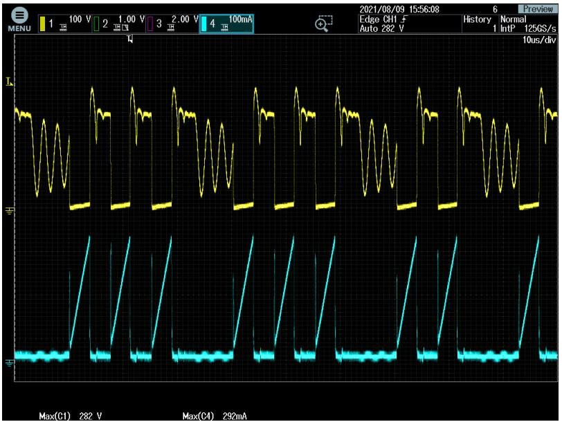

85 VAC

CH1 VDS  
CH4 IDS

$$
\begin{array}{l} \mathrm {V_ {DS\_MAX}} = 2 8 2 \mathrm{V} \\ \mathrm {I_ {DS\_MAX}} = 0. 2 9 2 \mathrm{A} \end{array}
$$

## Test Condition:

➢ Full Load

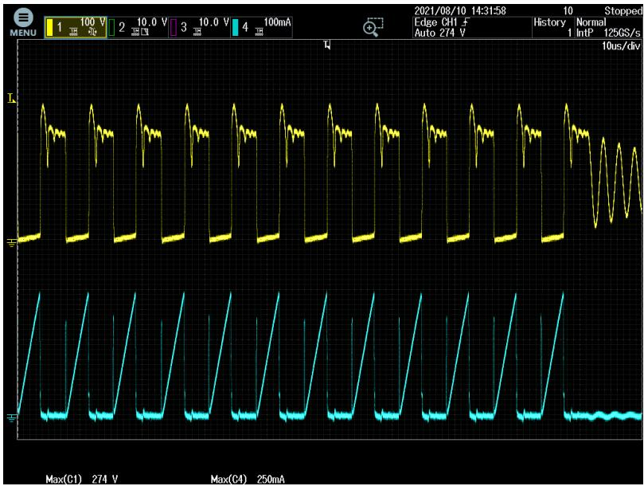

85 VAC

CH1 VDS  
CH4 IDS

$$
\begin{array}{l} V _ {D S \_ M A X} = 2 7 4 V \\ I _ {D S \_ M A X} = 0. 2 5 0 A \end{array}
$$

## Test Condition:

➢ Full Load

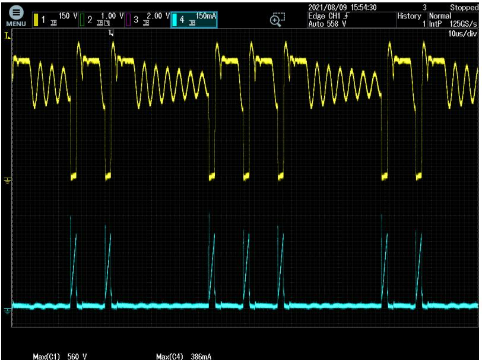

265 VAC

CH1 VDS  
CH4 IDS

$$
\begin{array}{l} \mathrm {V_ {DS\_MAX}} = 5 6 0 \mathrm{V} \\ \mathrm {I_ {DS\_MAX}} = 0. 3 8 6 \mathrm{A} \end{array}
$$

## Test Condition:

➢ Full Load

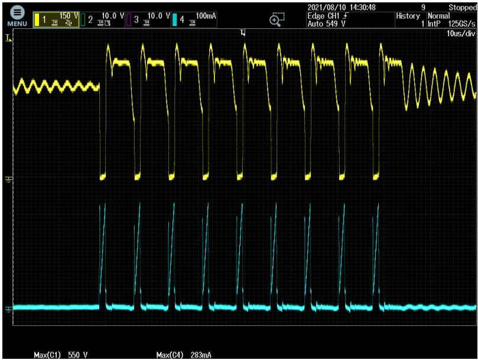

265 VAC

CH1 VDS  
CH4 IDS

$$
\begin{array}{l} V _ {D S \_ M A X} = 5 5 0 V \\ I _ {D S \_ M A X} = 0. 2 8 3 A \end{array}
$$

## Test Condition:

➢ Full Load

## 输出二极管开机波形

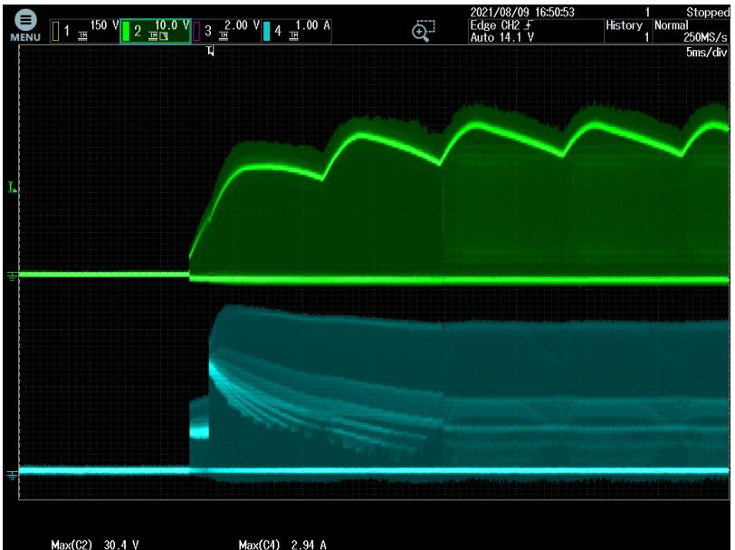

85 VAC

CH2 VR  
CH4 IF

$$
V _ {R \_ M A X} = 3 0. 4 \mathrm{V}
$$

$$
I _ {F \_ M A X} = 2. 9 4 \mathrm{A}
$$

## Test Condition:

➢ Full Load

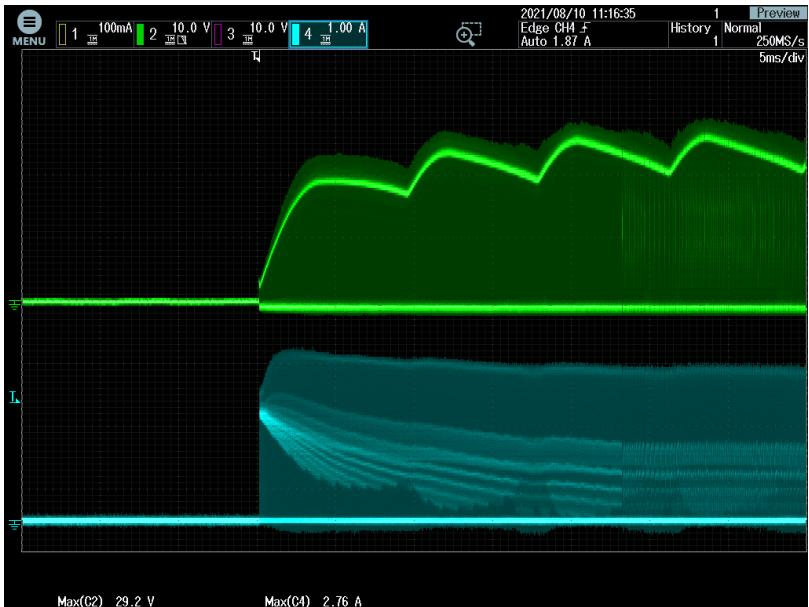

85 VAC

CH2 VR  
CH4 IF

$$
V _ {R \_ M A X} = 2 9. 2 \mathrm{V}
$$

$$
I _ {F \_ M A X} = 2. 7 6 \mathrm{A}
$$

## Test Condition:

➢ Full Load

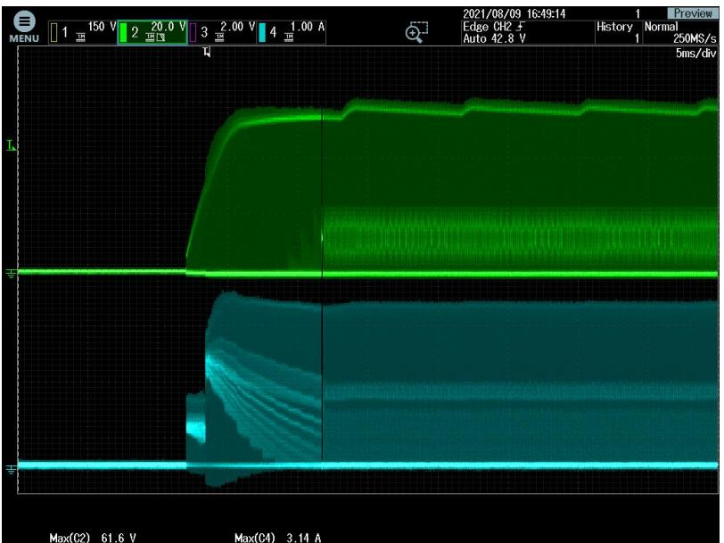

265 VAC

CH2 VR  
CH4 IF

$$
V _ {R \_ M A X} = 6 1. 6 \mathrm{V}
$$

$$
I _ {F \_ M A X} = 3. 1 4 \mathrm{A}
$$

## Test Condition:

➢ Full Load

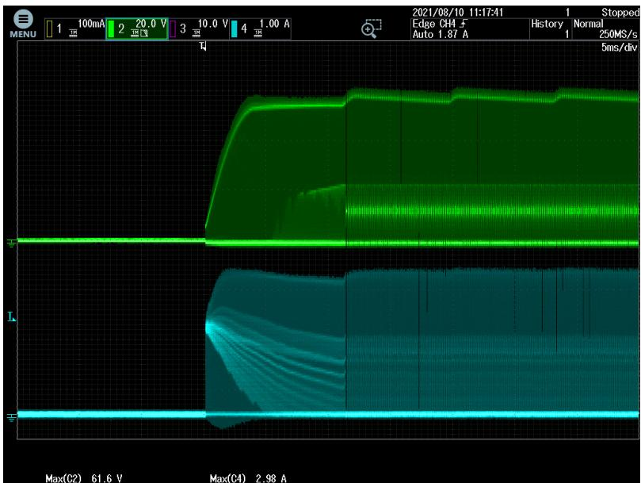  
265 VAC

CH2 VR  
CH4 IF

$$
V _ {R \_ M A X} = 6 1. 6 \mathrm{V}
$$

$$
I _ {F \_ M A X} = 2. 9 8 \mathrm{A}
$$

## Test Condition:

➢ Full Load

## 输出二极管稳态波形

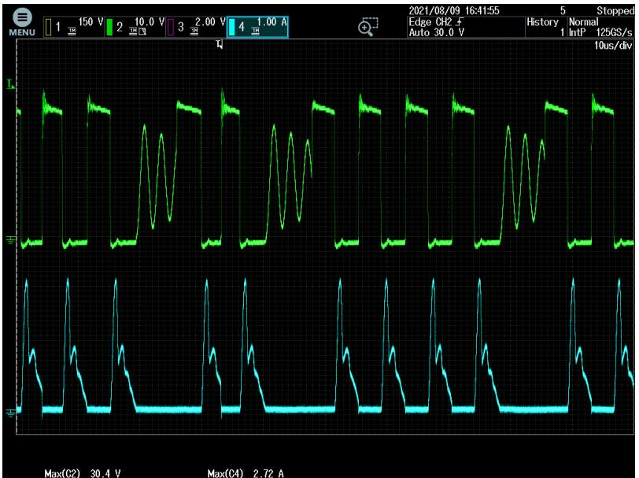

85 VAC

CH2 VR  
CH4 IF

$$
\begin{array}{l} \mathrm {V_ {R\_MAX}} = 3 0. 4 \mathrm{V} \\ \mathrm {I_ {F\_MAX}} = 2. 7 2 \mathrm{A} \end{array}
$$

## Test Condition:

➢ Full Load

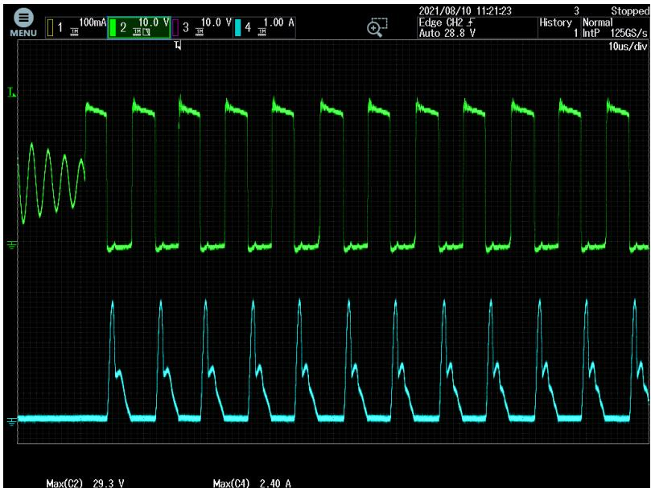

85 VAC

CH2 VR  
CH4 IF

$$
\begin{array}{l} \mathrm {V_ {R\_MAX}} = 2 9. 3 \mathrm{V} \\ \mathrm {I_ {F\_MAX}} = 2. 4 \mathrm{A} \end{array}
$$

## Test Condition:

➢ Full Load

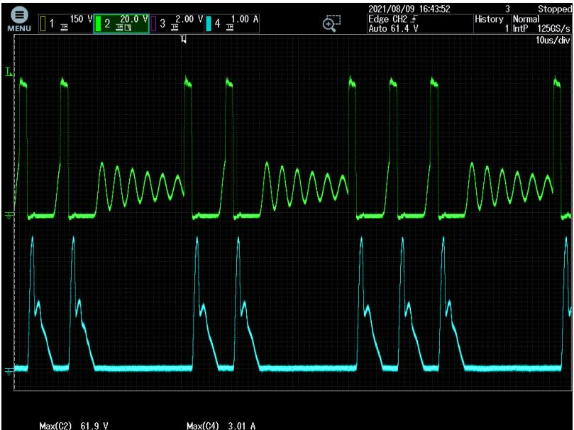

265 VAC

CH2 VR  
CH4 IF

$$
\begin{array}{l} \mathrm {V_ {R\_MAX}} = 6 1. 9 \mathrm{V} \\ \mathrm {I_ {F\_MAX}} = 3. 0 1 \mathrm{A} \end{array}
$$

## Test Condition:

➢ Full Load

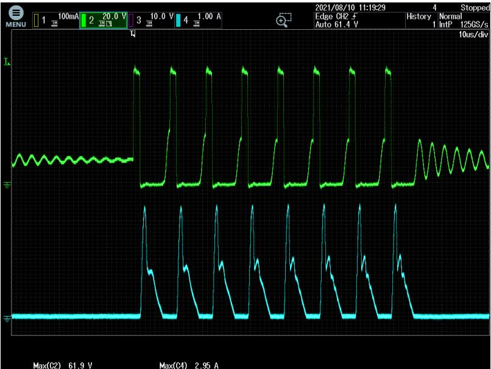

265 VAC

CH2 VR  
CH4 IF

$$
\begin{array}{l} \mathrm {V_ {R\_MAX}} = 6 1. 9 \mathrm{V} \\ \mathrm {I_ {F\_MAX}} = 2. 9 5 \mathrm{A} \end{array}
$$

## Test Condition:

➢ Full Load

## MOSFET

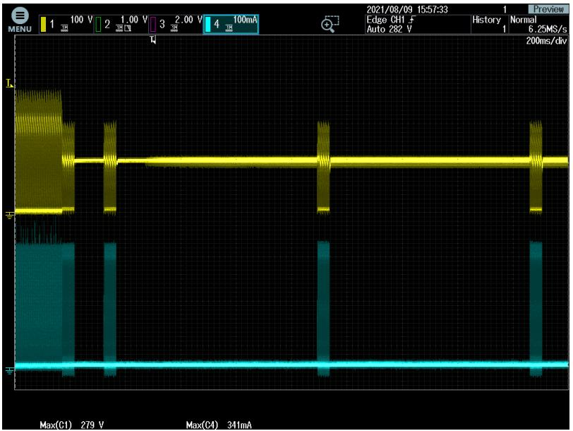

85 VAC

CH1 VDS  
CH4 IDS

$$
\begin{array}{l} \mathrm {V_ {DS\_MAX}} = 2 7 9 \mathrm{V} \\ \mathrm {I_ {DS\_MAX}} = 0. 3 4 1 \mathrm{A} \end{array}
$$

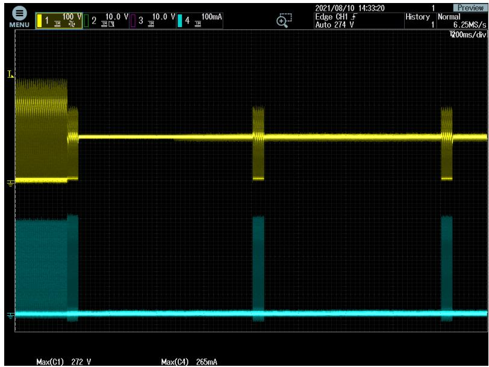

85 VAC

CH1 VDS  
CH4 IDS

$$
\begin{array}{l} \mathrm {V_ {DS\_MAX}} = 2 7 2 \mathrm{V} \\ \mathrm {I_ {DS\_MAX}} = 0. 2 6 5 \mathrm{A} \end{array}
$$

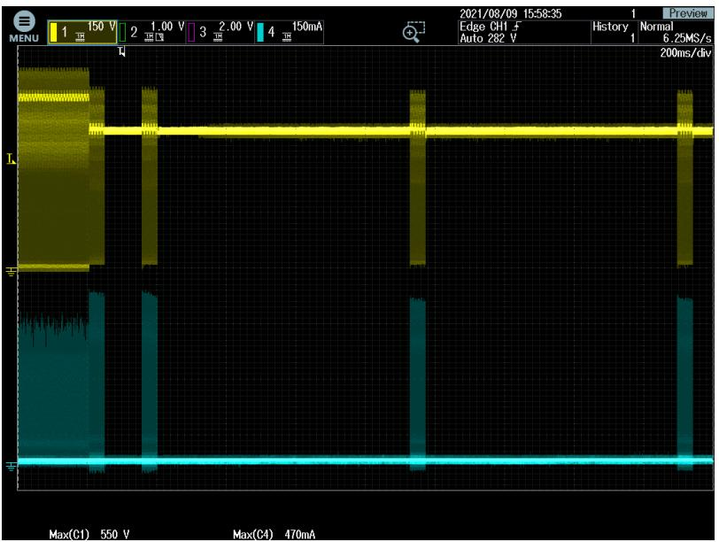

265 VAC

CH1 VDS  
CH4 IDS

$$
V _ {D S \_ M A X} = 5 5 0 \mathrm{V}
$$

$$
I _ {D S \_ M A X} = 0. 4 7 \mathrm{A}
$$

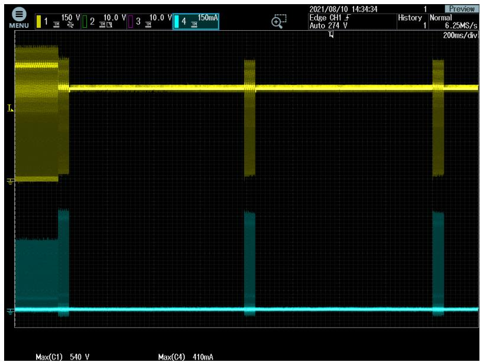

265 VAC

CH1 VDS  
CH3 IDS

$$
\begin{array}{l} \mathrm {V_ {DS\_MAX}} = 5 4 0 \mathrm{V} \\ \mathrm {I_ {DS\_MAX}} = 0. 4 1 \mathrm{A} \end{array}
$$

## 温升测试

BPA8604D

<table><tr><td rowspan="2">项目</td><td>85VAC</td><td>115VAC</td><td>230VAC</td><td>265VAC</td></tr><tr><td>温度(°C)</td><td>温度(°C)</td><td>温度(°C)</td><td>温度(°C)</td></tr><tr><td>环境温度</td><td>30.04</td><td>29.46</td><td>29.16</td><td>29.17</td></tr><tr><td>BPA8604P (U2)</td><td>103.2</td><td>72.93</td><td>90.48</td><td>97.34</td></tr><tr><td>变压器绕组(T1)</td><td>52.84</td><td>51.06</td><td>53.55</td><td>54.47</td></tr><tr><td>变压器磁芯(T1)</td><td>48.45</td><td>47.32</td><td>49.62</td><td>50.37</td></tr><tr><td>整流二极管(D3)</td><td>52.93</td><td>52</td><td>52.84</td><td>53.27</td></tr><tr><td>整流桥(D1)</td><td>45.51</td><td>40.51</td><td>38.83</td><td>39.12</td></tr><tr><td>输入电解电容(C6)</td><td>48.49</td><td>44.02</td><td>43.77</td><td>44.33</td></tr><tr><td>输出电解电容(C3)</td><td>39.35</td><td>38.66</td><td>39.16</td><td>39.34</td></tr></table>

LNK364D

<table><tr><td rowspan="2">项目</td><td>85VAC</td><td>115VAC</td><td>230VAC</td><td>265VAC</td></tr><tr><td>温度(°C)</td><td>温度(°C)</td><td>温度(°C)</td><td>温度(°C)</td></tr><tr><td>环境温度</td><td></td><td>30.19</td><td>30.1</td><td>30.15</td></tr><tr><td>LNK364P (U2)</td><td>OTP</td><td>68.42</td><td>86.48</td><td>92.21</td></tr><tr><td>变压器绕组(T1)</td><td></td><td>49.89</td><td>52.28</td><td>53.02</td></tr><tr><td>变压器磁芯(T1)</td><td></td><td>47.91</td><td>50.18</td><td>50.83</td></tr><tr><td>整流二极管(D3)</td><td></td><td>51.25</td><td>52.13</td><td>52.35</td></tr><tr><td>整流桥(D1)</td><td></td><td>37.94</td><td>36.37</td><td>36.32</td></tr><tr><td>输入电解电容(C6)</td><td></td><td>42.56</td><td>42.56</td><td>42.87</td></tr><tr><td>输出电解电容(C3)</td><td></td><td>38</td><td>38.46</td><td>38.57</td></tr></table>

备注：增大芯片Source散热铜箔面积可以降低芯片温度。

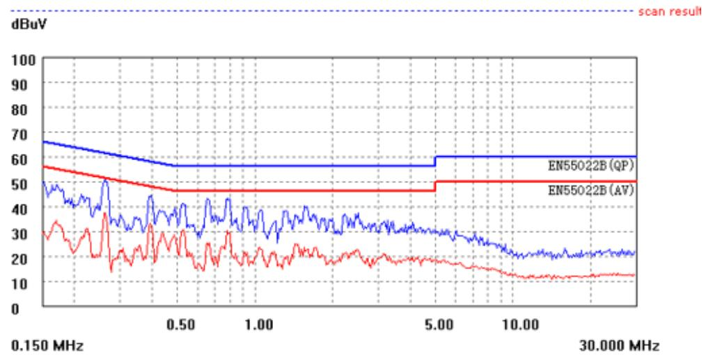

115Vac Line  
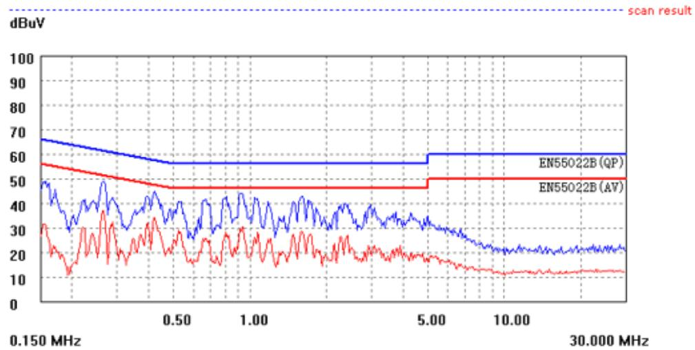

230Vac Line

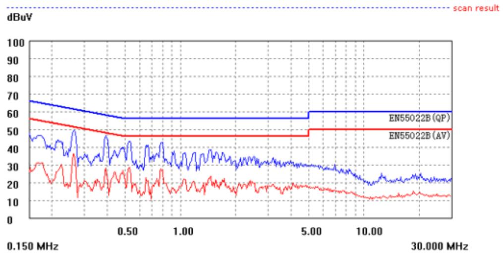

115Vac Neutral

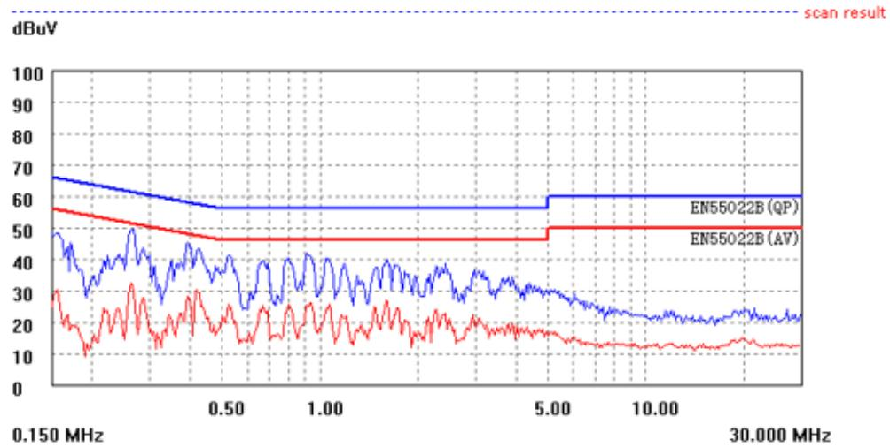

230Vac Neutral

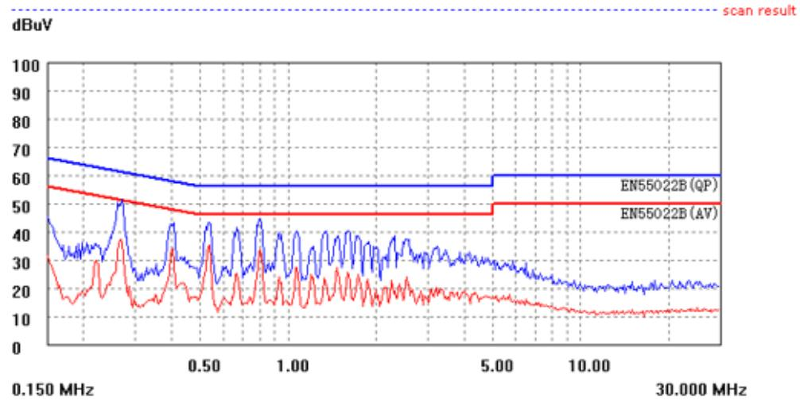

115Vac Line

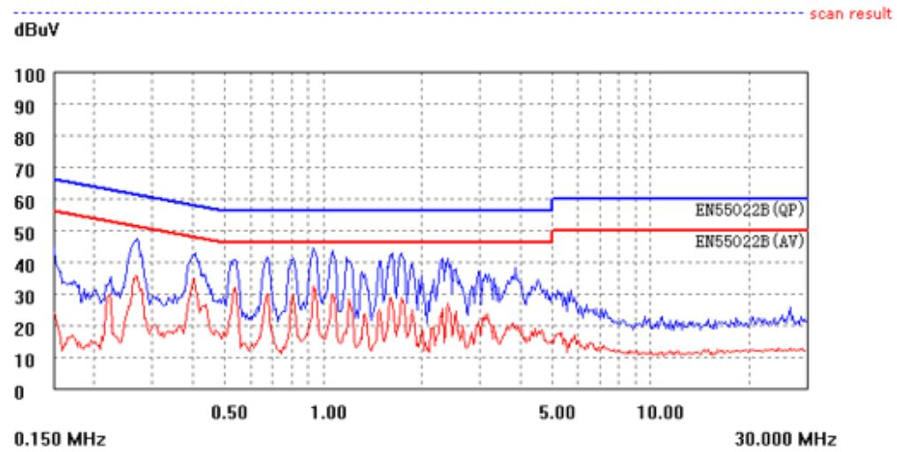

230Vac Line

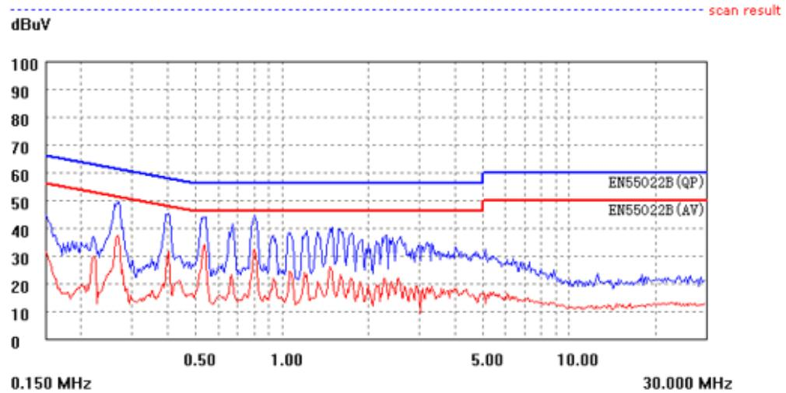

115Vac Neutral

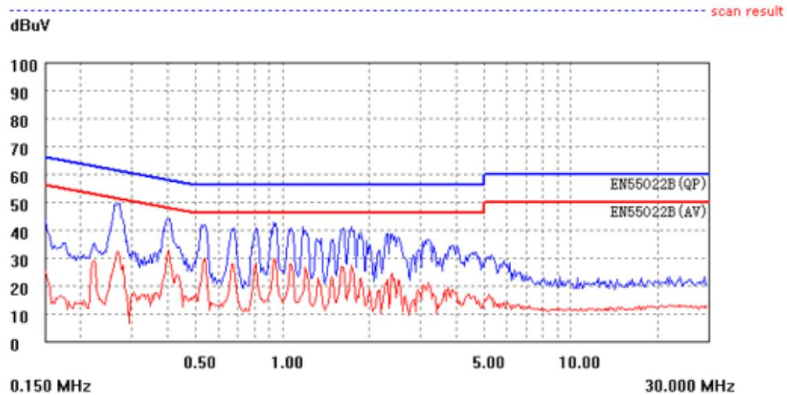

230Vac Neutral

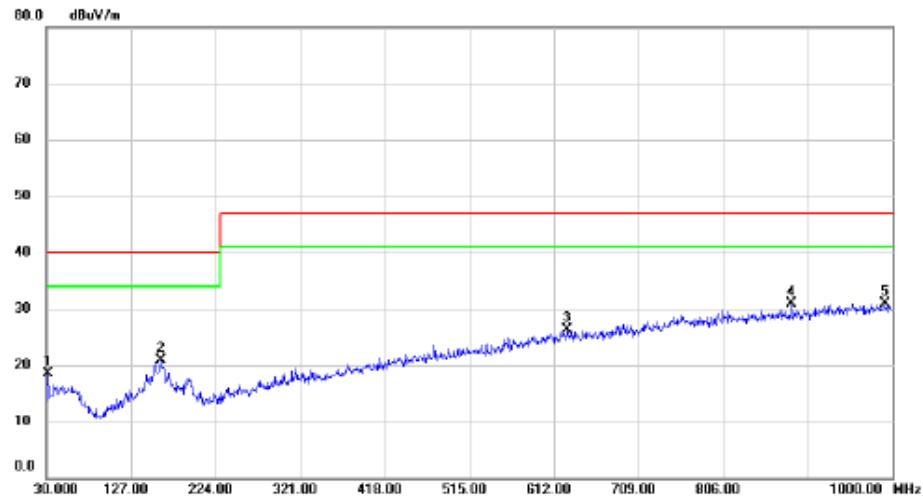

115Vac Horizontal

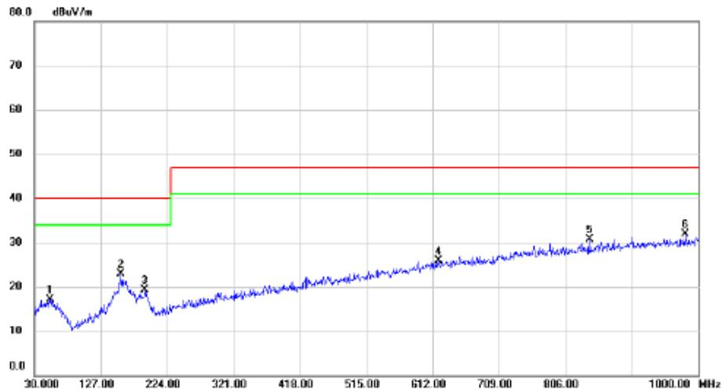

230Vac Horizontal

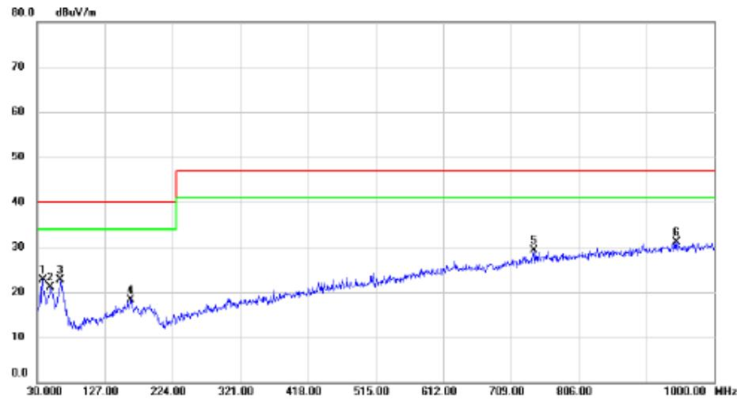

115Vac vertical

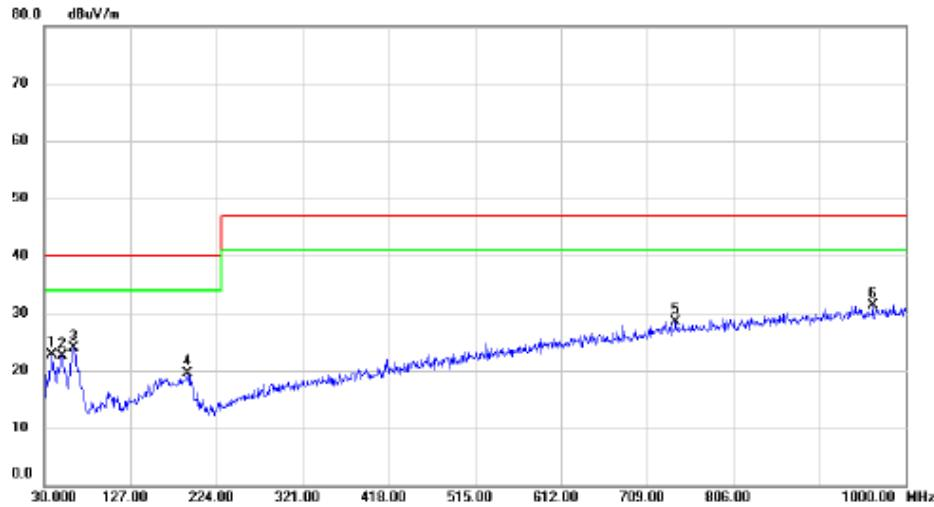

230Vac Vertical

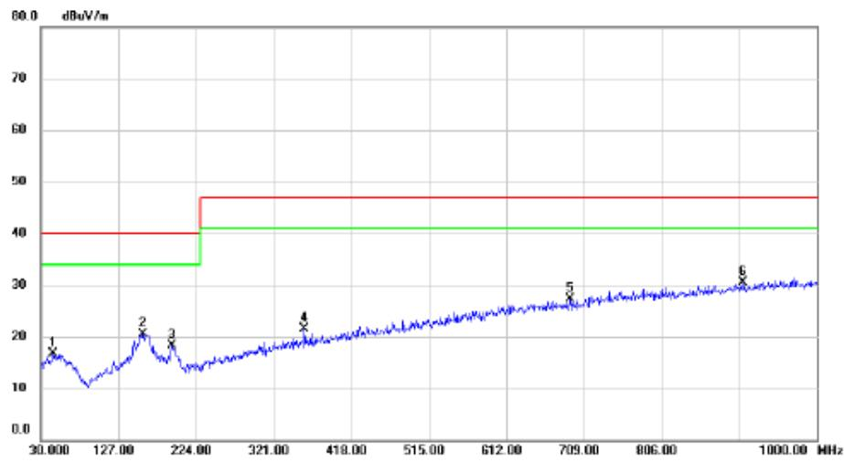

115Vac Horizontal

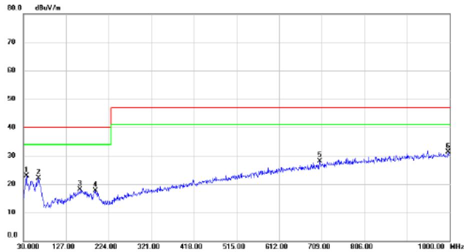

115Vac Vertical

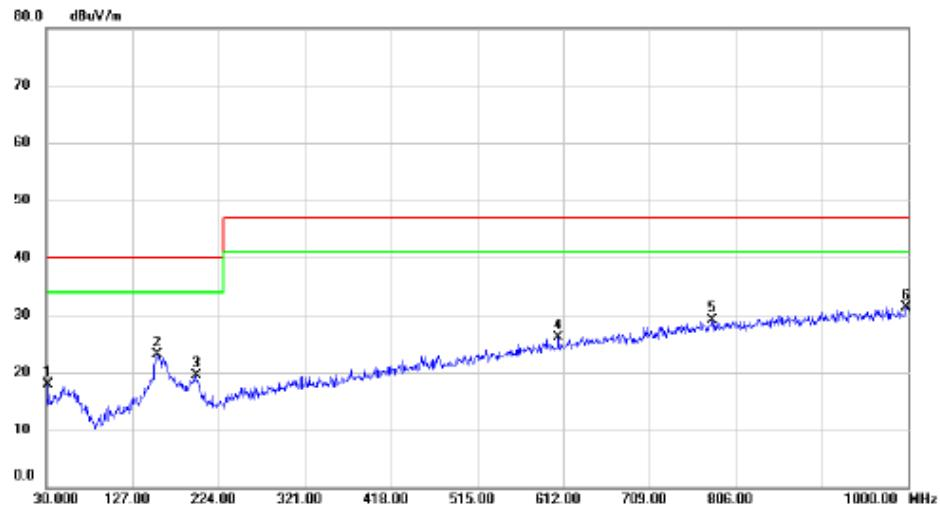

230Vac Horizontal

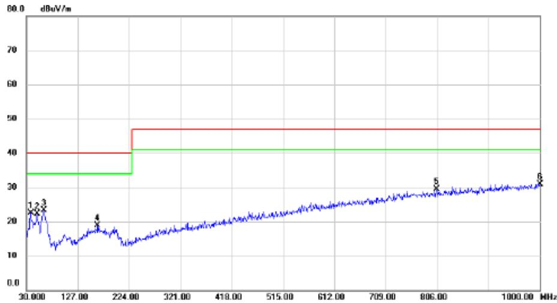

230Vac Vertical

## THANK YOU FOR WATCHING
