## BPA8604D（S1AA）隔离电源参考设计

## (5V/0.8A@85\~265Vac)

上海晶丰明源半导体股份有限公司

Shanghai Bright Power Semiconductor Co., Ltd.

YSM

时间：2021年10月

## 内容

BPA8604D  
电源规格  
电路图  
PCB Layout  
实物图  
变压器规格  
性能测试数据

## 产品特点:

➢ 700V MOSFET  
》集成高压启动、自供电电路  
》低待机功耗  
》丰富的保护功能  
》优异的动态响应速度，输出无过冲

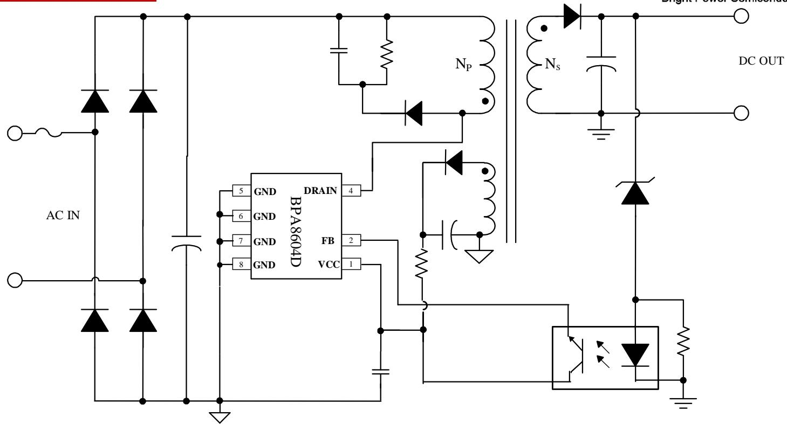

## 应用领域:

》家用电器辅助电源  
》微波辅助电源

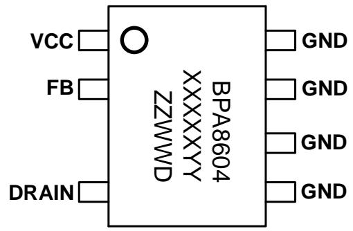

SOP7

<table><tr><td>项目描述</td><td>符号</td><td>最小</td><td>典型</td><td>最大</td><td>单位</td><td>备注</td></tr><tr><td colspan="7">输入</td></tr><tr><td>电压</td><td> $V_{IN}$ </td><td>85</td><td>115/230</td><td>265</td><td> $V_{AC}$ </td><td></td></tr><tr><td>频率</td><td> $f_{LINE}$ </td><td>47</td><td>50/60</td><td>63</td><td>Hz</td><td></td></tr><tr><td colspan="7">输出</td></tr><tr><td>输出电压</td><td> $V_{OUT}$ </td><td></td><td>5</td><td></td><td>V</td><td>±5%</td></tr><tr><td>输出电流</td><td> $I_{OUT}$ </td><td></td><td>0.8</td><td></td><td>A</td><td></td></tr><tr><td>输出电压纹波</td><td> $V_{RIPPLE}$ </td><td></td><td></td><td>134</td><td>mV</td><td>20MHz带宽</td></tr><tr><td>连续输出功率</td><td> $P_{OUT}$ </td><td></td><td>4</td><td></td><td>W</td><td></td></tr><tr><td colspan="7">效率</td></tr><tr><td>待机功耗</td><td> $P_{STDBY}$ </td><td></td><td></td><td>22</td><td>mW</td><td>230VAC</td></tr><tr><td>满载效率</td><td>η</td><td>72.1</td><td></td><td></td><td>%</td><td></td></tr><tr><td colspan="7">环境</td></tr><tr><td>传导EMI</td><td></td><td colspan="4">满足CISPR22/EN55022 Class B,至少6dB 裕量</td><td></td></tr><tr><td rowspan="2">Surge</td><td></td><td></td><td>±2</td><td></td><td>kV</td><td>差模</td></tr><tr><td></td><td></td><td>±4</td><td></td><td>kV</td><td>共模</td></tr><tr><td>EFT</td><td></td><td></td><td>±4</td><td></td><td>kV</td><td>5kHz/100kHz/38kHz</td></tr><tr><td rowspan="2">ESD</td><td></td><td></td><td>±8</td><td></td><td>kV</td><td>接触放电</td></tr><tr><td></td><td></td><td>±15</td><td></td><td>kV</td><td>空气放电</td></tr><tr><td>工作环境温度</td><td> $T_{AMP}$ </td><td></td><td></td><td>50</td><td>°C</td><td></td></tr></table>

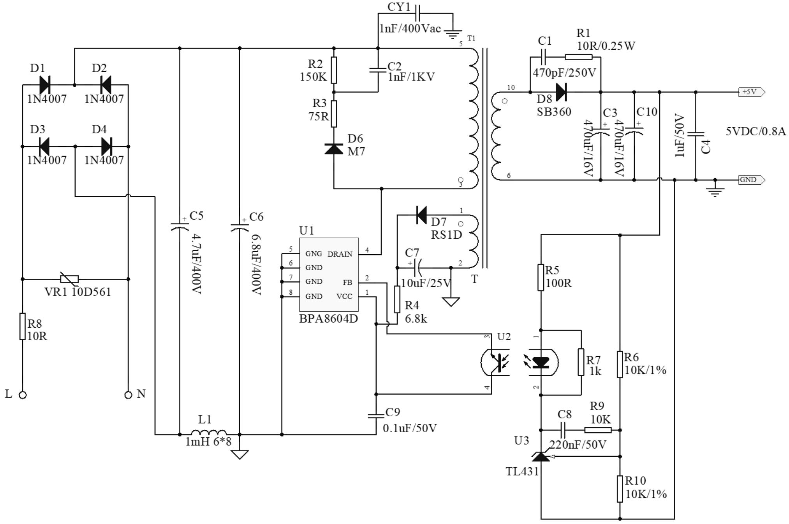

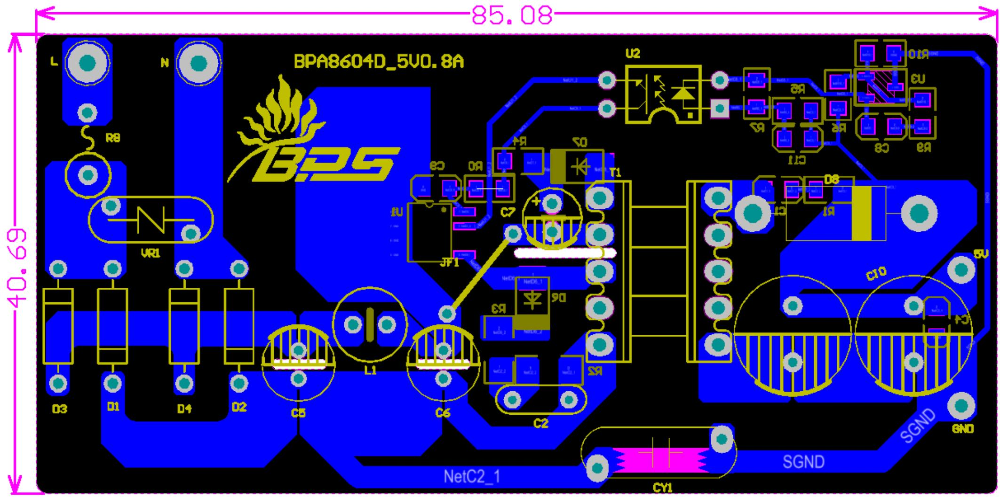

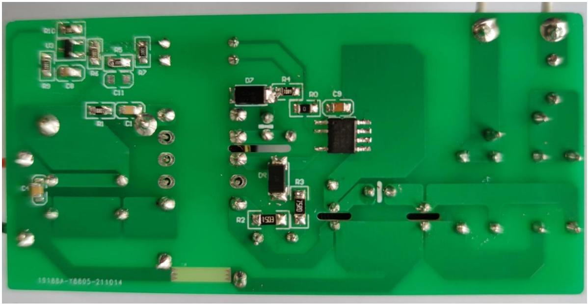

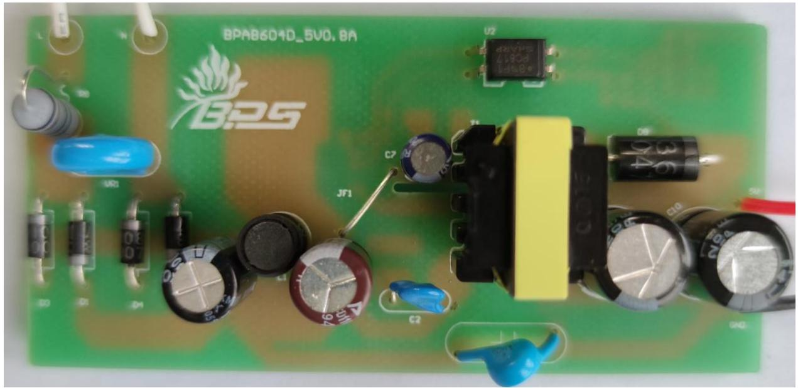

## 原理图

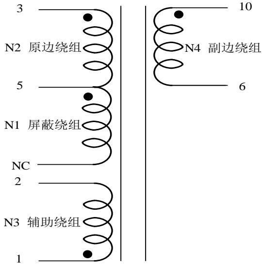

## 绕线方式

<table><tr><td>绕组</td><td>起始脚</td><td>终止脚</td><td>材料</td><td>匝数</td><td>绕线方式</td></tr><tr><td>N1</td><td>5</td><td>NC</td><td> $\phi 0.15*2P$ </td><td>25Ts</td><td>密绕一层(PIN脚朝外)</td></tr><tr><td colspan="4">胶带</td><td>3Ts</td><td></td></tr><tr><td>N2</td><td>3</td><td>5</td><td> $\phi 0.15*1P$ </td><td>112Ts</td><td>密绕三层(PIN脚朝外)</td></tr><tr><td colspan="4">胶带</td><td>3Ts</td><td></td></tr><tr><td>N3</td><td>1</td><td>2</td><td> $\phi 0.15*2P$ </td><td>14Ts</td><td>均匀绕一层(PIN脚朝外)</td></tr><tr><td colspan="4">胶带</td><td>3Ts</td><td></td></tr><tr><td>N4</td><td>10</td><td>6</td><td>三层绝缘线 $\phi 0.5*1P$ </td><td>7Ts</td><td>均匀绕一层(PIN脚朝外)</td></tr><tr><td colspan="4">胶带</td><td>1Ts</td><td></td></tr></table>

## 规格与材料

》初级绕组感量 $\mathsf { L } _ { \mathsf { p } } { = } 1 . 6 5 \mathsf { m } \mathsf { H } { \pm } 1 0 \%$ （测试条件:0.3V，50kHz）  
》漏感量 $\mathsf { L } _ { \mathsf { I k } } { < } 8 2 \mathsf { u H }$  
》骨架：EE16加高 (5+5PIN)  
》磁芯：EE16 PC40或同等材质， $\mathsf { A e } { = } 1 9 \mathsf { m m } ^ { 2 }$  
》 N1、N2、N3:2UEW漆包线  
》N4:三层绝缘线  
》绝缘胶带:3M900或同等材质  
》耐压测试:3KV,50/60Hz,1Min  
》成品要求：浸凡立水

## 脚位图

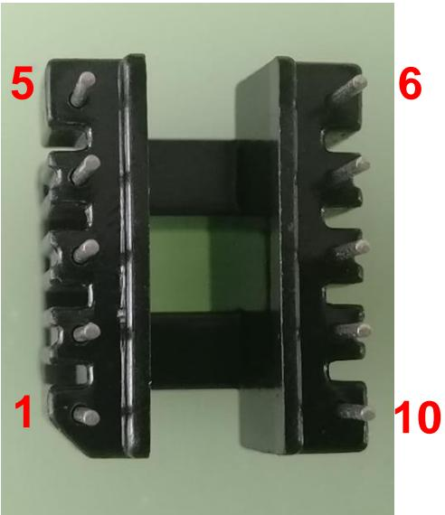

空载功耗  
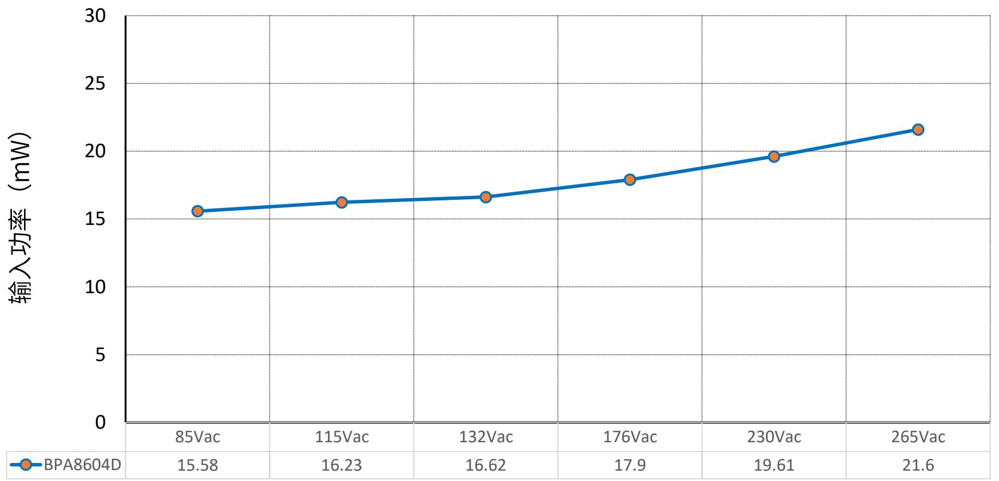

输入电压

效率测试  
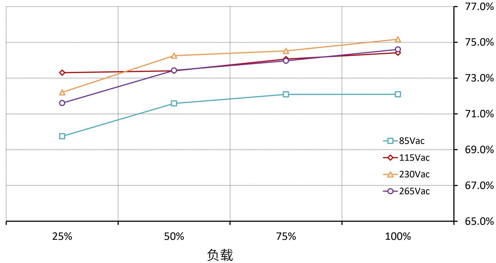

## 输出电压调整率

<table><tr><td> $V_{IN}(VAC)$ Load(%)</td><td>85</td><td>115</td><td>132</td><td>176</td><td>230</td><td>265</td><td>平均值</td><td>线调整率</td></tr><tr><td>0</td><td>4.99</td><td>4.99</td><td>4.99</td><td>4.99</td><td>4.99</td><td>4.99</td><td>4.99</td><td>0.04%</td></tr><tr><td>20%</td><td>4.99</td><td>4.99</td><td>4.99</td><td>4.99</td><td>4.99</td><td>4.99</td><td>4.99</td><td>0.02%</td></tr><tr><td>40%</td><td>4.98</td><td>4.98</td><td>4.98</td><td>4.98</td><td>4.98</td><td>4.98</td><td>4.98</td><td>0.00%</td></tr><tr><td>60%</td><td>4.98</td><td>4.98</td><td>4.98</td><td>4.98</td><td>4.98</td><td>4.98</td><td>4.98</td><td>0.02%</td></tr><tr><td>80%</td><td>4.97</td><td>4.97</td><td>4.97</td><td>4.97</td><td>4.97</td><td>4.97</td><td>4.97</td><td>0.02%</td></tr><tr><td>100%</td><td>4.97</td><td>4.97</td><td>4.97</td><td>4.97</td><td>4.97</td><td>4.97</td><td>4.97</td><td>0.00%</td></tr><tr><td>平均值</td><td>4.98</td><td>4.98</td><td>4.98</td><td>4.98</td><td>4.98</td><td>4.98</td><td rowspan="2" colspan="2"></td></tr><tr><td>负载调整率</td><td>0.50%</td><td>0.50%</td><td>0.46%</td><td>0.50%</td><td>0.50%</td><td>0.50%</td></tr></table>

◼ 计算方法：调整率=100%\*(最大值-最小值)/平均值

## 输出电压纹波

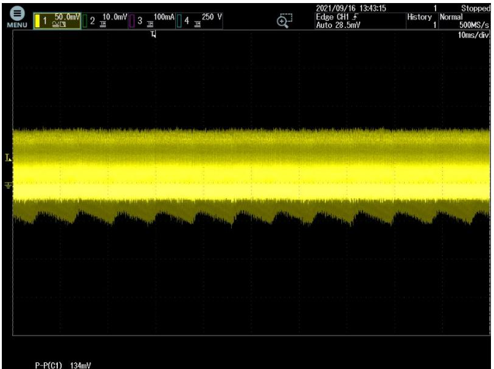

85 VAC

CH1 $\mathsf { V } _ { \mathsf { O U T } } \mathsf { R i p p l e }$ $\mathsf { V } _ { \mathsf { P K - P K } } { = } 1 3 4 \mathsf { m V }$

Test Condition:

➢ Full Load

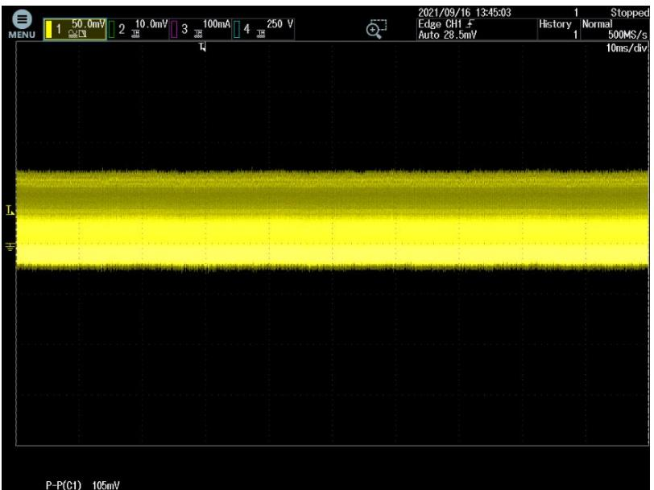

230 VAC

$\begin{array} { r l } & { \mathsf { C H 1 V _ { \mathsf { O U T } } R i p p l e } } \\ & { \mathsf { V _ { P K - P K } } \mathsf { = } \mathsf { 1 0 5 m v } } \end{array}$

Test Condition:

➢ Full Load

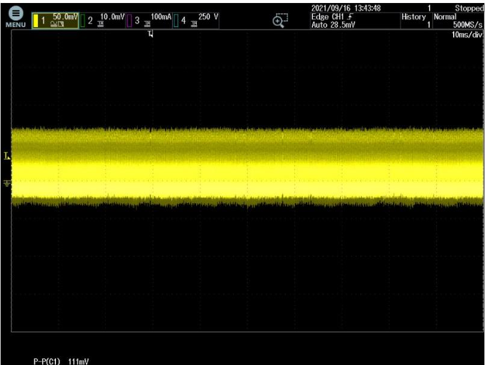

115 VAC

CH1 $\mathsf { V } _ { \mathsf { O U T } }$ Ripple $\mathsf { V } _ { \mathsf { P K - P K } } { = } \pmb { 1 } \pmb { 1 } \mathsf { 1 } \mathsf { m V }$

Test Condition:

➢ Full Load

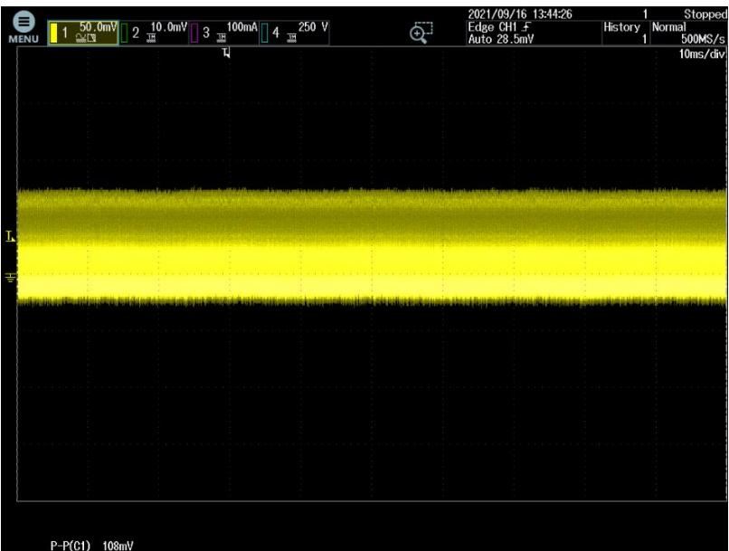

265 VAC

$\begin{array} { r l } & { \mathsf { C H 1 V _ { o u T } R i p p l e } } \\ & { \mathsf { V _ { P K - P K } } \lneq 1 0 8 \mathsf { m V } } \end{array}$

Test Condition:

➢ Full Load

## (50%-100%)

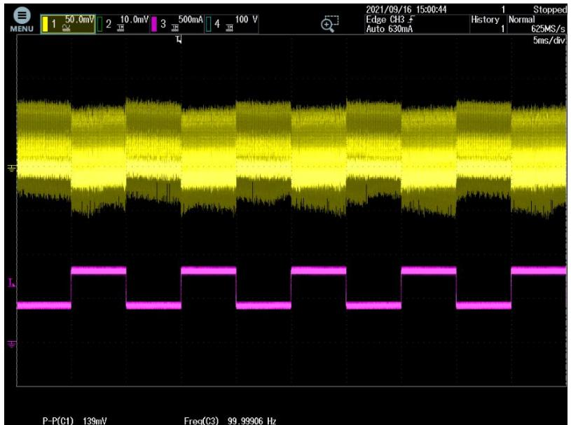

85 VAC

CH1 $\mathsf { V } _ { \mathsf { O U T } }$ $v _ { p _ { k - P K } } { = } 1 3 9 \mathsf { m V }$  
$\mathsf { C H 3 } \mathsf { I _ { 0 \mathsf { U } \mathsf { T } } }$

## Test Condition:

➢ 0.4 A-0.8 A-0.4 A  
➢ Slew Rate: 0.5 A/μS  
➢ Frequency: 100 Hz

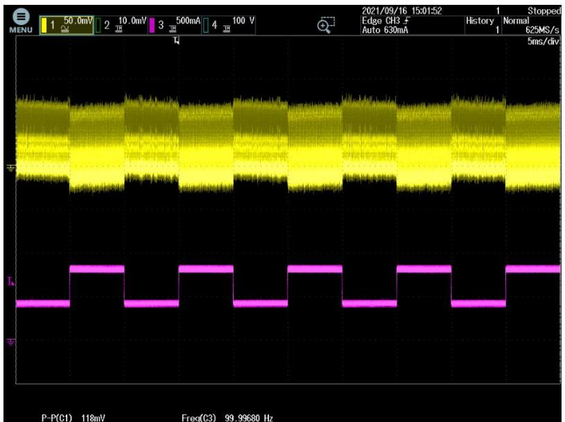

230 VAC

CH1 $\mathsf { V } _ { \mathsf { O U T } }$ $v _ { p _ { \mathsf { K - P K } } } { = } 1 1 8 \mathsf { m v }$

$\mathsf { C H 3 } \mathsf { I _ { 0 \mathsf { U T } } }$

## Test Condition:

➢ 0.4 A-0.8 A-0.4 A  
➢ Slew Rate: 0.5 A/μS  
➢ Frequency: 100 Hz

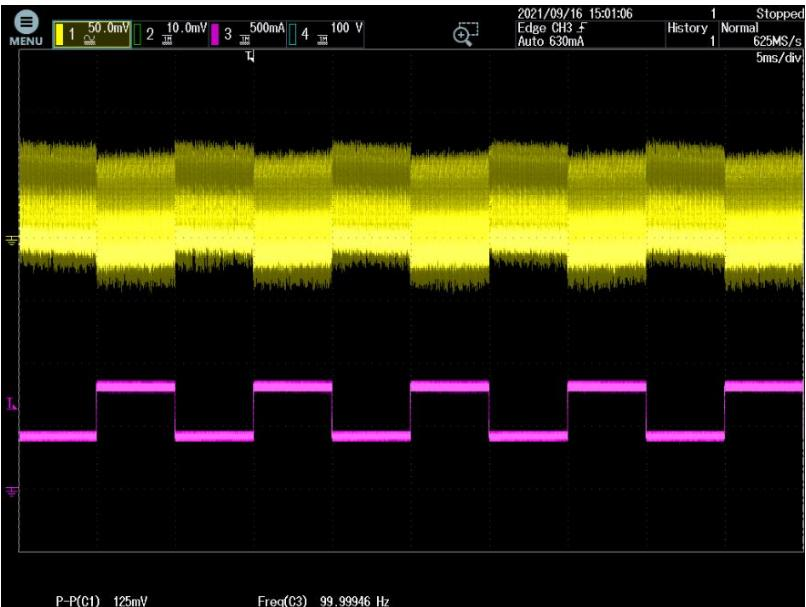

115 VAC

CH1 $\mathsf { V } _ { \mathsf { O U T } }$ $V _ { p | c - P K } = 1 2 5 m v$  
$\mathsf { C H 3 } \mathsf { I _ { 0 \mathsf { U T } } }$

## Test Condition:

➢ 0.4 A-0.8 A-0.4 A  
➢ Slew Rate: 0.5 A/μS  
➢ Frequency: 100 Hz

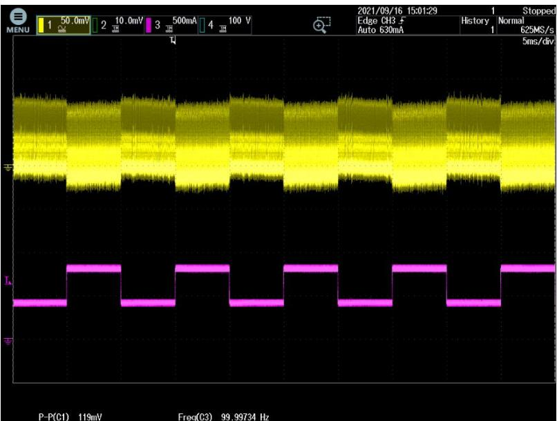

265 VAC

${ \mathsf { C H 1 } } { \mathsf { V } } _ { \mathsf { O U T } }$ $V _ { \mathsf { P K - P K } } { = } 1 1 9 \mathsf { m V }$  
$\mathsf { C H 3 } \mathsf { I _ { 0 \mathsf { U T } } }$

## Test Condition:

➢ 0.4 A-0.8 A-0.4 A  
➢ Slew Rate: 0.5 A/μS  
➢ Frequency: 100 Hz

## (10%-90%)

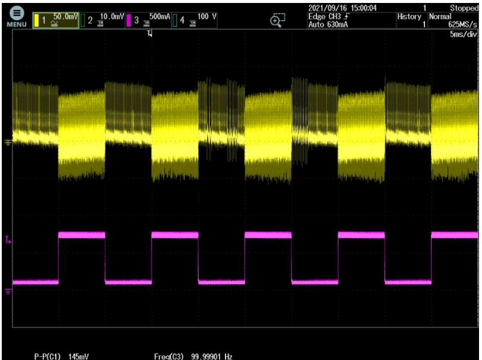

85 VAC

CH1 $\mathsf { V } _ { \mathsf { O U T } }$ $V _ { P K - P K } = 1 4 5 m v$  
$\mathsf { C H 3 } \mathsf { I _ { 0 \mathsf { U } \mathsf { T } } }$

## Test Condition:

➢ 0.08A-0.72 A-0.08A  
➢ Slew Rate: 0.5 A/μS  
➢ Frequency: 100 Hz

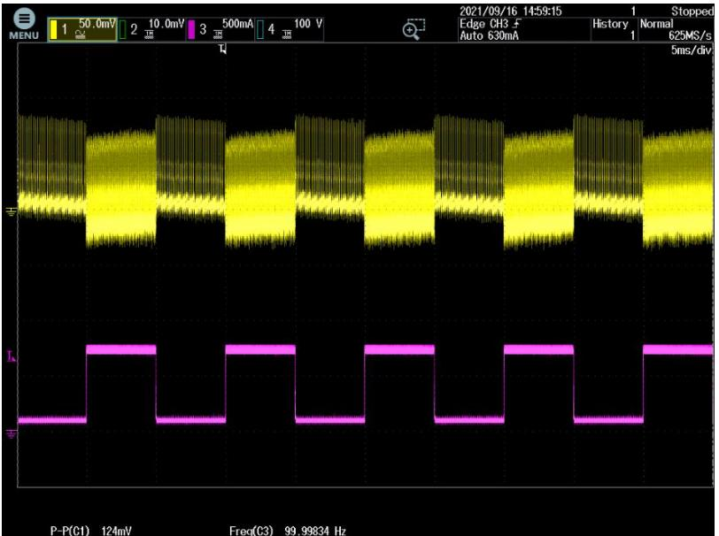

230 VAC

CH1 $\mathsf { V } _ { \mathsf { O U T } }$ $V _ { \mathsf { P K - P K } } { = } 1 2 4 ~ \mathsf { m V }$  
$\mathsf { C H 3 } \mathsf { I _ { 0 \mathsf { U T } } }$

## Test Condition:

➢ 0.08A-0.72 A-0.08A  
➢ Slew Rate: 0.5 A/μS  
➢ Frequency: 100 Hz

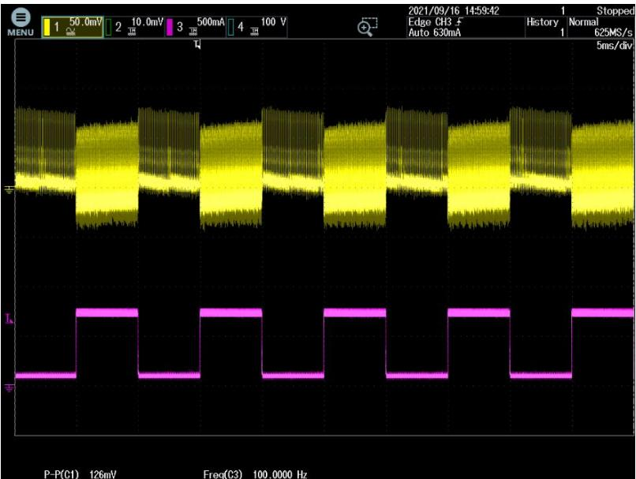

115 VAC

CH1 $\mathsf { V } _ { \mathsf { O U T } }$ $v _ { p _ { \mathrm { K - P K } } } { = } 1 2 6 ~ \mathsf { m V }$  
$\mathsf { C H 3 } \mathsf { I _ { 0 \mathsf { U T } } }$

## Test Condition:

➢ 0.08A-0.72 A-0.08A  
➢ Slew Rate: 0.5 A/μS  
➢ Frequency: 100 Hz

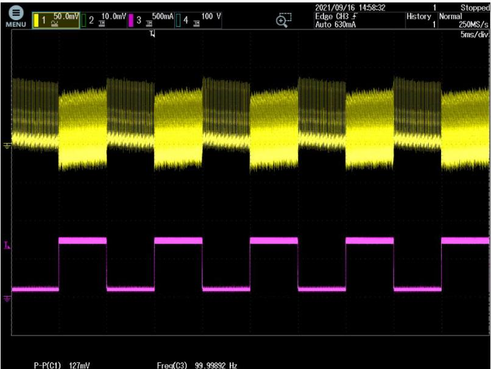

265 VAC

${ \mathsf { C H 1 } } { \mathsf { V } } _ { \mathsf { O U T } }$ $v _ { p _ { k - P K } } { = } 1 2 7 m v$  
$\mathsf { C H 3 } \mathsf { I _ { 0 \mathsf { U T } } }$

## Test Condition:

➢ 0.08A-0.72 A-0.08A  
➢ Slew Rate: 0.5 A/μS  
➢ Frequency: 100 Hz

## 输出电压开机波形

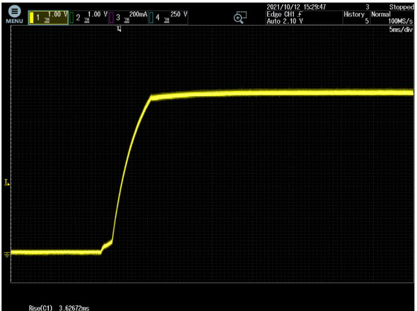

85 VAC  
  
Test Condition:  
➢ Full Load

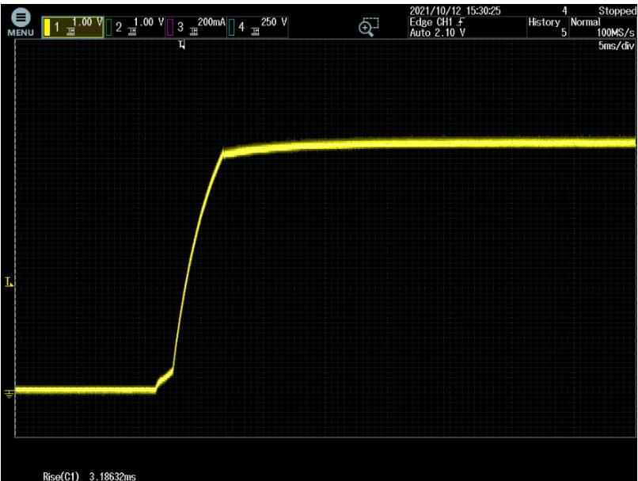

115 VAC  
  
Test Condition:  
➢ Full Load

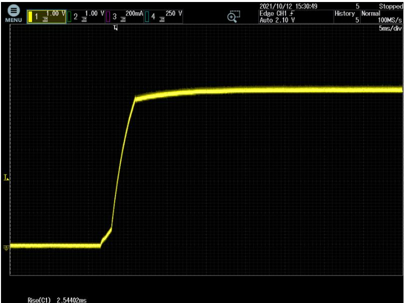

230 VAC  
  
Test Condition:  
➢ Full Load

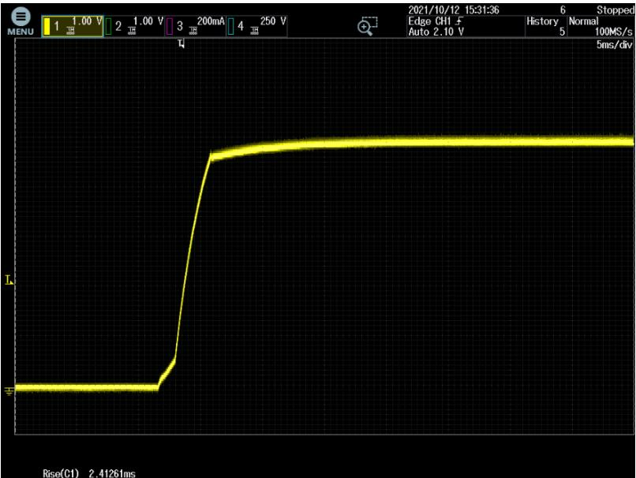

265 VAC  
  
Test Condition:  
➢ Full Load

## MOSFET

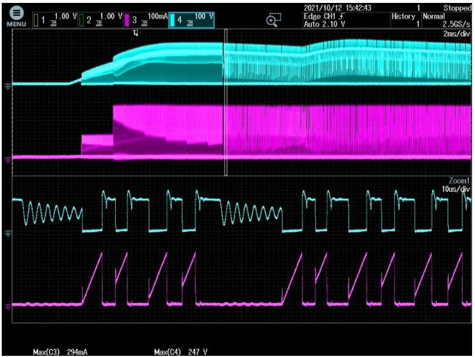

85 VAC  
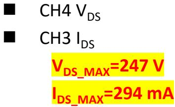

Test Condition:  
➢ Full Load

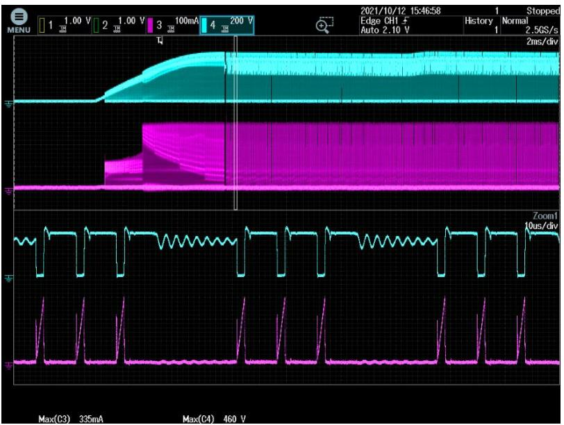

230 VAC  
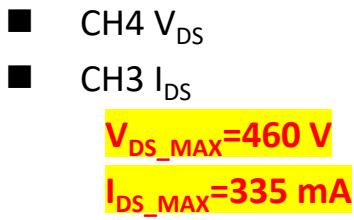

Test Condition:  
➢ Full Load

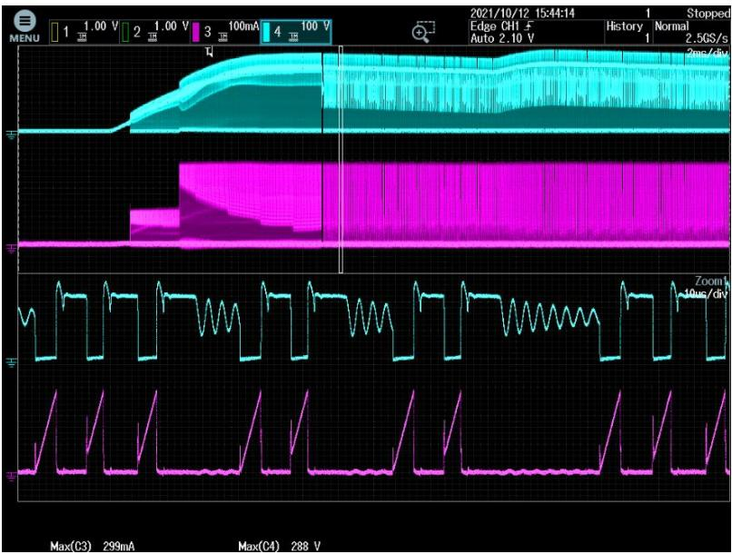

115 VAC  
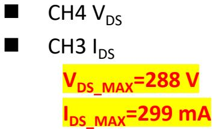

Test Condition:  
➢ Full Load

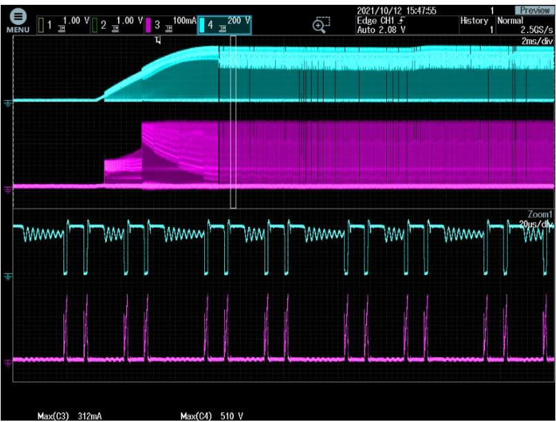

265 VAC  
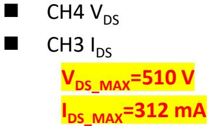

Test Condition:  
➢ Full Load

## MOSFET

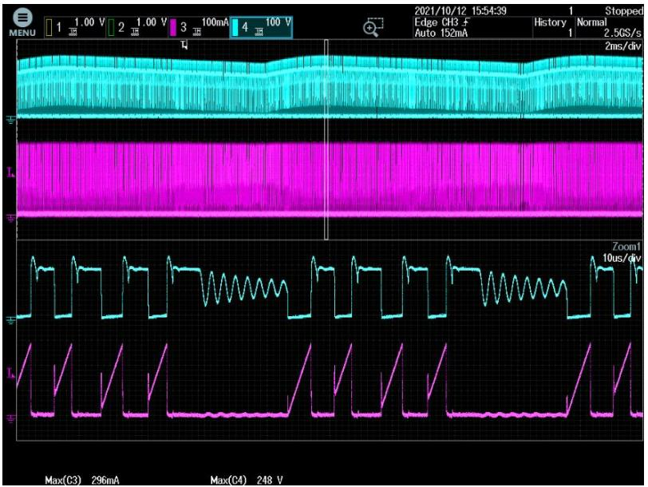

85 VAC

CH4 VDS  
CH3 IDS

$$
V _ {D S \_ M A X} = 2 4 8 \mathrm{V}
$$

$$
I _ {D S \_ M A X} = 2 9 6 \mathrm{mA}
$$

## Test Condition:

➢ Full Load

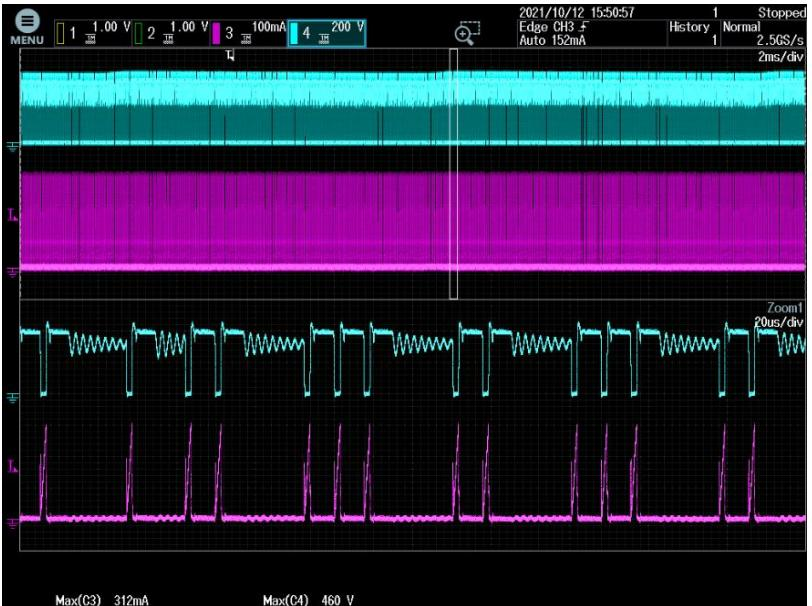

265 VAC

CH4 VDS  
CH3 IDS

$$
V _ {D S \_ M A X} = 4 6 0 \mathrm{V}
$$

$$
I _ {D S \_ M A X} = 3 1 2 \mathrm{mA}
$$

## Test Condition:

➢ Full Load

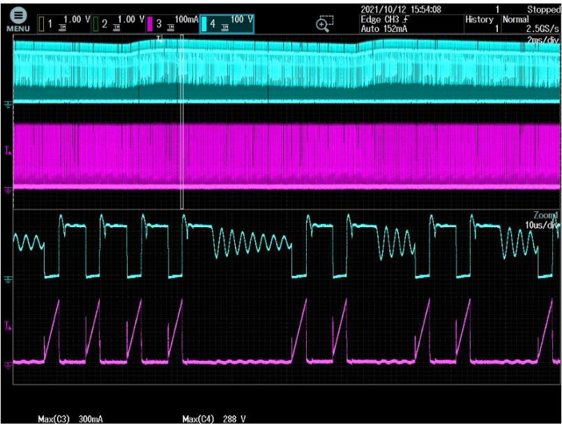

115 VAC

CH4 VDS  
CH3 IDS

$$
V _ {D S \_ M A X} = 2 8 8 \mathrm{V}
$$

$$
I _ {D S \_ M A X} = 3 0 0 \mathrm{mA}
$$

## Test Condition:

➢ Full Load

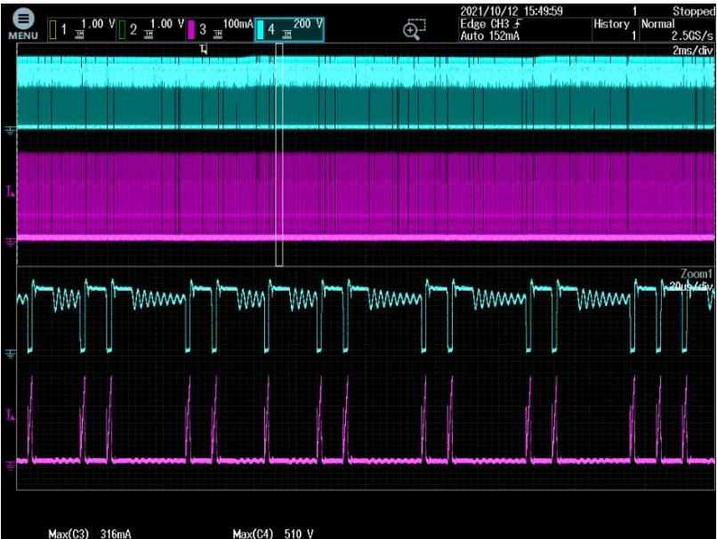

265 VAC

CH4 VDS

$$
V _ {D S \_ M A X} = 5 1 0 \mathrm{V}
$$

$$
I _ {D S \_ M A X} = 3 1 6 \mathrm{mA}
$$

## Test Condition:

➢ Full Load

## 输出二极管开机波形

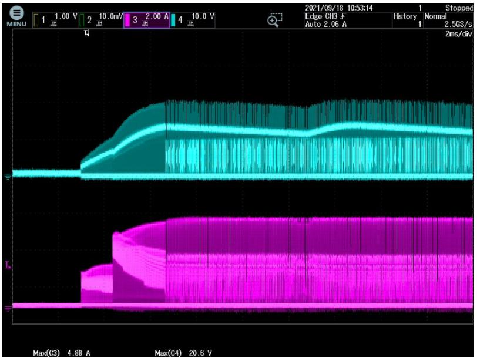

85 VAC

CH4 VR  
CH3 IF

$$
\begin{array}{l} \mathrm {V_ {R\_MAX}} = 2 0. 6 \mathrm{V} \\ \mathrm {I_ {F\_MAX}} = 4. 8 8 \mathrm{A} \end{array}
$$

## Test Condition:

➢ Full Load

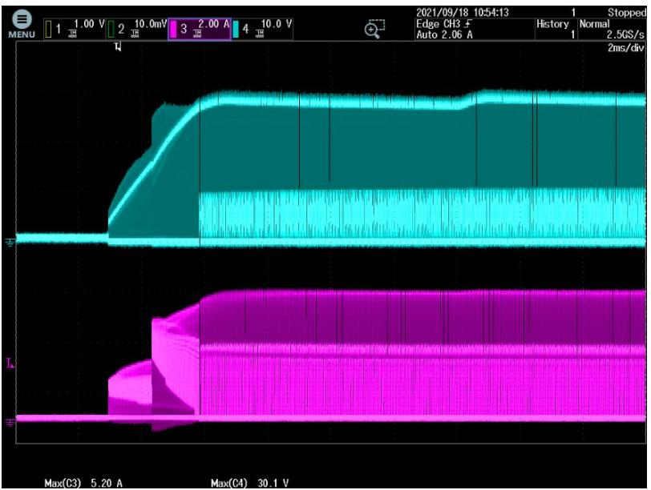

230 VAC

CH4 VR  
CH3 IF

$$
\begin{array}{l} \mathrm {V_ {R\_MAX}} = 3 0. 1 \mathrm{V} \\ \mathrm {I_ {F\_MAX}} = 5. 2 \mathrm{A} \end{array}
$$

## Test Condition:

➢ Full Load

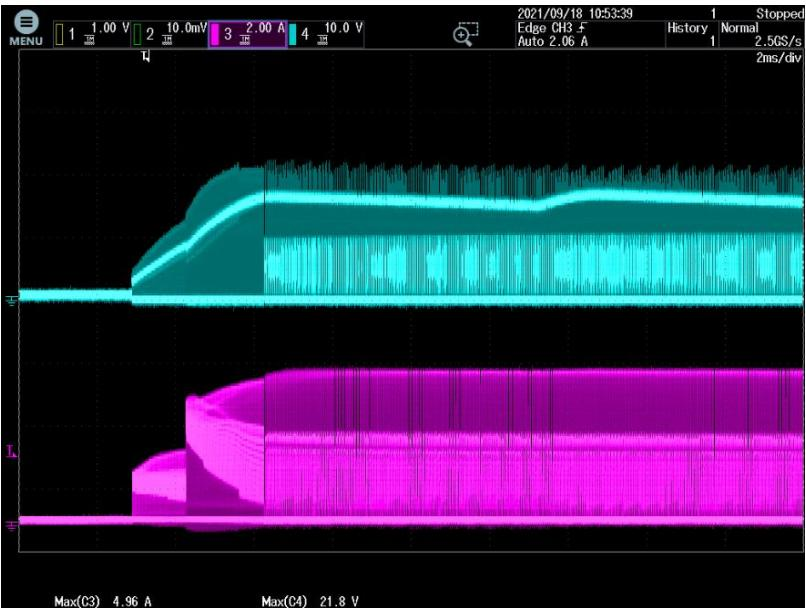

115 VAC

CH4 VR  
CH3 IF

$$
\begin{array}{l} \mathrm {V_ {R\_MAX}} = 2 1. 8 \mathrm{V} \\ \mathrm {I_ {F\_MAX}} = 4. 9 6 \mathrm{A} \end{array}
$$

## Test Condition:

➢ Full Load

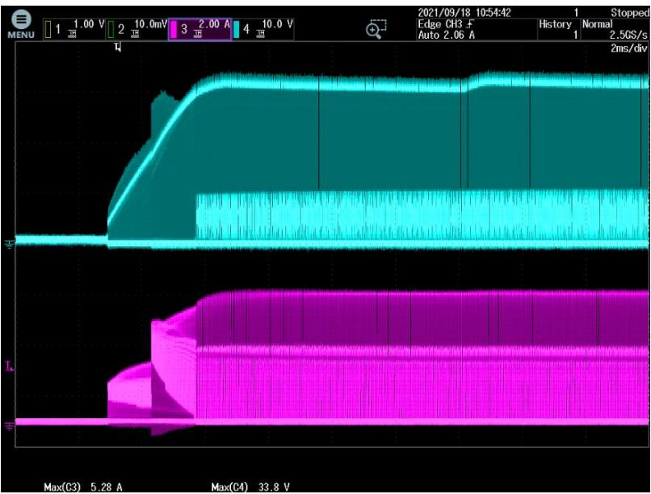

265 VAC

CH4 VR  
CH3 IF

$$
\begin{array}{l} \mathrm {V_ {R\_MAX}} = 3 3. 8 \mathrm{V} \\ \mathrm {I_ {F\_MAX}} = 5. 2 8 \mathrm{A} \end{array}
$$

## Test Condition:

➢ Full Load

## 输出二极管稳态波形

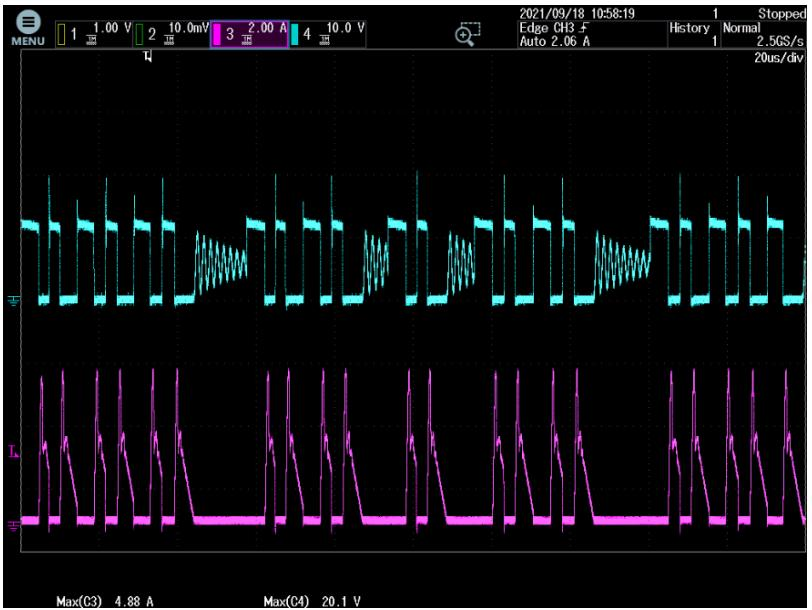

85 VAC

CH4 VR  
CH3 IF

$$
\begin{array}{l} \mathrm {V_ {R\_MAX}} = 2 0. 1 \mathrm{V} \\ \mathrm {I_ {F\_MAX}} = 4. 8 8 \mathrm{A} \end{array}
$$

## Test Condition:

➢ Full Load

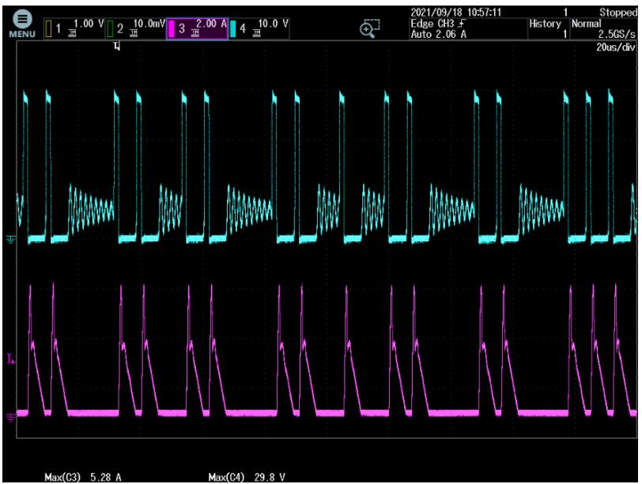

230 VAC

CH4 VR  
CH3 IF

$$
\begin{array}{l} \mathrm {V_ {R\_MAX}} = 2 9. 8 \mathrm{V} \\ \mathrm {I_ {F\_MAX}} = 5. 2 8 \mathrm{A} \end{array}
$$

## Test Condition:

➢ Full Load

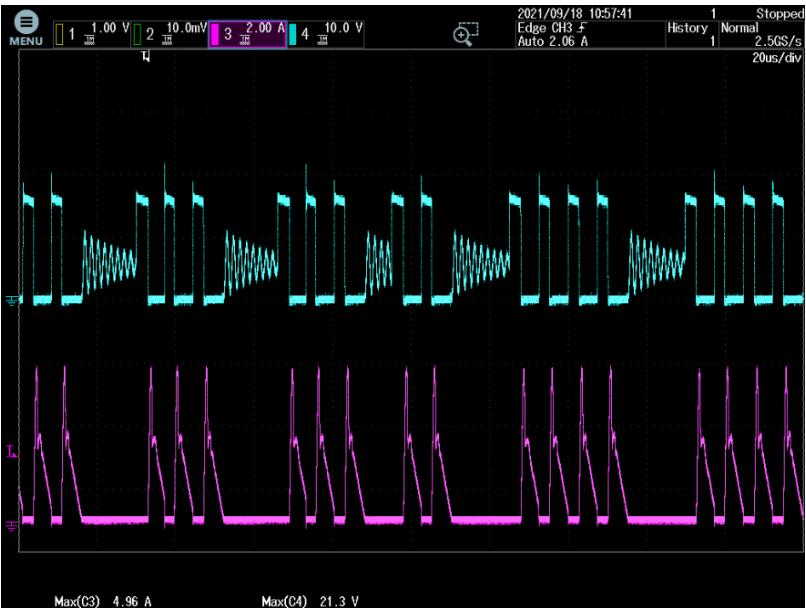

115 VAC

CH4 VR  
CH3 IF

$$
\begin{array}{l} \mathrm {V_ {R\_MAX}} = 2 1. 3 \mathrm{V} \\ \mathrm {I_ {F\_MAX}} = 4. 9 6 \mathrm{A} \end{array}
$$

## Test Condition:

➢ Full Load

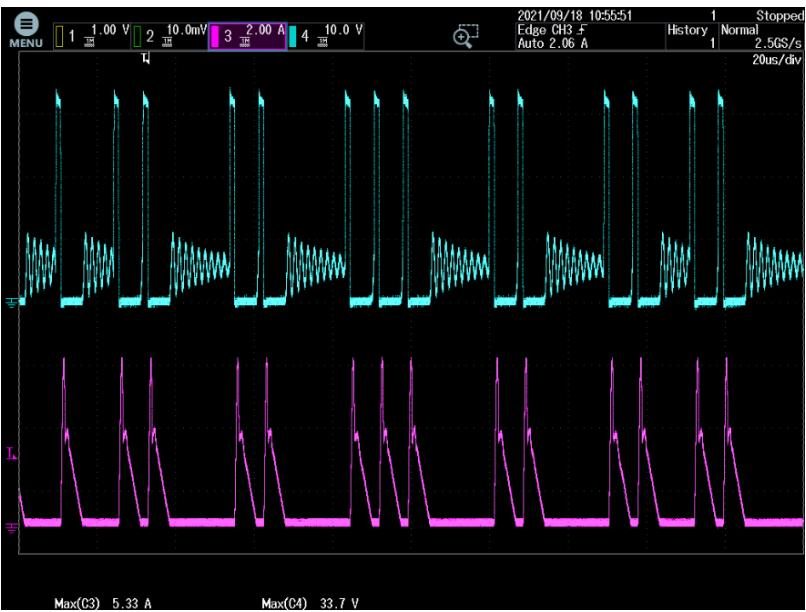

265 VAC

CH4 VR  
CH3 IF

$$
\begin{array}{l} \mathrm {V_ {R\_MAX}} = 3 3. 7 \mathrm{V} \\ \mathrm {I_ {F\_MAX}} = 5. 3 3 \mathrm{A} \end{array}
$$

## Test Condition:

➢ Full Load

## MOSFET

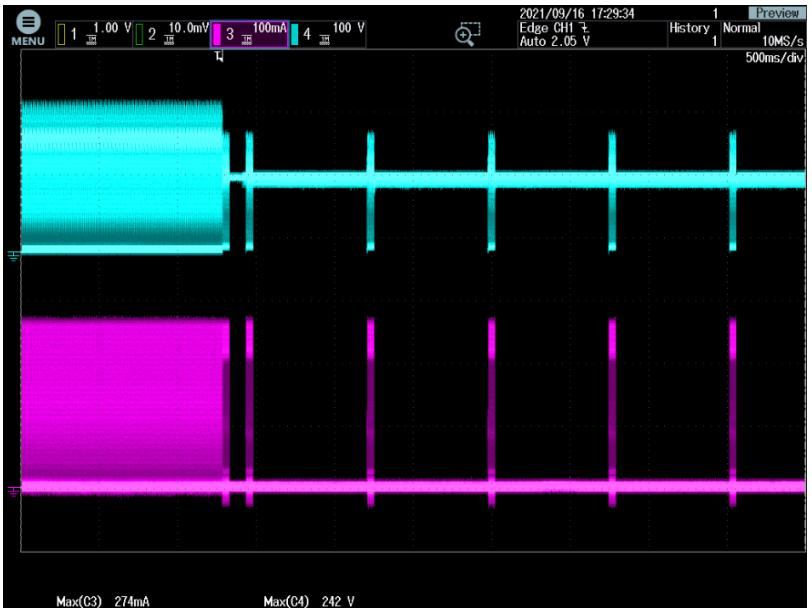

85 VAC

CH4 VDS  
CH3 IDS

$$
\begin{array}{l} \mathrm {V_ {DS\_MAX}} = 2 4 2 \mathrm{V} \\ \mathrm {I_ {DS\_MAX}} = 2 7 4 \mathrm{mA} \end{array}
$$

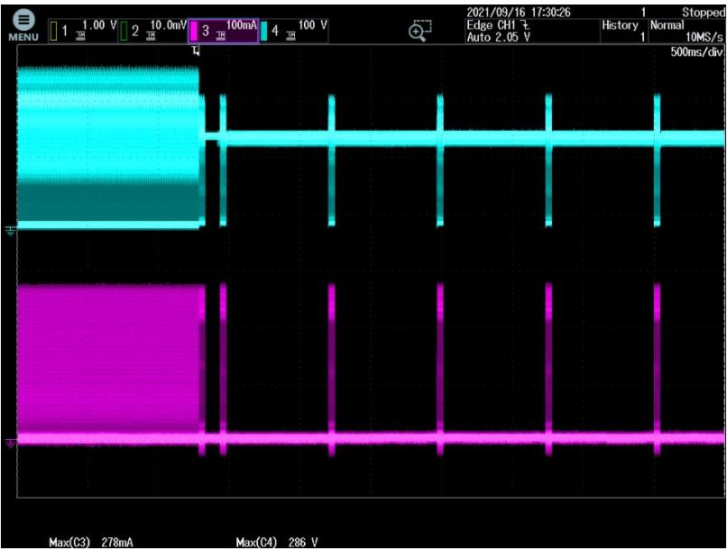

115 VAC

CH4 VDS  
CH3 IDS

$$
\begin{array}{l} \mathrm {V_ {DS\_MAX}} = 2 8 6 \mathrm{V} \\ \mathrm {I_ {DS\_MAX}} = 2 7 8 \mathrm{mA} \end{array}
$$

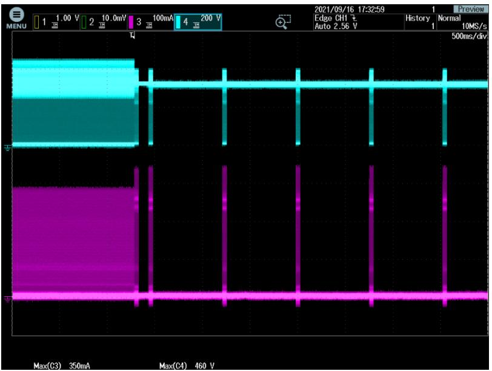

230 VAC

CH4 VDS  
CH3 IDS

$$
\begin{array}{l} \mathrm {V_ {DS\_MAX}} = 4 6 0 \mathrm{V} \\ \mathrm {I_ {DS\_MAX}} = 3 5 0 \mathrm{mA} \end{array}
$$

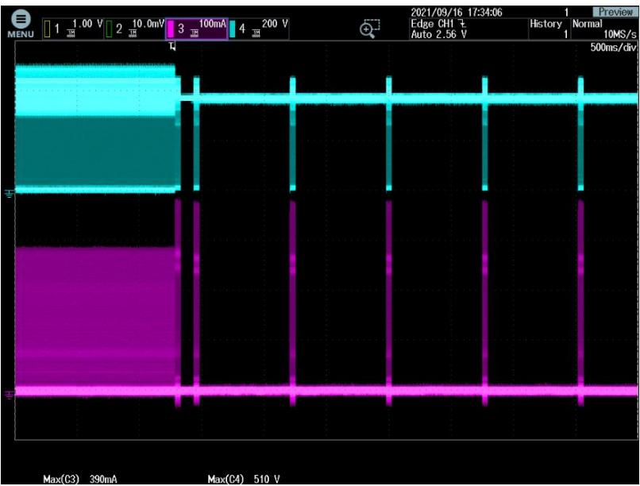

265 VAC

CH4 VDS  
CH3 IDS

$$
\begin{array}{l} \mathrm {V_ {DS\_MAX}} = 5 1 0 \mathrm{V} \\ \mathrm {I_ {DS\_MAX}} = 3 9 0 \mathrm{mA} \end{array}
$$

<table><tr><td rowspan="2">项目</td><td>85VAC</td><td>115VAC</td><td>230VAC</td><td>265VAC</td></tr><tr><td>温度(°C)</td><td>温度(°C)</td><td>温度(°C)</td><td>温度(°C)</td></tr><tr><td>环境温度</td><td>29.6</td><td>28.9</td><td>28.9</td><td>30</td></tr><tr><td>BP8604D (U1)</td><td>74.7</td><td>64.9</td><td>59.6</td><td>60.8</td></tr><tr><td>变压器绕组(T1)</td><td>55</td><td>53.6</td><td>55</td><td>55.6</td></tr><tr><td>变压器磁芯(T1)</td><td>49</td><td>48.4</td><td>50.2</td><td>51.1</td></tr><tr><td>整流二极管(D8)</td><td>66.3</td><td>65.6</td><td>65.9</td><td>66.1</td></tr><tr><td>整流桥(D1)</td><td>39.5</td><td>36.6</td><td>33.6</td><td>33.2</td></tr><tr><td>输入电解电容(C5)</td><td>47.4</td><td>44.3</td><td>41.9</td><td>41.8</td></tr><tr><td>输出电解电容(C4)</td><td>44.9</td><td>44.5</td><td>44.7</td><td>44.6</td></tr></table>

备注：增大芯片Source散热铜箔面积可以降低芯片温度

## 测试说明

》在温箱中进行测试  
》电路板放在一个封闭的盒子内  
热电偶连接到各个测量点  
》等测量点温度达到稳定后记录数据

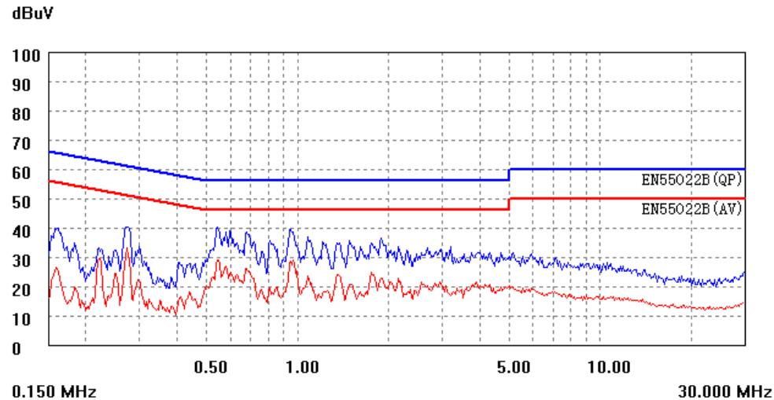

115Vac Line  
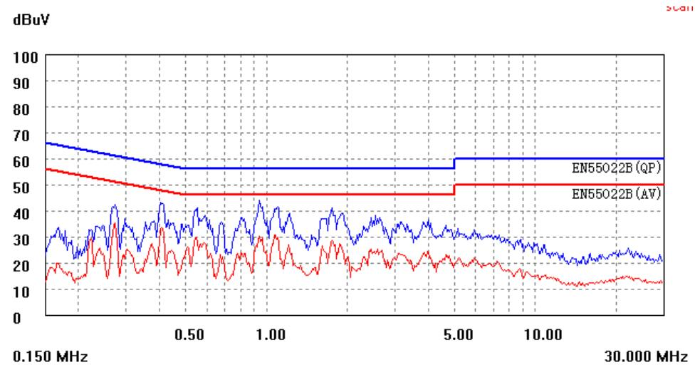

230Vac Line

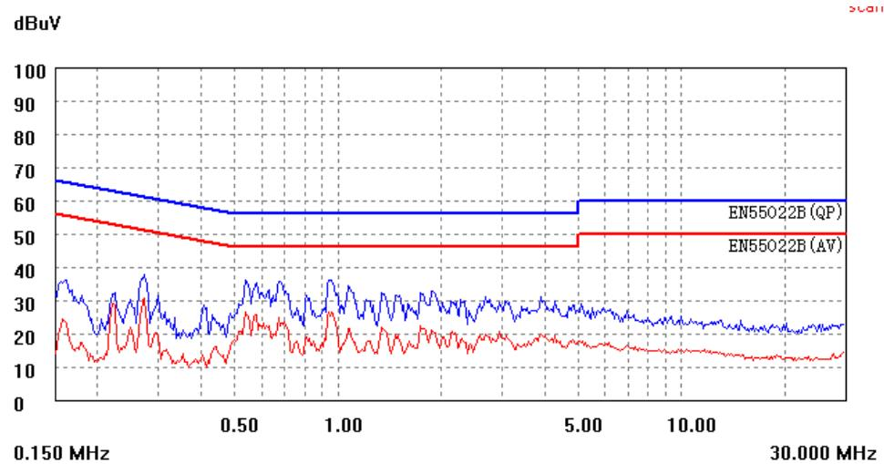

115Vac Neutral

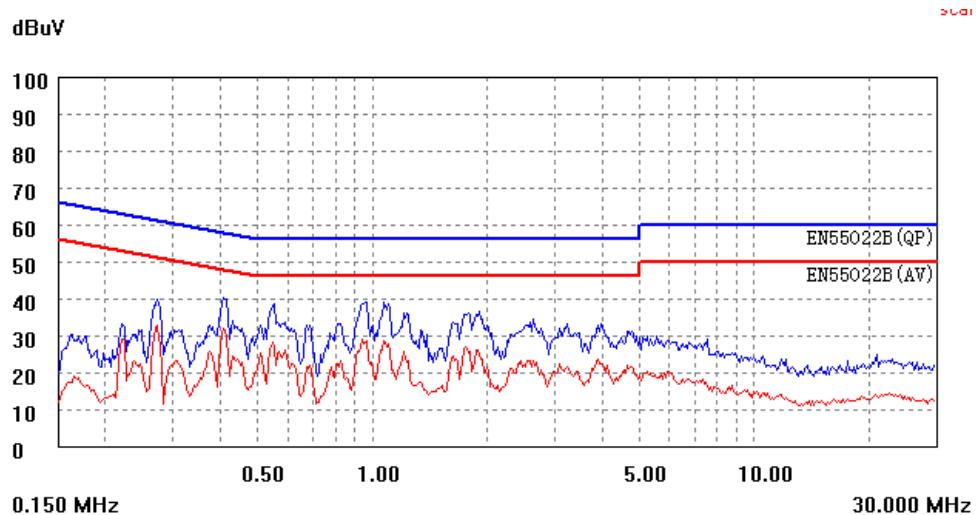

230Vac Neutral

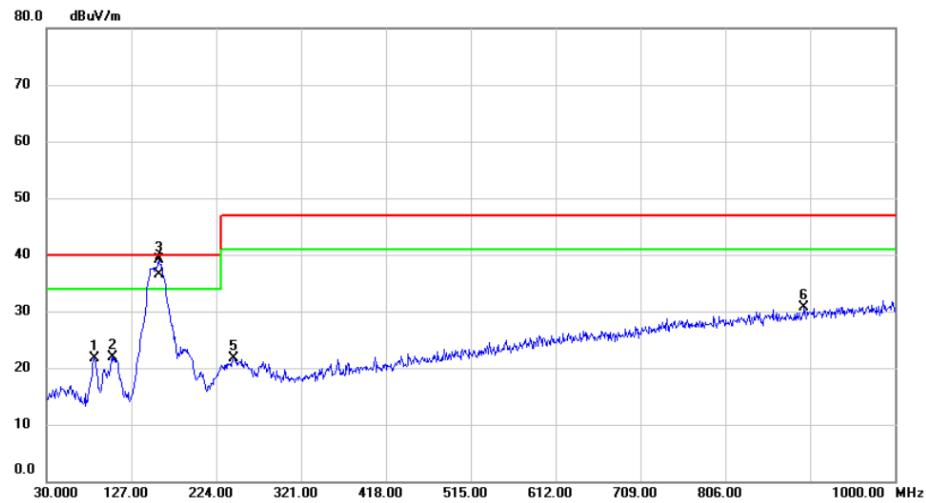

115Vac Horizontal

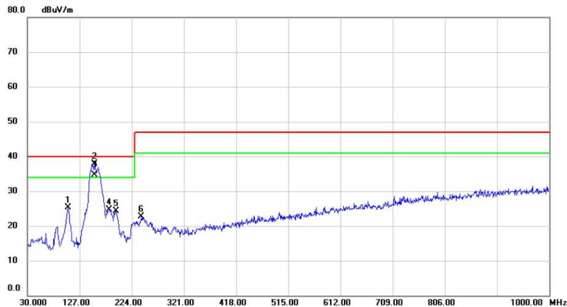

230Vac Horizontal

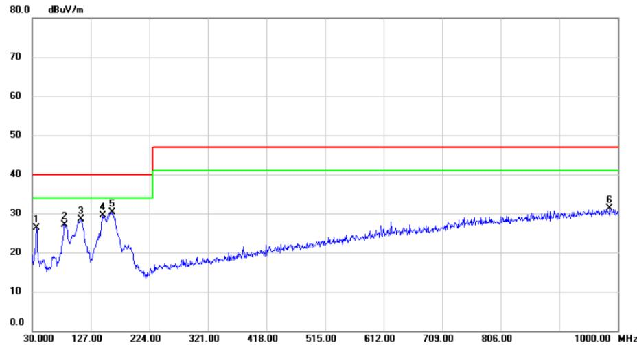

115Vac Vertical

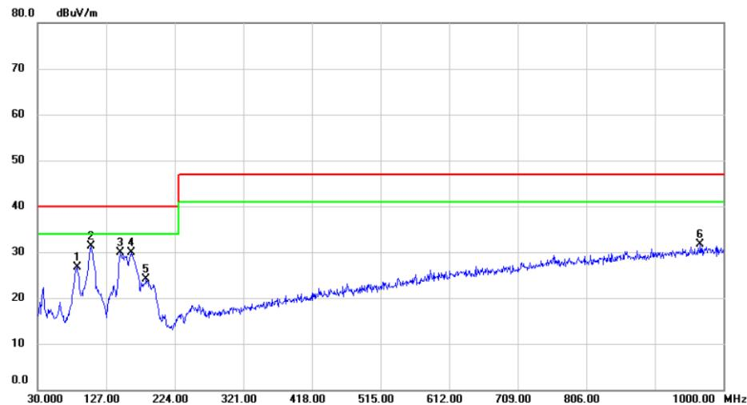

230Vac Vertical

<table><tr><td>差模</td><td>电压</td><td>相位角</td><td>发生器阻抗</td><td>测试次数</td><td>测试结果</td></tr><tr><td>L to N</td><td>+1.5kV</td><td>0/90/180/270</td><td>2</td><td>10</td><td>Pass</td></tr><tr><td>L to N</td><td>-1.5kV</td><td>0/90/180/270</td><td>2</td><td>10</td><td>Pass</td></tr><tr><td>L to N</td><td>+2kV</td><td>0/90/180/270</td><td>2</td><td>10</td><td>Pass</td></tr><tr><td>L to N</td><td>-2kV</td><td>0/90/180/270</td><td>2</td><td>10</td><td>Pass</td></tr></table>

## 测试说明

》按照GB/T17626.5和IEC61000-4-5的最新版本要求进行测试  
》室温环境，230VAC输入，满载条件  
》输入1.2/50us组合波浪涌电压  
》每个测试点重复10次  
》每次间隔时间1分钟  
》试验时样机输出正常（符合A类标准）视为Pass

## EFT

<table><tr><td>差模</td><td>电压</td><td>脉冲群持续时间</td><td>脉冲频率</td><td>测试时间</td><td>测试结果</td></tr><tr><td>L to N</td><td>+4kV</td><td>15ms</td><td>5kHz</td><td>120s</td><td>Pass</td></tr><tr><td>L to N</td><td>-4kV</td><td>15ms</td><td>5kHz</td><td>120s</td><td>Pass</td></tr><tr><td>L to N</td><td>+4kV</td><td>0.75ms</td><td>100kHz</td><td>120s</td><td>Pass</td></tr><tr><td>L to N</td><td>-4kV</td><td>0.75ms</td><td>100kHz</td><td>120s</td><td>Pass</td></tr><tr><td>L to N</td><td>+2kV</td><td>2ms</td><td>38kHz</td><td>120s</td><td>Pass</td></tr><tr><td>L to N</td><td>-2kV</td><td>2ms</td><td>38kHz</td><td>120s</td><td>Pass</td></tr><tr><td>L to N</td><td>+4kV</td><td>2ms</td><td>38kHz</td><td>120s</td><td>Pass</td></tr><tr><td>L to N</td><td>-4kV</td><td>2ms</td><td>38kHz</td><td>120s</td><td>Pass</td></tr></table>

## 测试说明

》按照GB/T17626.4和IEC61000-4-4的最新版本要求进行测试  
》室温环境，230VAC输入满载条件  
》 分别测试5kHz/100kHz/38kHz脉冲频率  
》脉冲群周期为300ms  
》每个测试条件测试时间120s  
》试验时样机输出正常（符合A类标准）视为Pass

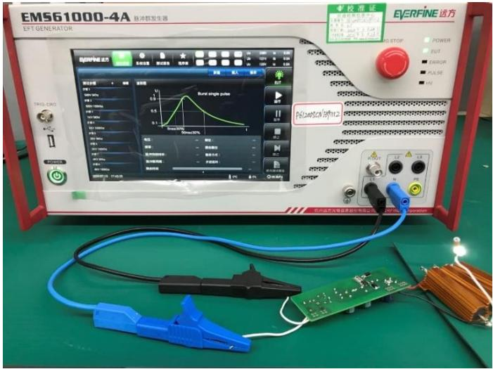

<table><tr><td>测试点</td><td>电压(V)</td><td>放电类型</td><td>放电次数</td><td>测试结果</td></tr><tr><td>Vo</td><td>+12kV</td><td>空气放电</td><td>10</td><td>Pass</td></tr><tr><td>Vo</td><td>-12kV</td><td>空气放电</td><td>10</td><td>Pass</td></tr><tr><td>GND</td><td>+12kV</td><td>空气放电</td><td>10</td><td>Pass</td></tr><tr><td>GND</td><td>-12kV</td><td>空气放电</td><td>10</td><td>Pass</td></tr><tr><td>Vo</td><td>+15kV</td><td>空气放电</td><td>10</td><td>Pass</td></tr><tr><td>Vo</td><td>-15kV</td><td>空气放电</td><td>10</td><td>Pass</td></tr><tr><td>GND</td><td>+15kV</td><td>空气放电</td><td>10</td><td>Pass</td></tr><tr><td>GND</td><td>-15kV</td><td>空气放电</td><td>10</td><td>Pass</td></tr></table>

## 测试说明

》按照GB/T17626.2和IEC61000-4-2的最新版本要求进行测试  
》室温环境，230VAC输入满载条件  
》每个测试点重复10次  
》分别对输出正端和地进行空气放电  
》试验时样机输出正常（符合A类标准）视为PasS

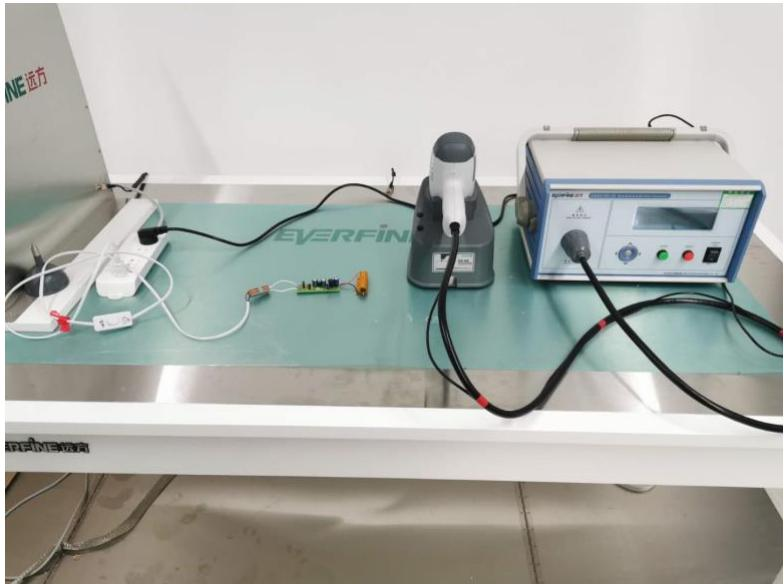

## THANK YOU FOR WATCHING
