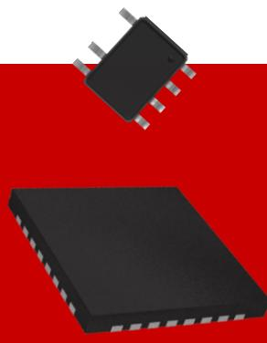

## BPA8604D隔离参考设计

## (5V0.35A;12V0.25A)

上海晶丰明源半导体股份有限公司

Shanghai Bright Power Semiconductor Co., Ltd.

夏奇林

2021 09

## 内容

BPA8604D  
电源规格  
电路及实物图  
BOM  
PCB Layout  
变压器  
性能测试数据

## 产品特点:

➢ 700V MOSFET  
<50mW@230VAC <150mW@230VAC  
》优异的动态响应速度  
》集成高压启动、自供电电路  
》改善EMI性能的频率调制技术  
➢ MOSFET PCB EMI

典型应用  
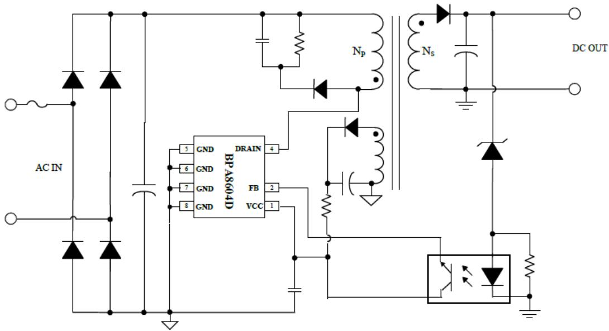

图1.BPA8604D典型应用电路

## 应用领域:

》家用电器辅助电源  
》微波炉辅助电源

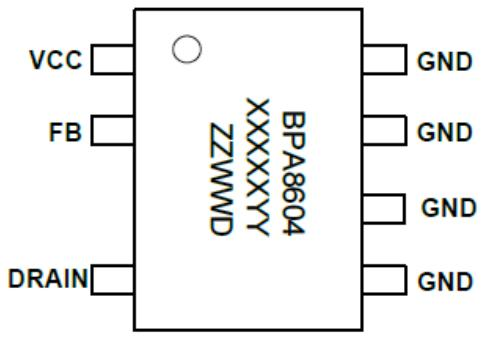

BPA8604：产品型号  
XXXXXYY:批次号  
ZZ:标示  
WW：周号  
D：封装代码 (D代表 SOP-7)  
图2.SOP-7管脚封装图

## 电源规格

<table><tr><td>项目描述</td><td>符号</td><td>最小</td><td>典型</td><td>最大</td><td>单位</td><td>备注</td></tr><tr><td colspan="7">输入</td></tr><tr><td>电压</td><td> $V_{IN}$ </td><td>85</td><td>115/230</td><td>264</td><td> $V_{AC}$ </td><td></td></tr><tr><td>频率</td><td> $f_{LINE}$ </td><td>47</td><td>50/60</td><td>63</td><td>Hz</td><td></td></tr><tr><td colspan="7">输出</td></tr><tr><td>输出电压1</td><td> $V_{OUT1}$ </td><td>4.75</td><td>5</td><td>5.25</td><td>V</td><td>±5%</td></tr><tr><td>输出电流1</td><td> $I_{OUT1}$ </td><td>0</td><td></td><td>350</td><td>mA</td><td></td></tr><tr><td>输出电压2</td><td> $V_{OUT2}$ </td><td>11.4</td><td>12.5</td><td>15.6</td><td>V</td><td>±7%</td></tr><tr><td>输出电流2</td><td> $I_{OUT2}$ </td><td>0</td><td></td><td>250</td><td>mA</td><td></td></tr><tr><td>输出电压纹波1</td><td> $V_{RIPPLE}$ </td><td></td><td></td><td>100</td><td>mV</td><td>20MHz带宽</td></tr><tr><td>输出电压纹波2</td><td> $V_{RIPPLE}$ </td><td></td><td></td><td>100</td><td>mV</td><td>20MHz带宽</td></tr><tr><td>连续输出功率</td><td> $P_{OUT}$ </td><td></td><td>6.5</td><td></td><td>W</td><td></td></tr><tr><td colspan="7">效率</td></tr><tr><td>待机功耗</td><td> $P_{STDBY}$ </td><td></td><td></td><td>70</td><td>mW</td><td>230VAC,包含假负载</td></tr><tr><td>满载效率</td><td>η</td><td></td><td></td><td>70</td><td>%</td><td></td></tr><tr><td colspan="7">环境</td></tr><tr><td>传导EMI</td><td></td><td colspan="4">满足CISPR22/EN55022 Class B,至少6dB 裕量</td><td></td></tr><tr><td>Surge</td><td></td><td></td><td>2</td><td></td><td>kV</td><td>差模</td></tr><tr><td>EFT</td><td></td><td></td><td>4</td><td></td><td>kV</td><td>5kHz/100kHz/38kHz</td></tr><tr><td>ESD</td><td></td><td></td><td>15</td><td>20</td><td>kV</td><td>空气放电</td></tr><tr><td>工作环境温度</td><td> $T_{AMP}$ </td><td>0</td><td></td><td>65</td><td>°C</td><td>65°C降额使用</td></tr></table>

## 电路及实物图

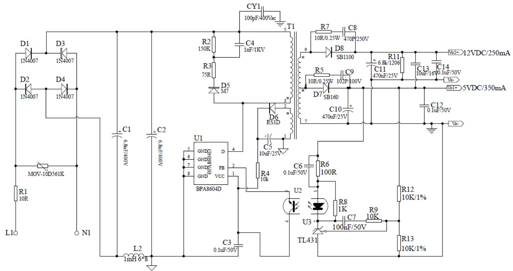

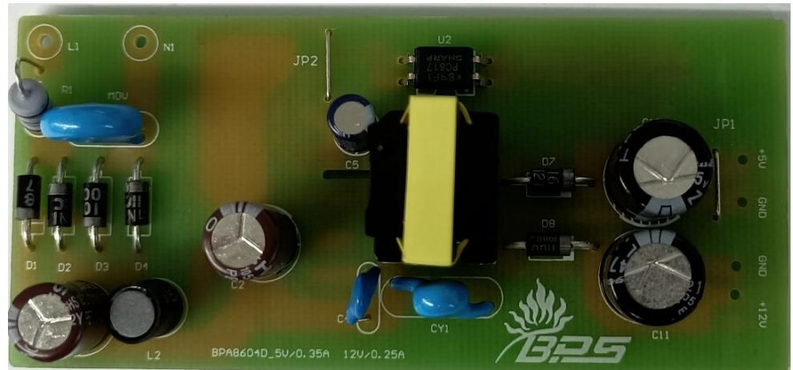

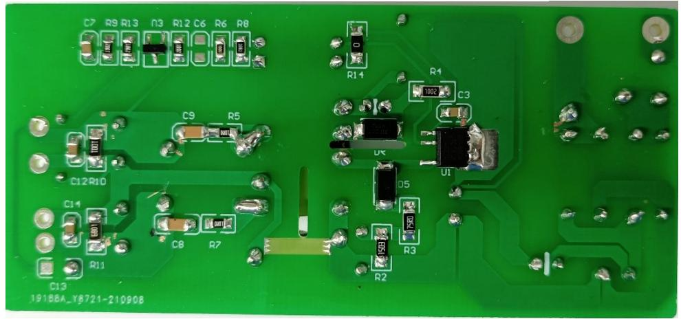

<table><tr><td>序号</td><td>元件标号</td><td>参数描述</td><td>封装尺寸</td><td>数量</td></tr><tr><td>1</td><td>PCB</td><td>CEM-1, 单面板</td><td>41mm*89mm</td><td>1</td></tr><tr><td>2</td><td>R1</td><td>10R, 2W 绕线保险丝电阻</td><td>DIP</td><td>1</td></tr><tr><td>3</td><td>MOV</td><td>10D561, 压敏电阻</td><td>10D561</td><td>1</td></tr><tr><td>4</td><td>C1,C2</td><td>400V 6.8uF电解电容</td><td> $\phi 8*13$ </td><td>2</td></tr><tr><td>5</td><td>L1</td><td>色环电感1mH</td><td>6*8</td><td>1</td></tr><tr><td>6</td><td>JP1</td><td>跳线0.6*7.5</td><td>DIP</td><td>1</td></tr><tr><td>7</td><td>JP2</td><td>跳线0.6*7.5</td><td>DIP</td><td>1</td></tr><tr><td>8</td><td>U1</td><td>BPA8604D</td><td>DIP</td><td>1</td></tr><tr><td>9</td><td>C5</td><td>50V 10uF电解电容</td><td> $\phi 5*11$ </td><td>1</td></tr><tr><td>10</td><td>U2</td><td>PC817A 光耦</td><td>DIP</td><td>1</td></tr><tr><td>11</td><td>CY1</td><td>470PF 400V AC Y1</td><td>DIP</td><td>1</td></tr><tr><td>12</td><td>T1</td><td>EE16加高 1.7mH</td><td>DIP</td><td>1</td></tr><tr><td>13</td><td>C11 C10</td><td>25V/470uF电解电容</td><td> $\phi 8*16mm$ </td><td>2</td></tr><tr><td>14</td><td>D1 D2 D3 D4</td><td>IN4007 1A/1000V</td><td>DO-41</td><td>4</td></tr><tr><td>15</td><td>D5</td><td>M7,1A,1KV 二极管</td><td>SMA</td><td>1</td></tr><tr><td>16</td><td>D6</td><td>RS1D 1A,200V快速二极管</td><td>SMA</td><td>1</td></tr><tr><td>17</td><td>D8</td><td>SB1100 1A100V肖特基二极管</td><td>DO-41</td><td>1</td></tr><tr><td>18</td><td>D7</td><td>SB160 1A 60V肖特基二极管</td><td>DO-41</td><td>1</td></tr><tr><td>19</td><td>U3</td><td>TL431</td><td>SOT23-3</td><td>1</td></tr></table>

<table><tr><td>序号</td><td>元件标号</td><td>参数描述</td><td>封装尺寸</td><td>数量</td></tr><tr><td>20</td><td>C4</td><td>102/1KV/瓷片电容</td><td>P=5mm</td><td>1</td></tr><tr><td>21</td><td>R2</td><td>150K, ±5%</td><td>SMD1206</td><td>1</td></tr><tr><td>22</td><td>R3</td><td>75R, ±5%</td><td>SMD1206</td><td>1</td></tr><tr><td>23</td><td>R4</td><td>10K, ±5%</td><td>SMD1206</td><td>1</td></tr><tr><td>24</td><td>R7,R5</td><td>10R, ±5%</td><td>SMD1206</td><td>2</td></tr><tr><td>25</td><td>R11</td><td>6.8k, ±5%</td><td>SMD1206</td><td>1</td></tr><tr><td>26</td><td>R6</td><td>100R, ±5%</td><td>SMD0805</td><td>1</td></tr><tr><td>27</td><td>R8</td><td>1K, ±5%</td><td>SMD0805</td><td>1</td></tr><tr><td>28</td><td>R9,R12,R13</td><td>10K,±5%</td><td>SMD0805</td><td>3</td></tr><tr><td>29</td><td>C6,C7,C12,C14</td><td>100nF/50V,X7R</td><td>SMD0805</td><td>4</td></tr><tr><td>30</td><td>C13</td><td>10uF/50V,X7R</td><td>SMD0805</td><td>1</td></tr><tr><td>31</td><td>C9</td><td>102/100V,X7R</td><td>SMD0805</td><td>1</td></tr><tr><td>32</td><td>C8</td><td>470P/250V,X7R</td><td>SMD0805</td><td>1</td></tr><tr><td></td><td></td><td></td><td>Total</td><td>41</td></tr></table>

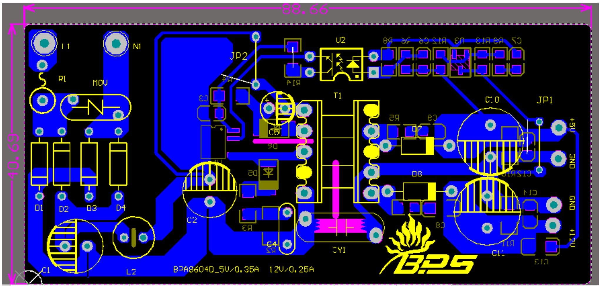

## 原理图

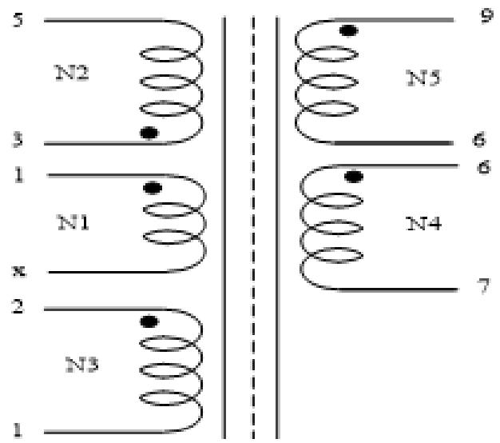

## 绕线方式

<table><tr><td>绕组</td><td>起始脚</td><td>终止脚</td><td>材料</td><td>匝数</td><td>绕线方式</td></tr><tr><td>N1</td><td>5</td><td>NC</td><td> $\phi 0.2^{*}2P$ </td><td>绕满一层</td><td>密绕一层(PIN脚朝外)</td></tr><tr><td colspan="4">胶带</td><td>2.1Ts</td><td></td></tr><tr><td>N2</td><td>3</td><td>5</td><td> $\phi 0.2^{*}1P$ </td><td>104Ts</td><td>密绕三层(PIN脚朝外)</td></tr><tr><td colspan="4">胶带</td><td>2.1Ts</td><td></td></tr><tr><td>N3</td><td>2</td><td>1</td><td> $\phi 0.2^{*}2P$ </td><td>15Ts</td><td>密绕一层(PIN脚朝外)</td></tr><tr><td colspan="4">胶带</td><td>3Ts</td><td></td></tr><tr><td>N4</td><td>6</td><td>7</td><td>三层绝缘线 $\phi 0.4^{*}1P$ </td><td>6Ts</td><td rowspan="2">同层双线并绕,密绕一层(PIN脚朝外)</td></tr><tr><td>N5</td><td>9</td><td>6</td><td>三层绝缘线 $\phi 0.3^{*}1P$ </td><td>8Ts</td></tr><tr><td colspan="4">胶带</td><td>3Ts</td><td></td></tr></table>

## 规格与材料

》初级绕组感量 $\mathsf { L } _ { \mathsf { p } } { = } 1 . 7 \mathsf { m } \mathsf { H } { \pm } 8 \%$ （测试条件:0.3V，100kHz)  
》漏感量 $L _ { 1 k } < 5 0 0 1 \dot { 1 }$  
》骨架：EE16底部加高 (5+5PIN)  
》磁芯：EE16 PC40 或同等材质， ${ \mathsf { A e } } { = } 1 9 . 2 \mathsf { m m } ^ { 2 }$  
》N1、N2、N3:2UEW漆包线  
》N4、N5：三层绝缘线，N4&N5同层双线并绕  
》绝缘胶带:3M900或同等材质  
》耐压测试:3KV,50/60Hz,1Min  
》成品要求：浸凡立水

## 脚位图

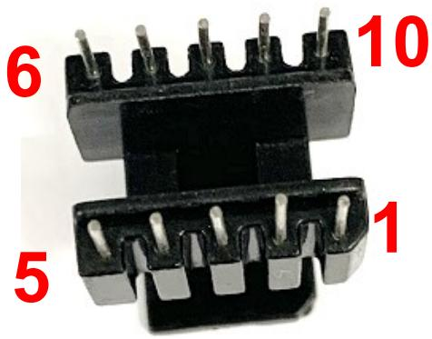

待机功耗（包含22mW假负载）  
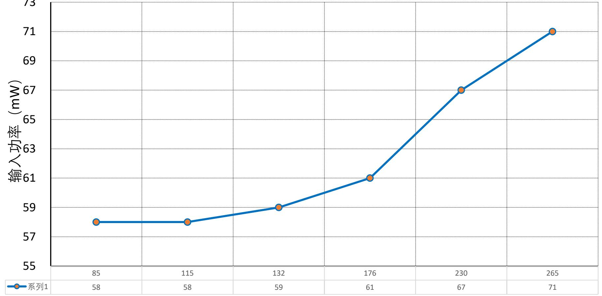

输入电压(VAC)

效率测试  
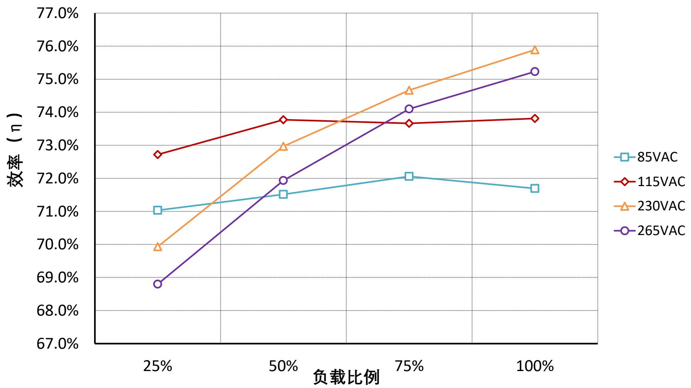

## 输出电压交叉调整率

<table><tr><td rowspan="2" colspan="2"> $V_{IN}(VAC)$ Load</td><td colspan="2">85</td><td colspan="2">115</td><td colspan="2">230</td><td colspan="2">265</td></tr><tr><td>5V</td><td>12V</td><td>5V</td><td>12V</td><td>5V</td><td>12V</td><td>5V</td><td>12V</td></tr><tr><td rowspan="2">空载</td><td>5V/0A</td><td rowspan="2">4.990</td><td rowspan="2">12.220</td><td rowspan="2">4.988</td><td rowspan="2">12.226</td><td rowspan="2">4.987</td><td rowspan="2">12.240</td><td rowspan="2">4.988</td><td rowspan="2">12.410</td></tr><tr><td>12V/0A</td></tr><tr><td rowspan="2">交叉负载</td><td>5V/0.35A</td><td rowspan="2">4.964</td><td rowspan="2">15.310</td><td rowspan="2">4.963</td><td rowspan="2">15.340</td><td rowspan="2">4.963</td><td rowspan="2">15.560</td><td rowspan="2">4.964</td><td rowspan="2">15.620</td></tr><tr><td>12V/0A</td></tr><tr><td rowspan="2">交叉负载</td><td>5V/0A</td><td rowspan="2">4.987</td><td rowspan="2">11.430</td><td rowspan="2">4.988</td><td rowspan="2">11.438</td><td rowspan="2">4.988</td><td rowspan="2">11.440</td><td rowspan="2">11.440</td><td rowspan="2">4.987</td></tr><tr><td>12V/0.25A</td></tr><tr><td rowspan="2">满载</td><td>5V/0.35A</td><td rowspan="2">4.963</td><td rowspan="2">12.610</td><td rowspan="2">4.964</td><td rowspan="2">12.573</td><td rowspan="2">4.964</td><td rowspan="2">12.600</td><td rowspan="2">4.964</td><td rowspan="2">12.610</td></tr><tr><td>12V/0.25A</td></tr></table>

## 输出电压纹波

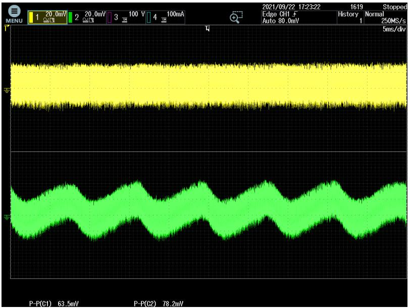

85 VAC

CH1 $\mathsf { V } _ { \mathsf { O U T - 5 V } }$ Ripple $V _ { P K - P K } = 6 3 . 5 m v$  
CH2 $\mathsf { V } _ { \mathsf { O U T } - 1 2 \mathsf { V } }$ Ripple $V _ { p | c - P K } = 7 8 . 2 m v$

Test Condition:  
➢ Full Load  
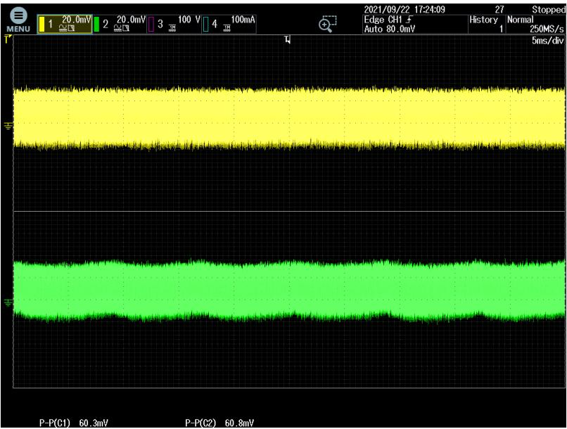

115 VAC

CH1 $\mathsf { V } _ { \mathsf { O U T - 5 V } }$ Ripple $V _ { P K - P K } = 6 0 . 3 m V$  
${ \mathsf { C H } } 2 { \mathsf { V } } _ { 0 \mathsf { U T } - 1 2 { \mathsf { V } } }$ Ripple $V _ { \mathsf { P K - P K } } { = } 6 0 . 8 \mathsf { m V }$

Test Condition:  
➢ Full Load  
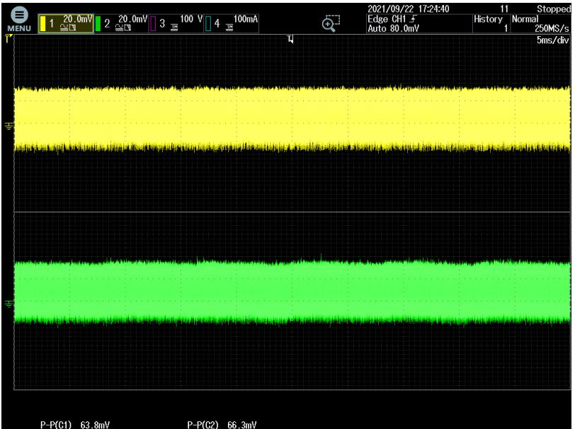

230 VAC

CH1 $\mathsf { V } _ { \mathsf { O U T - 5 V } }$ Ripple $V _ { \mathsf { P K - P K } } { = } 6 3 . 8 \mathsf { m V }$  
CH2 $\mathsf { V } _ { \mathsf { O U T } - 1 2 \mathsf { V } }$ Ripple $V _ { P K - P K } = 6 6 . 3 m V$

Test Condition:  
➢ Full Load  
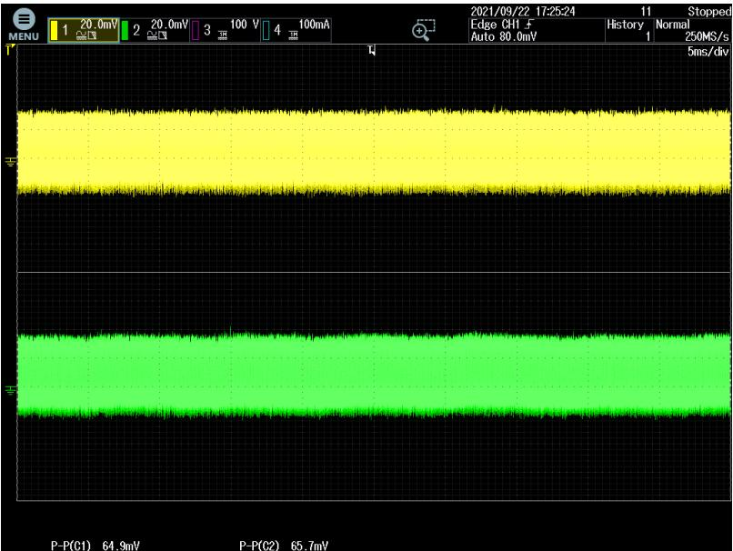

265 $\mathsf { v } _ { \mathsf { A C } }$

CH1 $\mathsf { V } _ { \mathsf { O U T - 5 V } }$ Ripple $V _ { P K - P K } = 6 4 . 9 m v$  
$\mathsf { C H } 2 \mathsf { V } _ { 0 \sqcup \mathsf { T } - 1 2 \mathsf { V } } \mathsf { R i p p l e }$ $V _ { P K - P K } { = } 6 5 . 7 m V$

Test Condition:

➢ Full Load

## 5V (50%-100% 12V )

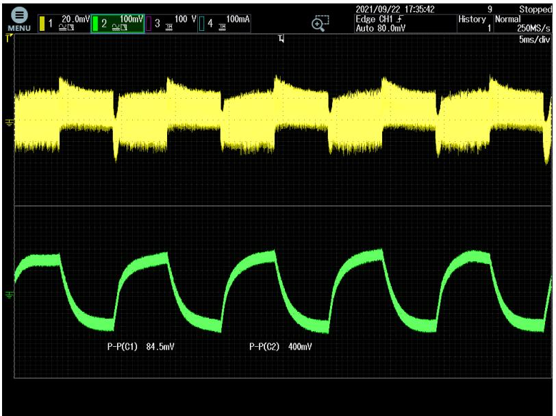

85 VAC

${ \mathsf { C H 1 } } \mathsf { V } _ { \mathsf { O U T } - { \mathsf { 5 v } } }$ CH1 VOUT-5V VPK-PK=84.5 mV $V _ { p | k - P K } = 8 4 . 5 m v$  
${ \mathsf { C H } } 2 { \mathsf { V } } _ { 0 \cup \mathsf { T } - 1 2 { \mathsf { V } } }$ CH2 VOUT-12V VPK-PK=400mV $\mathsf { V } _ { \mathsf { P K - P K } } { = } 4 0 0 \mathsf { m V }$

## Test Condition:

➢ $0 . 1 7 5 ~ \mathsf { A } – 0 . 3 5 ~ \mathsf { A } – 0 . 1 7 5 ~ \mathsf { A }$  
➢ $1 2 \mathsf { V } / 0 . 2 5 \mathsf { A }$  
➢ Slew Rate: 0.5 A/μS  
➢ Frequency: 100 Hz

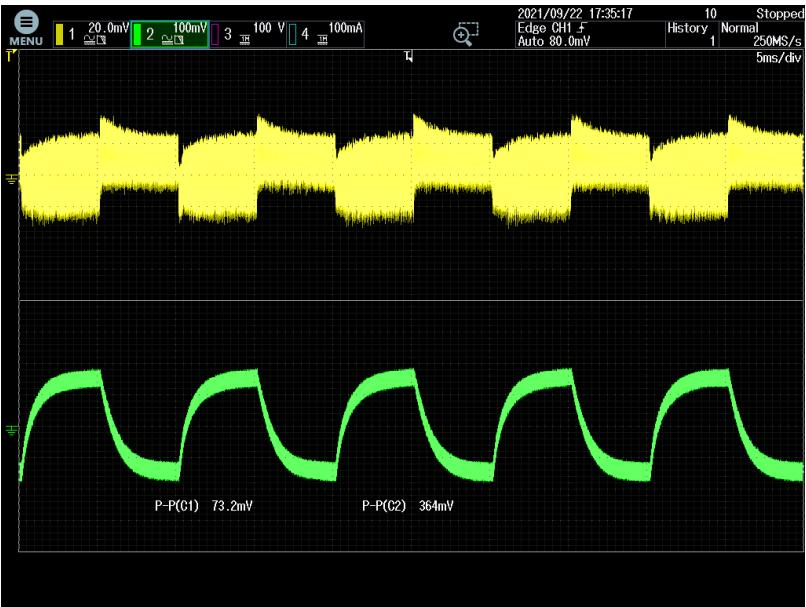

115 VAC

${ \mathsf { C H 1 } } \mathsf { V } _ { \mathsf { O U T } - { \mathsf { 5 v } } }$ CH1 VOUT-5V VPK-PK=73.2mV $V _ { p | c - P K } = 7 3 . 2 m v$  
${ \mathsf { C H } } 2 { \mathsf { V } } _ { 0 \cup \mathsf { T } - 1 2 { \mathsf { V } } }$ CH2 VOUT-12V VPK-PK=364 mV $V _ { \mathsf { P K - P K } } { = } 3 6 4 ~ \mathsf { m V }$

## Test Condition:

➢ $0 . 1 7 5 ~ \mathsf { A } – 0 . 3 5 ~ \mathsf { A } – 0 . 1 7 5 ~ \mathsf { A }$  
➢ $1 2 \mathsf { V } / 0 . 2 5 \mathsf { A }$  
➢ Slew Rate: 0.5 A/μS  
➢ Frequency: 100 Hz

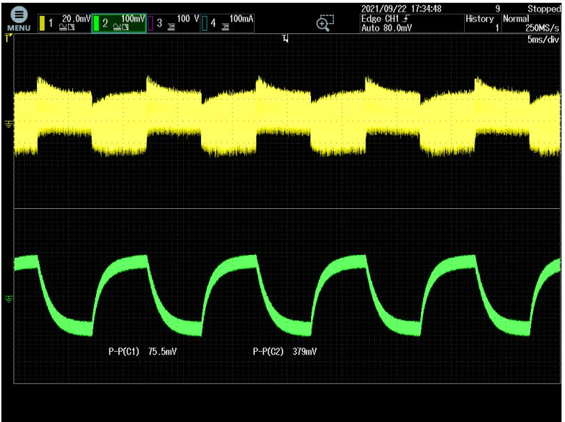

230 VAC

CH1 VOUT-5V $\mathsf { V } _ { \mathsf { O U T - S V } }$ VPK-PK=75.5 mV $V _ { p | c - P K } { = } 7 5 . 5 m v$  
${ \mathsf { C H } } 2 { \mathsf { V } } _ { 0 \cup \mathsf { T } - 1 2 { \mathsf { V } } }$ CH2 VOUT-12V VPK-PK=379 mV $V _ { P K - P K } { = } 3 7 9 m v$

## Test Condition:

➢ 0.175 A-0.35 A-0.175 A  
➢ $1 2 \mathsf { V } / 0 . 2 5 \mathsf { A }$  
➢ Slew Rate: 0.5 A/μS  
➢ Frequency: 100 Hz

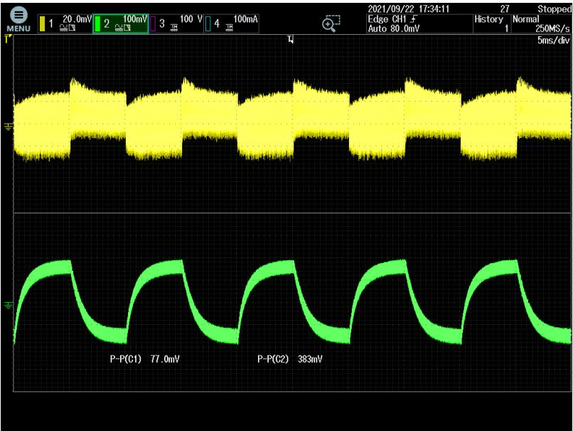

265 VAC

${ \mathsf { C H 1 } } \mathsf { V } _ { \mathsf { O U T } - { \mathsf { 5 v } } }$ CH1 VOUT-5V $v _ { p \vert x - P K } = 7 7 m v$  
${ \mathsf { C H } } 2 { \mathsf { V } } _ { 0 \cup \mathsf { T } - 1 2 { \mathsf { V } } }$ CH2 VOUT-12V $V _ { \mathsf { P K - P K } } { = } 3 8 3 ~ \mathsf { m V }$

## Test Condition:

➢ 0.175 A-0.35 A-0.175 A  
➢ $1 2 \mathsf { V } / 0 . 2 5 \mathsf { A }$  
➢ Slew Rate: 0.5 A/μS  
➢ Frequency: 100 Hz

## 12V (50%-100% 5V )

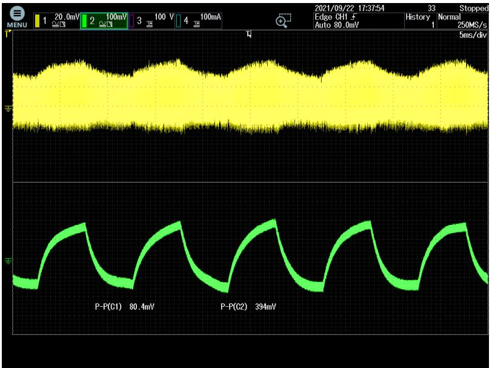

85 VAC

${ \mathsf { C H 1 } } \mathsf { V } _ { \mathsf { O U T } - { \mathsf { 5 v } } }$ CH1 VOUT-5V VPK-PK=80.4 mV $V _ { \mathsf { P K - P K } } { = } 8 0 . 4 ~ \mathsf { m V }$  
${ \mathsf { C H } } 2 { \mathsf { V } } _ { 0 \cup \mathsf { T } - 1 2 { \mathsf { V } } }$ CH2 VOUT-12V VPK-PK=394mV $\mathsf { V } _ { \mathsf { P K - P K } } { = } 3 9 4 \mathsf { m V }$

## Test Condition:

➢ 5V/0.35A  
➢ 0.125 A-0.25 A-0.125 A  
➢ Slew Rate: 0.5 A/μS  
➢ Frequency: 100 Hz

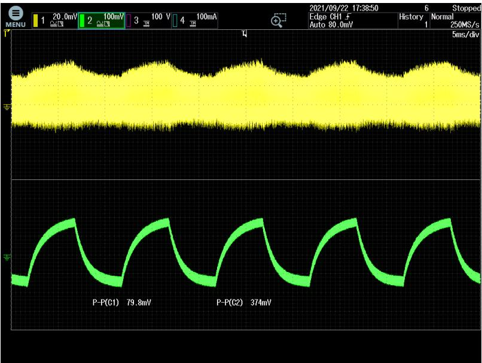

115 VAC

${ \mathsf { C H 1 } } \mathsf { V } _ { \mathsf { O U T } - { \mathsf { 5 v } } }$ CH1 VOUT-5V VPK-PK=79.8 mV $V _ { \mathsf { P K - P K } } { = } 7 9 . 8 ~ \mathsf { m V }$  
${ \mathsf { C H } } 2 { \mathsf { V } } _ { 0 \cup \mathsf { T } - 1 2 { \mathsf { V } } }$ CH2 VOUT-12V $V _ { p | c - P K } = 3 7 4 m v$

## Test Condition:

➢ $5 \mathsf { V } / 0 . 3 5 \mathsf { A }$  
➢ $0 . 1 2 5 ~ \mathsf { A } – 0 . 2 5 ~ \mathsf { A } – 0 . 1 2 5 ~ \mathsf { A }$  
➢ Slew Rate: 0.5 A/μS  
➢ Frequency: 100 Hz

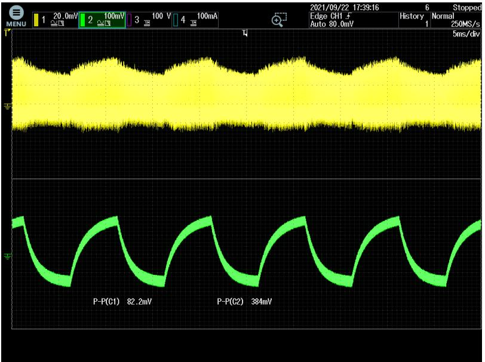

230 VAC

CH1 VOUT-5V $\mathsf { V } _ { \mathsf { O U T - S V } }$ VPK-PK=82.2 mV $V _ { p | c - P K } = 8 2 . 2 m v$  
CH2 VOUT-12V $\mathsf { V } _ { \mathsf { O U T } - 1 2 \mathsf { V } }$ VPK-PK=384 mV $V _ { \mathsf { P K - P K } } { = } 3 8 4 ~ \mathsf { m V }$

## Test Condition:

➢ 5V/0.35A  
➢ 0.125 A-0.25 A-0.125 A  
➢ Slew Rate: 0.5 A/μS  
➢ Frequency: 100 Hz

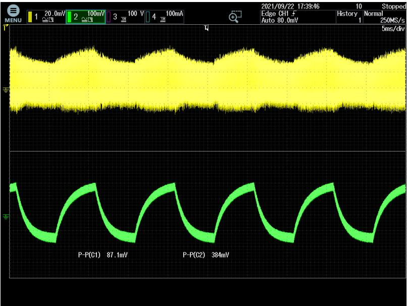

265 VAC

CH1 VOUT-5V ${ \mathsf { C H 1 } } \mathsf { V } _ { \mathsf { O U T } - { \mathsf { 5 v } } }$ VPK-PK=87.1 mV $V _ { \mathsf { P K - P K } } { = } 8 7 . 1 \mathsf { m V }$  
${ \mathsf { C H } } 2 { \mathsf { V } } _ { 0 \cup \mathsf { T } - 1 2 { \mathsf { V } } }$ CH2 VOUT-12V $\mathsf { V } _ { \mathsf { P K - P K } } { = } 3 8 4 \mathsf { m V }$

## Test Condition:

➢ 5V/0.35A  
➢ 0.125 A-0.25 A-0.125 A  
➢ Slew Rate: 0.5 A/μS  
➢ Frequency: 100 Hz

## 5V (10%-90% 12V )

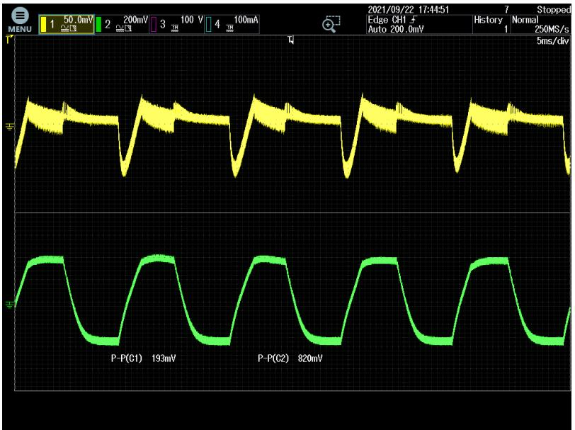

85 VAC

${ \mathsf { C H 1 } } \mathsf { V } _ { \mathsf { O U T } - { \mathsf { 5 v } } }$ CH1 VOUT-5V VPK-PK=193 mV $\mathsf { V } _ { \mathsf { P K - P K } } \mathsf { = } \mathsf { 1 9 3 \ m V }$  
${ \mathsf { C H } } 2 { \mathsf { V } } _ { 0 \cup \mathsf { T } - 1 2 { \mathsf { V } } }$ CH2 VOUT-12V VPK-PK=820mV $\mathsf { V } _ { \mathsf { P K - P K } } { = } 8 2 0 \mathsf { m V }$

## Test Condition:

➢ $0 . 0 4 \ A { - } 0 . 3 1 5 \ A { - } 0 . 3 1 5 \ A$  
➢ $1 2 \mathsf { V } / 0 . 2 5 \mathsf { A }$  
➢ Slew Rate: 0.5 A/μS  
➢ Frequency: 100 Hz

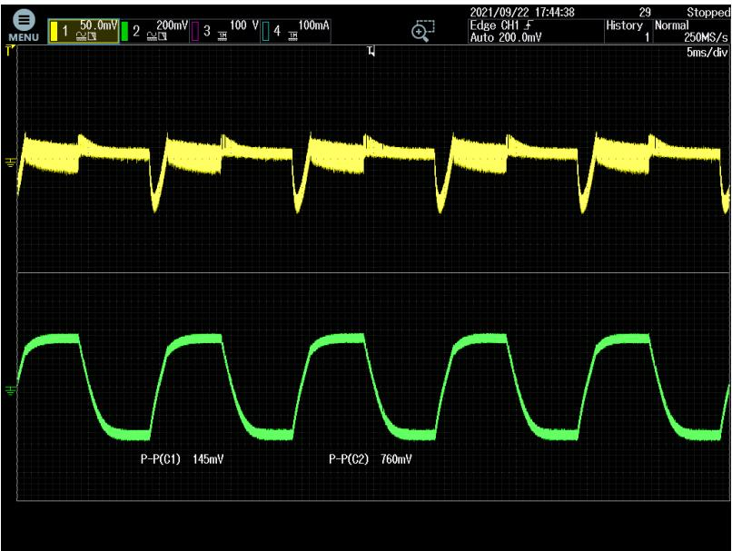

115 VAC

${ \mathsf { C H 1 } } \mathsf { V } _ { \mathsf { O U T } - { \mathsf { 5 v } } }$ CH1 VOUT-5V VPK-PK=145mV $\mathsf { V } _ { \mathsf { P K - P K } } { = } 1 4 5 \mathsf { m V }$  
${ \mathsf { C H } } 2 { \mathsf { V } } _ { 0 \cup \mathsf { T } - 1 2 { \mathsf { V } } }$ CH2 VOUT-12V VPK-PK=760 mV $v _ { p _ { k - P K } } { = } 7 6 0 ~ \mathsf { m V }$

## Test Condition:

➢ $0 . 0 4 \ A { - } 0 . 3 1 5 \ A { - } 0 . 3 1 5 \ A$  
➢ $1 2 \mathsf { V } / 0 . 2 5 \mathsf { A }$  
➢ Slew Rate: 0.5 A/μS  
➢ Frequency: 100 Hz

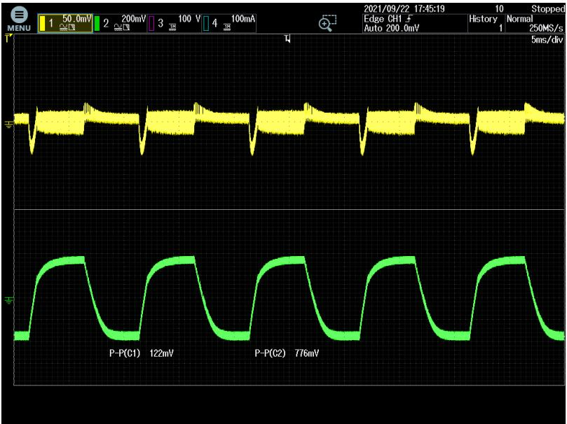

230 VAC

CH1 VOUT-5V $\mathsf { V } _ { \mathsf { O U T - S V } }$ VPK-PK=122 mV $v _ { p | c \cdot P K } = 1 2 2 m v$  
CH2 VOUT-12V $\mathsf { V } _ { \mathsf { O U T } - 1 2 \mathsf { V } }$ VPK-PK=776mV $\mathsf { V } _ { \mathsf { P K - P K } } { = } 7 7 6 \mathsf { m v }$

## Test Condition:

➢ 0.04 A-0.315 A-0.315 A  
➢ $1 2 \mathsf { V } / 0 . 2 5 \mathsf { A }$  
➢ Slew Rate: 0.5 A/μS  
➢ Frequency: 100 Hz

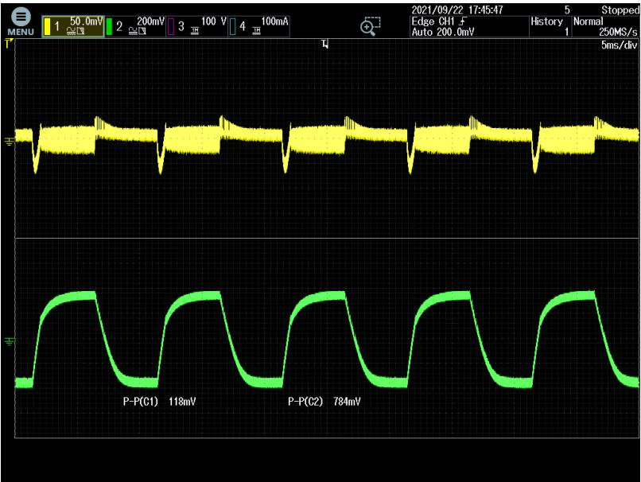

265 VAC

${ \mathsf { C H 1 } } \mathsf { V } _ { \mathsf { O U T } - { \mathsf { 5 v } } }$ CH1 VOUT-5V VPK-PK=118 mV $v _ { \mathsf { P K - P K } } { = } 1 1 8 \mathsf  m v$  
${ \mathsf { C H } } 2 { \mathsf { V } } _ { 0 \cup \mathsf { T } - 1 2 { \mathsf { V } } }$ CH2 VOUT-12V $\mathsf { V } _ { \mathsf { P K - P K } } { = } 7 8 4 \mathsf { m V }$

## Test Condition:

➢ 0.04 A-0.315 A-0.315 A  
➢ $1 2 \mathsf { V } / 0 . 2 5 \mathsf { A }$  
➢ Slew Rate: 0.5 A/μS  
➢ Frequency: 100 Hz

## 12V (50%-100% 5V )

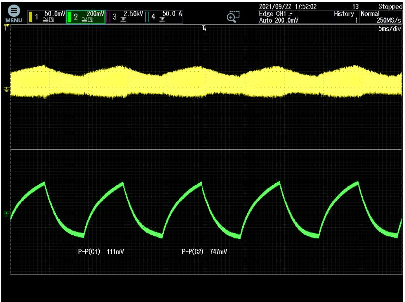

85 VAC

${ \mathsf { C H 1 } } \mathsf { V } _ { \mathsf { O U T } - { \mathsf { 5 v } } }$ CH1 VOUT-5V VPK-PK=111mV $\mathsf { V } _ { \mathsf { P K - P K } } { = } \pmb { 1 } \pmb { 1 } \mathsf { 1 } \mathsf { m } \mathsf { V }$  
${ \mathsf { C H } } 2 { \mathsf { V } } _ { 0 \cup \mathsf { T } - 1 2 { \mathsf { V } } }$ CH2 VOUT-12V VPK-PK=747mV $\mathsf { V } _ { \mathsf { P K - P K } } { = } 7 4 7 \mathsf { m V }$

## Test Condition:

➢ $5 \mathsf { V } / 0 . 3 5 \mathsf { A }$  
➢ $0 . 0 2 5 \mathsf { A } \mathsf { - } 0 . 2 2 5 \mathsf { A } \mathsf { - } 0 . 0 2 5 \mathsf { A }$  
➢ Slew Rate: $0 . 5 \mathsf { A } / \mu \mathsf { S }$  
➢ Frequency: 100 Hz

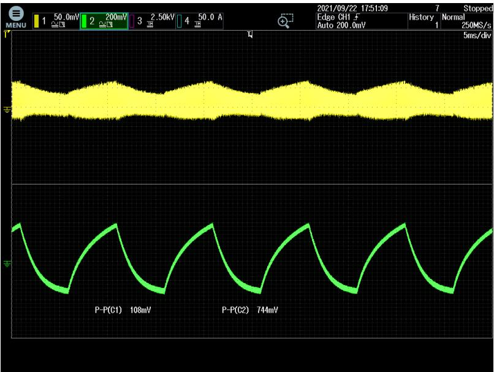

115 VAC

${ \mathsf { C H 1 } } \mathsf { V } _ { \mathsf { O U T } - { \mathsf { 5 v } } }$ CH1 VOUT-5V VPK-PK=108mV $\mathsf { V } _ { \mathsf { P K - P K } } { = } 1 0 8 \mathsf { m V }$  
${ \mathsf { C H } } 2 { \mathsf { V } } _ { 0 \cup \mathsf { T } - 1 2 { \mathsf { V } } }$ CH2 VOUT-12V VPK-PK=744mV $V _ { P K - P K } = 7 4 4 m v$

## Test Condition:

➢ $5 \mathsf { V } / 0 . 3 5 \mathsf { A }$  
➢ $0 . 0 2 5 \mathsf { A } \mathsf { - } 0 . 2 2 5 \mathsf { A } \mathsf { - } 0 . 0 2 5 \mathsf { A }$  
➢ Slew Rate: 0.5 A/μS  
➢ Frequency: 100 Hz

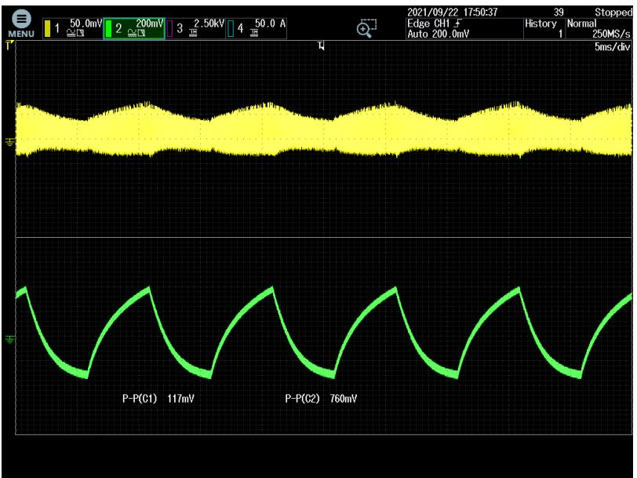

230 VAC

CH1 VOUT-5V $\mathsf { V } _ { \mathsf { O U T - S V } }$ VPK-PK=117 mV $\mathtt { V } _ { \mathtt { P K - P K } } = \mathtt { 1 1 7 } \mathtt { m V }$  
CH2 VOUT-12V $\mathsf { V } _ { \mathsf { O U T } - 1 2 \mathsf { V } }$ VPK-PK=760 mV $v _ { p _ { k - P K } } { = } 7 6 0 ~ \mathsf { m V }$

## Test Condition:

➢ 5V/0.35A  
➢ 0.025A-0.225 A-0.025 A  
➢ Slew Rate: 0.5 A/μS  
➢ Frequency: 100 Hz

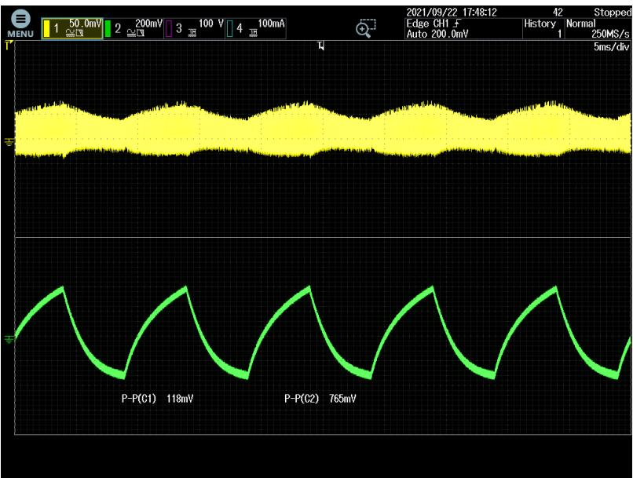

265 VAC

${ \mathsf { C H 1 } } \mathsf { V } _ { \mathsf { O U T } - { \mathsf { 5 v } } }$ CH1 VOUT-5V VPK-PK=118mV $\mathsf { V } _ { \mathsf { P K - P K } } { = } \pmb { 1 } \pmb { 1 } 8 \mathsf { m V }$  
${ \mathsf { C H } } 2 { \mathsf { V } } _ { 0 \cup \mathsf { T } - 1 2 { \mathsf { V } } }$ CH2 VOUT-12V $\mathsf { V } _ { \mathsf { P K - P K } } { = } 7 6 5 \mathsf { m V }$

## Test Condition:

➢ $5 \mathsf { V } / 0 . 3 5 \mathsf { A }$  
➢ 0.025A-0.225 A-0.025 A  
➢ Slew Rate: 0.5 A/μS  
➢ Frequency: 100 Hz

## 输出电压开机波形

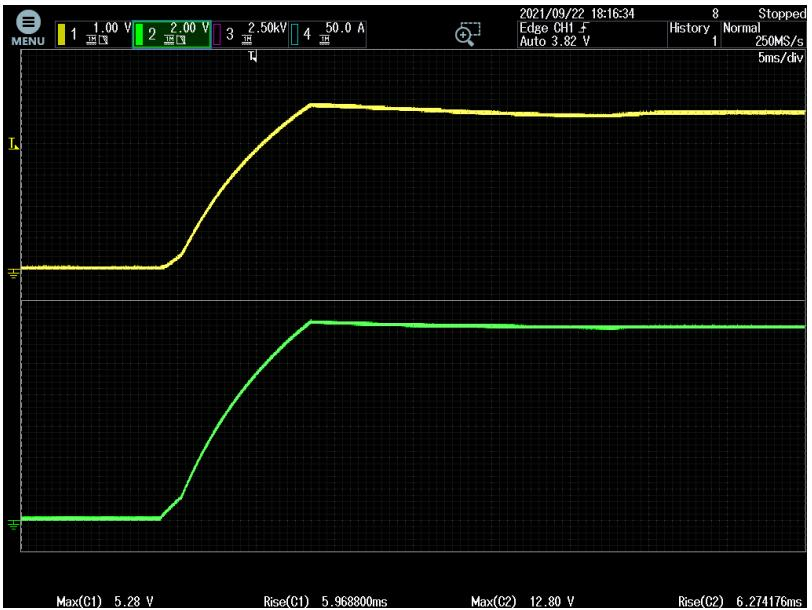

85 VAC

CH1 VOUT-5V  
CH2 VOUT-12V

$$
T _ {R I S E}: 5. 9 7 \mathrm{mS}
$$

$$
T _ {R I S E}: 6. 2 7 \mathrm{mS}
$$

## Test Condition:

➢ No Load

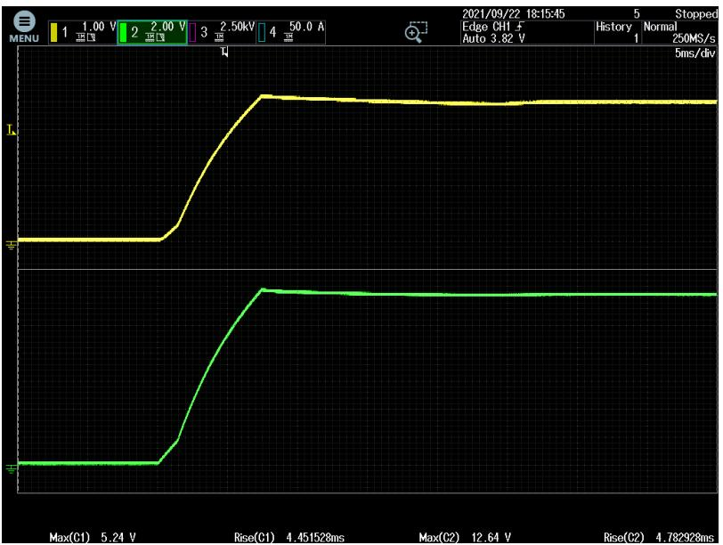

265 VAC

CH1 VOUT-5V  
CH2 VOUT-12V

$$
T _ {R I S E}: 4. 4 5 \mathrm{mS}
$$

$$
T _ {R I S E}: 4. 7 8 \mathrm{mS}
$$

## Test Condition:

➢ No Load

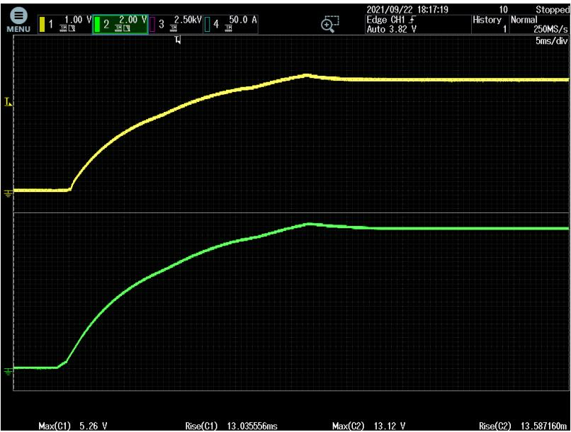

85 VAC

CH1 VOUT-5V  
CH2 VOUT-12V

$$
T _ {R I S E}: 1 3 m S
$$

$$
T _ {R I S E}: 1 3. 5 9 \mathrm{mS}
$$

## Test Condition:

➢ Full Load

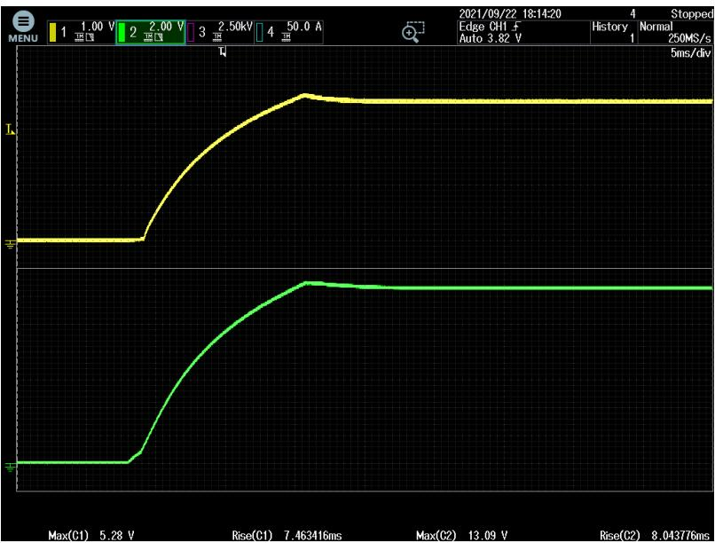

265 VAC

CH1 VOUT-5V  
CH2 VOUT-12V

$$
T _ {R I S E}: 7. 4 6 \mathrm{mS}
$$

$$
T _ {R I S E}: 8. 0 4 \mathrm{mS}
$$

## Test Condition:

➢ Full Load

## MOSFET

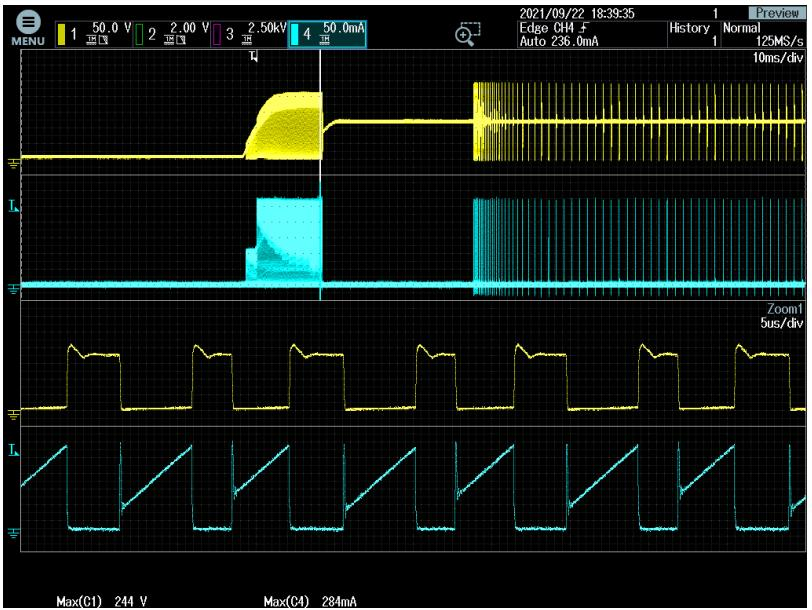

85 VAC  
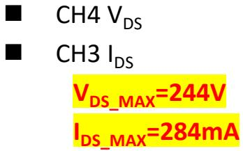

Test Condition:

➢ No Load

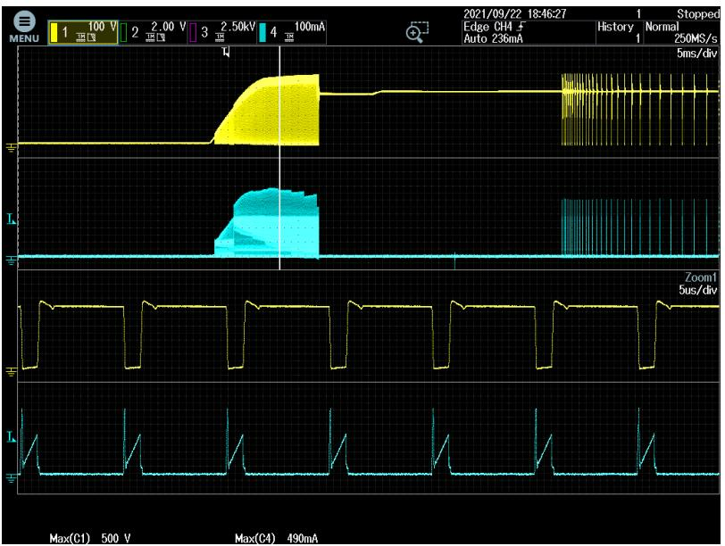

265 VAC  
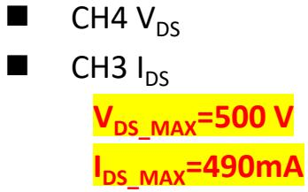

Test Condition:

➢ No Load

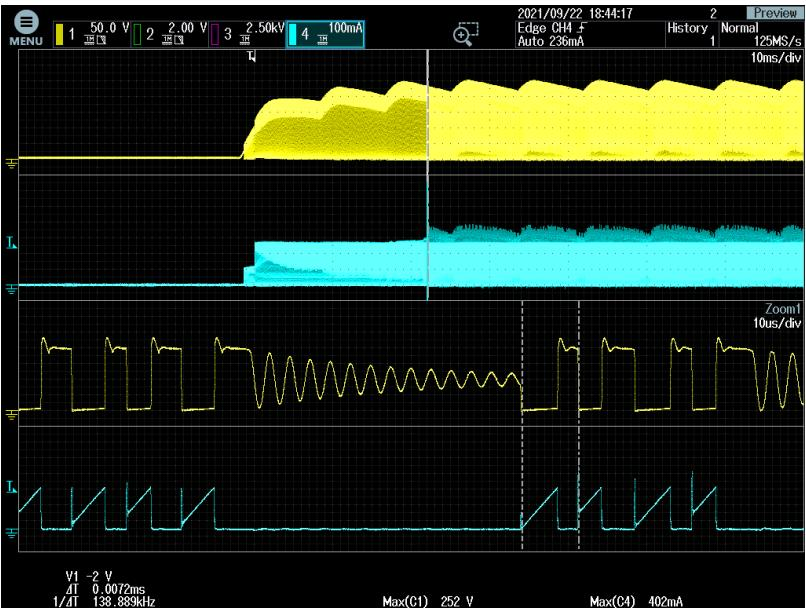

85 VAC  
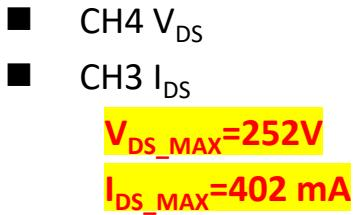

Test Condition:

➢ Full Load

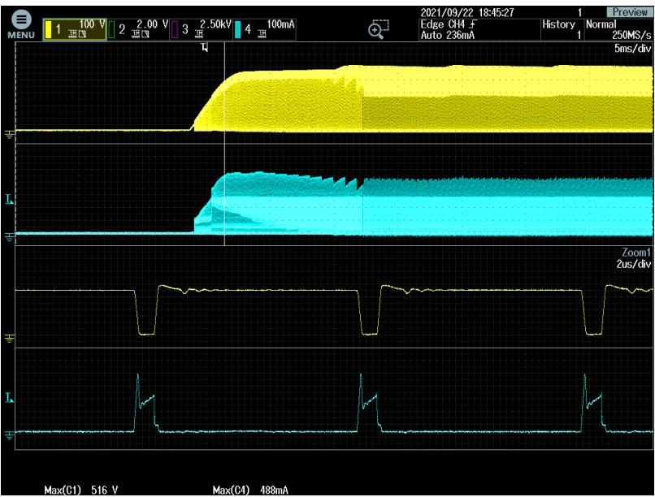

265 VAC  
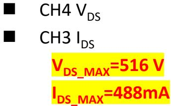

Test Condition:

➢ Full Load

## MOSFET

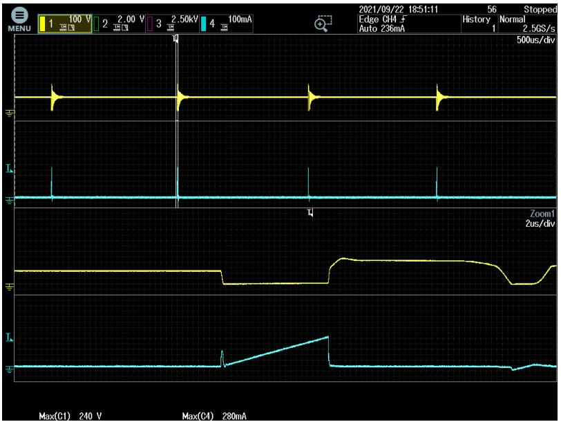

85 VAC  
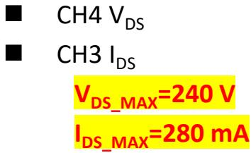

Test Condition:

➢ No Load

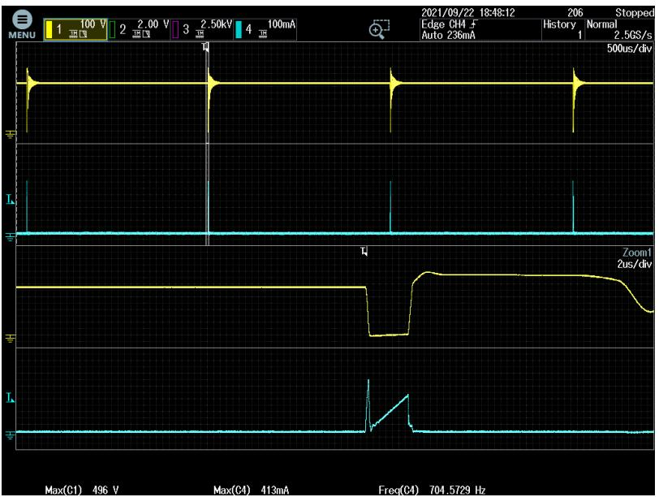

265 VAC  
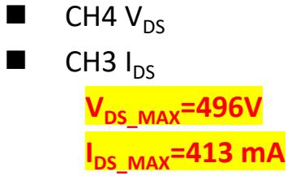

Test Condition:

➢ No Load

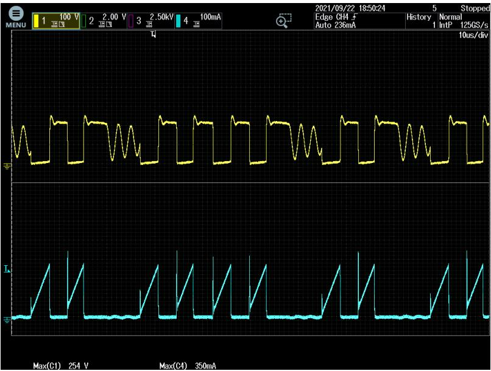

85 VAC  

Test Condition:

➢ Full Load

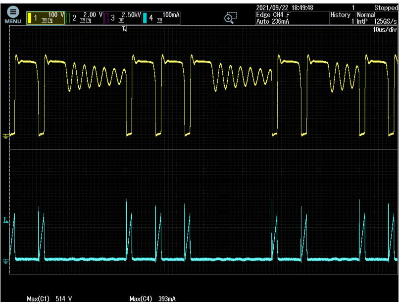

265 VAC  
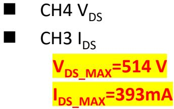

Test Condition:

➢ Full Load

## 续流二极管开机波形


85 VAC  


Test Condition:

➢ No Load


265 VAC  


Test Condition:

➢ No Load


85 VAC  


Test Condition:

➢ Full Load


265 VAC  


Test Condition:

➢ Full Load

## 续流二极管稳态波形


85 VAC  

Test Condition:

➢ No Load


265 VAC  


Test Condition:

➢ No Load


85 VAC  


Test Condition:

➢ Full Load

265 VAC  

Test Condition:

➢ Full Load

## MOSFET


85 VAC

CH4 $\mathsf { V } _ { \mathsf { D } \mathsf { S } }$  
CH3 $\mathsf { I } _ { \mathsf { D } \mathsf { S } }$

$$
\begin{array}{l} \mathrm {V_ {DS\_MAX}} = 2 5 6 \mathrm{V} \\ \mathrm {I_ {DS\_MAX}} = 3 7 6 \mathrm{mA} \end{array}
$$


115 VAC

CH4 VDS  
CH3 IDS

$$
\begin{array}{l} V _ {D S \_ M A X} = 3 0 0 \mathrm{V} \\ I _ {D S \_ M A X} = 3 7 2 \mathrm{mA} \end{array}
$$


230 VAC

CH4 VDS  
CH3 IDS

$$
\begin{array}{l} \mathrm {V_ {DS\_MAX}} = 4 6 4 \mathrm{V} \\ \mathrm {I_ {DS\_MAX}} = 4 8 8 \mathrm{mA} \end{array}
$$


265 VAC

CH4 VDS

$$
\begin{array}{l} V _ {D S \_ M A X} = 5 1 6 \mathrm{V} \\ I _ {D S \_ M A X} = 5 3 6 \mathrm{mA} \end{array}
$$

## 温升测试

<table><tr><td rowspan="2">项目1#</td><td colspan="2">85VAC</td><td colspan="2">115VAC</td><td colspan="2">230VAC</td><td colspan="2">265VAC</td></tr><tr><td>温度(°C)</td><td>温升(°C)</td><td>温度(°C)</td><td>温升(°C)</td><td>温度(°C)</td><td>温升(°C)</td><td>温度(°C)</td><td>温升(°C)</td></tr><tr><td>环境温度</td><td colspan="2">66.77</td><td colspan="2">64.81</td><td colspan="2">62.77</td><td colspan="2">63.8</td></tr><tr><td>BPA804D (U1)</td><td>117.62</td><td>50.85</td><td>102.37</td><td>37.56</td><td>89</td><td>26.23</td><td>92.32</td><td>28.52</td></tr><tr><td>变压器绕组(T1)</td><td>79.44</td><td>12.67</td><td>78.05</td><td>13.24</td><td>78.7</td><td>15.93</td><td>80.28</td><td>16.48</td></tr><tr><td>变压器磁芯(T1)</td><td>77.12</td><td>10.35</td><td>76.45</td><td>11.64</td><td>77.97</td><td>15.2</td><td>79.56</td><td>15.76</td></tr><tr><td>输出肖特基(5V)</td><td>77.43</td><td>10.66</td><td>76.58</td><td>11.77</td><td>76.93</td><td>14.16</td><td>78.07</td><td>14.27</td></tr><tr><td>输出肖特基(12V)</td><td>74.9</td><td>8.13</td><td>74.35</td><td>9.54</td><td>74.66</td><td>11.89</td><td>75.75</td><td>11.95</td></tr><tr><td>输入电解电容(C2)</td><td>80.13</td><td>13.36</td><td>75.08</td><td>10.27</td><td>70.58</td><td>7.81</td><td>72.07</td><td>8.27</td></tr><tr><td>输出电解电容(5V)</td><td>68.44</td><td>1.67</td><td>66.94</td><td>2.13</td><td>67.2</td><td>4.43</td><td>68.18</td><td>4.38</td></tr></table>

<table><tr><td rowspan="2">项目2#</td><td colspan="2">85VAC</td><td colspan="2">115VAC</td><td colspan="2">230VAC</td><td colspan="2">265VAC</td></tr><tr><td>温度(°C)</td><td>温升(°C)</td><td>温度(°C)</td><td>温升(°C)</td><td>温度(°C)</td><td>温升(°C)</td><td>温度(°C)</td><td>温升(°C)</td></tr><tr><td>环境温度</td><td colspan="2">67.3</td><td colspan="2">68.18</td><td colspan="2">65.27</td><td colspan="2">65.31</td></tr><tr><td>BPA804D (U1)</td><td>OTP</td><td>OTP</td><td>117.87</td><td>49.69</td><td>96.19</td><td>30.92</td><td>99.15</td><td>33.84</td></tr><tr><td>变压器绕组(T1)</td><td>-</td><td>-</td><td>84.02</td><td>15.84</td><td>85.32</td><td>20.05</td><td>85.54</td><td>20.23</td></tr><tr><td>变压器磁芯(T1)</td><td>-</td><td>-</td><td>81.74</td><td>13.56</td><td>84.33</td><td>19.06</td><td>84.57</td><td>19.26</td></tr><tr><td>输出肖特基(5V)</td><td>-</td><td>-</td><td>83.11</td><td>14.93</td><td>84.23</td><td>18.96</td><td>84.32</td><td>19.01</td></tr><tr><td>输出肖特基(12V)</td><td>-</td><td>-</td><td>78.69</td><td>10.51</td><td>79.93</td><td>14.66</td><td>80.02</td><td>14.71</td></tr><tr><td>输入电解电容(C2)</td><td>-</td><td>-</td><td>80.56</td><td>12.38</td><td>74.29</td><td>9.02</td><td>74.98</td><td>9.67</td></tr><tr><td>输出电解电容(5V)</td><td>-</td><td>-</td><td>69.96</td><td>1.78</td><td>71.05</td><td>5.78</td><td>70.98</td><td>5.67</td></tr></table>


## 测试说明

➢ 在温箱中进行测试  
➢ 电路板放在一个封闭的盒子内  
➢ 热电偶连接到各个测量点  
➢ 等测量点温度达到稳定后记录数据  
➢ 项目1#输出负载5V/0.25A 12V/0.2A  
➢ 项目2#输出负载5V/0.35A 12V/0.25A


115VAC Line


230VAC Line


115VAC Neutral


230VAC Neutral

<table><tr><td>差模</td><td>电压</td><td>相位角</td><td>发生器阻抗</td><td>测试次数</td><td>测试结果</td></tr><tr><td>L to N</td><td>+2kV</td><td>0</td><td>2</td><td>10</td><td>Pass</td></tr><tr><td>L to N</td><td>-2kV</td><td>0</td><td>2</td><td>10</td><td>Pass</td></tr><tr><td>L to N</td><td>+2kV</td><td>90</td><td>2</td><td>10</td><td>Pass</td></tr><tr><td>L to N</td><td>-2kV</td><td>90</td><td>2</td><td>10</td><td>Pass</td></tr><tr><td>L to N</td><td>+2kV</td><td>180</td><td>2</td><td>10</td><td>Pass</td></tr><tr><td>L to N</td><td>-2kV</td><td>180</td><td>2</td><td>10</td><td>Pass</td></tr><tr><td>L to N</td><td>+2kV</td><td>270</td><td>2</td><td>10</td><td>Pass</td></tr><tr><td>L to N</td><td>-2kV</td><td>270</td><td>2</td><td>10</td><td>Pass</td></tr></table>

## 测试说明

➢ 按照GB/T17626.5和IEC61000-4-5的最新版本要求进行测试  
➢ 室温环境，230VAC输入，满载条件  
➢ 输入1.2/50us组合波浪涌电压  
➢ 每个测试点重复10次  
➢ 每次间隔时间1分钟  
➢ 试验时样机输出正常（符合A类标准）视为Pass

<table><tr><td>差模</td><td>电压</td><td>脉冲群持续时间</td><td>脉冲频率</td><td>测试时间</td><td>测试结果</td></tr><tr><td>L to N</td><td>+4kV</td><td>15ms</td><td>5kHz</td><td>120s</td><td>Pass</td></tr><tr><td>L to N</td><td>-4kV</td><td>15ms</td><td>5kHz</td><td>120s</td><td>Pass</td></tr><tr><td>L to N</td><td>+4kV</td><td>0.75ms</td><td>100kHz</td><td>120s</td><td>Pass</td></tr><tr><td>L to N</td><td>-4kV</td><td>0.75ms</td><td>100kHz</td><td>120s</td><td>Pass</td></tr><tr><td>L to N</td><td>+2kV</td><td>2ms</td><td>38kHz</td><td>120s</td><td>Pass</td></tr><tr><td>L to N</td><td>-2kV</td><td>2ms</td><td>38kHz</td><td>120s</td><td>Pass</td></tr><tr><td>L to N</td><td>+4kV</td><td>2ms</td><td>38kHz</td><td>120s</td><td>Pass</td></tr><tr><td>L to N</td><td>-4kV</td><td>2ms</td><td>38kHz</td><td>120s</td><td>Pass</td></tr></table>

## 测试说明

➢ 按照GB/T17626.4和IEC61000-4-4的最新版本要求进行测试  
➢ 室温环境，230VAC输入满载条件  
➢ 分别测试5kHz/100kHz/38kHz脉冲频率  
➢ 脉冲群周期为300ms  
➢ 每个测试条件测试时间120s  
➢ 试验时样机输出正常（符合A类标准）视为Pass


<table><tr><td>测试点</td><td>电压(V)</td><td>放电类型</td><td>放电次数</td><td>测试结果</td></tr><tr><td>Vo</td><td>+15kV</td><td>空气放电</td><td>10</td><td>Pass</td></tr><tr><td>Vo</td><td>-15kV</td><td>空气放电</td><td>10</td><td>Pass</td></tr><tr><td>GND</td><td>+15kV</td><td>空气放电</td><td>10</td><td>Pass</td></tr><tr><td>GND</td><td>-15kV</td><td>空气放电</td><td>10</td><td>Pass</td></tr><tr><td>Vo</td><td>+20kV</td><td>空气放电</td><td>10</td><td>Pass</td></tr><tr><td>Vo</td><td>-20kV</td><td>空气放电</td><td>10</td><td>Pass</td></tr><tr><td>GND</td><td>+20kV</td><td>空气放电</td><td>10</td><td>Pass</td></tr><tr><td>GND</td><td>-20kV</td><td>空气放电</td><td>10</td><td>Pass</td></tr></table>

## 测试说明

➢ 按照GB/T17626.2和IEC61000-4-2的最新版本要求进行测试  
➢ 室温环境，230VAC输入满载条件  
➢ 每个测试点重复10次  
➢ 分别对输出正端和地进行空气放电  
➢ 试验时样机输出正常（符合A类标准）视为Pass

## THANK YOU FOR WATCHING
