## BPA8604D 隔离参考设计

## (5V1A)

上海晶丰明源半导体股份有限公司

Shanghai Bright Power Semiconductor Co., Ltd.

王岩

时间：2021年7月232021-10-29

## 内容

BPA8604D简介  
电源规格  
电路及实物图  
BOM  
PCB Layout图  
性能测试数据

## 产品特点：

➢ 集成 700V 高压 MOSFET  
➢ ON/OFF控制模式，快速的动态响应  
➢ 内置软启动功能  
➢ 集成高压启动、自供电电路  
通过MOSFET源极PCB散热，不影响EMI  
➢ 改善EMI的频率调制技术

## 应用领域：

➢ 家用电器辅助电源  
➢ 微波炉辅助电源

典型应用  
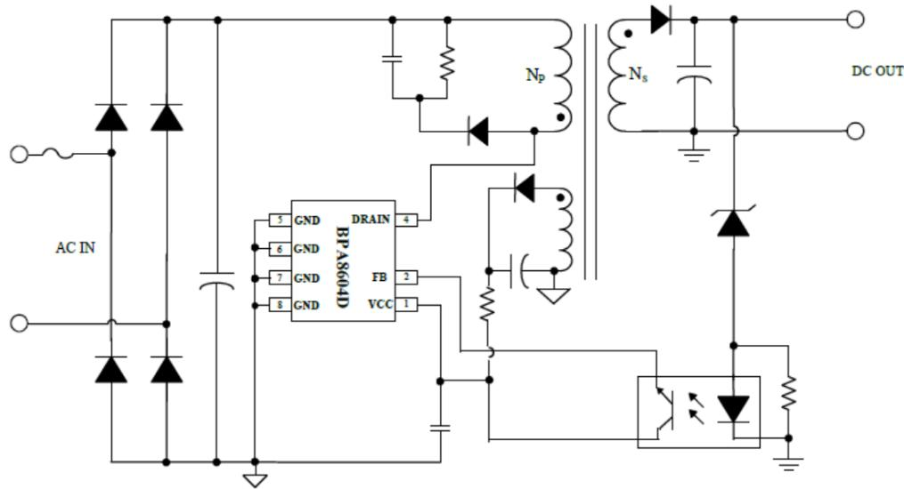

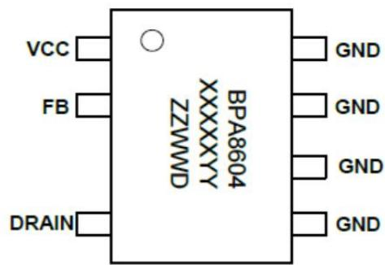

SOP-7封装

<table><tr><td>项目描述</td><td>符号</td><td>最小</td><td>典型</td><td>最大</td><td>单位</td><td>备注</td></tr><tr><td colspan="7">输入</td></tr><tr><td>电压</td><td> $V_{IN}$ </td><td>85</td><td>115/230</td><td>264</td><td> $V_{AC}$ </td><td></td></tr><tr><td>频率</td><td> $f_{LINE}$ </td><td>47</td><td>50/60</td><td>63</td><td>Hz</td><td></td></tr><tr><td colspan="7">输出</td></tr><tr><td>输出电压</td><td> $V_{OUT}$ </td><td>4.75</td><td>5</td><td>5.25</td><td>V</td><td>±5%</td></tr><tr><td>输出电流</td><td> $I_{OUT}$ </td><td>0</td><td></td><td>1000</td><td>mA</td><td></td></tr><tr><td>输出电压纹波</td><td> $V_{RIPPLE}$ </td><td></td><td></td><td>250</td><td>mV</td><td>20MHz带宽</td></tr><tr><td>连续输出功率</td><td> $P_{OUT}$ </td><td></td><td>5</td><td></td><td>W</td><td></td></tr><tr><td colspan="7">效率</td></tr><tr><td>待机功耗</td><td> $P_{STDBY}$ </td><td></td><td></td><td>75</td><td>mW</td><td>230VAC,包含假负载</td></tr><tr><td>满载效率</td><td>η</td><td>65</td><td></td><td></td><td>%</td><td></td></tr><tr><td colspan="7">环境</td></tr><tr><td>传导EMI</td><td></td><td colspan="4">满足CISPR22/EN55022 Class B,至少5dB 裕量</td><td></td></tr><tr><td>Surge</td><td></td><td></td><td>2</td><td></td><td>kV</td><td>差模</td></tr><tr><td>EFT</td><td></td><td></td><td>4</td><td></td><td>kV</td><td>5kHz/100kHz/38kHz</td></tr><tr><td>ESD</td><td></td><td></td><td>15</td><td>20</td><td>kV</td><td>空气放电</td></tr><tr><td>工作环境温度</td><td> $T_{AMP}$ </td><td>0</td><td></td><td>50</td><td>°C</td><td></td></tr></table>

## 电路及实物图

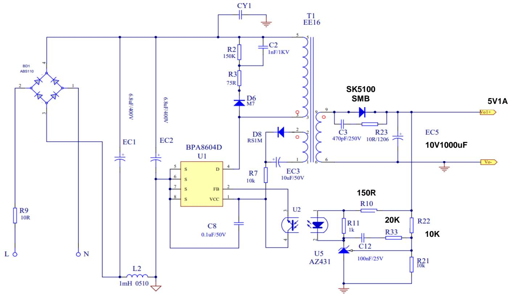

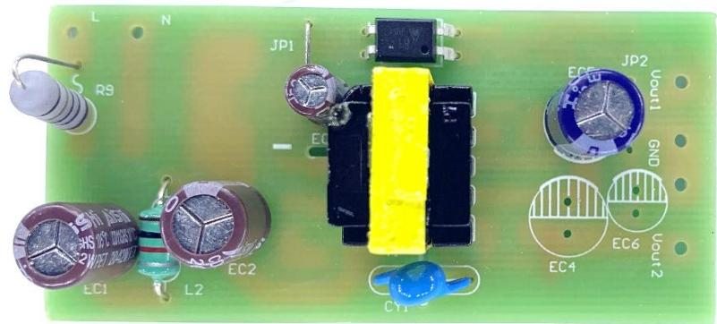

<table><tr><td>序号</td><td>元件标号</td><td>参数描述</td><td>封装尺寸</td><td>数量</td></tr><tr><td>1</td><td>PCB</td><td>CEM-1,单面板</td><td>72mm*33.5mm</td><td>1</td></tr><tr><td>2</td><td>R9</td><td>2W,10R 绕线保险丝电阻</td><td>DIP</td><td>1</td></tr><tr><td>3</td><td>EC1,EC2</td><td>400V6.8uF电解电容</td><td> $\phi 10*13$ </td><td>2</td></tr><tr><td>4</td><td>L2</td><td>色环电感1mH</td><td>510</td><td>1</td></tr><tr><td>5</td><td>J1</td><td>跳线0.6*5</td><td>DIP</td><td>1</td></tr><tr><td>6</td><td>U3</td><td>BPA8604D</td><td>DIP</td><td>1</td></tr><tr><td>7</td><td>EC3</td><td>50V10uF电解电容</td><td> $\phi 5*11$ </td><td>1</td></tr><tr><td>8</td><td>U2</td><td>PC817C 光耦</td><td>DIP</td><td>1</td></tr><tr><td>9</td><td>T1</td><td>EE16加高 1.8mH</td><td>DIP</td><td>1</td></tr><tr><td>10</td><td>EC5</td><td>10V/1000uF电解电容</td><td> $\phi 8*16mm$ </td><td>1</td></tr><tr><td>11</td><td>BD1</td><td>ABS210 2A1KV整流桥</td><td>SMD</td><td>1</td></tr><tr><td>12</td><td>D3</td><td>M7,1A,1KV 二极管</td><td>SMA</td><td>1</td></tr><tr><td>13</td><td>D8</td><td>RS1M 1A,1KV快速二极管</td><td>SOD123</td><td>1</td></tr><tr><td>14</td><td>D7</td><td>SS210 2A100V肖特基二极管</td><td>SMB</td><td>1</td></tr><tr><td>15</td><td>U5</td><td>AZ431</td><td>SOT23-3</td><td>1</td></tr></table>

<table><tr><td>序号</td><td>元件标号</td><td>参数描述</td><td>封装尺寸</td><td>数量</td></tr><tr><td>16</td><td>C2</td><td>1nF 1KV 贴片电容</td><td>SMD1206</td><td>1</td></tr><tr><td>17</td><td>R3</td><td>75R, ±5%</td><td>SMD1206</td><td>1</td></tr><tr><td>18</td><td>R2</td><td>150K, ±5%</td><td>SMD1206</td><td>1</td></tr><tr><td>19</td><td>R7</td><td>10K, ±5%</td><td>SMD0805</td><td>1</td></tr><tr><td>20</td><td>R23</td><td>10R,±5%</td><td>SMD0805</td><td>1</td></tr><tr><td>21</td><td>R21,R22</td><td>10K, ±1%</td><td>SMD0805</td><td>2</td></tr><tr><td>22</td><td>R11</td><td>1K, ±5%</td><td>SMD0805</td><td>1</td></tr><tr><td>23</td><td>R8</td><td>0R, ±5%</td><td>SMD0805</td><td>1</td></tr><tr><td>24</td><td>R33</td><td>20K, ±5%</td><td>SMD0805</td><td>1</td></tr><tr><td>25</td><td>R10</td><td>150R, ±5%</td><td>SMD0805</td><td>1</td></tr><tr><td>26</td><td>C8,C12</td><td>100nF/16V,X7R</td><td>SMD0805</td><td>1</td></tr><tr><td>27</td><td>C3</td><td>470pF/250V,X7R</td><td>SMD0805</td><td>1</td></tr><tr><td colspan="2"></td><td></td><td>Total</td><td>29</td></tr></table>

## 原理图

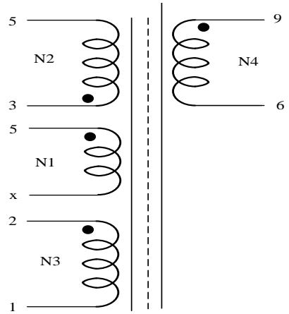

## 绕线方式

<table><tr><td>绕组</td><td>起始脚</td><td>终止脚</td><td>材料</td><td>匝数</td><td>绕线方式</td></tr><tr><td>N1</td><td>5</td><td>X</td><td> $\phi 0.15*2P$ </td><td>22Ts</td><td>密绕一层(PIN脚朝外)</td></tr><tr><td colspan="4">胶带</td><td>2.1Ts</td><td></td></tr><tr><td>N2</td><td>3</td><td>5</td><td> $\phi 0.16*1P$ </td><td>128Ts</td><td>密绕三层(PIN脚朝外)</td></tr><tr><td colspan="4">胶带</td><td>2.1Ts</td><td></td></tr><tr><td>N3</td><td>2</td><td>1</td><td> $\phi 0.15*2P$ </td><td>22Ts</td><td>密绕一层(PIN脚朝外)</td></tr><tr><td colspan="4">胶带</td><td>2.1Ts</td><td></td></tr><tr><td>N4</td><td>9</td><td>6</td><td>三层绝缘线 $\phi 0.7*1P$ </td><td>8Ts</td><td>密绕一层(PIN脚朝外)</td></tr><tr><td colspan="4">胶带</td><td>3Ts</td><td></td></tr></table>

## 规格与材料

➢ 初级绕组感量 $\mathsf { L } _ { \mathsf { p } } { = } 2 . 5 \mathsf { m H } { \pm } 7 \%$ （测试条件： 0.3V，100kHz）  
➢ 漏感量 $\mathrm { \cdot L _ { | k } } < 5 0 \mathrm { u } \mathrm { H }$  
➢ 骨架：EE16底部加高（5+5PIN）  
➢ 磁芯：EE16 PC40 或同等材质 ， ${ \mathsf { A } } { \mathsf { e } } = 1 9 . 2 { \mathsf { m m } } ^ { 2 }$  
➢ N1、N2、N3: 2UEW 漆包线  
➢ N4 : 三层绝缘线  
➢ 绝缘胶带:3M900 或同等材质  
➢ 耐压测试: 3KV, 50/60Hz, 1Min  
➢ 成品要求：浸凡立水

## 脚位图

## 效率以及输出过流点

<table><tr><td>输入电压</td><td>85VAC</td><td>115VAC</td><td>230VAC</td><td>265VAC</td></tr><tr><td>整机效率</td><td>67.7%</td><td>69.7%</td><td>70.9%</td><td>69.9%</td></tr></table>

## 输出电压纹波

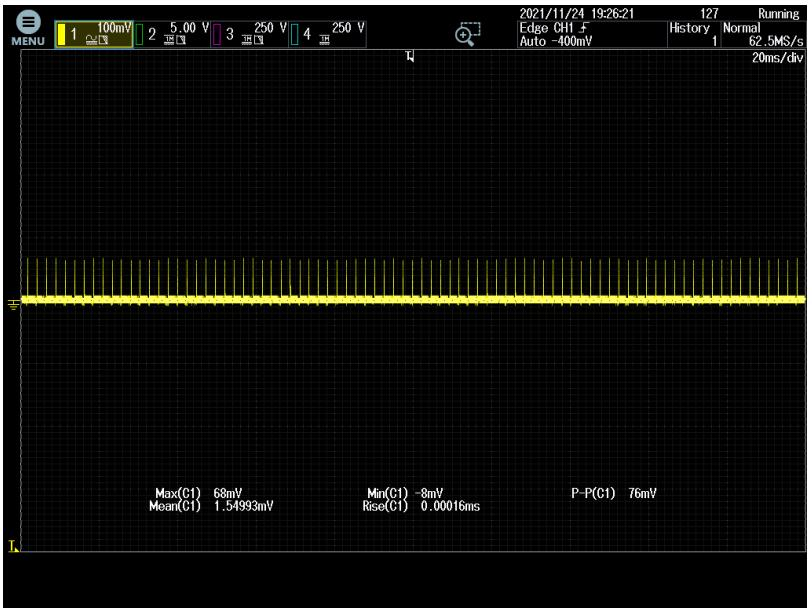

85 VAC

CH1 $\mathsf { V } _ { \mathsf { O U T } }$ Ripple $\mathsf { V } _ { \mathsf { P K - P K } } { = } 7 6 \mathsf { m } \mathsf { v }$

## Test Condition:

➢ Full Load

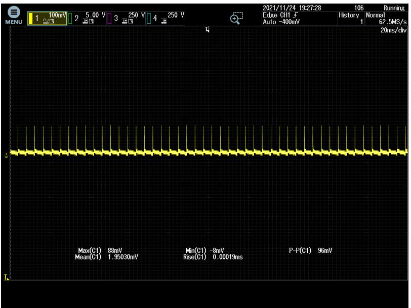

265 VAC

CH1 $\mathsf { V } _ { \mathsf { O U T } } \mathsf { R i p p l e }$ $\scriptstyle \mathsf { V } _ { \mathsf { P K - P K } } = 9 6 \mathsf { m } \mathsf { V }$

## Test Condition:

➢ Full Load

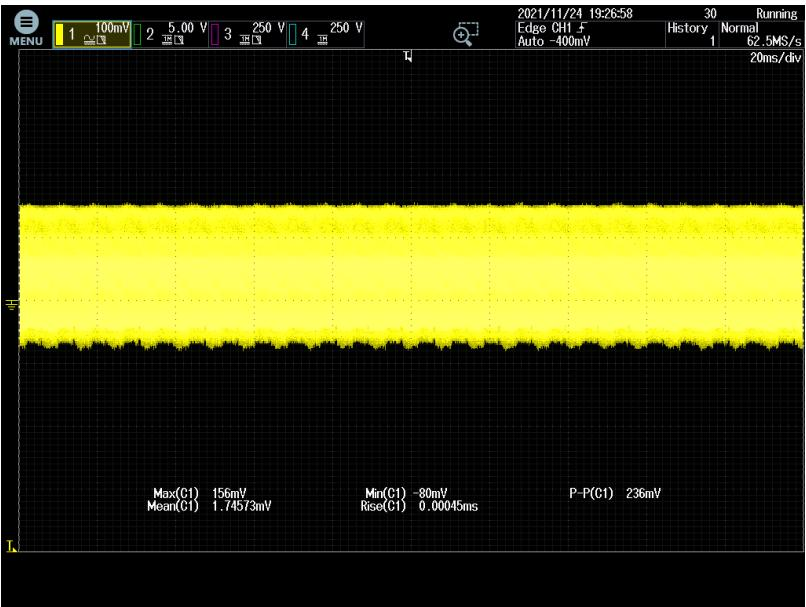

85 VAC

CH1 $\mathsf { V } _ { \mathsf { O U T } }$ Ripple $\mathsf { V } _ { \mathsf { P K - P K } } { = } 2 3 6 \mathsf { m V }$

## Test Condition:

➢ Full Load

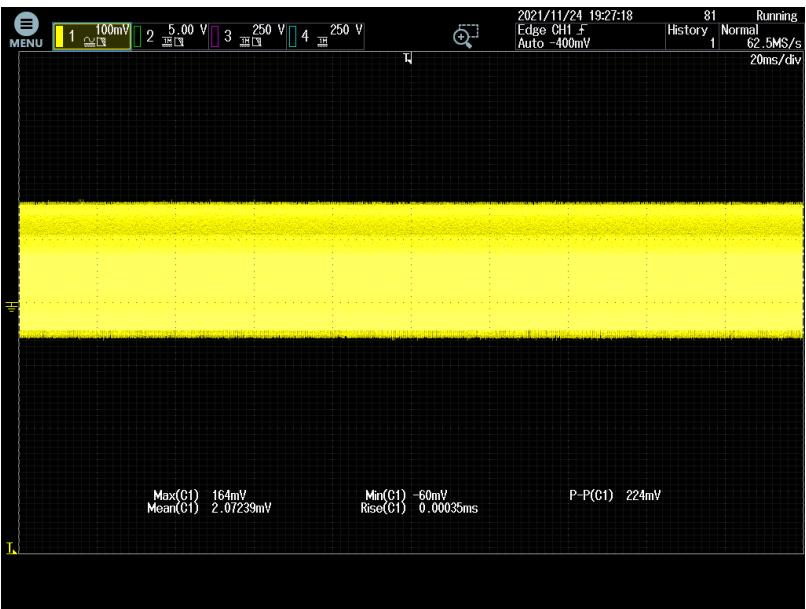

265 VAC

CH1 $\mathsf { V } _ { \mathsf { O U T } }$ Ripple $\mathsf { V } _ { \mathsf { P K - P K } } { = } 2 2 4 \mathsf { m V }$

## Test Condition:

➢ Full Load

## 动态负载

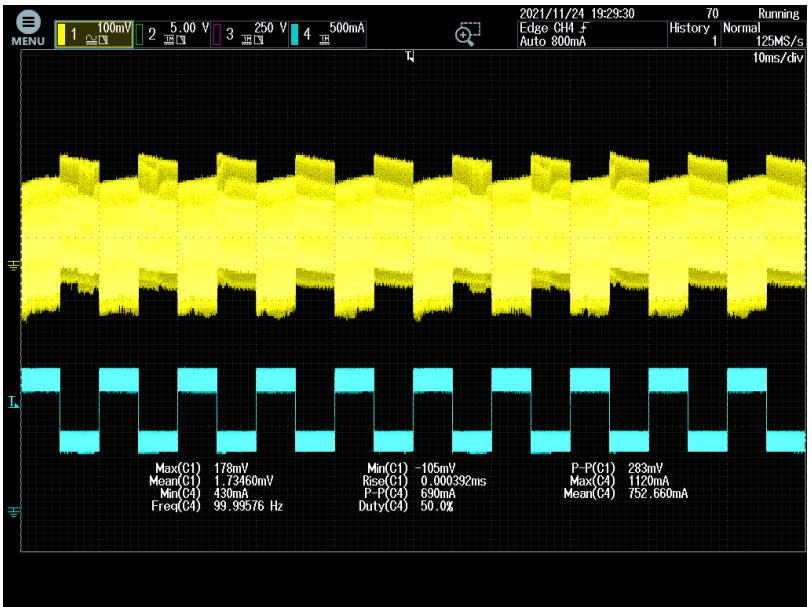

85 VAC

CH1 VOUT $\mathsf { V } _ { \mathsf { O U T } }$ $V _ { P K - P K } = 2 8 3 ~ \mathsf { m V }$  
CH4 IOUT ${ \mathsf I } _ { 0 \mathsf U \top }$

## Test Condition:

➢ 0.5 A-1 A-0.5 A  
➢ Slew Rate: 0.5 $\mathsf { A } / \mu \mathsf { S }$  
➢ Frequency: 100 Hz  
(50%-100%)

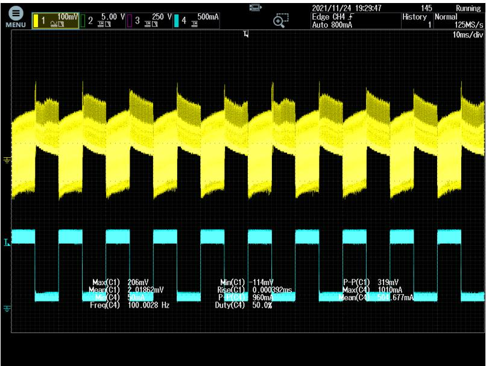

85 VAC

CH1 VOUT ${ \mathsf { C H 1 } } { \mathsf { V } } _ { \mathsf { O U T } }$ VPK-PK=319mV $\mathsf { V } _ { \mathsf { P K - P K } } { = } 3 1 9 \mathsf { m V }$  
CH4 IOUT $\mathsf { C H 4 } \mathsf { I } _ { \mathsf { O U T } }$

## Test Condition:

➢ 0.1A-0.9 A-0.1A  
➢ Slew Rate: 0.5 A/μS  
➢ Frequency: 100 Hz  
(10%-90%)

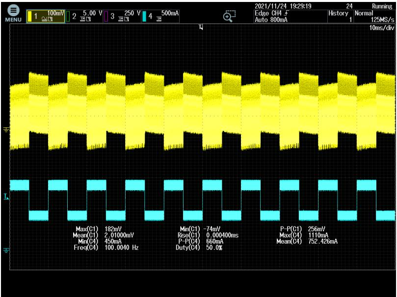

265 VAC

CH1 VOUT $\mathsf { V } _ { \mathsf { O U T } }$ $\mathsf { V } _ { \mathsf { P K - P K } } =$ 256 mV  
CH4 IOUT $\mathsf { C H 4 } \mathsf { I } _ { \mathsf { O U T } }$

## Test Condition:

➢ 0.5 A-1 A-0.5 A  
➢ Slew Rate: 0.5 $\mathsf { A } / \mu \mathsf { S }$  
➢ Frequency: 100 Hz  
(50%-100%)

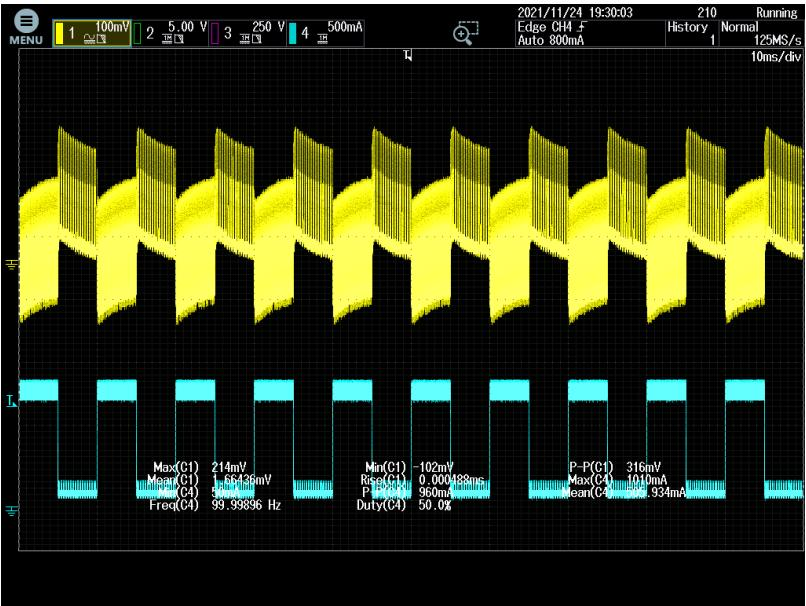

265 $\mathsf { v } _ { \mathsf { A C } }$

CH1 VOUT $\mathsf { V } _ { \mathsf { O U T } }$ $\mathsf { V } _ { \mathsf { P K - P K } } { = } 3 1 6 \mathsf { m v }$ VPK-PK=316mV  
$\mathsf { C H 4 } \mathsf { I } _ { \mathsf { O U T } }$

## Test Condition:

➢ 0.1A-0.9 A-0.1 A  
➢ Slew Rate: 0.5 A/μS  
➢ Frequency: 100 Hz  
(10%-90%)

## 输出电压开机波形

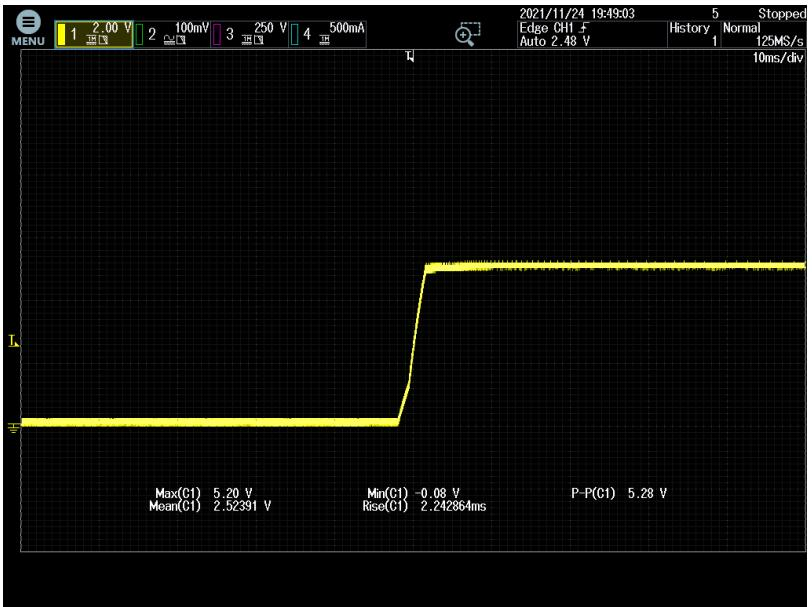

85 VAC

CH1 VOUT TRISE: 2.2 mS

## Test Condition:

➢ No Load

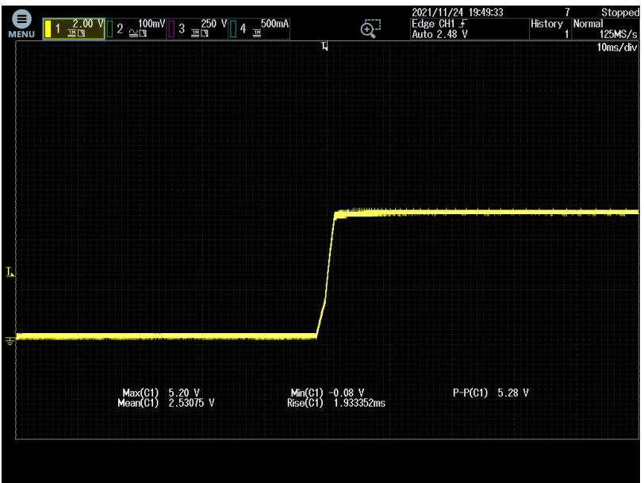

265 VAC

CH1 VOUT TRISE: 1.9 mS

## Test Condition:

➢ No Load

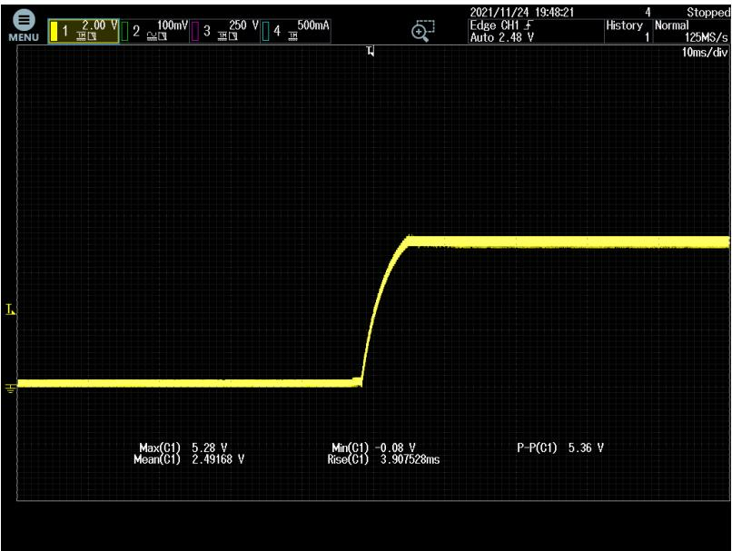

85 VAC

CH1 VOUT TRISE: 3.9 mS

## Test Condition:

➢ Full Load

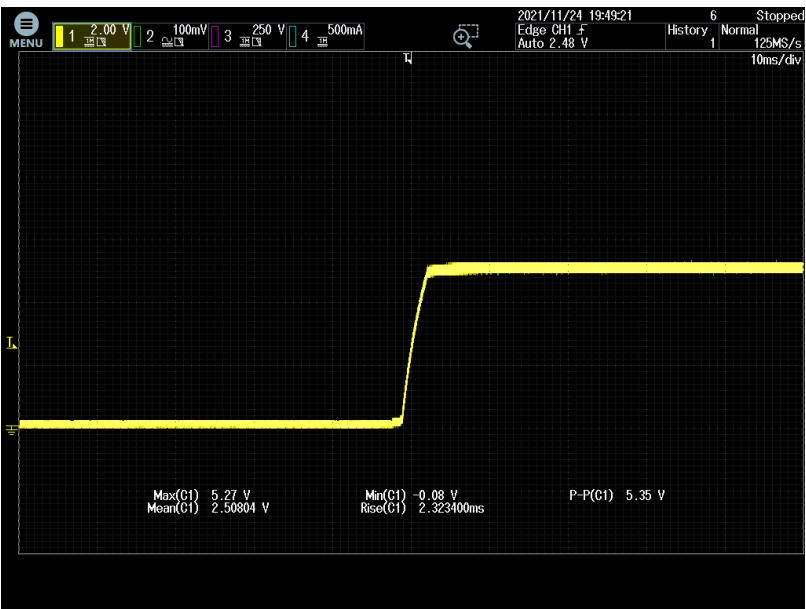

265 VAC

CH1 VOUT TRISE: 2.3 mS

## Test Condition:

➢ Full Load

## 漏源极电压和漏极电流开机和稳态波形

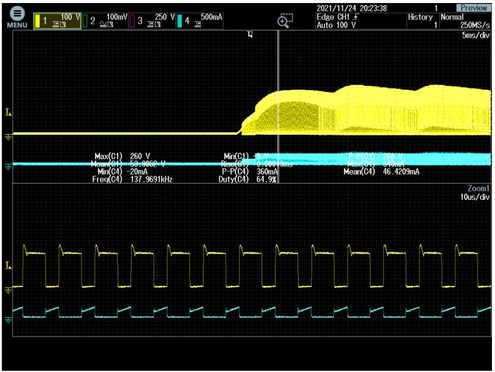

85 VAC

${ \mathsf { C H 1 } } \mathsf { V _ { D S } }$  
$C H 4 \mid _ { \mathrm { D S } }$  
$\begin{array} { r } { V _ { \mathsf { D S \_ m a x } } = 2 6 0 \mathsf { v } } \\ { \mathsf { I _ { D S \_ m a x } } = 0 . 3 4 \mathsf { A } } \end{array}$ VDS \_max IDS\_max

Test Condition:  
➢ Full Load  
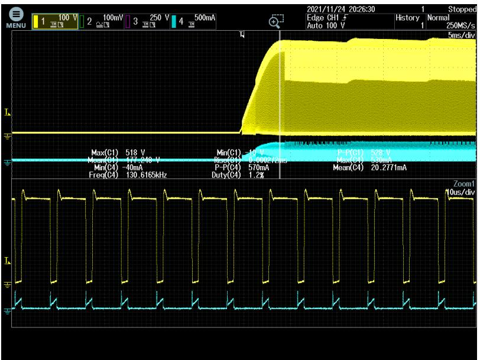

265 $\mathsf { v } _ { \mathsf { A C } }$

${ \mathsf { C H 1 } } \mathsf { V _ { D S } }$  
$C H 4 \mid _ { \mathrm { { D S } } }$  
$\begin{array} { r } { \mathsf { V } _ { \mathsf { D S \_ m a x } } = 5 1 8 \mathsf { V } } \\ { \mathsf { I } _ { \mathsf { D S \_ m a x } } = 0 . 5 3 \mathsf { A } } \end{array}$ VDS \_max

Test Condition:  
➢ Full Load  
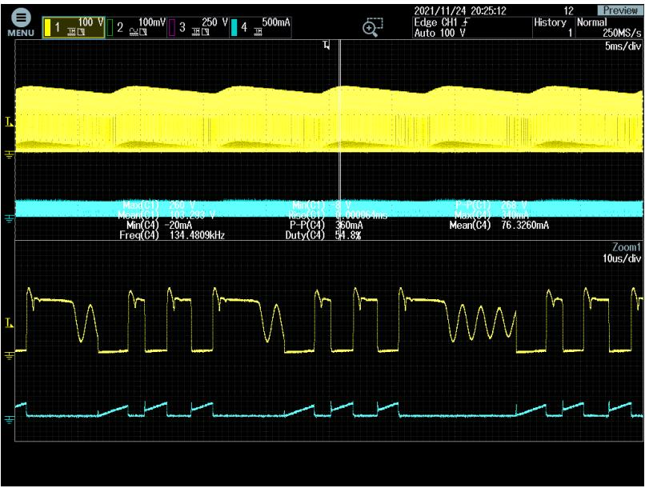

85 VAC

${ \mathsf { C H 1 V } } _ { \mathsf { D S } }$  
$C H 4 1 _ { \mathrm { D S } }$  
$\mathsf { V } _ { \mathsf { D } \mathsf { S } \_ \mathsf { m a x } } { = } 2 6 0 \mathsf { V }$ VDS \_max $\mathsf { I } _ { \mathsf { D S \_ m a x } } { = } 0 . 3 4 \ A$

Test Condition:  
➢ Full Load  
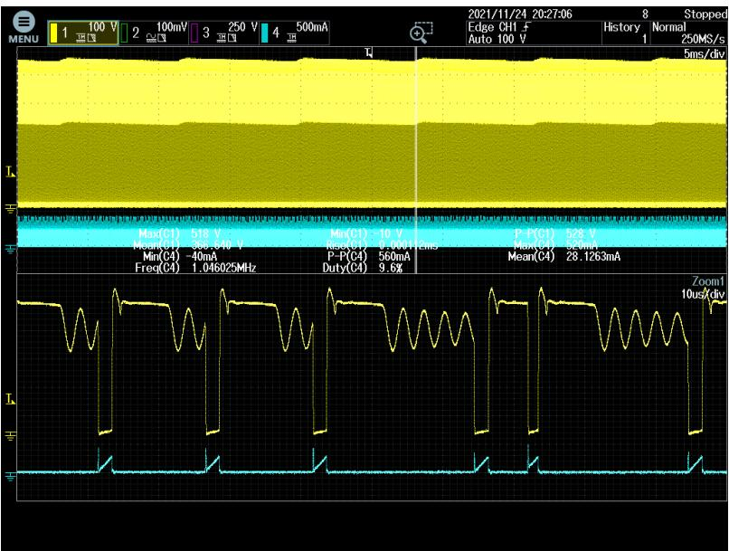

265 VAC

${ \mathsf { C H 1 } } \mathsf { V } _ { \mathsf { D S } }$  
$C H 4 1 _ { \mathrm { D S } }$  
V DS \_max =518V IDS\_max =0.52 A

Test Condition:

➢ Full Load

## 输出二极管反向电压波形

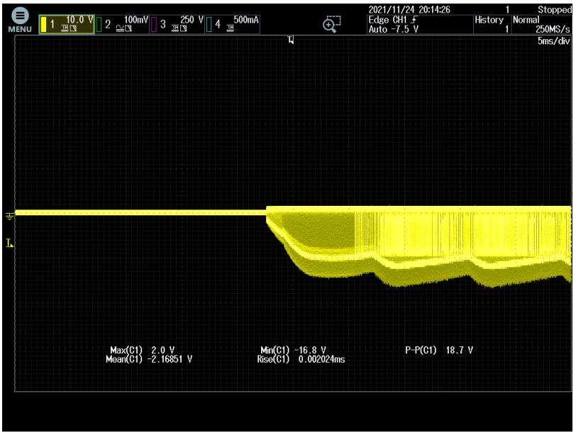

85 VAC

CH1 $V _ { \textsf { R } }$  
$V _ { \mathrm { R \_ M A X } } = 1 6 . 8 V$

Test Condition:  
➢ Full Load  
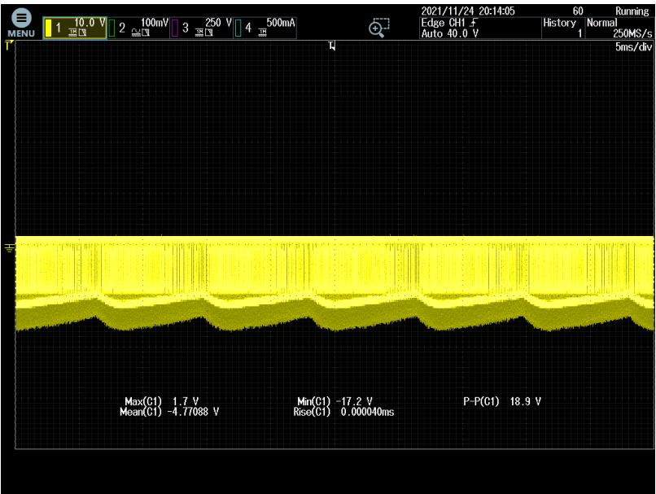

85 VAC

CH1 $V _ { \textsf { R } }$  
◼ $V _ { \mathrm { R \_ M A X } } = 1 7 . 2 \lor$

Test Condition:  
➢ Full Load  
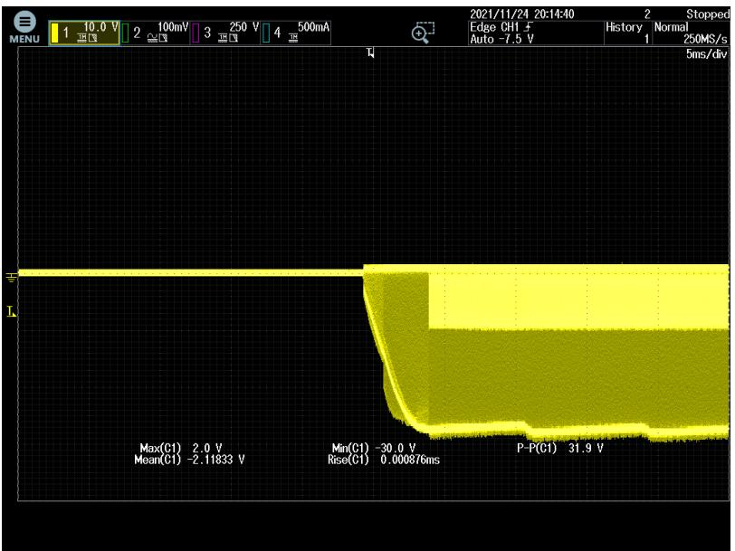

265 VAC

CH1 $V _ { \textsf { R } }$  
$V _ { R \_ M A X } = 3 0 V$

Test Condition:  
➢ Full Load  
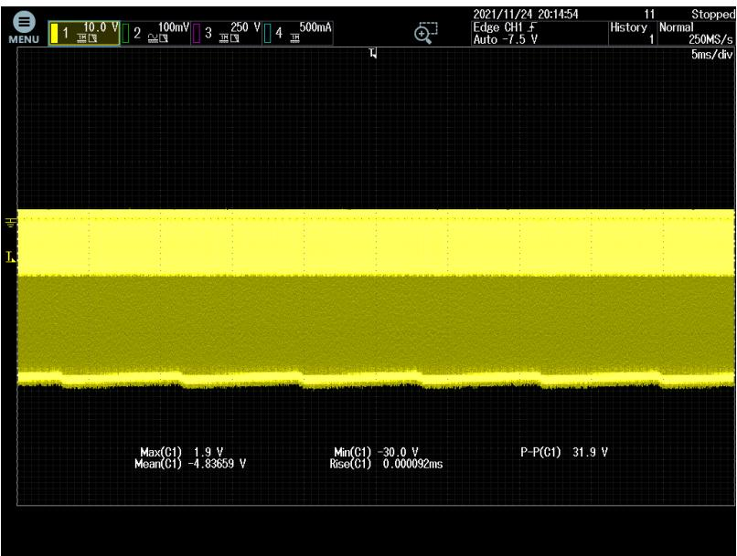

265 VAC

${ \mathsf { C H 1 V } } _ { \mathsf { R } }$  
$V _ { \mathrm { R \_ M A X } } = 3 0 V$

Test Condition:

➢ Full Load

## 短路保护（MOSFET和输出二极管波形）

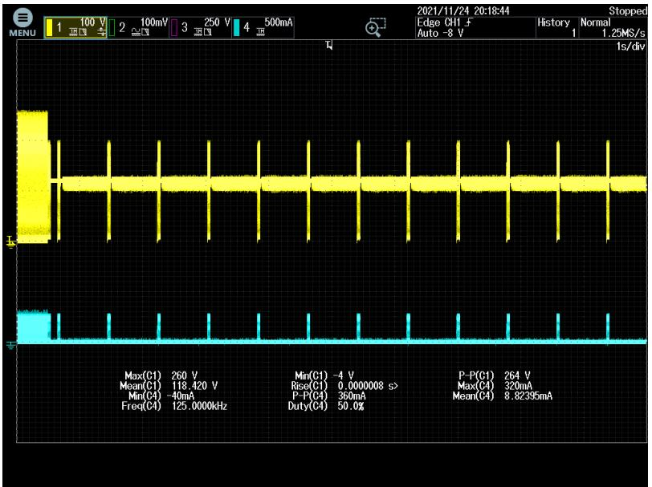

85 VAC

${ \mathsf { C H 1 } } \mathsf { V _ { D S } }$  
$C H 4 \mid _ { \mathrm { D S } }$  
$\begin{array} { r } { V _ { \mathsf { D S \_ m a x } } = 2 6 0 \mathsf { v } } \\ { \mathsf { I _ { D S \_ m a x } } = 0 . 3 2 \mathsf { A } } \end{array}$ DS \_max

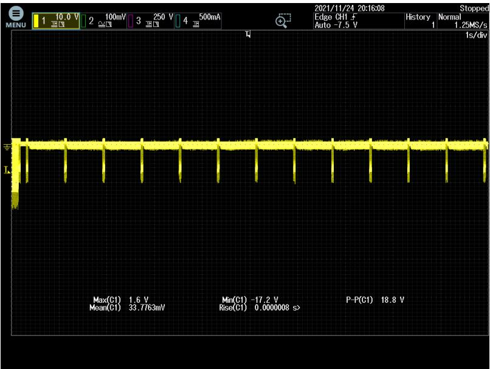

85 VAC

CH2 VR  
CH4 IR  
$V _ { \mathrm { R \_ M A X } } = 1 7 . 2 \lor$

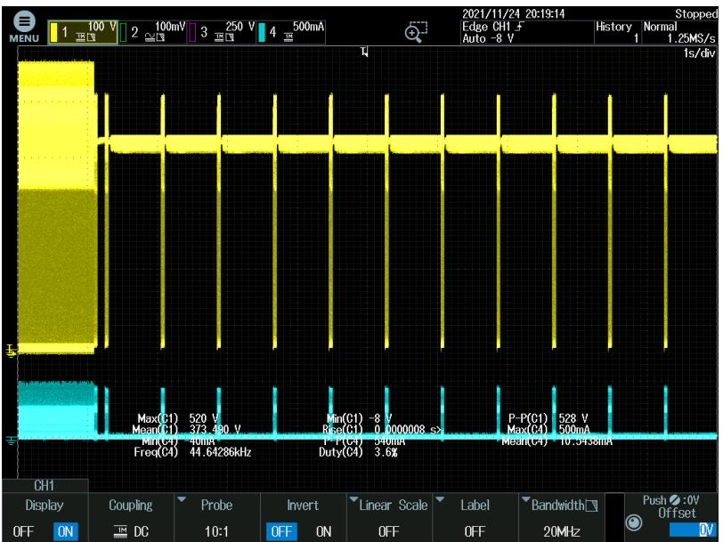

265 VAC

CH1 $\mathsf { V } _ { \mathsf { D } \mathsf { S } }$  
CH4 IDS  
$\begin{array} { l } { { \mathsf { V } } _ { { \mathsf { D } } { \mathsf { S } } \_ { \mathsf { m a x } } } { = } 5 2 0 { \mathsf { V } } } \\ { { \mathsf { I } } _ { { \mathsf { D } } { \mathsf { S } } \_ { \mathsf { m a x } } } { = } 0 . 5 { \mathsf { A } } } \end{array}$

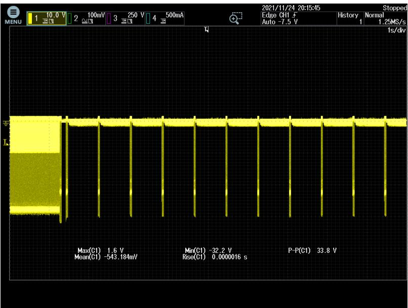

265 VAC

CH1 VR  
CH4 IR  
VR\_MAX=32.2V

<table><tr><td rowspan="2">项目</td><td colspan="2">85VAC</td><td colspan="2">264VAC</td></tr><tr><td>温度(°C)</td><td>温升(°C)</td><td>温度(°C)</td><td>温升(°C)</td></tr><tr><td>环境温度</td><td colspan="2">25.7</td><td colspan="2">25.4</td></tr><tr><td>BPA8604D (U1)</td><td>92</td><td>66.3</td><td>84.4</td><td>59</td></tr><tr><td>变压器磁芯(T1)</td><td>60.6</td><td>34.9</td><td>61.2</td><td>35.8</td></tr><tr><td>变压器绕组(T1)</td><td>58</td><td>32.3</td><td>60.2</td><td>34.8</td></tr></table>

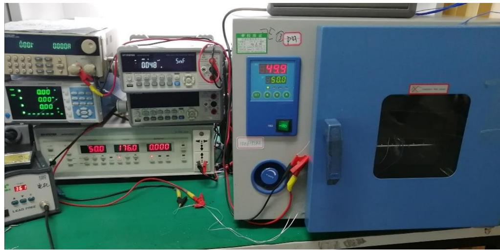

## 测试说明

➢ 在温箱中进行测试  
➢ 电路板放在一个封闭的盒子内  
➢ 热电偶连接到各个测量点  
➢ 等测量点温度达到稳定后记录数据

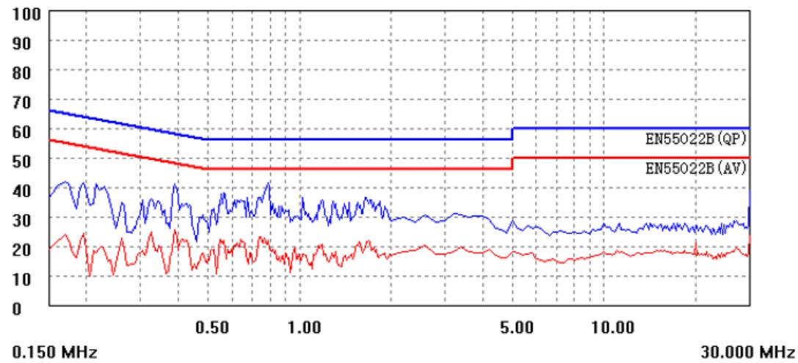

115VAC 满载  

230VAC 满载

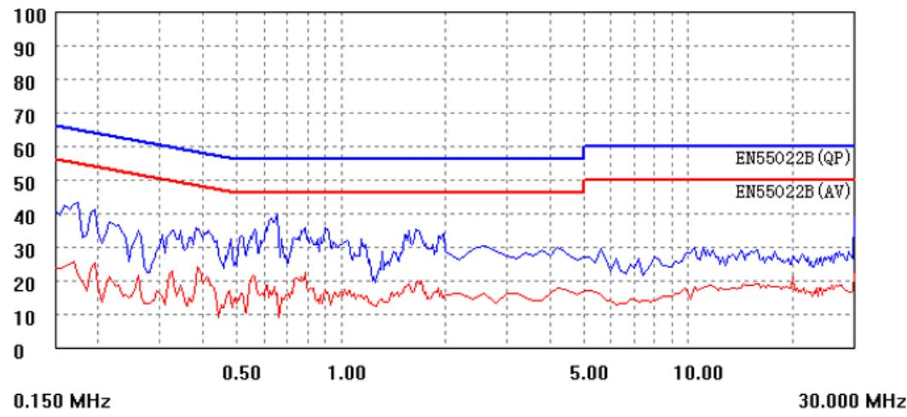

115VAC 满载

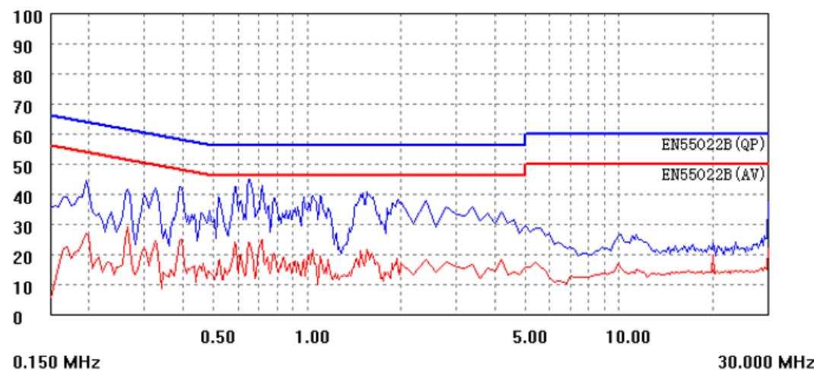

230VAC 满载

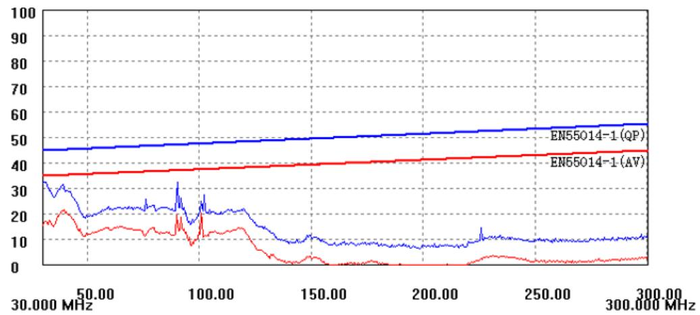

115VAC Line

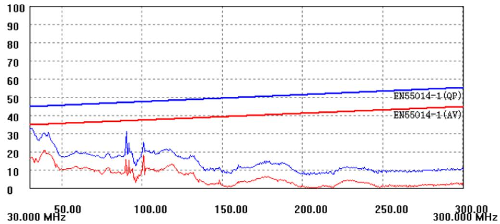

115VAC Neutral

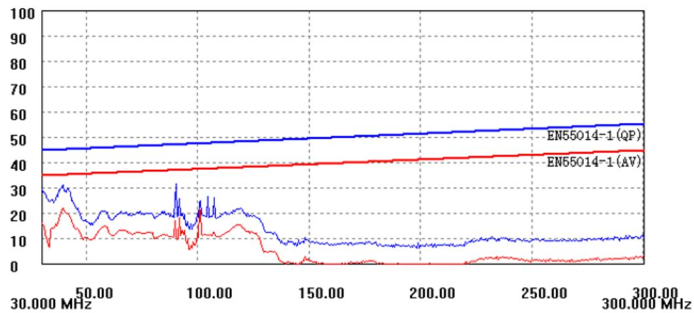

230VAC Line

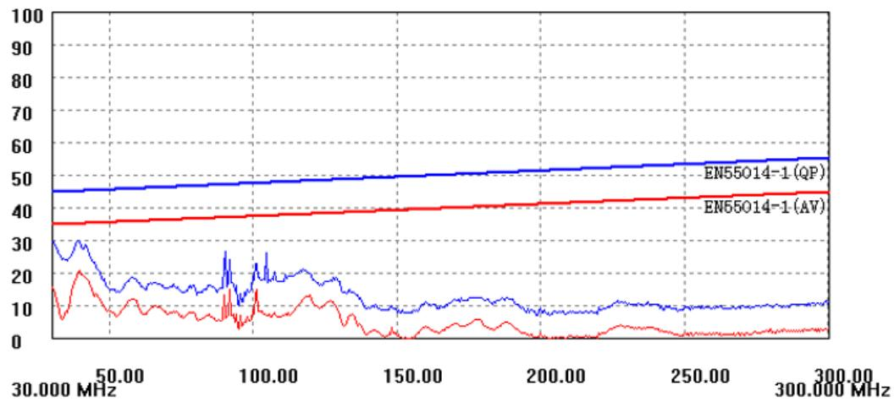

230VAC Neutral

## THANK YOU FOR WATCHING
