## BPA8604D 非隔离参考设计

## (12V/0.4A)

上海晶丰明源半导体股份有限公司

Shanghai Bright Power Semiconductor Co., Ltd.

陈耀兵

2021 9 18

BPA8604  
电源规格  
电路图  
◼BOM  
◼PCB Layout  
电路实物图  
变压器规格书  
性能测试数据

## 产品特点:

》集成交流电压过零检测与过零信号输 出功能  
➢ 700V MOSFET  
➢ ON/OFF  
》内置软启动功能  
》集成高压启动、自供电电路  
➢ EMI

## 应用领域:

》家用电器辅助电源  
》微波炉辅助电源

## 电源规格

<table><tr><td>项目描述</td><td>符号</td><td>最小</td><td>典型</td><td>最大</td><td>单位</td><td>备注</td></tr><tr><td colspan="7">输入</td></tr><tr><td>电压</td><td> $V_{IN}$ </td><td>90</td><td>115/230</td><td>264</td><td> $V_{AC}$ </td><td></td></tr><tr><td>频率</td><td> $f_{LINE}$ </td><td>47</td><td>50/60</td><td>63</td><td>Hz</td><td></td></tr><tr><td colspan="7">输出</td></tr><tr><td>输出电压</td><td> $V_{OUT}$ </td><td></td><td>12</td><td></td><td>V</td><td>±3%</td></tr><tr><td>输出电流</td><td> $I_{OUT}$ </td><td></td><td>0.4</td><td></td><td>A</td><td></td></tr><tr><td>输出电压纹波</td><td> $V_{RIPPLE}$ </td><td></td><td></td><td>150</td><td>mV</td><td>20MHz带宽</td></tr><tr><td>连续输出功率</td><td> $P_{OUT}$ </td><td></td><td>4.8</td><td></td><td>W</td><td></td></tr><tr><td colspan="7">效率</td></tr><tr><td>待机功耗</td><td> $P_{STDBY}$ </td><td></td><td></td><td>60</td><td>mW</td><td>230VAC</td></tr><tr><td>满载效率</td><td>η</td><td>76</td><td></td><td></td><td>%</td><td>115VAC/230VAC</td></tr><tr><td colspan="7">环境</td></tr><tr><td>传导EMI</td><td></td><td colspan="4">满足CISPR22/EN55022 Class B,至少6dB 裕量</td><td></td></tr><tr><td>Surge</td><td></td><td></td><td>2</td><td></td><td>kV</td><td>差模</td></tr><tr><td>EFT</td><td></td><td></td><td>4</td><td></td><td>kV</td><td>5kHz/100kHz/38kHz</td></tr><tr><td>ESD</td><td></td><td></td><td>15</td><td></td><td>kV</td><td>接触8kV,空气15kV</td></tr><tr><td>工作环境温度</td><td> $T_{AMP}$ </td><td>0</td><td></td><td>45</td><td>°C</td><td></td></tr></table>

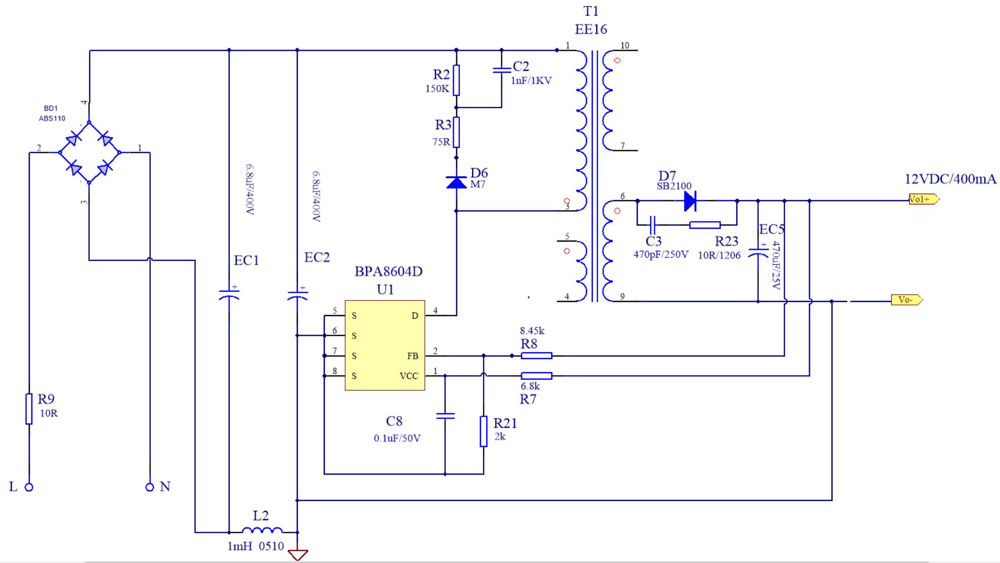

<table><tr><td>序号</td><td>元件标号</td><td>参数描述</td><td>封装尺寸</td><td>数量</td></tr><tr><td>1</td><td>BD1</td><td>ABS110</td><td>BD_SMD(bs210)</td><td>1</td></tr><tr><td>2</td><td>C2</td><td>1nF/1KV</td><td>50V104</td><td>1</td></tr><tr><td>3</td><td>C3</td><td>470pF/250V</td><td>0805-C</td><td>1</td></tr><tr><td>4</td><td>C8</td><td>0.1uF/50V</td><td>0805-C</td><td>1</td></tr><tr><td>5</td><td>D6</td><td>M7</td><td>D SMA</td><td>1</td></tr><tr><td>6</td><td>D7</td><td>SB2100</td><td>DO-15</td><td>1</td></tr><tr><td>7</td><td>EC1, EC2</td><td>6.8uF/400V</td><td>EC 6.5 P2.5</td><td>2</td></tr><tr><td>8</td><td>EC5</td><td>470uF/25V</td><td>EC 10 P5.0</td><td>1</td></tr><tr><td>9</td><td>L2</td><td>1mH 0510</td><td>L/D 6 P3.0</td><td>1</td></tr><tr><td>10</td><td>R2</td><td>150K</td><td>1206-r</td><td>1</td></tr><tr><td>11</td><td>R3</td><td>75R</td><td>1206-r</td><td>1</td></tr><tr><td>12</td><td>R7</td><td>6.8k</td><td>0805-r</td><td>1</td></tr><tr><td>13</td><td>R8</td><td>8.45k</td><td>0805-r</td><td>1</td></tr><tr><td>14</td><td>R9</td><td>10R</td><td>F-2W</td><td>1</td></tr><tr><td>15</td><td>R21</td><td>2k</td><td>0805-r</td><td>1</td></tr><tr><td>16</td><td>R23</td><td>10R/1206</td><td>0805-r</td><td>1</td></tr><tr><td>17</td><td>T1</td><td>EE16</td><td>T EE16(5+5)</td><td>1</td></tr><tr><td>18</td><td>U1</td><td>BPA8604D</td><td>U SOP-8</td><td>1</td></tr><tr><td>19</td><td>PCB</td><td>CEM-1,单面板</td><td>77.7mm*30.6mm</td><td>1</td></tr></table>

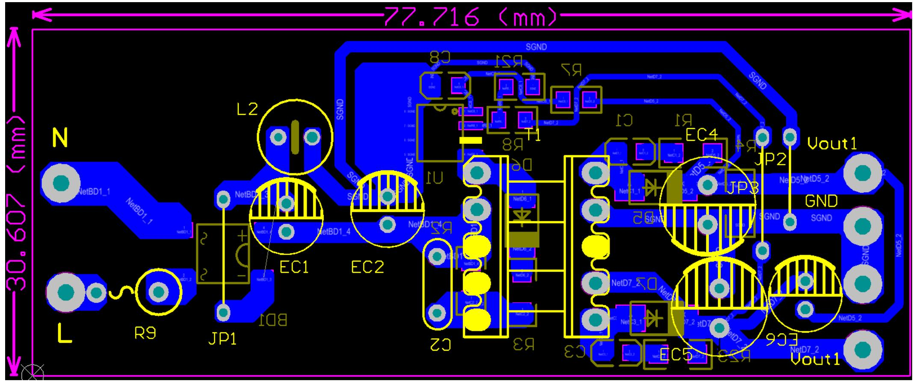

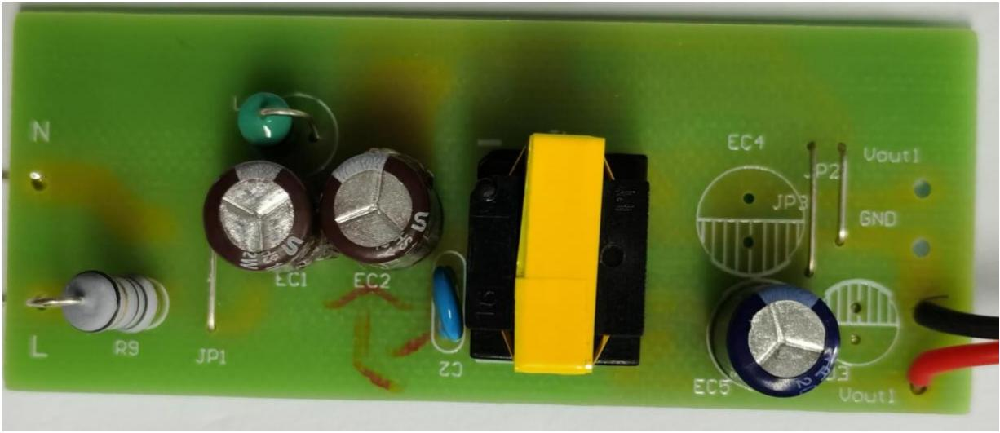

TOP SIDE

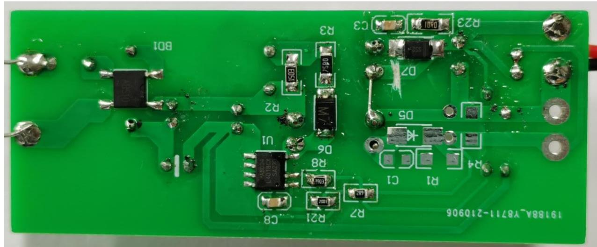

BOTTOM SIDE

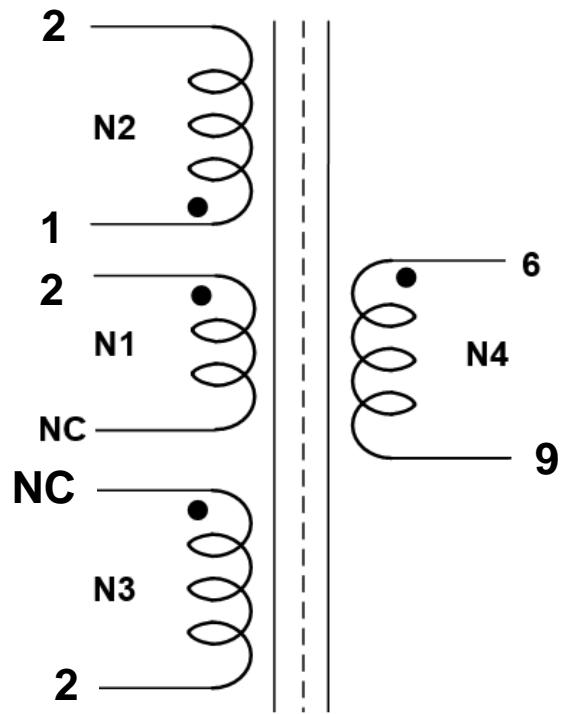

<table><tr><td>序号</td><td>起始脚</td><td>终止脚</td><td>绕制规则</td><td>匝数</td><td>绕线方式</td></tr><tr><td>N1</td><td>2</td><td>NC</td><td>2UEW φ0.17*2P</td><td>20Ts</td><td>密绕一层(PIN脚朝外)</td></tr><tr><td>胶带</td><td></td><td></td><td></td><td>2Ts</td><td></td></tr><tr><td>N2</td><td>1</td><td>2</td><td>2UEW φ0.19*1P</td><td>105Ts</td><td>密绕三层(PIN脚朝外)</td></tr><tr><td>胶带</td><td></td><td></td><td></td><td>2Ts</td><td></td></tr><tr><td>N3</td><td>NC</td><td>2</td><td>2UEW φ0.17*3P</td><td>13Ts</td><td>密绕一层(PIN脚朝外)</td></tr><tr><td>胶带</td><td></td><td></td><td></td><td>3Ts</td><td></td></tr><tr><td>N4</td><td>6</td><td>9</td><td>2UEW φ0.35*1P</td><td>14Ts</td><td>均匀绕一层(PIN脚朝外)</td></tr><tr><td>胶带</td><td></td><td></td><td></td><td>3Ts</td><td></td></tr></table>

## 规格与材料

初级绕组感量 $L _ { \mathrm { p } } { = } 1 8 5 0 \mathrm { u H } { \pm } 7 \%$ (测试条件：0.3V，100kHz)  
漏感量 $L _ { \mathsf { I k } } { < } 8 0 \mathsf { u H }$  
骨架：EE16底部加高 $( 5 + 5 \mathsf { P } | \mathsf { N } )$  
磁芯：EE16 PC40或同等材质， ${ \mathsf { A e } } { = } 1 9 . 2 { \mathsf { m m } } ^ { 2 }$  
》N1、N2、N3、N4:2UEW漆包线  
绝缘胶带:3M900或同等材质  
成品要求：浸凡立水

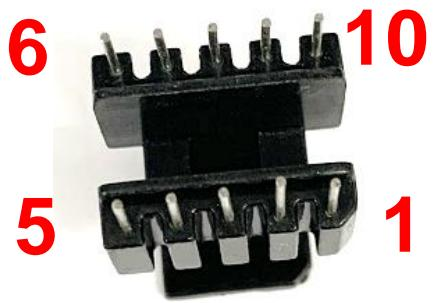

待机功耗  
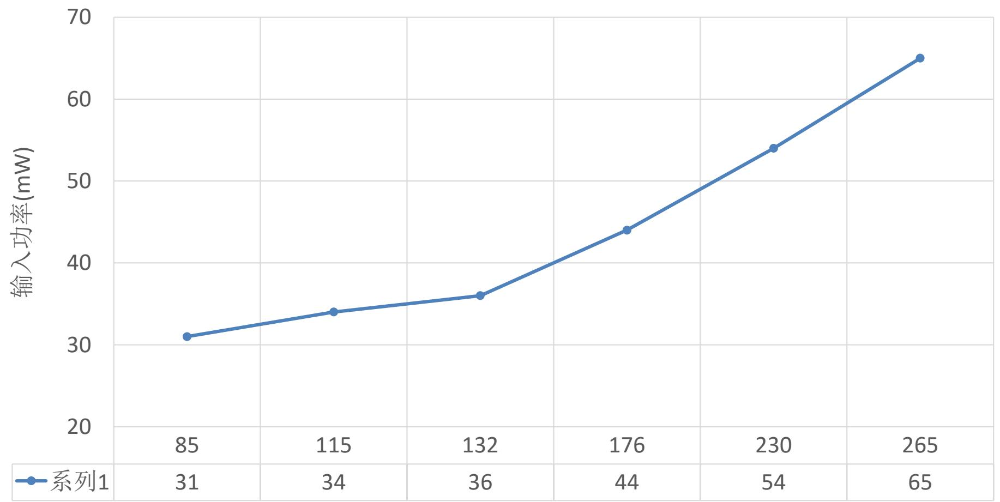

输入电压(Vac)

效率曲线  
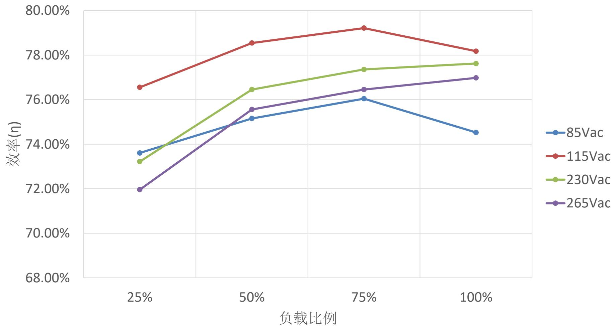

<table><tr><td> $V_{IN}(VAC)$ </td><td>Load(%)</td><td> $P_{IN}(W)$ </td><td> $V_{OUT}(V)$ </td><td>线端</td><td> $I_{OUT}(A)$ </td><td> $P_{OUT}(W)$ </td><td>Eff(%)</td><td>AVG Eff(%)</td></tr><tr><td rowspan="6">85</td><td>空载</td><td></td><td></td><td></td><td></td><td>0</td><td></td><td></td></tr><tr><td>10%</td><td>0.68</td><td>12.012</td><td></td><td>0.04</td><td>0.48048</td><td>70.66%</td><td></td></tr><tr><td>25%</td><td>1.63</td><td>11.998</td><td></td><td>0.1</td><td>1.1998</td><td>73.61%</td><td rowspan="4">74.83%</td></tr><tr><td>50%</td><td>3.19</td><td>11.987</td><td></td><td>0.2</td><td>2.3974</td><td>75.15%</td></tr><tr><td>75%</td><td>4.72</td><td>11.964</td><td></td><td>0.3</td><td>3.5892</td><td>76.04%</td></tr><tr><td>100%</td><td>6.41</td><td>11.943</td><td></td><td>0.4</td><td>4.7772</td><td>74.53%</td></tr><tr><td rowspan="6">115</td><td>空载</td><td></td><td></td><td></td><td></td><td>0</td><td></td><td></td></tr><tr><td>10%</td><td>0.67</td><td>12.017</td><td></td><td>0.04</td><td>0.48068</td><td>71.74%</td><td></td></tr><tr><td>25%</td><td>1.57</td><td>12.019</td><td></td><td>0.1</td><td>1.2019</td><td>76.55%</td><td rowspan="4">78.12%</td></tr><tr><td>50%</td><td>3.06</td><td>12.017</td><td></td><td>0.2</td><td>2.4034</td><td>78.54%</td></tr><tr><td>75%</td><td>4.55</td><td>12.014</td><td></td><td>0.3</td><td>3.6042</td><td>79.21%</td></tr><tr><td>100%</td><td>6.14</td><td>12</td><td></td><td>0.4</td><td>4.8</td><td>78.18%</td></tr><tr><td rowspan="6">230</td><td>空载</td><td></td><td></td><td></td><td></td><td>0</td><td></td><td></td></tr><tr><td>10%</td><td>0.7</td><td>12.018</td><td></td><td>0.04</td><td>0.48072</td><td>68.67%</td><td></td></tr><tr><td>25%</td><td>1.64</td><td>12.008</td><td></td><td>0.1</td><td>1.2008</td><td>73.22%</td><td rowspan="4">76.16%</td></tr><tr><td>50%</td><td>3.14</td><td>12.003</td><td></td><td>0.2</td><td>2.4006</td><td>76.45%</td></tr><tr><td>75%</td><td>4.65</td><td>11.99</td><td></td><td>0.3</td><td>3.597</td><td>77.35%</td></tr><tr><td>100%</td><td>6.17</td><td>11.973</td><td></td><td>0.4</td><td>4.7892</td><td>77.62%</td></tr><tr><td rowspan="6">265</td><td>空载</td><td></td><td></td><td></td><td></td><td>0</td><td></td><td></td></tr><tr><td>10%</td><td>0.72</td><td>12.022</td><td></td><td>0.04</td><td>0.48088</td><td>66.79%</td><td></td></tr><tr><td>25%</td><td>1.67</td><td>12.017</td><td></td><td>0.1</td><td>1.2017</td><td>71.96%</td><td rowspan="4">75.24%</td></tr><tr><td>50%</td><td>3.18</td><td>12.014</td><td></td><td>0.2</td><td>2.4028</td><td>75.56%</td></tr><tr><td>75%</td><td>4.71</td><td>12.003</td><td></td><td>0.3</td><td>3.6009</td><td>76.45%</td></tr><tr><td>100%</td><td>6.22</td><td>11.97</td><td></td><td>0.4</td><td>4.788</td><td>76.98%</td></tr></table>

## 输出电压调整率

<table><tr><td> $V_{IN}(VAC)$  $I_{OUT}(A)$ </td><td>90</td><td>115</td><td>132</td><td>176</td><td>230</td><td>265</td><td>平均值</td><td>线调整率</td></tr><tr><td>0</td><td>12.042</td><td>12.042</td><td>12.042</td><td>12.041</td><td>12.039</td><td>12.039</td><td>12.041</td><td>0.02%</td></tr><tr><td>20%</td><td>12.035</td><td>12.034</td><td>12.033</td><td>12.033</td><td>12.034</td><td>12.036</td><td>12.034</td><td>0.02%</td></tr><tr><td>40%</td><td>12.033</td><td>12.031</td><td>12.031</td><td>12.029</td><td>12.027</td><td>12.026</td><td>12.030</td><td>0.06%</td></tr><tr><td>60%</td><td>12.024</td><td>12.023</td><td>12.021</td><td>12.018</td><td>12.02</td><td>12.022</td><td>12.021</td><td>0.05%</td></tr><tr><td>80%</td><td>12.011</td><td>12.013</td><td>12.012</td><td>12.004</td><td>12.003</td><td>12.001</td><td>12.007</td><td>0.10%</td></tr><tr><td>100%</td><td>11.968</td><td>11.983</td><td>11.982</td><td>11.976</td><td>11.972</td><td>11.97</td><td>11.975</td><td>0.13%</td></tr><tr><td>平均值</td><td>12.019</td><td>12.021</td><td>12.020</td><td>12.017</td><td>12.016</td><td>12.016</td><td></td><td></td></tr><tr><td>负载调整率</td><td>0.62%</td><td>0.49%</td><td>0.50%</td><td>0.54%</td><td>0.56%</td><td>0.57%</td><td></td><td></td></tr></table>

◼ 计算方法：调整率=100%\*(最大值-最小值)/平均值

## 输出电压随芯片温度变化

<table><tr><td>序号</td><td>输入电压(VAC)</td><td>芯片温度(°C)</td><td>输出电压(V)</td></tr><tr><td>1</td><td>85</td><td>35.1</td><td>12.036</td></tr><tr><td>2</td><td>85</td><td>97.6</td><td>11.865</td></tr><tr><td>3</td><td>115</td><td>86.9</td><td>11.906</td></tr><tr><td>4</td><td>230</td><td>79.5</td><td>11.925</td></tr><tr><td>5</td><td>265</td><td>80.8</td><td>11.916</td></tr></table>

## 输出电压纹波

20MHz带宽，去掉示波器探头正端夹子和地线环，10uF/50V 0.1uF/50V

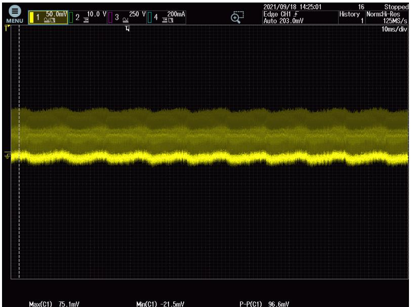

85 VAC  
CH1 VOUT $\begin{array} { l } { \mathsf { C H 1 V _ { o u \intercal } } } \\ { \mathsf { R i p p l e } } \end{array}$ $V _ { P K - P K } = 9 6 . 6$ VPK-PK=96.6 mV  
➢ Full Load

Test Condition:

115 VAC  
CH1 VOUT $\begin{array} { l } { \mathsf { C H 1 V _ { o u \intercal } } } \\ { \mathsf { R i p p l e } } \end{array}$ $V _ { P K - P K } = 9 3 . 8$ mV  
➢ Full Load

Test Condition:

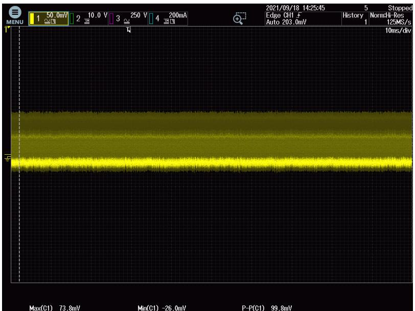

230 VAC  
CH1 VOUT Ripple $u _ { p \vert x - p \vert k } = 9 9 . 8$ VPK-PK=99.8  
➢ Full Load

Test Condition:

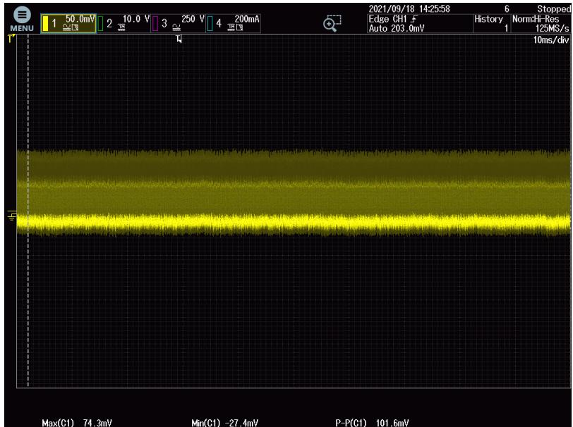

265 VAC  
CH1 VOUT Ripple $V _ { P K }$ VPK-PK=101.6mV $_ { \mathsf { P K } } { = } 1 0 1 . 6 \mathsf { m } \mathsf { v }$  
➢ Full Load

Test Condition:

## (50%-100%)

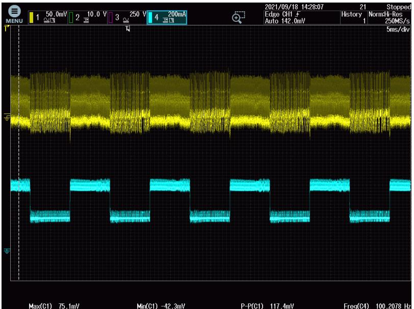

85 VAC

CH1 VOUT $\mathsf { V } _ { \mathsf { O U T } }$ $\mathsf { V } _ { \mathsf { P K - P K } } { = } 1 1 7 . 4 \mathsf { m V }$  
$\mathsf { C H 4 } \mathsf { I } _ { \mathsf { O U T } }$

## Test Condition:

➢ $0 . 2 \ A { - } 0 . 4 \ A { - } 0 . 2 \ A$  
➢ Slew Rate: 0.5 A/μS  
➢ Frequency: 100 Hz

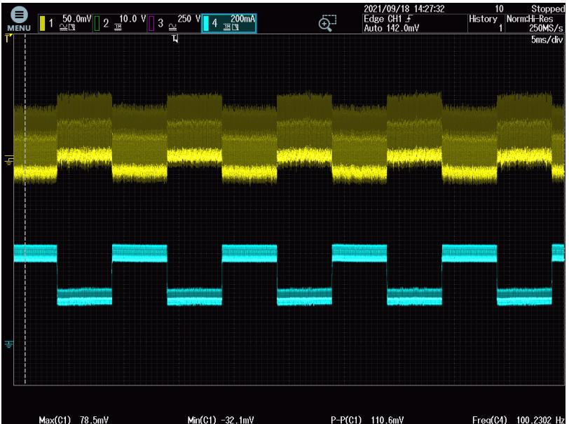

230 VAC

CH1 VOUT $\mathsf { V } _ { \mathsf { O U T } }$ $V _ { \mathsf { P K - P K } } = \pm 1 1 0 . 6 \mathsf { m v }$  
$\mathsf { C H 4 } \mathsf { l } _ { \mathsf { O U T } }$

## Test Condition:

➢ $0 . 2 \ A { - } 0 . 4 \ A { - } 0 . 2 \ A$  
➢ Slew Rate: 0.5 $\mathsf { A } / \mu \mathsf { S }$  
➢ Frequency: 100 Hz

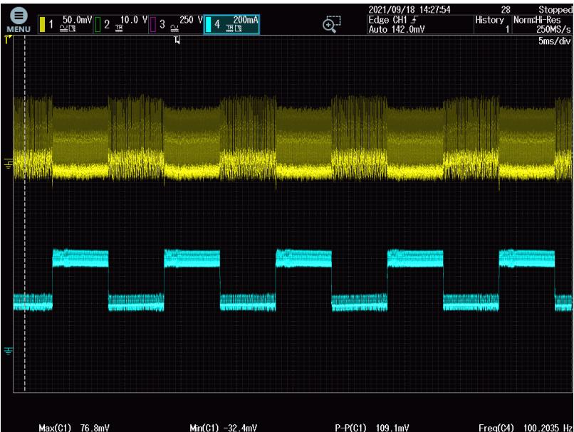

115 VAC

CH1 VOUT ${ \mathsf { C H 1 } } { \mathsf { V } } _ { \mathsf { O U T } }$ $\mathsf { V } _ { \mathsf { P K - P K } } \mathsf { = } \mathsf { 1 0 9 . 1 m V }$  
$\mathsf { C H 4 } \mathsf { I } _ { \mathsf { O U T } }$

## Test Condition:

➢ $0 . 2 \ A { - } 0 . 4 \ A { - } 0 . 2 \ A$  
➢ Slew Rate: 0.5 A/μS  
➢ Frequency: 100 Hz

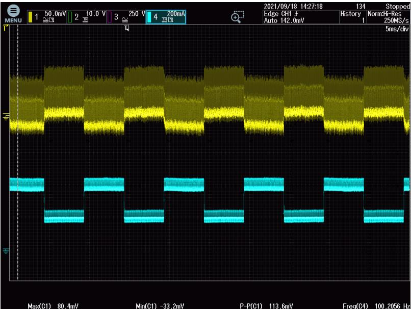

265 VAC

CH1 VOUT ${ \mathsf { C H 1 } } { \mathsf { V } } _ { \mathsf { O U T } }$ $\mathsf { V } _ { \mathsf { P K - P K } } = \pm 1 \underline { { 1 3 } } . 6$ mV  
$\mathsf { C H 4 } \mathsf { I } _ { \mathsf { O U T } }$

## Test Condition:

➢ $0 . 2 \ A { - } 0 . 4 \ A { - } 0 . 2 \ A$  
➢ Slew Rate: 0.5 A/μS  
➢ Frequency: 100 Hz

## (10%-90%)

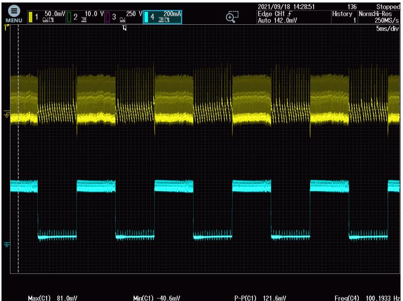

85 VAC

CH1 VOUT $\mathsf { V } _ { \mathsf { O U T } }$ $\mathsf { V } _ { \mathsf { P K - P K } } \mathsf { = } \pmb { 1 } 2 \pmb { 1 } . 6 \mathsf { m V }$  
$\mathsf { C H 4 } \mathsf { I } _ { \mathsf { O U T } }$

## Test Condition:

➢ $0 . 0 4 \ A - 0 . 3 6 \ A - 0 . 0 4 \ A$  
➢ Slew Rate: 0.5 A/μS  
➢ Frequency: 100 Hz

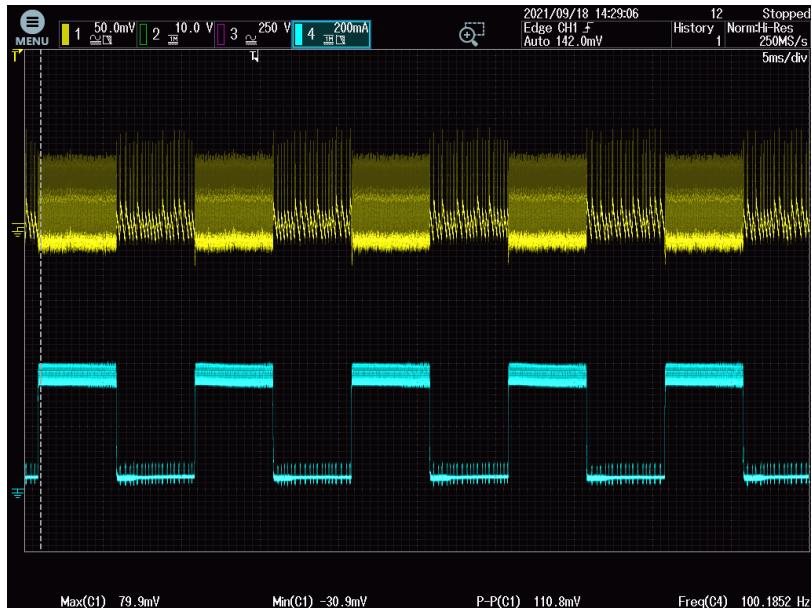

115 VAC

CH1 VOUT ${ \mathsf { C H 1 } } { \mathsf { V } } _ { \mathsf { O U T } }$ VPK-PK= 110.8 mV  
$\mathsf { C H 4 } \mathsf { I } _ { \mathsf { O U T } }$

## Test Condition:

➢ $0 . 0 4 \ A - 0 . 3 6 \ A - 0 . 0 4 \ A$  
➢ Slew Rate: 0.5 A/μS  
➢ Frequency: 100 Hz

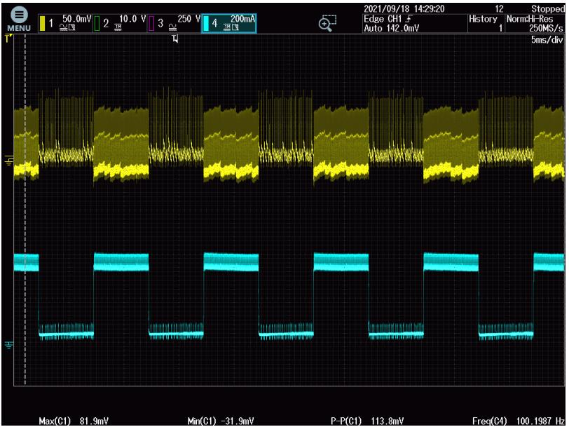

230 VAC

CH1 VOUT $\mathsf { V } _ { \mathsf { O U T } }$ VPK-PK= 113.8 mV  
$\mathsf { C H 4 } \mathsf { l } _ { \mathsf { O U T } }$

## Test Condition:

➢ 0.04 A-0.36A-0.04 A  
➢ Slew Rate: 0.5 $\mathsf { A } / \mu \mathsf { S }$  
➢ Frequency: 100 Hz

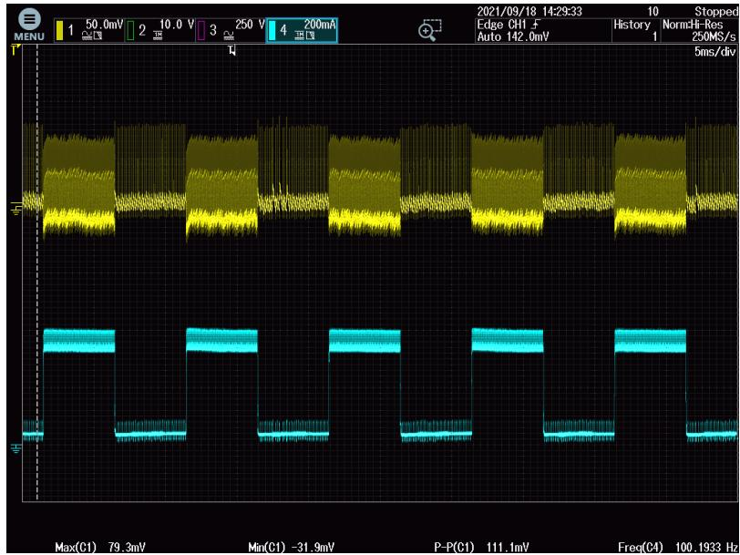

265 VAC

CH1 VOUT ${ \mathsf { C H 1 } } { \mathsf { V } } _ { \mathsf { O U T } }$ VPK-PK=111.1 mV  
$\mathsf { C H 4 } \mathsf { I } _ { \mathsf { O U T } }$

## Test Condition:

➢ 0.04 A-0.36A-0.04 A  
➢ Slew Rate: 0.5 A/μS  
➢ Frequency: 100 Hz

## 输出电压开机波形

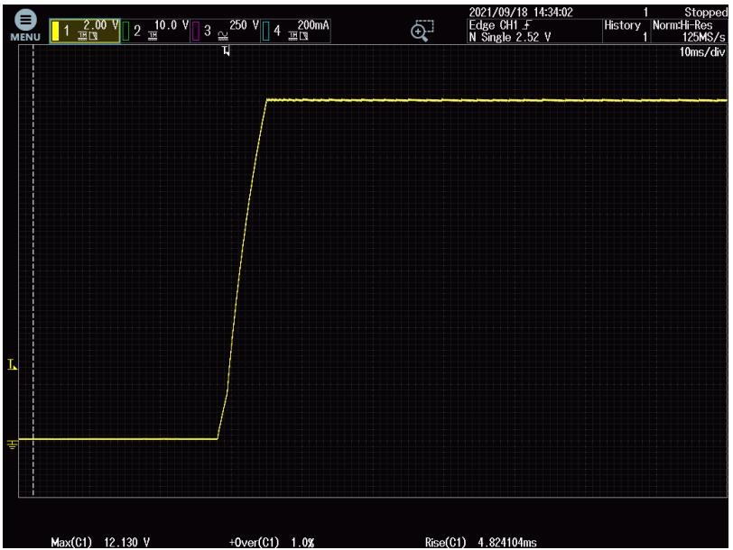

85 VAC

CH1 VOUT TRISE: 4.8 mS

## Test Condition:

➢ No Load

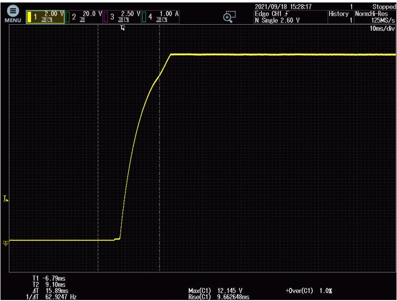

85 VAC

CH1 VOUT TRISE: 9.7 mS

## Test Condition:

➢ Full Load

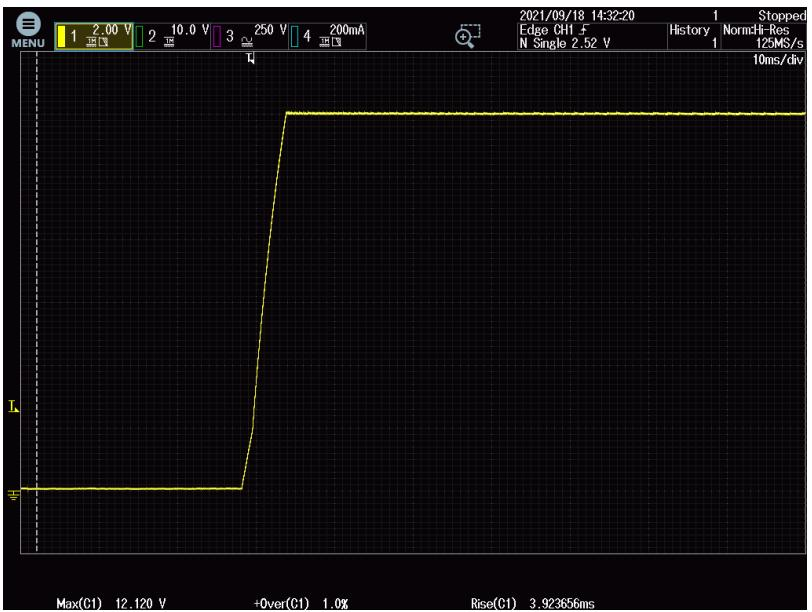

265 VAC

CH1 VOUT TRISE: 3.9 mS

## Test Condition:

➢ No Load

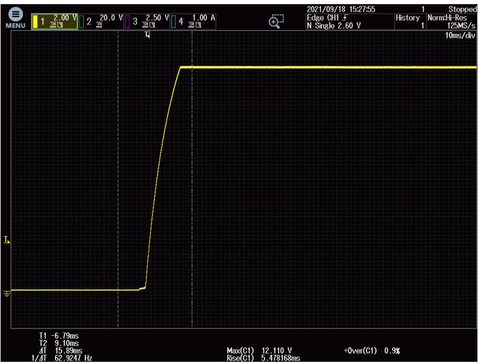

265 VAC

CH1 VOUT TRISE: 5.5 mS

## Test Condition:

➢ Full Load

## MOs漏源极电压电流波形 (启机)

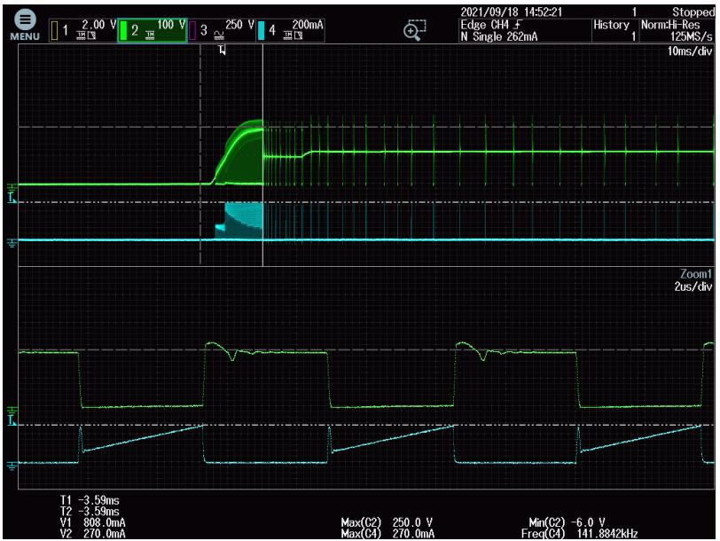

85 VAC

${ \mathsf { C H } } 2 { \mathsf { V } } _ { \mathsf { D S } }$  
$C H 4 1 _ { \mathsf { D } }$ $V _ { \mathsf { D S } } { = } 2 5 0 ~ \mathsf { V }$ $\mathsf { I } _ { \mathsf { M A X } } = 2 7 0 \mathsf { m A }$

Test Condition:  
➢ No Load  
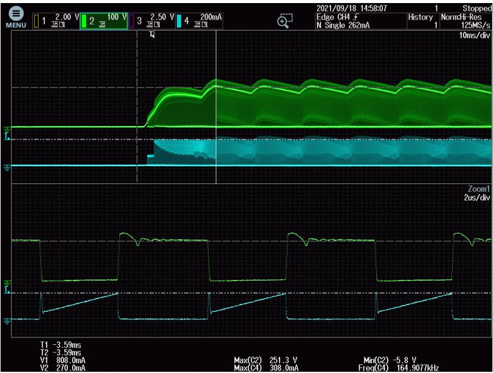

85 VAC

${ \mathsf { C H } } 2 { \mathsf { V } } _ { \mathsf { D S } }$  
CH4 ID $C H 4 1 _ { \mathsf { D } }$ $\mathtt { V } _ { \mathtt { D S } } mathtt { = } 2 5 1 . 3 \mathtt { V }$ $\mathsf { I } _ { \mathsf { M A X } } { = } 3 0 8 \mathsf { m } \mathsf { A }$ IMAX=

Test Condition:  
➢ Full Load  
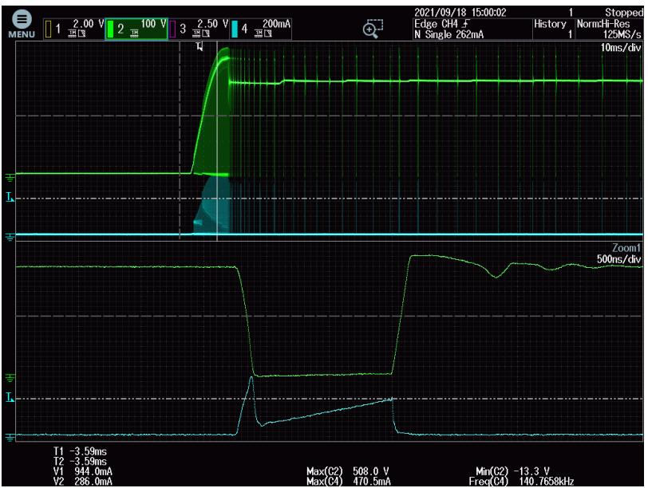

265 VAC

${ \mathsf { C H } } 2 \ { \mathsf { V } } _ { \mathsf { D S } }$  
$C H 4 1 _ { \mathsf { D } }$ $\mathtt { V } _ { \mathsf { D } \mathsf { S } } mathtt { = } 5 0 8 \mathtt { V }$ IMAX=470.5 $\mathsf { I } _ { \mathsf { M A X } } { = } 4 7 0 . 5 ~ \mathsf { m A }$

Test Condition:  
➢ No Load  
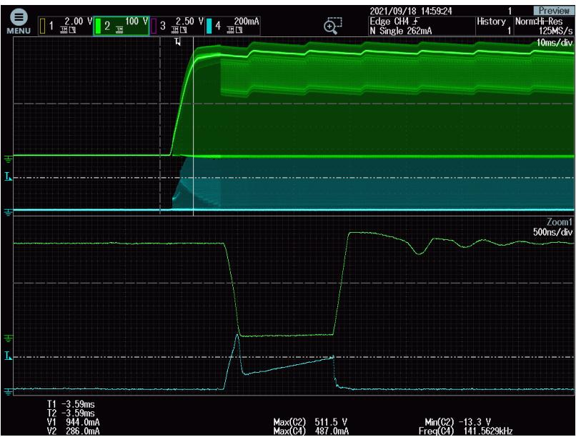

$2 6 5 \ : \mathsf { V } _ { \mathsf { A C } }$

${ \mathsf { C H } } 2 { \mathsf { V } } _ { \mathsf { D S } }$  
$C H 4 1 _ { \mathsf { D } }$ $\mathtt { V } _ { \mathtt { D S } } mathtt { = } 5 1 1 . 5 \mathtt { V }$ IMAX=487 $\mathsf { I } _ { \mathsf { M A X } } { = } 4 8 7 ~ \mathsf { m A }$

Test Condition:

➢ Full Load

## MOS漏源极电压电流波形 (正常工作)

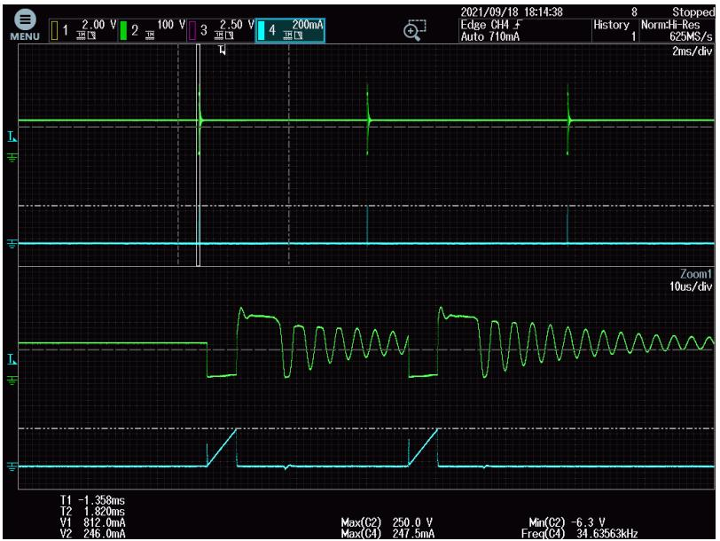

85 VAC

${ \mathsf { C H } } 2 { \mathsf { V } } _ { \mathsf { D S } }$  
$C H 4 1 _ { \mathsf { D } }$ $V _ { \mathsf { D S } } { = } 2 5 0 ~ \mathsf { V }$ $\mathsf { I } _ { \mathsf { M A X } } = 2 4 7 . 5 \mathsf { m A }$

Test Condition:  
➢ No Load  
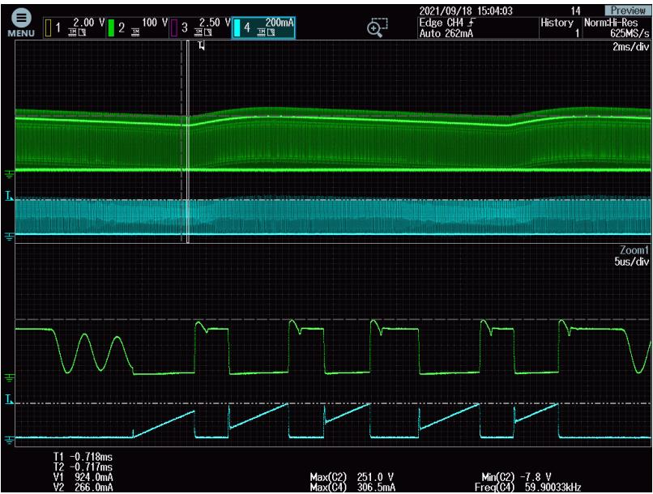

85 VAC

${ \mathsf { C H } } 2 { \mathsf { V } } _ { \mathsf { D S } }$  
$C H 4 1 _ { \mathsf { D } }$ $\mathtt { V } _ { \mathtt { D S } } mathtt { = } 2 5 1 \mathtt { V }$ $\mathsf { I } _ { \mathsf { M A X } } { = } 3 0 6 . 5 \mathsf { m A }$ IMAX=

Test Condition:  
➢ Full Load  
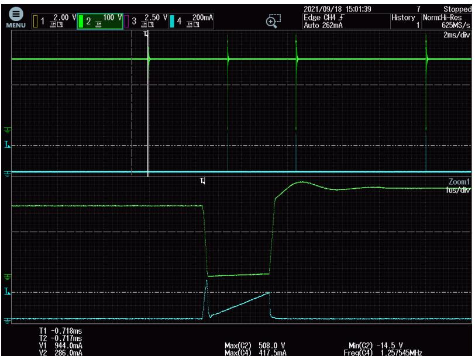

265 VAC

${ \mathsf { C H } } 2 \ { \mathsf { V } } _ { \mathsf { D S } }$  
$C H 4 1 _ { \mathsf { D } }$ $\mathtt { V } _ { \mathtt { D S } } mathtt { = } 5 0 8 \mathtt { V }$ IMAX=417.5 $\mathsf { I } _ { \mathsf { M A X } } { = } 4 1 7 . 5 ~ \mathsf { m A }$

Test Condition:  
➢ No Load  
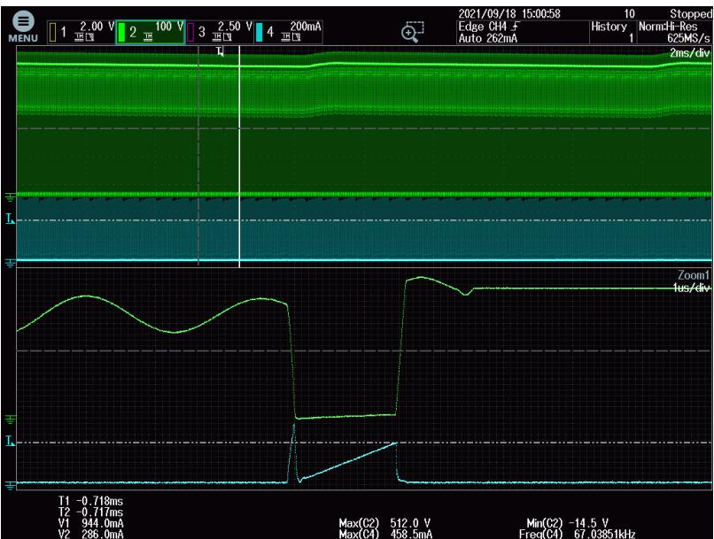

$2 6 5 \ : \mathsf { V } _ { \mathsf { A C } }$

${ \mathsf { C H } } 2 { \mathsf { V } } _ { \mathsf { D S } }$  
$C H 4 1 _ { \mathsf { D } }$ $\mathtt { V } _ { \mathsf { D } \mathsf { S } } mathtt { = } 5 1 2 \mathtt { V }$ IMAX=458.5 $\mathsf { I } _ { \mathsf { M A X } } { = } 4 5 8 . 5 ~ \mathsf { m A }$

Test Condition:

➢ Full Load

## 输出二极管电压波形

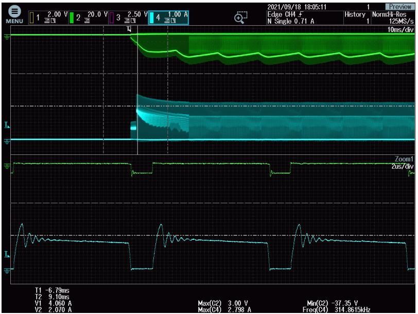

85 VAC

$C H 2 V _ { \mathsf { D } }$  
$C H 4 1 _ { \mathsf { D } }$ $V _ { \mathsf { D } } { = } 3 7 . 3 5 \ \mathsf { V }$ $\mathsf { I } _ { \mathsf { D m a x } } { = } 2 . 7 9 8 \mathsf { A }$ IDmax

Test Condition:

➢ Full Load  
➢ 开机

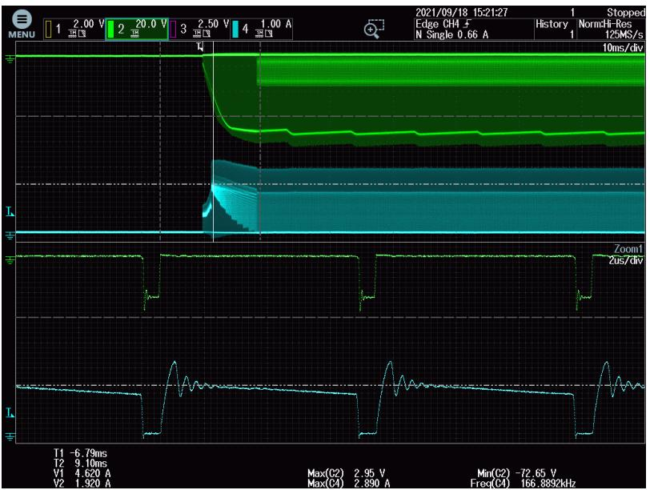

265 VAC

CH2 VD  
$C H 4 1 _ { \mathsf { D } }$ $V _ { \mathrm { { D } } } { = } 7 2 . 6 5 \ V$ $\mathsf { I } _ { \mathsf { D m a x } } { = } 2 . 8 9 \mathrm { ~ A ~ }$ Dmax

➢ Full Load  
➢ 开机

Test Condition:  
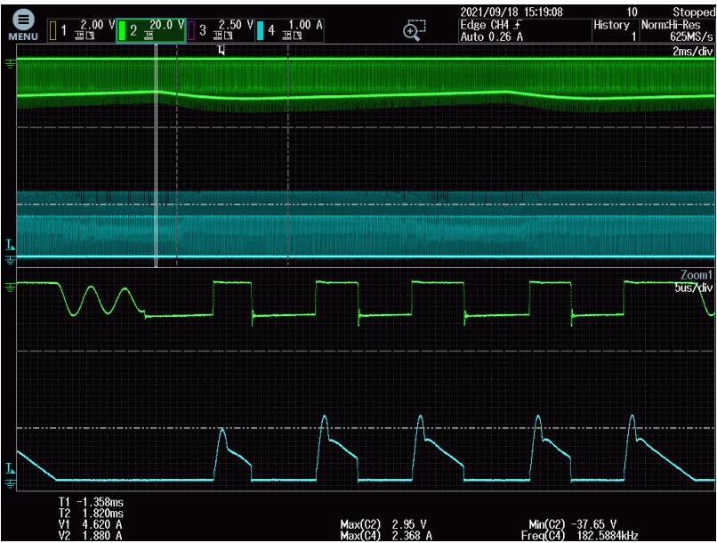

85 VAC

$C H 2 V _ { \mathsf { D } }$  
$C H 4 1 _ { \mathsf { D } }$ $V _ { \mathsf { D } } { = } 3 7 . 6 5 \ V$ $\mathsf { I } _ { \mathsf { D m a x } } = 2 . 3 6 8 \mathrm { ~ A ~ }$

Test Condition:

➢ Full Load

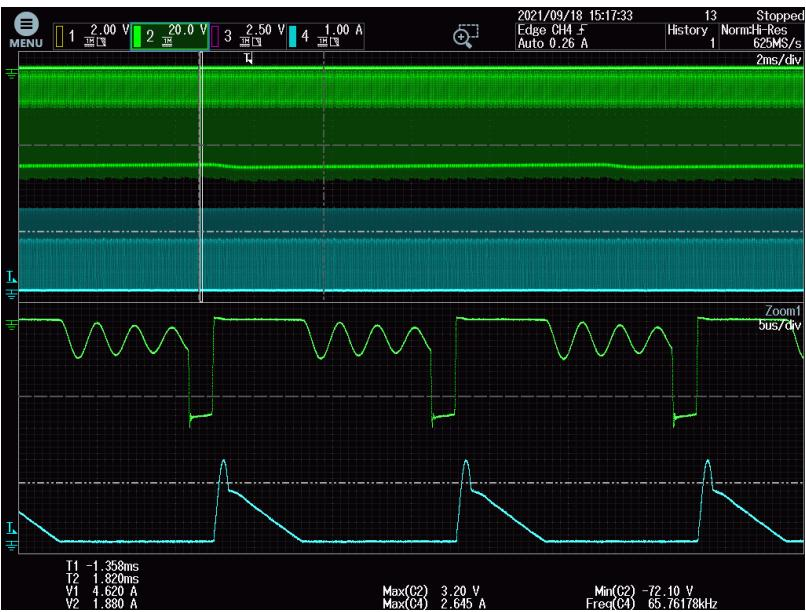

265 VAC

$C H 2 V _ { \mathsf { D } }$  
CH4 ID $C H 4 1 _ { \mathsf { D } }$ $\mathtt { V } _ { \mathtt { D } } { = } 7 2 . 1 \ \mathtt { V }$ IDmax=2.645 A $\mathsf { I } _ { \mathsf { D m a x } } = 2 . 6 4 5 \ \mathsf { A }$

Test Condition:

➢ Full Load

## 输出短路时MOs和二极管波形

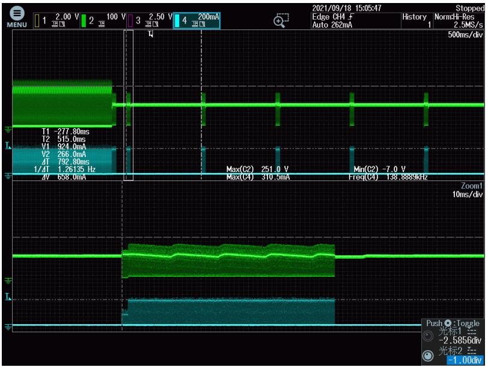

85 VAC

${ \mathsf { C H } } 2 { \mathsf { V } } _ { \mathsf { D S } }$  
CH4 ID $\begin{array} { l } { { \tt V } _ { \tt D S \_ m a x } = 2 5 1 { \tt V } } \\ { { \tt I } _ { \tt D S \_ m a x } = 3 1 0 . 5 \operatorname* { m A } } \end{array}$

## MOS

## Test Condition:

➢ Full Load

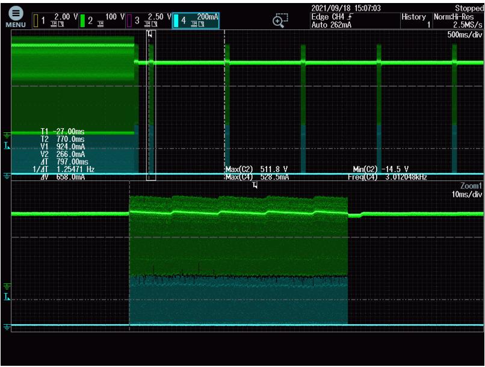

265 VAC

CH2 VDS  
CH4 ID $\begin{array} { l } { { \tt V } _ { \tt D S \_ m a x } = 5 1 1 . 8 { \tt V } } \\ { { \tt I } _ { \tt D S \_ m a x } = 5 2 8 . 5 \mathrm { \ m A } } \end{array}$

## MOS

## Test Condition:

➢ Full Load

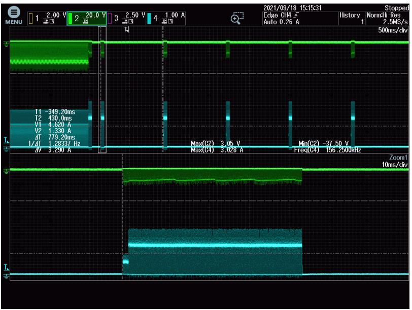

85 VAC

CH2 VD  
CH4 ID VD=37.5 V $\mathsf { I } _ { \mathsf { D m a x } } { = } 3 . 0 2 8 \mathsf { A }$ Dmax

## Test Condition:

➢ Full Load

## 二极管

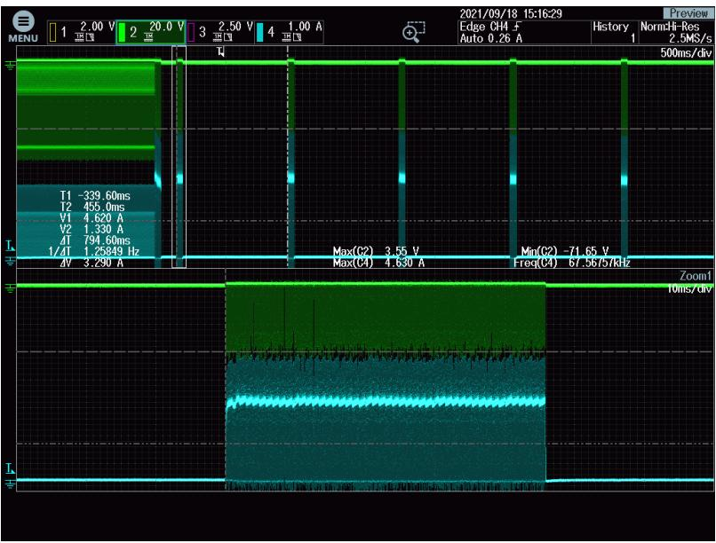

265 VAC

CH2 VD  
CH4 ID$\mathsf { V } _ { \mathsf { D } } { = } 7 1 . 6 5 \ : \mathsf { V }$ $\mathsf { I } _ { \mathsf { D m a x } } { = } 4 . 6 3 ~ \mathsf { A }$ IDmax

## Test Condition:

➢ Full Load

## 二极管

## 温升测试

<table><tr><td rowspan="2">项目</td><td colspan="4">温度(°C)</td></tr><tr><td>85VAC</td><td>115VAC</td><td>230VAC</td><td>264VAC</td></tr><tr><td>环境温度</td><td>44.2</td><td>45.4</td><td>45.4</td><td>45.7</td></tr><tr><td>BPA8604D (U1)</td><td>97.6</td><td>86.9</td><td>79.5</td><td>80.8</td></tr><tr><td>SS210F (D7)</td><td>72.6</td><td>72.4</td><td>72.4</td><td>73.3</td></tr><tr><td>变压器绕组 (T1)</td><td>67.5</td><td>67</td><td>68.1</td><td>69</td></tr><tr><td>变压器磁芯 (T1)</td><td>67.7</td><td>67.8</td><td>69.1</td><td>70.2</td></tr><tr><td>输入电解电容(EC2)</td><td>70.2</td><td>66.8</td><td>63.2</td><td>64.1</td></tr><tr><td>输出电解电容(EC5)</td><td>59.7</td><td>60.3</td><td>60.1</td><td>60.8</td></tr></table>

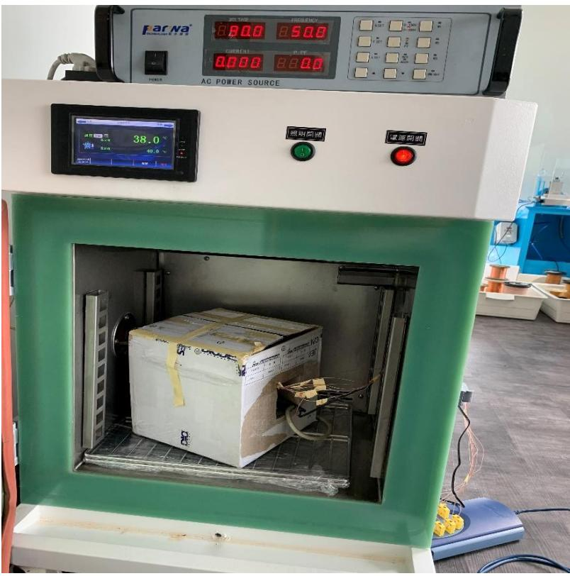

## 测试说明

➢ 在温箱中进行测试  
➢ 电路板放在一个封闭的盒子内  
➢ 热电偶连接到各个测量点  
➢ 等测量点温度达到稳定后记录数据

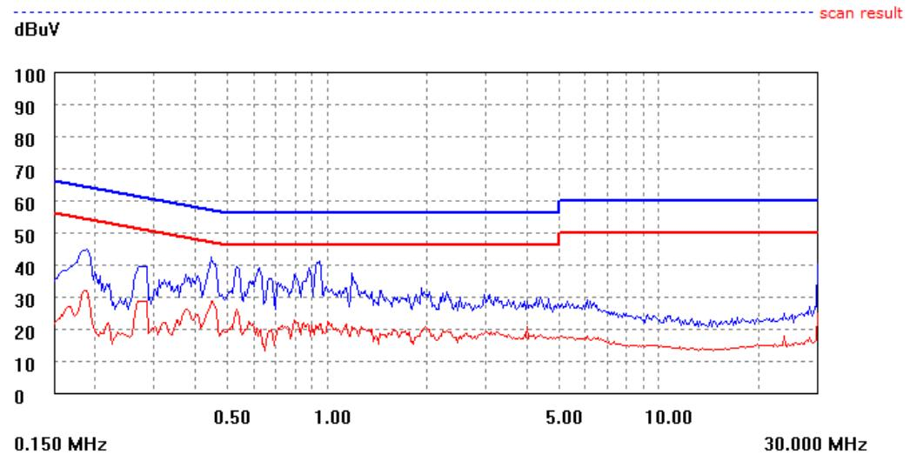

115VAC Line

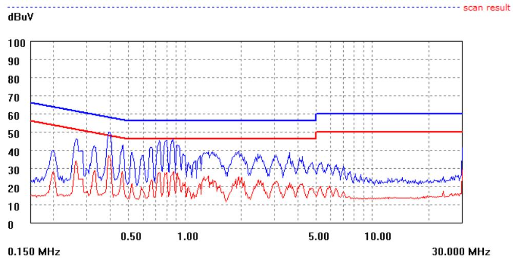

230VAC Line

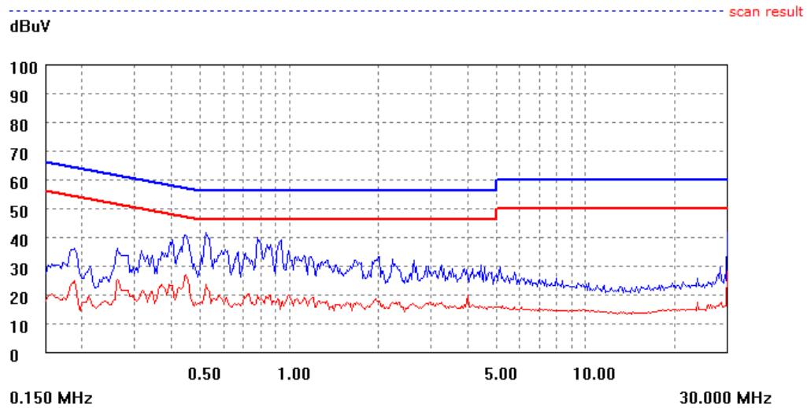

115VAC Neutral

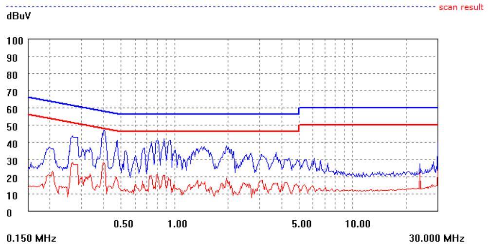

230VAC Neutral

115VAC RE

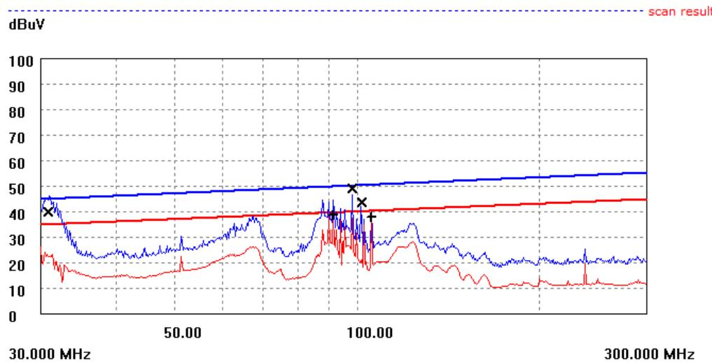

230VAC RE

<table><tr><td>差模</td><td>电压</td><td>相位角</td><td>发生器阻抗</td><td>测试次数</td><td>测试结果</td></tr><tr><td>L to N</td><td>+2kV</td><td>0</td><td>2</td><td>10</td><td>Pass</td></tr><tr><td>L to N</td><td>-2kV</td><td>0</td><td>2</td><td>10</td><td>Pass</td></tr><tr><td>L to N</td><td>+2kV</td><td>90</td><td>2</td><td>10</td><td>Pass</td></tr><tr><td>L to N</td><td>-2kV</td><td>90</td><td>2</td><td>10</td><td>Pass</td></tr><tr><td>L to N</td><td>+2kV</td><td>180</td><td>2</td><td>10</td><td>Pass</td></tr><tr><td>L to N</td><td>-2kV</td><td>180</td><td>2</td><td>10</td><td>Pass</td></tr><tr><td>L to N</td><td>+2kV</td><td>270</td><td>2</td><td>10</td><td>Pass</td></tr><tr><td>L to N</td><td>-2kV</td><td>270</td><td>2</td><td>10</td><td>Pass</td></tr></table>

## 测试说明

➢ 按照GB/T17626.5和IEC61000-4-5的最新版本要求进行测试  
➢ 室温环境，230VAC输入，满载条件  
➢ 输入1.2/50us组合波浪涌电压  
➢ 每个测试点重复10次  
➢ 每次间隔时间1分钟  
➢ 试验时样机输出正常（符合A类标准）视为Pass

<table><tr><td>测试点</td><td>电压(V)</td><td>放电类型</td><td>放电次数</td><td>测试结果</td></tr><tr><td>Vo</td><td>+15kV</td><td>空气放电</td><td>10</td><td>Pass</td></tr><tr><td>Vo</td><td>-15kV</td><td>空气放电</td><td>10</td><td>Pass</td></tr><tr><td>GND</td><td>+15kV</td><td>空气放电</td><td>10</td><td>Pass</td></tr><tr><td>GND</td><td>-15kV</td><td>空气放电</td><td>10</td><td>Pass</td></tr><tr><td>Vo</td><td>+8kV</td><td>接触放电</td><td>10</td><td>Pass</td></tr><tr><td>Vo</td><td>-8kV</td><td>接触放电</td><td>10</td><td>Pass</td></tr><tr><td>GND</td><td>+8kV</td><td>接触放电</td><td>10</td><td>Pass</td></tr><tr><td>GND</td><td>-8kV</td><td>接触放电</td><td>10</td><td>Pass</td></tr></table>

## 测试说明

➢ 按照GB/T17626.2和IEC61000-4-2的最新版本要求进行测试  
➢ 室温环境，230VAC输入满载条件  
➢ 每个测试点重复10次  
➢ 分别对输出正端和地进行空气放电  
➢ 试验时样机输出正常（符合A类标准）视为Pass

## THANK YOU FOR WATCHING
