## BPA8604D非隔离参考设计

## (15V/0.35A)

上海晶丰明源半导体股份有限公司

Shanghai Bright Power Semiconductor Co., Ltd.

王岩

时间： 2021年9月

## 内容

BPA8604D简介  
电源规格  
电路及实物图  
BOM  
PCB Layout图  
性能测试数据

## 产品特点：

➢ 集成 700V 高压 MOSFET  
➢ ON/OFF控制模式，快速的动态响应  
➢ 内置软启动功能  
➢ 集成高压启动、自供电电路  
通过MOSFET源极PCB散热，不影响EMI  
➢ 改善EMI的频率调制技术

## 应用领域：

➢ 家用电器辅助电源  
➢ 微波炉辅助电源

典型应用  

SOP-7封装

<table><tr><td>项目描述</td><td>符号</td><td>最小</td><td>典型</td><td>最大</td><td>单位</td><td>备注</td></tr><tr><td colspan="7">输入</td></tr><tr><td>电压</td><td> $V_{IN}$ </td><td>85</td><td>115/230</td><td>265</td><td> $V_{AC}$ </td><td></td></tr><tr><td>频率</td><td> $f_{LINE}$ </td><td>47</td><td>50/60</td><td>63</td><td>Hz</td><td></td></tr><tr><td colspan="7">输出</td></tr><tr><td>输出电压</td><td> $V_{OUT}$ </td><td></td><td>15</td><td></td><td>V</td><td>±5%</td></tr><tr><td>输出电流</td><td> $I_{OUT}$ </td><td>0</td><td></td><td>350</td><td>mA</td><td></td></tr><tr><td>输出电压纹波</td><td> $V_{RIPPLE}$ </td><td></td><td></td><td>150</td><td>mV</td><td>20MHz带宽</td></tr><tr><td>连续输出功率</td><td> $P_{OUT}$ </td><td></td><td>5.25</td><td></td><td>W</td><td></td></tr><tr><td colspan="7">效率</td></tr><tr><td>待机功耗</td><td> $P_{STDBY}$ </td><td></td><td></td><td>75</td><td>mW</td><td>230VAC</td></tr><tr><td>满载效率</td><td>η</td><td>75</td><td></td><td></td><td>%</td><td></td></tr><tr><td colspan="7">环境</td></tr><tr><td>传导EMI</td><td></td><td colspan="4">满足CISPR22/EN55022 Class B,至少6dB 裕量</td><td></td></tr><tr><td>Surge</td><td></td><td></td><td>2</td><td></td><td>kV</td><td>差模</td></tr><tr><td>EFT</td><td></td><td></td><td>4</td><td></td><td>kV</td><td>5kHz/100kHz/38kHz</td></tr><tr><td>ESD</td><td></td><td></td><td>15</td><td>20</td><td>kV</td><td>空气放电</td></tr><tr><td>工作环境温度</td><td> $T_{AMP}$ </td><td></td><td></td><td>40</td><td>°C</td><td></td></tr></table>

## 电路原理图以及实物图

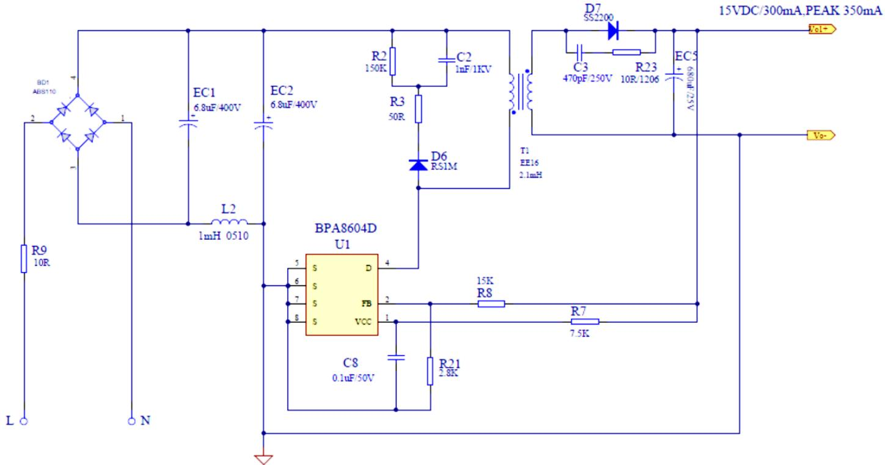

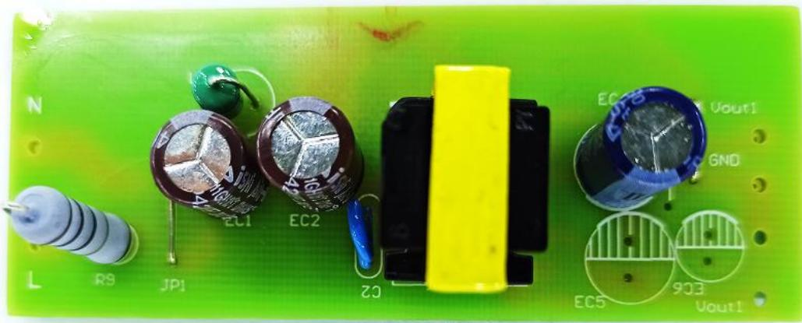

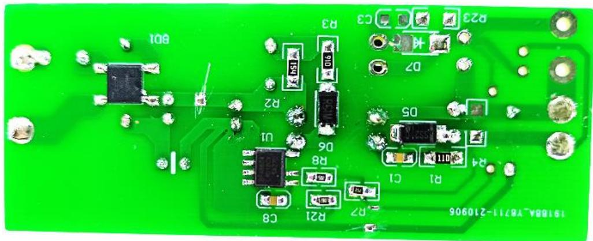

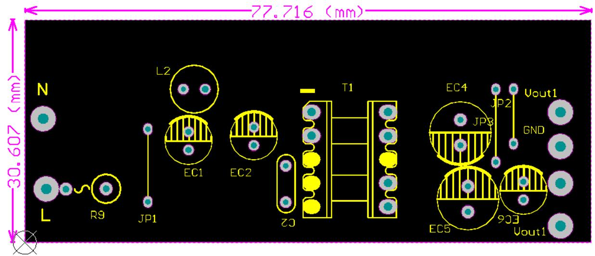

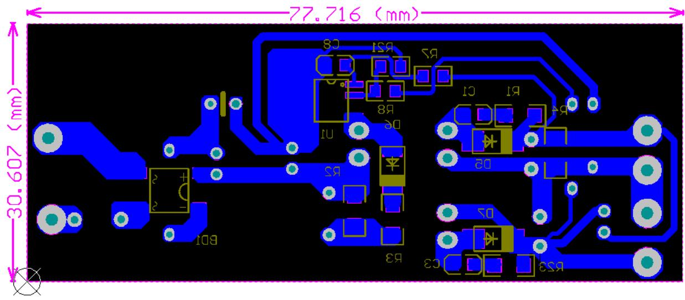

<table><tr><td>序号</td><td>元件标号</td><td>参数描述</td><td>封装尺寸</td><td>数量</td></tr><tr><td>1</td><td>PCB</td><td>CEM-1, 单面板</td><td>77.7mm*30.6mm</td><td>1</td></tr><tr><td>2</td><td>F1</td><td>10R慢断绕线电阻保险丝</td><td>DIP</td><td>1</td></tr><tr><td>3</td><td>BD1</td><td>ABS110, 1A/1000V</td><td>ABS,SOP-4</td><td>1</td></tr><tr><td>6</td><td>L1</td><td>1mH, 0510</td><td>0510</td><td>1</td></tr><tr><td>7</td><td>T1</td><td>2.1mH, EE16, 5-5 PIN</td><td>DIP</td><td>1</td></tr><tr><td>8</td><td>EC1, EC2</td><td>6.8uF/400V, 电解电容</td><td>∅8*12mm</td><td>2</td></tr><tr><td>9</td><td>EC3</td><td>470uF/25V, 电解电容</td><td>∅8*16mm</td><td>1</td></tr><tr><td>12</td><td>JP1</td><td>0.4mm,P=10mm</td><td>P=10mm</td><td>1</td></tr><tr><td>13</td><td>JP2</td><td>0.4mm,P=7.5mm</td><td>P=7.5mm</td><td>1</td></tr><tr><td>15</td><td>D5</td><td>SS2200,2A200V</td><td>SMA</td><td>1</td></tr><tr><td>16</td><td>D6</td><td>RS1M,1A1000V</td><td>SMA</td><td>1</td></tr><tr><td>18</td><td>C8</td><td>100nF,50V,X7R</td><td>SMD0805</td><td>1</td></tr><tr><td>19</td><td>C2</td><td>1nF,1KV</td><td>DIP</td><td>1</td></tr><tr><td>20</td><td>C1</td><td>470pF,100V,X7R</td><td>SMD0805</td><td>1</td></tr><tr><td>23</td><td>R1</td><td>10R, ±5%</td><td>SMD0805</td><td>1</td></tr><tr><td>24</td><td>R2</td><td>150K, ±5%</td><td>SMD1206</td><td>1</td></tr><tr><td>25</td><td>R3</td><td>50R, ±5%</td><td>SMD0805</td><td>1</td></tr><tr><td>26</td><td>R7</td><td>7.5K, ±5%</td><td>SMD0805</td><td>1</td></tr><tr><td>27</td><td>R8</td><td>15K, ±1%</td><td>SMD0805</td><td>1</td></tr><tr><td>28</td><td>R21</td><td>2.8K, ±1%</td><td>SMD0805</td><td>1</td></tr><tr><td>32</td><td>U1</td><td>BPA8604D, SOP-7</td><td>SOP7</td><td>1</td></tr><tr><td></td><td></td><td></td><td>Total</td><td>22</td></tr></table>

## 结构图

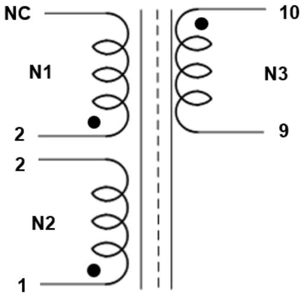

## 绕线方式

<table><tr><td>绕组</td><td>起始脚</td><td>终止脚</td><td>材料</td><td>匝数</td><td>绕线方式</td></tr><tr><td>N1</td><td>2</td><td>NC</td><td> $\phi 0.2*2P$ </td><td>17Ts</td><td>密绕一层(PIN脚朝内)</td></tr><tr><td>胶带</td><td></td><td></td><td></td><td>2Ts</td><td></td></tr><tr><td>N2</td><td>1</td><td>2</td><td> $\phi 0.2*1P$ </td><td>105Ts</td><td>密绕三层(PIN脚朝内)</td></tr><tr><td>胶带</td><td></td><td></td><td></td><td>2Ts</td><td></td></tr><tr><td>N3</td><td>10</td><td>9</td><td> $\phi 0.36*P$ </td><td>18Ts</td><td>密绕一层(PIN脚朝内)</td></tr></table>

## 规格与材料

➢ 初级绕组感量 $\mathsf { L } _ { \mathsf { p } } { = } 2 . 1 \mathsf { m } \mathsf { H } { \pm } 7 \%$ （测试条件： 0.3V，50kHz）  
➢ 漏感量 $\mathsf { L } _ { | \mathsf { k } } < 3 0 0 \mathsf { u } \mathsf { H }$  
➢ 骨架：EE16（5+5PIN）  
➢ 磁芯：EE16 PC40 或同等材质 ， ${ \mathsf { A } } { \mathsf { e } } = 1 9 . 2 { \mathsf { m m } } ^ { 2 }$  
➢ N1、N2、N3: 2UEW 漆包线  
➢ 绝缘胶带:3M900 或同等材质  
➢ 成品要求：浸凡立水

## 脚位图

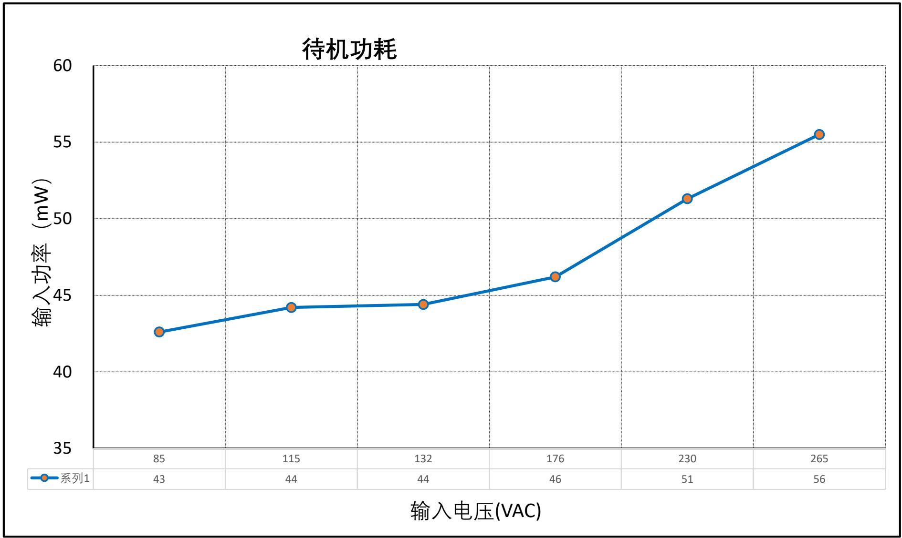

效率测试  
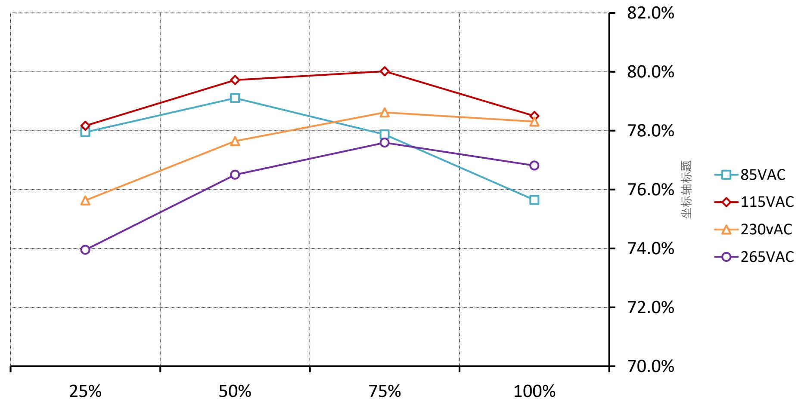

负载比例

## 输出电压调整率

<table><tr><td> $V_{IN}(VAC)$ Load(%)</td><td>85</td><td>115</td><td>132</td><td>176</td><td>230</td><td>265</td><td>平均值</td><td>线调整率</td></tr><tr><td>0</td><td>15.035</td><td>15.024</td><td>15.022</td><td>15.027</td><td>15.027</td><td>15.023</td><td>15.026</td><td>0.09%</td></tr><tr><td>20%</td><td>15.032</td><td>15.022</td><td>15.023</td><td>15.026</td><td>15.026</td><td>15.022</td><td>15.025</td><td>0.07%</td></tr><tr><td>40%</td><td>15.030</td><td>15.023</td><td>15.022</td><td>15.024</td><td>15.024</td><td>15.018</td><td>15.024</td><td>0.08%</td></tr><tr><td>60%</td><td>15.028</td><td>15.023</td><td>15.020</td><td>15.024</td><td>15.024</td><td>15.016</td><td>15.023</td><td>0.08%</td></tr><tr><td>80%</td><td>15.005</td><td>14.997</td><td>14.993</td><td>15.023</td><td>15.023</td><td>15.008</td><td>15.008</td><td>0.20%</td></tr><tr><td>100%</td><td>14.994</td><td>14.991</td><td>14.985</td><td>14.977</td><td>14.977</td><td>14.934</td><td>14.976</td><td>0.40%</td></tr><tr><td>平均值</td><td>15.021</td><td>15.013</td><td>15.011</td><td>15.017</td><td>15.017</td><td>15.004</td><td rowspan="2" colspan="2">0.44%额定15V输出电压调整率</td></tr><tr><td>负载调整率</td><td>0.27%</td><td>0.22%</td><td>0.25%</td><td>0.33%</td><td>0.33%</td><td>0.59%</td></tr></table>

◼ 计算方法：调整率=100%\*(最大值-最小值)/平均值；  
BPA8604D反馈FB引脚电压范围1.8V\~2.4V，典型值2.2V，IC端输出电压精度为：-18.2%\~+9.1%  
LNK364D反馈FB引脚电压范围1.53V\~1.73V，典型值1.63V，IC端输出电压精度为：±6.1%

## 输出电压纹波—空载

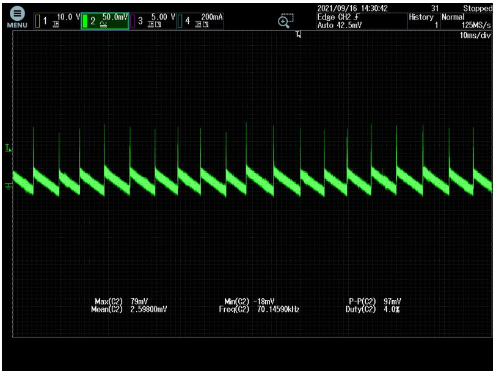

85 VAC

CH2 VOUT Ripple VPK-PK=97mV

## Test Condition:

➢ No Load

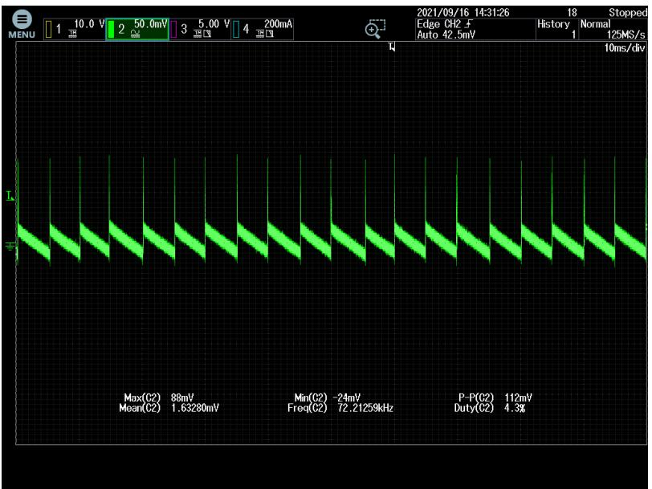

230 VAC

$\begin{array} { r l } { \mathbf { \Pi } } & { { } \mathsf { C H 2 } \mathsf { V _ { \mathrm { 0 u T } } R i p p l e } } \\ { \mathbf { \Pi } } & { { } \mathsf { V _ { P K - P K } } = \pm \mathbf { 1 1 2 m v } } \end{array}$

## Test Condition:

➢ No Load

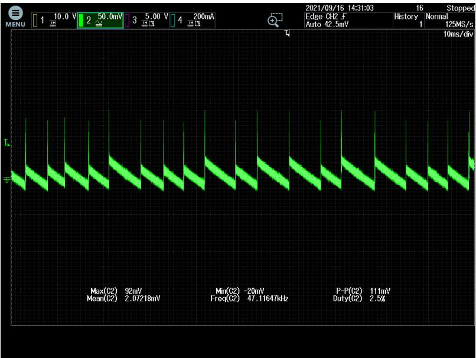

115 VAC

CH2 $\mathsf { V } _ { \mathsf { O U T } }$ Ripple VPK-PK=111mV

## Test Condition:

➢ No Load

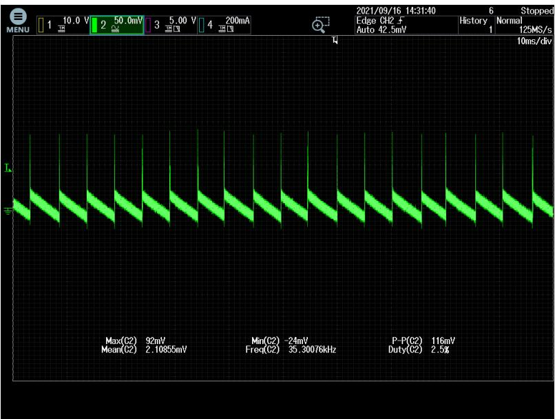

265 VAC

$\begin{array} { r l } { \mathbf { \Pi } } & { \mathsf { C H 2 } \mathsf { V } _ { \mathsf { o u T } } \mathsf { R i p p l e } } \\ & { \mathsf { V } _ { \mathsf { P K - P K } } = \pm \mathbf { 1 1 6 m V } } \end{array}$

## Test Condition:

➢ No Load

## 输出电压纹波—满载

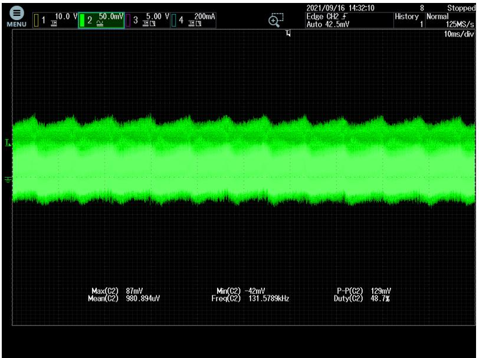

85 VAC

$\begin{array} { r l } & { \mathsf { C H 2 } \mathsf { V _ { 0 \cup \top } R i p p l e } } \\ & { \mathsf { V _ { P K - P K } } \mathsf { = } \mathsf { 1 2 9 m v } } \end{array}$

## Test Condition:

➢ Full Load

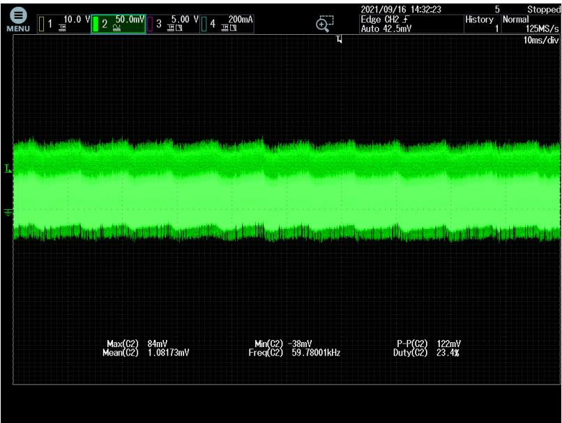

115 VAC

CH2 $\mathsf { V } _ { \mathsf { O U T } }$ Ripple $\mathsf { V } _ { \mathsf { P K - P K } } { = } \pm 2 2 \mathsf { m V }$

## Test Condition:

➢ Full Load

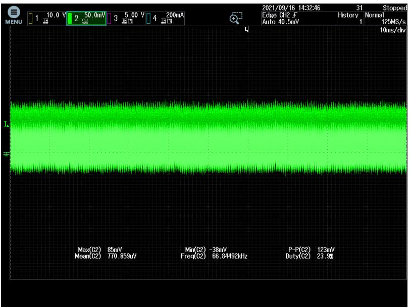

230 VAC

$\begin{array} { r l } { \mathbf { \Pi } } & { { } \mathsf { C H 2 } ~ \mathsf { V _ { o u T } R i p p l e } } \\ { \mathbf { \Pi } } & { { } ~ \mathsf { V _ { P K - P K } } = \pm 2 3 \mathsf { m V } } \end{array}$

## Test Condition:

➢ Full Load

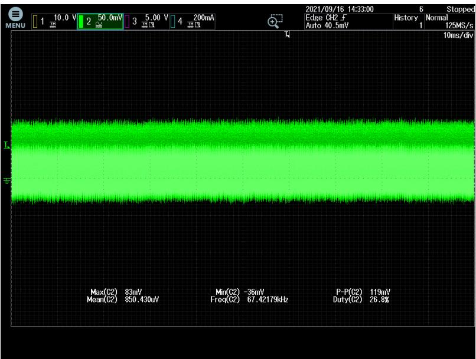

265 VAC

$\begin{array} { r l } & { \mathsf { C H 2 } \mathsf { V _ { o u T } } \mathsf { R i p p l e } } \\ & { \mathsf { V _ { P K - P K } } \mathsf { = } \mathsf { 1 1 9 m V } } \end{array}$

## Test Condition:

➢ Full Load

## 动态负载(50%-100%)

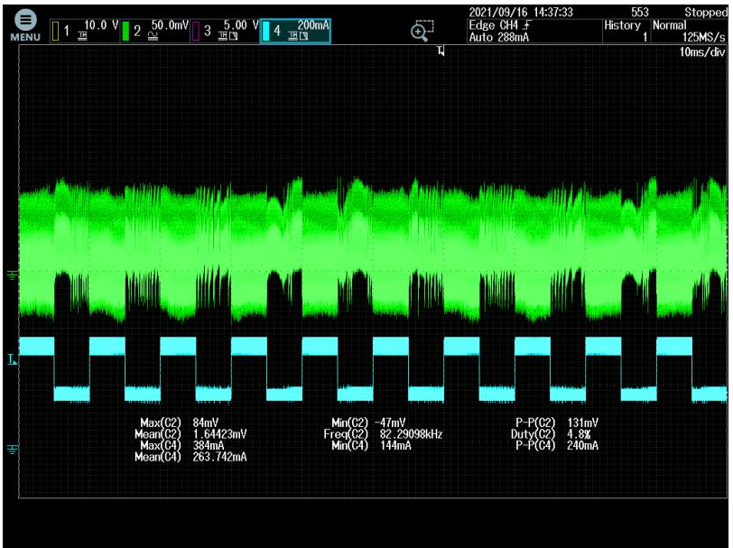

85 VAC

${ \mathsf { C H } } 2 { \mathsf { V } } _ { \mathsf { O U T } }$ CH2 VOUT $v _ { p | c - P K } { = } 1 3 1 m v$  
CH4 IOUT $\mathsf { C H 4 } \mathsf { I } _ { \mathsf { O U T } }$

## Test Condition:

➢ 0.175 A-0.35 A-0.175 A  
➢ Slew Rate: 0.5 A/μS  
➢ Frequency: 100 Hz

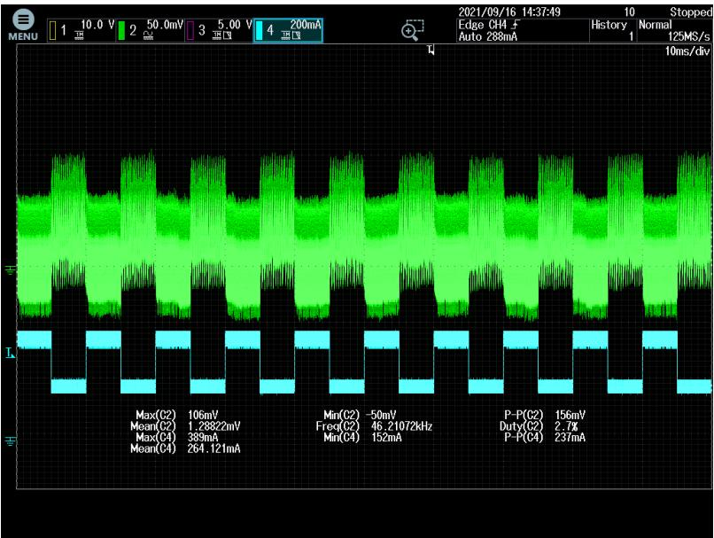

115 VAC

CH2 VOUT ${ \mathsf { C H } } { 2 } { \mathsf { V } } _ { \mathsf { O U T } }$ $v _ { p _ { \mathrm { K - P K } } } { = } 1 5 6 ~ \mathsf { m V }$  
CH4 IOUT $\mathsf { C H 4 } \mathsf { I } _ { \mathsf { O U T } }$

## Test Condition:

➢ 0.175 A-0.35 A-0.175 A  
➢ Slew Rate: $0 . 5 \mathsf { A } / \mu \mathsf { S }$  
➢ Frequency: 100 Hz

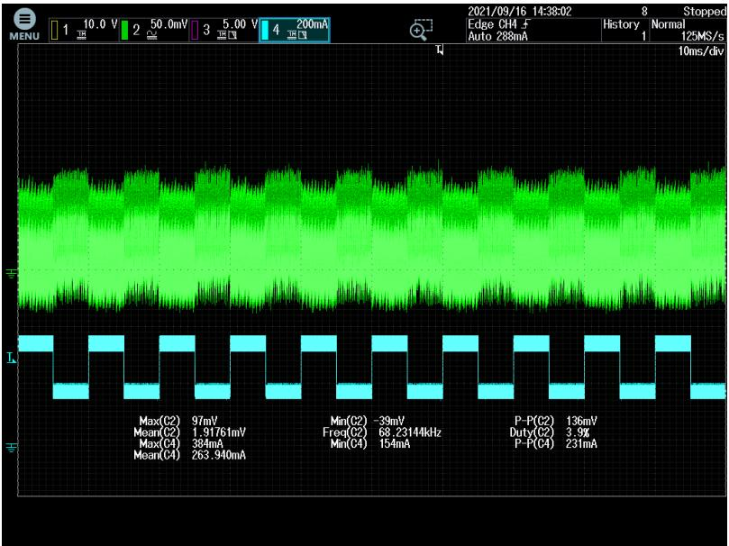

230 VAC

CH2 VOUT $\mathsf { V } _ { \mathsf { O U T } }$ $v _ { p \vert k - P K } { = } 1 3 6 ~ \mathsf { m V }$  
CH4 IOUT $\mathsf { C H 4 } \mathsf { I } _ { \mathsf { O U T } }$

## Test Condition:

➢ 0.175 A-0.35 A-0.175 A  
➢ Slew Rate: 0.5 $\mathsf { A } / \mu \mathsf { S }$  
➢ Frequency: 100 Hz

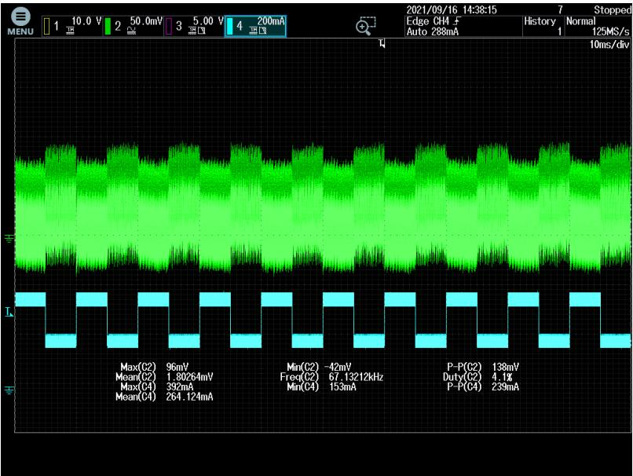

265 $\mathsf { v } _ { \mathsf { A C } }$

CH2 VOUT ${ \mathsf { C H } } 2 { \mathsf { V } } _ { \mathsf { O U T } }$ $v _ { p _ { \mathrm { K - P K } } } { = } 1 3 8 \mathsf  m v$ VPK-PK=138 mV  
$\mathsf { C H 4 } \mathsf { I } _ { \mathsf { O U T } }$

## Test Condition:

➢ 0.175 A-0.35 A-0.175 A  
➢ Slew Rate: $0 . 5 \mathsf { A } / \mu \mathsf { S }$  
➢ Frequency: 100 Hz

## 动态负载(10%-90%)

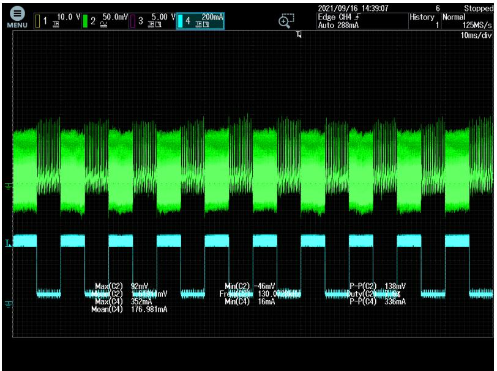

85 VAC

CH2 VOUT ${ \mathsf { C H } } 2 { \mathsf { V } } _ { \mathsf { O U T } }$ $V _ { \mathsf { P K - P K } } { = } 1 3 8 \mathsf { m V }$  
CH4 IOUT $\mathsf { C H 4 } \mathsf { I } _ { \mathsf { O U T } }$

## Test Condition:

➢ 0.035A-0.315 A-0.035 A  
➢ Slew Rate: 0.5 A/μS  
➢ Frequency: 100 Hz

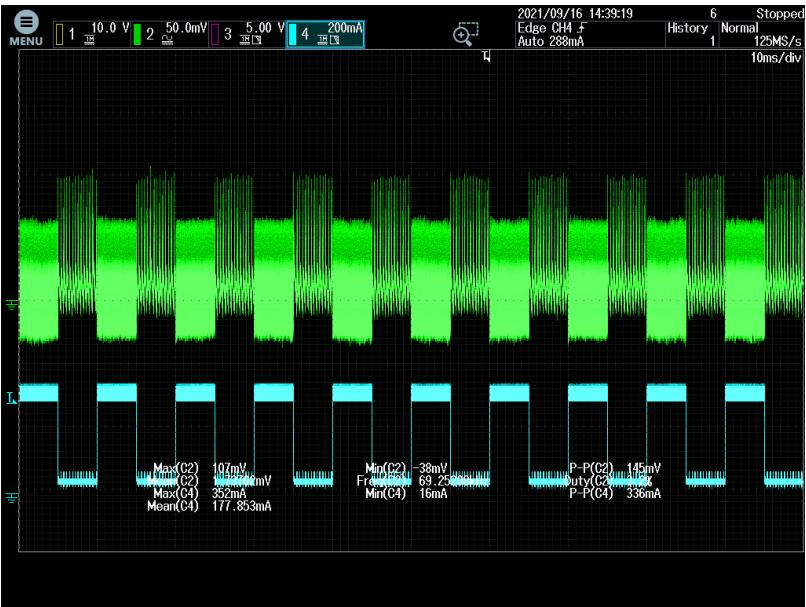

115 VAC

CH2 VOUT ${ \mathsf { C H } } { 2 } { \mathsf { V } } _ { \mathsf { O U T } }$ $\mathsf { V } _ { \mathsf { P K - P K } } { = } \pm 4 5 \mathsf { m V }$  
CH4 IOUT $\mathsf { C H 4 } \mathsf { I } _ { \mathsf { O U T } }$

## Test Condition:

➢ 0.035A-0.315 A-0.035 A  
➢ Slew Rate: $0 . 5 \mathsf { A } / \mu \mathsf { S }$  
➢ Frequency: 100 Hz

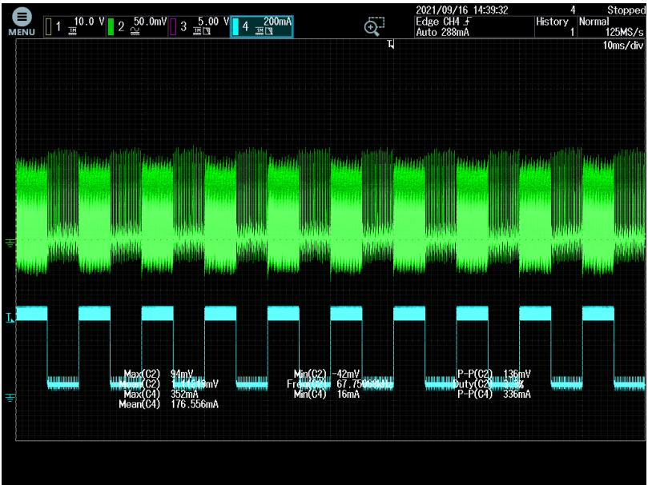

230 VAC

CH2 VOUT ${ \mathsf { C H } } 2 { \mathsf { V } } _ { \mathsf { O U T } }$ $\mathsf { V } _ { \mathsf { P K - P K } } { = } \pm 3 6 \mathsf { m V }$  
CH4 IOUT $\mathsf { C H 4 } \mathsf { I } _ { \mathsf { O U T } }$

## Test Condition:

➢ 0.035A-0.315 A-0.035 A  
➢ Slew Rate: 0.5 $\mathsf { A } / \mu \mathsf { S }$  
➢ Frequency: 100 Hz

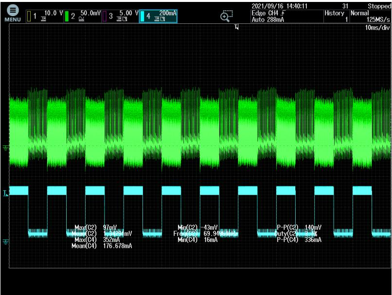

265 $\mathsf { v } _ { \mathsf { A C } }$

CH2 VOUT ${ \mathsf { C H } } 2 { \mathsf { V } } _ { \mathsf { O U T } }$ $\mathsf { V } _ { \mathsf { P K - P K } } { = } \mathsf { 1 } 4 0 \mathsf { m V }$ VPK-PK=140mV  
$\mathsf { C H 4 } \mathsf { I } _ { \mathsf { O U T } }$

## Test Condition:

➢ 0.035A-0.315 A-0.035 A  
➢ Slew Rate: $0 . 5 \mathsf { A } / \mu \mathsf { S }$  
➢ Frequency: 100 Hz

## 输出电压开机波形—空载

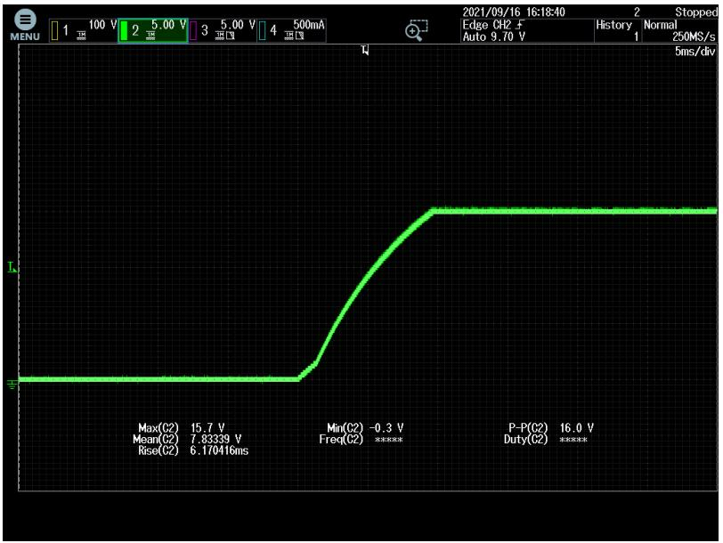

85 VAC

CH2 VOUT TRISE: 6.1 mS

Test Condition:

➢ No Load

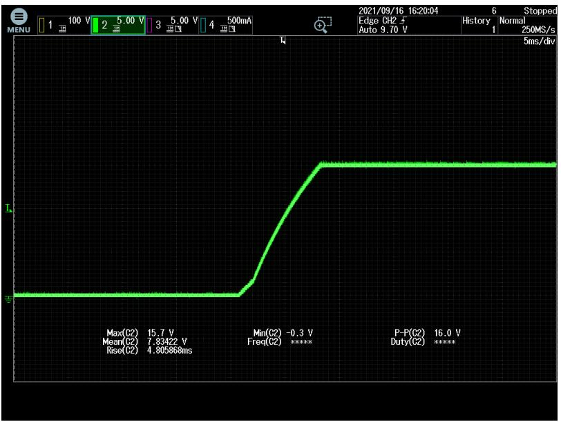

230 VAC

CH2 VOUT TRISE: 4.8 mS

Test Condition:

➢ No Load

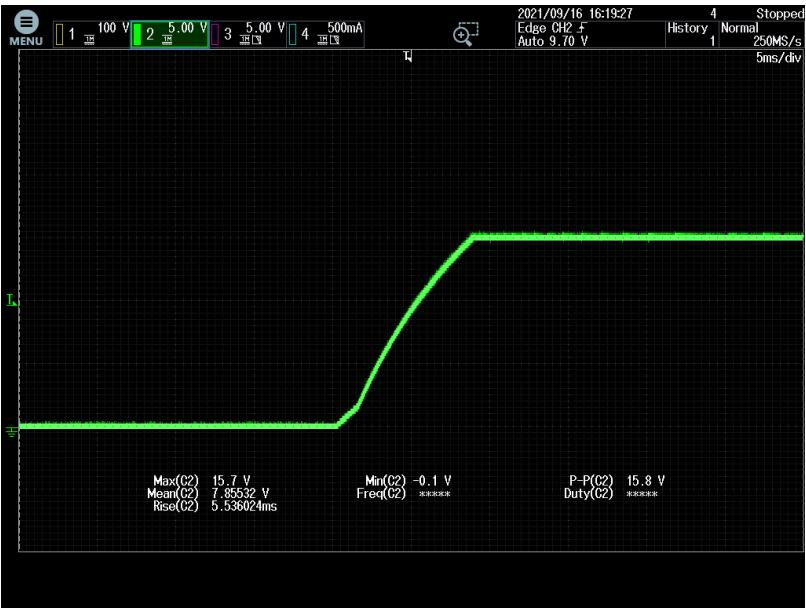

115 VAC

CH2 VOUT TRISE: 5.5 mS

Test Condition:

➢ No Load

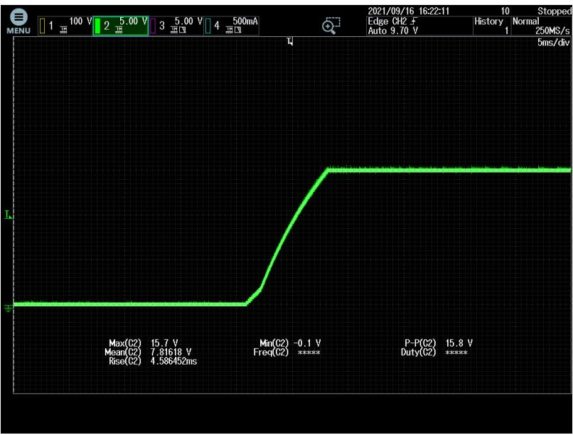

265 VAC

CH2 VOUT TRISE: 4.5 mS

Test Condition:

➢ No Load

## 输出电压开机波形—满载

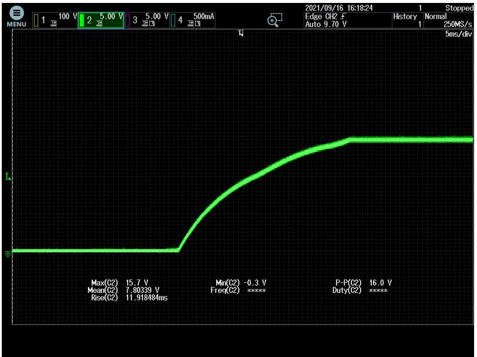

85 VAC

CH2 VOUT TRISE: 11.9 mS

## Test Condition:

➢ Full Load

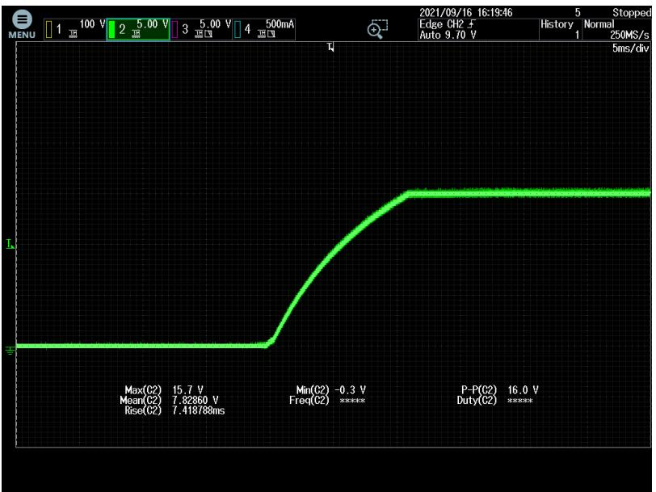

230 VAC

CH2 VOUT TRISE: 7.4 mS

## Test Condition:

➢ Full Load

115 VAC

CH2 VOUT TRISE: 9.8 mS

## Test Condition:

➢ Full Load

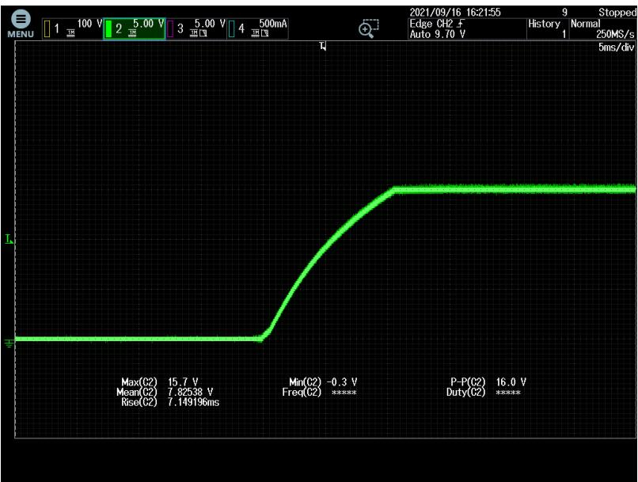

265 VAC

$\begin{array} { r l } { \mathbf { \bar { u } } } & { { } \mathsf { C H } 2 \mathsf { V } _ { \mathsf { o u } \intercal } } \\ { \mathbf { \bar { I } } _ { \mathsf { R I S E } } \colon \mathbf { 7 } . 1 \mathsf { m s } } \end{array}$ CH2 VOUT

## Test Condition:

➢ Full Load

## 漏源极电压和电流开机波形—空载

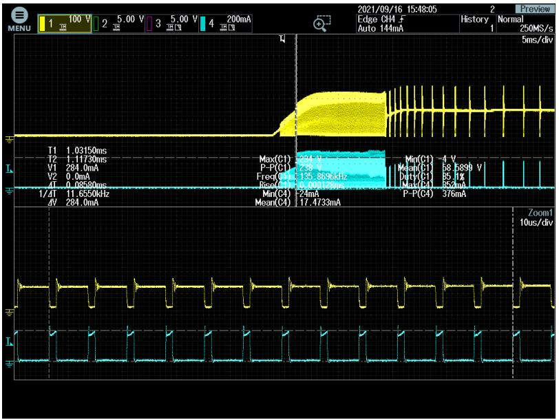

85 VAC

CH1 VDS  
CH4 IDS

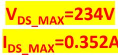  
Test Condition:

➢ No Load

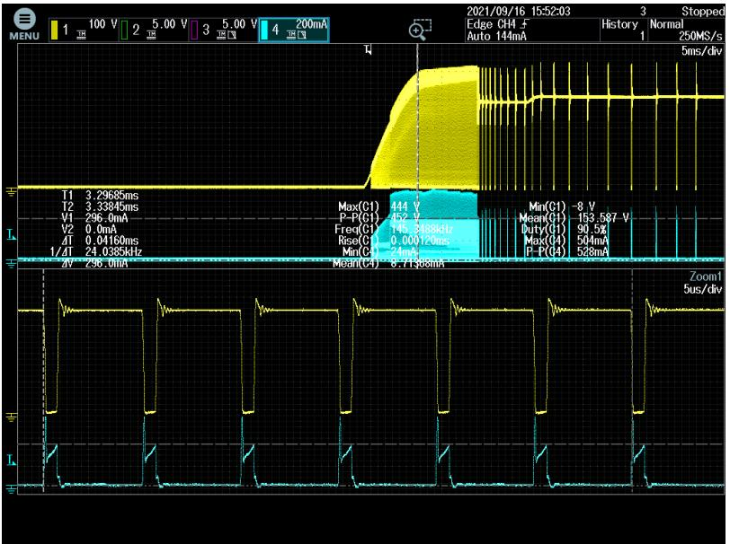

230 VAC

CH1 VDS  
CH4 IDS

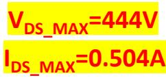  
Test Condition:

➢ No Load

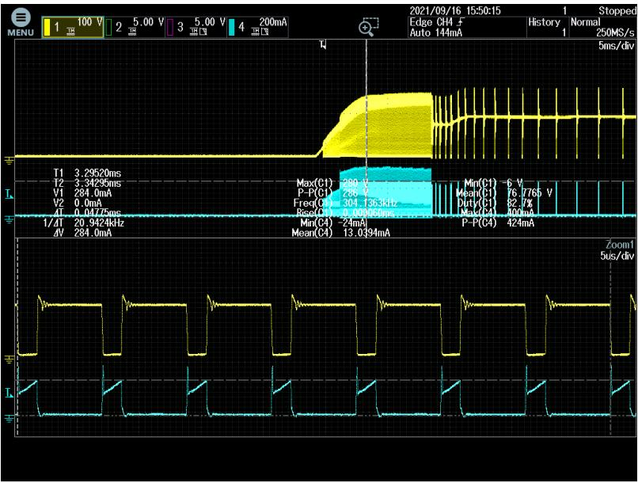

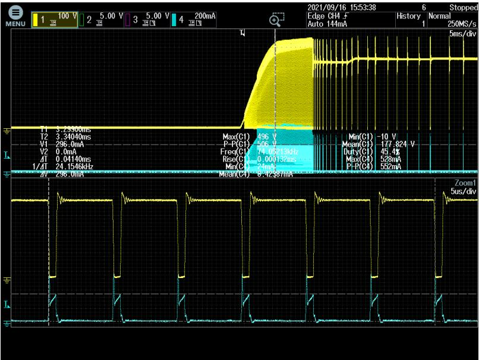

115 VAC

CH1 VDS  
CH4 IDS

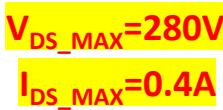  
Test Condition:

➢ No Load

265 VAC

CH1 VDS  
CH4 IDS

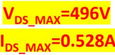  
Test Condition:

➢ No Load

## 漏源极电压和电流开机波形—满载

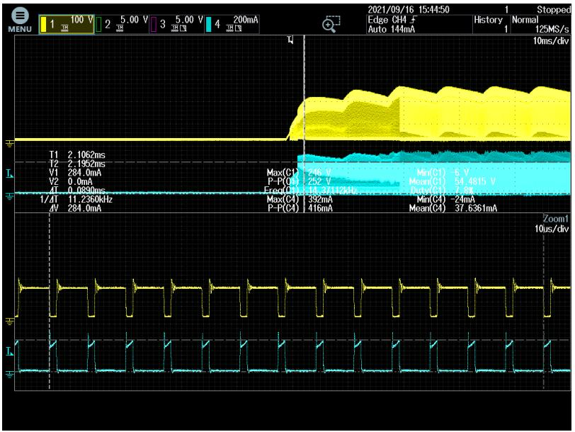

85 VAC

CH1 VDS  
CH4 IDS

$$
\begin{array}{l} \mathrm {V_ {DS\_MAX}} = 2 4 6 \mathrm{V} \\ \mathrm {I_ {DS\_MAX}} = 0. 3 9 2 \mathrm{A} \end{array}
$$

## Test Condition:

➢ Full Load

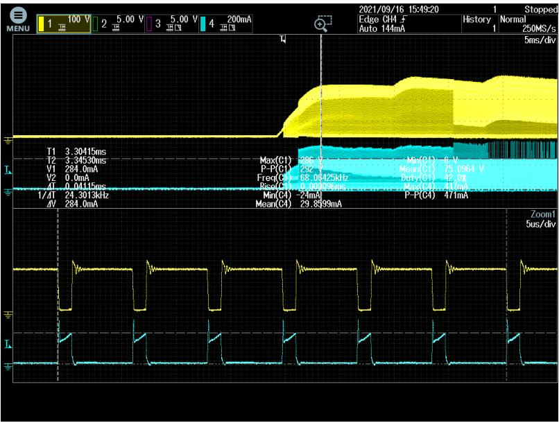

115 VAC

CH1 VDS  
CH4 IDS

$$
\begin{array}{l} \mathrm {V_ {DS\_MAX}} = 2 8 6 \mathrm{V} \\ \mathrm {I_ {DS\_MAX}} = 0. 4 4 7 \mathrm{A} \end{array}
$$

## Test Condition:

➢ Full Load

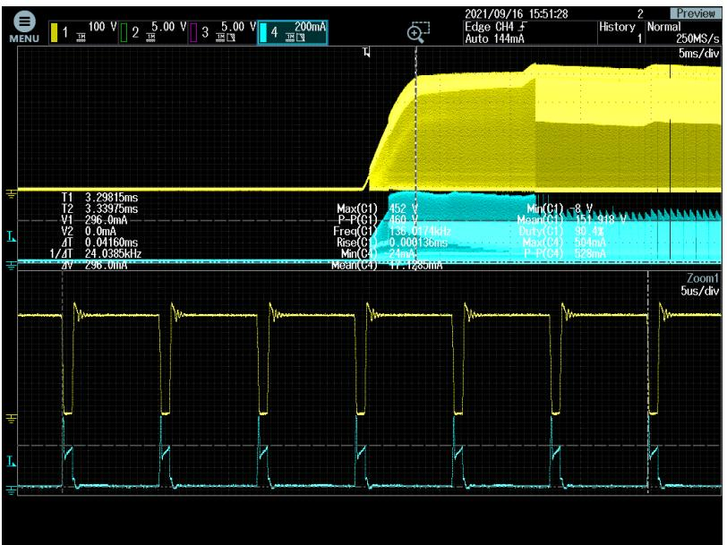

230 VAC

CH1 VDS  
CH4 IDS

$$
\begin{array}{l} \mathrm {V_ {DS\_MAX}} = 4 5 2 \mathrm{V} \\ \mathrm {I_ {DS\_MAX}} = 0. 5 0 4 \mathrm{A} \end{array}
$$

## Test Condition:

➢ Full Load

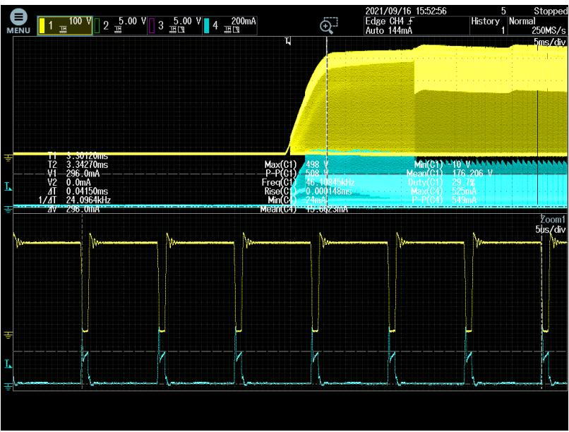

265 VAC

CH1 VDS  
CH4 IDS

$$
\begin{array}{l} \mathrm {V_ {DS\_MAX}} = 4 9 8 \mathrm{V} \\ \mathrm {I_ {DS\_MAX}} = 0. 5 2 5 \mathrm{A} \end{array}
$$

## Test Condition:

➢ Full Load

## 漏源极电压和电流稳态波形—空载

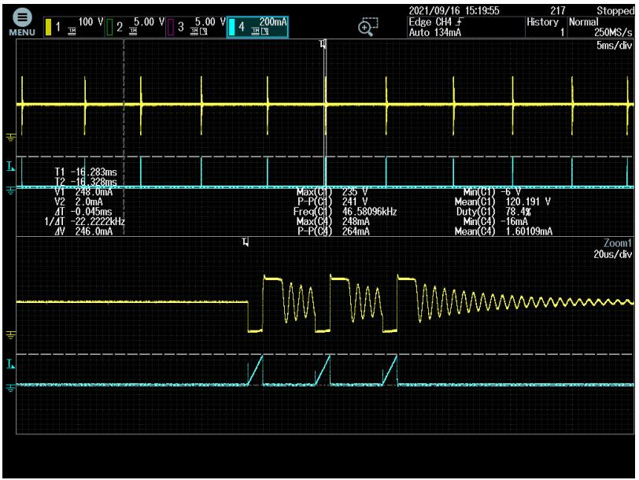

85 VAC

CH1VDS  
CH4 IDS

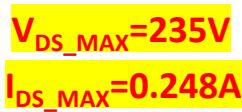  
Test Condition:

➢ No Load

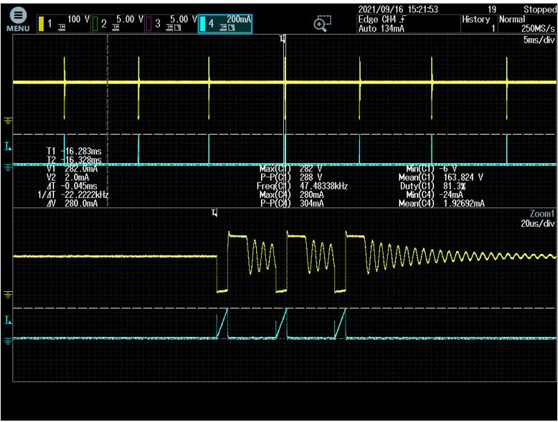

115 VAC

CH1VDS  
CH4 IDS

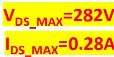  
Test Condition:

➢ No Load

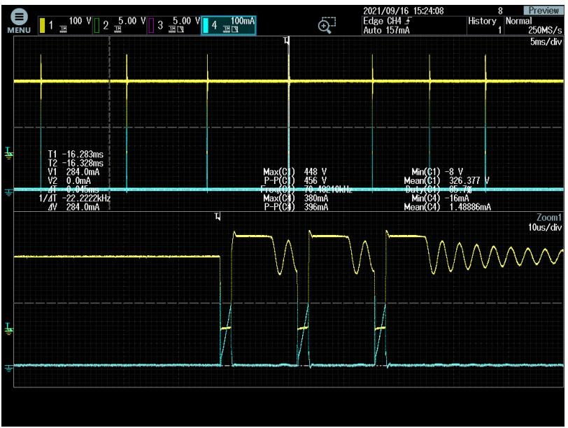

230 VAC

CH1VDS  
CH4 IDS

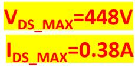  
Test Condition:

➢ No Load

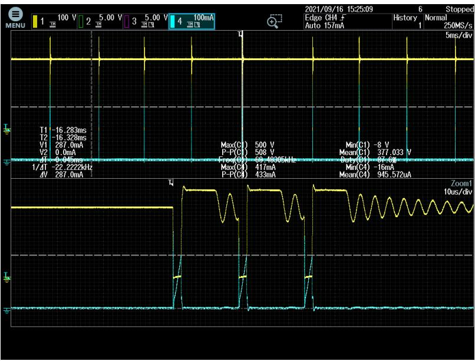

265 VAC

CH1VDS  
CH4 IDS

  
Test Condition:

➢ No Load

## 漏源极电压和电流稳态波形—满载


85 VAC

CH1VDS  
CH4 IDS

  
Test Condition:

➢ Full Load


115 VAC

CH1 VDS  
CH4 IDS

  
Test Condition:

➢ Full Load


230 VAC

CH1 VDS  
CH4 IDS

  
Test Condition:

➢ Full Load


265 VAC

CH1 VDS  
CH4 IDS

  
Test Condition:

➢ Full Load

## 输出二极管反向电压和电流稳态波形—空载


85 VAC

CH2 VR  
CH4 IR

$$
\begin{array}{l} \mathrm {V_ {R\_MAX}} = 3 9. 8 \mathrm{V} \\ \mathrm {I_ {R\_MAX}} = 1. 5 5 \mathrm{A} \end{array}
$$

## Test Condition:

➢ No Load


115 VAC

CH2 VR  
CH4 IR

$$
\begin{array}{l} V _ {R \_ M A X} = 4 7. 2 V \\ I _ {R \_ M A X} = 1. 7 4 A \end{array}
$$

## Test Condition:

➢ No Load


230 VAC

CH2 VR  
CH4 IR

$$
V _ {R \_ M A X} = 7 9. 2 V
$$

$$
I _ {R \_ M A X} = 1. 8 6 A
$$

## Test Condition:

➢ No Load


265 VAC

CH2 VR  
CH4 IR

$$
V _ {R \_ M A X} = 8 9. 1 V
$$

$$
I _ {R \_ M A X} = 1. 8 6 A
$$

## Test Condition:

➢ No Load

## 输出二极管反向电压和电流稳态波形—满载


85 VAC

CH2 VR  
CH4 IR

$$
\begin{array}{l} \mathrm {V_ {R\_MAX}} = 4 1. 2 \mathrm{V} \\ \mathrm {I_ {R\_MAX}} = 1. 8 6 \mathrm{A} \end{array}
$$

## Test Condition:

➢ Full Load


115 VAC

CH2 VR  
CH4 IR

$$
\begin{array}{l} \mathrm {V_ {R\_MAX}} = 4 7. 7 \mathrm{V} \\ \mathrm {I_ {R\_MAX}} = 1. 8 6 \mathrm{A} \end{array}
$$

## Test Condition:

➢ Full Load


230 VAC

CH2 VR  
CH4 IR

$$
V _ {R \_ M A X} = 8 0 V
$$

$$
I _ {R \_ M A X} = 1. 9 3 A
$$

## Test Condition:

➢ Full Load


265 VAC

CH2 VR  
CH4 IR

$$
V _ {R \_ M A X} = 9 0 V
$$

$$
I _ {R \_ M A X} = 1. 9 8 A
$$

## Test Condition:

➢ Full Load

## 输出二极管反向电压和电流启机波形—空载


85 VAC

CH2 VR  
CH4 IR

$$
\begin{array}{c} V _ {R \_ M A X} = 3 9. 2 V \\ I _ {R \_ M A X} = 2. 1 A \end{array}
$$

Test Condition:

➢ No Load


115 VAC

CH2 VR  
CH4 IR

$$
\begin{array}{r l} & V _ {R \_ M A X} = 4 7. 2 V \\ & I _ {R \_ M A X} = 2. 1 A \end{array}
$$

Test Condition:

➢ No Load


230 VAC

CH2 VR  
CH4 IR

$$
\begin{array}{l} \mathrm {V_ {R\_MAX}} = 8 0 \mathrm{V} \\ \mathrm {I_ {R\_MAX}} = 2. 2 2 \mathrm{A} \end{array}
$$

Test Condition:

➢ No Load


265 VAC

CH2 VR  
CH4 IR

$$
\begin{array}{l} \mathrm {V_ {R\_MAX}} = 9 0 \mathrm{V} \\ \mathrm {I_ {R\_MAX}} = 2. 2 5 \mathrm{A} \end{array}
$$

Test Condition:

➢ No Load

## 输出二极管反向电压和电流启机波形--满载


85 VAC

CH2 VR  
CH4 IR

  
Test Condition:

➢ Full Load


115 VAC

CH2 VR  
CH4 IR

  
Test Condition:

➢ Full Load


230 VAC

CH2 VR  
CH4 IR

  
Test Condition:

➢ Full Load


265 VAC

CH2 VR  
CH4 IR

  
Test Condition:

➢ Full Load

## 短路保护（MOSFET电压和电流波形）


${ \otimes 5 } \mathsf { V } _ { \mathsf { A C } }$

${ \mathsf { C H 1 } } \mathsf { V _ { D S } }$  
$C H 4 \mid _ { \mathrm { D S } }$


115 VAC

${ \mathsf { C H 1 V } } _ { \mathsf { D S } }$  
$C H 4 1 _ { \mathrm { D S } }$


$230 v _ { \mathsf { A C } }$

${ \mathsf { C H 1 } } \mathsf { V _ { D S } }$  
$C H 4 \mid _ { \mathrm { { D S } } }$


$2 6 5 \ : \mathsf { V } _ { \mathsf { A C } }$

${ \mathsf { C H 1 } } \mathsf { V } _ { \mathsf { D S } }$  
$C H 4 1 _ { \mathrm { D S } }$


## 短路保护（输出二极管电压和电流波形）


85 VAC

CH2 VR  
CH4 IR

$$
V _ {R \_ M A X} = 4 2 V
$$

$$
I _ {R \_ M A X} = 2. 2 4 A
$$


115 VAC

CH2 VR  
CH4 IR

$$
V _ {R \_ M A X} = 5 0 V
$$

$$
I _ {R \_ M A X} = 2. 2 2 A
$$


230 VAC

CH2 VR  
CH4 IR

$$
V _ {R \_ M A X} = 8 2 V
$$

$$
I _ {R \_ M A X} = 3. 6 8 A
$$


265 VAC

CH2 VR  
CH4 IR

$$
V _ {R \_ M A X} = 9 0 V
$$

$$
I _ {R \_ M A X} = 3. 8 7 A
$$

## 温升测试--15V0.35A（变压器感量2.1mH）

<table><tr><td rowspan="2">项目</td><td colspan="2">85VAC</td><td colspan="2">300VAC</td></tr><tr><td>温度(°C)</td><td>温升(°C)</td><td>温度(°C)</td><td>温升(°C)</td></tr><tr><td>环境温度</td><td colspan="2">28.5</td><td colspan="2">29.6</td></tr><tr><td>BPA8604D (U1)</td><td>83.9</td><td>55.4</td><td>85.9</td><td>56.3</td></tr><tr><td>输出二极管 (D5)</td><td>54.1</td><td>25.6</td><td>56.5</td><td>26.9</td></tr><tr><td>变压器绕组 (T1)</td><td>51.6</td><td>23.1</td><td>59.3</td><td>29.7</td></tr><tr><td>变压器磁芯 (T1)</td><td>49.9</td><td>21.4</td><td>59.2</td><td>29.6</td></tr><tr><td>输出电解电容 (EC4)</td><td>42.4</td><td>13.9</td><td>42.9</td><td>13.3</td></tr><tr><td>输入电解电容 (EC2)</td><td>52.6</td><td>24.1</td><td>52.3</td><td>22.7</td></tr><tr><td>钳位二极管 (D1)</td><td>52.4</td><td>23.9</td><td>54.5</td><td>24.9</td></tr></table>


## 测试说明

➢ 在密闭纸箱中进行测试  
➢ 电路板放在一个封闭的盒子内  
➢ 热电偶连接到各个测量点  
➢ 等测量点温度达到稳定后记录数据  
PCB为单面板

## 温升测试--15V0.3A（变压器感量2.1mH）

<table><tr><td rowspan="2">项目</td><td colspan="2">85VAC</td><td colspan="2">300VAC</td></tr><tr><td>温度(°C)</td><td>温升(°C)</td><td>温度(°C)</td><td>温升(°C)</td></tr><tr><td>环境温度</td><td colspan="2">27.6</td><td colspan="2">28.5</td></tr><tr><td>BPA8604D (U1)</td><td>68.2</td><td>40.6</td><td>72.8</td><td>44.3</td></tr><tr><td>输出二极管 (D5)</td><td>50.3</td><td>22.7</td><td>52.6</td><td>24.1</td></tr><tr><td>变压器绕组 (T1)</td><td>49.2</td><td>21.6</td><td>55.1</td><td>26.6</td></tr><tr><td>变压器磁芯 (T1)</td><td>48.2</td><td>20.6</td><td>55.2</td><td>26.7</td></tr><tr><td>输出电解电容 (EC4)</td><td>39.2</td><td>11.6</td><td>40.9</td><td>12.4</td></tr><tr><td>输入电解电容 (EC2)</td><td>47.3</td><td>19.7</td><td>47.5</td><td>19</td></tr><tr><td>钳位二极管 (D1)</td><td>47.6</td><td>20</td><td>49.7</td><td>21.2</td></tr></table>

## 测试说明

➢ 在密闭纸箱中进行测试  
➢ 电路板放在一个封闭的盒子内  
➢ 热电偶连接到各个测量点  
➢ 等测量点温度达到稳定后记录数据  
PCB为单面板


115VAC Line


230VAC Line


115VAC Neutral


230VAC Neutral


115VAC Line


230VAC Line


115VAC Neutral


230VAC Neutral

<table><tr><td>差模</td><td>电压</td><td>相位角</td><td>发生器阻抗</td><td>测试次数</td><td>测试结果</td></tr><tr><td>L to N</td><td>+2kV</td><td>0</td><td>2</td><td>10</td><td>Pass</td></tr><tr><td>L to N</td><td>-2kV</td><td>0</td><td>2</td><td>10</td><td>Pass</td></tr><tr><td>L to N</td><td>+2kV</td><td>90</td><td>2</td><td>10</td><td>Pass</td></tr><tr><td>L to N</td><td>-2kV</td><td>90</td><td>2</td><td>10</td><td>Pass</td></tr><tr><td>L to N</td><td>+2kV</td><td>180</td><td>2</td><td>10</td><td>Pass</td></tr><tr><td>L to N</td><td>-2kV</td><td>180</td><td>2</td><td>10</td><td>Pass</td></tr><tr><td>L to N</td><td>+2kV</td><td>270</td><td>2</td><td>10</td><td>Pass</td></tr><tr><td>L to N</td><td>-2kV</td><td>270</td><td>2</td><td>10</td><td>Pass</td></tr></table>

## 测试说明

➢ 按照GB/T17626.5和IEC61000-4-5的最新版本要求进行测试  
➢ 室温环境，230VAC输入，满载条件  
➢ 输入1.2/50us组合波浪涌电压  
➢ 每个测试点重复10次  
➢ 每次间隔时间1分钟  
➢ 试验时样机输出正常（符合A类标准）视为Pass

<table><tr><td>差模</td><td>电压</td><td>脉冲群持续时间</td><td>脉冲频率</td><td>测试时间</td><td>测试结果</td></tr><tr><td>L to N</td><td>+4kV</td><td>15ms</td><td>5kHz</td><td>120s</td><td>Pass</td></tr><tr><td>L to N</td><td>-4kV</td><td>15ms</td><td>5kHz</td><td>120s</td><td>Pass</td></tr><tr><td>L to N</td><td>+4kV</td><td>0.75ms</td><td>100kHz</td><td>120s</td><td>Pass</td></tr><tr><td>L to N</td><td>-4kV</td><td>0.75ms</td><td>100kHz</td><td>120s</td><td>Pass</td></tr><tr><td>L to N</td><td>+2kV</td><td>2ms</td><td>38kHz</td><td>120s</td><td>Pass</td></tr><tr><td>L to N</td><td>-2kV</td><td>2ms</td><td>38kHz</td><td>120s</td><td>Pass</td></tr><tr><td>L to N</td><td>+4kV</td><td>2ms</td><td>38kHz</td><td>120s</td><td>Pass</td></tr><tr><td>L to N</td><td>-4kV</td><td>2ms</td><td>38kHz</td><td>120s</td><td>Pass</td></tr></table>

## 测试说明

➢ 按照GB/T17626.4和IEC61000-4-4的最新版本要求进行测试  
➢ 室温环境，230VAC输入满载条件  
➢ 分别测试5kHz/100kHz/38kHz脉冲频率  
➢ 脉冲群周期为300ms  
➢ 每个测试条件测试时间120s  
➢ 试验时样机输出正常（符合A类标准）视为Pass

<table><tr><td>测试点</td><td>电压(V)</td><td>放电类型</td><td>放电次数</td><td>测试结果</td></tr><tr><td>Vo</td><td>+15kV</td><td>空气放电</td><td>10</td><td>Pass</td></tr><tr><td>Vo</td><td>-15kV</td><td>空气放电</td><td>10</td><td>Pass</td></tr><tr><td>GND</td><td>+15kV</td><td>空气放电</td><td>10</td><td>Pass</td></tr><tr><td>GND</td><td>-15kV</td><td>空气放电</td><td>10</td><td>Pass</td></tr><tr><td>Vo</td><td>+20kV</td><td>空气放电</td><td>10</td><td>Pass</td></tr><tr><td>Vo</td><td>-20kV</td><td>空气放电</td><td>10</td><td>Pass</td></tr><tr><td>GND</td><td>+20kV</td><td>空气放电</td><td>10</td><td>Pass</td></tr><tr><td>GND</td><td>-20kV</td><td>空气放电</td><td>10</td><td>Pass</td></tr></table>

## 测试说明

➢ 按照GB/T17626.2和IEC61000-4-2的最新版本要求进行测试  
➢ 室温环境，230VAC输入满载条件  
➢ 每个测试点重复10次  
➢ 分别对输出正端和地进行空气放电  
➢ 试验时样机输出正常（符合A类标准）视为Pass

## THANK YOU FOR WATCHING
