# BPA8604P 参考设计

# (5V/0.8A)

上海晶丰明源半导体股份有限公司

Shanghai Bright Power Semiconductor Co., Ltd.

陈耀兵

2021 7 2

BPA8604   
电源规格  
电路图  
◼BOM  
◼PCB Layout   
电路实物图  
变压器规格书  
性能测试数据

# 产品特点:

》集成交流电压过零检测与过零信号输 出功能   
➢ 700V MOSFET   
➢ ON/OFF   
》内置软启动功能  
》集成高压启动、自供电电路  
➢ EMI

# 应用领域:

》家用电器辅助电源  
》微波炉辅助电源

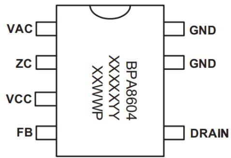

<table><tr><td>项目描述</td><td>符号</td><td>最小</td><td>典型</td><td>最大</td><td>单位</td><td>备注</td></tr><tr><td colspan="7">输入</td></tr><tr><td>电压</td><td> $V_{IN}$ </td><td>90</td><td>115/230</td><td>264</td><td> $V_{AC}$ </td><td></td></tr><tr><td>频率</td><td> $f_{LINE}$ </td><td>47</td><td>50/60</td><td>63</td><td>Hz</td><td></td></tr><tr><td colspan="7">输出</td></tr><tr><td>输出电压</td><td> $V_{OUT}$ </td><td></td><td>5</td><td></td><td>V</td><td>±3%</td></tr><tr><td>输出电流</td><td> $I_{OUT}$ </td><td></td><td>0.8</td><td></td><td>A</td><td></td></tr><tr><td>输出电压纹波</td><td> $V_{RIPPLE}$ </td><td></td><td></td><td>300</td><td>mV</td><td>20MHz带宽,可加二级滤波减小</td></tr><tr><td>连续输出功率</td><td> $P_{OUT}$ </td><td></td><td>4</td><td></td><td>W</td><td></td></tr><tr><td colspan="7">效率</td></tr><tr><td>待机功耗</td><td> $P_{STDBY}$ </td><td></td><td></td><td>110</td><td>mW</td><td>230VAC</td></tr><tr><td>满载效率</td><td>η</td><td>68</td><td></td><td></td><td>%</td><td>115VAC/230VAC</td></tr><tr><td colspan="7">环境</td></tr><tr><td>传导EMI</td><td></td><td colspan="4">满足CISPR22/EN55022 Class B,至少6dB 裕量</td><td></td></tr><tr><td>Surge</td><td></td><td></td><td>2</td><td></td><td>kV</td><td>差模</td></tr><tr><td>EFT</td><td></td><td></td><td>4</td><td></td><td>kV</td><td>5kHz/100kHz/38kHz</td></tr><tr><td>ESD</td><td></td><td></td><td>15</td><td></td><td>kV</td><td>接触8kV,空气15kV</td></tr><tr><td>工作环境温度</td><td> $T_{AMP}$ </td><td>0</td><td></td><td>50</td><td>°C</td><td></td></tr></table>

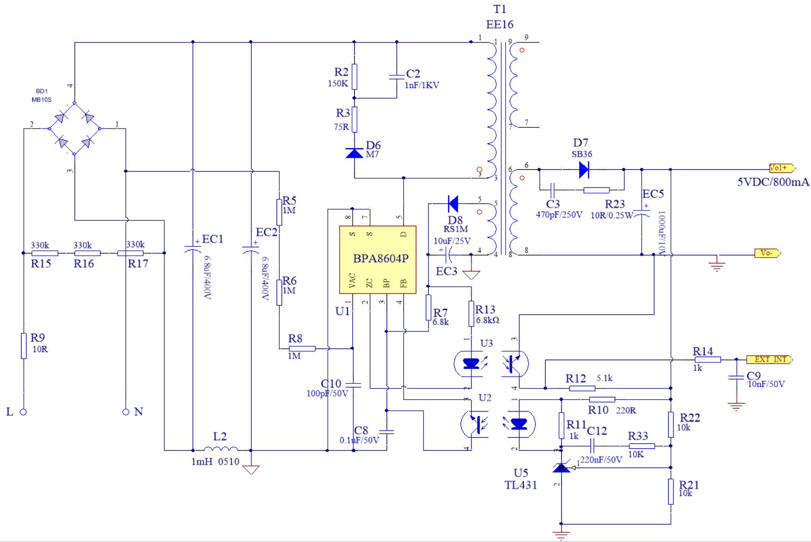

<table><tr><td>序号</td><td>元件标号</td><td>参数描述</td><td>封装尺寸</td><td>数量</td></tr><tr><td>1</td><td>BD1</td><td>MB10S</td><td>BD_SMD(bs210)</td><td>1</td></tr><tr><td>2</td><td>C2</td><td>1nF/1KV</td><td>50V104</td><td>1</td></tr><tr><td>3</td><td>C3</td><td>470pF/250V</td><td>0805-C</td><td>1</td></tr><tr><td>4</td><td>C8</td><td>0.1uF/50V</td><td>0805-C</td><td>1</td></tr><tr><td>5</td><td>C9</td><td>10nF/50V</td><td>0805-C</td><td>1</td></tr><tr><td>6</td><td>C10</td><td>100pF/50V</td><td>0805-C</td><td>1</td></tr><tr><td>7</td><td>C12</td><td>220nF/50V</td><td>0805-C</td><td>1</td></tr><tr><td>8</td><td>D6</td><td>M7</td><td>D SMA</td><td>1</td></tr><tr><td>9</td><td>D7</td><td>SB36</td><td>DO-15</td><td>1</td></tr><tr><td>10</td><td>D8</td><td>RS1M</td><td>D SMA</td><td>1</td></tr><tr><td>11</td><td>EC1, EC2</td><td>6.8uF/400V</td><td>EC 6.5 P2.5</td><td>2</td></tr><tr><td>12</td><td>EC3</td><td>10uF/25V</td><td>EC 5 P2.5</td><td>1</td></tr><tr><td>13</td><td>EC5</td><td>1000uF/10V</td><td>EC 10 P5.0</td><td>1</td></tr><tr><td>14</td><td>L2</td><td>1mH 0510</td><td>L/D 6 P3.0</td><td>1</td></tr><tr><td>15</td><td>R2</td><td>150K</td><td>1206-r</td><td>1</td></tr><tr><td>16</td><td>R3</td><td>75R</td><td>1206-r</td><td>1</td></tr><tr><td>17</td><td>R5, R6, R8</td><td>1M</td><td>1206-r</td><td>3</td></tr><tr><td>18</td><td>R7</td><td>6.8k</td><td>0805-r</td><td>1</td></tr><tr><td>19</td><td>R9</td><td>10R</td><td>F-2W</td><td>1</td></tr><tr><td>20</td><td>R10</td><td>220R</td><td>0805-r</td><td>1</td></tr></table>

<table><tr><td>序号</td><td>元件标号</td><td>参数描述</td><td>封装尺寸</td><td>数量</td></tr><tr><td>21</td><td>R11, R14</td><td>1k</td><td>0805-r</td><td>2</td></tr><tr><td>22</td><td>R12</td><td>5.1k</td><td>0805-r</td><td>1</td></tr><tr><td>23</td><td>R13</td><td>6.8kΩ</td><td>0805-r</td><td>1</td></tr><tr><td>24</td><td>R15, R16, R17</td><td>330k</td><td>1206-r</td><td>3</td></tr><tr><td>25</td><td>R21, R22, R33</td><td>10k</td><td>0805-r</td><td>3</td></tr><tr><td>26</td><td>R23</td><td>10R/0.25W</td><td>0805-r</td><td>1</td></tr><tr><td>27</td><td>T1</td><td>EE16</td><td>T EE16(5+5)</td><td>1</td></tr><tr><td>28</td><td>U1</td><td>BPA8604P</td><td>USOP8(BPA8604)</td><td>1</td></tr><tr><td>29</td><td>U2</td><td>PC817B</td><td>DIP-4</td><td>1</td></tr></table>

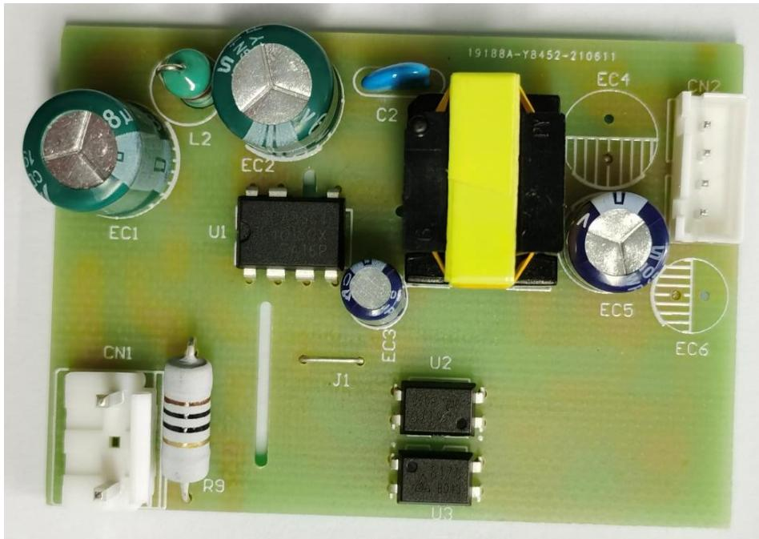

TOP SIDE

BOTTOM SIDE

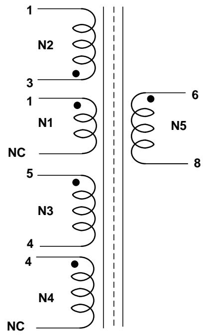

<table><tr><td>序号</td><td>起始脚</td><td>终止脚</td><td>绕制规则</td><td>匝数</td><td>绕线方式</td></tr><tr><td>N1</td><td>1</td><td>NC</td><td>2UEW φ0.15*2P</td><td>22Ts</td><td>密绕一层(PIN脚朝外)</td></tr><tr><td>胶带</td><td></td><td></td><td></td><td>2Ts</td><td></td></tr><tr><td>N2</td><td>3</td><td>1</td><td>2UEW φ0.15*1P</td><td>131Ts</td><td>密绕三层(PIN脚朝外)</td></tr><tr><td>胶带</td><td></td><td></td><td></td><td>2Ts</td><td></td></tr><tr><td>N3</td><td>5</td><td>4</td><td>2UEW φ0.15*2P</td><td>22Ts</td><td>密绕一层(PIN脚朝外)</td></tr><tr><td>胶带</td><td></td><td></td><td></td><td>2Ts</td><td></td></tr><tr><td>N4</td><td>4</td><td>NC</td><td>2UEW φ0.15*2P</td><td>6Ts</td><td>均匀绕一层(PIN脚朝外)</td></tr><tr><td>胶带</td><td></td><td></td><td></td><td>3Ts</td><td></td></tr><tr><td>N5</td><td>6</td><td>8</td><td>TEX-E φ0.5*1P</td><td>8Ts</td><td>均匀绕一层(PIN脚朝外)</td></tr><tr><td>胶带</td><td></td><td></td><td></td><td>3Ts</td><td></td></tr></table>

# 规格与材料

初级绕组感量 $L _ { \mathrm { o } } { = } 2 2 0 0 0 \mathsf { u H } { \pm } 7 \%$ （测试条件：0.3V，100kHz)  
➢ 漏感量 $L _ { | k } < 5 0 \mathsf { u } \mathsf { H }$   
➢ 骨架：EE16底部加高 (5+5PIN)  
➢ 磁芯：EE16 PC40 或同等材质， ${ \mathsf { A e } } { = } 1 9 . 2 { \mathsf { m m } } ^ { 2 }$   
➢ N1、N2、N3、N4: 2UEW 漆包线  
➢ N5、N6：三层绝缘线  
绝缘胶带:3M900或同等材质   
➢ 耐压测试:3KV,50/60Hz,1Min   
成品要求：浸凡立水

待机功耗   
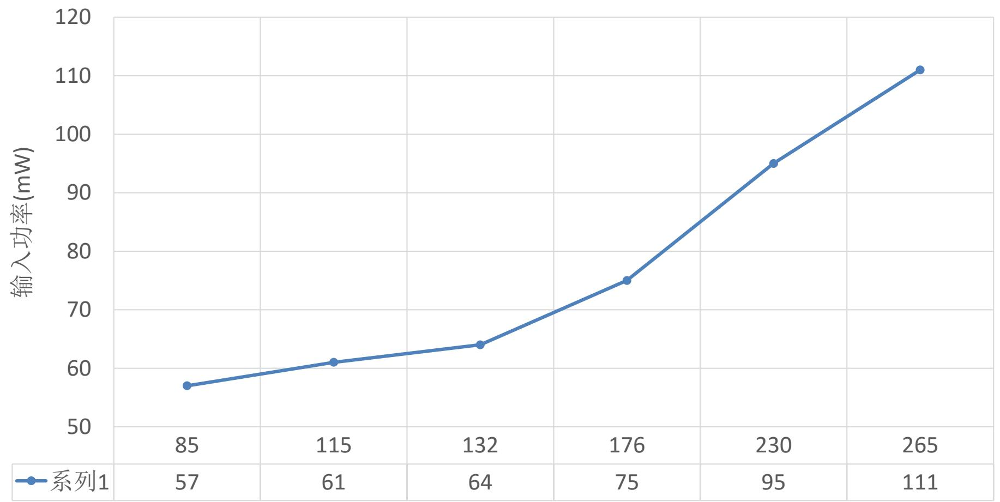

输入电压(Vac)

效率曲线  
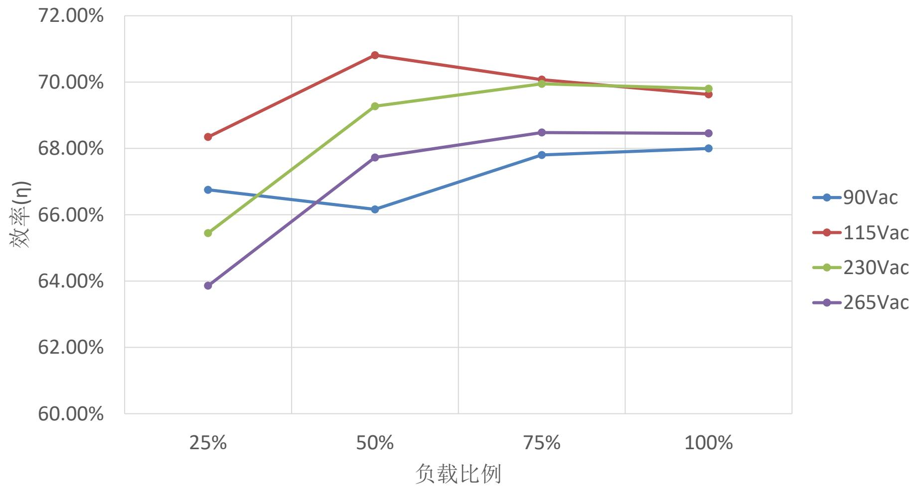

<table><tr><td> $V_{IN}(VAC)$ </td><td>Load(%)</td><td> $P_{IN}(W)$ </td><td> $V_{OUT}(V)$ </td><td>线端</td><td> $I_{OUT}(A)$ </td><td> $P_{OUT}(W)$ </td><td>Eff(%)</td><td>AVG Eff(%)</td></tr><tr><td rowspan="6">85</td><td>空载</td><td></td><td></td><td></td><td></td><td>0</td><td></td><td></td></tr><tr><td>10%</td><td>0.647</td><td>5.014</td><td></td><td>0.08</td><td>0.40112</td><td>62.00%</td><td></td></tr><tr><td>25%</td><td>1.502</td><td>5.0131</td><td></td><td>0.2</td><td>1.00262</td><td>66.75%</td><td rowspan="4">67.18%</td></tr><tr><td>50%</td><td>3.03</td><td>5.0117</td><td></td><td>0.4</td><td>2.00468</td><td>66.16%</td></tr><tr><td>75%</td><td>4.434</td><td>5.0104</td><td></td><td>0.6</td><td>3.00624</td><td>67.80%</td></tr><tr><td>100%</td><td>5.893</td><td>5.009</td><td></td><td>0.8</td><td>4.0072</td><td>68.00%</td></tr><tr><td rowspan="6">115</td><td>空载</td><td></td><td></td><td></td><td></td><td>0</td><td></td><td></td></tr><tr><td>10%</td><td>0.643</td><td>5.0139</td><td></td><td>0.08</td><td>0.401112</td><td>62.38%</td><td></td></tr><tr><td>25%</td><td>1.467</td><td>5.013</td><td></td><td>0.2</td><td>1.0026</td><td>68.34%</td><td rowspan="4">69.71%</td></tr><tr><td>50%</td><td>2.831</td><td>5.0116</td><td></td><td>0.4</td><td>2.00464</td><td>70.81%</td></tr><tr><td>75%</td><td>4.29</td><td>5.0102</td><td></td><td>0.6</td><td>3.00612</td><td>70.07%</td></tr><tr><td>100%</td><td>5.755</td><td>5.0089</td><td></td><td>0.8</td><td>4.00712</td><td>69.63%</td></tr><tr><td rowspan="6">230</td><td>空载</td><td></td><td></td><td></td><td></td><td>0</td><td></td><td></td></tr><tr><td>10%</td><td>0.686</td><td>5.0139</td><td></td><td>0.08</td><td>0.401112</td><td>58.47%</td><td></td></tr><tr><td>25%</td><td>1.532</td><td>5.0131</td><td></td><td>0.2</td><td>1.00262</td><td>65.45%</td><td rowspan="4">68.62%</td></tr><tr><td>50%</td><td>2.894</td><td>5.0117</td><td></td><td>0.4</td><td>2.00468</td><td>69.27%</td></tr><tr><td>75%</td><td>4.298</td><td>5.0104</td><td></td><td>0.6</td><td>3.00624</td><td>69.95%</td></tr><tr><td>100%</td><td>5.741</td><td>5.009</td><td></td><td>0.8</td><td>4.0072</td><td>69.80%</td></tr><tr><td rowspan="6">265</td><td>空载</td><td></td><td></td><td></td><td></td><td>0</td><td></td><td></td></tr><tr><td>10%</td><td>0.714</td><td>5.0138</td><td></td><td>0.08</td><td>0.401104</td><td>56.18%</td><td></td></tr><tr><td>25%</td><td>1.57</td><td>5.013</td><td></td><td>0.2</td><td>1.0026</td><td>63.86%</td><td rowspan="4">67.13%</td></tr><tr><td>50%</td><td>2.96</td><td>5.0117</td><td></td><td>0.4</td><td>2.00468</td><td>67.73%</td></tr><tr><td>75%</td><td>4.39</td><td>5.0103</td><td></td><td>0.6</td><td>3.00618</td><td>68.48%</td></tr><tr><td>100%</td><td>5.854</td><td>5.009</td><td></td><td>0.8</td><td>4.0072</td><td>68.45%</td></tr></table>

# 输出电压调整率

<table><tr><td> $V_{IN}(VAC)$  $I_{OUT}(A)$ </td><td>90</td><td>115</td><td>132</td><td>176</td><td>230</td><td>265</td><td>平均值</td><td>线调整率</td></tr><tr><td>0</td><td>5.0141</td><td>5.0141</td><td>5.0141</td><td>5.0141</td><td>5.0141</td><td>5.0141</td><td>5.014</td><td>0.00%</td></tr><tr><td>20%</td><td>5.013</td><td>5.013</td><td>5.013</td><td>5.0131</td><td>5.0131</td><td>5.0131</td><td>5.013</td><td>0.00%</td></tr><tr><td>40%</td><td>5.0119</td><td>5.0119</td><td>5.0119</td><td>5.012</td><td>5.012</td><td>5.012</td><td>5.012</td><td>0.00%</td></tr><tr><td>60%</td><td>5.0108</td><td>5.0108</td><td>5.0108</td><td>5.0108</td><td>5.0108</td><td>5.0108</td><td>5.011</td><td>0.00%</td></tr><tr><td>80%</td><td>5.0097</td><td>5.0097</td><td>5.0097</td><td>5.0097</td><td>5.0098</td><td>5.0098</td><td>5.010</td><td>0.00%</td></tr><tr><td>100%</td><td>5.0087</td><td>5.0087</td><td>5.0087</td><td>5.0088</td><td>5.0088</td><td>5.0088</td><td>5.009</td><td>0.00%</td></tr><tr><td>平均值</td><td>5.011</td><td>5.011</td><td>5.011</td><td>5.011</td><td>5.011</td><td>5.011</td><td></td><td></td></tr><tr><td>负载调整率</td><td>0.11%</td><td>0.11%</td><td>0.11%</td><td>0.11%</td><td>0.11%</td><td>0.11%</td><td></td><td></td></tr></table>

◼ 计算方法：调整率=100%\*(最大值-最小值)/平均值

# 输出电压纹波

20MHz带宽，去掉示波器探头正端夹子和地线环，10uF/50V 0.1uF/50V

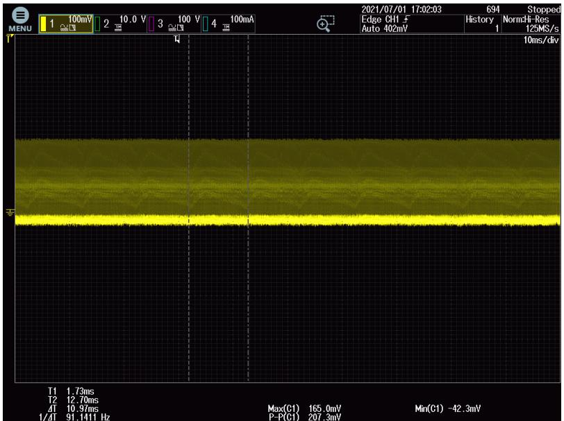

85 VAC   
CH1 VOUT $\mathsf { V } _ { \mathsf { o u r } }$ Ripple $\cdots$ VPK-PK=207.3 mV   
➢ Full Load

Test Condition:

115 VAC   
${ \mathsf { C H 1 } } { \mathsf { V } } _ { \mathsf { O U T } }$ CH1 VOUT Ripple $V _ { \mathsf { P K - P K } } { = } 2 0 8 ~ \mathsf { m V }$   
➢ Full Load

Test Condition:

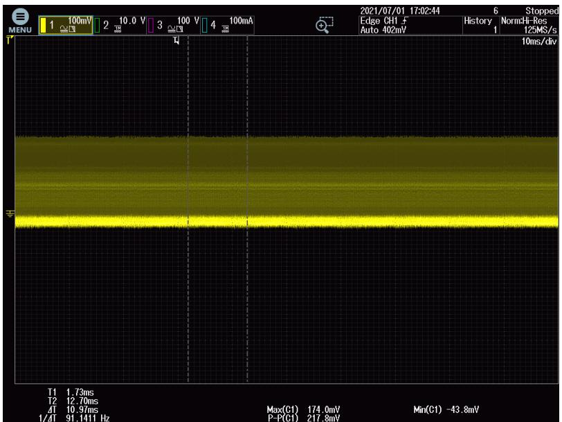

230 VAC   
CH1 VOUT $\mathsf { V } _ { \mathsf { o u r } }$ Ripple $V _ { p | \mathrm { K } \mathrm { - } \mathrm { P K } } = 2 1 7 . 8$ VPK-PK=217.8 mV   
➢ Full Load

Test Condition:

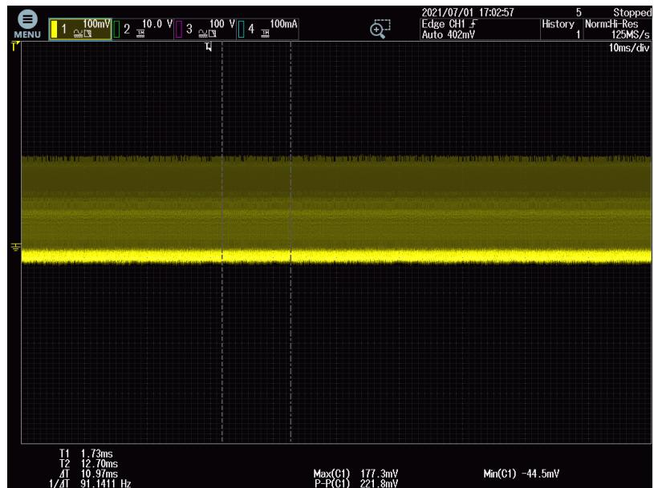

265 VAC   
CH1 VOUT Ripple $V _ { P K }$ VPK-PK=221.8mV $_ { P K } = 2 2 1 . 8 m v$   
➢ Full Load

Test Condition:

# (50%-100%)

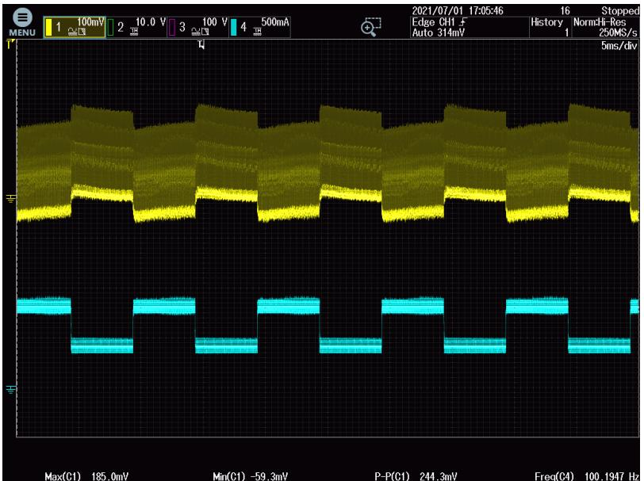

85 VAC

CH1 VOUT $\mathsf { V } _ { \mathsf { O U T } }$ $V _ { \mathsf { P K - P K } } { = } 2 4 4 . 3 \mathsf { m V }$   
$\mathsf { C H 4 } \mathsf { I } _ { \mathsf { O U T } }$

# Test Condition:

➢ 0.4 A-0.8 A-0.4 A   
➢ Slew Rate: 0.5 A/μS   
➢ Frequency: 100 Hz

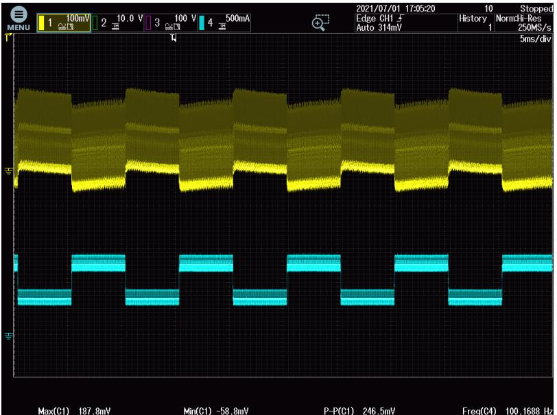

230 VAC

CH1 VOUT $\mathsf { V } _ { \mathsf { O U T } }$ $V _ { p | c . p | k } = 2 4 6 . 5 m v$   
$\mathsf { C H 4 } \mathsf { l } _ { \mathsf { O U T } }$

# Test Condition:

➢ 0.4 A-0.8 A-0.4 A   
➢ Slew Rate: 0.5 $\mathsf { A } / \mu \mathsf { S }$   
➢ Frequency: 100 Hz

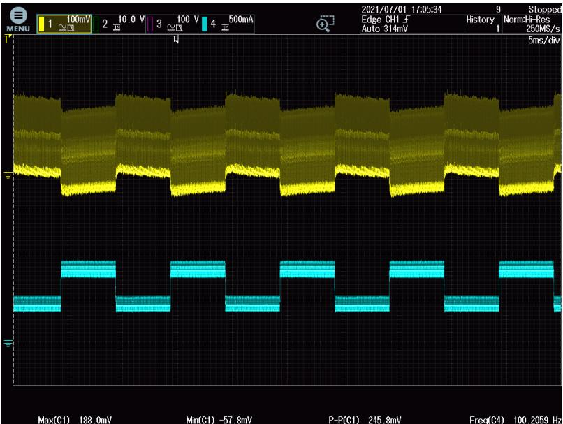

115 VAC

CH1 VOUT $\mathsf { V } _ { \mathsf { O U T } }$ $\_$   
$\mathsf { C H 4 } \mathsf { I } _ { \mathsf { O U T } }$

# Test Condition:

➢ $0 . 4 \ A { - } 0 . 8 \ A { - } 0 . 4 \ A$   
➢ Slew Rate: 0.5 A/μS   
➢ Frequency: 100 Hz

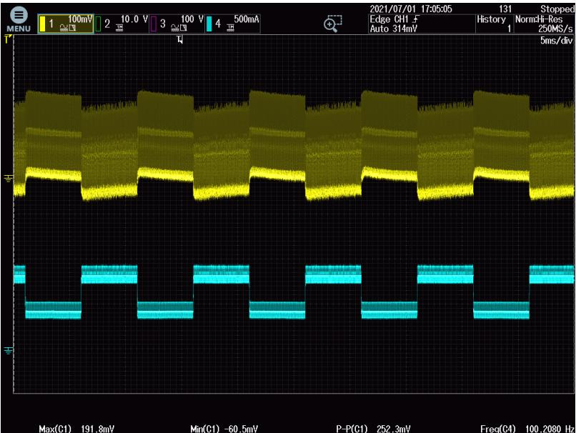

265 VAC

CH1 VOUT ${ \mathsf { C H 1 } } { \mathsf { V } } _ { \mathsf { O U T } }$ $\_$   
$\mathsf { C H 4 } \mathsf { I } _ { \mathsf { O U T } }$

# Test Condition:

➢ 0.4 A-0.8 A-0.4 A   
➢ Slew Rate: 0.5 A/μS   
➢ Frequency: 100 Hz

# (10%-90%)

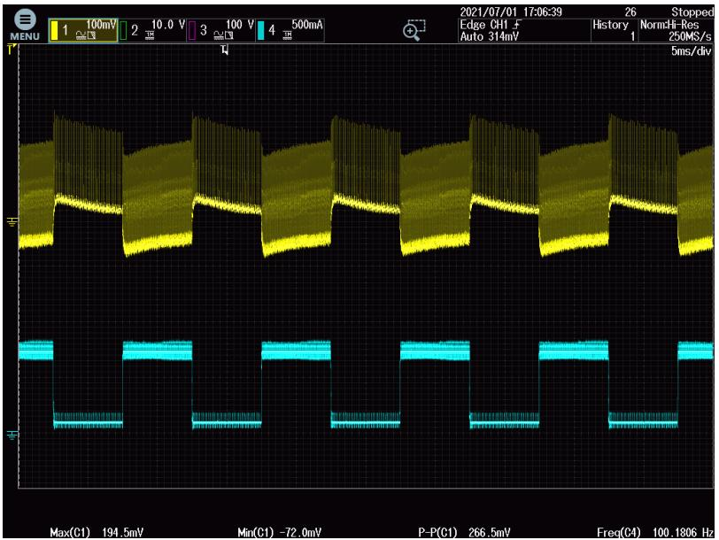

85 VAC

CH1 VOUT $\mathsf { V } _ { \mathsf { O U T } }$ $V _ { \mathsf { P K - P K } } { = } 2 6 6 . 5 ~ \mathsf { m V }$   
$\mathsf { C H 4 } \mathsf { I } _ { \mathsf { O U T } }$

# Test Condition:

➢ $0 . 0 8 \mathsf { A } \mathsf { - } 0 . 7 2 \mathsf { A } \mathsf { - } 0 . 0 8 \mathsf { A }$   
➢ Slew Rate: 0.5 A/μS   
➢ Frequency: 100 Hz

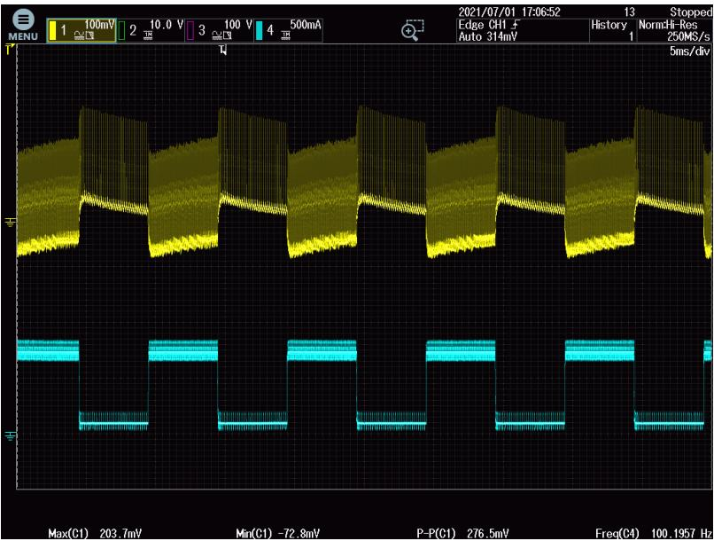

115 VAC

CH1 VOUT ${ \mathsf { C H 1 } } { \mathsf { V } } _ { \mathsf { O U T } }$ $\_$   
$\mathsf { C H 4 } \mathsf { I } _ { \mathsf { O U T } }$

# Test Condition:

➢ 0.08 A-0.72A-0.08 A  
➢ Slew Rate: 0.5 A/μS   
➢ Frequency: 100 Hz

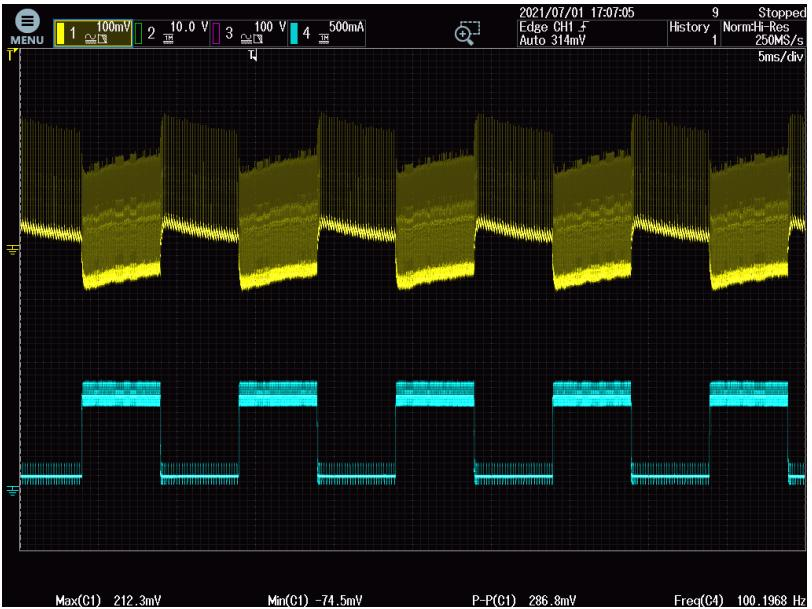

230 VAC

CH1 VOUT $\mathsf { V } _ { \mathsf { O U T } }$ $V _ { \mathsf { P K - P K } } = 2 8 6 . 8 ~ \mathsf { m V }$   
$\mathsf { C H 4 } \mathsf { l } _ { \mathsf { O U T } }$

# Test Condition:

➢ $0 . 0 8 \ : \mathsf { A } – 0 . 7 2 \mathsf { A } – 0 . 0 8 \ : \mathsf { A }$   
➢ Slew Rate: 0.5 A/μS   
➢ Frequency: 100 Hz

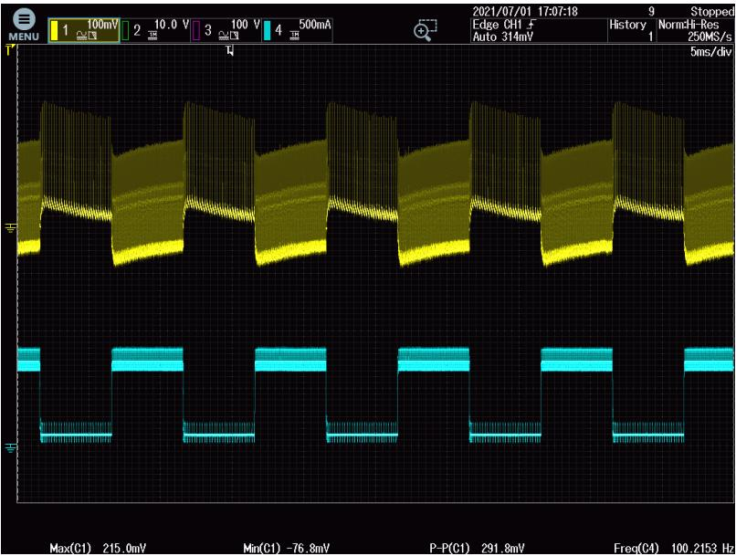

265 VAC

CH1 VOUT ${ \mathsf { C H 1 } } { \mathsf { V } } _ { \mathsf { O U T } }$ $\_$   
$\mathsf { C H 4 } \mathsf { I } _ { \mathsf { O U T } }$

# Test Condition:

➢ 0.08 A-0.72A-0.08 A  
➢ Slew Rate: 0.5 A/μS   
➢ Frequency: 100 Hz

# 输出电压开机波形

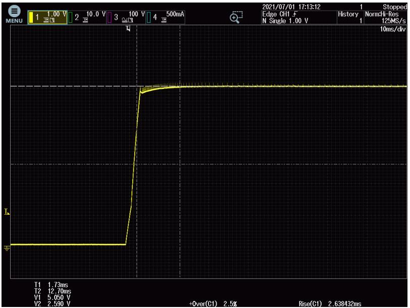

85 VAC

CH1 VOUT TRISE: 2.64 mS

# Test Condition:

➢ No Load

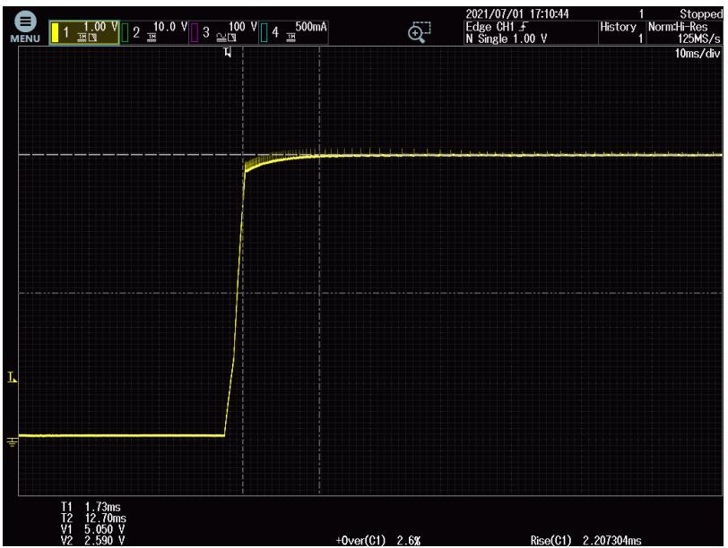

265 VAC

CH1 VOUT TRISE: 2.21 mS

# Test Condition:

➢ No Load

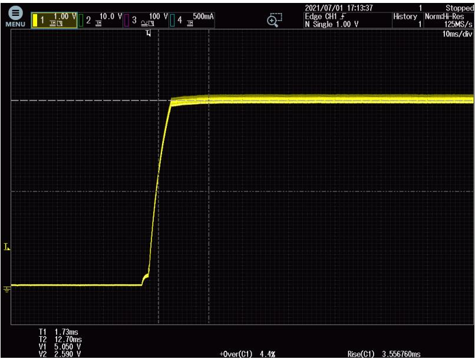

85 VAC

CH1 VOUT TRISE: 3.56 mS

# Test Condition:

➢ Full Load

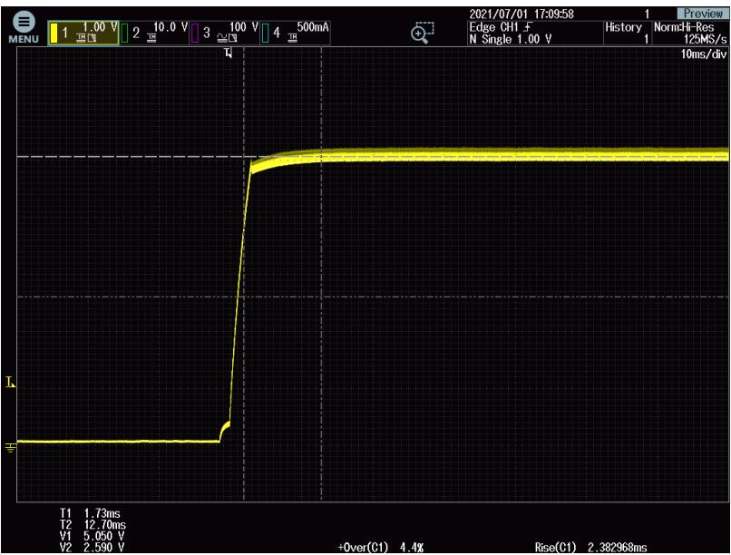

265 VAC

CH1 VOUT TRISE: 2.38 mS

# Test Condition:

➢ Full Load

# MOs漏源极电压电流波形 (启机)

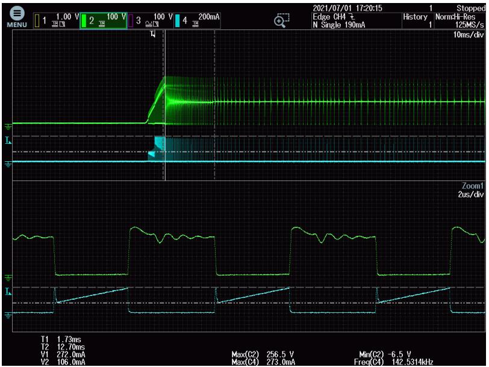

85 VAC

${ \mathsf { C H } } 2 { \mathsf { V } } _ { \mathsf { D S } }$   
$C H 4 1 _ { \mathsf { D } }$ $\cdot$ $\cdot$

Test Condition:   
➢ No Load   
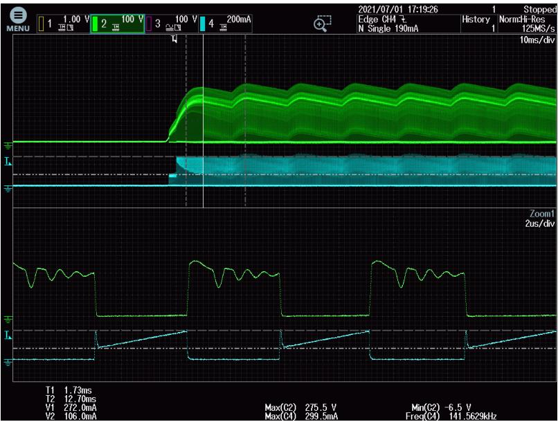

85 VAC

${ \mathsf { C H } } 2 { \mathsf { V } } _ { \mathsf { D S } }$   
$C H 4 1 _ { \mathsf { D } }$ $\cdot$ $1 _ { \mathrm { M A X } } = 2 9 9 . 5 ~ \mathrm { m A }$

Test Condition:   
➢ Full Load   
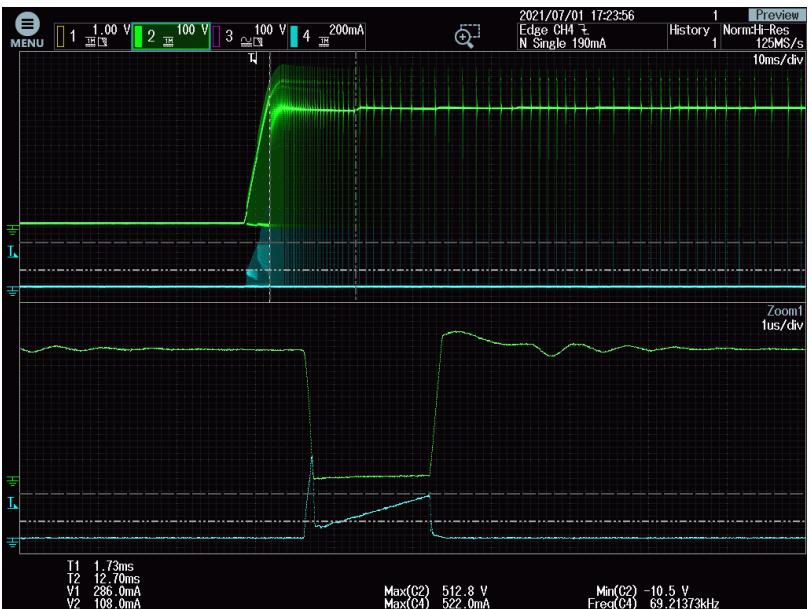

265 VAC

${ \mathsf { C H } } 2 \ { \mathsf { V } } _ { \mathsf { D S } }$   
$C H 4 1 _ { \mathsf { D } }$ $\cdot$ $\mathsf { I } _ { \mathsf { M A X } } { = } 5 2 2 \mathsf { m } \mathsf { A }$

Test Condition:   
➢ No Load   
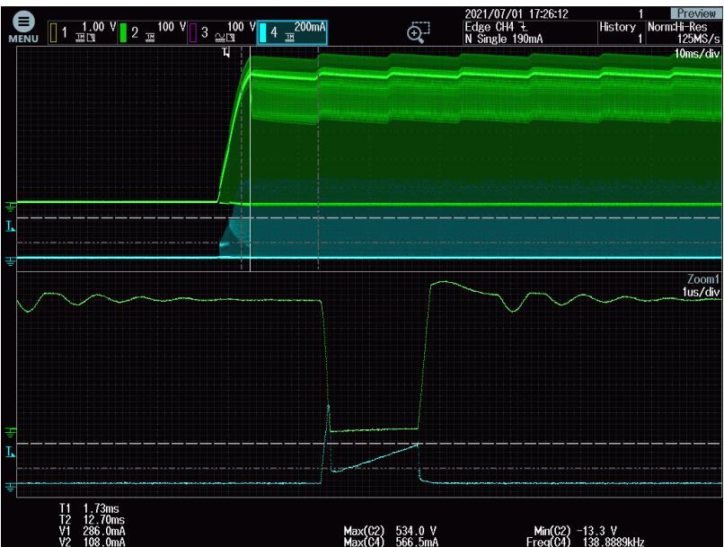  
$2 6 5 \ : \mathsf { V } _ { \mathsf { A C } }$

${ \mathsf { C H } } 2 { \mathsf { V } } _ { \mathsf { D S } }$   
$C H 4 1 _ { \mathsf { D } }$ $\cdot$ $\_$

Test Condition:

➢ Full Load

# MOs漏源极电压电流波形 (正常工作)

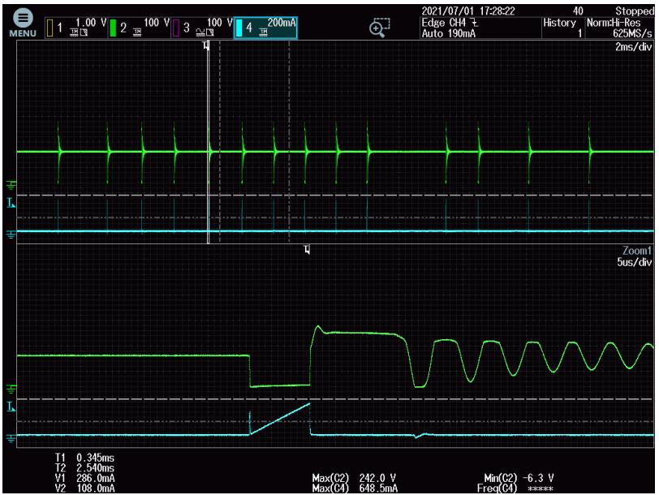

85 VAC

${ \mathsf { C H } } 2 { \mathsf { V } } _ { \mathsf { D S } }$   
$C H 4 1 _ { \mathsf { D } }$ $V _ { \mathsf { D } \mathsf { S } } = 2 4 2 \mathsf { V }$ $\mathsf { I } _ { \mathsf { M A X } } = 6 4 8 . 5 \mathsf { m A }$

Test Condition:   
➢ No Load   
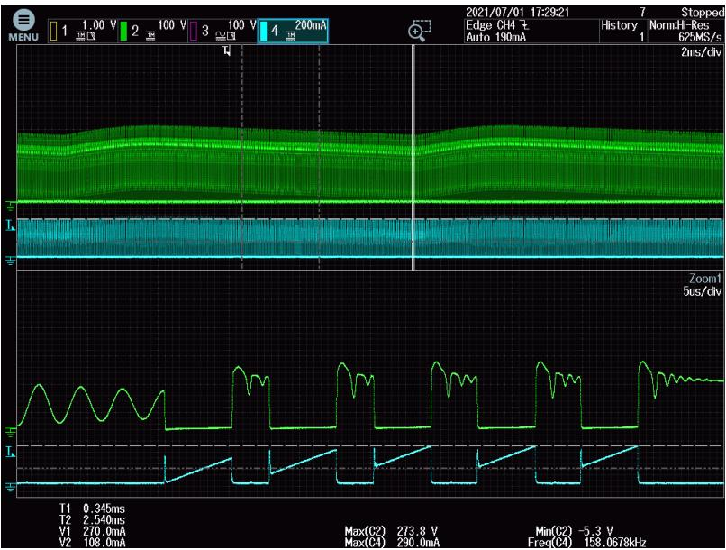

85 VAC

${ \mathsf { C H } } 2 { \mathsf { V } } _ { \mathsf { D S } }$   
$C H 4 1 _ { \mathsf { D } }$ $\cdot$ $\mathsf { I } _ { \mathsf { M A X } } = 2 9 0 \mathsf { m A }$ IMAX=

Test Condition:   
➢ Full Load   
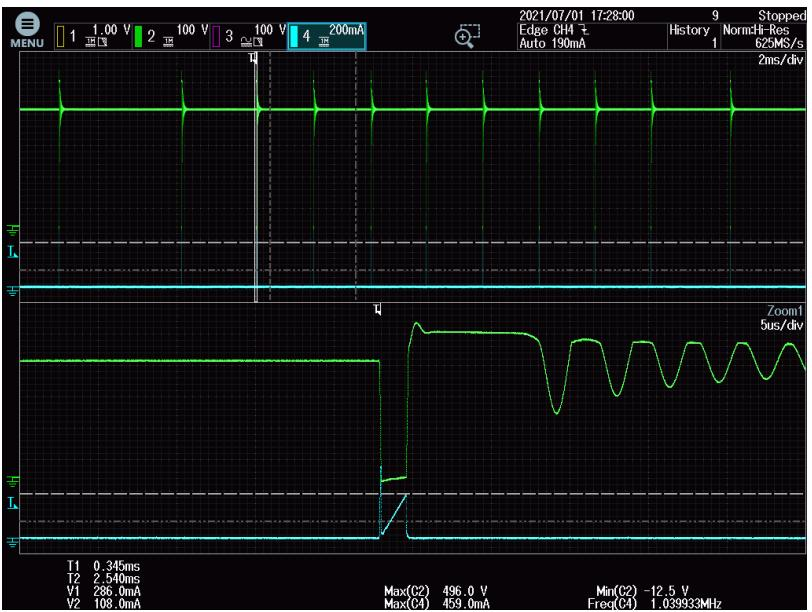

265 VAC

${ \mathsf { C H } } 2 \ { \mathsf { V } } _ { \mathsf { D S } }$   
$C H 4 1 _ { \mathsf { D } }$ $V _ { \mathsf { D } \mathsf { S } } { = } 4 9 6 \mathsf { V }$ IMAX=459 $\cdot$

Test Condition:   
➢ No Load   
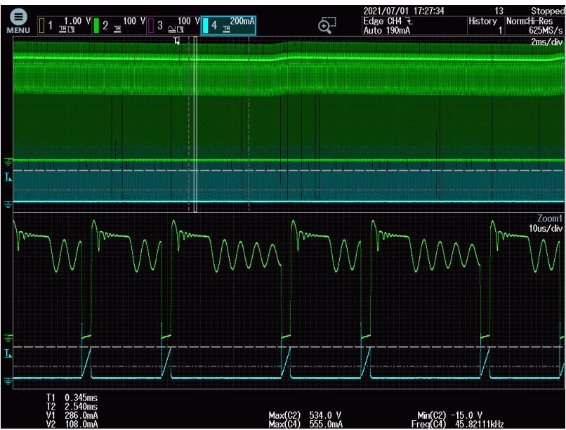

265 VAC

${ \mathsf { C H } } 2 { \mathsf { V } } _ { \mathsf { D S } }$   
$C H 4 1 _ { \mathsf { D } }$ $\cdot$ $\cdot$

Test Condition:

➢ Full Load

# 输出二极管电压波形

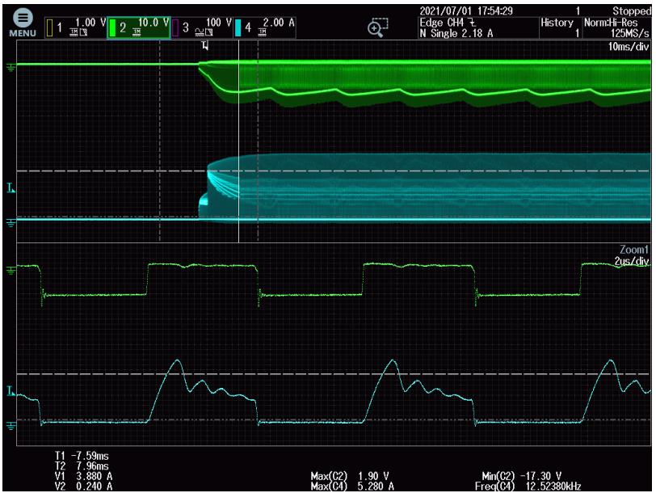

85 VAC

CH2 VD   
$C H 4 1 _ { \mathsf { D } }$ $\cdot$ $\cdot$ IDmax

Test Condition:

➢ Full Load   
➢ 开机

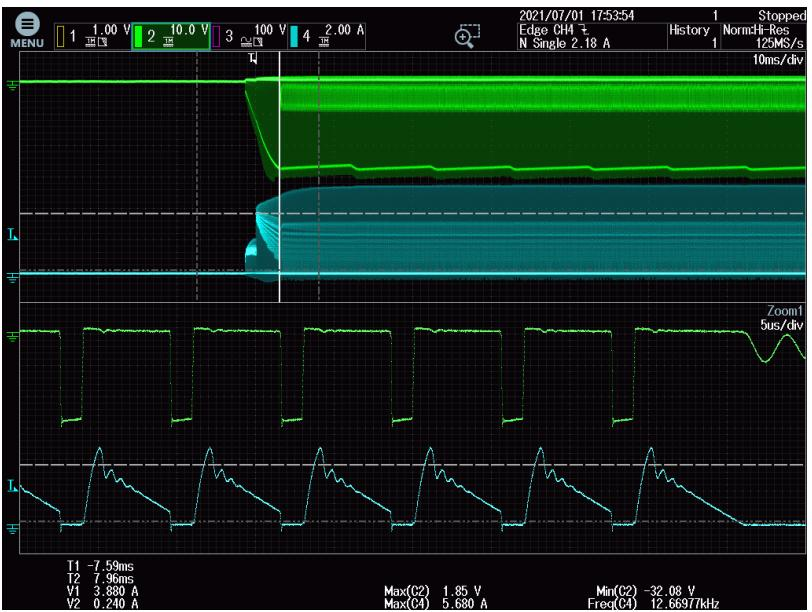

265 VAC

CH2 VD   
CH4 ID $\mathtt { V } _ { \mathtt { D } } mathtt { = } 3 2 . 0 8 \mathtt { V }$ $\mathsf { I } _ { \mathsf { D m a x } } { = } 5 . 6 8 ~ \mathsf { A }$ Dmax

Test Condition:

➢ Full Load   
➢ 开机

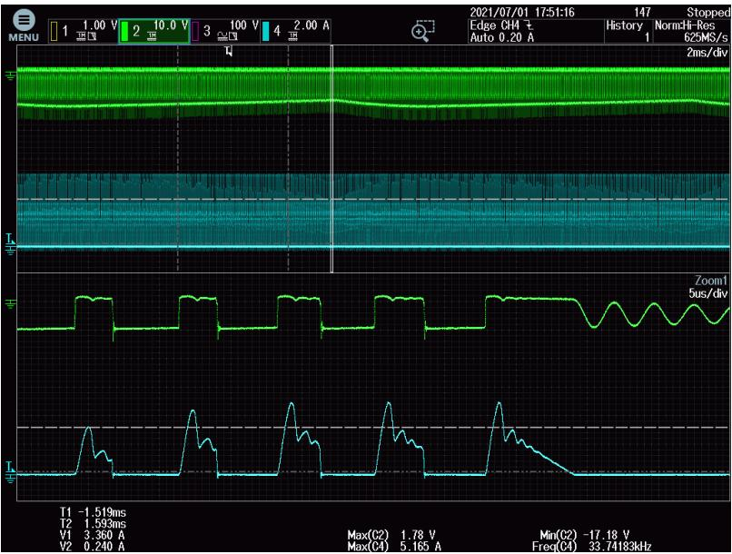

85 VAC

CH2 VD   
$C H 4 1 _ { \mathsf { D } }$ $\mathtt { V } _ { \mathtt { D } } mathtt { = } 1 7 . 1 8 \mathtt { V }$ $\mathsf { I } _ { \mathsf { D m a x } } = 5 . 1 6 5 \mathrm { ~ A ~ }$

Test Condition:   
➢ Full Load   
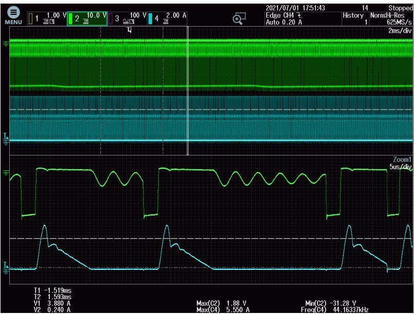

265 VAC

CH2 VD   
CH4 ID $C H 4 1 _ { \mathsf { D } }$ $\cdot$ $V _ { \sf D m a x } { = } 5 . 5 5 \sf { A }$

Test Condition:

➢ Full Load

# 输出短路时MOs和二极管波形

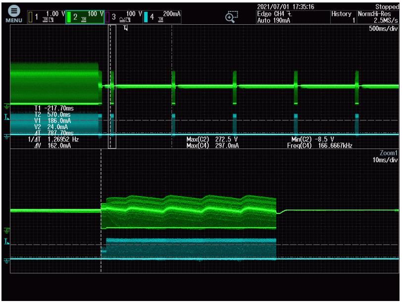  
85 VAC

${ \mathsf { C H } } 2 { \mathsf { V } } _ { \mathsf { D S } }$   
CH4 ID $\_$ $\mathsf { I } _ { \mathsf { D } \mathsf { S } \_ \mathsf { m a x } } = 2 9 7 \mathsf { m } \mathsf { A }$

# MOS

# Test Condition:

➢ Full Load

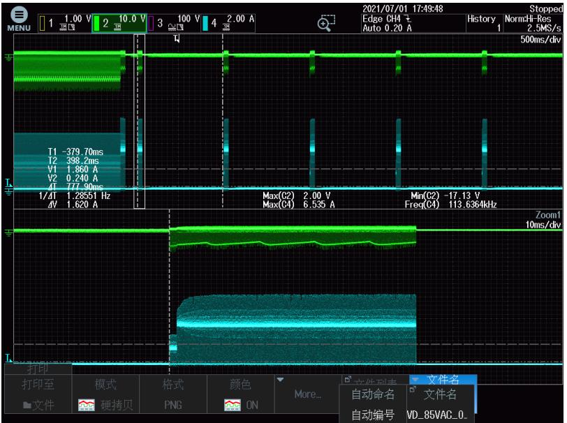

85 VAC

$C H 2 V _ { \mathsf { D } }$   
$C H 4 1 _ { \mathsf { D } }$ $\mathtt { V } _ { \mathtt { D } } mathtt { = } 1 7 . 1 3 \mathtt { V }$ $\cdot$ IDmax

# Test Condition:

➢ Full Load

# 二极管

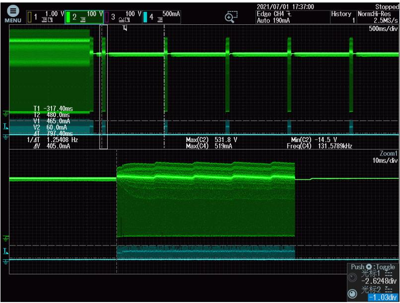

# 265 VAC

${ \mathsf { C H } } 2 { \mathsf { V } } _ { \mathsf { D S } }$   
$C H 4 1 _ { \mathsf { D } }$ $\mathtt { V } _ { \mathtt { D S \_ m a x } } = 5 3 1 . 8 \lor$ $\cdot$

# MOS

# Test Condition:

➢ Full Load

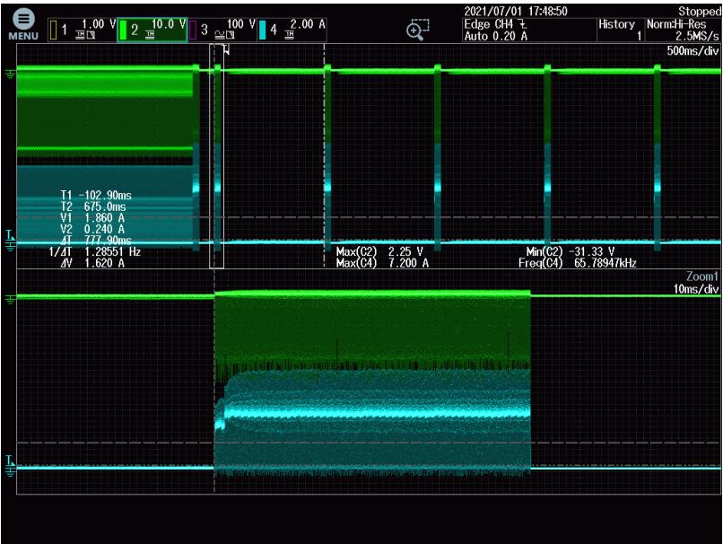

# 265 VAC

$C H 2 V _ { \mathsf { D } }$   
$C H 4 1 _ { \mathsf { D } }$ $\mathtt { V } _ { \mathtt { D } } mathtt { = } 3 1 . 3 3 \mathtt { V }$ $\mathsf { I } _ { \mathsf { D m a x } } { = } 7 . 2 ~ \mathsf { A }$

# Test Condition:

➢ Full Load

# 二极管

# 过零检测

85 VAC

CH2 ZCD\_signal   
CH3 VIN

Test Condition:   
➢ Full Load   

115 VAC

CH2 ZCD\_signal   
CH3 VIN

Test Condition:   
➢ Full Load   
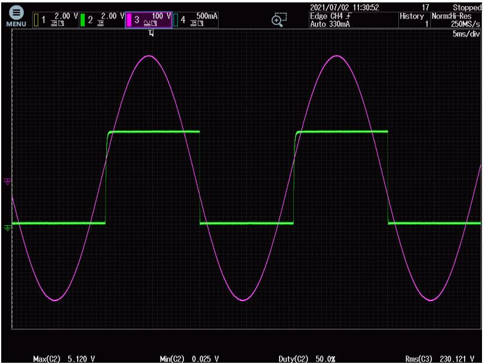

230 VAC

CH2 ZCD\_signal   
CH3 VIN

Test Condition:   
➢ Full Load   
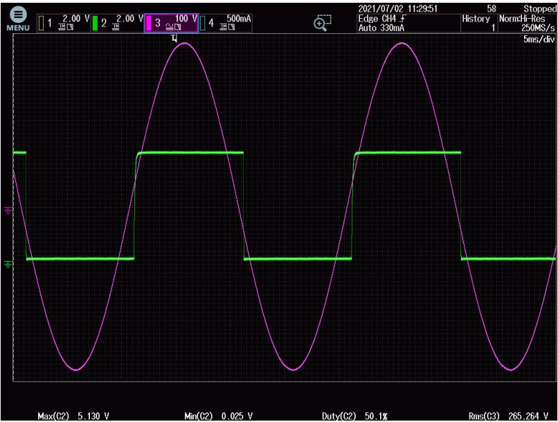

265 VAC

CH2 ZCD\_signal   
CH3 VIN

Test Condition:

➢ Full Load

# 温升测试

<table><tr><td rowspan="2">项目</td><td colspan="4">温度(°C)</td></tr><tr><td>85VAC</td><td>115VAC</td><td>230VAC</td><td>264VAC</td></tr><tr><td>环境温度</td><td>50.3</td><td>49.6</td><td>50.2</td><td>49.8</td></tr><tr><td>BPA8604P (U1)</td><td>94.2</td><td>85.4</td><td>85.2</td><td>86.3</td></tr><tr><td>SB36 (D7)</td><td>78.6</td><td>78.9</td><td>79.2</td><td>79.6</td></tr><tr><td>变压器绕组 (T1)</td><td>71.8</td><td>71.6</td><td>72.2</td><td>73</td></tr><tr><td>变压器磁芯 (T1)</td><td>70.8</td><td>70.8</td><td>71.7</td><td>72.3</td></tr><tr><td>输入电解电容(EC2)</td><td>69.8</td><td>67.2</td><td>66.4</td><td>67.4</td></tr><tr><td>输出电解电容(EC5)</td><td>68.5</td><td>68.8</td><td>68.7</td><td>69.1</td></tr><tr><td>整流桥 (BD1)</td><td>62.5</td><td>59.5</td><td>58.4</td><td>58.3</td></tr></table>

# 测试说明

➢ 在温箱中进行测试  
➢ 电路板放在一个封闭的盒子内  
➢ 热电偶连接到各个测量点   
➢ 等测量点温度达到稳定后记录数据

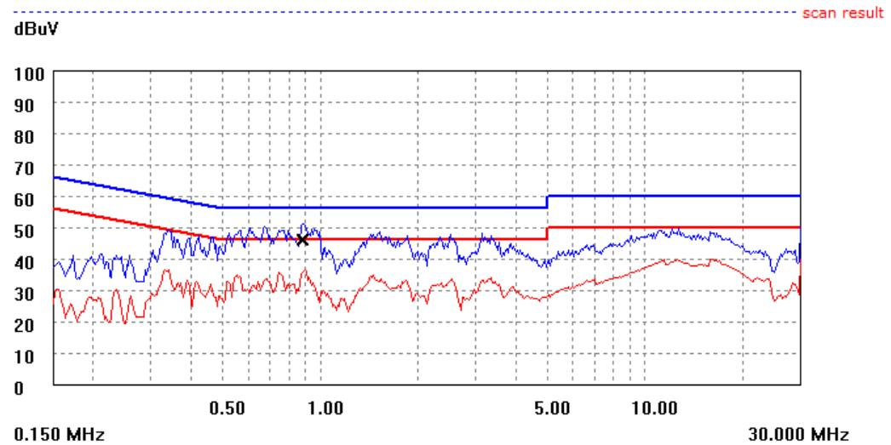

115VAC Line

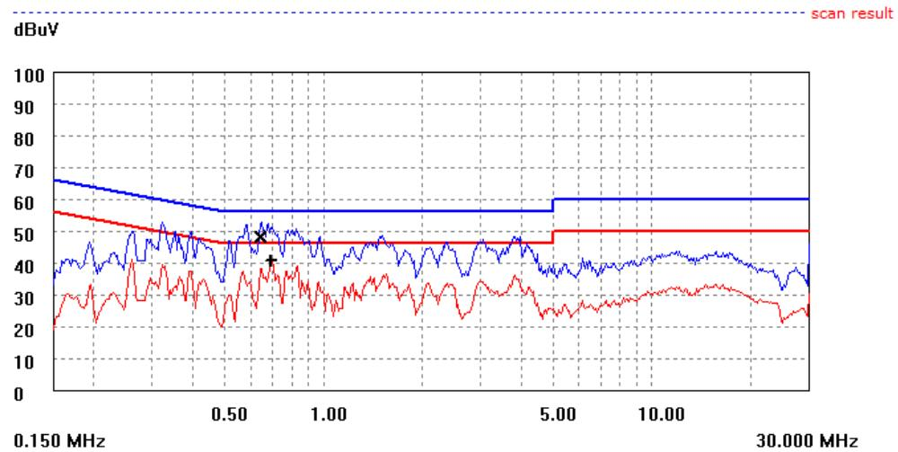

230VAC Line

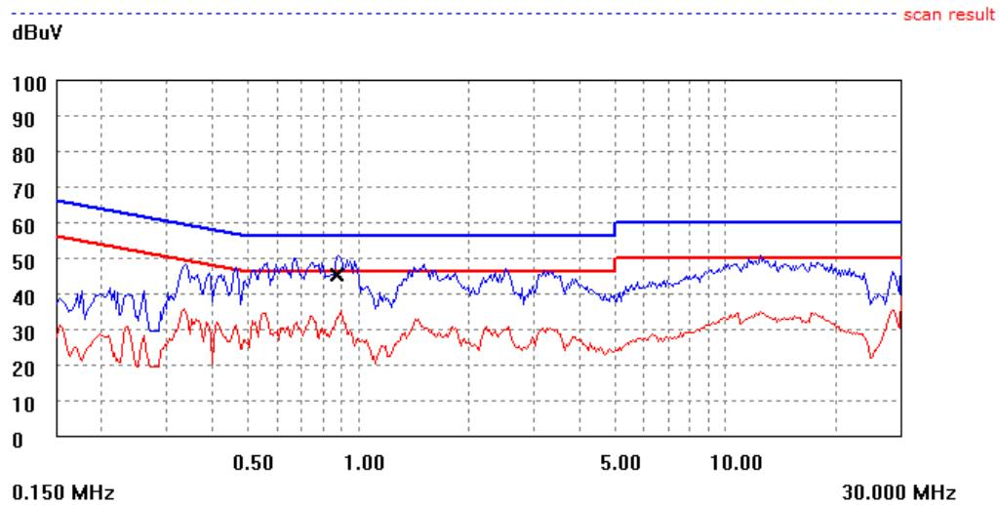

115VAC Neutral

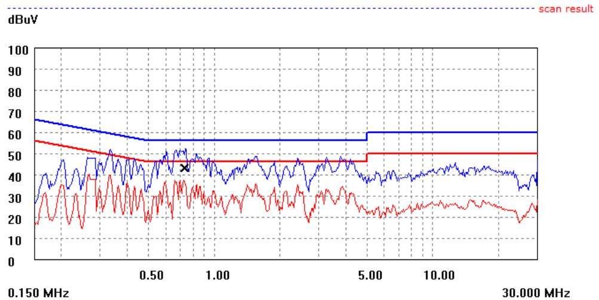

230VAC Neutral

<table><tr><td>差模</td><td>电压</td><td>相位角</td><td>发生器阻抗</td><td>测试次数</td><td>测试结果</td></tr><tr><td>L to N</td><td>+2kV</td><td>0</td><td>2</td><td>10</td><td>Pass</td></tr><tr><td>L to N</td><td>-2kV</td><td>0</td><td>2</td><td>10</td><td>Pass</td></tr><tr><td>L to N</td><td>+2kV</td><td>90</td><td>2</td><td>10</td><td>Pass</td></tr><tr><td>L to N</td><td>-2kV</td><td>90</td><td>2</td><td>10</td><td>Pass</td></tr><tr><td>L to N</td><td>+2kV</td><td>180</td><td>2</td><td>10</td><td>Pass</td></tr><tr><td>L to N</td><td>-2kV</td><td>180</td><td>2</td><td>10</td><td>Pass</td></tr><tr><td>L to N</td><td>+2kV</td><td>270</td><td>2</td><td>10</td><td>Pass</td></tr><tr><td>L to N</td><td>-2kV</td><td>270</td><td>2</td><td>10</td><td>Pass</td></tr></table>

# ◼ 测试说明

➢ 按照GB/T17626.5和IEC61000-4-5的最新版本要求进行测试  
➢ 室温环境，230VAC输入，满载条件  
➢ 输入1.2/50us组合波浪涌电压   
➢ 每个测试点重复10次  
➢ 每次间隔时间1分钟  
➢ 试验时样机输出正常（符合A类标准）视为Pass

<table><tr><td>测试点</td><td>电压(V)</td><td>放电类型</td><td>放电次数</td><td>测试结果</td></tr><tr><td>Vo</td><td>+15kV</td><td>空气放电</td><td>10</td><td>Pass</td></tr><tr><td>Vo</td><td>-15kV</td><td>空气放电</td><td>10</td><td>Pass</td></tr><tr><td>GND</td><td>+15kV</td><td>空气放电</td><td>10</td><td>Pass</td></tr><tr><td>GND</td><td>-15kV</td><td>空气放电</td><td>10</td><td>Pass</td></tr><tr><td>Vo</td><td>+8kV</td><td>接触放电</td><td>10</td><td>Pass</td></tr><tr><td>Vo</td><td>-8kV</td><td>接触放电</td><td>10</td><td>Pass</td></tr><tr><td>GND</td><td>+8kV</td><td>接触放电</td><td>10</td><td>Pass</td></tr><tr><td>GND</td><td>-8kV</td><td>接触放电</td><td>10</td><td>Pass</td></tr></table>

# 测试说明

➢ 按照GB/T17626.2和IEC61000-4-2的最新版本要求进行测试  
➢ 室温环境，230VAC输入满载条件  
➢ 每个测试点重复10次  
➢ 分别对输出正端和地进行空气放电  
➢ 试验时样机输出正常（符合A类标准）视为Pass

# THANK YOU FOR WATCHING
