## BPA8604P&LNK364P对比测试 (5V/0.25A, 12V/0.3A @85\~265Vac)

上海晶丰明源半导体股份有限公司

Shanghai Bright Power Semiconductor Co., Ltd.

陈耀兵

2021 11 23

## 电气参数对比

<table><tr><td></td><td>BPA8604P</td><td>LNK364P</td></tr><tr><td>开关频率</td><td>132kHz</td><td>132kHz</td></tr><tr><td>Mosfet BV</td><td>700V</td><td>700V</td></tr><tr><td> $R_{DS\_ON}$ </td><td>20ohm</td><td>24ohm</td></tr><tr><td>限流点</td><td>250mA</td><td>250mA</td></tr><tr><td>软启动</td><td>有</td><td>无</td></tr><tr><td>输入过压保护</td><td>无</td><td>无</td></tr><tr><td>输入欠压保护</td><td>无</td><td>无</td></tr><tr><td>输出过压保护</td><td>无</td><td>无</td></tr><tr><td>过载保护</td><td>有</td><td>有</td></tr><tr><td>封装</td><td>DIP-7</td><td>DIP-7</td></tr></table>

## 测试数据对比

电源规格：85\~265Vac输入，5V/0.25A，12V/0.3A输出。85VAC输入时LNK364P只能5V0.25A/12V0.2A负载下能启机，BPA8604P可5V0.25A/12V0.3A启机

<table><tr><td colspan="2"></td><td>BPA8604P</td><td>LNK364P</td><td></td></tr><tr><td colspan="2">待机功耗</td><td>190mW</td><td>179mW</td><td>230VAC,未断开后端负载</td></tr><tr><td rowspan="2">效率(满载整机)</td><td>115Vac</td><td>68.8%</td><td>67.8%</td><td>5V-0.25A,12V-0.3A</td></tr><tr><td>230Vac</td><td>68.5%</td><td>71.1%</td><td>5V-0.25A,12V-0.3A</td></tr><tr><td rowspan="2">输出电压纹波</td><td>85Vac</td><td>5V-45.9mV/12V-158.5mV</td><td>5V-37.8mV/12V-157.5mV</td><td>5V-0.25A,12V-0.2A</td></tr><tr><td>265Vac</td><td>5V-31.9mV/12V-116.8mV</td><td>5V-33.8mV/12V-118.5mV</td><td>5V-0.25A,12V-0.3A</td></tr><tr><td rowspan="2">动态负载性能(5V)</td><td>50%-100%</td><td> $71.5mV_{PK\_PK}$ </td><td> $105.3mV_{PK\_PK}$ </td><td>85VAC,12V-0.2A</td></tr><tr><td>10%-90%</td><td> $225mV_{PK\_PK}$ </td><td> $624mV_{PK\_PK}$ </td><td>85VAC,12V-0.2A</td></tr><tr><td rowspan="2">MOSFET应力</td><td> $V_{DS}$ </td><td>550V</td><td>540V</td><td>265VAC,输出短路</td></tr><tr><td> $I_{DS}$ </td><td>0.472A</td><td>0.376A</td><td>265VAC,输出短路</td></tr><tr><td rowspan="2">二极管应力(5V输出)</td><td>VRR</td><td>71.5V</td><td>62.5V</td><td rowspan="2">265VAC,输出短路</td></tr><tr><td> $I_{PK}$ </td><td>7.555A</td><td>7.235A</td></tr><tr><td rowspan="2">二极管应力(12V输出)</td><td>VRR</td><td>212.6V</td><td>187.9V</td><td rowspan="2">265VAC,输出短路</td></tr><tr><td> $I_{PK}$ </td><td>-A</td><td>-A</td></tr><tr><td colspan="2">温升测试</td><td>71.3°C(环温36.4°C)</td><td>76.5°C(环温35.6°C)</td><td>85VAC,5V-0.2A,12V-0.16A</td></tr><tr><td colspan="2">传导EMI</td><td>&gt;6dB裕量</td><td>&gt;0.9dB裕量</td><td>230VAC,5V-0.25A,12V-0.3A</td></tr></table>

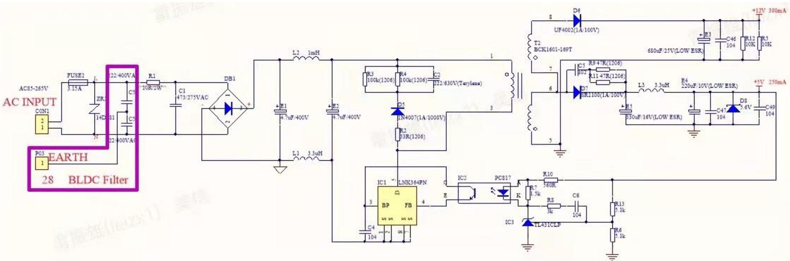

## 正面

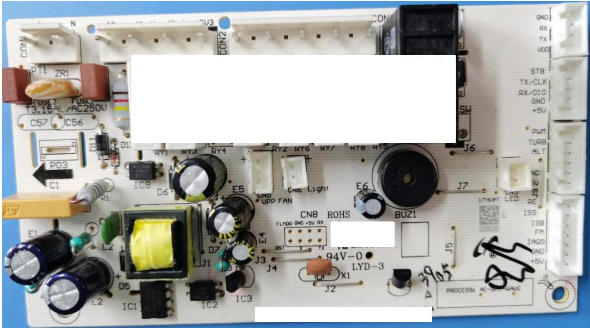

## 背面

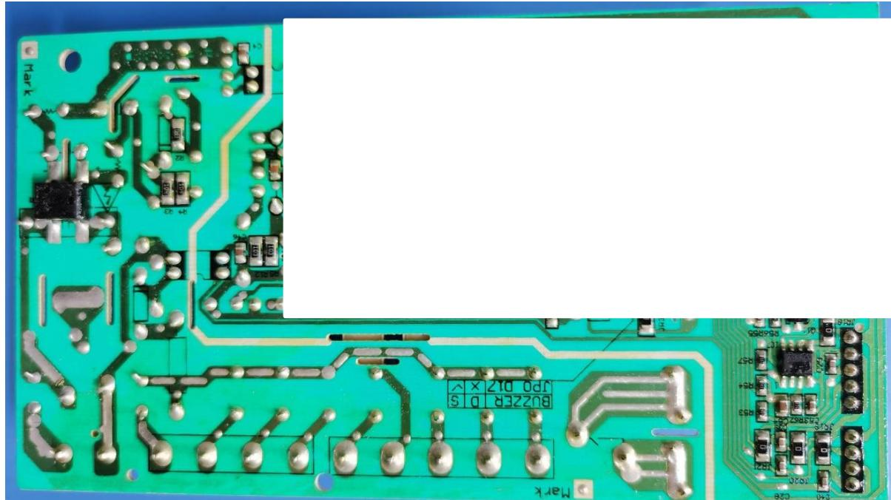

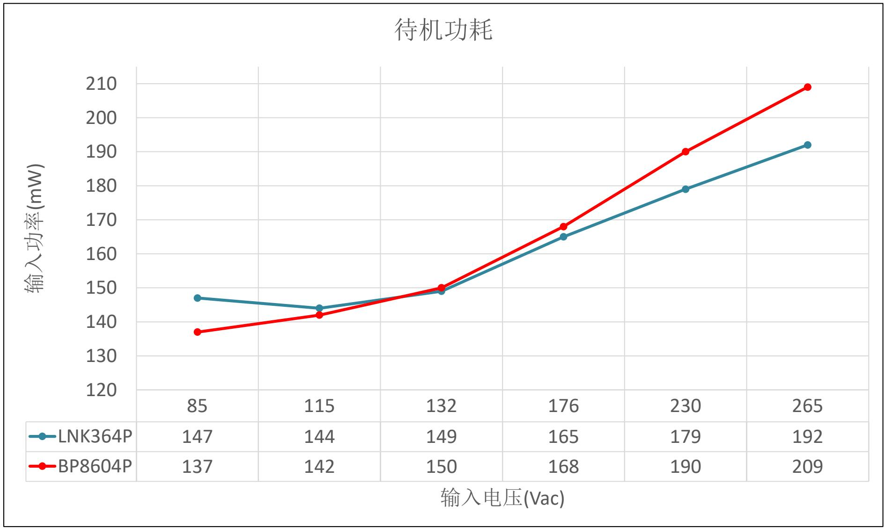

测试条件：带客户板上负载

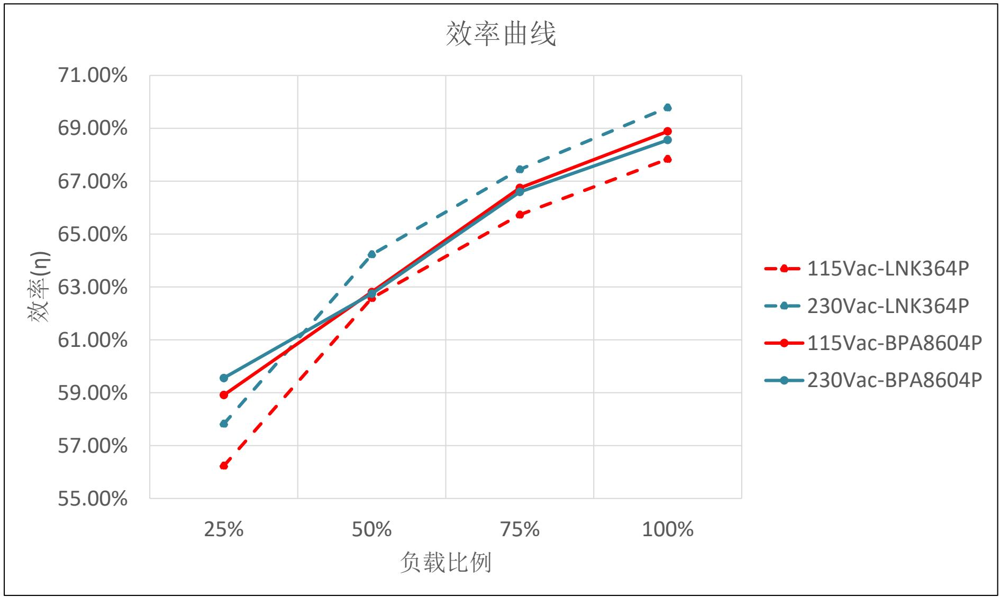

测试时未考虑客户板本身负载对效率的影响。

## 输出电压交叉调整率

BPA8604P

<table><tr><td> $V_{OUT}(V)$  $I_{OUT}(A)$ </td><td></td><td>5V</td><td>12V</td></tr><tr><td rowspan="4"> $I_{O\_5V}=0A$  $I_{O\_12V}=0A$ </td><td>85VAC</td><td>5.0063</td><td>12.921</td></tr><tr><td>115VAC</td><td>5.0065</td><td>12.9</td></tr><tr><td>230VAC</td><td>5.0063</td><td>12.923</td></tr><tr><td>265VAC</td><td>5.0064</td><td>12.933</td></tr><tr><td rowspan="4"> $I_{O\_5V}=0.25A$  $I_{O\_12V}=0A$ </td><td>85VAC</td><td>5.003</td><td>14.541</td></tr><tr><td>115VAC</td><td>5.0032</td><td>14.56</td></tr><tr><td>230VAC</td><td>5.0033</td><td>14.679</td></tr><tr><td>265VAC</td><td>5.0033</td><td>14.73</td></tr><tr><td rowspan="4"> $I_{O\_5V}=0.01A$  $I_{O\_12V}=0.3A$ </td><td>85VAC</td><td>5.002</td><td>11.4626</td></tr><tr><td>115VAC</td><td>5.0021</td><td>11.471</td></tr><tr><td>230VAC</td><td>5.0023</td><td>11.46</td></tr><tr><td>265VAC</td><td>5.0023</td><td>11.444</td></tr><tr><td rowspan="4"> $I_{O\_5V}=0.25A$  $I_{O\_12V}=0.3A$ </td><td>85VAC</td><td>4.9996</td><td>12.684</td></tr><tr><td>115VAC</td><td>4.9992</td><td>12.619</td></tr><tr><td>230VAC</td><td>4.9995</td><td>12.63</td></tr><tr><td>265VAC</td><td>4.9994</td><td>12.639</td></tr></table>

测试条件：Io=0A为只带客户板上负载

LNK364P

<table><tr><td> $V_{OUT}(V)$  $I_{OUT}(A)$ </td><td></td><td>5V</td><td>12V</td></tr><tr><td rowspan="4"> $I_{O\_5V}=0A$  $I_{O\_12V}=0A$ </td><td>85VAC</td><td>5.0053</td><td>12.933</td></tr><tr><td>115VAC</td><td>5.0052</td><td>12.915</td></tr><tr><td>230VAC</td><td>5.0051</td><td>12.92</td></tr><tr><td>265VAC</td><td>5.0051</td><td>12.932</td></tr><tr><td rowspan="4"> $I_{O\_5V}=0.25A$  $I_{O\_12V}=0A$ </td><td>85VAC</td><td>5.0017</td><td>14.338</td></tr><tr><td>115VAC</td><td>5.0017</td><td>14.376</td></tr><tr><td>230VAC</td><td>5.0018</td><td>14.577</td></tr><tr><td>265VAC</td><td>5.0019</td><td>14.663</td></tr><tr><td rowspan="4"> $I_{O\_5V}=0.01A$  $I_{O\_12V}=0.3A$ </td><td>85VAC</td><td>5.0011</td><td>11.53</td></tr><tr><td>115VAC</td><td>5.0014</td><td>11.535</td></tr><tr><td>230VAC</td><td>5.0017</td><td>11.5</td></tr><tr><td>265VAC</td><td>5.0018</td><td>11.489</td></tr><tr><td rowspan="4"> $I_{O\_5V}=0.25A$  $I_{O\_12V}=0.3A$ </td><td>85VAC</td><td>4.9978</td><td>12.663</td></tr><tr><td>115VAC</td><td>4.9986</td><td>12.59</td></tr><tr><td>230VAC</td><td>4.9988</td><td>12.621</td></tr><tr><td>265VAC</td><td>4.9988</td><td>12.641</td></tr></table>

测试条件：Io=0A为只带客户板上负载

## 输出电压纹波

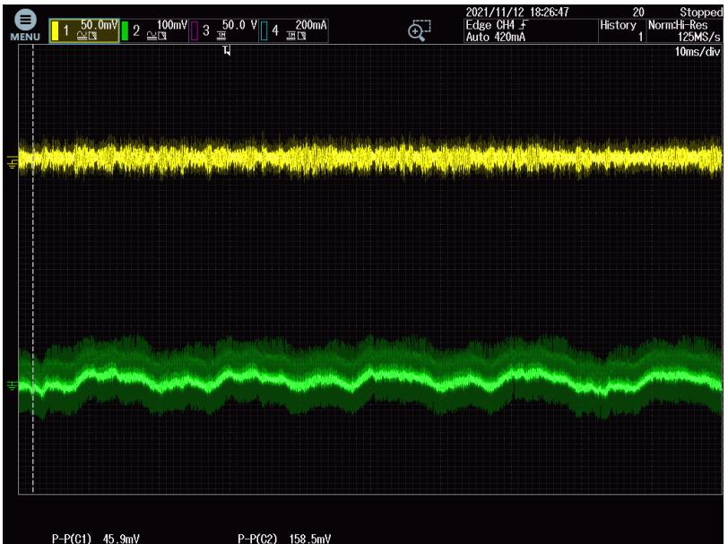

85 VAC

CH2 $\mathsf { V } _ { \mathsf { O U T } \_ 1 2 \mathsf { V } }$ Ripple $V _ { P K - P K } = 4 5 . 9 m V$  
CH4 $\mathsf { V } _ { \mathsf { O U T } \_ 5 \mathsf { V } }$ Ripple $V _ { \mathsf { P K - P K } } { = } 1 5 8 . 5 \mathsf { m V }$

## Test Condition:

➢ $5 \mathsf { V } { - } 0 . 2 5 \mathsf { A }$  
➢ $1 2 \mathsf { V } \mathsf { - } 0 . 2 \mathsf { A }$

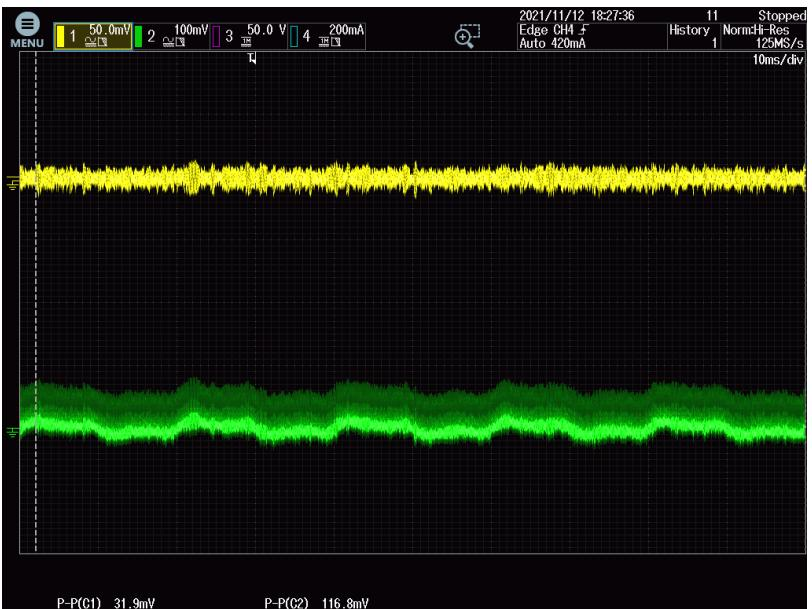

265 VAC

CH2 $\mathsf { V } _ { \mathsf { O U T } \_ 1 2 \mathsf { V } }$ Ripple $\mathsf { V } _ { \mathsf { P K - P K } } { = } 3 1 . 9 \mathsf { m V }$  
CH4 $\mathsf { V } _ { \mathsf { O U T } \_ 5 \mathsf { V } }$ Ripple $V _ { \mathsf { P K - P K } } { = } 1 1 6 . 8 \mathsf { m V }$

## Test Condition:

➢ $5 \mathsf { V } \mathsf { - } 0 . 2 5 \mathsf { A }$  
➢ $1 2 \mathsf { V } \mathsf { - } 0 . 3 \mathsf { A }$

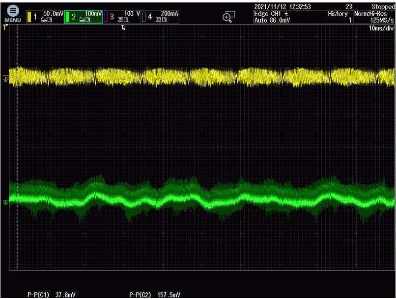

85 VAC

CH2 $\mathsf { V } _ { \mathsf { O U T } \_ 1 2 \mathsf { V } }$ Ripple $V _ { P K - P K } = 3 7 . 8 m V$  
CH4 $\mathsf { V } _ { 0 \mathsf { U T } \_ 5 \vee } \mathsf { R i p p l e }$ $V _ { \mathsf { P K - P K } } { = } 1 5 7 . 5 \mathsf { m V }$

## Test Condition:

➢ $5 \mathsf { V } { - } 0 . 2 5 \mathsf { A }$  
➢ $1 2 \mathsf { V } \mathsf { - } 0 . 2 \mathsf { A }$

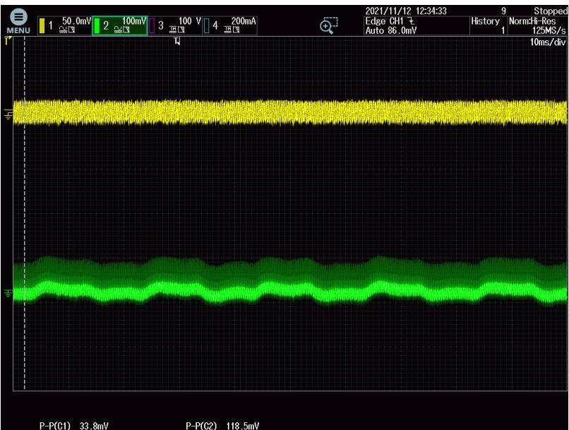

265 VAC

$\mathsf { C H } 2 \mathsf { V } _ { \mathsf { O U T } \_ 1 2 \mathsf { V } }$ Ripple $V _ { p | k \mathrm { - } P | k } = 3 3 . 8 m V$  
CH4 $\mathsf { V } _ { 0 \mathsf { U T } \_ 5 \vee } \mathsf { R i p p l e }$ $V _ { \mathsf { P K - P K } } { = } 1 1 8 . 5 \mathsf { m V }$

## Test Condition:

➢ $5 \mathsf { V } \mathsf { - } 0 . 2 5 \mathsf { A }$  
➢ $1 2 \mathsf { V } \mathsf { - } 0 . 3 \mathsf { A }$

## (50%-100%)

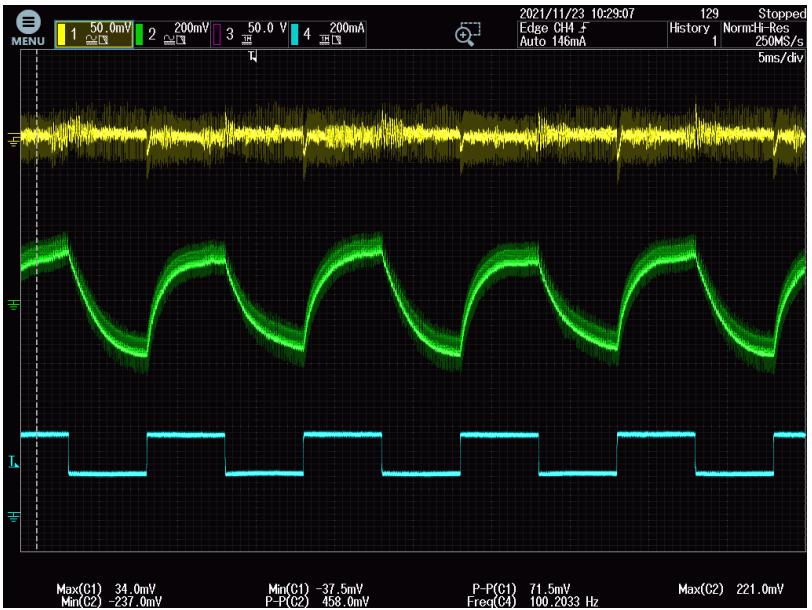

85 VAC

$\stackrel { \mathsf { C H 1 } } { \boldsymbol { \mathsf { V } } } _ { \mathsf { P K - P K } } ^ { } = \stackrel { \mathsf { U T } } { \boldsymbol { \mathsf { 7 } } } \underline { { 5 } } \mathsf { V } _ { \mathsf { m V } }$  
$\mathtt { C H 2 } \mathtt { V _ { 0 \sqcup T } } _ { \mathtt { V _ { P K } } = 4 5 8 \mathtt { m V } }$  
CH4 IOUT\_5V $\mathsf { I } _ { \mathsf { O U T } \_ 5 \mathsf { V } }$

## Test Condition:

➢ 5V: 0.125A-0.25A-0.125A  
➢ 12V: 0.2A  
➢ Slew Rate: 0.5 A/μS  
➢ Frequency: 100 Hz

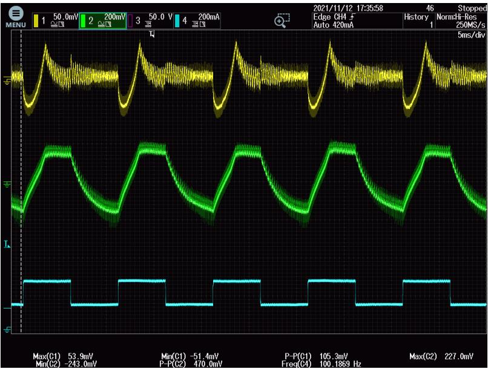

85 VAC

$\begin{array} { r l } & { \mathsf { C H } 4 \mathsf { V } _ { 0 \mathsf { U T } \_ 5 \vee } } \\ & { \mathsf { V } _ { \mathsf { P K } \cdot \mathsf { P K } } = 1 0 5 . 3 \mathsf { m v } } \end{array}$  
$\mathtt { C H 2 } \mathtt { V _ { 0 4 7 } } \mathtt { 1 2 v } _ { \mathsf { m v } }$  
CH3 IOUT\_5V

## Test Condition:

➢ 5V: 0.125A-0.25A-0.125A  
➢ 12V: 0.2A  
➢ Slew Rate: 0.5 A/μS  
➢ Frequency: 100 Hz

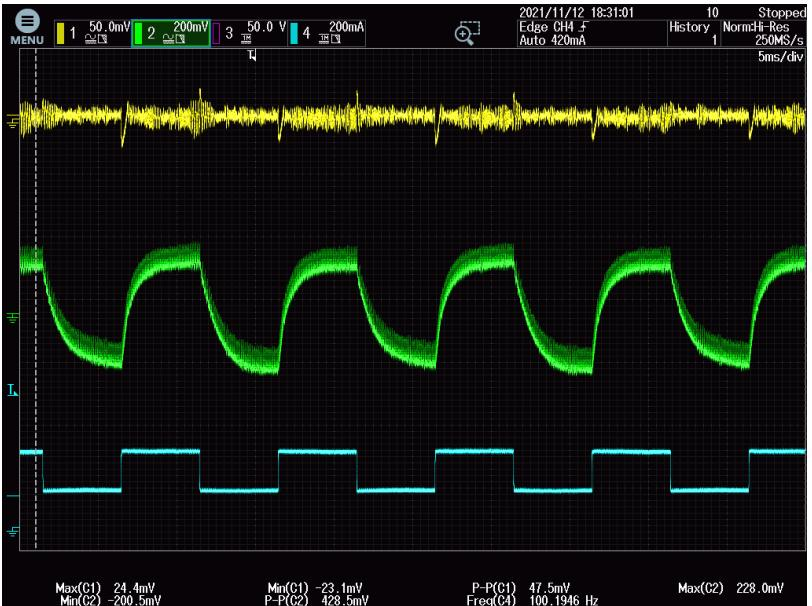

265 VAC

CH4 V OUT\_5VV = 47.5 mV  
$\begin{array} { r l } & { \mathsf { C H 2 } \mathsf { V _ { O U T } } } \\ & { \mathsf { V _ { P K - P K } } \equiv 4 2 8 . 5 \mathsf { m v } } \end{array}$  
CH3 IOUT\_5V $\mathsf { I } _ { 0 \cup \mathsf { T } _ { - } 5 \mathsf { V } }$

## Test Condition:

➢ 5V: 0.125A-0.25A-0.125A  
➢ 12V: 0.3A  
➢ Slew Rate: 0.5 A/μS  
➢ Frequency: 100 Hz

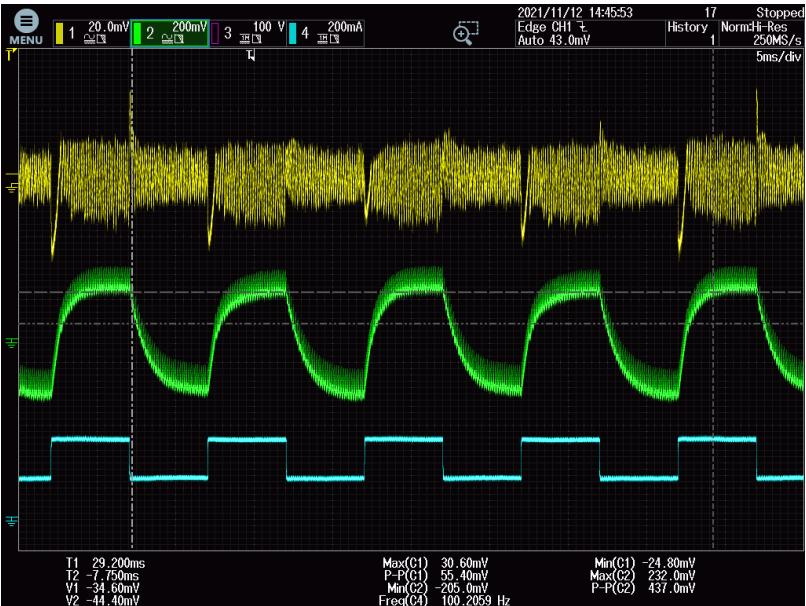

265 VAC

$\begin{array} { r l } & { \mathsf { C H 4 } \mathsf { V _ { 0 } } \mathsf { \Gamma _ { 0 } } \mathsf { u } _ { \mathsf { T } } . 5 \mathsf { v } } \\ & { \mathsf { V _ { P K - P K } } \mathsf { = } 5 5 . 4 \mathsf { m } \mathsf { v } } \end{array}$  
$\begin{array} { r l } & { \mathsf { C H 2 } \mathsf { V _ { O U T } } \mathsf { 1 2 V } } \\ & { \mathsf { V _ { P K - P K } } \mathsf { = } 4 3 7 \mathsf { m V } } \end{array}$  
CH3 IOUT\_5V

## Test Condition:

➢ 5V: 0.125A-0.25A-0.125A  
➢ 12V: 0.3A  
➢ Slew Rate: 0.5 A/μS  
➢ Frequency: 100 Hz

## (50%-100%)

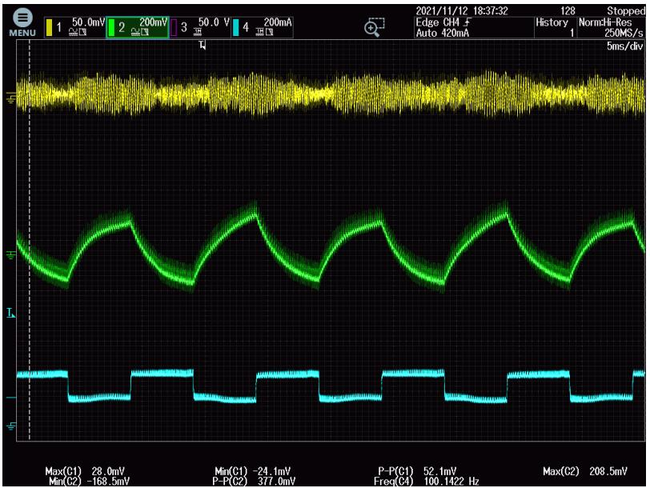

85 VAC

$\begin{array} { r l } & { \mathsf { C H 4 } \mathsf { V _ { 0 \mathsf { U T } , 5 \mathsf { V } } } } \\ & { \mathsf { V _ { P K - P K } } \equiv 5 2 . 1 \mathsf { m v } } \end{array}$  
$\begin{array} { r l } & { \mathsf { C H } 2 \mathsf { V } _ { \mathsf { O U T } } } \\ & { \mathsf { V } _ { \mathsf { P K } \to \mathsf { P K } } = 3 7 7 \mathsf { m v } } \end{array}$  
CH3 IOUT\_12V $\mathsf { I } _ { \mathsf { O U T } _ { - } 1 2 \mathsf { V } }$

## Test Condition:

➢ $1 2 \mathsf { V } \colon 0 . 1 \mathsf { A } \mathsf { - } 0 . 2 \mathsf { A } \mathsf { - } 0 . 1 \mathsf { A }$  
➢ 5V: 0.25A  
➢ Slew Rate: 0.5 A/μS  
➢ Frequency: 100 Hz

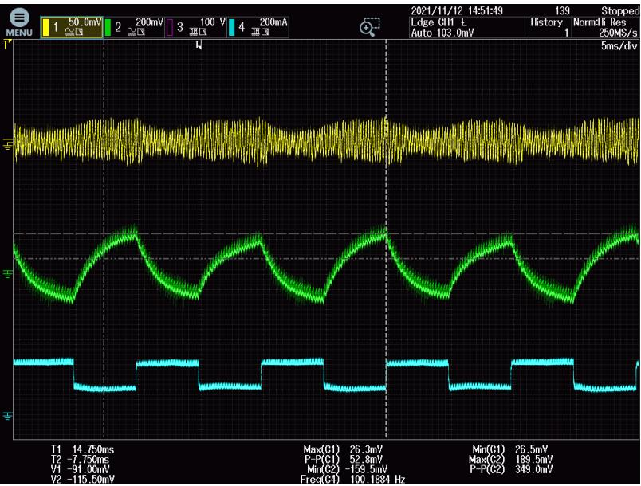

85 VAC

$\begin{array} { l } { C \mathsf { H } 4 \mathsf { V } _ { \mathsf { O } \mathsf { U } \mathsf { T } \mathsf { S } \mathsf { V } } } \\ { \mathsf { V } _ { \mathsf { P K } \mathrm { - P K } } = 5 2 . 8 \mathsf { m } \mathsf { V } } \end{array}$  
$\begin{array} { r l } & { \mathsf { C H 2 } \mathsf { V _ { O U T } } } \\ & { \mathsf { V _ { P K - P K } } \mathsf { = } 3 4 9 \mathsf { m v } } \end{array}$  
CH3 IOUT\_12V

## Test Condition:

➢ $1 2 \mathsf { V } \colon 0 . 1 \mathsf { A } \mathtt { - } 0 . 2 \mathsf { A } \mathtt { - } 0 . 1 \mathsf { A }$  
➢ 5V: 0.25A  
➢ Slew Rate: 0.5 A/μS  
➢ Frequency: 100 Hz

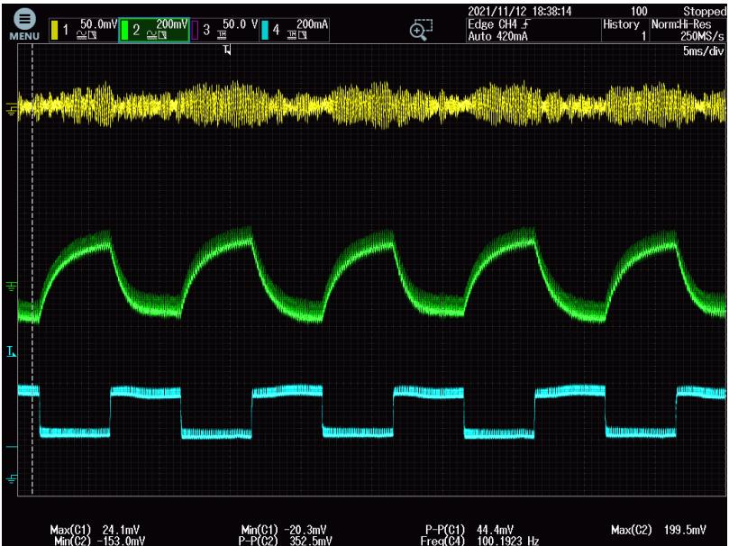

265 VAC

$\begin{array} { l } { \mathsf { C H 4 V _ { 0 \sqcup T \_ 5 V } } } \\ { \mathsf { V _ { P K \_ P K } } = 4 4 . 4 , 4 \mathsf { m v } } \end{array}$  
$\begin{array} { r l } & { \mathsf { C H 2 } \mathsf { V } _ { \mathsf { O U T } } } \\ & { \mathsf { V } _ { \mathsf { P K - P K } } \equiv 3 5 2 . 5 \mathsf { m v } } \end{array}$  
CH3 IOUT\_12V $\mathsf { I } _ { \mathsf { O U T } _ { - } 1 2 \mathsf { V } }$

## Test Condition:

➢ 12V: 0.15A-0.3A-0.15A  
➢ 5V: 0.25A  
➢ Slew Rate: 0.5 A/μS  
➢ Frequency: 100 Hz

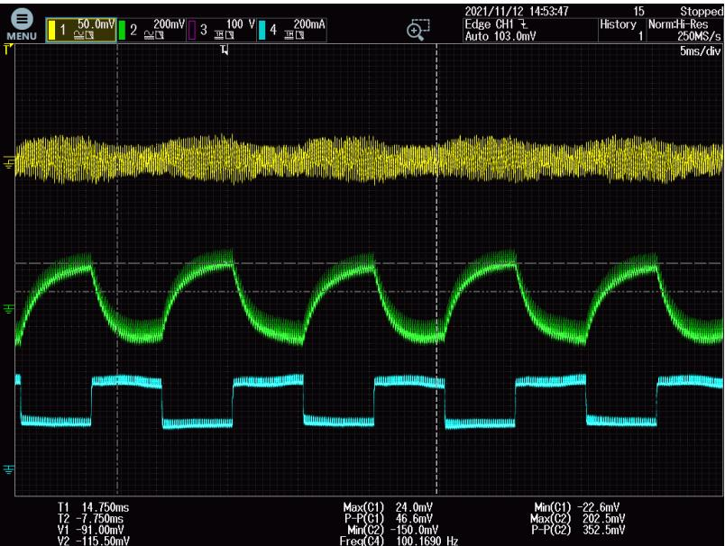

265 VAC

$\begin{array} { l } { \mathsf { C H 4 V _ { 0 \mathsf { U T } } } _ { = \mathsf { 4 6 } . 6 \mathsf { m v } } } \\ { \mathsf { V _ { P K - P K } } } \end{array}$  
$\begin{array} { r l } & { \mathsf { C H 2 } \mathsf { V _ { 0 u T } } } \\ & { \mathsf { V _ { P K - P K } } \mathsf { = } 3 5 2 . 5 \mathsf { m v } } \end{array}$  
CH3 IOUT\_12V $\mathsf { I } _ { 0 \mathsf { U T } _ { - } 1 2 \mathsf { V } }$

## Test Condition:

➢ 12V: 0.15A-0.3A-0.15A  
➢ 5V: 0.25A  
➢ Slew Rate: 0.5 A/μS  
➢ Frequency: 100 Hz

## (10%-90%)

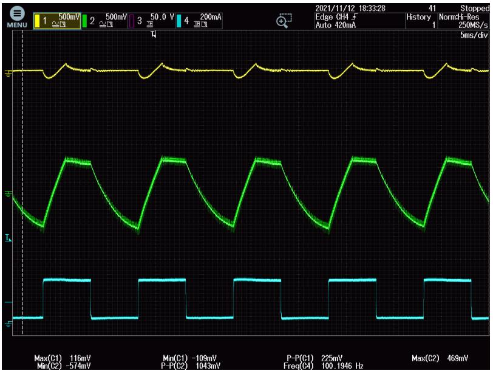

85 VAC

CH1 V OUT\_5VVPK-PK= 225 mV  
$\begin{array} { r l } & { \mathsf { C H 2 V } _ { \mathsf { O U T } _ { \mathsf { I 2 V } } } } \\ & { \mathsf { V } _ { \mathsf { P K - P K } } \equiv \mathsf { 1 0 4 3 } \mathsf { m v } } \end{array}$  
CH4 IOUT\_5V $\mathsf { I } _ { \mathsf { O U T } \_ 5 \mathsf { V } }$

## Test Condition:

➢ 5V: 0.025A-0.225A-0.025A  
➢ 12V: 0.2A  
➢ Slew Rate: 0.5 A/μS  
➢ Frequency: 100 Hz

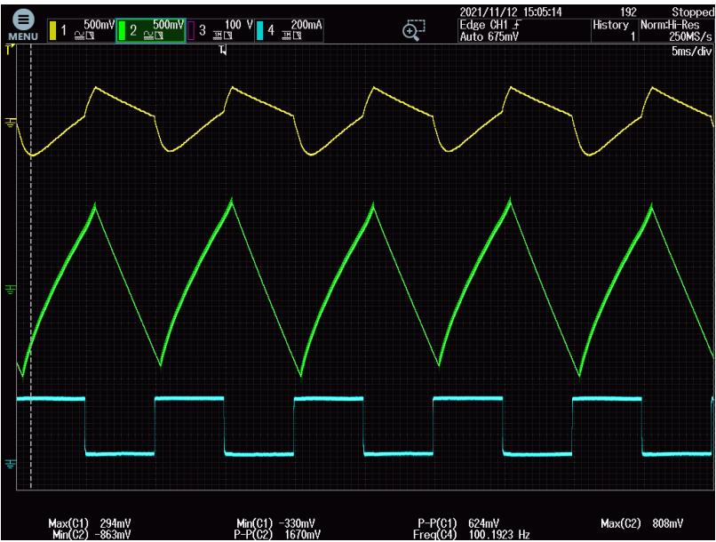

85 VAC

$\mathtt { C H 1 V _ { \mathtt { O U T } } } _ { \mathtt { P K - P K } } = 6 2 4 \mathtt { m v }$  
$\begin{array} { r l } & { \mathsf { C H } 2 \mathsf { V } _ { \mathsf { O U T } } } \\ & { \mathsf { V } _ { \mathsf { P K } \cdot \mathsf { P K } } } \end{array} = \pm 1 6 7 0 \mathsf { m v }$  
CH4 IOUT\_5V

## Test Condition:

➢ 5V: 0.025A-0.225A-0.025A  
➢ 12V: 0.2A  
➢ Slew Rate: 0.5 A/μS  
➢ Frequency: 100 Hz

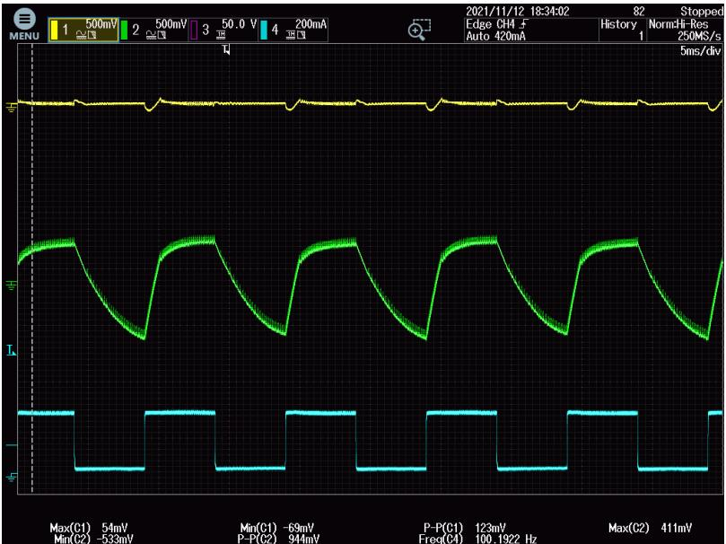

265 VAC

CH1 V OUT\_5VV = 123 mV  
$\begin{array} { r l } & { \mathsf { C H 2 V } _ { \mathsf { O U T } } \imath _ { 2 \mathsf { V } } } \\ & { \mathsf { V } _ { \mathsf { P K - P K } } \equiv 9 4 4 \mathsf { m V } } \end{array}$  
CH4 IOUT\_5V $\mathsf { I } _ { 0 \cup \mathsf { T } _ { - } 5 \mathsf { V } }$

## Test Condition:

➢ 5V: 0.025A-0.225A-0.025A  
➢ 12V: 0.3A  
➢ Slew Rate: 0.5 A/μS  
➢ Frequency: 100 Hz

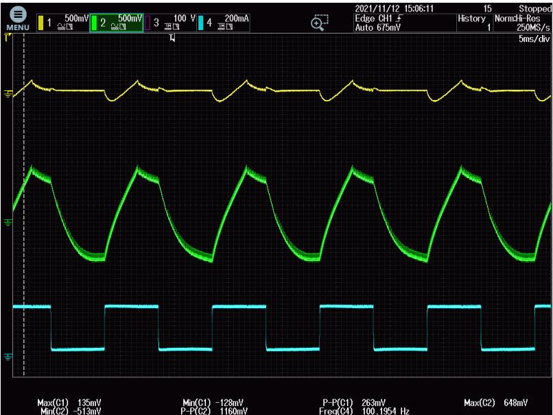

265 VAC

$\begin{array} { r l } & { \mathsf { C H 1 V } _ { \mathsf { O U T } } \mathsf { 5 V } } \\ & { \mathsf { V } _ { \mathsf { P K - P K } } \equiv 2 6 3 \mathsf { m V } } \end{array}$  
$\begin{array} { r l } & { \mathsf { C H 2 } \mathsf { V _ { 0 \cup T } } _ { 1 2 \mathsf { V } } } \\ & { \mathsf { V _ { P K - P K } } \mathsf { = 1 1 6 0 m v } } \end{array}$  
CH4 IOUT\_5V

## Test Condition:

➢ 5V: 0.025A-0.225A-0.025A  
➢ 12V: 0.3A  
➢ Slew Rate: 0.5 A/μS  
➢ Frequency: 100 Hz

## (10%-90%)

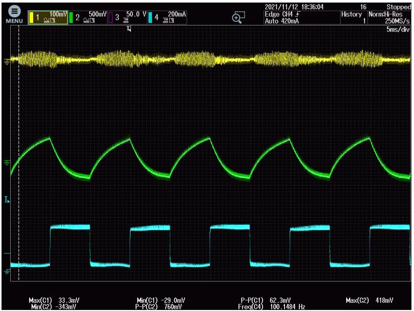

85 VAC

CH4 V OUT\_5VVPK-PK= 62.3 mV  
$\mathtt { C H 2 } \mathtt { V _ { 0 \sqcup T } } _ { \mathtt { V _ { P K } } = 7 6 0 \mathtt { m V } }$  
CH3 IOUT\_12V $\mathsf { I } _ { \mathsf { O U T } _ { - } 1 2 \mathsf { V } }$

## Test Condition:

➢ 12V: 0.03A-0.27A-0.03A  
➢ 5V: 0.25A  
➢ Slew Rate: 0.5 A/μS  
➢ Frequency: 100 Hz

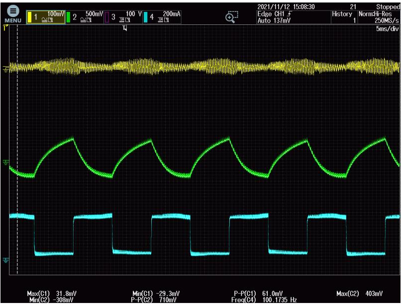

85 VAC

CH4 V OUT\_5VVPK-PK= 61 mV  
$\mathtt { C H 2 } \mathtt { V _ { 0 \sqcup T } } _ { \mathtt { M _ { P K } } = 7 \mathtt { T I 0 m V } }$  
CH3 IOUT\_12V

## Test Condition:

➢ 12V: 0.03A-0.27A-0.03A  
➢ 5V: 0.25A  
➢ Slew Rate: 0.5 A/μS  
➢ Frequency: 100 Hz

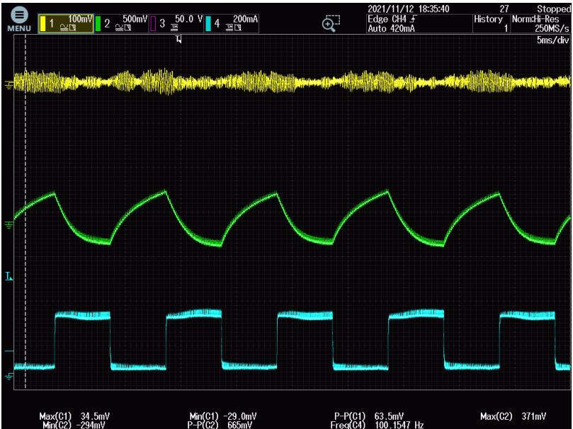

265 VAC

CH4 V OUT\_5VV = 63.5 mV  
CH2 V V = 665 mV  
CH3 IOUT\_12V $\mathsf { I } _ { \mathsf { O U T } _ { - } 1 2 \mathsf { V } }$

## Test Condition:

➢ 12V: 0.03A-0.27A-0.03A  
➢ 5V: 0.25A  
➢ Slew Rate: 0.5 A/μS  
➢ Frequency: 100 Hz

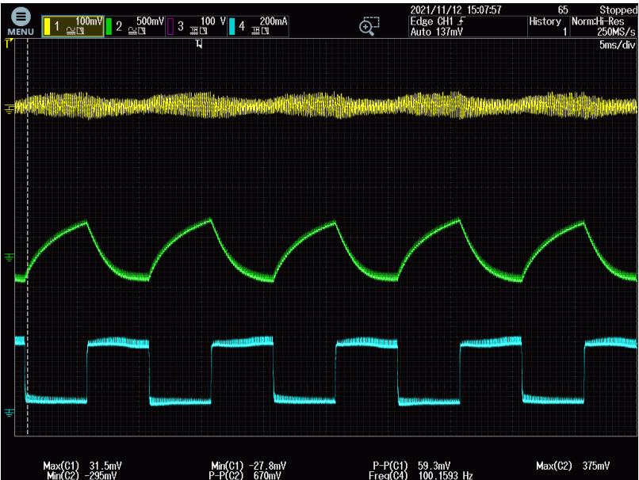

265 VAC

$\begin{array} { r l } & { \mathsf { C H 4 } \mathsf { V _ { 0 \mathsf { U T } } } . 5 \mathsf { v } } \\ & { \mathsf { V _ { P K - P K } } . = 5 9 . 3 \mathsf { m v } } \end{array}$  
$\stackrel { \mathrm { C H } 2 } { \mathsf { V } } _ { \mathsf { P K } \cdot \mathsf { P K } } = 6 7 0 ^ { 1 2 \mathsf { V } } _ { \mathsf { m V } }$  
CH3 IOUT\_12V

## Test Condition:

➢ 12V: 0.03A-0.27A-0.03A  
➢ 5V: 0.25A  
➢ Slew Rate: 0.5 A/μS  
➢ Frequency: 100 Hz

## 输出电压开机波形

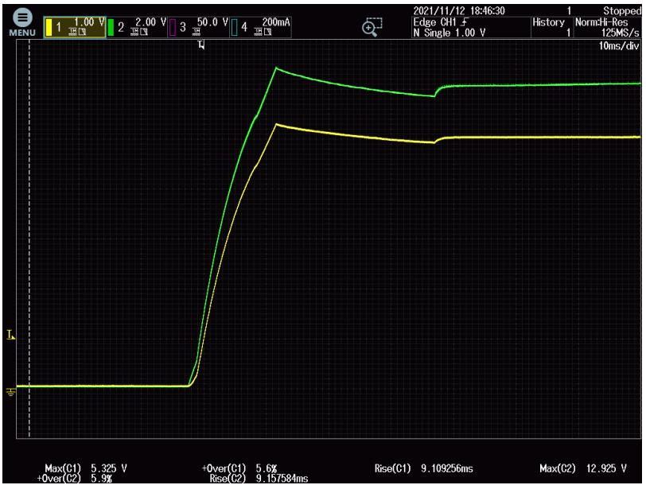

85 VAC

$\begin{array} { r } { \mathsf { C H 1 V _ { 0 \cup \mathsf { T } \_ 5 \vee } } } \\ { \mathsf { t } _ { \mathsf { r i s e } } { = } \mathsf { 9 } . 1 \mathsf { m s } } \end{array}$ CH1 VOUT\_5V  
$\begin{array} { r l } & { \mathsf { C H 2 } \mathsf { V _ { 0 \cup \mathsf { T _ { - } 1 } 2 \mathsf { V } } } } \\ & { \mathsf { t } _ { \mathsf { r i s e } } \mathsf { = 9 } . 1 6 \mathsf { m s } } \end{array}$ CH2 VOUT\_12V

## Test Condition:

➢ 5V-0A  
➢ 12V-0A

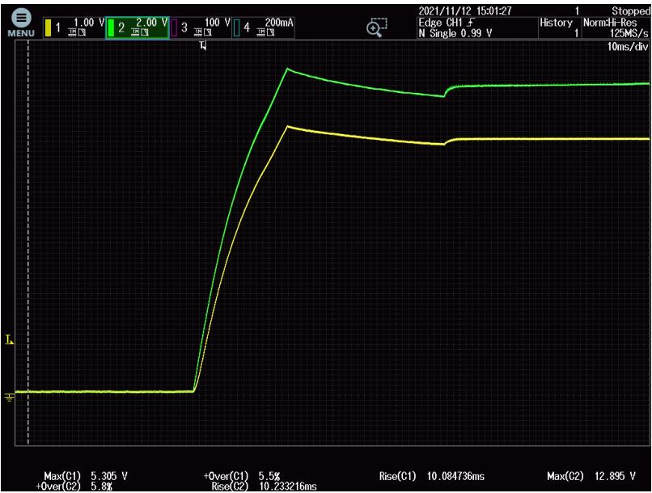

85 VAC

$\begin{array} { l } { \mathsf { C H 1 V _ { 0 \cup \mathsf { T } \_ 5 \vee } } } \\ { \displaystyle \mathfrak { t } _ { \mathsf { r i s e } } = 1 0 . 0 8 \mathsf { m s } } \end{array}$ CH1 VOUT\_5V  
$\begin{array} { l l } { { \mathbb { C } } { \mathsf { H } } 2 { \mathsf { V } } _ { 0 \cup \mathsf { T } \_ 1 2 \vee } } \\ { { \mathsf { t } } _ { { \mathsf { r i s e } } } { = } 1 0 { . } 2 3 \mathsf { m s } } \end{array}$ CH2 VOUT\_12V

## Test Condition:

➢ 5V-0A  
➢ 12V-0A

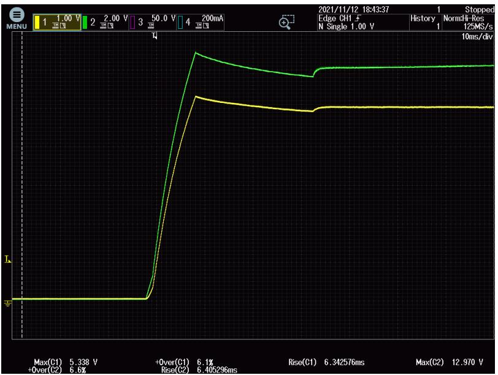

265 VAC

$\begin{array} { l } { \mathsf { C H 1 V _ { 0 \cup \mathsf { T } \_ 5 \vee } } } \\ { \displaystyle \mathbf { t } _ { \mathrm { r i s e } } = 6 . 3 4 \mathsf { m s } } \end{array}$ CH1 V  
CH2 V t = 6.41 mS

## Test Condition:

➢ 5V-0A  
➢ 12V-0A

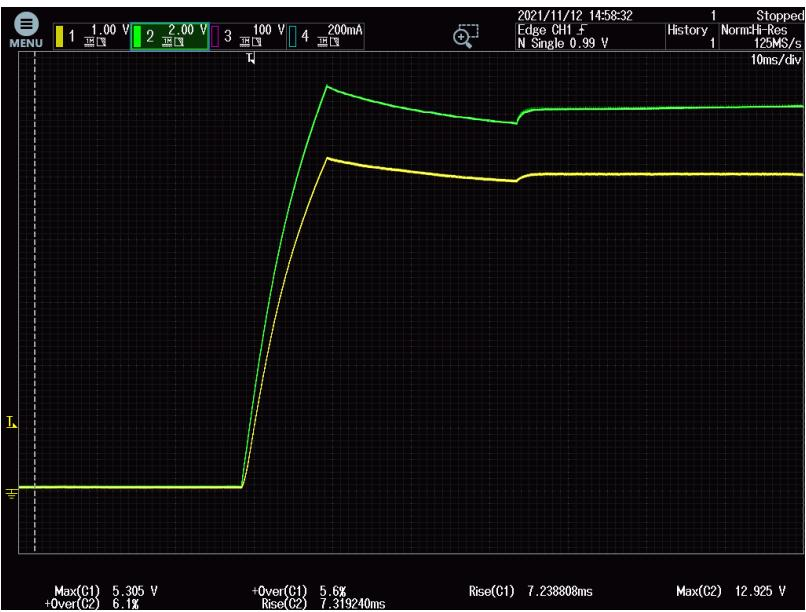

265 VAC

$\begin{array} { l } { \mathsf { C H 1 V _ { 0 \cup \mathsf { T } \_ 5 \vee } } } \\ { \displaystyle \mathfrak { t } _ { \mathrm { r i s e } } = 7 . 2 4 \mathrm { m s } } \end{array}$ CH1 V  
$\begin{array} { r l } & { \mathsf { C H 2 } \mathsf { V _ { 0 \cup \mathsf { T _ { - } 1 } 2 \mathsf { V } } } } \\ & { \mathsf { t } _ { \mathsf { r i s e } } \mathsf { = 7 } . 3 2 \mathsf { m s } } \end{array}$ CH2 V

## Test Condition:

➢ 5V-0A  
➢ 12V-0A

## 输出电压开机波形

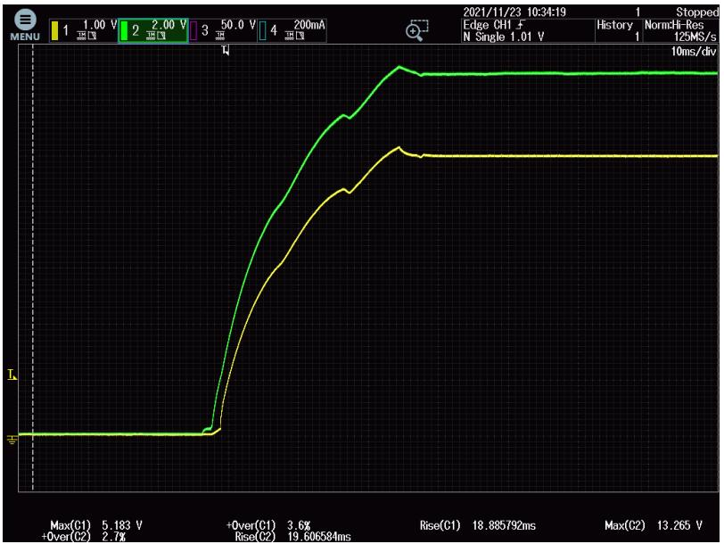

85 VAC

CH1 VOUT\_5V t = 18.89 mS  
CH2 V trise= 19.61 mS

Test Condition:

➢ 5V-0.25A  
➢ 12V-0.2A

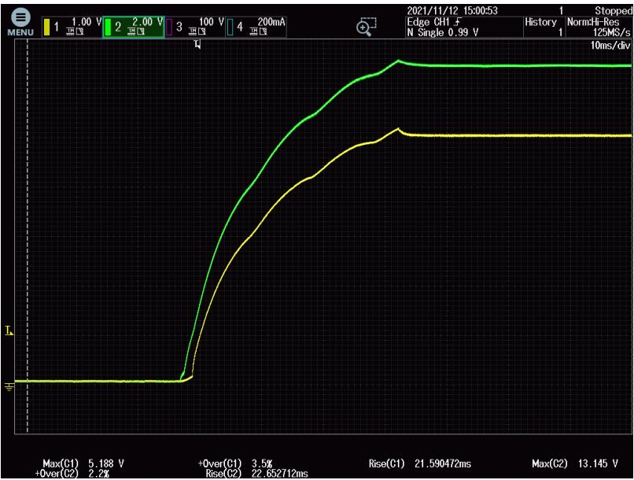

85 VAC

CH1 VOUT\_5V t = 21.59 mS  
CH2 VOUT\_12V trise= 22.65 mS

Test Condition:

➢ 5V-0.25A  
➢ 12V-0.2A

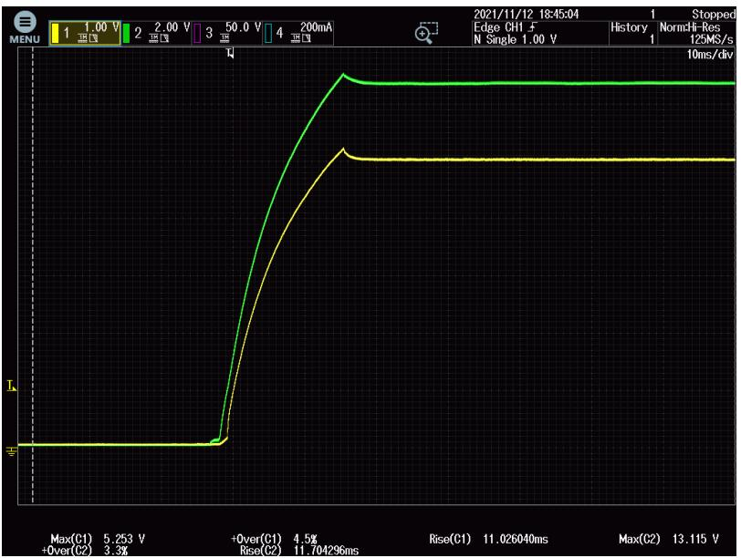

265 VAC

CH1 VOUT\_5V t = 11.03 mS  
CH2 V t = 11.7 mS

Test Condition:

➢ 5V-0.25A  
➢ 12V-0.3A

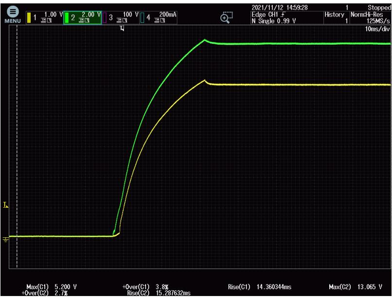

265 VAC

CH1 V t = 14.36 mS  
CH2 VOUT\_12V t = 15.29 mS

Test Condition:

➢ 5V-0.25A  
➢ 12V-0.3A

## MOSFET

85 VAC

CH2 VDS  
CH4 IDS

$$
V _ {D S \_ M A X} = 2 7 1. 5 \mathrm{V}
$$

$$
I _ {D S \_ M A X} = 0. 5 5 2 \mathrm{A}
$$

## Test Condition:

➢ 5V-0.25A  
➢ 12V-0.2A

265 VAC

CH2 VDS  
CH4 IDS

$$
V _ {D S \_ M A X} = 5 2 8 \mathrm{V}
$$

$$
I _ {D S \_ M A X} = 0. 4 8 3 5 \mathrm{A}
$$

## Test Condition:

➢ 5V-0.25A  
➢ 12V-0.3A

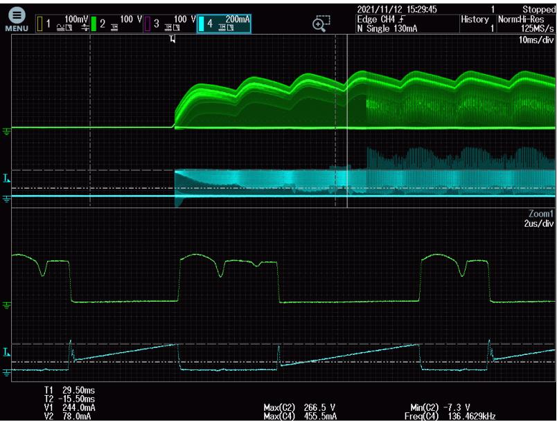

85 VAC  
265 VAC

CH2 VDS  
CH4 IDS

$$
V _ {D S \_ M A X} = 2 6 6. 5 \mathrm{V}
$$

$$
I _ {D S \_ M A X} = 0. 4 5 5 5 \mathrm{A}
$$

## Test Condition:

➢ 5V-0.25A  
➢ 12V-0.2A

CH2 VDS  
CH4 IDS

$$
V _ {D S \_ M A X} = 5 2 9. 3 \mathrm{V}
$$

$$
I _ {D S \_ M A X} = 0. 3 9 7 \mathrm{A}
$$

## Test Condition:

➢ 5V-0.25A  
➢ 12V-0.3A

## MOSFET

85 VAC

CH2 VDS  
CH4 IDS

$$
V _ {D S \_ M A X} = 2 6 9. 5 \mathrm{V}
$$

$$
I _ {D S \_ M A X} = 0. 4 9 7 \mathrm{A}
$$

## Test Condition:

➢ 5V-0.25A  
➢ 12V-0.2A

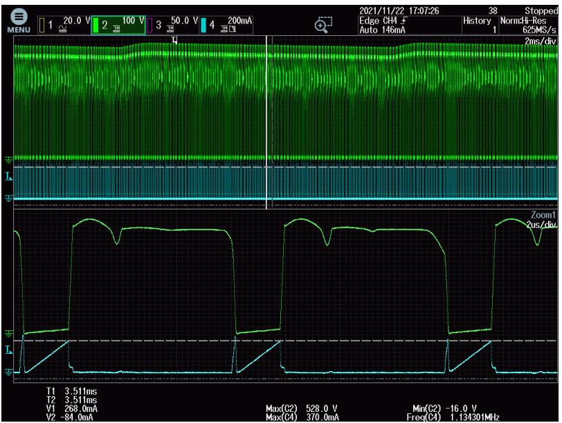

265 VAC

CH2 VDS  
CH4 IDS

$$
V _ {D S \_ M A X} = 5 2 8 \mathrm{V}
$$

$$
I _ {D S \_ M A X} = 0. 3 7 0 \mathrm{A}
$$

## Test Condition:

➢ 5V-0.25A  
➢ 12V-0.3A

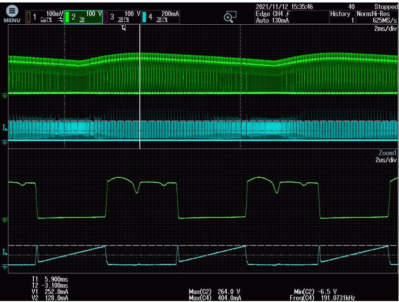

85 VAC  
265 VAC

CH2 VDS  
CH4 IDS

$$
V _ {D S \_ M A X} = 2 6 4 \mathrm{V}
$$

$$
I _ {D S \_ M A X} = 0. 4 0 4 \mathrm{A}
$$

## Test Condition:

➢ 5V-0.25A  
➢ 12V-0.2A

CH2 VDS  
CH4 IDS

$$
V _ {D S \_ M A X} = 5 2 4. 8 \mathrm{V}
$$

$$
I _ {D S \_ M A X} = 0. 2 8 3 5 \mathrm{A}
$$

## Test Condition:

➢ 5V-0.25A  
➢ 12V-0.3A

## 输出二极管开机波形

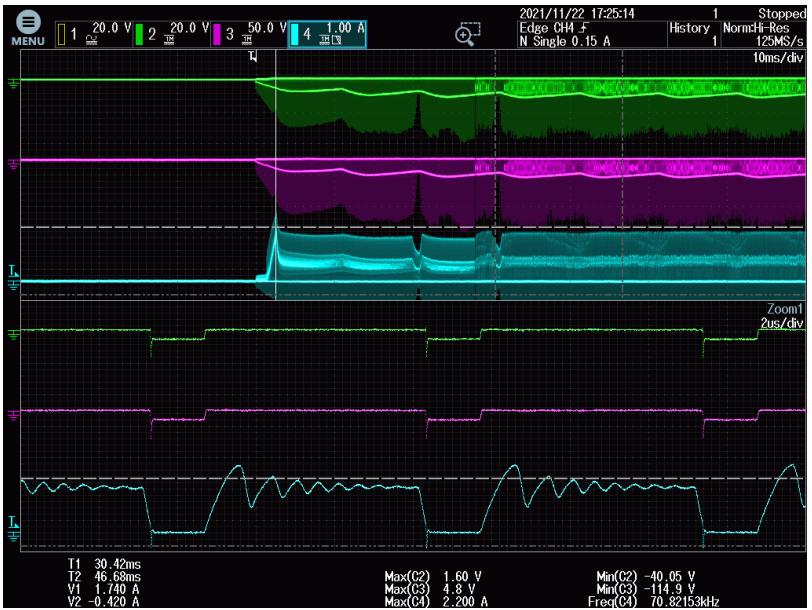

85 VAC  
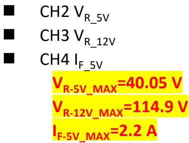

Test Condition:

➢ 5V-0.25A  
➢ 12V-0.2A

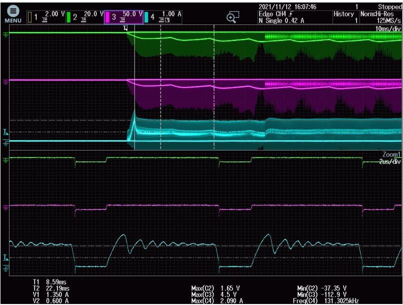

85 VAC  
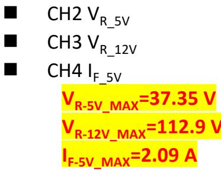

Test Condition:

➢ 5V-0.25A  
➢ 12V-0.2A

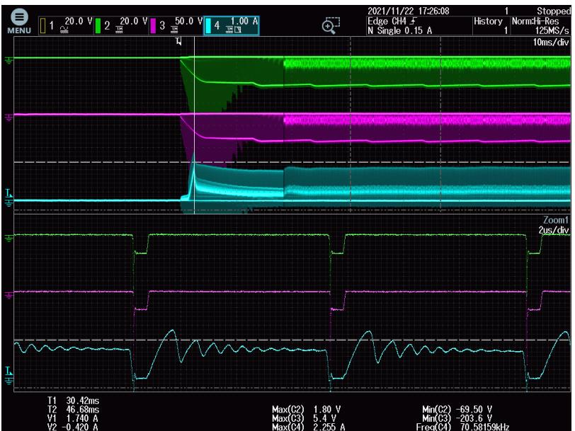

265 VAC  
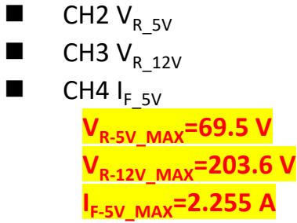

Test Condition:

➢ 5V-0.25A  
➢ 12V-0.3A

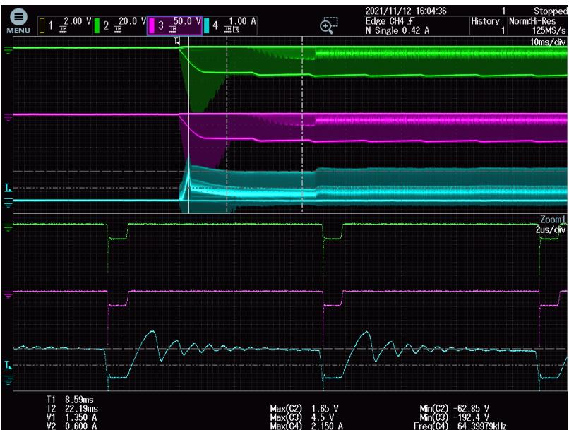

265 VAC  
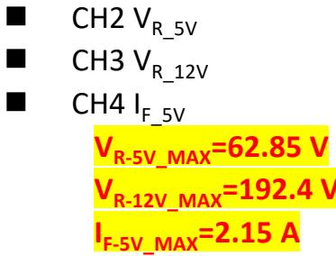

Test Condition:

➢ 5V-0.25A  
➢ 12V-0.3A

## 输出二极管稳态波形

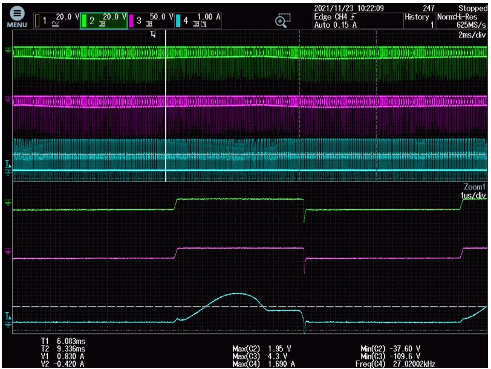

85 VAC

CH2 VR\_5V  
CH3 VR\_12V  
CH4 IF\_5V

$$
V _ {R - 5 V \_ M A X} = 3 7. 6 \mathrm{V}
$$

$$
V _ {R - 1 2 V \_ M A X} = 1 0 9. 6 \mathrm{V}
$$

$$
I _ {F - 5 V \_ M A X} = 1. 6 9 \mathrm{A}
$$

## Test Condition:

➢ 5V-0.25A  
➢ 12V-0.2A

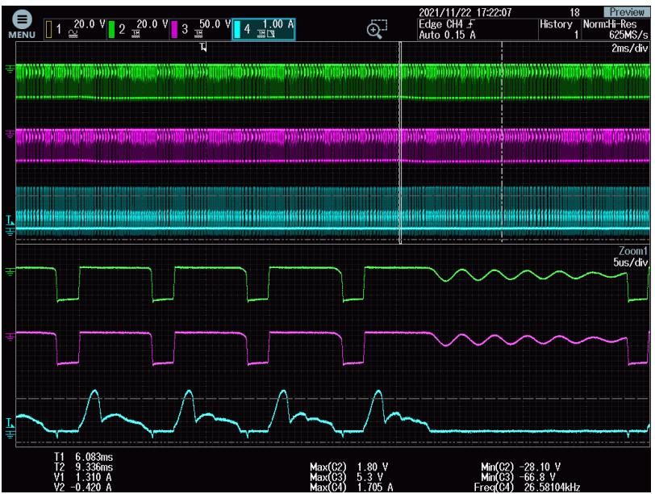

265 VAC

CH2 VR\_5V  
CH3 VR\_12V  
CH4 IF\_5V

$$
V _ {R - 5 V \_ M A X} = 2 8. 1 \mathrm{V}
$$

$$
V _ {R - 1 2 V \_ M A X} = 6 6. 8 \mathrm{V}
$$

$$
I _ {F - 5 V \_ M A X} = 1. 7 0 5 \mathrm{A}
$$

## Test Condition:

➢ 5V-0.25A  
➢ 12V-0.3A

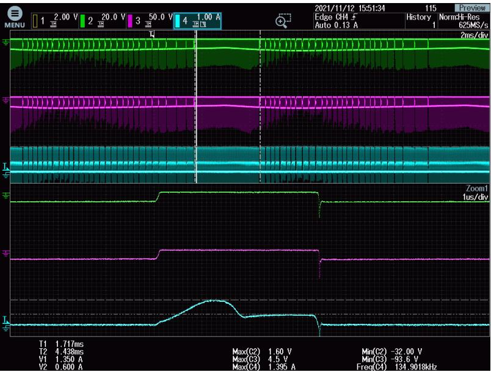

85 VAC  
265 VAC

CH2 VR\_5V  
CH3 VR\_12V  
CH4 IF\_5V

$$
\begin{array}{l} \mathrm {V_ {R - 5V\_MAX}} = 3 2 \mathrm{V} \\ \mathrm {V_ {R - 12V\_MAX}} = 9 3. 6 \mathrm{V} \\ \mathrm {I_ {F - 5V\_MAX}} = 1. 3 9 5 \mathrm{A} \end{array}
$$

## Test Condition:

➢ 5V-0.25A  
➢ 12V-0.2A

CH2 VR\_5V  
CH3 VR\_12V  
CH4 IF\_5V

$$
\begin{array}{l} \mathrm {V_ {R - 5V\_MAX}} = 2 7. 5 \mathrm{V} \\ \mathrm {V_ {R - 12V\_MAX}} = 6 7. 4 \mathrm{V} \\ \mathrm {I_ {F - 5V\_MAX}} = 1. 5 9 3 \mathrm{A} \end{array}
$$

## Test Condition:

➢ 5V-0.25A  
➢ 12V-0.3A

## MOSFET

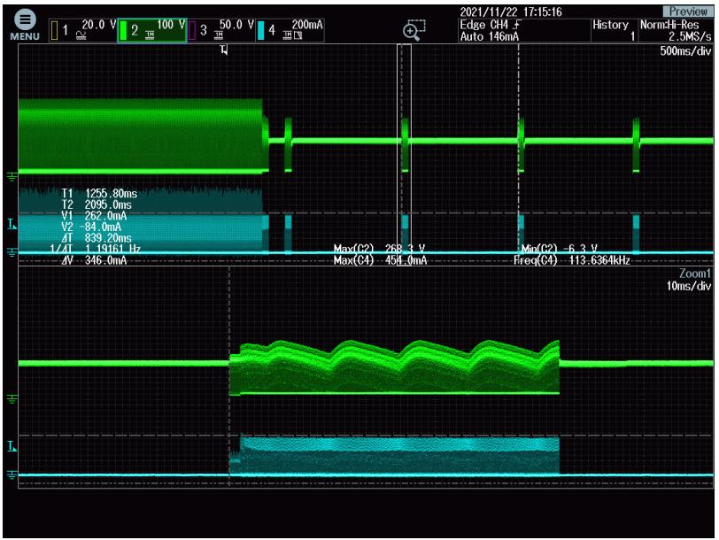

85 VAC

CH1 VDS  
CH3 IDS

$$
V _ {D S \_ M A X} = 2 6 8. 3 \mathrm{V}
$$

$$
I _ {D S \_ M A X} = 0. 4 5 4 \mathrm{A}
$$

## Test Condition:

➢ 5V-0.25A  
➢ 12V-0.2A

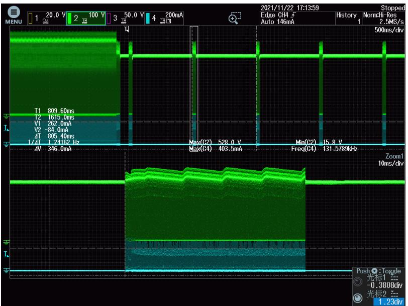

265 VAC

CH1 VDS  
CH3 IDS

$$
V _ {D S \_ M A X} = 5 2 8 \mathrm{V}
$$

$$
I _ {D S \_ M A X} = 0. 4 0 3 5 \mathrm{A}
$$

## Test Condition:

➢ 5V-0.25A  
➢ 12V-0.3A

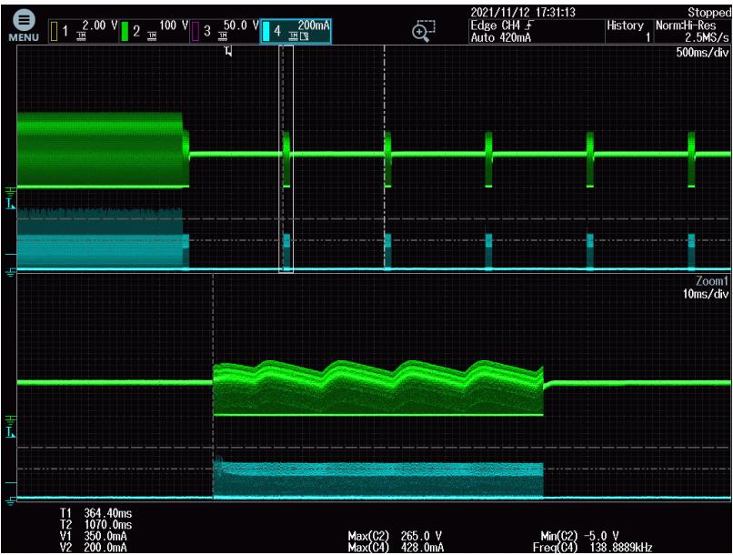

85 VAC  
265 VAC

CH1 VDS  
CH3 IDS

$$
V _ {D S \_ M A X} = 2 6 5 \mathrm{V}
$$

$$
I _ {D S \_ M A X} = 0. 4 2 8 \mathrm{A}
$$

## Test Condition:

➢ 5V-0.25A  
➢ 12V-0.2A

CH1 VDS

$$
V _ {D S \_ M A X} = 5 2 4. 8 \mathrm{V}
$$

$$
I _ {D S \_ M A X} = 0. 4 6 7 \mathrm{A}
$$

## Test Condition:

➢ 5V-0.25A  
➢ 12V-0.3A

## MOSFET


85 VAC  


Test Condition:

➢ 5V-0.25A  
➢ 12V-0.2A


85 VAC  


Test Condition:

➢ 5V-0.25A  
➢ 12V-0.2A


265 VAC  


Test Condition:

➢ 5V-0.25A  
➢ 12V-0.3A


265 VAC  


Test Condition:

➢ 5V-0.25A  
➢ 12V-0.3A

## 温升测试

BPA8604P

<table><tr><td rowspan="2">项目</td><td>85VAC</td><td>115VAC</td><td>230VAC</td><td>265VAC</td></tr><tr><td>温度(°C)</td><td>温度(°C)</td><td>温度(°C)</td><td>温度(°C)</td></tr><tr><td>环境温度</td><td>36.4</td><td>36.7</td><td>38.8</td><td>39.5</td></tr><tr><td>BPA8604P(IC1)</td><td>107.7</td><td>96.4</td><td>99.9</td><td>99.3</td></tr><tr><td>5V整流二极管(D7)</td><td>62.7</td><td>64.7</td><td>70.9</td><td>71.1</td></tr><tr><td>12V整流二极管(D6)</td><td>61.4</td><td>60.8</td><td>73.4</td><td>73.6</td></tr><tr><td>变压器绕组(T1)</td><td>63.2</td><td>63.2</td><td>72.8</td><td>73.2</td></tr><tr><td>变压器磁芯(T1)</td><td>606</td><td>60.9</td><td>70.5</td><td>70.8</td></tr><tr><td>输入电解电容(E2)</td><td>58.5</td><td>56.3</td><td>59.3</td><td>58.9</td></tr><tr><td>输出电解电容(E5)</td><td>47.4</td><td>47.9</td><td>51.9</td><td>52.1</td></tr></table>

LNK364P

<table><tr><td rowspan="2">项目</td><td>85VAC</td><td>115VAC</td><td>230VAC</td><td>265VAC</td></tr><tr><td>温度(°C)</td><td>温度(°C)</td><td>温度(°C)</td><td>温度(°C)</td></tr><tr><td>环境温度</td><td>35.6</td><td>35.6</td><td>35.5</td><td>36.4</td></tr><tr><td>LNK364P(IC1)</td><td>112.1</td><td>102.1</td><td>102.4</td><td>108.4</td></tr><tr><td>5V整流二极管(D7)</td><td>64.3</td><td>66.3</td><td>70.3</td><td>71.5</td></tr><tr><td>12V整流二极管(D6)</td><td>62.5</td><td>61.8</td><td>72.3</td><td>73.2</td></tr><tr><td>变压器绕组(T1)</td><td>66.6</td><td>66.5</td><td>73.6</td><td>75.2</td></tr><tr><td>变压器磁芯(T1)</td><td>64.4</td><td>64.7</td><td>71.9</td><td>73.4</td></tr><tr><td>输入电解电容(E2)</td><td>59.4</td><td>57.4</td><td>57.6</td><td>58.7</td></tr><tr><td>输出电解电容(E5)</td><td>48.1</td><td>48.6</td><td>50.4</td><td>51.1</td></tr></table>

## 备注：

85VAC 5V-0.2A 12V-0.16A  
115VAC 5V-0.25A 12V-0.16A  
230VAC 264VAC 5V-0.25A 12V-0.3A


115VAC Line


115VAC Neutral


115VAC Line  


115VAC Neutral


230VAC Line


230VAC Neutral


230VAC Line  


230VAC Neutral


115VAC Neutral  


230VAC Neutral


115VAC Neutral  


230VAC Neutral


## 待机功耗-改钳位前后对比


测试条件：带客户板上负载

## 效率-改钳位前后对比

效率曲线  


测试时未考虑客户板本身负载对效率的影响。

## MOSFET -


85 VAC

CH2 VDS  
CH4 IDS

$$
V _ {D S \_ M A X} = 2 7 1. 5 \mathrm{V}
$$

$$
I _ {D S \_ M A X} = 0. 5 5 2 \mathrm{A}
$$

## Test Condition:

➢ 5V-0.25A  
➢ 12V-0.2A


265 VAC

CH2 VDS  
CH4 IDS

$$
V _ {D S \_ M A X} = 5 2 8 \mathrm{V}
$$

$$
I _ {D S \_ M A X} = 0. 4 8 3 5 \mathrm{A}
$$

## Test Condition:

➢ 5V-0.25A  
➢ 12V-0.3A


85 VAC  
265 VAC

CH2 VDS  
CH4 IDS

$$
V _ {D S \_ M A X} = 2 8 8 \mathrm{V}
$$

$$
I _ {D S \_ M A X} = 0. 5 5 7 5 \mathrm{A}
$$

## Test Condition:

➢ 5V-0.25A  
➢ 12V-0.2A

CH2 VDS  
CH4 IDS

$$
V _ {D S \_ M A X} = 5 4 9 \mathrm{V}
$$

$$
I _ {D S \_ M A X} = 0. 4 7 4 5 \mathrm{A}
$$

## Test Condition:

➢ 5V-0.25A  
➢ 12V-0.3A

## MOSFET -


85 VAC

CH2 VDS  
CH4 IDS

$$
V _ {D S \_ M A X} = 2 6 9. 5 \mathrm{V}
$$

$$
I _ {D S \_ M A X} = 0. 4 9 7 \mathrm{A}
$$

## Test Condition:

➢ 5V-0.25A  
➢ 12V-0.2A

265 VAC

CH2 VDS  
CH4 IDS

$$
V _ {D S \_ M A X} = 5 2 8 \mathrm{V}
$$

$$
I _ {D S \_ M A X} = 0. 3 7 0 \mathrm{A}
$$

## Test Condition:

➢ 5V-0.25A  
➢ 12V-0.3A


85 VAC  
265 VAC

CH2 VDS  
CH4 IDS

$$
V _ {D S \_ M A X} = 2 8 8. 3 \mathrm{V}
$$

$$
I _ {D S \_ M A X} = 0. 4 1 5 5 \mathrm{A}
$$

## Test Condition:

➢ 5V-0.25A  
➢ 12V-0.2A

CH2 VDS  
CH4 IDS

$$
V _ {D S \_ M A X} = 5 4 9. 8 \mathrm{V}
$$

$$
I _ {D S \_ M A X} = 0. 4 0 2 5 \mathrm{A}
$$

## Test Condition:

➢ 5V-0.25A  
➢ 12V-0.3A

## 输出短路保护（MOSFET波形）-改钳位前后对


85 VAC

CH1 VDS  
CH3 IDS

$$
V _ {D S \_ M A X} = 2 6 8. 3 \mathrm{V}
$$

$$
I _ {D S \_ M A X} = 0. 4 5 4 \mathrm{A}
$$

## Test Condition:

➢ 5V-0.25A  
➢ 12V-0.2A


265 VAC

CH1 VDS  
CH3 IDS

$$
V _ {D S \_ M A X} = 5 2 8 \mathrm{V}
$$

$$
I _ {D S \_ M A X} = 0. 4 0 3 5 \mathrm{A}
$$

## Test Condition:

➢ 5V-0.25A  
➢ 12V-0.3A


85 VAC  
265 VAC

CH1 VDS  
CH3 IDS

$$
V _ {D S \_ M A X} = 2 8 8 \mathrm{V}
$$

$$
I _ {D S \_ M A X} = 0. 4 2 \mathrm{A}
$$

## Test Condition:

➢ 5V-0.25A  
➢ 12V-0.2A

CH1 VDS  
CH3 IDS

$$
V _ {D S \_ M A X} = 5 4 9. 5 \mathrm{V}
$$

$$
I _ {D S \_ M A X} = 0. 4 0 7 5 \mathrm{A}
$$

## Test Condition:

➢ 5V-0.25A  
➢ 12V-0.3A

## 温升测试-改钳位前后对比

BPA8604P

<table><tr><td rowspan="2">项目</td><td>85VAC</td><td>115VAC</td><td>230VAC</td><td>265VAC</td></tr><tr><td>温度(°C)</td><td>温度(°C)</td><td>温度(°C)</td><td>温度(°C)</td></tr><tr><td>环境温度</td><td>36.4</td><td>36.7</td><td>38.8</td><td>39.5</td></tr><tr><td>BPA8604P(IC1)</td><td>107.7</td><td>96.4</td><td>99.9</td><td>99.3</td></tr><tr><td>5V整流二极管(D7)</td><td>62.7</td><td>64.7</td><td>70.9</td><td>71.1</td></tr><tr><td>12V整流二极管(D6)</td><td>61.4</td><td>60.8</td><td>73.4</td><td>73.6</td></tr><tr><td>变压器绕组(T1)</td><td>63.2</td><td>63.2</td><td>72.8</td><td>73.2</td></tr><tr><td>变压器磁芯(T1)</td><td>606</td><td>60.9</td><td>70.5</td><td>70.8</td></tr><tr><td>输入电解电容(E2)</td><td>58.5</td><td>56.3</td><td>59.3</td><td>58.9</td></tr><tr><td>输出电解电容(E5)</td><td>47.4</td><td>47.9</td><td>51.9</td><td>52.1</td></tr></table>

## 备注：

85VAC 5V-0.2A 12V-0.16A  
115VAC 5V-0.25A 12V-0.16A  
◼ 230VAC 264VAC 5V-0.25A 12V-0.3A

BPA8604P改钳位

<table><tr><td rowspan="2">项目</td><td>85VAC</td><td>115VAC</td><td>230VAC</td><td>265VAC</td></tr><tr><td>温度(°C)</td><td>温度(°C)</td><td>温度(°C)</td><td>温度(°C)</td></tr><tr><td>环境温度</td><td>37.6</td><td>38.8</td><td>39.8</td><td>38.8</td></tr><tr><td>BPA8604P(IC1)</td><td>109</td><td>98.7</td><td>95</td><td>95.6</td></tr><tr><td>5V整流二极管(D7)</td><td>66.4</td><td>67.8</td><td>69.5</td><td>70</td></tr><tr><td>12V整流二极管(D6)</td><td>66</td><td>69.7</td><td>73.4</td><td>73.3</td></tr><tr><td>变压器绕组(T1)</td><td>67.4</td><td>69.7</td><td>73.1</td><td>73.5</td></tr><tr><td>变压器磁芯(T1)</td><td>65.2</td><td>67.7</td><td>71.5</td><td>72</td></tr><tr><td>输入电解电容(E2)</td><td>59.8</td><td>59.1</td><td>57.5</td><td>57.6</td></tr><tr><td>输出电解电容(E5)</td><td>49.6</td><td>51.1</td><td>51.8</td><td>52.2</td></tr></table>

## 备注：

85VAC 5V-0.25A 12V-0.2A  
115VAC 5V-0.25A 12V-0.25A  
230VAC 264VAC 5V-0.25A 12V-0.3A

BPA8604P Pin to Pin LNK364P  
空载功耗和效率

➢ BPA8604P 85VAC 115VAC LNK364P 230VAC 265VAC LNK364P

BPA8604P LNK364P  
BPA8604P LNK364P  
BPA8604P LNK364P EMI  
建议

C2 222 102 R3

更改后空载功耗降低6-10mW，各个电压点效率明显提高，芯片温升明显改善  
更改后芯片M0S电压提高20V左右，仍然有足够余量

D4 100V 300V

## THANK YOU FOR WATCHING
