## BPA8604P&PN8192对比测试 (5V/0.35A, 12V/0.2A @85\~265Vac)

上海晶丰明源半导体股份有限公司

Shanghai Bright Power Semiconductor Co., Ltd.

陈耀兵

2021 12 22

## 测试数据对比

电源规格：85\~265Vac输入， 5V/0.35A，12V/0.2A输出。

<table><tr><td colspan="2"></td><td>BPA8604P</td><td>PN8192</td><td></td></tr><tr><td colspan="2">待机功耗</td><td>260mW</td><td>252mW</td><td>230VAC</td></tr><tr><td rowspan="2">效率(满载整机)</td><td>115Vac</td><td>68.7%</td><td>68.24%</td><td>满载</td></tr><tr><td>230Vac</td><td>69.77%</td><td>69.26%</td><td>满载</td></tr><tr><td rowspan="2">输出电压纹波</td><td>85Vac</td><td>5V-34.28mV/12V-117.8mV</td><td>5V-29.2mV/12V-102.8mV</td><td>满载</td></tr><tr><td>265Vac</td><td>5V-24.15mV/12V-93.8mV</td><td>5V-32.6mV/12V-102.5mV</td><td>满载</td></tr><tr><td rowspan="2">动态负载性能(5V)</td><td>50%-100%</td><td> $60.8mV_{PK\_PK}$ </td><td> $123.4mV_{PK\_PK}$ </td><td>85VAC, 12V-0.2A</td></tr><tr><td>10%-90%</td><td> $213mV_{PK\_PK}$ </td><td> $785mV_{PK\_PK}$ </td><td>85VAC, 12V-0.2A</td></tr><tr><td rowspan="2">MOSFET应力</td><td> $V_{DS}$ </td><td>520.5V</td><td>519.3V</td><td>265VAC, 输出短路</td></tr><tr><td> $I_{DS}$ </td><td>0.449A</td><td>0.4425A</td><td>265VAC, 输出短路</td></tr><tr><td rowspan="2">二极管应力(5V输出)</td><td>VRR</td><td>75.93V</td><td>60.7V</td><td rowspan="2">265VAC, 输出短路</td></tr><tr><td> $I_{PK}$ </td><td>8.045A</td><td>7.68A</td></tr><tr><td rowspan="2">二极管应力(12V输出)</td><td>VRR</td><td>256V</td><td>198.5V</td><td rowspan="2">265VAC, 输出短路</td></tr><tr><td> $I_{PK}$ </td><td>4.398A</td><td>4.558A</td></tr><tr><td colspan="2">温升测试</td><td>71.8°C(环温36.4°C)</td><td>64.3°C(环温38.8°C)</td><td>85VAC, 5V-0.35A, 12V-0.2A</td></tr><tr><td colspan="2">传导EMI</td><td>无余量(详见测试波形)</td><td>无余量(详见测试波形)</td><td>230VAC, 5V-0.35A, 12V-0.2A</td></tr></table>

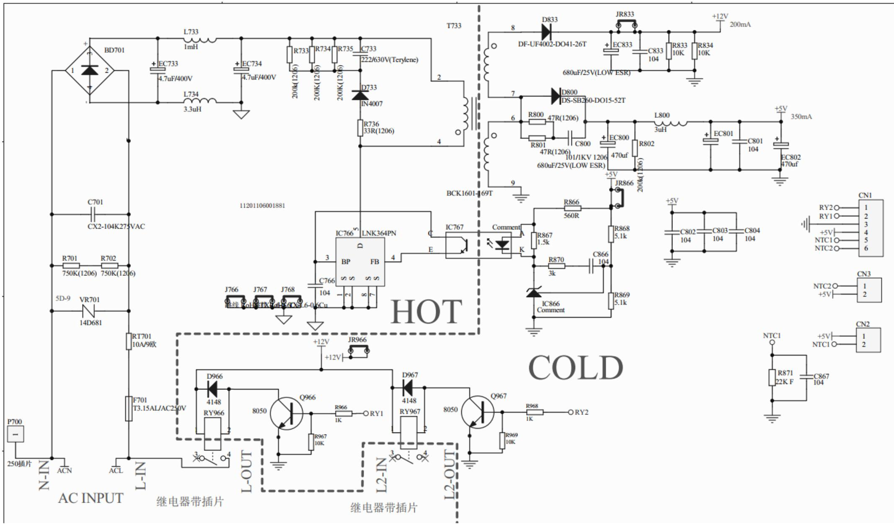

## 正面

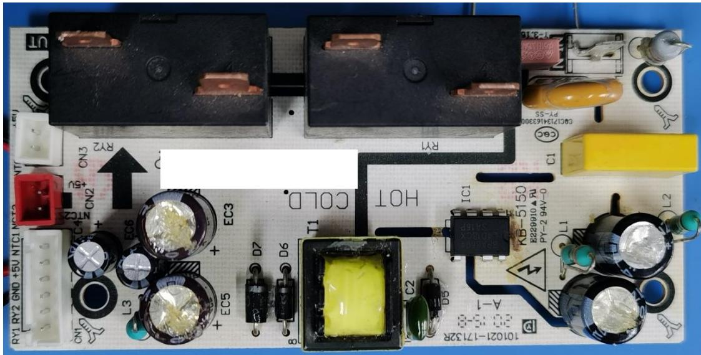

## 背面

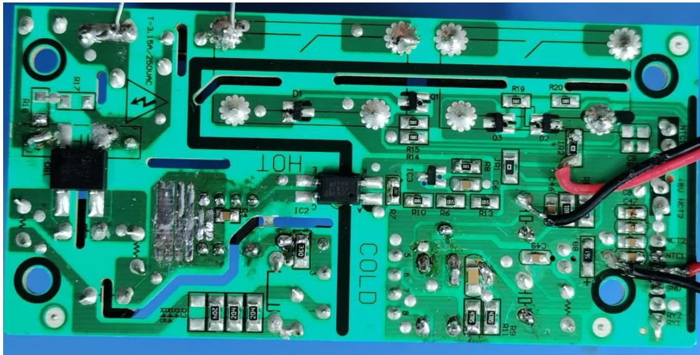

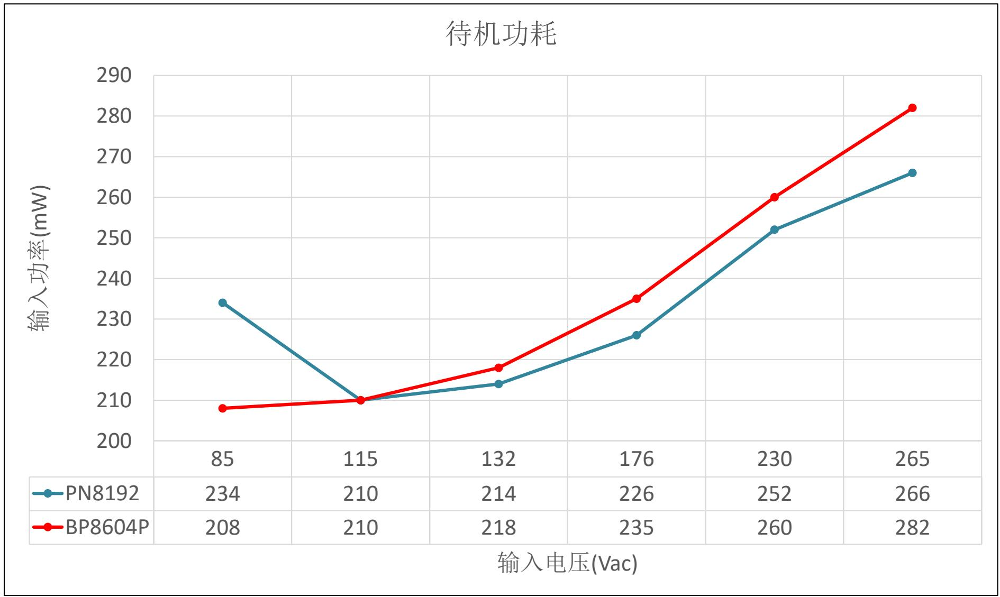

测试条件：带客户板上负载

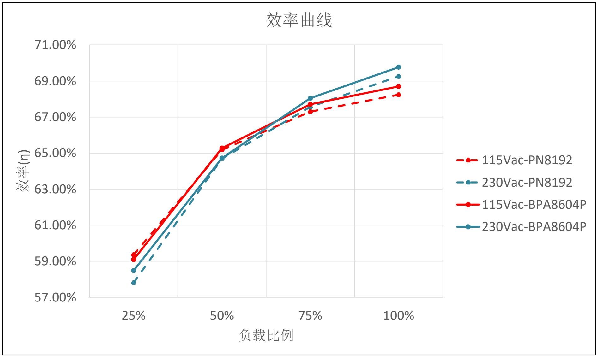

测试时未考虑客户板本身负载对效率的影响。

## 输出电压交叉调整率

BPA8604P

<table><tr><td> $V_{OUT}(V)$  $I_{OUT}(A)$ </td><td></td><td>5V</td><td>12V</td></tr><tr><td rowspan="4"> $I_{O\_5V}=0A$  $I_{O\_12V}=0A$ </td><td>85VAC</td><td>5.0093</td><td>12.219</td></tr><tr><td>115VAC</td><td>5.0092</td><td>12.198</td></tr><tr><td>230VAC</td><td>5.0093</td><td>12.225</td></tr><tr><td>265VAC</td><td>5.0093</td><td>12.237</td></tr><tr><td rowspan="4"> $I_{O\_5V}=0.25A$  $I_{O\_12V}=0A$ </td><td>85VAC</td><td>5.033</td><td>13.811</td></tr><tr><td>115VAC</td><td>5.0033</td><td>13.82</td></tr><tr><td>230VAC</td><td>5.0033</td><td>13.909</td></tr><tr><td>265VAC</td><td>5.0033</td><td>13.939</td></tr><tr><td rowspan="4"> $I_{O\_5V}=0.01A$  $I_{O\_12V}=0.3A$ </td><td>85VAC</td><td>5.0102</td><td>10.814</td></tr><tr><td>115VAC</td><td>5.01</td><td>10.823</td></tr><tr><td>230VAC</td><td>5.0096</td><td>10.806</td></tr><tr><td>265VAC</td><td>5.0096</td><td>10.79</td></tr><tr><td rowspan="4"> $I_{O\_5V}=0.25A$  $I_{O\_12V}=0.3A$ </td><td>85VAC</td><td>5.0044</td><td>12.284</td></tr><tr><td>115VAC</td><td>5.0038</td><td>12.266</td></tr><tr><td>230VAC</td><td>5.0035</td><td>12.277</td></tr><tr><td>265VAC</td><td>5.0036</td><td>12.285</td></tr></table>

测试条件：lo=0A为只带客户板上负载

PN8192

<table><tr><td> $V_{OUT}(V)$  $I_{OUT}(A)$ </td><td></td><td>5V</td><td>12V</td></tr><tr><td rowspan="4"> $I_{O\_5V}=0A$  $I_{O\_12V}=0A$ </td><td>85VAC</td><td>5.0088</td><td>12.183</td></tr><tr><td>115VAC</td><td>5.0088</td><td>12.16</td></tr><tr><td>230VAC</td><td>5.0088</td><td>12.208</td></tr><tr><td>265VAC</td><td>5.0088</td><td>12.224</td></tr><tr><td rowspan="4"> $I_{O\_5V}=0.35A$  $I_{O\_12V}=0A$ </td><td>85VAC</td><td>5.0028</td><td>13.676</td></tr><tr><td>115VAC</td><td>5.0029</td><td>13.705</td></tr><tr><td>230VAC</td><td>5.0029</td><td>13.854</td></tr><tr><td>265VAC</td><td>5.0029</td><td>13.9</td></tr><tr><td rowspan="4"> $I_{O\_5V}=0A$  $I_{O\_12V}=0.2A$ </td><td>85VAC</td><td>5.0097</td><td>10.902</td></tr><tr><td>115VAC</td><td>5.0093</td><td>10.902</td></tr><tr><td>230VAC</td><td>5.0091</td><td>10.844</td></tr><tr><td>265VAC</td><td>5.0091</td><td>10.822</td></tr><tr><td rowspan="4"> $I_{O\_5V}=0.35A$  $I_{O\_12V}=0.2A$ </td><td>85VAC</td><td>5.0038</td><td>12.242</td></tr><tr><td>115VAC</td><td>5.0032</td><td>12.23</td></tr><tr><td>230VAC</td><td>5.0032</td><td>12.261</td></tr><tr><td>265VAC</td><td>5.0032</td><td>12.273</td></tr></table>

测试条件：lo=0A为只带客户板上负载

## 输出电压纹波

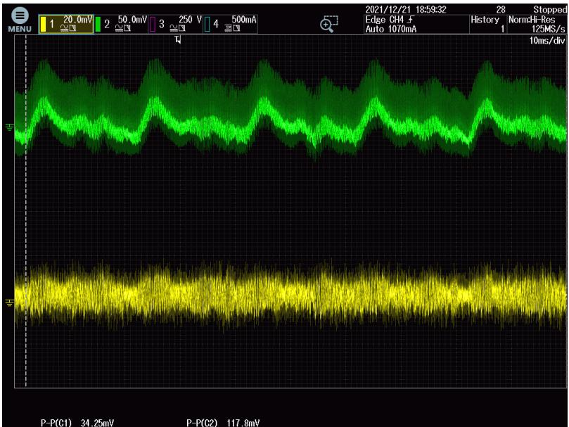

85 VAC

CH1 $\mathsf { V } _ { \mathsf { O U T } \_ 5 \mathsf { V } }$ Ripple $V _ { p | c - P K } = 3 4 . 2 5 m v$  
CH2 $\mathsf { V } _ { \mathsf { O U T } \_ 1 2 \mathsf { V } }$ Ripple $\mathsf { V } _ { \mathsf { P K - P K } } { = } 1 1 7 . 8 \mathsf { m V }$

## Test Condition:

➢ $5 \mathsf { V } { - } 0 . 3 5 \mathsf { A }$  
➢ $1 2 \mathsf { V } \mathsf { - } 0 . 2 \mathsf { A }$

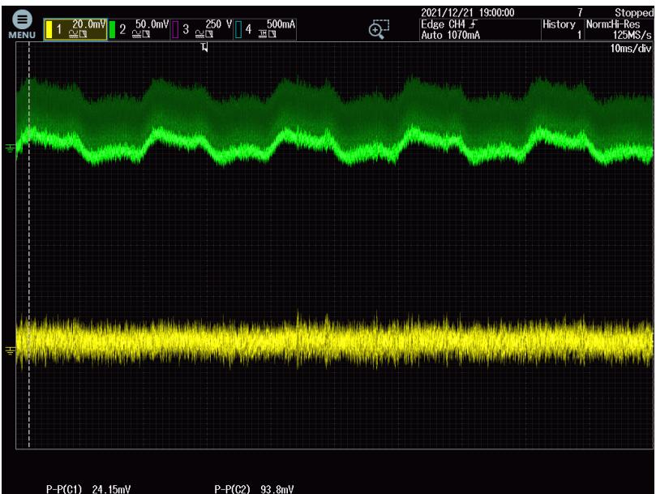

265 VAC

$\begin{array} { r l } & { \mathsf { C H 1 V _ { \mathsf { O U T \_ 5 V } } R i p p l e } } \\ & { \mathsf { V _ { P K - P K } } { = } 2 4 . 1 5 \mathsf { m V } } \end{array}$  
$\begin{array} { r l } & { \mathsf { C H 2 } \mathsf { V _ { O U T \_ 1 2 V } R i p p l e } } \\ & { \mathsf { V _ { P K - P K } } \mathsf { = 9 3 . 8 m V } } \end{array}$

## Test Condition:

➢ $5 \mathsf { V } \mathsf { - } 0 . 3 5 \mathsf { A }$  
➢ $1 2 \mathsf { V } \mathsf { - } 0 . 2 \mathsf { A }$

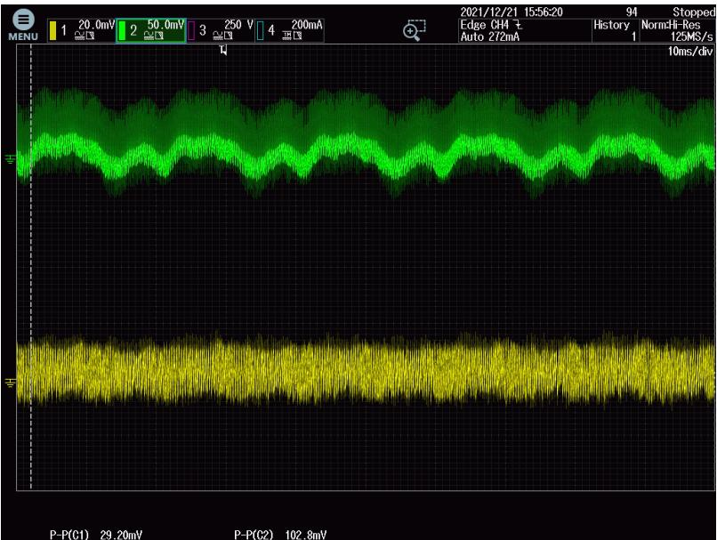

85 VAC

CH1 $\mathsf { V } _ { \mathsf { O U T } \_ 5 \mathsf { V } }$ Ripple $V _ { \mathsf { P K - P K } } { = } 2 9 . 2 \mathsf { m V }$  
CH2 $\mathsf { V } _ { \mathsf { O U T } \_ 1 2 \mathsf { V } }$ Ripple $\mathsf { V } _ { \mathsf { P K - P K } } { = } 1 0 2 . 8 \mathsf { m V }$

## Test Condition:

➢ $5 \mathsf { V } { - } 0 . 3 5 \mathsf { A }$  
➢ $1 2 \mathsf { V } \mathsf { - } 0 . 2 \mathsf { A }$

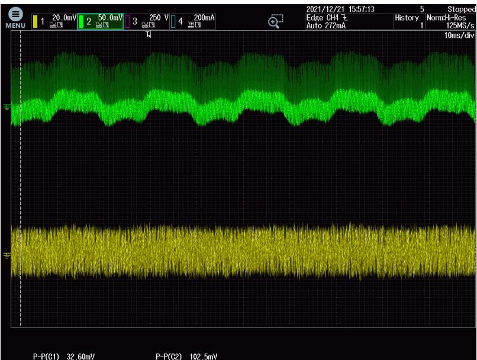

265 VAC

CH1 $\mathsf { V } _ { \mathsf { O U T } \_ 5 \mathsf { V } }$ Ripple $V _ { p | k \mathrm { - } P | k } = 3 2 . 6 m v$  
$\mathsf { C H } 2 \mathsf { V } _ { 0 \sqcup \mathsf { T } \_ 1 2 \vee } \mathsf { R i p p l e }$ $V _ { \mathsf { P K - P K } } { = } 1 0 2 . 5 \mathsf { m V }$

## Test Condition:

➢ $5 \mathsf { V } { - } 0 . 3 5 \mathsf { A }$  
➢ $1 2 \mathsf { V } \mathsf { - } 0 . 2 \mathsf { A }$

## (50%-100%)

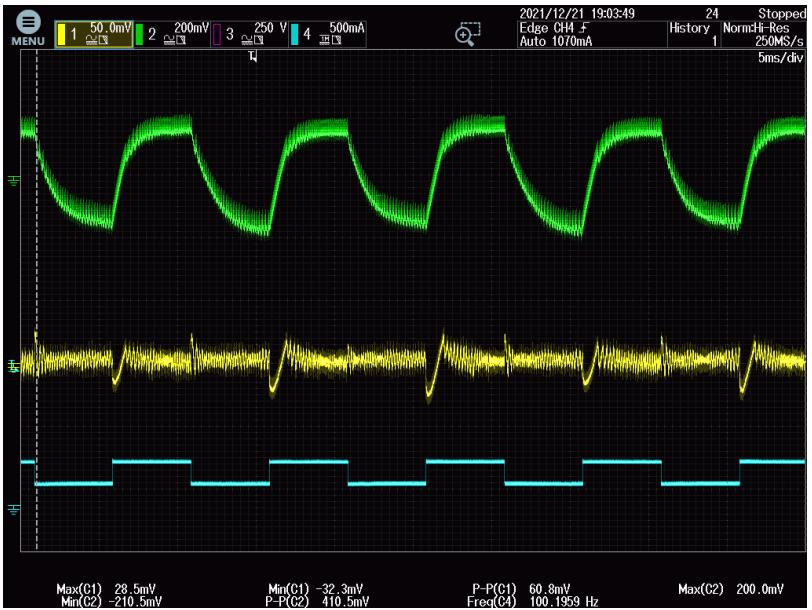

85 VAC

$\begin{array} { r l } & { \mathsf { C H 1 V _ { 0 \mathsf { U T } } } _ { \mathsf { 5 V } } } \\ & { \mathsf { V _ { P K - P K } } \equiv 6 0 . 8 \mathsf { m V } } \end{array}$  
$\begin{array} { r l } & { \mathbb { C } \mathbb { H } 2 \vee _ { \mathsf { O U T } } \underline { { 1 2 } } \vee } \\ & { \mathsf { V } _ { \mathsf { P K - P K } } = 4 \mathbb { 1 } 0 . 5 \mathsf { m v } } \end{array}$  
CH4 IOUT\_5V $\mathsf { I } _ { \mathsf { O U T } \_ 5 \mathsf { V } }$

## Test Condition:

➢ 5V: 0.175A-0.35A-0.175A  
➢ 12V: 0.2A  
➢ Slew Rate: 0.5 A/μS  
➢ Frequency: 100 Hz

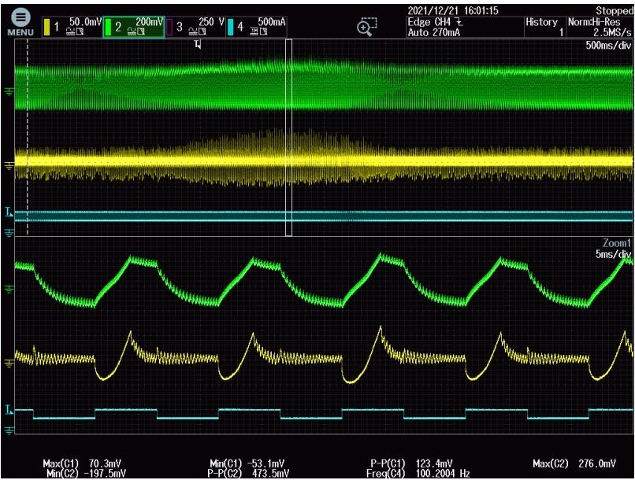

85 VAC

$\begin{array} { r l } & { \mathsf { C H 1 V } _ { \mathsf { O U T } \cdot \mathsf { S V } } } \\ & { \mathsf { V } _ { \mathsf { P K - P K } } \equiv \pm \frac { 1 2 3 . 4 \mathsf { m v } } { 2 3 . 4 \mathsf { m v } } } \end{array}$  
CH2 V $V _ { P K - P K } = 4 7 3 . 5 m v$  
CH4 IOUT\_5V

## Test Condition:

➢ 5V: 0.175A-0.35A-0.175A  
➢ $1 2 \mathsf { V } \colon 0 . 2 \mathsf { A }$  
➢ Slew Rate: 0.5 A/μS  
➢ Frequency: 100 Hz

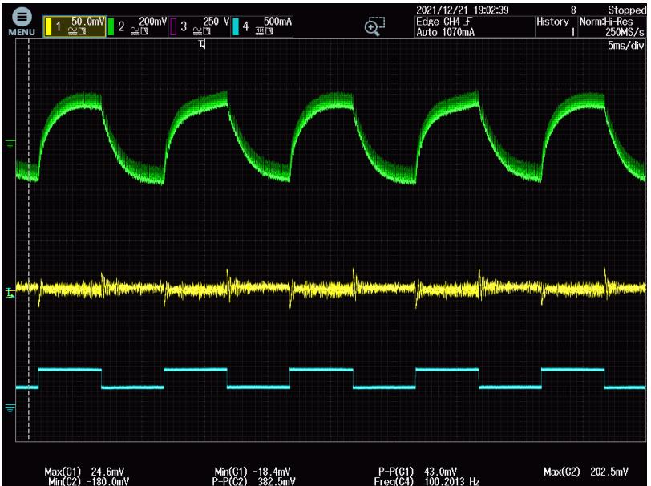

265 VAC

$\begin{array} { r l } & { \mathsf { C H 1 V } _ { \mathsf { O U T } \hphantom { \mathsf { G } } } 5 \mathsf { v } } \\ & { \mathsf { V } _ { \mathsf { P K - P K } } \equiv 4 3 \mathsf { m v } } \end{array}$  
$\begin{array} { r l } & { \mathsf { C H 2 } \mathsf { V _ { 0 \sqcup T \_ 1 2 \vee } } } \\ & { \mathsf { V _ { P K \cdot P K } } \equiv 3 8 2 . 5 \mathsf { m v } } \end{array}$  
CH4 IOUT\_5V $\mathsf { I } _ { 0 \cup \mathsf { T } _ { - } 5 \mathsf { V } }$

## Test Condition:

➢ 5V: 0.175A-0.35A-0.175A  
➢ 12V: 0.2A  
➢ Slew Rate: 0.5 A/μS  
➢ Frequency: 100 Hz

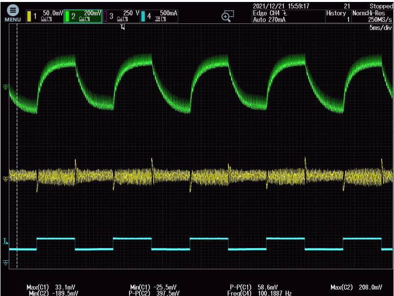

265 VAC

$\begin{array} { r l } & { \mathsf { C H 1 V _ { O U T } } . 5 \mathsf { V } } \\ & { \mathsf { V _ { P K - P K } } . = 5 8 . 6 \mathsf { m v } } \end{array}$  
$\begin{array} { r l } & { \mathbb { C } \mathbb { H } 2 \ \vee _ { \mathsf { O } \mathbb { U } \mathbb { T } } \mathbb { 1 } 2 \vee } \\ & { \mathbb { V } _ { \mathsf { P K - P K } } = 3 \mathbb { g } \mathbb { 7 } . 5 \mathsf { m v } } \end{array}$  
CH4 IOUT\_5V

## Test Condition:

➢ 5V: 0.175A-0.35A-0.175A  
➢ 12V: 0.2A  
➢ Slew Rate: 0.5 A/μS  
➢ Frequency: 100 Hz

## (10%-90%)

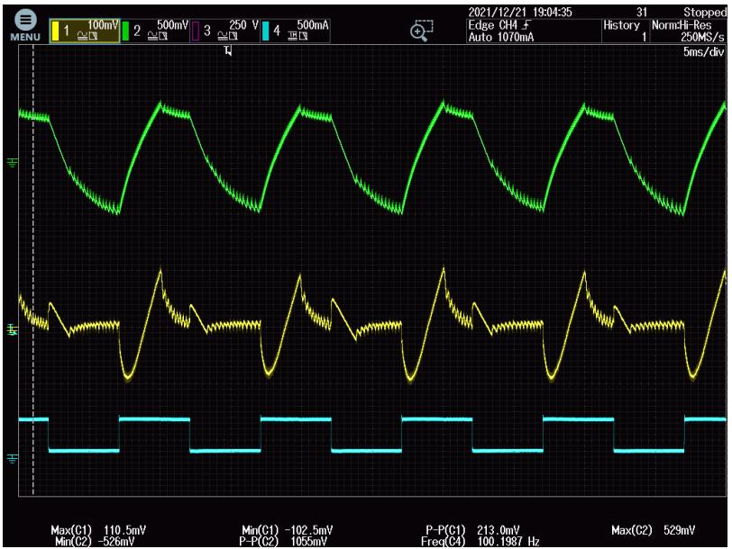

85 VAC

CH1 V OUT\_5V VPK-PK= 213 mV  
$\begin{array} { r l } & { \mathsf { C H 2 } \mathsf { V _ { O U T } } } \\ & { \mathsf { V _ { P K - P K } } \mathsf { = 1 0 5 5 } \mathsf { m v } } \end{array}$  
CH4 IOUT\_5V $\mathsf { I } _ { \mathsf { O U T } \_ 5 \mathsf { V } }$

## Test Condition:

➢ 5V: 0.035A-0.315A-0.035A  
➢ 12V: 0.2A  
➢ Slew Rate: 0.5 A/μS  
➢ Frequency: 100 Hz

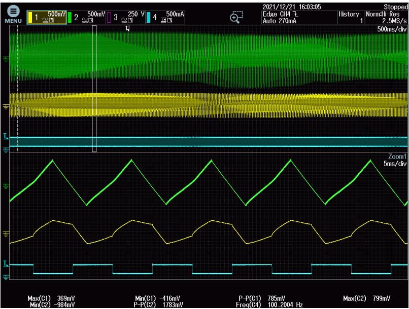

85 VAC

$\mathtt { C H 1 V _ { 0 \downarrow \mathtt { N } } } _ { \mathtt { V } _ { \mathtt { P K } \mathtt { P K } } = 7 8 5 \mathtt { m v } }$  
$\begin{array} { r l } & { \mathsf { C H } 2 \mathsf { V } _ { \mathsf { O U T } } } \\ & { \mathsf { V } _ { \mathsf { P K } \cdot \mathsf { P K } } = 1 7 8 3 \mathsf { m V } } \end{array}$  
CH4 IOUT\_5V

## Test Condition:

➢ 5V: 0.035A-0.315A-0.035A  
➢ $1 2 \mathsf { V } \colon 0 . 2 \mathsf { A }$  
➢ Slew Rate: 0.5 A/μS  
➢ Frequency: 100 Hz

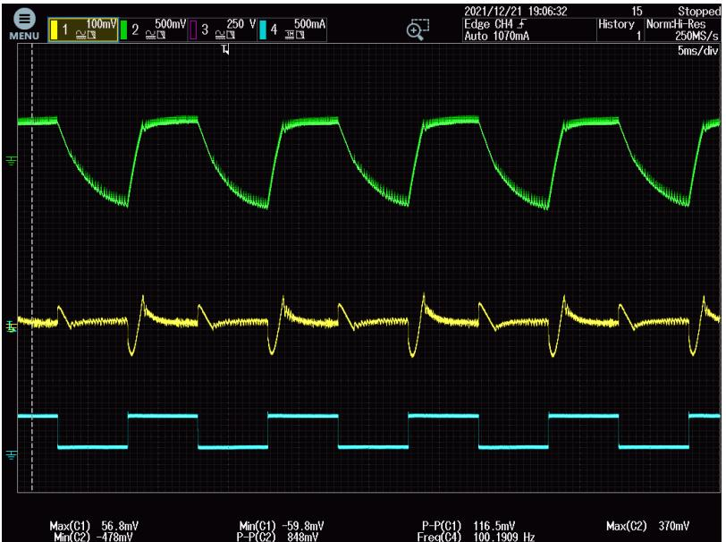

265 VAC

$\begin{array} { r l } & { \mathsf { C H 1 V } _ { \mathsf { O U T } \cdot 5 \mathsf { V } } } \\ & { \mathsf { V } _ { \mathsf { P K - P K } } \equiv \pm \underline { { 1 } } \bar { \mathbf { 1 6 } } . 5 \mathsf { m v } } \end{array}$  
$\mathtt { C H 2 } \mathtt { V _ { 0 \sqcup T } } _ { \mathtt { V _ { P K } } = 8 4 8 \operatorname* { m V } }$  
CH4 IOUT\_5V $\mathsf { I } _ { 0 \cup \mathsf { T } _ { - } 5 \mathsf { V } }$

## Test Condition:

➢ 5V: 0.035A-0.315A-0.035A  
➢ 12V: 0.2A  
➢ Slew Rate: 0.5 A/μS  
➢ Frequency: 100 Hz

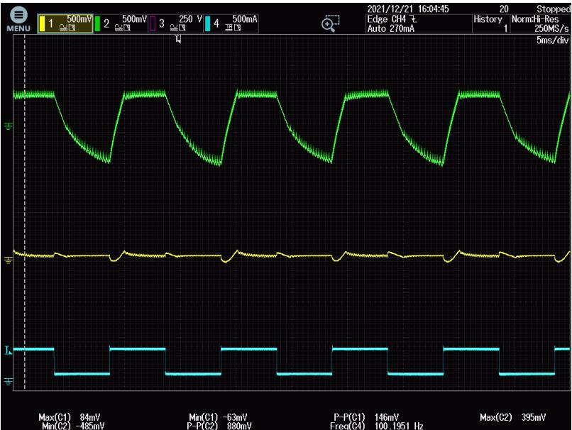

265 VAC

$\begin{array} { r l } & { \mathsf { C H 1 V } _ { \mathsf { O U T } } \mathsf { 5 V } } \\ & { \mathsf { V } _ { \mathsf { P K - P K } } \equiv \mathsf { 1 4 6 m V } } \end{array}$  
$\begin{array} { r l } & { \mathsf { C H 2 } \mathsf { V _ { O U T } } } \\ & { \mathsf { V _ { P K - P K } } \mathsf { = } 8 8 0 \mathsf { m V } } \end{array}$  
CH4 IOUT\_5V $\mathsf { C H } 4 \mathsf { I } _ { 0 \mathsf { U T } \_ 5 \mathsf { V } }$

## Test Condition:

➢ 5V: 0.035A-0.315A-0.035A  
➢ 12V: 0.2A  
➢ Slew Rate: 0.5 A/μS  
➢ Frequency: 100 Hz

## (0%-100%)

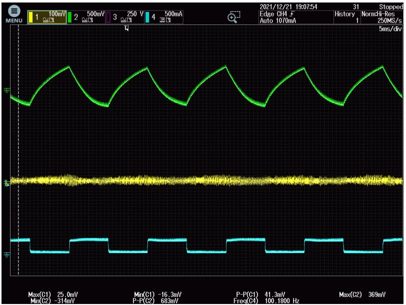

85 VAC

$\begin{array} { r l } {  { \mathbb { C } \mathsf { H } 1 \vee _ { \mathsf { O U T } \cdot 5 \vee } } } & { { } } \\ { \mathsf { V } _ { \mathsf { P K - P K } } = 4 \underline { { \mathbb { 1 } } } . 3 \mathsf { m v } } \end{array}$  
$\begin{array} { r l } & { \mathsf { C H } 2 \mathsf { V } _ { \mathsf { O U T } } } \\ & { \mathsf { V } _ { \mathsf { P K } \to \mathsf { P K } } = 6 8 3 \mathsf { m V } } \end{array}$  
CH4 IOUT\_12V $\mathsf { I } _ { \mathsf { O U T } _ { - } 1 2 \mathsf { V } }$

## Test Condition:

➢ $1 2 \mathsf { V } \colon 0 \mathsf { A } \mathtt { - } 0 . 2 \mathsf { A } \mathtt { - } 0 \mathsf { A }$  
➢ 5V: 0.35A  
➢ Slew Rate: 0.5 A/μS  
➢ Frequency: 100 Hz

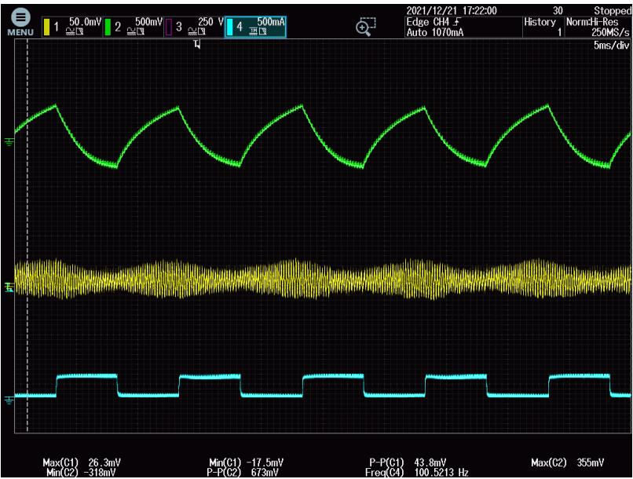

85 VAC

$\begin{array} { l } { \mathsf { C H 1 V _ { O U T } } . 5 \mathsf { V } } \\ { \mathsf { V _ { P K - P K } } \equiv 4 3 . 8 \mathsf { m V } } \end{array}$  
CH2 V V = 673 mV  
CH4 IOUT\_12V $\mathsf { C H } 4 \mathsf { I } _ { \mathsf { O U T } _ { - } 1 2 \mathsf { V } }$

## Test Condition:

➢ $1 2 \mathsf { V } \colon 0 \mathsf { A } \mathtt { - } 0 . 2 \mathsf { A } \mathtt { - } 0 \mathsf { A }$  
➢ $5 V \colon 0 . 3 5 \mathsf { A }$  
➢ Slew Rate: 0.5 A/μS  
➢ Frequency: 100 Hz

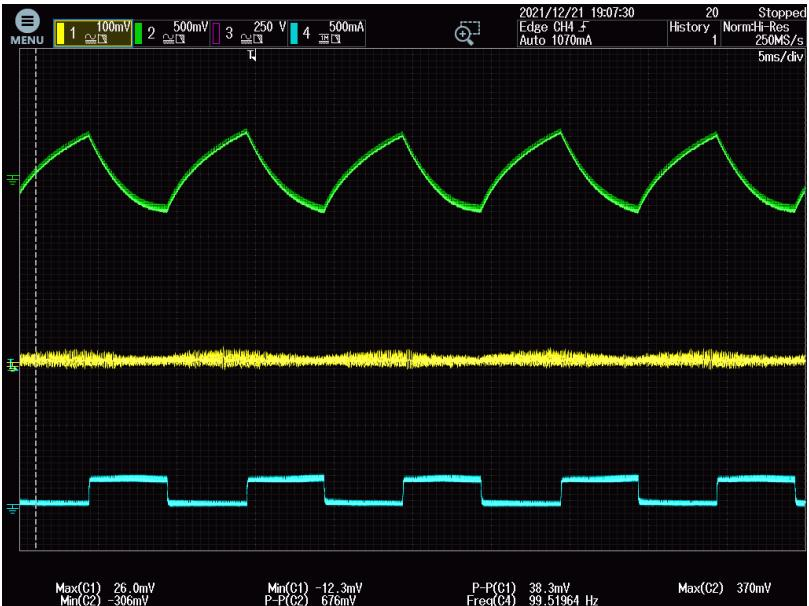

265 VAC

$\begin{array} { r l } & { \mathsf { C H 1 } \mathsf { V _ { 0 } } \mathsf { \Pi } _ { \mathsf { V } _ { 0 } \mathsf { U T } } \mathsf { 5 } \mathsf { v } } \\ & { \mathsf { V } _ { \mathsf { P K - P K } } \mathsf { = } 3 8 . 3 \mathsf { m v } } \end{array}$  
$\mathtt { C H 2 } \mathtt { V _ { 0 \sqcup T } } _ { \mathtt { V _ { P K } } = 6 7 6 \mathtt { m V } }$  
CH4 IOUT\_12V $\mathsf { I } _ { \mathsf { O U T } _ { - } 1 2 \mathsf { V } }$

## Test Condition:

➢ $1 2 \mathsf { V } \colon 0 \mathsf { A } \mathtt { - } 0 . 2 \mathsf { A } \mathtt { - } 0 \mathsf { A }$  
➢ 5V: 0.35A  
➢ Slew Rate: 0.5 A/μS  
➢ Frequency: 100 Hz

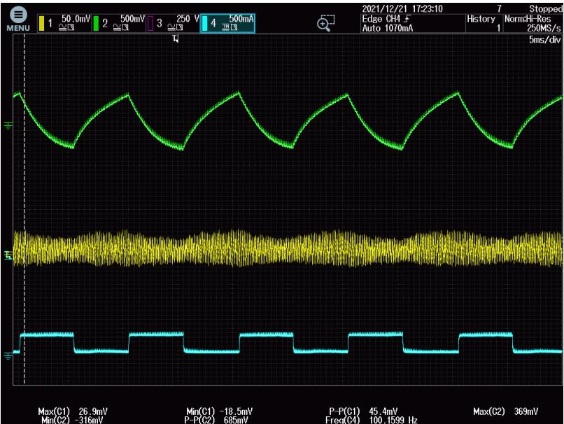

265 VAC

$\begin{array} { r l } & { \mathsf { C H 1 V _ { O U T } } . 5 \mathsf { V } } \\ & { \mathsf { V _ { P K - P K } } . = 4 5 . 4 \mathsf { m v } } \end{array}$  
$\begin{array} { r l } & { \mathsf { C H 2 } \mathsf { V _ { O U T } } } \\ & { \mathsf { V _ { P K - P K } } \mathsf { = } 6 8 5 \mathsf { m v } } \end{array}$  
CH4 IOUT\_12V $\mathsf { C H } 4 \mathsf { I } _ { 0 \mathsf { U T } _ { - } 1 2 \mathsf { V } }$

## Test Condition:

➢ $1 2 \mathsf { V } \colon 0 \mathsf { A } \mathtt { - } 0 . 2 \mathsf { A } \mathtt { - } 0 \mathsf { A }$  
➢ $5 V \colon 0 . 3 5 \mathsf { A }$  
➢ Slew Rate: 0.5 A/μS  
➢ Frequency: 100 Hz

## 输出电压开机波形

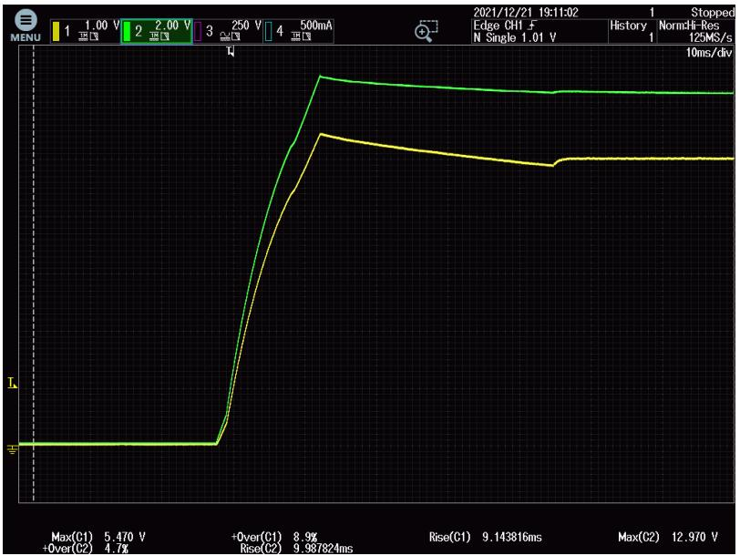

85 VAC

$\begin{array} { r } { \mathsf { C H 1 V _ { 0 \cup \mathsf { T } \_ 5 \vee } } } \\ { \mathsf { t } _ { \mathsf { r i s e } } { = } \mathsf { 9 } . 1 \mathsf { m s } } \end{array}$ CH1 VOUT\_5V  
$\begin{array} { r l } & { \mathsf { C H 2 } \mathsf { V _ { 0 \cup \mathsf { T } \_ 1 2 \vee } } } \\ & { \mathsf { t } _ { \mathsf { r i s e } } \mathsf { = 9 . 9 9 ~ m S } } \end{array}$ CH2 V

## Test Condition:

➢ 5V-0A  
➢ 12V-0A

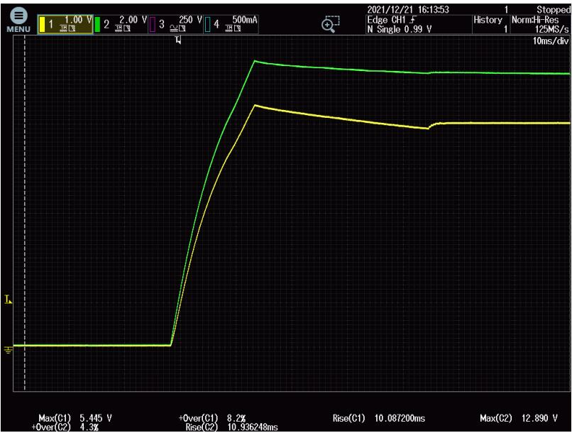

85 VAC

$\begin{array} { l } { \mathsf { C H 1 V _ { 0 \cup \mathsf { T } \_ 5 \vee } } } \\ { \displaystyle \mathfrak { t } _ { \mathsf { r i s e } } = 1 0 . 0 8 \mathsf { m s } } \end{array}$ CH1 VOUT\_5V  
$\begin{array} { l l } { { \mathbb { C } } { \mathbb { H } } 2 { \mathbb { V } } _ { 0 \cup \mathbb { T } \_ 1 2 \vee } } \\ { { \mathbb { t } } _ { r \mathrm { i } s \mathrm { e } } { = } 1 0 . 9 4 \mathrm { m s } } \end{array}$ CH2 VOUT\_12V

## Test Condition:

➢ 5V-0A  
➢ 12V-0A

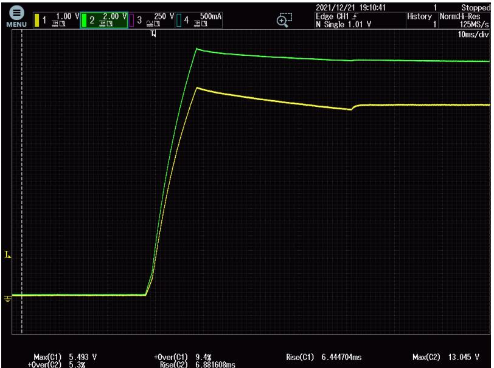

265 VAC

$\begin{array} { l } { \mathsf { C H 1 V _ { 0 \cup \mathsf { T } \_ 5 \vee } } } \\ { \displaystyle \mathbf { t } _ { \mathsf { r i s e } } = 6 . 4 4 \mathsf { m s } } \end{array}$ CH1 VOUT\_5V  
CH2 V t = 6.88 mS

## Test Condition:

➢ 5V-0A  
➢ 12V-0A

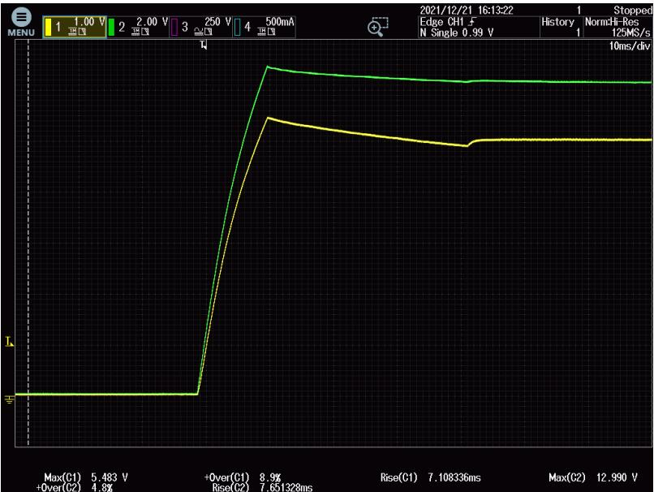

265 VAC

$\begin{array} { l } { \mathsf { C H 1 V _ { 0 \cup \mathsf { T } _ { - } 5 \vee } } } \\ { \displaystyle \mathfrak { t } _ { \mathsf { r i s e } } = 7 . 1 1 \mathsf { m s } } \end{array}$ CH1 VOUT\_5V  
$\begin{array} { r l } & { \mathsf { C H 2 } \mathsf { V _ { 0 \cup \mathsf { T } \_ 1 2 \vee } } } \\ & { \mathsf { t } _ { \mathsf { r i s e } } \mathsf { = 7 . 6 5 ~ m s } } \end{array}$ CH2 V

## Test Condition:

➢ 5V-0A  
➢ 12V-0A

## 输出电压开机波形

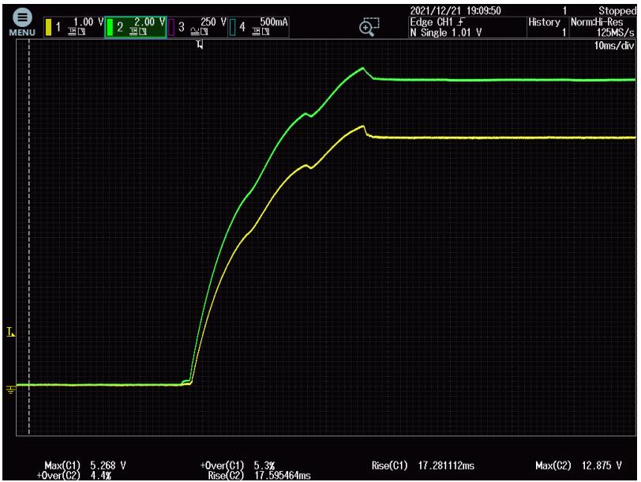

85 VAC

CH1 VOUT\_5V t = 17.28 mS  
CH2 V t = 17.6 mS

## Test Condition:

➢ 5V-0.35A  
➢ 12V-0.2A

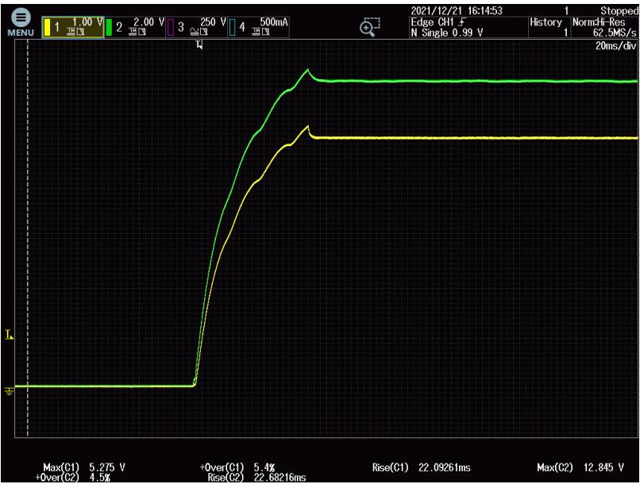

85 VAC

CH1 VOUT\_5V t = 22.09 mS  
$\begin{array} { r l } & { \mathsf { C H 2 } \mathsf { V _ { 0 \cup \mathsf { T _ { - } 1 2 V } } } } \\ & { \mathsf { t _ { r i s e } } = 2 2 . 6 8 \mathsf { m s } } \end{array}$ CH2 VOUT\_12V

## Test Condition:

➢ 5V-0.35A  
➢ 12V-0.2A

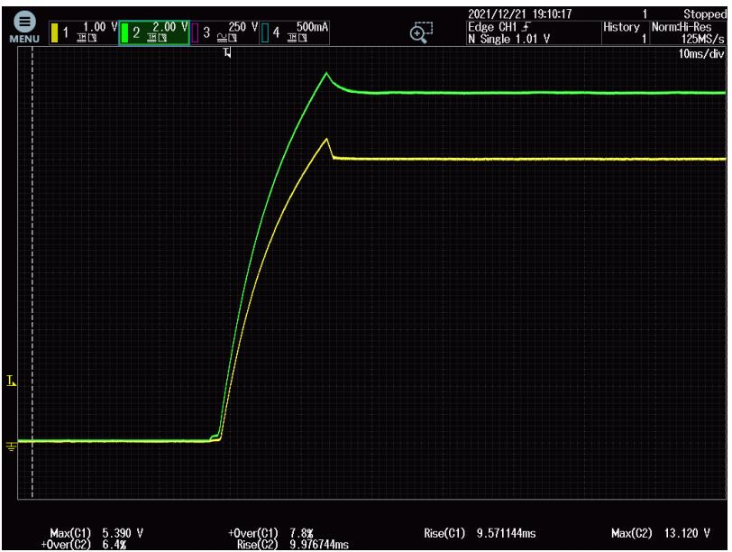

265 VAC

CH1 VOUT\_5V t = 9.57 mS  
CH2 V t = 9.98 mS

## Test Condition:

➢ 5V-0.35A  
➢ 12V-0.2A

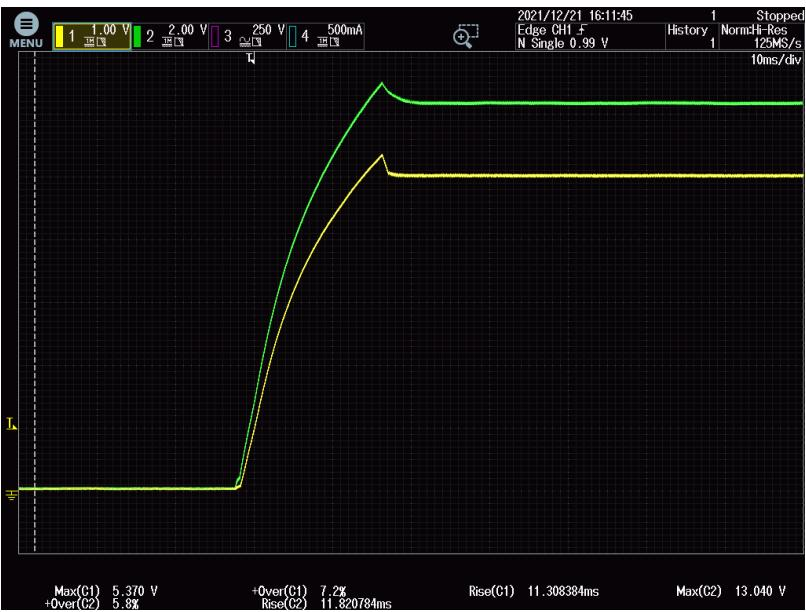

265 VAC

CH1 VOUT\_5V t = 11.31 mS  
CH2 V t = 11.82 mS

## Test Condition:

➢ 5V-0.35A  
➢ 12V-0.2A

## MOSFET

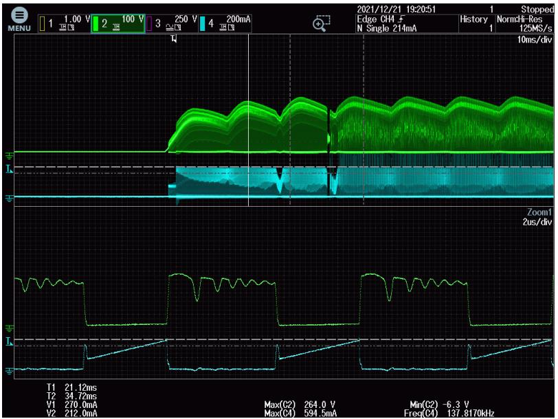

85 VAC  
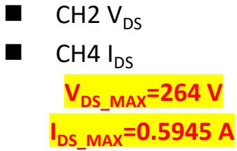

Test Condition:

➢ 5V-0.35A  
➢ 12V-0.2A

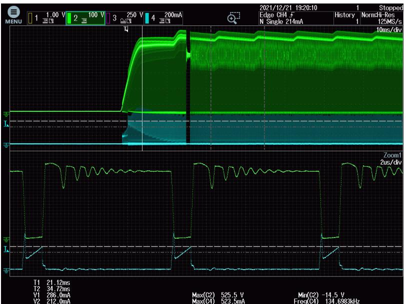

265 VAC

CH2 VDS  
CH4 IDS

$$
V _ {D S \_ M A X} = 5 2 5. 5 \mathrm{V}
$$

$$
I _ {D S \_ M A X} = 0. 5 2 3 5 \mathrm{A}
$$

➢ 5V-0.35A  
➢ 12V-0.2A

Test Condition:  
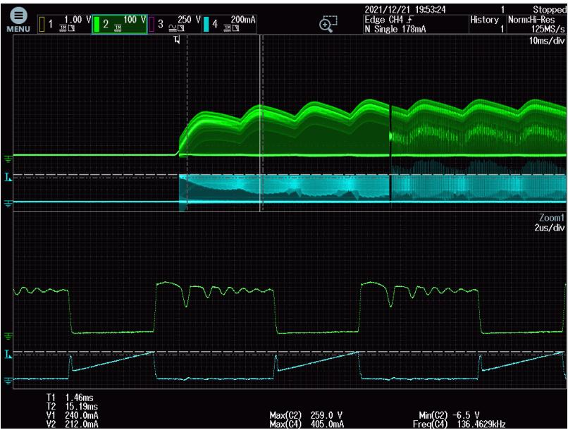

85 VAC  
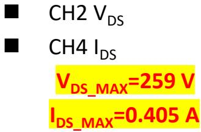

Test Condition:

➢ 5V-0.35A  
➢ 12V-0.2A

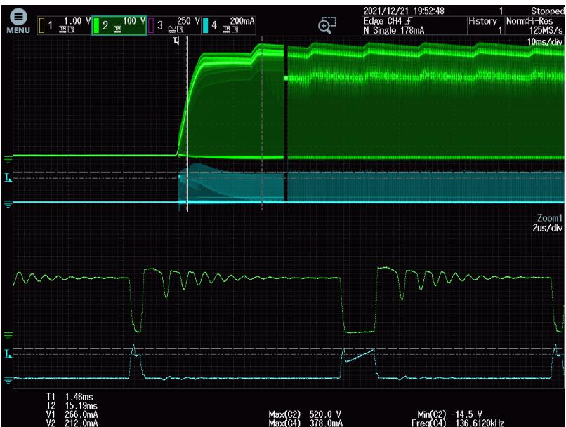

265 VAC

CH2 VDS  
CH4 IDS

$$
\begin{array}{l} \mathrm {V_ {DS\_MAX}} = 5 2 0 \mathrm{V} \\ \mathrm {I_ {DS\_MAX}} = 0. 3 7 8 \mathrm{A} \end{array}
$$

Test Condition:

➢ 5V-0.35A  
➢ 12V-0.2A

## MOSFET

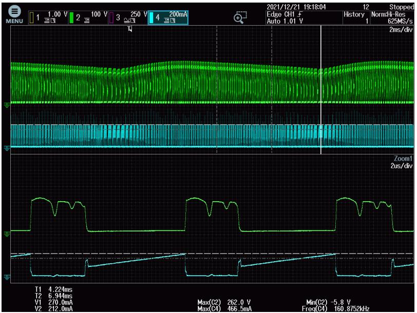

85 VAC

CH2 VDS  
CH4 IDS

$$
V _ {D S \_ M A X} = 2 6 2 \mathrm{V}
$$

$$
I _ {D S \_ M A X} = 0. 4 6 6 5 \mathrm{A}
$$

## Test Condition:

➢ 5V-0.35A  
➢ 12V-0.2A

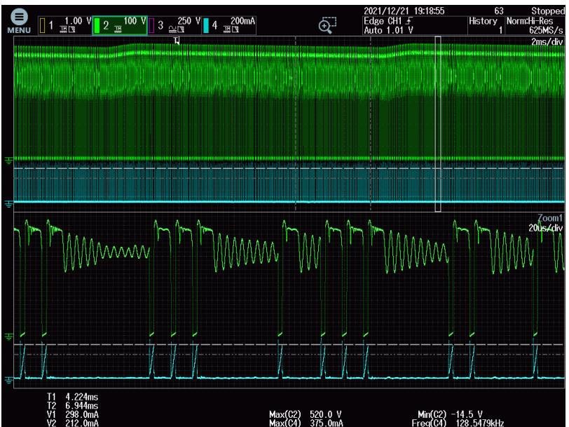

265 VAC

CH2 VDS  
CH4 IDS

$$
V _ {D S \_ M A X} = 5 2 0 \mathrm{V}
$$

$$
I _ {D S \_ M A X} = 0. 3 7 5 \mathrm{A}
$$

## Test Condition:

➢ 5V-0.35A  
➢ 12V-0.2A

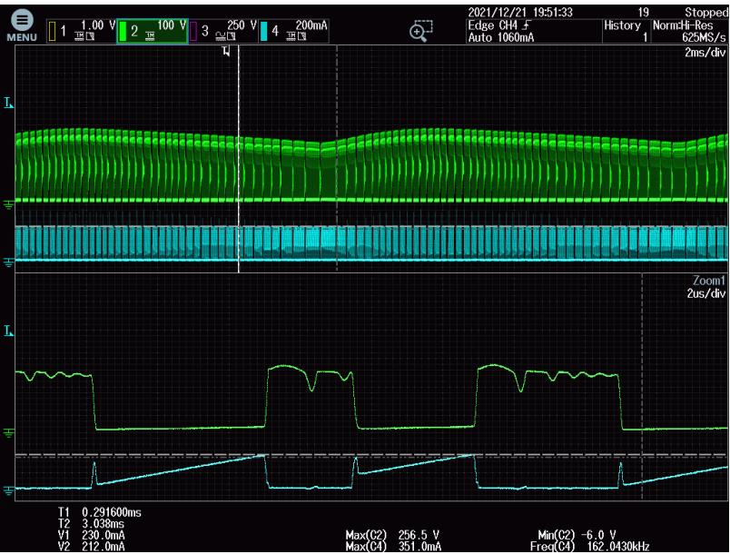

85 VAC  
265 VAC

CH2 VDS  
CH4 IDS

$$
V _ {D S \_ M A X} = 2 5 6. 5 \mathrm{V}
$$

$$
I _ {D S \_ M A X} = 0. 3 5 1 \mathrm{A}
$$

## Test Condition:

➢ 5V-0.35A  
➢ 12V-0.2A

CH2 VDS  
CH4 IDS

$$
V _ {D S \_ M A X} = 5 2 0 \mathrm{V}
$$

$$
I _ {D S \_ M A X} = 0. 2 7 9 5 \mathrm{A}
$$

## Test Condition:

➢ 5V-0.35A  
➢ 12V-0.2A

## 输出二极管D800开机波形

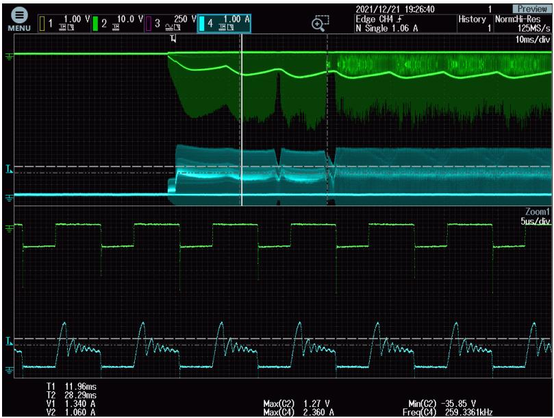

85 VAC

CH2 VR\_5V  
CH4 IF\_5V

$$
V _ {R - 5 V \_ M A X} = 3 5. 8 5 \mathrm{V}
$$

$$
I _ {F - 5 V \_ M A X} = 2. 3 6 \mathrm{A}
$$

## Test Condition:

➢ 5V-0.35A  
➢ 12V-0.2A

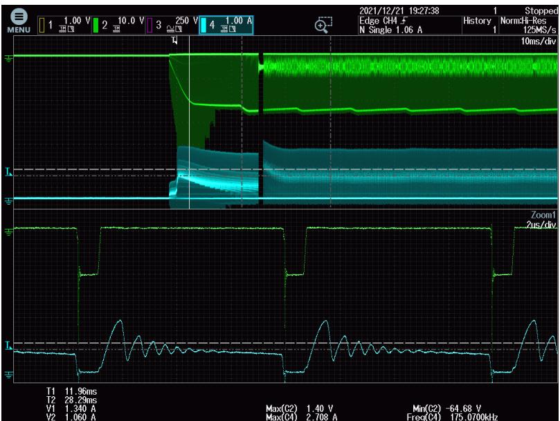

265 VAC

CH2 VR\_5V  
CH4 IF\_5V

$$
V _ {R - 5 V \_ M A X} = 6 4. 6 8 \mathrm{V}
$$

$$
I _ {F - 5 V \_ M A X} = 2. 7 0 8 \mathrm{A}
$$

## Test Condition:

➢ 5V-0.35A  
➢ 12V-0.2A

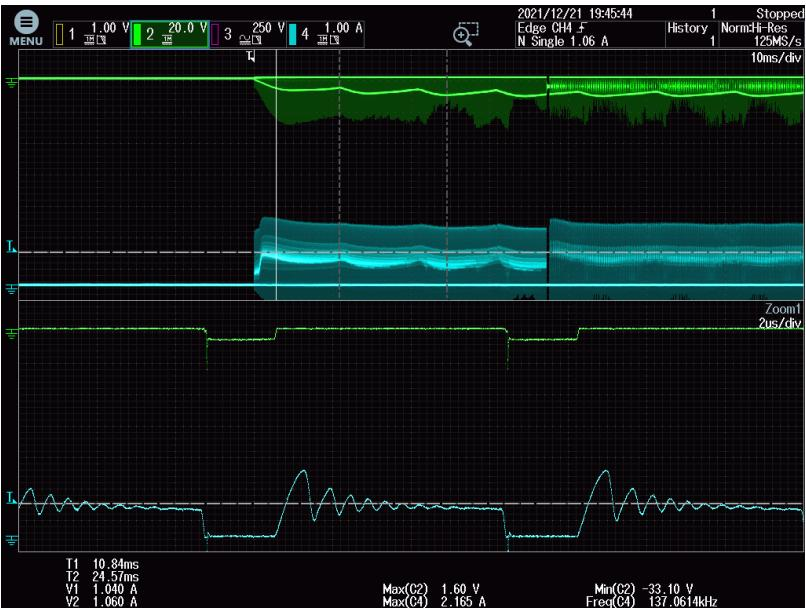

85 VAC  
265 VAC

CH2 VR\_5V  
CH4 IF\_5V

$$
V _ {R - 5 V \_ M A X} = 3 3. 1 \mathrm{V}
$$

$$
I _ {F - 5 V \_ M A X} = 2. 1 6 5 \mathrm{A}
$$

## Test Condition:

➢ 5V-0.35A  
➢ 12V-0.2A

CH2 VR\_5V  
CH4 IF\_5V

$$
V _ {R - 5 V \_ M A X} = 5 2. 4 \mathrm{V}
$$

$$
I _ {F - 5 V \_ M A X} = 2. 4 5 8 \mathrm{A}
$$

## Test Condition:

➢ 5V-0.35A  
➢ 12V-0.2A

## 输出二极管D800稳态波形

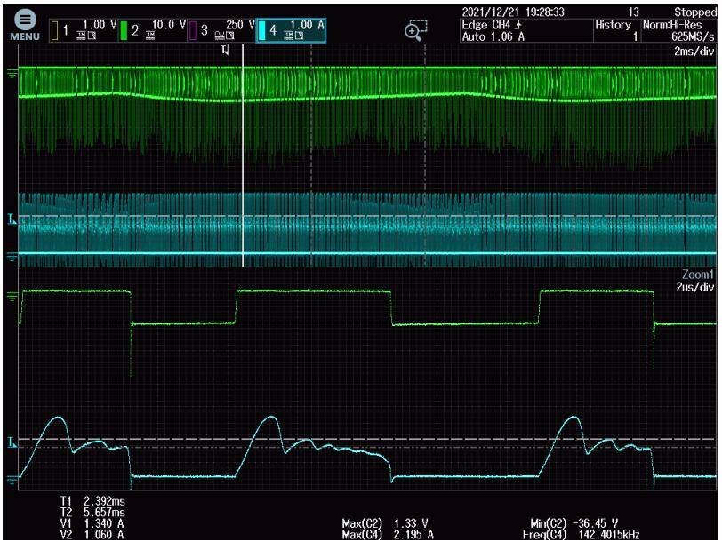

85 VAC

CH2 VR\_5V  
CH4 IF\_5V

$$
V _ {R - 5 V \_ M A X} = 3 6. 4 5 \mathrm{V}
$$

$$
I _ {F - 5 V \_ M A X} = 2. 1 9 5 \mathrm{A}
$$

## Test Condition:

➢ 5V-0.35A  
➢ 12V-0.2A

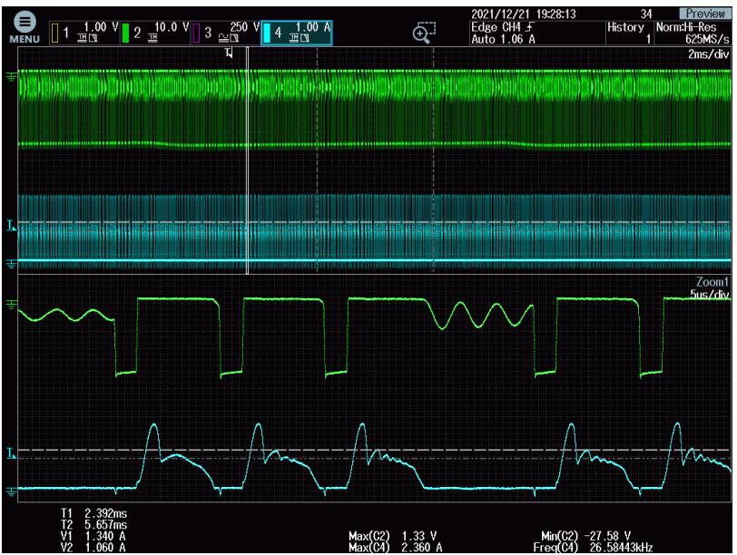

265 VAC

CH2 VR\_5V  
CH4 IF\_5V

$$
V _ {R - 5 V \_ M A X} = 2 7. 5 8 \mathrm{V}
$$

$$
I _ {F - 5 V \_ M A X} = 2. 3 6 \mathrm{A}
$$

## Test Condition:

➢ 5V-0.35A  
➢ 12V-0.2A

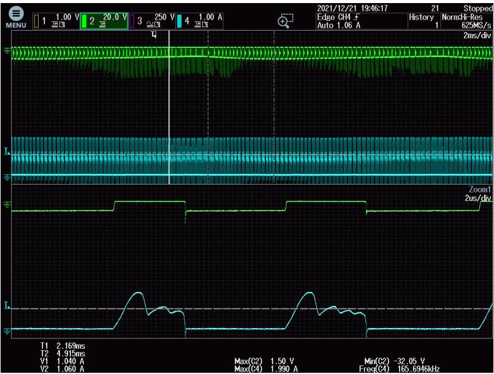

85 VAC  
265 VAC

CH2 VR\_5V  
CH4 IF\_5V

$$
V _ {R - 5 V \_ M A X} = 3 2. 0 5 \mathrm{V}
$$

$$
I _ {F - 5 V \_ M A X} = 1. 9 9 \mathrm{A}
$$

## Test Condition:

➢ 5V-0.35A  
➢ 12V-0.2A

CH2 VR\_5V  
CH4 IF\_5V

$$
V _ {R - 5 V \_ M A X} = 2 7. 4 \mathrm{V}
$$

$$
I _ {F - 5 V \_ M A X} = 2. 2 5 \mathrm{A}
$$

## Test Condition:

➢ 5V-0.35A  
➢ 12V-0.2A

## 输出二极管D833开机波形

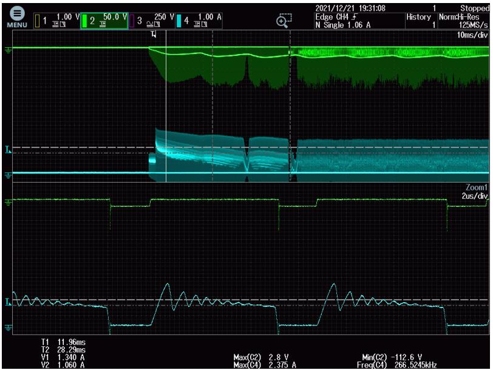

85 VAC

CH2 VR\_12V  
CH4 IF\_12V

$$
V _ {R - 1 2 V \_ M A X} = 1 1 2. 6 \mathrm{V}
$$

$$
I _ {F - 1 2 V \_ M A X} = 2. 3 7 5 \mathrm{A}
$$

## Test Condition:

➢ 5V-0.35A  
➢ 12V-0.2A

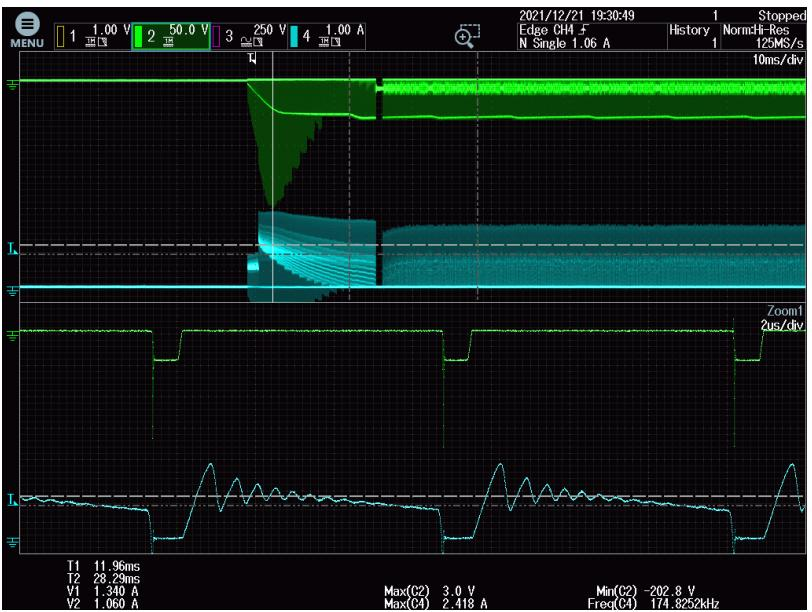

265 VAC

CH2 VR\_12V  
CH4 IF\_12V

$$
V _ {R - 1 2 V \_ M A X} = 2 0 2. 8 \mathrm{V}
$$

$$
I _ {F - 1 2 V \_ M A X} = 2. 4 1 8 \mathrm{A}
$$

## Test Condition:

➢ 5V-0.35A  
➢ 12V-0.2A

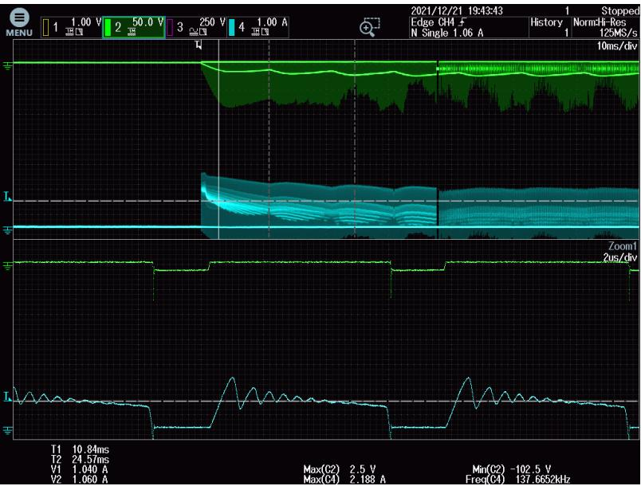

85 VAC  
265 VAC

CH2 VR\_12V $V _ { R \_ 1 2 \vee }$  
CH4 IF\_12V $\mathsf { V } _ { \mathsf { R - 1 2 V \_ M A X } } \mathsf { = 1 0 2 . 5 V }$ $\mathsf { I } _ { \mathsf { F } - 1 2 \mathsf { V } \_ \mathsf { M A X } } = 2 . 1 8 8 \mathsf { A }$

## Test Condition:

➢ 5V-0.35A  
➢ 12V-0.2A

CH2 VR\_12V  
CH4 IF\_12V $\mathsf { V } _ { \mathsf { R - 1 2 V \_ M A X } } \mathsf { = 1 6 1 . 3 V }$ $\mathsf { I } _ { \mathsf { F } - 1 2 \mathsf { V } \_ \mathsf { M A X } } = 2 . 2 8 8 \mathsf { A }$

## Test Condition:

➢ 5V-0.35A  
➢ 12V-0.2A

## 输出二极管D833稳态波形

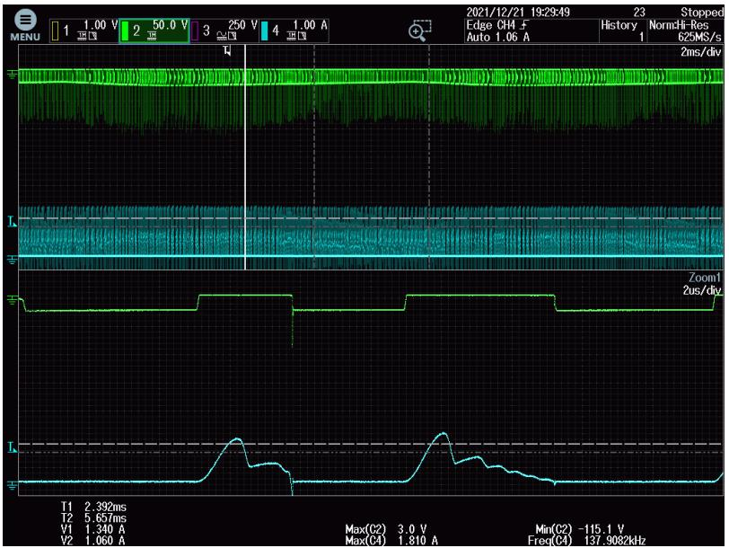

85 VAC

CH2 VR\_12V  
CH4 IF\_12V

$$
V _ {R - 1 2 V \_ M A X} = 1 1 5. 1 \mathrm{V}
$$

$$
I _ {F - 1 2 V \_ M A X} = 1. 8 1 \mathrm{A}
$$

## Test Condition:

➢ 5V-0.35A  
➢ 12V-0.2A

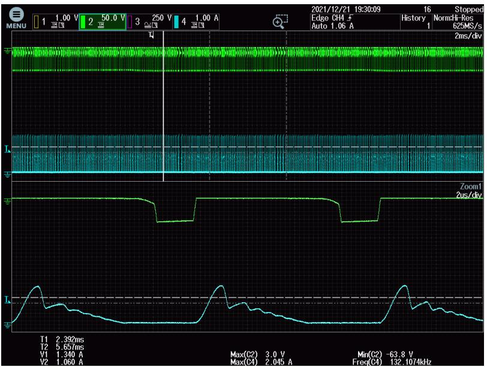

265 VAC

CH2 VR\_12V  
CH4 IF\_12V

$$
V _ {R - 1 2 V \_ M A X} = 6 3. 8 \mathrm{V}
$$

$$
I _ {F - 1 2 V \_ M A X} = 2. 0 4 5 \mathrm{A}
$$

## Test Condition:

➢ 5V-0.35A  
➢ 12V-0.2A

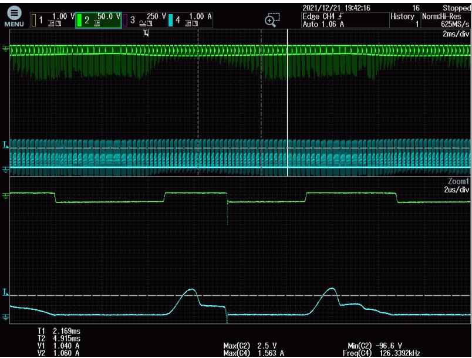

85 VAC  
265 VAC

CH2 VR\_12V  
CH4 IF\_12V

$$
\begin{array}{l} V _ {R - 1 2 V \_ M A X} = 9 6. 6 \mathrm{V} \\ I _ {F - 1 2 V \_ M A X} = 1. 5 6 3 \mathrm{A} \end{array}
$$

## Test Condition:

➢ 5V-0.35A  
➢ 12V-0.2A

CH2 VR\_12V  
CH4 IF\_12V

$$
V _ {R - 1 2 V \_ M A X} = 6 3. 3 \mathrm{V}
$$

$$
I _ {F - 1 2 V \_ M A X} = 1. 9 2 5 \mathrm{A}
$$

## Test Condition:

➢ 5V-0.35A  
➢ 12V-0.2A

## MOSFET

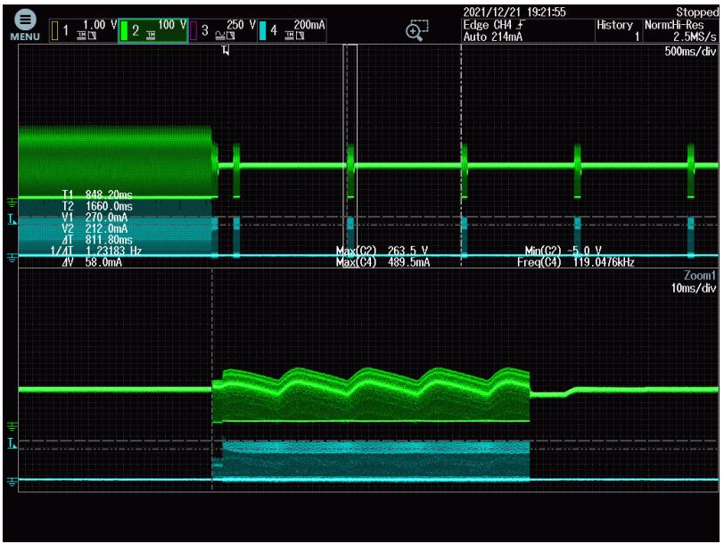

85 VAC

CH2 VDS  
CH4 IDS

$$
\begin{array}{l} \mathrm {V_ {DS\_MAX}} = 2 6 3. 5 \mathrm{V} \\ \mathrm {I_ {DS\_MAX}} = 0. 4 8 9 5 \mathrm{A} \end{array}
$$

## Test Condition:

➢ 5V-0.35A  
➢ 12V-0.2A

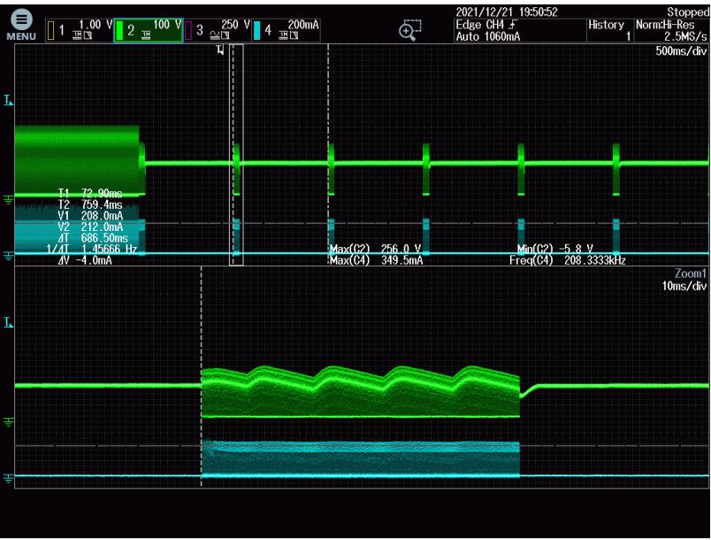

85 VAC

CH2 VDS  
CH4 IDS

$$
\begin{array}{l} \mathrm {V_ {DS\_MAX}} = 2 5 6 \mathrm{V} \\ \mathrm {I_ {DS\_MAX}} = 0. 3 4 9 5 \mathrm{A} \end{array}
$$

## Test Condition:

➢ 5V-0.35A  
➢ 12V-0.2A

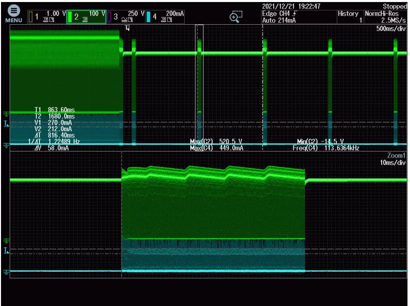

265 VAC

CH2 VDS  
CH4 IDS

$$
V _ {D S \_ M A X} = 5 2 0. 5 \mathrm{V}
$$

$$
I _ {D S \_ M A X} = 0. 4 4 9 \mathrm{A}
$$

## Test Condition:

➢ 5V-0.35A  
➢ 12V-0.2A

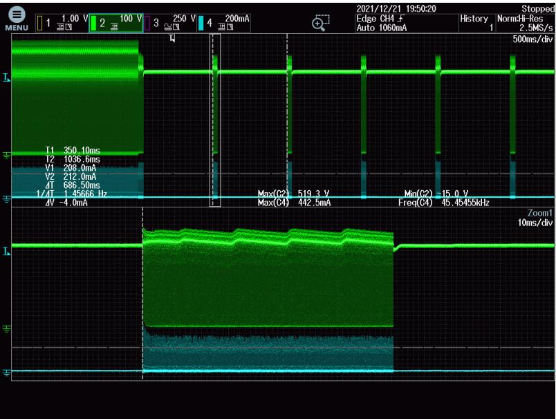

265 VAC

CH2 VDS  
CH4 IDS

$$
V _ {D S \_ M A X} = 5 1 9. 3 \mathrm{V}
$$

$$
I _ {D S \_ M A X} = 0. 4 4 2 5 \mathrm{A}
$$

## Test Condition:

➢ 5V-0.35A  
➢ 12V-0.2A

## 输出短路保护 D800

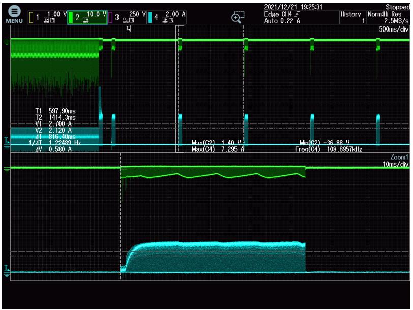

85 VAC

CH2 VR\_5V $\mathsf { C H } 2 \mathsf { V } _ { \mathsf { R } \_ \mathsf { S V } }$  
CH4 IF\_5V

$$
V _ {R - 5 V \_ M A X} = 3 6. 8 8 \mathrm{V}
$$

$$
I _ {F - 5 V \_ M A X} = 7. 2 9 5 \mathrm{A}
$$

## Test Condition:

➢ 5V-0.35A  
➢ 12V-0.2A

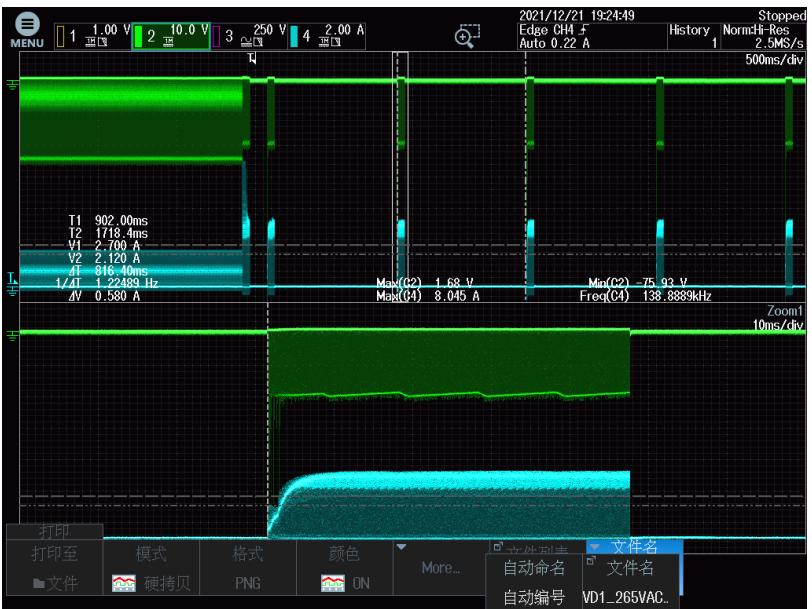

265 VAC

CH2 VR\_5V $\mathsf { C H } 2 \mathsf { V } _ { \mathsf { R } \_ \mathsf { 5 V } }$  
CH4 IF\_5V $\mathsf { C H 4 } \mathsf { I } _ { \mathsf { F } \_ \mathsf { 5 V } }$

$$
V _ {R - 5 V \_ M A X} = 7 5. 9 3 \mathrm{V}
$$

$$
I _ {F - 5 V \_ M A X} = 8. 0 4 5 \mathrm{A}
$$

## Test Condition:

➢ 5V-0.35A  
➢ 12V-0.2A

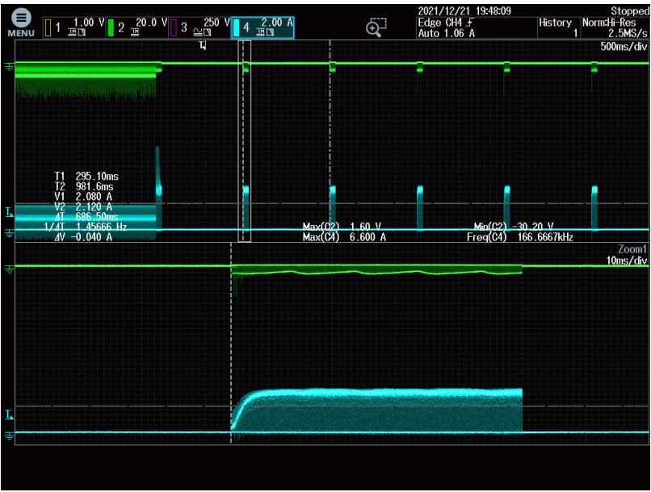

85 VAC  
265 VAC

CH2 VR\_5V $\mathsf { C H } 2 \mathsf { V } _ { \mathsf { R } \_ \mathsf { 5 V } }$  
CH4 IF\_5V $V _ { \mathrm { R - 5 V \_ M A X } } = 3 0 . 2 \ V$ $V _ { F - S V \_ M A X } = 6 . 6 A$

## Test Condition:

➢ 5V-0.35A  
➢ 12V-0.2A

CH2 VR\_5V $\mathsf { C H } 2 \mathsf { V } _ { \mathsf { R } \_ \mathsf { 5 V } }$  
CH4 IF\_5V $V _ { \mathrm { R - 5 V \_ M A X } } = 6 0 . 7 \ V$ $V _ { F - S V \_ M A X } = 7 . 6 8 A$

## Test Condition:

➢ 5V-0.35A  
➢ 12V-0.2A

## 输出短路保护 D833

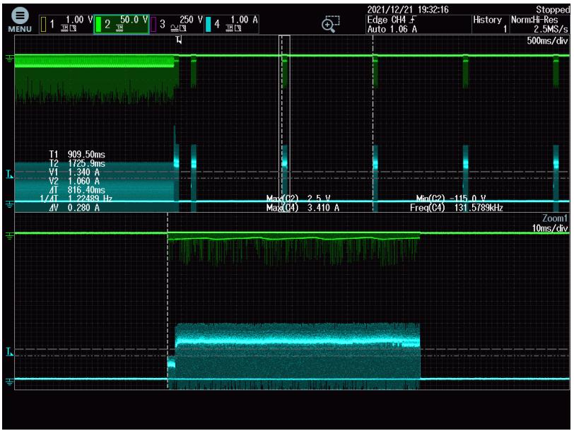

85 VAC

CH2 VR\_12V  
CH4 IF\_12V

$$
\begin{array}{l} \mathrm {V_ {R - 12V\_MAX}} = 1 1 5 \mathrm{V} \\ \mathrm {I_ {F - 12V\_MAX}} = 3. 4 1 \mathrm{A} \end{array}
$$

## Test Condition:

➢ 5V-0.35A  
➢ 12V-0.2A

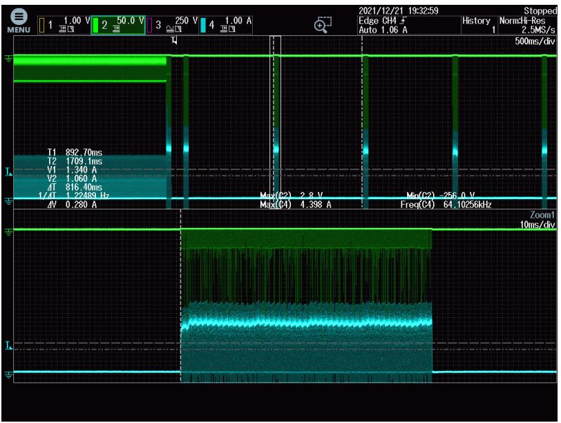

265 VAC

CH2 VR\_12V  
CH4 IF\_12V

$$
V _ {R - 1 2 V \_ M A X} = 2 5 6 \mathrm{V}
$$

$$
I _ {F - 1 2 V \_ M A X} = 4. 3 9 8 \mathrm{A}
$$

## Test Condition:

➢ 5V-0.35A  
➢ 12V-0.2A

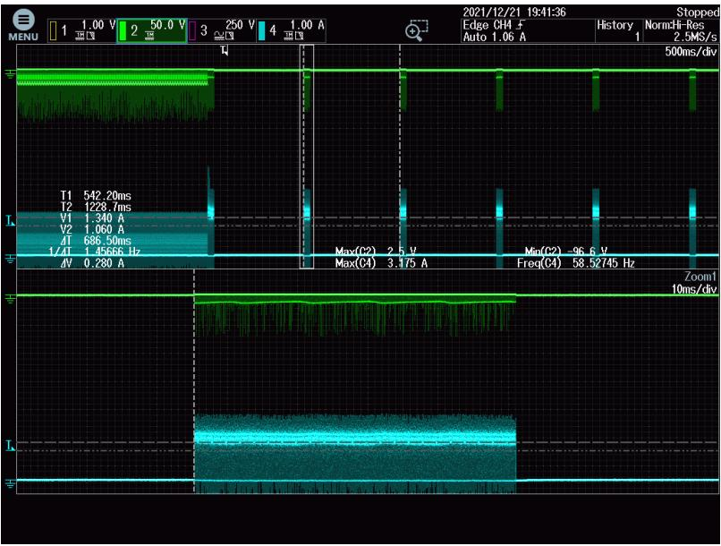

85 VAC  
265 VAC

CH2 VR\_12V  
CH4 IF\_12V

$$
\begin{array}{l} V _ {R - 1 2 V \_ M A X} = 9 6. 6 \mathrm{V} \\ I _ {F - 1 2 V \_ M A X} = 3. 1 7 5 \mathrm{A} \end{array}
$$

## Test Condition:

➢ 5V-0.35A  
➢ 12V-0.2A

CH2 VR\_12V  
CH4 IF\_12V

$$
V _ {R - 1 2 V \_ M A X} = 1 9 8. 5 \mathrm{V}
$$

$$
I _ {F - 1 2 V \_ M A X} = 4. 5 5 8 \mathrm{A}
$$

## Test Condition:

➢ 5V-0.35A  
➢ 12V-0.2A

## 温升测试

BPA8604P

<table><tr><td rowspan="2">项目</td><td>85VAC</td><td>115VAC</td><td>230VAC</td><td>265VAC</td></tr><tr><td>温度(°C)</td><td>温度(°C)</td><td>温度(°C)</td><td>温度(°C)</td></tr><tr><td>环境温度</td><td>36.4</td><td>38</td><td>38.5</td><td>38.7</td></tr><tr><td>BPA8604P(IC766)</td><td>108.2</td><td>88</td><td>81.1</td><td>82.9</td></tr><tr><td>5V整流二极管(D800)</td><td>65.5</td><td>66.2</td><td>67.3</td><td>67.5</td></tr><tr><td>12V整流二极管(D833)</td><td>70.5</td><td>70.6</td><td>72.1</td><td>72.3</td></tr><tr><td>变压器绕组(T733)</td><td>60.9</td><td>62</td><td>63.6</td><td>64.1</td></tr><tr><td>变压器磁芯(T733)</td><td>63</td><td>63.7</td><td>66.4</td><td>66.8</td></tr><tr><td>输入电解电容(EC734)</td><td>56.1</td><td>53</td><td>50.5</td><td>50.7</td></tr><tr><td>输出电解电容(EC800)</td><td>48.5</td><td>50</td><td>50.1</td><td>50.6</td></tr></table>

PN8192

<table><tr><td rowspan="2">项目</td><td>85VAC</td><td>115VAC</td><td>230VAC</td><td>265VAC</td></tr><tr><td>温度(°C)</td><td>温度(°C)</td><td>温度(°C)</td><td>温度(°C)</td></tr><tr><td>环境温度</td><td>38.8</td><td>38.5</td><td>38.8</td><td>39</td></tr><tr><td>PN8192(IC766)</td><td>103.1</td><td>91.9</td><td>92.7</td><td>97.9</td></tr><tr><td>5V整流二极管(D800)</td><td>66.8</td><td>65.9</td><td>67.6</td><td>68.3</td></tr><tr><td>12V整流二极管(D833)</td><td>71.7</td><td>70.6</td><td>72.4</td><td>73.2</td></tr><tr><td>变压器绕组(T733)</td><td>62.5</td><td>61.4</td><td>64.1</td><td>65.1</td></tr><tr><td>变压器磁芯(T733)</td><td>63.8</td><td>63.4</td><td>66.4</td><td>67.6</td></tr><tr><td>输入电解电容(EC734)</td><td>56.2</td><td>53.3</td><td>51.7</td><td>53.2</td></tr><tr><td>输出电解电容(EC800)</td><td>50.5</td><td>49.8</td><td>50.7</td><td>50.9</td></tr></table>

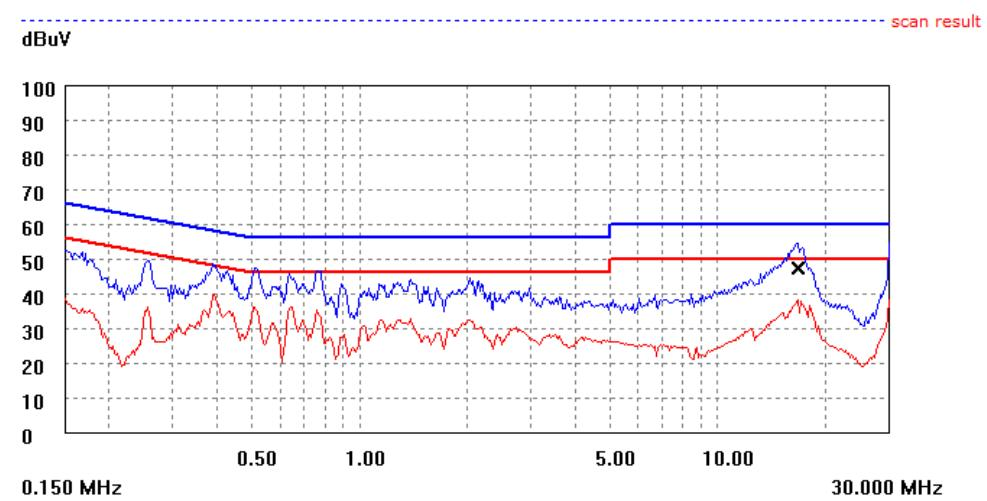

115VAC Line

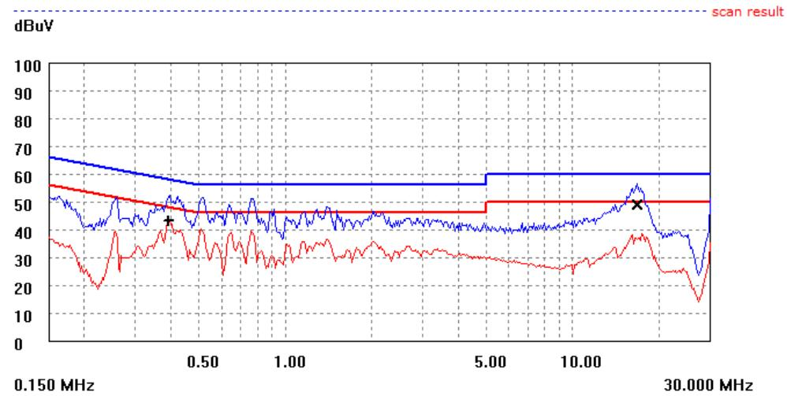

115VAC Neutral

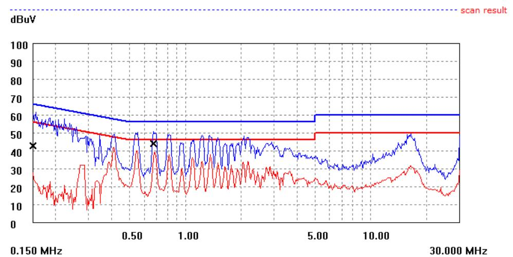

115VAC Line

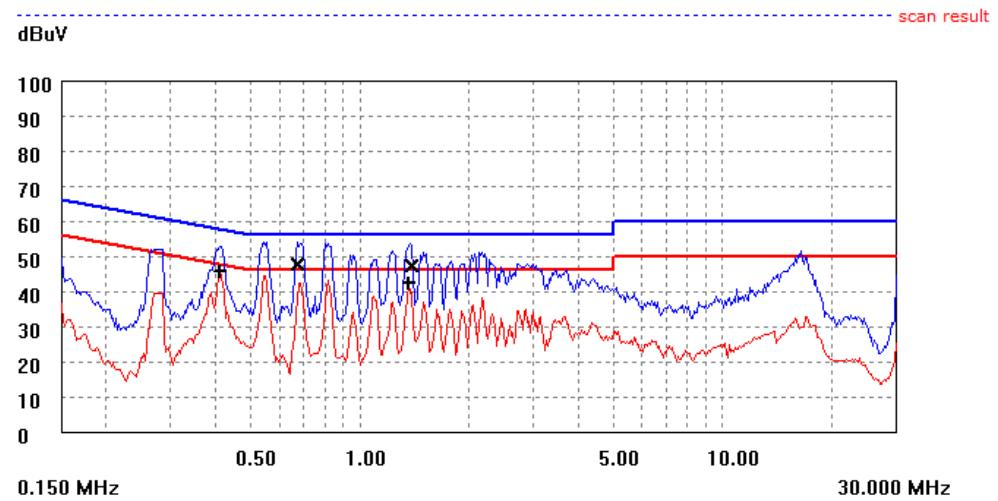

115VAC Neutral

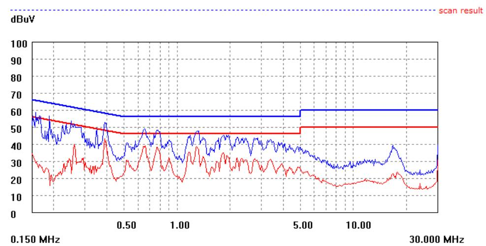

230VAC Line

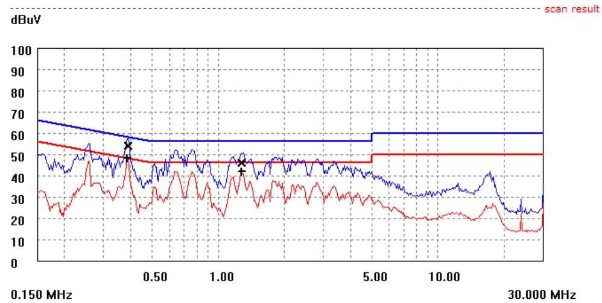

230VAC Neutral

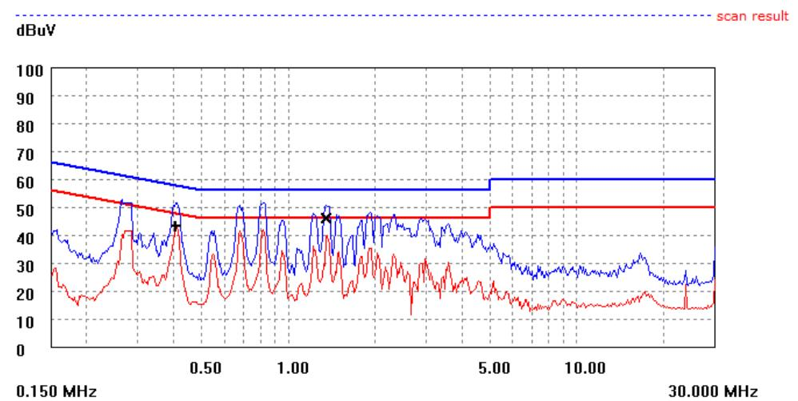

230VAC Line

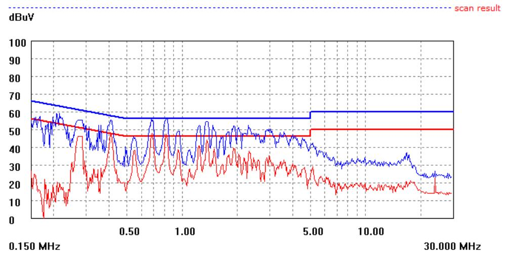

230VAC Neutral

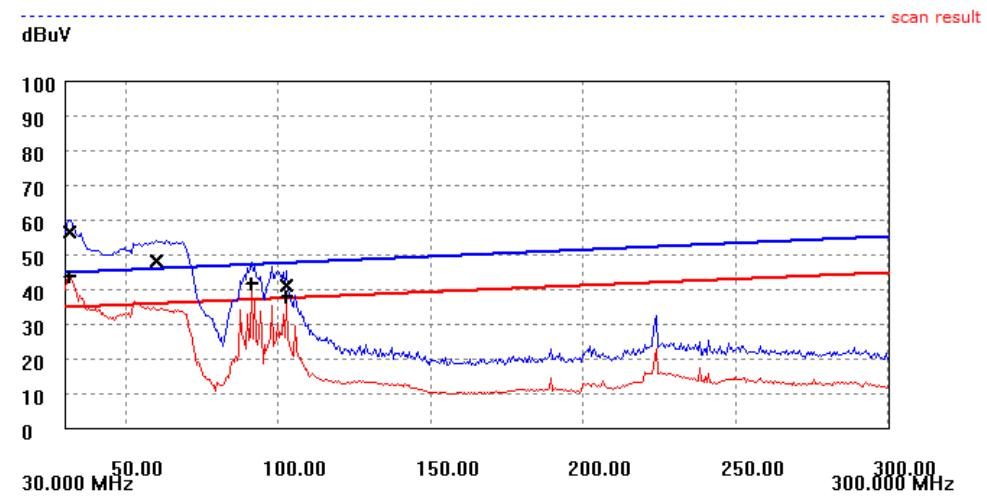

115VAC Neutral

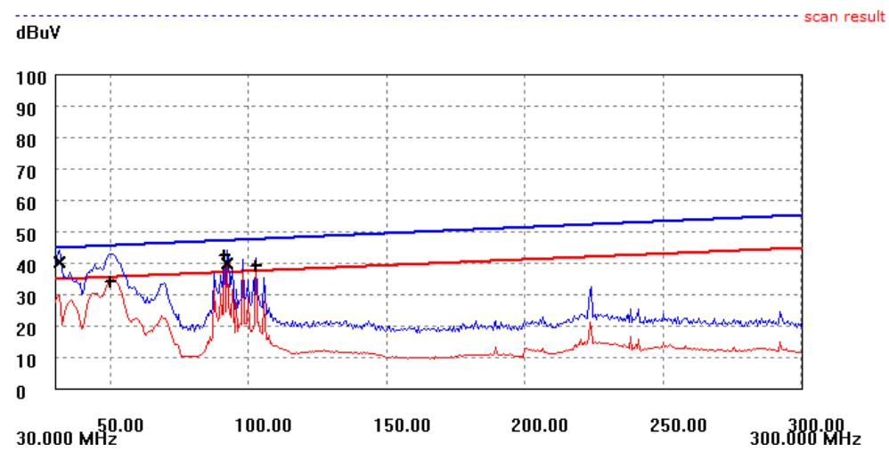

230VAC Neutral

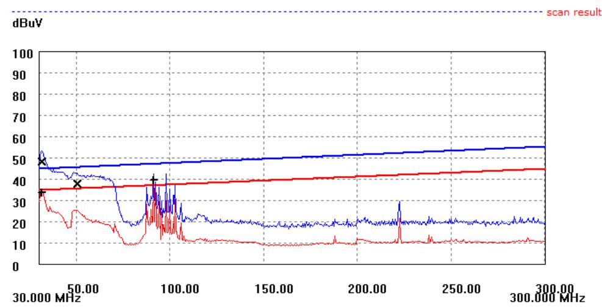

115VAC Neutral

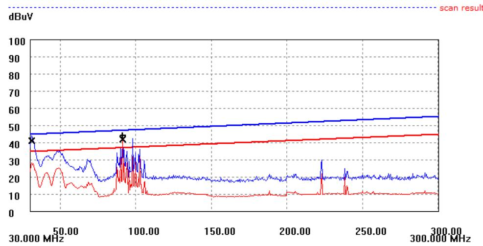

230VAC Neutral

## 建议

D800 60V 100V  
➢ D833 100V 300V 100V

## THANK YOU FOR WATCHING
