## BPA8604P&PN8192对比测试 (5V/0.3A, 12V/0.3A @85\~265Vac)

上海晶丰明源半导体股份有限公司

Shanghai Bright Power Semiconductor Co., Ltd.

陈耀兵

2022 5 13

## 测试数据对比

电源规格：85\~265Vac输入， 5V/0.3A，12V/0.3A输出。

<table><tr><td colspan="2"></td><td>BPA8604P</td><td>PN8192</td><td></td></tr><tr><td colspan="2">待机功耗</td><td>305mW</td><td>315mW</td><td>230VAC</td></tr><tr><td rowspan="2">效率(满载整机)</td><td>115Vac</td><td>73.05%</td><td>73.94%</td><td>满载</td></tr><tr><td>230Vac</td><td>71.61%</td><td>72.89%</td><td>满载</td></tr><tr><td rowspan="2">输出电压纹波</td><td>85Vac</td><td>5V-392mV/12V-372mV</td><td>5V-400mV/12V-400mV</td><td>满载</td></tr><tr><td>265Vac</td><td>5V-424mV/12V-400mV</td><td>5V-416mV/12V-408mV</td><td>满载</td></tr><tr><td rowspan="2">动态负载性能(5V)</td><td>50%-100%</td><td> $384mV_{PK\_PK}$ </td><td> $392mV_{PK\_PK}$ </td><td>85VAC, 12V-0.3A</td></tr><tr><td>10%-90%</td><td> $424mV_{PK\_PK}$ </td><td> $422mV_{PK\_PK}$ </td><td>85VAC, 12V-0.3A</td></tr><tr><td rowspan="2">MOSFET应力</td><td> $V_{DS}$ </td><td>564V</td><td>564V</td><td>265VAC, 开机</td></tr><tr><td> $I_{DS}$ </td><td>0.46A</td><td>0.589A</td><td>265VAC, 开机</td></tr><tr><td>二极管应力(5V输出)</td><td>VRR</td><td>44.4V</td><td>52.8V</td><td>265VAC, 输出短路</td></tr><tr><td>二极管应力(12V输出)</td><td>VRR</td><td>118V</td><td>140V</td><td>265VAC, 输出短路</td></tr><tr><td colspan="2">温升测试</td><td>65.6°C(环温38.5°C)</td><td>54.1°C(环温38.6°C)</td><td>PN8192为85VAC, Full Load BPA8604P为90VAC, Full Load</td></tr><tr><td colspan="2">传导EMI</td><td>6dB以上余量(详见测试波形)</td><td>6dB以上余量(详见测试波形)</td><td>115VAC, 230VAC, 5V-0.3A, 12V-0.3A</td></tr></table>

◆ 换BPA8604P和PN8192测试时，钳位电阻均由两个100K并联改为一个100K

正面  
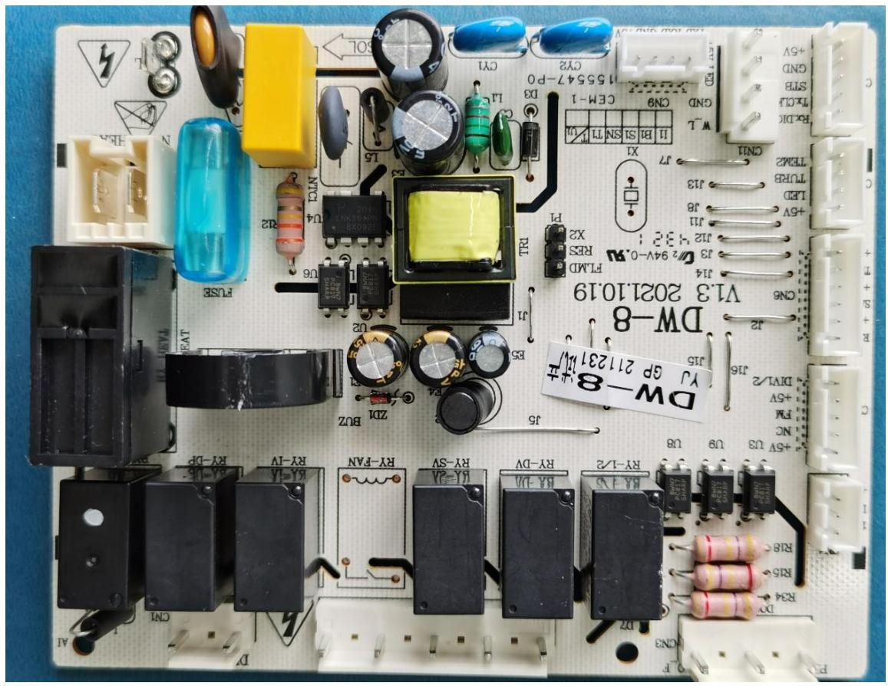

背面  

待机功耗  
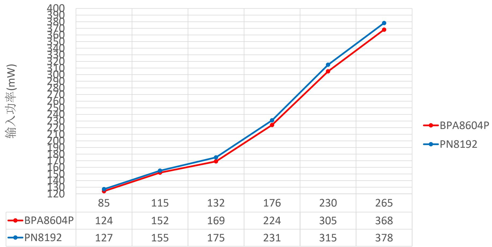

输入电压(Vac)

测试条件：未断开客户板上负载

效率曲线  
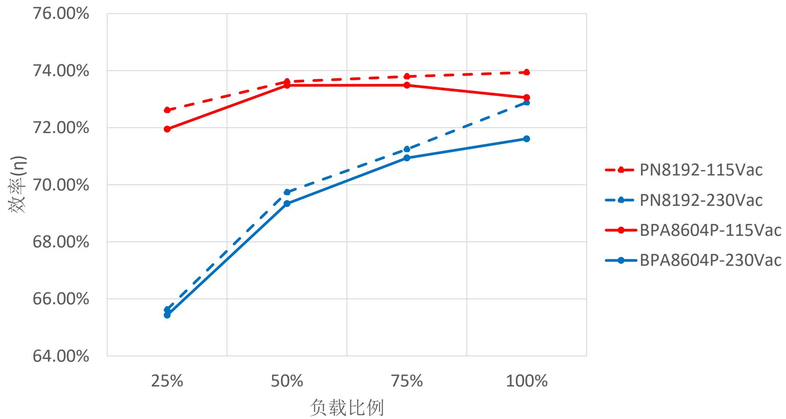

测试时未考虑客户板本身负载对效率的影响。

## 输出电压交叉调整率

BPA8604P

<table><tr><td> $V_{OUT}(V)$  $I_{OUT}(A)$ </td><td></td><td>5V</td><td>12V</td></tr><tr><td rowspan="4"> $I_{O\_5V}=0A$  $I_{O\_12V}=0A$ </td><td>85VAC</td><td>5.0027</td><td>13.659</td></tr><tr><td>115VAC</td><td>5.0035</td><td>13.682</td></tr><tr><td>230VAC</td><td>5.0054</td><td>13.741</td></tr><tr><td>265VAC</td><td>5.0059</td><td>13.762</td></tr><tr><td rowspan="4"> $I_{O\_5V}=0.3A$  $I_{O\_12V}=0A$ </td><td>85VAC</td><td>4.8812</td><td>15.475</td></tr><tr><td>115VAC</td><td>4.8859</td><td>15.564</td></tr><tr><td>230VAC</td><td>4.8745</td><td>15.75</td></tr><tr><td>265VAC</td><td>4.8594</td><td>15.89</td></tr><tr><td rowspan="4"> $I_{O\_5V}=0A$  $I_{O\_12V}=0.3A$ </td><td>85VAC</td><td>4.9824</td><td>10.154</td></tr><tr><td>115VAC</td><td>4.9786</td><td>10.136</td></tr><tr><td>230VAC</td><td>4.9767</td><td>9.66</td></tr><tr><td>265VAC</td><td>4.9688</td><td>9.594</td></tr><tr><td rowspan="4"> $I_{O\_5V}=0.3A$  $I_{O\_12V}=0.3A$ </td><td>85VAC</td><td>4.9094</td><td>12.487</td></tr><tr><td>115VAC</td><td>4.9161</td><td>12.508</td></tr><tr><td>230VAC</td><td>4.9217</td><td>12.537</td></tr><tr><td>265VAC</td><td>4.9247</td><td>12.561</td></tr></table>

测试条件：lo=0A为只带客户板上负载

PN8192

<table><tr><td> $V_{OUT}(V)$  $I_{OUT}(A)$ </td><td></td><td>5V</td><td>12V</td></tr><tr><td rowspan="4"> $I_{O\_5V}=0A$  $I_{O\_12V}=0A$ </td><td>85VAC</td><td>5.0146</td><td>13.722</td></tr><tr><td>115VAC</td><td>5.0152</td><td>13.738</td></tr><tr><td>230VAC</td><td>5.0168</td><td>13.795</td></tr><tr><td>265VAC</td><td>5.0174</td><td>13.814</td></tr><tr><td rowspan="4"> $I_{O\_5V}=0.3A$  $I_{O\_12V}=0A$ </td><td>85VAC</td><td>4.9546</td><td>15.738</td></tr><tr><td>115VAC</td><td>4.9336</td><td>15.7</td></tr><tr><td>230VAC</td><td>4.9592</td><td>15.993</td></tr><tr><td>265VAC</td><td>4.9569</td><td>16.142</td></tr><tr><td rowspan="4"> $I_{O\_5V}=0A$  $I_{O\_12V}=0.3A$ </td><td>85VAC</td><td>4.9983</td><td>9.8654</td></tr><tr><td>115VAC</td><td>4.9949</td><td>9.8815</td></tr><tr><td>230VAC</td><td>4.9914</td><td>9.8213</td></tr><tr><td>265VAC</td><td>4.9866</td><td>9.798</td></tr><tr><td rowspan="4"> $I_{O\_5V}=0.3A$  $I_{O\_12V}=0.3A$ </td><td>85VAC</td><td>4.9298</td><td>12.537</td></tr><tr><td>115VAC</td><td>4.9377</td><td>12.547</td></tr><tr><td>230VAC</td><td>4.9435</td><td>12.582</td></tr><tr><td>265VAC</td><td>4.9492</td><td>12.608</td></tr></table>

测试条件：lo=0A为只带客户板上负载

## 输出电压纹波

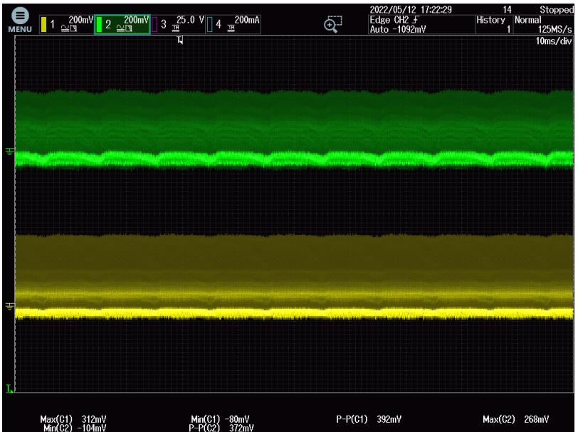

85 VAC

CH1 $\mathsf { V } _ { \mathsf { O U T } \_ 5 \mathsf { V } }$ Ripple $V _ { P K - P K } = 3 9 2 m v$  
CH2 $\mathsf { V } _ { \mathsf { O U T } \_ 1 2 \mathsf { V } }$ Ripple $V _ { p | k - P K } = 3 7 2 m v$

Test Condition:  
➢ Full Load  
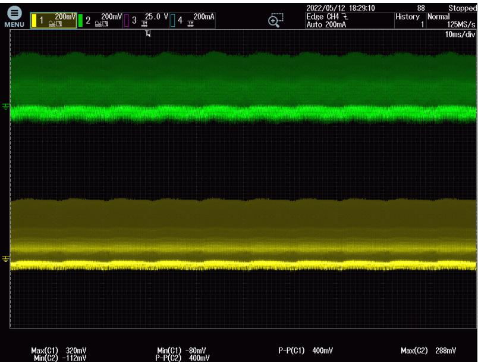

85 VAC

CH1 $\mathsf { V } _ { 0 \mathsf { U T } \_ 5 \vee } \mathsf { R i p p l e }$ $V _ { P K - P K } = 4 0 0 m V$  
CH2 $\mathsf { V } _ { \mathsf { O U T } \_ 1 2 \mathsf { V } }$ Ripple $V _ { P K - P K } = 4 0 0 m V$

Test Condition:  
➢ Full Load  
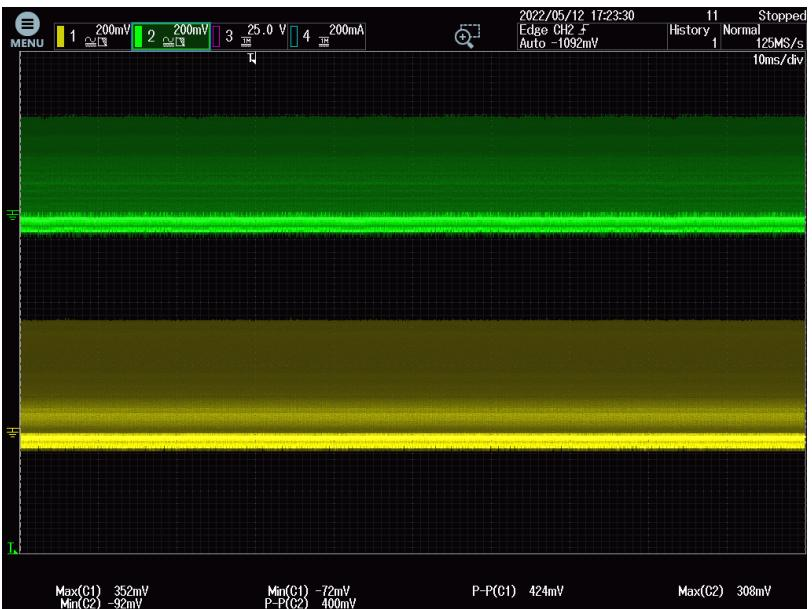

265 VAC

CH1 $\mathsf { V } _ { \mathsf { O U T } \_ 5 \mathsf { V } }$ Ripple $V _ { P K - P K } = 4 2 4 m v$  
CH2 $\mathsf { V } _ { \mathsf { O U T } \_ 1 2 \mathsf { V } }$ Ripple $V _ { P | \mathrm { X } \mathrm { - } P | \mathrm { X } } = 4 0 0 \mathrm { { m V } }$

Test Condition:  
➢ Full Load  
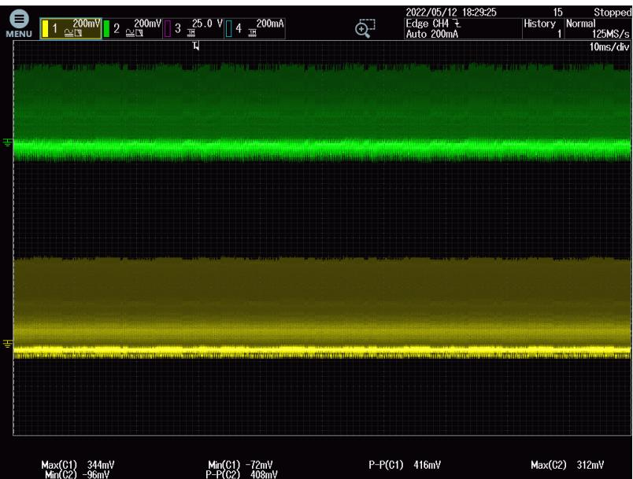

265 VAC

CH1 $\mathsf { V } _ { \mathsf { O U T } \_ 5 \mathsf { V } }$ Ripple $V _ { P K - P K } = 4 1 \overline { { 6 } } m v$  
CH2 $\mathsf { V } _ { 0 \mathsf { U T } \_ 1 2 \vee } \mathsf { R i p p l e }$ $V _ { P K - P K } = 4 0 8 m v$

Test Condition:

➢ Full Load

## (50%-100%)

85 VAC

$\mathtt { C H 1 V _ { 0 \mathtt { U T } \_ 5 \mathtt { V } } } _ { \mathtt { m V } }$  
CH2 V $v _ { p _ { k - P K } } = 7 2 0 m v$  
CH4 IOUT\_5V $\mathsf { I } _ { \mathsf { O U T } \_ 5 \mathsf { V } }$

## Test Condition:

➢ $5 \mathsf { V } \colon 0 . 1 5 \mathsf { A } \ – 0 . 3 \mathsf { A } – 0 . 1 5 \mathsf { A }$  
➢ 12V: 0.3A  
➢ Slew Rate: 0.5 A/μS  
➢ Frequency: 100 Hz

85 VAC

CH1 V OUT\_5V VPK-PK= 392 mV  
$\mathtt { C H 2 } \mathtt { V _ { 0 \sqcup T } } _ { \mathtt { V _ { P K } } = 7 6 0 \mathtt { m V } }$  
CH4 IOUT\_5V

## Test Condition:

➢ 5V: 0.15A-0.35A-0.15A  
➢ $1 2 \mathsf { V } \colon 0 . 3 \mathsf { A }$  
➢ Slew Rate: 0.5 A/μS  
➢ Frequency: 100 Hz

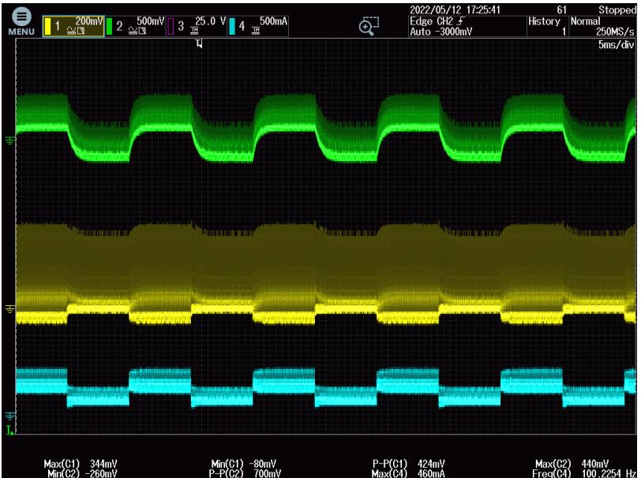

265 VAC

$\mathtt { C H 1 V _ { 0 \sqcup T \_ 5 V } } _ { \mathtt { M _ { P K } } = 4 2 4 \ m V }$  
$\begin{array} { r l } & { \mathsf { C H } 2 \mathsf { V } _ { \mathsf { O U T } _ { \mathsf { P } \mathsf { M } } } } \\ & { \mathsf { V } _ { \mathsf { P K } \to \mathsf { P K } } = 7 0 0 \mathsf { m V } } \end{array}$  
CH4 IOUT\_5V $\mathsf { I } _ { 0 \cup \mathsf { T } _ { - } 5 \mathsf { V } }$

## Test Condition:

➢ 5V: 0.15A-0.35A-0.15A  
➢ $1 2 \mathsf { V } \colon 0 . 3 \mathsf { A }$  
➢ Slew Rate: 0.5 A/μS  
➢ Frequency: 100 Hz

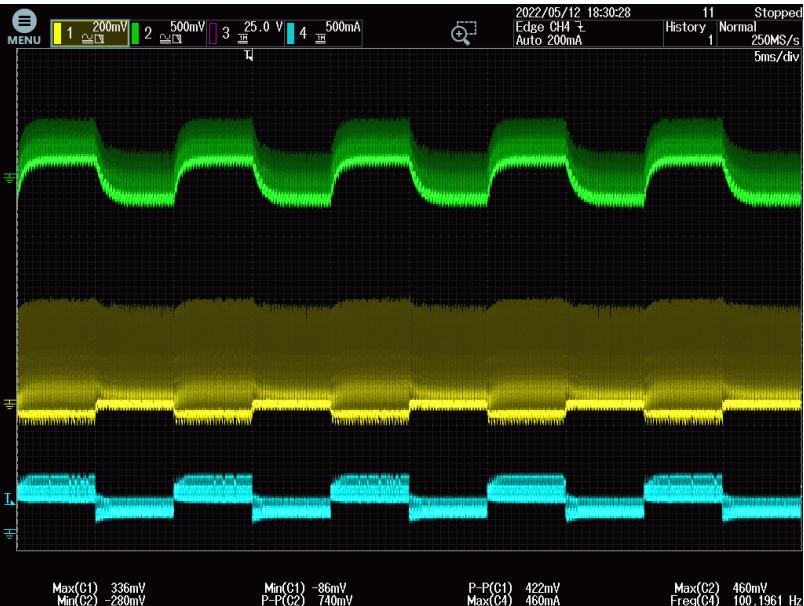

265 VAC

$\begin{array} { r l } & { \mathsf { C H 1 V _ { O U T } } _ { \mathsf { 0 U T } } 5 \mathsf { v } } \\ & { \mathsf { V _ { P K - P K } } = 4 2 2 \mathsf { m v } } \end{array}$  
$\mathsf { C H } 2 \mathsf { V } _ { \mathsf { O U T } } \mathsf { 1 } 2 \mathsf { V } _ { \mathsf { m V } }$  
CH4 IOUT\_5V $\mathsf { C H } 4 \mathsf { I } _ { 0 \mathsf { U T } \_ 5 \mathsf { V } }$

## Test Condition:

➢ 5V: 0.15A-0.35A-0.15A  
➢ $\pm 2 \mathsf { V } \colon 0 . 3 \mathsf { A }$  
➢ Slew Rate: 0.5 A/μS  
➢ Frequency: 100 Hz

## (10%-90%)

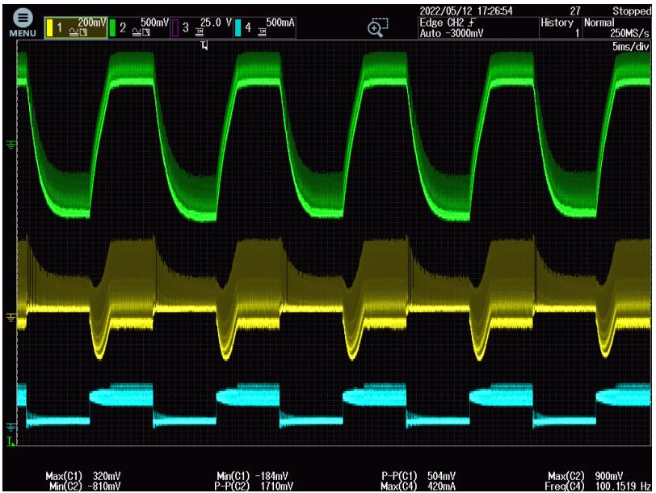

85 VAC

CH1 V OUT\_5V VPK-PK= 504 mV  
$\begin{array} { r l } & { \mathsf { C H 2 V } _ { \mathsf { O U T } } \mathsf { 1 2 V } } \\ & { \mathsf { V } _ { \mathsf { P K - P K } } \mathsf { = 1 7 1 0 m V } } \end{array}$  
CH4 IOUT\_5V $\mathsf { I } _ { \mathsf { O U T } \_ 5 \mathsf { V } }$

## Test Condition:

➢ 5V: 0.03A-0.027A-0.03A  
➢ 12V: 0.3A  
➢ Slew Rate: 0.5 A/μS  
➢ Frequency: 100 Hz

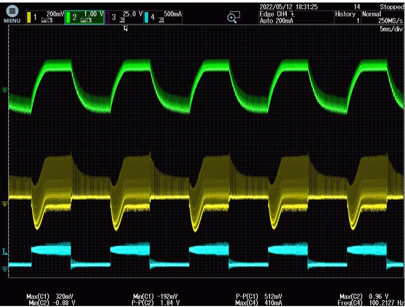

85 VAC

$\mathtt { C H 1 V _ { \mathtt { O U T } } } _ { \mathtt { P K - P K } } = 5 \mathtt { T 2 m v }$  
$\begin{array} { r l } & { \mathsf { C H 2 } \mathsf { V _ { O U T } } _ { 1 2 \mathsf { V } } } \\ & { \mathsf { V _ { P K - P K } } \mathsf { = 1 8 4 0 m v } } \end{array}$  
CH4 IOUT\_5V

## Test Condition:

➢ 5V: 0.03A-0.027A-0.03A  
➢ 12V: 0.3A  
➢ Slew Rate: 0.5 A/μS  
➢ Frequency: 100 Hz

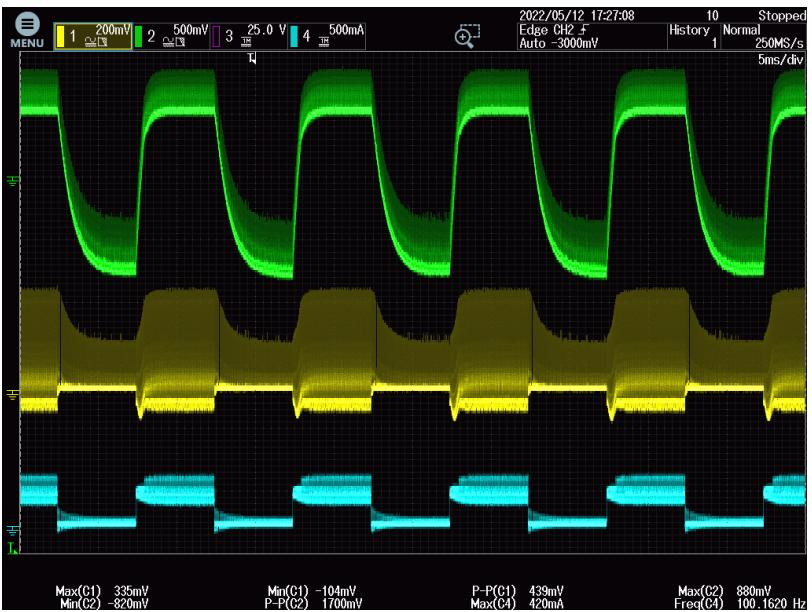

265 VAC

$\mathtt { C H 1 V _ { 0 \sqcup T \_ 5 \vee } } _ { \mathsf { m v } }$  
$\begin{array} { r l } & { \mathsf { C H 2 } \mathsf { V _ { O U T } } } \\ & { \mathsf { V _ { P K - P K } } \mathsf { = 1 7 0 0 \mathsf { m v } } } \end{array}$  
CH4 IOUT\_5V

## Test Condition:

➢ 5V: 0.03A-0.027A-0.03A  
➢ 12V: 0.3A  
➢ Slew Rate: 0.5 A/μS  
➢ Frequency: 100 Hz

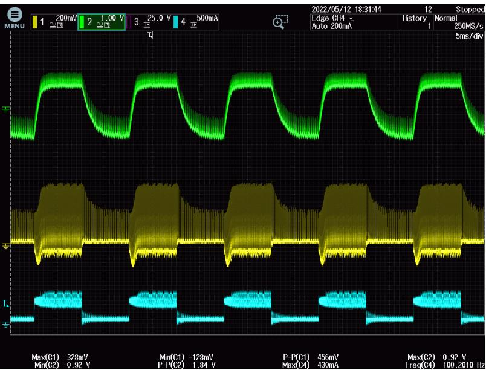

265 VAC

$\mathsf { C H 1 V } _ { \mathsf { o u r } } \mathsf { 5 6 m v }$  
$\begin{array} { r l } & { \mathsf { C H 2 } \mathsf { V _ { O U T } } _ { 1 2 \mathsf { V } } } \\ & { \mathsf { V _ { P K - P K } } \mathsf { = 1 8 4 0 m v } } \end{array}$  
CH4 IOUT\_5V

## Test Condition:

➢ 5V: 0.03A-0.027A-0.03A  
➢ 12V: 0.3A  
➢ Slew Rate: 0.5 A/μS  
➢ Frequency: 100 Hz

## 输出电压开机波形

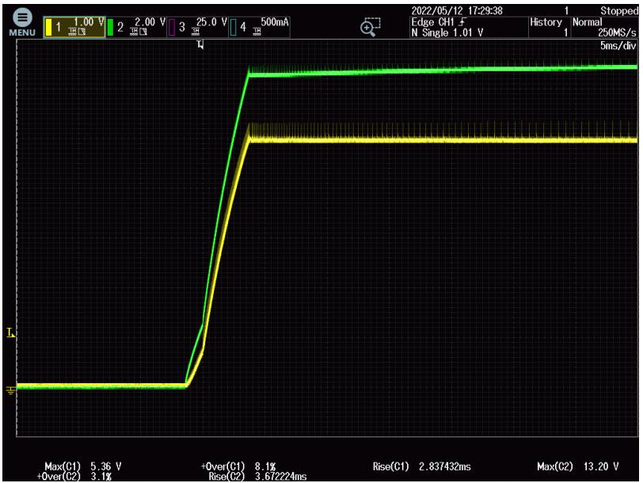

85 VAC

$\begin{array} { l } { \mathsf { C H 1 V _ { O U T \_ 5 V } } } \\ { \displaystyle \mathbf { t } _ { \mathrm { r i s e } } = 2 . 8 \mathsf { m s } } \end{array}$ CH1 VOUT\_5V

$\begin{array} { l l } { { \mathbb C } { \sf H } 2 \vee _ { 0 \cup \sf T _ { - } 1 2 \vee } } \\ { { \sf t } _ { \sf r i s e } = 3 . 7 \mathsf { m } 5 } \end{array}$ CH2 VOUT\_12V

Test Condition:  
➢ No Load  
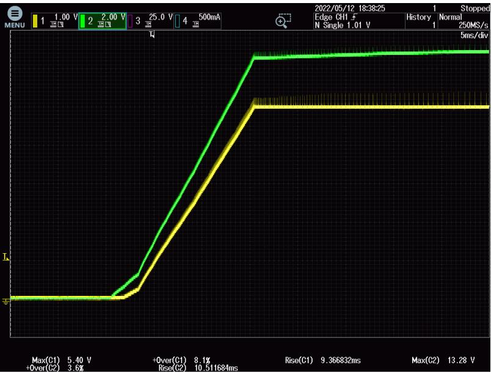

85 VAC

$\begin{array} { r } { \mathsf { C H 1 V _ { 0 \cup \mathsf { T } \_ 5 \vee } } } \\ { \mathsf { t } _ { \mathrm { r i s e } } = 9 . 4 \mathsf { m s } } \end{array}$ CH1 VOUT\_5V  
$\begin{array} { l l } { { \mathsf { C H 2 } } { \mathsf { V } } _ { 0 \cup \mathsf { T } _ { - } 1 2 \vee } } \\ { { \mathsf { t } } _ { \mathsf { r i s e } } { = } 1 0 . 5 ~ \mathsf { m s } } \end{array}$ CH2 VOUT\_12V

Test Condition:  
➢ No Load  
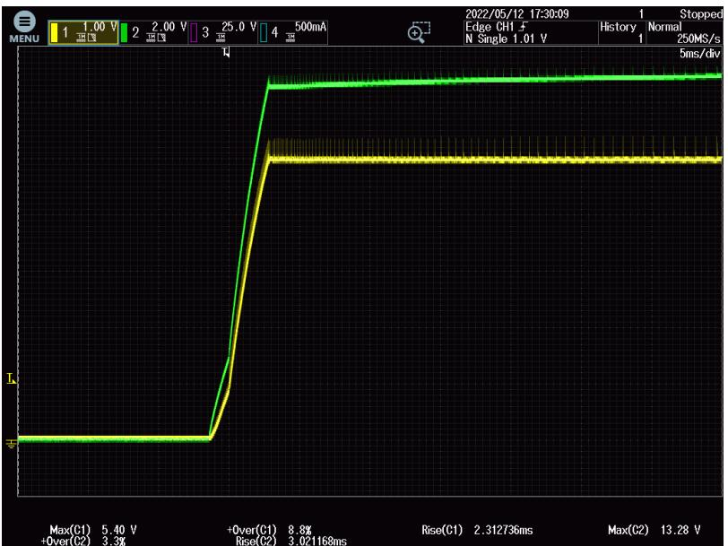

265 VAC

$\begin{array} { r } { \mathsf { C H 1 } \mathsf { V _ { 0 \cup \mathsf { T } \_ 5 \vee } } } \\ { \mathsf { t } _ { \mathrm { r i s e } } = 2 . 3 \mathsf { m s } } \end{array}$ CH1 V

$\begin{array} { l l } { { \mathsf { C H 2 } } { \mathsf { V } } _ { 0 \cup \mathsf { T } _ { - } 1 2 \vee } } \\ { { \mathsf { t } } _ { \mathsf { r i s e } } { = } 3 . 0 ~ \mathsf { m S } } \end{array}$ CH2 VOUT\_12V

Test Condition:  
➢ No Load  
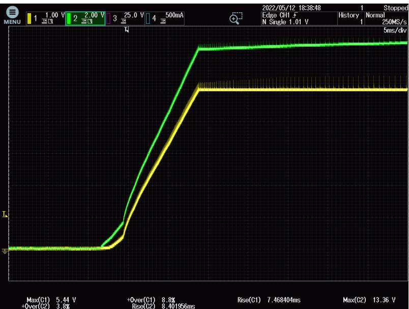

265 VAC

$\begin{array} { r } { \mathsf { C H 1 V _ { 0 \downarrow \uparrow , 5 \vee } } } \\ { \mathsf { t } _ { \mathrm { r i s e } } \mathrm { = } 7 . 5 ~ \mathrm { m S } } \end{array}$ CH1 VOUT\_5V  
CH2 V t = 8.4 mS

Test Condition:

➢ No Load

## 输出电压开机波形

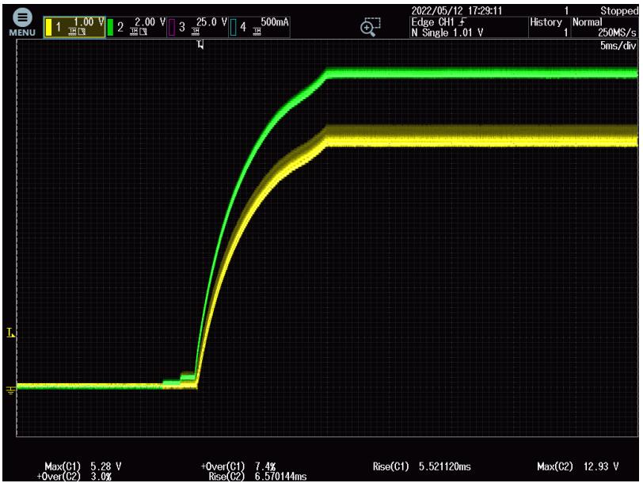

85 VAC

CH1 VOUT\_5V trise= 5.5 mS

CH2 VOUT\_12V t = 6.6 mS

Test Condition:  
➢ Full Load  
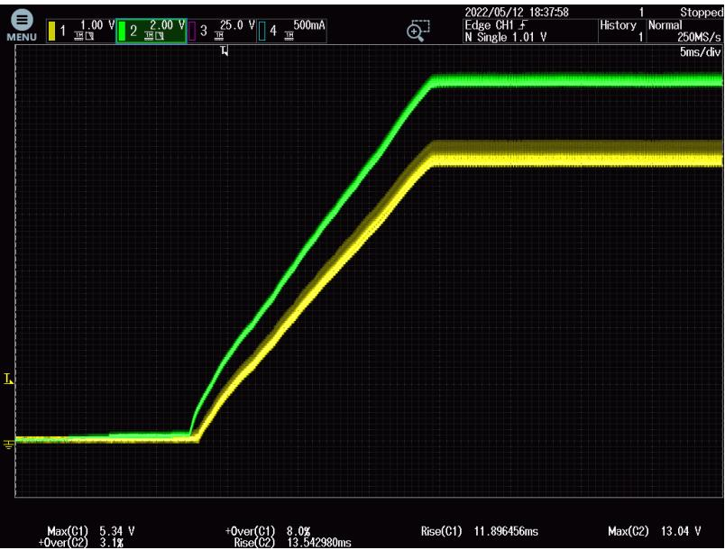

85 VAC

CH1 VOUT\_5V trise= 11.9 mS  
CH2 V trise= 13.5 mS

Test Condition:  
➢ Full Load  

265 VAC

CH1 V t = 3.2 mS

CH2 VOUT\_12V t = 3.7 mS

Test Condition:  
➢ Full Load  
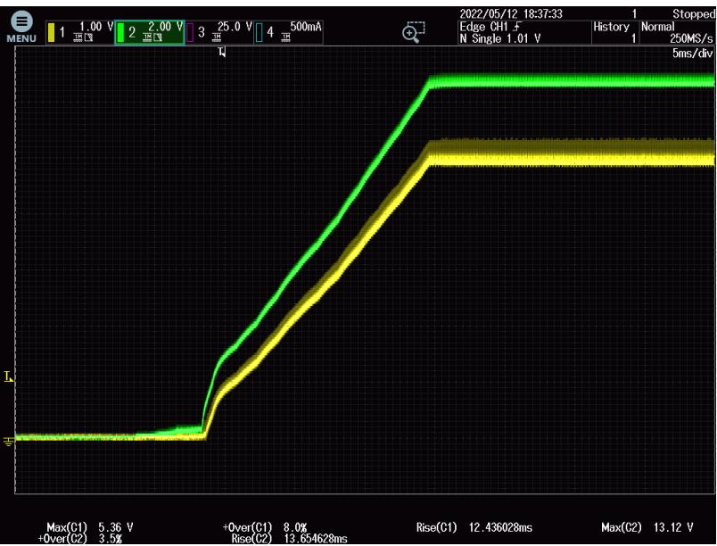

265 VAC

CH1 VOUT\_5V t = 12.4 mS  
CH2 V t = 13.7 mS

Test Condition:

➢ Full Load

## MOSFET

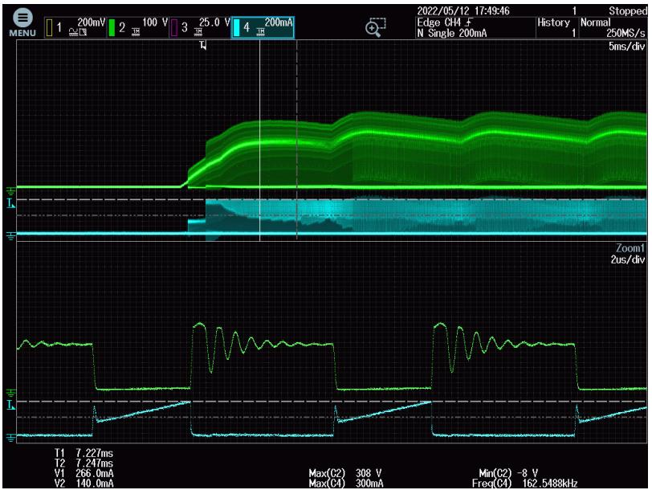

85 VAC

CH2 VDS  
CH4 IDS

$$
V _ {D S \_ M A X} = 3 0 8 \mathrm{V}
$$

$$
I _ {D S \_ M A X} = 3 0 0 \mathrm{mA}
$$

## Test Condition:

➢ Full Load

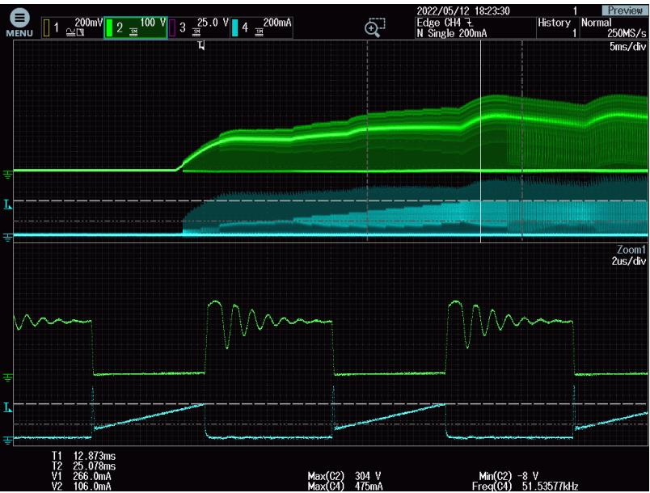

85 VAC

CH2 VDS  
CH4 IDS

$$
V _ {D S \_ M A X} = 3 0 4 \mathrm{V}
$$

$$
I _ {D S \_ M A X} = 4 7 5 \mathrm{mA}
$$

## Test Condition:

➢ Full Load

265 VAC

CH2 VDS  
CH4 IDS

$$
V _ {D S \_ M A X} = 5 6 4 \mathrm{V}
$$

$$
I _ {D S \_ M A X} = 4 6 0 \mathrm{mA}
$$

## Test Condition:

➢ Full Load

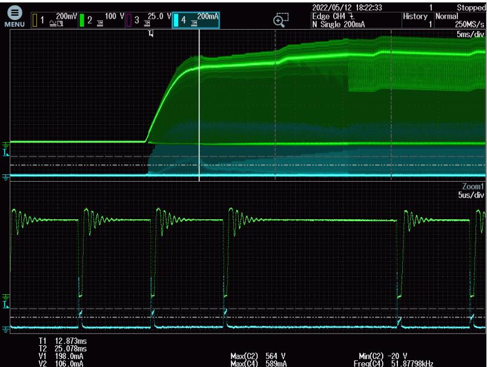

265 VAC

CH2 VDS  
CH4 IDS

$$
V _ {D S \_ M A X} = 5 6 4 \mathrm{V}
$$

$$
I _ {D S \_ M A X} = 5 8 9 \mathrm{mA}
$$

## Test Condition:

➢ Full Load

## MOSFET

85 VAC  

Test Condition:  
➢ Full Load

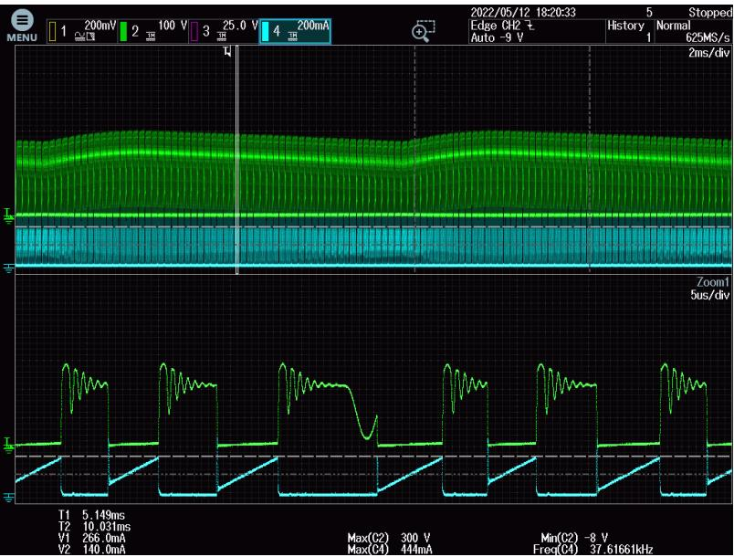

85 VAC  

Test Condition:  
➢ Full Load

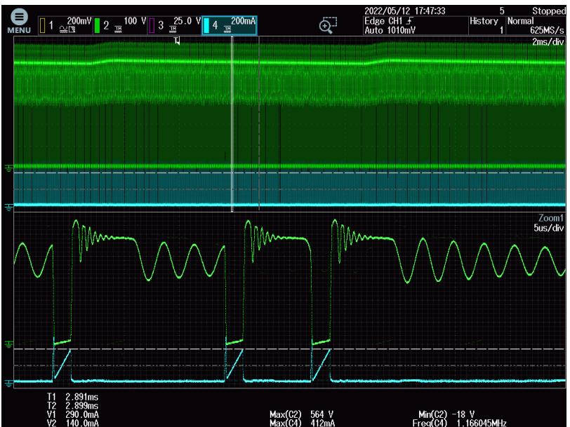

265 VAC  

Test Condition:  
➢ Full Load

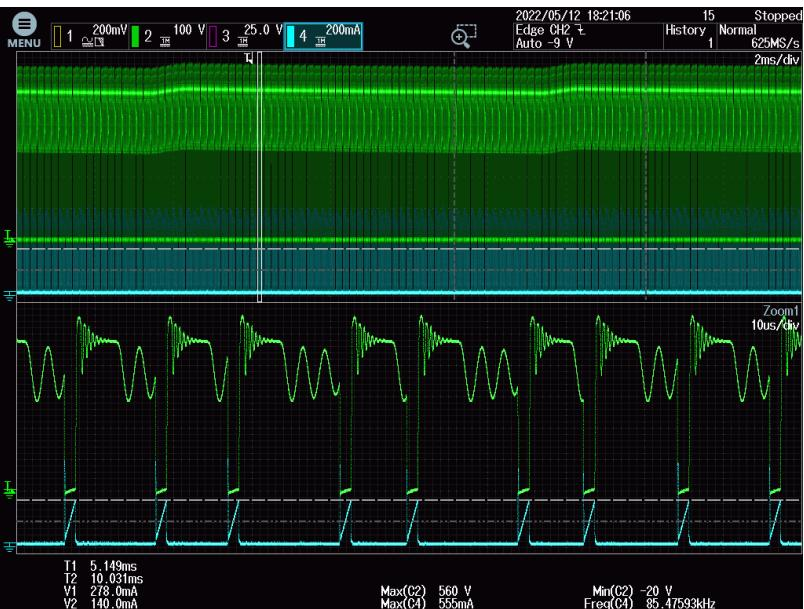

265 VAC  
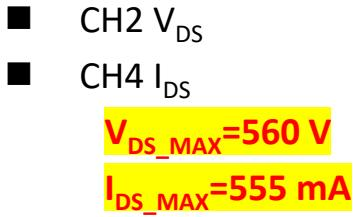

Test Condition:  
➢ Full Load

## MOSFET

85 VAC  

Test Condition:  
➢ Full Load

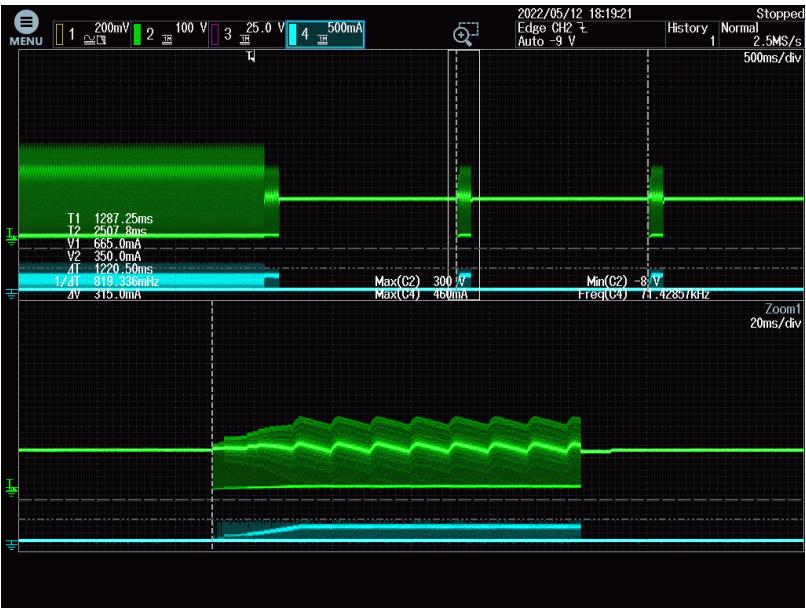

85 VAC  
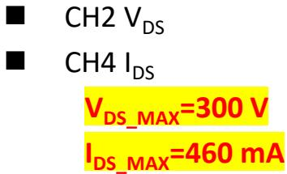

Test Condition:  
➢ Full Load

265 VAC  

Test Condition:  
➢ Full Load

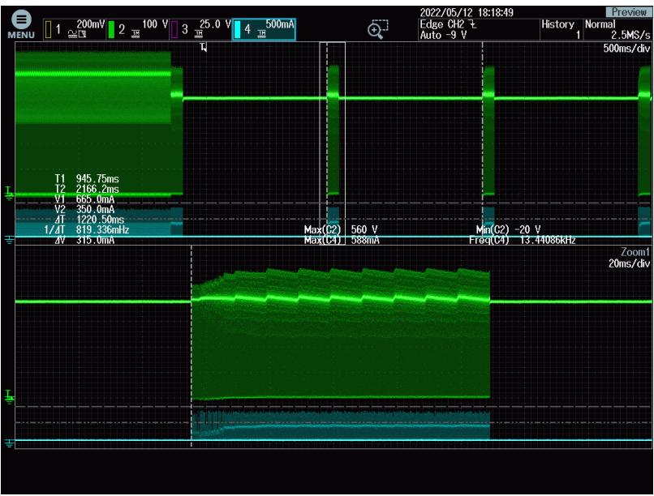

265 VAC  

Test Condition:  
➢ Full Load

## 输出二极管D800开机波形

85 VAC

CH2 VR\_5V  
CH3 VR\_12V

$$
V _ {R - 5 V \_ M A X} = 2 2. 3 \mathrm{V}
$$

$$
V _ {R - 1 2 V \_ M A X} = 6 1 \mathrm{V}
$$

## Test Condition:

➢ Full Load

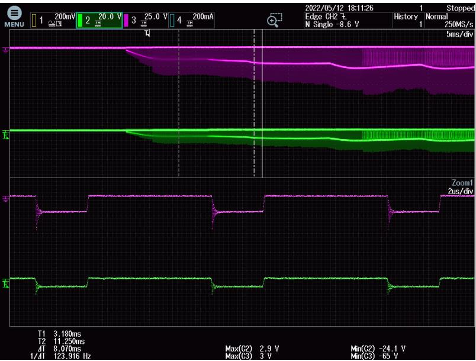

85 VAC

CH2 VR\_5V  
CH3 VR\_12V

$$
V _ {R - 5 V \_ M A X} = 2 4. 1 \mathrm{V}
$$

$$
V _ {R - 1 2 V \_ M A X} = 6 5 \mathrm{V}
$$

## Test Condition:

➢ Full Load

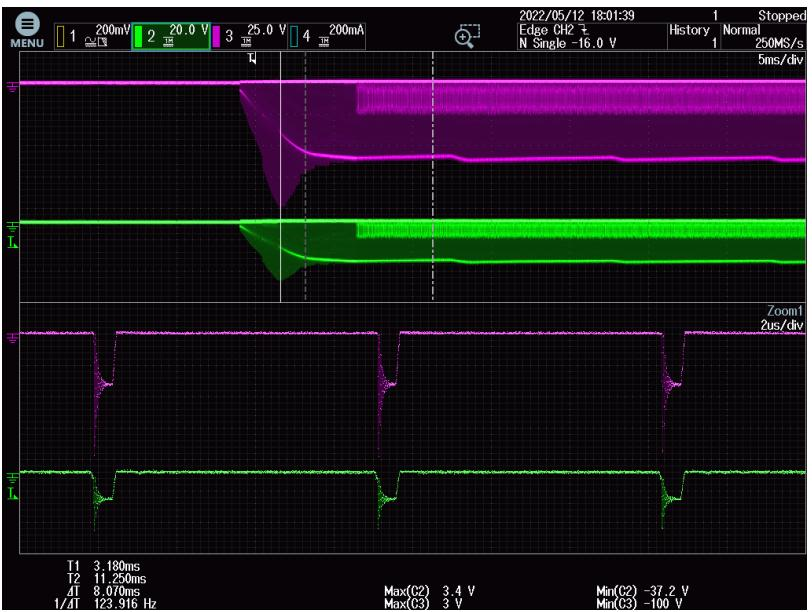

265 VAC

CH2 VR\_5V  
CH3 VR\_12V

$$
V _ {R - 5 V \_ M A X} = 3 7. 2 \mathrm{V}
$$

$$
V _ {R - 1 2 V \_ M A X} = 1 0 0 \mathrm{V}
$$

## Test Condition:

➢ Full Load

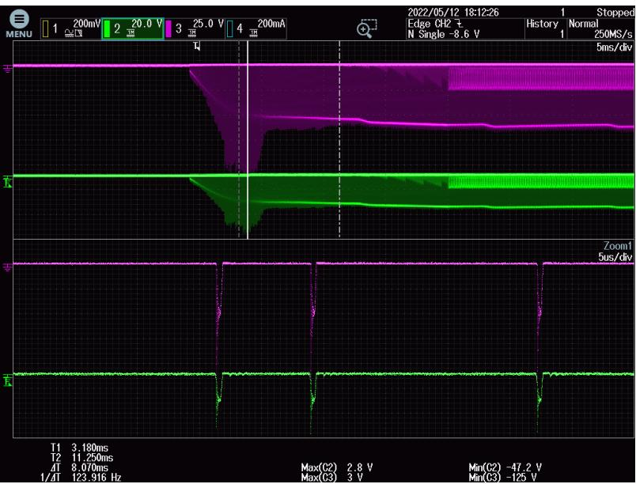

265 VAC

CH2 VR\_5V  
CH3 VR\_12V

$$
V _ {R - 5 V \_ M A X} = 4 7. 2 \mathrm{V}
$$

$$
V _ {R - 1 2 V \_ M A X} = 1 2 5 \mathrm{V}
$$

## Test Condition:

➢ Full Load

## 输出二极管D800稳态波形

85 VAC

CH2 VR\_5V  
CH3 VR\_12V

$$
V _ {R - 5 V \_ M A X} = 2 2. 4 \mathrm{V}
$$

$$
V _ {R - 1 2 V \_ M A X} = 6 2 \mathrm{V}
$$

## Test Condition:

➢ Full Load

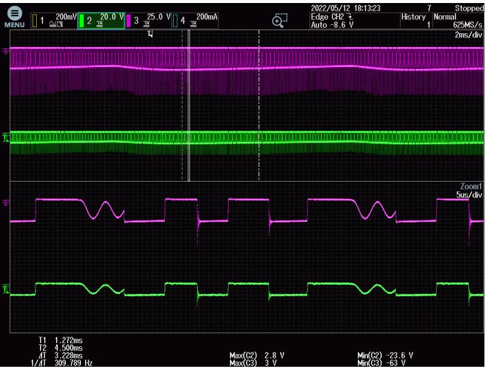

85 VAC

CH2 VR\_5V  
CH3 VR\_12V

$$
V _ {R - 5 V \_ M A X} = 2 3. 6 \mathrm{V}
$$

$$
V _ {R - 1 2 V \_ M A X} = 6 3 \mathrm{V}
$$

## Test Condition:

➢ Full Load

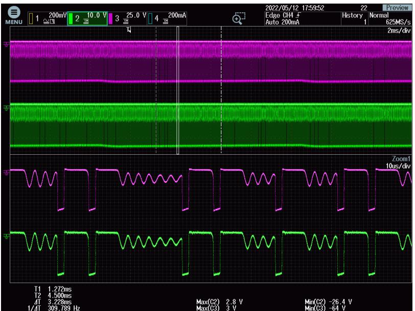

265 VAC

CH2 VR\_5V  
CH3 VR\_12V

$$
V _ {R - 5 V \_ M A X} = 2 6. 4 \mathrm{V}
$$

$$
V _ {R - 1 2 V \_ M A X} = 6 4 \mathrm{V}
$$

## Test Condition:

➢ Full Load

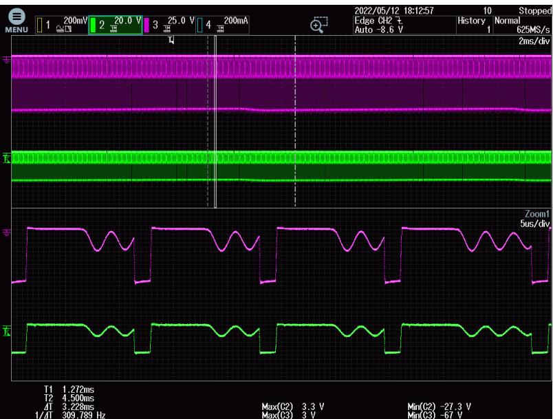

265 VAC

CH2 VR\_5V  
CH3 VR\_12V

$$
V _ {R - 5 V \_ M A X} = 2 7. 3 \mathrm{V}
$$

$$
V _ {R - 1 2 V \_ M A X} = 6 7 \mathrm{V}
$$

## Test Condition:

➢ Full Load

## 输出短路保护 D800

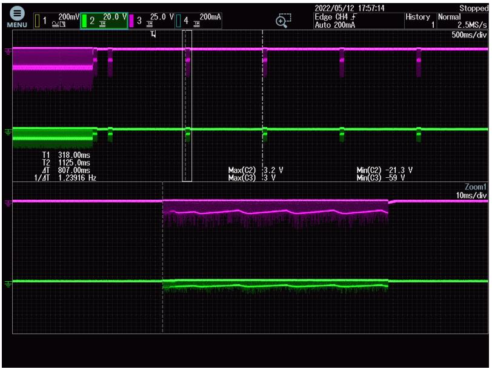

85 VAC

CH2 VR\_5V  
CH3 VR\_12V

$$
\begin{array}{l} \mathrm {V_ {R - 5V\_MAX}} = 2 1. 3 \mathrm{V} \\ \mathrm {V_ {R - 12V\_MAX}} = 5 9 \mathrm{V} \end{array}
$$

## Test Condition:

➢ Full Load

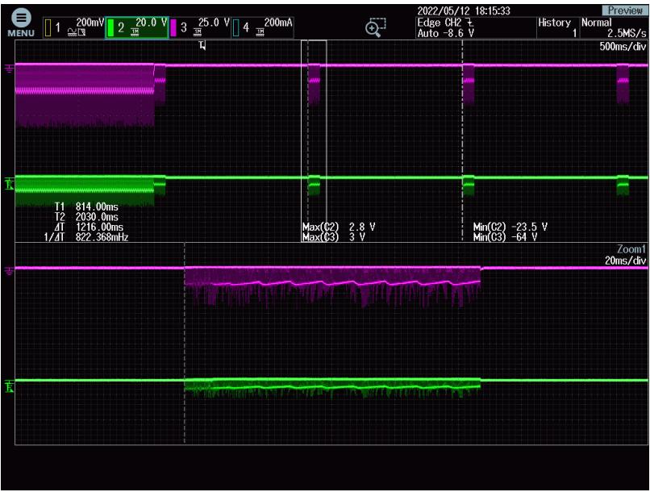

85 VAC

CH2 VR\_5V  
CH3 VR\_12V

$$
\begin{array}{l} \mathrm {V_ {R - 5V\_MAX}} = 2 3. 5 \mathrm{V} \\ \mathrm {V_ {R - 12V\_MAX}} = 6 4 \mathrm{V} \end{array}
$$

## Test Condition:

➢ Full Load

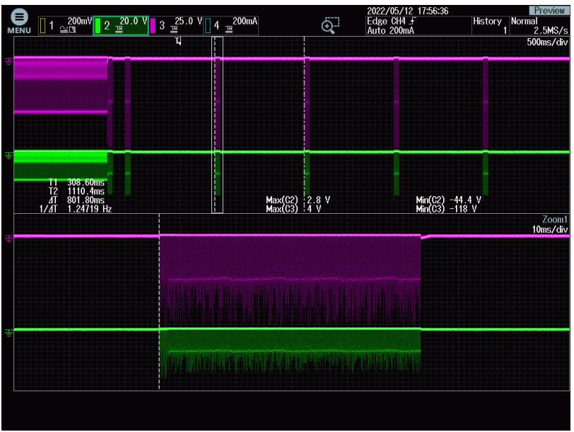

265 VAC

CH2 VR\_5V  
CH3 VR\_12V

$$
V _ {R - 5 V \_ M A X} = 4 4. 4 \mathrm{V}
$$

$$
V _ {R - 1 2 V \_ M A X} = 1 1 8 \mathrm{V}
$$

## Test Condition:

➢ Full Load

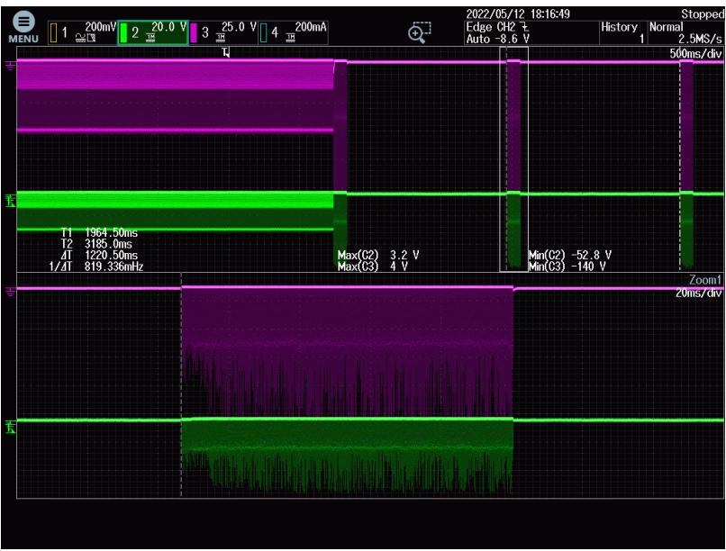

265 VAC

CH2 VR\_5V  
CH3 VR\_12V

$$
V _ {R - 5 V \_ M A X} = 5 2. 8 \mathrm{V}
$$

$$
V _ {R - 1 2 V \_ M A X} = 1 4 0 \mathrm{V}
$$

## Test Condition:

➢ Full Load

## 温升测试

BPA8604P

<table><tr><td rowspan="2">项目</td><td>90VAC</td><td>115VAC</td><td>230VAC</td><td>265VAC</td></tr><tr><td>温度(°C)</td><td>温度(°C)</td><td>温度(°C)</td><td>温度(°C)</td></tr><tr><td>环境温度</td><td>38.5</td><td>39</td><td>38.3</td><td>39.1</td></tr><tr><td>BPA8604P (U4)</td><td>104.1</td><td>88.7</td><td>88.9</td><td>92.2</td></tr><tr><td>变压器绕组(TR1)</td><td>68.1</td><td>66.2</td><td>68.1</td><td>69.1</td></tr><tr><td>变压器磁芯(TR1)</td><td>64.4</td><td>62.8</td><td>64.9</td><td>66</td></tr></table>

BPA8604P在85VAC输入满载输出情 况下会过温保护，故测试的90VAC时 的温升

PN8192

<table><tr><td rowspan="2">项目</td><td>85VAC</td><td>115VAC</td><td>230VAC</td><td>265VAC</td></tr><tr><td>温度(°C)</td><td>温度(°C)</td><td>温度(°C)</td><td>温度(°C)</td></tr><tr><td>环境温度</td><td>38.6</td><td>38.6</td><td>38.4</td><td>38.9</td></tr><tr><td>BPA8604P (U4)</td><td>92.7</td><td>82.7</td><td>93</td><td>100.7</td></tr><tr><td>变压器绕组(TR1)</td><td>65.7</td><td>64.2</td><td>67.3</td><td>69</td></tr><tr><td>变压器磁芯(TR1)</td><td>62.8</td><td>61.8</td><td>64.7</td><td>65.8</td></tr></table>

115VAC Line

115VAC Neutral

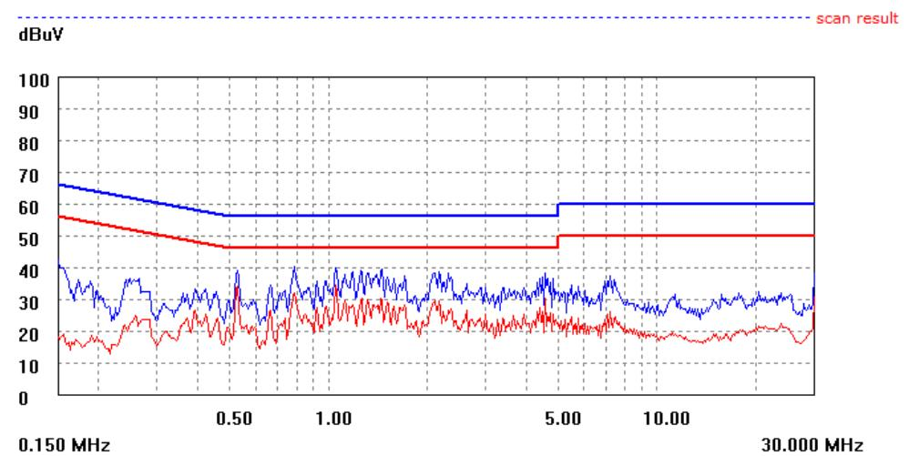

115VAC Line

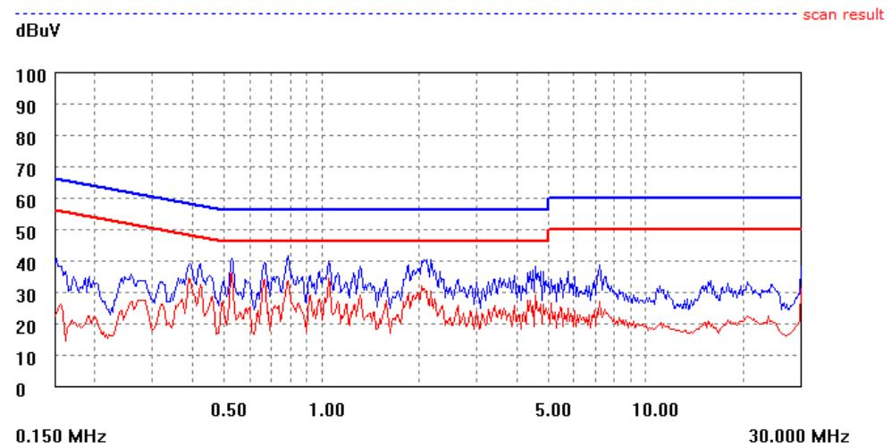

115VAC Neutral

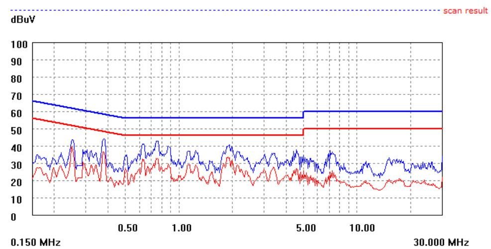

230VAC Line

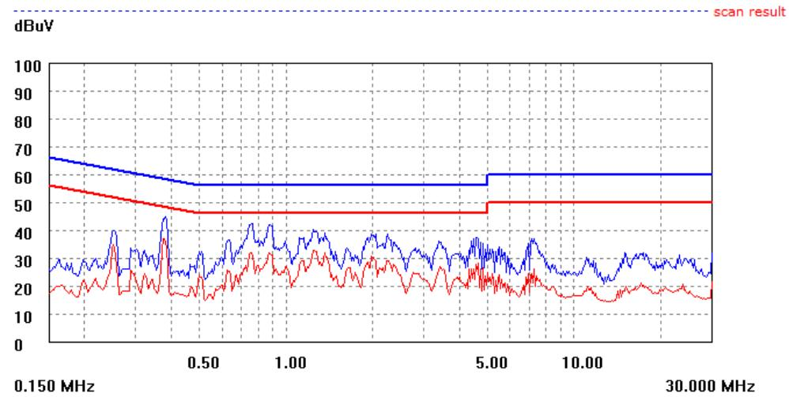

230VAC Neutral

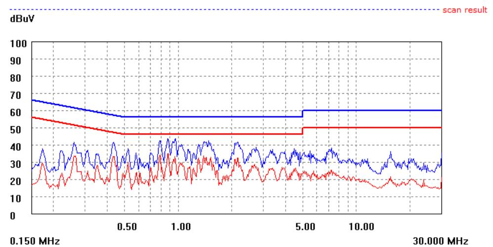

230VAC Line

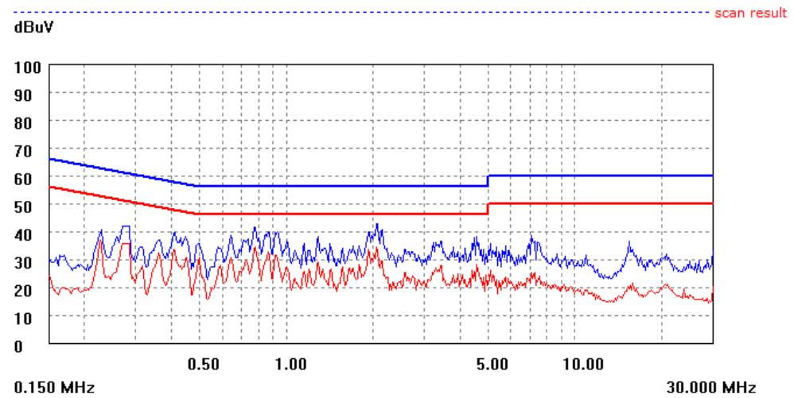

230VAC Neutral

115VAC Neutral

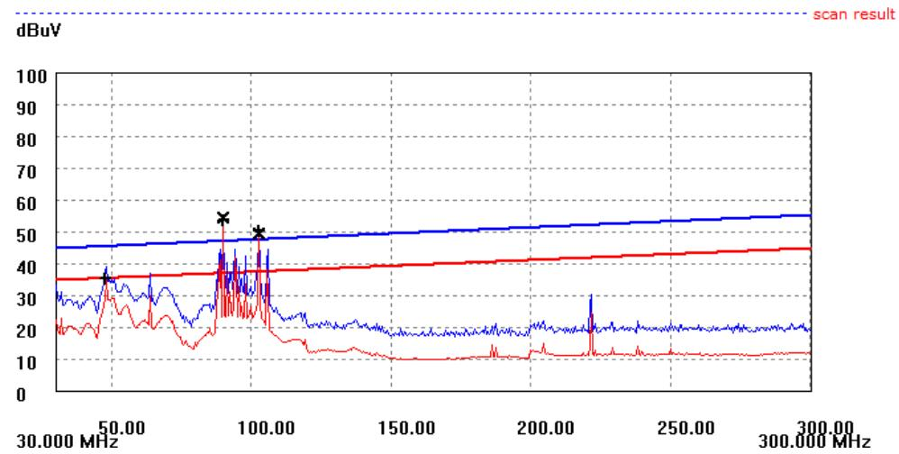

230VAC Neutral

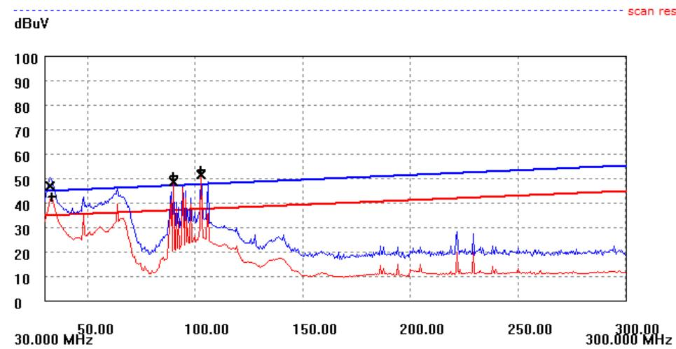

115VAC Neutral

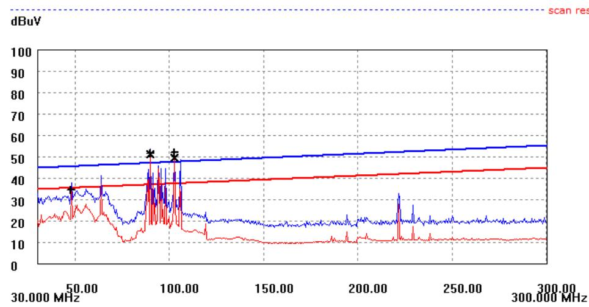

230VAC Neutral

## ❑ 建议

D1 100V RC  
D2 RC  
100K 100K 85VAC 效率可提升1.3%左右，芯片温升会降低

## THANK YOU FOR WATCHING
