## 概述

BPA8604P 是一款高性能、高集成度、低待机功耗的开关电源驱动芯片，主要应用于微波炉等小家电产品中的辅助电源。芯片集成交流电压过零检测与过零信号输出功能，交流电压过零信号可用于对继电器、可控硅等器件进行过零开关，降低开关应力，延长器件寿命。

BPA8604P 芯片内部集成了 750V 高压 MOSFET、高压启动和自供电电路、电流采样电路。采用简单的脉冲数控制，无需外部环路补偿电路，具有较高的环路带宽和快速的动态响应。采用 132kHz 的开关频率，能够有效地减小变压器体积，采用了频率调制技术以实现优异的EMI性能。高集成度和优化的控制技术极大地减少了外围器件数量，节省了系统成本和体积，同时提高了可靠性。

BPA8604P 提供了丰富的保护功能，包括输出短路保护、输出过载保护、反馈开路保护、逐周期限流、过温保护等。

BPA8604P 芯片采用 DIP-7 封装，增加了 MOSFET 漏极到源极的爬电距离，使得芯片能够应用于较复杂的工作环境。MOSFET 源极作为散热管脚，可以较好地利用 PCB 散热而不影响 EMI 性能。

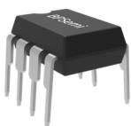  
DIP-7 封装

## 典型应用

## 特点

集成交流电压过零检测与过零信号输出功能  
内部集成 750V 高压 MOSFET  
低待机功耗，<50mW@230VAC辅助绕组供电，<150mW@230VAC 高压自供电  
优异的动态响应速度，无输出过冲  
集成高压启动和自供电电路  
改善 EMI 性能的频率调制技术  
通过 MOSFET 源极 PCB 散热，不影响 EMI  
保护功能  
 输出短路保护(SCP)  
 输出过载保护(OLP)  
 反馈开路保护  
 逐周期限流(Cycle-by-Cycle)  
 迟滞过温保护(OTP)

## 应用领域

微波炉辅助电源  
家用电器辅助电源

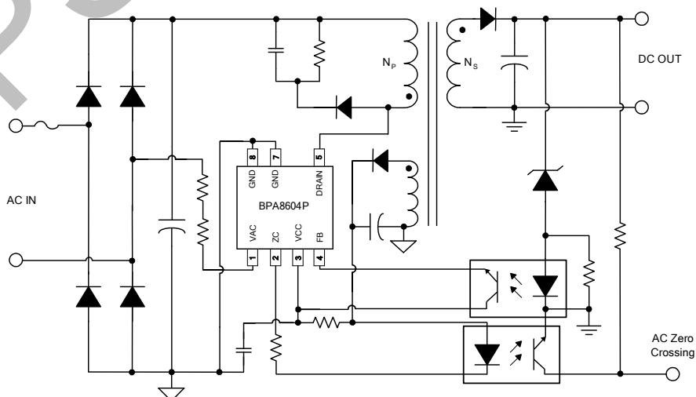

图 1. BPA8604P 过零检测典型应用电路

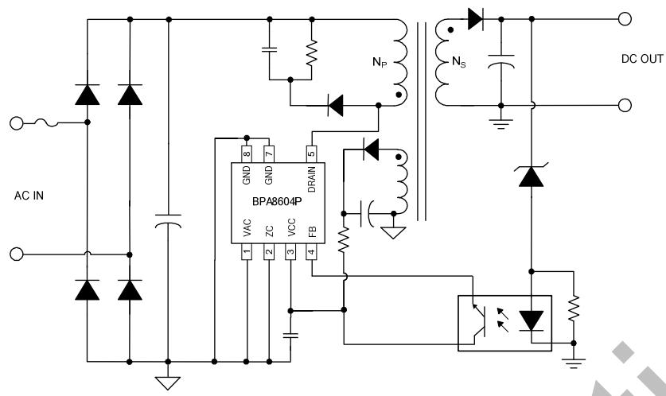

图 2. BPA8604P 无过零检测典型应用电路

定购信息

<table><tr><td>定购型号</td><td>封装</td><td>包装形式</td><td>打印</td></tr><tr><td>BPA8604P</td><td>DIP-7</td><td>管装50颗/管</td><td>BPA8604XXXXYYZZWWP</td></tr></table>

## 管脚封装

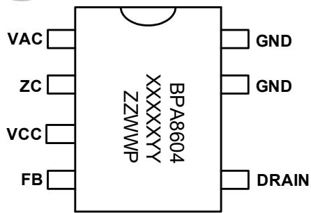

BPA8604：产品型号  
XXXXXYY: 批次号  
ZZ: 标示  
WW：周号  
P：封装代码（P代表 DIP-7）  
图 3. DIP-7 管脚封装图

管脚描述

<table><tr><td>管脚号</td><td>管脚名称</td><td>描述</td></tr><tr><td>1</td><td>VAC</td><td>过零检测输入端,如果不需要过零检测功能将此引脚接芯片地</td></tr><tr><td>2</td><td>ZC</td><td>过零信号输出端,如果不需要过零检测功能将此引脚接芯片地</td></tr><tr><td>3</td><td>VCC</td><td>芯片电源端,连接一个0.1μF~1μF的陶瓷电容到芯片地做旁路电容</td></tr><tr><td>4</td><td>FB</td><td>输出反馈控制端</td></tr><tr><td>5</td><td>DRAIN</td><td>芯片内部高压MOSFET漏极,此引脚也向芯片内部提供自供电电流</td></tr><tr><td>7、8</td><td>GND</td><td>芯片地,内部MOSFET源极</td></tr></table>

输出功率推荐表

<table><tr><td colspan="5">输出功率表</td></tr><tr><td rowspan="2">型号</td><td colspan="2">230VAC ±15%</td><td colspan="2">85~265VAC</td></tr><tr><td>适配器(注 1)</td><td>开放式(注 2)</td><td>适配器(注 1)</td><td>开放式(注 2)</td></tr><tr><td>BPA8604P</td><td>5.5W</td><td>9W</td><td>4W</td><td>6W</td></tr></table>

注 1：最小连续输出功率，测试条件为封闭式塑料外壳，环境温度为50℃。  
注 2：最小连续输出功率，测试条件为开放式环境，环境温度为50℃。

极限参数(注 3) (无特别说明情况下， ${ \sf T } _ { \sf A } = 2 5 ^ { \circ } { \sf C } )$

<table><tr><td>符号</td><td>参数</td><td>参数范围</td><td>单位</td></tr><tr><td> $V_{DRAIN}$ </td><td>内部高压 MOSFET 漏极到源极电压</td><td>-0.3~750</td><td>V</td></tr><tr><td> $I_{DS\_MAX}$ </td><td>内部高压 MOSFET 最大漏极电流(注 4)</td><td>480 (900)</td><td>mA</td></tr><tr><td> $V_{CC}$ </td><td>VCC 电压</td><td>-0.3~9</td><td>V</td></tr><tr><td> $I_{CC\_MAX}$ </td><td>VCC 引脚最大电流</td><td>10</td><td>mA</td></tr><tr><td> $V_{AC}$ </td><td>过零检测输入端电压</td><td>-0.3~9</td><td>V</td></tr><tr><td> $I_{AC\_MAX}$ </td><td> $V_{AC}$ 引脚最大电流</td><td>1</td><td>mA</td></tr><tr><td> $V_{ZC}$ </td><td>过零信号输出端电压</td><td>-0.3~40</td><td>V</td></tr><tr><td> $I_{ZC\_MAX}$ </td><td> $V_{ZC}$ 引脚最大电流</td><td>6</td><td>mA</td></tr><tr><td> $V_{FB}$ </td><td>输出电压反馈端电压</td><td>-0.3~9</td><td>V</td></tr><tr><td> $P_{DMAX}$ </td><td>功耗(注 5)</td><td>1.5</td><td>W</td></tr><tr><td> $\theta_{JA}$ </td><td>结到环境的热阻(注 6)</td><td>80</td><td>°C/W</td></tr><tr><td> $\theta_{JC}$ </td><td>结到芯片表面的热阻(注 6)</td><td>20</td><td>°C/W</td></tr><tr><td> $T_J$ </td><td>工作结温范围</td><td>-40 to 150</td><td>°C</td></tr><tr><td> $T_{STG}$ </td><td>储存温度范围</td><td>-55 to 150</td><td>°C</td></tr><tr><td>ESD</td><td>人体模型 ESD(注 7)</td><td>2</td><td>kV</td></tr></table>

注 3：极限参数是指超出该工作范围，芯片有可能损坏。电气参数定义了器件在工作范围内并且在保证特定性能指标的测试条件下的直流和交流电参数规范。对于未给定上下限值的参数，该规范不予保证其精度，但其典型值合理反映了器件性能。  
注 4：当漏极电压低于 400V时，可允许更高的最大漏极电流。  
注 5：温度升高最大功耗一定会减小，这也是由 $T _ { \Delta M A X } , \theta _ { J A } ,$ 和环境温度 T 所决定的。最大允许功耗为 $P _ { D M A X } = ( T _ { J M A X } - T _ { A } ) / \theta _ { J A }$ 或是极限范围给出的数字中比较低的那个值。  
注 6：1 平方英寸双层PCB板，按照JEDEC 标准测试。  
注 7：按照 JEDEC 标准测试, 100pF 电容通过 1.5kΩ 电阻放电。

电气参数 (注 8)（无特别说明情况下，VCC =5.9V, TA =25℃）

<table><tr><td>符号</td><td>描述</td><td>条件</td><td>最小值</td><td>典型值</td><td>最大值</td><td>单位</td></tr><tr><td colspan="7">VCC供电部分</td></tr><tr><td> $V_{CC\_ON}$ </td><td>VCC启动阈值电压</td><td></td><td>5.6</td><td>5.9</td><td>6.2</td><td>V</td></tr><tr><td> $V_{CC\_HYS}$ </td><td>VCC引脚电压迟滞</td><td></td><td>0.8</td><td>1.0</td><td>1.2</td><td>V</td></tr><tr><td> $V_{CC\_SHUNT}$ </td><td>VCC引脚分流电压</td><td></td><td>5.85</td><td>6.3</td><td>6.75</td><td>V</td></tr><tr><td> $I_{CC\_standby}$ </td><td>VCC待机电流</td><td>FB电流&gt; $I_{FB\_DIS}$ (MOSFET无开关动作)</td><td></td><td>200</td><td></td><td>μA</td></tr><tr><td> $I_{CC}$ </td><td>VCC最大工作电流</td><td>FB开路(MOSFET工作于开关频率)</td><td></td><td>260</td><td></td><td>μA</td></tr><tr><td> $I_{CH1}$ </td><td>内部高压电流源提供给</td><td> $V_{CC}=0V, T_J=25°C$ </td><td></td><td>-2.1</td><td></td><td>mA</td></tr><tr><td> $I_{CH2}$ </td><td>VCC电容充电电流</td><td> $V_{CC}=4V, T_J=25°C$ </td><td></td><td>-3.1</td><td></td><td>mA</td></tr><tr><td colspan="7">控制功能</td></tr><tr><td> $V_{FB}$ </td><td>FB引脚电压</td><td> $I_{FB}=I_{FB\_DIS}$ </td><td>1.8</td><td>2.2</td><td>2.4</td><td>V</td></tr><tr><td> $I_{FB\_DIS}$ </td><td>使MOSFET驱动脉冲关闭的FB引脚阈值电流</td><td></td><td>30</td><td>57</td><td>84</td><td>μA</td></tr><tr><td> $t_{AR}$ </td><td>自动重启导通时间/故障检测时间</td><td></td><td></td><td>45</td><td></td><td>ms</td></tr><tr><td> $t_{AR\_OFF1}$ </td><td>自动重启等待时间1</td><td></td><td></td><td>750</td><td></td><td>ms</td></tr><tr><td> $t_{AR\_OFF2}$ </td><td>自动重启等待时间2</td><td></td><td></td><td>115</td><td></td><td>ms</td></tr><tr><td> $t_{SS}$ </td><td>软启动时间</td><td></td><td></td><td>192</td><td></td><td>cycles</td></tr><tr><td> $D_{AR}$ </td><td>自动重启占空比</td><td></td><td></td><td>6.0</td><td></td><td>%</td></tr><tr><td colspan="7">振荡器</td></tr><tr><td rowspan="2"> $f_{OSC}$ </td><td rowspan="2">振荡器频率</td><td>平均值</td><td>124</td><td>132</td><td>140</td><td>kHz</td></tr><tr><td>峰-峰值</td><td></td><td>8</td><td></td><td>kHz</td></tr><tr><td> $f_M$ </td><td>调制频率</td><td></td><td></td><td>1</td><td></td><td>kHz</td></tr><tr><td> $D_{MAX}$ </td><td>最大占空比</td><td></td><td></td><td>65</td><td></td><td>%</td></tr><tr><td colspan="7">过零检测</td></tr><tr><td> $V_{TH\_R}$ </td><td>过零检测上升阈值电压</td><td> $T_J=25°C$ </td><td></td><td>1.2</td><td></td><td>V</td></tr><tr><td> $V_{TH\_F}$ </td><td>过零检测下降阈值电压</td><td> $T_J=25°C$ </td><td></td><td>0.91</td><td></td><td>V</td></tr><tr><td> $V_{TH\_HYS}$ </td><td>过零阈值电压迟滞</td><td> $T_J=25°C$ </td><td></td><td>0.29</td><td></td><td>V</td></tr><tr><td> $VO_{ZCL}$ </td><td>ZC输出低电平</td><td> $I_{ZC}=5mA, T_J=25°C$ </td><td></td><td>230</td><td></td><td>mV</td></tr><tr><td> $TD_{ZC}$ </td><td>ZC输出延时</td><td> $T_J=25°C$ </td><td></td><td>300</td><td></td><td>μs</td></tr><tr><td colspan="7">电流采样</td></tr><tr><td> $I_{LIMIT\_MAX}$ </td><td>最大电流限值</td><td> $T_J=25°C$ </td><td>233</td><td>250</td><td>268</td><td>mA</td></tr><tr><td> $I_{LIMIT\_MIN}$ </td><td>最小电流限值</td><td> $T_J=25°C$ </td><td></td><td>0.4* $I_{LIMIT\_MAX}$ </td><td></td><td>mA</td></tr><tr><td> $I^{2}f$  $t_{\text{LEB}}$ </td><td>功率系数前沿消隐时间</td><td> $T_J=25°C$  $T_J=25°C$ </td><td>0.9×</td><td> $I^{2}f$ 250</td><td>1.18×</td><td> $A^{2}kHz$ ns</td></tr><tr><td> $t_{\text{OFF\_Delay}}$ </td><td>MOSFET关断延时</td><td> $T_J=25°C$ </td><td></td><td>150</td><td></td><td>ns</td></tr><tr><td colspan="7">功率管</td></tr><tr><td> $R_{DS_ON}$ </td><td>功率管导通阻抗</td><td> $I_{DS}=25mA,T_J=25°C$ </td><td></td><td>20</td><td>23</td><td>Ω</td></tr><tr><td> $I_{DSS}$ </td><td>功率管关断漏电流</td><td> $V_{DS}=560V,T_J=25°C$ </td><td></td><td></td><td>50</td><td>μA</td></tr><tr><td> $B_{VDSS}$ </td><td>功率管的击穿电压</td><td> $V_{CC}=6.2V,V_{FB}=0V,T_J=25°C$ </td><td>750</td><td></td><td></td><td>V</td></tr><tr><td> $V_{DS\_SUP}$ </td><td>最小漏极启动电压</td><td></td><td></td><td>50</td><td></td><td>V</td></tr><tr><td colspan="7">过温保护</td></tr><tr><td> $T_{OTP}$ </td><td>过温保护阈值</td><td></td><td></td><td>140</td><td></td><td>°C</td></tr><tr><td> $T_{HYST}$ </td><td>过温保护迟滞</td><td></td><td></td><td>75</td><td></td><td>°C</td></tr></table>

注 8：规格书的最小、最大规范范围由测试保证，典型值由设计、测试或统计分析保证。

## 内部结构框图

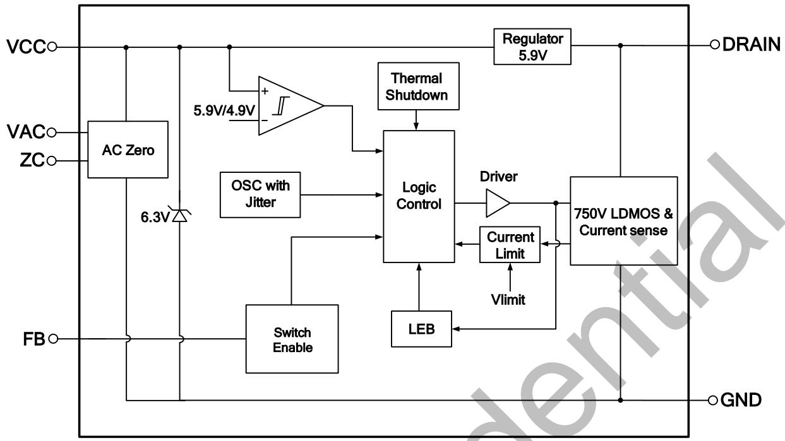

图 4. BPA8604P 内部框图

## 功能描述

BPA8604P 是一款高性能、高集成度、低待机功耗的开关电源驱动芯片，主要应用于微波炉等小家电产品中的辅助电源。芯片集成交流电压过零检测与过零信号输出功能，交流电压过零信号可用于对继电器、可控硅等器件进行过零开关，降低开关应力，延长器件寿命。

BPA8604P 芯片在一个器件上集成了 750V 高压功率MOSFET、高压启动和自供电电路、电流采样电路、以及振荡器、逻辑控制、前沿消隐、频率调制等控制电路和一系列保护电路（图 4 所示）。与传统的 PWM(脉宽调制)控制器不同，它使用简单的脉冲数控制方式来调整输出电压，具有较高的环路带宽和快速的动态响应，并且无需外部环路补偿电路。高集成度和经过优化的控制技术极大地减少了外围器件数量，节省了系统成本和体积，使得 BPA8604P 芯片特别适合于隔离反激辅助电源应用。（注 9：以下描述到的参数均为电气参数列表中的典型值，除非特别说明是最大或最小值）

## 振荡器

内部振荡器产生的平均时钟频率为 132 kHz。振荡器电路生成最大占空比(DCMAX)信号及每个开关周期开始的时钟信号。对开关频率进行一定的调制可以降低 EMI 的平均和准峰值，

BPA8604P 在 132 kHz 基础上设置 8 kHz 峰峰值用来降低EMI，频率调制速率为1 kHz。频率调制功能可以通过示波器观察到，测试时应把示波器触发设定在漏极电压波形的下降沿来测量。

## 高压启动与 VCC供电

系统上电后，当母线电压达到芯片漏极供电启动电压 VDS\_SUP时，内部高压启动电路通过 DRAIN 端对 VCC 电容充电。当VCC 电压达到芯片启动阈值电压 VCC\_ON（5.9V）时，芯片内部控制电路开始工作（图 5 所示）。

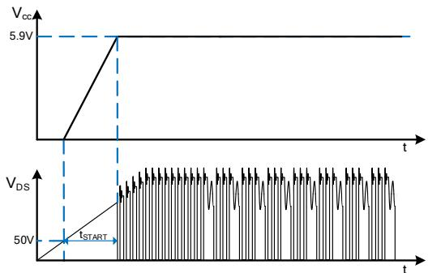

图 5. 高压启动时序

芯片正常工作时，在 MOSFET 关断期间，自供电电路通过DRAIN 脚对 VCC 电容充电并稳压到 5.9V。当无过零检测功能时，由于芯片需要的 VCC 电流极低，无需辅助绕组供电，0.1μF的VCC电容就可以满足MOSFET导通期间芯片的供电需求，节省了变压器成本。这种情况下，空载功耗可以小于150mW@230VC。对于需要过零检测功能的应用，由于高压供电属于线性稳压，尽管芯片的工作电流小，但过零信号输出引脚通过光耦接到 VCC，需要消耗较大的电流，所以要关闭高压供电，使用辅助绕组给 VCC 供电，以实现较低的芯片功耗，降低芯片温升。当辅助绕组电压通过电阻向 VCC 供电电流超过芯片所需电流时，VCC 电压高于 5.9V，高压供电电路关闭。BPA8604P 在 VCC 内置了分流电路，分流电路将VCC 电压钳位到 $\mathsf { V } _ { \mathsf { C C } _ { - } \mathsf { S H U N T } } ( 6 . 4 \mathsf { V } )$ ，通过优化供电电阻值，可以使空载功耗降低到 50mW以下。

## VCC 欠压保护

VCC引脚具有欠压保护功能。工作过程中，当VCC电压下降到低于 $V _ { C C \_ 0 \tt N } - V _ { C C \_ H Y S }$ （4.9V）时，欠压保护电路使芯片关断功率 MOSFET，停止开关动作。VCC 电压需要回升到 VCC\_ON（5.9V）才能重新开启功率 MOSFET，并且会进入软启动过程（图 6 所示）。

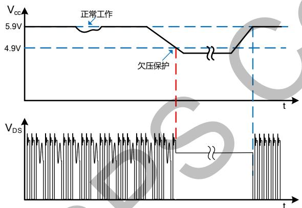

图 6. VCC 欠压保护时序

## 软起动

芯片具有软启动功能，在软启动过程中，MOSFET 峰值电流(限流点)逐渐增加。由于启动时输出电压一般较低，MOSFET 关断期间输出电压对变压器的去磁较少，容易进入深度连续模式(CCM) 使得次级整流二极管的反向恢复电流较大而导致很高的反向电压尖峰；同时由于去磁较少，原边电流在前沿消隐时间内逐渐累积，可能超过MOSFET安全工作区而导致失效。因此，软启动电路通过控制启动过程中

MOSFET 峰值电流逐渐增加，可以避免原边累积过大的电流，从而降低 MOSFET 电流应力和降低次级二极管的电压尖峰。软启动过程如图 7 所示。

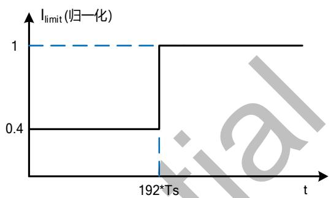

图 7. BPA8604P 软启动过程

起始限流值为 40%\*ILIMIT\_MAX，192 个开关周期后变为最大限流点 $1 \angle 1 1 \angle 1 7 \angle M A X O$ 。由保护电路触发产生的自动重启也会经历一次软启动过程。

## 脉冲数控制

BPA8604P 芯片采用脉冲数控制技术，通过控制脉冲的个数实现输出电压的调整。在每个时钟周期上升沿，比较流入FB脚的电流与阈值电流 IFB\_DIS（57 μA），当 FB 电流小于 IFB\_DIS时，开通功率 MOSFET，反之关闭 MOSFET。因此，当前周期是否开通 MOSFET 只取决于时钟上升沿时刻的 FB 电流大小，一旦开关操作确定，该周期内的开关状态不再受 FB 电流影响（图8所示）。当漏极电流IDS达到限流点或者占空比达到最大占空比时，控制电路关断 MOSFET，直到下一个时钟信号到来。

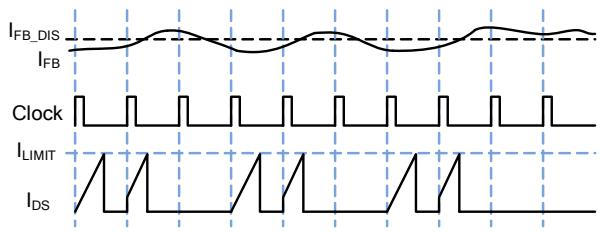

图 8. 脉冲数控制

在典型应用中，FB 脚连接到光耦的发射极，光耦集电极接VCC，光耦次级侧二极管通过串联稳压管接到输出电压两端。当脉冲数过多时，输出电压会偏高，光耦电流增加，FB脚电流也随之增加，使MOSFET不开通从而减小脉冲数形成闭环控制。也可以用 TL431 替代稳压管实现更高的输出电压精度。与传统的 PWM 相比，脉冲数控制具有较高的环路带宽和快速的动态响应，因此开机时输出电压没有过冲。芯片限流点固定，输出负载与脉冲数个数成正比。在最大负载情况下，几乎每个时钟周期都执行开关操作；在稍微降低一些负载的情况下，芯片将跳过一些时钟周期不执行开关操作来维持输出电压的恒定；在中等负载情况下，芯片将跳过更多时钟周期；在空载或者极轻载情况下，芯片跳过的时钟周期将进一步增加。

## 电流检测与限制

BPA8604P芯片内部集成电流采样电路，对MOSFET电流逐周期限制，无需外加电流采样电阻，以实现电流模式控制。当电流超过内部限流点阈值(ILIMIT)时，在该周期剩余阶段会关断功率 MOSFET，直到下一个开关周期开始。内置前沿消隐(Leading Edge Blanking)时间 $\tan \tt { t } _ { L E B }$ 可以避免由于外部电路的容性或次级二极管的反向恢复导致功率MOSFET在开通瞬间出现的电流尖峰误触发 MOSFET 关断。

## 短路/过载/开路保护

BPA8604P 通过 FB 引脚检测输出短路、过载、反馈开路故障。当上述故障发生时，光耦不向FB脚灌入电流，使FB电流小于阈值电流 I 致使每个时钟周期都执行开关操作。上电启动或者自动重启后，如果FB电流在tSC (45ms)时间内持续小于 $\mathsf { I } _ { \mathsf { F B \_ D } \mathsf { s } }$ ，芯片会触发短路保护并进入自动重启时序，等待 $\mathtt { t _ { A R \_ O F F 1 } } ( 7 5 0 \mathsf { m s } )$ 后重新启动。正常工作过程中（或者启动过程FB电流超出 $\mathsf { I } _ { \mathsf { F B \_ D } | \mathsf { S } }$ 使芯片丢过脉冲），当芯片检测到FB电流小于 $\mathsf { I } _ { \mathsf { F B \_ D } \mathsf { s } }$ 并且持续时间超过tOLP（45ms）时，芯片会 触 发 过 载 保 护 并 进 入 自 动 重 启 时 序 ， 芯 片 等 待tAR\_OFF1(115ms)后重新启动，如图 9 所示。

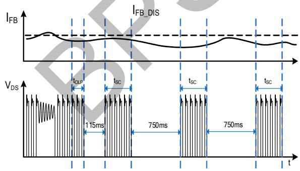

图 9. 故障保护与自动重启时序

## 过温保护

BPA8604P 芯片内置了过温保护电路，当结温达到过温保护阈值 ${ \mathsf { T o } } _ { \mathsf { T P } } \ ( 1 4 0 ^ { \circ } { \mathsf { C } } )$ 时，芯片会停止工作，直到结温下降到TOTP-THYST 时，芯片进入自动重启程序。THYST (75℃)为温度迟滞，较大的温度迟滞有利于把系统温度控制在一个较低的水平。

## 交流电压过零检测

BPA8604P 集成交流电压过零检测与过零信号输出功能，交流电压过零信号可用于对继电器、可控硅等器件进行过零开关，降低开关应力，延长器件寿命，提高系统可靠性。过零信号如图 10 所示。

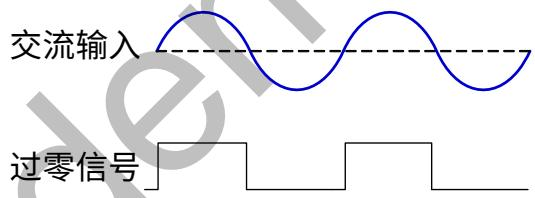

图 10. 交流电压过零检测

VAC 脚是交流电压过零检测输入引脚，外部通过分压电阻连接到交流输入端，考虑到耐压要求，可选择多个电阻串联。ZC 脚是过零检测信号输出引脚，可连接到光耦二极管的阴极，阳极串联限流电阻上拉到辅助绕组输出电解电容。光耦副边可直接串联限流电阻接到输出端，副边过零信号可以经过 RC 滤波后输入到 MCU 中。

## 应用指南

## 选择芯片型号

首先根据具体应用条件，从以下输出功率表中选取合适的型号和封装：

<table><tr><td colspan="5">输出功率表</td></tr><tr><td rowspan="2">型号</td><td colspan="2">230VAC</td><td colspan="2">85~265VAC</td></tr><tr><td>适配器</td><td>开放式</td><td>适配器</td><td>开放式</td></tr><tr><td>BPA8604P</td><td>5.5W</td><td>9W</td><td>4W</td><td>6W</td></tr></table>

表1. 输出功率表

表1列出的最小连续输出功率，是基于合理的散热设计，通常在PCB上将GND引脚（内部MOSFET源极）铺铜皮或使用一个散热器，将其温度控制到110°C或以下。开放式设计的测试环境温度为50°C，密闭式适配器的测试环境温度为40°C。

## 输入电容选择

输入滤波电容对工频电压纹波、传导EMI、以及电源抵抗Surge的能力都起到关键的作用。为了优化变压器的设计，电容量的选取要保证直流母线电压不能过低（通常低压输入时不低于80VDC，高压输入时不低于220VDC），因此电容量取决于输出功率和电源效率。 BPA8604P的应用场合一般功率相对较大，需要用全波整流，根据输出功率可以对输入电容进行初步估计(如表2所示)，全电压或低压输入时， 般取2\~3μF/W；高压输入时，一般取1μF/W。

<table><tr><td>输入</td><td>电压范围(VAC)</td><td>输入电容(μF/W)</td><td>推荐最低母线电压(V)</td></tr><tr><td>全电压</td><td>85~265</td><td>2~3</td><td>≥80V</td></tr><tr><td>低压</td><td>85~132</td><td>2~3</td><td>≥80V</td></tr><tr><td>高压</td><td>185~265</td><td>1</td><td>≥220V</td></tr></table>

表2. 推荐输入电容值和最低母线电压

根据选定的输入电容计算最低母线电压的精确值需要求解一个复杂的方程，为简便起见，通常使用以下公式得到一个相对精确的结果：

$$
V _ {D C \_ M I N} = \sqrt {2 * V _ {A C M I N} ^ {2} - \frac {P _ {O} * (1 - 2 * f _ {L} * t _ {C})}{\eta * C _ {I N} * f _ {L}}}
$$

其中，整流桥的导通时间t 一般取3ms，可以假设效率初始值为80%，fL为输入交流电压频率，VACMIN为最低输入交流电压有效值，PO为额定输出功率，CIN为输入电容容量。最高母线电压可以通过计算得到：

$$
V _ {D C \_ M A X} = \sqrt {2} * V _ {A C M A X}
$$

## 变压器计算

由于BPA8604P最高限流点和开关频率固定不变，最大输出功率取决于变压器的电感量。电感量越大，最大输出功率越大，变压器体积也越大。因此，为了尽可能减小变压器体积，在满足额定输出功率要求的情况下，尽可能选取较小的电感量。变压器的计算按照以下步骤：

## 1) 选取次级反射到初级的电压（VOR）

选取反射电压时，需要同时考虑最高输入电压下初级MOSFET和次级整流二极管的最高耐压值并留一定的裕量。MOSFET最高漏极电压为：

$$
V _ {D R A I N \_ M A X} = V _ {D C \_ M A X} + V _ {O R} + V _ {L K}
$$

其中，VLK为漏感产生的电压尖峰，VOR为次级反射到初级的电压。漏极电压波形如图13所示，通常建议漏极最高电压不超过90%的功率管击穿电压（BVDSS）。次级二极管的最高反向电压为：

$$
V _ {R} = \frac {V _ {D C \_ M A X} * (V _ {O U T} + V _ {D})}{V _ {O R}} + V _ {O U T}
$$

VD为次级二极管的正向导通压降，VOUT为输出电压。通常选取VOR=80\~100V作为起始值开始变压器计算，然后反复迭代计算以达到优化设计的目的。

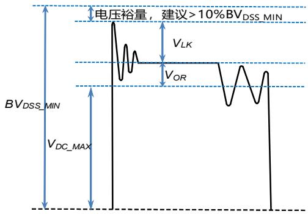

图11. MOSFET漏极电压波形

变压器匝比可以通过以下表达式得到：

$$
\frac {N _ {S}}{N _ {P}} = \frac {V _ {O U T} + V _ {D}}{V _ {O R}}
$$

其中，NP和NS分别为变压器初级和次级匝数。反射电压越高，初次级匝比越大，初级漏感越大，会增加初级MOSFET电压应力和漏感产生的损耗。较高的反射电压虽然可以降低次级二极管的反向电压应力，从而可以使用较低电压的二极管，但是会增加次级的峰值和有效值电流，增加次级绕组和二极管导通损耗。同时，过高的反射电压还会引起传导EMI问题，这是由于非连续模式下初级电感和漏极寄生电容的自由振荡导致的。因此，建议VOR不要超过135V。相反，过小的反射电压会降低连续模式下（低压输入时）的占空比，增加初级电流有效值，降低效率，同时次级二极管的电压应力增加。

2) 计算最低输入电压下的工作模式（CCM或DCM）：

根据变压器伏-秒平衡，稳态工作时最大占空比为：

$$
D _ {M A X} = \frac {V _ {O R}}{V _ {O R} + (V _ {D C \_ M I N} - V _ {D S})}
$$

其中 $\mathsf { V } _ { \mathsf { D S } }$ 为MOSFET导通时的平均压降，通常取10V作为近似值。DCM工作模式下的最大输出功率为：

$$
P _ {M A X \_ D C M} = \frac {1}{2} * V _ {D C \_ M I N} * I _ {L I M I T \_ M A X} * D _ {M A X} * \eta
$$

ILIMIT\_MAX为芯片最高限流点，计算时取对应电气参数表中的下限值。如果 $P _ { M A X \_ D C M } < P _ { 0 }$ ，则说明DCM模式不能满足额定输出功率，需要工作于CCM模式，直接跳到步骤4；如果 $\mathsf { P } _ { \mathsf { M A X \_ D C M } } \geqslant \mathsf { P } _ { 0 }$ ，则可以工作于DCM模式，进入步骤3。

3) DCM模式下初级电感量计算：

$$
L _ {P} = \frac {2 * 0 . 9 * P _ {O} * [ Z * (1 - \eta) + \eta ]}{I _ {L I M I T \_ M A X} ^ {2} * f _ {S} * \eta}
$$

其中，fS为开关频率(取振荡器频率的下限值)，Z为损耗分配因子，即次级损耗占总损耗的比例，没有具体计算数据的情况下可以取0.5。初次计算时，可以假设效率为80%，后期可根据测试结果进行迭代。如果 $L _ { P } { < } L _ { P \_ M I N }$ ，需要减小反射电压VOR，重新回到步骤1，当VOR小于60V时，需要选一个低限流点的芯片；如果 $L _ { P } { > } L _ { P \_ M | N } ,$ ，则跳到步骤6。

4) CCM模式下电流纹波系数计算：

CCM模式下，初级电流的波形如图12所示，电流纹波系数定义为:

$$
K _ {P} = \frac {I _ {R}}{I _ {L I M I T \_ M A X}}
$$

可以计算出初级平均电流：

$$
I _ {A V G} = \left(1 - \frac {K _ {P}}{2}\right) * I _ {L I M I T \_ M A X} * D _ {M A X}
$$

输出功率与初级平均电流的关系为：

$$
P _ {O} = V _ {D C \_ M I N} * I _ {A V G} * \eta
$$

根据上面的关系式可以计算出KP值：

$$
K _ {P} = 2 * (1 - \frac {P _ {O}}{V _ {D C \_ M I N} * \eta * I _ {L I M I T \_ M A X} * D _ {M A X}})
$$

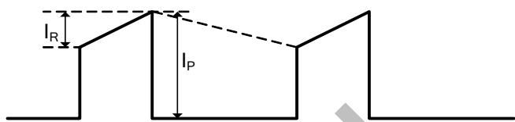

图12. 连续模式下初级电流波形

如果 $\mathsf { K } _ { \mathsf { P } } { < } 0 . 6$ ，则需要增大反射电压，重新回到步骤1，当VOR超过135V时，需要选一个高限流点的芯片；如果$K _ { \mathrm { P } } { > } 0 . 6$ ，则进入步骤5。

5) CCM模式下初级电感量计算：

$$
L _ {P} = \frac {2 * 0 . 9 * P _ {O} * [ Z * (1 - \eta) + \eta ]}{K _ {P} * (2 - K _ {P}) * I _ {L I M I T \_ M A X} ^ {2} * f _ {S} * \eta}
$$

然后进入步骤6。

6) 确定最终电感量：

以上计算出来的都是输出额定电流所需的最小电感量，设计中需要考虑制造商的精度，通常变压器的电感量精度 $\Xi \pm 1 0 \%$ 。因此，为了保证批量生产时能满足最低电感量的要求，需要在计算值的基础上增加10%。

7) 确定初次级匝比：

在确定反射电压VOR后，需要重新计算变压器初次级匝比：

$$
\frac {N _ {P}}{N _ {S}} = \frac {V _ {O R}}{V _ {O U T} + V _ {D}}
$$

8) 计算初次级匝数：

为了抑制反激变压器工作时产生的音频噪声，一般需要控制最大磁通密度 $\mathtt { B } _ { \mathsf { M A X } }$ 不超过3000高斯，在噪声要求很高的应用中，甚至需要低于2500高斯。变压器的匝数越多，磁通密度越小，变压器体积越大，导线损耗也越大。初级匝数计算如下：

$$
N _ {P} = \frac {L _ {P} * I _ {P}}{B _ {M A X} * A _ {E}}
$$

其中，I 为初级电流峰值，计算时取对应电气参数表中最高限流点 $\mathsf { L I M I T \_ M A X } \hat { \mathsf { H } } \breve { \mathsf { J } }$ 上限值， $\mathsf { B } _ { \mathsf { M A X } }$ 为设定的最大磁通密度， $\mathsf { A } _ { \mathsf { E } }$ 为磁芯的有效截面积。然后通过步骤8计算次级匝数NS，并对计算结果进行取整，最后代入上式进行验证，直到 $\mathsf { \Pi } _ { \mathsf { B } _ { \mathsf { M A X } } }$ 满足要求为止。

## 9) 初次级电流有效值计算：

CCM模式下，初级绕组有效值电流为：

$$
I _ {P \_ R M S} = I _ {L I M I T \_ M A X} * \sqrt {\left(1 - K _ {P} + \frac {K _ {P} {} ^ {2}}{3}\right) * D _ {M A X}}
$$

次级绕组电流有效值为：

$$
I _ {S \_ R M S} = I _ {L I M I T \_ M A X} * \frac {N _ {P}}{N _ {S}} * \sqrt {\left(1 - K _ {P} + \frac {K _ {P} ^ {2}}{3}\right) * (1 - D _ {M A X})}
$$

DCM模式下，需要根据最终的初级电感重新计算最大占空比DMAX\_DCM：

$$
D _ {M A X \_ D C M} = \frac {2 * P _ {O}}{V _ {D C \_ M I N} * I _ {L I M I T \_ M A X} * \eta}
$$

初级绕组有效值电流为：

$$
I _ {P \_ R M S} = I _ {L I M I T \_ M A X} * \sqrt {\frac {D _ {M A X \_ D C M}}{3}}
$$

次级绕组电流有效值为：

$$
I _ {S \_ R M S} = I _ {L I M I T \_ M A X} * \frac {N _ {P}}{N _ {S}} * \sqrt {\frac {V _ {D C \_ M I N} * D _ {M A X \_ D C M}}{3 * V _ {O R}}}
$$

## 10) 电流密度和绕组线径

一般根据散热条件选择电流密度，通常无风密闭的环境电流密度4\~6A/mm2，散热条件较好的情况下选择6\~10A/mm2。然后根据步骤10计算的绕组电流有效值计算所需的线径。

## 输出电容的选择

输出电容的作用是滤除次级绕组电流中的交流成分，提供稳定的直流电压给负载，一般根据输出电压纹波要求来选取合适的电容。当输出电流恒定时，输出电压纹波主要由输出电容的 ESR 以及容量决定。

$$
\Delta V _ {O U T} = \Delta V _ {E S R} + \Delta V _ {C}
$$

实际应用中，为了得到较小的 ESR，电容量相对比较大，因此由容量产生的输出电压纹波很小，几乎可以忽略，电压纹波主要由电容的 ESR 产生：

$$
\Delta V _ {O U T} \cong \Delta V _ {E S R} = I _ {L I M I T \_ M A X} * \frac {N _ {P}}{N _ {S}} * E S R
$$

ESR不仅产生输出电压纹波，纹波电流在ESR中产生的损耗还会导致电容发热，缩短电解电容的寿命，因此电解电容一般都会有纹波电流限制。流进电解电容的纹波电流有效值为：

$$
I _ {R I P P L E} = \sqrt {I _ {S \_ R M S} ^ {2} - I _ {O} ^ {2}}
$$

电容厂家的手册中一般给出的是 100℃环境温度下的额定纹波电流有效值，实际应用中的环境温度要低得多，计算电容的额定纹波电流有效值时需要乘以对应的温度因子。当一个电容的纹波电流不能满足时，可以使用多个电容并联。

## 输出二极管选择

在 CCM 模式下，初级 MOSFET 开通瞬间次级二极管反向恢复电流会通过变压器耦合到初级，流经MOSFET并产生损耗，同时也会产生 EMI 问题，过大的电流尖峰还可能会导致MOSFET损坏。DCM模式下，虽然正常工作没有反向恢复问题，但是开机和输出短路等条件下依然是 CCM。因此，次级整流输出二极管一般选择超快恢复二极管或者肖特基二极管。变压器匝比确定后，重新计算次级二极管反向电压为：

$$
V _ {R} = \frac {V _ {D C \_ M A X} * N _ {S}}{N _ {P}} + V _ {O U T}
$$

常用的肖特基二极管耐压一般小于 200V，更高耐压的应用需要选择超快恢复二极管。额定电流一般选取输出电流的 3倍或以上。

## 降低空载功耗

BPA8604P 可通过高压启动电路通过 DRAIN 端对 VCC 电容充电，通常无需在变压器上使用辅助或偏置绕组。230 VAC输入、自供电下的典型空载功耗<150 mW，增加辅助绕组可以进一步降低空载功耗到50mW以下。辅助电压通过一个电阻向 VCC 供电（如图 13 所示），当电流超过芯片所需电流时，VCC电压高于5.9V，高压供电电路关闭。VCC端内置了分流电路，分流电路将VCC电压钳位到6.4V。应选择合适的电阻使得空载时高压供电电路关闭，同时分流电路的电流尽可能小。实际调试时，在空载条件下，通过辅助绕组匝数设定辅助电压在 9\~10V 左右，计算一个电阻值使得电流为电气参数表中的 VCC 待机电流上限值，然后再稍微减小电阻使得留有一定裕量，再次测试 VCC 电压是否为 6.4V 以确认达到分流电路钳位电压。

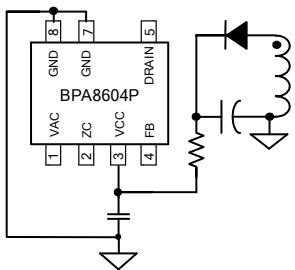

图 13. 辅助绕组供电电路

## 钳位电路计算

反激变换器中由于变压器漏感的存在，在开关管关断瞬间会产生很大的尖峰电压，使得开关管承受较高的电压应力。因此，为确保反激变换器安全可靠工作，必须引入钳位电路吸收漏感能量。其中RCD钳位电路因结构简单、成本低、性能可靠而被广泛应用，如图14所示。初级MOSFET关断时，漏感中的能量通过二极管D1，衰减电阻R2转移到钳位电容C1中，然后通过电阻R1消耗掉。R2的作用是衰减变压器漏感与钳位电容C1形成的高频振荡，一般取20\~100Ω之间，阻值太小起不到衰减作用，太大就会导致漏感能量不能进入钳位电容，使得钳位电路不起作用。钳位二极管D1在小功率应用(≤10W)中可以使用普通二极管，好处是较慢的反向恢复时间会使得钳位电容中的能量部分转移到次级，提高轻载效率，同时对高频振荡起到衰减的作用。功率较大时，普通二极管的反向恢复损耗会导致发热比较严重，因此需要使用快恢复二极管。

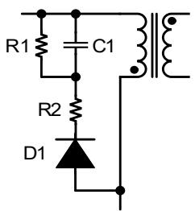

图14. RCD钳位电路

钳位电阻R1和钳位电容C1的计算过程如下，首先计算MOSFET关断瞬间漏感两端电压：

$$
V _ {L k} = V _ {C L A M P} - V _ {O R}
$$

其中，VCLAMP为钳位电容上的电压，流过漏感的电流斜率为：

$$
\frac {d i _ {L k}}{d t} = - \frac {V _ {C L A M P} - V _ {O R}}{L _ {K}}
$$

漏感电流从IPEAK下降到0的时间为:

$$
t _ {S} = \frac {L _ {K} * I _ {P E A K}}{V _ {C L A M P} - V _ {O R}}
$$

钳位电路消耗的功率为：

$$
P _ {C L A M P} = \frac {1}{2} * f _ {S} * L _ {L K} * I _ {P E A K} ^ {2} * \frac {V _ {C L A M P}}{V _ {C L A M P} - V _ {O R}}
$$

钳位电阻计算：

$$
R _ {1} = \frac {V _ {C L A M P} ^ {2}}{P _ {C L A M P}} = \frac {2 * V _ {C L A M P} * (V _ {C L A M P} - V _ {O R})}{f _ {S} * L _ {L K} * I _ {P E A K} ^ {2}}
$$

钳位电容计算：

$$
C _ {1} = \frac {V _ {C L A M P}}{\Delta V _ {C L A M P} * R _ {1} * f _ {S}}
$$

根据经验值，ΔVCLAMP可取为2%\~5%\*VCLAMP，VCLAMP一般选为2\~2.5倍的VOR。

## 降低音频噪声

反激变换器的音频噪声来源主要是变压器、钳位电容和辅助供电电容。电容的噪声主要是因为瓷片电容的压电效应导致，钳位电容可以选择X7R材质，相比Z5U材质对音频噪声有较大改善，也可以使用没有压电效应的薄膜电容。辅助供电电容尽量使用电解电容，以避免轻载时由于较低的开关频率而产生噪声。变压器的噪声主要是因为线包和磁芯的震动，通过浸凡立水可以有效改善线包的震动。磁芯的震动可以通过降低最大磁通密度来改善，最大不要超过3000高斯，在噪声要求很高的应用中，甚至需要低于2500高斯。同时，在磁芯中柱点胶固定能进一步降低音频噪声。

## 过零检测电路选取

VAC脚是交流电压过零检测输入引脚，外部通过分压电阻连接到交流输入一端，考虑到耐压要求，可选择多个电阻串联。考虑到待机功耗的要求，分压电阻值最好选择兆级。VAC引脚内置钳位电路，考虑到限流的要求，分压电阻可选取3个1M欧姆的电阻串联。为了提高过零检测的精度，可将交流输入的另一端通过电阻连接到原边地。同样考虑到耐压要求，可选择多个电阻串联。电阻取值小，可以提高过零检测的精度，但是会增加待机功耗；电阻取值大，过零检测精度降低，但可以减小待机功耗。所以这串电阻的取值需要折衷考虑。

ZC脚是过零检测信号输出引脚，可链接到光耦二极管的阴极，阳极串联限流电阻上拉到辅助绕组输出电解电容。光耦副边可直接串联限流电阻接到输出端，副边过零信号可以经过RC滤波后输入到MCU中。

## PCB Layout 指南

在设计 BPA8604P PCB 时，参考图 15 所示，需要遵循以下建议：

1) VCC 电容必须直接靠近 VCC 和 GND 引脚放置，与电容的连接走线应尽量短。建议使用 X7R 材质的陶瓷电容做 VCC 电容。  
2) MOSFET 源极引脚（芯片 GND）和辅助供电绕组的地应分别单独接到母线电容负端，光耦的信号地应单点接地到芯片地。  
3) 连接光耦的反馈信号线不要铺大铜皮，以避免容易受到干扰。走线尽可能短，并远离变压器、MOSFET 漏极、初级钳位电路、辅助绕组等强干扰源。当光耦离芯片较远时，反馈信号线和信号地线应并排走线，以减小环路面积。反馈信号线也应该远离母线电压，避免高电压在PCB上产生的漏电流进入 FB 脚导致工作异常。  
4) 为了降低辐射干扰，应减小高频功率环路面积。初级母线电容、变压器绕组和芯片组成的环路面积尽可能小；次级绕组、二极管和输出滤波电容组成的环路面积尽可能小；初级绕组和钳位电路组成的环路面积尽可能小。  
5) 芯片地引脚（MOSFET 源极）能很好地起到散热作用，是器件散热的主要途径。由于芯片地连接到母线电容负

极，属于 EMI 静点，因此可以在 PCB 上将 GND 引脚铺铜来降低芯片的温度而不影响 EMI 性能。通过在 PCB上铺铜也可以给次级二极管散热，由于二极管阳极为动点，所以为了不影响 EMI，可以将铜皮主要铺在二极管阴极端。  
6) 由于MOSFET漏极存在很大的dv/dt，不宜大面积铺铜，以防止容性耦合产生EMI问题或者干扰其他器件正常工作。  
7) 应将 Y 电容放置在初级输入滤波电容正端和次级滤波电容地之间，这样放置可以使高频共模浪涌电流远离芯片，从而避免芯片在雷击时受到干扰。如果在输入端使用了π型 EMI 滤波器，那么滤波器内的电感应放置在输入滤波电容的负极之间。  
8) ESD 放电针应直接连接在初级输入滤波电容正端和次级滤波电容地或者输出正端之间，并远离芯片控制电路。  
9) VAC 脚滤波电容必须直接靠近VAC 和 GND 引脚放置，与电容的连接走线应尽量短。建议使用 X7R 材质的陶瓷电容做 VAC 电容。

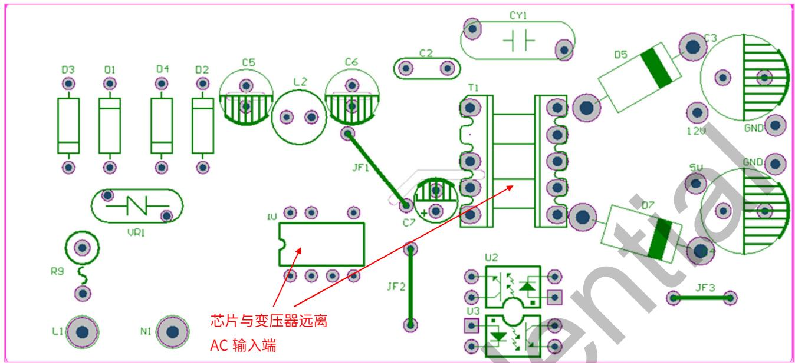

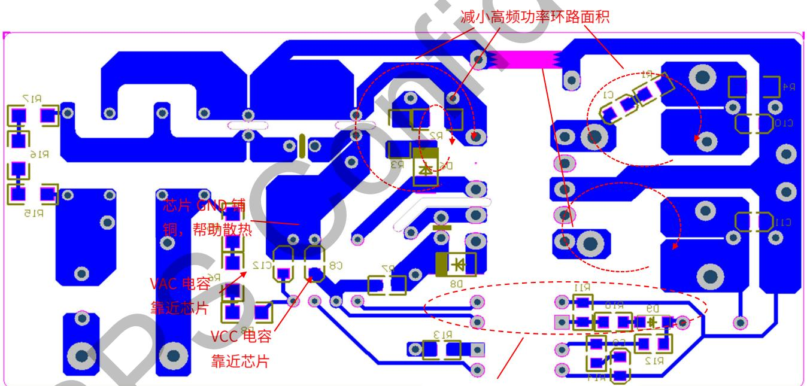

反馈回路器件及走线尽量远  
离变压器和功率回路

图 15. PCB Layout 建议

特性曲线  
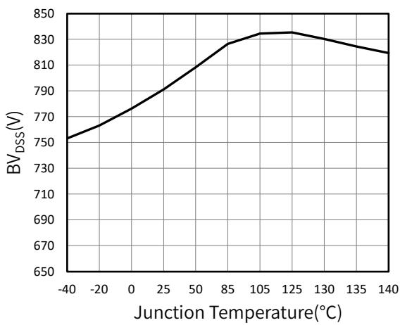

图 16. BVDSS vs. Temperature

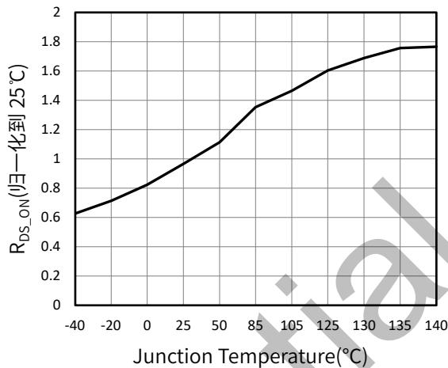

图 17. RDS\_ON vs. Temperature

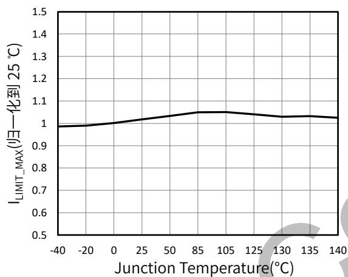

图 18. ILIMIT\_MAX vs. Temperature

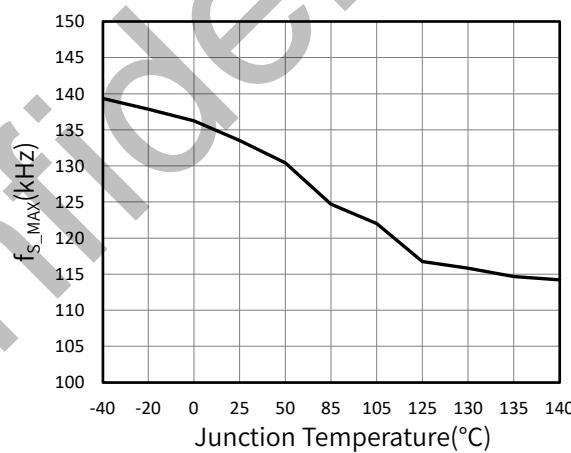

图 19. fOSC vs. Temperature

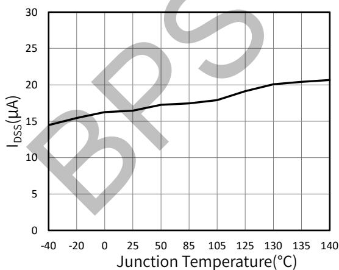

图 20. IDSS vs. Temperature

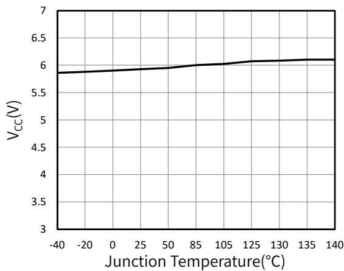

图 21. VCC vs. Temperature

## 封装信息

DIP-7 封装外形尺寸  
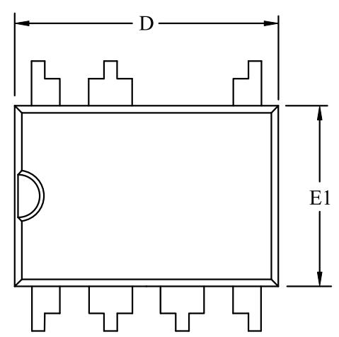

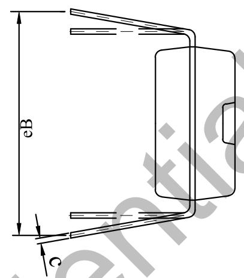

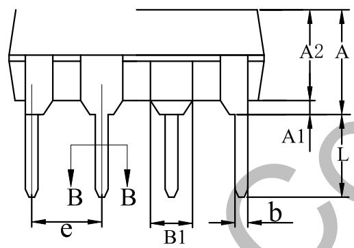

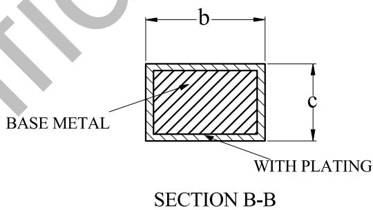

COMMON DIMENSIONS

(UNITS OF MEASURE=MILLIMETER)

<table><tr><td>SYMBOL</td><td>MIN</td><td>NOM</td><td>MAX</td></tr><tr><td>A</td><td>-</td><td>-</td><td>4.80</td></tr><tr><td>A1</td><td>0.40</td><td>-</td><td>-</td></tr><tr><td>A2</td><td>3.10</td><td>-</td><td>3.50</td></tr><tr><td>b</td><td>0.355</td><td>-</td><td>0.559</td></tr><tr><td>B1</td><td colspan="3">1.52 REF</td></tr><tr><td>c</td><td>0.203</td><td>-</td><td>0.356</td></tr><tr><td>D</td><td>9.10</td><td>-</td><td>9.50</td></tr><tr><td>E1</td><td>6.25</td><td>-</td><td>6.70</td></tr><tr><td>e</td><td colspan="3">2.54 BSC</td></tr><tr><td>eB</td><td>7.62</td><td>-</td><td>9.30</td></tr><tr><td>L</td><td>2.92</td><td>-</td><td>3.81</td></tr></table>

版本信息

<table><tr><td>版本</td><td>日期</td><td>记录</td></tr><tr><td>Rev. 1.0</td><td>2023/4</td><td>首次发行</td></tr><tr><td>Rev. 1.1</td><td>2024/6</td><td>模板更新</td></tr><tr><td>Rev. 1.2</td><td>2026/1</td><td>电气参数表更新</td></tr></table>

## 免责声明

晶丰明源尽力确保本产品规格书内容的准确和可靠，但是保留在没有通知的情况下，修改规格书内容的权利。

本产品规格书未包含任何针对晶丰明源或第三方所有的知识产权的授权。针对本产品规格书所记载的信息，晶丰明源不做任何明示或暗示的保证，包括但不限于对规格书内容的准确性、商业上的适销性、特定目的的适用性或者不侵犯晶丰明源或任何第三人知识产权做任何明示或暗示保证，晶丰明源也不就因本规格书本身及其使用有关的偶然或必然损失承担任何责任。

## 电子器件报废说明

该产品在生命周期结束后，由客户按照一般电子产品的报废流程进行处理。
