## BPA8604P 参考设计

## (12V/0.4A)

上海晶丰明源半导体股份有限公司

Shanghai Bright Power Semiconductor Co., Ltd.

陈耀兵

2021 7 29

BPA8604  
电源规格  
电路图  
◼BOM  
◼PCB Layout  
电路实物图  
变压器规格书  
性能测试数据

## 产品特点:

》集成交流电压过零检测与过零信号输 出功能  
➢ 700V MOSFET  
➢ ON/OFF  
》内置软启动功能  
》集成高压启动、自供电电路  
➢ EMI

## 应用领域:

》家用电器辅助电源  
》微波炉辅助电源

## 电源规格

<table><tr><td>项目描述</td><td>符号</td><td>最小</td><td>典型</td><td>最大</td><td>单位</td><td>备注</td></tr><tr><td colspan="7">输入</td></tr><tr><td>电压</td><td> $V_{IN}$ </td><td>90</td><td>115/230</td><td>264</td><td> $V_{AC}$ </td><td></td></tr><tr><td>频率</td><td> $f_{LINE}$ </td><td>47</td><td>50/60</td><td>63</td><td>Hz</td><td></td></tr><tr><td colspan="7">输出</td></tr><tr><td>输出电压</td><td> $V_{OUT}$ </td><td></td><td>12</td><td></td><td>V</td><td>±3%</td></tr><tr><td>输出电流</td><td> $I_{OUT}$ </td><td></td><td>0.4</td><td></td><td>A</td><td></td></tr><tr><td>输出电压纹波</td><td> $V_{RIPPLE}$ </td><td></td><td></td><td>150</td><td>mV</td><td>20MHz带宽</td></tr><tr><td>连续输出功率</td><td> $P_{OUT}$ </td><td></td><td>4.8</td><td></td><td>W</td><td></td></tr><tr><td colspan="7">效率</td></tr><tr><td>待机功耗</td><td> $P_{STDBY}$ </td><td></td><td></td><td>60</td><td>mW</td><td>230VAC</td></tr><tr><td>满载效率</td><td>η</td><td>74</td><td></td><td></td><td>%</td><td>115VAC/230VAC</td></tr><tr><td colspan="7">环境</td></tr><tr><td>传导EMI</td><td></td><td colspan="4">满足CISPR22/EN55022 Class B,至少6dB 裕量</td><td></td></tr><tr><td>Surge</td><td></td><td></td><td>2</td><td></td><td>kV</td><td>差模</td></tr><tr><td>EFT</td><td></td><td></td><td>4</td><td></td><td>kV</td><td>5kHz/100kHz/38kHz</td></tr><tr><td>ESD</td><td></td><td></td><td>15</td><td></td><td>kV</td><td>接触8kV,空气15kV</td></tr><tr><td>工作环境温度</td><td> $T_{AMP}$ </td><td>0</td><td></td><td>50</td><td>°C</td><td></td></tr></table>

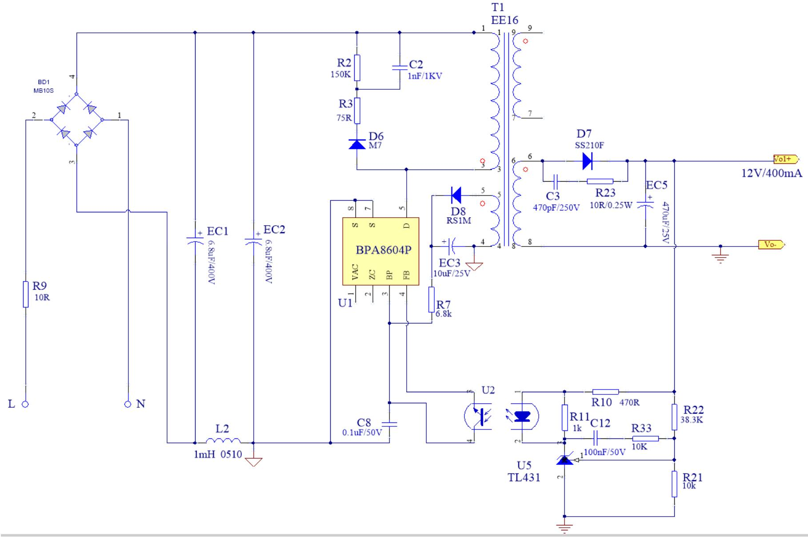

<table><tr><td>序号</td><td>元件标号</td><td>参数描述</td><td>封装尺寸</td><td>数量</td></tr><tr><td>1</td><td>BD1</td><td>MB10S</td><td>BD_SMD(bs210)</td><td>1</td></tr><tr><td>2</td><td>C2</td><td>1nF/1KV</td><td>50V104</td><td>1</td></tr><tr><td>3</td><td>C3</td><td>470pF/250V</td><td>0805-C</td><td>1</td></tr><tr><td>4</td><td>C8</td><td>0.1uF/50V</td><td>0805-C</td><td>1</td></tr><tr><td>5</td><td>C12</td><td>100nF/50V</td><td>0805-C</td><td>1</td></tr><tr><td>6</td><td>D6</td><td>M7</td><td>D SMA</td><td>1</td></tr><tr><td>7</td><td>D7</td><td>SS210F</td><td>SMAF</td><td>1</td></tr><tr><td>8</td><td>D8</td><td>RS1M</td><td>D SMA</td><td>1</td></tr><tr><td>9</td><td>EC1, EC2</td><td>6.8uF/400V</td><td>EC 6.5 P2.5</td><td>2</td></tr><tr><td>10</td><td>EC3</td><td>10uF/25V</td><td>EC 5 P2.5</td><td>1</td></tr><tr><td>11</td><td>EC5</td><td>470uF/25V</td><td>EC 10 P5.0</td><td>1</td></tr><tr><td>12</td><td>L2</td><td>1mH 0510</td><td>L/D 6 P3.0</td><td>1</td></tr><tr><td>13</td><td>R2</td><td>150K</td><td>1206-r</td><td>1</td></tr><tr><td>14</td><td>R3</td><td>75R</td><td>1206-r</td><td>1</td></tr><tr><td>15</td><td>R7</td><td>6.8k</td><td>0805-r</td><td>1</td></tr><tr><td>16</td><td>R9</td><td>10R</td><td>F-2W</td><td>1</td></tr><tr><td>17</td><td>R10</td><td>220R</td><td>0805-r</td><td>1</td></tr></table>

<table><tr><td>序号</td><td>元件标号</td><td>参数描述</td><td>封装尺寸</td><td>数量</td></tr><tr><td>21</td><td>R11</td><td>1k</td><td>0805-r</td><td>1</td></tr><tr><td>21</td><td>R21, R33</td><td>10k</td><td>0805-r</td><td>2</td></tr><tr><td>21</td><td>R22</td><td>38.3k</td><td>0805-r</td><td>1</td></tr><tr><td>21</td><td>R23</td><td>10R/0.25W</td><td>0805-r</td><td>1</td></tr><tr><td>22</td><td>T1</td><td>EE16</td><td>T EE16(5+5)</td><td>1</td></tr><tr><td>23</td><td>U1</td><td>BPA8604P</td><td>USOP8(BPA8604)</td><td>1</td></tr><tr><td>24</td><td>U2</td><td>PC817B</td><td>DIP-4</td><td>1</td></tr><tr><td>25</td><td>U5</td><td>TL431</td><td>SOT23</td><td>1</td></tr></table>

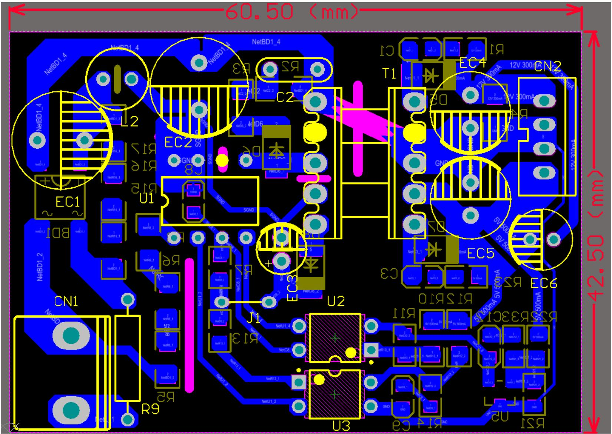

TOP SIDE

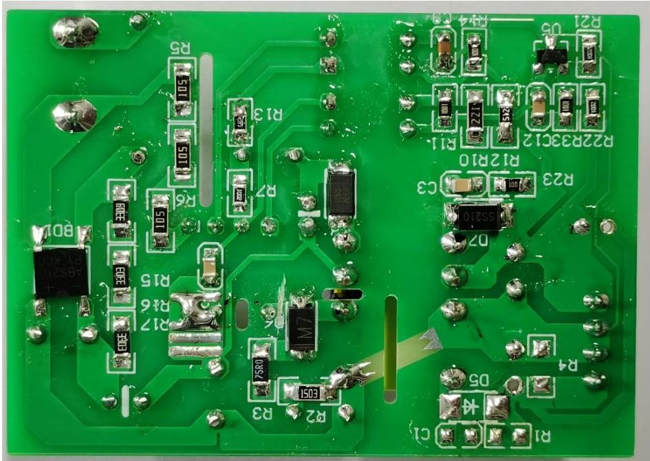

BOTTOM SIDE

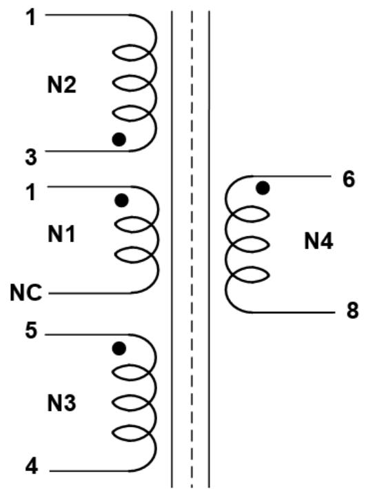

<table><tr><td>序号</td><td>起始脚</td><td>终止脚</td><td>绕制规则</td><td>匝数</td><td>绕线方式</td></tr><tr><td>N1</td><td>1</td><td>NC</td><td>2UEW φ0.17*2P</td><td>20Ts</td><td>密绕一层(PIN脚朝外)</td></tr><tr><td>胶带</td><td></td><td></td><td></td><td>2Ts</td><td></td></tr><tr><td>N2</td><td>3</td><td>1</td><td>2UEW φ0.19*1P</td><td>105Ts</td><td>密绕三层(PIN脚朝外)</td></tr><tr><td>胶带</td><td></td><td></td><td></td><td>2Ts</td><td></td></tr><tr><td>N3</td><td>5</td><td>4</td><td>2UEW φ0.17*3P</td><td>13Ts</td><td>密绕一层(PIN脚朝外)</td></tr><tr><td>胶带</td><td></td><td></td><td></td><td>3Ts</td><td></td></tr><tr><td>N4</td><td>6</td><td>8</td><td>TEX-E φ0.35*1P</td><td>14Ts</td><td>均匀绕一层(PIN脚朝外)</td></tr><tr><td>胶带</td><td></td><td></td><td></td><td>3Ts</td><td></td></tr></table>

## 规格与材料

初级绕组感量 $\mathsf { L } _ { \mathsf { o } } \mathsf { = } 1 8 5 0 \mathsf { u H } \pm 7 \%$ （测试条件：0.3V，100kHz)  
漏感量 $\angle 1 k < 8 0 \angle 1$  
骨架：EE16底部加高 (5+5PIN)  
➢ 磁芯：EE16 PC40 或同等材质， ${ \mathsf { A e } } { = } 1 9 . 2 { \mathsf { m m } } ^ { 2 }$  
➢ N1、N2、N3、N4:2UEW漆包线  
➢ N5、N6：三层绝缘线  
绝缘胶带:3M900或同等材质  
耐压测试:3KV,50/60Hz,1Min  
成品要求：浸凡立水

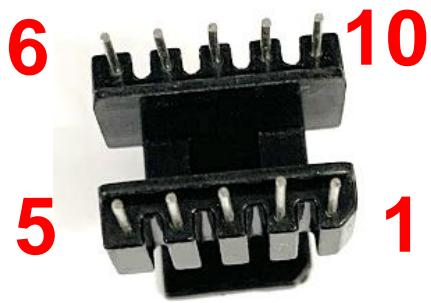

待机功耗  
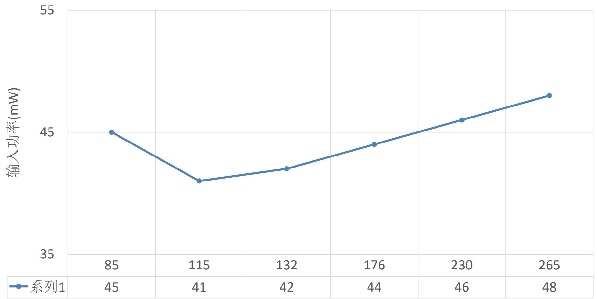

输入电压(Vac)

效率曲线  
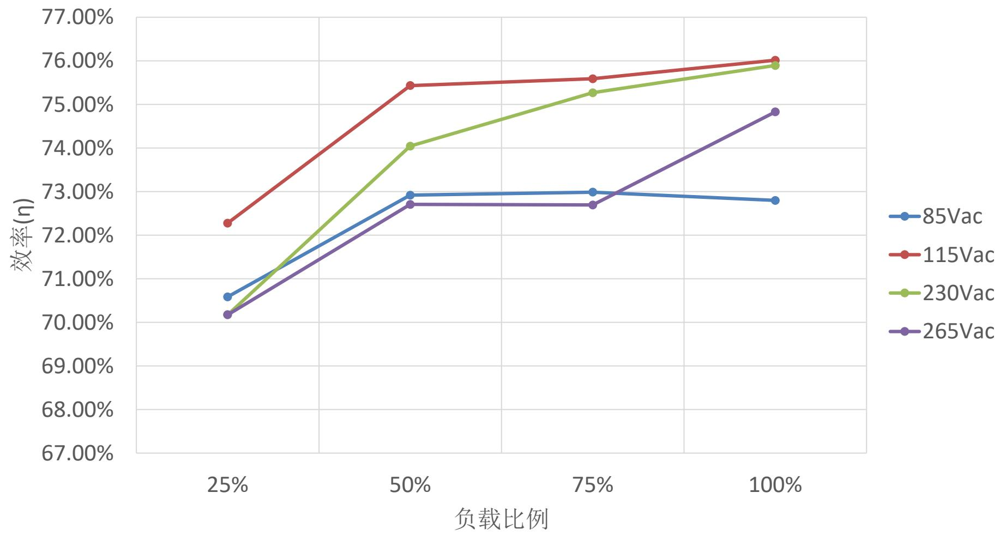

<table><tr><td> $V_{IN}(VAC)$ </td><td>Load(%)</td><td> $P_{IN}(W)$ </td><td> $V_{OUT}(V)$ </td><td>线端</td><td> $I_{OUT}(A)$ </td><td> $P_{OUT}(W)$ </td><td>Eff(%)</td><td>AVG Eff(%)</td></tr><tr><td rowspan="6">85</td><td>空载</td><td></td><td></td><td></td><td></td><td>0</td><td></td><td></td></tr><tr><td>10%</td><td>0.74</td><td>12.07</td><td></td><td>0.04</td><td>0.4828</td><td>65.24%</td><td></td></tr><tr><td>25%</td><td>1.71</td><td>12.07</td><td></td><td>0.1</td><td>1.207</td><td>70.58%</td><td rowspan="4">72.32%</td></tr><tr><td>50%</td><td>3.31</td><td>12.068</td><td></td><td>0.2</td><td>2.4136</td><td>72.92%</td></tr><tr><td>75%</td><td>4.96</td><td>12.067</td><td></td><td>0.3</td><td>3.6201</td><td>72.99%</td></tr><tr><td>100%</td><td>6.63</td><td>12.066</td><td></td><td>0.4</td><td>4.8264</td><td>72.80%</td></tr><tr><td rowspan="6">115</td><td>空载</td><td></td><td></td><td></td><td></td><td>0</td><td></td><td></td></tr><tr><td>10%</td><td>0.72</td><td>12.07</td><td></td><td>0.04</td><td>0.4828</td><td>67.06%</td><td></td></tr><tr><td>25%</td><td>1.67</td><td>12.07</td><td></td><td>0.1</td><td>1.207</td><td>72.28%</td><td rowspan="4">74.83%</td></tr><tr><td>50%</td><td>3.2</td><td>12.069</td><td></td><td>0.2</td><td>2.4138</td><td>75.43%</td></tr><tr><td>75%</td><td>4.79</td><td>12.069</td><td></td><td>0.3</td><td>3.6207</td><td>75.59%</td></tr><tr><td>100%</td><td>6.35</td><td>12.067</td><td></td><td>0.4</td><td>4.8268</td><td>76.01%</td></tr><tr><td rowspan="6">230</td><td>空载</td><td></td><td></td><td></td><td></td><td>0</td><td></td><td></td></tr><tr><td>10%</td><td>0.7</td><td>12.069</td><td></td><td>0.04</td><td>0.48276</td><td>68.97%</td><td></td></tr><tr><td>25%</td><td>1.72</td><td>12.07</td><td></td><td>0.1</td><td>1.207</td><td>70.17%</td><td rowspan="4">73.84%</td></tr><tr><td>50%</td><td>3.26</td><td>12.069</td><td></td><td>0.2</td><td>2.4138</td><td>74.04%</td></tr><tr><td>75%</td><td>4.81</td><td>12.068</td><td></td><td>0.3</td><td>3.6204</td><td>75.27%</td></tr><tr><td>100%</td><td>6.36</td><td>12.067</td><td></td><td>0.4</td><td>4.8268</td><td>75.89%</td></tr><tr><td rowspan="6">265</td><td>空载</td><td></td><td></td><td></td><td></td><td>0</td><td></td><td></td></tr><tr><td>10%</td><td>0.72</td><td>12.07</td><td></td><td>0.04</td><td>0.4828</td><td>67.06%</td><td></td></tr><tr><td>25%</td><td>1.72</td><td>12.07</td><td></td><td>0.1</td><td>1.207</td><td>70.17%</td><td rowspan="4">72.60%</td></tr><tr><td>50%</td><td>3.32</td><td>12.069</td><td></td><td>0.2</td><td>2.4138</td><td>72.70%</td></tr><tr><td>75%</td><td>4.98</td><td>12.067</td><td></td><td>0.3</td><td>3.6201</td><td>72.69%</td></tr><tr><td>100%</td><td>6.45</td><td>12.066</td><td></td><td>0.4</td><td>4.8264</td><td>74.83%</td></tr></table>

## 输出电压调整率

<table><tr><td> $V_{IN}(VAC)$  $I_{OUT}(A)$ </td><td>90</td><td>115</td><td>132</td><td>176</td><td>230</td><td>265</td><td>平均值</td><td>线调整率</td></tr><tr><td>0</td><td>12.053</td><td>12.053</td><td>12.053</td><td>12.054</td><td>12.054</td><td>12.054</td><td>12.054</td><td>0.01%</td></tr><tr><td>20%</td><td>12.053</td><td>12.053</td><td>12.053</td><td>12.053</td><td>12.053</td><td>12.053</td><td>12.053</td><td>0.00%</td></tr><tr><td>40%</td><td>12.053</td><td>12.053</td><td>12.053</td><td>12.053</td><td>12.053</td><td>12.053</td><td>12.053</td><td>0.00%</td></tr><tr><td>60%</td><td>12.052</td><td>12.052</td><td>12.052</td><td>12.052</td><td>12.052</td><td>12.052</td><td>12.052</td><td>0.00%</td></tr><tr><td>80%</td><td>12.052</td><td>12.052</td><td>12.051</td><td>12.051</td><td>12.052</td><td>12.051</td><td>12.052</td><td>0.01%</td></tr><tr><td>100%</td><td>12.051</td><td>12.051</td><td>12.051</td><td>12.051</td><td>12.051</td><td>12.051</td><td>12.051</td><td>0.00%</td></tr><tr><td>平均值</td><td>12.052</td><td>12.052</td><td>12.052</td><td>12.052</td><td>12.053</td><td>12.052</td><td></td><td></td></tr><tr><td>负载调整率</td><td>0.02%</td><td>0.02%</td><td>0.02%</td><td>0.02%</td><td>0.02%</td><td>0.02%</td><td></td><td></td></tr></table>

◼ 计算方法：调整率=100%\*(最大值-最小值)/平均值

## 输出电压纹波

20MHz带宽，去掉示波器探头正端夹子和地线环，10uF/50V 0.1uF/50V

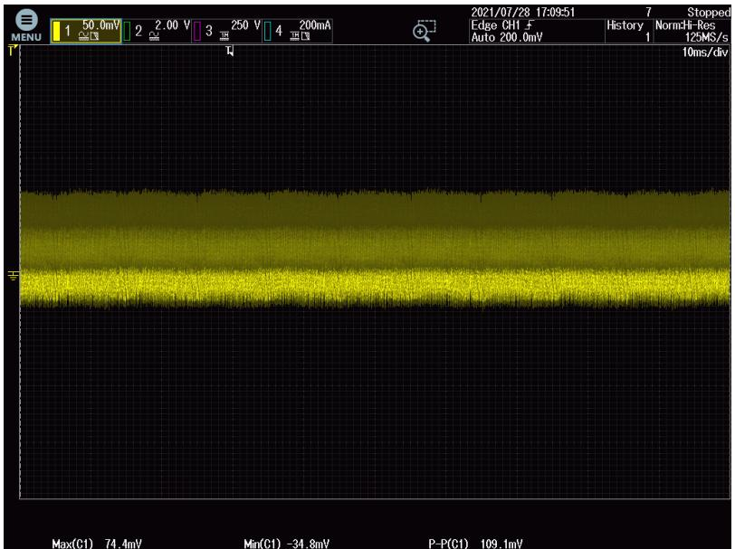

85 VAC

CH1 VOUT $\mathsf { V } _ { \mathsf { o u r } }$ Ripple $V _ { p | \mathrm { K } \mathrm { - } \mathsf { P K } } ^ { \therefore } { = } 1 0 9 . 1$ VPK-PK=109.1 V mV

## Test Condition:

➢ Full Load

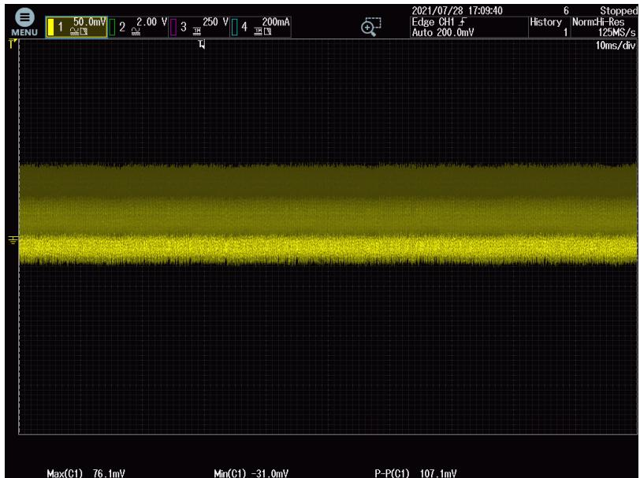

115 VAC

CH1 VOUT $\begin{array} { l } { \mathsf { C H 1 V _ { o u \intercal } } } \\ { \mathsf { R i p p l e } } \end{array}$ $\mathsf { V } _ { \mathsf { P K - P K } } ^ { \mathsf { \tilde { \alpha } } } = \pm \mathsf { 1 0 7 . 1 }$ mV

## Test Condition:

➢ Full Load

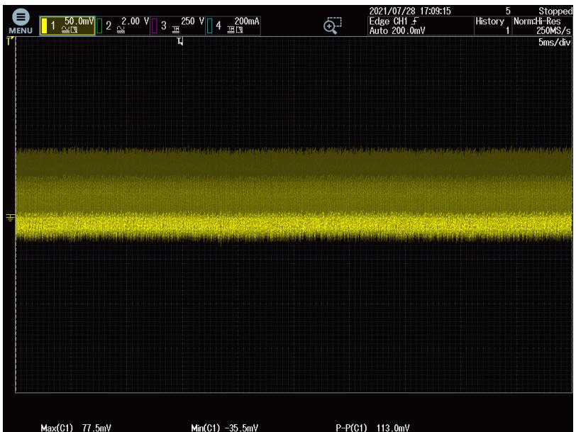

230 VAC

CH1 VOUT $\mathsf { V } _ { \mathsf { O U T } }$ Ripple $\mathtt { V } _ { \mathtt { P K - P K } } = \mathtt { 1 } \mathtt { 1 } 3 \mathtt { m v }$

## Test Condition:

➢ Full Load

265 VAC

CH1 VOUT Ripple $V _ { P K }$ VPK-PK=115.4mV $_ { p \kappa } = 1 1 5 . 4 m v$

## Test Condition:

➢ Full Load

## (50%-100%)

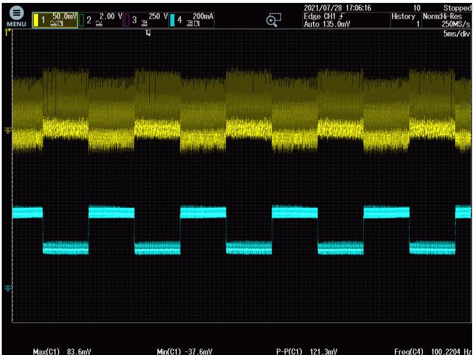

85 VAC

CH1 VOUT $\mathsf { V } _ { \mathsf { O U T } }$ $\mathsf { V } _ { \mathsf { P K - P K } } { = } 1 2 1 . 3 \mathsf { m V }$  
$\mathsf { C H 4 } \mathsf { I } _ { \mathsf { O U T } }$

## Test Condition:

➢ $0 . 2 \ A { - } 0 . 4 \ A { - } 0 . 2 \ A$  
➢ Slew Rate: 0.5 $\mathsf { A } / \mu \mathsf { S }$  
➢ Frequency: 100 Hz

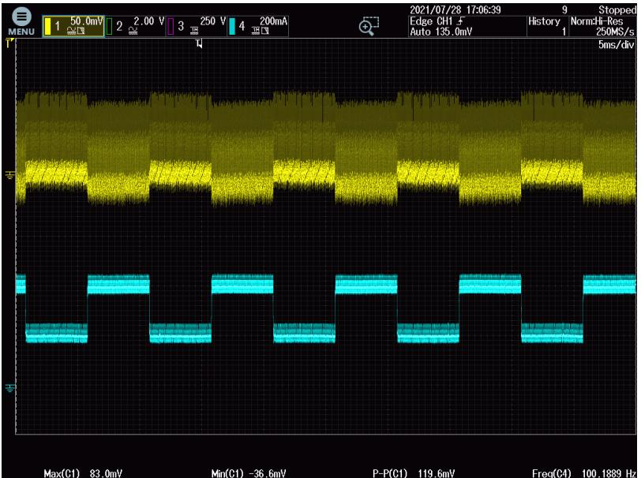

230 VAC

CH1 VOUT $\mathsf { V } _ { \mathsf { O U T } }$ $\mathsf { V } _ { \mathsf { P K - P K } } =$ 119.6 mV  
$\mathsf { C H 4 } \mathsf { l } _ { \mathsf { O U T } }$

## Test Condition:

➢ $0 . 2 \ A { - } 0 . 4 \ A { - } 0 . 2 \ A$  
➢ Slew Rate: 0.5 $\mathsf { A } / \mu \mathsf { S }$  
➢ Frequency: 100 Hz

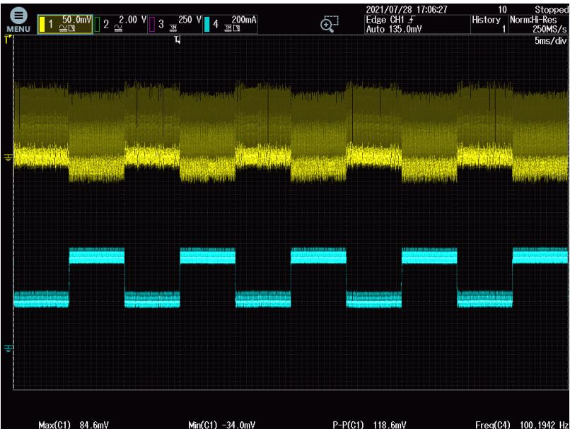

115 VAC

CH1 VOUT $\mathsf { V } _ { \mathsf { O U T } }$ $\mathsf { V } _ { \mathsf { P K - P K } } \pm \pmb { 1 8 . 6 } \mathsf { m V }$  
$\mathsf { C H 4 } \mathsf { I } _ { \mathsf { O U T } }$

## Test Condition:

➢ $0 . 2 \ A { - } 0 . 4 \ A { - } 0 . 2 \ A$  
➢ Slew Rate: 0.5 A/μS  
➢ Frequency: 100 Hz

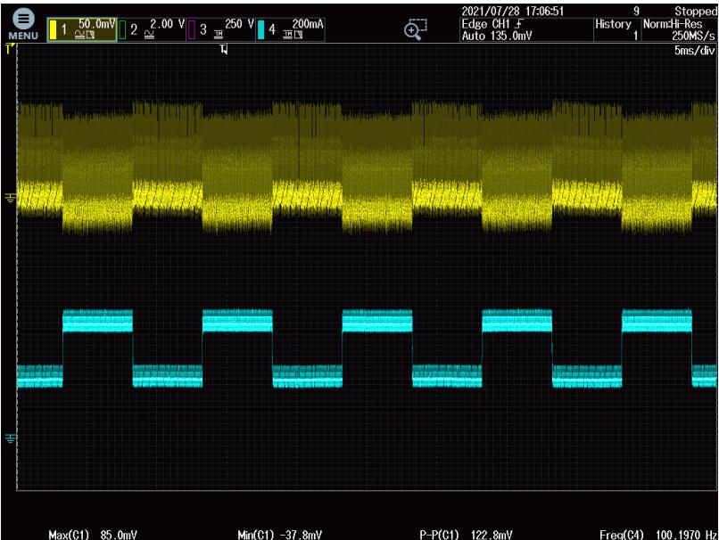

265 VAC

CH1 VOUT ${ \mathsf { C H 1 } } { \mathsf { V } } _ { \mathsf { O U T } }$ $\mathtt { V } _ { \mathtt { P K - P K } } = 1 2 2 . 8$ mV  
$\mathsf { C H 4 } \mathsf { I } _ { \mathsf { O U T } }$

## Test Condition:

➢ $0 . 2 \ A { - } 0 . 4 \ A { - } 0 . 2 \ A$  
➢ Slew Rate: 0.5 A/μS  
➢ Frequency: 100 Hz

## (10%-90%)

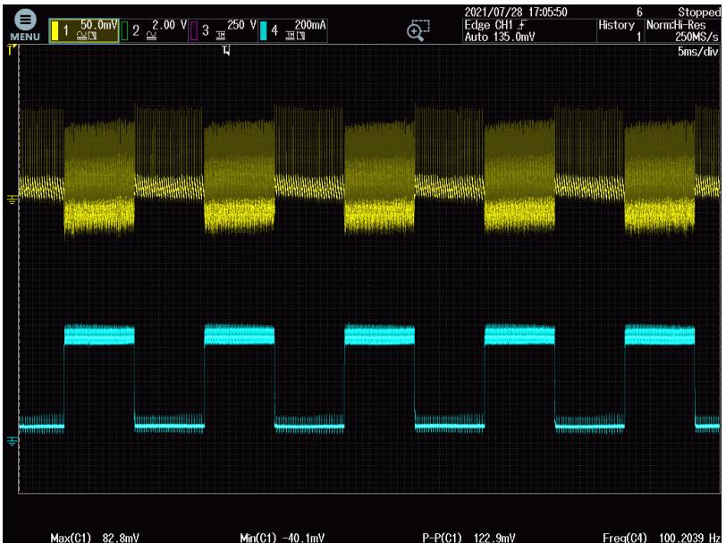

85 VAC

CH1 VOUT $\mathsf { V } _ { \mathsf { O U T } }$ $\mathsf { V } _ { \mathsf { P K - P K } } \mathsf { = } \mathsf { 1 } 2 2 . 9 \mathsf { m v }$  
$\mathsf { C H 4 } \mathsf { I } _ { \mathsf { O U T } }$

## Test Condition:

➢ $0 . 0 4 \ A - 0 . 3 6 \ A - 0 . 0 4 \ A$  
➢ Slew Rate: 0.5 A/μS  
➢ Frequency: 100 Hz

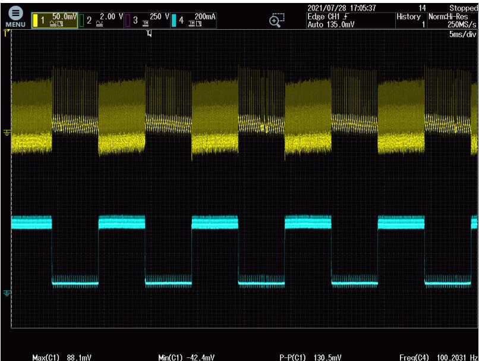

115 VAC

CH1 VOUT ${ \mathsf { C H 1 } } { \mathsf { V } } _ { \mathsf { O U T } }$ $V _ { \mathsf { P K - P K } } = 1 3 0 . 5 \mathsf { m v }$  
$\mathsf { C H 4 } \mathsf { I } _ { \mathsf { O U T } }$

## Test Condition:

➢ $0 . 0 4 \ A - 0 . 3 6 \ A - 0 . 0 4 \ A$  
➢ Slew Rate: 0.5 A/μS  
➢ Frequency: 100 Hz

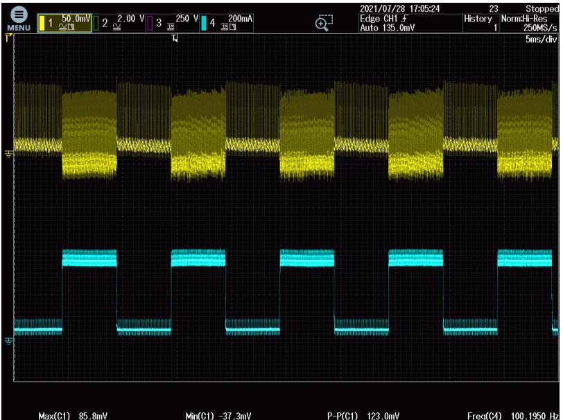

230 VAC

CH1 VOUT $\mathsf { V } _ { \mathsf { O U T } }$ $v _ { p _ { k - P K } } = 1 2 3 ~ \mathsf { m V }$  
$\mathsf { C H 4 } \mathsf { l } _ { \mathsf { O U T } }$

## Test Condition:

➢ $0 . 0 4 \ A - 0 . 3 6 \ A - 0 . 0 4 \ A$  
➢ Slew Rate: 0.5 $\mathsf { A } / \mu \mathsf { S }$  
➢ Frequency: 100 Hz

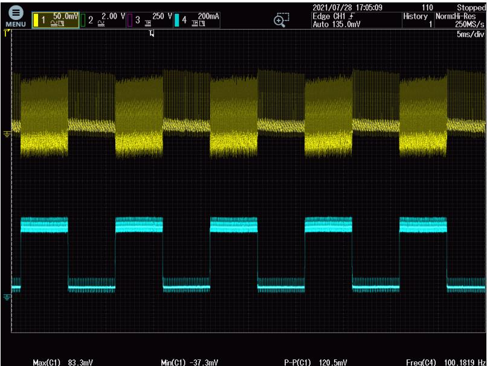

265 VAC

CH1 VOUT ${ \mathsf { C H 1 } } { \mathsf { V } } _ { \mathsf { O U T } }$ VPK-PK=120.5 mV  
$\mathsf { C H 4 } \mathsf { I } _ { \mathsf { O U T } }$

## Test Condition:

➢ 0.04 A-0.36A-0.04 A  
➢ Slew Rate: 0.5 A/μS  
➢ Frequency: 100 Hz

## 输出电压开机波形

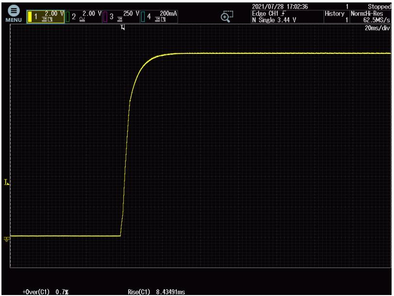

85 VAC

CH1 VOUT TRISE: 8.44 mS

## Test Condition:

➢ No Load

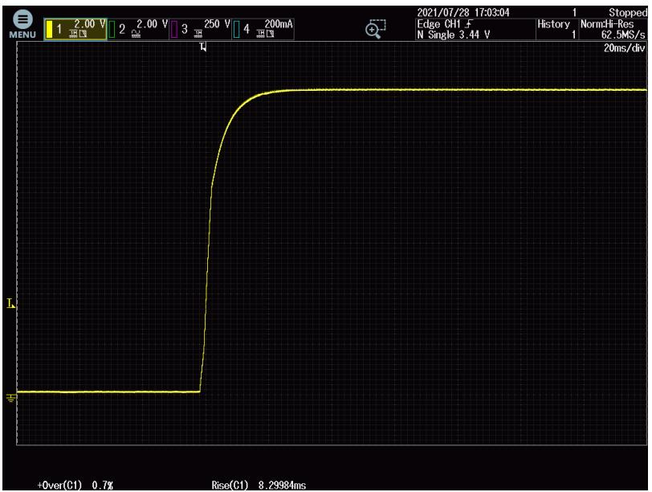

265 VAC

CH1 VOUT TRISE: 8.3 mS

## Test Condition:

➢ No Load

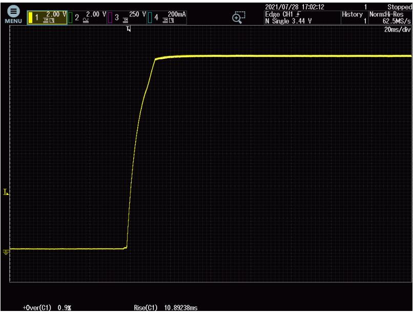

85 VAC

CH1 VOUT TRISE: 10.89 mS

## Test Condition:

➢ Full Load

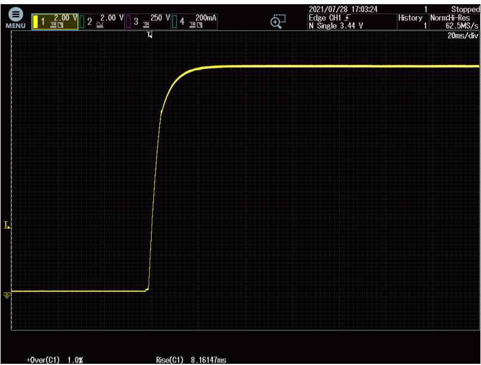

265 VAC

CH1 VOUT TRISE: 8.16 mS

## Test Condition:

➢ Full Load

## MOs漏源极电压电流波形 (启机)

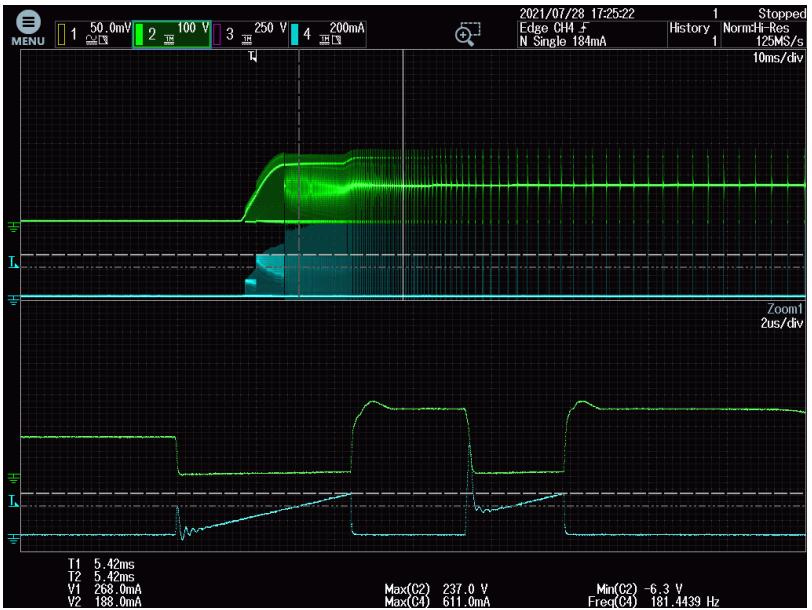

85 VAC

${ \mathsf { C H } } 2 { \mathsf { V } } _ { \mathsf { D S } }$  
$C H 4 1 _ { \mathsf { D } }$ $V _ { \mathsf { D S } } { = } 2 3 7 \vee$ $\mathsf { I } _ { \mathsf { M A X } } { = } 6 1 1 \mathsf { m } \mathsf { A }$

Test Condition:  
➢ No Load  
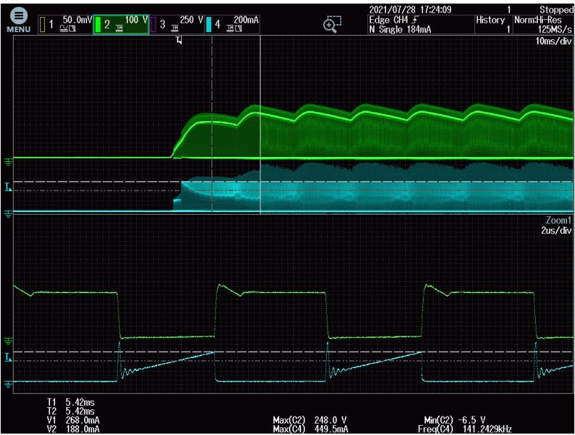

85 VAC

${ \mathsf { C H } } 2 { \mathsf { V } } _ { \mathsf { D S } }$  
$C H 4 1 _ { \mathsf { D } }$ $V _ { \mathsf { D S } } { = } 2 4 8 \ V$ $1 _ { \mathsf { M A X } } = 4 4 9 . 5 ~ \mathsf { m A }$

Test Condition:  
➢ Full Load  
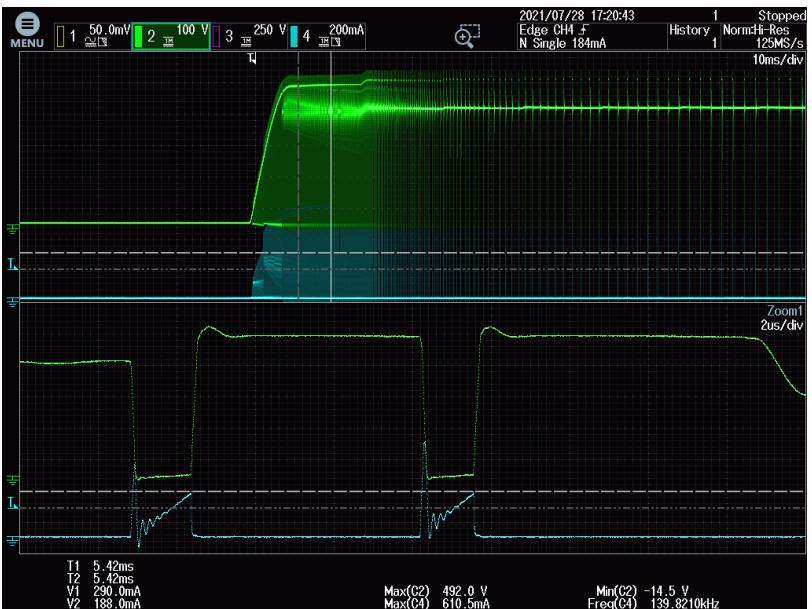

265 VAC

${ \mathsf { C H } } 2 \ { \mathsf { V } } _ { \mathsf { D S } }$  
$C H 4 1 _ { \mathsf { D } }$ $V _ { \mathsf { D } \mathsf { S } } { = } 4 9 2 \mathsf { V }$ IMAX=610.5 $\mathsf { I } _ { \mathsf { M A X } } { = } 6 1 0 . 5 ~ \mathsf { m A }$

Test Condition:  
➢ No Load  
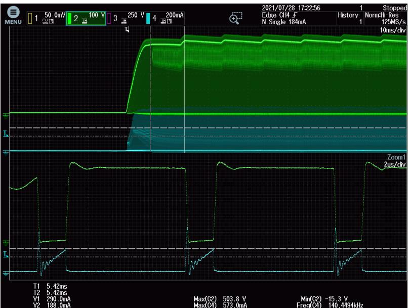

$2 6 5 \ : \mathsf { V } _ { \mathsf { A C } }$

${ \mathsf { C H } } 2 { \mathsf { V } } _ { \mathsf { D S } }$  
$C H 4 1 _ { \mathsf { D } }$ $\mathtt { V } _ { \mathtt { D S } } mathtt { = } 5 0 3 . 8 \mathtt { V }$ $\mathsf { I } _ { \mathsf { M A X } } { = } 5 7 3 \mathsf { m A }$

Test Condition:

➢ Full Load

## MOs漏源极电压电流波形 (正常工作)

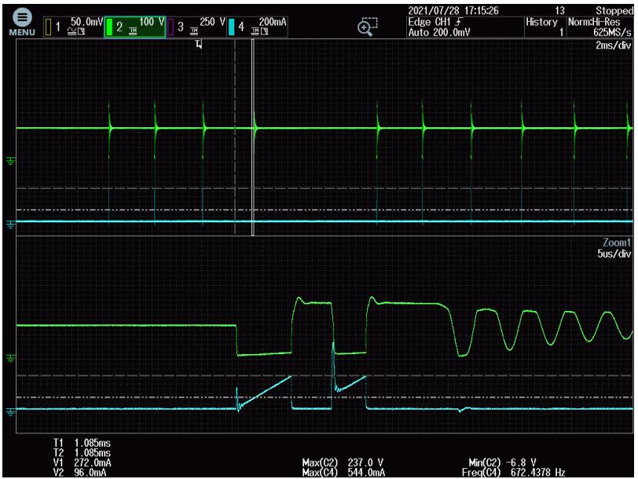

85 VAC

${ \mathsf { C H } } 2 { \mathsf { V } } _ { \mathsf { D S } }$  
$C H 4 1 _ { \mathsf { D } }$ $V _ { \mathsf { D S } } { = } 2 3 7 \vee$ $\mathsf { I } _ { \mathsf { M A X } } { = } 5 4 4 \mathsf { m } \mathsf { A }$

Test Condition:  
➢ No Load  
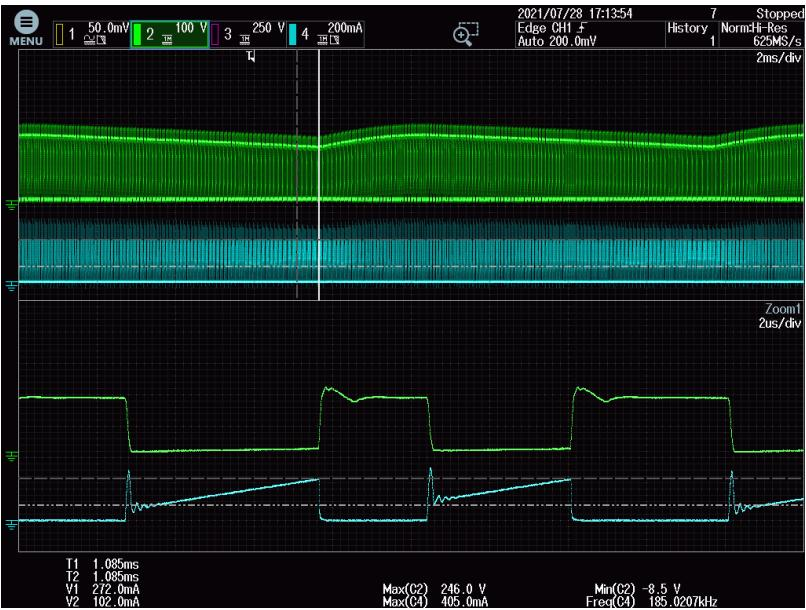

85 VAC

${ \mathsf { C H } } 2 { \mathsf { V } } _ { \mathsf { D S } }$  
$C H 4 1 _ { \mathsf { D } }$ $V _ { \mathsf { D S } } { = } 2 4 6 \ V$ IMAX= 405 mA $\mathsf { I } _ { \mathsf { M A X } } { = } 4 0 5 ~ \mathsf { m A }$

Test Condition:  
➢ Full Load  
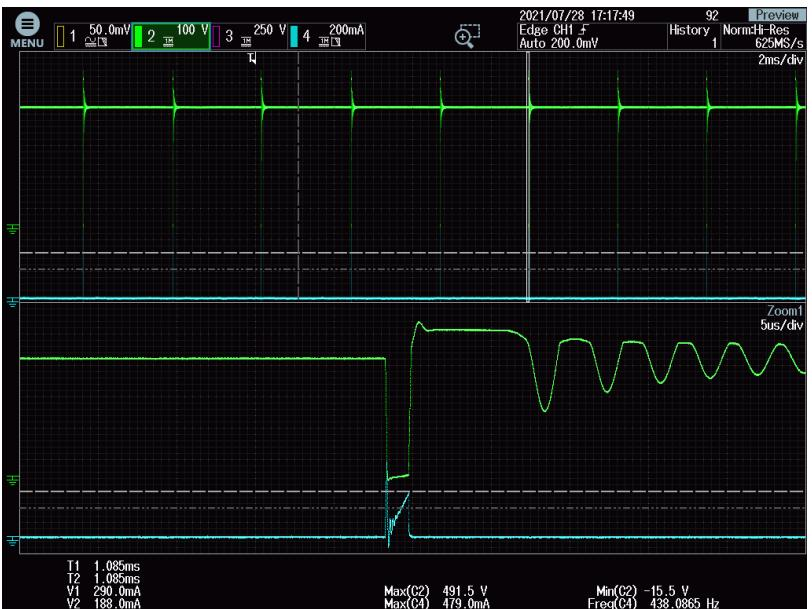

265 VAC

${ \mathsf { C H } } 2 \ { \mathsf { V } } _ { \mathsf { D S } }$  
$C H 4 1 _ { \mathsf { D } }$ $\mathsf { V } _ { \mathsf { D } \mathsf { S } } { = } 4 9 1 . 5 \mathsf { V }$ IMAX=479 $\mathsf { I } _ { \mathsf { M A X } } { = } 4 7 9 \mathsf { m } \mathsf { A }$

Test Condition:  
➢ No Load  
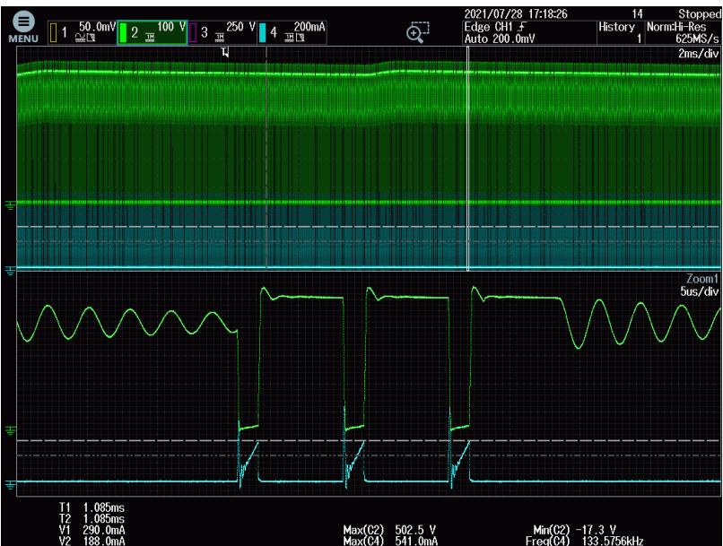

$2 6 5 \ : \mathsf { V } _ { \mathsf { A C } }$

${ \mathsf { C H } } 2 { \mathsf { V } } _ { \mathsf { D S } }$  
$C H 4 1 _ { \mathsf { D } }$ $\mathtt { V } _ { \mathtt { D S } } mathtt { = } 5 0 2 . 5 \mathtt { V }$ $\mathsf { I } _ { \mathsf { M A X } } { = } 5 4 1 \mathsf { m } \mathsf { A }$

Test Condition:

➢ Full Load

## 输出二极管电压波形

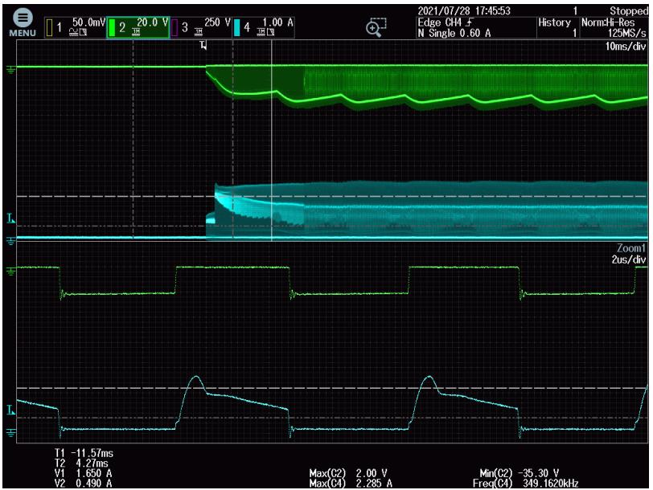

85 VAC

$C H 2 V _ { \mathsf { D } }$  
CH4 I $C H 4 1 _ { \mathsf { D } }$ $\mathtt { V } _ { \mathtt { D } } mathtt { = } 3 5 . 3 \mathtt { V }$ $\mathsf { I } _ { \mathsf { D m a x } } { = } 2 . 2 8 5 \mathrm { ~ A ~ }$ IDmax

## Test Condition:

➢ Full Load  
➢ 开机

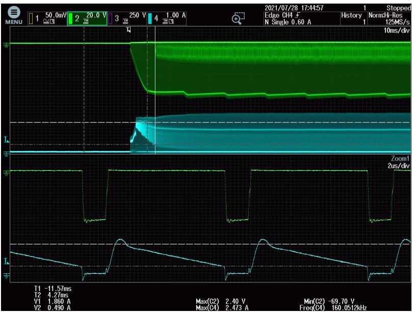

265 VAC

$C H 2 V _ { \mathsf { D } }$  
$C H 4 1 _ { \mathsf { D } }$ $\sf V _ { \mathrm { D } } { = } 6 9 . 7 V$ $\mathsf { I } _ { \mathsf { D m a x } } = 2 . 4 7 3 \mathrm { ~ A ~ }$ Dmax

## Test Condition:

➢ Full Load  
➢ 开机

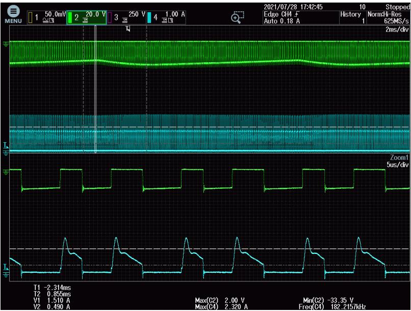

85 VAC

$C H 2 V _ { \mathsf { D } }$  
$C H 4 1 _ { \mathsf { D } }$ $V _ { \mathsf { D } } { = } 3 3 . 3 5 \ V$ $\mathsf { I } _ { \mathsf { D m a x } } { = } 2 . 3 2 \ \mathsf { A }$ IDmax

## Test Condition:

➢ Full Load

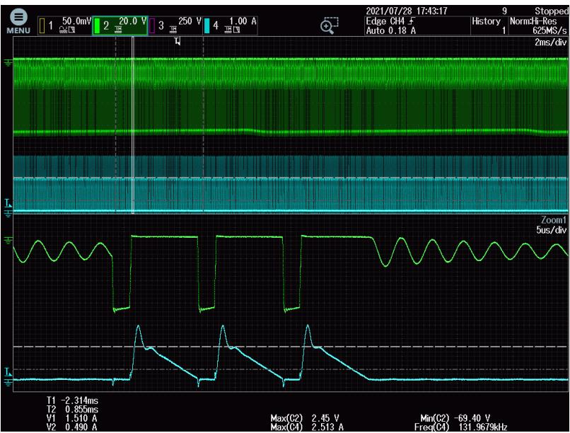

265 VAC

$C H 2 V _ { \mathsf { D } }$  
CH4 ID $C H 4 1 _ { \mathsf { D } }$ $V _ { \mathsf { D } } { = } 6 9 . 4 \ V$ IDmax=2.513 A $\mathsf { I } _ { \mathsf { D m a x } } = 2 . 5 1 3 \mathrm { ~ A ~ }$

## Test Condition:

➢ Full Load

## 输出短路时MOs和二极管波形

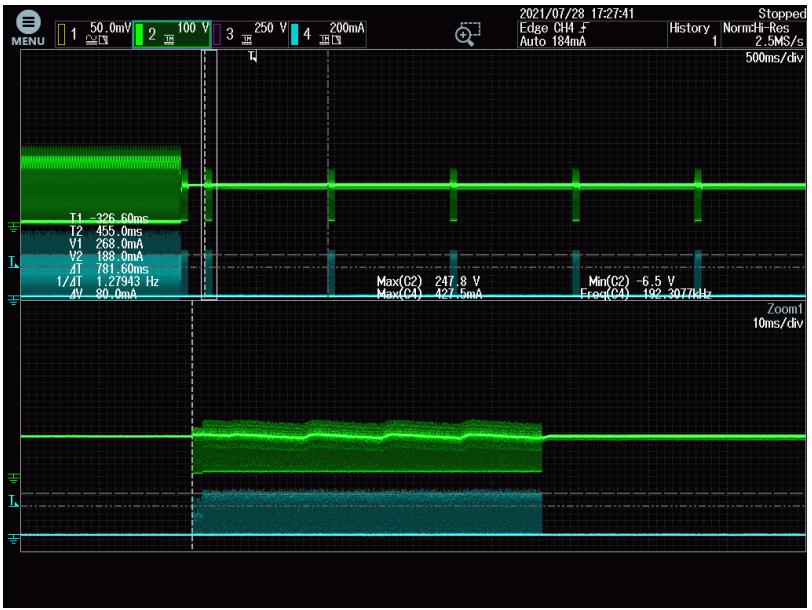

85 VAC

CH2 VDS  
CH4 ID $\begin{array} { l c r } { { \tt V } _ { \tt D S \_ m a x } = 2 4 7 . 8 V } \\ { { \tt I } _ { \tt D S \_ m a x } = 4 2 7 . 5 \operatorname* { m A } } \end{array}$

## MOS

## Test Condition:

➢ Full Load

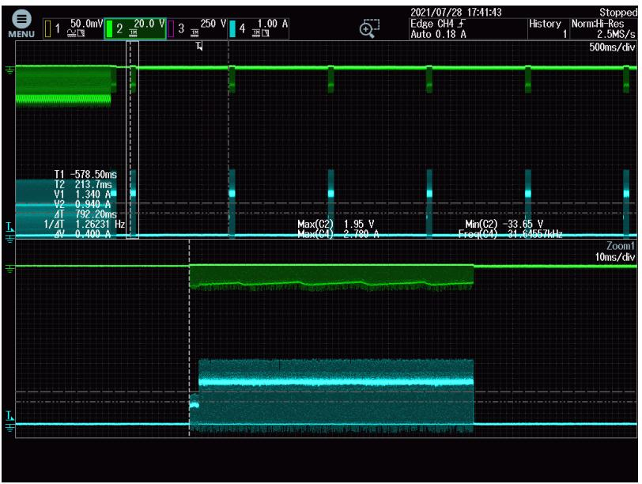

85 VAC

CH2 VD  
CH4 ID $V _ { \mathsf { D } } { = } 3 3 . 6 5 \ V$ $\mathsf { I } _ { \mathsf { D m a x } } { = } 2 . 7 8 ~ \mathsf { A }$ Dmax

## Test Condition:

➢ Full Load

## 二极管

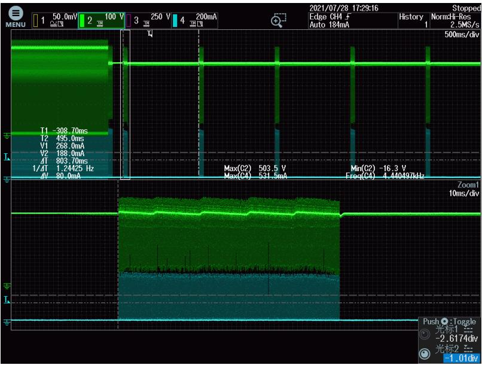

## 265 VAC

CH2 VDS  
CH4 ID $\begin{array} { l } { { \sf V } _ { \sf D S \_ m a x } = 5 0 3 . 5 { \sf V } } \\ { { \sf I } _ { \sf D S \_ m a x } = 5 3 1 . 5 \sf m A } \end{array}$

## MOS

## Test Condition:

➢ Full Load

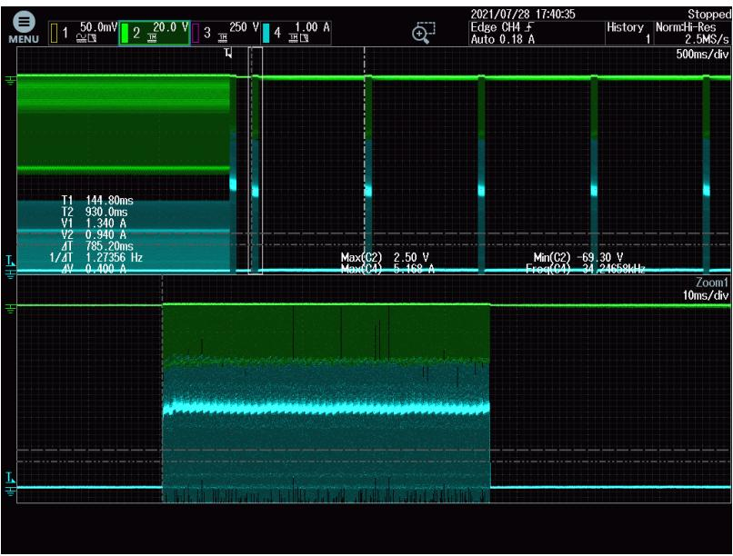

## 265 VAC

CH2 VD  
CH4 ID VD=69.3V IDmax=5.168 A

## Test Condition:

➢ Full Load

## 二极管

## 温升测试

<table><tr><td rowspan="2">项目</td><td colspan="4">温度(°C)</td></tr><tr><td>85VAC</td><td>115VAC</td><td>230VAC</td><td>264VAC</td></tr><tr><td>环境温度</td><td>40.5</td><td>39.5</td><td>40</td><td>39.8</td></tr><tr><td>BPA8604P (U1)</td><td>102.7</td><td>85.7</td><td>86.4</td><td>87.3</td></tr><tr><td>SS210F (D7)</td><td>65.8</td><td>64.1</td><td>65.5</td><td>65.6</td></tr><tr><td>变压器绕组(T1)</td><td>64.2</td><td>62.2</td><td>66.1</td><td>66.7</td></tr><tr><td>变压器磁芯(T1)</td><td>61.4</td><td>60.3</td><td>64.4</td><td>65.1</td></tr><tr><td>输入电解电容(EC2)</td><td>67.3</td><td>62.3</td><td>62.7</td><td>63.2</td></tr><tr><td>输出电解电容(EC5)</td><td>55.5</td><td>55.4</td><td>56.2</td><td>56.2</td></tr><tr><td>整流桥(BD1)</td><td>58.6</td><td>53.9</td><td>51</td><td>50.8</td></tr></table>

## 测试说明

➢ 在温箱中进行测试  
➢ 电路板放在一个封闭的盒子内  
➢ 热电偶连接到各个测量点  
➢ 等测量点温度达到稳定后记录数据

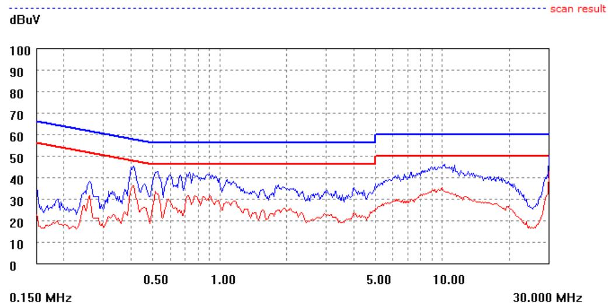

115VAC Line

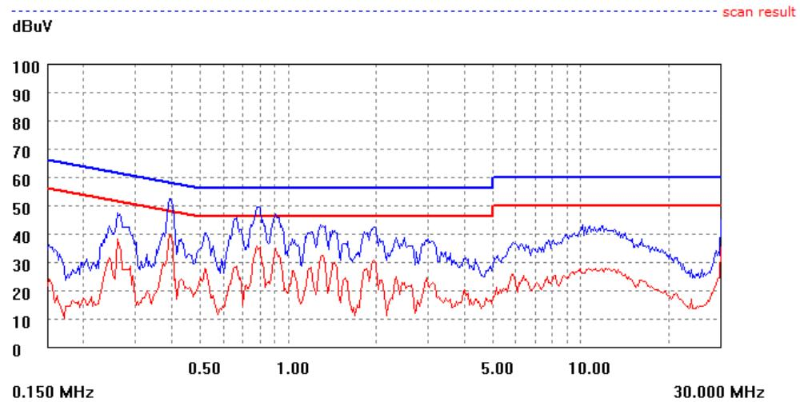

230VAC Line

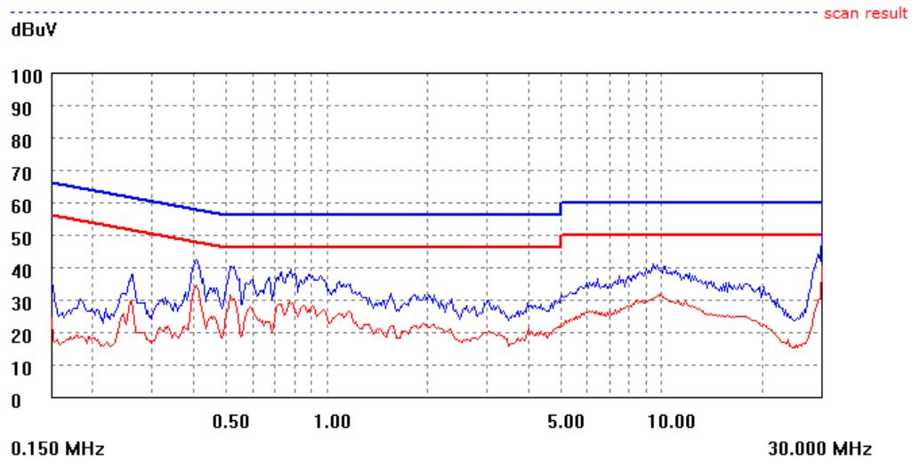

115VAC Neutral

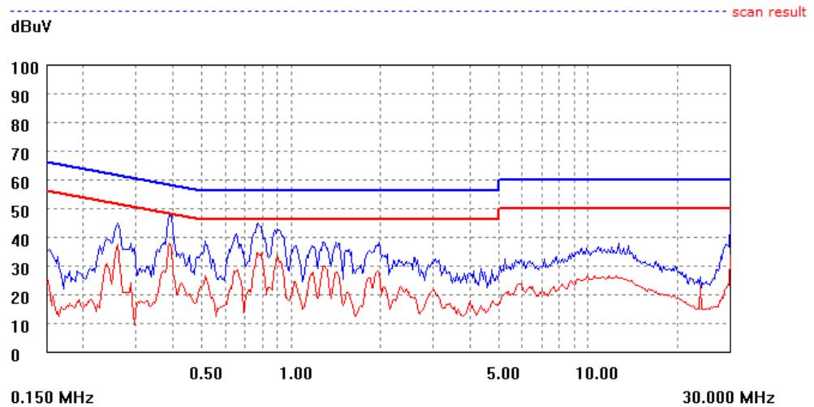

230VAC Neutral

<table><tr><td>差模</td><td>电压</td><td>相位角</td><td>发生器阻抗</td><td>测试次数</td><td>测试结果</td></tr><tr><td>L to N</td><td>+2kV</td><td>0</td><td>2</td><td>10</td><td>Pass</td></tr><tr><td>L to N</td><td>-2kV</td><td>0</td><td>2</td><td>10</td><td>Pass</td></tr><tr><td>L to N</td><td>+2kV</td><td>90</td><td>2</td><td>10</td><td>Pass</td></tr><tr><td>L to N</td><td>-2kV</td><td>90</td><td>2</td><td>10</td><td>Pass</td></tr><tr><td>L to N</td><td>+2kV</td><td>180</td><td>2</td><td>10</td><td>Pass</td></tr><tr><td>L to N</td><td>-2kV</td><td>180</td><td>2</td><td>10</td><td>Pass</td></tr><tr><td>L to N</td><td>+2kV</td><td>270</td><td>2</td><td>10</td><td>Pass</td></tr><tr><td>L to N</td><td>-2kV</td><td>270</td><td>2</td><td>10</td><td>Pass</td></tr></table>

## 测试说明

➢ 按照GB/T17626.5和IEC61000-4-5的最新版本要求进行测试  
➢ 室温环境，230VAC输入，满载条件  
➢ 输入1.2/50us组合波浪涌电压  
➢ 每个测试点重复10次  
➢ 每次间隔时间1分钟  
➢ 试验时样机输出正常（符合A类标准）视为Pass

<table><tr><td>测试点</td><td>电压(V)</td><td>放电类型</td><td>放电次数</td><td>测试结果</td></tr><tr><td>Vo</td><td>+15kV</td><td>空气放电</td><td>10</td><td>Pass</td></tr><tr><td>Vo</td><td>-15kV</td><td>空气放电</td><td>10</td><td>Pass</td></tr><tr><td>GND</td><td>+15kV</td><td>空气放电</td><td>10</td><td>Pass</td></tr><tr><td>GND</td><td>-15kV</td><td>空气放电</td><td>10</td><td>Pass</td></tr><tr><td>Vo</td><td>+8kV</td><td>接触放电</td><td>10</td><td>Pass</td></tr><tr><td>Vo</td><td>-8kV</td><td>接触放电</td><td>10</td><td>Pass</td></tr><tr><td>GND</td><td>+8kV</td><td>接触放电</td><td>10</td><td>Pass</td></tr><tr><td>GND</td><td>-8kV</td><td>接触放电</td><td>10</td><td>Pass</td></tr></table>

## 测试说明

➢ 按照GB/T17626.2和IEC61000-4-2的最新版本要求进行测试  
➢ 室温环境，230VAC输入满载条件  
➢ 每个测试点重复10次  
➢ 分别对输出正端和地进行空气放电  
➢ 试验时样机输出正常（符合A类标准）视为Pass

## THANK YOU FOR WATCHING
