## BPA8604P 参考设计

## (5V/1A)

上海晶丰明源半导体股份有限公司

Shanghai Bright Power Semiconductor Co., Ltd.

陈耀兵

2021 7 17

BPA8604  
电源规格  
电路图  
◼BOM  
◼PCB Layout  
电路实物图  
变压器规格书  
性能测试数据

## 产品特点:

》集成交流电压过零检测与过零信号输 出功能  
➢ 700V MOSFET  
➢ ON/OFF  
》内置软启动功能  
》集成高压启动、自供电电路  
➢ EMI

## 应用领域:

》家用电器辅助电源  
》微波炉辅助电源

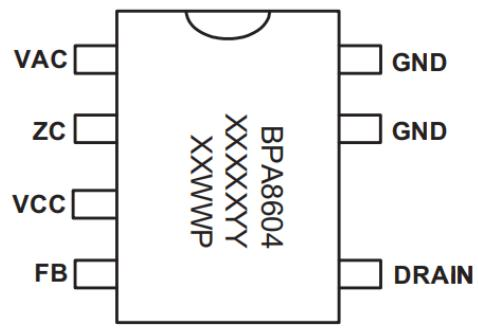

<table><tr><td>项目描述</td><td>符号</td><td>最小</td><td>典型</td><td>最大</td><td>单位</td><td>备注</td></tr><tr><td colspan="7">输入</td></tr><tr><td>电压</td><td> $V_{IN}$ </td><td>90</td><td>115/230</td><td>264</td><td> $V_{AC}$ </td><td></td></tr><tr><td>频率</td><td> $f_{LINE}$ </td><td>47</td><td>50/60</td><td>63</td><td>Hz</td><td></td></tr><tr><td colspan="7">输出</td></tr><tr><td>输出电压</td><td> $V_{OUT}$ </td><td></td><td>5</td><td></td><td>V</td><td>±3%</td></tr><tr><td>输出电流</td><td> $I_{OUT}$ </td><td></td><td>1</td><td></td><td>A</td><td></td></tr><tr><td>输出电压纹波</td><td> $V_{RIPPLE}$ </td><td></td><td></td><td>300</td><td>mV</td><td>20MHz带宽,可加二级滤波减小</td></tr><tr><td>连续输出功率</td><td> $P_{OUT}$ </td><td></td><td>5</td><td></td><td>W</td><td></td></tr><tr><td colspan="7">效率</td></tr><tr><td>待机功耗</td><td> $P_{STDBY}$ </td><td></td><td></td><td>100</td><td>mW</td><td>230VAC</td></tr><tr><td>满载效率</td><td>η</td><td>71</td><td></td><td></td><td>%</td><td>115VAC/230VAC</td></tr><tr><td colspan="7">环境</td></tr><tr><td>传导EMI</td><td></td><td colspan="4">满足CISPR22/EN55022 Class B,至少6dB 裕量</td><td></td></tr><tr><td>Surge</td><td></td><td></td><td>2</td><td></td><td>kV</td><td>差模</td></tr><tr><td>EFT</td><td></td><td></td><td>4</td><td></td><td>kV</td><td>5kHz/100kHz/38kHz</td></tr><tr><td>ESD</td><td></td><td></td><td>15</td><td></td><td>kV</td><td>接触8kV,空气15kV</td></tr><tr><td>工作环境温度</td><td> $T_{AMP}$ </td><td>0</td><td></td><td>40</td><td>°C</td><td></td></tr></table>

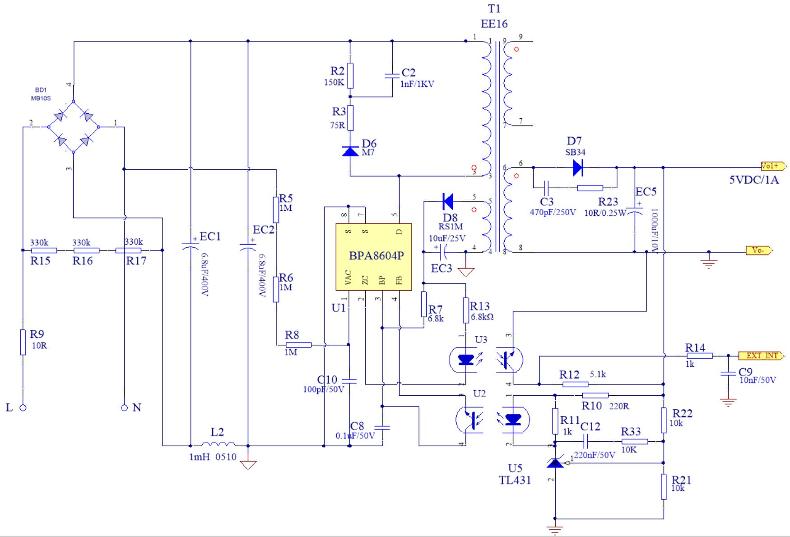

<table><tr><td>序号</td><td>元件标号</td><td>参数描述</td><td>封装尺寸</td><td>数量</td></tr><tr><td>1</td><td>BD1</td><td>MB10S</td><td>BD_SMD(bs210)</td><td>1</td></tr><tr><td>2</td><td>C2</td><td>1nF/1KV</td><td>50V104</td><td>1</td></tr><tr><td>3</td><td>C3</td><td>470pF/250V</td><td>0805-C</td><td>1</td></tr><tr><td>4</td><td>C8</td><td>0.1uF/50V</td><td>0805-C</td><td>1</td></tr><tr><td>5</td><td>C9</td><td>10nF/50V</td><td>0805-C</td><td>1</td></tr><tr><td>6</td><td>C10</td><td>100pF/50V</td><td>0805-C</td><td>1</td></tr><tr><td>7</td><td>C12</td><td>220nF/50V</td><td>0805-C</td><td>1</td></tr><tr><td>8</td><td>D6</td><td>M7</td><td>D SMA</td><td>1</td></tr><tr><td>9</td><td>D7</td><td>SB34</td><td>DO-15</td><td>1</td></tr><tr><td>10</td><td>D8</td><td>RS1M</td><td>D SMA</td><td>1</td></tr><tr><td>11</td><td>EC1, EC2</td><td>6.8uF/400V</td><td>EC 6.5 P2.5</td><td>2</td></tr><tr><td>12</td><td>EC3</td><td>10uF/25V</td><td>EC 5 P2.5</td><td>1</td></tr><tr><td>13</td><td>EC5</td><td>1000uF/10V</td><td>EC 10 P5.0</td><td>1</td></tr><tr><td>14</td><td>L2</td><td>1mH 0510</td><td>L/D 6 P3.0</td><td>1</td></tr><tr><td>15</td><td>R2</td><td>150K</td><td>1206-r</td><td>1</td></tr><tr><td>16</td><td>R3</td><td>75R</td><td>1206-r</td><td>1</td></tr><tr><td>17</td><td>R5, R6, R8</td><td>1M</td><td>1206-r</td><td>3</td></tr><tr><td>18</td><td>R7</td><td>6.8k</td><td>0805-r</td><td>1</td></tr><tr><td>19</td><td>R9</td><td>10R</td><td>F-2W</td><td>1</td></tr><tr><td>20</td><td>R10</td><td>220R</td><td>0805-r</td><td>1</td></tr></table>

<table><tr><td>序号</td><td>元件标号</td><td>参数描述</td><td>封装尺寸</td><td>数量</td></tr><tr><td>21</td><td>R11, R14</td><td>1k</td><td>0805-r</td><td>2</td></tr><tr><td>22</td><td>R12</td><td>5.1k</td><td>0805-r</td><td>1</td></tr><tr><td>23</td><td>R13</td><td>6.8kΩ</td><td>0805-r</td><td>1</td></tr><tr><td>24</td><td>R15, R16, R17</td><td>330k</td><td>1206-r</td><td>3</td></tr><tr><td>25</td><td>R21, R22, R33</td><td>10k</td><td>0805-r</td><td>3</td></tr><tr><td>26</td><td>R23</td><td>10R/0.25W</td><td>0805-r</td><td>1</td></tr><tr><td>27</td><td>T1</td><td>EE16</td><td>T EE16(5+5)</td><td>1</td></tr><tr><td>28</td><td>U1</td><td>BPA8604P</td><td>USOP8(BPA8604)</td><td>1</td></tr><tr><td>29</td><td>U2</td><td>PC817B</td><td>DIP-4</td><td>1</td></tr></table>

TOP SIDE

BOTTOM SIDE

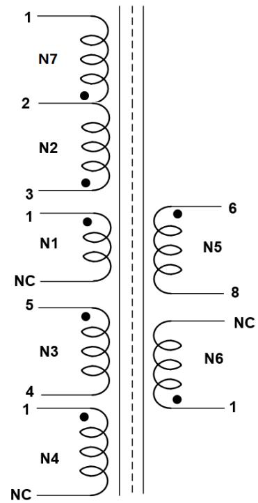

## 规格与材料

初级绕组感量 $L _ { \mathrm { o } } { = } 2 2 0 0 0 \mathsf { u H } { \pm } 7 \%$ （测试条件：0.3V，100kHz)  
漏感量 $L _ { | k } < 5 0 \mathsf { u } \mathsf { H }$  
骨架：EE16底部加高 (5+5PIN)  
➢ 磁芯：EE16 PC40或同等材质， ${ \mathsf { A e } } { = } 1 9 . 2 { \mathsf { m m } } ^ { 2 }$  
》　N1、N2、N3、N4、N6、N7:2UEW漆包线  
➢ N5：三层绝缘线  
绝缘胶带:3M900或同等材质  
耐压测试:3KV,50/60Hz,1Min  
成品要求：浸凡立水

<table><tr><td>序号</td><td>起始脚</td><td>终止脚</td><td>绕制规则</td><td>匝数</td><td>绕线方式</td></tr><tr><td>N1</td><td>1</td><td>NC</td><td>2UEW φ0.15*2P</td><td>22Ts</td><td>密绕一层(PIN脚朝外)</td></tr><tr><td>胶带</td><td></td><td></td><td></td><td>2Ts</td><td></td></tr><tr><td>N2</td><td>3</td><td>2</td><td>2UEW φ0.15*1P</td><td>88Ts</td><td>密绕两层(PIN脚朝外)</td></tr><tr><td>胶带</td><td></td><td></td><td></td><td>2Ts</td><td></td></tr><tr><td>N3</td><td>5</td><td>4</td><td>2UEW φ0.15*2P</td><td>22Ts</td><td>密绕一层(PIN脚朝外)</td></tr><tr><td>胶带</td><td></td><td></td><td></td><td>2Ts</td><td></td></tr><tr><td>N4</td><td>1</td><td>NC</td><td>2UEW φ0.15*3P</td><td>6Ts</td><td>均匀绕一层(PIN脚朝外)</td></tr><tr><td>胶带</td><td></td><td></td><td></td><td>3Ts</td><td></td></tr><tr><td>N5</td><td>6</td><td>8</td><td>TEX-E φ0.5*1P</td><td>8Ts</td><td>均匀绕一层(PIN脚朝外)</td></tr><tr><td>胶带</td><td></td><td></td><td></td><td>3Ts</td><td></td></tr><tr><td>N6</td><td>1</td><td>NC</td><td>2UEW φ0.15*3P</td><td>6Ts</td><td>均匀绕一层(PIN脚朝外)</td></tr><tr><td>胶带</td><td></td><td></td><td></td><td>2Ts</td><td></td></tr><tr><td>N7</td><td>2</td><td>1</td><td>2UEW φ0.15*1P</td><td>43Ts</td><td>密绕一层(PIN脚朝外)</td></tr><tr><td>胶带</td><td></td><td></td><td></td><td>3Ts</td><td></td></tr></table>

## 待机功耗

待机功耗  
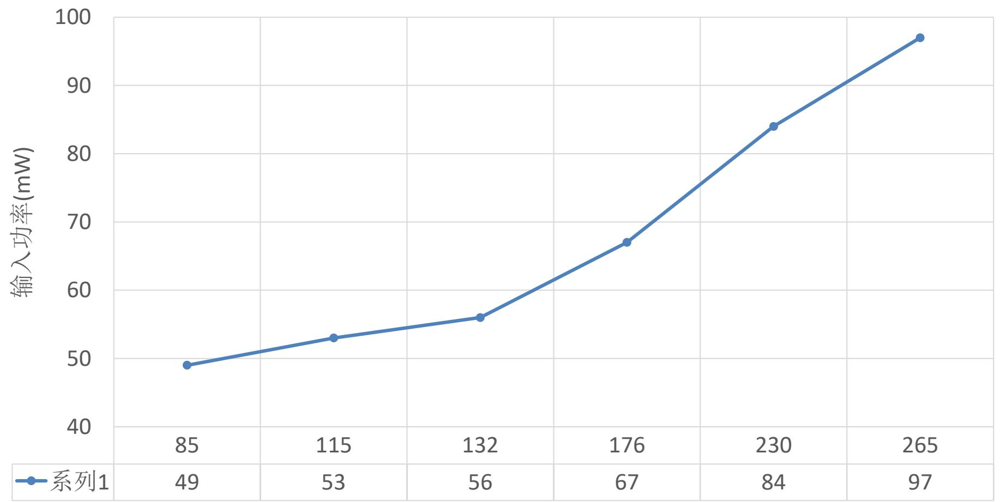

输入电压(Vac)

效率曲线  
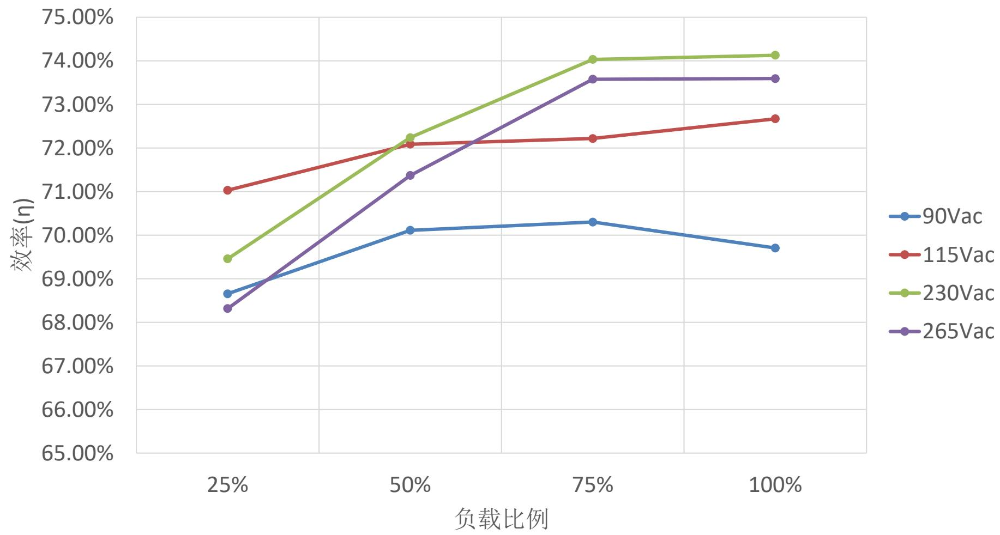

<table><tr><td> $V_{IN}(VAC)$ </td><td>Load(%)</td><td> $P_{IN}(W)$ </td><td> $V_{OUT}(V)$ </td><td>线端</td><td> $I_{OUT}(A)$ </td><td> $P_{OUT}(W)$ </td><td>Eff(%)</td><td>AVG Eff(%)</td></tr><tr><td rowspan="6">85</td><td>空载</td><td></td><td></td><td></td><td></td><td>0</td><td></td><td></td></tr><tr><td>10%</td><td>0.766</td><td>5.0066</td><td></td><td>0.1</td><td>0.50066</td><td>65.36%</td><td></td></tr><tr><td>25%</td><td>1.823</td><td>5.0064</td><td></td><td>0.25</td><td>1.2516</td><td>68.66%</td><td rowspan="4">69.69%</td></tr><tr><td>50%</td><td>3.57</td><td>5.0059</td><td></td><td>0.5</td><td>2.50295</td><td>70.11%</td></tr><tr><td>75%</td><td>5.34</td><td>5.0054</td><td></td><td>0.75</td><td>3.75405</td><td>70.30%</td></tr><tr><td>100%</td><td>7.18</td><td>5.0048</td><td></td><td>1</td><td>5.0048</td><td>69.70%</td></tr><tr><td rowspan="6">115</td><td>空载</td><td></td><td></td><td></td><td></td><td>0</td><td></td><td></td></tr><tr><td>10%</td><td>0.762</td><td>5.0066</td><td></td><td>0.1</td><td>0.50066</td><td>65.70%</td><td></td></tr><tr><td>25%</td><td>1.762</td><td>5.0062</td><td></td><td>0.25</td><td>1.25155</td><td>71.03%</td><td rowspan="4">72.00%</td></tr><tr><td>50%</td><td>3.472</td><td>5.0056</td><td></td><td>0.5</td><td>2.5028</td><td>72.09%</td></tr><tr><td>75%</td><td>5.198</td><td>5.0051</td><td></td><td>0.75</td><td>3.753825</td><td>72.22%</td></tr><tr><td>100%</td><td>6.887</td><td>5.0048</td><td></td><td>1</td><td>5.0048</td><td>72.67%</td></tr><tr><td rowspan="6">230</td><td>空载</td><td></td><td></td><td></td><td></td><td>0</td><td></td><td></td></tr><tr><td>10%</td><td>0.797</td><td>5.0068</td><td></td><td>0.1</td><td>0.50068</td><td>62.82%</td><td></td></tr><tr><td>25%</td><td>1.802</td><td>5.0065</td><td></td><td>0.25</td><td>1.251625</td><td>69.46%</td><td rowspan="4">72.46%</td></tr><tr><td>50%</td><td>3.465</td><td>5.0061</td><td></td><td>0.5</td><td>2.50305</td><td>72.24%</td></tr><tr><td>75%</td><td>5.071</td><td>5.0056</td><td></td><td>0.75</td><td>3.7542</td><td>74.03%</td></tr><tr><td>100%</td><td>6.752</td><td>5.0051</td><td></td><td>1</td><td>5.0051</td><td>74.13%</td></tr><tr><td rowspan="6">265</td><td>空载</td><td></td><td></td><td></td><td></td><td>0</td><td></td><td></td></tr><tr><td>10%</td><td>0.823</td><td>5.0066</td><td></td><td>0.1</td><td>0.50066</td><td>60.83%</td><td></td></tr><tr><td>25%</td><td>1.832</td><td>5.0062</td><td></td><td>0.25</td><td>1.25155</td><td>68.32%</td><td rowspan="4">71.71%</td></tr><tr><td>50%</td><td>3.507</td><td>5.0058</td><td></td><td>0.5</td><td>2.5029</td><td>71.37%</td></tr><tr><td>75%</td><td>5.102</td><td>5.0053</td><td></td><td>0.75</td><td>3.753975</td><td>73.58%</td></tr><tr><td>100%</td><td>6.801</td><td>5.005</td><td></td><td>1</td><td>5.005</td><td>73.59%</td></tr></table>

## 输出电压调整率

<table><tr><td> $V_{IN}(VAC)$  $I_{OUT}(A)$ </td><td>90</td><td>115</td><td>132</td><td>176</td><td>230</td><td>265</td><td>平均值</td><td>线调整率</td></tr><tr><td>0</td><td>5.0059</td><td>5.0059</td><td>5.0059</td><td>5.0059</td><td>5.0059</td><td>5.0059</td><td>5.006</td><td>0.00%</td></tr><tr><td>20%</td><td>5.0055</td><td>5.0055</td><td>5.0055</td><td>5.0056</td><td>5.0056</td><td>5.0056</td><td>5.006</td><td>0.00%</td></tr><tr><td>40%</td><td>5.005</td><td>5.005</td><td>5.005</td><td>5.005</td><td>5.0051</td><td>5.0051</td><td>5.005</td><td>0.00%</td></tr><tr><td>60%</td><td>5.0048</td><td>5.0048</td><td>5.0048</td><td>5.0048</td><td>5.0048</td><td>5.0048</td><td>5.005</td><td>0.00%</td></tr><tr><td>80%</td><td>5.0045</td><td>5.0045</td><td>5.0045</td><td>5.0046</td><td>5.0047</td><td>5.0047</td><td>5.005</td><td>0.00%</td></tr><tr><td>100%</td><td>5.0047</td><td>5.0047</td><td>5.0046</td><td>5.0046</td><td>5.0046</td><td>5.0046</td><td>5.005</td><td>0.00%</td></tr><tr><td>平均值</td><td>5.005</td><td>5.005</td><td>5.005</td><td>5.005</td><td>5.005</td><td>5.005</td><td></td><td></td></tr><tr><td>负载调整率</td><td>0.03%</td><td>0.03%</td><td>0.03%</td><td>0.03%</td><td>0.03%</td><td>0.03%</td><td></td><td></td></tr></table>

◼ 计算方法：调整率=100%\*(最大值-最小值)/平均值

## 输出电压纹波

20MHz带宽，去掉示波器探头正端夹子和地线环，10uF/50V 0.1uF/50V

${ \otimes 5 } \mathsf { V } _ { \mathsf { A C } }$

CH1 VOUT $\mathsf { V } _ { \mathsf { o u r } }$ Ripple $V _ { p | _ { \tt P K } - P | } = 2 1 5 . 8$ VPK-PK=215.8 mV

## Test Condition:

➢ Full Load

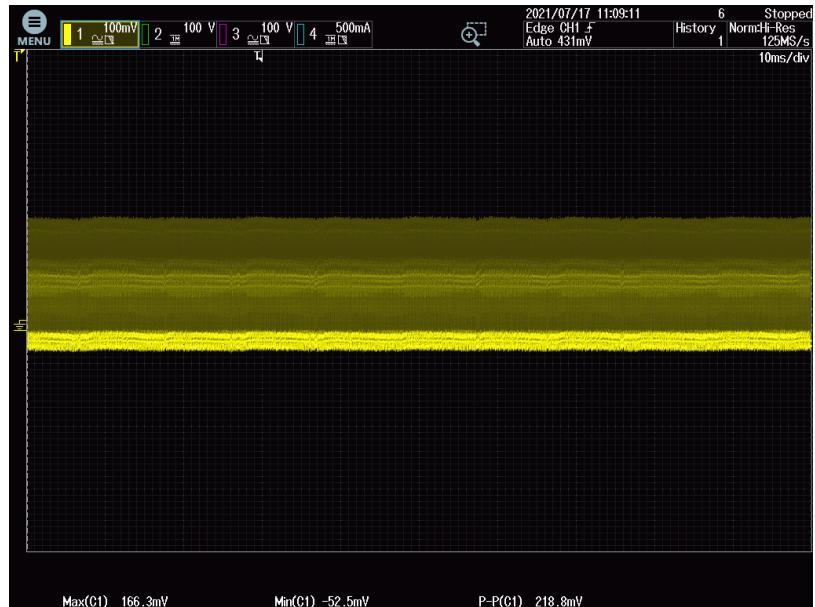

115 VAC

CH1 VOUT $\begin{array} { l } { \mathsf { C H 1 V _ { o u \intercal } } } \\ { \mathsf { R i p p l e } } \end{array}$ $V _ { p | _ { \mathrm { P K - P K } } } = 2 1 8 . 8$ mV

## Test Condition:

➢ Full Load

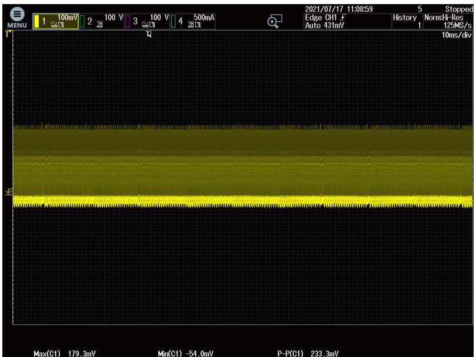

$230 v _ { \mathsf { A C } }$

CH1 VOUT $\mathsf { V } _ { \mathsf { o u r } }$ Ripple $V _ { p | | \cdot | p | \cdot } = 2 3 3 . 3$ VPK-PK=233.3 mV

## Test Condition:

➢ Full Load

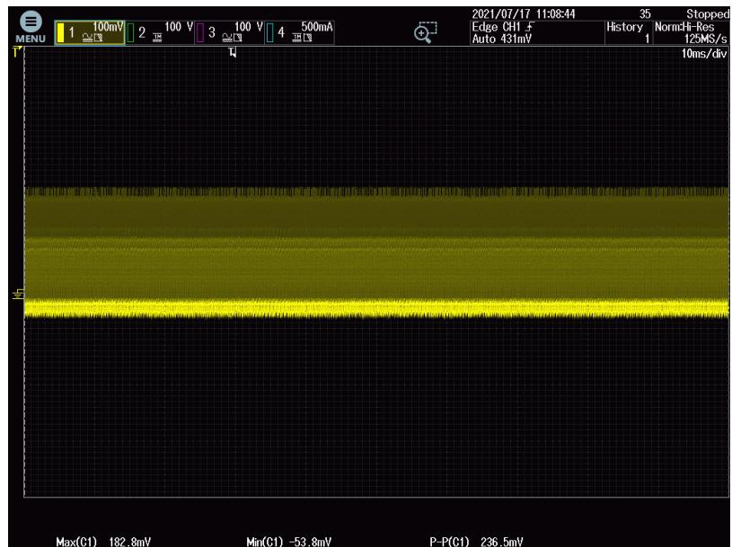

265 VAC

CH1 VOUT $\begin{array} { l } { \mathsf { C H 1 V _ { o u \intercal } } } \\ { \mathsf { R i p p l e } } \end{array}$ $V _ { P K }$ VPK-PK=236.5mV $r _ { P K } = 2 3 6 . 5 m v$

## Test Condition:

➢ Full Load

## (50%-100%)

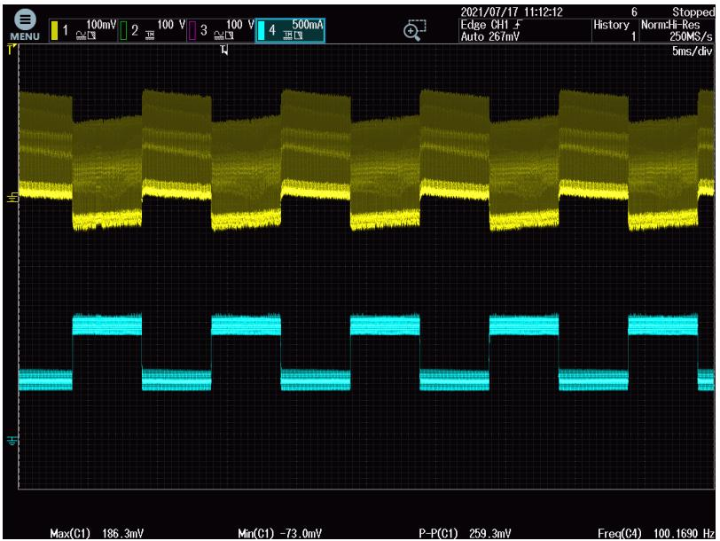

85 VAC

CH1 VOUT $\mathsf { V } _ { \mathsf { O U T } }$ $V _ { \mathsf { P K - P K } } { = } 2 5 9 . 3 \mathsf { m V }$  
$\mathsf { C H 4 } \mathsf { I } _ { \mathsf { O U T } }$

## Test Condition:

➢ $0 . 5 \mathsf { A } \mathsf { - } 1 \mathsf { A } \mathsf { - } 0 . 5 \mathsf { A }$  
➢ Slew Rate: 0.5 A/μS  
➢ Frequency: 100 Hz

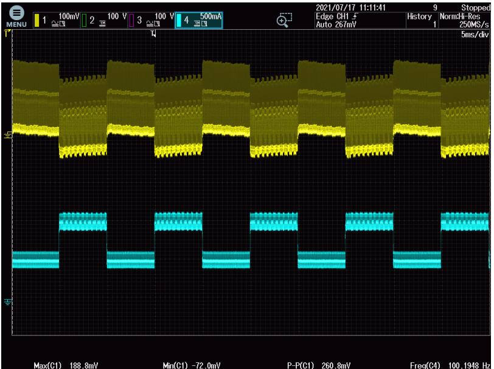

230 VAC

CH1 VOUT $\mathsf { V } _ { \mathsf { O U T } }$ $V _ { \mathsf { P K - P K } } = 2 6 0 . 8 ~ \mathsf { m V }$  
$\mathsf { C H 4 } \mathsf { l } _ { \mathsf { O U T } }$

## Test Condition:

➢ 0.5 A-1 A-0.5 A  
➢ Slew Rate: 0.5 $\mathsf { A } / \mu \mathsf { S }$  
➢ Frequency: 100 Hz

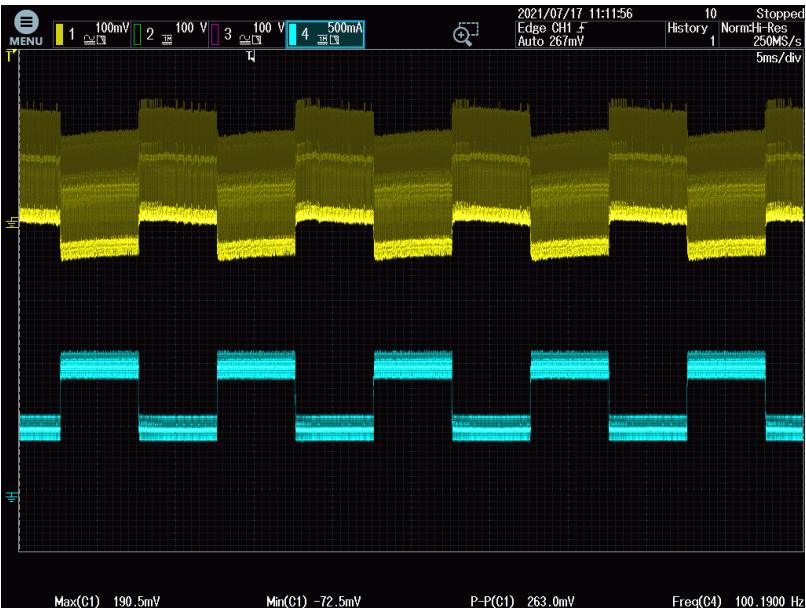

115 VAC

CH1 VOUT ${ \mathsf { C H 1 } } { \mathsf { V } } _ { \mathsf { O U T } }$ $V _ { P K - P K } = 2 6 3 ~ \mathsf { m V }$  
$\mathsf { C H 4 } \mathsf { I } _ { \mathsf { O U T } }$

## Test Condition:

➢ $0 . 5 \mathsf { A } \mathsf { - } 1 \mathsf { A } \mathsf { - } 0 . 5 \mathsf { A }$  
➢ Slew Rate: 0.5 A/μS  
➢ Frequency: 100 Hz

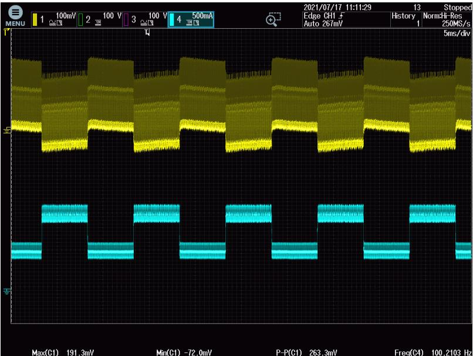

265 VAC

CH1 VOUT ${ \mathsf { C H 1 } } { \mathsf { V } } _ { \mathsf { O U T } }$ $V _ { p | c - P K } = 2 6 3 . 3 m v$  
$\mathsf { C H 4 } \mathsf { I } _ { \mathsf { O U T } }$

## Test Condition:

➢ $0 . 5 \mathsf { A } \mathsf { - } 1 \mathsf { A } \mathsf { - } 0 . 5 \mathsf { A }$  
➢ Slew Rate: 0.5 A/μS  
➢ Frequency: 100 Hz

## (10%-90%)

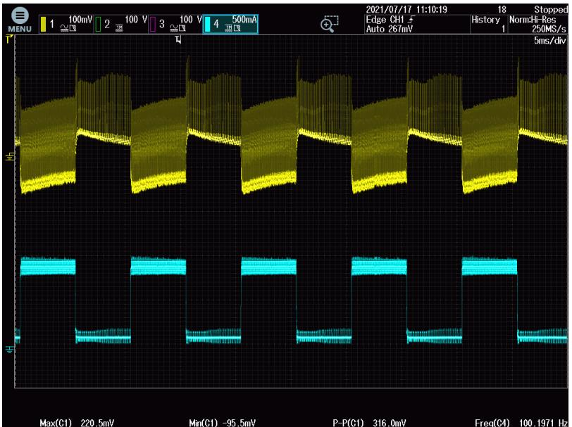

85 VAC

CH1 VOUT ${ \mathsf { C H 1 } } { \mathsf { V } } _ { \mathsf { O U T } }$ $V _ { \mathsf { P K - P K } } { = } 3 1 6 ~ \mathsf { m V }$  
$\mathsf { C H 4 } \mathsf { I } _ { \mathsf { O U T } }$

## Test Condition:

➢ $0 . 1 \mathsf { A } \mathsf { - } 1 \mathsf { A } \mathsf { - } 0 . 1 \mathsf { A }$  
➢ Slew Rate: 0.5 A/μS  
➢ Frequency: 100 Hz

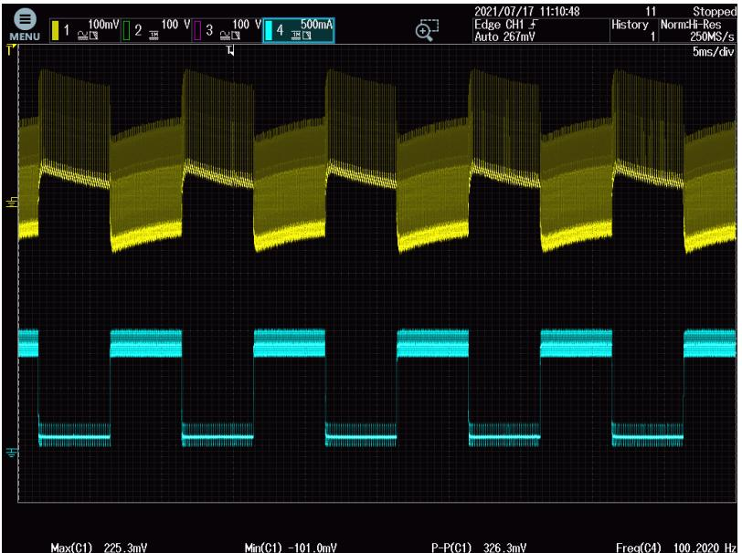

230 VAC

CH1 VOUT $\mathsf { V } _ { \mathsf { O U T } }$ $V _ { p | c . p | k } = 3 2 6 . 3 m v$  
$\mathsf { C H 4 } \mathsf { l } _ { \mathsf { O U T } }$

## Test Condition:

➢ $0 . 1 \mathsf { A } \mathsf { - } 1 \mathsf { A } \mathsf { - } 0 . 1 \mathsf { A }$  
➢ Slew Rate: 0.5 $\mathsf { A } / \mu \mathsf { S }$  
➢ Frequency: 100 Hz

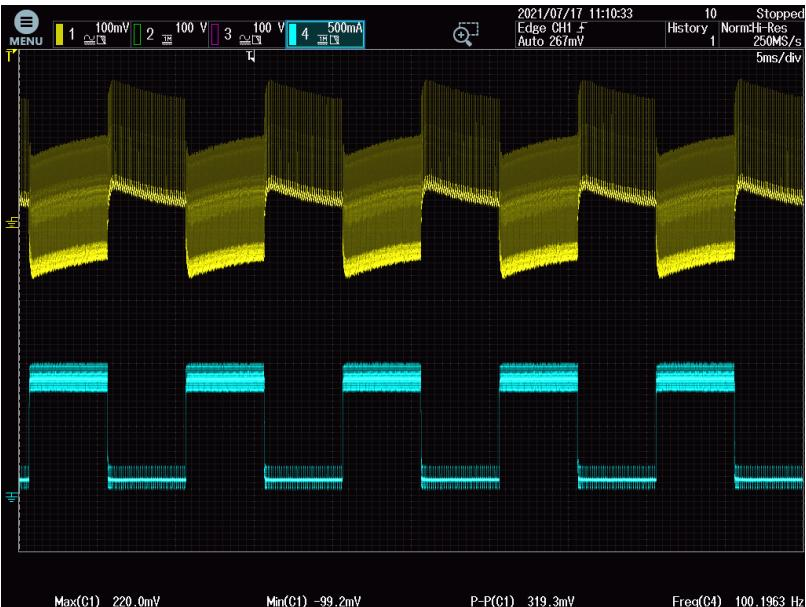

115 VAC

CH1 VOUT ${ \mathsf { C H 1 } } { \mathsf { V } } _ { \mathsf { O U T } }$ $\mathsf { V } _ { \mathsf { P K - P K } } \mathsf { = } 3 1 9 . 3 \mathsf { m V }$  
$\mathsf { C H 4 } \mathsf { I } _ { \mathsf { O U T } }$

## Test Condition:

➢ $0 . 1 \mathsf { A } \mathsf { - } 1 \mathsf { A } \mathsf { - } 0 . 1 \mathsf { A }$  
➢ Slew Rate: 0.5 A/μS  
➢ Frequency: 100 Hz

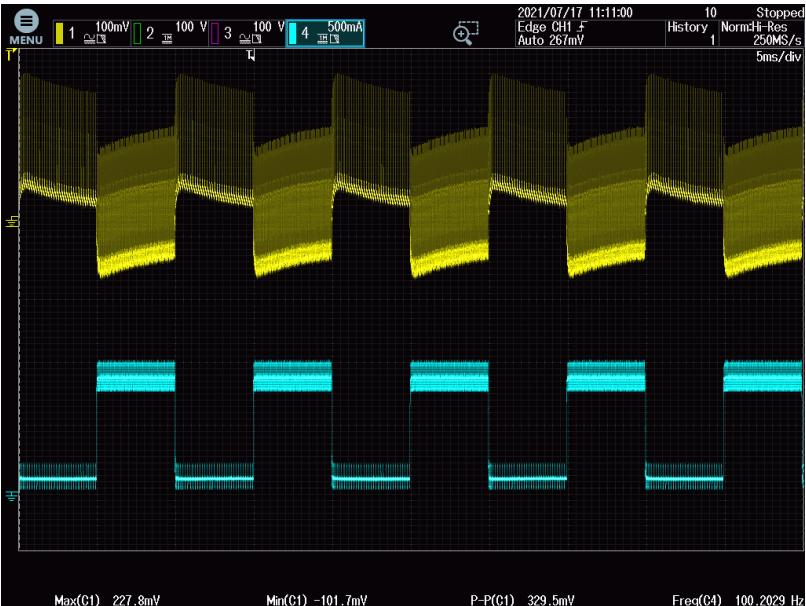

265 VAC

CH1 VOUT ${ \mathsf { C H 1 } } { \mathsf { V } } _ { \mathsf { O U T } }$ $V _ { p | c - P K } = 3 2 9 . 5 m v$  
$\mathsf { C H 4 } \mathsf { I } _ { \mathsf { O U T } }$

## Test Condition:

➢ $0 . 1 \mathsf { A } \mathsf { - } 1 \mathsf { A } \mathsf { - } 0 . 1 \mathsf { A }$  
➢ Slew Rate: 0.5 A/μS  
➢ Frequency: 100 Hz

## 输出电压开机波形

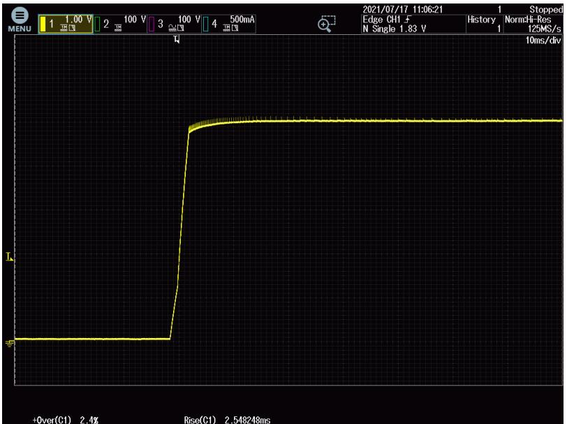

85 VAC

CH1 VOUT TRISE: 2.55 mS

## Test Condition:

➢ No Load

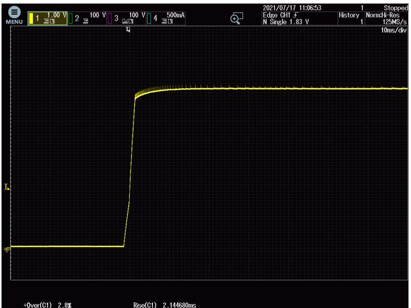

265 VAC

CH1 VOUT TRISE: 2.14 mS

## Test Condition:

➢ No Load

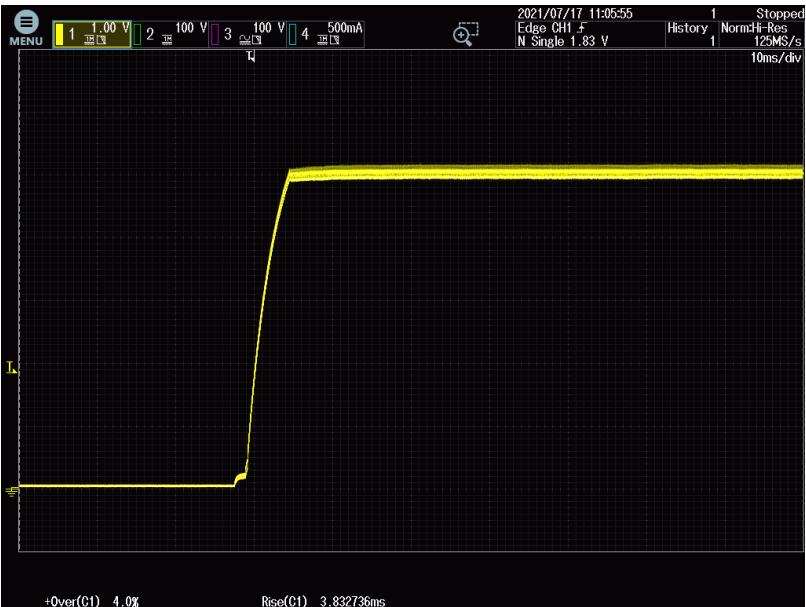

85 VAC

CH1 VOUT TRISE: 3.83 mS

## Test Condition:

➢ Full Load

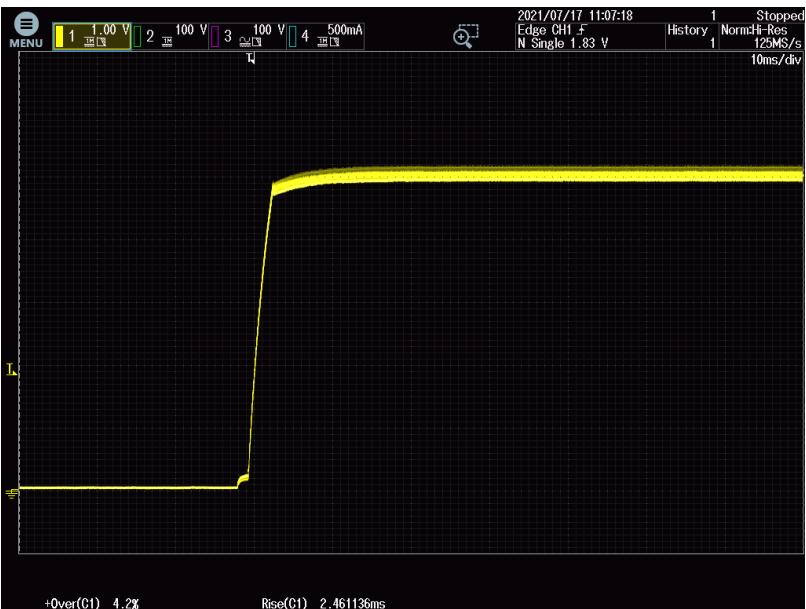

265 VAC

CH1 VOUT TRISE: 2.46 mS

## Test Condition:

➢ Full Load

## MOs漏源极电压电流波形 (启机)

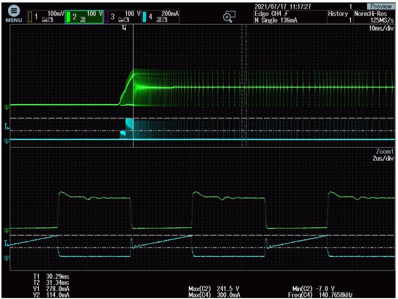

85 VAC

${ \mathsf { C H } } 2 { \mathsf { V } } _ { \mathsf { D S } }$  
$C H 4 1 _ { \mathsf { D } }$ $\mathsf { V } _ { \mathsf { D } \mathsf { S } } { = } 2 4 1 . 5 \mathsf { V }$ $\mathsf { I } _ { \mathsf { M A X } } { = } 3 0 0 \mathsf { m } \mathsf { A }$

Test Condition:  
➢ No Load  
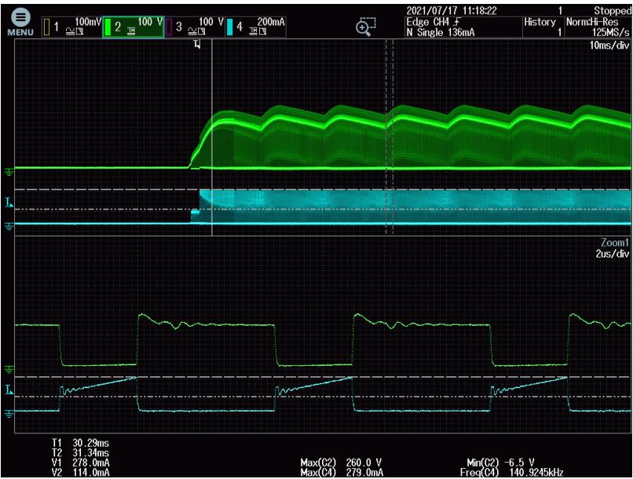

85 VAC

${ \mathsf { C H } } 2 { \mathsf { V } } _ { \mathsf { D S } }$  
$C H 4 1 _ { \mathsf { D } }$ $V _ { \mathrm { D S } } { = } 2 6 0 V$ $\mathsf { I } _ { \mathsf { M A X } } = 2 7 9 \mathsf { m A }$

Test Condition:  
➢ Full Load  
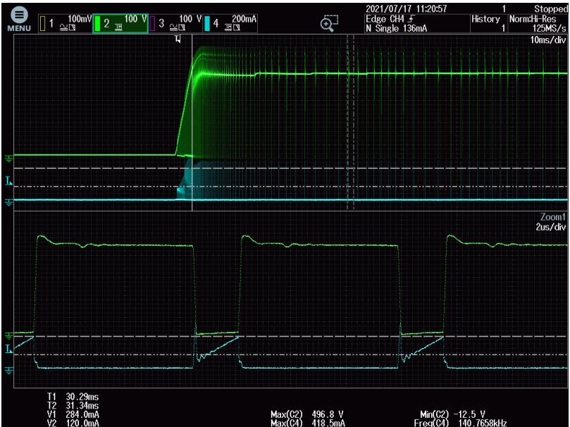

265 VAC

${ \mathsf { C H } } 2 \ { \mathsf { V } } _ { \mathsf { D S } }$  
$C H 4 1 _ { \mathsf { D } }$ $V _ { \mathsf { D S } } { = } 4 9 6 . 8 \mathsf { V }$ IMAX=418.5 $\mathsf { I } _ { \mathsf { M A X } } { = } 4 1 8 . 5 \mathsf { m A }$

Test Condition:  
➢ No Load  
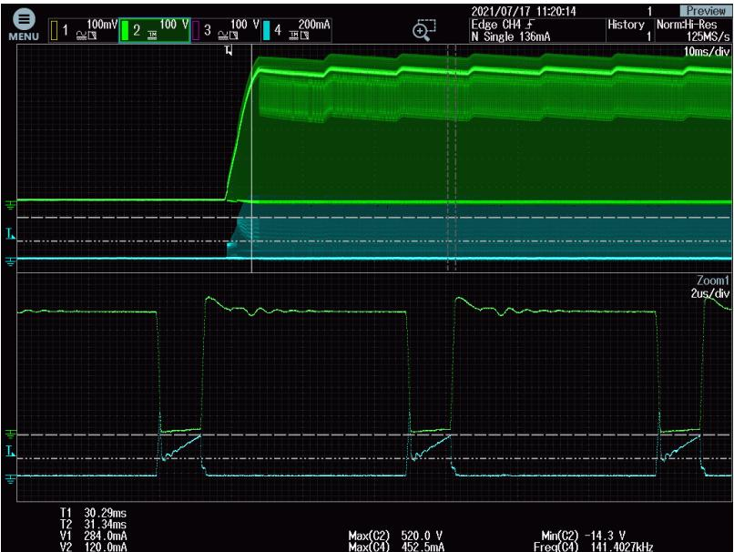

$2 6 5 \ : \mathsf { V } _ { \mathsf { A C } }$

${ \mathsf { C H } } 2 { \mathsf { V } } _ { \mathsf { D S } }$  
$C H 4 1 _ { \mathsf { D } }$ $V _ { \mathrm { D S } } { = } 5 2 0 \mathrm { V }$ IMAX=452.5 mA $\mathsf { I } _ { \mathsf { M A X } } { = } 4 5 2 . 5 ~ \mathsf { m A }$

Test Condition:

➢ Full Load

## MOS漏源极电压电流波形 (正常工作)

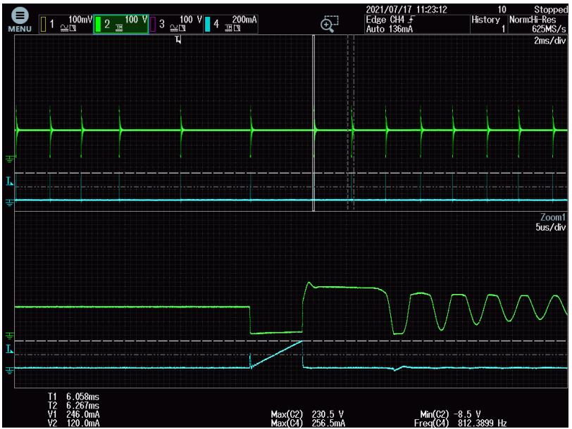

85 VAC

${ \mathsf { C H } } 2 { \mathsf { V } } _ { \mathsf { D S } }$  
$C H 4 1 _ { \mathsf { D } }$ $V _ { \mathrm { D S } } { = } 2 3 0 . 5 \lor$ $\mathsf { I } _ { \mathsf { M A X } } = 2 5 6 . 5 \mathsf { m A }$

Test Condition:  
➢ No Load  
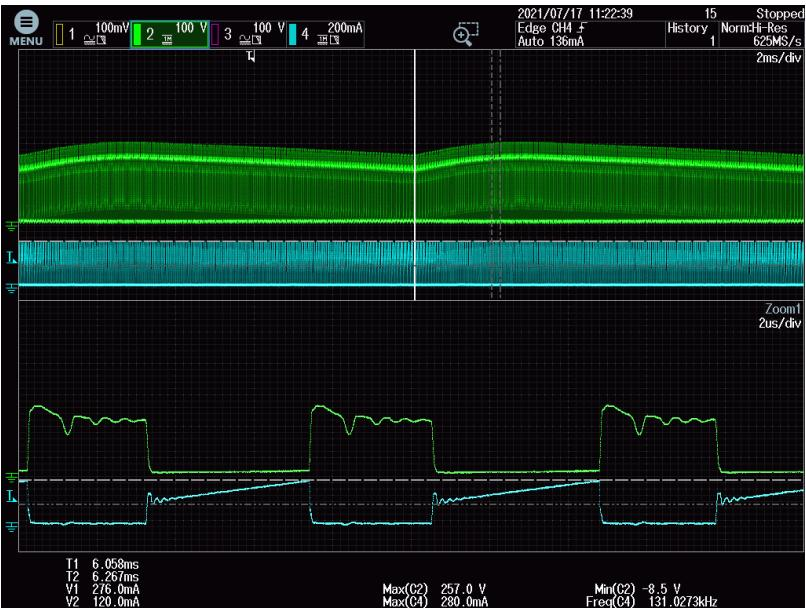

85 VAC

${ \mathsf { C H } } 2 { \mathsf { V } } _ { \mathsf { D S } }$  
$C H 4 1 _ { \mathsf { D } }$ $V _ { \mathrm { D S } } { = } 2 5 7 \mathrm { V }$ $\mathsf { I } _ { \mathsf { M A X } } = 2 8 0 \mathsf { m A }$

Test Condition:  
➢ Full Load  
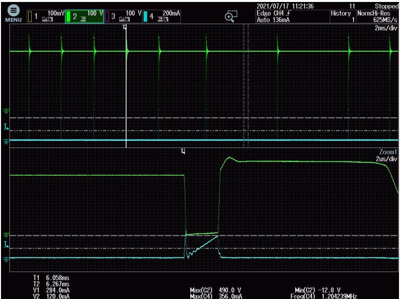

265 VAC

${ \mathsf { C H } } 2 \ { \mathsf { V } } _ { \mathsf { D S } }$  
$C H 4 1 _ { \mathsf { D } }$ $V _ { \mathsf { D } \mathsf { S } } { = } 4 9 0 \mathsf { V }$ $\mathsf { I } _ { \mathsf { M A X } } { = } 3 5 6 ~ \mathsf { m A }$ IMAX=356 mA

Test Condition:  
➢ No Load  
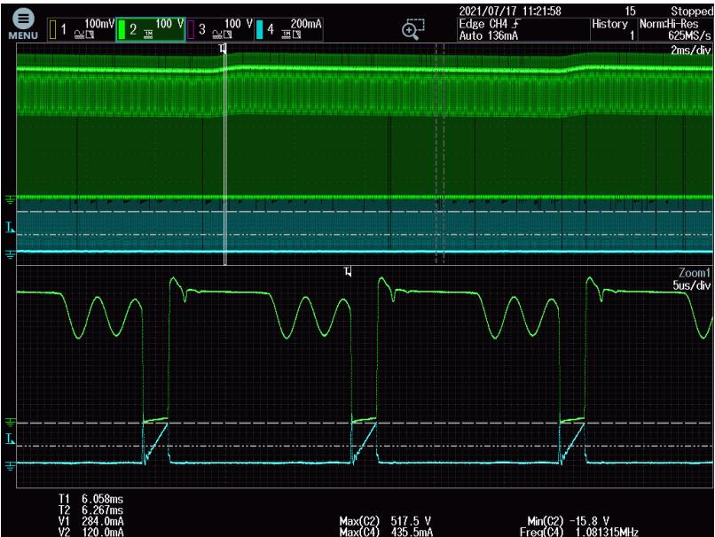

265 VAC

${ \mathsf { C H } } 2 { \mathsf { V } } _ { \mathsf { D S } }$  
$C H 4 1 _ { \mathsf { D } }$ $\mathtt { V } _ { \mathsf { D S } } mathtt { = } 5 1 7 . 5 \mathsf { V }$ $\mathsf { I } _ { \mathsf { M A X } } { = } 4 3 5 . 5 ~ \mathsf { m A }$

Test Condition:

➢ Full Load

## 输出二极管电压波形

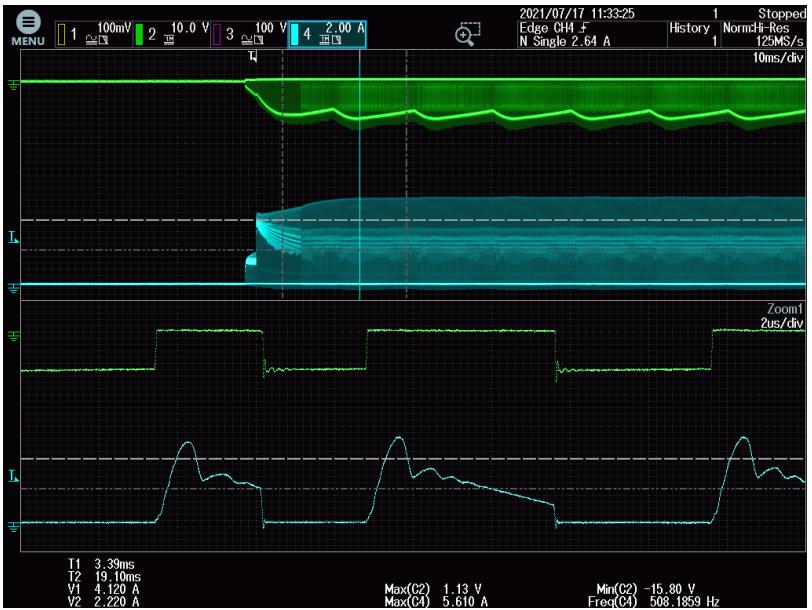

85 VAC

$C H 2 V _ { \mathsf { D } }$  
$C H 4 1 _ { \mathsf { D } }$ $\mathtt { V } _ { \mathtt { D } } mathtt { = } 1 5 . 8 \mathtt { V }$ $\mathsf { I } _ { \mathsf { D m a x } } = 5 . 6 1 \mathsf { A }$ Dmax

Test Condition:

➢ Full Load  
➢ 开机

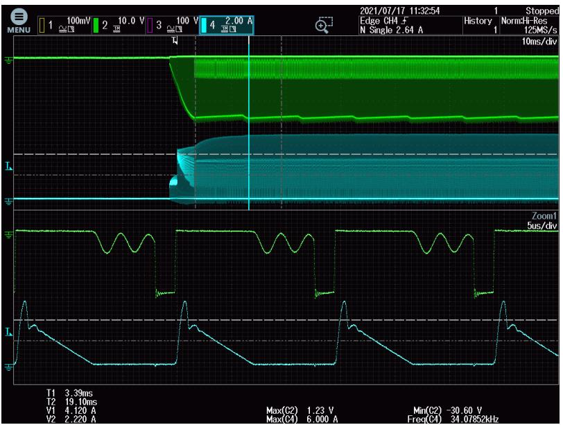

265 VAC

CH2 VD  
$C H 4 1 _ { \mathsf { D } }$ $\mathtt { V } _ { \mathtt { D } } { = } 3 0 . 6 \mathtt { V }$ $\mathsf { I } _ { \mathsf { D m a x } } { = } 6 \mathsf { \mathbf { A } }$ IDmax

➢ Full Load  
➢ 开机

Test Condition:  
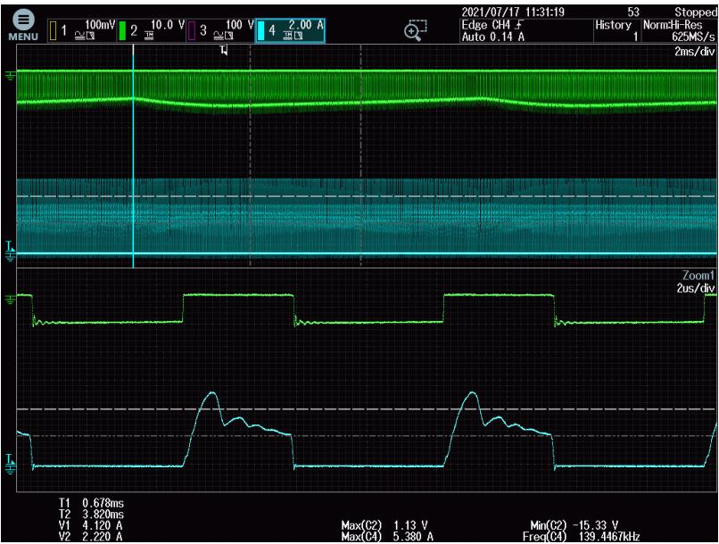

85 VAC

$C H 2 V _ { \mathsf { D } }$  
$C H 4 1 _ { \mathsf { D } }$ $V _ { \mathrm { p } } { = } 1 5 . 3 3 \ V$ $\mathsf { I } _ { \mathsf { D m a x } } { = } 5 . 3 8 \mathsf { A }$ Dmax

Test Condition:  
➢ Full Load  
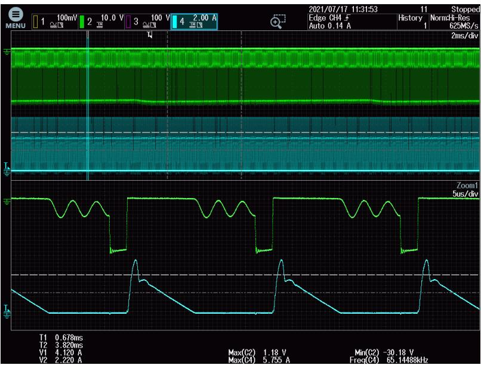

265 VAC

$C H 2 V _ { \mathsf { D } }$  
$C H 4 1 _ { \mathsf { D } }$ $\mathtt { V } _ { \mathtt { D } } mathtt { = } 3 0 . 1 8 \mathtt { V }$ $\mathsf { I } _ { \mathsf { D m a x } } { = } 5 . 7 5 5 \mathsf { A }$

Test Condition:

➢ Full Load

## 输出短路时MOS和二极管波形

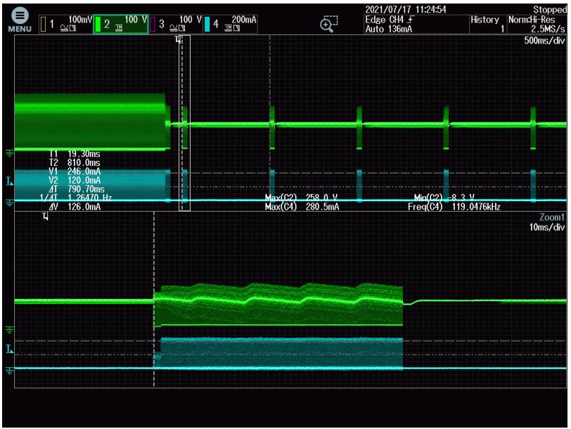

85 VAC

${ \mathsf { C H } } 2 { \mathsf { V } } _ { \mathsf { D S } }$  
CH4 ID $\begin{array} { l } { { \sf V } _ { \sf D S \_ m a x } = 2 5 8 { \sf V } } \\ { { \sf I } _ { \sf D S \_ m a x } = 2 8 0 . 5 \sf m A } \end{array}$

## MOS

## Test Condition:

➢ Full Load

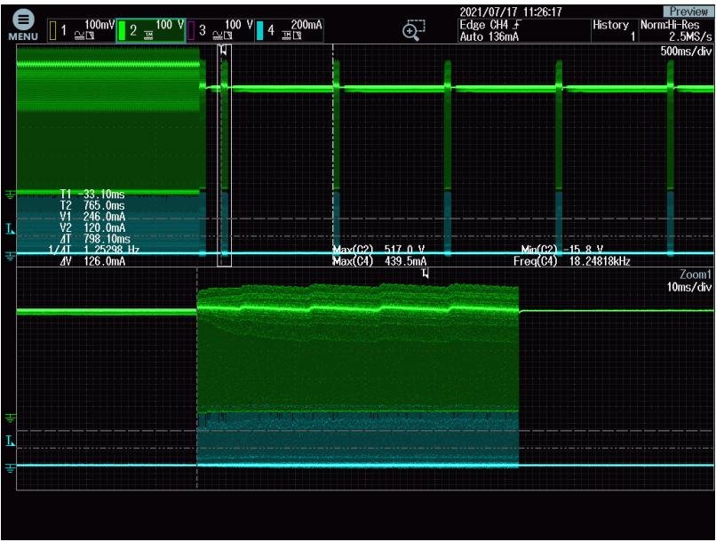

265 VAC

CH2 VDS  
CH4 ID $\begin{array} { l } { { \tt V } _ { \tt D S \_ m a x } = 5 1 7 \tt V } \\ { { \tt I } _ { \tt D S \_ m a x } = 4 3 9 . 5 \operatorname* { m a x } } \end{array}$

## MOS

## Test Condition:

➢ Full Load

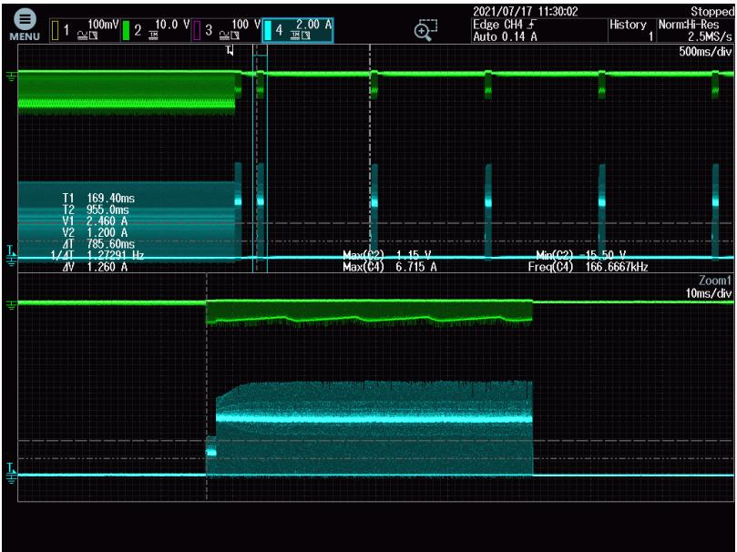

85 VAC

CH2 VD  
CH4 ID $\mathtt { V } _ { \mathtt { D } } mathtt { = } 1 5 . 5 \mathtt { V }$ $\mathsf { I } _ { \mathsf { D m a x } } { = } 6 . 7 1 5 \mathrm { ~ A ~ }$ Dmax

## Test Condition:

➢ Full Load

## 二极管

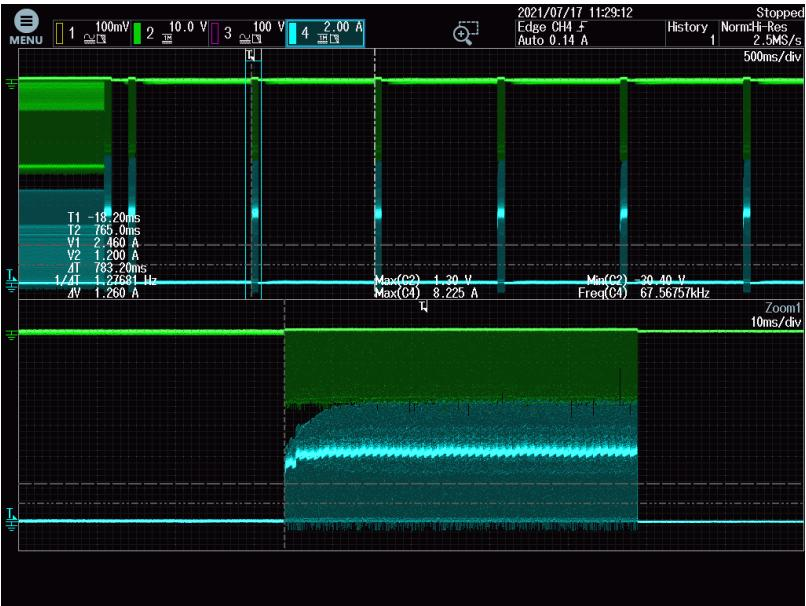

265 VAC

CH2 VD  
CH4 ID$V _ { \mathrm { D } } { = } 3 0 . 4 \ V$ IDmax=8.225 A

## Test Condition:

➢ Full Load

## 二极管

## 过零检测

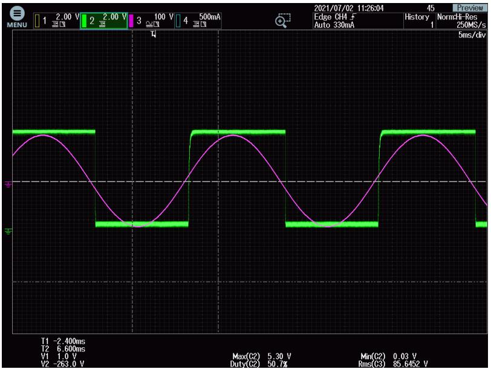

85 VAC

CH2 ZCD\_signal  
CH3 VIN

Test Condition:  
➢ Full Load  
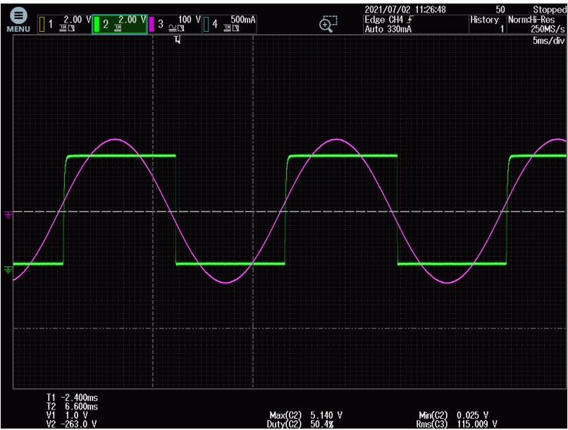

115 VAC

CH2 ZCD\_signal  
CH3 VIN

Test Condition:  
➢ Full Load  

230 VAC

CH2 ZCD\_signal  
CH3 VIN

Test Condition:  
➢ Full Load  

265 VAC

CH2 ZCD\_signal  
CH3 VIN

Test Condition:

➢ Full Load

## 温升测试

<table><tr><td rowspan="2">项目</td><td colspan="4">温度(°C)</td></tr><tr><td>85VAC</td><td>115VAC</td><td>230VAC</td><td>265VAC</td></tr><tr><td>环境温度</td><td>39.4</td><td>39.8</td><td>40.2</td><td>40.1</td></tr><tr><td>BPA8604P (U1)</td><td>109.9</td><td>86.3</td><td>75.6</td><td>83</td></tr><tr><td>SB34 (D7)</td><td>76.5</td><td>76.4</td><td>76.6</td><td>77.1</td></tr><tr><td>变压器绕组 (T1)</td><td>75.8</td><td>75.6</td><td>76.6</td><td>77.2</td></tr><tr><td>变压器磁芯 (T1)</td><td>74.6</td><td>74.8</td><td>75.7</td><td>76.5</td></tr><tr><td>输入电解电容(EC2)</td><td>70.4</td><td>68.5</td><td>67</td><td>67.4</td></tr><tr><td>输出电解电容(EC5)</td><td>69.8</td><td>69.8</td><td>69.7</td><td>70.5</td></tr><tr><td>整流桥 (BD1)</td><td>64.3</td><td>60.5</td><td>59.2</td><td>58.7</td></tr></table>

## 测试说明

➢ 在温箱中进行测试  
➢ 电路板放在一个封闭的盒子内  
➢ 热电偶连接到各个测量点  
➢ 等测量点温度达到稳定后记录数据

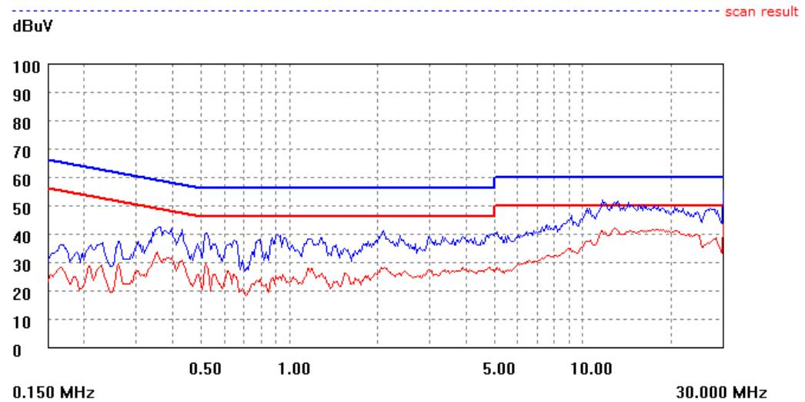

115VAC Line

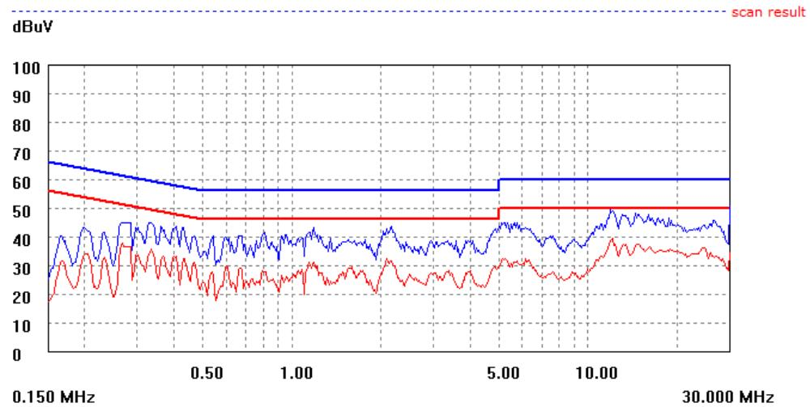

230VAC Line

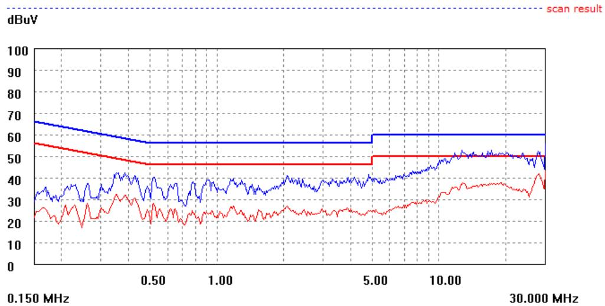

115VAC Neutral

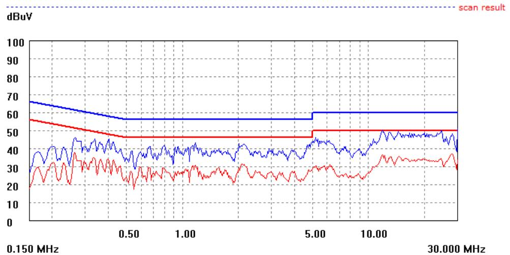

230VAC Neutral

<table><tr><td>差模</td><td>电压</td><td>相位角</td><td>发生器阻抗</td><td>测试次数</td><td>测试结果</td></tr><tr><td>L to N</td><td>+2kV</td><td>0</td><td>2</td><td>10</td><td>Pass</td></tr><tr><td>L to N</td><td>-2kV</td><td>0</td><td>2</td><td>10</td><td>Pass</td></tr><tr><td>L to N</td><td>+2kV</td><td>90</td><td>2</td><td>10</td><td>Pass</td></tr><tr><td>L to N</td><td>-2kV</td><td>90</td><td>2</td><td>10</td><td>Pass</td></tr><tr><td>L to N</td><td>+2kV</td><td>180</td><td>2</td><td>10</td><td>Pass</td></tr><tr><td>L to N</td><td>-2kV</td><td>180</td><td>2</td><td>10</td><td>Pass</td></tr><tr><td>L to N</td><td>+2kV</td><td>270</td><td>2</td><td>10</td><td>Pass</td></tr><tr><td>L to N</td><td>-2kV</td><td>270</td><td>2</td><td>10</td><td>Pass</td></tr></table>

## 测试说明

➢ 按照GB/T17626.5和IEC61000-4-5的最新版本要求进行测试  
➢ 室温环境，230VAC输入，满载条件  
➢ 输入1.2/50us组合波浪涌电压  
➢ 每个测试点重复10次  
➢ 每次间隔时间1分钟  
➢ 试验时样机输出正常（符合A类标准）视为Pass

<table><tr><td>测试点</td><td>电压(V)</td><td>放电类型</td><td>放电次数</td><td>测试结果</td></tr><tr><td>Vo</td><td>+15kV</td><td>空气放电</td><td>10</td><td>Pass</td></tr><tr><td>Vo</td><td>-15kV</td><td>空气放电</td><td>10</td><td>Pass</td></tr><tr><td>GND</td><td>+15kV</td><td>空气放电</td><td>10</td><td>Pass</td></tr><tr><td>GND</td><td>-15kV</td><td>空气放电</td><td>10</td><td>Pass</td></tr><tr><td>Vo</td><td>+8kV</td><td>接触放电</td><td>10</td><td>Pass</td></tr><tr><td>Vo</td><td>-8kV</td><td>接触放电</td><td>10</td><td>Pass</td></tr><tr><td>GND</td><td>+8kV</td><td>接触放电</td><td>10</td><td>Pass</td></tr><tr><td>GND</td><td>-8kV</td><td>接触放电</td><td>10</td><td>Pass</td></tr></table>

## 测试说明

➢ 按照GB/T17626.2和IEC61000-4-2的最新版本要求进行测试  
➢ 室温环境，230VAC输入满载条件  
➢ 每个测试点重复10次  
➢ 分别对输出正端和地进行空气放电  
➢ 试验时样机输出正常（符合A类标准）视为Pass

## THANK YOU FOR WATCHING
