## BPA8604P隔离参考设计

## (5V0.2A;12V0.4A)

上海晶丰明源半导体股份有限公司

Shanghai Bright Power Semiconductor Co., Ltd.

文长川

时间： 2023年04月15日

## 内容

BPA8604P简介  
电源规格  
电路及实物图  
BOM  
PCB Layout图  
变压器  
性能测试数据

## 产品特点：

➢ 集成 700V 高压 MOSFET  
➢ 集成高压启动、自供电电路  
➢ 低待机功耗  
➢ 内置软启动  
➢ 优异的动态响应速度，无输出过冲  
➢ 有过零检测降低待机

## 应用领域：

➢ 家用电器辅助电源  
➢ PC待机电源  
➢ 通信、工业控制辅助电源  
➢ 适配器、充电器

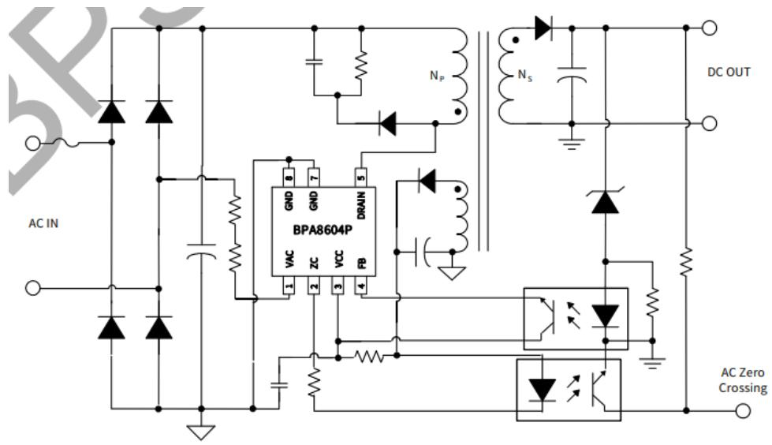

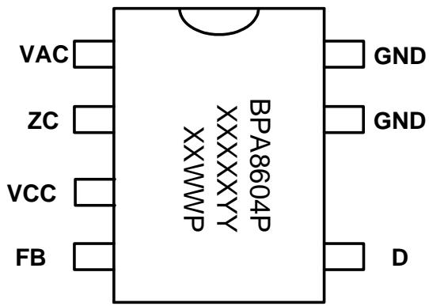

DIP封装

<table><tr><td>项目描述</td><td>符号</td><td>最小</td><td>典型</td><td>最大</td><td>单位</td><td>备注</td></tr><tr><td colspan="7">输入</td></tr><tr><td>电压</td><td> $V_{IN}$ </td><td>85</td><td>115/230</td><td>264</td><td> $V_{AC}$ </td><td></td></tr><tr><td>频率</td><td> $f_{LINE}$ </td><td>47</td><td>50/60</td><td>63</td><td>Hz</td><td></td></tr><tr><td colspan="7">输出</td></tr><tr><td>输出电压1</td><td> $V_{OUT1}$ </td><td>4.75</td><td>5</td><td>5.25</td><td>V</td><td>±5%</td></tr><tr><td>输出电流1</td><td> $I_{OUT1}$ </td><td>0</td><td></td><td>200</td><td>mA</td><td></td></tr><tr><td>输出电压2</td><td> $V_{OUT2}$ </td><td>11.62</td><td>12.5</td><td>13.4</td><td>V</td><td>±7%</td></tr><tr><td>输出电流2</td><td> $I_{OUT2}$ </td><td>0</td><td></td><td>400</td><td>mA</td><td></td></tr><tr><td>输出电压纹波1</td><td> $V_{RIPPLE}$ </td><td></td><td></td><td>200</td><td>mV</td><td>20MHz带宽</td></tr><tr><td>输出电压纹波2</td><td> $V_{RIPPLE}$ </td><td></td><td></td><td>200</td><td>mV</td><td>20MHz带宽</td></tr><tr><td>连续输出功率</td><td> $P_{OUT}$ </td><td></td><td>5.8</td><td></td><td>W</td><td></td></tr><tr><td colspan="7">效率</td></tr><tr><td>待机功耗</td><td> $P_{STDBY}$ </td><td></td><td></td><td>100</td><td>mW</td><td>230VAC,包含假负载</td></tr><tr><td>满载效率</td><td>η</td><td></td><td></td><td>70</td><td>%</td><td></td></tr><tr><td colspan="7">环境</td></tr><tr><td>传导EMI</td><td></td><td colspan="4">满足CISPR22/EN55022 Class B,至少6dB 裕量</td><td></td></tr><tr><td>Surge</td><td></td><td></td><td>2</td><td></td><td>kV</td><td>差模</td></tr><tr><td>EFT</td><td></td><td></td><td>4</td><td></td><td>kV</td><td>5kHz/100kHz/38kHz</td></tr><tr><td>ESD</td><td></td><td></td><td>15</td><td>20</td><td>kV</td><td>空气放电</td></tr><tr><td>工作环境温度</td><td> $T_{AMP}$ </td><td>0</td><td></td><td>50</td><td>°C</td><td></td></tr></table>

## 电路及实物图

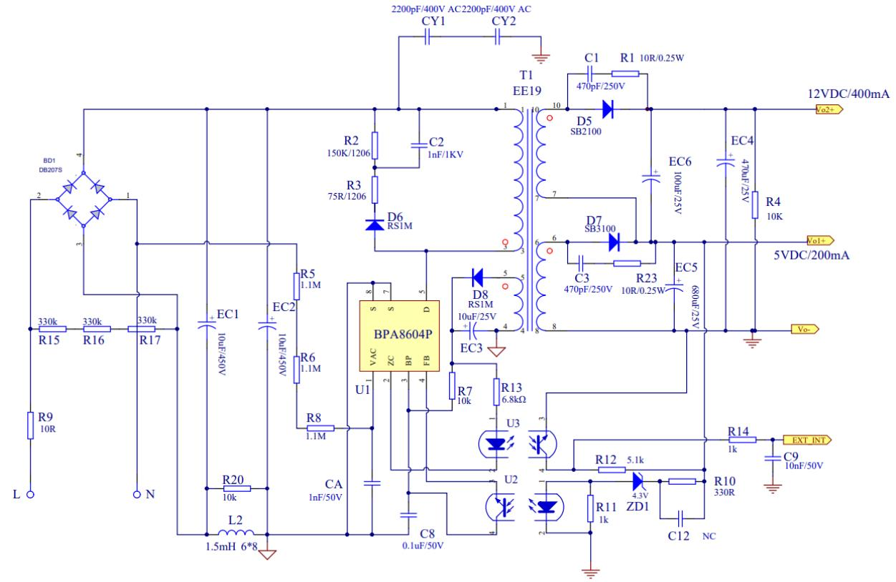

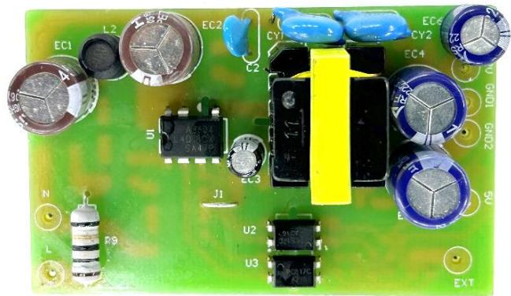

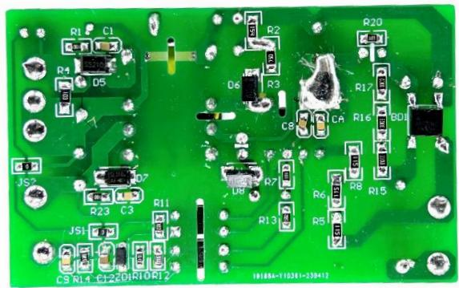

<table><tr><td>序号</td><td>元件标号</td><td>参数描述</td><td>封装尺寸</td><td>数量</td></tr><tr><td>1</td><td>PCB</td><td>CEM-1, 单面板</td><td>70mm*43.5mm</td><td>1</td></tr><tr><td>2</td><td>R9</td><td>2W,10R 绕线保险丝电阻</td><td>DIP</td><td>1</td></tr><tr><td>3</td><td>EC1,EC2</td><td>450V10uF电解电容</td><td> $\phi 10*13$ </td><td>2</td></tr><tr><td>4</td><td>L2</td><td>工字电感1.5mH</td><td> $\phi 6*8$ </td><td>1</td></tr><tr><td>5</td><td>J1</td><td>跳线0.6*5</td><td>DIP</td><td>1</td></tr><tr><td>6</td><td>U1</td><td>BPA8604P</td><td>DIP</td><td>1</td></tr><tr><td>7</td><td>EC3</td><td>50V10uF电解电容</td><td> $\phi 5*11$ </td><td>1</td></tr><tr><td>8</td><td>U2.U3</td><td>PC817C 光耦</td><td>DIP</td><td>2</td></tr><tr><td>9</td><td>T1</td><td>EE19加高 2.3mH</td><td>DIP</td><td>1</td></tr><tr><td>10</td><td>EC5</td><td>25V/680uF电解电容</td><td> $\phi 10*16mm$ </td><td>1</td></tr><tr><td>11</td><td>EC4</td><td>25V/470uF电解电容</td><td> $\phi 10*12mm$ </td><td>1</td></tr><tr><td>12</td><td>EC6</td><td>25V/100uF电解电容</td><td> $\phi 6*11mm$ </td><td>1</td></tr><tr><td>13</td><td>BD1</td><td>DB207 2A1KV整流桥</td><td>SMD</td><td>1</td></tr><tr><td>14</td><td>D8,D6</td><td>RS1M 1A,1KV快速二极管</td><td>SMA</td><td>2</td></tr><tr><td>15</td><td>D5</td><td>SS210 2A100V肖特基二极管</td><td>SMB</td><td>1</td></tr><tr><td>16</td><td>D7</td><td>SS310 3A100V肖特基二极管</td><td>SMB</td><td>1</td></tr><tr><td>17</td><td>ZD1</td><td>4.3V稳压管</td><td>SOD-123</td><td>1</td></tr><tr><td>18</td><td>C2</td><td>1nF 1KV 瓷片电容</td><td>DIP</td><td>1</td></tr><tr><td>19</td><td>R5,R6,R8</td><td>1.1M,  $\pm 5\%$ </td><td>SMD1206</td><td>3</td></tr></table>

<table><tr><td>序号</td><td>元件标号</td><td>参数描述</td><td>封装尺寸</td><td>数量</td></tr><tr><td>20</td><td>R15,R16,R17</td><td>330K, ±5%</td><td>SMD1206</td><td>3</td></tr><tr><td>21</td><td>R3</td><td>75R, ±5%</td><td>SMD1206</td><td>1</td></tr><tr><td>22</td><td>R2</td><td>150K, ±5%</td><td>SMD1206</td><td>1</td></tr><tr><td>23</td><td>R13</td><td>6.8K, ±5%</td><td>SMD1206</td><td>1</td></tr><tr><td>24</td><td>R7,R20</td><td>10K, ±5%</td><td>SMD1206</td><td>2</td></tr><tr><td>25</td><td>R10</td><td>330R, ±5%</td><td>SMD0805</td><td>1</td></tr><tr><td>26</td><td>R12</td><td>5.1K, ±5%</td><td>SMD1206</td><td>1</td></tr><tr><td>27</td><td>R4</td><td>10K, ±5%</td><td>SMD1206</td><td>1</td></tr><tr><td>28</td><td>R1,R23</td><td>10R,±5%</td><td>SMD0805</td><td>1</td></tr><tr><td>29</td><td>R11</td><td>1K, ±5%</td><td>SMD0805</td><td>1</td></tr><tr><td>30</td><td>R14</td><td>1K, ±5%</td><td>SMD0805</td><td>1</td></tr><tr><td>31</td><td>C8</td><td>100nF/16V,X7R</td><td>SMD0805</td><td>1</td></tr><tr><td>32</td><td>C12</td><td>470nF/16V,X7R</td><td>SMD0805</td><td>1</td></tr><tr><td>33</td><td>C1,C3</td><td>470pF/250V,X7R</td><td>SMD0805</td><td>2</td></tr><tr><td>34</td><td>CY1,CY2</td><td>AC 400V 222 Y电容</td><td>DIP</td><td>2</td></tr><tr><td>35</td><td>CA</td><td>1nF/16V,X7R</td><td>SMD0805</td><td>1</td></tr><tr><td>36</td><td>C9</td><td>10nF/16V,X7R</td><td>SMD0805</td><td>1</td></tr><tr><td colspan="2"></td><td></td><td>Total</td><td>46</td></tr></table>

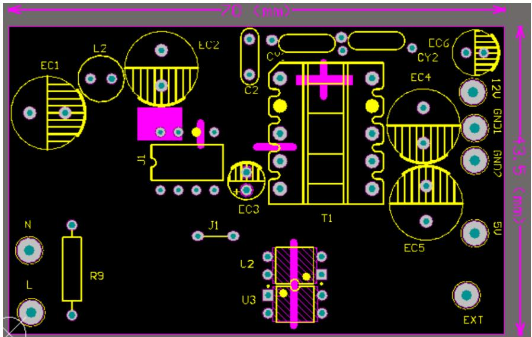

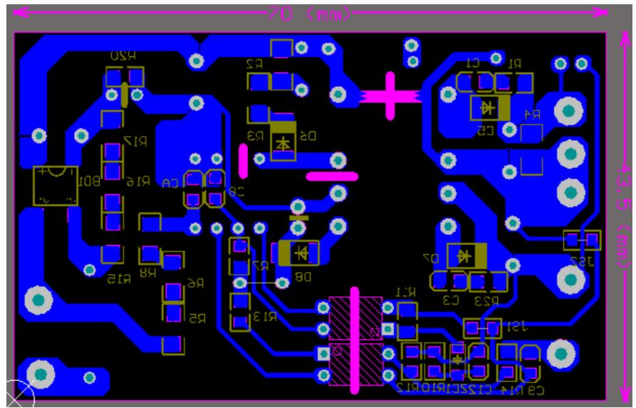

## 原理图

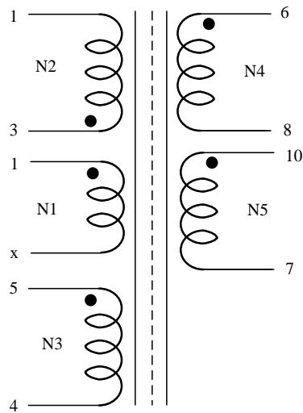

## 绕线方式

<table><tr><td>绕组</td><td>起始脚</td><td>终止脚</td><td>材料</td><td>匝数</td><td>绕线方式</td></tr><tr><td>N1</td><td>1</td><td>NC</td><td> $\phi 0.18*2P$ </td><td>20Ts</td><td>密绕一层(PIN脚朝外)</td></tr><tr><td colspan="4">胶带</td><td>2.1Ts</td><td></td></tr><tr><td>N2</td><td>3</td><td>1</td><td> $\phi 0.18*1P$ </td><td>120Ts</td><td>密绕三层(PIN脚朝外)</td></tr><tr><td colspan="4">胶带</td><td>2.1Ts</td><td></td></tr><tr><td>N3</td><td>5</td><td>4</td><td> $\phi 0.18*2P$ </td><td>15Ts</td><td>密绕一层(PIN脚朝外)</td></tr><tr><td colspan="4">胶带</td><td>2.1Ts</td><td></td></tr><tr><td>N4</td><td>6</td><td>8</td><td>三层绝缘线 $\phi 0.35*2P$ </td><td>6Ts</td><td>密绕一层(PIN脚朝外)</td></tr><tr><td colspan="4">胶带</td><td>2.1Ts</td><td></td></tr><tr><td>N5</td><td>10</td><td>7</td><td>三层绝缘线 $\phi 0.3*2P$ </td><td>8Ts</td><td>密绕一层(PIN脚朝外)</td></tr><tr><td colspan="4">胶带</td><td>3Ts</td><td></td></tr></table>

## 规格与材料

➢ 初级绕组感量 $\mathsf { L } _ { \mathsf { p } } = 2 3 0 0 \mathsf { u H } \pm 7 \%$ （测试条件： 0.3V，$1 0 0 \boldsymbol { \mathsf { k } } \boldsymbol { \mathsf { H z } } )$ ）  
➢ 漏感量 $\mathrm { \cdot L _ { | k } } < 5 0 \mathrm { u } \mathrm { H }$  
➢ 骨架：EE19底部加高（5+5PIN）  
➢ 磁芯：EE19 PC40 或同等材质 ， $\mathsf { A } \mathsf { e } = 2 3 \mathsf { m } \mathsf { m } ^ { 2 }$  
➢ N1、N2、N3: 2UEW 漆包线  
➢ N4 、N5 : 三层绝缘线  
➢ 绝缘胶带:3M900 或同等材质  
➢ 耐压测试: 3KV, 50/60Hz, 1Min  
➢ 成品要求：浸凡立水

## 脚位图

待机功耗（包含14mW假负载，10K电阻外供电）  
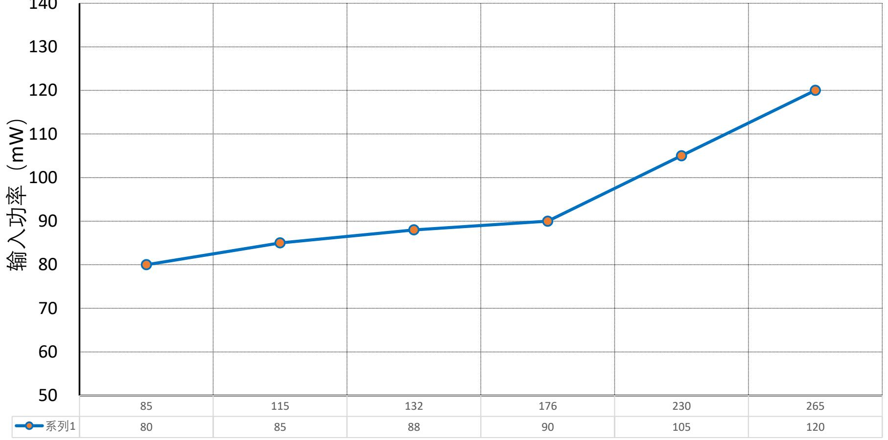

输入电压(VAC)

效率测试  
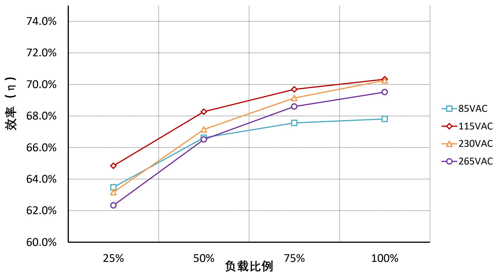

## 输出电压交叉调整率

<table><tr><td>输入电压AC (V)</td><td>输出电流1(A)</td><td>输出电压1(V)</td><td>输出电流2(A)</td><td>输出电压2(V)</td></tr><tr><td rowspan="2">115</td><td>0</td><td>5.12</td><td>0.4</td><td>11.85</td></tr><tr><td>0.2</td><td>5.11</td><td>0</td><td>13.26</td></tr><tr><td rowspan="2">230</td><td>0</td><td>5.12</td><td>0.4</td><td>11.88</td></tr><tr><td>0.2</td><td>5.11</td><td>0</td><td>13.28</td></tr><tr><td>输入电压AC (V)</td><td>输出电流1(A)</td><td>过载点输出电压1(V)</td><td>输出电流2(A)</td><td>过载点输出电压2(V)</td></tr><tr><td rowspan="2">115</td><td>0.2</td><td>5.12</td><td>0.64(OLP)</td><td>11.85</td></tr><tr><td>0.75(OLP)</td><td>5.11</td><td>0.4</td><td>11.85</td></tr><tr><td rowspan="2">230</td><td>0.2</td><td>5.12</td><td>0.72(OLP)</td><td>11.88</td></tr><tr><td>1(OLP)</td><td>5.11</td><td>0.4</td><td>11.88</td></tr></table>

## 输出电压纹波

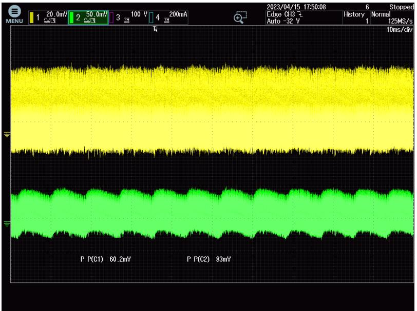

85 $\mathsf { v } _ { \mathsf { A C } }$

CH1 $\mathsf { V } _ { \mathsf { O U T - 5 V } }$ $\mathsf { R i p p } | \mathsf { e }$ $\mathsf { V } _ { \mathsf { P K - P K } } { = } 6 0 \mathsf { m } \mathsf { v }$  
CH2 $\mathsf { V } _ { \mathsf { O U T } - 1 2 \mathsf { V } }$ Ripple $\mathtt { V } _ { \mathtt { P K - P K } } = 8 3 \mathsf { m V }$

## Test Condition:

➢ Full Load

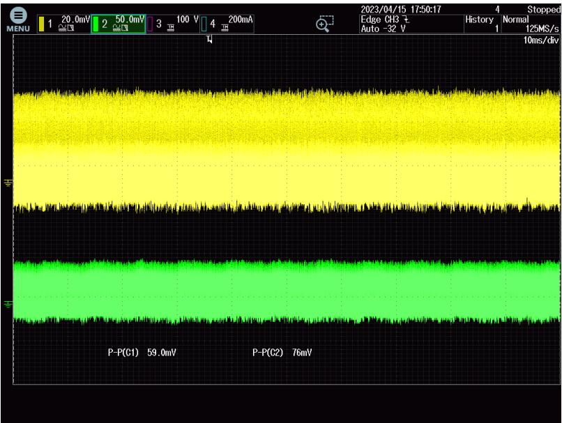

115 VAC

CH1 $\mathsf { V } _ { \mathsf { O U T - 5 V } }$ Ripple $\mathbf { V } _ { \mathsf { P K - P K } } { = } 5 9 \mathsf { m V }$  
${ \mathsf { C H } } 2 { \mathsf { V } } _ { 0 \mathsf { U T } - 1 2 { \mathsf { V } } }$ Ripple $v _ { p \times \cdots p k } = 7 6 m v$

## Test Condition:

➢ Full Load

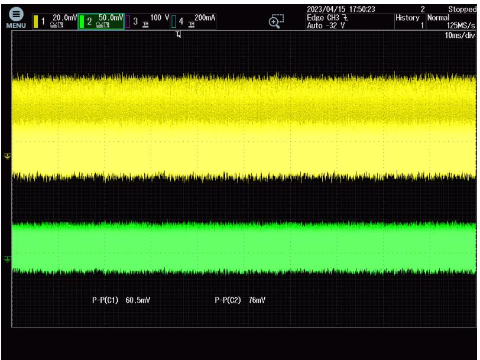

230 VAC

CH1 $\mathsf { V } _ { \mathsf { O U T - S V } }$ $\mathsf { R i p p l e }$ $V _ { P K - P K } = 6 0 . 5 m v$  
CH2 $\mathsf { V } _ { \mathsf { O U T } - 1 2 \mathsf { V } }$ Ripple $v _ { p \vert k - P K } = 7 6 m v$

## Test Condition:

➢ Full Load

265 $\mathsf { v } _ { \mathsf { A C } }$

CH1 $\mathsf { V } _ { \mathsf { O U T - 5 V } }$ Ripple $\mathbf { V } _ { \mathsf { P K - P K } } { = } 5 9 \mathsf { m V }$  
${ \mathsf { C H } } 2 { \mathsf { V } } _ { 0 \mathsf { U T } - 1 2 { \mathsf { V } } }$ Ripple $\mathbf { V } _ { \mathsf { P K - P K } } { = } 7 4 \mathsf { m } \mathbf { V }$

## Test Condition:

➢ Full Load

## 动态负载(50%-100%)

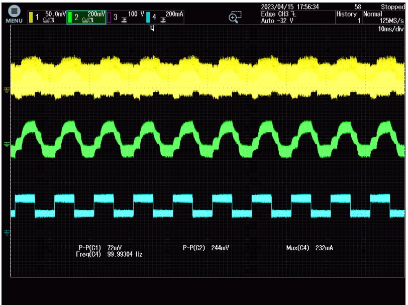

85 VAC

${ \mathsf { C H 1 } } \mathsf { V } _ { \mathsf { O U T } - { \mathsf { 5 v } } }$ CH1 VOUT-5V VPK-PK=72 mV $\mathsf { V } _ { \mathsf { P K - P K } } { = } 7 2 \mathsf { m } \mathsf { v }$  
CH2 VOUT-12V $\mathsf { V } _ { \mathsf { O U T - 1 } 2 \mathsf { V } }$ VPK-PK=244 mV $V _ { p | c - P K } = 2 4 4 m v$

## Test Condition:

➢ 0.2 A-0.1 A-0.2 A  
➢ 0.2 A-0.4 A-0.2 A  
➢ Slew Rate: 0.5 A/μS  
➢ Frequency: 100 Hz

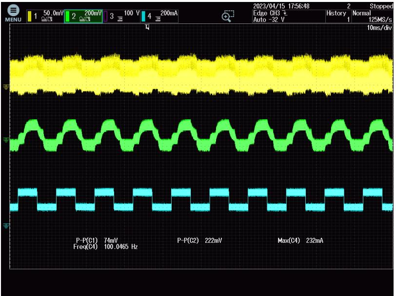

230 VAC

CH1 VOUT-5V $\mathsf { V } _ { \mathsf { O U T - S V } }$ VPK-PK=74 mV $V _ { \mathsf { P K - P K } } { = } 7 4 ~ \mathsf { m V }$  
CH2 VOUT-12V $\mathsf { V } _ { \mathsf { O U T } - 1 2 \mathsf { V } }$ VPK-PK=222 mV $V _ { p | c - P K } = 2 2 2 m v$

## Test Condition:

➢ 0.2 A-0.1 A-0.2 A  
➢ 0.2 A-0.4 A-0.2 A  
➢ Slew Rate: 0.5 A/μS  
➢ Frequency: 100 Hz

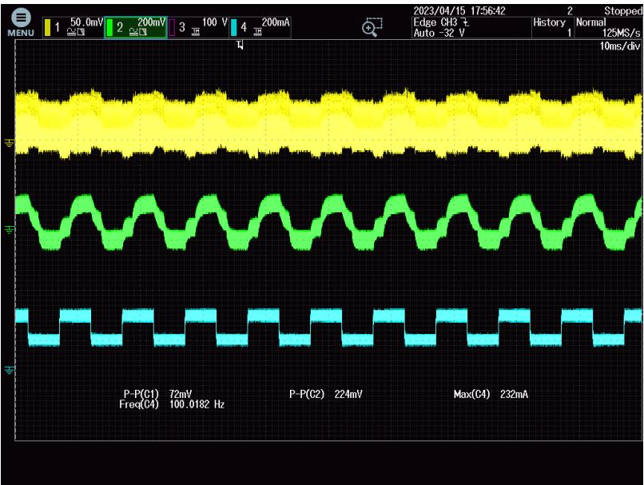

115 VAC

CH1 VOUT-5V ${ \mathsf { C H 1 } } \mathsf { V } _ { \mathsf { O U T } - { \mathsf { 5 v } } }$ $\mathsf { V } _ { \mathsf { P K - P K } } { = } 7 2 \mathsf { m } \mathsf { v }$  
${ \mathsf { C H } } 2 { \mathsf { V } } _ { 0 \cup \mathsf { T } - 1 2 { \mathsf { V } } }$ CH2 VOUT-12V VPK-PK=224 mV $V _ { \mathsf { P K - P K } } { = } 2 2 4 ~ \mathsf { m V }$

## Test Condition:

➢ 0.2 A-0.1 A-0.2 A  
➢ 0.2 A-0.4 A-0.2 A  
➢ Slew Rate: 0.5 A/μS  
➢ Frequency: 100 Hz

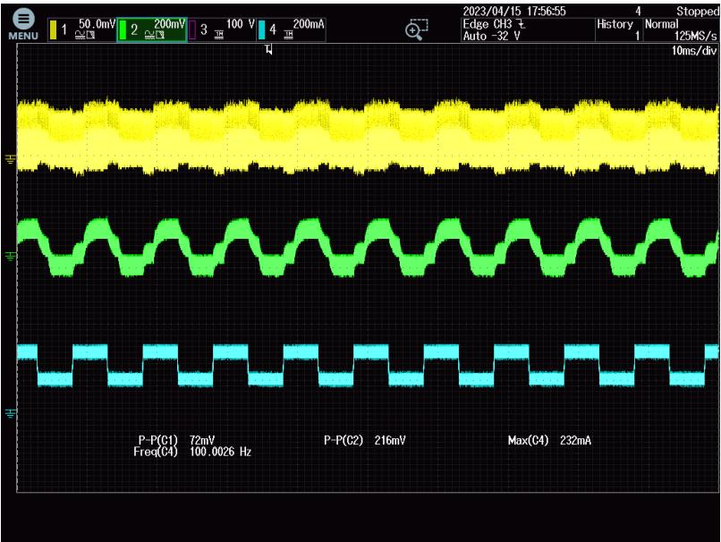

265 VAC

${ \mathsf { C H 1 } } { \mathsf { V } } _ { { \mathsf { O U T } } - { \mathsf { 5 V } } }$ CH1 VOUT-5V VPK-PK=72 mV $\mathsf { V } _ { \mathsf { P K - P K } } { = } 7 2 \mathsf { m } \mathsf { v }$  
${ \mathsf { C H } } 2 { \mathsf { V } } _ { 0 \cup \mathsf { T } - 1 2 { \mathsf { V } } }$ CH2 VOUT-12V VPK-PK=216 mV $\mathsf { V } _ { \mathsf { P K - P K } } { = } 2 1 6 \mathsf { m v }$

## Test Condition:

➢ 0.2 A-0.1 A-0.2 A  
➢ 0.2 A-0.4 A-0.2 A  
➢ Slew Rate: 0.5 A/μS  
➢ Frequency: 100 Hz

## 动态负载(10%-90%)

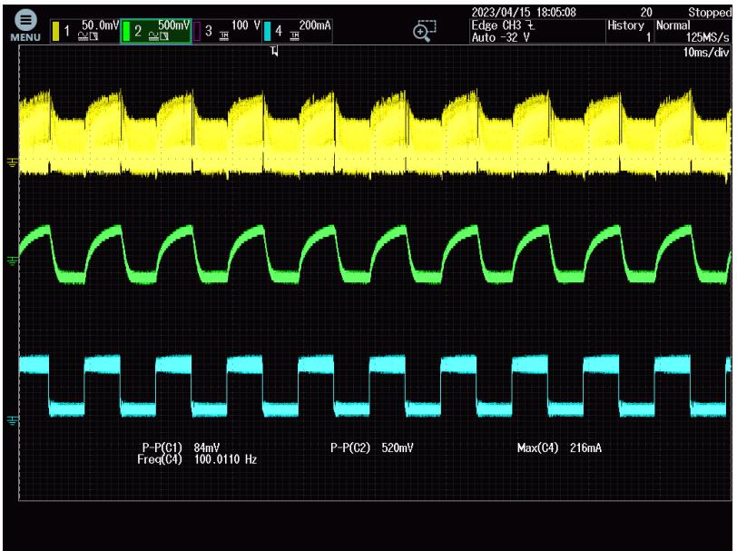

85 VAC

CH1 VOUT-5V ${ \mathsf { C H 1 } } \mathsf { V } _ { \mathsf { O U T } - { \mathsf { 5 v } } }$ VPK-PK=84 mV $\mathsf { V } _ { \mathsf { P K - P K } } { = } 8 4 \mathsf { m } \mathsf { v }$  
CH2 VOUT-12V $\mathsf { V } _ { \mathsf { O U T - 1 } 2 \mathsf { V } }$ $V _ { \mathsf { P K - P K } } { = } 5 2 0 ~ \mathsf { m V }$

## Test Condition:

➢ 0.02A-0.18 A-0.02 A  
➢ 0.04 A-0.36 A-0.04 A  
➢ Slew Rate: 0.5 A/μS  
➢ Frequency: 100 Hz

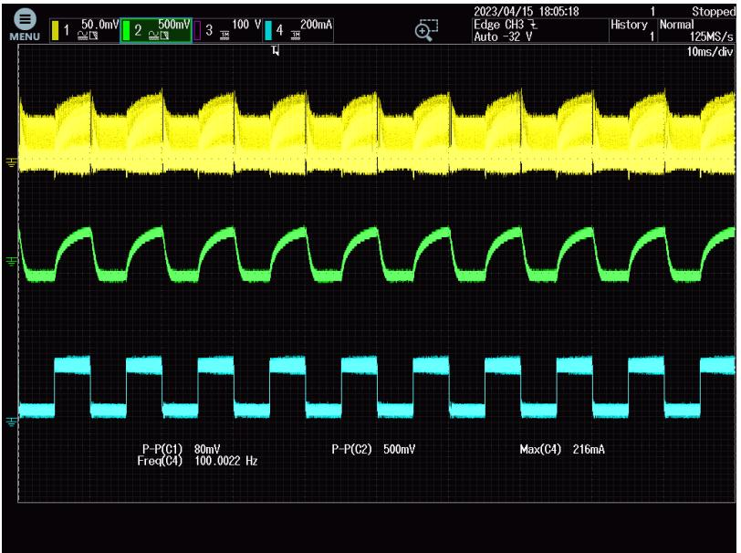

230 VAC

CH1 VOUT-5V $\mathsf { V } _ { \mathsf { O U T - S V } }$ VPK-PK=80 mV $\mathsf { V } _ { \mathsf { P K - P K } } { = } 8 0 \mathsf { m V }$  
CH2 VOUT-12V $\mathsf { V } _ { \mathsf { O U T } - 1 2 \mathsf { V } }$ VPK-PK=500 mV $v _ { p _ { \mathrm { K - P K } } } { = } 5 0 0 ~ \mathsf { m V }$

## Test Condition:

➢ 0.02A-0.18 A-0.02 A  
➢ 0.04 A-0.36 A-0.04 A  
➢ Slew Rate: 0.5 A/μS  
➢ Frequency: 100 Hz

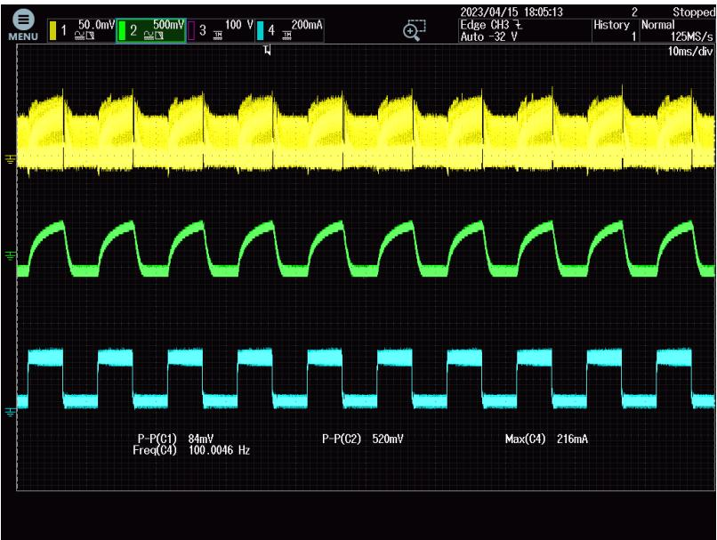

115 VAC

${ \mathsf { C H 1 } } \mathsf { V } _ { \mathsf { O U T } - { \mathsf { 5 v } } }$ CH1 VOUT-5V VPK-PK=84 mV $\mathsf { V } _ { \mathsf { P K - P K } } { = } 8 4 \mathsf { m } \mathsf { v }$  
${ \mathsf { C H } } 2 { \mathsf { V } } _ { 0 \cup \mathsf { T } - 1 2 { \mathsf { V } } }$ CH2 VOUT-12V VPK-PK=520 mV $v _ { p _ { \mathrm { K - P K } } } { = } 5 2 0 ~ \mathsf { m V }$

## Test Condition:

➢ 0.02A-0.18 A-0.02 A  
➢ 0.04 A-0.36 A-0.04 A  
➢ Slew Rate: 0.5 A/μS  
➢ Frequency: 100 Hz

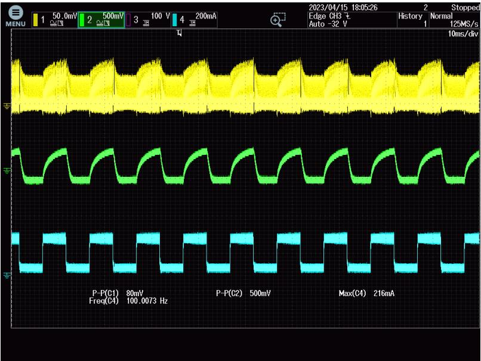

265 VAC

${ \mathsf { C H 1 } } { \mathsf { V } } _ { { \mathsf { O U T } } - { \mathsf { 5 V } } }$  
${ \mathsf { C H } } 2 { \mathsf { V } } _ { 0 \cup \mathsf { T } - 1 2 { \mathsf { V } } }$ CH2 VOUT-12V VPK-PK=500 mV

$$
V _ {P K - P K} = 8 0 \mathrm{mV}
$$

## Test Condition:

➢ 0.02A-0.18 A-0.02 A  
➢ 0.04 A-0.36 A-0.04 A  
➢ Slew Rate: 0.5 A/μS  
➢ Frequency: 100 Hz

## 输出电压开机波形

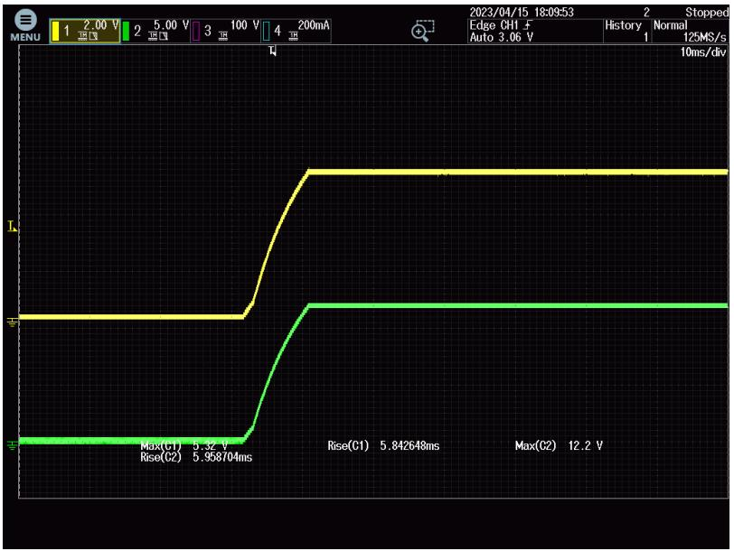

85 VAC

CH1 VOUT-5V $\mathsf { V } _ { \mathsf { O U T - 5 V } }$ $T _ { _ { R 1 S E } } \colon 5 . 8 4 \ : \mathsf { m S }$  
CH2 VOUT-12V $\mathsf { V } _ { \mathsf { O U T } - 1 2 \mathsf { V } }$ ${ \sf T } _ { \sf R I S E } .$ 5.95mS

Test Condition:  
➢ No Load  
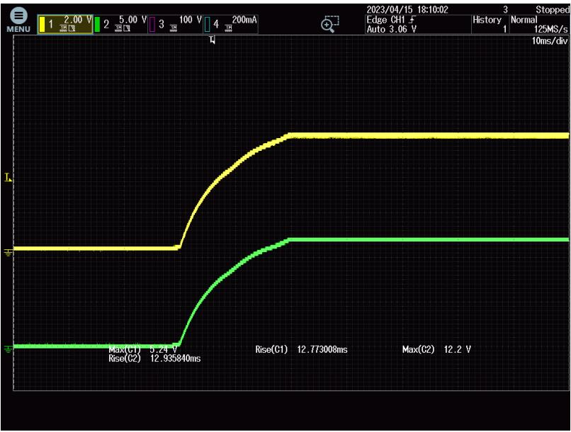

85 VAC

CH1 VOUT-5V $\mathsf { V } _ { \mathsf { O U T - 5 V } }$ ${ \sf T } _ { \sf R I S E } .$ 12.77 mS  
CH2 VOUT-12V $\mathsf { V } _ { \mathsf { O U T - 1 } 2 \mathsf { V } }$ ${ \sf T } _ { \sf R I S E } .$ 12.95mS

Test Condition:  
➢ Full Load  
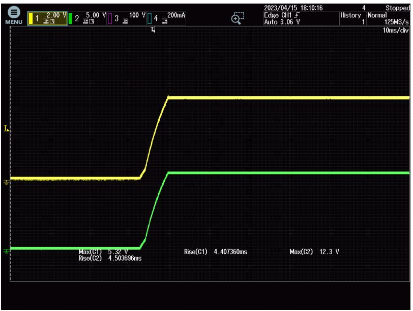

265 $\mathsf { v } _ { \mathsf { A C } }$

CH1 VOUT-5V $\mathsf { V } _ { \mathsf { O U T - S V } }$ ${ \sf T } _ { \sf R I S E } .$ 4.4 mS  
CH2 VOUT-12V $\mathsf { V } _ { \mathsf { O U T } - 1 2 \mathsf { V } }$ ${ \sf T } _ { \sf R I S E } .$ 4.5mS

Test Condition:  
➢ No Load  
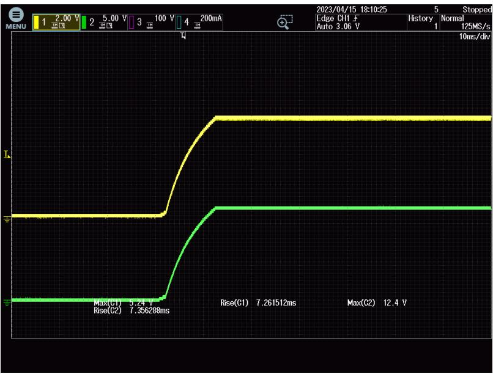

265 $\mathsf { v } _ { \mathsf { A C } }$

CH1 VOUT-5V $\mathsf { V } _ { \mathsf { O U T - 5 V } }$ ${ \sf T } _ { \sf R I S E } .$ 7.26 mS  
CH2 VOUT-12V $\mathsf { V } _ { \mathsf { O U T - 1 } 2 \mathsf { V } }$ ${ \sf T } _ { \sf R I S E } .$ 7.35mS

Test Condition:

➢ Full Load

## MOSFET开机波形（D6 M7)

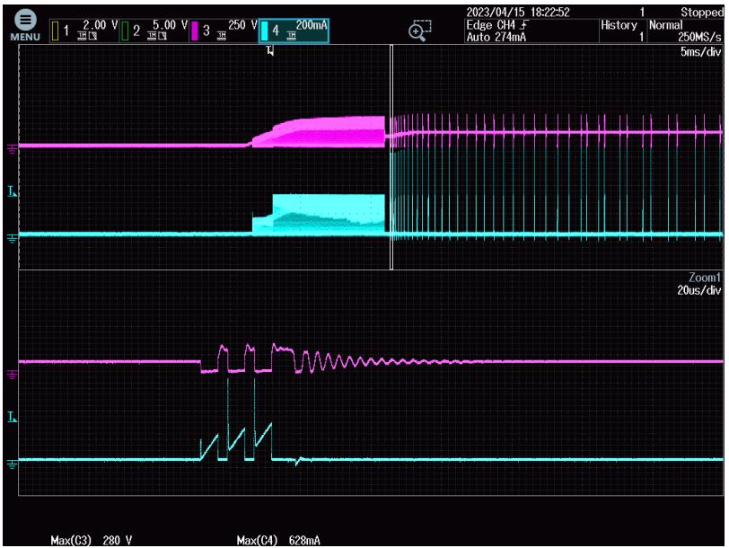

85 VAC

CH1 VDS  
CH3 IDS

$$
\begin{array}{l} \mathrm {V_ {DS\_MAX}} = 2 8 0 \mathrm{V} \\ \mathrm {I_ {DS\_MAX}} = 0. 6 2 8 \mathrm{A} \end{array}
$$

## Test Condition:

➢ No Load

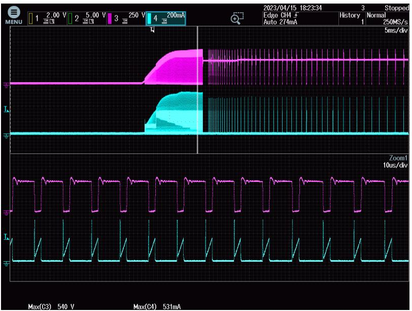

265 VAC

CH1 VDS  
CH3 IDS

$$
\begin{array}{l} \mathrm {V_ {DS\_MAX}} = 5 4 0 \mathrm{V} \\ \mathrm {I_ {DS\_MAX}} = 0. 5 3 1 \mathrm{A} \end{array}
$$

## Test Condition:

➢ No Load

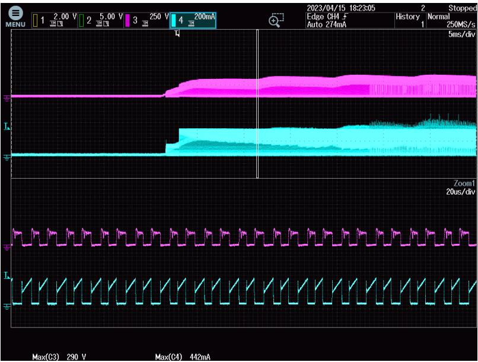

85 VAC

CH1 VDS  
CH3 IDS

$$
\begin{array}{l} \mathrm {V_ {DS\_MAX}} = 2 9 0 \mathrm{V} \\ \mathrm {I_ {DS\_MAX}} = 0. 4 4 2 \mathrm{A} \end{array}
$$

## Test Condition:

➢ Full Load

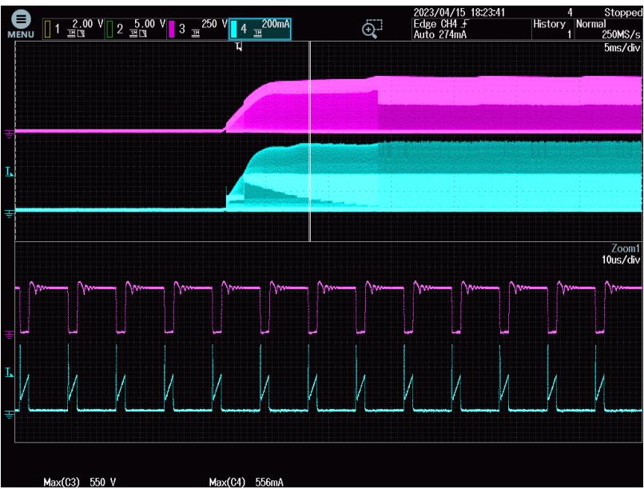

265 VAC

CH1 VDS  
CH3 IDS

$$
\begin{array}{l} V _ {D S \_ M A X} = 5 5 0 V \\ I _ {D S \_ M A X} = 0. 5 5 6 A \end{array}
$$

## Test Condition:

➢ Full Load

## MOSFET稳态波形（D6 M7)

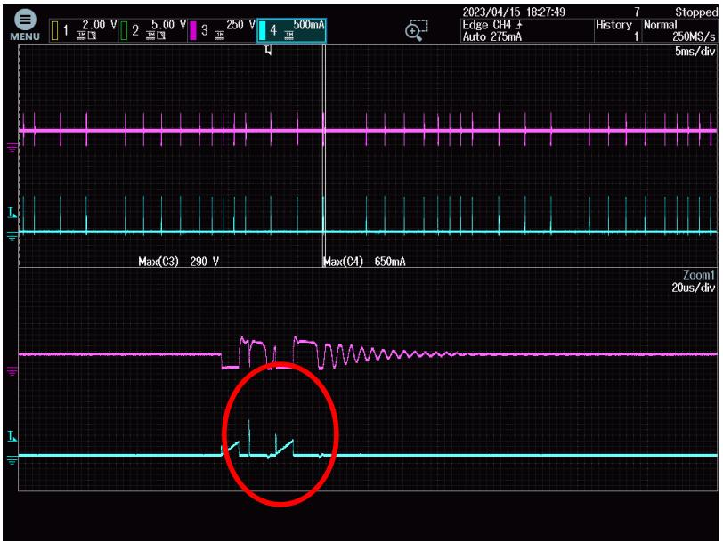

85 VAC

CH1 VDS  
CH3 IDS

$$
\begin{array}{l} \mathrm {V_ {DS\_MAX}} = 2 9 0 \mathrm{V} \\ \mathrm {I_ {DS\_MAX}} = 0. 6 5 \mathrm{A} \end{array}
$$

## Test Condition:

➢ No Load

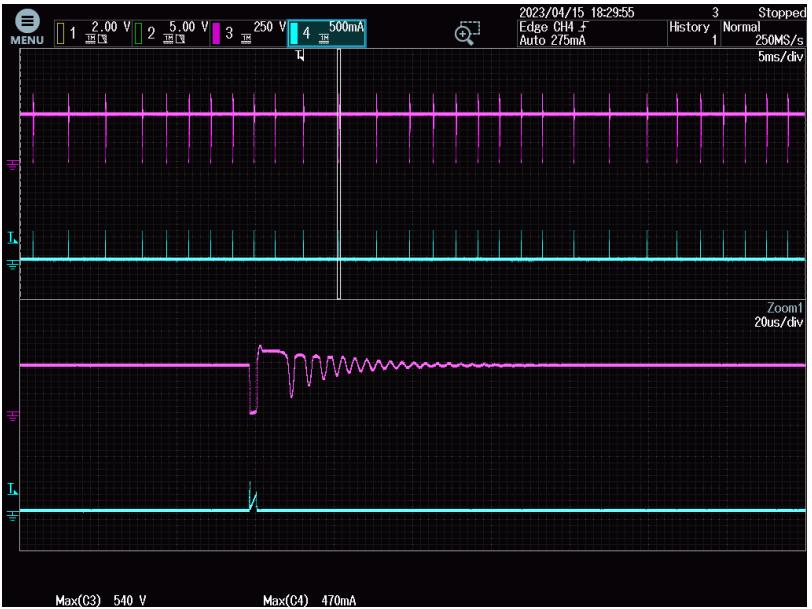

265 VAC

CH1 VDS  
CH3 IDS

$$
\begin{array}{l} \mathrm {V_ {DS\_MAX}} = 5 4 0 \mathrm{V} \\ \mathrm {I_ {DS\_MAX}} = 0. 4 7 \mathrm{A} \end{array}
$$

## Test Condition:

➢ No Load

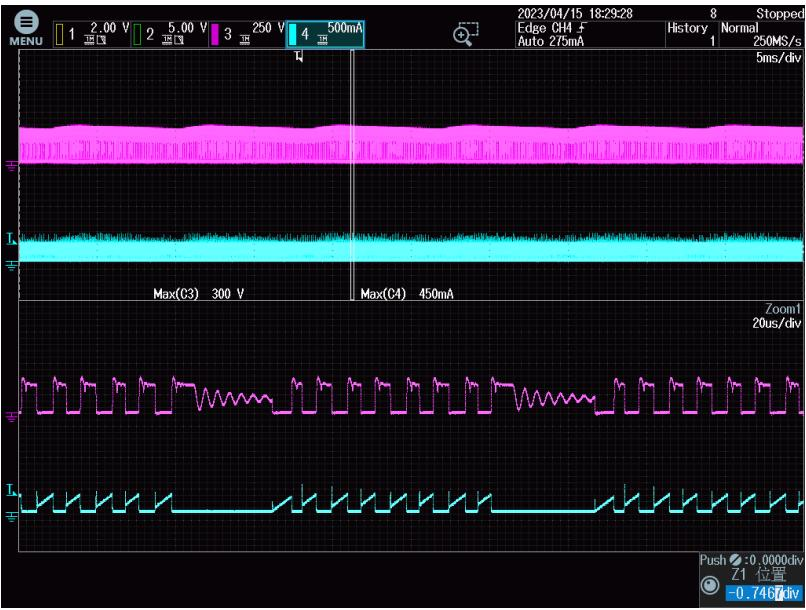

85 VAC

CH1 VDS  
CH3 IDS

$$
\begin{array}{l} \mathrm {V_ {DS\_MAX}} = 3 0 0 \mathrm{V} \\ \mathrm {I_ {DS\_MAX}} = 0. 4 5 \mathrm{A} \end{array}
$$

## Test Condition:

➢ Full Load

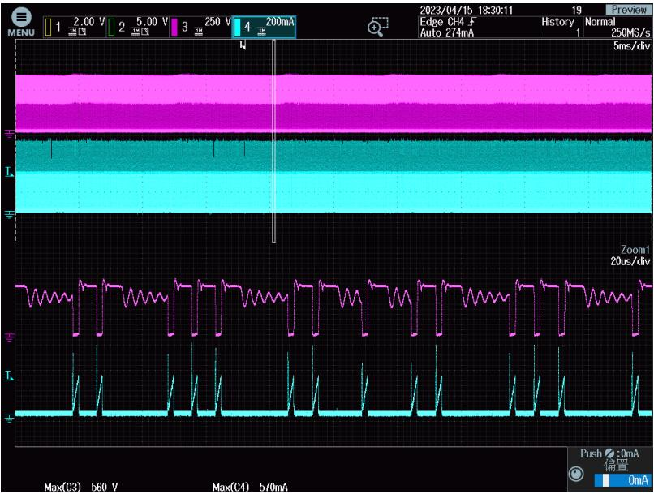

265 VAC

CH1 VDS  
CH3 IDS

$$
\begin{array}{l} \mathrm {V_ {DS\_MAX}} = 5 6 0 \mathrm{V} \\ \mathrm {I_ {DS\_MAX}} = 0. 5 7 \mathrm{A} \end{array}
$$

## Test Condition:

➢ Full Load

## MOSFET稳态波形（D6 RS1M)

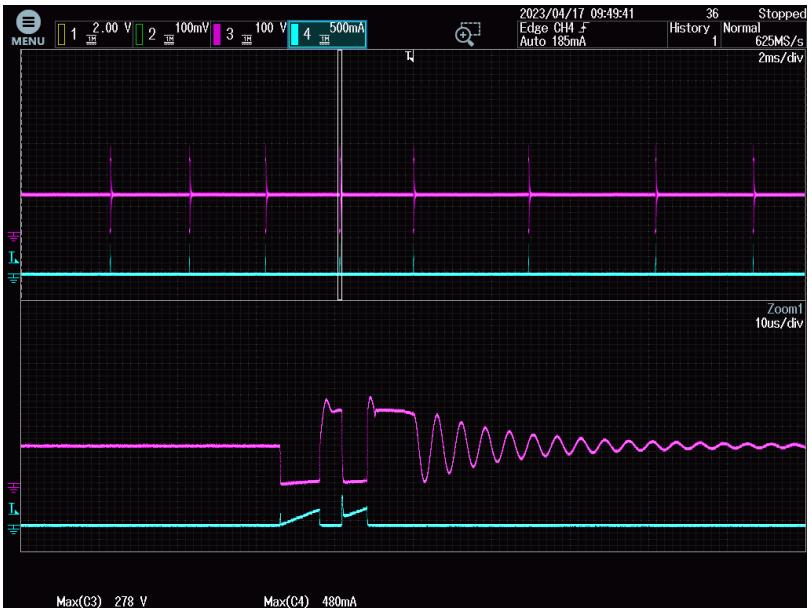

85 VAC  
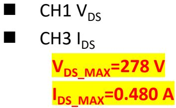

Test Condition:  
➢ No Load

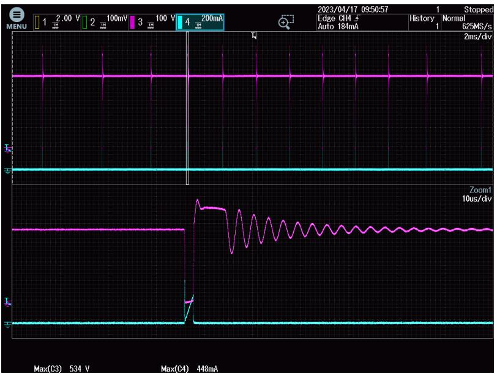

265 VAC  
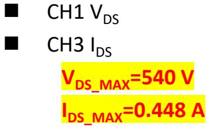

Test Condition:  
➢ No Load

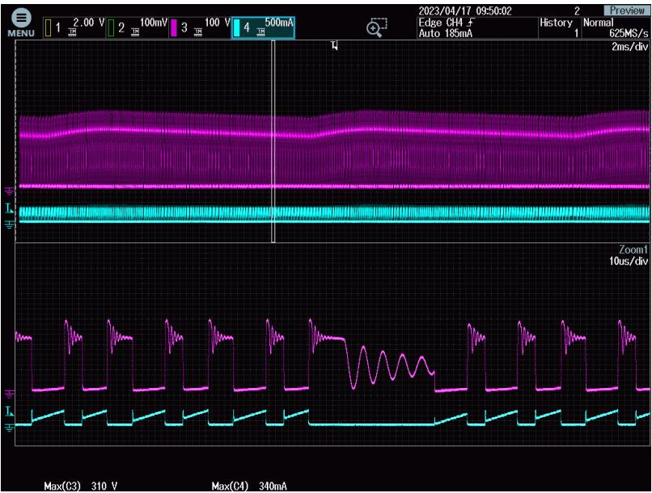

85 VAC  
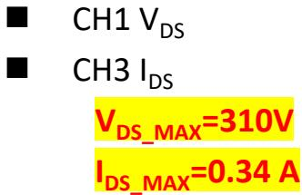

Test Condition:  
➢ Full Load

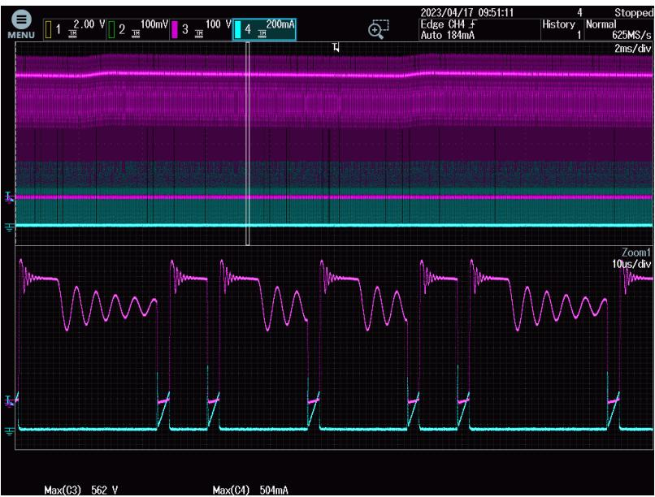

265 VAC  
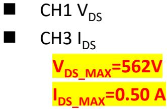

Test Condition:  
➢ Full Load

## 输出二极管开机波形

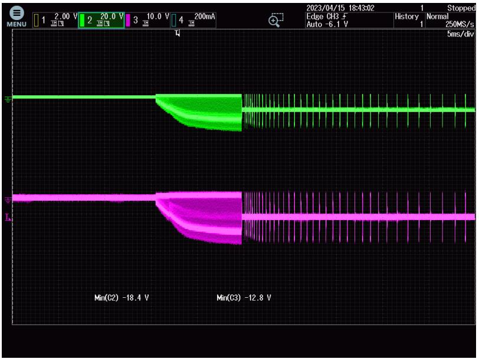

85 VAC

CH2 VR\_12V  
CH3 VR\_5V $V _ { R \_ 5 \vee }$

$$
\begin{array}{l} \mathrm {V_ {R - 12V\_MAX}} = 1 8. 4 \mathrm{V} \\ \mathrm {V_ {R - 5V\_MAX}} = 1 2. 8 \mathrm{V} \end{array}
$$

## Test Condition:

➢ No Load

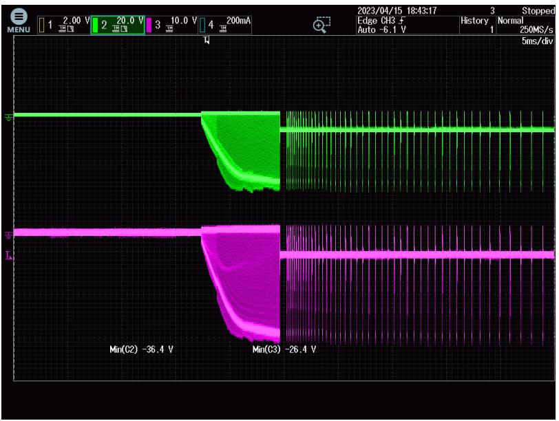

265 VAC

CH2 VR\_12V $V _ { R \_ 1 2 \vee }$  
CH3 VR\_5V $V _ { R \_ 5 \vee }$

$$
\begin{array}{l} \mathrm {V_ {R - 12V\_MAX}} = 3 6 \mathrm{V} \\ \mathrm {V_ {R - 5V\_MAX}} = 2 6. 4 \mathrm{V} \end{array}
$$

## Test Condition:

➢ No Load

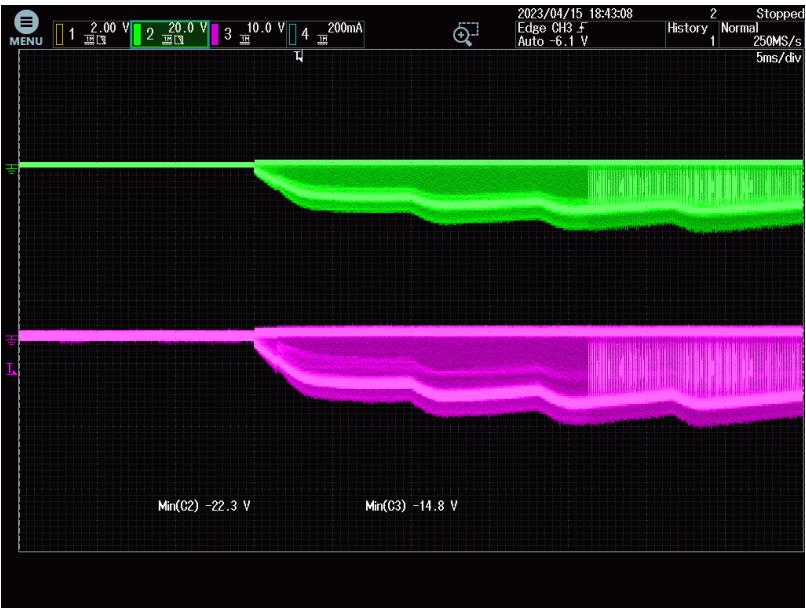

85 VAC

CH2 VR\_12V $V _ { R \_ 1 2 \vee }$  
CH3 VR\_5V $V _ { R \_ 5 \vee }$

$$
\begin{array}{l} V _ {R - 1 2 V \_ M A X} = 2 2 \mathrm{V} \\ V _ {R - 5 V \_ M A X} = 1 4. 8 \mathrm{V} \end{array}
$$

## Test Condition:

➢ Full Load

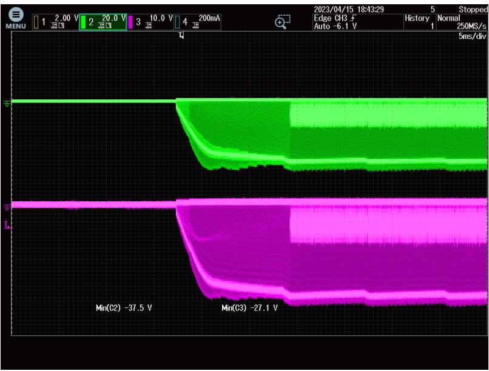

265 VAC

CH2 VR\_12V $V _ { R \_ 1 2 \vee }$  
CH3 VR\_5V $V _ { R \_ 5 \vee }$

$$
\begin{array}{l} \mathrm {V_ {R - 12V\_MAX}} = 3 7. 5 \mathrm{V} \\ \mathrm {V_ {R - 5V\_MAX}} = 2 7. 1 \mathrm{V} \end{array}
$$

## Test Condition:

➢ Full Load

## 短路保护 （MOSFET波形）

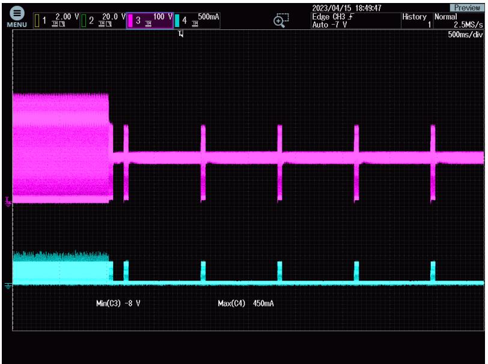

85 VAC

CH3 VDS  
CH4 ID

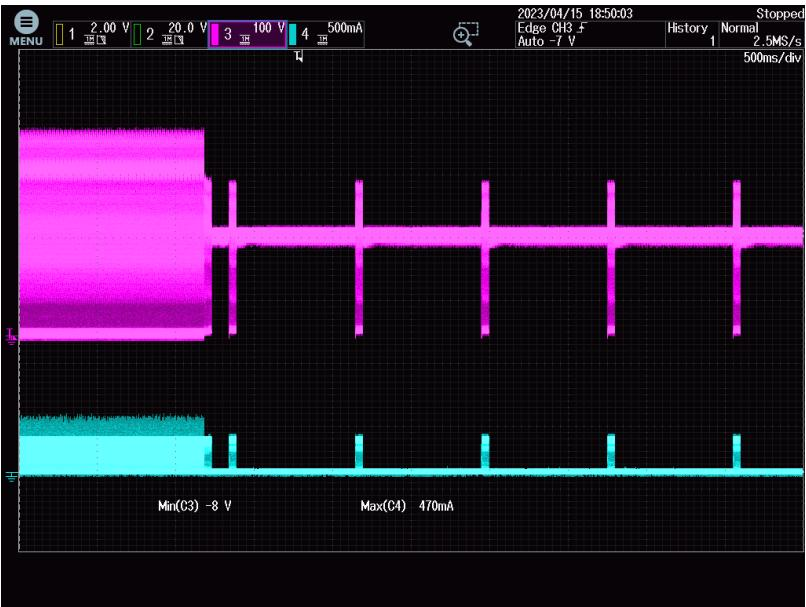

115 VAC

CH3 VDS  
CH4 ID

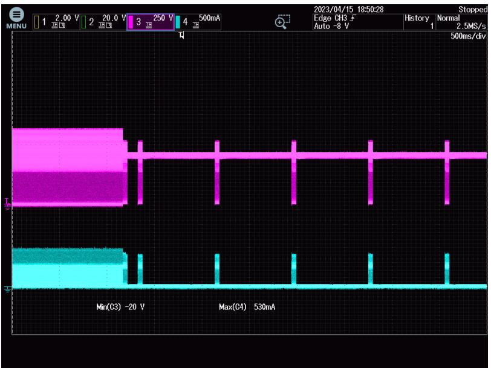

230 VAC

CH3 VDS  
CH4 ID

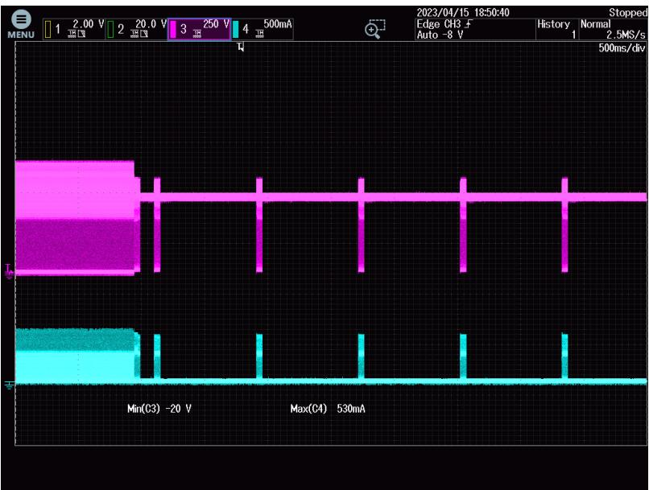

265 VAC

CH3 VDS  
CH4 ID

## 过零检测

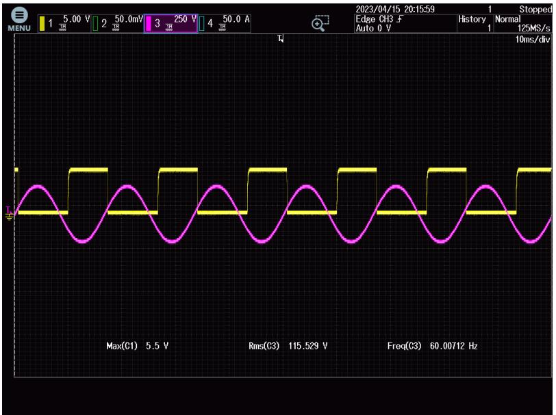

115 VAC

CH1  
CH3 VINNAC

Test Condition:  
➢ No Load  
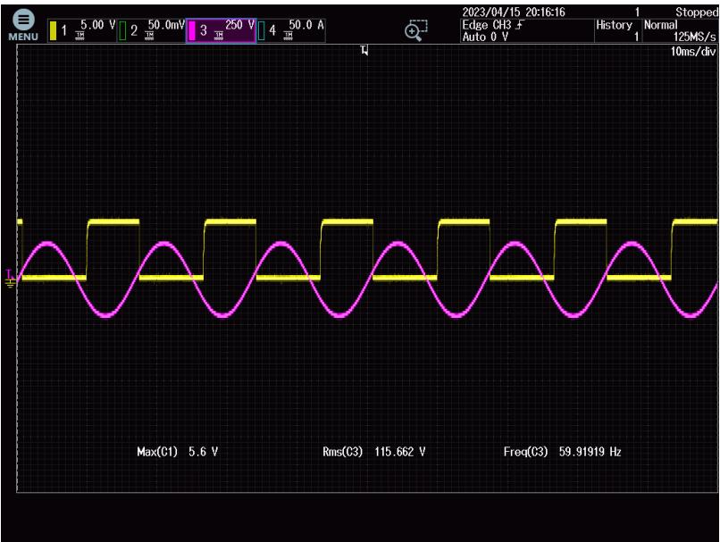

115 VAC

CH1  
CH3 VINNAC

Test Condition:  
➢ Full Load  
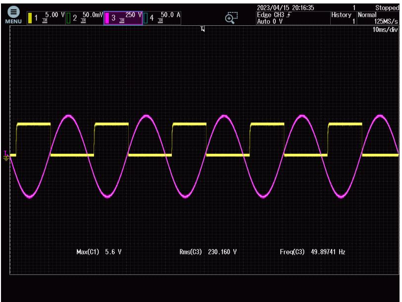

230 VAC

CH1  
CH3 VINNAC

Test Condition:  
➢ No Load  
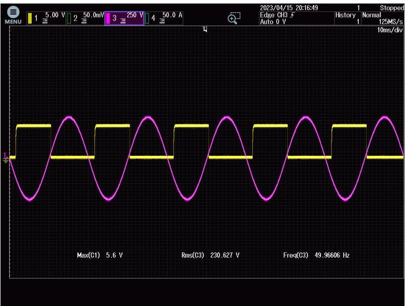

230 VAC

CH1  
CH3 VINNAC

Test Condition:

➢ Full Load

<table><tr><td rowspan="2">项目</td><td colspan="2">85VAC</td><td colspan="2">265VAC</td></tr><tr><td>温度(°C)</td><td>温升(°C)</td><td>温度(°C)</td><td>温升(°C)</td></tr><tr><td>环境温度</td><td colspan="2">28.41</td><td colspan="2">28.27</td></tr><tr><td>BPA8604P (U1)</td><td>94.25</td><td>65.84</td><td>82.85</td><td>54.58</td></tr><tr><td>变压器磁芯(T1)</td><td>57.3</td><td>28.89</td><td>62.9</td><td>34.63</td></tr><tr><td>变压器绕组(T1)</td><td>56.87</td><td>28.46</td><td>59.42</td><td>31.15</td></tr><tr><td>输出肖特基(D7)</td><td>64.26</td><td>35.85</td><td>64.73</td><td>36.46</td></tr><tr><td>输入电解电容(EC4)</td><td>50.17</td><td>21.76</td><td>51.08</td><td>22.81</td></tr><tr><td>输入电解电容(EC2)</td><td>59.55</td><td>31.14</td><td>52.99</td><td>24.72</td></tr><tr><td>整流桥(BD1)</td><td>53.51</td><td>25.1</td><td>42.53</td><td>14.26</td></tr></table>

## 测试说明

➢ 在温箱中进行测试  
➢ 电路板放在一个封闭的盒子内  
➢ 热电偶连接到各个测量点  
➢ 等测量点温度达到稳定后记录数据

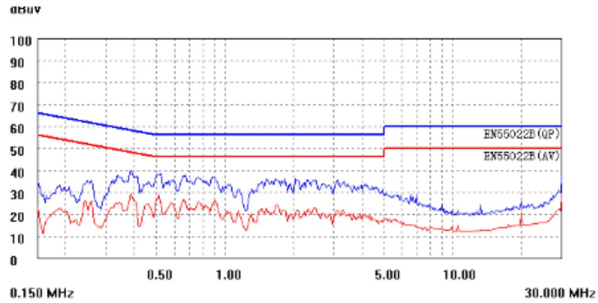

115VAC Line

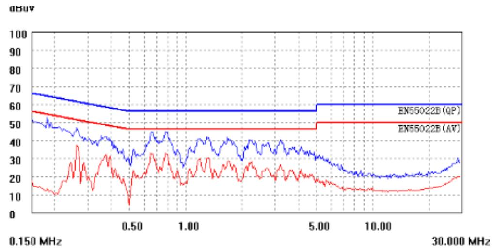

230VAC Line

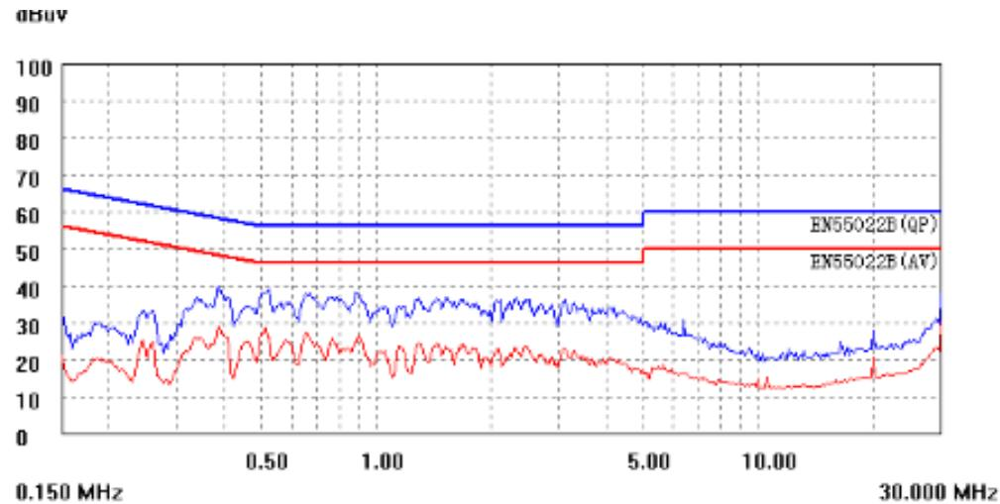

115VAC Neutral

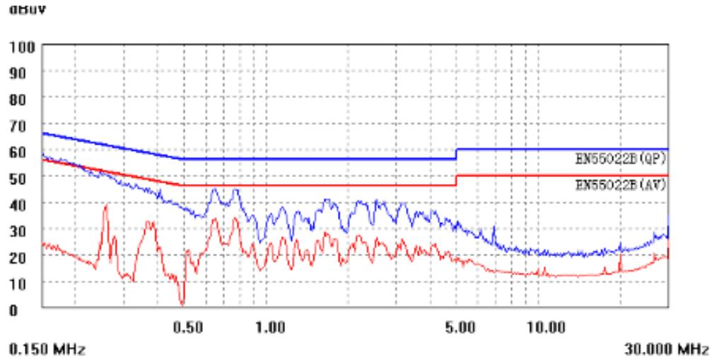

230VAC Neutral

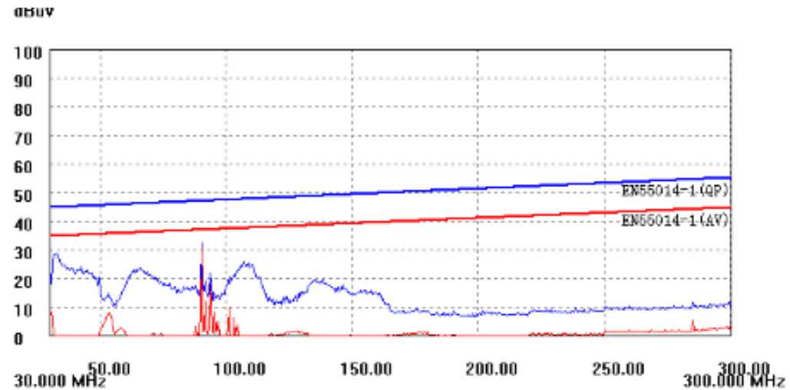

115VAC 空载

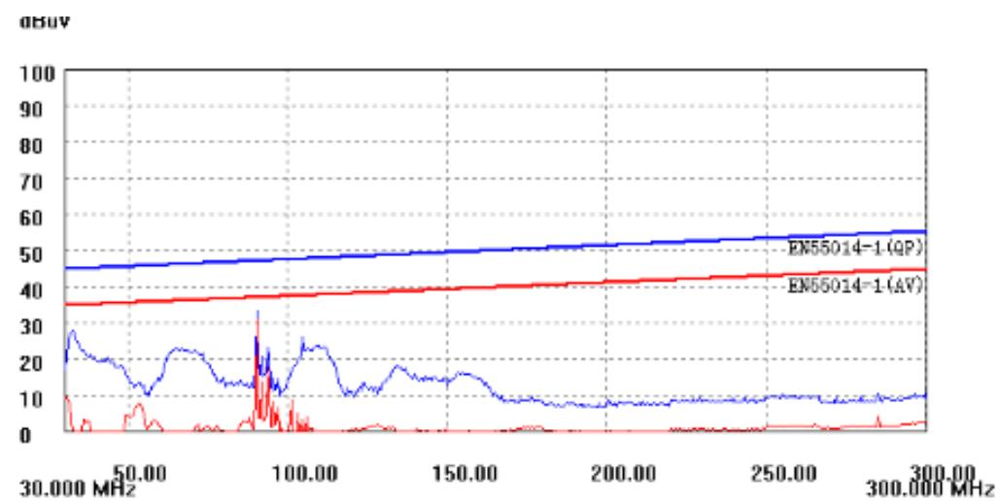

230VAC 空载

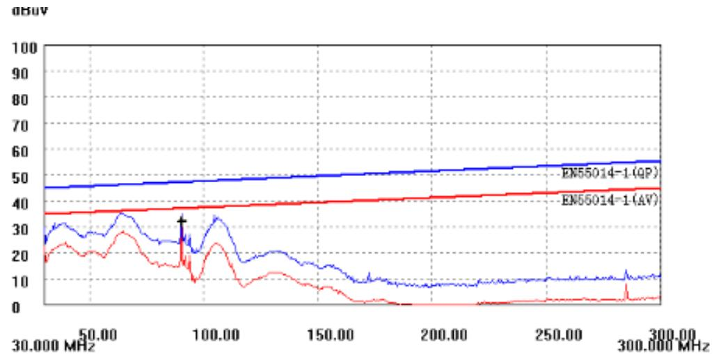

115VAC 满载

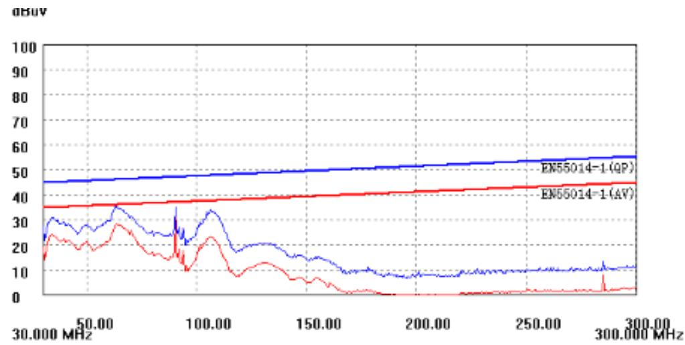

230VAC 满载

<table><tr><td>差模</td><td>电压</td><td>相位角</td><td>发生器阻抗</td><td>测试次数</td><td>测试结果</td></tr><tr><td>L to N</td><td>+2kV</td><td>0</td><td>2</td><td>10</td><td>Pass</td></tr><tr><td>L to N</td><td>-2kV</td><td>0</td><td>2</td><td>10</td><td>Pass</td></tr><tr><td>L to N</td><td>+2kV</td><td>90</td><td>2</td><td>10</td><td>Pass</td></tr><tr><td>L to N</td><td>-2kV</td><td>90</td><td>2</td><td>10</td><td>Pass</td></tr><tr><td>L to N</td><td>+2kV</td><td>180</td><td>2</td><td>10</td><td>Pass</td></tr><tr><td>L to N</td><td>-2kV</td><td>180</td><td>2</td><td>10</td><td>Pass</td></tr><tr><td>L to N</td><td>+2kV</td><td>270</td><td>2</td><td>10</td><td>Pass</td></tr><tr><td>L to N</td><td>-2kV</td><td>270</td><td>2</td><td>10</td><td>Pass</td></tr></table>

## 测试说明

➢ 按照GB/T17626.5和IEC61000-4-5的最新版本要求进行测试  
➢ 室温环境，230VAC输入，满载条件  
➢ 输入1.2/50us组合波浪涌电压  
➢ 每个测试点重复10次  
➢ 每次间隔时间1分钟  
➢ 试验时样机输出正常（符合A类标准）视为Pass

<table><tr><td>差模</td><td>电压</td><td>脉冲群持续时间</td><td>脉冲频率</td><td>测试时间</td><td>测试结果</td></tr><tr><td>L to N</td><td>+4kV</td><td>15ms</td><td>5kHz</td><td>120s</td><td>Pass</td></tr><tr><td>L to N</td><td>-4kV</td><td>15ms</td><td>5kHz</td><td>120s</td><td>Pass</td></tr><tr><td>L to N</td><td>+4kV</td><td>0.75ms</td><td>100kHz</td><td>120s</td><td>Pass</td></tr><tr><td>L to N</td><td>-4kV</td><td>0.75ms</td><td>100kHz</td><td>120s</td><td>Pass</td></tr><tr><td>L to N</td><td>+2kV</td><td>2ms</td><td>38kHz</td><td>120s</td><td>Pass</td></tr><tr><td>L to N</td><td>-2kV</td><td>2ms</td><td>38kHz</td><td>120s</td><td>Pass</td></tr><tr><td>L to N</td><td>+4kV</td><td>2ms</td><td>38kHz</td><td>120s</td><td>Pass</td></tr><tr><td>L to N</td><td>-4kV</td><td>2ms</td><td>38kHz</td><td>120s</td><td>Pass</td></tr></table>

## 测试说明

➢ 按照GB/T17626.4和IEC61000-4-4的最新版本要求进行测试  
➢ 室温环境，230VAC输入满载条件  
➢ 分别测试5kHz/100kHz/38kHz脉冲频率  
➢ 脉冲群周期为300ms  
➢ 每个测试条件测试时间120s  
➢ 试验时样机输出正常（符合A类标准）视为Pass

<table><tr><td>测试点</td><td>电压(V)</td><td>放电类型</td><td>放电次数</td><td>测试结果</td></tr><tr><td>Vo</td><td>+15kV</td><td>空气放电</td><td>10</td><td>Pass</td></tr><tr><td>Vo</td><td>-15kV</td><td>空气放电</td><td>10</td><td>Pass</td></tr><tr><td>GND</td><td>+15kV</td><td>空气放电</td><td>10</td><td>Pass</td></tr><tr><td>GND</td><td>-15kV</td><td>空气放电</td><td>10</td><td>Pass</td></tr><tr><td>Vo</td><td>+20kV</td><td>空气放电</td><td>10</td><td>Pass</td></tr><tr><td>Vo</td><td>-20kV</td><td>空气放电</td><td>10</td><td>Pass</td></tr><tr><td>GND</td><td>+20kV</td><td>空气放电</td><td>10</td><td>Pass</td></tr><tr><td>GND</td><td>-20kV</td><td>空气放电</td><td>10</td><td>Pass</td></tr></table>

## 测试说明

➢ 按照GB/T17626.2和IEC61000-4-2的最新版本要求进行测试  
➢ 室温环境，230VAC输入满载条件  
➢ 每个测试点重复10次  
➢ 分别对输出正端和地进行空气放电  
➢ 试验时样机输出正常（符合A类标准）视为Pass

## THANK YOU FOR WATCHING
