## BPA8604P隔离参考设计

## (5V0.3A;12V0.3A)

上海晶丰明源半导体股份有限公司

Shanghai Bright Power Semiconductor Co., Ltd.

文长川

时间： 2021年06月25日

<table><tr><td>项目描述</td><td>符号</td><td>最小</td><td>典型</td><td>最大</td><td>单位</td><td>备注</td></tr><tr><td colspan="7">输入</td></tr><tr><td>电压</td><td> $V_{IN}$ </td><td>85</td><td>115/230</td><td>264</td><td> $V_{AC}$ </td><td></td></tr><tr><td>频率</td><td> $f_{LINE}$ </td><td>47</td><td>50/60</td><td>63</td><td>Hz</td><td></td></tr><tr><td colspan="7">输出</td></tr><tr><td>输出电压1</td><td> $V_{OUT1}$ </td><td>4.75</td><td>5</td><td>5.25</td><td>V</td><td>±5%</td></tr><tr><td>输出电流1</td><td> $I_{OUT1}$ </td><td>0</td><td></td><td>300</td><td>mA</td><td></td></tr><tr><td>输出电压2</td><td> $V_{OUT2}$ </td><td>11.16</td><td>12</td><td>12.84</td><td>V</td><td>±7%</td></tr><tr><td>输出电流2</td><td> $I_{OUT2}$ </td><td>0</td><td></td><td>300</td><td>mA</td><td></td></tr><tr><td>输出电压纹波1</td><td> $V_{RIPPLE}$ </td><td></td><td></td><td>200</td><td>mV</td><td>20MHz带宽</td></tr><tr><td>输出电压纹波2</td><td> $V_{RIPPLE}$ </td><td></td><td></td><td>200</td><td>mV</td><td>20MHz带宽</td></tr><tr><td>连续输出功率</td><td> $P_{OUT}$ </td><td></td><td>5</td><td></td><td>W</td><td></td></tr><tr><td colspan="7">效率</td></tr><tr><td>待机功耗</td><td> $P_{STDBY}$ </td><td></td><td></td><td>100</td><td>mW</td><td>230VAC,包含假负载</td></tr><tr><td>满载效率</td><td>η</td><td></td><td></td><td>70</td><td>%</td><td></td></tr><tr><td colspan="7">环境</td></tr><tr><td>传导EMI</td><td></td><td colspan="4">满足CISPR22/EN55022 Class B,至少6dB 裕量</td><td></td></tr><tr><td>Surge</td><td></td><td></td><td>2</td><td></td><td>kV</td><td>差模</td></tr><tr><td>EFT</td><td></td><td></td><td>4</td><td></td><td>kV</td><td>5kHz/100kHz/38kHz</td></tr><tr><td>ESD</td><td></td><td></td><td>15</td><td>20</td><td>kV</td><td>空气放电</td></tr><tr><td>工作环境温度</td><td> $T_{AMP}$ </td><td>0</td><td></td><td>50</td><td>°C</td><td></td></tr></table>

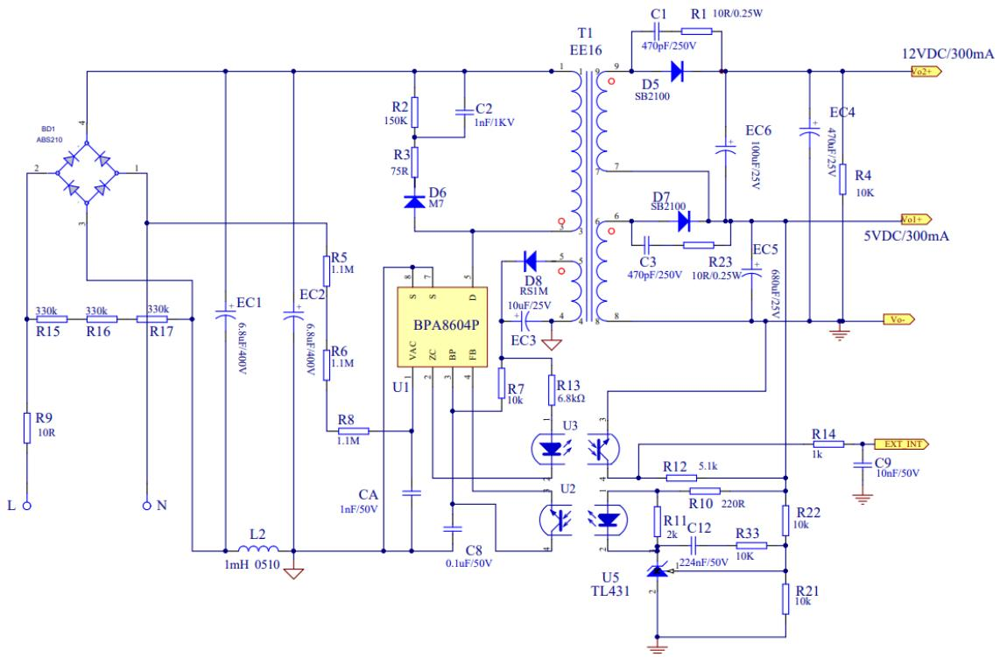

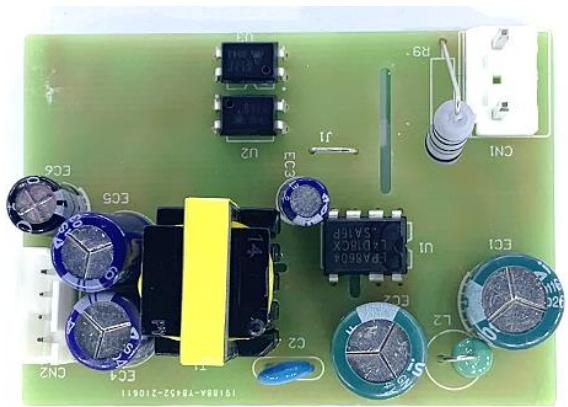

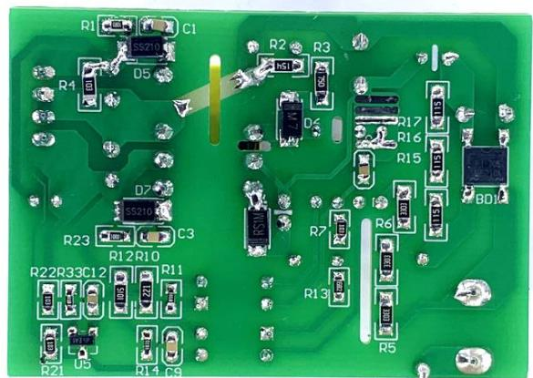

<table><tr><td>序号</td><td>元件标号</td><td>参数描述</td><td>封装尺寸</td><td>数量</td></tr><tr><td>1</td><td>PCB</td><td>CEM-1,单面板</td><td>60.5mm*42.5mm</td><td>1</td></tr><tr><td>2</td><td>R9</td><td>2W,10R 绕线保险丝电阻</td><td>DIP</td><td>1</td></tr><tr><td>3</td><td>EC1,EC2</td><td>400V6.8uF电解电容</td><td> $\phi 10*13$ </td><td>2</td></tr><tr><td>4</td><td>L2</td><td>色环电感1mH</td><td>510</td><td>1</td></tr><tr><td>5</td><td>J1</td><td>跳线0.6*5</td><td>DIP</td><td>1</td></tr><tr><td>6</td><td>U3</td><td>BPA8604P</td><td>DIP</td><td>1</td></tr><tr><td>7</td><td>EC3</td><td>50V10uF电解电容</td><td> $\phi 5*11$ </td><td>1</td></tr><tr><td>8</td><td>U2.U3</td><td>PC817C 光耦</td><td>DIP</td><td>2</td></tr><tr><td>9</td><td>T1</td><td>EE16加高 1.7mH</td><td>DIP</td><td>1</td></tr><tr><td>10</td><td>EC5</td><td>25V/680uF电解电容</td><td> $\phi 8*16mm$ </td><td>1</td></tr><tr><td>11</td><td>EC4</td><td>25V/470uF电解电容</td><td> $\phi 8*12mm$ </td><td>1</td></tr><tr><td>12</td><td>EC6</td><td>25V/100uF电解电容</td><td> $\phi 6*11mm$ </td><td>1</td></tr><tr><td>13</td><td>BD1</td><td>ABS210 2A1KV整流桥</td><td>SMD</td><td>1</td></tr><tr><td>14</td><td>D6</td><td>M7,1A,1KV 二极管</td><td>SMA</td><td>1</td></tr><tr><td>15</td><td>D8</td><td>RS1M 1A,1KV快速二极管</td><td>SOD123</td><td>1</td></tr><tr><td>16</td><td>D7,D5</td><td>SS210 2A100V肖特基二极管</td><td>SMB</td><td>2</td></tr><tr><td>17</td><td>U5</td><td>AZ431</td><td>SOT23-3</td><td>1</td></tr><tr><td>18</td><td>C2</td><td>1nF 1KV 瓷片电容</td><td>DIP</td><td>1</td></tr><tr><td>19</td><td>R15,R16,R17</td><td>1.1M,±5%</td><td>SMD1206</td><td>3</td></tr></table>

<table><tr><td>序号</td><td>元件标号</td><td>参数描述</td><td>封装尺寸</td><td>数量</td></tr><tr><td>20</td><td>R5,R6,R8</td><td>330K, ±5%</td><td>SMD1206</td><td>3</td></tr><tr><td>21</td><td>R3</td><td>75R, ±5%</td><td>SMD1206</td><td>1</td></tr><tr><td>22</td><td>R2</td><td>150K, ±5%</td><td>SMD1206</td><td>2</td></tr><tr><td>23</td><td>R9</td><td>6.8K, ±5%</td><td>SMD1206</td><td>1</td></tr><tr><td>24</td><td>R4</td><td>10K, ±5%</td><td>SMD1206</td><td>2</td></tr><tr><td>25</td><td>R10</td><td>220R, ±5%</td><td>SMD1206</td><td>1</td></tr><tr><td>26</td><td>R12</td><td>5.1K, ±5%</td><td>SMD1206</td><td>1</td></tr><tr><td>27</td><td>R13,R10,R21,R22,R33</td><td>10K, ±5%</td><td>SMD0805</td><td>5</td></tr><tr><td>28</td><td>R1,R23</td><td>10R,±5%</td><td>SMD0805</td><td>1</td></tr><tr><td>29</td><td>R11</td><td>2K, ±5%</td><td>SMD0805</td><td>1</td></tr><tr><td>30</td><td>R14</td><td>1K, ±5%</td><td>SMD0805</td><td>1</td></tr><tr><td>33</td><td>C8</td><td>100nF/16V,X7R</td><td>SMD0805</td><td>1</td></tr><tr><td>33</td><td>C12</td><td>220nF/16V,X7R</td><td>SMD0805</td><td>1</td></tr><tr><td>35</td><td>C1,C3</td><td>470pF/250V,X7R</td><td>SMD0805</td><td>2</td></tr><tr><td>36</td><td>CA</td><td>1nF/16V,X7R</td><td>SMD0805</td><td>1</td></tr><tr><td colspan="2"></td><td></td><td>Total</td><td>48</td></tr></table>

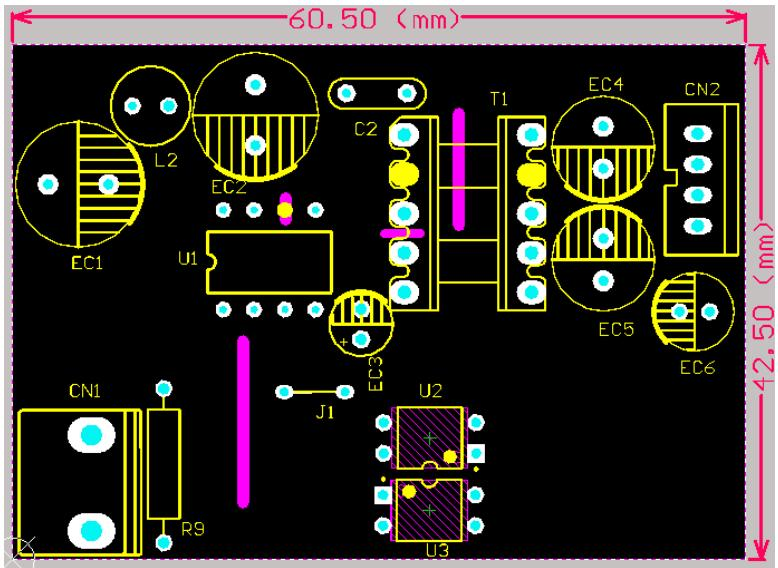

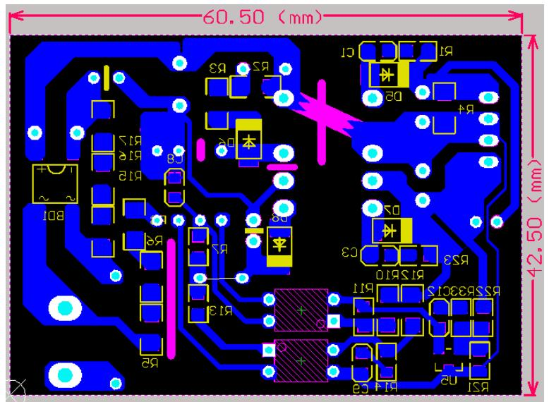

## 原理图

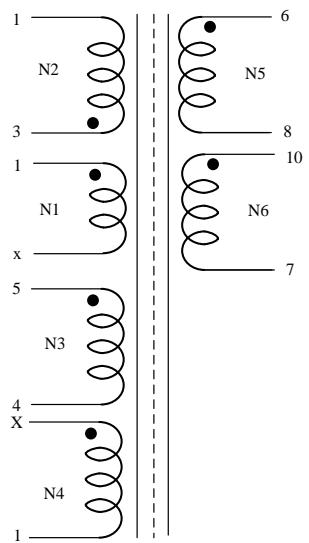

## 规格与材料

➢ 初级绕组感量 $\mathsf { L } _ { \mathsf { p } } = 1 7 0 0 \mathsf { u H } \pm 7 \%$ （测试条件： 0.3V，$1 0 0 \boldsymbol { \mathsf { k } } \boldsymbol { \mathsf { H z } } )$ ）  
➢ 漏感量 $\ L _ { | | k } < 5 0 \mathsf { u } \mathsf { H }$  
➢ 骨架：EE16底部加高（5+5PIN）  
➢ 磁芯：EE16 PC40 或同等材质 ， $\mathsf { A } \mathsf { e } = 1 9 . 2 \mathsf { m } \mathsf { m } ^ { 2 }$  
➢ N1、N2、N3、N4: 2UEW 漆包线  
➢ N5 、N6 : 三层绝缘线  
➢ 绝缘胶带:3M900 或同等材质  
➢ 耐压测试: 3KV, 50/60Hz, 1Min  
➢ 成品要求：浸凡立水

## 绕线方式

<table><tr><td>绕组</td><td>起始脚</td><td>终止脚</td><td>材料</td><td>匝数</td><td>绕线方式</td></tr><tr><td>N1</td><td>1</td><td>NC</td><td> $\phi 0.13*2P$ </td><td>23Ts</td><td>密绕一层(PIN脚朝外)</td></tr><tr><td colspan="4">胶带</td><td>2.1Ts</td><td></td></tr><tr><td>N2</td><td>3</td><td>1</td><td> $\phi 0.17*1P$ </td><td>120Ts</td><td>密绕三层(PIN脚朝外)</td></tr><tr><td colspan="4">胶带</td><td>2.1Ts</td><td></td></tr><tr><td>N5</td><td>5</td><td>4</td><td> $\phi 0.13*2P$ </td><td>20Ts</td><td>密绕一层(PIN脚朝外)</td></tr><tr><td colspan="4">胶带</td><td>2.1Ts</td><td></td></tr><tr><td>N5</td><td>NC</td><td>1</td><td> $\phi 0.33*3P$ </td><td>6Ts</td><td>密绕一层(PIN脚朝外)</td></tr><tr><td colspan="4">胶带</td><td>2.1Ts</td><td></td></tr><tr><td>N5</td><td>6</td><td>8</td><td>三层绝缘线 $\phi 0.28*2P$ </td><td>7Ts</td><td>均匀绕一层(PIN脚朝外)</td></tr><tr><td colspan="4">胶带</td><td>2.1Ts</td><td></td></tr><tr><td>N6</td><td>10</td><td>7</td><td>三层绝缘线 $\phi 0.28*1P$ </td><td>9Ts</td><td>密绕一层(PIN脚朝外)</td></tr><tr><td colspan="4">胶带</td><td>3Ts</td><td></td></tr></table>

## 脚位图

待机功耗（包含14mW假负载，10K电阻外供电）  
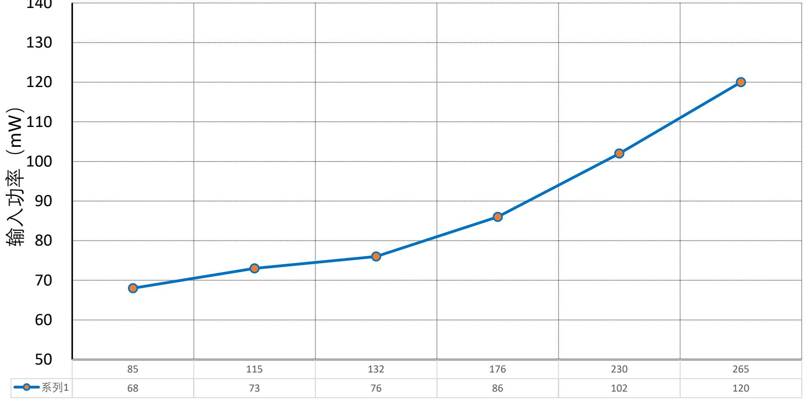

输入电压(VAC)

效率测试  
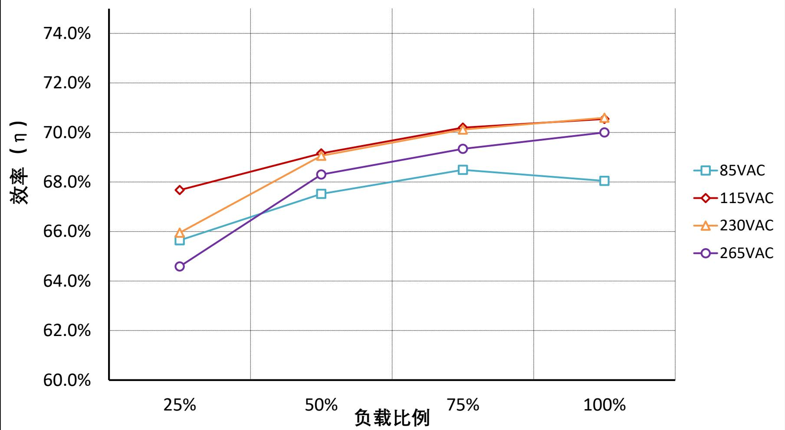

## 输出电压交叉调整率

<table><tr><td>输入电压AC (V)</td><td>输出电流1(A)</td><td>输出电压1(V)</td><td>输出电流2(A)</td><td>输出电压2(V)</td></tr><tr><td rowspan="2">115</td><td>0</td><td>4.99</td><td>0.3</td><td>11.41</td></tr><tr><td>0.3</td><td>4.99</td><td>0</td><td>12.53</td></tr><tr><td rowspan="2">230</td><td>0</td><td>4.99</td><td>0.3</td><td>11.4</td></tr><tr><td>0.3</td><td>4.95</td><td>0</td><td>12.56</td></tr></table>

## 输出电压纹波

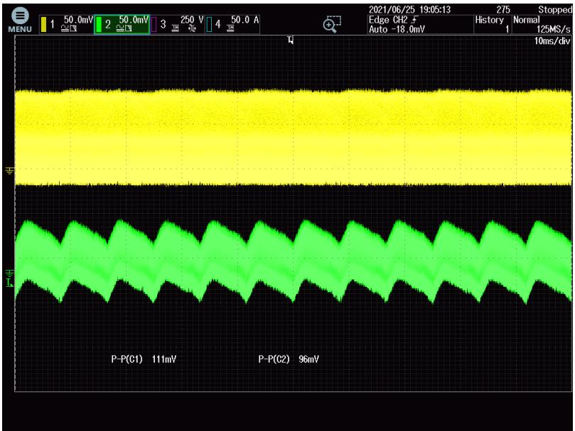

85 $\mathsf { v } _ { \mathsf { A C } }$

CH1 $\mathsf { V } _ { \mathsf { O U T - 5 V } }$ $\mathsf { R i p p l e }$ $\mathsf { V } _ { \mathsf { P K - P K } } { = } 1 1 1 \mathsf { m V }$  
CH2 $\mathsf { V } _ { \mathsf { O U T - 1 } 2 \mathsf { V } }$ Ripple $\scriptstyle \mathsf { V } _ { \mathsf { P K - P K } } = 9 6 \mathsf { m } \mathsf { V }$

Test Condition:  
➢ Full Load  
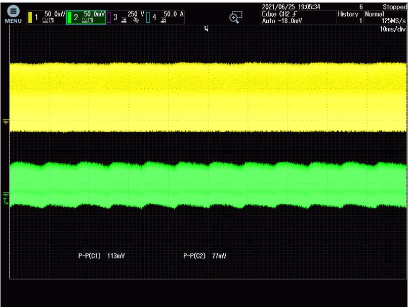

115 VAC

CH1 $\mathsf { V } _ { \mathsf { O U T - S V } }$ Ripple $\mathsf { V } _ { \mathsf { P K - P K } } { = } \pmb { 1 } \pmb { 1 } 3 \mathsf { m V }$  
${ \mathsf { C H } } 2 { \mathsf { V } } _ { 0 \mathsf { U T } - 1 2 { \mathsf { V } } }$ Ripple $v _ { p \times \mathrm { - } P K } = 7 7 m v$

Test Condition:  
➢ $\mathsf { F u l l \mathsf { L o a d } }$  

230 $\mathsf { v } _ { \mathsf { A C } }$

CH1 $\mathsf { V } _ { \mathsf { O U T - 5 V } }$ $\mathsf { R i p p } | \mathsf { e }$ $\mathsf { V } _ { \mathsf { P K - P K } } { = } 1 2 2 \mathsf { m V }$  
CH2 $\mathsf { V } _ { \mathsf { O U T } - 1 2 \mathsf { V } }$ Ripple $\mathbf { V } _ { \mathsf { P K - P K } } { = } 7 8 \mathsf { m } \mathbf { V }$

Test Condition:  
➢ Full Load  

265 $\mathsf { v } _ { \mathsf { A C } }$

CH1 $\mathsf { V } _ { \mathsf { O U T - 5 V } }$ Ripple $\mathsf { V } _ { \mathsf { P K - P K } } { = } 1 2 4 \mathsf { m V }$  
${ \mathsf { C H } } 2 { \mathsf { V } } _ { 0 \cup \mathsf { T } - 1 2 { \mathsf { V } } }$ Ripple $\mathbf { V } _ { \mathsf { P K - P K } } { = } 7 9 \mathsf { m } \mathbf { V }$

Test Condition:

➢ Full Load

## 动态负载(50%-100%)

85 VAC

${ \mathsf { C H 1 } } \mathsf { V } _ { \mathsf { O U T } - { \mathsf { 5 v } } }$ CH1 VOUT-5V VPK-PK=128 mV $v _ { p _ { \mathrm { K - P K } } } { = } 1 2 8 ~ \mathsf { m V }$  
CH2 VOUT-12V $\mathsf { V } _ { \mathsf { O U T - 1 2 V } }$ $\mathtt { V } _ { \mathtt { P K - P K } } = 3 1 1 \mathtt { m V }$

## Test Condition:

➢ 0.15 A-0.3 A-0.15 A  
➢ 0.15 A-0.3 A-0.15 A  
➢ Slew Rate: 0.5 A/μS  
➢ Frequency: 100 Hz

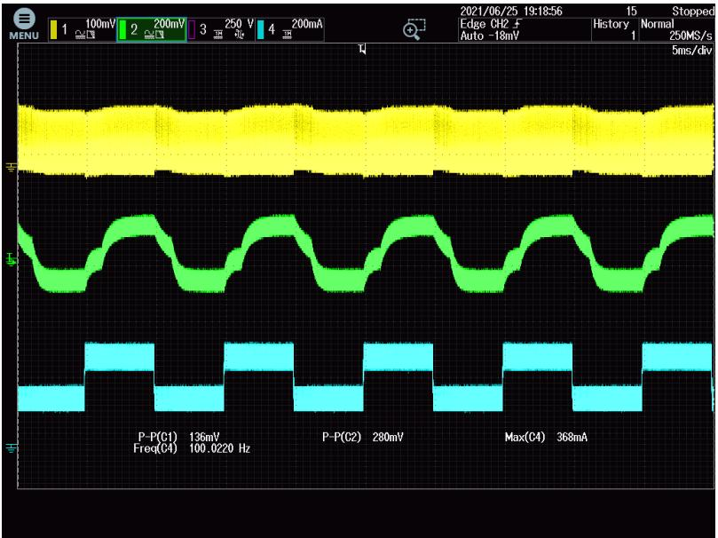

230 VAC

CH1 VOUT-5V $\mathsf { V } _ { \mathsf { O U T - 5 V } }$ $v _ { p _ { \mathrm { K - P K } } } { = } 1 3 6 ~ \mathsf  m v$  
CH2 VOUT-12V $\mathsf { V } _ { \mathsf { O U T } - 1 2 \mathsf { V } }$ VPK-PK=280 mV $V _ { \mathsf { P K - P K } } { = } 2 8 0 ~ \mathsf { m V }$

## Test Condition:

➢ 0.15 A-0.3 A-0.15 A  
➢ 0.15 A-0.3 A-0.15 A  
➢ Slew Rate: 0.5 A/μS  
➢ Frequency: 100 Hz

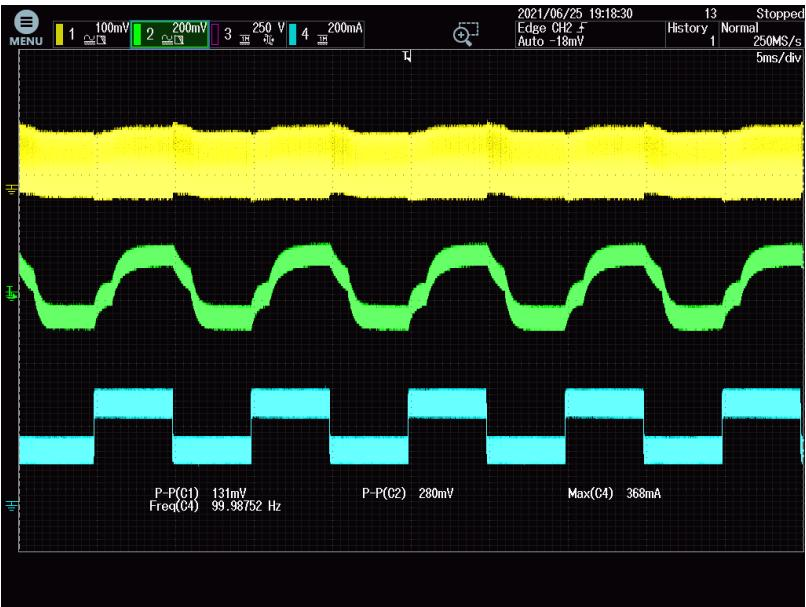

115 VAC

${ \mathsf { C H 1 } } { \mathsf { V } } _ { { \mathsf { O U T } } - { \mathsf { 5 v } } }$ CH1 VOUT-5V $v _ { p \vert k - P K } { = } 1 3 1 m v$  
$\mathsf { C H 2 V _ { O U T - 1 2 V } }$ CH2 VOUT-12V VPK-PK=368 mV $v _ { p _ { \mathrm { K - P K } } } { = } 3 6 8 ~ \mathsf  m v$

## Test Condition:

➢ 0.15 A-0.3 A-0.15 A  
➢ 0.15 A-0.3 A-0.15 A  
➢ Slew Rate: 0.5 A/μS  
➢ Frequency: 100 Hz

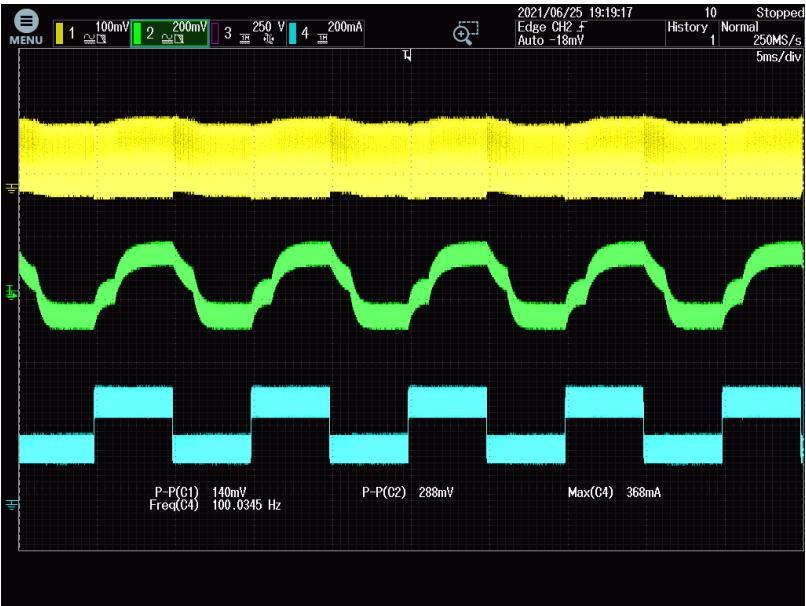

265 VAC

${ \mathsf { C H 1 } } \mathsf { V } _ { \mathsf { O U T } - 5 \mathsf { V } }$ CH1 VOUT-5V $V _ { \mathsf { P K - P K } } { = } 1 4 0 ~ \mathsf { m V }$  
${ \mathsf { C H } } 2 { \mathsf { V } } _ { 0 \cup \mathsf { T } - 1 2 { \mathsf { V } } }$ CH2 VOUT-12V VPK-PK=288 mV $V _ { \mathsf { P K - P K } } { = } 2 8 8 ~ \mathsf { m V }$

## Test Condition:

➢ 0.15 A-0.3 A-0.15 A  
➢ 0.15 A-0.3 A-0.15 A  
➢ Slew Rate: 0.5 A/μS  
➢ Frequency: 100 Hz

## 动态负载(10%-90%)

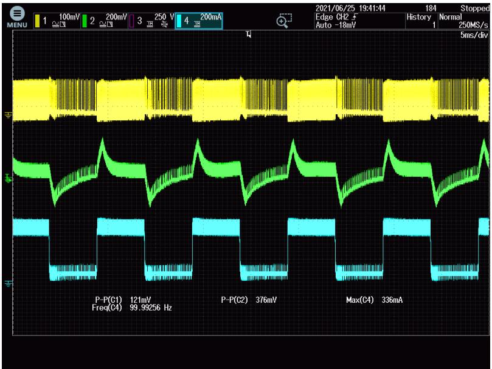

85 VAC

${ \mathsf { C H 1 } } \mathsf { V } _ { \mathsf { O U T } - { \mathsf { 5 v } } }$ CH1 VOUT-5V VPK-PK=121 mV $\mathtt { V } _ { \mathtt { P K - P K } } = \mathtt { 1 } 2 1 \ m \vee$  
${ \mathsf { C H } } 2 { \mathsf { V } } _ { 0 \cup \mathsf { T } - 1 2 { \mathsf { V } } }$ CH2 VOUT-12V $V _ { P K - P K } = 3 7 6 ~ \mathsf { m V }$

## Test Condition:

➢ 0.03 A-0.27 A-0.03 A  
➢ 0.03 A-0.27 A-0.03 A  
➢ Slew Rate: 0.5 A/μS  
➢ Frequency: 100 Hz

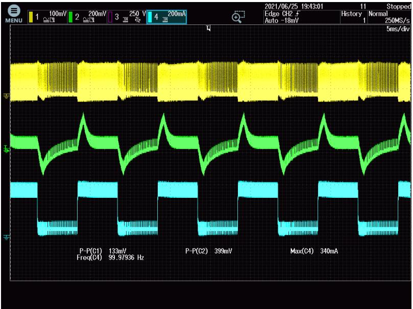

230 VAC

CH1 VOUT-5V $\mathsf { V } _ { \mathsf { O U T - 5 V } }$ $v _ { p _ { k - P K } } { = } 1 3 3 ~ \mathsf { m V }$  
CH2 VOUT-12V $\mathsf { V } _ { \mathsf { O U T } - 1 2 \mathsf { V } }$ VPK-PK=399 mV $V _ { P K - P K } { = } 3 9 9 m v$

## Test Condition:

➢ 0.03 A-0.27 A-0.03 A  
➢ 0.03 A-0.27 A-0.03 A  
➢ Slew Rate: 0.5 A/μS  
➢ Frequency: 100 Hz

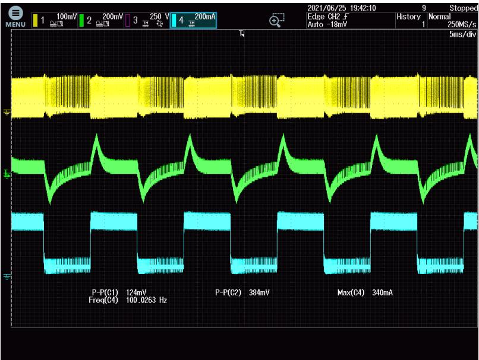

115 VAC

${ \mathsf { C H 1 } } { \mathsf { V } } _ { { \mathsf { O U T } } - { \mathsf { 5 v } } }$ CH1 VOUT-5V $V _ { \mathsf { P K - P K } } { = } 1 2 4 ~ \mathsf { m V }$  
$\mathsf { C H 2 V _ { O U T - 1 2 V } }$ CH2 VOUT-12V VPK-PK=384 mV $V _ { \mathsf { P K - P K } } { = } 3 8 4 \mathsf { m V }$

## Test Condition:

➢ 0.03 A-0.27 A-0.03 A  
➢ 0.03 A-0.27 A-0.03 A  
➢ Slew Rate: 0.5 A/μS  
➢ Frequency: 100 Hz

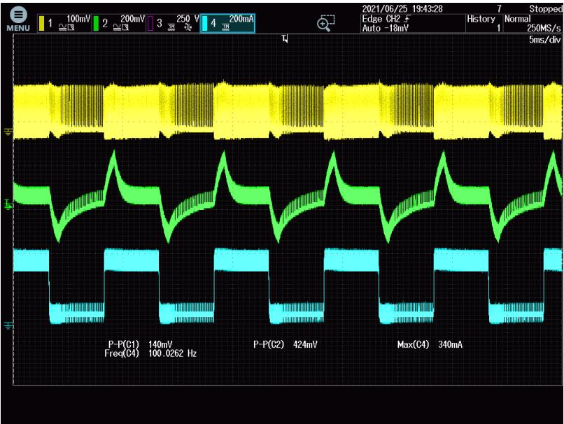

265 VAC

${ \mathsf { C H 1 } } \mathsf { V } _ { \mathsf { O U T } - 5 \mathsf { V } }$ CH1 VOUT-5V VPK-PK=140 mV $V _ { \mathsf { P K - P K } } { = } 1 4 0 ~ \mathsf { m V }$  
${ \mathsf { C H } } 2 { \mathsf { V } } _ { 0 \cup \mathsf { T } - 1 2 { \mathsf { V } } }$ CH2 VOUT-12V VPK-PK=424 mV $V _ { P K - P K } = 4 2 4 m v$

## Test Condition:

➢ 0.03 A-0.27 A-0.03 A  
➢ 0.03 A-0.27 A-0.03 A  
➢ Slew Rate: 0.5 A/μS  
➢ Frequency: 100 Hz

## 输出电压开机波形

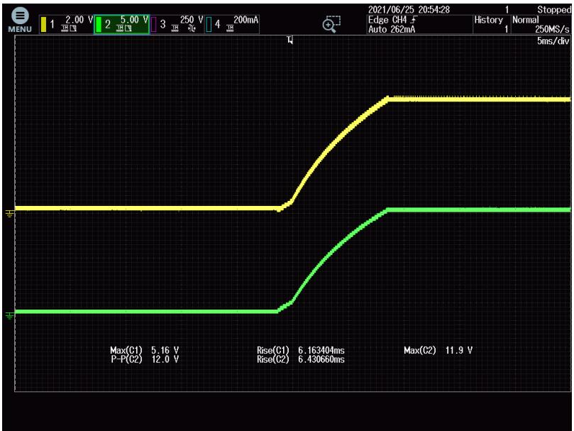

85 VAC

CH1 VOUT-5V $\mathsf { V } _ { \mathsf { O U T - 5 V } }$ ${ \sf T } _ { \sf R I S E } .$ 6.16 mS  
CH2 VOUT-12V $\mathsf { V } _ { \mathsf { O U T - 1 } 2 \mathsf { V } }$ ${ \sf T } _ { \sf R I S E } .$ 6.43mS

Test Condition:  
➢ No Load  
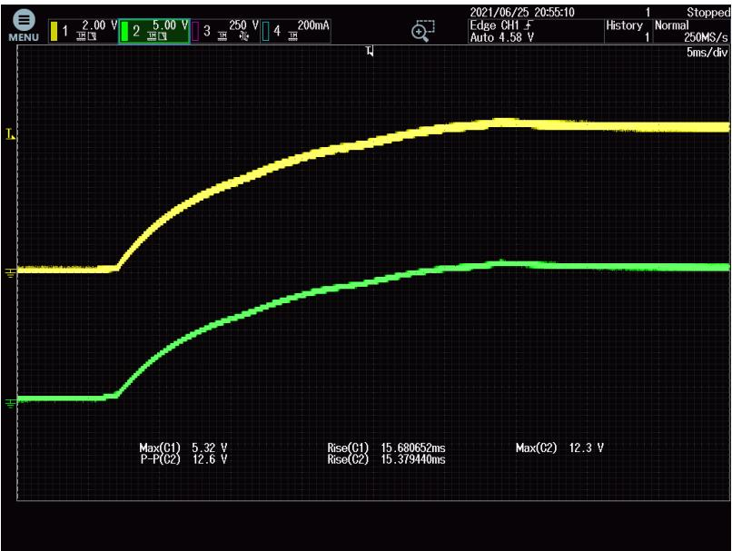

85 VAC

CH1 VOUT-5V $\mathsf { V } _ { \mathsf { O U T - S V } }$ ${ \sf T } _ { \sf R I S E } .$ 15.68 mS  
CH2 VOUT-12V $\mathsf { V } _ { \mathsf { O U T } - 1 2 \mathsf { V } }$ ${ \sf T } _ { \sf R I S E } \dot { \bf \cdot }$ 15.37mS

Test Condition:  
➢ Full Load  
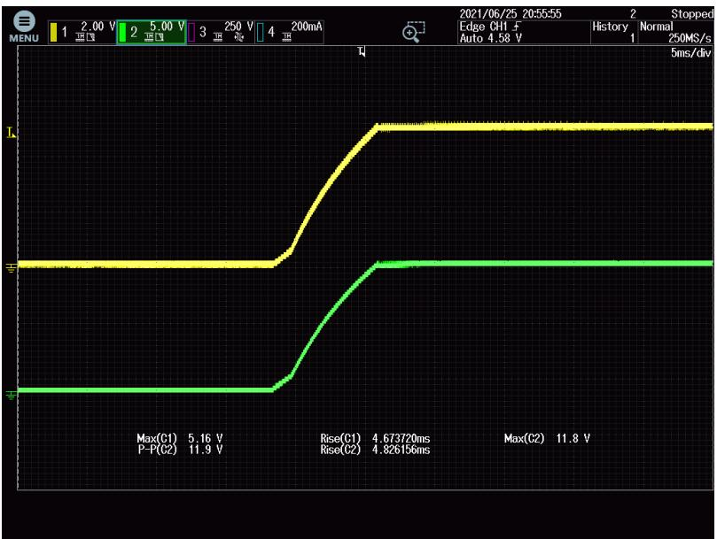

265 $\mathsf { v } _ { \mathsf { A C } }$

CH1 VOUT-5V $\mathsf { V } _ { \mathsf { O U T - 5 V } }$ ${ \sf T } _ { \sf R I S E } .$ 4.67 mS  
CH2 VOUT-12V $\mathsf { V } _ { \mathsf { O U T } - 1 2 \mathsf { V } }$ ${ \sf T } _ { \sf R I S E } .$ 4.82mS

Test Condition:  
➢ No Load  
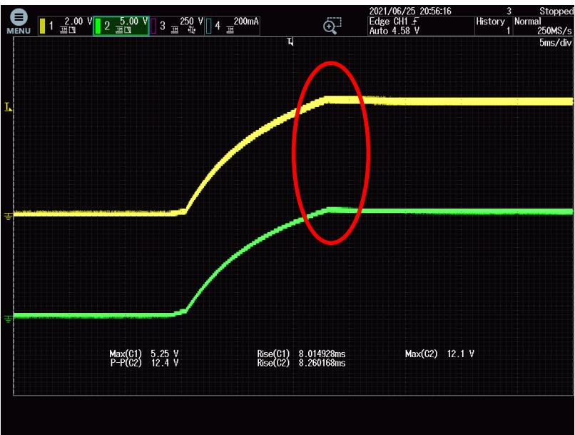

265 $\mathsf { v } _ { \mathsf { A C } }$

CH1 VOUT-5V $\mathsf { V } _ { \mathsf { O U T - 5 V } }$ TRISE: 8.01 mS ${ \sf T } _ { \sf R I S E } .$  
CH2 VOUT-12V $\mathsf { V } _ { \mathsf { O U T } - 1 2 \mathsf { V } }$ ${ \sf T } _ { \sf R I S E } .$ 8.26mS

Test Condition:

➢ Full Load

## MOSFET开机波形

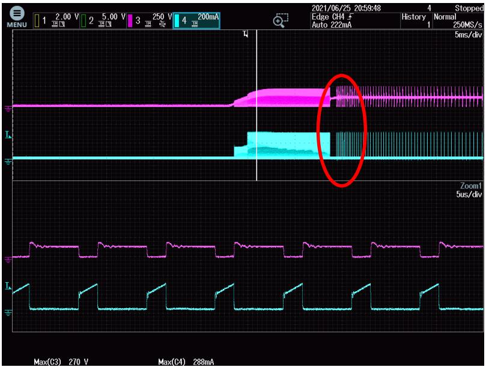

85 VAC

CH1 VDS  
CH3 IDS

$$
V _ {D S \_ M A X} = 2 7 0 \mathrm{V}
$$

$$
I _ {D S \_ M A X} = 0. 2 8 8 \mathrm{A}
$$

## Test Condition:

➢ No Load

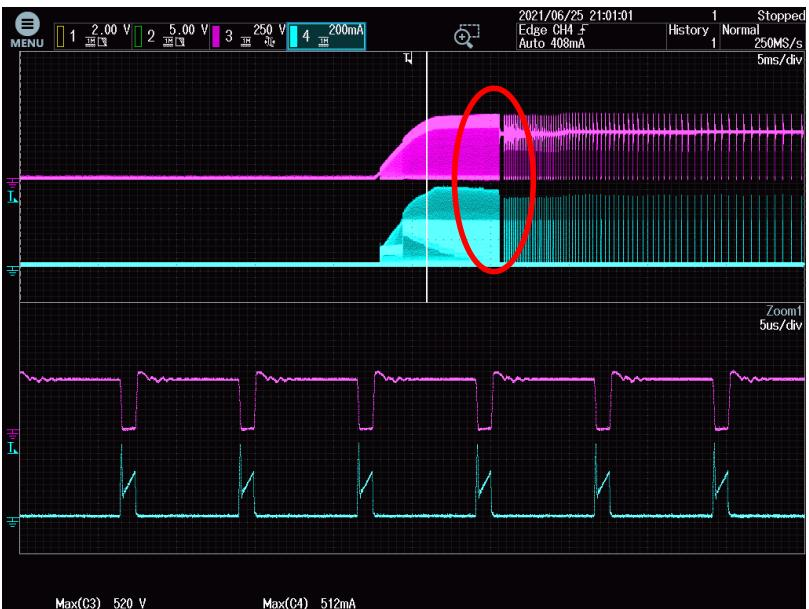

265 VAC

CH1 VDS  
CH3 IDS

$$
V _ {D S \_ M A X} = 5 2 0 \mathrm{V}
$$

$$
I _ {D S \_ M A X} = 0. 5 1 2 \mathrm{A}
$$

## Test Condition:

➢ No Load

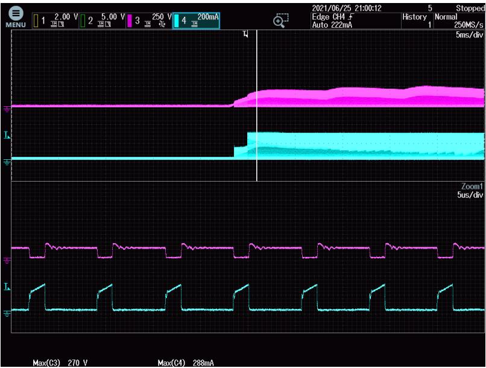

85 VAC

CH1 VDS  
CH3 IDS

$$
V _ {D S \_ M A X} = 2 7 0 \mathrm{V}
$$

$$
I _ {D S \_ M A X} = 0. 2 8 8 \mathrm{A}
$$

## Test Condition:

➢ Full Load

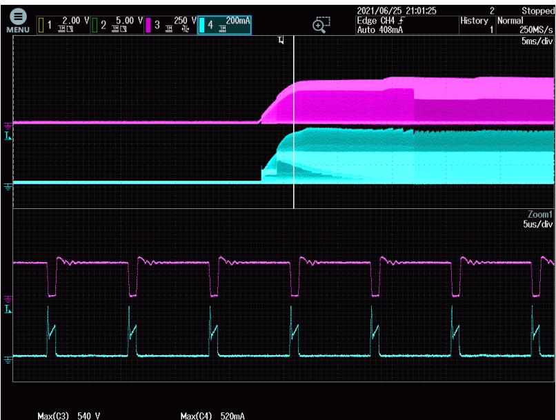

265 VAC

CH1 VDS  
CH3 IDS

$$
V _ {D S \_ M A X} = 5 4 0 V
$$

$$
I _ {D S \_ M A X} = 0. 5 2 0 \mathrm{A}
$$

## Test Condition:

➢ Full Load

## MOSFET稳态波形

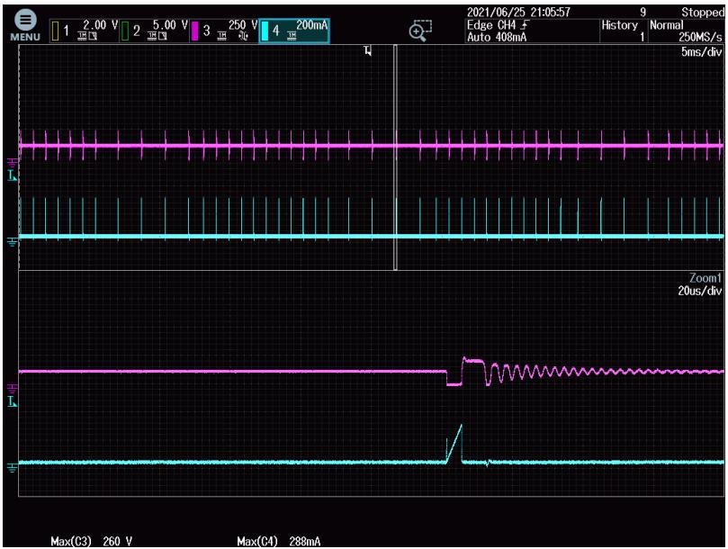

85 VAC  
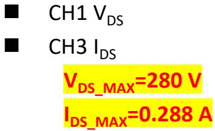

Test Condition:

➢ No Load

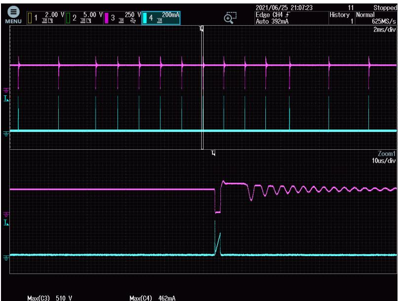

265 VAC  
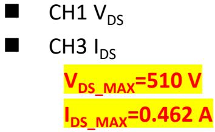

Test Condition:

➢ No Load

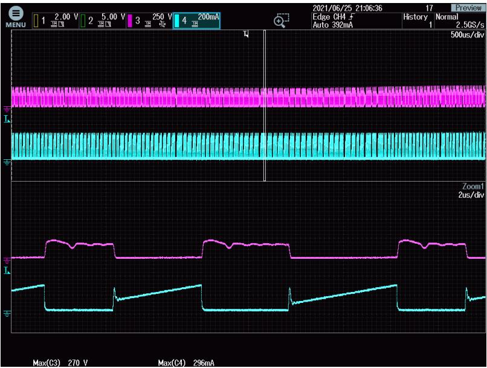

85 VAC  
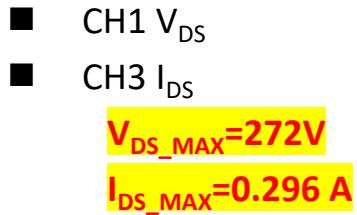

Test Condition:

➢ Full Load

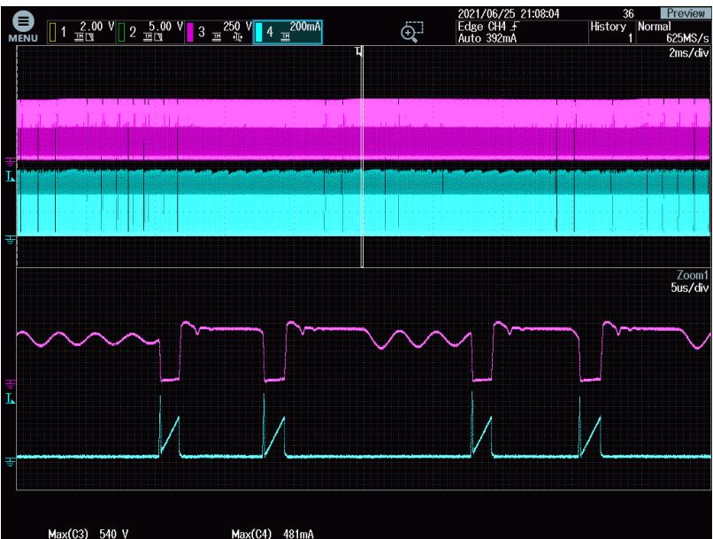

265 VAC  
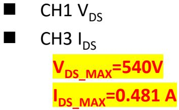

Test Condition:

➢ Full Load

## 输出二极管开机波形

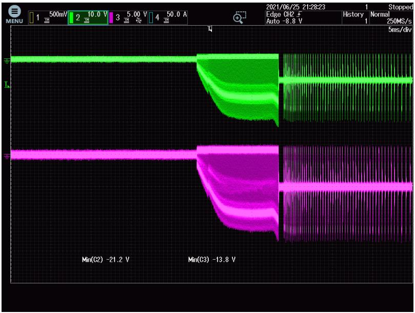

85 VAC

CH2 VR\_12V $V _ { R \_ 1 2 \vee }$  
CH3 VR\_5V $V _ { R \_ 5 \vee }$

$$
\begin{array}{l} \mathrm {V_ {R - 12V\_MAX}} = 2 1 \mathrm{V} \\ \mathrm {V_ {R - 5V\_MAX}} = 1 3 \mathrm{V} \end{array}
$$

## Test Condition:

➢ No Load

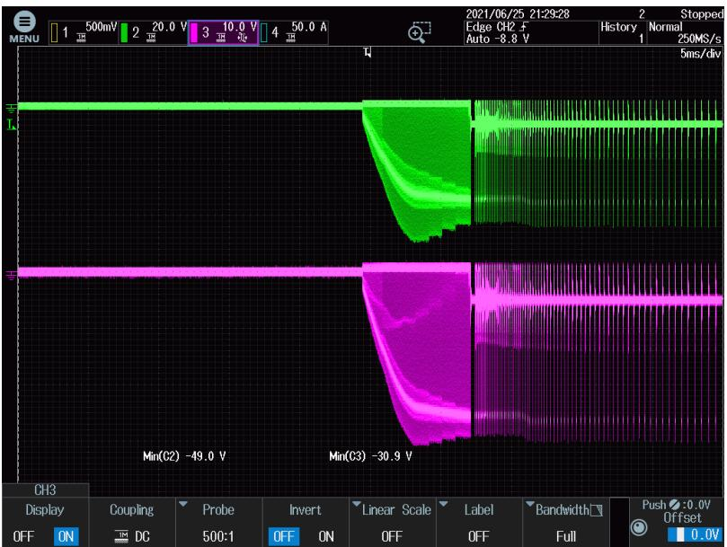

265 VAC

CH2 VR\_12V $V _ { R \_ 1 2 \vee }$  
CH3 VR\_5V $V _ { R \_ 5 \vee }$

$$
\begin{array}{l} \mathrm {V_ {R - 12V\_MAX}} = 4 9 \mathrm{V} \\ \mathrm {V_ {R - 5V\_MAX}} = 3 0. 9 \mathrm{V} \end{array}
$$

## Test Condition:

➢ No Load

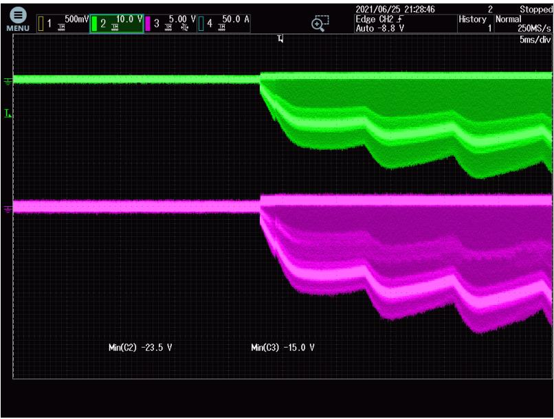

85 VAC

CH2 $V _ { R \_ 1 2 \vee }$  
CH3 VR\_5V $V _ { R \_ 5 \vee }$

$$
\begin{array}{l} V _ {R - 1 2 V \_ M A X} = 2 3 \mathrm{V} \\ V _ {R - 5 V \_ M A X} = 1 5 \mathrm{V} \end{array}
$$

## Test Condition:

➢ Full Load

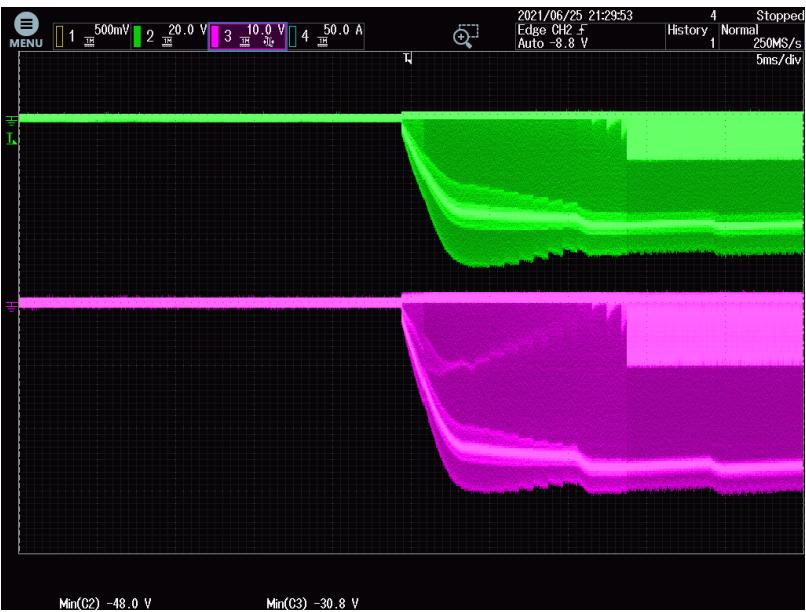

265 VAC

CH2 VR\_12V $V _ { \mathsf { R } \_ 1 2 \vee }$  
CH3 VR\_5V $V _ { R \_ 5 \vee }$

$$
\begin{array}{l} V _ {R - 1 2 V \_ M A X} = 4 8 \mathrm{V} \\ V _ {R - 5 V \_ M A X} = 3 0. 8 \mathrm{V} \end{array}
$$

## Test Condition:

➢ Full Load

## 短路保护 （MOSFET波形）

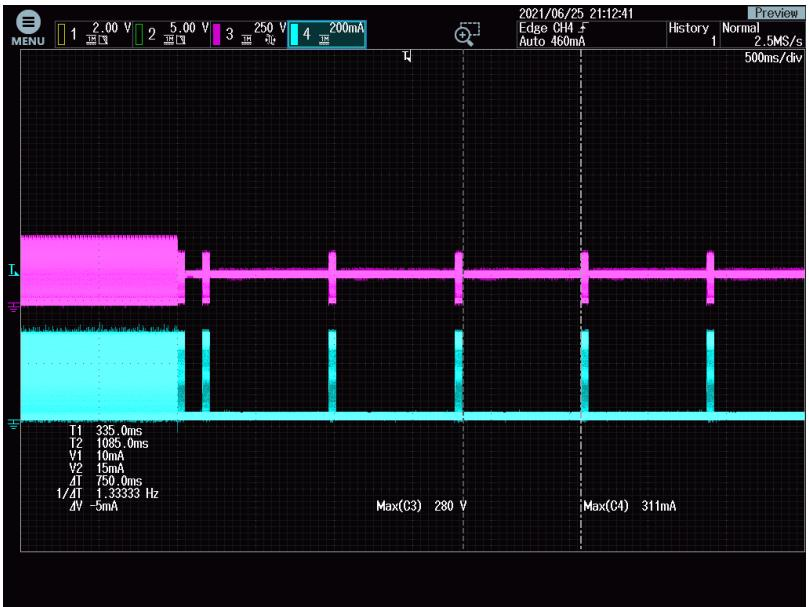

85 VAC

CH3 VDS  
CH4 ID

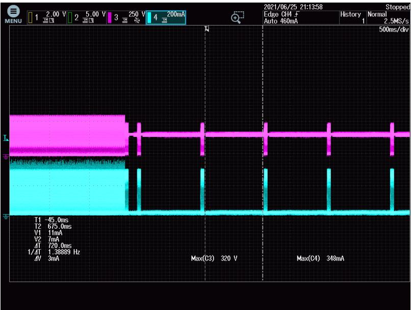

115 VAC

CH3 VDS  
CH4 ID

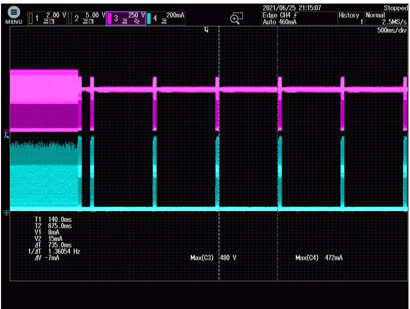

230 VAC

CH3 VDS  
CH4 ID

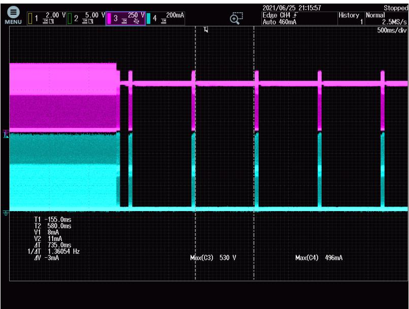

265 VAC

CH3 VDS  
CH4 ID

## 过零检测

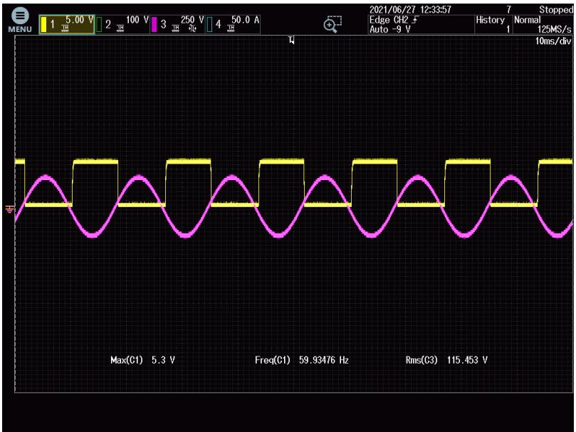

115 VAC

CH1  
CH3 VINNAC

Test Condition:  
➢ No Load  
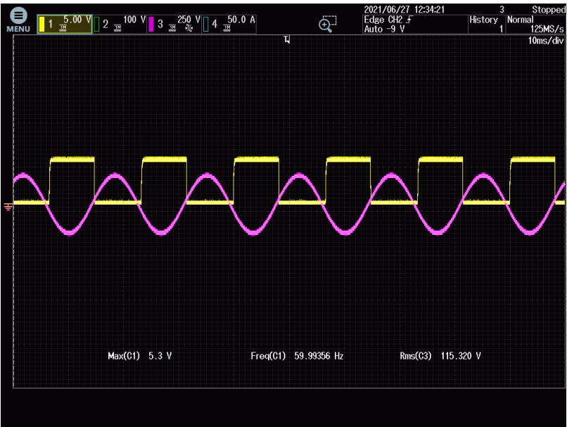

115 VAC

CH1  
CH3 VINNAC

Test Condition:  
➢ Full Load  
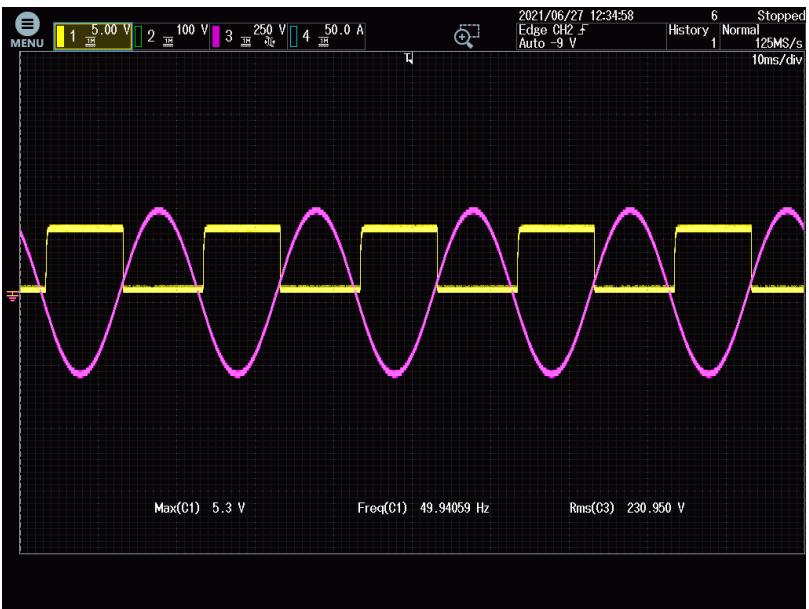

230 VAC

CH1  
CH3 VINNAC

Test Condition:  
➢ No Load  
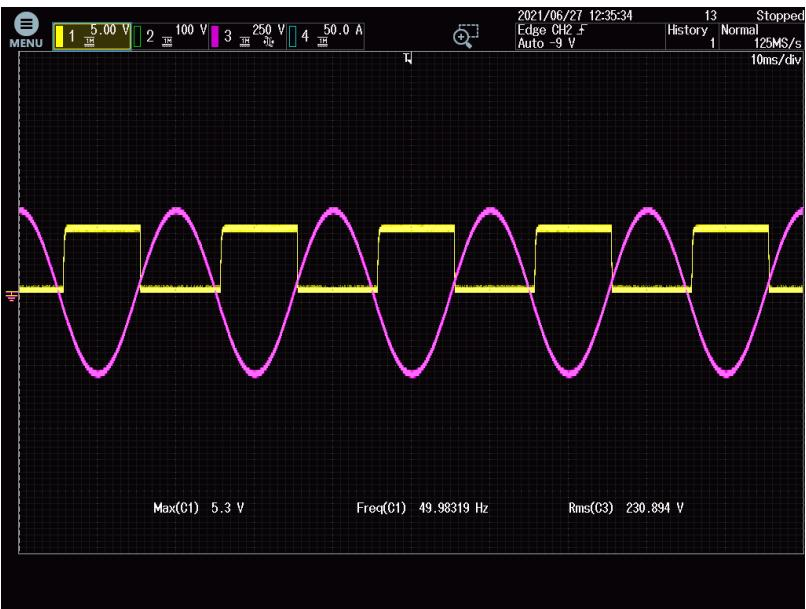

230 VAC

CH1  
CH3 VINNAC

Test Condition:

➢ Full Load

<table><tr><td rowspan="2">项目</td><td colspan="2">85VAC</td><td colspan="2">265VAC</td></tr><tr><td>温度(°C)</td><td>温升(°C)</td><td>温度(°C)</td><td>温升(°C)</td></tr><tr><td>环境温度</td><td colspan="2">30.4</td><td colspan="2">29.85</td></tr><tr><td>BPA8604P (U1)</td><td>88.85</td><td>58.45</td><td>75.45</td><td>45.6</td></tr><tr><td>变压器绕组 (T1)</td><td>57.89</td><td>27.49</td><td>59.09</td><td>29.24</td></tr><tr><td>变压器磁芯 (T1)</td><td>58.61</td><td>28.21</td><td>60.85</td><td>31</td></tr><tr><td>输出肖特基 (D7)</td><td>64.79</td><td>34.39</td><td>64.85</td><td>35</td></tr><tr><td>输出肖特基 (D5)</td><td>59.04</td><td>28.64</td><td>59.21</td><td>29.36</td></tr><tr><td>输入电解电容(EC2)</td><td>56.08</td><td>25.68</td><td>49.96</td><td>20.11</td></tr><tr><td>输出电解电容(EC5)</td><td>53.32</td><td>22.92</td><td>53.63</td><td>23.78</td></tr></table>

## 测试说明

➢ 在温箱中进行测试  
➢ 电路板放在一个封闭的盒子内  
➢ 热电偶连接到各个测量点  
➢ 等测量点温度达到稳定后记录数据

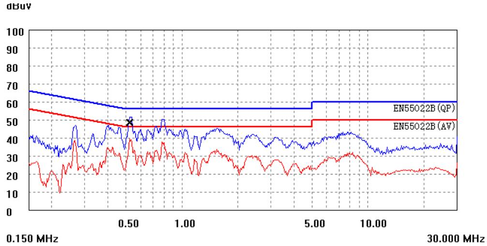

115VAC Line  
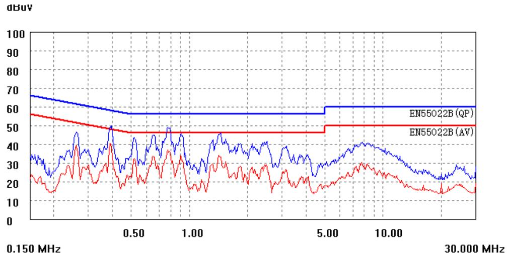

230VAC Line

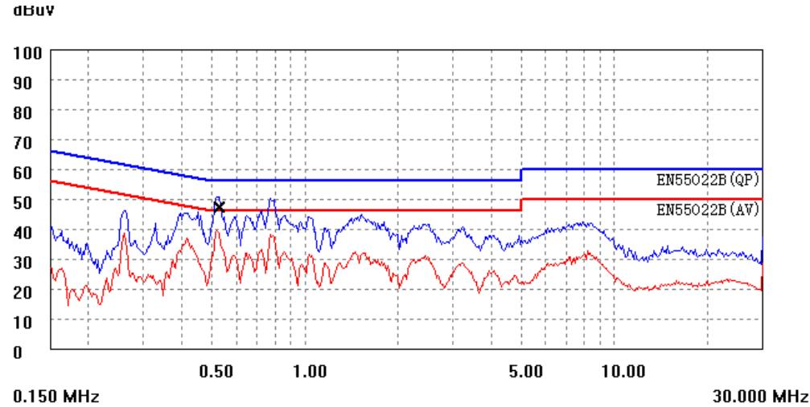

115VAC Neutral

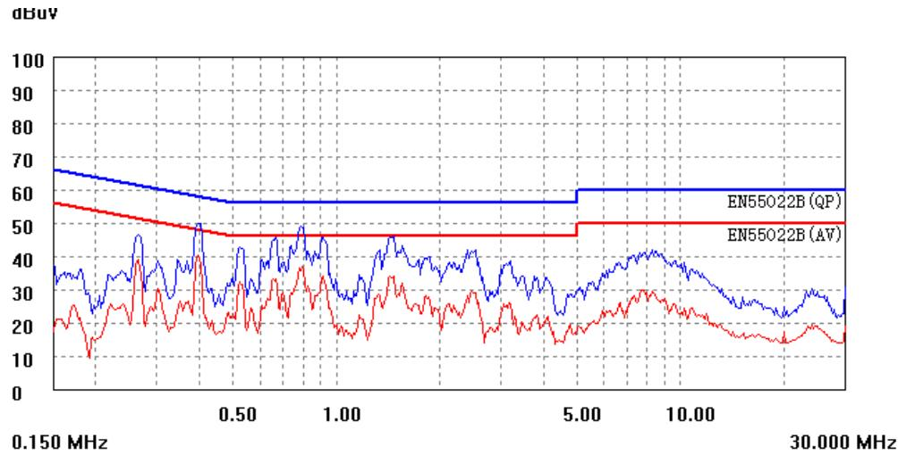

230VAC Neutral

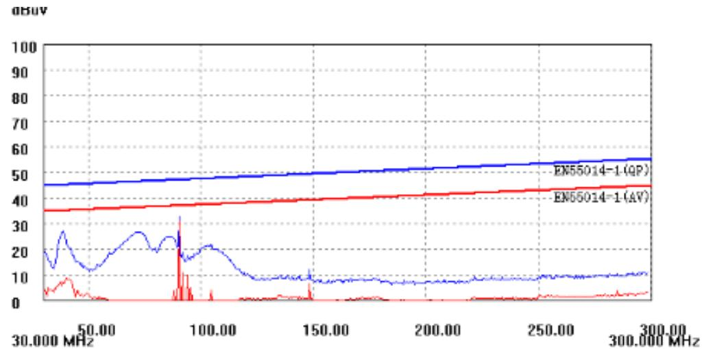

115VAC 空载

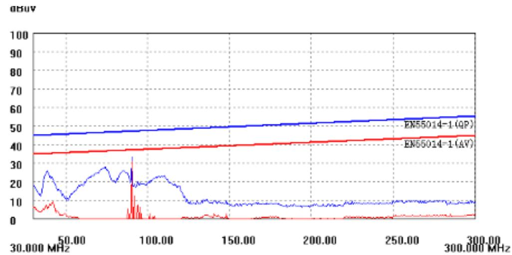

230VAC 空载

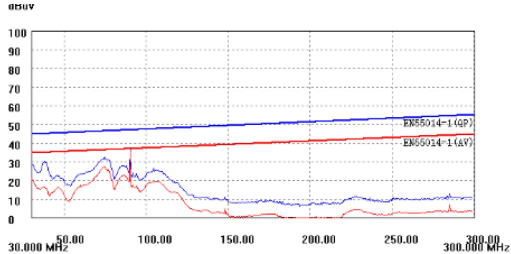

115VAC 满载

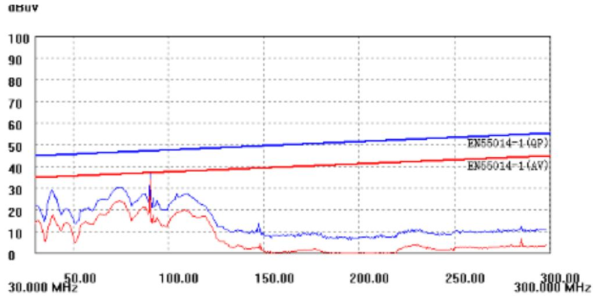

230VAC 满载

<table><tr><td>差模</td><td>电压</td><td>相位角</td><td>发生器阻抗</td><td>测试次数</td><td>测试结果</td></tr><tr><td>L to N</td><td>+2kV</td><td>0</td><td>2</td><td>10</td><td>Pass</td></tr><tr><td>L to N</td><td>-2kV</td><td>0</td><td>2</td><td>10</td><td>Pass</td></tr><tr><td>L to N</td><td>+2kV</td><td>90</td><td>2</td><td>10</td><td>Pass</td></tr><tr><td>L to N</td><td>-2kV</td><td>90</td><td>2</td><td>10</td><td>Pass</td></tr><tr><td>L to N</td><td>+2kV</td><td>180</td><td>2</td><td>10</td><td>Pass</td></tr><tr><td>L to N</td><td>-2kV</td><td>180</td><td>2</td><td>10</td><td>Pass</td></tr><tr><td>L to N</td><td>+2kV</td><td>270</td><td>2</td><td>10</td><td>Pass</td></tr><tr><td>L to N</td><td>-2kV</td><td>270</td><td>2</td><td>10</td><td>Pass</td></tr></table>

## ◼ 测试说明

➢ 按照GB/T17626.5和IEC61000-4-5的最新版本要求进行测试  
➢ 室温环境，230VAC输入，满载条件  
➢ 输入1.2/50us组合波浪涌电压  
➢ 每个测试点重复10次  
➢ 每次间隔时间1分钟  
➢ 试验时样机输出正常（符合A类标准）视为Pass

<table><tr><td>差模</td><td>电压</td><td>脉冲群持续时间</td><td>脉冲频率</td><td>测试时间</td><td>测试结果</td></tr><tr><td>L to N</td><td>+4kV</td><td>15ms</td><td>5kHz</td><td>120s</td><td>Pass</td></tr><tr><td>L to N</td><td>-4kV</td><td>15ms</td><td>5kHz</td><td>120s</td><td>Pass</td></tr><tr><td>L to N</td><td>+4kV</td><td>0.75ms</td><td>100kHz</td><td>120s</td><td>Pass</td></tr><tr><td>L to N</td><td>-4kV</td><td>0.75ms</td><td>100kHz</td><td>120s</td><td>Pass</td></tr><tr><td>L to N</td><td>+2kV</td><td>2ms</td><td>38kHz</td><td>120s</td><td>Pass</td></tr><tr><td>L to N</td><td>-2kV</td><td>2ms</td><td>38kHz</td><td>120s</td><td>Pass</td></tr><tr><td>L to N</td><td>+4kV</td><td>2ms</td><td>38kHz</td><td>120s</td><td>Pass</td></tr><tr><td>L to N</td><td>-4kV</td><td>2ms</td><td>38kHz</td><td>120s</td><td>Pass</td></tr></table>

## 测试说明

➢ 按照GB/T17626.4和IEC61000-4-4的最新版本要求进行测试  
➢ 室温环境，230VAC输入满载条件  
➢ 分别测试5kHz/100kHz/38kHz脉冲频率  
➢ 脉冲群周期为300ms  
➢ 每个测试条件测试时间120s  
➢ 试验时样机输出正常（符合A类标准）视为Pass

## THANK YOU FOR WATCHING
