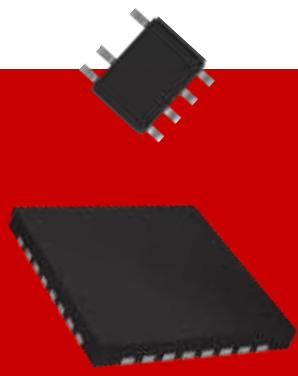
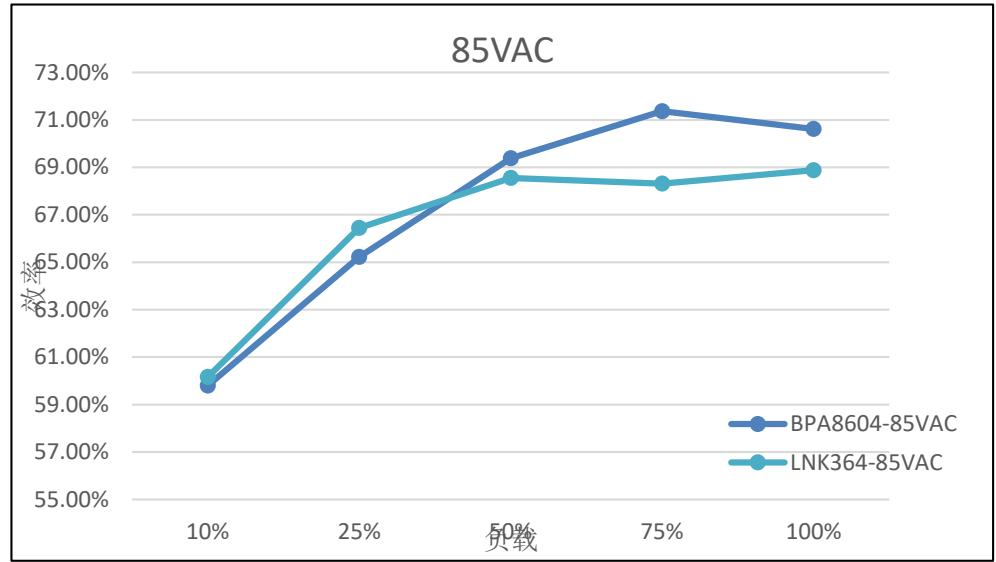
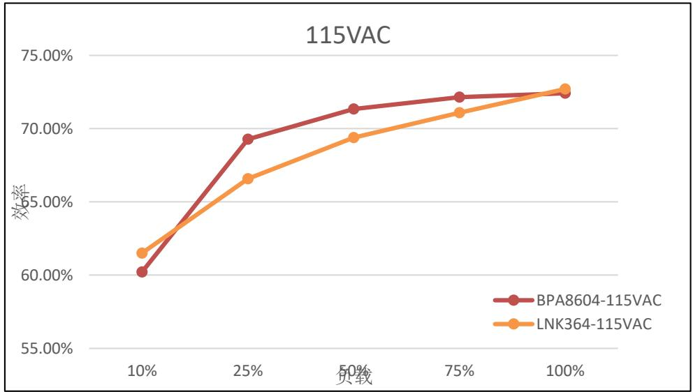
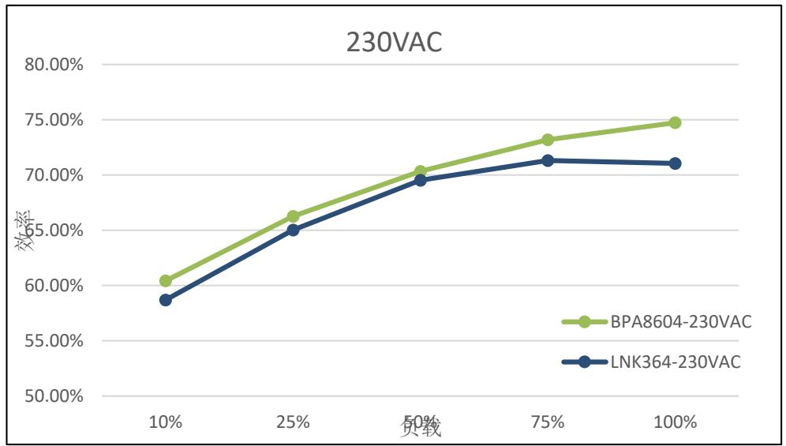
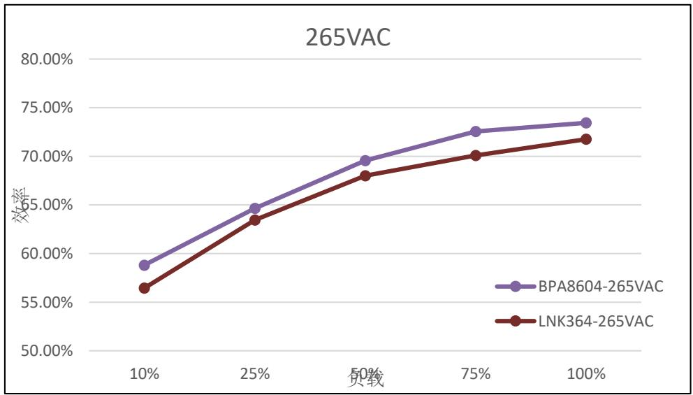
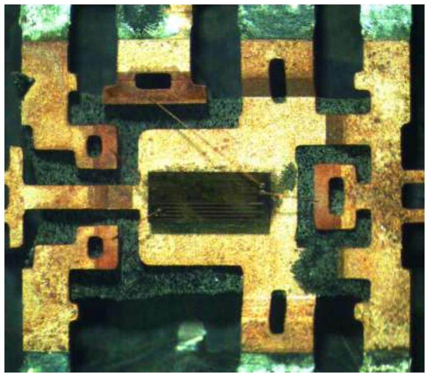
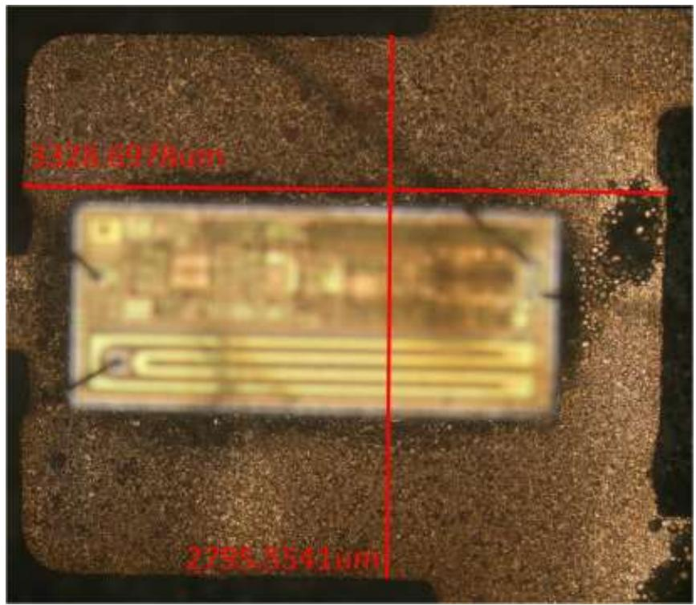

## 温升过高

上海晶丰明源半导体股份有限公司

Shanghai Bright Power Semiconductor Co., Ltd.

WHX

时间： 2021年5月

问题描述：与LNK364对比，在效率基本相同的条件下，BPA8604的温升更高

问题原因：两颗芯片的散热有差异，BPA8604散热只有2个脚，LNK364散热有4个脚

室温下在不同输入电压满载条件下测试芯片的温度，BPA8604温度更高

<table><tr><td>输入电压(VAC)</td><td>85</td><td>115</td><td>230</td><td>265</td></tr><tr><td>BPA8604温度</td><td>78.52</td><td>69.5</td><td>56.08</td><td>57.84</td></tr><tr><td>LNK364温度</td><td>74.49</td><td>64.16</td><td>52.39</td><td>55.79</td></tr><tr><td>ΔT(°C)</td><td>4.03</td><td>5.34</td><td>3.69</td><td>2.05</td></tr></table>

LNK364开盖结果

