## BPA8616D 替换 TNY285D对比测试报告

(12V/0.3A 6V/0.05A -15V/0.1A)

上海晶丰明源半导体股份有限公司

Shanghai Bright Power Semiconductor Co., Ltd.

陈耀兵

2021/05/05

## 内容

电路及实物图  
性能测试对比  
结论

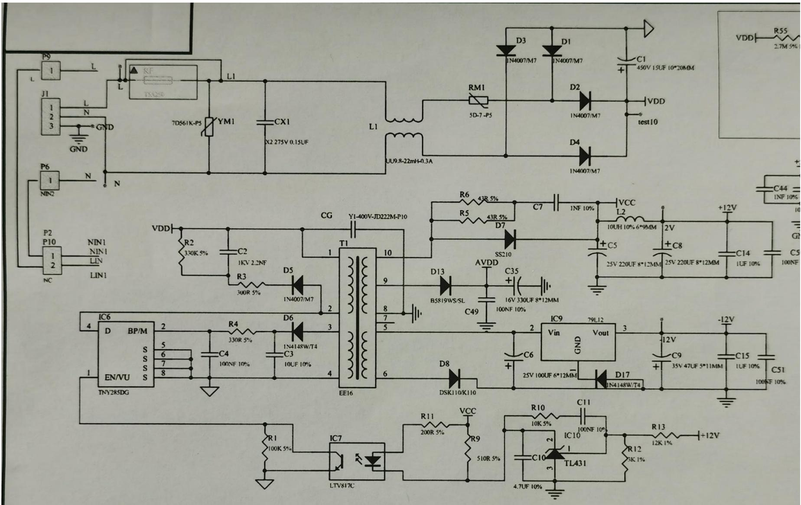

BPA8616D还需更改了以下几点：

变压器设计更改  
R4 6.2K 0805  
R10 1K 0805  
IC7 PC817A (或不更改光耦，但 R11 0.1uF/50V 0805

## 元件面

## 贴片面

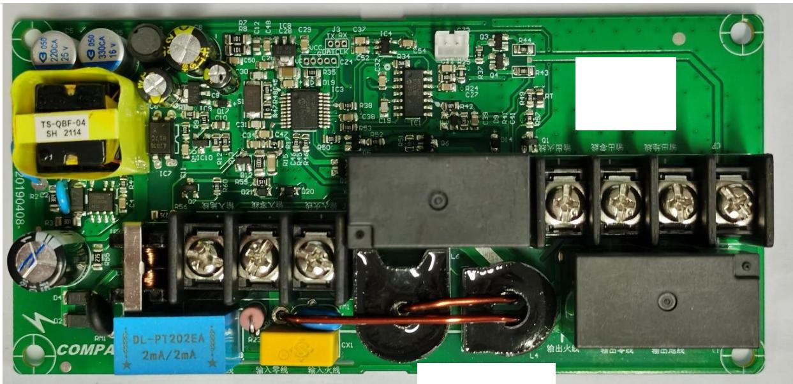

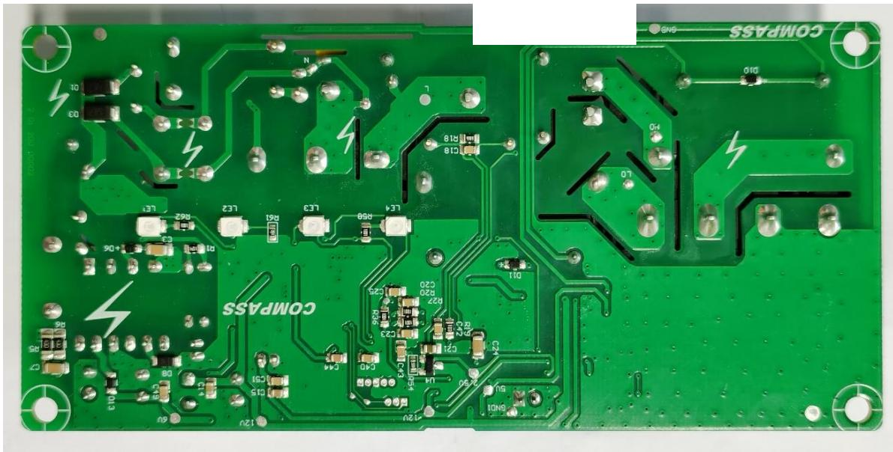

## 输入功率数据对比

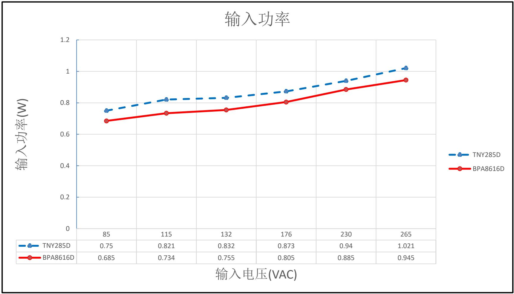

测试条件：带客户板上负载

效率曲线  
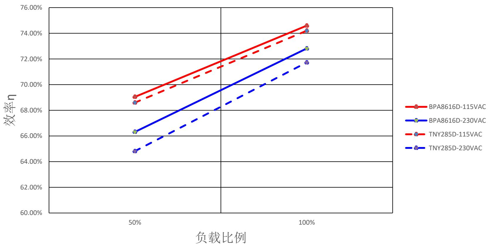

测试时未考虑客户板本身的负载。

## 输出电压交叉调整率

◼ BPA8616D

<table><tr><td> $V_{IN}(VAC)$  $I_{OUT}(A)$ </td><td></td><td>12V</td><td>6V</td><td>-12V</td></tr><tr><td rowspan="4"> $I_{O12V}=0A$  $I_{O6V}=0A$  $I_{O-12V}=0A$ </td><td>85VAC</td><td>12.43</td><td>6.016</td><td>15.787</td></tr><tr><td>115VAC</td><td>12.43</td><td>6.017</td><td>15.772</td></tr><tr><td>230VAC</td><td>12.43</td><td>6.022</td><td>15.777</td></tr><tr><td>265VAC</td><td>12.43</td><td>6.018</td><td>15.805</td></tr><tr><td rowspan="4"> $I_{O12V}=0.3A$  $I_{O6V}=0A$  $I_{O-12V}=0A$ </td><td>85VAC</td><td>12.426</td><td>6.486</td><td>18.873</td></tr><tr><td>115VAC</td><td>12.426</td><td>6.492</td><td>18.652</td></tr><tr><td>230VAC</td><td>12.426</td><td>6.37</td><td>18.774</td></tr><tr><td>265VAC</td><td>12.425</td><td>6.3193</td><td>18.803</td></tr><tr><td rowspan="4"> $I_{O12V}=0A$  $I_{O6V}=0.05A$  $I_{O-12V}=0.1A$ </td><td>85VAC</td><td>12.429</td><td>5.969</td><td>14.966</td></tr><tr><td>115VAC</td><td>12.429</td><td>5.973</td><td>14.946</td></tr><tr><td>230VAC</td><td>12.43</td><td>5.929</td><td>14.937</td></tr><tr><td>265VAC</td><td>12.43</td><td>5.926</td><td>14.915</td></tr><tr><td rowspan="4"> $I_{O12V}=0.3A$  $I_{O6V}=0.05A$  $I_{O-12V}=0.1A$ </td><td>85VAC</td><td>12.425</td><td>6.235</td><td>15.814</td></tr><tr><td>115VAC</td><td>12.426</td><td>6.235</td><td>15.772</td></tr><tr><td>230VAC</td><td>12.425</td><td>6.205</td><td>15.757</td></tr><tr><td>265VAC</td><td>12.426</td><td>6.1917</td><td>15.759</td></tr></table>

测试条件：Io=0A为只带客户板上负载

TNY285D

<table><tr><td> $V_{IN}(VAC)$  $I_{OUT}(A)$ </td><td></td><td>12V</td><td>6V</td><td>-12V</td></tr><tr><td rowspan="4"> $I_{O12V}=0A$  $I_{O6V}=0A$  $I_{O-12V}=0A$ </td><td>85VAC</td><td>12.43</td><td>6.02</td><td>15.84</td></tr><tr><td>115VAC</td><td>12.43</td><td>6.02</td><td>15.868</td></tr><tr><td>230VAC</td><td>12.43</td><td>6.014</td><td>15.899</td></tr><tr><td>265VAC</td><td>12.43</td><td>6.01</td><td>15.9</td></tr><tr><td rowspan="4"> $I_{O12V}=0.3A$  $I_{O6V}=0A$  $I_{O-12V}=0A$ </td><td>85VAC</td><td>12.426</td><td>6.241</td><td>18.227</td></tr><tr><td>115VAC</td><td>12.426</td><td>6.2406</td><td>18.18</td></tr><tr><td>230VAC</td><td>12.426</td><td>6.24</td><td>18.1</td></tr><tr><td>265VAC</td><td>12.425</td><td>6.2425</td><td>18.13</td></tr><tr><td rowspan="4"> $I_{O12V}=0A$  $I_{O6V}=0.05A$  $I_{O-12V}=0.1A$ </td><td>85VAC</td><td>12.429</td><td>5.985</td><td>15.03</td></tr><tr><td>115VAC</td><td>12.429</td><td>5.983</td><td>15.03</td></tr><tr><td>230VAC</td><td>12.43</td><td>5.975</td><td>15.008</td></tr><tr><td>265VAC</td><td>12.43</td><td>5.971</td><td>14.996</td></tr><tr><td rowspan="4"> $I_{O12V}=0.3A$  $I_{O6V}=0.05A$  $I_{O-12V}=0.1A$ </td><td>85VAC</td><td>12.425</td><td>6.169</td><td>15.8</td></tr><tr><td>115VAC</td><td>12.426</td><td>6.172</td><td>15.753</td></tr><tr><td>230VAC</td><td>12.425</td><td>6.173</td><td>15.73</td></tr><tr><td>265VAC</td><td>12.426</td><td>6.173</td><td>15.73</td></tr></table>

测试条件：Io=0A为只带客户板上负载

## 输出电压纹波 (12V)

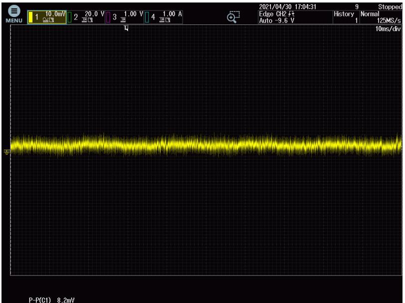

BPA8616D

85 VAC  
  
Test Condition:  
➢ NO Load

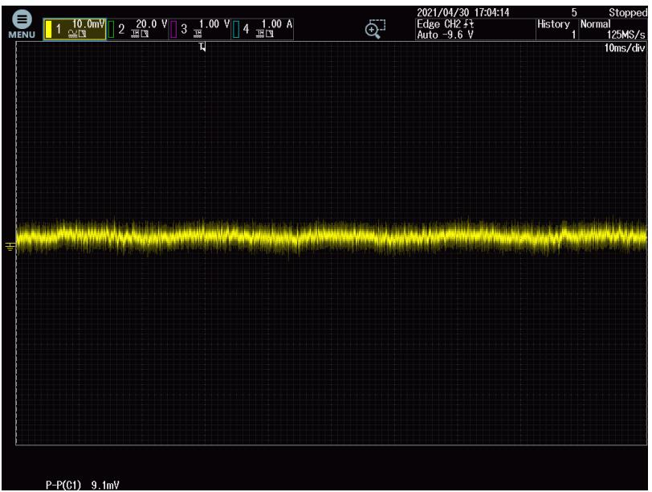

BPA8616D

265 VAC  
  
Test Condition:  
➢ NO Load

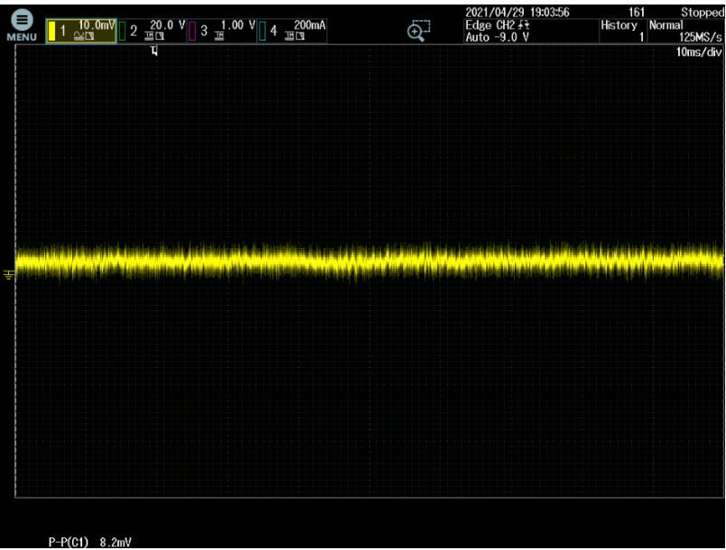

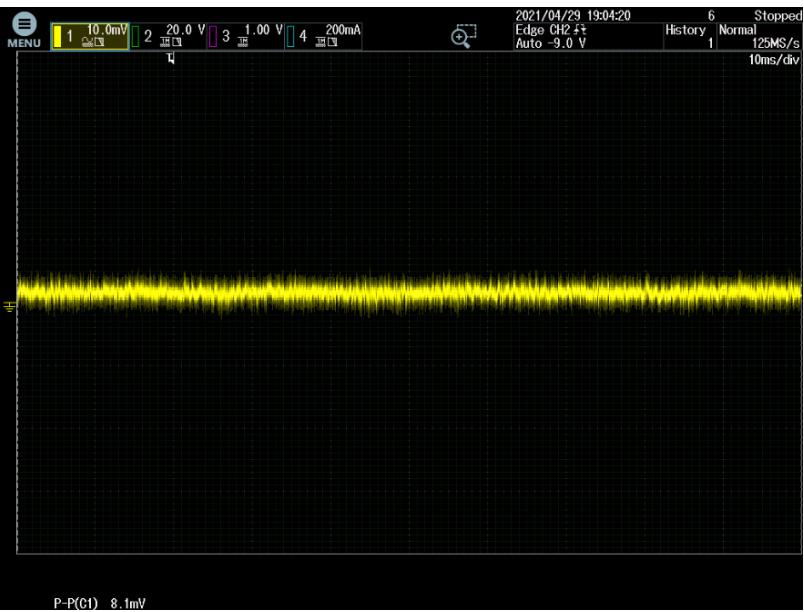

## TNY285D

85 VAC  
  
Test Condition:  
➢ NO Load

TNY285D  
265 VAC  
  
Test Condition:  
➢ NO Load

## 输出电压纹波 (12V)

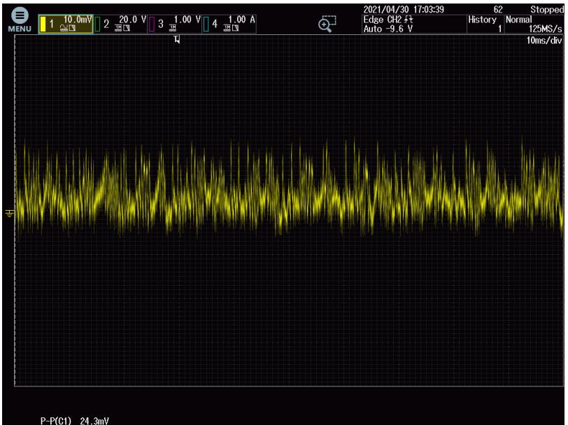

BPA8616D

85 VAC  
  
Test Condition:  
➢ Full Load

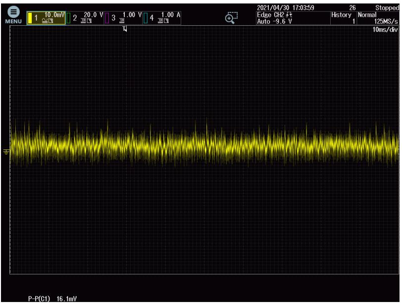

BPA8616D

265 VAC  
  
Test Condition:  
➢ Full Load

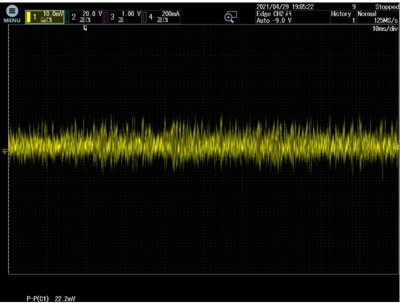

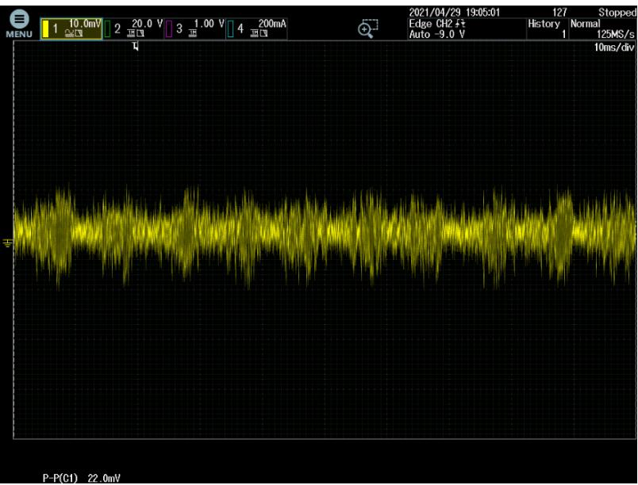

## TNY285D

85 VAC  
  
Test Condition:  
➢ Full Load

TNY285D  
265 VAC  
  
Test Condition:  
➢ Full Load

## 输出电压纹波 (6V)

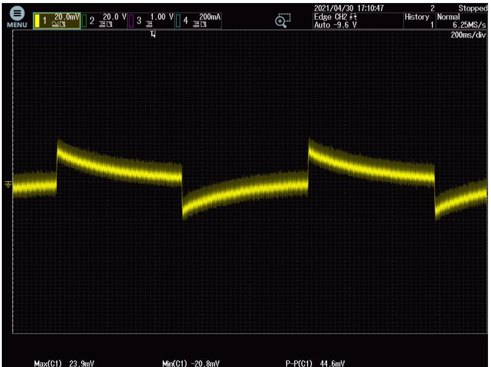

## BPA8616D

85 VAC

CH1 $\mathsf { V } _ { \mathsf { O U T } }$ Ripple $V _ { P K - P K } = 4 4 . 6 m V$

## Test Condition:

➢ NO Load

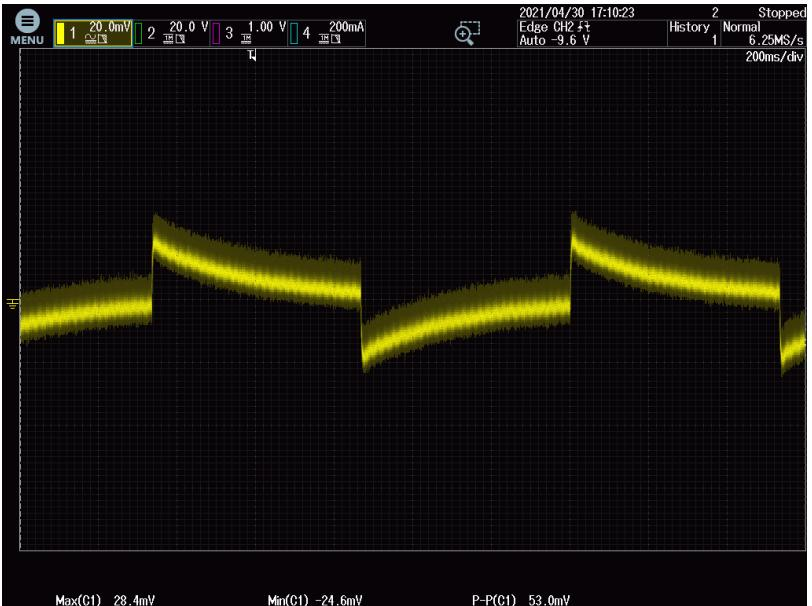

## BPA8616D

265 $\mathsf { v } _ { \mathsf { A C } }$

$\begin{array} { r } { \mathsf { C H 1 V _ { \mathsf { O U T } } R i p p l e } } \\ { \mathsf { V _ { P K - P K } } { = } 5 3 \mathsf { m V } } \end{array}$

## Test Condition:

➢ NO Load

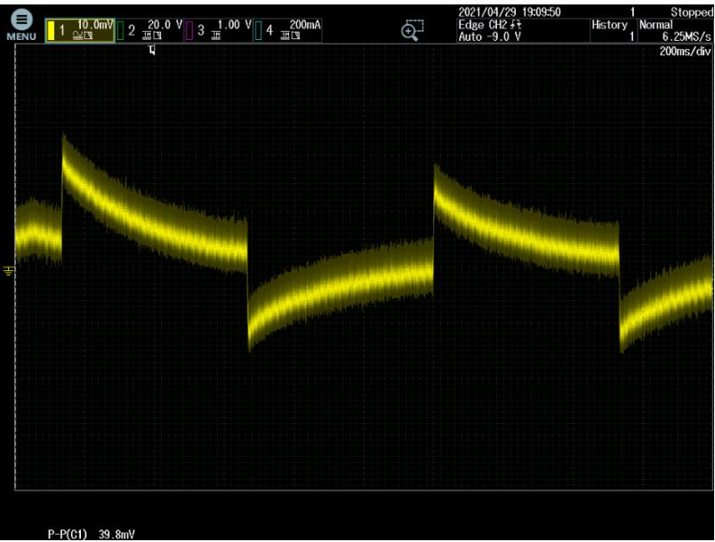

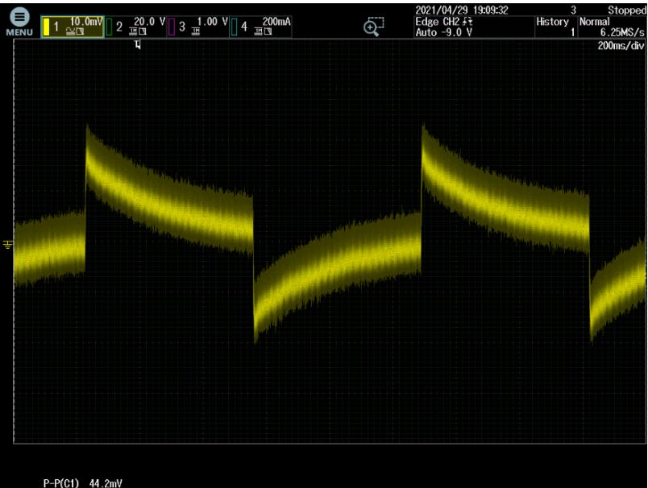

## TNY285D

85 VAC

CH1 $\mathsf { V } _ { \mathsf { O U T } }$ Ripple $V _ { \mathsf { P K - P K } } = 3 9 . 8 \mathsf { m V }$

## Test Condition:

➢ NO Load

## TNY285D

265 $\mathsf { v } _ { \mathsf { A C } }$

$\begin{array} { r } { \mathsf { C H 1 V _ { o u T } R i p p l e } } \\ { \mathsf { V _ { P K - P K } } { = } 4 4 . 2 \mathsf { m v } } \end{array}$

## Test Condition:

➢ NO Load

## 输出电压纹波 (6V)

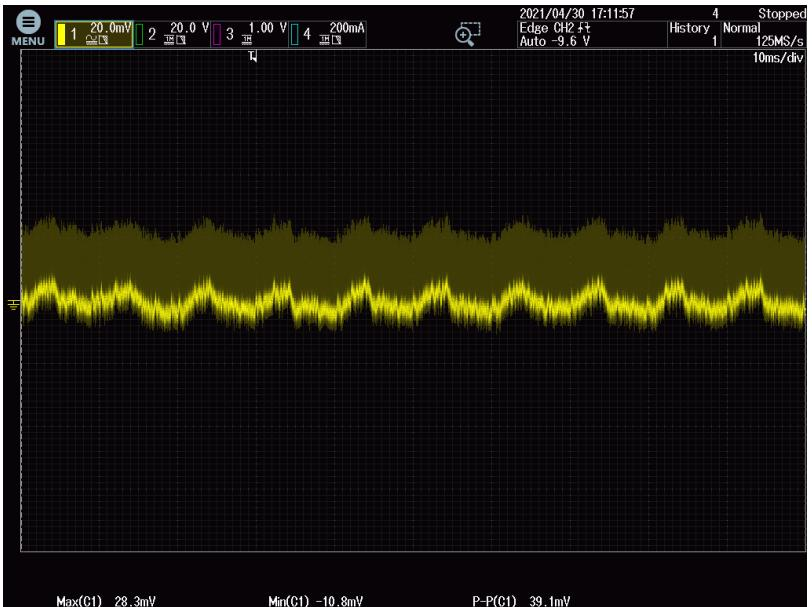

BPA8616D

85 VAC  
  
Test Condition:  
➢ Full Load

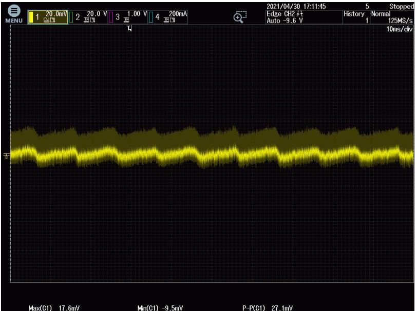

BPA8616D

265 VAC  
  
Test Condition:  
➢ Full Load

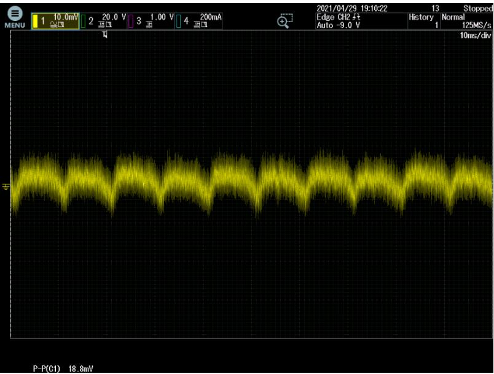

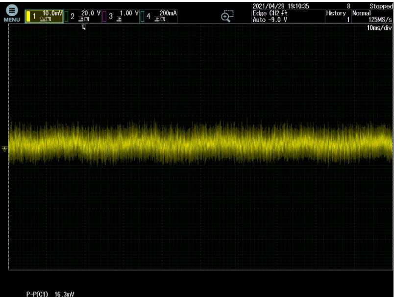

TNY285D  
85 VAC  
  
Test Condition:  
➢ Full Load

TNY285D  
265 VAC  
  
Test Condition:  
➢ Full Load

## 12V

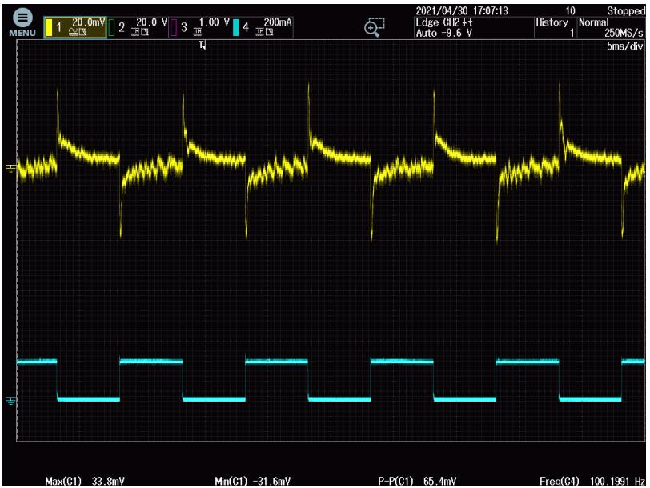

## BPA8616D

85 VAC

${ \mathsf { C H 1 } } { \mathsf { V } } _ { \mathsf { O U T } }$ $V _ { \mathsf { P K - P K } } { = } 6 5 . 4 \mathsf { m V }$  
$\mathsf { C H 4 } \mathsf { I } _ { \mathsf { O U T } }$

## Test Condition:

➢ 12V 0 A-0.15 A-0 A  
➢ 6V -12V 0A  
➢ Slew Rate: 0.5 A/μS  
➢ Frequency: 100 Hz

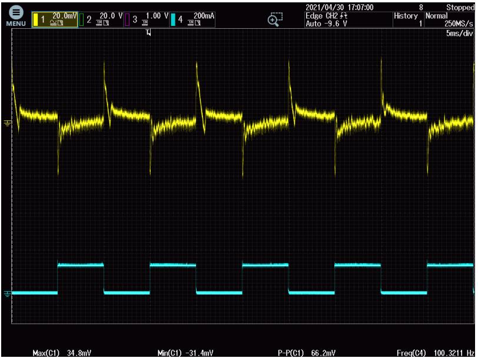

## BPA8616D

265 VAC

CH1 $\mathsf { V } _ { \mathsf { O U T } }$ $V _ { \mathsf { P K - P K } } { = } 6 6 . 2 \mathsf { m V }$  
CH4 ${ \mathsf I } _ { 0 \mathsf U \top }$

## Test Condition:

➢ 12V 0 A-0.15 A-0 A  
➢ 6V -12V 0A  
➢ Slew Rate: 0.5 A/μS  
➢ Frequency: 100 Hz

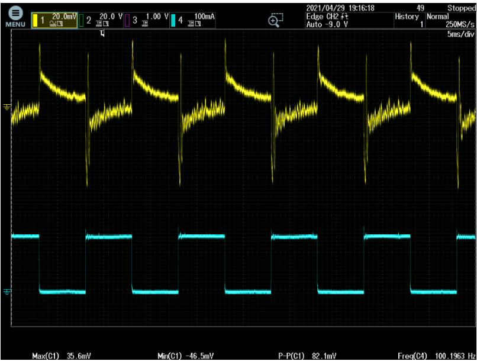

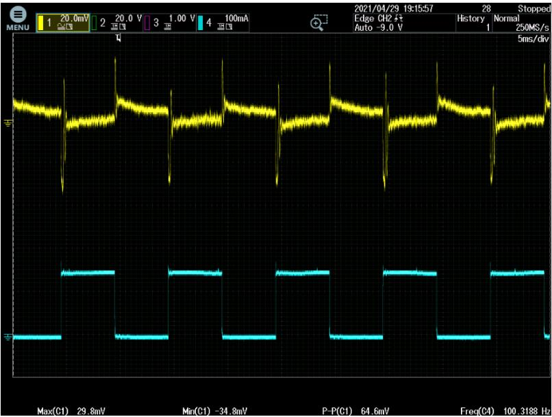

## TNY285D

85 VAC

${ \mathsf { C H 1 } } { \mathsf { V } } _ { \mathsf { O U T } }$ $V _ { \mathsf { P K - P K } } = 8 2 . 1 \mathsf { m V }$  
$\mathsf { C H 4 } \mathsf { I } _ { \mathsf { O U T } }$

## Test Condition:

➢ 12V 0 A-0.15 A-0 A  
➢ 6V -12V 0A  
➢ Slew Rate: 0.5 A/μS  
➢ Frequency: 100 Hz

## TNY285D

265 VAC

CH1 $\mathsf { V } _ { \mathsf { O U T } }$ $V _ { p | c - P K } = 6 4 . 6 m v$  
$\mathsf { C H 4 } \mathsf { I } _ { \mathsf { O U T } }$

## Test Condition:

➢ 12V 0 A-0.15 A-0 A  
➢ 6V -12V 0A  
➢ Slew Rate: 0.5 A/μS  
➢ Frequency: 100 Hz

## 动态负载 (6V)

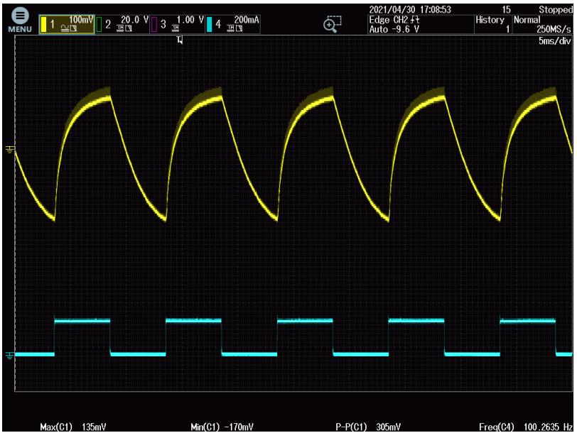

## BPA8616D

85 VAC

${ \mathsf { C H 1 } } { \mathsf { V } } _ { \mathsf { O U T } }$ $V _ { \mathsf { P K - P K } } { = } 3 0 5 ~ \mathsf { m V }$  
$\mathsf { C H 4 } \mathsf { I } _ { \mathsf { O U T } }$

## Test Condition:

➢ 12V 0 A-0.15 A-0 A  
➢ 6V -12V 0A  
➢ Slew Rate: 0.5 A/μS  
➢ Frequency: 100 Hz

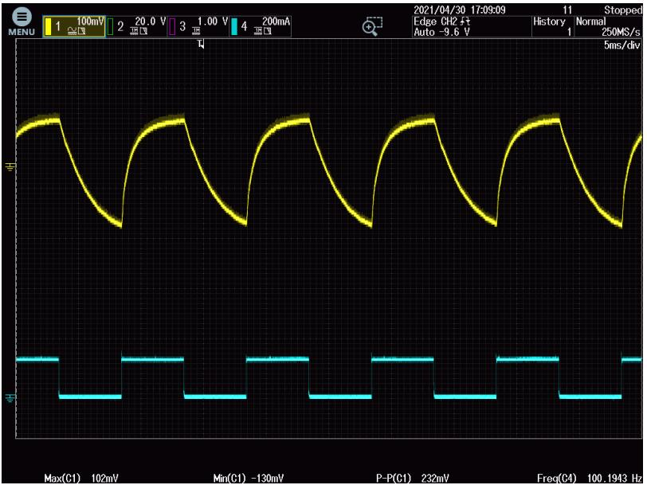

## BPA8616D

265 VAC

CH1 $\mathsf { V } _ { \mathsf { O U T } }$ $v _ { p _ { \vert k - P K } } = 2 3 2 m v$  
CH4 ${ \mathsf I } _ { 0 \mathsf U \top }$

## Test Condition:

➢ 12V 0 A-0.15 A-0 A  
➢ 6V -12V 0A  
➢ Slew Rate: 0.5 A/μS  
➢ Frequency: 100 Hz

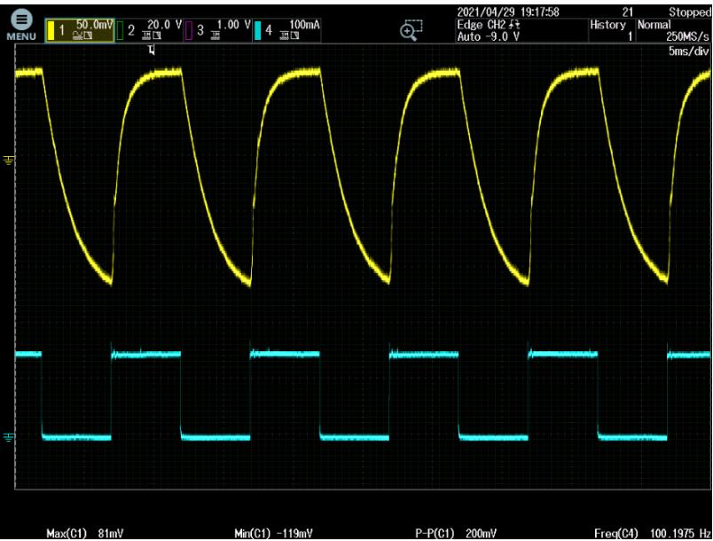

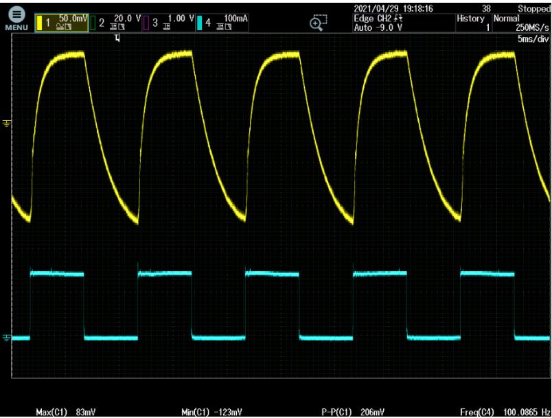

## TNY285D

85 VAC

${ \mathsf { C H 1 } } { \mathsf { V } } _ { \mathsf { O U T } }$ $v _ { p _ { \vert k - P K } } = 2 0 0 ~ \mathsf { m v }$  
$\mathsf { C H 4 } \mathsf { I } _ { \mathsf { O U T } }$

## Test Condition:

➢ 12V 0 A-0.15 A-0 A  
➢ 6V -12V 0A  
➢ Slew Rate: 0.5 A/μS  
➢ Frequency: 100 Hz

## TNY285D

265 VAC

CH1 $\mathsf { V } _ { \mathsf { O U T } }$ $v _ { p _ { \mathrm { K - P K } } } = 2 0 6 ~ \mathsf { m v }$  
$\mathsf { C H 4 } \mathsf { I } _ { \mathsf { O U T } }$

## Test Condition:

➢ 12V 0 A-0.15 A-0 A  
➢ 6V -12V 0A  
➢ Slew Rate: 0.5 A/μS  
➢ Frequency: 100 Hz

## 输出电压开机波形(12V)

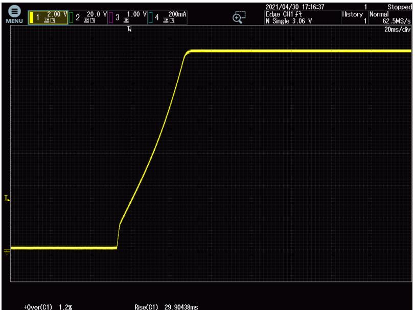

BPA8616D  
85 VAC  
CH1 V trise=29.9mS  
➢ NO Load

Test Condition:

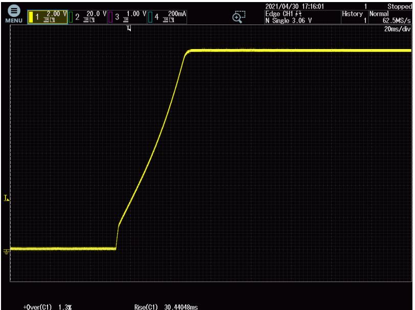

BPA8616D  
265 VAC  
CH1 VOUT t =30.4mS  
➢ NO Load

Test Condition:  
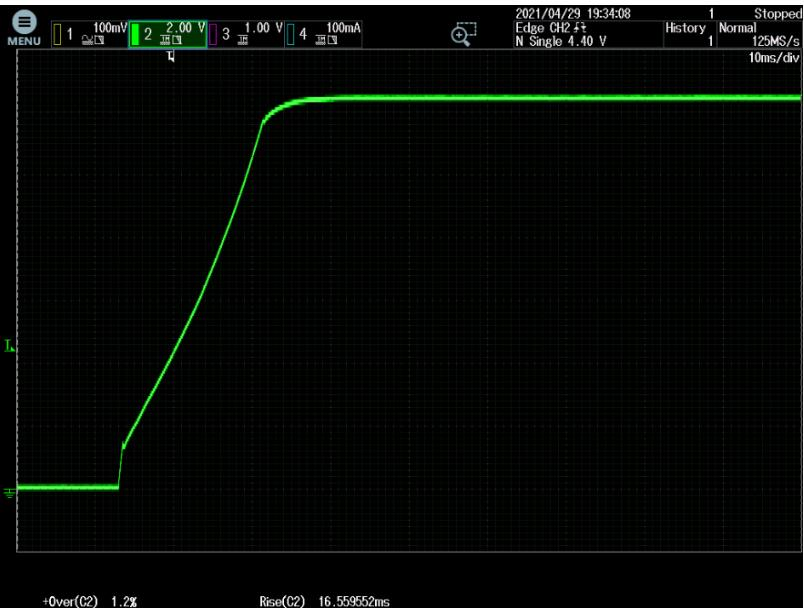

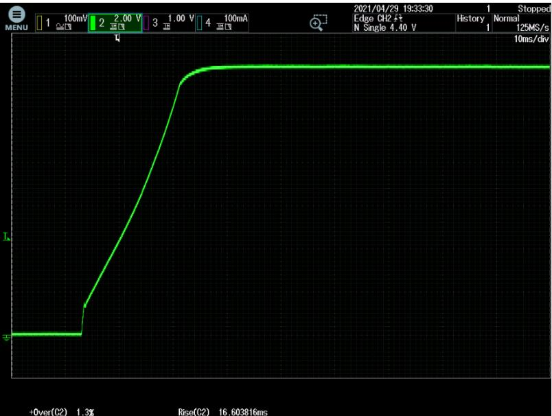

TNY285D  
85 VAC  
CH1 VOUT trise= 16.6 mS  
Test Condition:  
➢ NO Load

TNY285D

265 VAC

CH1 VOUT trise=16.6mS

Test Condition:

➢ NO Load

## 输出电压开机波形(12V)

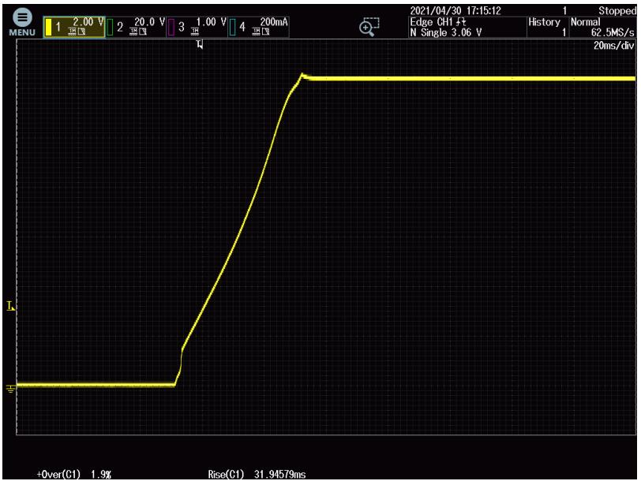

BPA8616D  
85 VAC  
CH1 VOUT trise= 31.9 mS  
➢ Full Load

Test Condition:

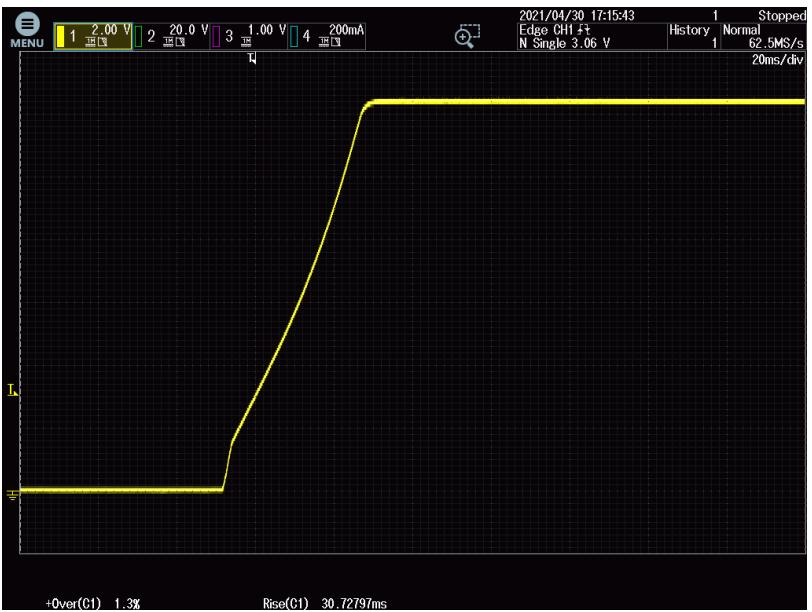

BPA8616D  
265 VAC  
CH1 VOUT t =30.7mS  
➢ Full Load

Test Condition:  
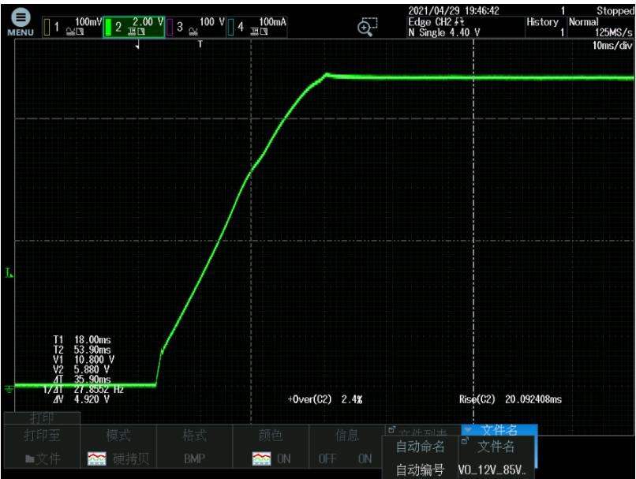

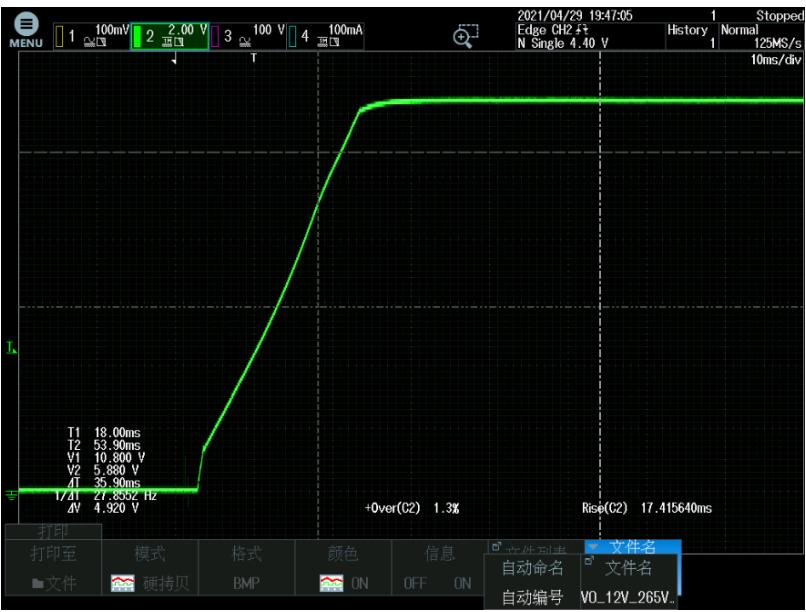

TNY285D  
85 VAC  
CH1 VOUT trise= 20.1 mS  
Test Condition:  
➢ Full Load

TNY285D

265 VAC

CH1 VOUT t = 17.4 mS

Test Condition:

➢ Full Load

## MOSFET

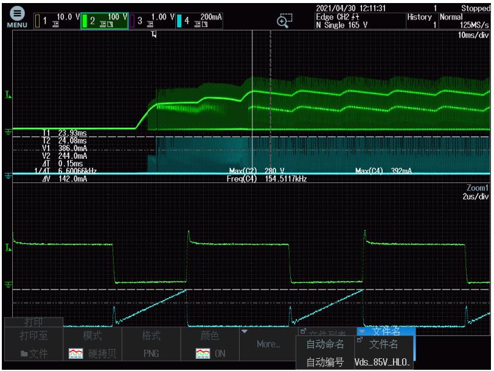

BPA8616D

85 VAC  
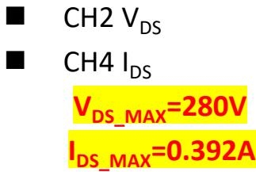

Test Condition:

➢ Full Load  
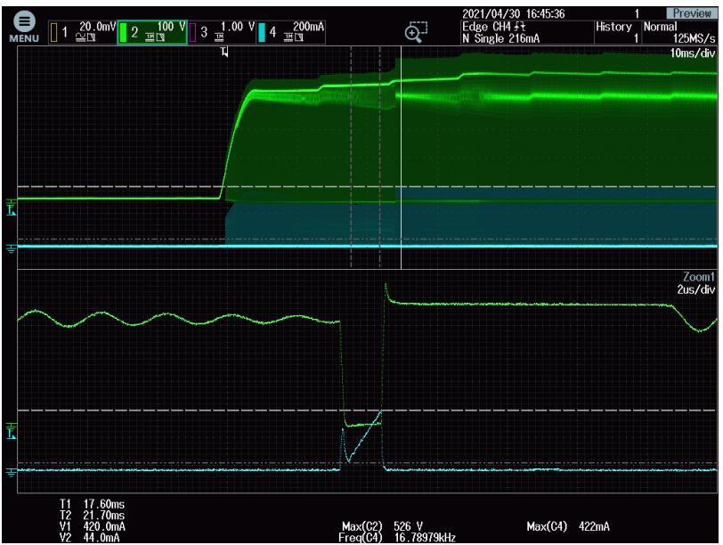

BPA8616D

265 VAC  

Test Condition:  
➢ Full Load

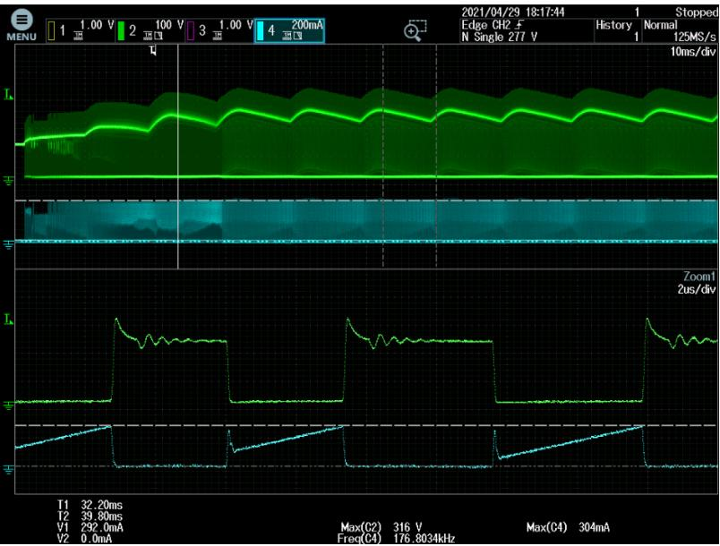

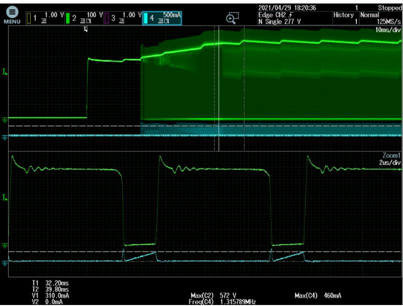

## TNY285D

85 VAC  

Test Condition:  
➢ Full Load

TNY285D  
265 VAC  
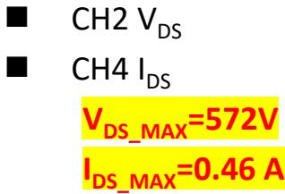

Test Condition:  
➢ Full Load

## MOSFET

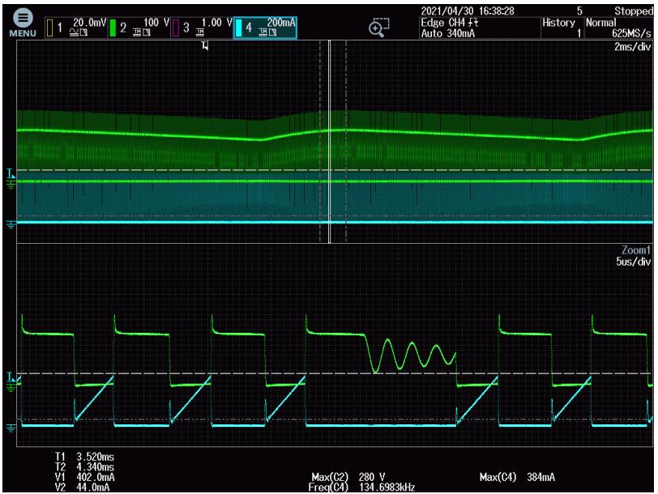

BPA8616D

85 VAC  
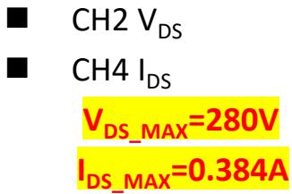

Test Condition:

➢ Full Load  
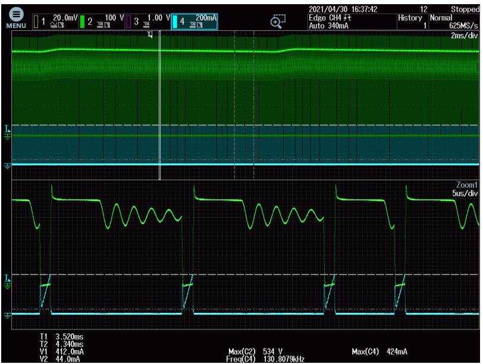

BPA8616D

265 VAC  
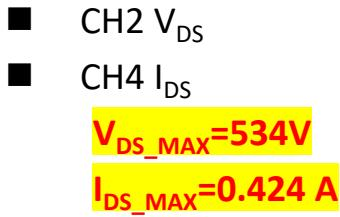

Test Condition:  
➢ Full Load

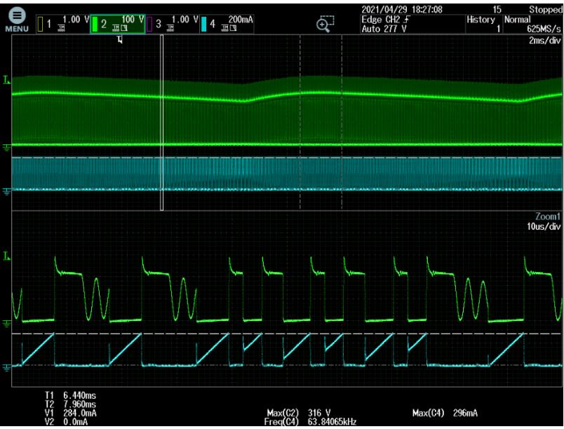

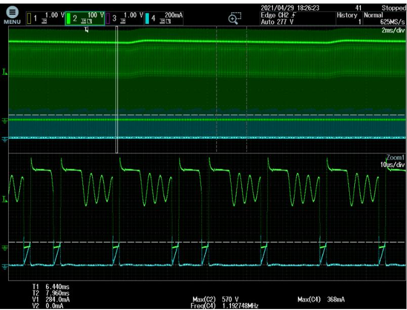

## TNY285D

85 VAC  
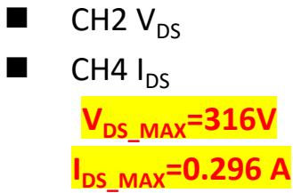

Test Condition:  
➢ Full Load

TNY285D  
265 VAC  


Test Condition:  
➢ Full Load

## 输出二极管开机电压波形（D7)


BPA8616D  
85 VAC  
CH2 VD  
$V _ { \mathsf { D } \_ M A X } = 3 8 V$  
➢ Full Load

Test Condition:

BPA8616D  
265 VAC  
CH2 VD  
$\mathsf { V } _ { \mathsf { D } \_ \mathsf { M A X } } { = } 8 1 . 2 \mathsf { V }$  
➢ Full Load

Test Condition:  


TNY285D  
85 VAC  
$ { \mathbb { ~ \mathbf { u } } } \quad \mathsf { C H 2 }  { \mathsf { V } } _ { \mathsf { D } }$  
$V _ { \mathsf { D } \_ \mathsf { M A X } } = 3 4 . 4 \mathsf { V }$  
Test Condition:  
➢ Full Load

TNY285D

$2 6 5 \ : \mathsf { V } _ { \mathsf { A C } }$

CH2 VD

$V _ { \mathsf { D } \_ \mathsf { M A X } } { = } 6 6 . 4 \mathsf { V }$

Test Condition:

➢ Full Load

## 输出二极管稳态电压波形 (D7)


BPA8616D  
85 VAC  
CH2 VD  
$V _ { \mathsf { D } \_ M A X } = 3 8 V$  
➢ Full Load

Test Condition:


BPA8616D  
265 VAC  
CH2 VD  
$\mathsf { V } _ { \mathsf { D } \_ \mathsf { M A X } } { = } 8 1 . 2 \mathsf { V }$  
➢ Full Load

Test Condition:  


TNY285D  
${ \tt S 5 V } _ { \sf A C }$  
CH2 VD  
$V _ { \mathsf { D } \_ \mathsf { M A X } } = 3 4 . 4 \mathsf { V }$  
Test Condition:  
➢ Full Load

TNY285D

$2 6 5 \ : \mathsf { V } _ { \mathsf { A C } }$

CH2 VD

$V _ { \sf D _ { \sf D } , M A X } = 6 6 . 2 \sf V$

Test Condition:

➢ Full Load

## 输出二极管电压波形（D13)


BPA8616D  
265 VAC  
$ { \mathtt { \_ m } } _ { \mathtt { D } 1 3 }$  
$V _ { \mathsf { D } \_ \mathsf { M A X } } { = } 3 9 . 4 \mathsf { V }$  
➢ Full Load  
稳态

Test Condition:


BPA8616D  
265 VAC  
CH2 VD13  
$V _ { \mathsf { D } \_ \mathsf { M A X } } = 3 9 . 4 \mathsf { V }$  
➢ Full Load  
➢ 开机

Test Condition:  


TNY285D  
$2 6 5 \mathsf { V } _ { \mathsf { A C } }$  
CH2 VD13  
$V _ { \mathsf { D } \_ M A X } = 3 2 . 4 \mathsf { V }$  
Test Condition:  
➢ Full Load  
稳态

TNY285D

265 VAC

$ { \mathtt { \_ m } } _ { \mathtt { D } 1 3 }$

$V _ { \mathsf { D } \_ M A X } = 3 2 . 4 \mathsf { V }$

Test Condition:

➢ Full Load

➢ 开机

## 输出二极管电压波形-D8


BPA8616D  
265 VAC  
CH2 VD13  
$V _ { \sf D , \sf M A X } { = } 9 6 . 9 \sf V$  
➢ Full Load  
稳态

Test Condition:


BPA8616D  
265 VAC  
CH2 VD13  
$V _ { \sf D _ { \sf D } , M A X } = 9 6 . 5 V$  
➢ Full Load  
➢ 开机

Test Condition:  


TNY285D  
$2 6 5 \mathsf { V } _ { \mathsf { A C } }$  
${ \mathsf { C H } } 2 { \mathsf { V } } _ { { \mathsf { D } } 1 3 }$  
$V _ { \sf D \_ M A X } { = } 7 6 . 8 V$  
Test Condition:  
➢ Full Load  
稳态

TNY285D

265 VAC

${ \mathsf { C H } } 2 { \mathsf { V } } _ { { \mathsf { D } } 1 3 }$

$V _ { \sf D \_ M A X } = 7 7 . 6 V$

Test Condition:

➢ Full Load

➢ 开机

## 输入过压保护 MOS


## BPA8616D

CH1 VDC\_IN  
CH2 $\mathsf { V } _ { \mathsf { d } s }$  
CH3 VO

$$
\begin{array}{l} \mathrm {V_ {ds\_MAX}} = 6 5 1 \mathrm{V} \\ \mathrm {V_ {DC\_IN}} = 5 5 0 \mathrm{V} \end{array}
$$

Test Condition:

➢ real Load

触发过压保护， MOS最高电压651V


## TNY285D

CH1 VDC\_IN  
CH2 $\mathsf { V } _ { \mathrm { d } s }$  
CH3 ${ \sf V } _ { 0 }$

$$
\begin{array}{l} \mathrm {V_ {ds\_MAX}} = 7 1 0 \mathrm{V} \\ \mathrm {V_ {DC\_IN}} = 5 5 0 \mathrm{V} \end{array}
$$

Test Condition:

➢ real Load

无过压保护， MOS最高电压710V， 超过额定值

## 输入欠压保护


BPA8616D

CH1 ${ \sf V } _ { 0 }$  
CH3 VAC\_IN $\mathsf { V } _ { \mathsf { A C \_ I N } }$  
$\mathsf { V } _ { \mathsf { A C \_ I N \_ s t a r t } } { = } 6 0 \mathsf { V }$

Test Condition:

➢ real Load

内置欠压保护， 启机电压60VAC


## TNY285D

CH1 ${ \sf V } _ { 0 }$  
CH3 VAC\_IN $\mathsf { C H 3 } \mathsf { V _ { A C \_ I N } }$

$\mathsf { V } _ { \mathsf { A C \_ I N \_ s t a r t } } { = } 1 6 \mathsf { V }$

Test Condition:

➢ real Load

无输入欠压保护， 16VAC左右就启机

◼ BPA8616D

<table><tr><td rowspan="2">项目</td><td>85VAC</td><td>265VAC</td></tr><tr><td>温度(°C)</td><td>温度(°C)</td></tr><tr><td>环境温度</td><td>85.3</td><td>86.2</td></tr><tr><td>BPA8616D (IC6)</td><td>99.1</td><td>106.5</td></tr><tr><td>变压器绕组(T1)</td><td>93.4</td><td>96.4</td></tr><tr><td>变压器磁芯(T1)</td><td>92.6</td><td>95.7</td></tr><tr><td>整流二极管(D7)</td><td>95.6</td><td>99.5</td></tr></table>

备注：增大芯片Source散热铜箔面积可以降低芯片温度  
12V 0.1A 6V -15V

TNY285D

<table><tr><td rowspan="2">项目</td><td>85VAC</td><td>265VAC</td></tr><tr><td>温度(°C)</td><td>温度(°C)</td></tr><tr><td>环境温度</td><td>86.6</td><td>85.1</td></tr><tr><td>BPA8616D (IC6)</td><td>99</td><td>105.5</td></tr><tr><td>变压器绕组(T1)</td><td>92.4</td><td>95.3</td></tr><tr><td>变压器磁芯(T1)</td><td>92.3</td><td>95.2</td></tr><tr><td>整流二极管(D7)</td><td>95.9</td><td>98.6</td></tr></table>

备注：增大芯片Source散热铜箔面积可以降低芯片温度  
12V 0.1A 6V -15V


115VAC Line BPA8616D  


115VAC Neutral BPA8616D


115VAC Line TNY285D


115VAC Neutral TNY285D


230VAC Line BPA8616D  


230VAC Neutral BPA8616D

230VAC Line TNY285D


230VAC Neutral TNY285D


115VAC BPA8616D  


230VAC BPA8616D


115VAC TNY285D  


230VAC TNY285D

BPA8616D

<table><tr><td></td><td>电压</td><td>相位角</td><td>发生器阻抗</td><td>测试次数</td><td>测试结果</td></tr><tr><td>L to N</td><td>±2kV</td><td>0,90,180,270</td><td>2</td><td>5</td><td>Pass</td></tr><tr><td>L to PE</td><td>±4kV</td><td>0,90,180,270</td><td>12</td><td>5</td><td>Pass</td></tr><tr><td>N to PE</td><td>±4kV</td><td>0,90,180,270</td><td>12</td><td>5</td><td>Pass</td></tr><tr><td>L+N to PE</td><td>±4kV</td><td>0,90,180,270</td><td>12</td><td>5</td><td>Pass</td></tr></table>

## 测试说明

➢ 按照GB/T17626.5和IEC61000-4-5的最新版本要求进行测试  
➢ 室温环境，230VAC输入，板上负载条件

TNY285D

<table><tr><td></td><td>电压</td><td>相位角</td><td>发生器阻抗</td><td>测试次数</td><td>测试结果</td></tr><tr><td>L to N</td><td>±2kV</td><td>0,90,180,270</td><td>2</td><td>5</td><td>Pass</td></tr><tr><td>L to PE</td><td>±4kV</td><td>0,90,180,270</td><td>12</td><td>5</td><td>Pass</td></tr><tr><td>N to PE</td><td>±4kV</td><td>0,90,180,270</td><td>12</td><td>5</td><td>Pass</td></tr><tr><td>L+N to PE</td><td>±4kV</td><td>0,90,180,270</td><td>12</td><td>5</td><td>Pass</td></tr></table>

## 测试说明

➢ 按照GB/T17626.5和IEC61000-4-5的最新版本要求进行测试  
➢ 室温环境，230VAC输入，板上负载条件

## ❑ 结论

BPA8616D TNY285D EMIBPA8616D CPS004-CALECA-V1.2保护，有重启现象。  
BPA8616D Pin to Pin TNY285D  
⚫ 需对应更改变压器设计 (不更改变压器型号，只更改内部绕制结构和电感量)  
R4 6.2K 0805  
R10 1K 0805  
PC817A R11 0.1uF/50V 0805  
D8 150V ( DSK115)  
➢ PCB设计问题已将更改建议提供给客户，但目前由于更改流程复杂暂未进行。

## THANK YOU FOR WATCHING
