## BPA8616D 替换 TNY286D对比测试报告

## 5V/0.3A 12V/0.4A 20V40mA)

上海晶丰明源半导体股份有限公司

Shanghai Bright Power Semiconductor Co., Ltd.

文长川

时间：2021/11/05

## 内容

电路及实物图  
性能测试对比  
结论

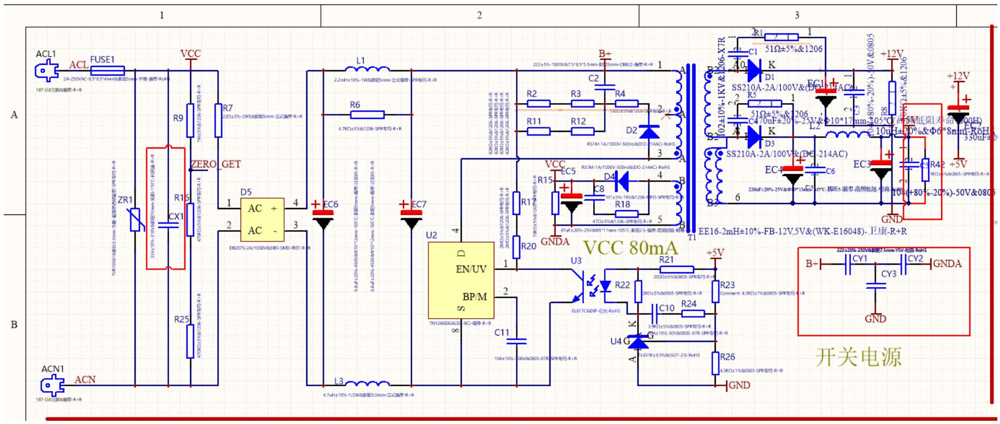

芯片更换为BPA8616D后还需更改了以下几点

R17和R20不装可以有输入过欠压保护功能  
L2位置不装，感量大两个方案都会系统不稳定

## 元件面

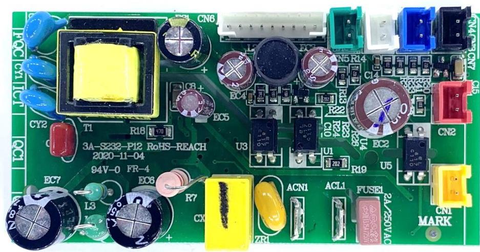

## 贴片面

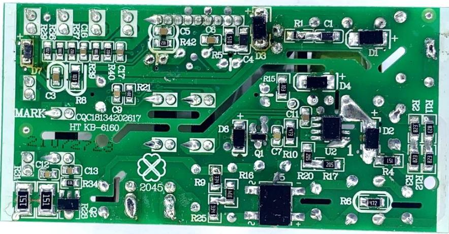

空载功耗  
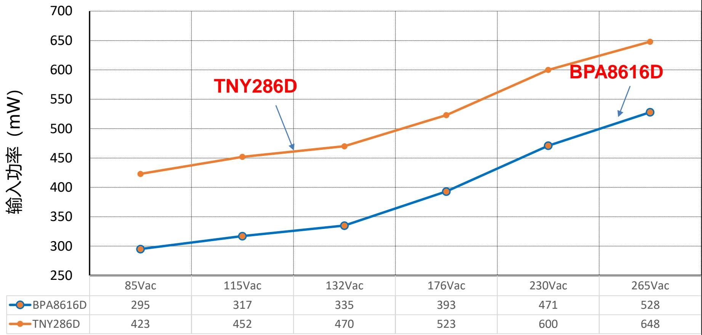

输入电压

备注：TNY286D在EN pin脚上拉一串电阻做过欠压，阻值4M；BPA8616D内部集成过欠压功能，无需外部电阻

效率测试  
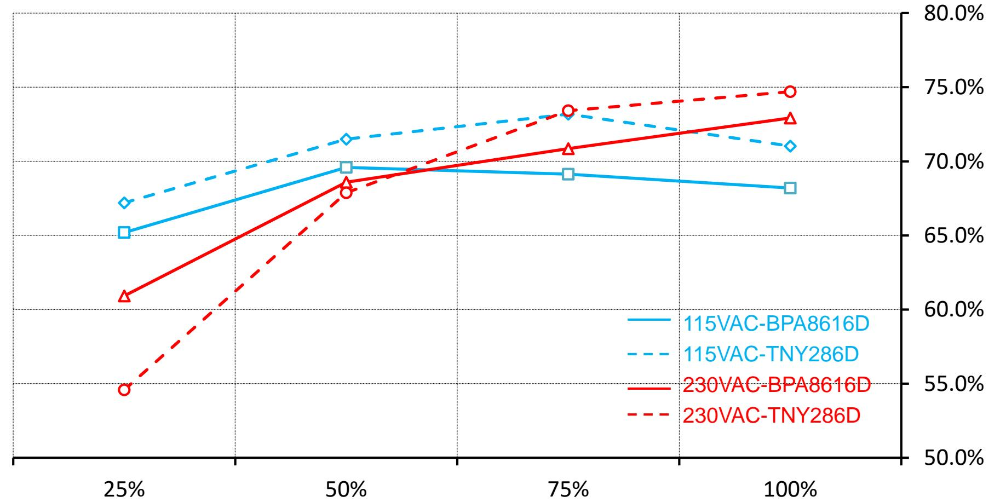

负载

## 输出电压交叉调整率

BPA8616D

<table><tr><td> $V_{IN}(VAC)$  $I_{OUT}(A)$ </td><td></td><td>5V</td><td>12V</td><td>20V</td></tr><tr><td rowspan="4"> $I_{O5V}=0A$  $I_{O12V}=0A$  $I_{O20V}=0A$ </td><td>85VAC</td><td>5</td><td>12.7</td><td>18.2</td></tr><tr><td>115VAC</td><td>5</td><td>12.75</td><td>18.2</td></tr><tr><td>230VAC</td><td>5</td><td>12.83</td><td>18.27</td></tr><tr><td>265VAC</td><td>5</td><td>12.86</td><td>18.28</td></tr><tr><td rowspan="4"> $I_{O5V}=0.3A$  $I_{O12V}=0A$  $I_{O20V}=0A$ </td><td>85VAC</td><td>4.986</td><td>14.61</td><td>21.92</td></tr><tr><td>115VAC</td><td>4.988</td><td>14.61</td><td>21.89</td></tr><tr><td>230VAC</td><td>4.986</td><td>14.29</td><td>21.6</td></tr><tr><td>265VAC</td><td>4.986</td><td>14.23</td><td>21.52</td></tr><tr><td rowspan="4"> $I_{O5V}=0A$  $I_{O12V}=0.4A$  $I_{O20V}=0A$ </td><td>85VAC</td><td>5</td><td>11.2</td><td>18.44</td></tr><tr><td>115VAC</td><td>5</td><td>10.98</td><td>18.34</td></tr><tr><td>230VAC</td><td>5</td><td>11.15</td><td>18.56</td></tr><tr><td>265VAC</td><td>5</td><td>11.15</td><td>18.56</td></tr><tr><td rowspan="4"> $I_{O5V}=0A$  $I_{O12V}=0A$  $I_{O20V}=0.05A$ </td><td>85VAC</td><td>5</td><td>12.39</td><td>13.45</td></tr><tr><td>115VAC</td><td>5</td><td>12.43</td><td>11.66</td></tr><tr><td>230VAC</td><td>5</td><td>12.49</td><td>13.62</td></tr><tr><td>265VAC</td><td>5</td><td>12.5</td><td>13.6</td></tr></table>

测试条件：Io=0A为只带客户板上负载

TNY286D

<table><tr><td> $V_{IN}(VAC)$  $I_{OUT}(A)$ </td><td></td><td>5V</td><td>12V</td><td>20V</td></tr><tr><td rowspan="4"> $I_{O5V}=0A$  $I_{O12V}=0A$  $I_{O20V}=0A$ </td><td>85VAC</td><td>5</td><td>12.48</td><td>18.58</td></tr><tr><td>115VAC</td><td>5</td><td>12.49</td><td>18.56</td></tr><tr><td>230VAC</td><td>5</td><td>12.58</td><td>18.5</td></tr><tr><td>265VAC</td><td>5</td><td>12.6</td><td>18.49</td></tr><tr><td rowspan="4"> $I_{O5V}=0.3A$  $I_{O12V}=0A$  $I_{O20V}=0A$ </td><td>85VAC</td><td>4.986</td><td>14.7</td><td>22.16</td></tr><tr><td>115VAC</td><td>4.99</td><td>14.72</td><td>22.05</td></tr><tr><td>230VAC</td><td>4.988</td><td>14.38</td><td>21.65</td></tr><tr><td>265VAC</td><td>4.987</td><td>14.27</td><td>21.55</td></tr><tr><td rowspan="4"> $I_{O5V}=0A$  $I_{O12V}=0.4A$  $I_{O20V}=0A$ </td><td>85VAC</td><td>5</td><td>11.07</td><td>18.4</td></tr><tr><td>115VAC</td><td>5</td><td>11.1</td><td>18.45</td></tr><tr><td>230VAC</td><td>5</td><td>11.18</td><td>18.55</td></tr><tr><td>265VAC</td><td>5</td><td>11.19</td><td>18.55</td></tr><tr><td rowspan="4"> $I_{O5V}=0A$  $I_{O12V}=0A$  $I_{O20V}=0.04A$ </td><td>85VAC</td><td>5</td><td>12.31</td><td>16.17</td></tr><tr><td>115VAC</td><td>5</td><td>12.31</td><td>16.15</td></tr><tr><td>230VAC</td><td>5</td><td>12.31</td><td>16.03</td></tr><tr><td>265VAC</td><td>5</td><td>12.31</td><td>16</td></tr></table>

测试条件：Io=0A为只带客户板上负载

## 输出电压纹波

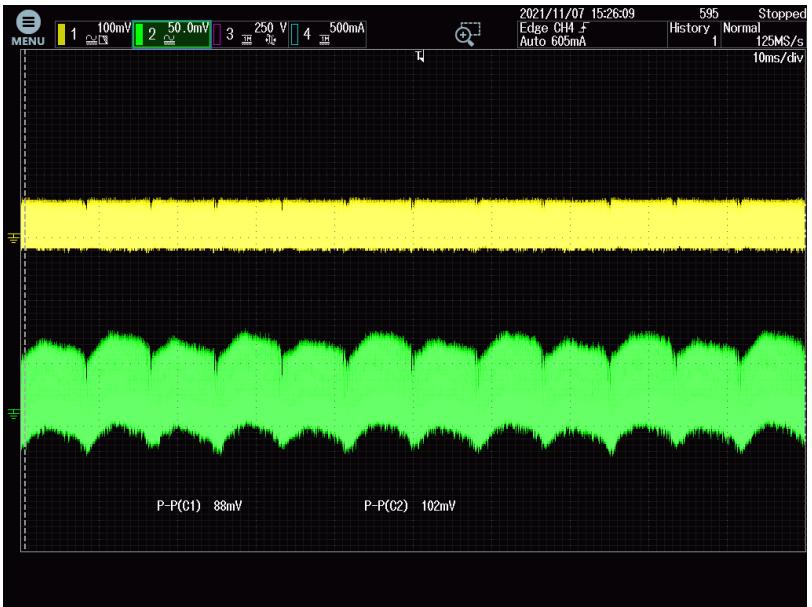

## BPA8616D

85 VAC

CH1 $\mathsf { V } _ { \mathsf { O U T - S V } }$ Ripple$V _ { P K - P K } = 8 8 m V$ ！  
CH2 $\mathsf { V } _ { \mathsf { O U T } - 1 2 \mathsf { V } }$ Ripple $\mathsf { V } _ { \mathsf { P K - P K } } { = } 1 0 2 \mathsf { m V }$

## Test Condition:

➢ Full Load

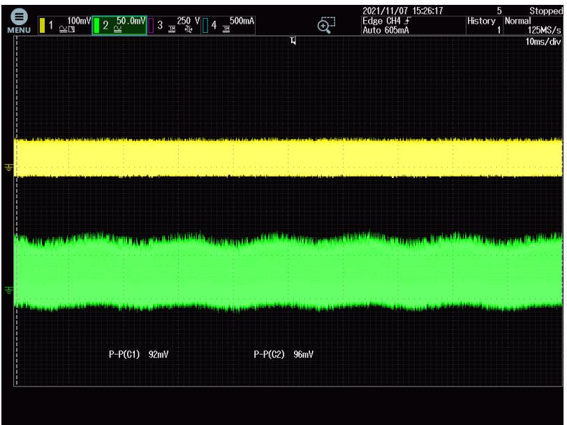

## BPA8616D

265 $\mathsf { v } _ { \mathsf { A C } }$

CH1 $\mathsf { V } _ { \mathsf { O U T - S V } }$ Ripple $\mathbf { V } _ { \mathsf { P K - P K } } { = } 9 2 \mathsf { m V }$  
CH2 $\mathsf { V } _ { \mathsf { O U T } - 1 2 \mathsf { V } }$ Ripple $\mathbf { V } _ { \mathsf { P K - P K } } { = } 9 6 \mathsf { m V }$

## Test Condition:

➢ Full Load

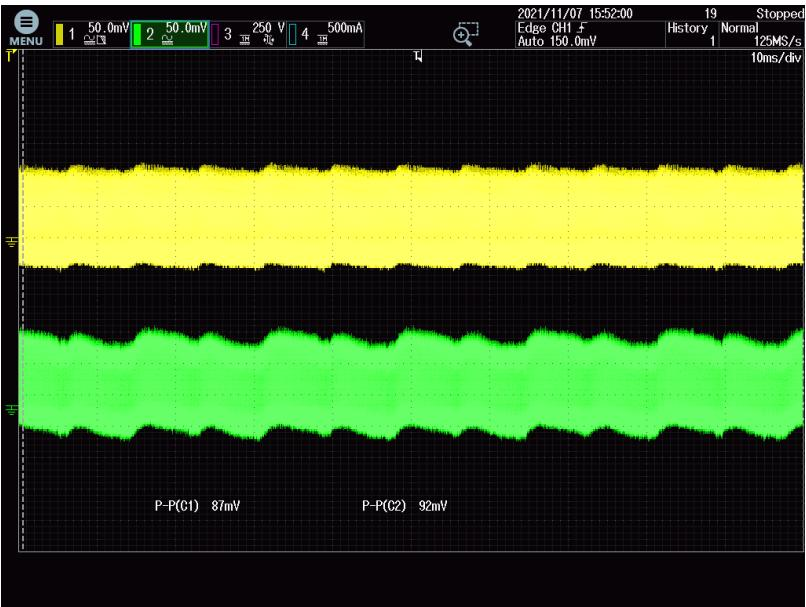

## TNY286D

85 VAC

CH1 $\mathsf { V } _ { \mathsf { O U T - 5 V } }$ Ripple $V _ { p | k - P K } = 8 7 m V$  
$\begin{array} { r l } & { \mathsf { C H 2 V _ { O U T - 1 2 V } R i p p l e } } \\ & { \mathsf { V _ { P K - P K } } \mathsf { = 9 2 m V } } \end{array}$

## Test Condition:

➢ Full Load

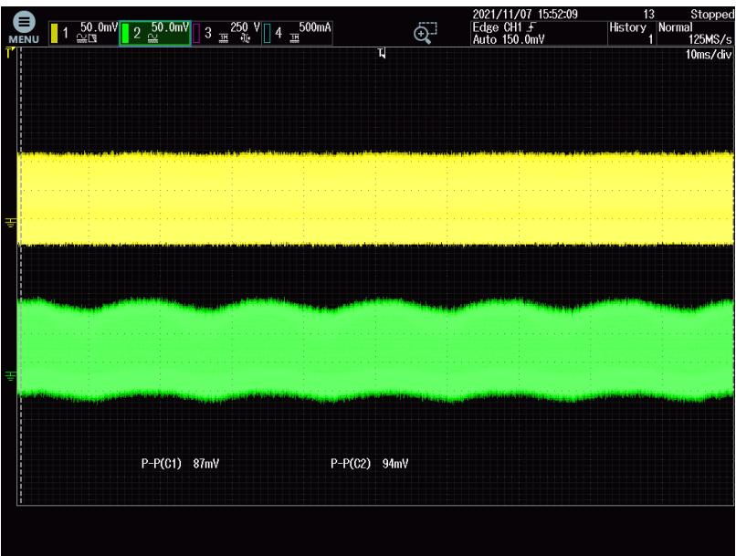

## TNY286D

265 $\mathsf { v } _ { \mathsf { A C } }$

CH1 $\mathsf { V } _ { \mathsf { O U T - S V } }$ Ripple $V _ { p | \mathrm { X - P K } } = 8 7 \mathsf { m V }$  
CH2 $\mathsf { V } _ { \mathsf { O U T - 1 } 2 \mathsf { V } }$ Ripple $V _ { p | k - P K } = 9 4 m v$

## Test Condition:

➢ Full Load

## 动态负载(50%-100%)

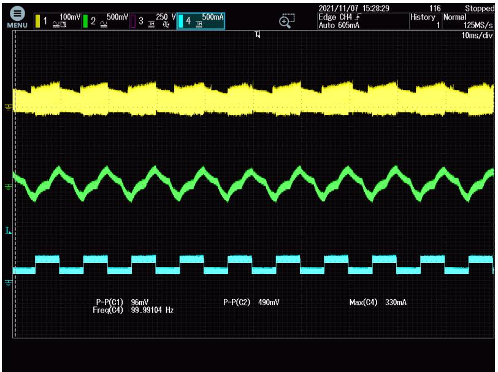

## BPA8616D

85 VAC

CH1 V Ripple VPK-PK=96mV  
CH2 V Ripple VPK-PK=490mV

CH4 IOUT-5V

## Test Condition:

➢ 0.15 A-0.3 A-0. 15 A  
➢ 0.2 A-0.4 A-0.2 A  
➢ Slew Rate: 0.5 A/μS  
➢ Frequency: 100 Hz

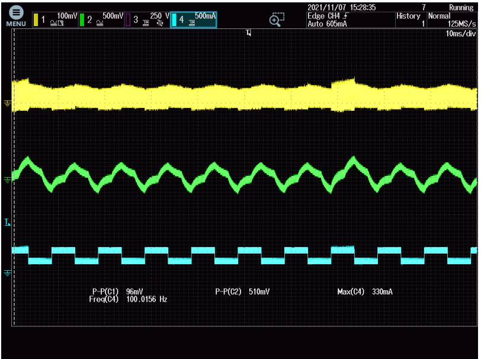

## BPA8616D

265 VAC

CH1 V V Ripple VPK-PK=96mV  
CH2 V Ripple VPK-PK=510mV  
CH4 IOUT-5V

## Test Condition:

➢ 0.15 A-0.3 A-0. 15 A  
➢ 0.2 A-0.4 A-0.2 A  
➢ Slew Rate: 0.5 A/μS  
➢ Frequency: 100 Hz

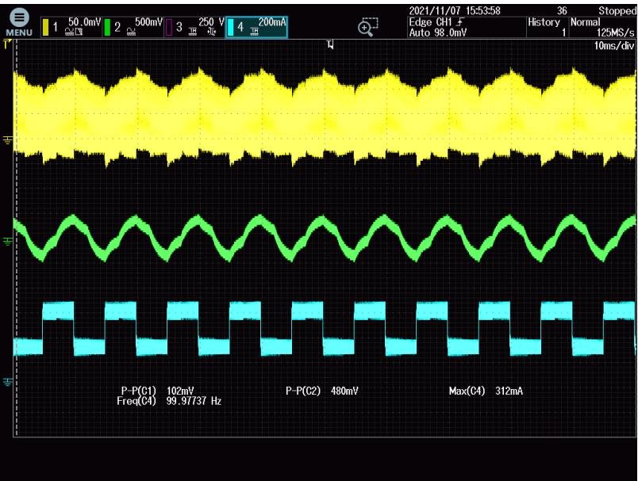

## TNY286D

85 VAC

CH1 V Ripple VPK-PK=102mV  
CH2 V Ripple VPK-PK=480mV  
CH4 IOUT-5V

## Test Condition:

➢ $0 . 1 5 \mathsf { A } – 0 . 3 \mathsf { A } – 0 . 1 5 \mathsf { A }$  
➢ $0 . 2 \ A { - } 0 . 4 \ A { - } 0 . 2 \ A$  
➢ Slew Rate: 0.5 A/μS  
➢ Frequency: 100 Hz

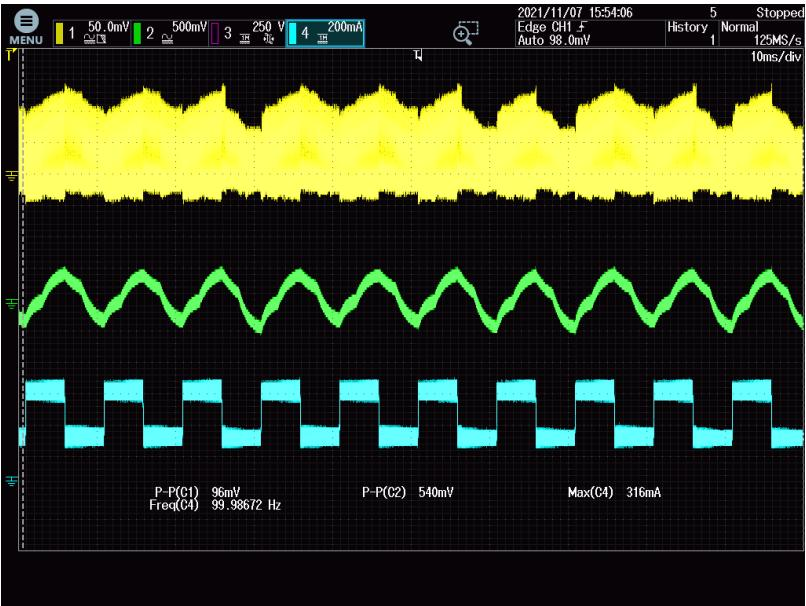

## TNY286D

265 VAC

CH1 V Ripple V =96mV  
CH2 V Ripple VPK-PK=540mV  
CH4 IOUT-5V

## Test Condition:

➢ 0.15 A-0.3 A-0. 15 A  
➢ 0.2 A-0.4 A-0.2 A  
➢ Slew Rate: 0.5 A/μS  
➢ Frequency: 100 Hz

## 动态负载(10%-90%)

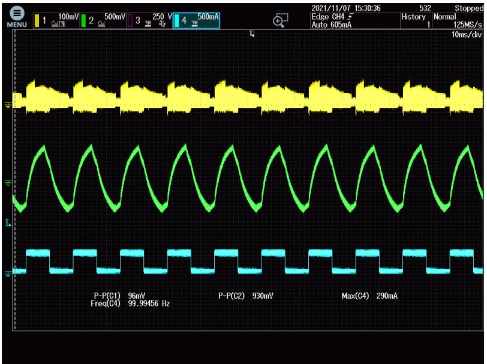

## BPA8616D

85 VAC

CH1 V Ripple VPK-PK=96mV  
CH2 V Ripple VPK-PK=930mV

CH4 IOUT-5V

## Test Condition:

➢ 0.03 A-0.27 A-0.03 A  
➢ 0.04 A-0.36A-0.04 A  
➢ Slew Rate: 0.5 A/μS  
➢ Frequency: 100 Hz

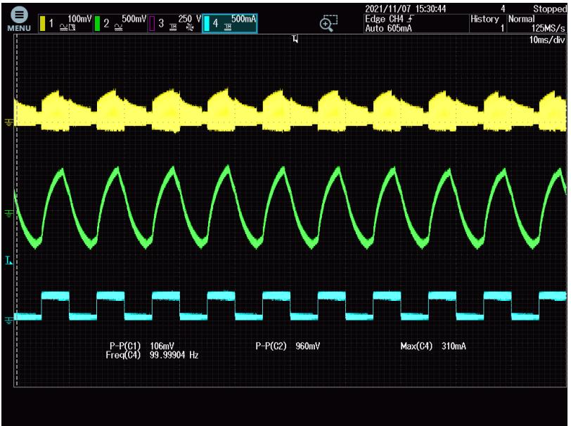

## BPA8616D

265 VAC

CH1 V RippleOUT-5V VPK-PK=106mV  
CH2 V Ripple VPK-PK=960mV  
CH4 IOUT-5V ${ \mathsf { C H } } 4 \mid _ { _ { 0 \cup \mathsf { T } } - 5 \lor }$

## Test Condition:

➢ 0.03 A-0.27 A-0.03 A  
➢ 0.04 A-0.36A-0.04 A  
➢ Slew Rate: 0.5 A/μS  
➢ Frequency: 100 Hz

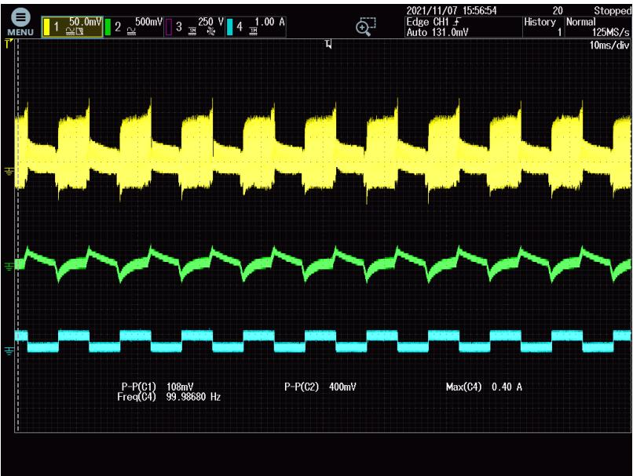

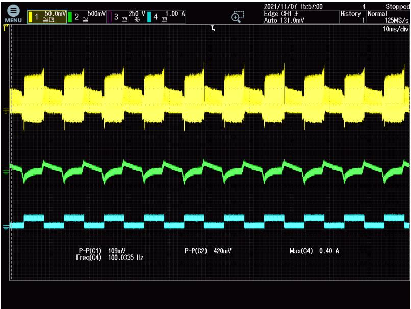

## TNY286D

85 VAC

${ \mathsf { C H 1 } } { \mathsf { V } } _ { { \mathsf { O U T } } - { \mathsf { 5 V } } }$ Ripple$\mathsf { V } _ { \mathsf { P K - P K } } { = } 1 0 8 \mathsf { m V }$ （201  
CH2 $\mathsf { V } _ { \mathsf { O U T - 1 2 V } }$ Ripple VPK-PK=400mV

## Test Condition:

➢ 0.03 A-0.27 A-0.03 A  
➢ $0 . 0 4 \ A - 0 . 3 6 \ A - 0 . 0 4 \ A$  
➢ Slew Rate: 0.5 A/μS  
➢ Frequency: 100 Hz

## TNY286D

265 VAC

CH1 V $\mathsf { V } _ { \mathsf { O U T - S V } }$ Ripple $\mathsf { V } _ { \mathsf { P K - P K } } { = } 1 0 9 \mathsf { m V }$  
CH2 $\mathsf { V } _ { \mathsf { O U T - 1 } 2 \mathsf { V } }$ Ripple VPK-PK=420mV

## Test Condition:

➢ 0.03 A-0.27 A-0.03 A  
➢ 0.04 A-0.36A-0.04 A  
➢ Slew Rate: 0.5 A/μS  
➢ Frequency: 100 Hz

## 输出电压开机波形

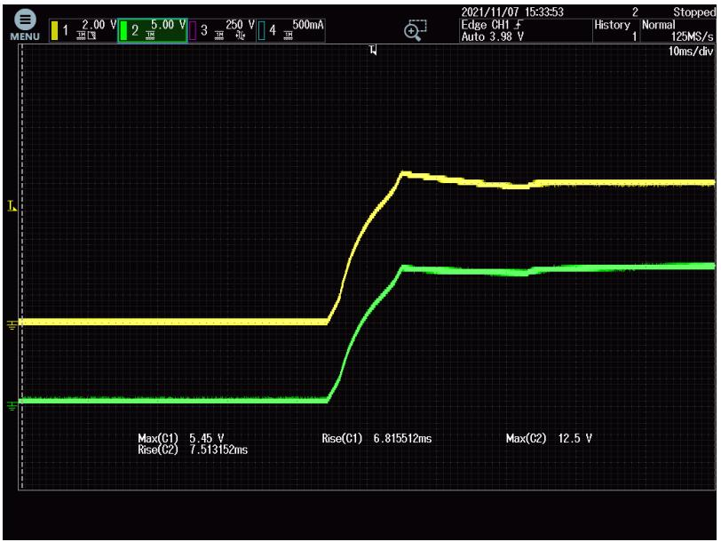

## BPA8616D

85 VAC

CH1 $\mathsf { V } _ { \mathsf { O U T - S V } }$ Ripple $\mathtt { t } _ { \mathrm { r i s e } } = 6 . 8 1 \mathrm { m } s$  
CH2 $\mathsf { V } _ { \mathsf { O U T } - 1 2 \mathsf { V } }$ Ripple trise=7.5mS

## Test Condition:

➢ NO Load

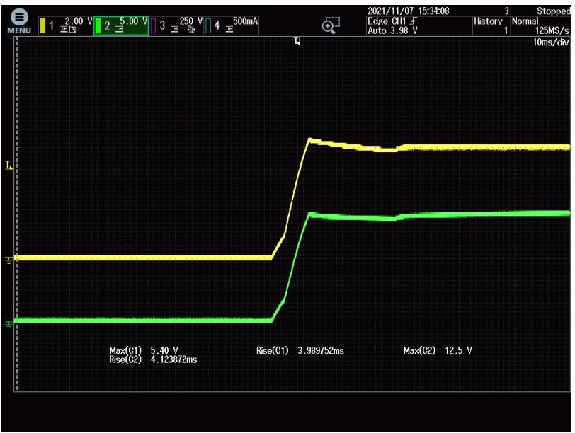

## BPA8616D

265 VAC

CH1 $\mathsf { V } _ { \mathsf { O U T - S V } }$ Ripple trise=3.98mS  
CH2 $\mathsf { V } _ { \mathsf { O U T } - 1 2 \mathsf { V } }$ Ripple trise=4.12mS

## Test Condition:

➢ NO Load

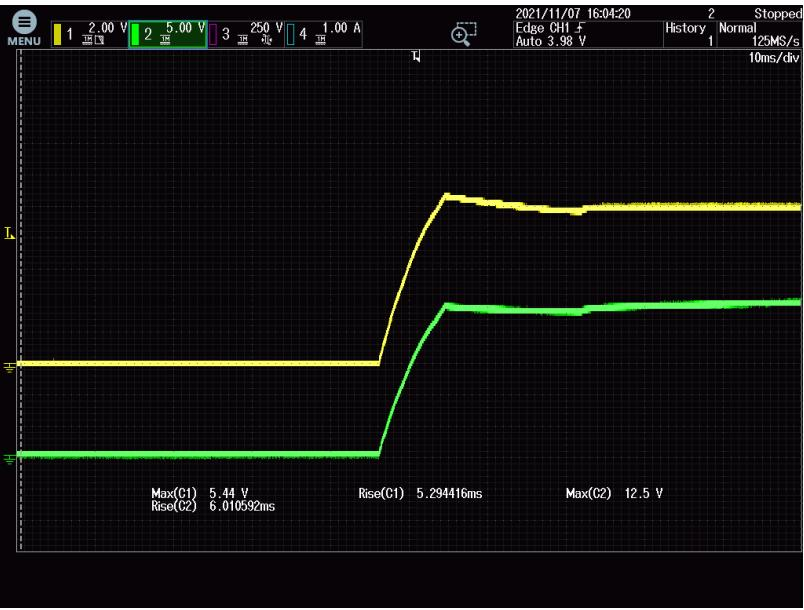

## TNY286D

85 VAC

CH1 $\mathsf { V } _ { \mathsf { O U T - 5 V } }$ Ripple trise=5.29mS  
CH2 VOUT-12V Ripple trise=6.01mS

## Test Condition:

➢ NO Load

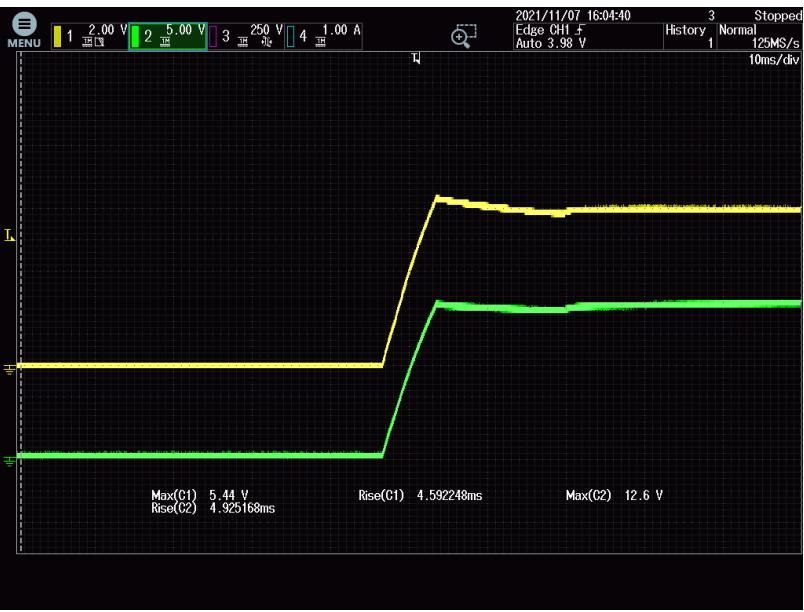

## TNY286D

265 VAC

CH1 $\mathsf { V } _ { \mathsf { O U T - S V } }$ Ripple trise=4.59mS  
CH2 VOUT-12V Ripple t =4.92mS

## Test Condition:

➢ NO Load

## 输出电压开机波形

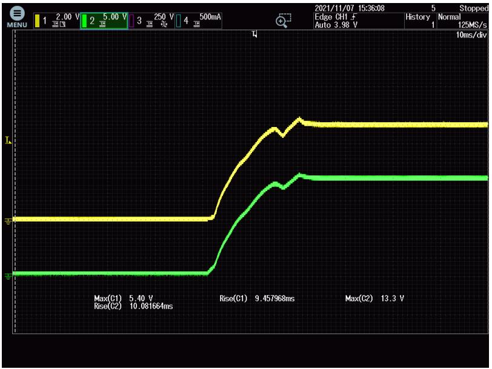

## BPA8616D

85 VAC

CH1 $\mathsf { V } _ { \mathsf { O U T - S V } }$ Ripple trise=9.45mS  
CH2 $\mathsf { V } _ { \mathsf { O U T } - 1 2 \mathsf { V } }$ Ripple t =10.08mS

## Test Condition:

➢ Full Load

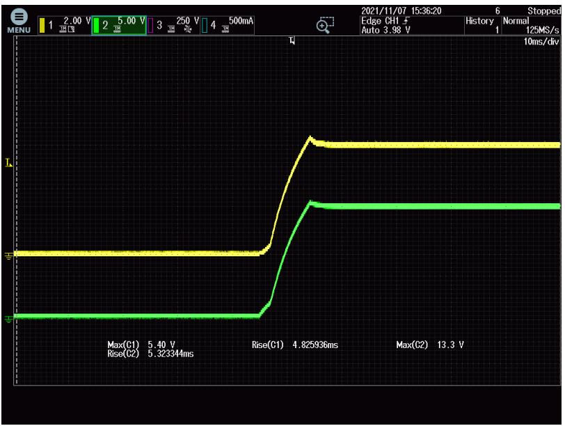

## BPA8616D

265 VAC

CH1 $\mathsf { V } _ { \mathsf { O U T - S V } }$ Ripple trise=4.82mS  
$\begin{array} { r l } { \mathbf { 1 } } & { \mathsf { C H 2 V } _ { \mathrm { O U T - 1 2 V } } \mathsf { R i p p l e } } \\ & { \mathbf { t } _ { \mathrm { r i s e } } = 5 . 3 2 \mathsf { m S } } \end{array}$

## Test Condition:

➢ Full Load

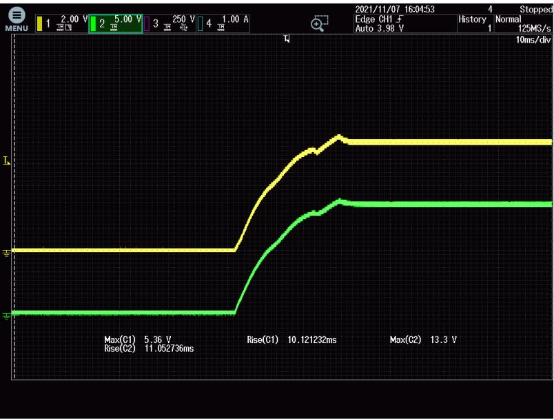

## TNY286D

85 VAC

CH1 $\mathsf { V } _ { \mathsf { O U T - 5 V } }$ Ripple $\mathtt { t } _ { \mathrm { r i s e } } = 1 0 . 1 2 \mathrm { m } 5$  
CH2 VOUT-12V Ripple t =11.05mS

## Test Condition:

➢ Full Load

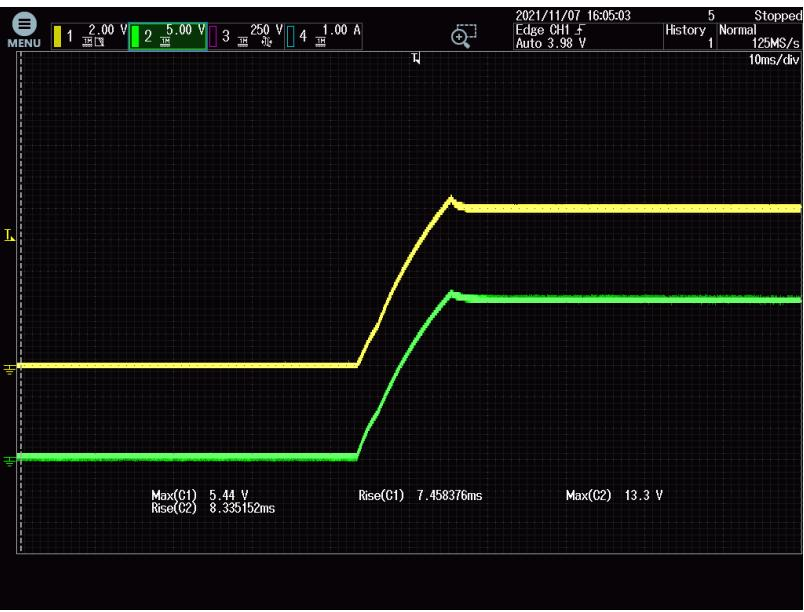

## TNY286D

265 VAC

CH1 $\mathsf { V } _ { \mathsf { O U T - S V } }$ Ripple trise=7.45mS  
CH2 VOUT-12V Ripple trise=8.35mS

## Test Condition:

➢ Full Load

## MOSFET开机波形

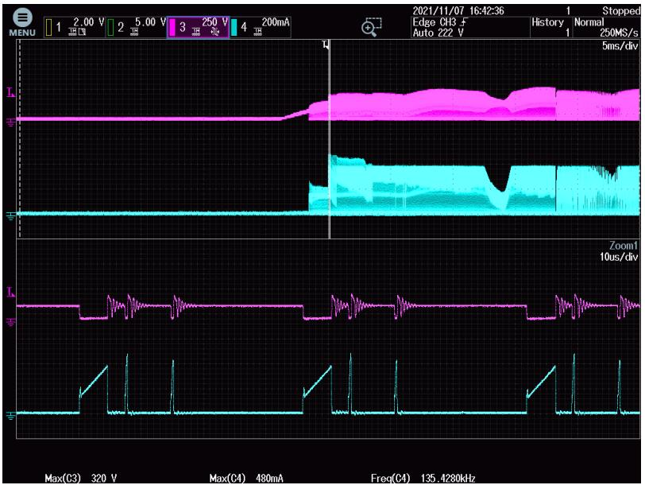

## BPA8616D

85 VAC

CH3 VDS  
CH4 IDS

$$
\begin{array}{l} \mathrm {V_ {DS\_MAX}} = 3 2 0 \mathrm{V} \\ \mathrm {I_ {DS\_MAX}} = 0. 4 8 0 \mathrm{A} \end{array}
$$

Test Condition:

➢ Full Load

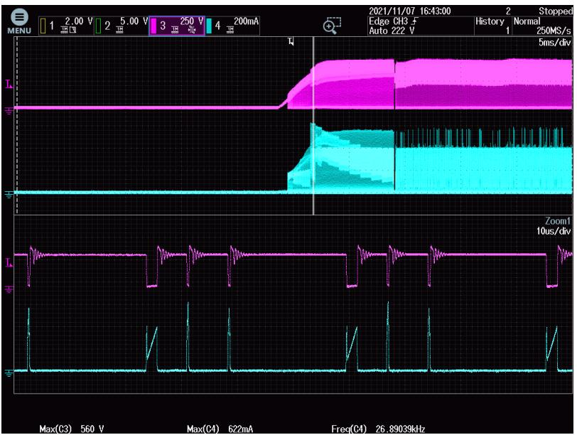

## BPA8616D

265 VAC

CH3 VDS  
CH4 IDS

$$
\begin{array}{l} V _ {D S \_ M A X} = 5 6 0 V \\ I _ {D S \_ M A X} = 0. 6 2 2 A \end{array}
$$

Test Condition:

➢ Full Load

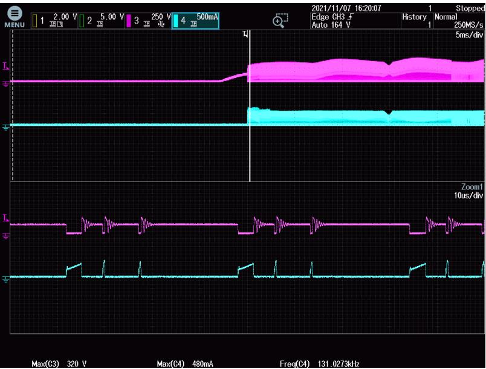

## TNY286D

85 VAC

CH3 VDS  
CH4 IDS

$$
\begin{array}{l} \mathrm {V_ {DS\_MAX}} = 3 2 0 \mathrm{V} \\ \mathrm {I_ {DS\_MAX}} = 0. 4 8 \mathrm{A} \end{array}
$$

Test Condition:

➢ Full Load

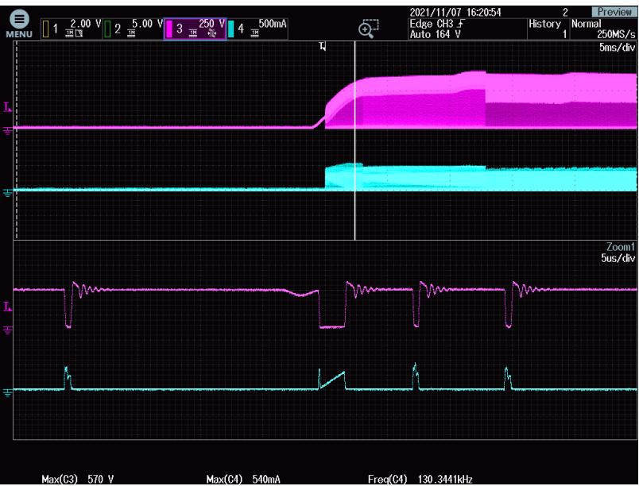

## TNY286D

265 VAC

CH2 VDS  
CH4 IDS

$$
\begin{array}{l} \mathrm {V_ {DS\_MAX}} = 5 7 0 \mathrm{V} \\ \mathrm {I_ {DS\_MAX}} = 0. 5 4 \mathrm{A} \end{array}
$$

Test Condition:

➢ Full Load

## MOSFET稳态波形

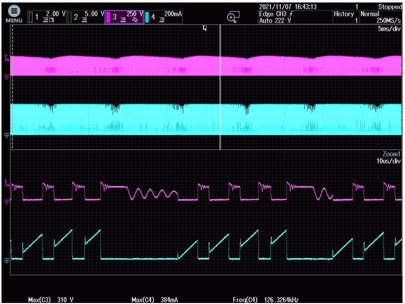

BPA8616D

85 VAC  
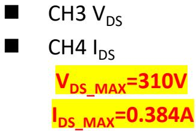

Test Condition:  
➢ Full Load

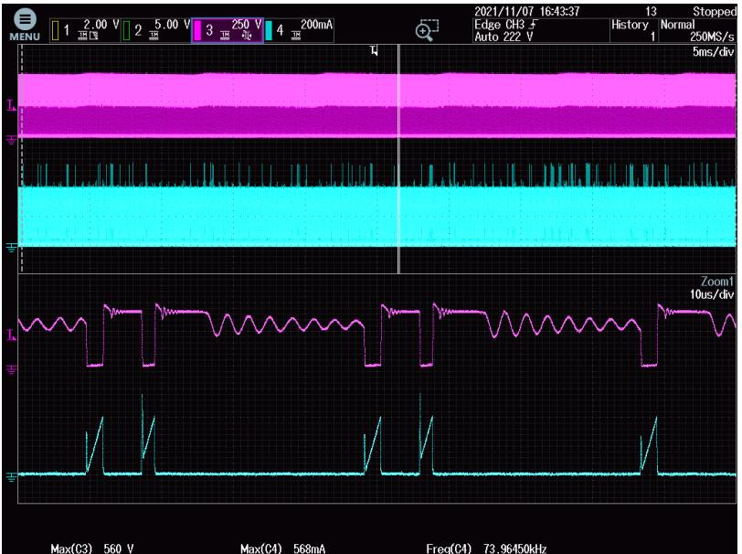

BPA8616D

265 VAC  
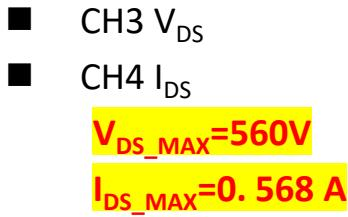

Test Condition:  
➢ Full Load

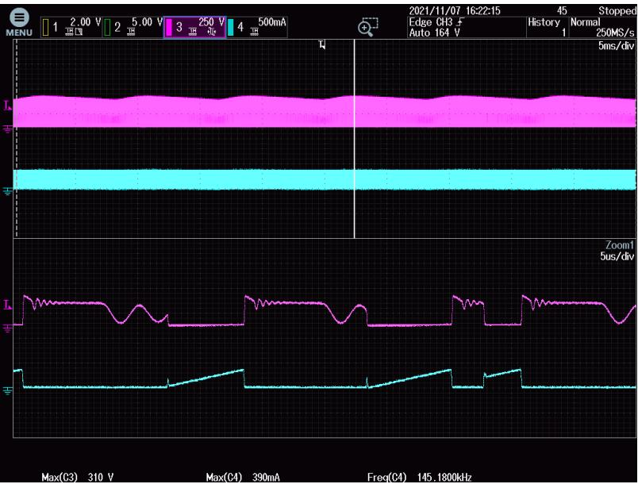

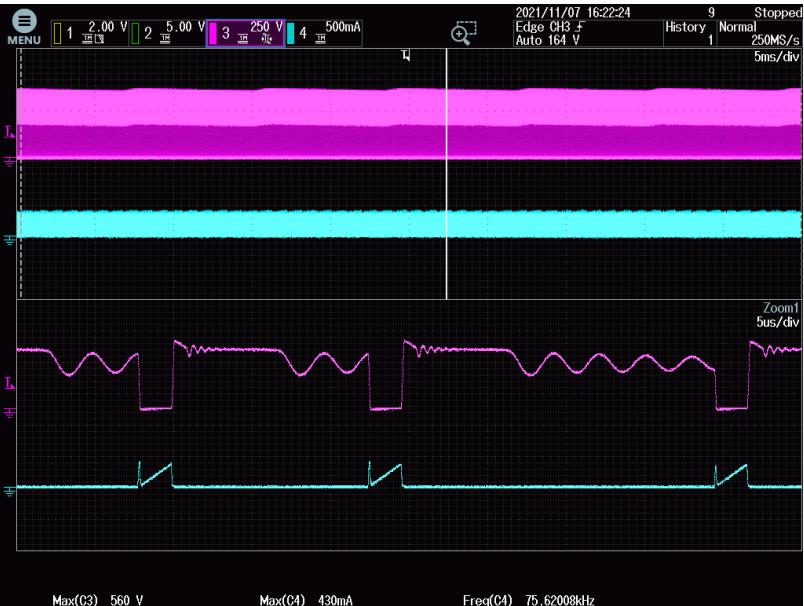

## TNY286D

85 VAC  

Test Condition:  
➢ Full Load

TNY286D  
265 VAC  
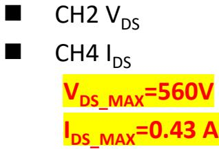

Test Condition:  
➢ Full Load

## 输出二极管开机电压波形（D1）

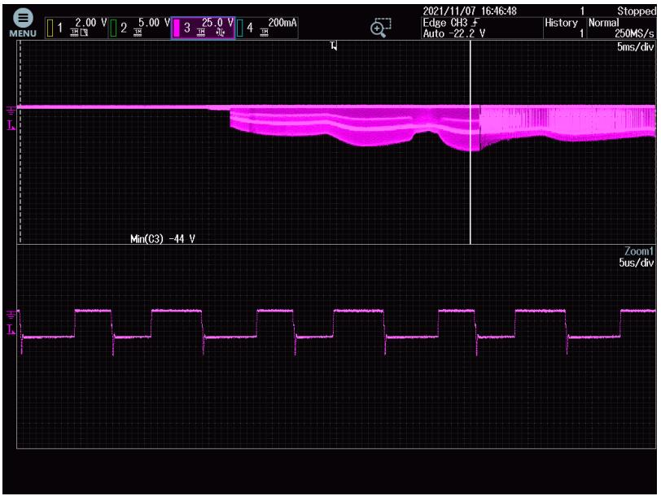

BPA8616D

${ \otimes 5 } \mathsf { V } _ { \mathsf { A C } }$

CH3 VD

$V _ { \mathsf { D } \_ M A X } = 4 4 V$

Test Condition:

➢ Full Load

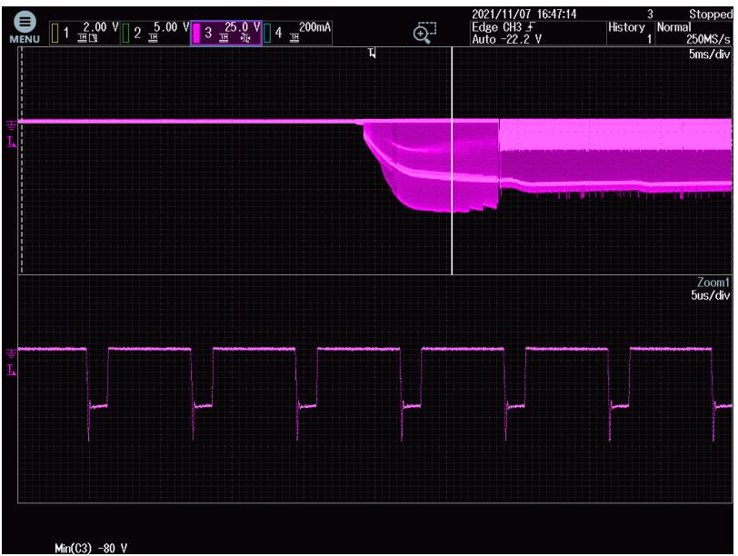

BPA8616D

265 VAC

CH3 VD

$V _ { \mathsf { D } \_ M A X } = 8 0 V$

Test Condition:

➢ Full Load

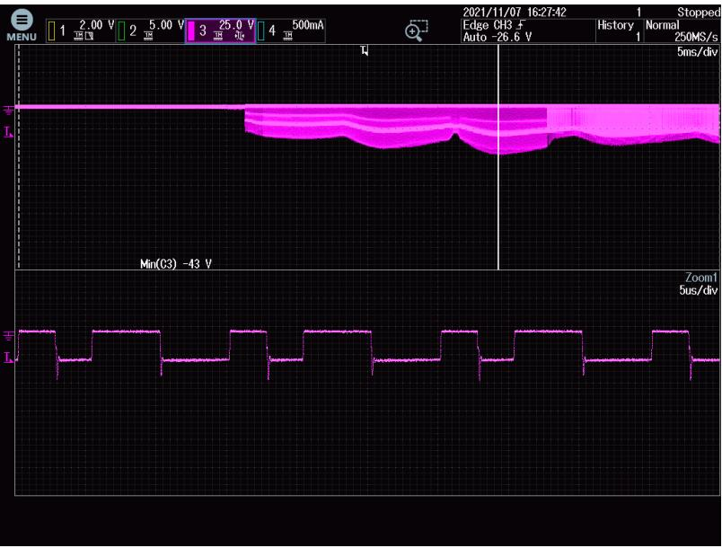

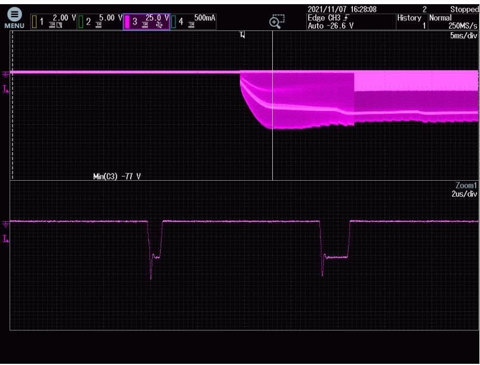

TNY286D

${ \tt S 5 V } _ { \sf A C }$

CH2 VD

$V _ { \mathsf { D } \_ M A X } = 4 3 V$

Test Condition:

➢ Full Load

TNY286D

265 VAC

CH2 VD

$V _ { \mathsf { D } \_ M A X } = 7 7 \mathsf { V }$

Test Condition:

➢ Full Load

## 输出二极管稳态电压波形（D3）

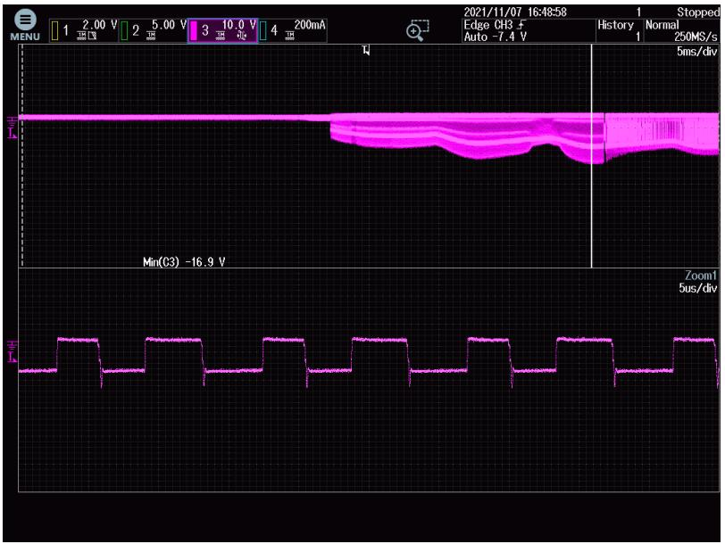

BPA8616D  
85 VAC  
CH3 VD  
$V _ { \mathsf { D } \_ M A X } = 1 7 \mathsf { V }$  
Test Condition:  
➢ Full Load

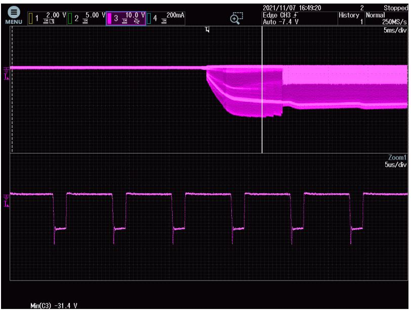

BPA8616D  
265 VAC  
CH2 VD  
$\mathsf { V } _ { \mathsf { D } \_ \mathsf { M A X } } { = } 3 1 . 4 \mathsf { V }$  
Test Condition:  
➢ Full Load

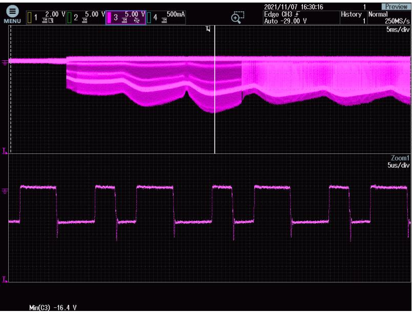

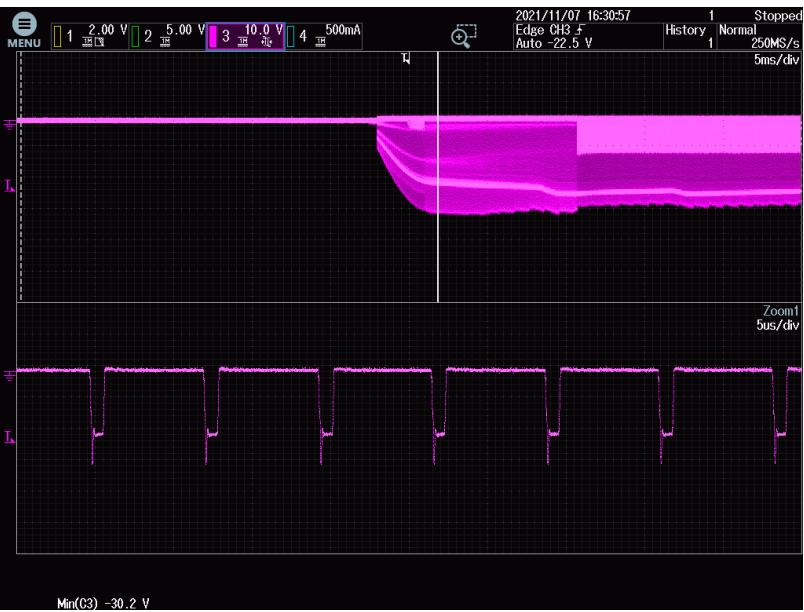

${ \tt S 5 V } _ { \sf A C }$  
CH2 VD  
$\mathsf { V } _ { \mathsf { D } \_ \mathsf { M A X } } { = } 1 6 . 4 \mathsf { V }$  
Test Condition:  
➢ Full Load

## TNY286D

TNY286D

265 VAC

CH2 VD

$V _ { \mathsf { D } \_ M A X } = 3 0 V$

Test Condition:

➢ Full Load

## 输入过压保护 （MOS波形）

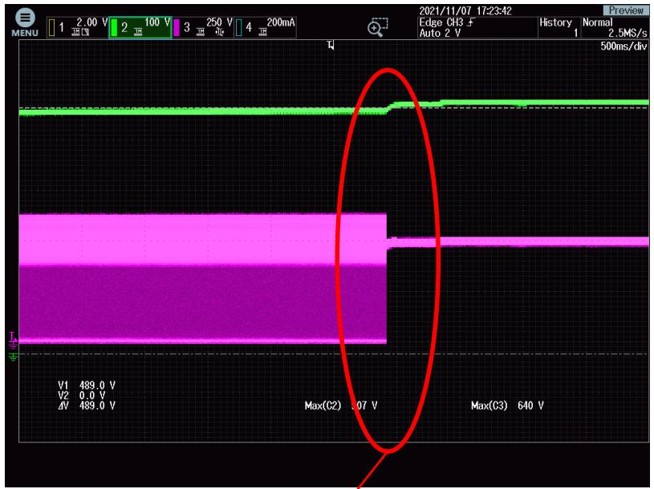

## BPA8616D

CH2VDC\_IN $\mathsf { C H } 2 \mathsf { V } _ { \mathsf { D C } \_ \mathsf { I N } }$  
CH3 $\mathsf { V } _ { \mathrm { d } s }$

$$
\begin{array}{l} \mathrm {V_ {ds\_MAX}} = 6 4 0 \mathrm{V} \\ \mathrm {V_ {DC\_IN}} = 4 8 9 \mathrm{V} \end{array}
$$

Test Condition:

➢ real Load

触发过压保护， MOS最高电压640V

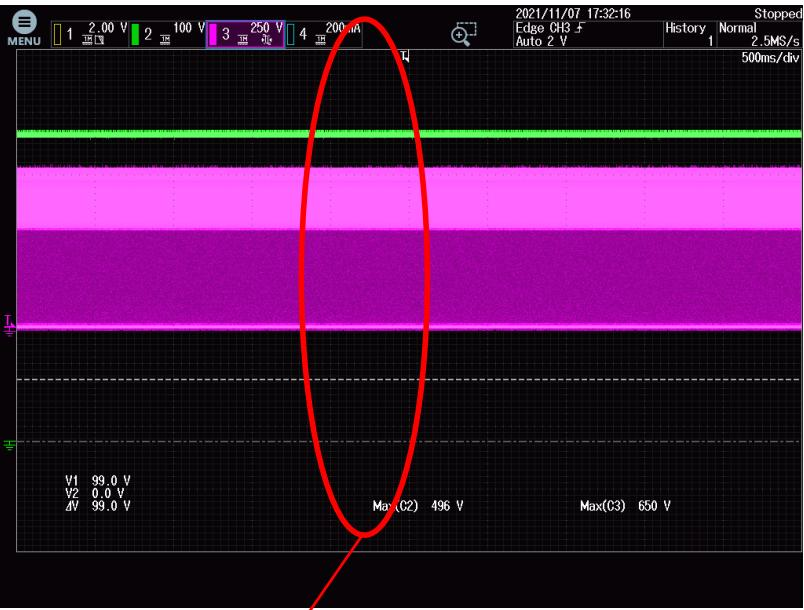

## TNY286D

CH1 VDC\_IN $\mathsf { C H 1 V _ { D C \_ I N } }$  
${ \mathsf { C H } } 2 { \mathsf { V } } _ { \mathsf { d s } }$  
$\mathsf { C H 3 } \mathsf { V } _ { 0 }$

$$
\begin{array}{l} \mathrm {V_ {ds\_MAX}} = 4 9 0 \mathrm{V} \\ \mathrm {V_ {DC\_IN}} = 6 5 0 \mathrm{V} \end{array}
$$

Test Condition:

➢ real Load

无过压保护， MOS最高电压650V

## 输入欠压保护

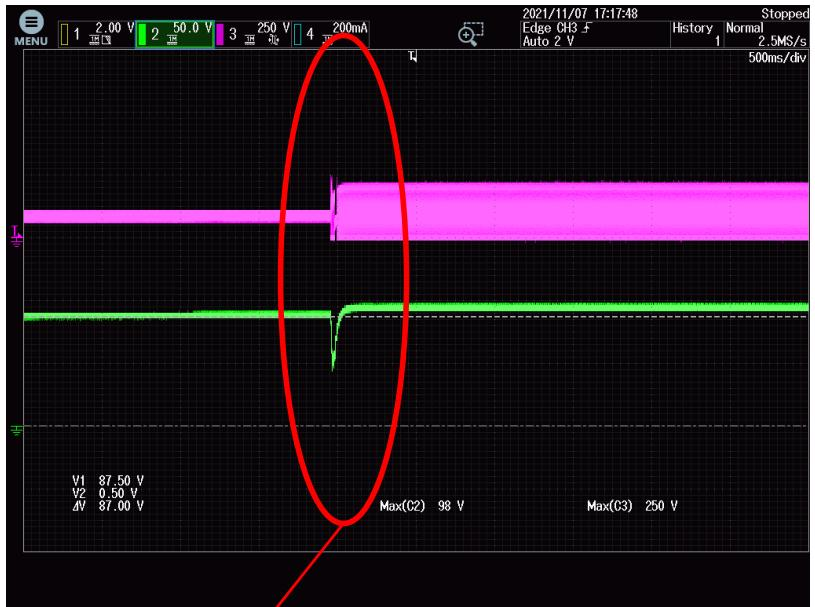

## BPA8616D

CH2 VDC\_IN $\mathsf { C H } 2 \mathsf { V } _ { \mathsf { D C } \_ \mathsf { I N } }$  
${ \mathsf { C H 3 } } \mathsf { V _ { D S } }$

$$
V _ {D C \_ I N \_} = 8 7 V
$$

Test Condition:

➢ real Load

内置欠压保护， 启机电压85VDC

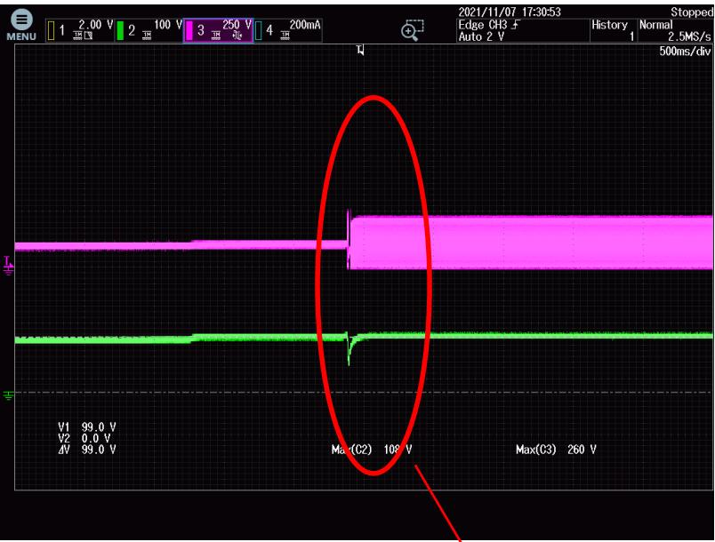

## TNY286D

CH2 VDC\_IN $\mathsf { C H } 2 \mathsf { V } _ { \mathsf { D C } \_ \mathsf { I N } }$  
${ \mathsf { C H 3 } } \mathsf { V } _ { \mathsf { D S } }$

$$
V _ {D C \_ I N \_} = 9 9 V
$$

Test Condition:

➢ real Load

输入欠压保护， 需要增加电阻到EN脚

BPA8616D

<table><tr><td rowspan="2">项目</td><td>90VAC</td><td>265VAC</td></tr><tr><td>温度(°C)</td><td>温度(°C)</td></tr><tr><td>环境温度</td><td>29.55</td><td>29.07</td></tr><tr><td>BPA8616D (IC6)</td><td>109.58</td><td>89.56</td></tr><tr><td>变压器绕组(T1)</td><td>68.84</td><td>66.18</td></tr><tr><td>变压器磁芯(T1)</td><td>63.3</td><td>63.46</td></tr><tr><td>整流二极管(D1)</td><td>71.46</td><td>70.43</td></tr><tr><td>续流二极管(D3)</td><td>58.45</td><td>58.11</td></tr></table>

备注：增大芯片Source散热铜箔面积可以降低芯片温度

TNY286D

<table><tr><td rowspan="2">项目</td><td>90VAC</td><td>265VAC</td></tr><tr><td>温度(°C)</td><td>温度(°C)</td></tr><tr><td>环境温度</td><td>29</td><td>29.03</td></tr><tr><td>TNY286D (IC6)</td><td>100</td><td>90.14</td></tr><tr><td>变压器绕组(T1)</td><td>67.32</td><td>65.52</td></tr><tr><td>变压器磁芯(T1)</td><td>63.55</td><td>63.15</td></tr><tr><td>整流二极管(D1)</td><td>70.13</td><td>69.69</td></tr><tr><td>续流二极管(D3)</td><td>56.95</td><td>56.79</td></tr></table>

备注：增大芯片Source散热铜箔面积可以降低芯片温度

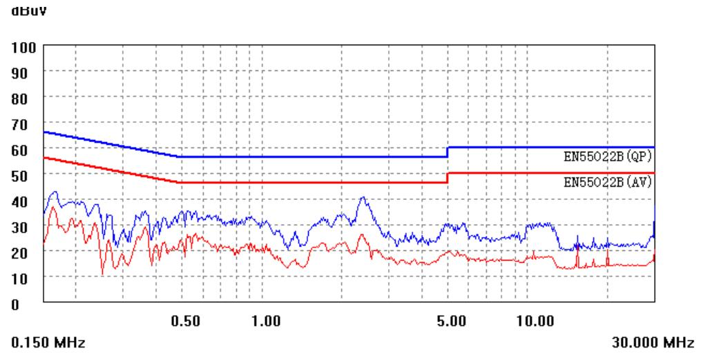

115VAC Line BPA8616D  
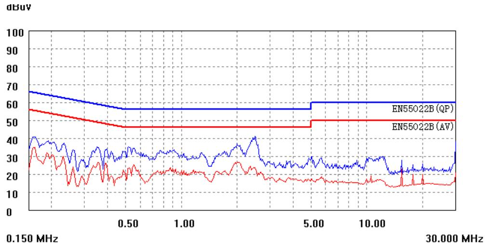

115VAC Neutral BPA8616D

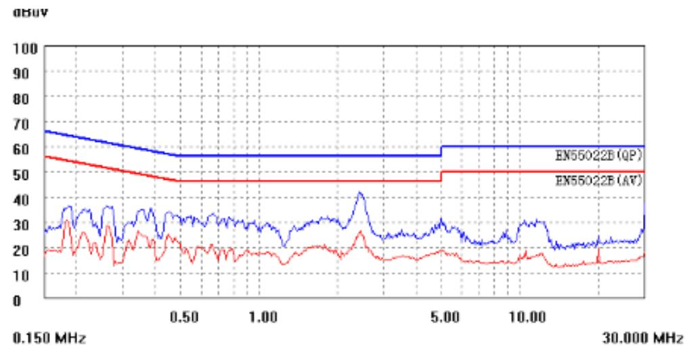

115VAC Line TNY286D  
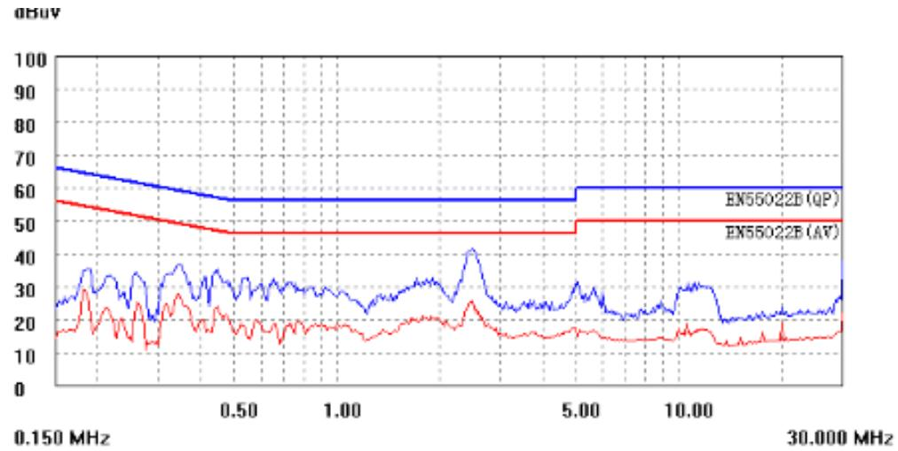

115VAC Neutral TNY286D

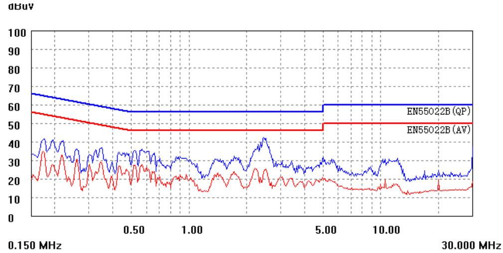

230VAC Line BPA8616D  
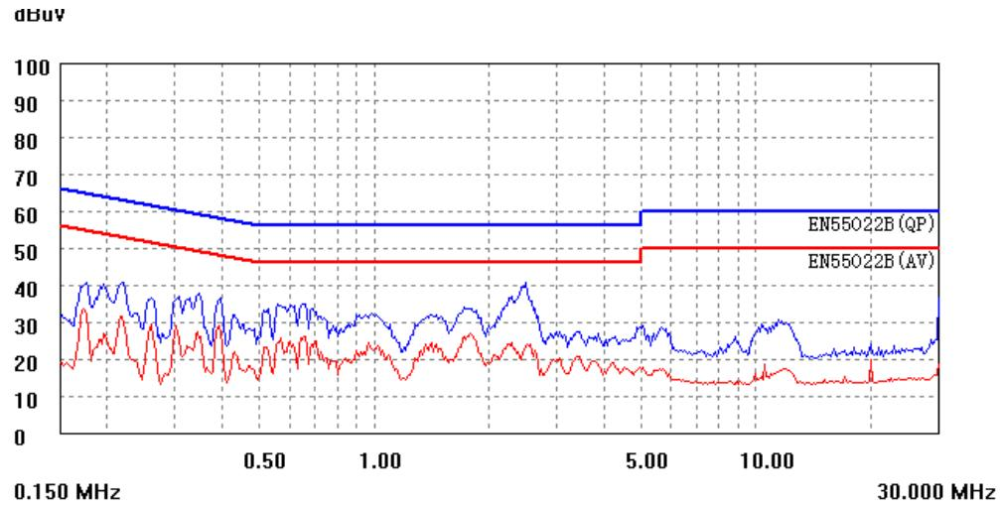

230VAC Neutral BPA8616D

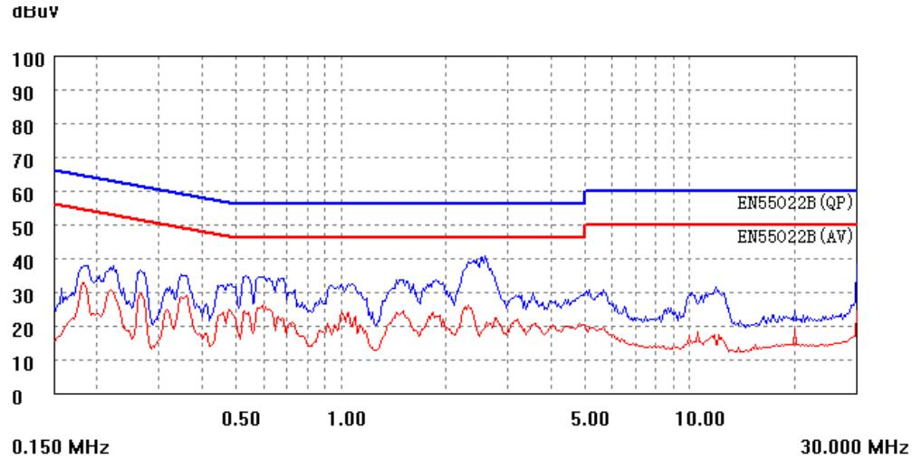

230VAC Line TNY286D  
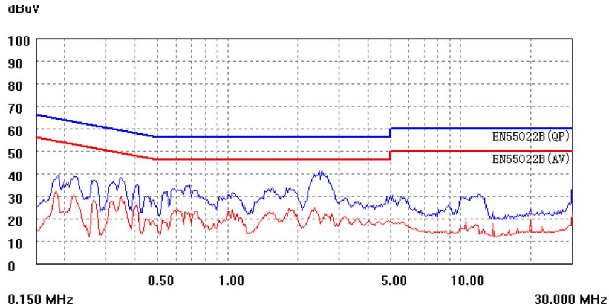

230VAC Neutral TNY286D

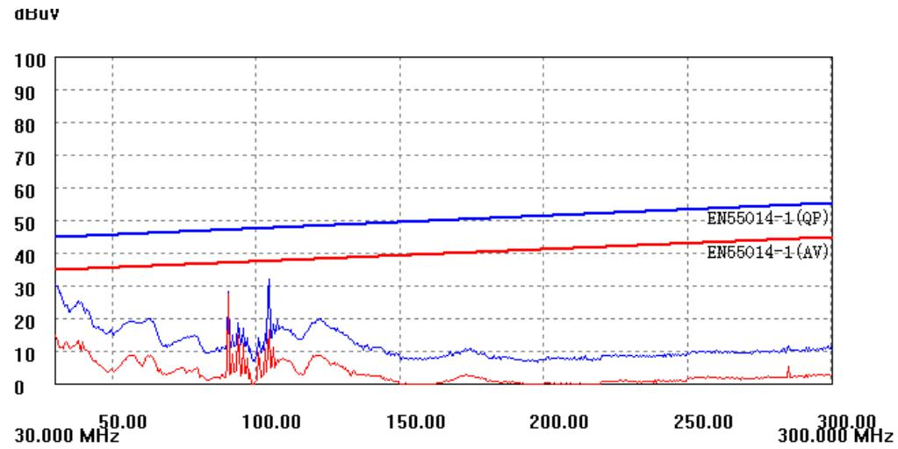

115VAC BPA8616D  
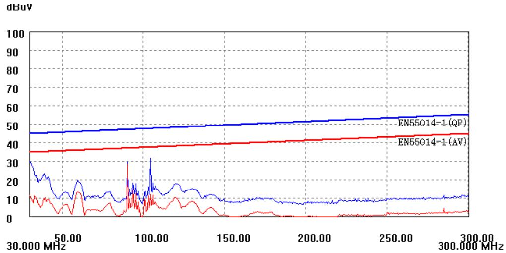

230VAC BPA8616D

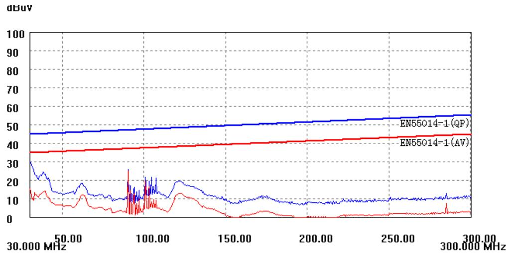

115VAC TNY286D  
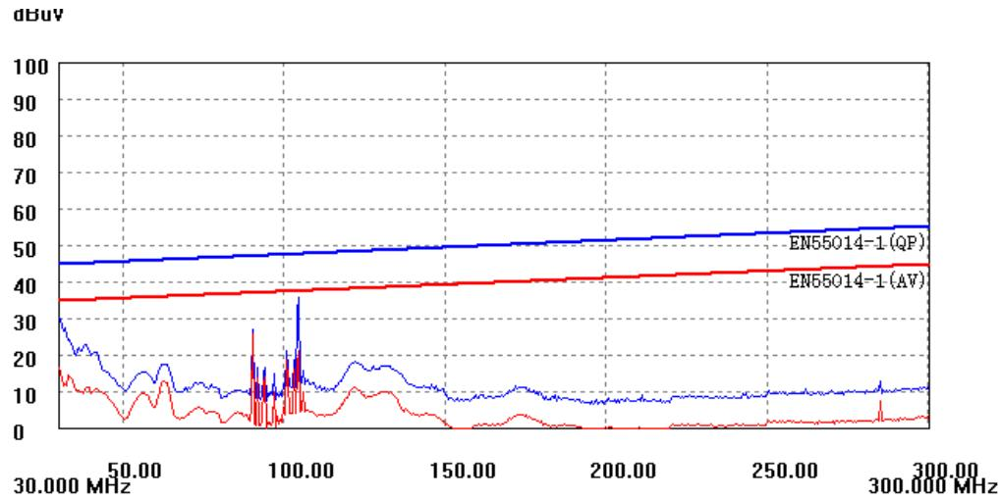

230VAC TNY286D

BPA8616D

<table><tr><td></td><td>电压</td><td>相位角</td><td>发生器阻抗</td><td>测试次数</td><td>测试结果</td></tr><tr><td>L to N</td><td>±2kV</td><td>0,90,180,270</td><td>2</td><td>5</td><td>Pass</td></tr><tr><td>L to PE</td><td>±4kV</td><td>0,90,180,270</td><td>12</td><td>5</td><td>Pass</td></tr><tr><td>N to PE</td><td>±4kV</td><td>0,90,180,270</td><td>12</td><td>5</td><td>Pass</td></tr><tr><td>L+N to PE</td><td>±4kV</td><td>0,90,180,270</td><td>12</td><td>5</td><td>Pass</td></tr></table>

## 测试说明

➢ 按照GB/T17626.5和IEC61000-4-5的最新版本要求进行测试  
➢ 室温环境，230VAC输入，板上负载条件

TNY286D

<table><tr><td></td><td>电压</td><td>相位角</td><td>发生器阻抗</td><td>测试次数</td><td>测试结果</td></tr><tr><td>L to N</td><td>±2kV</td><td>0,90,180,270</td><td>2</td><td>5</td><td>Pass</td></tr><tr><td>L to PE</td><td>±4kV</td><td>0,90,180,270</td><td>12</td><td>5</td><td>Pass</td></tr><tr><td>N to PE</td><td>±4kV</td><td>0,90,180,270</td><td>12</td><td>5</td><td>Pass</td></tr><tr><td>L+N to PE</td><td>±4kV</td><td>0,90,180,270</td><td>12</td><td>5</td><td>Pass</td></tr></table>

## 测试说明

➢ 按照GB/T17626.5和IEC61000-4-5的最新版本要求进行测试  
➢ 室温环境，230VAC输入，板上负载条件

## 结论

➢ BPA8616D替换TNY286D，从效率、交叉调整率、波形、温升、EMI测试数据来看均比较接近；  
BPA8616D可Pin to Pin替代TNY286D，但需同时更改以下几处：

D4位置如果需要出50mA电流，更改二极管为ES1J；  
R20和R17输入欠压保护功能，我们不需要电阻一样有输入过欠保护功能；  
⚫ EC6和EC7如果做低电压输入，更改为400V10uF；  
L2位置8\*10工字电感更改跳线，不改电感正常工作时均有系统不稳定；  
增加VCC供电电阻可以降低芯片温度；

## THANK YOU FOR WATCHING
