## BPA8616D 空调滤网电源测试报告(12V/0.5A)

上海晶丰明源半导体股份有限公司

Shanghai Bright Power Semiconductor Co., Ltd.

2022 12 09

BPA861X  
电源规格  
电路图  
◼BOM  
◼PCB Layout  
电路实物图  
变压器规格书  
性能测试数据

## 产品特点:

➢ 700V MOSFET  
➢ ON/OFF  
》内置软启动功能  
》集成高压启动、自供电电路  
》低音频噪声  
》输入过/欠压保护

## 应用领域:

》家用电器辅助电源  
》电机驱动辅助电源  
➢ IOT/ /  
》工业控制辅助电源

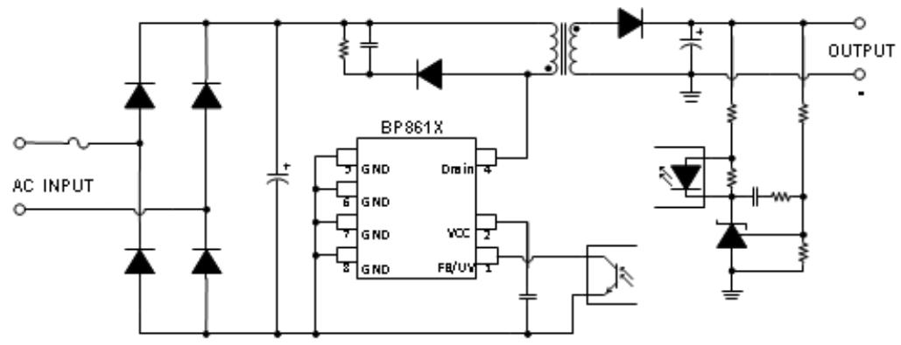

## 电源规格

<table><tr><td>项目描述</td><td>符号</td><td>最小</td><td>典型</td><td>最大</td><td>单位</td><td>备注</td></tr><tr><td colspan="7">输入</td></tr><tr><td>电压</td><td> $V_{IN}$ </td><td>90</td><td>115/230</td><td>264</td><td> $V_{AC}$ </td><td></td></tr><tr><td>频率</td><td> $f_{LINE}$ </td><td>47</td><td>50/60</td><td>63</td><td>Hz</td><td></td></tr><tr><td colspan="7">输出</td></tr><tr><td>输出电压</td><td> $V_{OUT}$ </td><td></td><td>12</td><td></td><td>V</td><td>±3%</td></tr><tr><td>输出电流</td><td> $I_{OUT}$ </td><td></td><td>0.5</td><td></td><td>A</td><td></td></tr><tr><td>输出电压纹波</td><td> $V_{RIPPLE}$ </td><td></td><td></td><td>120</td><td>mV</td><td>20MHz带宽</td></tr><tr><td>连续输出功率</td><td> $P_{OUT}$ </td><td></td><td>6</td><td></td><td>W</td><td></td></tr><tr><td colspan="7">效率</td></tr><tr><td>待机功耗</td><td> $P_{STDBY}$ </td><td></td><td></td><td>220</td><td>mW</td><td>230VAC</td></tr><tr><td>满载效率</td><td>η</td><td>80</td><td></td><td></td><td>%</td><td>115VAC/230VAC</td></tr><tr><td colspan="7">环境</td></tr><tr><td>传导EMI</td><td></td><td colspan="4">满足CISPR22/EN55022 Class B,至少6dB 裕量</td><td></td></tr><tr><td>Surge</td><td></td><td></td><td>2</td><td></td><td>kV</td><td>差模</td></tr><tr><td>EFT</td><td></td><td></td><td>4</td><td></td><td>kV</td><td>5kHz/100kHz/38kHz</td></tr><tr><td>ESD</td><td></td><td></td><td>15</td><td></td><td>kV</td><td>接触8kV,空气15kV</td></tr><tr><td>工作环境温度</td><td> $T_{AMP}$ </td><td>0</td><td></td><td>40</td><td>°C</td><td></td></tr></table>

## 电路实物图

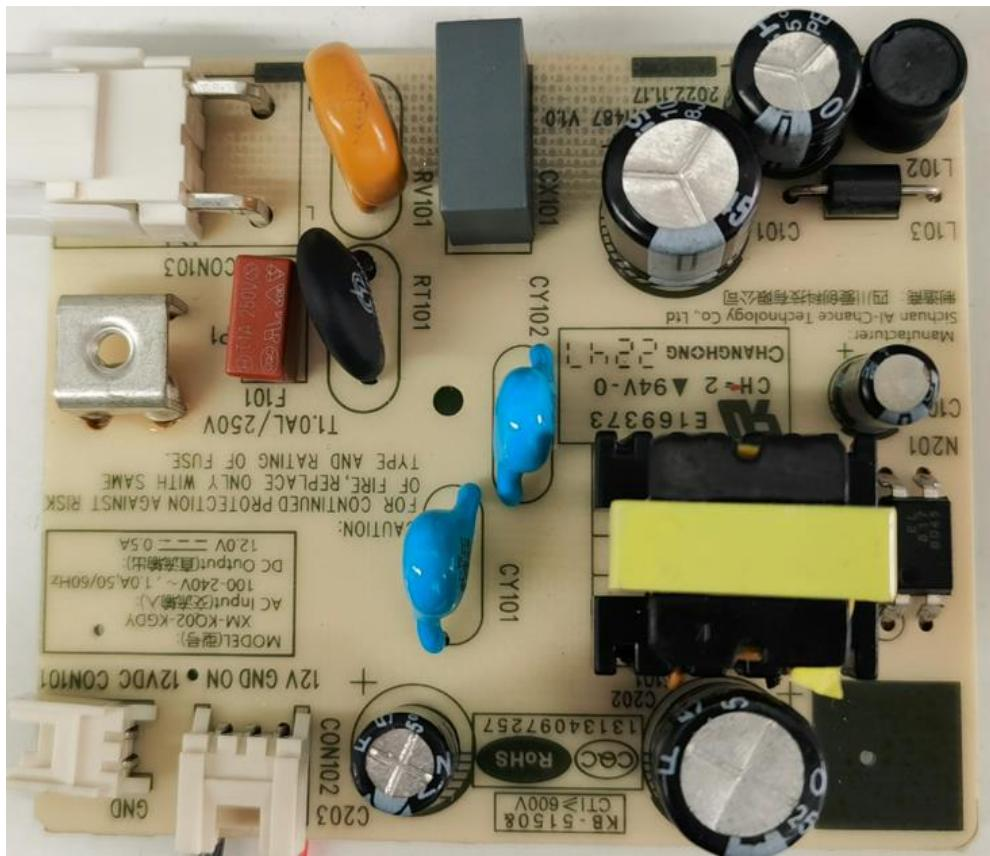

TOP SIDE

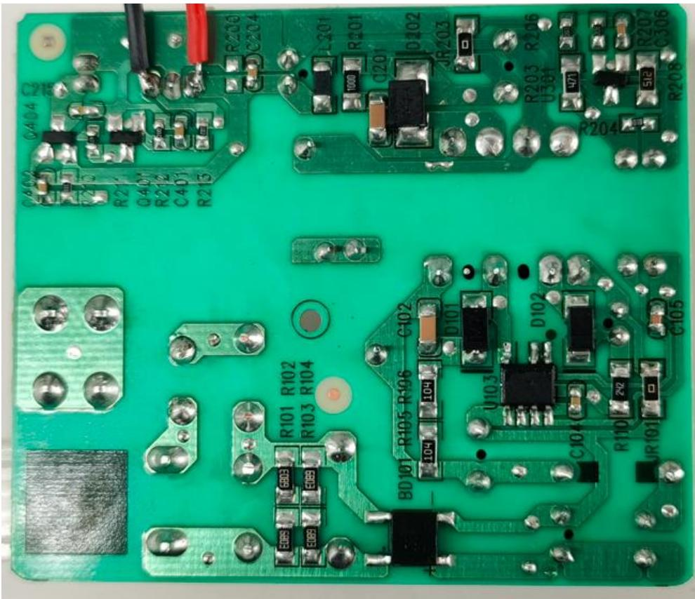

BOTTOM SIDE

待机功耗  
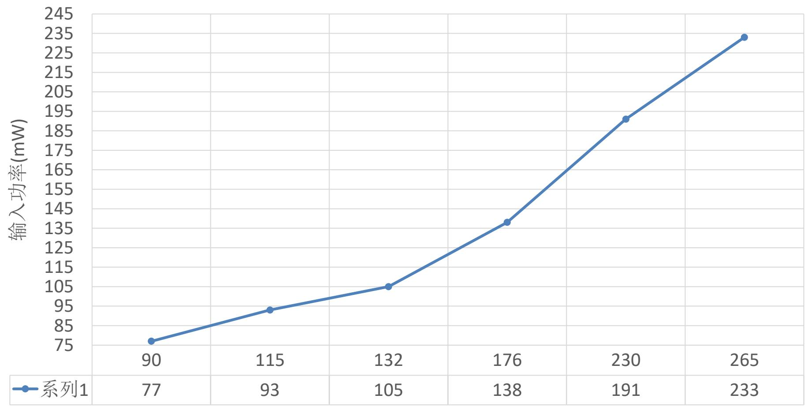

输入电压(Vac)

效率曲线  
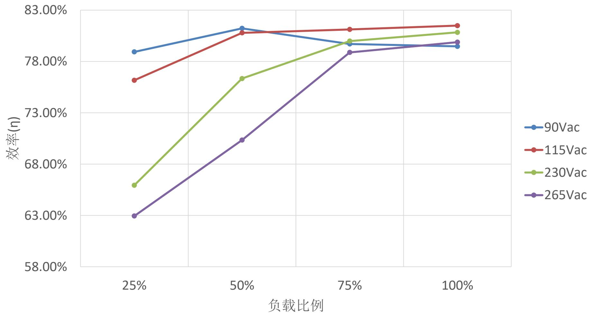

<table><tr><td> $V_{IN}(VAC)$ </td><td>Load(%)</td><td> $P_{IN}(W)$ </td><td> $V_{OUT}(V)$ </td><td> $I_{OUT}(A)$ </td><td> $P_{OUT}(W)$ </td><td>Eff(%)</td><td>AVG Eff(%)</td></tr><tr><td rowspan="6">85</td><td>空载</td><td></td><td></td><td></td><td>0</td><td></td><td></td></tr><tr><td>10%</td><td>0.89</td><td>12.19</td><td>0.05</td><td>0.6095</td><td>68.48%</td><td></td></tr><tr><td>25%</td><td>1.93</td><td>12.187</td><td>0.125</td><td>1.523375</td><td>78.93%</td><td rowspan="4">79.83%</td></tr><tr><td>50%</td><td>3.75</td><td>12.184</td><td>0.25</td><td>3.046</td><td>81.23%</td></tr><tr><td>75%</td><td>5.73</td><td>12.179</td><td>0.375</td><td>4.567125</td><td>79.71%</td></tr><tr><td>100%</td><td>7.66</td><td>12.175</td><td>0.5</td><td>6.0875</td><td>79.47%</td></tr><tr><td rowspan="6">115</td><td>空载</td><td></td><td></td><td></td><td>0</td><td></td><td></td></tr><tr><td>10%</td><td>0.92</td><td>12.19</td><td>0.05</td><td>0.6095</td><td>66.25%</td><td></td></tr><tr><td>25%</td><td>2</td><td>12.187</td><td>0.125</td><td>1.523375</td><td>76.17%</td><td rowspan="4">79.89%</td></tr><tr><td>50%</td><td>3.77</td><td>12.183</td><td>0.25</td><td>3.04575</td><td>80.79%</td></tr><tr><td>75%</td><td>5.63</td><td>12.179</td><td>0.375</td><td>4.567125</td><td>81.12%</td></tr><tr><td>100%</td><td>7.47</td><td>12.175</td><td>0.5</td><td>6.0875</td><td>81.49%</td></tr><tr><td rowspan="6">230</td><td>空载</td><td></td><td></td><td></td><td>0</td><td></td><td></td></tr><tr><td>10%</td><td>1.07</td><td>12.189</td><td>0.05</td><td>0.60945</td><td>56.96%</td><td></td></tr><tr><td>25%</td><td>2.31</td><td>12.186</td><td>0.125</td><td>1.52325</td><td>65.94%</td><td rowspan="4">75.77%</td></tr><tr><td>50%</td><td>3.99</td><td>12.183</td><td>0.25</td><td>3.04575</td><td>76.33%</td></tr><tr><td>75%</td><td>5.71</td><td>12.179</td><td>0.375</td><td>4.567125</td><td>79.98%</td></tr><tr><td>100%</td><td>7.53</td><td>12.174</td><td>0.5</td><td>6.087</td><td>80.84%</td></tr><tr><td rowspan="6">265</td><td>空载</td><td></td><td></td><td></td><td>0</td><td></td><td></td></tr><tr><td>10%</td><td>1.14</td><td>12.189</td><td>0.05</td><td>0.60945</td><td>53.46%</td><td></td></tr><tr><td>25%</td><td>2.42</td><td>12.186</td><td>0.125</td><td>1.52325</td><td>62.94%</td><td rowspan="4">73.01%</td></tr><tr><td>50%</td><td>4.33</td><td>12.183</td><td>0.25</td><td>3.04575</td><td>70.34%</td></tr><tr><td>75%</td><td>5.79</td><td>12.179</td><td>0.375</td><td>4.567125</td><td>78.88%</td></tr><tr><td>100%</td><td>7.62</td><td>12.174</td><td>0.5</td><td>6.087</td><td>79.88%</td></tr></table>

## 输出电压调整率

<table><tr><td> $V_{IN}(VAC)$  $I_{OUT}(A)$ </td><td>90</td><td>115</td><td>132</td><td>176</td><td>230</td><td>265</td><td>平均值</td><td>线调整率</td></tr><tr><td>0</td><td>12.193</td><td>12.193</td><td>12.193</td><td>12.194</td><td>12.193</td><td>12.194</td><td>12.193</td><td>0.01%</td></tr><tr><td>20%</td><td>12.19</td><td>12.19</td><td>12.19</td><td>12.19</td><td>12.191</td><td>12.19</td><td>12.190</td><td>0.01%</td></tr><tr><td>40%</td><td>12.187</td><td>12.187</td><td>12.187</td><td>12.187</td><td>12.187</td><td>12.187</td><td>12.187</td><td>0.00%</td></tr><tr><td>60%</td><td>12.184</td><td>12.184</td><td>12.184</td><td>12.184</td><td>12.184</td><td>12.184</td><td>12.184</td><td>0.00%</td></tr><tr><td>80%</td><td>12.181</td><td>12.181</td><td>12.181</td><td>12.181</td><td>12.18</td><td>12.18</td><td>12.181</td><td>0.01%</td></tr><tr><td>100%</td><td>12.177</td><td>12.177</td><td>12.176</td><td>12.176</td><td>12.176</td><td>12.176</td><td>12.176</td><td>0.01%</td></tr><tr><td>平均值</td><td>12.185</td><td>12.185</td><td>12.185</td><td>12.185</td><td>12.185</td><td>12.185</td><td></td><td></td></tr><tr><td>负载调整率</td><td>0.13%</td><td>0.13%</td><td>0.14%</td><td>0.15%</td><td>0.14%</td><td>0.15%</td><td></td><td></td></tr></table>

◼ 计算方法：调整率=100%\*(最大值-最小值)/平均值

## 输出电压纹波

20MHz带宽，去掉示波器探头正端夹子和地线环，10uF/50V 0.1uF/50V

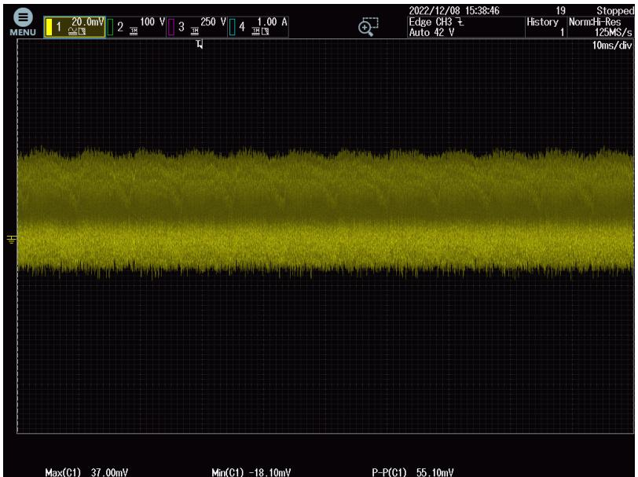

90 VAC

CH1 $\mathsf { V } _ { \mathsf { O U T } }$ Ripple $\mathsf { V } _ { \mathsf { P K - P K } }$ =55.1 mV

Test Condition:

➢ Full Load

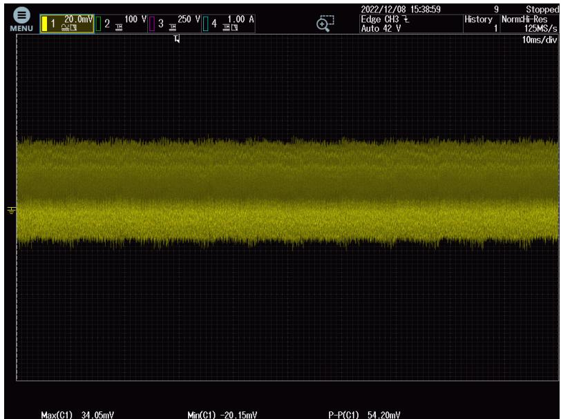

115 VAC

CH1 $\mathsf { V } _ { \mathsf { O U T } }$ Ripple $V _ { p | k - P K } = 5 4 . 2$ mV

Test Condition:

➢ Full Load

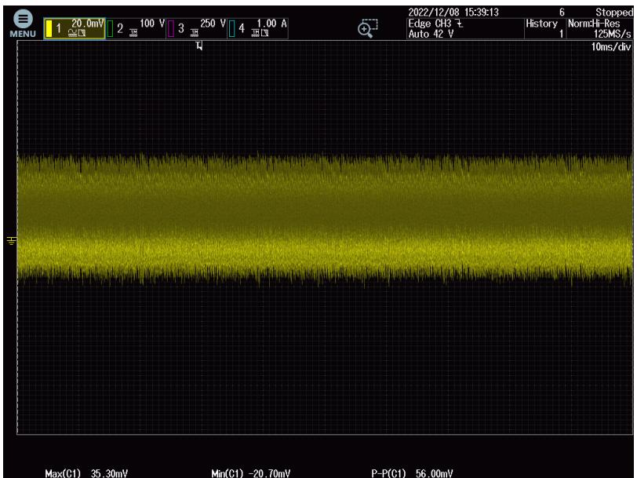

230 VAC

CH1 $\mathsf { V } _ { \mathsf { O U T } }$ Ripple $v _ { p \kappa - P \kappa } = 5 6$ mV

Test Condition:

➢ Full Load

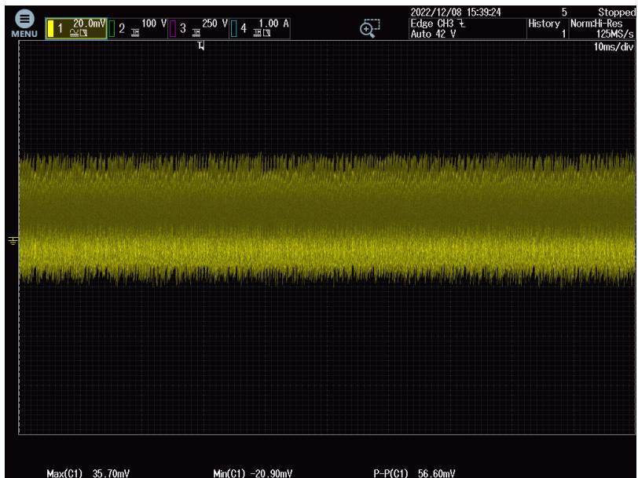

265 VAC

CH1 $\mathsf { V } _ { \mathsf { O U T } }$ Ripple $V _ { P K - P K } = 5 6 . 6$ mV

Test Condition:

➢ Full Load

## (50%-100%)

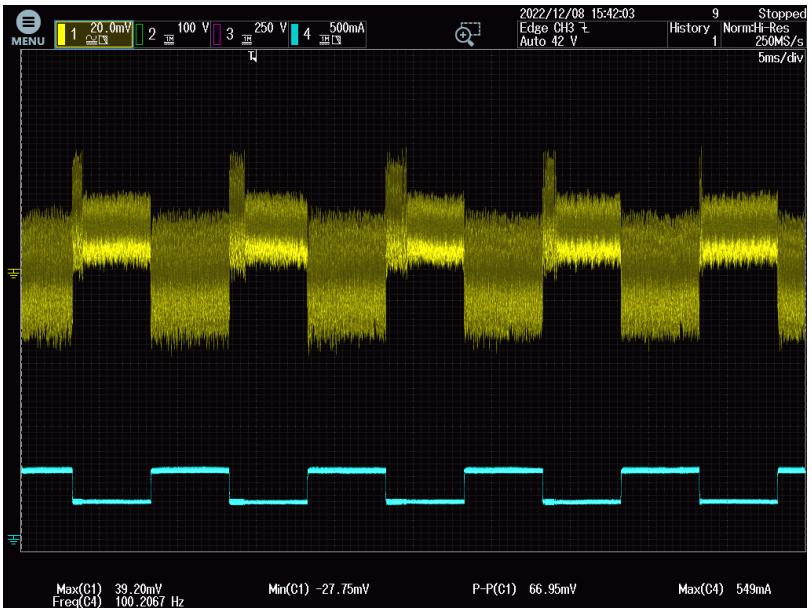

90 VAC

CH1 VOUT $\mathsf { V } _ { \mathsf { O U T } }$ $\mathsf { V } _ { \mathsf { P K - P K } } { = } 6 6 . 9 5 \mathsf { m v }$  
$\mathsf { C H 4 } \mathsf { I } _ { \mathsf { O U T } }$

## Test Condition:

➢ 0.25 A-0.5 A-0.25 A  
➢ Slew Rate: 0.5 A/μS  
➢ Frequency: 100 Hz

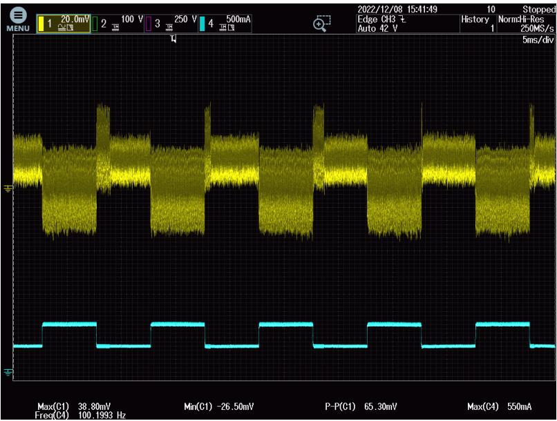

115 VAC

CH1 VOUT ${ \mathsf { C H 1 } } { \mathsf { V } } _ { \mathsf { O U T } }$ $V _ { \mathsf { P K - P K } } { = } 6 5 . 3 \mathsf { m V }$  
$\mathsf { C H 4 } \mathsf { I } _ { \mathsf { O U T } }$

## Test Condition:

➢ 0.25 A-0.5 A-0.25 A  
➢ Slew Rate: 0.5 A/μS  
➢ Frequency: 100 Hz

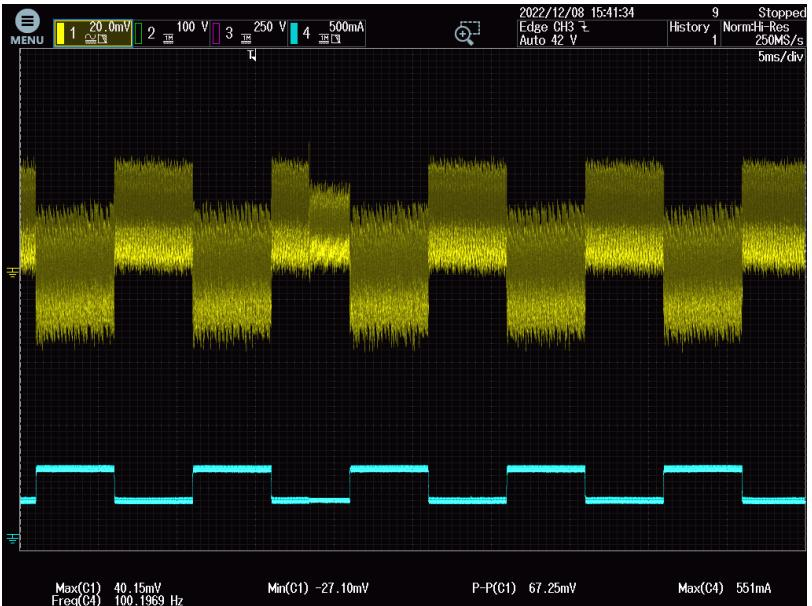

230 VAC

CH1 VOUT $\mathsf { V } _ { \mathsf { O U T } }$ $V _ { P K - P K } = 6 7 . 2 5 m v$  
$\mathsf { C H 4 } \mathsf { l } _ { \mathsf { O U T } }$

## Test Condition:

➢ 0.25 A-0.5 A-0.25 A  
➢ Slew Rate: 0.5 $\mathsf { A } / \mu \mathsf { S }$  
➢ Frequency: 100 Hz

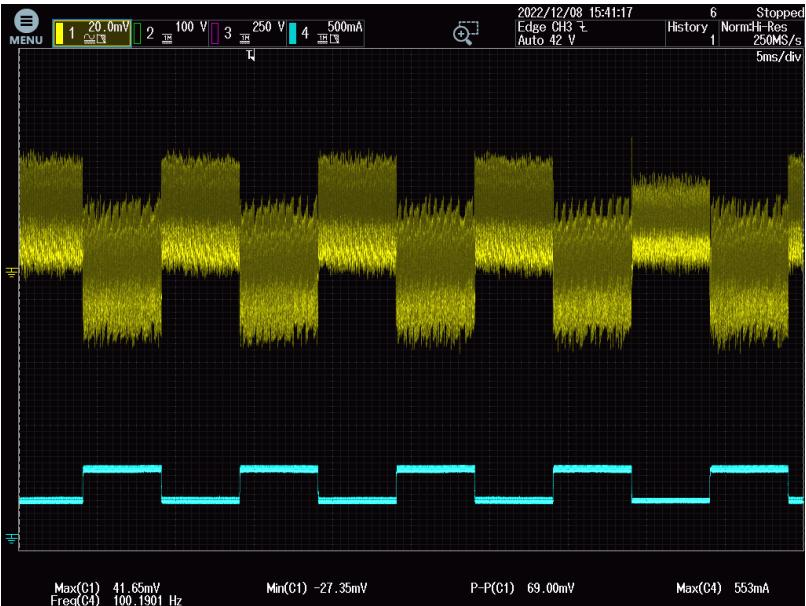

265 VAC

CH1 VOUT ${ \mathsf { C H 1 } } { \mathsf { V } } _ { \mathsf { O U T } }$ $V _ { P K - P K } = 6 9$ mV  
$\mathsf { C H 4 } \mathsf { I } _ { \mathsf { O U T } }$

## Test Condition:

➢ 0.25 A-0.5 A-0.25 A  
➢ Slew Rate: 0.5 A/μS  
➢ Frequency: 100 Hz

## (10%-90%)

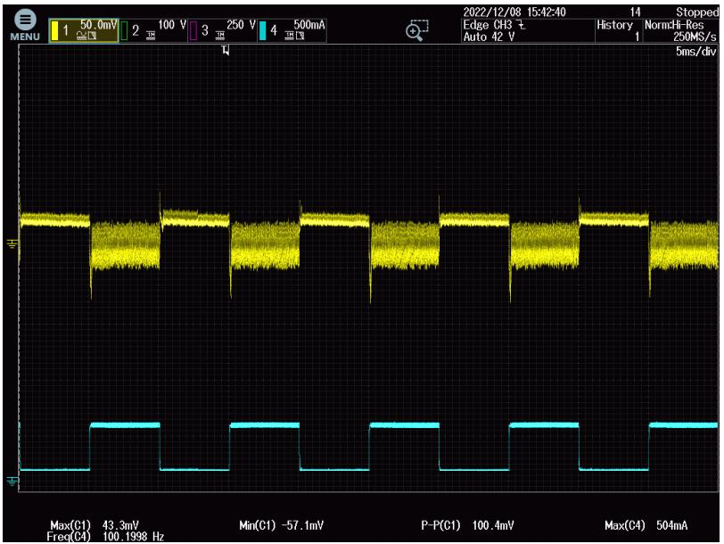

90 VAC

CH1 VOUT ${ \mathsf { C H 1 } } { \mathsf { V } } _ { \mathsf { O U T } }$ $V _ { \mathsf { P K - P K } } { = } 1 0 0 . 4 \mathsf { m V }$  
$\mathsf { C H 4 } \mathsf { I } _ { \mathsf { O U T } }$

## Test Condition:

➢ 0.05 A-0.45A-0.05 A  
➢ Slew Rate: 0.5 A/μS  
➢ Frequency: 100 Hz

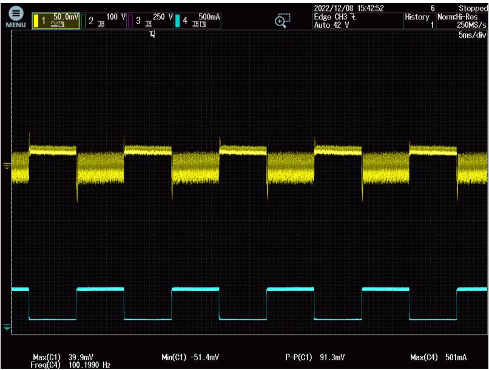

115 VAC

CH1 VOUT ${ \mathsf { C H 1 } } { \mathsf { V } } _ { \mathsf { O U T } }$ $\mathsf { V } _ { \mathsf { P K - P K } } \mathsf { = } 9 1 . 3 \mathsf { m V }$  
$\mathsf { C H 4 } \mathsf { I } _ { \mathsf { O U T } }$

## Test Condition:

➢ $0 . 0 5 \ : \mathsf { A } – 0 . 4 5 \mathsf { A } – 0 . 0 5 \ : \mathsf { A }$  
➢ Slew Rate: 0.5 A/μS  
➢ Frequency: 100 Hz

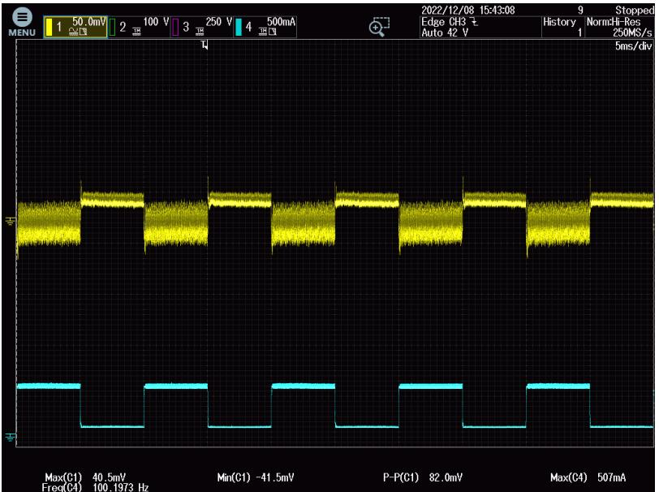

230 VAC

CH1 VOUT $\mathsf { V } _ { \mathsf { O U T } }$ $V _ { \mathsf { P K - P K } } = 8 2 ~ \mathsf { m V }$  
$\mathsf { C H 4 } \mathsf { l } _ { \mathsf { O U T } }$

## Test Condition:

➢ $0 . 0 5 \ : \mathsf { A } – 0 . 4 5 \mathsf { A } – 0 . 0 5 \ : \mathsf { A }$  
➢ Slew Rate: 0.5 $\mathsf { A } / \mu \mathsf { S }$  
➢ Frequency: 100 Hz

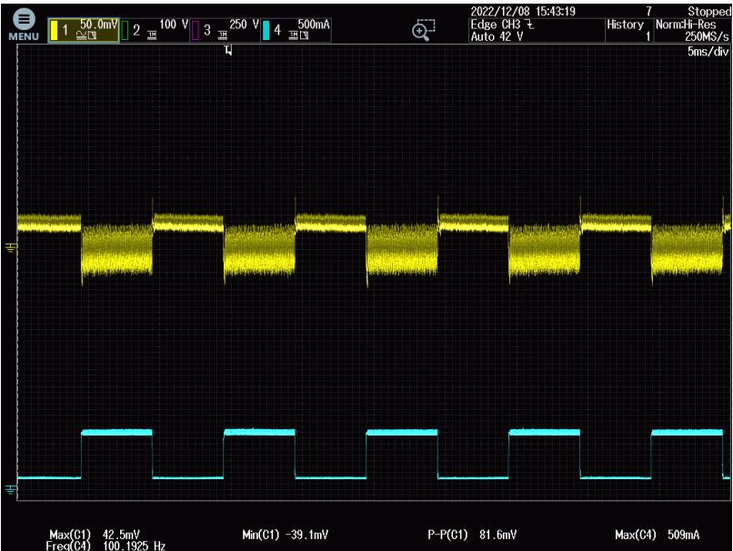

265 VAC

CH1 VOUT ${ \mathsf { C H 1 } } { \mathsf { V } } _ { \mathsf { O U T } }$ $V _ { \mathsf { P K - P K } } { = } 8 1 . 6 \mathsf { m V }$  
$\mathsf { C H 4 } \mathsf { I } _ { \mathsf { O U T } }$

## Test Condition:

➢ 0.05 A-0.45A-0.05 A  
➢ Slew Rate: 0.5 A/μS  
➢ Frequency: 100 Hz

## 输出电压开机波形

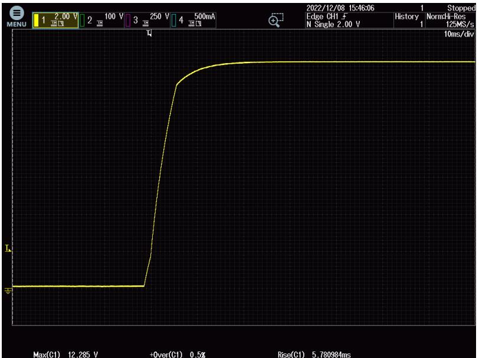

90 VAC

CH1 VOUT TRISE: 5.8 mS

## Test Condition:

➢ No Load

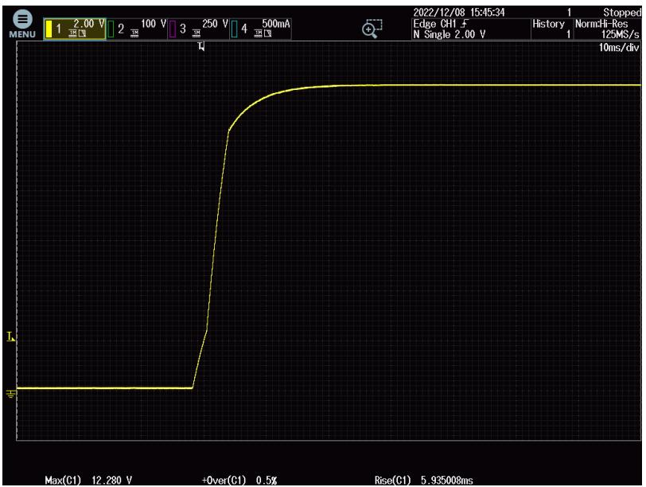

265 VAC

CH1 VOUT TRISE: 5.9 mS

## Test Condition:

➢ No Load

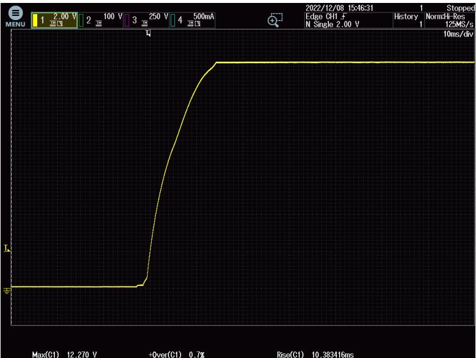

90 VAC

CH1 VOUT TRISE: 10.4 mS

## Test Condition:

➢ Full Load

265 VAC

CH1 VOUT TRISE: 6.4 mS

## Test Condition:

➢ Full Load

## MOs漏源极电压电流波形 (启机）

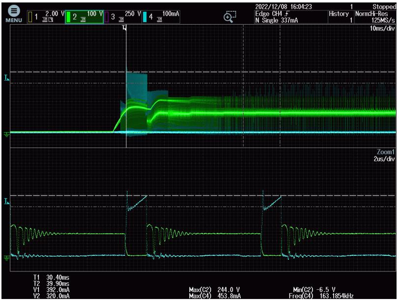

90 VAC

${ \mathsf { C H } } 2 { \mathsf { V } } _ { \mathsf { D S } }$  
$C H 4 1 _ { \mathsf { D } }$ $V _ { \mathsf { D S } } { = } 2 4 4 \vee$ IMAX= 453.8 mA $\mathsf { I } _ { \mathsf { M A X } } = 4 5 3 . 8 ~ \mathsf { m A }$

Test Condition:  
➢ No Load  
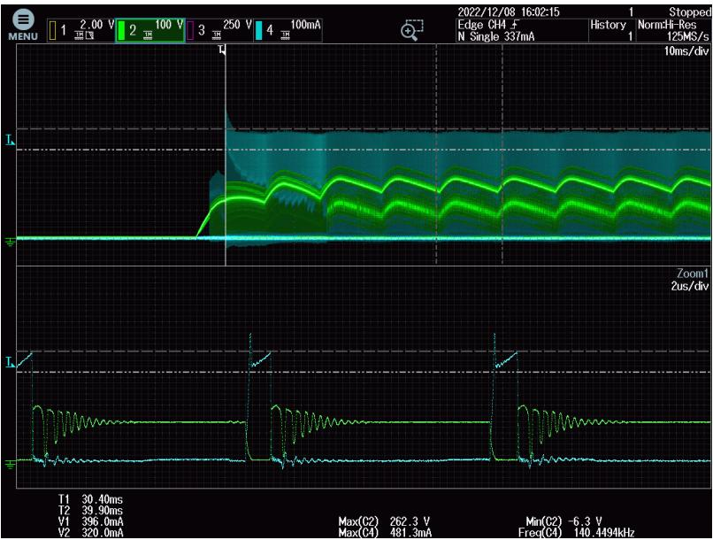

90 VAC

${ \mathsf { C H } } 2 { \mathsf { V } } _ { \mathsf { D S } }$  
$C H 4 1 _ { \mathsf { D } }$ $\mathsf { V } _ { \mathsf { D } \mathsf { S } } { = } 2 6 2 . 3 \mathrm { ~ V ~ }$ IMAX= 481.3 mA $\mathsf { I } _ { \mathsf { M A X } } = 4 8 1 . 3 ~ \mathsf { m A }$

Test Condition:  
➢ Full Load  
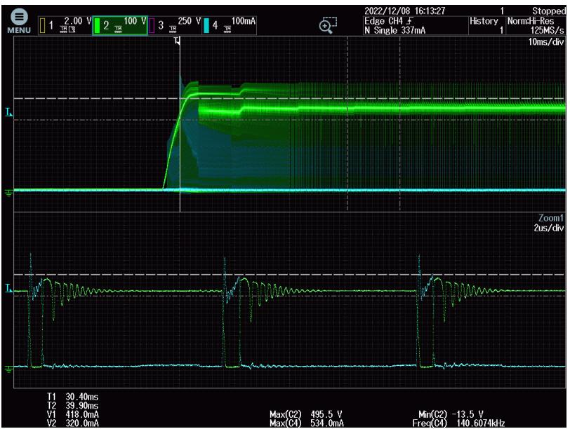

$2 6 5 \ : \mathsf { V } _ { \mathsf { A C } }$

${ \mathsf { C H } } 2 \ { \mathsf { V } } _ { \mathsf { D S } }$  
$C H 4 1 _ { \mathsf { D } }$ $\mathtt { V } _ { \mathtt { D S } } mathtt { = } 4 9 5 . 5 \mathtt { V }$ $\mathsf { I } _ { \mathsf { M A X } } { = } 5 3 4 \mathsf { m } \mathsf { A }$

Test Condition:  
➢ No Load  
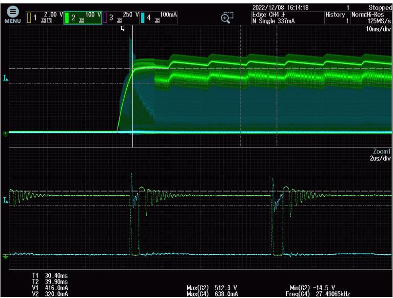

$2 6 5 \ : \mathsf { V } _ { \mathsf { A C } }$

${ \mathsf { C H } } 2 { \mathsf { V } } _ { \mathsf { D S } }$  
CH4 ID $C H 4 1 _ { \mathsf { D } }$ $\mathtt { V } _ { \mathtt { D S } } mathtt { = } 5 1 2 . 3 \ \mathtt { V }$ $\mathsf { I } _ { \mathsf { M A X } } { = } 6 3 8 \mathsf { m } \mathsf { A }$

Test Condition:

➢ Full Load

## MOs漏源极电压电流波形 (正常工作)

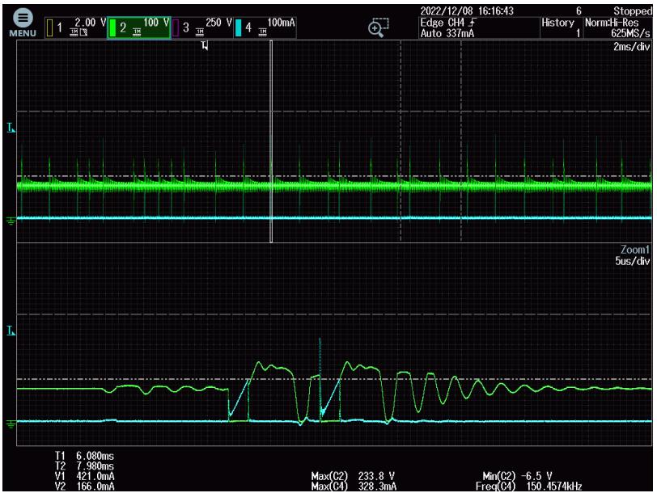

90 VAC

${ \mathsf { C H } } 2 { \mathsf { V } } _ { \mathsf { D S } }$  
$C H 4 1 _ { \mathsf { D } }$ $\mathtt { V } _ { \mathtt { D S } } mathtt { = } 2 3 3 . 8 \mathtt { V }$ $\mathsf { I } _ { \mathsf { M A X } } = 3 2 8 . 3 ~ \mathsf { m A }$ IMAX=

Test Condition:  
➢ No Load  
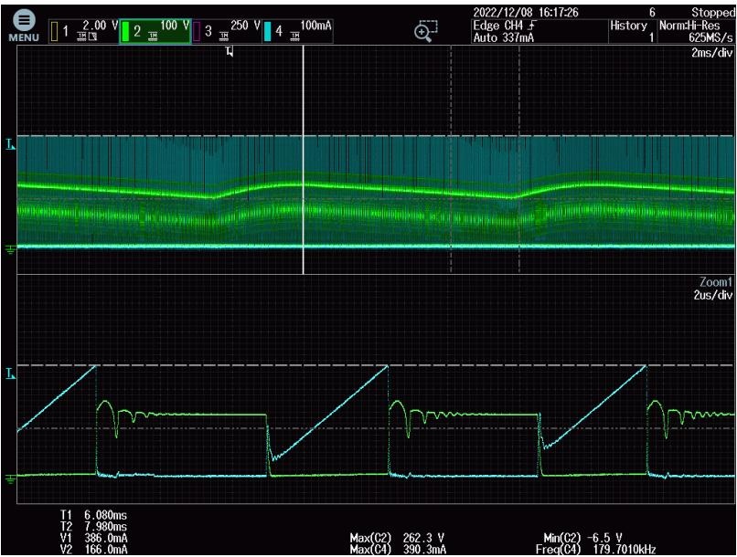

90 VAC

${ \mathsf { C H } } 2 { \mathsf { V } } _ { \mathsf { D S } }$  
$C H 4 1 _ { \mathsf { D } }$ $V _ { \mathrm { D S } } { = } 2 6 2 . 3 \ V$ $\mathsf { I } _ { \mathsf { M A X } } = 3 9 0 . 3 ~ \mathsf { m A }$ IMAX=

Test Condition:  
➢ Full Load  
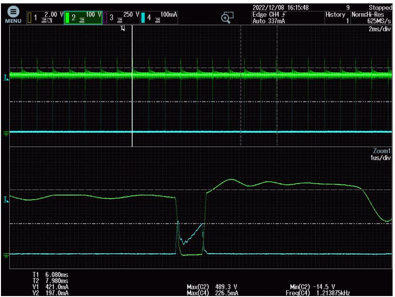

265 VAC

${ \mathsf { C H } } 2 \ { \mathsf { V } } _ { \mathsf { D S } }$  
$C H 4 1 _ { \mathsf { D } }$ $\mathtt { V } _ { \mathtt { D S } } mathtt { = } 4 8 9 . 3 \mathtt { V }$ IMAX=226.5 $\mathsf { I } _ { \mathsf { M A X } } { = } 2 2 6 . 5 ~ \mathsf { m A }$

Test Condition:  
➢ No Load  
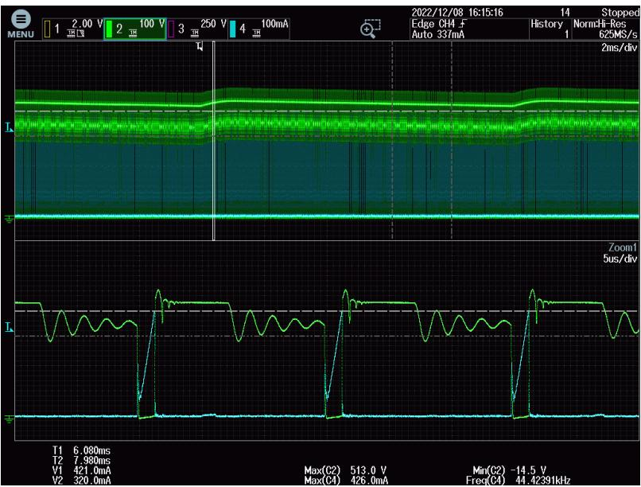

$2 6 5 \ : \mathsf { V } _ { \mathsf { A C } }$

${ \mathsf { C H } } 2 { \mathsf { V } } _ { \mathsf { D S } }$  
$C H 4 1 _ { \mathsf { D } }$ $\mathtt { V } _ { \mathtt { D S } } mathtt { = } 5 1 3 \mathtt { V }$ IMAX=426 mA $\mathsf { I } _ { \mathsf { M A X } } { = } 4 2 6 \mathsf { m } \mathsf { A }$

Test Condition:

➢ Full Load

## 输出二极管电压波形

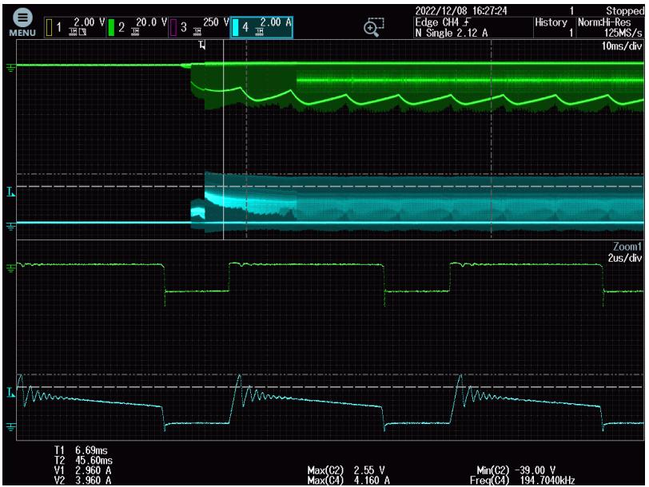

90 VAC

$C H 2 V _ { \mathsf { D } }$  
$C H 4 1 _ { \mathsf { D } }$ $\mathtt { V } _ { \mathtt { D } } \mathtt { = } 3 9 \mathrm { ~ V ~ }$ $\mathsf { I } _ { \mathsf { D m a x } } { = } 4 . 1 6 ~ \mathsf { A }$

## Test Condition:

➢ Full Load  
➢ 开机

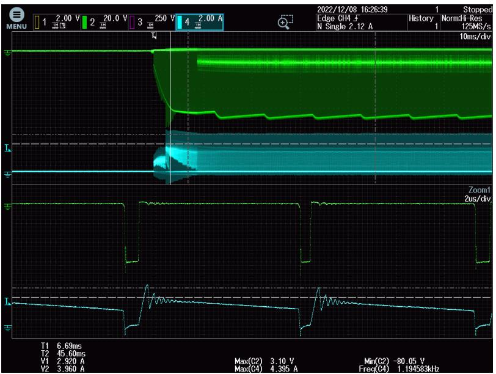

265 VAC

$C H 2 V _ { \mathsf { D } }$  
$C H 4 1 _ { \mathsf { D } }$ $V _ { \mathsf { D } } { = } 8 0 . 0 5 \ V$ $\mathsf { I } _ { \mathsf { D m a x } } { = } 4 . 3 9 5 ~ \mathsf { A }$ Dmax

## Test Condition:

➢ Full Load  
➢ 开机

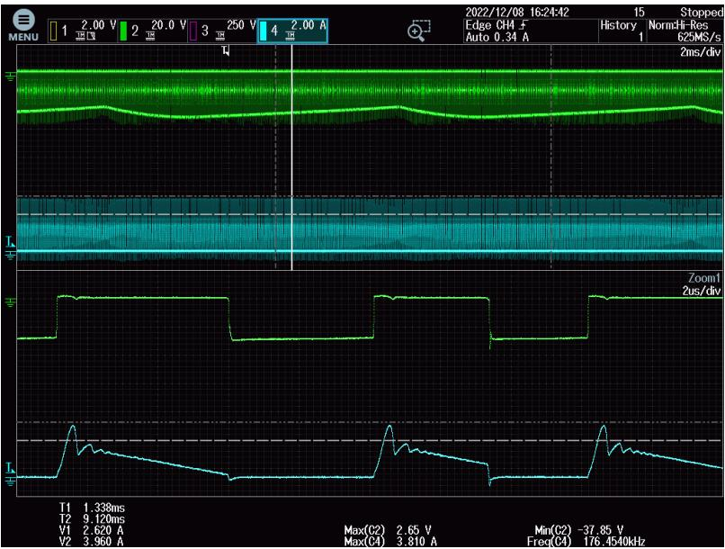

90 VAC

$C H 2 V _ { \mathsf { D } }$  
$C H 4 1 _ { \mathsf { D } }$ $V _ { \sf D } { = } 3 7 . 8 5 \ V$ $\mathsf { I } _ { \mathsf { D m a x } } = 3 . 8 1 \mathsf { A }$ IDmax

## Test Condition:

➢ Full Load

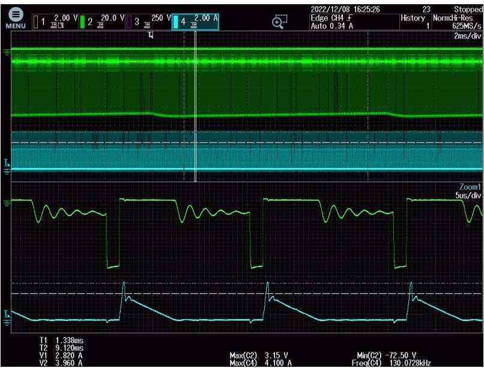

265 VAC

$C H 2 V _ { \mathsf { D } }$  
$C H 4 1 _ { \mathsf { D } }$ $\mathtt { V } _ { \mathtt { D } } { = } 7 2 . 5 \mathtt { V }$ $\mathsf { I } _ { \mathsf { D m a x } } { = } 4 . 1 \mathsf { A }$ IDmax

## Test Condition:

➢ Full Load

## 输出短路时MOs和二极管波形

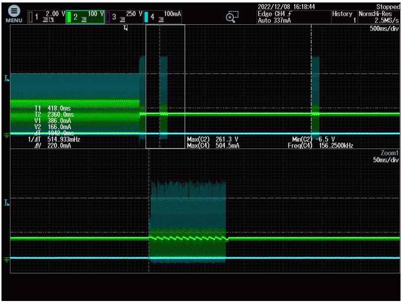  
90 VAC

${ \mathsf { C H } } 2 { \mathsf { V } } _ { \mathsf { D S } }$  
$\begin{array} { r l } & { \mathsf { C H 4 1 } _ { \mathsf { D } } } \\ & { \mathsf { V _ { D S \_ m a x } } = 2 6 1 . 3 \mathsf { V } } \\ & { \mathsf { I _ { D S \_ m a x } } = 5 0 4 . 5 \mathsf { m A } } \end{array}$

## MOS

## Test Condition:

➢ Full Load

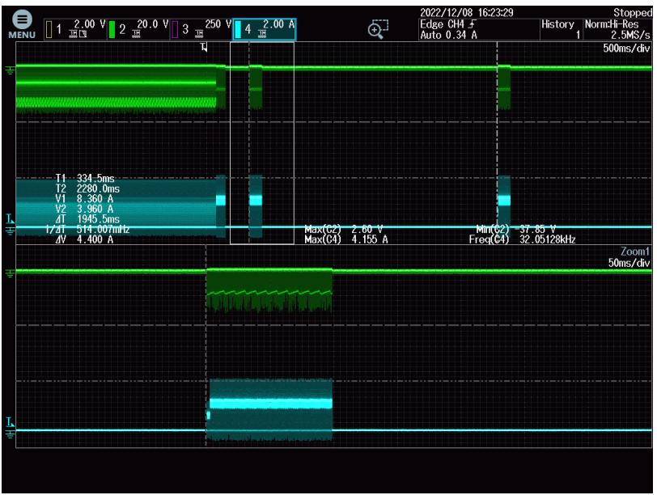

90 VAC

CH2 VD  
CH4 ID $V _ { \sf D } { = } 3 7 . 8 5 \ V$ $\mathsf { I } _ { \mathsf { D m a x } } 3 4 . 1 5 5 \mathrm { A }$ Dmax

## Test Condition:

➢ Full Load

## 二极管

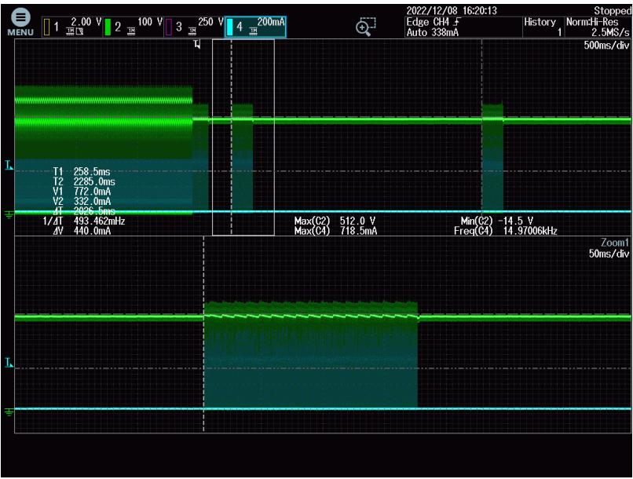

## 265 VAC

CH2 VDS  
CH4 ID $\begin{array} { l } { { \tt V } _ { \tt D S \_ m a x } = 5 1 2 { \tt V } } \\ { { \tt I } _ { \tt D S \_ m a x } = 7 1 8 . 5 \mathrm { \ m A } } \end{array}$

## MOS

## Test Condition:

➢ Full Load

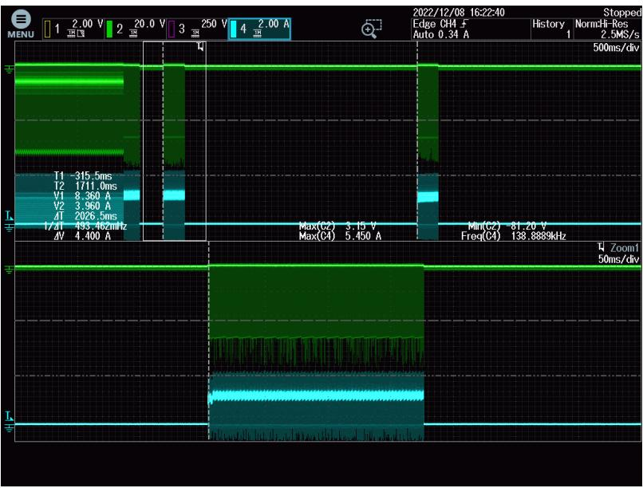

## 265 VAC

CH2 VD  
CH4 ID $\mathtt { V } _ { \mathtt { D } } mathtt { = } 8 1 . 2 \mathtt { V }$ $V _ { \sf D m a x } { = } 5 . 4 5 ~ \mathsf { A }$

## Test Condition:

➢ Full Load

## 二极管

## Brown In

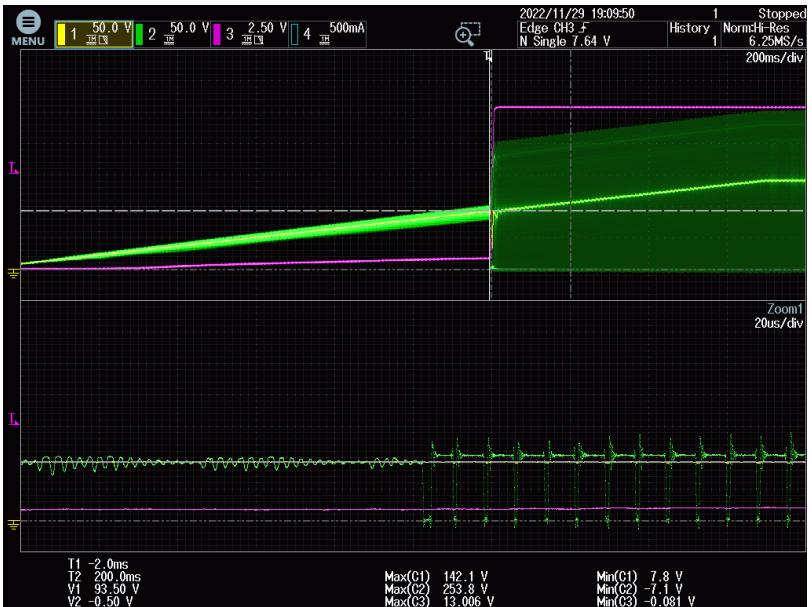

## Brown In

CH1 VIN\_DC $\mathsf { V } _ { \mathsf { I N \_ D C } }$  
${ \mathsf { C H } } 2 { \mathsf { V } } _ { \mathsf { d s } }$  
CH3 $\mathsf { V } _ { \mathsf { o u t } }$

$$
V _ {I N \_ D C} = 9 3 V
$$

## Test Condition:

➢ No Load

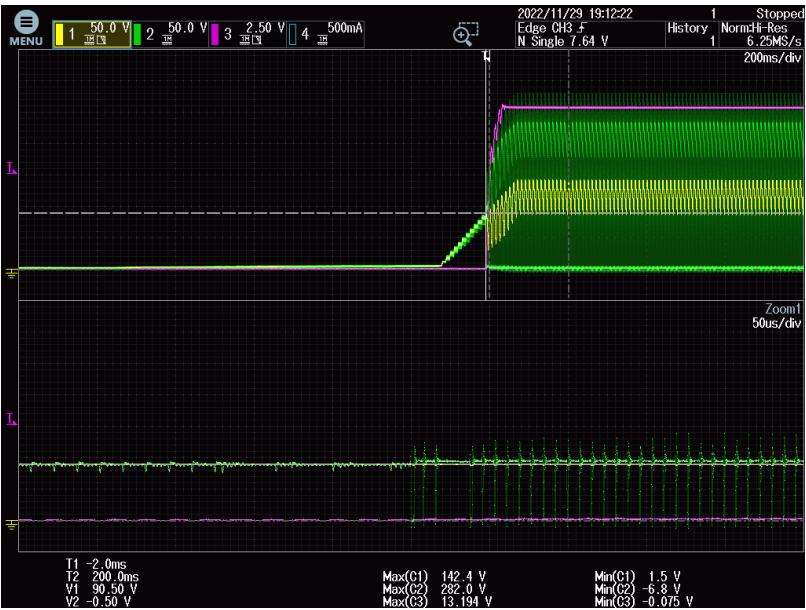

## Brown In

CH1 VIN\_DC $V _ { \mathsf { I N \_ D C } }$  
$\mathsf { C H } 2 \mathsf { V } _ { \mathsf { d s } }$  
CH3 $\mathsf { V } _ { \mathsf { o u t } }$

$$
V _ {I N \_ D C} = 9 0. 5 \mathrm{V}
$$

## Test Condition:

➢ Full Load

## 输入过压保护及恢复波形

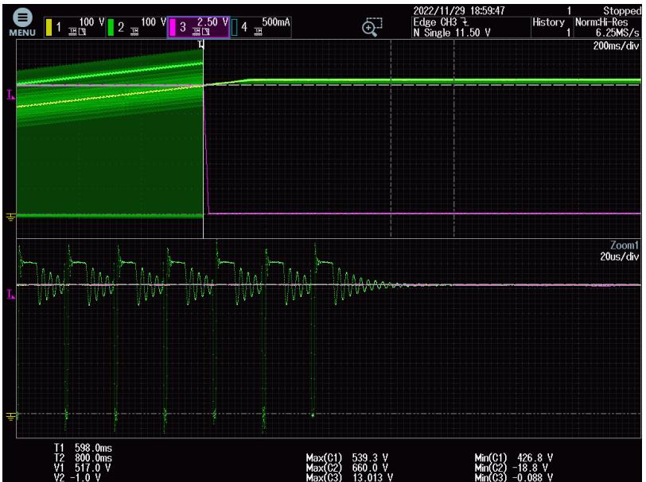

## 输入过压保护

CH1 VIN\_DC $V _ { \mathsf { I N \_ D C } }$  
CH2 $\mathsf { V } _ { \mathrm { d } s }$  
CH3 ${ \sf V } _ { 0 }$

$$
\begin{array}{l} \mathrm {V_ {DS\_max}} = 6 6 0 \mathrm{V} \\ \mathrm {V_ {IN\_DC}} = 5 1 7 \mathrm{V} \end{array}
$$

## Test Condition:

➢ IO=0.5A

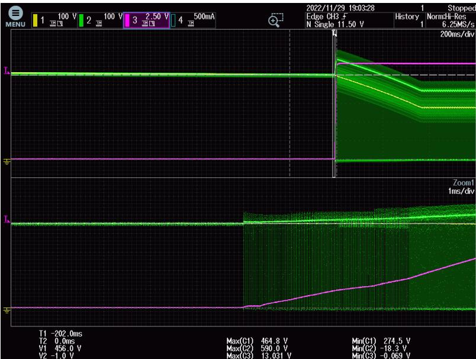

## 输入过压恢复

CH1 VIN\_DC $V _ { \mathsf { I N \_ D C } }$  
CH2 $\mathsf { V } _ { \mathsf { d } s }$  
CH3 ${ \sf V } _ { 0 }$

$$
V _ {I N \_ D C} = 4 5 6 \mathrm{V}
$$

## Test Condition:

➢ IO=0.5A

## 温升测试

<table><tr><td rowspan="2">项目</td><td colspan="4">温度(°C)</td></tr><tr><td>90VAC</td><td>115VAC</td><td>230VAC</td><td>264VAC</td></tr><tr><td>环境温度</td><td>38.1</td><td>38.4</td><td>38.9</td><td>38.9</td></tr><tr><td>BPA8616D (U103)</td><td>99.6</td><td>87.2</td><td>79.2</td><td>84.5</td></tr><tr><td>SS3200 (D202)</td><td>68.7</td><td>68.7</td><td>61.4</td><td>74.2</td></tr><tr><td>变压器绕组 (T101)</td><td>61.3</td><td>60.3</td><td>62.3</td><td>63.7</td></tr><tr><td>变压器磁芯 (T101)</td><td>61.1</td><td>60</td><td>65.2</td><td>64.2</td></tr><tr><td>输入电解电容(C101)</td><td>66.8</td><td>61.7</td><td>58.8</td><td>61</td></tr><tr><td>输出电解电容(C202)</td><td>58.7</td><td>58.1</td><td>59.3</td><td>60.6</td></tr></table>

## 测试说明

➢ 在温箱中进行测试  
➢ 电路板放在一个封闭的盒子内  
➢ 热电偶连接到各个测量点  
➢ 等测量点温度达到稳定后记录数据

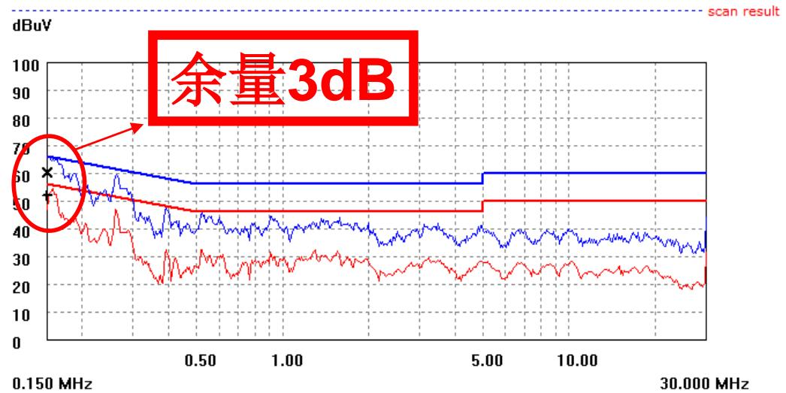

115VAC Line

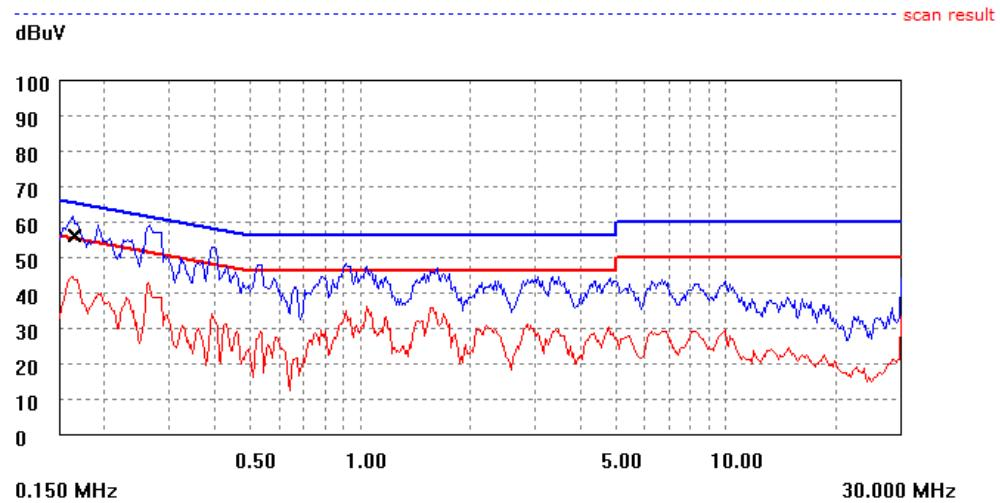

230VAC Line

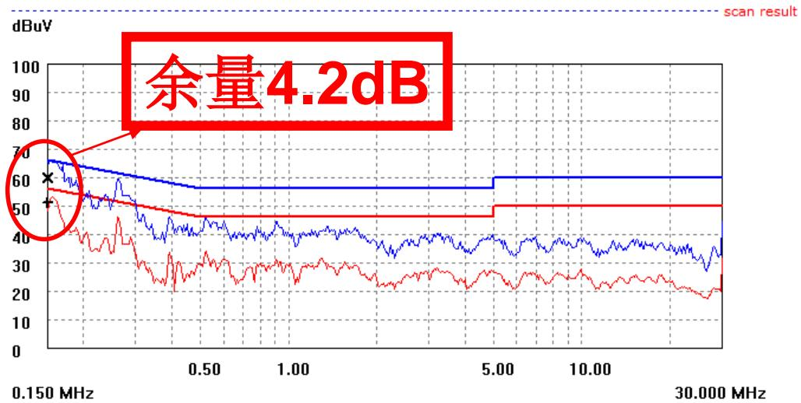

115VAC Neutral

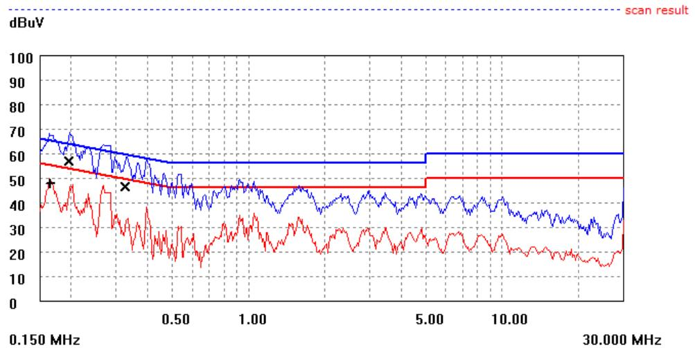

230VAC Neutral

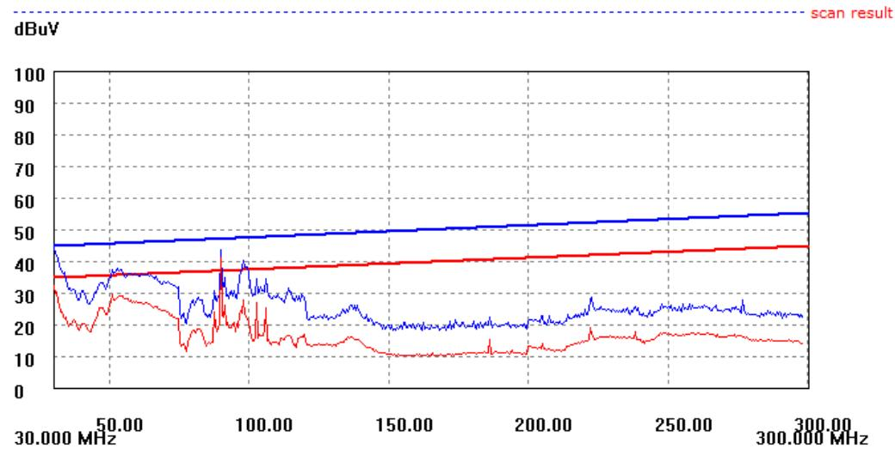

115VAC Neutral

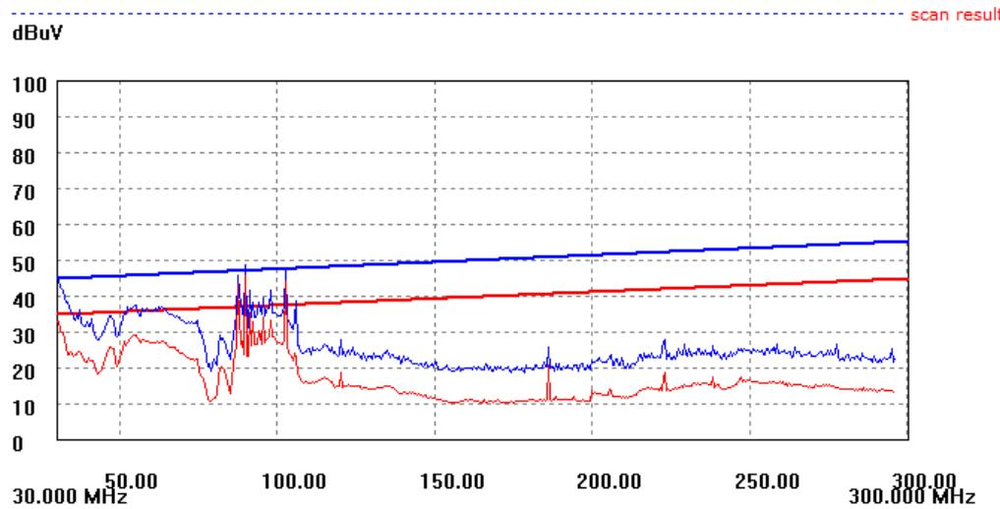

230VAC Neutral

## EMI-L102 1mH

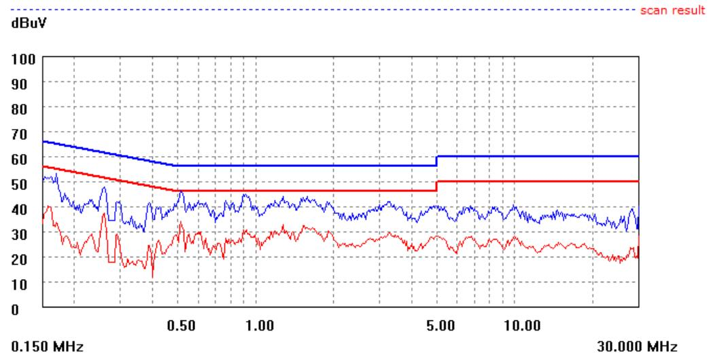

115VAC Line

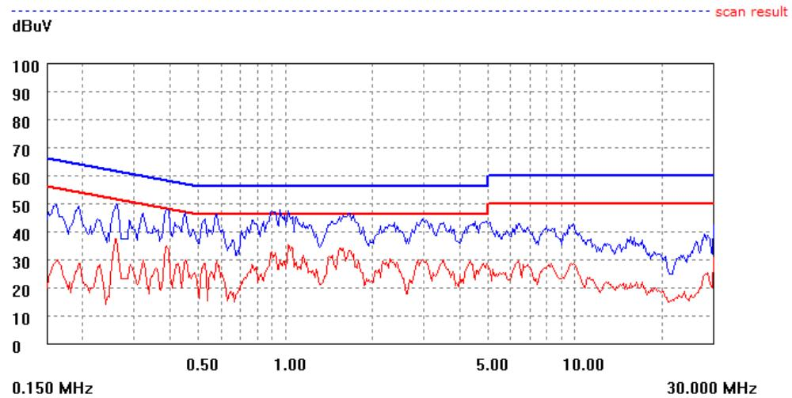

230VAC Line

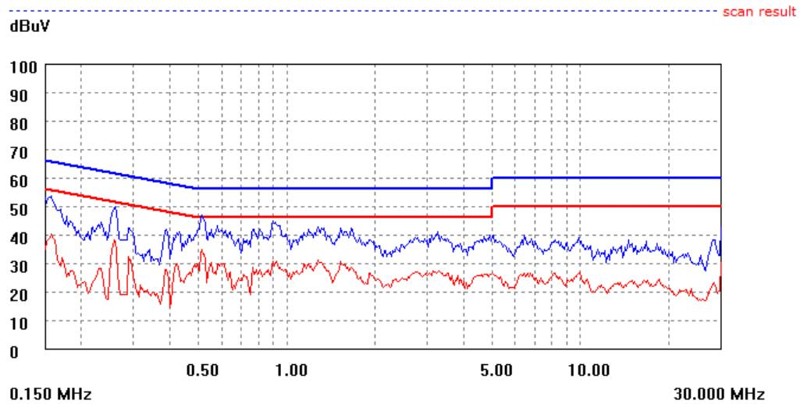

115VAC Neutral

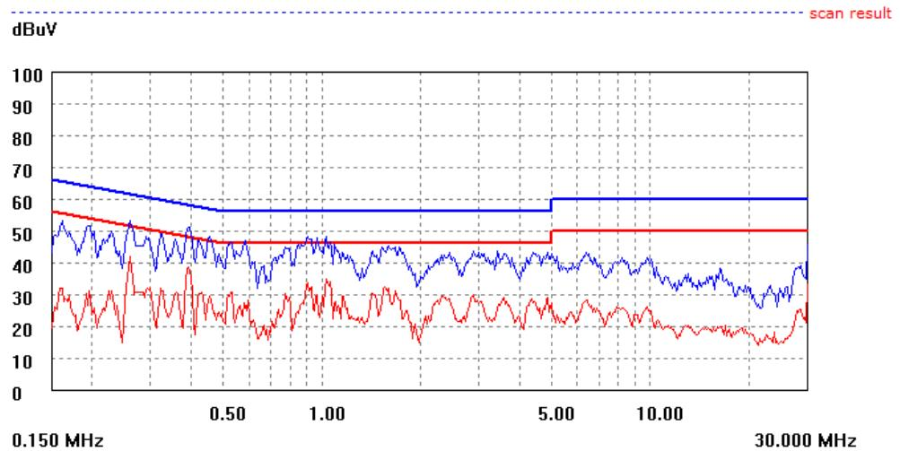

230VAC Neutral

<table><tr><td>差模</td><td>电压</td><td>相位角</td><td>发生器阻抗</td><td>测试次数</td><td>测试结果</td></tr><tr><td>L to N</td><td>+2kV</td><td>0</td><td>2</td><td>10</td><td>Fail(芯片损坏)</td></tr><tr><td>L to N</td><td>-2kV</td><td>0</td><td>2</td><td>10</td><td></td></tr><tr><td>L to N</td><td>+2kV</td><td>90</td><td>2</td><td>10</td><td></td></tr><tr><td>L to N</td><td>-2kV</td><td>90</td><td>2</td><td>10</td><td></td></tr><tr><td>L to N</td><td>+2kV</td><td>180</td><td>2</td><td>10</td><td></td></tr><tr><td>L to N</td><td>-2kV</td><td>180</td><td>2</td><td>10</td><td></td></tr><tr><td>L to N</td><td>+2kV</td><td>270</td><td>2</td><td>10</td><td></td></tr><tr><td>L to N</td><td>-2kV</td><td>270</td><td>2</td><td>10</td><td></td></tr></table>

## 测试说明

➢ 按照GB/T17626.5和IEC61000-4-5的最新版本要求进行测试  
➢ 室温环境，230VAC输入，满载条件  
➢ 输入1.2/50us组合波浪涌电压  
➢ 每个测试点重复10次  
➢ 每次间隔时间1分钟  
➢ 试验时样机正常工作（符合A类标准）视为Pass

# 按文档最后的建议更改可通过2KV

<table><tr><td>差模</td><td>电压</td><td>脉冲群持续时间</td><td>脉冲频率</td><td>测试时间</td><td>测试结果</td></tr><tr><td>L to N</td><td>+4kV</td><td>15ms</td><td>5kHz</td><td>120s</td><td>Pass</td></tr><tr><td>L to N</td><td>-4kV</td><td>15ms</td><td>5kHz</td><td>120s</td><td>Pass</td></tr><tr><td>L to N</td><td>+4kV</td><td>0.75ms</td><td>100kHz</td><td>120s</td><td>Pass</td></tr><tr><td>L to N</td><td>-4kV</td><td>0.75ms</td><td>100kHz</td><td>120s</td><td>Pass</td></tr><tr><td>L to N</td><td>+2kV</td><td>2ms</td><td>38kHz</td><td>120s</td><td>Pass</td></tr><tr><td>L to N</td><td>-2kV</td><td>2ms</td><td>38kHz</td><td>120s</td><td>Pass</td></tr><tr><td>L to N</td><td>+4kV</td><td>2ms</td><td>38kHz</td><td>120s</td><td>Pass</td></tr><tr><td>L to N</td><td>-4kV</td><td>2ms</td><td>38kHz</td><td>120s</td><td>Pass</td></tr></table>

## 测试说明

➢ 按照GB/T17626.4和IEC61000-4-4的最新版本要求进行测试  
➢ 室温环境，230VAC输入满载条件  
➢ 分别测试5kHz/100kHz/38kHz脉冲频率  
➢ 脉冲群周期为300ms  
➢ 每个测试条件测试时间120s  
➢ 试验时样机输出正常（符合A类标准）视为Pass

<table><tr><td>测试点</td><td>电压(V)</td><td>放电类型</td><td>放电次数</td><td>测试结果</td></tr><tr><td>Vo</td><td>+15kV</td><td>空气放电</td><td>10</td><td>Pass</td></tr><tr><td>Vo</td><td>-15kV</td><td>空气放电</td><td>10</td><td>Pass</td></tr><tr><td>GND</td><td>+15kV</td><td>空气放电</td><td>10</td><td>Fail (TL431损坏)</td></tr><tr><td>GND</td><td>-15kV</td><td>空气放电</td><td>10</td><td></td></tr><tr><td>Vo</td><td>+8kV</td><td>接触放电</td><td>10</td><td></td></tr><tr><td>Vo</td><td>-8kV</td><td>接触放电</td><td>10</td><td></td></tr><tr><td>GND</td><td>+8kV</td><td>接触放电</td><td>10</td><td></td></tr><tr><td>GND</td><td>-8kV</td><td>接触放电</td><td>10</td><td></td></tr></table>

## 测试说明

➢ 按照GB/T17626.2和IEC61000-4-2的最新版本要求进行测试  
➢ 室温环境，230VAC输入满载条件  
➢ 每个测试点重复10次  
➢ 分别对输出正端和地进行空气放电  
➢ 试验时样机输出正常（符合A类标准）视为Pass

## 初次级加放电针后Pass

## 建议:

❑ VCC 11 R110 4.7K 容易在ESD等测试时误触发保护  
❑ L102 EMI  
□建议PCB在初次级之间加放电针，避免ESD时损坏反馈电路器件或芯片  
针对浪涌差模2KV的改进：

➢ Class B L102 1mH  
➢ Class A C108 10uF 10R

## THANK YOU FOR WATCHING
