## BPA8616D 隔离参考设计\_\_12V0.5A（隔离)+18V0.2A （非隔离）

上海晶丰明源半导体股份有限公司

Shanghai Bright Power Semiconductor Co., Ltd.

王岩

时间：2021年7月232021-11-30

## 内容

BPA8616D简介  
电源规格  
电路及实物图  
BOM  
PCB Layout图  
性能测试数据

## 产品特点：

➢ 集成 700V 高压 MOSFET  
➢ ON/OFF控制模式，低输出纹波  
➢ 内置软启动功能  
➢ 集成高压启动、自供电电路  
➢ 低音频噪声  
➢ 输入过/欠压保护

## 应用领域：

➢ 家用电器辅助电源  
➢ 电机驱动辅助电源  
➢ IOT/智能家居/智能照明  
➢ 工业控制辅助电源

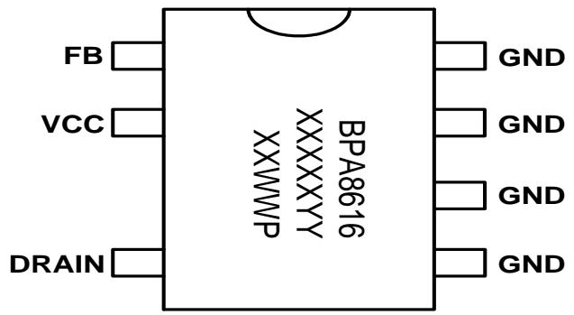

<table><tr><td>项目描述</td><td>符号</td><td>最小</td><td>典型</td><td>最大</td><td>单位</td><td>备注</td></tr><tr><td colspan="7">输入</td></tr><tr><td>电压</td><td> $V_{IN}$ </td><td>176</td><td>230</td><td>264</td><td> $V_{AC}$ </td><td></td></tr><tr><td>频率</td><td> $f_{LINE}$ </td><td>47</td><td>50</td><td>53</td><td>Hz</td><td></td></tr><tr><td colspan="7">输出</td></tr><tr><td>输出电压</td><td> $V_{OUT}$ </td><td>11.4</td><td>12</td><td>12.6</td><td>V</td><td>±5%</td></tr><tr><td>输出电流</td><td> $I_{OUT1}$ </td><td>0</td><td></td><td>500</td><td>mA</td><td></td></tr><tr><td>输出电压</td><td> $V_{OUT}$ </td><td></td><td>18</td><td></td><td>V</td><td>±5%</td></tr><tr><td>输出电流</td><td> $I_{OUT1}$ </td><td>0</td><td></td><td>200</td><td>mA</td><td></td></tr><tr><td>输出电压纹波</td><td> $V_{RIPPLE}$ </td><td></td><td></td><td>120</td><td>mV</td><td>12V输出,20MHz带宽</td></tr><tr><td>连续输出功率</td><td> $P_{OUT}$ </td><td></td><td>9.6</td><td></td><td>W</td><td></td></tr><tr><td colspan="7">效率</td></tr><tr><td>待机功耗</td><td> $P_{STDBY}$ </td><td></td><td></td><td>100</td><td>mW</td><td>230VAC,包含假负载</td></tr><tr><td>满载效率</td><td>η</td><td>75</td><td></td><td></td><td>%</td><td></td></tr><tr><td colspan="7">环境</td></tr><tr><td>传导EMI</td><td></td><td colspan="4">满足CISPR22/EN55022 Class B,至少5dB 裕量</td><td></td></tr><tr><td>Surge</td><td></td><td></td><td>2</td><td></td><td>kV</td><td>差模</td></tr><tr><td>EFT</td><td></td><td></td><td>4</td><td></td><td>kV</td><td>5kHz/100kHz/38kHz</td></tr><tr><td>ESD</td><td></td><td></td><td>15</td><td>20</td><td>kV</td><td>空气放电</td></tr><tr><td>工作环境温度</td><td> $T_{AMP}$ </td><td>0</td><td></td><td>50</td><td>°C</td><td></td></tr></table>

## 电路及实物图

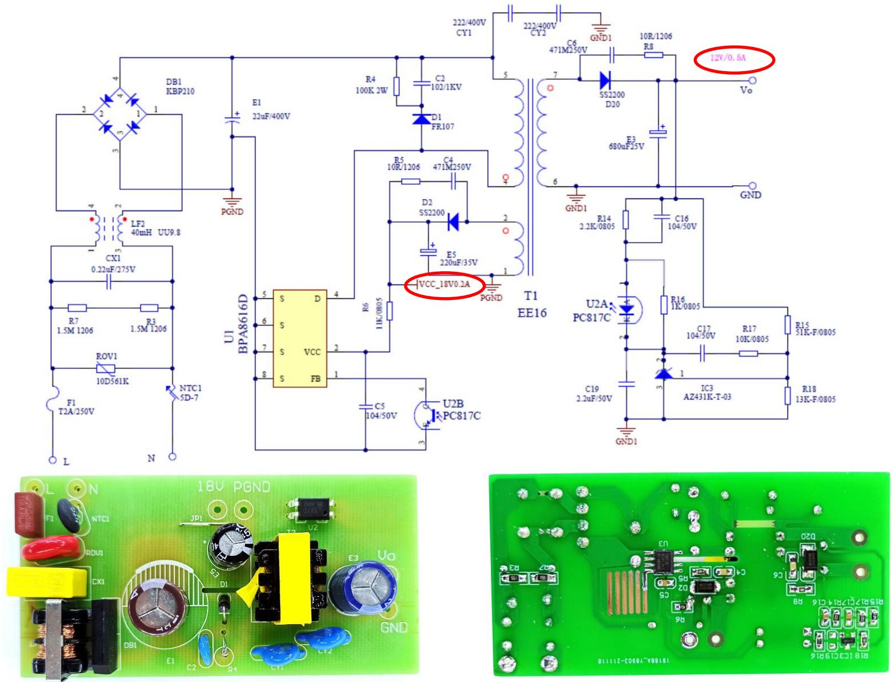

<table><tr><td>序号</td><td>元件标号</td><td>参数描述</td><td>封装尺寸</td><td>数量</td></tr><tr><td>1</td><td>PCB</td><td>CEM-1, 单面板</td><td>84mm*42mm</td><td>1</td></tr><tr><td>2</td><td>F1</td><td>T2A 250V 保险丝</td><td>DIP</td><td>1</td></tr><tr><td>3</td><td>ROV1</td><td>10D561, 压敏电阻</td><td>10D561</td><td>1</td></tr><tr><td>4</td><td>NTC1</td><td>10D11,热敏电阻</td><td>10D11</td><td>1</td></tr><tr><td>5</td><td>CX1</td><td>0.22uF 275v X电容</td><td>7*13.5</td><td>1</td></tr><tr><td>6</td><td>E1</td><td>400V22uF电解电容</td><td> $\phi 10*18$ </td><td>1</td></tr><tr><td>7</td><td>LF2</td><td>UU9.8 40mH</td><td>DIP</td><td>1</td></tr><tr><td>8</td><td>E5</td><td>35V220uF</td><td> $\phi 5*11$ </td><td>1</td></tr><tr><td>9</td><td>DB1</td><td>GB210 2A 1KV</td><td>DIP</td><td>1</td></tr><tr><td>10</td><td>J1</td><td>跳线 0.6*7.5</td><td>DIP</td><td>1</td></tr><tr><td>11</td><td>R4</td><td>0.5W 100K 金属膜电阻</td><td>DIP</td><td>1</td></tr><tr><td>12</td><td>C2</td><td>1nF 1kv 瓷片电容</td><td>DIP</td><td>1</td></tr><tr><td>13</td><td>D1</td><td>FR107 1A 1KV</td><td>D0-41</td><td>1</td></tr><tr><td>14</td><td>D20</td><td>SS2200 2A 200V SEA STAR</td><td>SMA</td><td>1</td></tr><tr><td>15</td><td>U2</td><td>PC817C 光耦</td><td>DIP</td><td>1</td></tr><tr><td>16</td><td>CY1,CY2</td><td>222PF 400V AC Y1</td><td>DIP</td><td>2</td></tr><tr><td>17</td><td>T1</td><td>EE216加高 1.7mH</td><td>DIP</td><td>1</td></tr><tr><td>18</td><td>E3</td><td>25V/680uF电解电容,高频低阻</td><td> $\phi 10*12mm$ </td><td>1</td></tr><tr><td>19</td><td>U3</td><td>BPA8616D</td><td>SOP-7</td><td>1</td></tr></table>

<table><tr><td>序号</td><td>元件标号</td><td>参数描述</td><td>封装尺寸</td><td>数量</td></tr><tr><td>20</td><td>IC3</td><td>AZ431</td><td>SOT23-3</td><td>1</td></tr><tr><td>21</td><td>D2</td><td>SS2200,2A,200V</td><td>SMA</td><td>1</td></tr><tr><td>22</td><td>R5,R8</td><td>10R, ±5%</td><td>SMD1206</td><td>2</td></tr><tr><td>23</td><td>R3,R7</td><td>1.5M, ±5%</td><td>SMD1206</td><td>2</td></tr><tr><td>24</td><td>C6,C4</td><td>470pF, 1KV X7R</td><td>SMD1206</td><td>2</td></tr><tr><td>25</td><td>C17,C16,C5</td><td>100nF, 25V X7R</td><td>SMD0805</td><td>3</td></tr><tr><td>26</td><td>R6</td><td>11K, ±5%</td><td>SMD0805</td><td>1</td></tr><tr><td>27</td><td>R16</td><td>1k, ±5%</td><td>SMD0805</td><td>1</td></tr><tr><td>28</td><td>R18</td><td>13k, ±5%</td><td>SMD0805</td><td>1</td></tr><tr><td>29</td><td>R15</td><td>51K, ±5%</td><td>SMD0805</td><td>1</td></tr><tr><td>30</td><td>R17</td><td>10K, ±5%</td><td>SMD0805</td><td>1</td></tr><tr><td>31</td><td>R14</td><td>2.2K, ±5%</td><td>SMD0805</td><td>1</td></tr><tr><td>32</td><td>C19</td><td>2.2uF, 25V ,X7R</td><td>SMD0805</td><td>1</td></tr><tr><td></td><td></td><td></td><td>Total</td><td>38</td></tr></table>

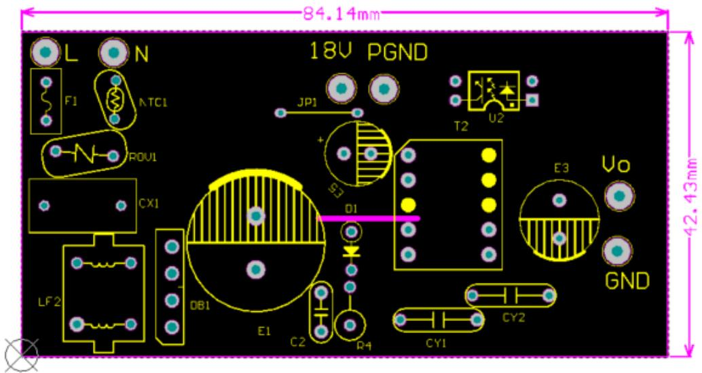

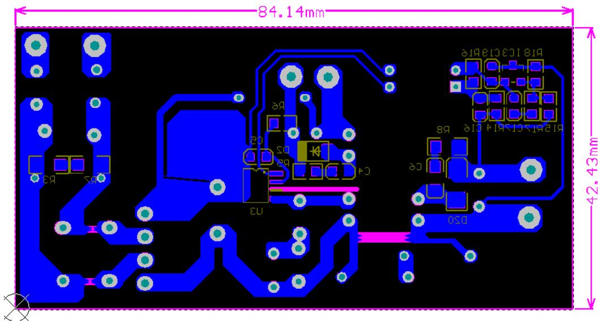

## 原理图

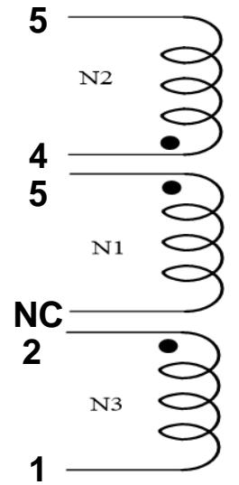

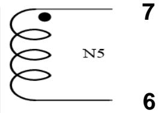

## 绕线方式

<table><tr><td>绕组</td><td>起始脚</td><td>终止脚</td><td>材料</td><td>匝数</td><td>绕线方式</td></tr><tr><td>N1</td><td>5</td><td>NC</td><td> $\phi 0.19*2P$ </td><td>19Ts</td><td>密绕一层(PIN脚朝外)</td></tr><tr><td colspan="4">胶带</td><td>2.1Ts</td><td></td></tr><tr><td>N2</td><td>4</td><td>5</td><td> $\phi 0.19*1P$ </td><td>121Ts</td><td>密绕三层(PIN脚朝外)</td></tr><tr><td colspan="4">胶带</td><td>2.1Ts</td><td></td></tr><tr><td>N3</td><td>2</td><td>1</td><td> $\phi 0.19*2P$ </td><td>20Ts</td><td>密绕一层(PIN脚朝外)</td></tr><tr><td colspan="4">胶带</td><td>2.1Ts</td><td></td></tr><tr><td>N4</td><td>7</td><td>6</td><td>三层绝缘线 $\phi 0.4*1P$ </td><td>14Ts</td><td>密绕一层(PIN脚朝外)</td></tr><tr><td colspan="4">胶带</td><td>3Ts</td><td></td></tr></table>

## 规格与材料

➢ 初级绕组感量 $\mathsf { L } _ { \mathsf { p } } { = } 1 . 7 \mathsf { m } \mathsf { H } { \pm } 7 \%$ （测试条件： 0.3V，100kHz）  
➢ 漏感量 $\mathrm { \cdot L _ { | k } } < 7 0 \mathrm { u } \mathrm { H }$  
➢ 骨架：EE16底部加高（5+5PIN）  
➢ 磁芯：EE16 PC40 或同等材质 ， $\mathsf { A } \mathsf { e } = 1 9 \mathsf { m } \mathsf { m } ^ { 2 }$  
➢ N1、N2、N3: 2UEW 漆包线  
➢ N4 : 三层绝缘线  
➢ 绝缘胶带:3M900 或同等材质  
➢ 耐压测试: 3KV, 50/60Hz, 1Min  
➢ 成品要求：浸凡立水

## 脚位图

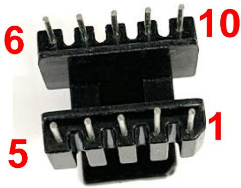

<table><tr><td>输入电压</td><td>176VAC</td><td>230VAC</td><td>265VAC</td></tr><tr><td>整机效率</td><td>80.97%</td><td>80.1%</td><td>79.01%</td></tr></table>

## 输出电压纹波

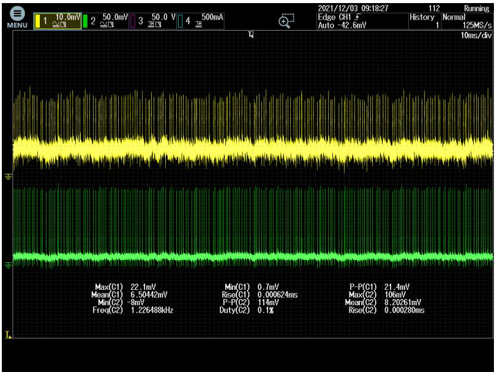

## 176 VAC

CH1 $\mathsf { V } _ { \mathsf { O U T 1 } \_ 1 2 \mathsf { V } }$ $\mathsf { R i p p l e }$ $V _ { P K - P K } = 2 1 . 4 m v$  
CH2 $\mathsf { V } _ { \mathsf { O U T 2 } \_ 1 8 \mathsf { V } }$ Ripple $\mathsf { V } _ { \mathsf { P K - P K } } { = } 1 1 4 \mathsf { m V }$

## Test Condition:

➢ $\mathsf { N o } \mathsf { L o } \mathsf { a d }$

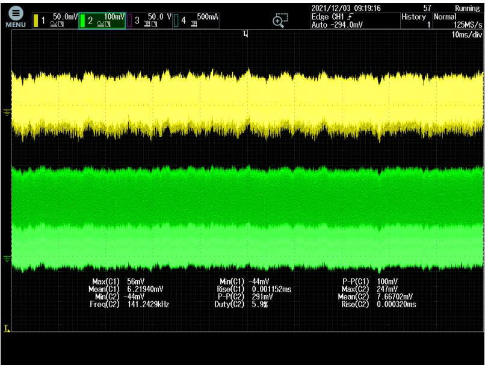

## 176 VAC

$\mathsf { C H 1 V _ { 0 \mathsf { U T 1 } \_ 1 2 \mathsf { V } } }$ $\mathsf { R i p p } | \mathsf { e }$ $\mathsf { V } _ { \mathsf { P K - P K } } { = } 1 0 0 \mathsf { m V }$  
$\mathsf { C H 2 } \mathsf { V _ { 0 \cup \mathsf { T 2 } \_ 1 8 \mathsf { V } } }$ Ripple $\mathsf { V } _ { \mathsf { P K - P K } } { = } 2 9 1 \mathsf { m V }$

## Test Condition:

➢ $\mathsf { F u l l \mathsf { L o a d } }$

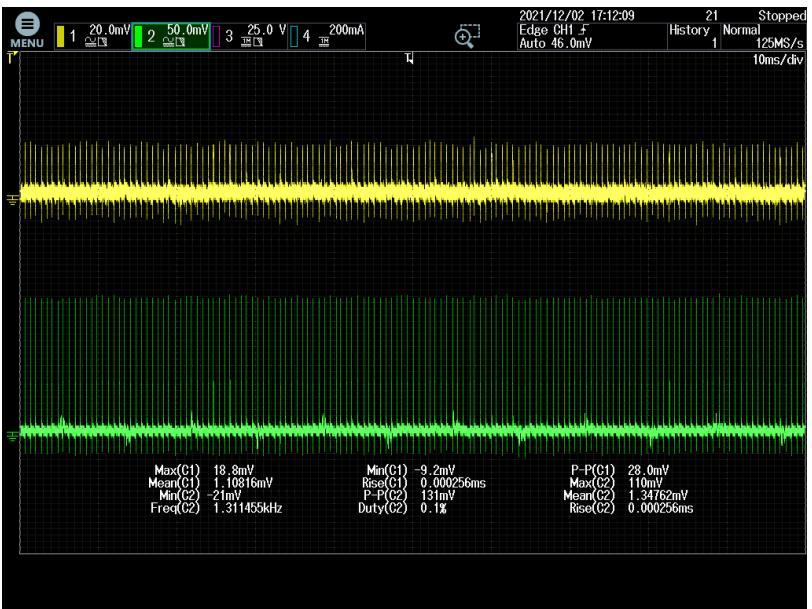

## 265 VAC

CH1 $\mathsf { V } _ { \mathsf { O U T 1 } \_ 1 2 \mathsf { V } }$ Ripple $\mathsf { V } _ { \mathsf { P K - P K } } = 2 8 \mathsf { m V }$  
CH2 $\mathsf { V } _ { \mathsf { O U T 2 } \_ 1 8 \mathsf { V } }$ Ripple $\mathsf { V } _ { \mathsf { P K - P K } } { = } 1 3 1 \mathsf { m V }$

## Test Condition:

➢ No Load

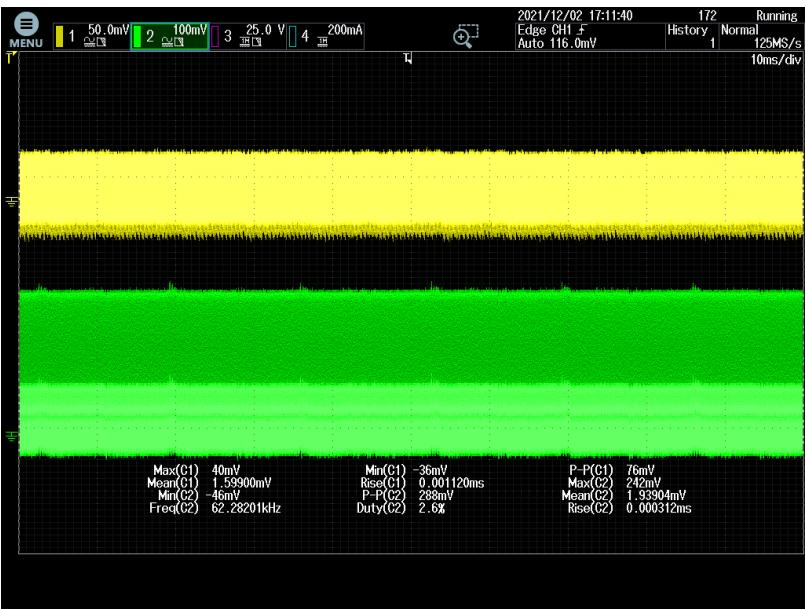

## 265 $\mathsf { v } _ { \mathsf { A C } }$

$\mathsf { C H 1 V _ { 0 \sqcup \top 1 \_ 1 2 \vee } }$ Ripple $\mathsf { V } _ { \mathsf { P K - P K } } { = } 7 6 \mathsf { m } \mathsf { V }$  
$\mathsf { C H 2 } \mathsf { V _ { 0 \cup \mathsf { T 2 } \_ 1 8 \mathsf { V } } }$ $\mathsf { R i p p } | \mathsf { e }$ $V _ { P K - P K } = 2 8 8 \mathsf { m V }$

## Test Condition:

➢ Full Load

## 动态负载

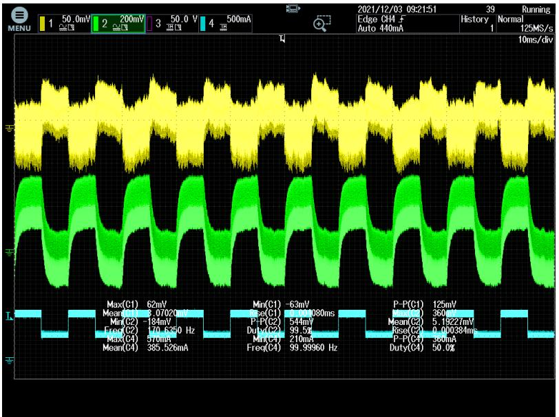

## 176 VAC

CH1 VOUT1\_12V Ripple $V _ { P K - P K } = 1 2 5 m v$  
CH2 VOUT2\_18V Ripple VPK-PK=544mV $V _ { P K - P K } = 5 4 4 m V$  
CH4 IOUT1 $\mathsf { C H } 4 \mathsf { I } _ { \mathsf { O U T } 1 }$

## Test Condition:

➢ 0.25 A-0.5 A-0.25 A  
➢ Slew Rate: 0.5 A/μS  
➢ Frequency: 100 Hz  
(50%-100%)

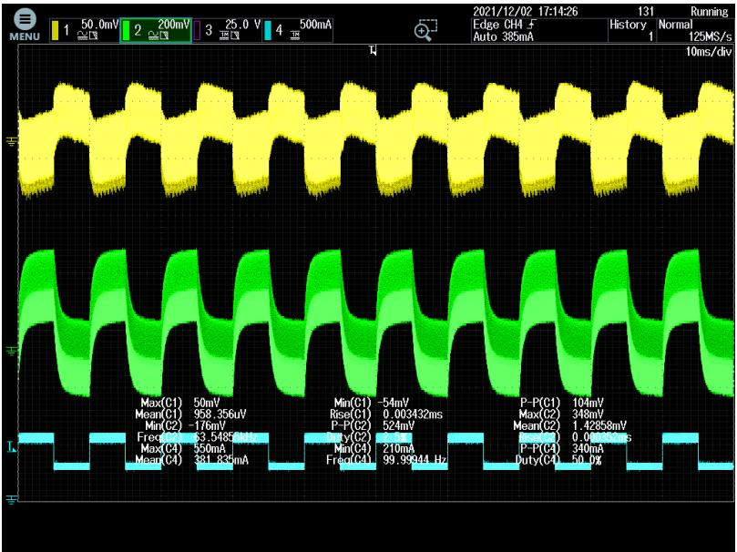

## 265 VAC

$\begin{array} { r } { \mathsf { C H 1 V _ { 0 \sqcup T 1 } } _ { \mathsf { 1 2 V } } } \\ { \mathsf { V _ { P K - P K } } \equiv \mathsf { 1 0 4 m V } } \end{array}$ Ripple  
CH2 $\mathsf { V } _ { \mathsf { O U T 2 \_ 1 8 V } }$ Ripple VPK-PK=340mV $V _ { P K - P K } = 3 4 0 m v$  
CH4 IOUT1 $\mathsf { C H } 4 \mathsf { I } _ { \mathsf { O U T } 1 }$

## Test Condition:

➢ 0.25 A-0.5 A-0.25 A  
➢ Slew Rate: 0.5 A/μS  
➢ Frequency: 100 Hz  
(50%-100%)

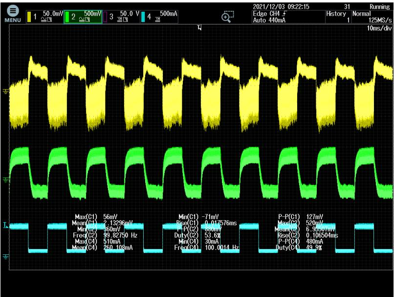

## 176 VAC

CH1 VOUT1\_12V Ripple $V _ { P K , P K } = 1 2 7 m v$  
$\mathsf { C H 2 } \mathsf { V _ { O U T 2 \ 1 8 \mathsf { V } } }$ Ripple $V _ { P K - P K } = 4 8 0 m v$ VPK-PK=480mV  
$\mathsf { C H } 4 \mathsf { I } _ { \mathsf { O U T 1 } }$

## Test Condition:

➢ 0.05A-0.45 A-0.05 A  
➢ Slew Rate: 0.5 A/μS  
➢ Frequency: 100 Hz  
(10%-90%)

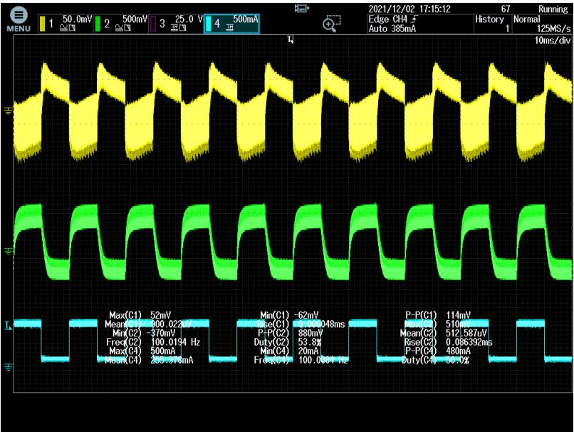

## 265 VAC

$\begin{array} { r } { \mathsf { C H 1 } \mathsf { V _ { 0 \cup \mathsf { T 1 } _ { 1 2 \mathsf { V } } } } \mathsf { I } } \\ { \mathsf { V _ { P K - P K } } \mathsf { = } 1 1 4 \mathsf { m V } } \end{array}$ VPK-PK=114mV Ripple  
CH2 VOUT2\_18V Ripple $V _ { P K - P K } = 4 8 0 m v$ PK-PK  
$\mathsf { C H } 4 \mathsf { I } _ { \mathsf { O U T 1 } }$

## Test Condition:

➢ 0.05A-0.45 A-0.05 A  
➢ Slew Rate: 0.5 A/μS  
➢ Frequency: 100 Hz  
(10%-90%)

## 输出电压开机波形

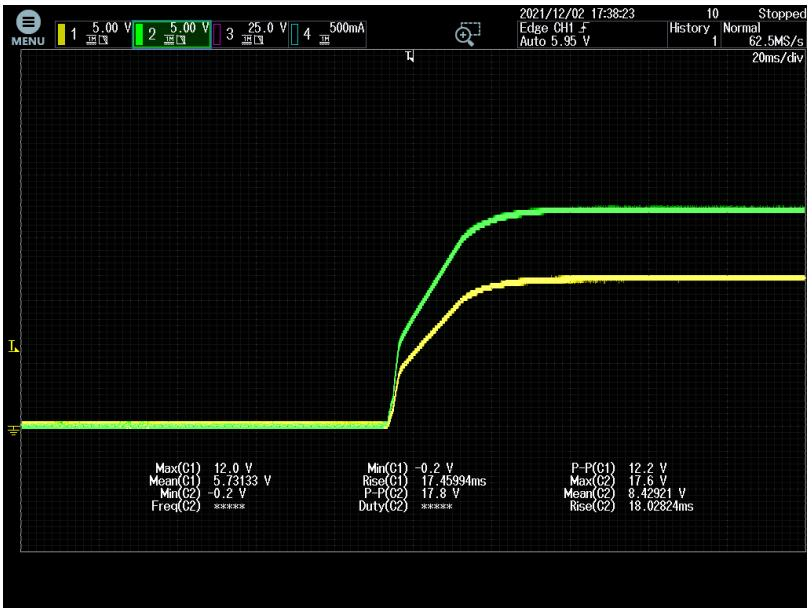

176 VAC

CH1 VOUT1\_12V  
CH2 VOUT2\_18V

Test Condition:  
➢ No load  
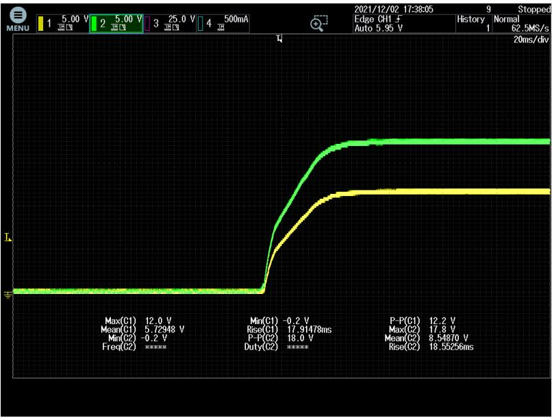

176 VAC

CH1 VOUT1\_12V  
CH2 VOUT2\_18V

Test Condition:  
➢ Full Load  
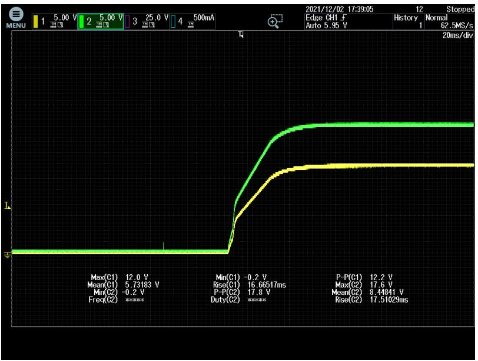

265 VAC

CH1 VOUT1\_12V $\mathsf { V } _ { \mathsf { O U T 1 } \_ 1 2 \mathsf { V } }$  
CH2 VOUT2\_18V

Test Condition:  
➢ No Load  
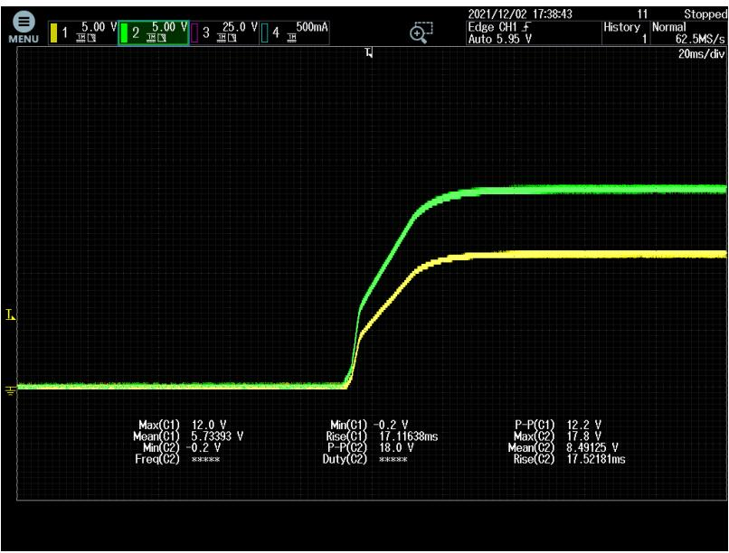

265 VAC

CH1 VOUT1\_12V  
CH2 VOUT2\_18V

Test Condition:

➢ Full Load

## 漏源极电压和漏极电流开机和稳态波形

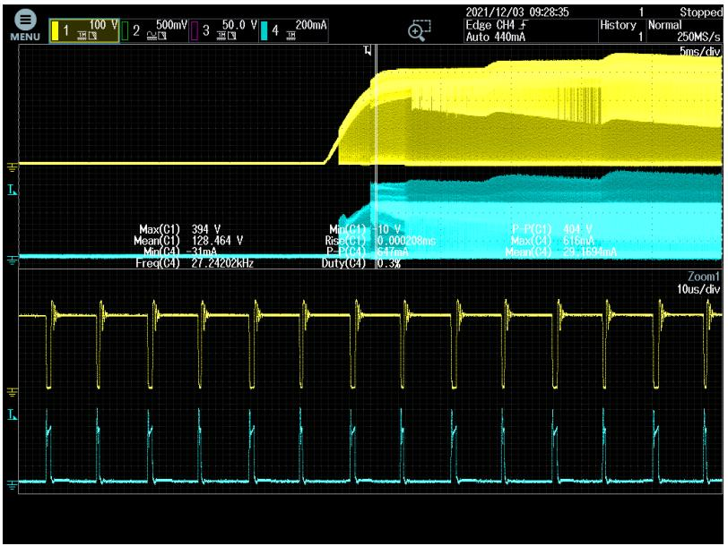

176 VAC

${ \mathsf { C H 1 } } \mathsf { V _ { D S } }$  
$C H 4 \mid _ { \mathrm { D S } }$  
$\mathsf { V } _ { \mathsf { D S \_ m a x } } { = } 3 9 4 \mathsf { V }$ VDS \_max $\mathsf { I } _ { \mathsf { D S \_ m a x } } { = } 0 . 6 1 6 \mathsf { A }$

Test Condition:

➢ Full Load

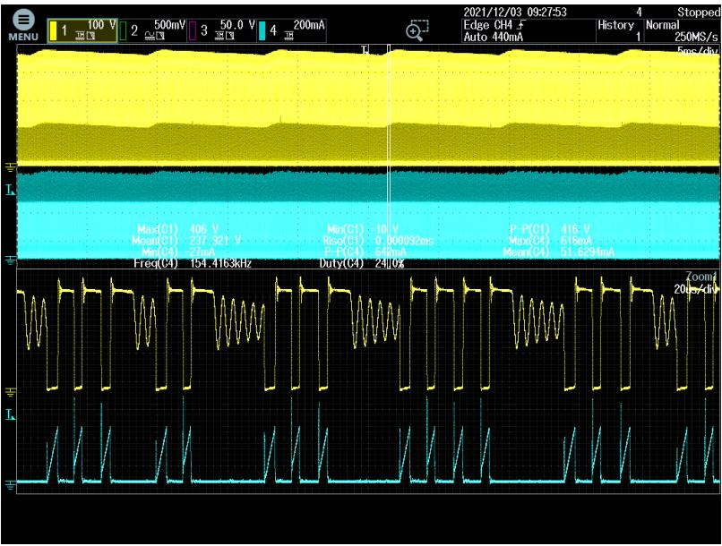

176 VAC

${ \mathsf { C H 1 V } } _ { \mathsf { D S } }$  
$C H 4 1 _ { \mathrm { D S } }$  
$\mathsf { V } _ { \mathsf { D S \_ m a x } } { = } 4 0 6 \mathsf { V }$ VDS \_max $\mathsf { I } _ { \mathsf { D S \_ m a x } } = 0 . 6 1 6 \mathsf { A }$

Test Condition:

➢ Full Load

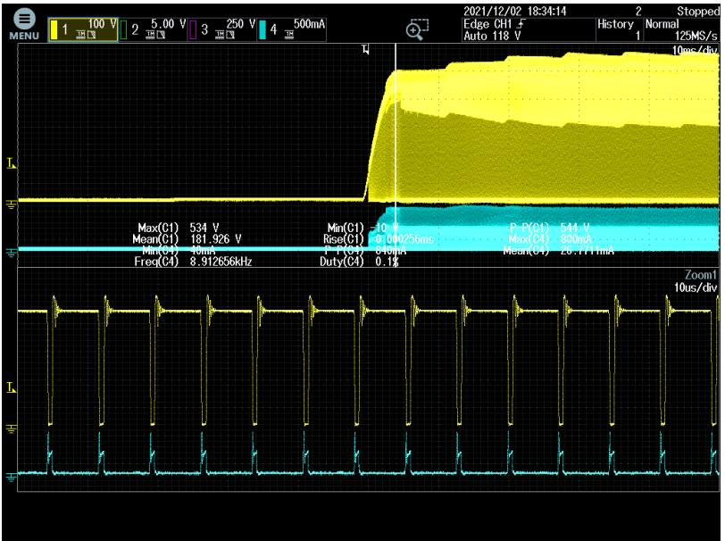

265 VAC

${ \mathsf { C H 1 } } \mathsf { V _ { D S } }$  
$C H 4 \mid _ { \mathrm { { D S } } }$  
$\begin{array} { r l } & { \mathsf { V } _ { \mathsf { D S \_ m a x } } = 5 3 4 \mathsf { V } } \\ & { \mathsf { I } _ { \mathsf { D S \_ m a x } } = 0 . 8 \mathsf { A } } \end{array}$ VDS \_max

Test Condition:

➢ Full Load

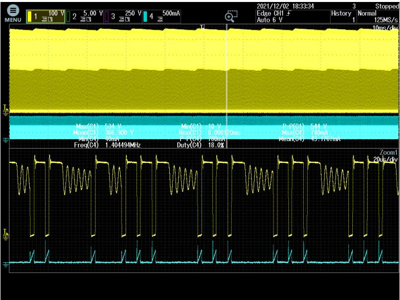

265 VAC

${ \mathsf { C H 1 } } \mathsf { V } _ { \mathsf { D S } }$  
$C H 4 1 _ { \mathrm { D S } }$  
DS \_max =534V IDS\_max=0.74 A

Test Condition:

➢ Full Load

## 输出二极管反向电压波形

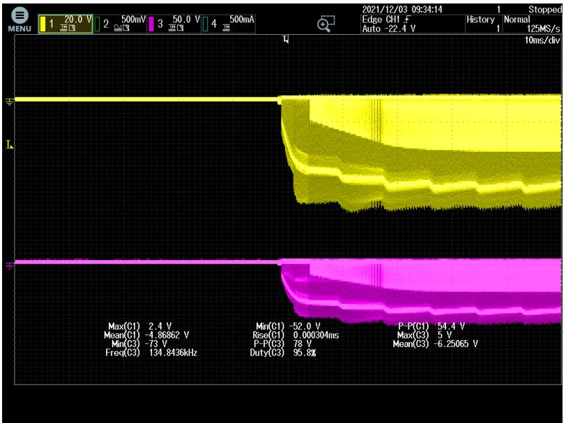

## 176 VAC

CH1 VROUT\_12V $\mathsf { V } _ { \mathsf { R O U T } \_ 1 2 \mathsf { V } }$  
CH3 VROUT\_18V $V _ { \sf R O U T \_ 1 8 V }$  
$\mathsf { V } _ { \mathsf { R } \_ 1 2 \mathsf { V } \_ \mathsf { M A X } } = 5 2 \mathsf { V }$  
$\mathsf { V } _ { \mathsf { R } \_ 1 8 \mathsf { V } \_ \mathsf { M A X } } = 7 3 \mathsf { V }$

## Test Condition:

➢ Full Load

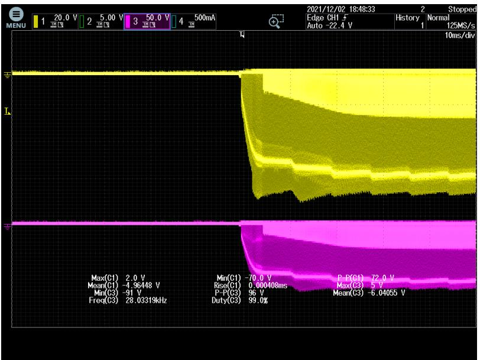

## 265 VAC

CH1 VROUT\_12V $\mathsf { V } _ { \mathsf { R O U T } \_ 1 2 \mathsf { V } }$  
CH3 VROUT\_18V $V _ { \sf R O U T \_ 1 8 V }$  
$\mathsf { V } _ { \mathsf { R } \_ 1 2 \mathsf { V } \_ \mathsf { M A X } } = 7 0 \mathsf { V }$  
$\mathsf { V } _ { \mathsf { R } \_ 1 8 \mathsf { V } \_ \mathsf { M A X } } = 9 1 \mathsf { V }$

## Test Condition:

➢ Full Load

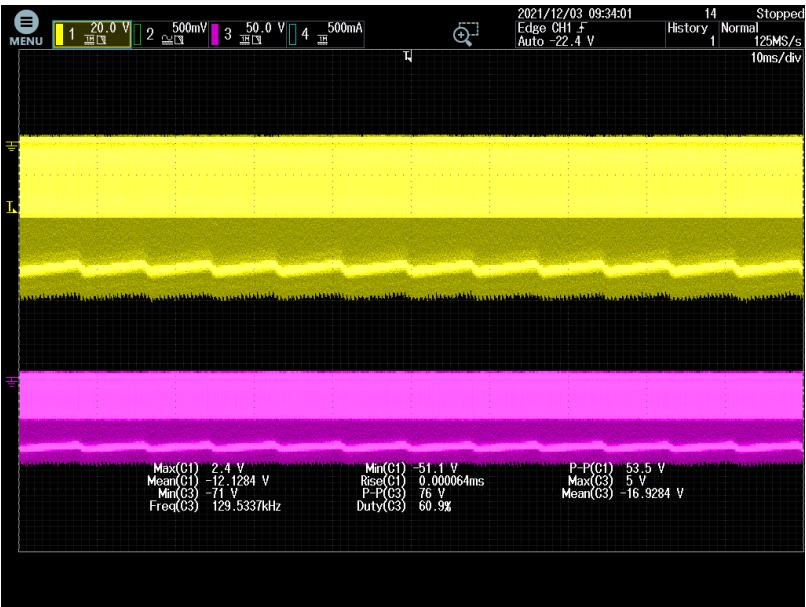

## 176 VAC

CH1 VROUT\_12V $V _ { \sf R O U T \_ 1 2 V }$  
CH3 VROUT\_18V $V _ { \sf R O U T \_ 1 8 V }$  
$\mathsf { V } _ { \mathsf { R } \_ 1 2 \mathsf { V } \_ \mathsf { M A X } } = 5 1 . 1 \mathsf { V }$  
$\mathsf { V } _ { \mathsf { R } \_ 1 8 \mathsf { V } \_ \mathsf { M A X } } = 7 1 \mathsf { V }$

## Test Condition:

➢ Full Load

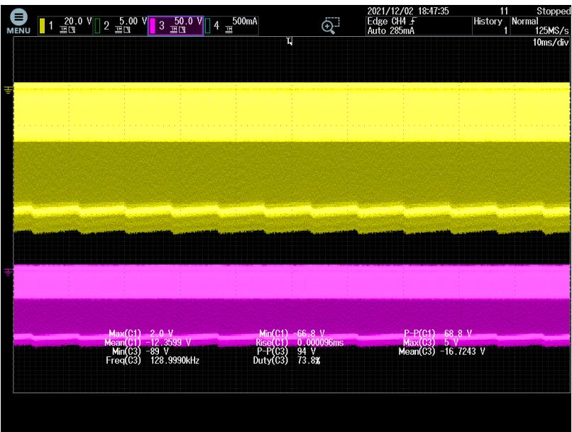

## 265 VAC

CH1 VROUT\_12V $V _ { \sf R O U T \_ 1 2 V }$  
CH3 VROUT\_18V  
$\mathsf { V } _ { \mathsf { R } _ { - } 1 2 \mathsf { V } _ { - } \mathsf { M A X } } { = } 6 6 . 8 \mathsf { V }$  
$V _ { R \_ 1 8 \vee \_ { \mathsf { M A X } } } = 8 9 \vee$

## Test Condition:

➢ Full Load

## 短路保护（MOSFET和输出二极管波形）

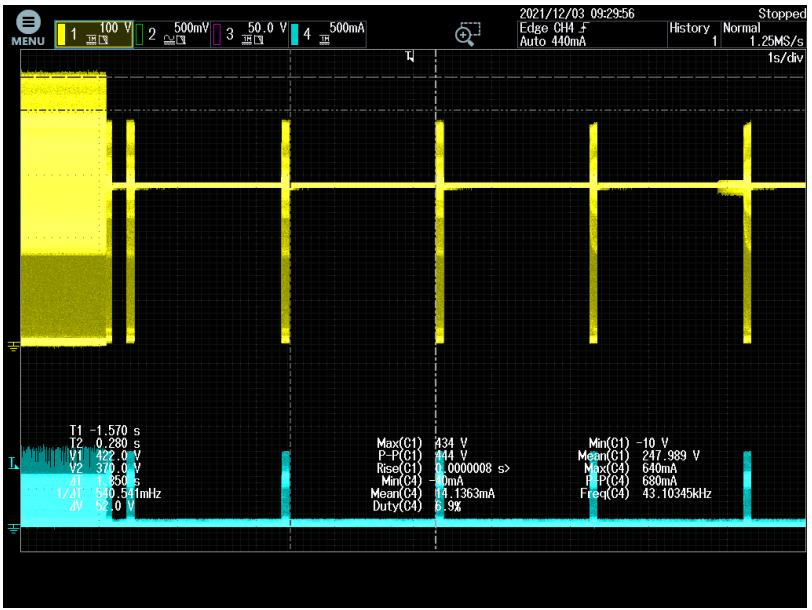

176 VAC

${ \mathsf { C H 1 } } \mathsf { V _ { D S } }$  
$C H 4 \mid _ { \mathrm { D S } }$  
◼ $\begin{array} { r } { V _ { \mathsf { D S \_ m a x } } = 4 3 4 \mathsf { V } } \\ { \mathsf { I _ { D S \_ m a x } } = 0 . 6 4 \mathsf { A } } \end{array}$

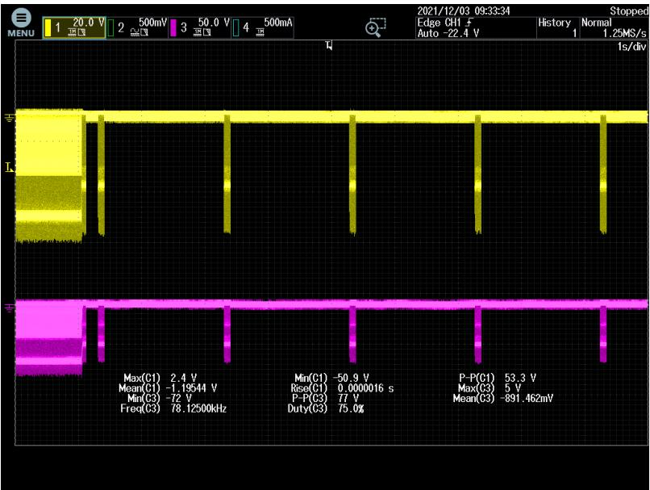

176 VAC

CH1 VROUT\_12V $V _ { \sf R O U T \_ 1 2 V }$  
CH3 VROUT\_18V $V _ { \sf R O U T \_ 1 8 V }$  
VR\_12V\_MAX=50.9V  
$V _ { R \_ 1 8 V \_ M A X } = 7 2 V$

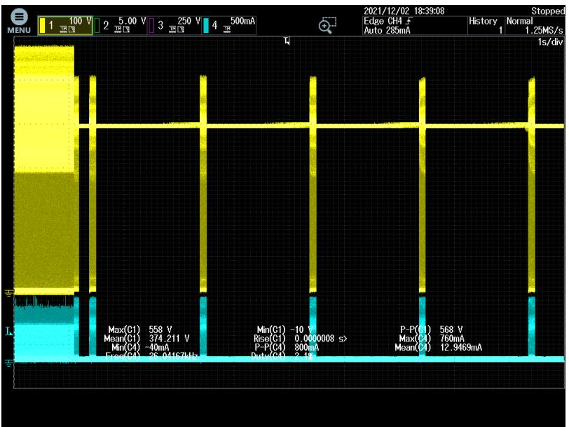

265 VAC

${ \mathsf { C H 1 } } \mathsf { V _ { D S } }$  
$C H 4 \mid _ { \mathrm { { D S } } }$  
$\begin{array} { r } { V _ { \mathsf { D S \_ m a x } } = 5 5 8 \mathsf { V } } \\ { \mathsf { I _ { D S \_ m a x } } = 0 . 7 6 \mathsf { A } } \end{array}$ IDS\_max=0.76 A

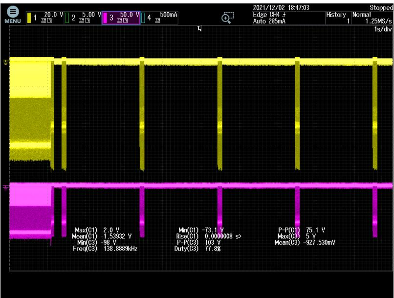

265 VAC

$\mathsf { C H 1 V _ { R O U T \_ 1 2 V } }$ CH1 VROUT\_12V  
$\mathsf { C H 3 V } _ { \mathsf { R O U T } \_ 1 8 \mathsf { V } }$ CH3 VROUT\_18V  
$\mathsf { V } _ { \mathsf { R } _ { - } 1 2 \mathsf { V } _ { - } \mathsf { M A X } } = 7 3 . 1 \mathsf { V }$  
$\mathsf { V } _ { \mathsf { R } \_ 1 8 \mathsf { V } \_ \mathsf { M A X } } = 9 8 \mathsf { V }$

<table><tr><td rowspan="2">项目</td><td colspan="2">85VAC</td><td colspan="2">264VAC</td></tr><tr><td>温度(°C)</td><td>温升(°C)</td><td>温度(°C)</td><td>温升(°C)</td></tr><tr><td>环境温度</td><td colspan="2">25.8</td><td colspan="2">26.3</td></tr><tr><td>BPA8616D (U1)</td><td>78.51</td><td>52.71</td><td>96.43</td><td>70.13</td></tr><tr><td>12V0.5A输出二极管D7</td><td>63.93</td><td>38.13</td><td>64.55</td><td>38.25</td></tr><tr><td>18V0.2A输出二极管D8</td><td>61.21</td><td>35.41</td><td>65.71</td><td>39.41</td></tr><tr><td>变压器绕组(T1)</td><td>63.68</td><td>37.88</td><td>67.18</td><td>40.88</td></tr><tr><td>变压器磁芯(T1)</td><td>62.84</td><td>37.04</td><td>66.92</td><td>40.62</td></tr><tr><td>12V输出电解电容</td><td>44.93</td><td>19.13</td><td>45.69</td><td>19.39</td></tr><tr><td>18V输出电解电容</td><td>49.3</td><td>23.5</td><td>52.8</td><td>26.5</td></tr></table>

## 测试说明

➢ 在温箱中进行测试  
➢ 电路板放在一个封闭的盒子内  
➢ 热电偶连接到各个测量点  
➢ 等测量点温度达到稳定后记录数据

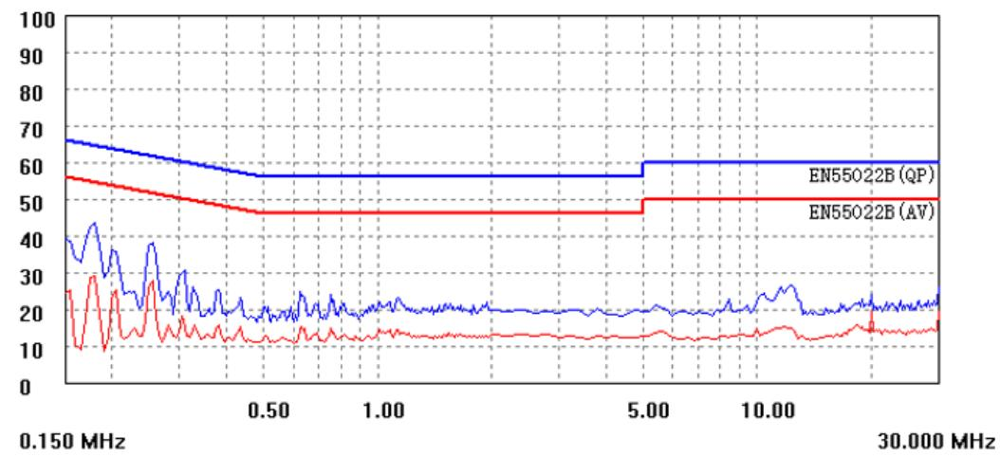

230VAC 满载 Line 传导  

230VAC 满载Line 辐射

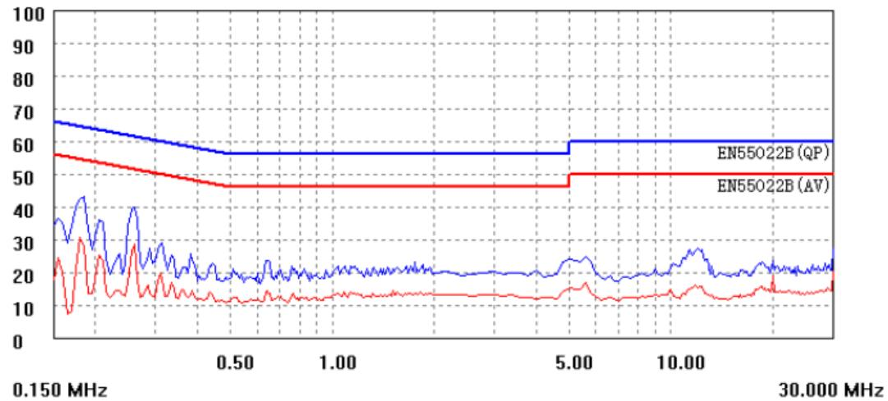

230VAC 满载 Nature传导

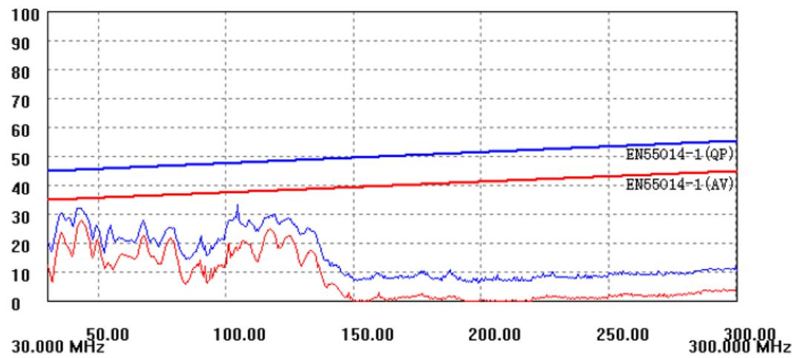

230VAC 满载 Nature 辐射

## THANK YOU FOR WATCHING
