## BPA8616D隔离参考设计

## (5V1A 12V0.1A)

上海晶丰明源半导体股份有限公司

Shanghai Bright Power Semiconductor Co., Ltd.

梁 惠

时间： 2022年10月26日

## 内容

BPA8616XD简介  
电源规格  
电路及实物图  
BOM  
PCB Layout图  
变压器  
性能测试数据

## 产品特点：

➢ 集成 700V 高压 MOSFET  
➢ ON/OFF控制模式，低输出纹波  
内置软启动功能  
➢ 集成高压启动、自供电电路  
➢ 低音频噪声  
➢ 集成输入过/欠压保护

## 应用领域：

➢ 家用电器辅助电源  
➢ 电机驱动辅助电源  
➢ IOT/智能家居/智能照明  
➢ 工业控制辅助电源

<table><tr><td>项目描述</td><td>符号</td><td>最小</td><td>典型</td><td>最大</td><td>单位</td><td>备注</td></tr><tr><td colspan="7">输入</td></tr><tr><td>电压</td><td> $V_{IN}$ </td><td>90</td><td>115/230</td><td>264</td><td> $V_{AC}$ </td><td></td></tr><tr><td>频率</td><td> $f_{LINE}$ </td><td>47</td><td>50/60</td><td>63</td><td>Hz</td><td></td></tr><tr><td colspan="7">输出</td></tr><tr><td>输出电压1</td><td> $V_{OUT1}$ </td><td></td><td>5</td><td></td><td>V</td><td></td></tr><tr><td>输出电流1</td><td> $I_{OUT1}$ </td><td></td><td>1000</td><td></td><td>mA</td><td></td></tr><tr><td>输出电压2</td><td> $V_{OUT2}$ </td><td></td><td>12</td><td></td><td>V</td><td></td></tr><tr><td>输出电流2</td><td> $I_{OUT2}$ </td><td></td><td>100</td><td></td><td>mA</td><td></td></tr><tr><td>输出电压纹波1</td><td> $V_{RIPPLE}$ </td><td></td><td></td><td>268</td><td>mV</td><td>20MHz带宽</td></tr><tr><td>输出电压纹波2</td><td> $V_{RIPPLE}$ </td><td></td><td></td><td>210</td><td>mV</td><td>20MHz带宽</td></tr><tr><td>连续输出功率</td><td> $P_{OUT}$ </td><td></td><td>6.2</td><td></td><td>W</td><td></td></tr><tr><td colspan="7">效率</td></tr><tr><td>待机功耗</td><td> $P_{STDBY}$ </td><td></td><td></td><td>600</td><td>mW</td><td>230VAC,包含假负载</td></tr><tr><td>满载效率</td><td> $\eta$ </td><td></td><td></td><td>66.8</td><td>%</td><td></td></tr><tr><td colspan="7">环境</td></tr><tr><td>传导EMI</td><td></td><td colspan="4">满足CISPR22/EN55022 Class B,至少6dB 裕量</td><td></td></tr><tr><td>Surge</td><td></td><td></td><td>2</td><td></td><td>kV</td><td>差模</td></tr><tr><td>EFT</td><td></td><td></td><td>4</td><td></td><td>kV</td><td>5kHz/100kHz/38kHz</td></tr><tr><td>ESD</td><td></td><td></td><td>15</td><td>20</td><td>kV</td><td>空气放电</td></tr><tr><td>工作环境温度</td><td> $T_{AMP}$ </td><td>0</td><td></td><td>50</td><td>°C</td><td></td></tr></table>

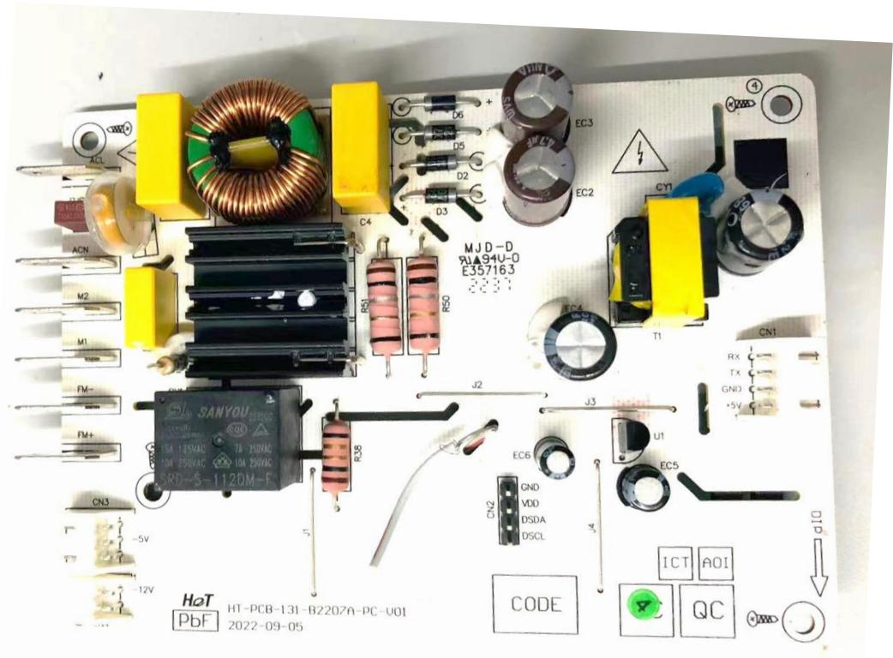

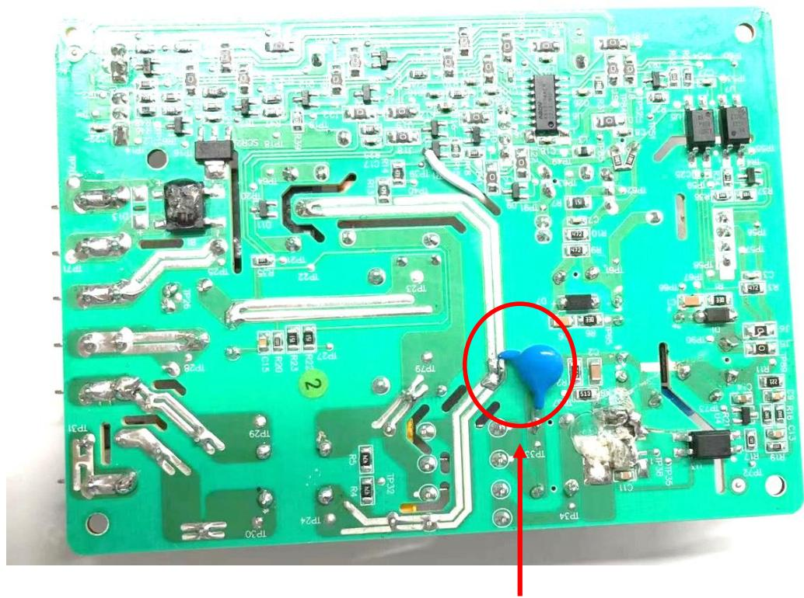

加电容， EMI效果好

## 原理图

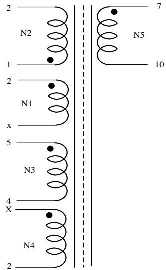

## 绕线方式

<table><tr><td>N1</td><td>2</td><td>NC</td><td> $\phi 0.18*2P$ </td><td>18Ts</td><td>密绕一层(PIN脚朝外)</td></tr><tr><td colspan="4">胶带</td><td>2.1Ts</td><td></td></tr><tr><td>N2</td><td>1</td><td>2</td><td> $\phi 0.18*1P$ </td><td>108Ts</td><td>密绕三层(PIN脚朝外)</td></tr><tr><td colspan="4">胶带</td><td>2.1Ts</td><td></td></tr><tr><td>N3</td><td>5</td><td>4</td><td> $\phi 0.18*2P$ </td><td>16Ts</td><td>密绕一层(PIN脚朝外)</td></tr><tr><td colspan="4">胶带</td><td>2.1Ts</td><td></td></tr><tr><td>N4</td><td>NC</td><td>2</td><td> $\phi 0.27*3P$ </td><td>6Ts</td><td>密绕一层(PIN脚朝外)</td></tr><tr><td colspan="4">胶带</td><td>2.1Ts</td><td></td></tr><tr><td>N5</td><td>7</td><td>10</td><td>三层绝缘线 $\phi 0.4*1P$ </td><td>7Ts</td><td>均匀绕一层(PIN脚朝外)</td></tr><tr><td colspan="4">胶带</td><td>3Ts</td><td></td></tr></table>

## 规格与材料

➢ 初级绕组感量 $L _ { p } { = } 1 1 5 0 \mathrm { u } \mathsf { H } { \pm } 7 \%$ （测试条件： 0.3V，100kHz）  
➢ 漏感量 $\mathrm { \cdot L _ { | k } } < 5 0 \mathrm { u } \mathrm { H }$  
➢ 骨架：EE16底部加高（5+5PIN）  
➢ 磁芯：EE16 PC40 或同等材质 ， ${ \mathsf { A } } { \mathsf { e } } = 1 9 . 2 { \mathsf { m m } } ^ { 2 }$  
➢ N1、N2、N3、N4: 2UEW 漆包线  
➢ N5 : 三层绝缘线  
➢ 绝缘胶带:3M900 或同等材质  
➢ 耐压测试: 3KV, 50/60Hz, 1Min  
➢ 成品要求：浸凡立水

## 脚位图

待机功耗  
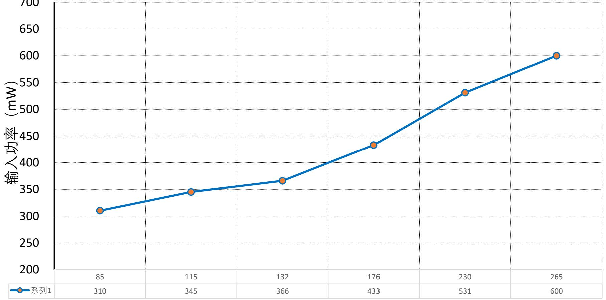

输入电压(VAC)

效率测试  
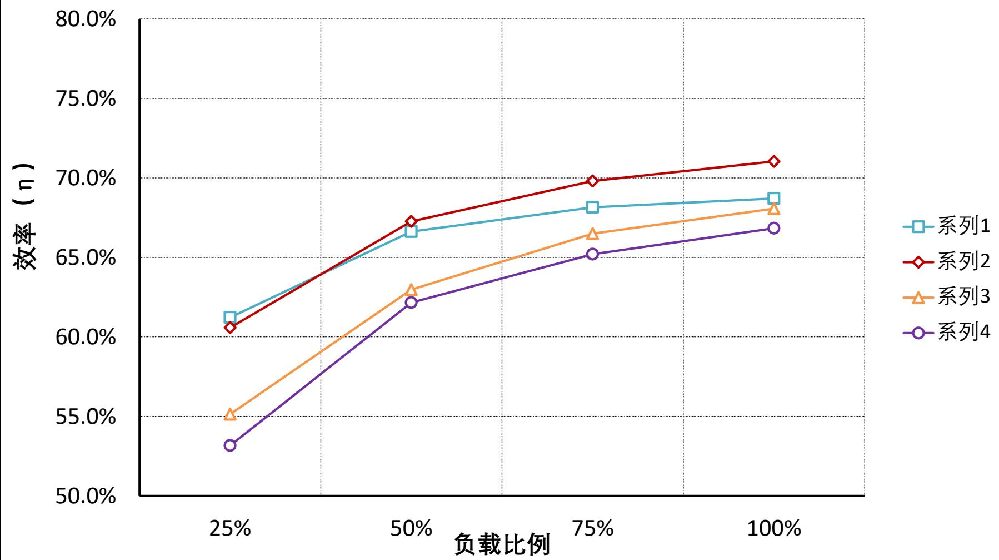

## 输出电压交叉调整率 （N3:16T）

<table><tr><td>输入电压AC (V)</td><td>输出电流1(A)</td><td>输出电压1(V)</td><td>输出电流2(A)</td><td>输出电压2(V)</td></tr><tr><td rowspan="2">115</td><td>0</td><td>5.03</td><td>0.1</td><td>12.57</td></tr><tr><td>1</td><td>4.98</td><td>0</td><td>23.45</td></tr><tr><td rowspan="2">230</td><td>0</td><td>5.02</td><td>0.1</td><td>12.58</td></tr><tr><td>1</td><td>4.98</td><td>0</td><td>23.85</td></tr></table>

## 输出电压交叉调整率 （N3:15T）

<table><tr><td>输入电压AC (V)</td><td>输出电流1(A)</td><td>输出电压1(V)</td><td>输出电流2(A)</td><td>输出电压2(V)</td></tr><tr><td rowspan="2">115</td><td>0</td><td>5.03</td><td>0.1</td><td>10.01</td></tr><tr><td>1</td><td>4.98</td><td>0</td><td>20.35</td></tr><tr><td rowspan="2">230</td><td>0</td><td>5.03</td><td>0.1</td><td>10.03</td></tr><tr><td>1</td><td>4.98</td><td>0</td><td>20.57</td></tr></table>

## 输出电压纹波

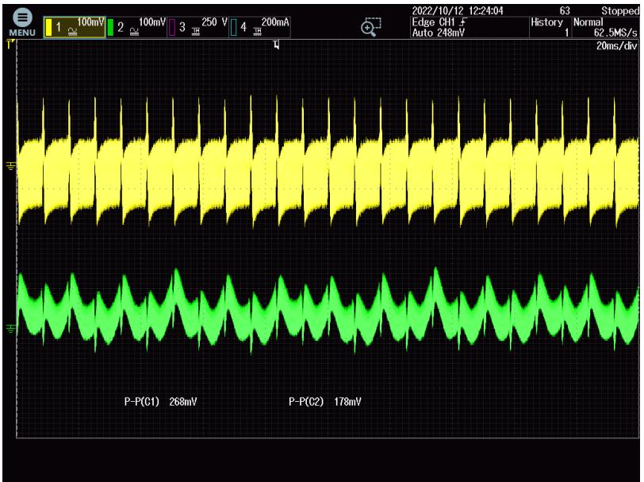

85 VAC

CH1 $\mathsf { V } _ { \mathsf { O U T } } \mathsf { R i p p l e }$ $\mathsf { V } _ { \mathsf { P K - P K } } { = } 2 6 8 \mathsf { m V }$  
CH2 $\mathsf { V } _ { \mathsf { O U T } } \mathsf { R i p p l e }$ $\mathsf { V } _ { \mathsf { P K - P K } = } 1 7 8 \mathsf { m V }$

Test Condition:  
➢ Full Load  
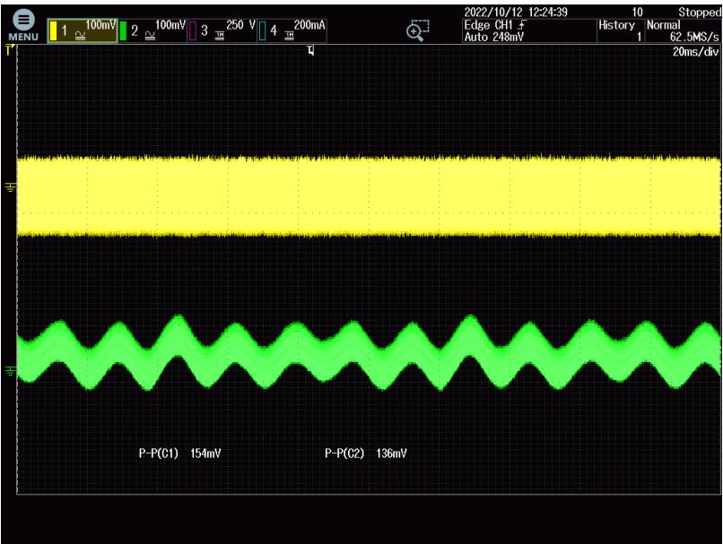

115 VAC

CH1 $\mathsf { V } _ { \mathsf { O U T } }$ Ripple $\mathsf { V } _ { \mathsf { P K - P K } } { = } 1 5 4 \mathsf { m V }$  
CH2 $\mathsf { V } _ { \mathsf { O U T } }$ Ripple $\mathsf { V } _ { \mathsf { P K - P K } } { = } \pm 3 6 \mathsf { m V }$

Test Condition:  
➢ Full Load  
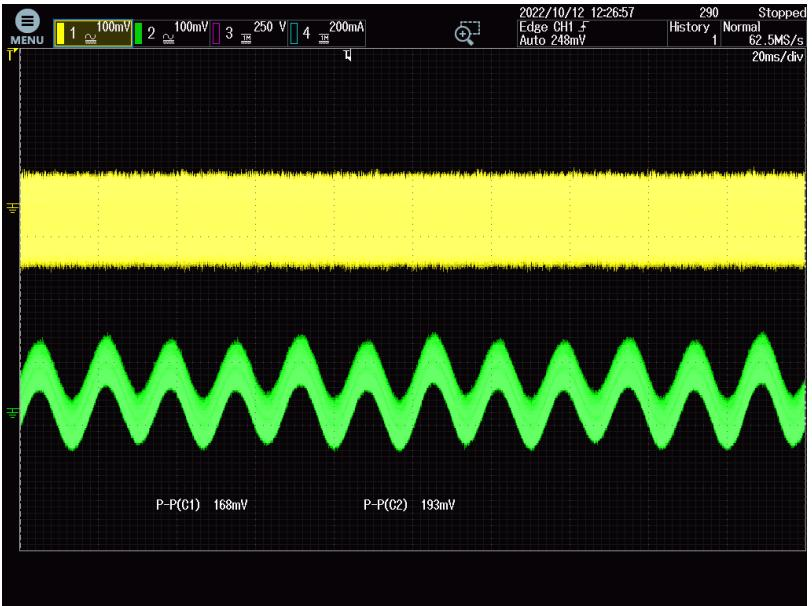

230 VAC

CH1 $\mathsf { V } _ { \mathsf { O U T } } \mathsf { R i p p l e }$ $\mathsf { V } _ { \mathsf { P K - P K } } { = } 1 6 8 \mathsf { m V }$  
CH2 $\mathsf { V } _ { \mathsf { O U T } } \mathsf { R i p p l e }$ $\mathsf { V } _ { \mathsf { P K - P K } = } \mathsf { 1 9 3 m V }$

Test Condition:  
➢ Full Load  
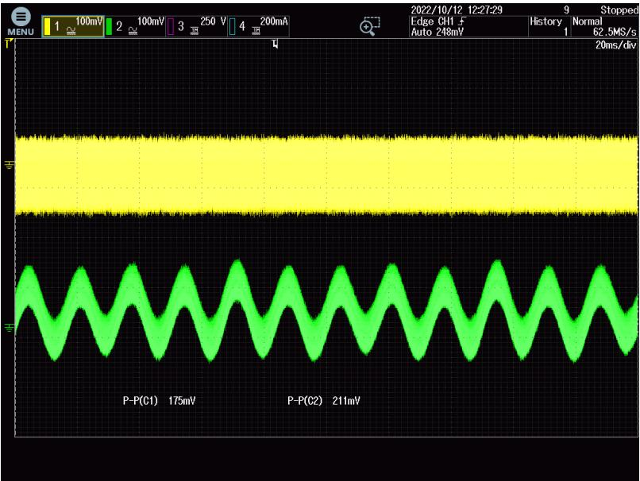

265 $\mathsf { v } _ { \mathsf { A C } }$

CH1 $\mathsf { V } _ { \mathsf { O U T } }$ Ripple $\mathsf { V } _ { \mathsf { P K - P K } } { = } 1 7 5 \mathsf { m V }$  
$\mathsf { C H } 2 \mathsf { V } _ { \mathsf { O U T } } \mathsf { R i p p l e }$ $\mathsf { V } _ { \mathsf { P K - P K } } { = } 2 1 1 \mathsf { m V }$

Test Condition:

➢ Full Load

## 动态负载(50%-100%)

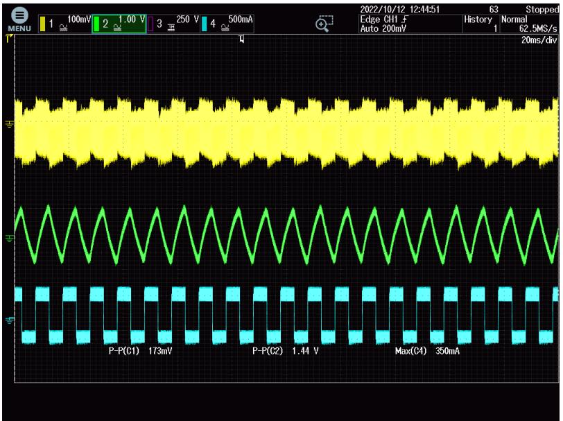

85VAC

${ \mathsf { C H 1 } } { \mathsf { V } } _ { \mathsf { O U T } }$ CH1 VOUT $v _ { p _ { \mathrm { K - P K } } } { = } 1 7 3 ~ \mathsf { m V }$  
CH2 VOUT ${ \mathsf { C H } } 2 { \mathsf { V } } _ { \mathsf { O U T } }$ VPK-PK=1440mV $V _ { \mathsf { P K - P K } } { = } 1 4 4 0 \mathsf { m V }$

## Test Condition:

➢ $0 . 5 \mathsf { A } \mathsf { - } 1 \mathsf { A } \mathsf { - } 0 . 5 \mathsf { A }$  
➢ 0.05A-0.1A-0.05 A  
➢ Slew Rate: 0.5 A/μS  
➢ Frequency: 100 Hz

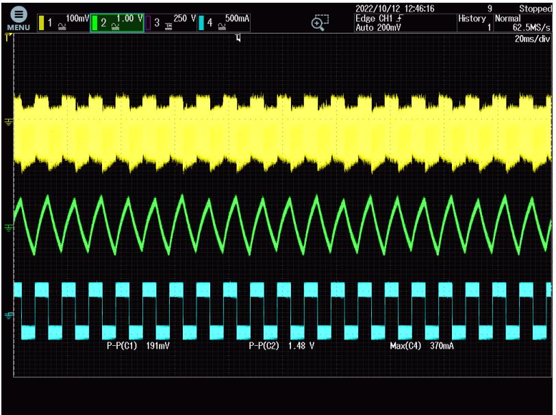

230 VAC

CH1 VOUT ${ \mathsf { C H 1 } } { \mathsf { V } } _ { \mathsf { O U T } }$ VPK-PK=191mV $\mathsf { V } _ { \mathsf { P K - P K } } { = } 1 9 1 \mathsf { m V }$  
CH2 VOUT ${ \mathsf { C H } } 2 { \mathsf { V } } _ { \mathsf { O U T } }$ VPK-PK=1480mV $V _ { \mathsf { P K - P K } } { = } 1 4 8 0 \mathsf { m V }$

## Test Condition:

➢ $0 . 5 \mathsf { A } \mathsf { - } 1 \mathsf { A } \mathsf { - } 0 . 5 \mathsf { A }$  
➢ $0 . 0 5 \mathsf { A } \mathsf { - 0 } . 1 \mathsf { A } \mathsf { - 0 } . 0 5 \mathsf { A }$  
➢ Slew Rate: 0.5 A/μS  
➢ Frequency: 100 Hz

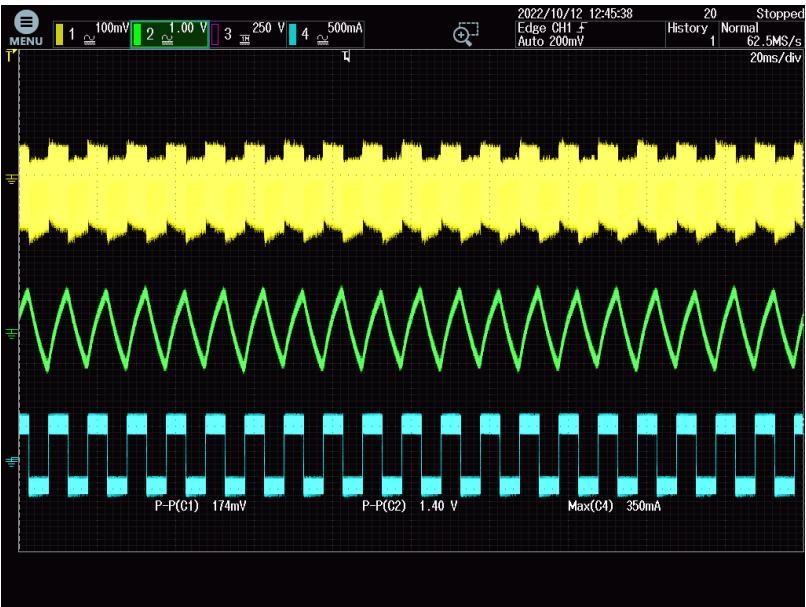

115 VAC

CH1 VOUT ${ \mathsf { C H 1 } } { \mathsf { V } } _ { \mathsf { O U T } }$ $v _ { p | c - P K } { = } 1 7 4 m v$  
CH2 VOUT ${ \mathsf { C H } } 2 { \mathsf { V } } _ { \mathsf { O U T } }$ VPK-PK=1400 $\mathsf { V } _ { \mathsf { P K - P K } } { = } 1 4 0 0 \mathsf { m v }$

## Test Condition:

➢ $0 . 5 \mathsf { A } \mathsf { - } 1 \mathsf { A } \mathsf { - } 0 . 5 \mathsf { A }$  
➢ $0 . 0 5 \mathsf { A } \mathsf { - 0 } . 1 \mathsf { A } \mathsf { - 0 } . 0 5 \mathsf { A }$  
➢ Slew Rate: 0.5 A/μS  
➢ Frequency: 100 Hz

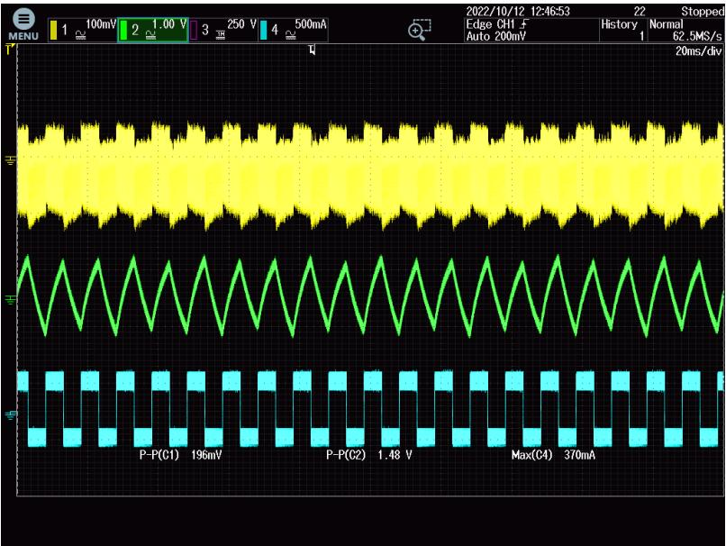

265 VAC

CH1 VOUT ${ \mathsf { C H 1 } } { \mathsf { V } } _ { \mathsf { O U T } }$ $\mathsf { V } _ { \mathsf { P K - P K } } { = } \mathsf { 1 9 6 m V }$  
CH2 VOUT ${ \mathsf { C H } } 2 { \mathsf { V } } _ { \mathsf { O U T } }$ VPK-PK=1480 $V _ { \mathsf { P K - P K } } { = } 1 4 8 0 ~ \mathsf { m v }$

## Test Condition:

➢ 0.5 A-1 A-0.5 A  
➢ $0 . 0 5 \mathsf { A } \mathsf { - 0 } . 1 \mathsf { A } \mathsf { - 0 } . 0 5 \mathsf { A }$  
➢ Slew Rate: 0.5 A/μS  
➢ Frequency: 100 Hz

## 动态负载(10%-90%)

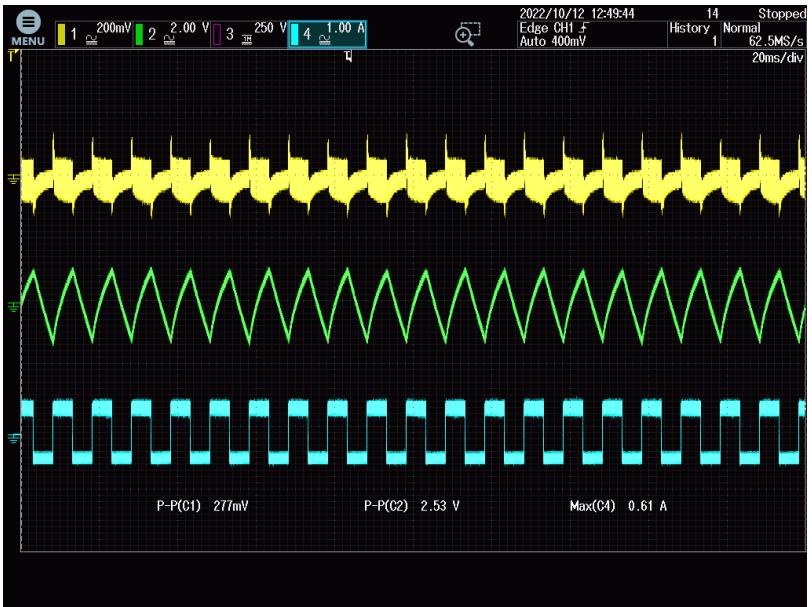

85VAC

CH1 VOUT ${ \mathsf { C H 1 } } { \mathsf { V } } _ { \mathsf { O U T } }$ $v _ { p _ { \mathrm { K - P K } } } = 2 7 7 m v$  
CH2 VOUT ${ \mathsf { C H } } 2 { \mathsf { V } } _ { \mathsf { O U T } }$ $V _ { \mathsf { P K - P K } } { = } 2 5 3 0 \mathsf { m V }$

## Test Condition:

➢ 0.1 A-0. 9A-0.1A  
➢ 0.01 A-0.9 A-0.01A  
➢ Slew Rate: 0.5 A/μS  
➢ Frequency: 100 Hz

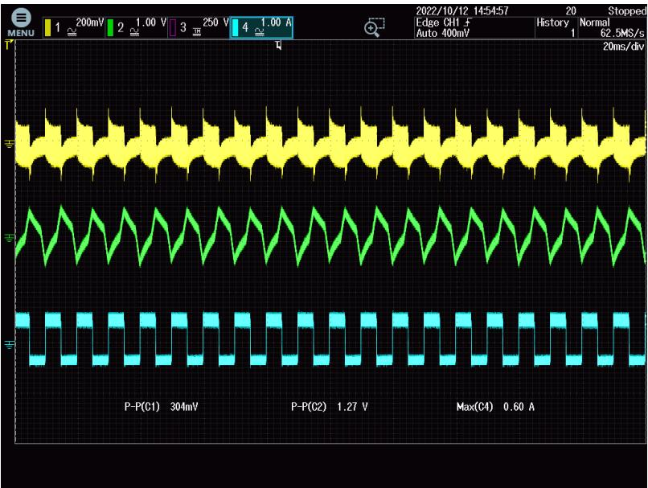

115 VAC

CH1 VOUT ${ \mathsf { C H 1 } } { \mathsf { V } } _ { \mathsf { O U T } }$ VPK-PK=304mV $\mathsf { V } _ { \mathsf { P K - P K } } { = } 3 0 4 \mathsf { m V }$  
CH2 VOUT ${ \mathsf { C H } } 2 { \mathsf { V } } _ { \mathsf { O U T } }$ VPK-PK=1270mV $V _ { \mathsf { P K - P K } } { = } 1 2 7 0 \mathsf { m V }$

## Test Condition:

➢ $0 . 1 \mathsf { A } \mathsf { - } 0 . \mathsf { 9 A - } 0 . 1 \mathsf { A }$  
➢ 0.01 A-0.9 A-0.01A  
➢ Slew Rate: 0.5 A/μS  
➢ Frequency: 100 Hz

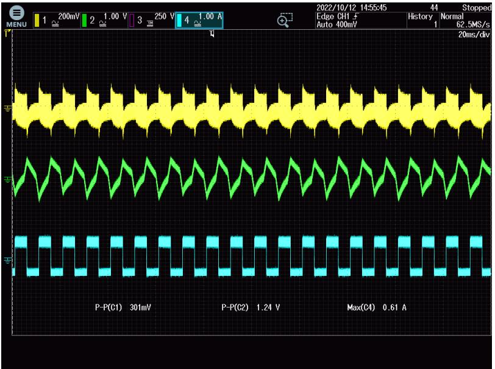

230 VAC

CH1 VOUT $\mathsf { V } _ { \mathsf { O U T } }$ VPK-PK=301 mV $\mathsf { V } _ { \mathsf { P K - P K } } { = } 3 0 1 \mathsf { m V }$  
CH2 VOUT $\mathsf { V } _ { \mathsf { O U T } }$ VPK-PK=1240mV $\mathsf { V } _ { \mathsf { P K - P K } } { = } 1 2 4 0 \mathsf { m V }$

## Test Condition:

➢ 0.1 A-0. 9A-0.1A  
➢ 0.01 A-0.9 A-0.01A  
➢ Slew Rate: 0.5 A/μS  
➢ Frequency: 100 Hz

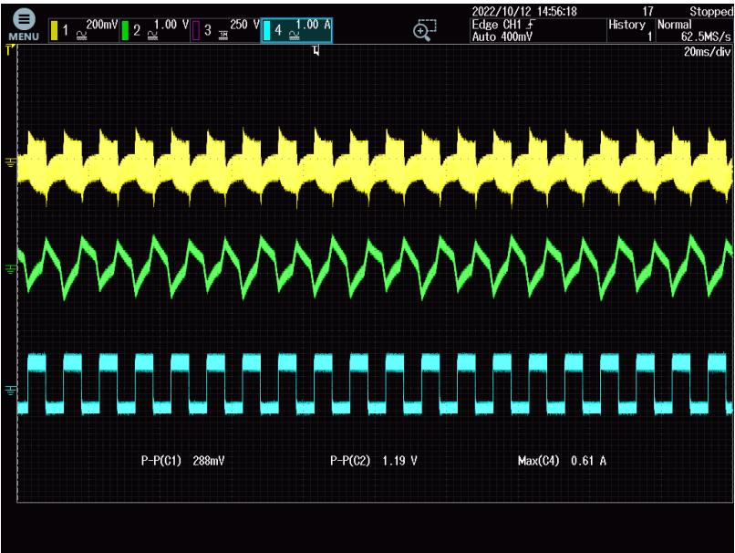

265 VAC

CH1 VOUT ${ \mathsf { C H 1 } } { \mathsf { V } } _ { \mathsf { O U T } }$ $V _ { \mathsf { P K - P K } } { = } 2 8 8 ~ \mathsf { m V }$  
CH2 VOUT ${ \mathsf { C H } } 2 { \mathsf { V } } _ { \mathsf { O U T } }$ VPK-PK=1190mV $\mathsf { V } _ { \mathsf { P K - P K } } \mathsf { = } \pmb { 1 } \pmb { 1 } \mathsf { 9 0 m V }$

## Test Condition:

➢ 0.1 A-0. 9A-0.1A  
➢ 0.01 A-0.9 A-0.01A  
➢ Slew Rate: 0.5 A/μS  
➢ Frequency: 100 Hz

## 输出电压开机波形

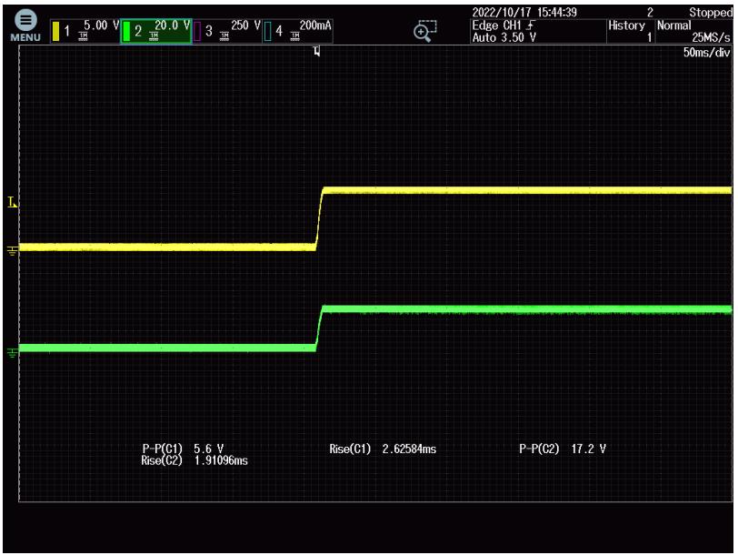

85 $\mathsf { v } _ { \mathsf { A C } }$

CH1 VOUT $\mathsf { V } _ { \mathsf { O U T } }$ ${ \sf T } _ { \sf R I S E } .$ 2.65mS  
CH2 VOUT $\mathsf { V } _ { \mathsf { O U T } }$ $\mathsf { T } _ { \mathtt { R l S E } ^ { \bullet 1 } }$ .91mS

Test Condition:  
➢ No Load  

85 VAC

CH1 VOUT $\mathsf { V } _ { \mathsf { O U T } }$ $\mathsf { T } _ { \mathsf { R I S E } } . 7$ .41mS  
CH2 VOUT $\mathsf { V } _ { \mathsf { O U T } }$ ${ \sf T } _ { \sf R I S E } .$ 7.96mS

Test Condition:  
➢ Full Load  
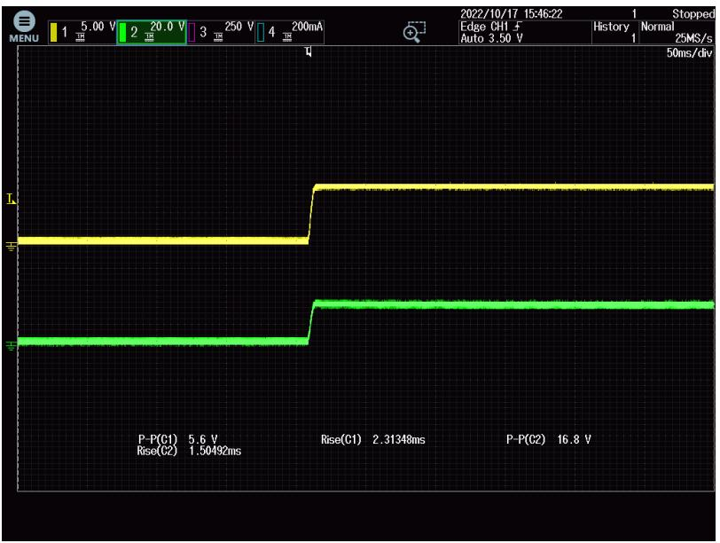

265 $\mathsf { v } _ { \mathsf { A C } }$

CH1 VOUT $\mathsf { V } _ { \mathsf { O U T } }$ ${ \sf T } _ { \sf R I S E } .$ 2.31mS  
CH2 VOUT $\mathsf { V } _ { \mathsf { O U T } }$ ${ \sf T } _ { \sf R I S E } .$ 1.5mS

Test Condition:  
➢ No Load  
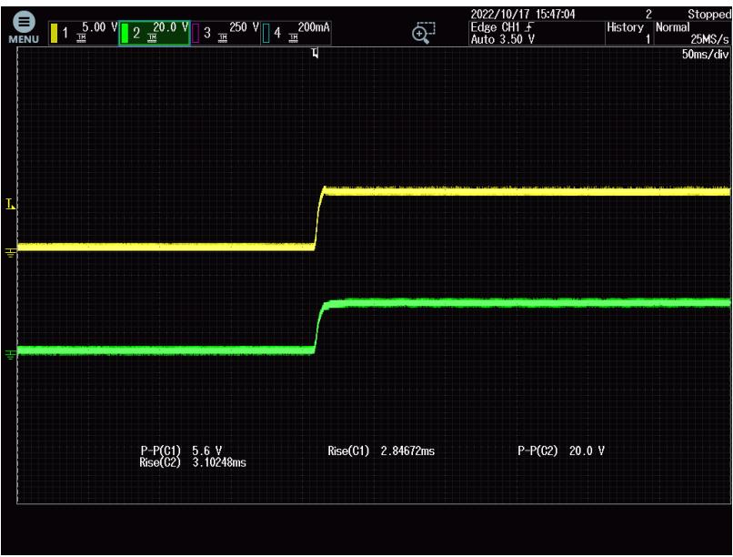

265 $\mathsf { v } _ { \mathsf { A C } }$

CH1 VOUT $\mathsf { V } _ { \mathsf { O U T } }$ ${ \sf T } _ { \sf R I S E } .$ 2.84 mS  
CH2 VOUT ${ \mathsf { C H } } { 2 } { \mathsf { V } } _ { \mathsf { O U T } }$ ${ \sf T } _ { \sf R I S E } 3 .$ .1mS

Test Condition:

➢ Full Load

## 启动延迟时间

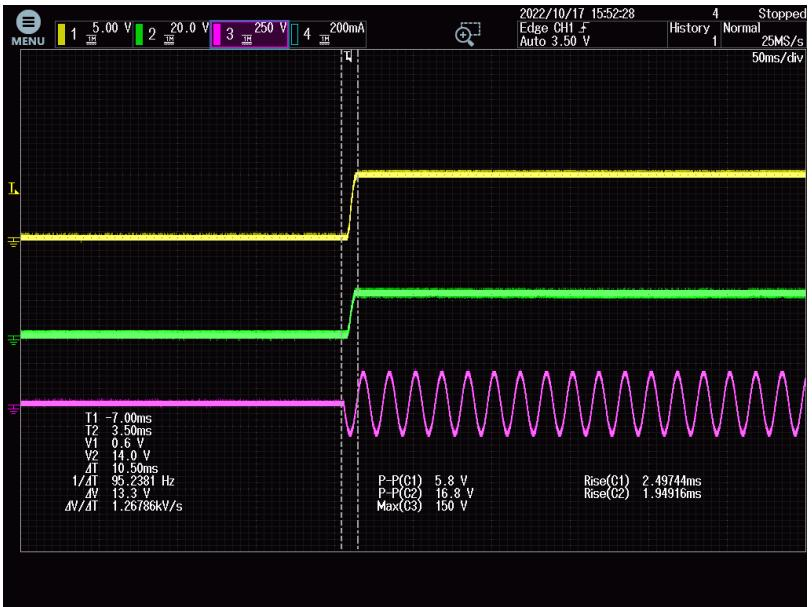

85 VAC

CH1 $\mathsf { V } _ { \mathsf { O U T } }$  
CH2 $\mathsf { V } _ { \mathsf { O U T } }$  
CH3 VINNAC $\mathsf { V I N } _ { \mathsf { N A C } }$ ${ \mathsf { T } } _ { \mathsf { D E L A Y } } .$ 10.5mS ${ \mathsf { T } } _ { \mathsf { D E L A Y } } .$ 10.5 mS

Test Condition:  
➢ $\mathsf { N o } \mathsf { L o } \mathsf { a d }$  
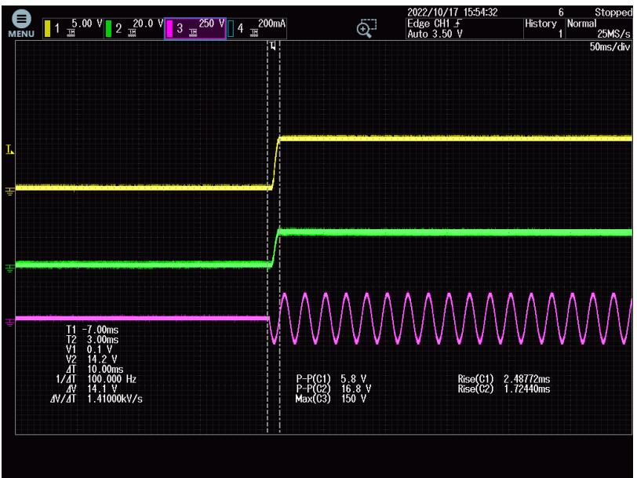

265 $\mathsf { v } _ { \mathsf { A C } }$

CH1 $\mathsf { V } _ { \mathsf { O U T } }$  
CH2 $\mathsf { V } _ { \mathsf { O U T } }$  
CH3 VINNAC $\mathsf { V I N } _ { \mathsf { N A C } }$  
TDELAY: 10mS  
${ \sf T } _ { \sf D E L A Y } .$ 10mS

Test Condition:  
➢ No Load  
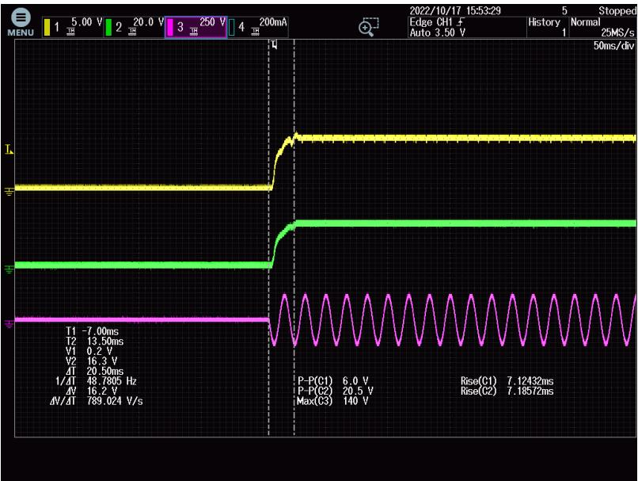

85 VAC

CH1 $\mathsf { V } _ { \mathsf { O U T } }$  
${ \mathsf { C H } } { 2 } { \mathsf { V } } _ { \mathsf { O U T } }$  
CH3 $\mathsf { V I N } _ { \mathsf { N A C } }$  
${ \bar { \mathsf { T } } } _ { { \mathsf { D E L A Y } } } .$ 20.5mS  
$\mathsf { T } _ { \mathsf { D E L A Y } } .$ 20.5mS

Test Condition:  
➢ Full Load  
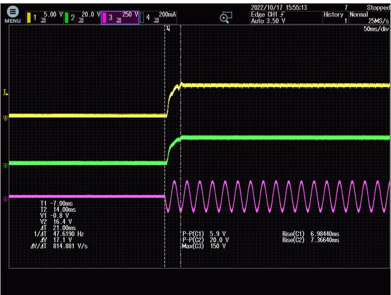

265 $\mathsf { v } _ { \mathsf { A C } }$

${ \mathsf { C H 1 } } { \mathsf { V } } _ { \mathsf { O U T } }$  
${ \mathsf { C H } } 2 { \mathsf { V } } _ { \mathsf { O U T } }$  
CH3 VINNAC $\mathsf { V I N } _ { \mathsf { N A C } }$  
$\mathsf { T } _ { \mathsf { D E L A Y } } .$ 21mS  
TDELAY: 21mS

Test Condition:

➢ Full Load

## 输入欠压保护

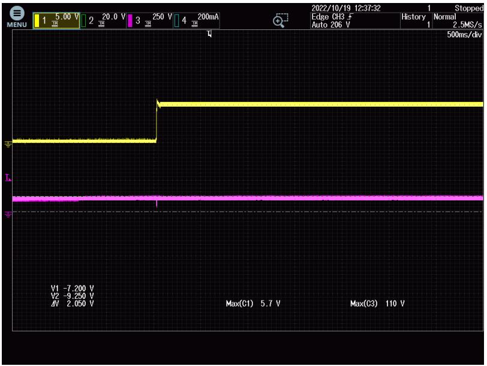

## BROWN-IN

CH1 $\mathsf { V I N } _ { \mathsf { D C } }$  
CH3 VIN VDS $\mathsf { V } _ { \mathsf { D } \mathsf { S } }$ VBROWN-IN: 66.2V

## 测试条件:

➢ No Load

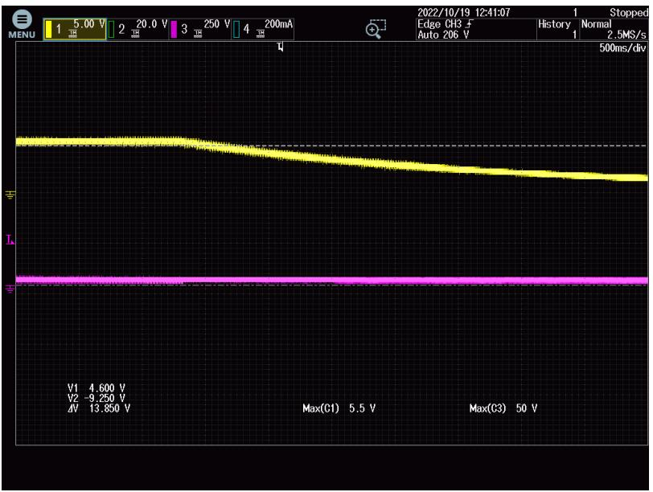

## BROWN-OUT

CH1 $\mathsf { V I N } _ { \mathsf { D C } }$  
CH3 VIN VDS $\mathsf { V } _ { \mathsf { D } \mathsf { S } }$ VBROWN-OUT: 18.2V

## 测试条件:

➢ No Load

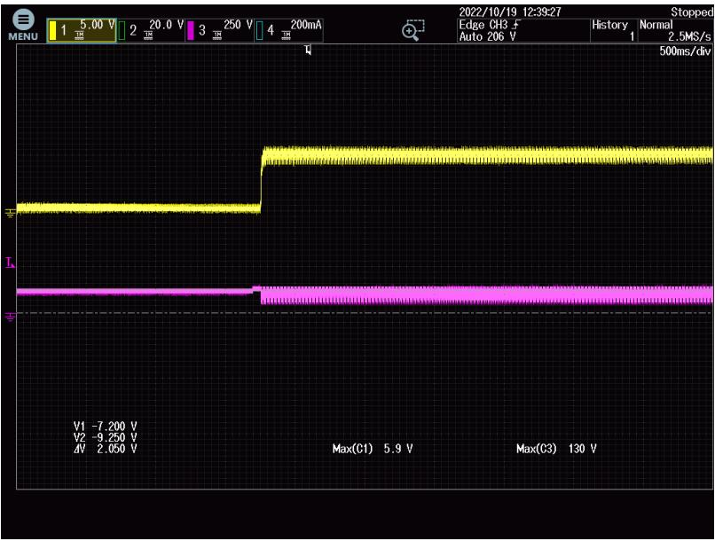

## BROWN-IN

CH1 $\mathsf { V I N } _ { \mathsf { D C } }$  
CH3 VIN V $\mathsf { V I N } \mathsf { V } _ { \mathsf { D S } }$ VBROWN-IN: 79.5V

## 测试条件:

➢ Full Load

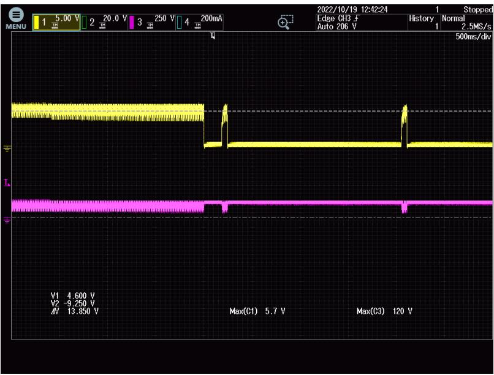

## BROWN-OUT

CH1 $\mathsf { V I N } _ { \mathsf { D C } }$  
CH3 VIN VDS $\mathsf { V I N } \mathsf { V } _ { \mathsf { D S } }$ VBROWN-OUT: 70.4V

## 测试条件:

➢ Full Load

## 短路保护 （MOSFET波形）

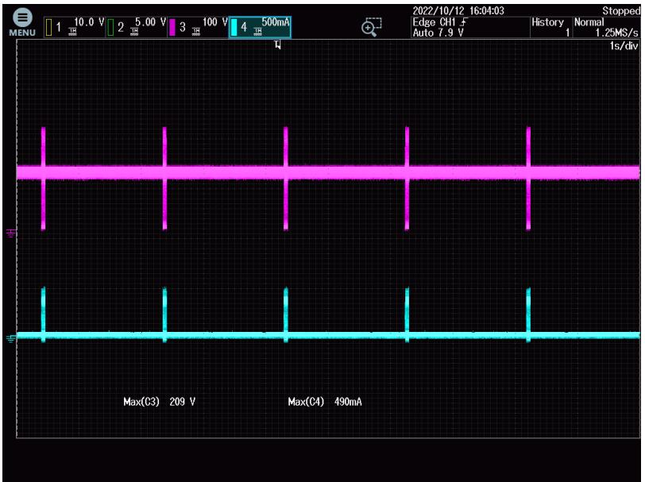

85VAC

CH3 VDS：  
CH4 ID：

$$
\begin{array}{l} I _ {D S \_ M A X} = 0. 4 9 A \\ V _ {D S \_ M A X} = 2 0 9 V \end{array}
$$

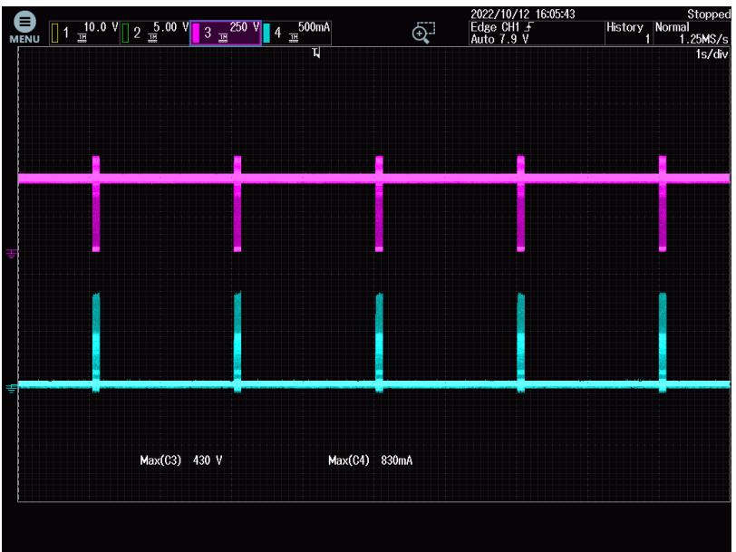

230 VAC

CH3 VDS：  
CH4 ID：

$$
I _ {D S \_ M A X} = 0. 8 3 A
$$

$$
V _ {D S \_ M A X} = 4 3 0 V
$$

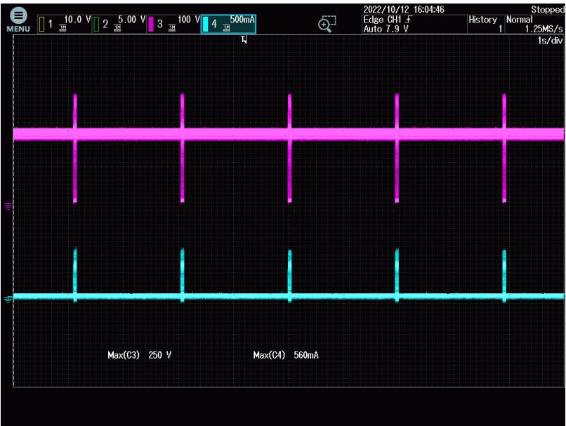

115 VAC

CH3 VDS：  
CH4 ID：

$$
I _ {D S \_ M A X} = 0. 5 6 A
$$

$$
V _ {D S \_ M A X} = 2 5 0 V
$$

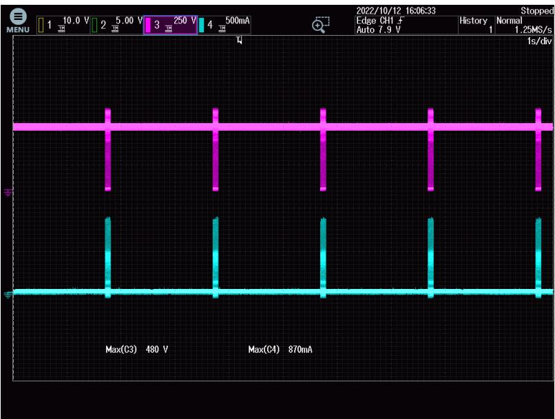

265 VAC

CH3 VDS：  
CH4 ID：

$$
I _ {D S \_ M A X} = 0. 8 7 A
$$

$$
V _ {D S \_ M A X} = 4 8 0 V
$$

## MOSFET稳态波形

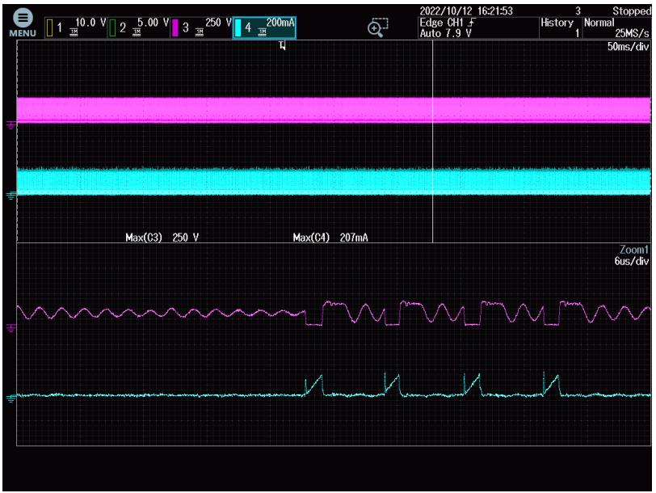

85VAC  
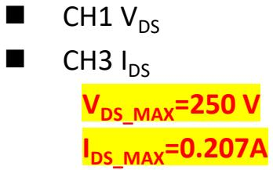

Test Condition:

➢ No Load

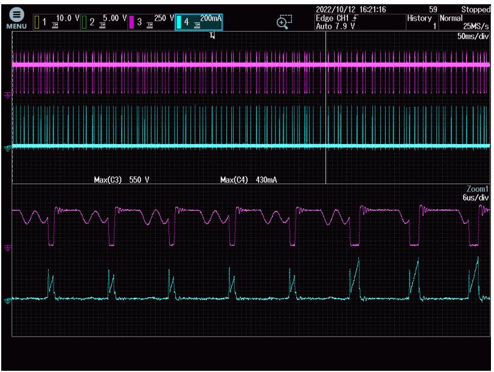

265 VAC  
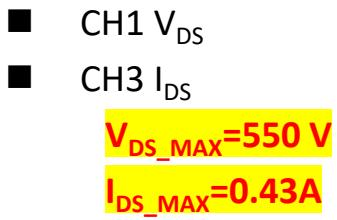

Test Condition:

➢ No Load

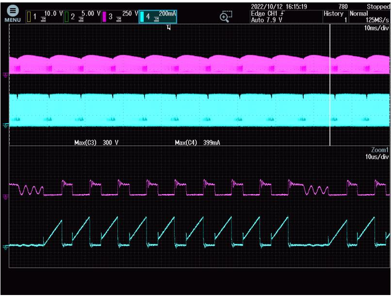

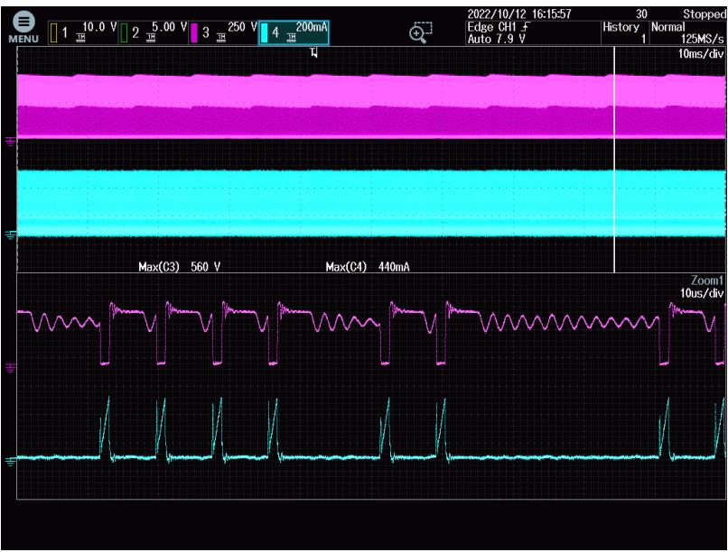

85 VAC  
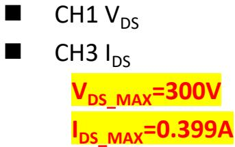

Test Condition:

➢ Full Load

265 VAC  
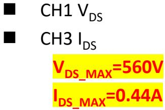

Test Condition:

➢ Full Load

## 漏极开机波形

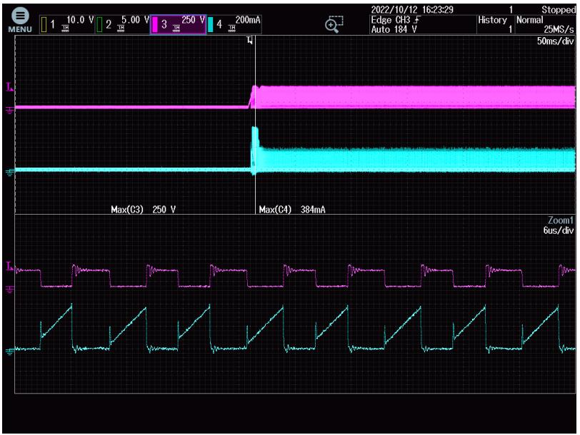

${ \otimes 5 } \mathsf { V } _ { \mathsf { A C } }$

CH1 $\mathsf { V } _ { \mathsf { O U T P U T } }$  
CH4 IDRAIN $\mathsf { I } _ { \mathsf { D R A I N } }$ $V _ { \mathsf { D S \_ M A X } } { = } 2 5 0 \mathsf { V }$ IDS\_MAX=0.384 A $\mid _ { \mathsf { D S \_ M A X } } = 0 . 3 8 4 ~ \mathsf { A }$

Test Condition:  
➢ 空载启动  
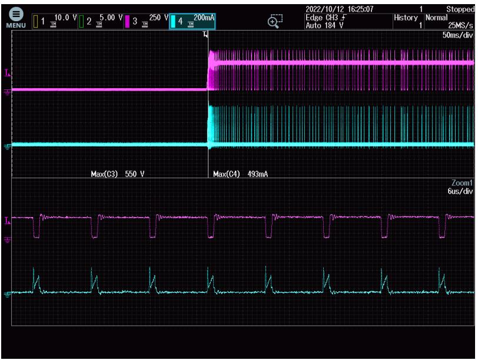

$2 6 5 \ : \mathsf { V } _ { \mathsf { A C } }$

CH1 VOUTPUT $\mathsf { V } _ { \mathsf { O U T P U T } }$  
$\begin{array} { r l } { = } & { ( \mathsf { C H 4 } \mid _ { _ { \mathsf { D R A I N } } } } \\ & { \mathsf { V } _ { _ { \mathsf { D S \_ M A X } } = 5 5 0 \vee } } \\ & { \mathsf { I } _ { _ { \mathsf { D S \_ M A X } } = 0 . 4 9 3 \mathsf { A } } } \end{array}$ CH4 IDRAIN IDS\_MAX=0.493A

Test Condition:  
➢ 空载启动  

85 VAC

CH1 $\mathsf { V } _ { \mathsf { O U T P U T } }$  
CH4 IDRAIN $1 _ { \mathsf { D R A I N } }$ $V _ { \mathsf { D S \_ M A X } } { = } 2 8 0 \ V$ IDS\_MAX=0.79A $1 _ { \mathsf { D S \_ M A X } } { = } 0 . 7 9 \mathsf { A }$

Test Condition:  
➢ 满载启动  
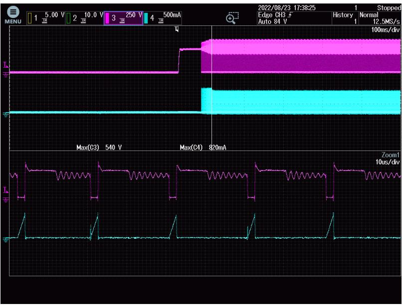

265 VAC

${ \mathsf { C H 1 } } { \mathsf { V } } _ { { \mathsf { 0 U T P U T } } }$  
CH4 IDRAIN $V _ { \mathsf { D S \_ M A X } } { = } 5 4 0 V$ IDS\_MAX=0.82A

Test Condition:

➢ 满载启动

## D-S电压波形

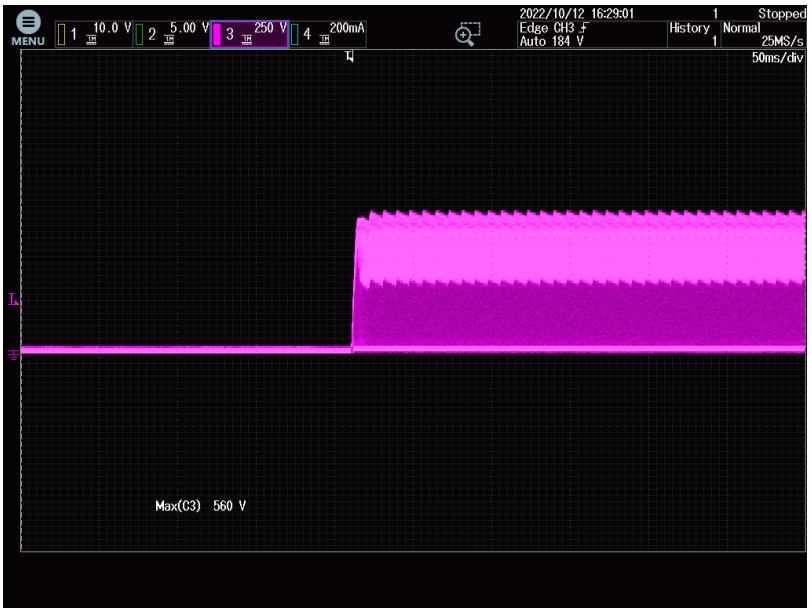

265 VAC

CH2 VDS VDSMAX: 560 V

Test Condition:

➢ 满载开机

极限参数(注3)

<table><tr><td>符号</td><td>参数</td><td>参数范围</td><td>单位</td></tr><tr><td> $V_{DRAIN}$ </td><td>内部高压 MOSFET 漏极到源极电压</td><td>-0.3~700</td><td>V</td></tr><tr><td> $V_{CC}$ </td><td> $V_{CC}$  电压</td><td>-0.3~9</td><td>V</td></tr><tr><td> $I_{CC\_MAX}$ </td><td> $V_{CC}$  引脚最大电流</td><td>20</td><td>mA</td></tr><tr><td> $V_{FB}$ </td><td>输出反馈端电压</td><td>-0.3~9</td><td>V</td></tr><tr><td> $P_{DMAX}$ </td><td>功耗(注 4)</td><td>1.5</td><td>W</td></tr><tr><td> $\theta_{JA}$ </td><td>结到环境的热阻(注 5)</td><td>80</td><td>°C/W</td></tr><tr><td> $\theta_{JC}$ </td><td>结到芯片表面的热阻(注 5)</td><td>20</td><td>°C/W</td></tr><tr><td> $T_{J}$ </td><td>工作结温范围</td><td>-40 to 150</td><td>°C</td></tr><tr><td> $T_{STG}$ </td><td>储存温度范围</td><td>-55 to 150</td><td>°C</td></tr><tr><td>ESD</td><td>人体模型 ESD(注 6)</td><td>2</td><td>kV</td></tr></table>

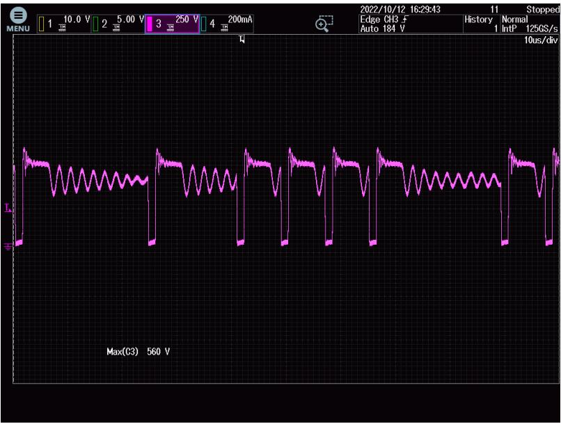

265 VAC

CH2 VDS VDSMAX: 560 V

Test Condition:满载正常工作

## 满载开机

Derating= 560 V /700V= 80%

## 满载正常工作

Derating = 560V /700V = 80%

## 5V输出肖特基反压波形

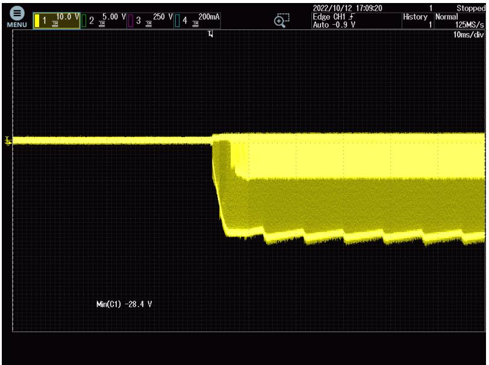

265 VAC

CH1 VDIODE VDSMAX:28.4V

Test Condition:

➢ 满载启动

<table><tr><td>PARAMETER</td><td>SYMBOL</td><td>MB54</td><td>MB54A</td><td>MB55</td><td>MB56</td><td>MB58</td><td>MB59</td><td>MB510</td><td>MB515</td><td>MB520</td><td>UNITS</td></tr><tr><td>Maximum Recurrent Peak Reverse Voltage</td><td> $V_{RRM}$ </td><td>40</td><td>45</td><td>50</td><td>60</td><td>80</td><td>90</td><td>100</td><td>150</td><td>200</td><td>V</td></tr><tr><td>Maximum RMS Voltage</td><td> $V_{RMS}$ </td><td>28</td><td>31.5</td><td>35</td><td>42</td><td>56</td><td>63</td><td>70</td><td>105</td><td>140</td><td>V</td></tr><tr><td>Maximum DC Blocking Voltage</td><td> $V_{DC}$ </td><td>40</td><td>45</td><td>50</td><td>60</td><td>80</td><td>90</td><td>100</td><td>150</td><td>200</td><td>V</td></tr><tr><td>Average Rectified Output Current (See Figure 1)</td><td> $I_{F(AV)}$ </td><td colspan="9">5</td><td>A</td></tr><tr><td>Non-Repetitive Peak Forward Surge Current : 8.3ms single half sine-wave superimposed on rated load</td><td> $I_{FSM}$ </td><td colspan="9">100</td><td>A</td></tr><tr><td>Forward Voltage at 5A (Note 1)</td><td> $V_F$ </td><td colspan="2">0.7</td><td colspan="2">0.74</td><td colspan="3">0.8</td><td colspan="2">0.9</td><td>V</td></tr><tr><td>Peak Reverse Current at Rated DC Blocking Voltage  $T_J=25°C$  $T_J=100°C$ </td><td> $I_R$ </td><td colspan="9">0.0510</td><td>mA</td></tr><tr><td>Typical Thermal Resistance (Note 2)</td><td> $R_{BJA}$  $R_{BJL}$ </td><td colspan="9">5517</td><td>°C /W</td></tr><tr><td>Operating Junction and Storage Temperature Range</td><td> $T_J,T_{STG}$ </td><td>-55 to +150</td><td colspan="8">-65 to +175</td><td>°C</td></tr></table>

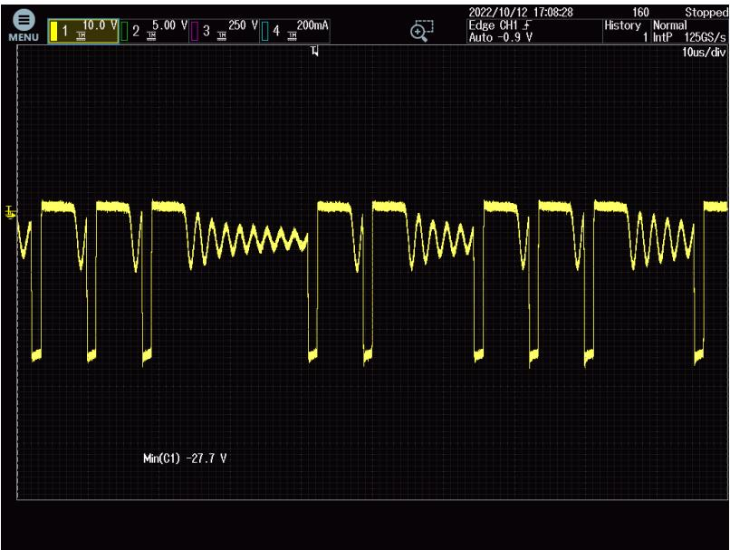

265 VAC

CH1 VDDIODE VMAX: 27.7V

Test Condition:

满载正常工作

## 满载开机

$\mathrm { D e r a t i n g } = 2 8 . 4 \mathsf { V } / 1 0 0 \mathsf { V } = 2 8 . 4 \%$

## 满载正常工作

Derating = 27.7 V / 100V = 27.7 %

## 12V输出肖特基反压波形

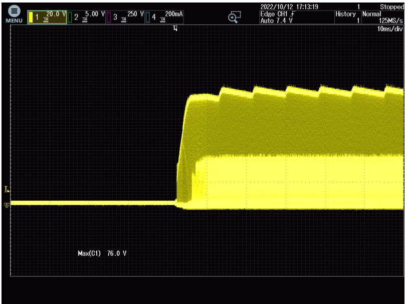

265 VAC

CH3 VDIODE VDSMAX: 76V

Test Condition:

➢ 满载启动

<table><tr><td>Characteristic</td><td>Symbol</td><td>ES2A</td><td>ES2B</td><td>ES2C</td><td>ES2D</td><td>ES2E</td><td>ES2G</td><td>ES2J</td><td>Unit</td></tr><tr><td>Peak Repetitive Reverse VoltageWorking Peak Reverse VoltageDC Blocking Voltage</td><td> $V_{RRM}$  $V_{RWM}$  $V_R$ </td><td>50</td><td>100</td><td>150</td><td>200</td><td>300</td><td>400</td><td>600</td><td>V</td></tr><tr><td>RMS Reverse Voltage</td><td> $V_{R(RMS)}$ </td><td>35</td><td>70</td><td>105</td><td>140</td><td>210</td><td>280</td><td>420</td><td>V</td></tr><tr><td>Average Rectified Output Current @ $T_L=75°C$ </td><td>IO</td><td colspan="7">2.0</td><td>A</td></tr><tr><td>Non-Repetitive Peak Forward Surge Current8.3ms Single half sine-wave superimposed onrated load (JEDEC Method</td><td>IFSM</td><td colspan="7">50</td><td>A</td></tr><tr><td>Forward Voltage @ $I_F=2.0A$ </td><td>VFM</td><td colspan="4">0.95</td><td colspan="2">1.25</td><td>1.7</td><td>V</td></tr><tr><td>Peak Reverse Current @ $T_A=25°C$ At Rated DC Blocking Voltage @ $T_A=100°C$ </td><td>IRM</td><td colspan="7">5.0200</td><td>μA</td></tr><tr><td>Reverse Recovery Time (Note 1)</td><td>trr</td><td colspan="7">35</td><td>nS</td></tr><tr><td>Typical Junction Capacitance (Note 2)</td><td> $C_j$ </td><td colspan="7">62</td><td>pF</td></tr><tr><td>Typical Thermal Resistance (Note 3)</td><td> $R_{fi}JL$ </td><td colspan="7">40</td><td>°C/W</td></tr><tr><td>Operating and Storage Temperature Range</td><td> $T_j,T_{STG}$ </td><td colspan="7">-65 to +150</td><td>°C</td></tr></table>

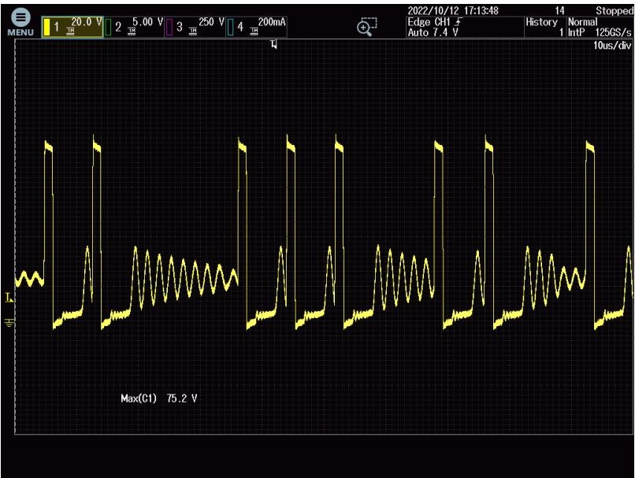

265 VAC

CH3 VDDIODE VMAX: 75.2V

Test Condition:

满载正常工作

## 满载开机

$\mathsf { D e r a t i n g } = 7 6 \mathsf { V } / 6 0 0 \mathsf { V } = 1 2 . 7 \%$

## 满载正常工作

Derating =75.2V / 600 V = 12.5%

## 温升测试

<table><tr><td rowspan="2">项目</td><td colspan="2">85VAC</td><td colspan="2">265VAC</td></tr><tr><td>温度(°C)</td><td>温升(°C)</td><td>温度(°C)</td><td>温升(°C)</td></tr><tr><td>环境温度</td><td colspan="2">27</td><td colspan="2">28</td></tr><tr><td>BP8616D (U2)</td><td>93</td><td>66</td><td>97</td><td>69</td></tr><tr><td>变压器绕组(T1)</td><td>61</td><td>34</td><td>64</td><td>36</td></tr><tr><td>变压器磁芯(T1)</td><td>60</td><td>33</td><td>64</td><td>36</td></tr><tr><td>整流桥(B1)</td><td>29</td><td>2</td><td>29</td><td>1</td></tr><tr><td>输出肖特基(D1)</td><td>71</td><td>44</td><td>72</td><td>44</td></tr><tr><td>输入电解电容(EC3)</td><td>55</td><td>28</td><td>53</td><td>25</td></tr><tr><td>输出电解电容(EC1)</td><td>52</td><td>25</td><td>52</td><td>24</td></tr></table>

## 测试说明

➢ 在适配器壳中进行测试  
➢ 电路板放在一个封闭的盒子内  
➢ 热电偶连接到各个测量点  
➢ 等测量点温度达到稳定后记录数据

## 传导EMI （未加电容）

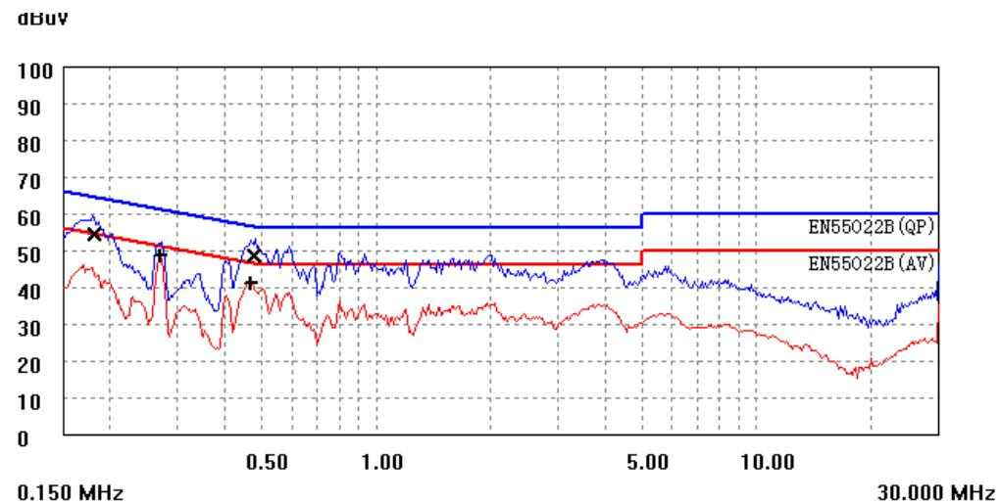

115VAC Line

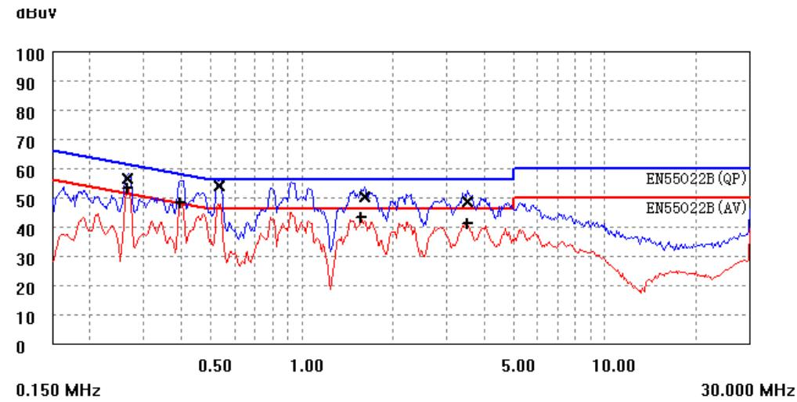

230VAC Line

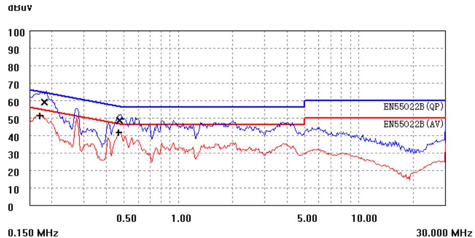

115VAC Neutral

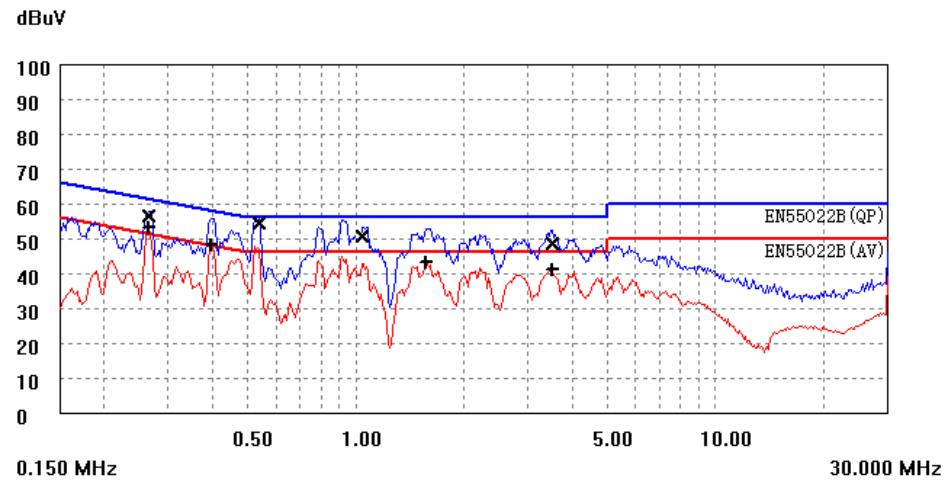

230VAC Neutral

## 传导EMI （加电容）

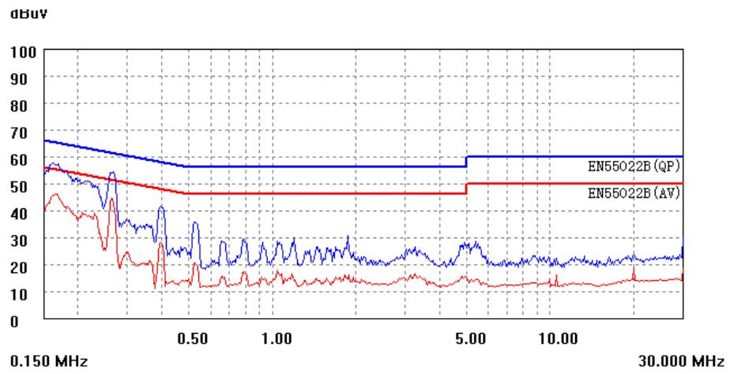

115VAC Line

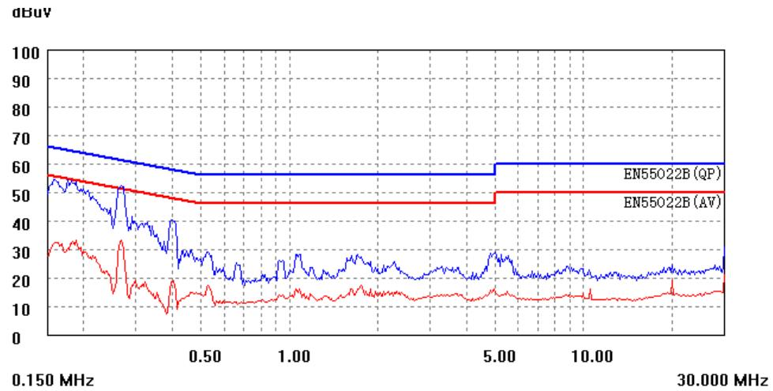

230VAC Line

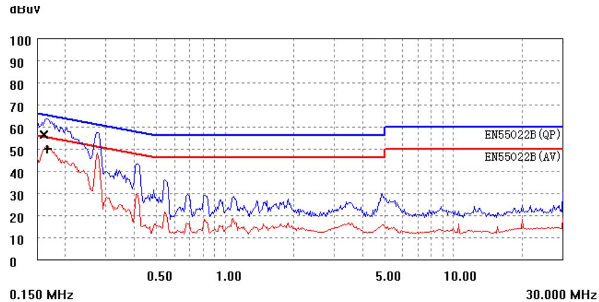

115VAC Neutral

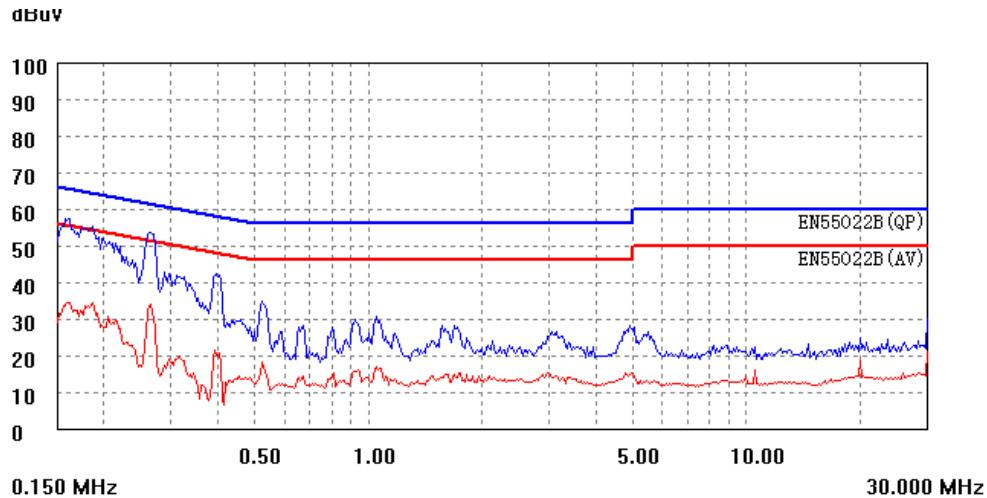

230VAC Neutral

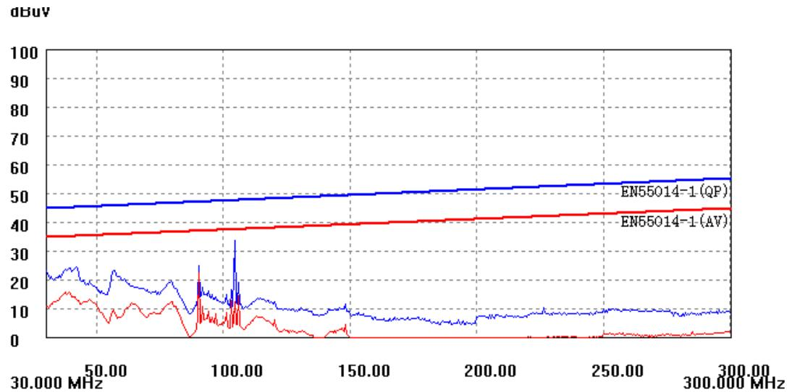

115VAC 满载

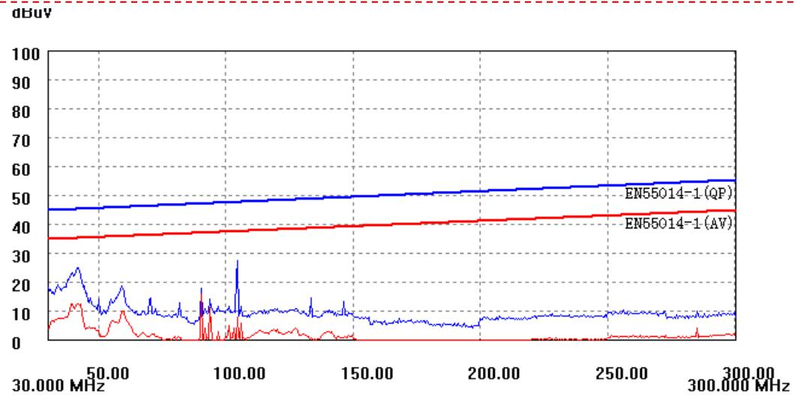

115VAC 空载

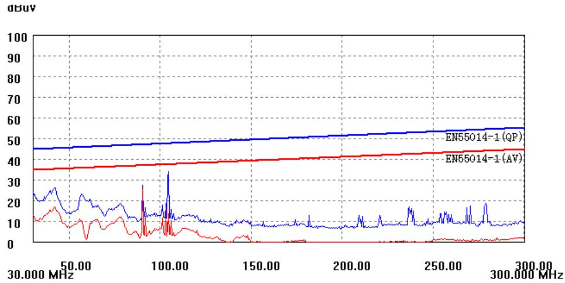

230VAC 满载  
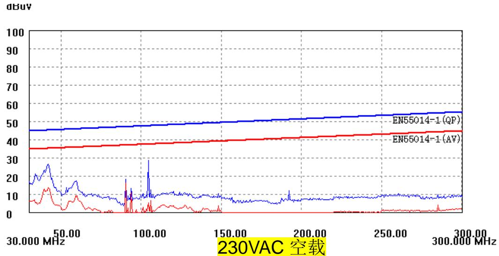

<table><tr><td>差模</td><td>电压</td><td>相位角</td><td>发生器阻抗</td><td>测试次数</td><td>测试结果</td></tr><tr><td>L to N</td><td>+2kV</td><td>0</td><td>2</td><td>10</td><td>Pass</td></tr><tr><td>L to N</td><td>-2kV</td><td>0</td><td>2</td><td>10</td><td>Pass</td></tr><tr><td>L to N</td><td>+2kV</td><td>90</td><td>2</td><td>10</td><td>Pass</td></tr><tr><td>L to N</td><td>-2kV</td><td>90</td><td>2</td><td>10</td><td>Pass</td></tr><tr><td>L to N</td><td>+2kV</td><td>180</td><td>2</td><td>10</td><td>Pass</td></tr><tr><td>L to N</td><td>-2kV</td><td>180</td><td>2</td><td>10</td><td>Pass</td></tr><tr><td>L to N</td><td>+2kV</td><td>270</td><td>2</td><td>10</td><td>Pass</td></tr><tr><td>L to N</td><td>-2kV</td><td>270</td><td>2</td><td>10</td><td>Pass</td></tr></table>

## 测试说明

➢ 按照GB/T17626.5和IEC61000-4-5的最新版本要求进行测试  
➢ 室温环境，230VAC输入，满载条件  
➢ 输入1.2/50us组合波浪涌电压  
➢ 每个测试点重复10次  
➢ 每次间隔时间1分钟  
➢ 试验时样机输出正常（符合A类标准）视为Pass

<table><tr><td>差模</td><td>电压</td><td>脉冲群持续时间</td><td>脉冲频率</td><td>测试时间</td><td>测试结果</td></tr><tr><td>L to N</td><td>+4kV</td><td>15ms</td><td>5kHz</td><td>120s</td><td>Pass</td></tr><tr><td>L to N</td><td>-4kV</td><td>15ms</td><td>5kHz</td><td>120s</td><td>Pass</td></tr><tr><td>L to N</td><td>+4kV</td><td>0.75ms</td><td>100kHz</td><td>120s</td><td>Pass</td></tr><tr><td>L to N</td><td>-4kV</td><td>0.75ms</td><td>100kHz</td><td>120s</td><td>Pass</td></tr><tr><td>L to N</td><td>+2kV</td><td>2ms</td><td>38kHz</td><td>120s</td><td>Pass</td></tr><tr><td>L to N</td><td>-2kV</td><td>2ms</td><td>38kHz</td><td>120s</td><td>Pass</td></tr><tr><td>L to N</td><td>+4kV</td><td>2ms</td><td>38kHz</td><td>120s</td><td>Pass</td></tr><tr><td>L to N</td><td>-4kV</td><td>2ms</td><td>38kHz</td><td>120s</td><td>Pass</td></tr></table>

## 测试说明

➢ 按照GB/T17626.4和IEC61000-4-4的最新版本要求进行测试  
➢ 室温环境，230VAC输入满载条件  
➢ 分别测试5kHz/100kHz/38kHz脉冲频率  
➢ 脉冲群周期为300ms  
➢ 每个测试条件测试时间120s  
➢ 试验时样机输出正常（符合A类标准）视为Pass

<table><tr><td>测试</td><td>电压(V)</td><td>放电类型</td><td>放电次数</td><td>测试结果</td></tr><tr><td>Vo</td><td>+15kV</td><td>空气放电</td><td>10</td><td>Pass</td></tr><tr><td>Vo</td><td>-15kV</td><td>空气放电</td><td>10</td><td>Pass</td></tr><tr><td>GND</td><td>+15kV</td><td>空气放电</td><td>10</td><td>Pass</td></tr><tr><td>GND</td><td>-15kV</td><td>空气放电</td><td>10</td><td>Pass</td></tr><tr><td>Vo</td><td>+20kV</td><td>空气放电</td><td>10</td><td>Pass</td></tr><tr><td>Vo</td><td>-20kV</td><td>空气放电</td><td>10</td><td>Pass</td></tr><tr><td>GND</td><td>+20kV</td><td>空气放电</td><td>10</td><td>Pass</td></tr><tr><td>GND</td><td>-20kV</td><td>空气放电</td><td>10</td><td>Pass</td></tr></table>

## 测试说明

➢ 按照GB/T17626.2和IEC61000-4-2的最新版本要求进行测试  
➢ 室温环境，230VAC输入满载条件  
➢ 每个测试点重复10次  
➢ 分别对输出正端和地进行空气放电  
➢ 试验时样机输出正常（符合A类标准）视为Pass

## THANK YOU FOR WATCHING
