## BPA8616D 非隔离参考设计

## (12V/0.7A)

上海晶丰明源半导体股份有限公司

Shanghai Bright Power Semiconductor Co., Ltd.

陈耀兵

2022 3 31

BPA861X  
电源规格  
电路图  
◼BOM  
◼PCB Layout  
电路实物图  
变压器规格书  
性能测试数据

## 产品特点:

➢ 700V MOSFET  
➢ ON/OFF  
》内置软启动功能  
》集成高压启动、自供电电路  
》低音频噪声  
》输入过/欠压保护

## 应用领域:

》家用电器辅助电源  
》电机驱动辅助电源  
➢ IOT/ /  
》工业控制辅助电源

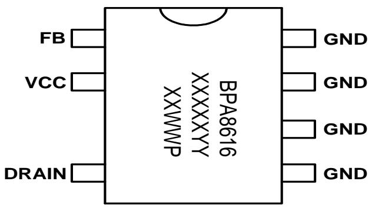

## 电源规格

<table><tr><td>项目描述</td><td>符号</td><td>最小</td><td>典型</td><td>最大</td><td>单位</td><td>备注</td></tr><tr><td colspan="7">输入</td></tr><tr><td>电压</td><td> $V_{IN}$ </td><td>90</td><td>115/230</td><td>264</td><td> $V_{AC}$ </td><td></td></tr><tr><td>频率</td><td> $f_{LINE}$ </td><td>47</td><td>50/60</td><td>63</td><td>Hz</td><td></td></tr><tr><td colspan="7">输出</td></tr><tr><td>输出电压</td><td> $V_{OUT}$ </td><td></td><td>12</td><td></td><td>V</td><td>±3%</td></tr><tr><td>输出电流</td><td> $I_{OUT}$ </td><td></td><td>0.7</td><td></td><td>A</td><td></td></tr><tr><td>输出电压纹波</td><td> $V_{RIPPLE}$ </td><td></td><td></td><td>200</td><td>mV</td><td>20MHz带宽</td></tr><tr><td>连续输出功率</td><td> $P_{OUT}$ </td><td></td><td>8.4</td><td></td><td>W</td><td></td></tr><tr><td colspan="7">效率</td></tr><tr><td>待机功耗</td><td> $P_{STDBY}$ </td><td></td><td></td><td>70</td><td>mW</td><td>230VAC</td></tr><tr><td>满载效率</td><td>η</td><td>79</td><td></td><td></td><td>%</td><td>115VAC/230VAC</td></tr><tr><td colspan="7">环境</td></tr><tr><td>传导EMI</td><td></td><td colspan="4">满足CISPR22/EN55022 Class B,至少6dB 裕量</td><td></td></tr><tr><td>Surge</td><td></td><td></td><td>2</td><td></td><td>kV</td><td>差模</td></tr><tr><td>EFT</td><td></td><td></td><td>4</td><td></td><td>kV</td><td>5kHz/100kHz/38kHz</td></tr><tr><td>ESD</td><td></td><td></td><td>15</td><td></td><td>kV</td><td>接触8kV,空气15kV</td></tr><tr><td>工作环境温度</td><td> $T_{AMP}$ </td><td>0</td><td></td><td>50</td><td>°C</td><td></td></tr></table>

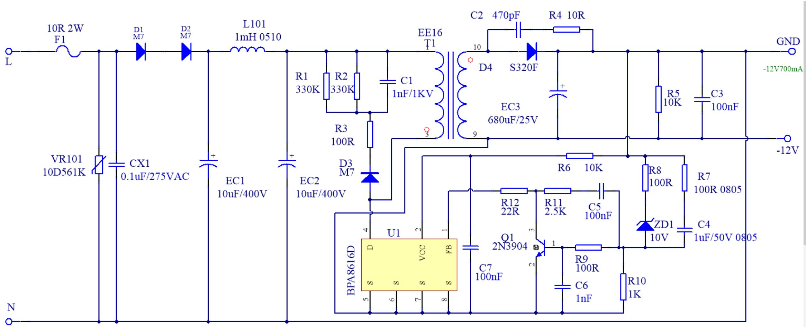

<table><tr><td>序号</td><td>元件标号</td><td>参数描述</td><td>封装尺寸</td><td>数量</td></tr><tr><td>1</td><td>C1</td><td>1nF/1KV</td><td>1206-C</td><td>1</td></tr><tr><td>2</td><td>C2</td><td>470pF</td><td>0805-C</td><td>1</td></tr><tr><td>3</td><td>C3, C5, C7</td><td>100nF</td><td>0805-C</td><td>3</td></tr><tr><td>4</td><td>C4</td><td>1uF/50V 0805</td><td>0805-C</td><td>1</td></tr><tr><td>5</td><td>C6</td><td>1nF</td><td>0805-C</td><td>1</td></tr><tr><td>6</td><td>CX1</td><td>0.1uF/275VAC</td><td>P10</td><td>1</td></tr><tr><td>7</td><td>D1, D2, D3</td><td>M7</td><td>SMA</td><td>3</td></tr><tr><td>8</td><td>D4</td><td>S320F</td><td>SMB</td><td>1</td></tr><tr><td>9</td><td>EC1, EC2</td><td>10uF/400V</td><td>EC 8.5 P3.5</td><td>2</td></tr><tr><td>10</td><td>EC3</td><td>680uF/25V</td><td>EC 8.5 P3.5</td><td>1</td></tr><tr><td>11</td><td>F1</td><td>10R 2W</td><td>F-8.5X4-P5</td><td>1</td></tr><tr><td>12</td><td>L101</td><td>1mH 0510</td><td>L/D 6 P3.0</td><td>1</td></tr><tr><td>13</td><td>Q1</td><td>2N3904</td><td>SOT23</td><td>1</td></tr><tr><td>14</td><td>R1, R2</td><td>330K</td><td>1206-R</td><td>2</td></tr><tr><td>15</td><td>R3</td><td>100R</td><td>1206-R</td><td>1</td></tr><tr><td>16</td><td>R4</td><td>10R</td><td>0805-R</td><td>1</td></tr><tr><td>17</td><td>R5, R6</td><td>10K</td><td>0805-R</td><td>2</td></tr><tr><td>18</td><td>R7</td><td>100R 0805</td><td>0805-R</td><td>1</td></tr><tr><td>19</td><td>R8, R9</td><td>100R</td><td>0805-R</td><td>2</td></tr><tr><td>20</td><td>R10</td><td>1K</td><td>0805-R</td><td>1</td></tr><tr><td>21</td><td>R11</td><td>2.5K</td><td>0805-R</td><td>1</td></tr><tr><td>22</td><td>R12</td><td>22R</td><td>0805-R</td><td>1</td></tr><tr><td>23</td><td>T1</td><td>EE16</td><td>T EE16(5+5)</td><td>1</td></tr><tr><td>24</td><td>U1</td><td>BPA8616D</td><td>DIP8</td><td>1</td></tr><tr><td>25</td><td>VR101</td><td>10D561K</td><td>MOV-10X5.5-P7.5 - 2</td><td>1</td></tr><tr><td>26</td><td>ZD1</td><td>10V</td><td>D SOD-123</td><td>1</td></tr></table>

72.756 (mm)  
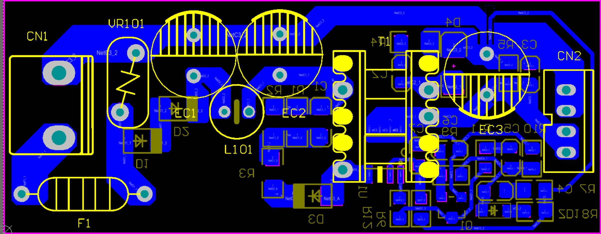

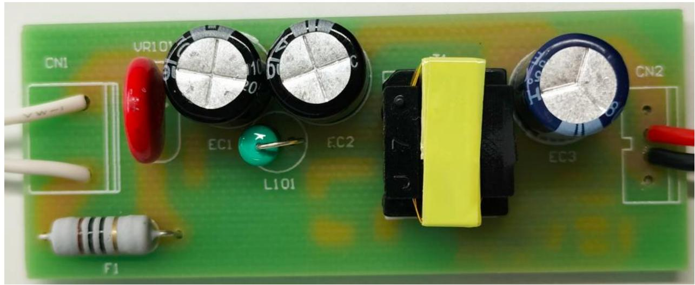

TOP SIDE

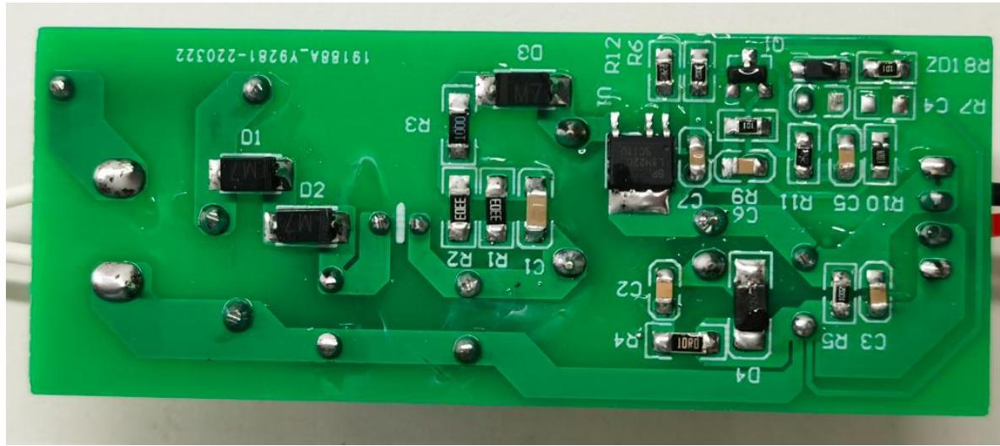

BOTTOM SIDE

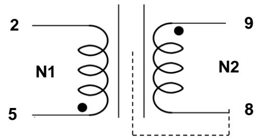

<table><tr><td>序号</td><td>起始脚</td><td>终止脚</td><td>绕制规则</td><td>匝数</td><td>绕线方式</td></tr><tr><td>N1</td><td>5</td><td>2</td><td>2UEWφ0.19*1P</td><td>107Ts</td><td>密绕三层</td></tr><tr><td>胶带</td><td></td><td></td><td></td><td>2Ts</td><td></td></tr><tr><td>N2</td><td>9</td><td>8</td><td>2UEWφ0.45*1P</td><td>15Ts</td><td>均匀绕一层</td></tr><tr><td>胶带</td><td></td><td></td><td></td><td>3Ts</td><td></td></tr><tr><td colspan="6">磁芯接8脚</td></tr></table>

## 规格参数：

1）骨架：EE16立式（5+5PIN），磁芯材质：EE16 PC40 或同等材质 ， $\mathsf { A } \mathsf { e } = 1 9 \mathsf { m } \mathsf { m } ^ { 2 }$ ；  
2）N1、N2: 2UEW 漆包线；  
3）绝缘胶带:3M900 或同等材质；  
4）初级绕组感量Lp：1.4mH±5%（测试条件： 0.3V，100kHz）；  
5）漏感量Llk：要求控制在初级绕组的4%以内(测试条件： 0.3 V，100kHz）；  
6）耐压测试= 3KV 2mA 1Min；  
7）成品要求：浸凡立水；

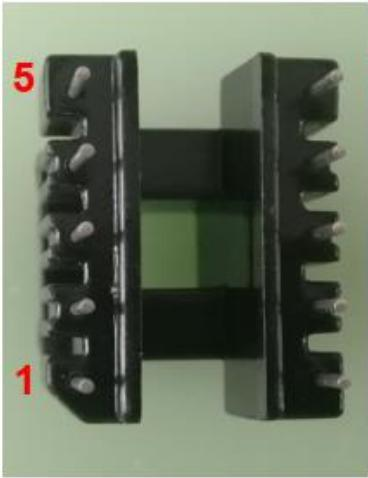

6  
10

待机功耗  
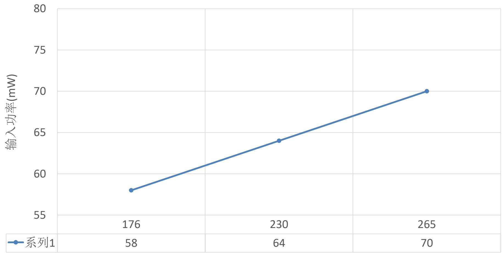

输入电压(Vac)

效率曲线  
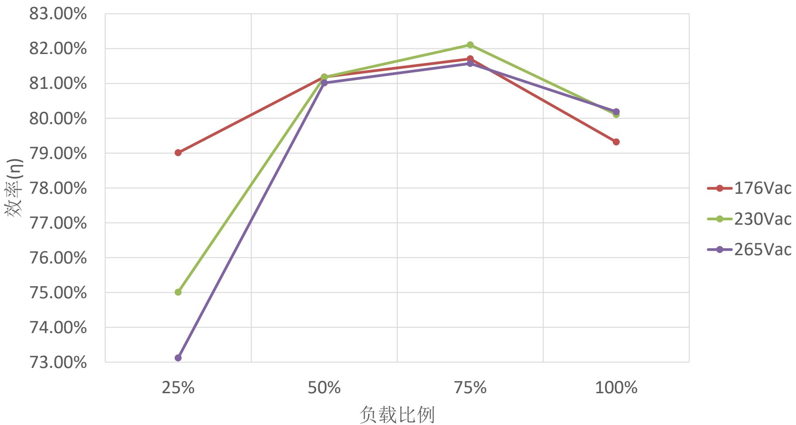

<table><tr><td> $V_{IN}(VAC)$ </td><td>Load(%)</td><td> $P_{IN}(W)$ </td><td> $V_{OUT}(V)$ </td><td> $I_{OUT}(A)$ </td><td> $P_{OUT}(W)$ </td><td>Eff(%)</td><td>AVG Eff(%)</td></tr><tr><td rowspan="6">176</td><td>空载</td><td></td><td></td><td></td><td>0</td><td></td><td></td></tr><tr><td>10%</td><td>1.18</td><td>11.788</td><td>0.07</td><td>0.82516</td><td>69.93%</td><td></td></tr><tr><td>25%</td><td>2.61</td><td>11.7841</td><td>0.175</td><td>2.062218</td><td>79.01%</td><td rowspan="4">80.31%</td></tr><tr><td>50%</td><td>5.08</td><td>11.7834</td><td>0.35</td><td>4.12419</td><td>81.18%</td></tr><tr><td>75%</td><td>7.57</td><td>11.7813</td><td>0.525</td><td>6.185183</td><td>81.71%</td></tr><tr><td>100%</td><td>10.39</td><td>11.7735</td><td>0.7</td><td>8.24145</td><td>79.32%</td></tr><tr><td rowspan="6">230</td><td>空载</td><td></td><td></td><td></td><td>0</td><td></td><td></td></tr><tr><td>10%</td><td>1.21</td><td>11.7908</td><td>0.07</td><td>0.825356</td><td>68.21%</td><td></td></tr><tr><td>25%</td><td>2.75</td><td>11.7872</td><td>0.175</td><td>2.06276</td><td>75.01%</td><td rowspan="4">79.60%</td></tr><tr><td>50%</td><td>5.08</td><td>11.7822</td><td>0.35</td><td>4.12377</td><td>81.18%</td></tr><tr><td>75%</td><td>7.53</td><td>11.7764</td><td>0.525</td><td>6.18261</td><td>82.11%</td></tr><tr><td>100%</td><td>10.28</td><td>11.7646</td><td>0.7</td><td>8.23522</td><td>80.11%</td></tr><tr><td rowspan="6">265</td><td>空载</td><td></td><td></td><td></td><td>0</td><td></td><td></td></tr><tr><td>10%</td><td>1.22</td><td>11.7864</td><td>0.07</td><td>0.825048</td><td>67.63%</td><td></td></tr><tr><td>25%</td><td>2.82</td><td>11.7833</td><td>0.175</td><td>2.062078</td><td>73.12%</td><td rowspan="4">78.98%</td></tr><tr><td>50%</td><td>5.09</td><td>11.7818</td><td>0.35</td><td>4.12363</td><td>81.01%</td></tr><tr><td>75%</td><td>7.58</td><td>11.7778</td><td>0.525</td><td>6.183345</td><td>81.57%</td></tr><tr><td>100%</td><td>10.27</td><td>11.7648</td><td>0.7</td><td>8.23536</td><td>80.19%</td></tr></table>

## 输出电压调整率

<table><tr><td> $V_{IN}(VAC)$  $I_{OUT}(A)$ </td><td>176</td><td>230</td><td>265</td><td>平均值</td><td>线调整率</td></tr><tr><td>0</td><td>11.7422</td><td>11.7423</td><td>11.7422</td><td>11.742</td><td>0.00%</td></tr><tr><td>20%</td><td>11.7389</td><td>11.7394</td><td>11.7402</td><td>11.740</td><td>0.01%</td></tr><tr><td>40%</td><td>11.7377</td><td>11.7383</td><td>11.7394</td><td>11.738</td><td>0.01%</td></tr><tr><td>60%</td><td>11.7488</td><td>11.7457</td><td>11.7426</td><td>11.746</td><td>0.05%</td></tr><tr><td>80%</td><td>11.7452</td><td>11.7492</td><td>11.75</td><td>11.748</td><td>0.04%</td></tr><tr><td>100%</td><td>11.7447</td><td>11.7453</td><td>11.7464</td><td>11.745</td><td>0.01%</td></tr><tr><td>平均值</td><td>11.743</td><td>11.743</td><td>11.743</td><td></td><td></td></tr><tr><td>负载调整率</td><td>0.09%</td><td>0.09%</td><td>0.09%</td><td></td><td></td></tr></table>

◼ 计算方法：调整率=100%\*(最大值-最小值)/平均值

## 输出电压纹波

20MHz带宽，去掉示波器探头正端夹子和地线环，10uF/50V 0.1uF/50V

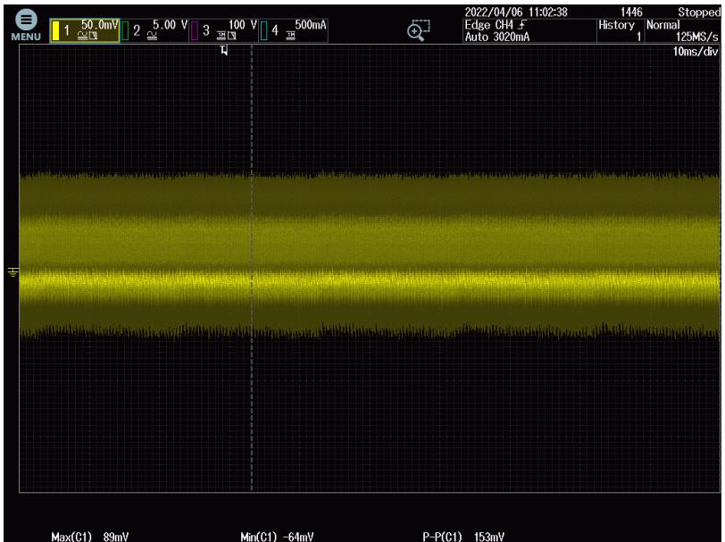

176 VAC

CH1 VOUT $\mathsf { V } _ { \mathsf { O U T } }$ Ripple $v _ { p _ { \mathrm { K - P K } } } { = } 1 5 3 ~ \mathsf { m V }$

## Test Condition:

➢ Full Load

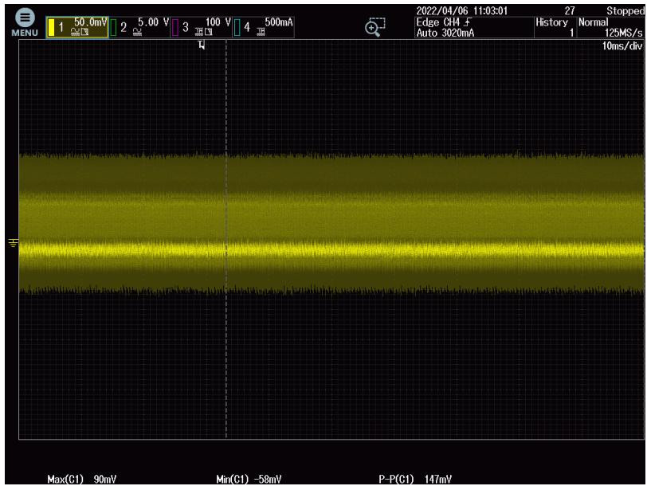

230 VAC

${ \mathsf { C H 1 } } { \mathsf { V } } _ { \mathsf { O U T } }$ CH1 VOUT Ripple $\mathsf { V } _ { \mathsf { P K - P K } } { = } 1 4 7 \mathsf { m V }$

## Test Condition:

➢ Full Load

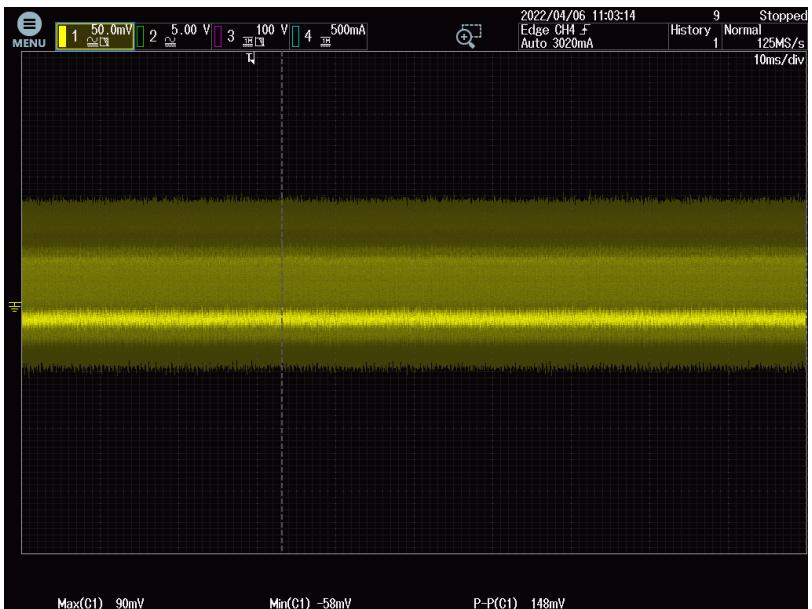

265 $\mathsf { v } _ { \mathsf { A C } }$

CH1 VOUT $\mathsf { V } _ { \mathsf { O U T } }$ Ripple $V _ { \mathsf { P K - P K } } { = } 1 4 8 ~ \mathsf { m V }$

## Test Condition:

➢ Full Load

## (50%-100%)

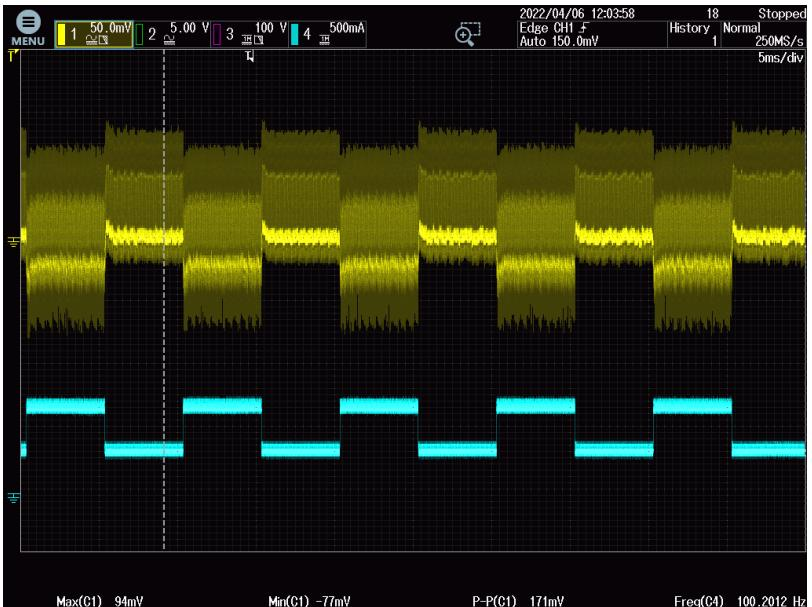

176 VAC

CH1 VOUT ${ \mathsf { C H 1 } } { \mathsf { V } } _ { \mathsf { O U T } }$ $\mathsf { V } _ { \mathsf { P K - P K } } { = } 1 7 1 \mathsf { m V }$  
$\mathsf { C H 4 } \mathsf { I } _ { \mathsf { O U T } }$

## Test Condition:

➢ 0.35 A-0.7 A-0.35 A  
➢ Slew Rate: 0.5 A/μS  
➢ Frequency: 100 Hz

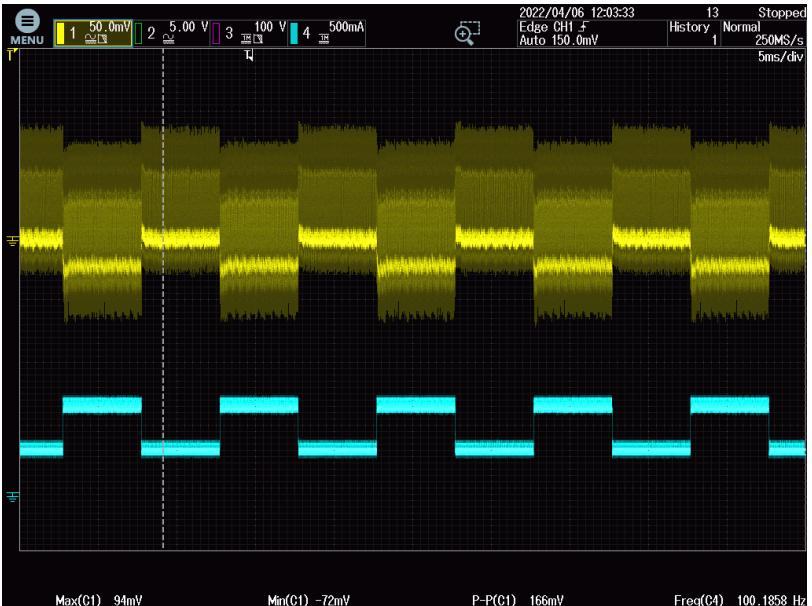

265 VAC

CH1 VOUT $\mathsf { V } _ { \mathsf { O U T } }$ $\mathsf { V } _ { \mathsf { P K - P K } } \equiv 1 6 6 \mathsf { m v }$  
$\mathsf { C H 4 } \mathsf { l } _ { \mathsf { O U T } }$

## Test Condition:

➢ $0 . 3 5 \ : \mathsf { A } – 0 . 7 \ : \mathsf { A } – 0 . 3 5 \ : \mathsf { A }$  
➢ Slew Rate: 0.5 $\mathsf { A } / \mu \mathsf { S }$  
➢ Frequency: 100 Hz

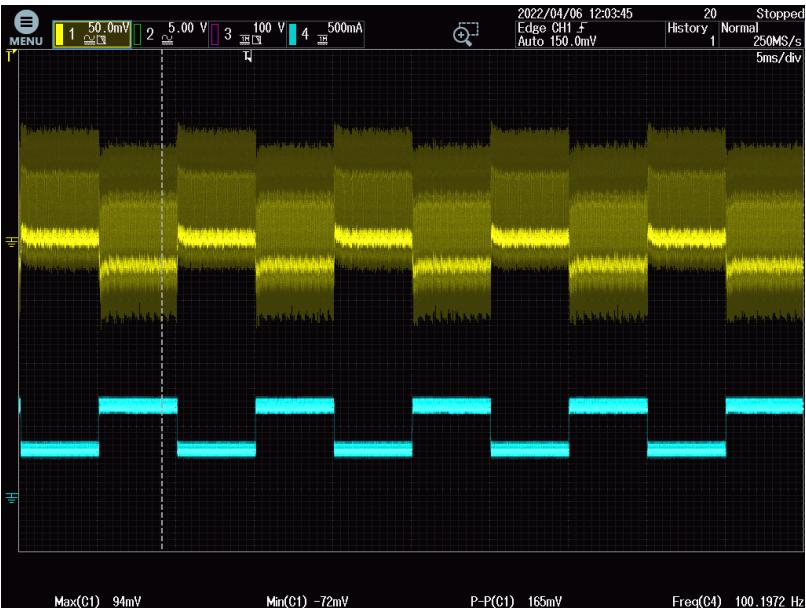

230 VAC

CH1 VOUT ${ \mathsf { C H 1 } } { \mathsf { V } } _ { \mathsf { O U T } }$ $\mathsf { V } _ { \mathsf { P K - P K } } \equiv 1 6 5 \mathsf { m V }$  
$\mathsf { C H 4 } \mathsf { I } _ { \mathsf { O U T } }$

## Test Condition:

➢ 0.35 A-0.7 A-0.35 A  
➢ Slew Rate: 0.5 A/μS  
➢ Frequency: 100 Hz

## (10%-90%)

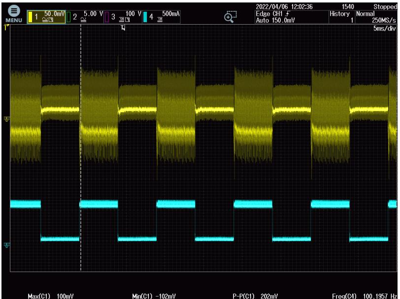

176 VAC

CH1 VOUT ${ \mathsf { C H 1 } } { \mathsf { V } } _ { \mathsf { O U T } }$ $V _ { P K - P K } = 2 0 2 m v$  
$\mathsf { C H 4 } \mathsf { I } _ { \mathsf { O U T } }$

## Test Condition:

➢ $0 . 0 7 \ A - 0 . 6 3 \ A - 0 . 0 7 \ A$  
➢ Slew Rate: 0.5 A/μS  
➢ Frequency: 100 Hz

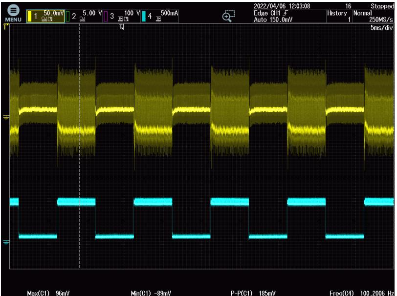

265 VAC

CH1 VOUT ${ \mathsf { C H 1 } } { \mathsf { V } } _ { \mathsf { O U T } }$ $v _ { p _ { \mathrm { K - P K } } } { = } 1 8 5 \mathsf { m v }$  
$\mathsf { C H 4 } \mathsf { l } _ { \mathsf { O U T } }$

## Test Condition:

➢ $0 . 0 7 \ A - 0 . 6 3 \ A - 0 . 0 7 \ A$  
➢ Slew Rate: 0.5 A/μS  
➢ Frequency: 100 Hz

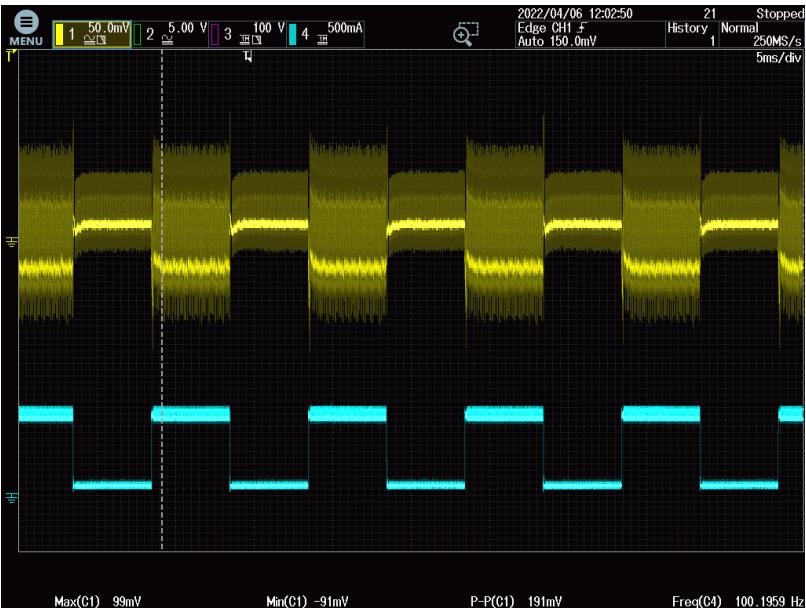

230 VAC

CH1 VOUT ${ \mathsf { C H 1 } } { \mathsf { V } } _ { \mathsf { O U T } }$ $\mathsf { V } _ { \mathsf { P K - P K } } \mathsf { = } \mathsf { 1 9 1 m V }$  
$\mathsf { C H 4 } \mathsf { I } _ { \mathsf { O U T } }$

## Test Condition:

➢ $0 . 0 7 \ A - 0 . 6 3 \ A - 0 . 0 7 \ A$  
➢ Slew Rate: 0.5 A/μS  
➢ Frequency: 100 Hz

## 输出电压开机波形

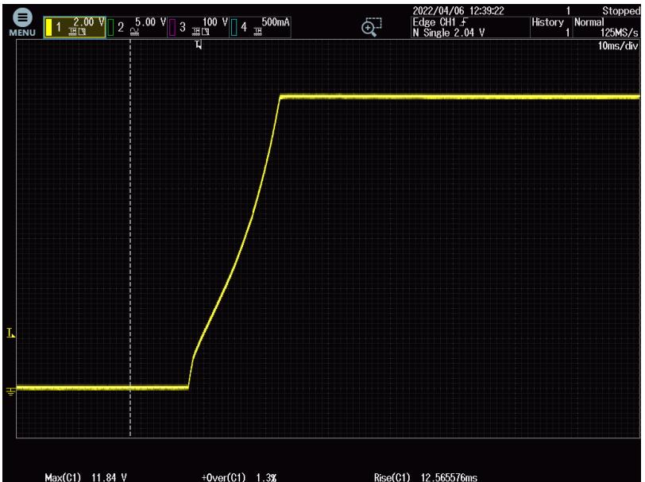

176 VAC

CH1 VOUT TRISE: 12.6 mS

## Test Condition:

➢ No Load

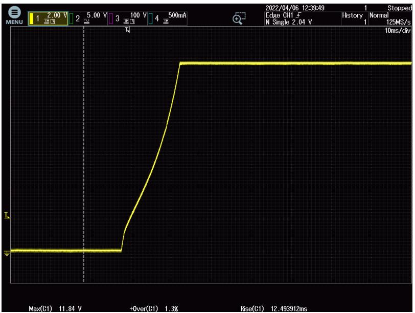

265 VAC

CH1 VOUT TRISE: 12.5 mS

## Test Condition:

➢ No Load

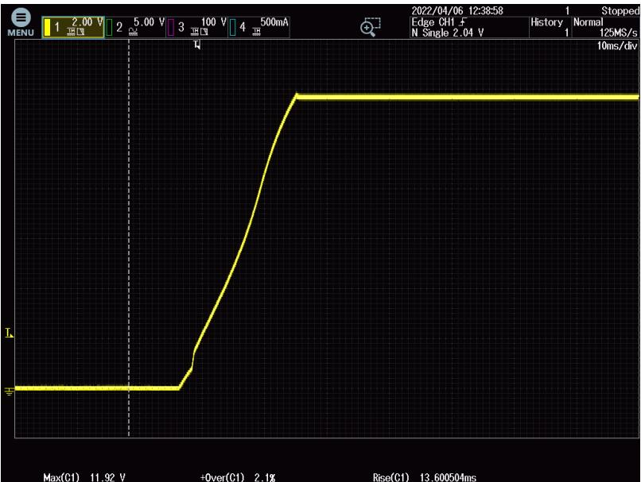

176 VAC

CH1 VOUT TRISE: 13.6 mS

## Test Condition:

➢ Full Load

265 VAC

CH1 VOUT TRISE: 12.6 mS

## Test Condition:

➢ Full Load

## MOs漏源极电压电流波形 (启机)

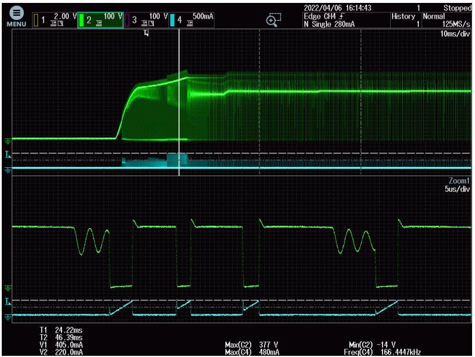

176 VAC

${ \mathsf { C H } } 2 { \mathsf { V } } _ { \mathsf { D S } }$  
$C H 4 1 _ { \mathsf { D } }$ $\mathtt { V } _ { \mathtt { D S } } mathtt { = } 3 7 7 \mathtt { V }$ IMAX=0.48 A $\mathsf { I } _ { \mathsf { M A X } } { = } 0 . 4 8 \mathsf { A }$

Test Condition:  
➢ No Load  
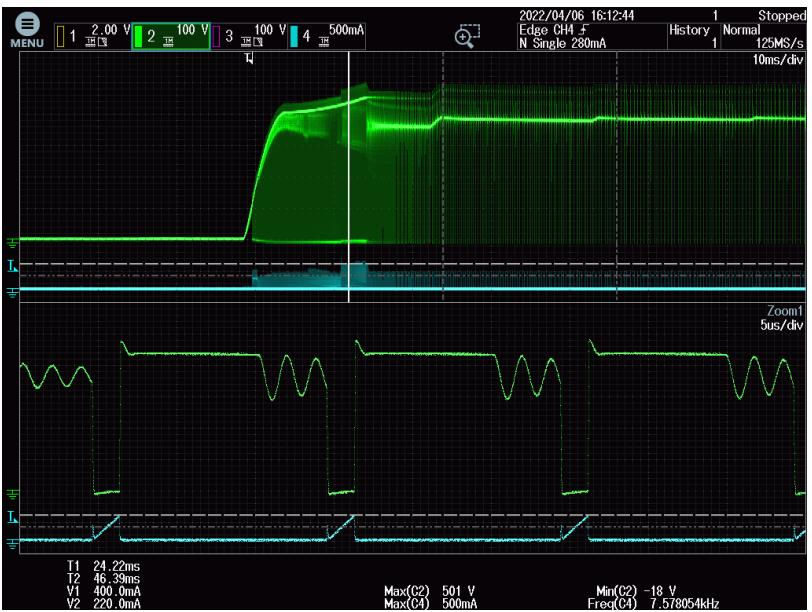

265 VAC

${ \mathsf { C H } } 2 \ { \mathsf { V } } _ { \mathsf { D S } }$  
$C H 4 1 _ { \mathsf { D } }$ $\mathtt { V } _ { \mathtt { D S } } mathtt { = } 5 0 1 \mathtt { V }$ IMAX=0.5 A $\mathsf { I } _ { \mathsf { M A X } } { = } 0 . 5 ~ \mathsf { A }$

Test Condition:  
➢ No Load  
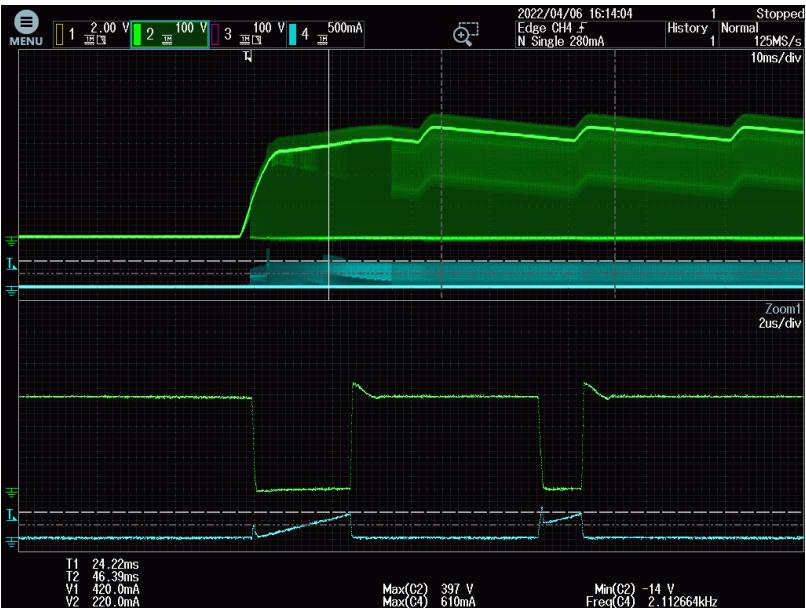

176 VAC

${ \mathsf { C H } } 2 { \mathsf { V } } _ { \mathsf { D S } }$  
$C H 4 1 _ { \mathsf { D } }$ $\mathtt { V } _ { \mathtt { D S } } mathtt { = } 3 9 7 \mathtt { V }$ IMAX= 0.61 A $\mathsf { I } _ { \mathsf { M A X } } = \mathbf { 0 . 6 1 A }$

Test Condition:  
➢ Full Load  
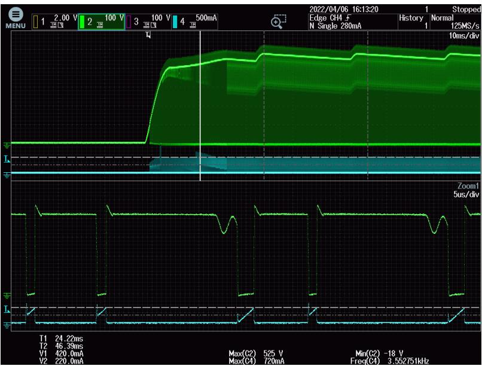

265 VAC

${ \mathsf { C H } } 2 { \mathsf { V } } _ { \mathsf { D S } }$  
$C H 4 1 _ { \mathsf { D } }$ $V _ { \mathsf { D S } } { = } 5 2 5 \ \mathsf { V }$ $\mathsf { I } _ { \mathrm { M A X } } { = } 0 . 7 2 ~ \mathsf { A }$

Test Condition:

➢ Full Load

## MOS漏源极电压电流波形 (正常工作)

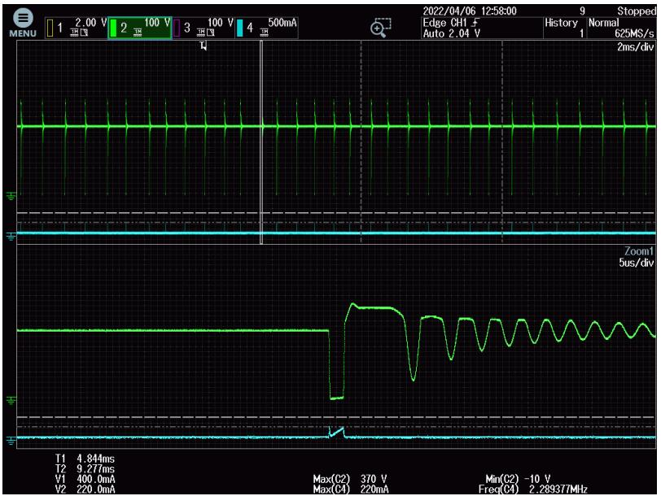

176 VAC

${ \mathsf { C H } } 2 { \mathsf { V } } _ { \mathsf { D S } }$  
$C H 4 1 _ { \mathsf { D } }$ $\mathtt { V } _ { \mathtt { D S } } mathtt { = } 3 7 0 \mathtt { V }$ $\mathsf { I } _ { \mathsf { M A X } } = 2 2 0 \mathsf { m A }$

Test Condition:  
➢ No Load  
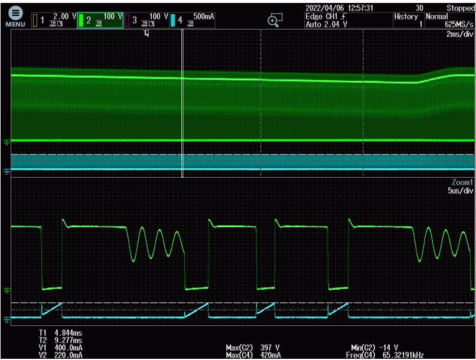

176 VAC

${ \mathsf { C H } } 2 { \mathsf { V } } _ { \mathsf { D S } }$  
$C H 4 1 _ { \mathsf { D } }$ $\mathtt { V } _ { \mathtt { D S } } mathtt { = } 3 9 7 \mathtt { V }$ IMAX= 420 mA $\mathsf { I } _ { \mathsf { M A X } } { = } 4 2 0 \mathsf { m } \mathsf { A }$

Test Condition:  
➢ Full Load  
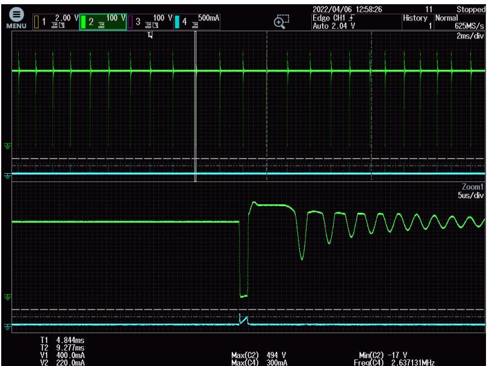

265 VAC

${ \mathsf { C H } } 2 \ { \mathsf { V } } _ { \mathsf { D S } }$  
$C H 4 1 _ { \mathsf { D } }$ $V _ { \mathsf { D } \mathsf { S } } { = } 4 9 4 \mathsf { V }$ IMAX=300 mA $\mathsf { I } _ { \mathsf { M A X } } { = } 3 0 0 \mathsf { m } \mathsf { A }$

Test Condition:  
➢ No Load  
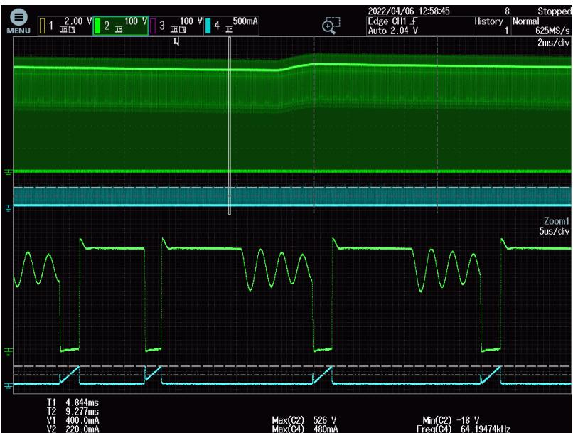

$2 6 5 \ : \mathsf { V } _ { \mathsf { A C } }$

${ \mathsf { C H } } 2 { \mathsf { V } } _ { \mathsf { D S } }$  
$C H 4 1 _ { \mathsf { D } }$ $V _ { \mathsf { D S } } { = } 5 2 6 \ V$ IMAX=480 mA $\mathsf { I } _ { \mathsf { M A X } } { = } 4 8 0 \mathsf { m } \mathsf { A }$

Test Condition:

➢ Full Load

## 输出二极管电压波形

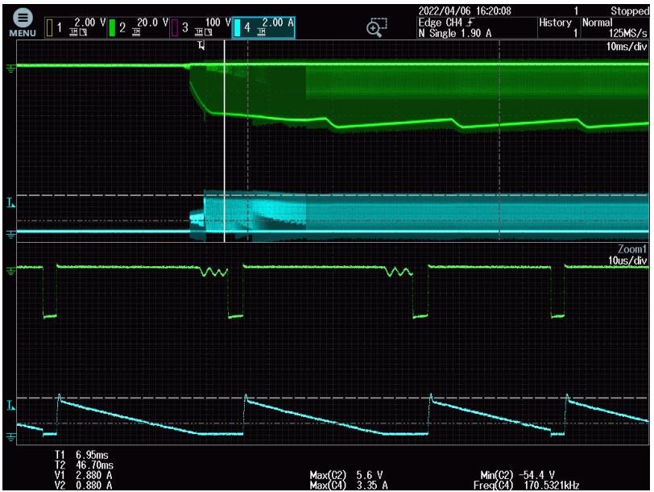

176 VAC

$C H 2 V _ { \mathsf { D } }$  
$C H 4 1 _ { \mathsf { D } }$ $\mathtt { V } _ { \mathtt { D } } { = } 5 4 . 4 \mathtt { V }$ $\mathsf { I } _ { \mathsf { D } } { = } 3 . 3 5 \mathsf { A }$

## Test Condition:

➢ Full Load  
➢ 开机

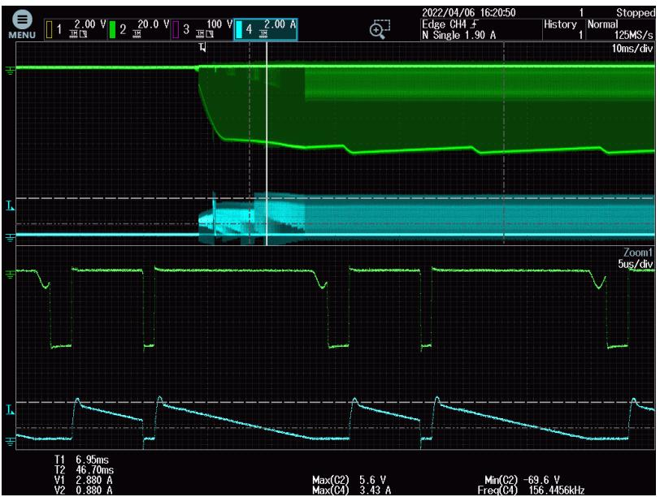

265 VAC

CH2 ${ \mathsf { V } } _ { \mathsf { D } }$  
CH4 ${ \sf I } _ { \sf D }$ $V _ { \mathsf { D } } { = } 6 9 . 6 \ V$ $\mathsf { I } _ { \mathsf { D } } { = } 3 . 4 3 \mathsf { A }$

## Test Condition:

➢ Full Load  
➢ 开机

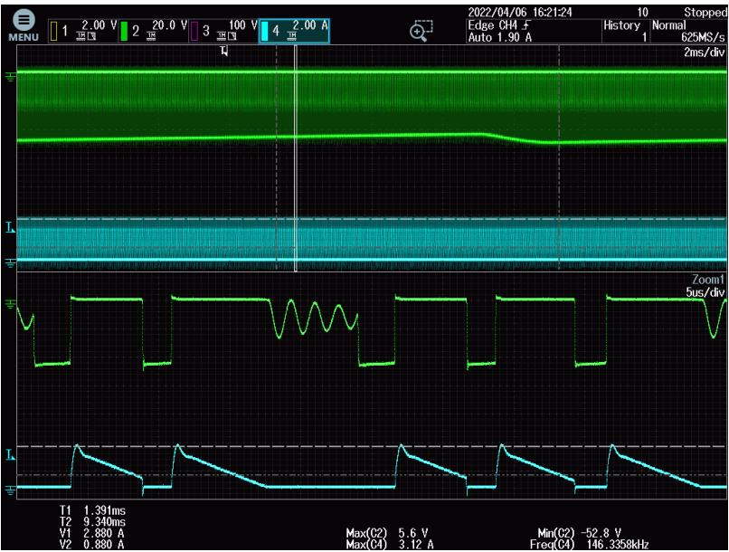

176 VAC

$C H 2 V _ { \mathsf { D } }$  
$C H 4 1 _ { \mathsf { D } }$ $\mathtt { V } _ { \mathtt { D } } mathtt { = } 5 2 . 8 \ V$ $\mathsf { I } _ { \mathsf { D } } { = } 3 . 1 2 \mathsf { A }$

## Test Condition:

➢ Full Load

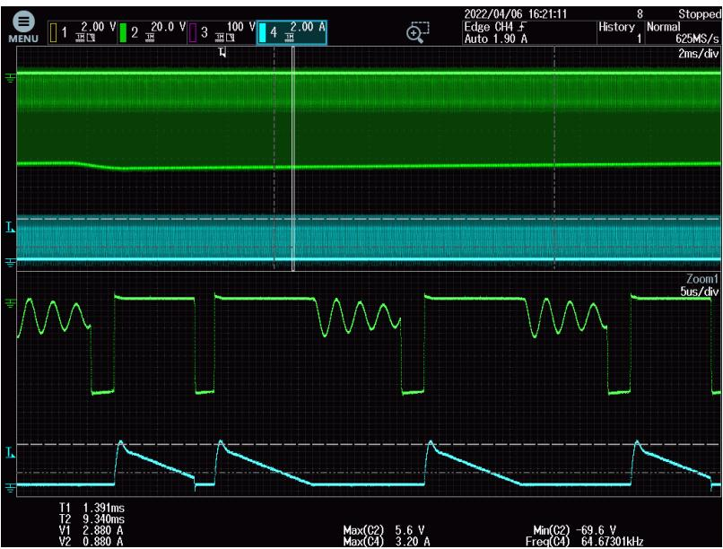

265 VAC

$C H 2 V _ { \mathsf { D } }$  
CH4 ID $C H 4 1 _ { \mathsf { D } }$ $V _ { \mathsf { D } } { = } 6 9 . 6 \ V$ $\mathsf { I } _ { \mathsf { D } } 3 . 2 \mathsf { A }$

## Test Condition:

➢ Full Load

## 输出短路时MOs和二极管波形

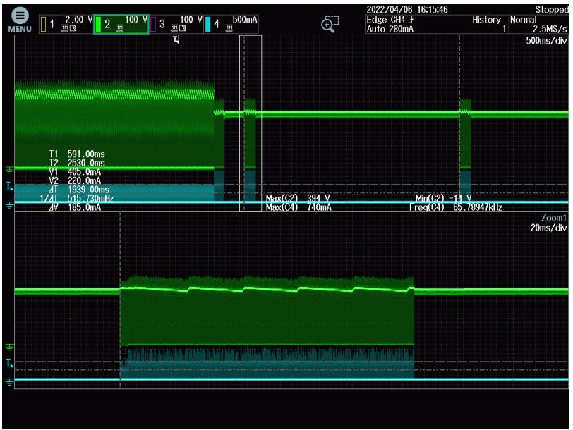

176 VAC

CH2 VDS  
CH4 ID $\begin{array} { r } { V _ { \mathsf { D S \_ m a x } } = 3 9 4 \ V } \\ { \mathsf { I _ { D S \_ m a x } } = 0 . 7 4 \ A } \end{array}$

## MOS

## Test Condition:

➢ Full Load

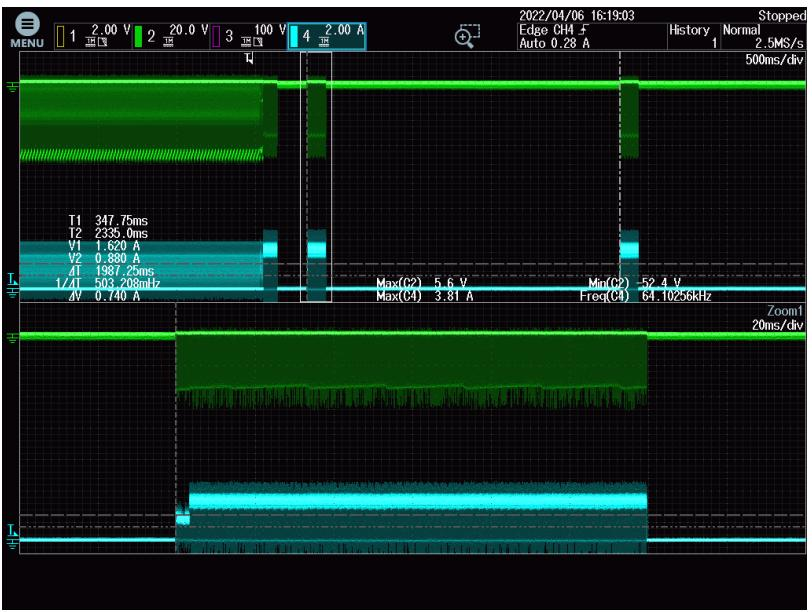

176 VAC

CH2 VD  
CH4 ID $\begin{array} { r l } & { \mathsf { V } _ { \mathsf { D \_ m a x } } = 5 2 . 4 \mathsf { V } } \\ & { \mathsf { I } _ { \mathsf { D \_ m a x } } = 3 . 8 1 \mathsf { A } } \end{array}$ VD max

## 二极管

## Test Condition:

➢ Full Load

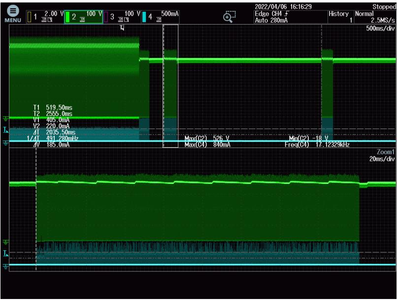

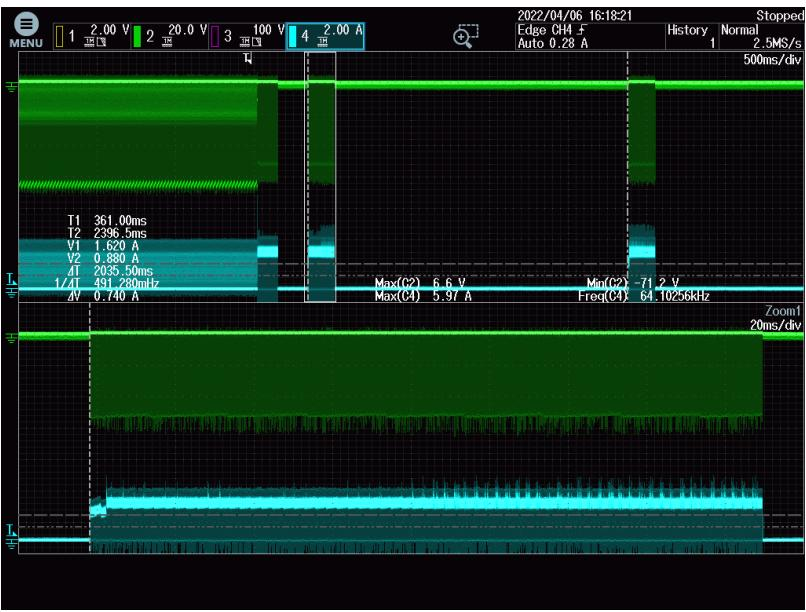

## 265 VAC

CH2 VDS  
CH4 ID $\begin{array} { r } { V _ { \mathsf { D S \_ m a x } } = 5 2 6 \ V } \\ { \mathsf { I _ { D S \_ m a x } } = 0 . 8 4 \ A } \end{array}$

## MOS

## Test Condition:

➢ Full Load

## 265 VAC

CH2 VD  
CH4 ID $\begin{array} { r l } & { \mathsf { V } _ { \mathsf { D \_ m a x } } = 7 1 . 2 \mathsf { V } } \\ & { \mathsf { I } _ { \mathsf { D \_ m a x } } = 5 . 9 7 \mathsf { A } } \end{array}$

## 二极管

## Test Condition:

➢ Full Load

## 输入过压保护及恢复波形

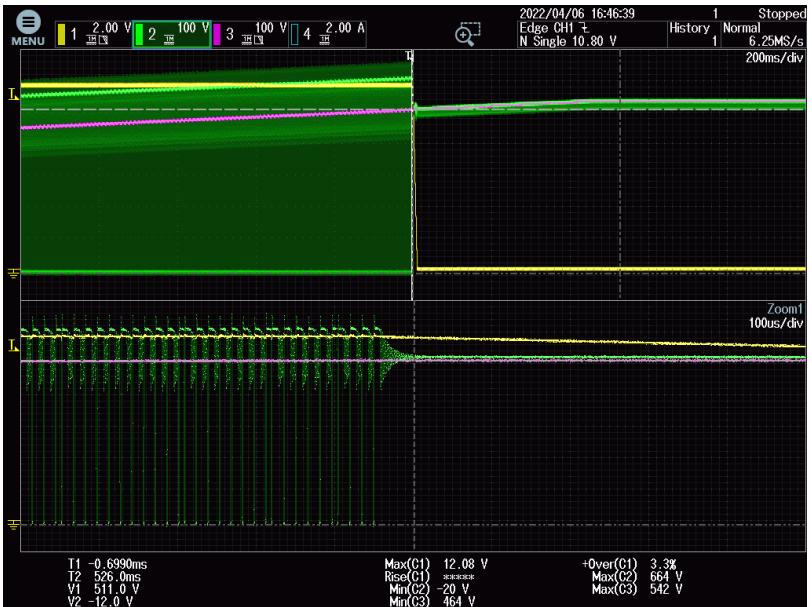

## 输入过压

CH1 ${ \sf V } _ { 0 }$  
CH2 $\mathsf { V } _ { \mathrm { d } s }$  
CH3 VIN\_DC $\mathsf { V } _ { \mathsf { I N \_ D C } }$ $\mathsf { V } _ { \mathsf { D } \mathsf { S } \_ \mathsf { m a x } } \bar { = } 6 6 4 \mathsf { V }$ $\mathsf { V } _ { \mathsf { I N \_ D C } } = \mathsf { E } \mathsf { 1 } \mathsf { 1 } \mathsf { V }$

## Test Condition:

➢ Full Load

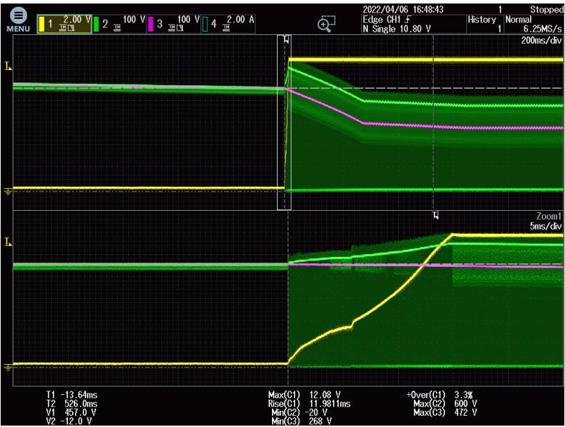

## 过压恢复

CH1 VIN\_DC  
${ \mathsf { C H } } 2 { \mathsf { V } } _ { \mathsf { d s } }$  
CH3 ${ \sf V } _ { 0 }$

$$
V _ {I N \_ D C} = 4 5 7 \mathrm{V}
$$

## Test Condition:

➢ Full Load

## 温升测试

<table><tr><td rowspan="2">项目</td><td colspan="3">温度(°C)</td></tr><tr><td>176VAC</td><td>230VAC</td><td>265VAC</td></tr><tr><td>环境温度</td><td>49.4</td><td>48.6</td><td>49.4</td></tr><tr><td>BPA8616D (U1)</td><td>110.3</td><td>110.3</td><td>111.9</td></tr><tr><td>S320F (D4)</td><td>99</td><td>81</td><td>81.9</td></tr><tr><td>变压器绕组(T1)</td><td>89.5</td><td>89.9</td><td>91.4</td></tr><tr><td>变压器磁芯(T1)</td><td>83.3</td><td>83.9</td><td>85</td></tr><tr><td>输入电解电容(EC2)</td><td>64.1</td><td>62.7</td><td>62.5</td></tr><tr><td>输出电解电容(EC3)</td><td>78.6</td><td>78.6</td><td>79.3</td></tr><tr><td>保险丝电阻(F1)</td><td>69.6</td><td>63.2</td><td>61.1</td></tr></table>

## 测试说明

➢ 在温箱中进行测试  
➢ 电路板放在一个封闭的盒子内  
➢ 热电偶连接到各个测量点  
➢ 等测量点温度达到稳定后记录数据

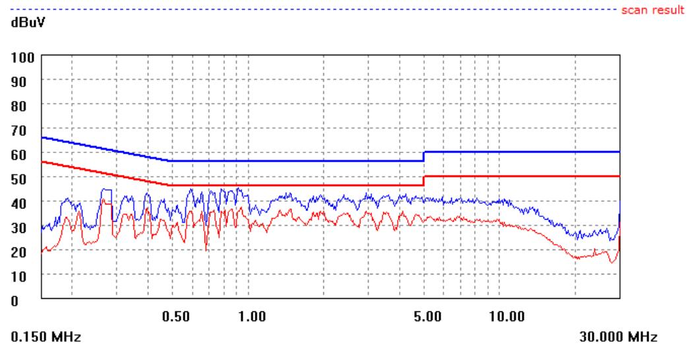

230VAC Line

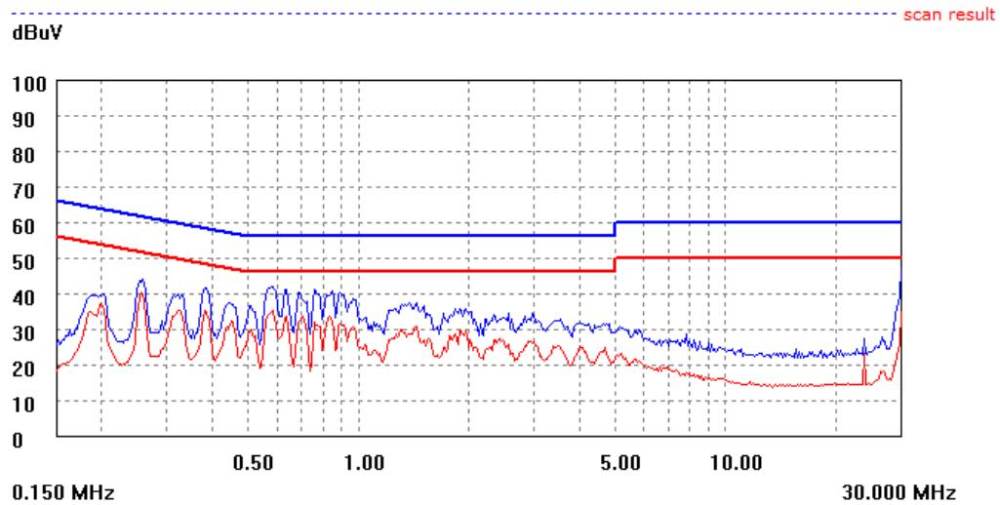

230VAC Neutral

<table><tr><td>差模</td><td>电压</td><td>相位角</td><td>发生器阻抗</td><td>测试次数</td><td>测试结果</td></tr><tr><td>L to N</td><td>+2kV</td><td>0</td><td>2</td><td>10</td><td>Pass</td></tr><tr><td>L to N</td><td>-2kV</td><td>0</td><td>2</td><td>10</td><td>Pass</td></tr><tr><td>L to N</td><td>+2kV</td><td>90</td><td>2</td><td>10</td><td>Pass</td></tr><tr><td>L to N</td><td>-2kV</td><td>90</td><td>2</td><td>10</td><td>Pass</td></tr><tr><td>L to N</td><td>+2kV</td><td>180</td><td>2</td><td>10</td><td>Pass</td></tr><tr><td>L to N</td><td>-2kV</td><td>180</td><td>2</td><td>10</td><td>Pass</td></tr><tr><td>L to N</td><td>+2kV</td><td>270</td><td>2</td><td>10</td><td>Pass</td></tr><tr><td>L to N</td><td>-2kV</td><td>270</td><td>2</td><td>10</td><td>Pass</td></tr></table>

## 测试说明

➢ 按照GB/T17626.5和IEC61000-4-5的最新版本要求进行测试  
➢ 室温环境，230VAC输入，满载条件  
➢ 输入1.2/50us组合波浪涌电压  
➢ 每个测试点重复10次  
➢ 每次间隔时间1分钟  
➢ 试验时样机输出正常（符合A类标准）视为Pass

<table><tr><td>测试点</td><td>电压(V)</td><td>放电类型</td><td>放电次数</td><td>测试结果</td></tr><tr><td>Vo</td><td>+15kV</td><td>空气放电</td><td>10</td><td>Pass</td></tr><tr><td>Vo</td><td>-15kV</td><td>空气放电</td><td>10</td><td>Pass</td></tr><tr><td>GND</td><td>+15kV</td><td>空气放电</td><td>10</td><td>Pass</td></tr><tr><td>GND</td><td>-15kV</td><td>空气放电</td><td>10</td><td>Pass</td></tr><tr><td>Vo</td><td>+8kV</td><td>接触放电</td><td>10</td><td>Pass</td></tr><tr><td>Vo</td><td>-8kV</td><td>接触放电</td><td>10</td><td>Pass</td></tr><tr><td>GND</td><td>+8kV</td><td>接触放电</td><td>10</td><td>Pass</td></tr><tr><td>GND</td><td>-8kV</td><td>接触放电</td><td>10</td><td>Pass</td></tr></table>

## 测试说明

➢ 按照GB/T17626.2和IEC61000-4-2的最新版本要求进行测试  
➢ 室温环境，230VAC输入满载条件  
➢ 每个测试点重复10次  
➢ 分别对输出正端和地进行空气放电  
➢ 试验时样机输出正常（符合A类标准）视为Pass

## THANK YOU FOR WATCHING
